# 第一章. GlassFish 入门

在本章中，我们将讨论如何开始使用 GlassFish。以下是本章讨论的一些主题：

+   Java EE 和 GlassFish 概述

+   获取 GlassFish

+   安装和启动 GlassFish

+   解释 GlassFish 域的概念

+   部署 Java EE 应用程序

+   设置数据库连接

# Java EE 和 GlassFish 概述

**Java 企业版**（**Java EE**，以前称为**J2EE**或**Java 2 企业版**）是一套用于服务器端 Java 开发的标准化技术。Java EE 技术包括**JavaServer Faces**（**JSF**）、**企业 JavaBeans**（**EJBs**）、**Java 消息服务**（**JMS**）、**Java 持久化 API**（**JPA**）、Java API for WebSocket、**上下文与依赖注入**（**CDI**）、**Java API for XML Web Services**（**JAX-WS**）、**Java API for RESTful Web Services**（**JAX-RS**）和**Java API for JSON Processing**（**JSON-P**）等。

存在着多个商业和开源应用服务器。Java EE 应用服务器允许开发者开发并部署 Java EE 兼容的应用程序，GlassFish 就是其中之一。其他开源 Java EE 应用服务器包括 Red Hat 的 WildFly（以前称为 JBoss）、Apache 软件基金会的 Geronimo 和 ObjectWeb 的 JOnAS。商业应用服务器包括 Oracle 的 WebLogic、IBM 的 WebSphere 和 Oracle 应用服务器。

GlassFish 是 Java EE 7 的参考实现；因此，它在市场上的任何其他应用服务器之前都实现了最新的 Java EE API。GlassFish 是开源的，并且可以免费获取，并且根据**通用开发与分发许可证**（**CDDL**）授权。

### 注意

您可以在[`opensource.org/licenses/CDDL-1.0`](http://opensource.org/licenses/CDDL-1.0)了解更多关于 CDDL 许可证的信息。

与所有 Java EE 兼容的应用服务器一样，GlassFish 提供了必要的库，使我们能够开发并部署符合 Java EE 规范的 Java 应用程序。

## Java EE 7 的新特性是什么？

Java EE 7 是 Java EE 规范的最新版本，它对该规范进行了多项改进和补充。以下各节列出了对规范的主要改进，这些改进对企业应用开发者来说很有兴趣：

### JavaServer Faces (JSF) 2.2

Java EE 7 包括**JavaServer Faces**（**JSF**）规范的最新版本。JSF 2.2 包括以下显著的新特性：

+   JSF 2.2 具有 HTML5 友好的标记，也就是说，可以使用标准的 HTML 5 标记和 HTML 标签上的 JSF 特定属性来编写网页。

+   JSF 2.2 还包括 Faces Flows，它提供了一种封装相关页面并定义入口和出口点的方法。

+   资源库合约是 JSF 2.2 中引入的第三个主要 JSF 特性。资源库合约使我们能够轻松开发具有不同外观和感觉的 Web 应用程序，这些外观和感觉适用于不同的用户。

### Java Persistence API (JPA) 2.1

JPA 被引入为 Java EE 规范第 5 版的标准部分。JPA 用作 Java EE 的标准对象关系映射框架，取代了实体 Bean。JPA 采用了来自第三方对象关系框架（如 Hibernate 和 JDO）的思想，并将它们作为标准的一部分。

JPA 2.1 引入了以下新特性：

+   JPA 2.1 引入了 **转换器** 的概念，它允许在数据库中存储的值和 Java 对象中存储的值之间进行自定义代码转换。例如，当处理数据库数据时，Java 代码中期望的值与数据库中存储的值通常不同。例如，值 `1` 和 `0` 常常存储在数据库中以表示 `true` 和 `false`。Java 有一个非常好的布尔类型，因此可以直接使用 `true` 和 `false`。

+   JPA 查询 API 现在可以执行批量更新和删除。

+   JPA 2.1 现在支持存储过程。

+   JPA 2.1 引入了 `@ConstructorResult` 注解，它允许从原生 SQL 查询中返回标准的 Java 类（但不是 JPA 实体）。

### Java API for RESTful Web Services (JAX-RS) 2.0

JAX-RS 是一个用于开发 RESTful 网络服务的 Java API。RESTful 网络服务使用 **表示状态转换**（**REST**）架构。Java EE 6 将 JAX-RS 作为 Java EE 规范的官方部分。

JAX-RS 2.0 包含以下新特性：

+   JAX-RS 2.0 引入了一个新的客户端 API。虽然之前的 JAX-RS 版本使得开发 RESTful 网络服务变得容易，但每个实现都定义了自己的专有客户端 API。

+   扩展点、方法过滤器和实体拦截器也被引入到 JAX-RS 2.0 中。这些特性允许在开发 RESTful 网络服务时进行 **面向方面编程**（**AOP**）。

+   JAX-RS 2.0 还在服务器端和客户端 API 中引入了异步处理。

### Java Message Service (JMS) 2.0

在 Java EE 7 中，**Java 消息服务**（**JMS**）API 已完全重写。之前的 JMS 版本需要大量的样板代码；使用新的重写的 JMS 2.0 API，这种情况不再存在。

### Java API for JSON Processing (JSON-P) 1.0

JSON-P 是 Java EE 7 中引入的一个全新的 API。JSON-P 允许我们解析和生成 **JSON**（**JavaScript 对象表示法**）字符串。

### Java API for WebSocket 1.0

传统的 Web 应用程序使用请求-响应模型，即客户端（通常是 Web 浏览器）请求资源，服务器提供响应。在这个模型中，通信始终由客户端发起。

WebSocket 作为 HTML5 规范的一部分被引入；它们在客户端和服务器之间提供全双工通信。

## GlassFish 优势

在 Java EE 应用服务器中有这么多选项，为什么选择 GlassFish？除了 GlassFish 免费提供的明显优势外，它还提供以下好处：

+   **Java EE 参考实现**：GlassFish 是 Java EE 参考实现。这意味着其他应用服务器可能使用 GlassFish 来确保其产品符合规范。理论上，GlassFish 可以用来调试其他应用服务器。如果一个在另一个应用服务器上部署的应用程序表现不正常，但在 GlassFish 上部署时表现正常，那么很可能是不正常行为是由于其他应用服务器中的错误。

+   **支持 Java EE 规范的最新版本**：由于 GlassFish 是参考 Java EE 规范，它通常在市场上任何其他应用服务器之前实现最新规范。事实上，在撰写本文时，GlassFish 是市场上唯一支持完整 Java EE 7 规范的应用服务器。

# 获取 GlassFish

GlassFish 可以从[`glassfish.java.net`](https://glassfish.java.net)下载。

### 注意

GlassFish 4.0 也捆绑了 7.4 或更新的 NetBeans IDE 版本。

一旦到达那里，你将看到一个如下截图所示的窗口：

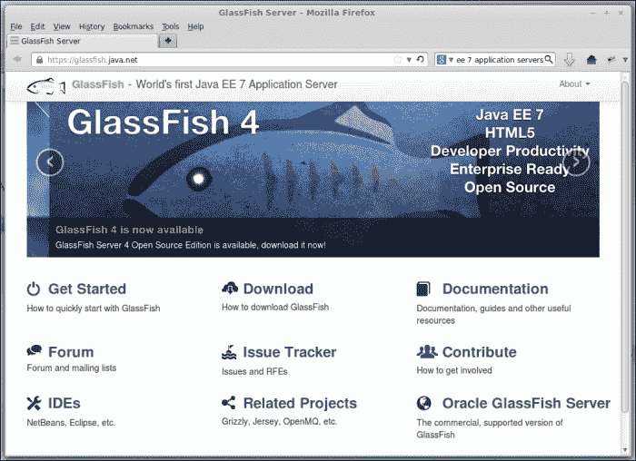

点击**下载**链接将带我们到一个提供多个选项的向导页面，以下载 GlassFish，如下截图所示：

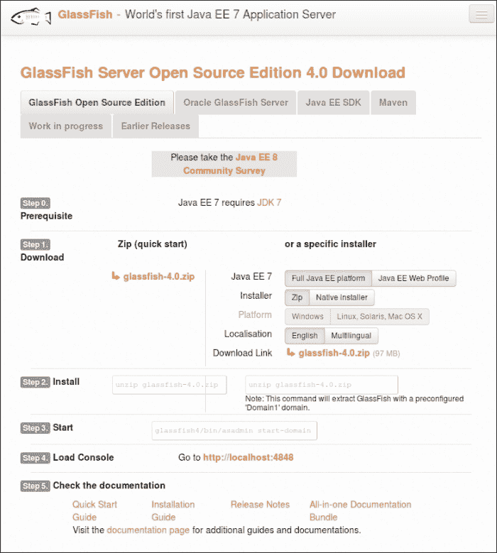

下载页面有多个选项；我们可以获取完整的 Java EE 平台或 Web 配置文件。我们还可以下载 GlassFish 作为压缩的 ZIP 文件或作为我们选择的操作系统的本地安装程序。

为了能够跟随本书中的所有示例，我们需要下载 GlassFish 的完整 Java EE 平台版本。我们将下载压缩的 ZIP 文件版本，因为安装说明在所有操作系统上都非常相似；如果您更喜欢，可以自由下载特定平台的安装程序。

# 安装 GlassFish

我们将使用 ZIP 安装程序来演示安装过程。此安装过程适用于所有主流操作系统。

安装 GlassFish 是一个简单的过程；然而，GlassFish 假设您的系统中存在某些依赖项。

## GlassFish 依赖项

为了安装 GlassFish 4，必须在您的工作站上安装一个较新的**Java 开发工具包**（**JDK**）（需要 JDK 1.7 或更高版本），并且 Java 可执行文件必须在您的系统 PATH 中。最新的 JDK 可以从 [`www.oracle.com/technetwork/java/javase/downloads/index.html`](http://www.oracle.com/technetwork/java/javase/downloads/index.html) 下载。请参考 [`docs.oracle.com/javase/7/docs/webnotes/install/index.html`](http://docs.oracle.com/javase/7/docs/webnotes/install/index.html) 中您特定平台的 JDK 安装说明。

## 执行安装

一旦安装了 JDK，就可以通过以下截图所示简单地提取下载的压缩文件来开始 GlassFish 的安装：

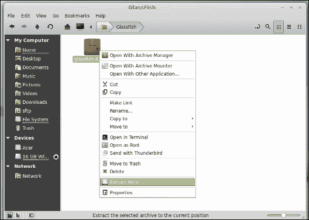

### 注意

所有现代操作系统，包括 Linux、Windows 和 Mac OS X，都自带了提取压缩 ZIP 文件的支持；有关详细信息，请参阅您的操作系统文档。

解压 ZIP 文件后，将创建一个名为`glassfish4`的新目录。这个新目录包含我们的 GlassFish 安装。

# 启动 GlassFish

要从命令行启动 GlassFish，请将您的目录更改为 `[glassfish 安装目录]/glassfish4/bin` 并执行以下命令：

```java
./asadmin start-domain domain1

```

### 注意

前面的命令以及本章中显示的大多数命令都假设使用 Unix 或 Unix-like 操作系统，如 Linux 或 Mac OS。对于 Windows 系统，初始的`./`是不必要的。

在执行前面的命令后不久，我们应该在终端底部看到类似以下的消息：

```java
$ ~/GlassFish/glassfish4/bin $ ./asadmin start-domain
Waiting for domain1 to start ........
Successfully started the domain : domain1
domain  Location: /home/heffel/GlassFish/glassfish4/glassfish/domains/domain1
Log File: /home/heffel/GlassFish/glassfish4/glassfish/domains/domain1/logs/server.log
Admin Port: 4848
Command start-domain executed successfully.

```

### 小贴士

**下载示例代码**

您可以从您在 [`www.packtpub.com`](http://www.packtpub.com) 的账户中下载您购买的所有 Packt 书籍的示例代码文件。如果您在其他地方购买了这本书，您可以访问 [`www.packtpub.com/support`](http://www.packtpub.com/support) 并注册，以便将文件直接通过电子邮件发送给您。

然后，我们可以打开一个浏览器窗口，并在浏览器地址栏中输入以下 URL：

`http://localhost:8080`

如果一切顺利，我们应该看到一个页面，表明您的 GlassFish 服务器现在正在运行，如下面的屏幕截图所示：

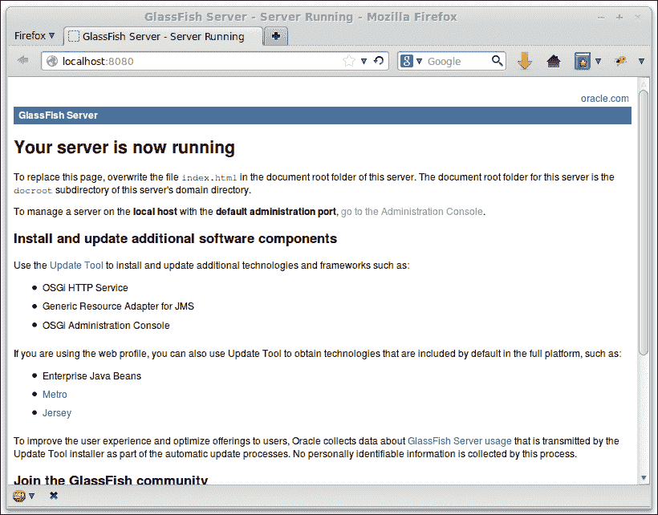

### 小贴士

**获取帮助**

如果前面的任何步骤失败或需要关于 GlassFish 的一般帮助，一个很好的资源是 GlassFish 论坛 [`www.java.net/forums/glassfish/glassfish`](https://www.java.net/forums/glassfish/glassfish)。

## 部署我们的第一个 Java EE 应用程序

为了进一步确认我们的 GlassFish 安装运行正常，我们将部署一个**WAR**（**Web ARchive**）文件，并确保文件能够正确部署和执行。在继续之前，请从本书的网站 [www.packtpub.com](http://www.packtpub.com) 下载文件 `simpleapp.war`。

### 通过 Web 控制台部署应用程序

要部署`simpleapp.war`，打开浏览器并导航到`http://localhost:4848`。你应该会看到默认的 GlassFish 服务器管理页面，如下面的截图所示：

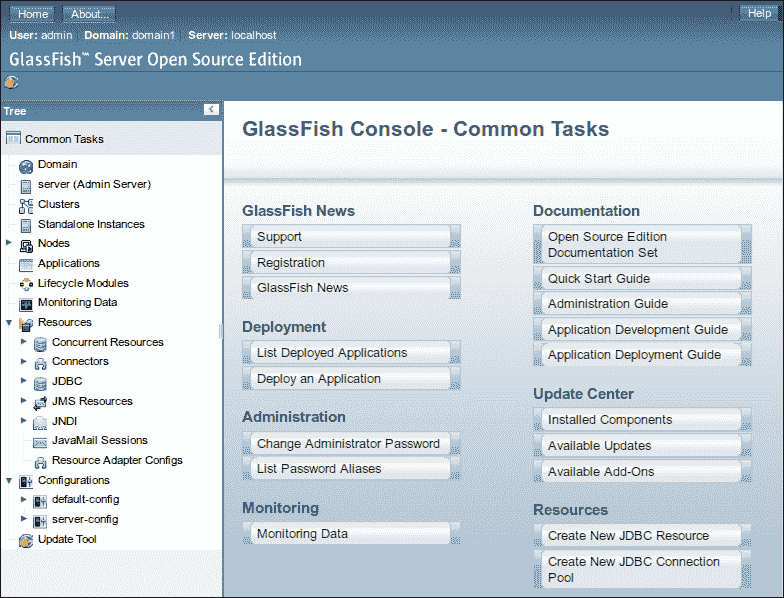

默认情况下，GlassFish 以开发模式安装。在这种模式下，访问 GlassFish 网络控制台不需要输入用户名和密码。在生产环境中，强烈建议配置网络控制台，使其受密码保护。

在这一点上，我们应该点击主屏幕下**部署**部分中的**部署应用程序**项。

要部署我们的应用程序，我们应该选择**从 GlassFish 服务器可访问的本地打包文件或目录**单选按钮，并输入我们的 WAR 文件的路径或通过点击**浏览文件...**按钮选择它。一旦完成，你将看到一个窗口，如下面的截图所示：

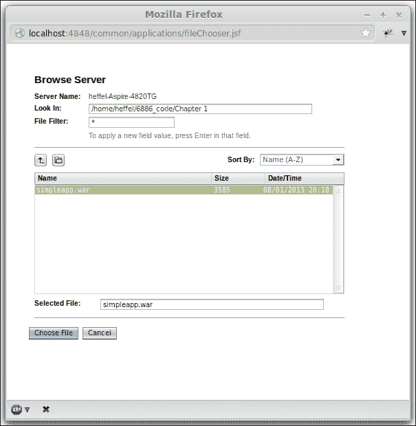

在我们选择了我们的 WAR 文件后，会显示一些输入字段，允许我们指定几个选项。对于我们的目的，所有默认值都很好。我们只需简单地点击页面右上角的**确定**按钮，如下面的截图所示：

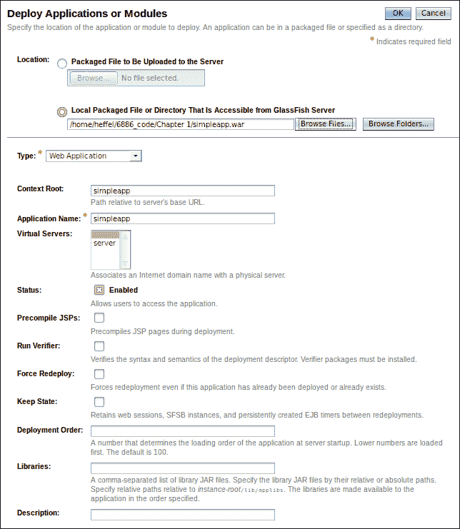

一旦我们部署了应用程序，GlassFish 网络控制台将显示**应用程序**窗口，我们的应用程序作为已部署应用程序之一列出，如下面的截图所示：

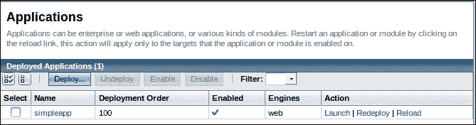

要执行`simpleapp`应用程序，在浏览器地址栏中输入以下 URL：

`http://localhost:8080/simpleapp/simpleservlet`

生成的页面应如下面的截图所示：

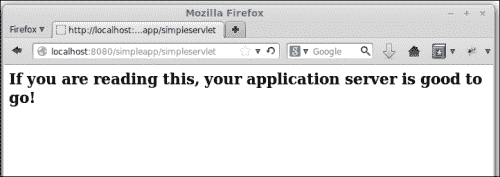

就这样！我们已经成功部署了我们的第一个 Java EE 应用程序。

### 通过 GlassFish 管理控制台卸载应用程序

要卸载我们刚刚部署的应用程序，通过在浏览器中输入以下 URL 登录到 GlassFish 管理控制台：

`http://localhost:4848`

然后，要么在左侧导航面板中点击**应用程序**菜单项，要么在管理控制台主页上点击**列出已部署应用程序**项。

无论哪种方式，都应带我们到应用程序管理页面，如下面的截图所示：


应用程序可以通过简单地从已部署应用程序列表中选择`simpleapp`名称旁边的复选框，然后点击列表上方的**卸载**按钮来卸载。

一旦我们的应用程序被卸载，它将不再显示在应用程序管理页面上，如下面的截图所示：

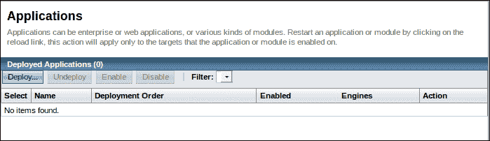

### 通过命令行部署应用程序

前面的命令必须在`[glassfish 安装目录]/glassfish4/bin`路径下执行。

#### `asadmin`可执行文件也可以通过发出如下命令来卸载应用程序：

现在我们已经卸载了`simpleapp`WAR 文件，我们准备使用命令行来部署它。要以这种方式部署应用程序，只需将`simpleapp.war`复制到`[glassfish 安装目录]/glassfish4/glassfish/domains/domain1/autodeploy`。只需将文件复制到该目录，应用程序就会自动部署。

我们可以通过查看服务器日志来验证应用程序是否已成功部署。可以通过输入`[glassfish 安装目录]/glassfish4/glassfish/domains/domain1/logs/server.log`来找到服务器日志。该文件上的最后几行应该看起来像以下内容：

```java
[2013-08-02T10:57:45.387-0400] [glassfish 4.0] [INFO] [NCLS-DEPLOYMENT-00027] [javax.enterprise.system.tools.deployment.autodeploy] [tid: _ThreadID=91 _ThreadName=AutoDeployer] [timeMillis: 1375455465387] [levelValue: 800] [[

 Selecting file /home/heffel/GlassFish/glassfish4/glassfish/domains/domain1/autodeploy/simpleapp.war for autodeployment]]

[2013-08-02T10:57:45.490-0400] [glassfish 4.0] [INFO] [] [javax.enterprise.system.tools.deployment.common] [tid: _ThreadID=91 _ThreadName=AutoDeployer] [timeMillis: 1375455465490] [levelValue: 800] [[

 visiting unvisited references]]

[2013-08-02T10:57:45.628-0400] [glassfish 4.0] [INFO] [AS-WEB-GLUE-00172] [javax.enterprise.web] [tid: _ThreadID=91 _ThreadName=AutoDeployer] [timeMillis: 1375455465628] [levelValue: 800] [[

 Loading application [simpleapp] at [/simpleapp]]]

[2013-08-02T10:57:45.714-0400] [glassfish 4.0] [INFO] [] [javax.enterprise.system.core] [tid: _ThreadID=91 _ThreadName=AutoDeployer] [timeMillis: 1375455465714] [levelValue: 800] [[

 simpleapp was successfully deployed in 302 milliseconds.]]

[2013-08-02T10:57:45.723-0400] [glassfish 4.0] [INFO] [NCLS-DEPLOYMENT-00035] [javax.enterprise.system.tools.deployment.autodeploy] [tid: _ThreadID=91 _ThreadName=AutoDeployer] [timeMillis: 1375455465723] [levelValue: 800] [[

 [AutoDeploy] Successfully autodeployed : /home/heffel/GlassFish/glassfish4/glassfish/domains/domain1/autodeploy/simpleapp.war.]]

```

我们当然也可以通过导航到与通过 Web 控制台部署时相同的 URL 来验证部署：`http://localhost:8080/simpleapp/simpleservlet`。

一旦到达这里，应用程序应该能够正确执行。

以这种方式部署的应用程序可以通过简单地从`autodeploy`目录中删除工件（在我们的例子中是 WAR 文件）来卸载。删除文件后，我们应该在服务器日志中看到类似于以下的消息：

```java
[2013-08-02T11:01:57.410-0400] [glassfish 4.0] [INFO] [NCLS-DEPLOYMENT-00026] [javax.enterprise.system.tools.deployment.autodeploy] [tid: _ThreadID=91 _ThreadName=AutoDeployer] [timeMillis: 1375455717410] [levelValue: 800] [[

 Autoundeploying application:  simpleapp]]

[2013-08-02T11:01:57.475-0400] [glassfish 4.0] [INFO] [NCLS-DEPLOYMENT-00035] [javax.enterprise.system.tools.deployment.autodeploy] [tid: _ThreadID=91 _ThreadName=AutoDeployer] [timeMillis: 1375455717475] [levelValue: 800] [[

 [AutoDeploy] Successfully autoundeployed : /home/heffel/GlassFish/glassfish4/glassfish/domains/domain1/autodeploy/simpleapp.war.]]

```

#### asadmin 命令行实用程序

通过命令行部署应用程序的另一种方法是使用以下命令：

```java
asadmin deploy [path to file]/simpleapp.war

```

### 注意

前面的命令必须在`[glassfish 安装目录]/glassfish4/bin`路径下执行。

我们应该在命令行终端看到以下确认信息，以告知我们文件已成功部署：

```java
Application deployed with name simpleapp.

Command deploy executed successfully.

```

服务器日志文件应显示类似于以下的消息：

```java
[2013-08-02T11:05:34.583-0400] [glassfish 4.0] [INFO] [AS-WEB-GLUE-00172] [javax.enterprise.web] [tid: _ThreadID=37 _ThreadName=admin-listener(5)] [timeMillis: 1375455934583] [levelValue: 800] [[

 Loading application [simpleapp] at [/simpleapp]]]

[2013-08-02T11:05:34.608-0400] [glassfish 4.0] [INFO] [] [javax.enterprise.system.core] [tid: _ThreadID=37 _ThreadName=admin-listener(5)] [timeMillis: 1375455934608] [levelValue: 800] [[

 simpleapp was successfully deployed in 202 milliseconds.]]

```

可以使用`asadmin`可执行文件通过发出类似以下命令来卸载应用程序：

```java
asadmin undeploy simpleapp

```

以下消息应在终端窗口的底部显示：

```java
Command undeploy executed successfully.

```

请注意，文件扩展名不用于卸载应用程序，`asadmin undeploy`的参数应该是应用程序名称，默认情况下是 WAR 文件名（不带扩展名）。

# 通过命令行部署应用程序有两种方式——可以通过将我们要部署的工件复制到`autodeploy`目录，或者使用 GlassFish 的`asadmin`命令行实用程序来完成。

警惕的读者可能已经注意到`autodeploy`目录位于`domains/domain1`子目录下。GlassFish 有一个域的概念。域允许将相关应用程序一起部署。可以同时启动多个域。GlassFish 域的行为类似于单独的 GlassFish 实例；在安装 GlassFish 时，会创建一个默认域，称为`domain1`。

## 创建域

可以通过在命令行中发出以下命令来从命令行创建额外的域：

```java
asadmin create-domain domainname

```

上述命令接受多个参数来指定域名将监听的服务（HTTP、Admin、JMS、IIOP、Secure HTTP 等）的端口号。在命令行中输入以下命令以查看这些参数：

```java
asadmin create-domain --help

```

如果我们想在同一服务器上同时运行多个域名，这些端口号必须仔细选择，因为为不同的服务（或甚至跨域的相同服务）指定相同的端口号将阻止其中一个域名正常工作。

默认`domain1`域名的默认端口号列在以下表中：

| 服务 | 端口号 |
| --- | --- |
| Admin | 4848 |
| HTTP | 8080 |
| Java Messaging System (JMS) | 7676 |
| Internet Inter-ORB Protocol (IIOP) | 3700 |
| Secure HTTP (HTTPS) | 8181 |
| Secure IIOP | 3820 |
| Mutual Authorization IIOP | 3920 |
| Java Management Extensions (JMX) administration | 8686 |

请注意，在创建域名时，只需指定管理端口号。如果未指定其他端口号，将使用前面表中列出的默认端口号。在创建域名时必须小心，因为如上所述，如果任何服务在相同的端口上监听连接，则同一服务器上的两个域名不能同时运行。

创建域名的另一种方法，无需为每个服务指定端口号，是执行以下命令：

```java
asadmin create-domain --portbase [port number] domainname

```

`--portbase`参数的值决定了域名的基准端口号；不同服务的端口号将是给定端口号的偏移量。以下表列出了分配给所有不同服务的端口号：

| 服务 | 端口号 |
| --- | --- |
| Admin | 端口号 + 48 |
| HTTP | 端口号 + 80 |
| Java Messaging System (JMS) | 端口号 + 76 |
| Internet Inter-ORB Protocol (IIOP) | 端口号 + 37 |
| Secure HTTP (HTTPS) | 端口号 + 81 |
| Secure IIOP | 端口号 + 38 |
| Mutual Authorization IIOP | 端口号 + 39 |
| Java Management Extensions (JMX) administration | 端口号 + 86 |

当然，在为`--portbase`选择值时必须小心，确保分配的端口号不会与其他任何域名冲突。

### 小贴士

通常情况下，使用大于 8000 且能被 1000 整除的端口号创建域名，应该能创建出不会相互冲突的域名。例如，使用端口号 9000 创建一个域名，另一个使用端口号 10000，依此类推，应该是安全的。

## 删除域名

删除域名非常简单。可以通过在命令行中执行以下命令来完成：

```java
asadmin delete-domain domainname

```

我们应该在终端窗口看到以下信息：

```java
Command delete-domain executed successfully.

```

### 小贴士

请谨慎使用上述命令。一旦删除了域名，它就不能轻易地被重新创建（所有已部署的应用程序以及任何连接池、数据源等都将消失）。

## 停止域名

可以通过执行以下命令来停止正在运行的域名：

```java
asadmin stop-domain domainname

```

上述命令将停止名为`domainname`的域名。

如果只有一个域正在运行，则`domainname`参数是可选的，也就是说，我们可以简单地通过以下命令停止正在运行的域：

```java
asadmin stop-domain

```

### 注意

本书将假设读者正在使用默认域`domain1`和默认端口进行工作。如果不是这种情况，给出的说明需要修改以匹配适当的域和端口。

# 设置数据库连接

任何非平凡的 Java EE 应用程序都将连接到**关系数据库管理系统**（**RDBMS**）。支持的 RDBMS 系统包括 Java DB、Oracle、Derby、Sybase、DB2、PointBase、MySQL、PostgreSQL、Informix、Cloudscape 和 SQL Server。在本节中，我们将演示如何设置 GlassFish 与 MySQL 数据库通信。对于其他 RDBMS 系统，该过程类似。

### 注意

GlassFish 附带一个名为 JavaDB 的 RDBMS。这个 RDBMS 基于 Apache Derby。为了限制本书代码所需的下载和配置，所有需要 RDBMS 的示例都将使用捆绑的 JavaDB RDBMS。本节中的说明是为了说明如何将 GlassFish 连接到第三方 RDBMS。

## 设置连接池

打开和关闭数据库连接是一个相对缓慢的操作。出于性能考虑，GlassFish 和其他 Java EE 应用程序服务器会保持一个打开的数据库连接池；当部署的应用程序需要数据库连接时，就会从池中提供一个；当应用程序不再需要数据库连接时，该连接就会返回到池中。

设置连接池的第一步是复制包含我们 RDBMS JDBC 驱动的 JAR 文件到域的`lib`目录中（查阅你的 RDBMS 文档以获取有关获取此 JAR 文件的信息）。如果我们想添加连接池的 GlassFish 域在复制 JDBC 驱动程序时正在运行，则必须重新启动域以使更改生效。可以通过执行以下命令来重新启动域：

```java
 asadmin restart-domain domainname

```

一旦 JDBC 驱动程序已复制到适当的目录，并且应用程序服务器已重新启动，请通过将浏览器指向`http://localhost:4848`来登录管理控制台。

然后，导航到**资源** | **JDBC** | **JDBC 连接池**。浏览器现在应该类似于以下截图所示：

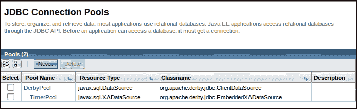

点击**新建...**按钮。在输入我们 RDBMS 的适当值后，页面主区域应类似于以下截图：

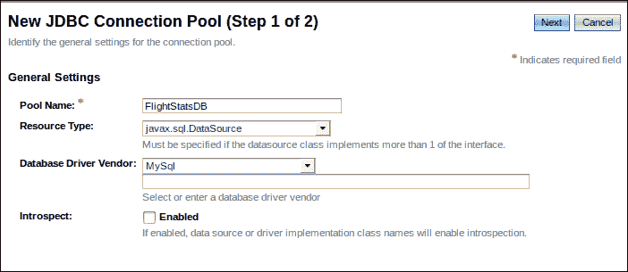

点击**下一步**按钮后，我们应该看到类似于以下截图的页面：

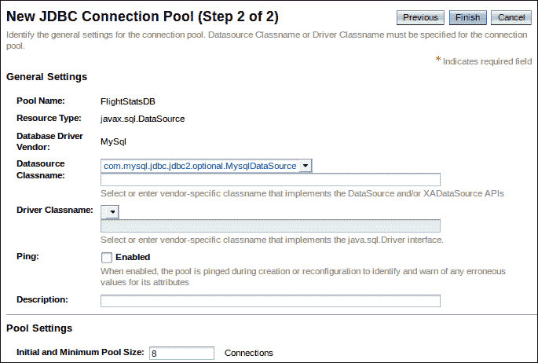

在前面截图显示的页面顶部大部分默认值都是合理的。滚动到页面底部，并输入我们 RDBMS（至少包括用户名、密码和 URL）的适当属性值。然后，点击屏幕右上角的**完成**按钮。

属性名称取决于我们使用的 RDBMS，但通常有一个 URL 属性，我们应该在其中输入数据库的 JDBC URL，以及用户名和密码属性，我们应该在其中输入数据库的认证凭据。

我们新创建的连接池现在应该可以在连接池列表中看到，如下面的截图所示：

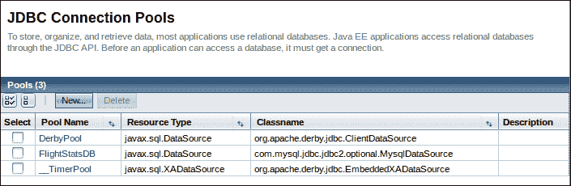

在某些情况下，在设置新的连接池后，可能需要重新启动 GlassFish 域。

我们可以通过点击其池名称，然后在结果页面上的**Ping**按钮上启用，来验证我们的连接池是否成功设置，如下面的截图所示：


我们的数据源现在已准备好供我们的应用程序使用。

## 设置数据源

Java EE 应用程序不直接访问连接池；它们通过数据源访问，该数据源指向连接池。要设置新的数据源，点击左侧网页控制台下的**资源**菜单项下的**JDBC**图标，然后点击**JDBC 连接池**选项卡，然后点击**新建...**按钮。填写我们新数据源的相关信息后，网页控制台的主要区域应该看起来像以下截图所示：

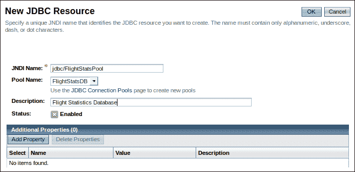

点击**确定**按钮后，我们可以在以下截图所示中看到我们新创建的数据源：


# 摘要

在本章中，我们讨论了如何下载和安装 GlassFish。我们还讨论了通过 GlassFish 网页控制台、通过`asadmin`命令以及通过将文件复制到`autodeploy`目录来部署 Java EE 应用程序的几种方法。我们还讨论了基本的 GlassFish 管理任务，如设置域和通过添加连接池和数据源来设置数据库连接。在下一章中，我们将介绍如何使用 JSF 开发 Web 应用程序。
