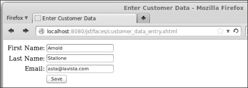

# 第二章 JavaServer Faces

在本章中，我们将介绍 Java EE 平台的标准组件框架 **JavaServer Faces**（**JSF**）。Java EE 7 包含了 JSF 2.2，这是 JSF 的最新版本。JSF 非常依赖于约定优于配置。如果我们遵循 JSF 约定，那么我们就不需要编写很多配置。在大多数情况下，我们甚至不需要编写任何配置。这一事实，加上 `web.xml` 自 Java EE 6 以来一直是可选的，意味着在许多情况下，我们可以编写完整的 Web 应用程序，而无需编写任何一行 XML 配置。

# JSF 简介

JSF 2.0 引入了许多增强功能，使得 JSF 应用程序开发更加容易。在接下来的几节中，我们将解释其中的一些特性。

### 注意

对于不熟悉 JSF 早期版本的读者来说，可能无法完全理解以下几节。不用担心，到本章结束时，一切都会非常清晰。

## Facelets

JSF 现代版本与早期版本之间一个明显的区别是，现在 Facelets 是首选的视图技术。JSF 的早期版本使用 JSP 作为它们的默认视图技术。由于 JSP 技术早于 JSF，有时使用 JSP 与 JSF 感觉不自然或产生问题。例如，JSP 的生命周期与 JSF 的生命周期不同；这种不匹配为 JSF 1.x 应用程序开发者引入了一些问题。

JSF 从一开始就被设计成支持多种视图技术。为了利用这一功能，Jacob Hookom 为 JSF 编写了一种特定的视图技术。他将自己的视图技术命名为 **Facelets**。Facelets 非常成功，以至于它成为了 JSF 的实际标准。JSF 专家组认识到 Facelets 的流行，并在 JSF 规范的 2.0 版本中将 Facelets 定为官方视图技术。

## 可选的 faces-config.xml

传统的 J2EE 应用程序遭受了一些人认为过度的 XML 配置。

Java EE 5 采取了一些措施来显著减少 XML 配置。Java EE 6 进一步减少了所需的配置，使得在 JSF 2.0 中 `faces-config.xml` JSF 配置文件成为可选的。

在 JSF 2.0 及更高版本中，可以通过 `@ManagedBean` 注解配置 JSF 管理器豆，从而无需在 `faces-config.xml` 中配置它们。Java EE 6 引入了 **上下文和依赖注入**（**CDI**）API，它提供了一种替代方法来实现通常使用 JSF 管理器豆实现的功能。截至 JSF 2.2，CDI 命名豆比 JSF 管理器豆更受欢迎。

此外，JSF 导航有一个约定。如果一个 JSF 2 命令链接或命令按钮的 `action` 属性值与 facelet（去掉 XHTML 扩展名）的名称匹配，那么按照约定，应用程序将导航到与动作名称匹配的 facelet。这个约定允许我们避免在 `faces-config.xml` 中配置应用程序的导航。

对于许多现代 JSF 应用程序，只要遵循已建立的 JSF 约定，`faces-config.xml` 就完全没有必要。

### 标准资源位置

JSF 2.0 引入了标准的资源位置。资源是页面或 JSF 组件需要正确渲染的工件，例如 CSS 样式表、JavaScript 文件和图像。

在 JSF 2.0 及更高版本中，资源可以放置在 `resources` 文件夹下的子目录中，这个文件夹位于 WAR 文件的根目录下或 `META-INF` 下。按照约定，JSF 组件知道它们可以从这两个位置之一检索资源。

为了避免资源目录杂乱，资源通常放置在子目录中。这个子目录通过 JSF 组件的 `library` 属性来引用。

例如，我们可以在 `/resources/css/` 下放置一个名为 `styles.css` 的 CSS 样式表。

在我们的 JSF 页面中，我们可以使用 `<h:outputStylesheet>` 标签来检索此 CSS 文件，如下所示：

```java
<h:outputStylesheet library="css"  name="styles.css"/>
```

`library` 属性的值必须与我们的样式表所在的子目录匹配。

同样，我们可以在 `/resources/scripts/` 下有一个名为 `somescript.js` 的 JavaScript 文件，并且我们可以使用以下代码来访问它：

```java
<h:outputScript library="scripts" name="somescript.js"/>
```

我们可以在 `/resources/images/` 下放置一个名为 `logo.png` 的图像，并且我们可以使用以下代码来访问这个资源：

```java
<h:graphicImage library="images" name="logo.png"/>
```

注意，在每种情况下，`library` 属性的值都与 `resources` 目录下的相应子目录名称匹配，而 `name` 属性的值与资源的文件名匹配。

# 开发我们的第一个 JSF 应用程序

为了说明基本的 JSF 概念，我们将开发一个简单的应用程序，该应用程序由两个 Facelets 页面和一个名为 CDI 的命名豆组成。

## Facelets

如我们在本章引言中提到的，JSF 2 的默认视图技术是 Facelets。Facelets 需要使用标准的 XML 编写。开发 Facelets 页面最流行的方式是结合使用 XHTML 和 JSF 特定的 XML 命名空间。以下示例显示了典型的 Facelets 页面看起来像什么：

```java
<?xml version='1.0' encoding='UTF-8' ?>
<!DOCTYPE html PUBLIC "-//W3C//DTD XHTML 1.0 Transitional//EN"
    "http://www.w3.org/TR/xhtml1/DTD/xhtml1-transitional.dtd">
<html 

 >
 <h:head>
        <title>Enter Customer Data</title>
 </h:head>
 <h:body>
 <h:outputStylesheet library="css" name="styles.css"/>
 <h:form id="customerForm">
 <h:messages></h:messages>
 <h:panelGrid columns="2"
 columnClasses="rightAlign,leftAlign">
 <h:outputLabel for="firstName" value="First 
 Name:">
 </h:outputLabel>
 <h:inputText id="firstName"
 label="First Name"
 value="#{customer.firstName}"
 required="true">
 <f:validateLength minimum="2" maximum="30">
 </f:validateLength>
 </h:inputText>
 <h:outputLabel for="lastName" value="Last Name:">
 </h:outputLabel>
 <h:inputText id="lastName"
 label="Last Name"
 value="#{customer.lastName}"
 required="true">
 <f:validateLength minimum="2" maximum="30">
 </f:validateLength>
 </h:inputText>
 <h:outputLabel for="email" value="Email:">
 </h:outputLabel>
 <h:inputText id="email" 
 label="Email" 
 value="#{customer.email}">
 <f:validateLength minimum="3" maximum="30">
 </f:validateLength>
 </h:inputText>
 <h:panelGroup></h:panelGroup>
 <h:commandButton action="confirmation" 
 value="Save">
 </h:commandButton>
 </h:panelGrid>
 </h:form>
 </h:body>
</html>
```

以下截图说明了我们的示例页面在浏览器中的渲染方式：



当然，前面的截图是在每个文本字段输入一些数据之后拍摄的；最初，每个文本字段都是空的。

几乎任何 Facelets JSF 页面都会包括示例中展示的两个命名空间。第一个命名空间（``）用于渲染 HTML 组件的标签；按照约定，当使用此标签库时，使用前缀 `h`（代表 HTML）。``

```java The second namespace (``) is the core JSF tag library; by convention, the prefix `f` (for faces) is used when using this tag library.`` ```

```java ``The first JSF-specific tags we see in our example are the `<h:head>` and the `<h:body>` tags. These tags are analogous to the standard HTML `<head>` and `<body>` tags and are rendered as such when the page is displayed in the browser.`` ```

```java ``The `<h:outputStylesheet>` tag is used to load a CSS style sheet from a well-known location. (JSF standardizes the locations of resources such as CSS style sheets and JavaScript files; this will be discussed in detail later in the chapter.) The value of the `library` attribute must correspond to the directory where the CSS file resides (this directory must be under a `resources` directory). The `name` attribute must correspond to the name of the CSS style sheet we wish to load.`` ```

```java ``The next tag that we see is the `<h:form>` tag. This tag generates an HTML form when the page is rendered. As can be seen in the example, there is no need to specify an `action` or a `method` attribute for this tag; as a matter of fact, there is neither an `action` attribute nor a `method` attribute for this tag. The `action` attribute for the rendered HTML form will be generated automatically, and the `method` attribute will always be `"post".` The `id` attribute of `<h:form>` is optional; however, it is a good idea to always add it since it makes debugging JSF applications easier.`` ```

```java ``The next tag we see is the `<h:messages>` tag. As its name implies, this tag is used to display any messages. As we will see shortly, JSF can automatically generate validation messages. These will be displayed inside this tag. Additionally, arbitrary messages can be added programmatically via the `addMessage()` method defined in `javax.faces.context.FacesContext`.`` ```

```java ``The next JSF tag we see is `<h:panelGrid>`. This tag is roughly equivalent to an HTML table, but it works a bit differently. Instead of declaring rows and columns, the `<h:panelGrid>` tag has a `columns` attribute; the value of this attribute indicates the number of columns in the table rendered by this tag. As we place components inside this tag, they will be placed in a row until the number of columns defined in the `columns` attribute is reached, and then the next component will be placed in the next row. In the example, the value of the `columns` attribute is two. Therefore, the first two tags will be placed in the first row, the next two will be placed in the second row, and so forth.`` ```

```java ``Another interesting attribute of `<h:panelGrid>` is the `columnClasses` attribute. This attribute assigns a CSS class to each column in the rendered table. In the example, two CSS classes (separated by a comma) are used as the value for this attribute. This has the effect of assigning the first CSS class to the first column and the second one to the second column. Had there been three or more columns, the third one would have gotten the first CSS class, the fourth one would have gotten the second one, and so on, alternating between the first one and the second one. To clarify how this works, the next code snippet illustrates a portion of the source of the HTML markup generated by our example page:`` ```

```java
`<table>     <tbody>         <tr>  **<td class="rightAlign">**  **<label for="customerForm:firstName">**  **First Name:**  **</label>**  **</td>**  **<td class="leftAlign">**  **<input id="customerForm:firstName" type="text"**  **name="customerForm:firstName" />**  **</td>**         </tr>         <tr>  **<td class="rightAlign">**  **<label for="customerForm:lastName">**  **Last Name:**  **</label>**  **</td>**  **<td class="leftAlign">**  **<input id="customerForm:lastName" type="text"**  **name="customerForm:lastName" />**  **</td>**         </tr>         <tr>  **<td class="rightAlign">**  **<label for="customerForm:lastName">**  **Email:**  **</label>**  **</td>**  **<td class="leftAlign">**  **<input id="customerForm:email" type="text"**  **name="customerForm:email" />**  **</td>**         </tr>         <tr>  **<td class="rightAlign"></td>**  **<td class="leftAlign">**  **<input type="submit" name="customerForm:j_idt12"**  **value="Save" />**  **</td>**         </tr>     </tbody> </table>`
```

```java ``Note how each `<td>` tag has an alternating CSS tag of "`rightAlign`" or "`leftAlign`". We achieved this by assigning the value "`rightAlign,leftAlign`" to the `columnClasses` attribute of `<h:panelGrid>`. The CSS classes we have used in our example are defined in the CSS style sheet we loaded via the `<h:outputStylesheet>` tag we discussed earlier. The IDs of the generated markup are a combination of the ID we gave to the `<h:form>` component plus the ID of each individual component. We didn't assign an ID to the `<h:commandButton>` component near the end of the page, so the JSF runtime assigned one automatically.`` ```

```java ``At this point in the example, we start adding components inside `<h:panelGrid>`. These components will be rendered inside the table rendered by `<h:panelGrid>`. As we have mentioned before, the number of columns in the rendered table is defined by the columns attribute of `<h:panelGrid>`. Therefore, we don't need to worry about columns (or rows); we have to just start adding components, and they will be inserted in the right place.`` ```

```java ``The next tag we see is the `<h:outputLabel>` tag. This tag renders an HTML `label` element. Labels are associated with other components via the `for` attribute, whose value must match the ID of the component that the label is for.`` ```

```java ``Next, we see the `<h:inputText>` tag. This tag generates a text field in the rendered page; its `label` attribute is used for any validation messages. It lets the user know which field the message refers to.`` ```

### `` `提示` ``

```java ``Although it is not required for the value of the `label` attribute of `<h:inputText>` to match the label displayed on the page, it is highly recommended to use this value. In case of an error, this will let the user know exactly which field the message is referring to.`` ```

```java ``Of particular interest is the tag's `value` attribute. What we see as the value for this attribute is a **value-binding expression**. This means that this value is tied to a property of one of the application's named beans. In the example, this particular text field is tied to a property called `firstName` in a named bean called `customer`. When a user enters a value for this text field and submits the form, the corresponding property in the named bean is updated with this value. The tag's `required` attribute is optional, and valid values for it are `true` and `false`. If this attribute is set to `true`, the container will not let the user submit the form until the user enters some data in the text field. If the user attempts to submit the form without entering a required value, the page will be reloaded and an error message will be displayed inside the `<h:messages>` tag. The following screenshot shows the error message:`` ```

`` `` ``

```java ``The preceding screenshot illustrates the default error message shown when the user attempts to save the form in the example without entering a value for the customer's first name. The first part of the message (**First Name**) is taken from the value of the `label` attribute of the corresponding `<h:inputTextField>` tag. You can customize the text as well as the style of the message (font, color, and so on). We will cover how to do this later in this chapter.`` ```

## `` `项目阶段` ``

```java ``Having an `<h:messages>` tag on every JSF page is a good idea; without it, the user might not see the validation messages and will have no idea why the form submission is not going through. By default, JSF validation messages do not generate any output in the GlassFish log. A common mistake new JSF developers make is that they fail to add an `<h:messages>` tag to their pages. Without the tag, if the validation fails, then the navigation seems to fail for no reason. (The same page is rendered if the navigation fails, and without an `<h:messages>` tag, no error messages are displayed in the browser.)`` ```

`` `为了避免前一段描述的情况，JSF 2.0 引入了 **项目阶段** 的概念。` ``

`` `以下是在 JSF 2 中定义的项目阶段：` ``

+   `` `生产` ``

+   `` `开发` ``

+   `` `单元测试` ``

+   `` `系统测试` ``

```java ``We can define the project stage as an initialization parameter to the faces servlet in the `web.xml` file or as a custom JNDI resource. Since `web.xml` is now optional and altering it makes it relatively easy to use the wrong project stage if we forget to modify it when we move our code from one environment to another, the preferred way of setting the project stage is through a custom JNDI resource.`` ```

`` `使用 GlassFish，我们可以通过登录到 Web 控制台，导航到 **JNDI** | **自定义资源**，然后点击 **新建...** 按钮。出现的页面如图所示：` ``

`` `` ``

`` `在生成的页面中，我们需要输入以下信息：` ``

| **JNDI 名称** | `javax.faces.PROJECT_STAGE` |
| --- | --- |
| **资源类型** | `java.lang.String` |

```java ``After you enter the preceding two values, the **Factory Class** field will be automatically populated with the value `org.glassfish.resources.custom.factory.PrimitivesAndStringFactory`.`` ```

`` `输入值后，我们需要添加一个新的属性，其名称为阶段，其值对应于我们希望使用的项目阶段。` ``

`` `设置项目阶段允许我们在特定阶段运行程序时执行一些逻辑。例如，在我们的一个命名豆中，我们可能有如下代码：` ``

```java
 `FacesContext facesContext =         FacesContext.getCurrentInstance();     Application application = facesContext.getApplication();      if (application.getProjectStage().equals(         ProjectStage.Production)) {       //do production stuff     } else if (application.getProjectStage().equals(         ProjectStage.Development)) {       //do development stuff     } else if (application.getProjectStage().equals(         ProjectStage.UnitTest)) {       //do unit test stuff     } else if (application.getProjectStage().equals(         ProjectStage.SystemTest)) {       //do system test stuff     }`
```

```java ``As we can see, project stages allow us to modify our code's behavior for different environments. More importantly, setting the project stage allows the JSF engine to behave a bit differently based on the project stage setting. Relevant to our discussion, setting the project stage to Development results in additional logging statements in the application server log. Therefore, if we forget to add an `<h:messages>` tag to our page—our project stage is Development—and validation fails, a validation error will be displayed on the page even if we omit the `<h:messages>` component. The following screenshot shows the validation error message:`` ```

`` `` ``

`` `在默认的生产阶段，此错误消息不会在页面上显示，使我们困惑于为什么我们的页面导航似乎不起作用。` ``

## `` `验证` ``

`` `JSF 提供了内置的输入验证功能。` ``

```java ``In the previous section's example, note that each `<h:inputField>` tag has a nested `<f:validateLength>` tag. As its name implies, this tag validates that the entered value for the text field is between a minimum and maximum length. The minimum and maximum values are defined by the tag's `minimum` and `maximum` attributes. `<f:validateLength>` is one of the standard validators included in JSF. Just like with the `required` attribute of `<h:inputText>`, JSF will automatically display a default error message when a user attempts to submit a form with a value that does not validate.`` ```

`` `` ``

`` `同样，默认消息和样式可以被覆盖；我们将在本章后面的 *自定义 JSF 的默认消息* 部分介绍如何做到这一点。` ``

```java ``In addition to `<f:validateLength>`, JSF includes other standard validators, which are listed in the following table:`` ```

| 验证标签 | 描述 |
| --- | --- |
| `<f:validateBean>` | 使用注解在命名豆中验证命名豆值，而无需在我们的 JSF 标签中添加验证器，这允许我们根据需要微调 Bean 验证。这些标签允许我们根据需要微调 Bean 验证。 |
| `<f:validateDoubleRange>` | 此标签验证输入是否为在标签的 `minimum` 和 `maximum` 属性指定的两个值之间的有效 `Double` 值，包括这些值。 |
| `<f:validateLength>` | 此标签验证输入的长度是否在标签的 `minimum` 和 `maximum` 值之间，包括这些值。 |
| `<f:validateLongRange>` | 此标签验证输入是否为在标签的 `minimum` 和 `maximum` 属性指定的值之间的有效 `Long` 值，包括这些值。 |
| `<f:validateRegex>` | 此标签验证输入是否与标签的 `pattern` 属性中指定的正则表达式模式匹配。 |
| `<f:validateRequired>` | 此标签验证输入是否不为空。此标签等同于在父输入字段中将 `required` 属性设置为 `true`。 |

```java ``Note that in the description for `<f:validateBean>`, we briefly mentioned Bean Validation. The Bean Validation JSR aims to standardize JavaBean validation. JavaBeans are used across several other API's that, up until recently, had to implement their own validation logic. JSF 2.0 adopted the Bean Validation standard to help validate named bean properties.`` ```

`` `如果我们想利用 Bean 验证，我们只需要使用适当的 Bean 验证注解注释所需的字段，而无需显式使用 JSF 验证器。` ``

### `` `注意` ``

```java ``For the complete list of Bean Validation annotations, refer to the `javax.validation.constraints` package in the Java EE 7 API at [`docs.oracle.com/javaee/7/api/`](http://docs.oracle.com/javaee/7/api/).`` ```

## `` `组件分组` ``

```java `` `<h:panelGroup>` is the next new tag in the example. Typically, `<h:panelGroup>` is used to group several components together so that they occupy a single cell in a `<h:panelGrid>` tag. This can be accomplished by adding components inside `<h:panelGroup>` and adding `<h:panelGroup>` to `<h:panelGrid>`. As can be seen in the example, this particular instance of `<h:panelGroup>` has no child components. In this particular case, the purpose of `<h:panelGroup>` is to have an "empty" cell and have the next component, `<h:commandButton>`, align with all other input fields in the form. `` ```

## `` `表单提交` ``

```java `` `<h:commandButton>` renders an HTML submit button in the browser. Just like with standard HTML, its purpose is to submit the form. Its `value` attribute simply sets the button's label. This tag's `action` attribute is used for navigation. The next page shown is based on the value of this attribute. The `action` attribute can have a `String` constant or a **method binding** **expression**, meaning that it can point to a method in a named bean that returns a `String` value. `` ```

```java ``If the base name of a page in our application matches the value of the `action` attribute of an `<h:commandButton>` tag, then we navigate to this page when clicking on the button. This JSF feature frees us from having to define navigation rules, as we used to do in the older versions of JSF. In our example, our confirmation page is called `confirmation.xhtml`; therefore, by convention, this page will be shown when the button is clicked since the value of its `action` attribute ("`confirmation`") matches the base name of the page.`` ```

### `` `注意` ``

`` `尽管按钮的标签读作**保存**，但在我们的简单示例中，点击按钮实际上不会保存任何数据。` ``

## `` `命名 bean` ``

`` `有两种类型的 JavaBeans 可以与 JSF 页面交互：JSF 管理 bean 和 CDI 命名 bean。JSF 管理 bean 自 JSF 规范的第一版以来就存在了，并且只能在 JSF 上下文中使用。CDI 命名 bean 在 Java EE 6 中引入，可以与其他 Java EE API（如企业 JavaBeans）交互。因此，CDI 命名 bean 比 JSF 管理 bean 更受欢迎。` ``

```java ``To make a Java class a CDI named bean, all we need to do is make sure that the class has a public, no-argument constructor (one is created implicitly if there are no other constructors declared, which is the case in our example), and add the `@Named` annotation at the class level. The following code snippet is the managed bean for our example:`` ```

```java
`package net.ensode.glassfishbook.jsf; import javax.enterprise.context.RequestScoped; import javax.inject.Named;  **@Named** @RequestScoped public class Customer {    private String firstName;   private String lastName;   private String email;    public String getEmail() {     return email;   }    public void setEmail(String email) {     this.email = email;   }    public String getFirstName() {     return firstName;   }    public void setFirstName(String firstName) {     this.firstName = firstName;   }    public String getLastName() {     return lastName;   }    public void setLastName(String lastName) {     this.lastName = lastName;   } }`
```

```java ``The `@Named` class annotation designates this bean as a CDI named bean. This annotation has an optional `value` attribute that we can use to give our bean a logical name to use in our JSF pages. However, by convention, the value of this attribute is the same as the class name (`Customer`, in our case) with its first character switched to lowercase. In our example, we retain this default behavior; therefore, we access our bean's properties via the `customer` logical name. Notice the `value` attribute of any of the input fields in our example page to see this logical name in action.`` ```

```java ``Notice that other than the `@Named` and `@RequestScoped` annotations, there is nothing special about this bean. It is a standard JavaBean with private properties and corresponding getter and setter methods. The `@RequestScoped` annotation specifies that the bean should live through a single request.`` ```

`` `命名 bean 始终有一个作用域。命名 bean 作用域定义了 bean 的生命周期，它由类级别的注解定义。下表列出了所有有效的命名 bean 作用域：` ``

| 命名 bean 作用域注解 | 描述 |
| --- | --- |
| `@ApplicationScoped` | 应用程序作用域的命名 bean 的同一实例对所有应用程序的客户端都是可用的。如果一个客户端修改了应用程序作用域管理 bean 的值，该更改将在所有客户端中反映出来。 |
| `@SessionScoped` | 每个会话作用域的命名 bean 实例都被分配给我们的应用程序的每个客户端。会话作用域的命名 bean 可以用来在请求之间保持客户端特定的数据。 |
| `@RequestScoped` | 请求作用域的命名 bean 只存在于单个请求中。 |
| `@Dependent` | 依赖作用域的命名 bean 被分配给它们注入的 bean 相同的范围。如果没有指定，这是默认的作用域。 |
| `@ConversationScoped` | 会话作用域可以跨越多个请求，通常比会话作用域短。 |

## `` `导航` ``

```java ``As can be seen on our input page, when we click on the **Save** button in the `customer_data_entry.xhtml` page, our application will navigate to a page called `confirmation.xhtml`. This happens because we are taking advantage of the JSF's convention over configuration feature, in which if the value of the `action` attribute of a command button or link matches the base name of another page, then the navigation takes us to this page.`` ```

### `` `提示` ``

`` `**当你点击一个应该导航到另一个页面的按钮或链接时，页面会重新加载吗？**` ``

```java ``When JSF does not recognize the value of the `action` attribute of a command button or command link, it will, by default, navigate to the same page that was displayed in the browser when the user clicked on a button or link that was meant to navigate to another page.`` ```

```java ``If navigation does not seem to be working properly, chances are there is a typo in the value of this attribute. Remember that by convention, JSF will look for a page whose base name matches the value of the `action` attribute of a command button or link.`` ```

```java ``The source for `confirmation.xhtml` looks as follows:`` ```

```java
`<?xml version='1.0' encoding='UTF-8' ?> <!DOCTYPE html PUBLIC "-//W3C//DTD XHTML 1.0 Transitional//EN" "http://www.w3.org/TR/xhtml1/DTD/xhtml1-transitional.dtd"> <html        >   <h:head>     <title>Customer Data Entered</title>   </h:head>   <h:body>     <h:panelGrid columns="2" columnClasses="rightAlign,leftAlign">       <h:outputText value="First Name:"></h:outputText>       <h:outputText value="#{customer.firstName}"></h:outputText>       <h:outputText value="Last Name:"></h:outputText>       <h:outputText value="#{customer.lastName}"></h:outputText>       <h:outputText value="Email:"></h:outputText>       <h:outputText value="#{customer.email}"></h:outputText>     </h:panelGrid>   </h:body> </html>`
```

```java ``The `<h:outputText>` tag is the only tag on this page that we haven't covered before. This tag simply displays the value of its `value` attribute to the rendered page; its `value` attribute can be a simple string or a value binding expression. Since the value binding expressions in our `<h:outputText>` tags are the same expressions that were used in the previous page for the `<h:inputText>` tags, their values will correspond to the data that the user entered.`` ```

`` `` ``

```java ``In traditional (that is, non-JSF) Java web applications, we defined URL patterns to be processed by specific servlets. Specifically for JSF, the suffixes `.jsf` or `.faces` were commonly used; another commonly used URL mapping for JSF was the `/faces` prefix. By default, GlassFish automatically adds the `/faces` prefix to the faces servlet; therefore, we don't have to specify any URL mappings at all. If, for any reason, we need to specify a different mapping, then we need to add a `web.xml` configuration file to our application. However, the default will suffice in most cases.`` ```

```java ``The URL we used for the pages in our application was the name of our Facelets page, prefixed by `/faces`. This takes advantage of the default URL mapping.`` ```

```java`` ````# 自定义数据验证    除了提供标准验证器外，JSF 允许我们创建自定义验证器。这可以通过两种方式完成：创建自定义验证器类或将验证方法添加到我们的命名豆中。    ## 创建自定义验证器    除了标准验证器外，JSF 允许我们通过创建实现 `javax.faces.validator.Validator` 接口的 Java 类来创建自定义验证器。    以下类实现了一个电子邮件验证器，我们将使用它来验证客户数据输入屏幕中的电子邮件文本输入字段。    ```java package net.ensode.glassfishbook.jsfcustomval;  import javax.faces.application.FacesMessage; import javax.faces.component.UIComponent; import javax.faces.component.html.HtmlInputText; import javax.faces.context.FacesContext; import javax.faces.validator.FacesValidator; import javax.faces.validator.Validator; import javax.faces.validator.ValidatorException; import org.apache.commons.lang.StringUtils;  @FacesValidator(value = "emailValidator") public class EmailValidator implements Validator {    @Override  public void validate(FacesContext facesContext,  UIComponent uiComponent,  Object value) throws ValidatorException {     org.apache.commons.validator.EmailValidator emailValidator =         org.apache.commons.validator.EmailValidator.getInstance();     HtmlInputText htmlInputText = (HtmlInputText) uiComponent;      String email = (String) value;      if (!StringUtils.isEmpty(email)) {       if (!emailValidator.isValid(email)) {         FacesMessage facesMessage = new              FacesMessage(htmlInputText.             getLabel()             + ": email format is not valid");         throw new ValidatorException(facesMessage);       }     }   } } ```    `@FacesValidator` 注解将我们的类注册为 JSF 自定义验证器类。其 `value` 属性的值是 JSF 页面可以使用的逻辑名称。    如示例所示，在实现 `Validator` 接口时，我们只需要实现一个名为 `validate()` 的方法。此方法接受三个参数：`javax.faces.context.FacesContext` 的一个实例、`javax.faces.component.UIComponent` 的一个实例和一个对象。通常，应用程序开发人员只需关注后两个参数。第二个参数是我们正在验证数据的组件，第三个参数是实际值。在示例中，我们将 `uiComponent` 强制转换为 `javax.faces.component.html.HtmlInputText`；这样，我们可以访问其 `getLabel()` 方法，我们可以将其用作错误消息的一部分。    如果输入的值不是有效的电子邮件地址格式，则创建一个新的 `javax.faces.application.FacesMessage` 实例，将要在浏览器中显示的错误消息作为其构造函数参数传递。然后我们抛出一个新的 `javax.faces.validator.ValidatorException` 异常。错误消息随后在浏览器中显示。    ### 小贴士    **Apache Commons Validator**    我们的自定义 JSF 验证器使用 Apache Commons Validator 进行实际验证。此库包括许多常见的验证，如日期、信用卡号码、ISBN 号码和电子邮件。在实现自定义验证器时，值得调查是否已经存在我们可以使用的验证器。    为了在我们的页面上使用我们的验证器，我们需要使用 `<f:validator>` JSF 标签。以下 Facelets 页面是客户数据输入屏幕的修改版本。此版本使用 `<f:validator>` 标签来验证电子邮件。    ```java <?xml version='1.0' encoding='UTF-8' ?> <!DOCTYPE html PUBLIC "-//W3C//DTD XHTML 1.0 Transitional//EN"   "http://www.w3.org/TR/xhtml1/DTD/xhtml1-transitional.dtd"> <html               >   <h:head>     <title>Enter Customer Data</title>   </h:head>   <h:body>     <h:outputStylesheet library="css" name="styles.css"/>     <h:form>       <h:messages></h:messages>       <h:panelGrid columns="2"                    columnClasses="rightAlign,leftAlign">         <h:outputText value="First Name:">         </h:outputText>         <h:inputText label="First Name"                      value="#{customer.firstName}"                      required="true">           <f:validateLength minimum="2" maximum="30">           </f:validateLength>         </h:inputText>         <h:outputText value="Last Name:"></h:outputText>         <h:inputText label="Last Name"                      value="#{customer.lastName}"                      required="true">           <f:validateLength minimum="2" maximum="30">           </f:validateLength>         </h:inputText>         <h:outputText value="Email:">         </h:outputText>  <h:inputText label="Email" value="#{customer.email}">   <f:validator validatorId="emailValidator" />  </h:inputText>         <h:panelGroup></h:panelGroup>         <h:commandButton action="confirmation" value="Save">         </h:commandButton>       </h:panelGrid>     </h:form>   </h:body> </html> ```    注意到 `<f:validator>` 标签的 `validatorId` 属性值与我们的自定义验证器中 `@FacesValidator` 注解的 `value` 属性值相匹配。    在编写我们的自定义验证器并修改我们的页面以利用它之后，我们可以在以下屏幕截图中看到我们的验证器在行动：    ## 验证器方法    另一种实现自定义验证的方法是将验证方法添加到应用程序的一个或多个命名豆中。以下 Java 类说明了 JSF 验证中使用验证器方法的使用：    ```java package net.ensode.glassfishbook.jsfcustomval;  import javax.enterprise.context.RequestScoped; import javax.faces.application.FacesMessage; import javax.faces.component.UIComponent; import javax.faces.component.html.HtmlInputText; import javax.faces.context.FacesContext; import javax.faces.validator.ValidatorException; import javax.inject.Named;  import org.apache.commons.lang.StringUtils;  @Named @RequestScoped public class AlphaValidator {   public void validateAlpha(FacesContext facesContext,  UIComponent uiComponent,  Object value) throws ValidatorException {     if (!StringUtils.isAlphaSpace((String) value)) {       HtmlInputText htmlInputText = (HtmlInputText) uiComponent;       FacesMessage facesMessage = new FacesMessage(htmlInputText.           getLabel()           + ": only alphabetic characters are allowed.");       throw new ValidatorException(facesMessage);     }   } } ```    在此示例中，该类仅包含验证器方法。我们可以给我们的验证器方法起任何名字；然而，它的返回值必须是 void，并且它必须按照示例中所示按顺序接受三个参数。换句话说，除了方法名外，验证器方法的签名必须与在 `javax.faces.validator.Validator` 接口中定义的 `validate()` 方法的签名相同。    如我们所见，我们的验证器方法的主体几乎与我们的自定义验证器的 `validate()` 方法的主体相同。我们检查用户输入的值以确保它只包含字母字符和/或空格。如果不满足这些条件，则抛出 `ValidatorException`，传递一个包含适当的 `String` 错误消息的 `FacesMessage` 实例。    ### 小贴士    **StringUtils**    在示例中，我们使用了 `org.apache.commons.lang.StringUtils` 来执行实际的验证逻辑。除了示例中使用的该方法外，此类还包含几个用于验证字符串是否为数字或字母数字的方法。此类是 Apache `commons-lang` 库的一部分，在编写自定义验证器时非常有用。    由于每个验证器方法都必须在命名豆中，因此我们需要确保包含我们的验证器方法的类被 `@Named` 注解标记，如我们的示例所示。    为了使用我们的验证器方法，我们需要通过标签的 `validator` 属性将其绑定到我们的组件。执行此操作的代码如下：    ```java <?xml version='1.0' encoding='UTF-8' ?> <!DOCTYPE html PUBLIC "-//W3C//DTD XHTML 1.0 Transitional//EN"   "http://www.w3.org/TR/xhtml1/DTD/xhtml1-transitional.dtd"> <html               >   <h:head>     <title>Enter Customer Data</title>   </h:head>   <h:body>     <h:outputStylesheet library="css" name="styles.css"/>     <h:form>       <h:messages></h:messages>       <h:panelGrid columns="2"                    columnClasses="rightAlign,leftAlign">         <h:outputText value="First Name:">         </h:outputText>  <h:inputText label="First Name"  value="#{customer.firstName}"  required="true"  validator="#{alphaValidator.validateAlpha}">           <f:validateLength minimum="2" maximum="30">           </f:validateLength>  </h:inputText>         <h:outputText value="Last Name:"></h:outputText>  <h:inputText label="Last Name"  value="#{customer.lastName}"  required="true"  validator="#{alphaValidator.validateAlpha}">           <f:validateLength minimum="2" maximum="30">           </f:validateLength>  </h:inputText>         <h:outputText value="Email:">         </h:outputText>         <h:inputText label="Email" value="#{customer.email}">           <f:validateLength minimum="3" maximum="30">           </f:validateLength>           <f:validator validatorId="emailValidator" />         </h:inputText>         <h:panelGroup></h:panelGroup>         <h:commandButton action="confirmation" value="Save">         </h:commandButton>       </h:panelGrid>     </h:form>   </h:body> </html> ```    由于姓名和姓氏字段都不会接受除字母字符或空格之外的内容，我们将我们的自定义验证器方法添加到这两个字段。    注意到 `<h:inputText>` 标签的 `validator` 属性值是一个 JSF 表达式语言表达式，它使用包含我们的验证方法的命名豆的默认名称。`alphaValidator` 是我们的命名豆的名称，`validateAlpha` 是我们的验证器方法的名称。    在修改我们的页面以使用自定义验证器之后，我们现在可以按照以下方式看到它在行动：    注意到对于 **First Name** 字段，我们的自定义验证器消息和标准长度验证器都执行了。    实现验证器方法的优点是您不需要创建一个仅用于单个验证器的整个类。（我们的示例就是这样做的，但在许多情况下，验证器方法被添加到包含其他方法的现有命名豆中。）验证器方法的缺点是每个组件只能由单个验证器方法进行验证。当使用验证器类时，可以在要验证的标签内部嵌套多个 `<f:validator>` 标签；因此，可以对字段执行多个验证，包括自定义和标准验证。    # 自定义 JSF 的默认消息    如我们之前提到的，可以自定义 JSF 默认验证消息的样式（字体、颜色、文本等）。此外，还可以修改默认 JSF 验证消息的文本。在以下部分中，我们将解释如何修改错误消息的格式和文本。    ## 自定义消息样式    可以通过 **Cascading Style Sheets** （**CSS**）来自定义消息样式。这可以通过使用 `<h:message>` 样式或 `styleClass` 属性来完成。当我们要声明内联 CSS 样式时，使用 `style` 属性。当我们要在 CSS 样式表中或在我们的页面中的 `<style>` 标签内使用预定义的样式时，使用 `styleClass` 属性。    以下标记说明了使用 `styleClass` 属性来更改错误消息样式的用法。这是我们在上一节中看到的输入页面的修改版本。    ```java <?xml version='1.0' encoding='UTF-8' ?> <!DOCTYPE html PUBLIC "-//W3C//DTD XHTML 1.0 Transitional//EN"   "http://www.w3.org/TR/xhtml1/DTD/xhtml1-transitional.dtd"> <html               >   <h:head>     <title>Enter Customer Data</title>   </h:head>   <h:body>     <h:outputStylesheet library="css" name="styles.css" />     <h:form>  <h:messages styleClass="errorMsg"></h:messages>       <h:panelGrid columns="2"                    columnClasses="rightAlign,leftAlign">         <h:outputText value="First Name:">         </h:outputText>         <h:inputText label="First Name"                      value="#{customer.firstName}"                      required="true"                       validator="#{alphaValidator.validateAlpha}">           <f:validateLength minimum="2" maximum="30">           </f:validateLength>         </h:inputText>         <h:outputText value="Last Name:"></h:outputText>         <h:inputText label="Last Name"                      value="#{customer.lastName}"                      required="true"                      validator="#{alphaValidator.validateAlpha}">           <f:validateLength minimum="2" maximum="30">           </f:validateLength>         </h:inputText>         <h:outputText value="Email:">         </h:outputText>         <h:inputText label="Email" value="#{customer.email}">           <f:validator validatorId="emailValidator" />         </h:inputText>         <h:panelGroup></h:panelGroup>         <h:commandButton action="confirmation" value="Save">         </h:commandButton>       </h:panelGrid>     </h:form>   </h:body> </html> ```    与上一个页面相比，唯一的区别是使用了 `<h:messages>` 标签的 `styleClass` 属性。如前所述，`styleClass` 属性的值必须与在层叠样式表中定义的 CSS 样式的名称相匹配。    在我们的情况下，我们在 `style.css` 中为消息定义了一个 CSS 样式，如下所示：    ```java .errorMsg {   color: red; } ```    然后，我们将此样式用作 `<h:messages>` 标签的 `styleClass` 属性的值。    以下屏幕截图说明了在实施此更改后验证错误消息的外观：    在这个特定的例子中，我们只是将错误消息文本的颜色设置为红色，但我们只受 CSS 功能的限制来设置错误消息的样式。    ## 自定义消息文本    有时可能希望覆盖 JSF 的默认验证错误。默认验证错误在名为 `Messages.properties` 的资源包中定义。此文件位于 `[glassfish 安装目录]/glassfish/modules` 下的 `javax.faces.jar` 文件中。它位于 JAR 文件中的 `javax/faces` 文件夹内。该文件包含多个消息，但在此阶段我们只对验证错误感兴趣。默认验证错误消息如下定义：    ```java javax.faces.validator.DoubleRangeValidator.MAXIMUM={1}: Validation      Error: Value is greater than allowable maximum of "{0}" javax.faces.validator.DoubleRangeValidator.MINIMUM={1}: Validation      Error: Value is less than allowable minimum of ''{0}'' javax.faces.validator.DoubleRangeValidator.NOT_IN_RANGE={2}:      Validation Error: Specified attribute is not between the      expected values of {0} and {1}. javax.faces.validator.DoubleRangeValidator.TYPE={0}: Validation      Error: Value is not of the correct type javax.faces.validator.LengthValidator.MAXIMUM={1}: Validation      Error: Value is greater than allowable maximum of ''{0}'' javax.faces.validator.LengthValidator.MINIMUM={1}: Validation      Error: Value is less than allowable minimum of ''{0}'' javax.faces.validator.LongRangeValidator.MAXIMUM={1}: Validation      Error: Value is greater than allowable maximum of ''{0}'' javax.faces.validator.LongRangeValidator.MINIMUM={1}: Validation      Error: Value is less than allowable minimum of ''{0}'' javax.faces.validator.LongRangeValidator.NOT_IN_RANGE={2}:      Validation Error: Specified attribute is not between the      expected values of {0} and {1}. javax.faces.validator.LongRangeValidator.TYPE={0}: Validation      Error: Value is not of the correct type. javax.faces.validator.NOT_IN_RANGE=Validation Error: Specified      attribute is not between the expected values of {0} and {1}. javax.faces.validator.RegexValidator.PATTERN_NOT_SET=Regex pattern      must be set. javax.faces.validator.RegexValidator.PATTERN_NOT_SET_detail=Regex      pattern must be set to non-empty value. javax.faces.validator.RegexValidator.NOT_MATCHED=Regex Pattern not      matched javax.faces.validator.RegexValidator.NOT_MATCHED_detail=Regex      pattern of ''{0}'' not matched javax.faces.validator.RegexValidator.MATCH_EXCEPTION=Error in      regular expression. javax.faces.validator.RegexValidator.MATCH_EXCEPTION_detail=Error      in regular expression, ''{0}'' javax.faces.validator.BeanValidator.MESSAGE={0} ```    为了覆盖默认错误消息，我们需要创建自己的资源包，使用与默认资源包相同的键，但更改值以适应我们的需求。以下是我们应用程序的非常简单的自定义资源包：    ```java javax.faces.validator.LengthValidator.MINIMUM={1}: minimum allowed      length is ''{0}'' ```    在此资源包中，我们覆盖了由 `<f:validateLength>` 标签验证的字段输入的值小于允许的最小值时的错误消息。为了让我们的应用程序知道我们有一个包含消息属性的自定义资源包，我们需要按照以下方式修改应用程序的 `faces-config.xml` 文件：    ```java <?xml version='1.0' encoding='UTF-8'?> <faces-config version="2.0"                     xsi:schemaLocation="http://java.sun.com/xml/ns/javaee       http://java.sun.com/xml/ns/javaee/web-facesconfig_2_0.xsd">  <application>  <message-bundle>net.ensode.Messages</message-bundle>  </application> </faces-config> ```    如我们所见，我们只需对应用程序的 `faces-config.xml` 文件进行修改，添加一个 `<message-bundle>` 元素，指示包含我们的自定义消息的资源包的名称和位置。    ### 注意    自定义错误消息文本定义是少数几种我们仍然需要为现代 JSF 应用程序定义 `faces-config.xml` 文件的情况之一。然而，请注意我们的 `faces-config.xml` 文件是多么简单；它与 JSF 1.x 的典型 `faces-config.xml` 文件大相径庭，JSF 1.x 的典型 `faces-config.xml` 文件通常包含命名豆定义、导航规则、JSF 验证器定义等。    在添加我们的自定义消息资源包并修改应用程序的 `faces-config.xml` 文件后，我们可以在以下屏幕截图中看到我们的自定义验证消息在行动：    如屏幕截图所示，如果我们没有覆盖验证消息，则默认值仍然会显示。在我们的资源包中，我们只覆盖了最小长度验证错误消息；因此，我们的自定义错误消息显示在 **First Name** 文本字段中。由于我们没有覆盖其他标准 JSF 验证器的错误消息，因此对于每个验证器，都显示了默认错误消息。电子邮件验证器是我们在本章前面开发的自定义验证器。由于它是一个自定义验证器，因此其错误消息不受影响。    # 启用 JSF 应用程序的 Ajax    JSF 的早期版本没有包含本机 Ajax 支持。自定义 JSF 库供应商被迫以自己的方式实现 Ajax。不幸的是，这种状态引入了 JSF 组件库之间的不兼容性。JSF 2.0 通过引入 `<f:ajax>` 标签来标准化 Ajax 支持。    以下页面说明了 `<f:ajax>` 标签的典型用法：    ```java <?xml version='1.0' encoding='UTF-8' ?> <!DOCTYPE html PUBLIC "-//W3C//DTD XHTML 1.0 Transitional//EN" "http://www.w3.org/TR/xhtml1/DTD/xhtml1-transitional.dtd"> <html               >   <h:head>     <title>JSF Ajax Demo</title>   </h:head>   <h:body>     <h2>JSF Ajax Demo</h2>     <h:form>       <h:messages/>       <h:panelGrid columns="2">          <h:outputText value="Echo input:"/>  <h:inputText id="textInput" value="#{controller.text}">  <f:ajax render="textVal" event="keyup"/>  </h:inputText>          <h:outputText value="Echo output:"/>         <h:outputText id="textVal" value="#{controller.text}"/>       </h:panelGrid>       <hr/>       <h:panelGrid columns="2">         <h:panelGroup/>         <h:panelGroup/>         <h:outputText value="First Operand:"/>         <h:inputText id="first" value="#{controller.firstOperand}"                           size="3"/>         <h:outputText value="Second Operand:"/>         <h:inputText id="second"                           value="#{controller.secondOperand}"                           size="3"/>         <h:outputText value="Total:"/>         <h:outputText id="sum" value="#{controller.total}"/>  <h:commandButton   actionListener="#{controller.calculateTotal}"  value="Calculate Sum">  <f:ajax execute="first second" render="sum"/>  </h:commandButton>       </h:panelGrid>     </h:form>   </h:body> </html> ```    在部署我们的应用程序后，我们的页面渲染如下所示：    此示例页面说明了 `<f:ajax>` 标签的两个用途。在页面的顶部，我们使用了此标签来实现一个典型的 Ajax Echo 示例，其中 `<h:outputText>` 组件使用输入文本组件的值来更新自己。每次在输入字段中输入字符时，`<h:outputText>` 组件的值都会自动更新。    为了实现上一段中描述的功能，我们在 `<h:inputText>` 标签内放置了一个 `<f:ajax>` 标签。`<f:ajax>` 标签的 `render` 属性的值必须与我们在 Ajax 请求完成后希望更新的组件的 ID 相对应。在我们的示例中，我们希望使用 ID 为 "`textVal`" 的 `<h:outputText>` 组件进行更新；因此，我们将此值用作 `<f:ajax>` 标签的 `render` 属性的值。    ### 注意    在某些情况下，我们可能需要在 Ajax 事件完成后渲染多个 JSF 组件；为了适应这种情况，我们可以将多个 ID 作为 `render` 属性的值，我们只需用空格将它们分开即可。    我们在此实例中使用的另一个 `<f:ajax>` 属性是 `event` 属性。此属性指示触发 Ajax 事件的 JavaScript 事件。在这种情况下，我们需要在用户在输入字段中键入时释放任何键时触发事件；因此，要使用的事件是 `keyup`。    以下表格列出了所有支持的 JavaScript 事件：     | 事件 | 描述 | | --- | --- | | `blur` | 组件失去焦点。 | | `change` | 组件失去焦点，其值已修改。 | | `click` | 在组件上单击。 | | `dblclick` | 在组件上双击。 | | `focus` | 组件获得焦点。 | | `keydown` | 在组件具有焦点时按下键。 | | `keypress` | 在组件具有焦点时按下或保持按下的键。 | | `keyup` | 在组件具有焦点时释放键。 | | `mousedown` | 在组件具有焦点时按下鼠标按钮。 | | `mousemove` | 鼠标指针在组件上移动。 | | `mouseout` | 鼠标指针离开组件。 | | `mouseover` | 鼠标指针放在组件上。 | | `mouseup` | 在组件具有焦点时释放鼠标按钮。 | | `select` | 选择组件的文本。 | | `valueChange` | 等同于 `change`；组件失去焦点，其值已修改。 |    我们再次使用 `<f:ajax>` 标签在页面下方较远的位置来启用命令按钮组件的 Ajax。在这种情况下，我们希望根据两个输入组件的值重新计算一个值。为了在服务器上使用最新的用户输入更新值，我们使用了 `<f:ajax>` 的 `execute` 属性；此属性接受一个空格分隔的组件 ID 列表，用作输入。然后我们像以前一样使用 `render` 属性来指定在 Ajax 请求完成后需要重新渲染哪些组件。    注意到我们使用了 `<h:commandButton>` 的 `actionListener` 属性。此属性通常用于在单击按钮后不需要导航到另一个页面时使用。此属性的值是我们在一个命名豆中编写的动作监听器方法。动作监听器方法必须返回 void，并接受一个 `javax.faces.event.ActionEvent` 实例作为其唯一参数。    我们应用程序的命名豆如下所示：    ```java package net.ensode.glassfishbook.jsfajax;  import javax.faces.event.ActionEvent; import javax.faces.view.ViewScoped; import javax.inject.Named;  @Named @ViewScoped public class Controller {    private String text;   private int firstOperand;   private int secondOperand;   private int total;      public Controller() {   }   public void calculateTotal(ActionEvent actionEvent) {  total = firstOperand + secondOperand;  }    public String getText() {     return text;   }    public void setText(String text) {     this.text = text;   }    public int getFirstOperand() {     return firstOperand;   }    public void setFirstOperand(int firstOperand) {     this.firstOperand = firstOperand;   }    public int getSecondOperand() {     return secondOperand;   }    public void setSecondOperand(int secondOperand) {     this.secondOperand = secondOperand;   }    public int getTotal() {     return total;   }    public void setTotal(int total) {     this.total = total;   } } ```    注意到我们不需要在我们的命名豆中做任何特殊的事情来在我们的应用程序中启用 Ajax。一切都在页面的 `<f:ajax>` 标签中控制。    如此示例所示，启用 JSF 应用程序的 Ajax 非常简单。我们只需使用一个标签来启用我们的页面，而无需编写任何 JavaScript、JSON 或 XML 代码。    # JSF 2.2 HTML5 支持    HTML 5 是 HTML 规范的最新版本。它包括比之前版本的 HTML 多几个改进。JSF 2.2 通过引入 `<f:ajax>` 标签来包含对 HTML5 的支持。    ## HTML5 友好标记    通过使用透传元素，我们可以使用 HTML 5 标签开发页面，并将它们视为 JSF 组件。为此，我们需要使用 `http://xmlns
