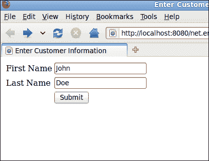
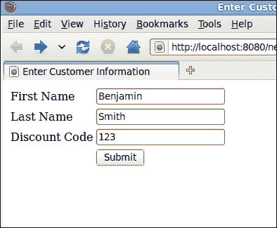
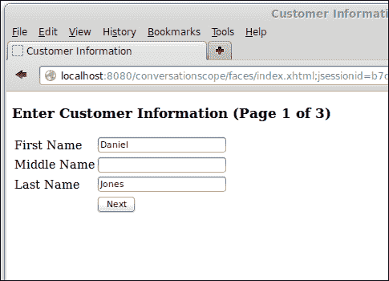
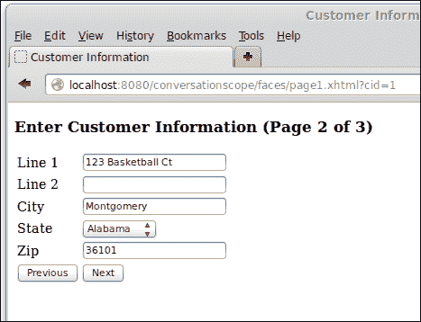
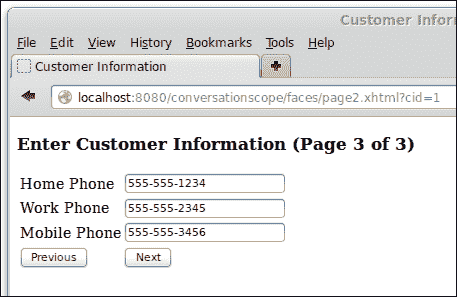

# 第五章。上下文和依赖注入

**上下文和依赖注入**（**CDI**）在 Java EE 6 中添加到 Java EE 规范中。它为 Java EE 开发者提供了之前不可用的几个优点，例如允许任何 JavaBean 用作**JavaServer Faces**（**JSF**）管理 Bean，包括无状态和有状态会话 Bean。正如其名所示，CDI 简化了 Java EE 应用程序中的依赖注入。

在本章中，我们将涵盖以下主题：

+   命名豆

+   依赖注入

+   范围

+   标准化

# 命名豆

CDI 通过`@Named`注解为我们提供了命名 Bean 的能力。命名 Bean 允许我们轻松地将我们的 Bean 注入到依赖它们的其他类中（参见*依赖注入*部分），并且可以通过统一表达式语言轻松地从 JSF 页面引用它们。

以下示例展示了`@Named`注解的实际应用：

```java
package net.ensode.cdidependencyinjection.beans;

import javax.enterprise.context.RequestScoped;
import javax.inject.Named;

@Named
@RequestScoped
public class Customer {

  private String firstName;
  private String lastName;

  public String getFirstName() {
    return firstName;
  }

  public void setFirstName(String firstName) {
    this.firstName = firstName;
  }

  public String getLastName() {
    return lastName;
  }

  public void setLastName(String lastName) {
    this.lastName = lastName;
  }
}
```

如我们所见，我们只需要用`@Named`注解装饰我们的类来命名我们的类。默认情况下，Bean 的名称将是类名，其首字母转换为小写；在我们的例子中，Bean 的名称将是`customer`。如果我们想使用不同的名称，我们可以通过设置`@Named`注解的`value`属性来实现。例如，如果我们想在前面的例子中使用`customerBean`作为我们的 Bean 名称，我们可以通过修改`@Named`注解如下所示：

```java
@Named(value="customerBean")
```

或者，我们也可以简单地使用以下代码：

```java
@Named("customerBean")
```

由于`value`属性名称不需要指定，如果我们不使用属性名称，则隐含`value`。

CDI 名称可用于通过统一表达式语言从 JSF 页面访问我们的 Bean，如下面的代码所示：

```java
<?xml version='1.0' encoding='UTF-8' ?>
<!DOCTYPE html PUBLIC "-//W3C//DTD XHTML 1.0 Transitional//EN" "http://www.w3.org/TR/xhtml1/DTD/xhtml1-transitional.dtd">
<html 
      >
  <h:head>
    <title>Enter Customer Information</title>
  </h:head>
  <h:body>
    <h:form>
      <h:panelGrid columns="2">
        <h:outputLabel for="firstName" value="First Name"/>
 <h:inputText id="firstName"
 value="#{customer.firstName}"/>
        <h:outputLabel for="lastName" value="Last Name"/>
 <h:inputText id="lastName"
 value="#{customer.lastName}"/> 
        <h:panelGroup/>       
      </h:panelGrid>
    </h:form>
  </h:body>
</html>
```

如我们所见，命名 Bean 从 JSF 页面访问的方式与标准 JSF 管理 Bean 完全相同。这允许 JSF 访问任何命名 Bean，将 Java 代码与 JSF API 解耦。

当部署和执行时，我们的简单应用程序看起来如下截图（在用户输入一些数据后显示）：



# 依赖注入

依赖注入是一种用于向 Java 类提供外部依赖的技术。Java EE 5 通过`@Resource`注解引入了依赖注入；然而，此注解仅限于注入资源，如数据库连接、JMS 资源等。CDI 包括`@Inject`注解，可用于将 Java 类的实例注入到任何依赖对象中。

JSF 应用程序通常遵循**模型-视图-控制器**（**MVC**）设计模式。因此，一些 JSF 管理 Bean 经常在模式中扮演控制器的角色，而其他 Bean 则扮演模型的角色。这种方法通常要求控制器管理 Bean 能够访问一个或多个模型管理 Bean。

由于前一段描述的模式，最常被问到的 JSF 问题之一是如何从一个管理 bean 访问另一个。有不止一种方法可以实现这一点；然而，在 CDI 之前，没有一种方法简单直接。在 CDI 之前，最简单的方法是在控制器管理 bean 中声明一个管理属性，这需要修改应用程序的`faces-config.xml`文件；另一种方法是使用如下代码：

```java
ELContext elc = FacesContext.getCurrentInstance().getELContext();
SomeBean someBean 
    = (SomeBean) FacesContext.getCurrentInstance().getApplication()
        .getELResolver().getValue(elc, null, "someBean");
```

在这个示例中，`someBean`是`faces-config.xml`文件中指定的 bean 的名称。正如我们所看到的，这两种方法都不简单，也不容易记住。幸运的是，由于 CDI 的依赖注入功能，像这样的代码现在不再需要了，如下面的代码所示：

```java
package net.ensode.cdidependencyinjection.ejb;

import java.util.logging.Logger;
import javax.inject.Inject;
import javax.inject.Named;

@Named
@RequestScoped
public class CustomerController {

  private static final Logger logger = Logger.getLogger(
      CustomerController.class.getName());
 @Inject
  private Customer customer;

  public String saveCustomer() {

    logger.info("Saving the following information \n" + customer.
        toString());

    //If this was a real application, we would have code to save
    //customer data to the database here.

    return "confirmation";
  }
}
```

注意，我们初始化客户实例所需要做的只是用`@Inject`注解装饰它。当 bean 由应用服务器构建时，一个`Customer` bean 的实例会自动注入到这个字段中。注意，注入的 bean 在`saveCustomer()`方法中被使用。正如我们所看到的，CDI 使得从一个 bean 访问另一个 bean 变得非常简单，与之前 Java EE 规范版本中必须使用的代码相比，差距甚远。

# 使用 CDI 限定符

在某些情况下，我们希望注入到代码中的 bean 的类型可能是一个接口或 Java 超类，但我们可能对注入子类或实现该接口的类感兴趣。对于这种情况，CDI 提供了限定符，我们可以使用它们来指明我们希望注入到代码中的特定类型。

CDI 限定符是一个必须用`@Qualifier`注解装饰的注解。这个注解可以用来装饰我们希望限定的特定子类或接口实现。此外，客户端代码中的注入字段也需要用限定符装饰。

假设我们的应用程序可能有一种特殊的客户类型；例如，常客可能会被赋予高级客户的身份。为了处理这些高级客户，我们可以扩展我们的`Customer`命名 bean，并用以下限定符装饰它：

```java
package net.ensode.cdidependencyinjection.qualifiers;

import static java.lang.annotation.ElementType.TYPE;
import static java.lang.annotation.ElementType.FIELD;
import static java.lang.annotation.ElementType.PARAMETER;
import static java.lang.annotation.ElementType.METHOD;
import static java.lang.annotation.RetentionPolicy.RUNTIME;
import java.lang.annotation.Retention;
import java.lang.annotation.Target;
import javax.inject.Qualifier;

@Qualifier
@Retention(RUNTIME)
@Target({METHOD, FIELD, PARAMETER, TYPE})
public @interface Premium {
}
```

如我们之前提到的，限定符是标准的注释；它们通常具有运行时保留功能，可以针对方法、字段、参数或类型进行标注，正如前一个示例中通过`@Retention`注解的值所展示的那样。限定符与标准注释之间的唯一区别是，限定符被`@Qualifier`注解所装饰。

一旦我们设置了限定符，我们需要用它来装饰特定的子类或接口实现：

```java
package net.ensode.cdidependencyinjection.beans;

import javax.enterprise.context.RequestScoped;
import javax.inject.Named;
import net.ensode.cdidependencyinjection.qualifiers.Premium;

@Named
@RequestScoped
@Premium
public class PremiumCustomer extends Customer {

  private Integer discountCode;

  public Integer getDiscountCode() {
    return discountCode;
  }

  public void setDiscountCode(Integer discountCode) {
    this.discountCode = discountCode;
  }
}
```

一旦我们装饰了需要限定的特定实例，我们就可以在客户端代码中使用我们的限定符来指定所需的精确依赖类型：

```java
package net.ensode.cdidependencyinjection.beans;

import java.util.Random;
import java.util.logging.Logger;
import javax.enterprise.context.RequestScoped;
import javax.inject.Inject;
import javax.inject.Named;
import net.ensode.cdidependencyinjection.qualifiers.Premium;

@Named
@RequestScoped
public class CustomerController {

  private static final Logger logger = Logger.getLogger(
      CustomerController.class.getName());
  @Inject 
 @Premium
  private Customer customer;

  public String saveCustomer() {

    PremiumCustomer premiumCustomer = (PremiumCustomer) customer;

    premiumCustomer.setDiscountCode(generateDiscountCode());

    logger.info("Saving the following information \n"
        + premiumCustomer.getFirstName() + " "
        + premiumCustomer.getLastName()
        + ", discount code = "
        + premiumCustomer.getDiscountCode());

    //If this was a real application, we would have code to save
    //customer data to the database here.

    return "confirmation";
  }

  public Integer generateDiscountCode() {
    return new Random().nextInt(100000);
  }
}
```

由于我们使用`@Premium`限定符来装饰客户字段，因此将`PremiumCustomer`类的实例注入到该字段中，因为这个类也被装饰了`@Premium 限定符`。

就我们的 JSF 页面而言，我们像往常一样通过名称访问我们的命名 bean：

```java
<?xml version='1.0' encoding='UTF-8' ?>
<!DOCTYPE html PUBLIC "-//W3C//DTD XHTML 1.0 Transitional//EN" "http://www.w3.org/TR/xhtml1/DTD/xhtml1-transitional.dtd">
<html 
      >
    <h:head>
        <title>Enter Customer Information</title>
    </h:head>
    <h:body>
        <h:form>
            <h:panelGrid columns="2">
                <h:outputLabel for="firstName" value="First Name"/>
                <h:inputText id="firstName"
                  value="#{premiumCustomer.firstName}"/>
                <h:outputLabel for="lastName" value="Last Name"/>
                <h:inputText id="lastName"          
                   value="#{premiumCustomer.lastName}"/>
                <h:outputLabel for="discountCode" value="Discount Code"/>
                <h:inputText id="discountCode"
                   value="#{premiumCustomer.discountCode}"/>
                <h:panelGroup/>
                <h:commandButton value="Submit"
                  action="#{customerController.saveCustomer}"/>
            </h:panelGrid>
        </h:form>
    </h:body>
</html>
```

在这个例子中，我们使用 bean 的默认名称，即类名，首字母小写。

从用户的角度来看，我们的简单应用程序渲染和操作就像一个普通的（即不使用 CDI）JSF 应用程序一样。请看下面的屏幕截图：



# 命名 bean 作用域

就像 JSF 管理的 bean 一样，CDI 命名 bean 也有作用域。这意味着 CDI bean 是上下文对象。当需要命名 bean 时，无论是由于注入还是因为它被 JSF 页面引用，CDI 都会在该 bean 所属的作用域中查找 bean 的实例，并将其注入到依赖代码中。如果没有找到实例，就会创建一个并存储在适当的作用域中供将来使用。不同的作用域是 bean 存在的上下文。

下表列出了不同的有效 CDI 作用域：

| 作用域 | 注解 | 描述 |
| --- | --- | --- |
| 请求 | `@RequestScoped` | 请求作用域的 bean 在单个请求的持续期间共享。单个请求可能指的是 HTTP 请求、对 EJB 方法的方法调用、Web 服务调用或向消息驱动 bean 发送 JMS 消息。 |
| 会话 | `@ConversationScoped` | 会话作用域可以跨越多个请求，但它通常比会话作用域短。 |
| 会话 | `@SessionScoped` | 会话作用域的 bean 在 HTTP 会话的所有请求之间共享。每个应用程序用户都获得自己的会话作用域 bean 实例。 |
| 应用 | `@ApplicationScoped` | 应用作用域的 bean 在整个应用程序生命周期中存在。此作用域中的 bean 在用户会话之间共享。 |
| 依赖 | `@Dependent` | 依赖作用域的 bean 不共享；每次注入依赖作用域的 bean 时，都会创建一个新的实例。 |

如我们所见，CDI 包括了 JSF 支持的所有作用域；它还增加了一些自己的作用域。CDI 的请求作用域与 JSF 的请求作用域不同，其中请求不一定指的是 HTTP 请求；它可能只是一个对 EJB 方法的调用、一个 Web 服务调用或向消息驱动 bean 发送 JMS 消息。

JSF 中不存在会话作用域。这个作用域比请求作用域长，但比会话作用域短，通常跨越三页或更多。希望访问会话作用域 bean 的类必须注入`javax.enterprise.context.Conversation`实例。在我们想要开始会话的点，必须在这个对象上调用`begin()`方法。在我们想要结束会话的点，必须在这个对象上调用`end()`方法。

CDI 的会话作用域的行为与其 JSF 对应物相同。会话作用域 bean 的生命周期与 HTTP 会话的生命周期绑定。

CDI 的应用程序作用域的行为也与其 JSF 中的等效作用域相同。应用程序作用域 bean 与应用程序的生命周期绑定。每个应用程序都有一个应用程序作用域 bean 的单例存在，这意味着相同的实例对所有 HTTP 会话都是可访问的。

就像对话作用域一样，CDI 的依赖作用域在 JSF 中不存在。每次需要时都会实例化一个新的依赖作用域 bean，通常是在将其注入依赖于它的类时。

假设我们想要让用户输入一些将被存储在单个命名 bean 中的数据；然而，这个 bean 有几个字段，因此，我们希望将数据输入分成几个页面。这是一个相当常见的情况，并且使用 JSF 的先前版本（JSF 2.2 添加了 Faces Flows 来解决这个问题；请参阅第二章，*JavaServer Faces*）或 servlet API 处理起来并不容易。这种情况不容易管理的原因是，我们只能将类放在请求作用域中，在这种情况下，类在每次请求后都会被销毁，从而丢失其数据；或者放在会话作用域中，在这种情况下，类在所需之后很长时间仍然留在内存中。

对于此类情况，CDI 的对话作用域是一个很好的解决方案，如下面的代码所示：

```java
package net.ensode.conversationscope.model;

import java.io.Serializable;
import javax.enterprise.context.ConversationScoped;
import javax.inject.Named;
import org.apache.commons.lang.builder.ReflectionToStringBuilder;

@Named
@ConversationScoped
public class Customer implements Serializable {

    private String firstName;
    private String middleName;
    private String lastName;
    private String addrLine1;
    private String addrLine2;
    private String addrCity;
    private String state;
    private String zip;
    private String phoneHome;
    private String phoneWork;
    private String phoneMobile;

    //getters and setters omitted for brevity

    @Override
    public String toString() {
        return ReflectionToStringBuilder.reflectionToString(this);
    }
} 
```

我们通过使用`@ConversationScoped`注解来装饰我们的 bean，声明我们的 bean 是会话作用域的。会话作用域 bean 还需要实现`java.io.Serializable`。除了这两个要求外，我们的代码没有特别之处。它是一个简单的 JavaBean 代码，具有私有属性和相应的 getter 和 setter 方法。

### 注意

我们在我们的代码中使用 Apache `commons-lang`库来轻松实现 bean 的`toString()`方法。`commons-lang`库有多个这样的实用方法，实现了频繁需要的、编写起来繁琐的功能。`commons-lang`可在中央 Maven 仓库中找到，网址为[`commons.apache.org/lang`](http://commons.apache.org/lang)。

除了注入我们的作用域为对话的 bean 外，我们的客户端代码还必须注入一个`javax.enterprise.context.Conversation`实例，如下面的示例所示：

```java
package net.ensode.conversationscope.controller;

import java.io.Serializable;
import javax.enterprise.context.Conversation;
import javax.enterprise.context.RequestScoped;
import javax.inject.Inject;
import javax.inject.Named;
import net.ensode.conversationscope.model.Customer;

@Named
@RequestScoped
public class CustomerInfoController implements Serializable {

 @Inject
 private Conversation conversation;
 @Inject
 private Customer customer;

    public String customerInfoEntry() {
 conversation.begin();
        System.out.println(customer);
        return "page1";
    }

    public String navigateToPage1() {
        System.out.println(customer);
        return "page1";
    }

    public String navigateToPage2() {
        System.out.println(customer);
        return "page2";
    }

    public String navigateToPage3() {
        System.out.println(customer);
        return "page3";
    }

    public String navigateToConfirmationPage() {
        System.out.println(customer);
 conversation.end();
        return "confirmation";
    }
}
```

对话可以是长运行的或短暂的。短暂的对话在请求结束时结束。长运行对话跨越多个请求。在大多数情况下，我们将使用长运行对话来在 Web 应用程序中跨多个 HTTP 请求保持对作用域为对话的 bean 的引用。

长运行对话在注入的对话实例中调用`begin()`方法时开始，并在我们调用同一对象的`end()`方法时结束。

JSF 页面可以像访问 JSF 管理 bean 一样访问我们的 CDI bean：

```java
<?xml version='1.0' encoding='UTF-8' ?>
<!DOCTYPE html PUBLIC "-//W3C//DTD XHTML 1.0 Transitional//EN" "http://www.w3.org/TR/xhtml1/DTD/xhtml1-transitional.dtd">
<html 
      >
    <h:head>
        <title>Customer Information</title>
    </h:head>
    <h:body>
        <h3>Enter Customer Information (Page 1 of 3)</h3>
        <h:form>
            <h:panelGrid columns="2">
                <h:outputLabel for="firstName" value="First Name"/>
                <h:inputText id="firstName"
                                      value="#{customer.firstName}"/>
                <h:outputLabel for="middleName" value="Middle Name"/>
                <h:inputText id="middleName"
                                      value="#{customer.middleName}"/>
                <h:outputLabel for="lastName" value="Last Name"/>
                <h:inputText id="lastName" value="#{customer.lastName}"/>
                <h:panelGroup/>
                <h:commandButton value="Next" 
                  action="#{customerInfoController.navigateToPage2}"/>
            </h:panelGrid>
        </h:form>
    </h:body>
</html>
```

当我们从一页导航到下一页时，我们保持我们的会话作用域 bean 的同一实例。因此，所有用户输入的数据都保持不变。当在会话 bean 上调用`end()`方法时，会话结束，我们的会话作用域 bean 被销毁。

将我们的 bean 保持在会话作用域中简化了实现向导式用户界面的任务，如图所示，数据可以在多个页面中输入：



在我们的示例中，在第一页上点击**下一步**按钮后，我们可以在 GlassFish 日志中看到我们的部分填充的 bean：

```java
INFO:  HYPERLINK "mailto:net.ensode.conversationscope.model.Customer@6e1c51b4"net.ensode.conversationscope.model.Customer@6e1c51b4[firstName=Daniel,middleName=,lastName=Jones,addrLine1=,addrLine2=,addrCity=,state=AL,zip=<null>,phoneHome=<null>,phoneWork=<null>,phoneMobile=<null>]

```

到目前为止，我们的简单向导的第二页显示如下：



点击**下一步**，我们可以看到在我们的会话作用域 bean 中填充了额外的字段。

```java
INFO: net.ensode.conversationscope.model.Customer@6e1c51b4[firstName=Daniel,middleName=,lastName=Jones,addrLine1=123 Basketball Ct,addrLine2=,addrCity=Montgomery,state=AL,zip=36101,phoneHome=<null>,phoneWork=<null>,phoneMobile=<null>]

```

当我们在向导的第三页提交时，与该页面上字段对应的额外 bean 属性被填充，如图所示：



当我们到达不再需要记住客户信息的地方时，我们需要在注入到我们的代码中的会话 bean 上调用`end()`方法。这正是我们在显示确认页面之前在代码中所做的：

```java
public String navigateToConfirmationPage() {
        System.out.println(customer);
 conversation.end();
        return "confirmation";
    }
```

在完成显示确认页面的请求后，我们的会话作用域 bean 被销毁，因为我们已经在注入的`Conversation`类中调用了`end()`方法。

# 摘要

在本章中，我们介绍了上下文和依赖注入。我们介绍了 JSF 页面如何将 CDI 命名 bean 作为 JSF 管理 bean 来访问。我们还介绍了 CDI 如何通过`@Inject`注解使将依赖项注入到我们的代码中变得简单。此外，我们还解释了如何使用限定符来确定要注入到我们的代码中的依赖项的具体实现。最后，我们介绍了 CDI bean 可以放置的所有作用域，包括所有 JSF 作用域的等效作用域，以及 JSF 中未包含的两个额外作用域，即会话作用域和依赖作用域。

在下一章中，我们将介绍如何使用新的 JSON-P API 处理 JavaScript 对象表示法（JSON）格式的数据。
