# 第九章：保护 Java EE 应用程序

在本章中，我们将介绍如何通过利用 GlassFish 的内置安全功能来保护 Java EE 应用程序。

Java EE 安全性依赖于 **Java 身份验证和授权服务**（**JAAS**）API。正如我们将看到的，保护 Java EE 应用程序大部分情况下不需要编写太多代码。通过在应用程序服务器中设置用户和安全组到安全实体，然后配置我们的应用程序依赖于特定的安全实体以进行身份验证和授权，从而实现应用程序的保护。

本章我们将涵盖的一些主题包括：

+   管理实体

+   文件实体

+   证书实体

+   创建自签名安全证书

+   JDBC 实体

+   自定义实体

# 安全实体

安全实体本质上是由用户和相关安全组组成的集合。用户可以属于一个或多个安全组。用户所属的组定义了系统将允许用户执行哪些操作。例如，一个应用程序可以有普通用户，他们只能使用基本应用程序功能，还可以有管理员，除了可以使用基本应用程序功能外，还可以向系统中添加其他用户。

安全实体存储用户信息（用户名、密码和安全组）。因此，应用程序不需要实现此功能，只需配置即可从安全实体获取此信息。一个安全实体可以被多个应用程序使用。

## 预定义安全实体

GlassFish 默认配置了三个预定义的安全实体：**admin-realm**、**file** 和 **certificate**。**admin-realm** 用于管理用户对 GlassFish 网络控制台的访问，不应用于其他应用程序。**file** 实体将用户信息存储在文件中。**certificate** 实体查找客户端证书以验证用户。

以下截图显示了 GlassFish 网络控制台中的预定义实体：

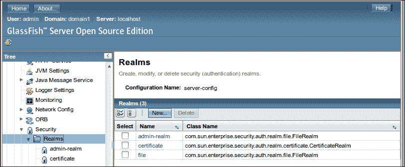

除了预定义的安全实体外，我们可以轻松地添加额外的实体。我们将在本章后面介绍如何做到这一点，但首先让我们讨论 GlassFish 的预定义安全实体。

### admin 实体

admin 实体有一个预定义的用户名为 **admin**，它属于一个预定义的组名为 **asadmin**。

为了说明如何向实体添加用户，让我们向 admin 实体添加一个新用户。这将允许额外的用户登录到 GlassFish 网络控制台。为了向 admin 实体添加用户，请登录到 GlassFish 网络控制台，并展开左侧的 **配置** 节点。然后展开 **server-config** 节点，接着是 **安全** 节点。然后展开 **实体** 节点并点击 **admin-realm**。页面主要区域应如下截图所示：

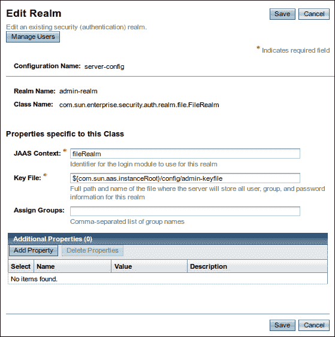

要将用户添加到文件域，请单击左上角标有**管理用户**的按钮。页面主区域现在应该看起来像以下截图：

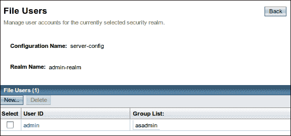

要将新用户添加到域中，只需单击屏幕左上角的**新建...**按钮，然后输入新用户信息，如下截图所示：

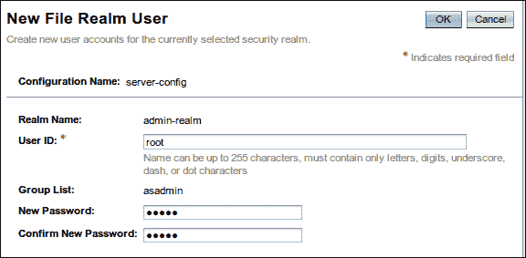

如此截图所示，我们添加了一个名为`root`的新用户，将该用户添加到`asadmin`组，并输入了该用户的密码。

### 注意

GlassFish 网络控制台将只允许**asadmin**组中的用户登录。未能将我们的用户添加到这个安全组将阻止他/她登录到控制台。

我们现在可以在管理员域用户列表中看到我们新创建的用户，如下截图所示：

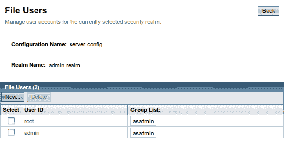

我们已成功为 GlassFish 网络控制台添加了新用户。我们可以通过使用新用户的凭据登录控制台来测试这个新账户。

### 文件域

GlassFish 的第二个预定义域是文件域。该域以加密文本文件的形式存储用户信息。将用户添加到该域与将用户添加到**管理员域**非常相似。我们可以通过导航到**配置** | **服务器配置** | **安全** | **域**来添加用户。在**域**节点下，单击**文件**，然后单击**管理用户**按钮，最后单击**新建...**按钮。页面主区域应该看起来像以下截图：

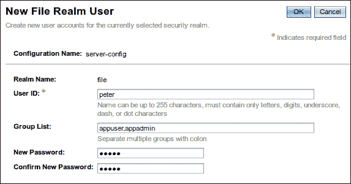

由于此域旨在用于我们的应用程序，我们可以创建自己的组。组对于给多个用户赋予相同的权限非常有用。例如，所有需要管理权限的用户都可以添加到管理员组（组名当然是任意的）。

在本例中，我们将用户 ID 为`peter`的用户添加到了`appuser`和`appadmin`组。

单击**确定**按钮应保存新用户并带我们到该域的用户列表，如下截图所示：


单击**新建...**按钮允许我们向域中添加更多用户。以下截图显示了如何添加名为`joe`的额外用户，他仅属于`appuser`组：

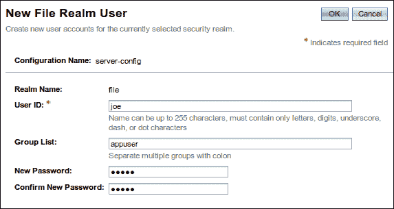

如本节所示，将用户添加到文件域非常简单。现在我们将说明如何通过文件域进行用户认证和授权。

#### 通过文件域进行基本认证

在上一节中，我们介绍了如何将用户添加到文件域以及如何将这些用户分配到组中。在本节中，我们将说明如何保护一个网络应用程序，以确保只有经过适当认证和授权的用户才能访问它。这个网络应用程序将使用文件域进行用户访问控制。

应用程序将包含几个非常简单的 JSF 页面。所有认证逻辑都由应用服务器处理；因此，为了确保应用程序的安全，我们只需要在其部署描述符中做出修改，即`web.xml`和`glassfish-web.xml`。我们首先讨论`web.xml`，如下所示：

```java
<?xml version="1.0" encoding="UTF-8"?>
<web-app version="3.0"   xsi:schemaLocation="http://java.sun.com/xml/ns/javaee http://java.sun.com/xml/ns/javaee/web-app_3_0.xsd">
  <context-param>
    <param-name>javax.faces.PROJECT_STAGE</param-name>
    <param-value>Development</param-value>
  </context-param>
  <servlet>
    <servlet-name>Faces Servlet</servlet-name>
    <servlet-class>javax.faces.webapp.FacesServlet</servlet-class>
    <load-on-startup>1</load-on-startup>
  </servlet>
  <servlet-mapping>
    <servlet-name>Faces Servlet</servlet-name>
    <url-pattern>*.jsf</url-pattern>
  </servlet-mapping>
  <welcome-file-list>
    <welcome-file>index.jsf</welcome-file>
  </welcome-file-list>
 <security-constraint>
 <web-resource-collection>
 <web-resource-name>Admin Pages</web-resource-name>
 <url-pattern>/admin/*</url-pattern>
 </web-resource-collection>
 <auth-constraint>
 <role-name>admin</role-name>
 </auth-constraint>
 </security-constraint>
 <security-constraint>
 <web-resource-collection>
 <web-resource-name>AllPages</web-resource-name>
 <url-pattern>/*</url-pattern>
 </web-resource-collection>
 <auth-constraint>
 <role-name>user</role-name>
 </auth-constraint>
 </security-constraint>
 <login-config>
 <auth-method>BASIC</auth-method>
 <realm-name>file</realm-name>
 </login-config>
</web-app>
```

`<security-constraint>`元素定义了谁可以访问与特定 URL 模式匹配的页面。页面的 URL 模式在`<url-pattern>`元素中定义，如示例所示，它必须嵌套在`<web-resource-collection>`元素内部。允许访问页面的角色在`<role-name>`元素中定义，它必须嵌套在`<auth-constraint>`元素内部。

在我们的示例中，我们定义了两组需要保护的页面。第一组页面是那些 URL 以`/admin`开头的页面。只有属于 admin 组的用户可以访问这些页面。第二组页面是其余的页面，由`/*`的 URL 模式定义。只有具有`user`角色的用户可以访问这些页面。值得注意的是，第二组页面是第一组页面的超集，也就是说，任何 URL 匹配`/admin/*`的页面也匹配`/*`。在这种情况下，最具体的案例获胜。在这个特定的情况下，具有`user`角色（但没有`admin`角色）的用户将无法访问任何以`/admin`开头的页面。

为了保护我们的页面，我们需要在`web.xml`中添加的下一个元素是`<login-config>`元素。此元素必须包含一个`<auth-method>`元素，它定义了应用程序的授权方法。此元素的合法值包括`BASIC`、`DIGEST`、`FORM`和`CLIENT-CERT`。

`BASIC`表示将使用基本认证。这种认证方式会导致浏览器生成一个弹出窗口，提示用户输入用户名和密码，以便在用户第一次尝试访问受保护页面时显示。除非使用 HTTPS 协议，否则在使用基本认证时，用户的凭据将以 Base64 编码，而不是加密。攻击者解码这些凭据相对容易；因此，不建议使用基本认证。

`DIGEST`认证值与基本认证类似，不同之处在于它使用 MD5 摘要来加密用户凭据，而不是以 Base64 编码的形式发送。

`FORM`认证值使用包含用户名和密码字段的 HTML 或 JSP 自定义页面。然后，表单中的值将与安全领域进行核对，以进行用户认证和授权。除非使用 HTTPS，否则在使用基于表单的认证时，用户凭据将以明文形式发送；因此，建议使用 HTTPS，因为它可以加密数据。我们将在本章后面介绍如何设置 GlassFish 以使用 HTTPS。

`CLIENT-CERT`认证值使用客户端证书来验证和授权用户。

`<login-config>`中的`<realm-name>`元素指示用于身份验证和授权用户的安全域。在这个特定示例中，我们使用的是文件域。

我们在本节中讨论的所有`web.xml`元素都可以与任何安全域一起使用；它们并不局限于文件域。将我们的应用程序与文件域联系在一起的是`<realm-name>`元素的值。还需要注意的是，并非所有身份验证方法都受所有域支持。文件域仅支持基本和基于表单的身份验证。

在我们能够成功验证用户之前，我们需要将`web.xml`中定义的用户角色与域中定义的组链接起来。我们通过以下方式在`glassfish-web.xml`部署描述符中完成此操作：

```java
<?xml version="1.0" encoding="UTF-8"?>
<!DOCTYPE glassfish-web-app PUBLIC "-//GlassFish.org//DTD GlassFish Application Server 3.1 Servlet 3.0//EN" "http://glassfish.org/dtds/glassfish-web-app_3_0-1.dtd">
<glassfish-web-app error-url="">
  <context-root>/filerealmauth</context-root>
 <security-role-mapping>
 <role-name>admin</role-name>
 <group-name>appadmin</group-name>
 </security-role-mapping>
 <security-role-mapping>
 <role-name>user</role-name>
 <group-name>appuser</group-name>
 </security-role-mapping>
  <class-loader delegate="true"/>    
</glassfish-web-app>
```

如前例所示，`glassfish-web.xml`部署描述符可以有一个或多个`<security-role-mapping>`元素。对于`web.xml`中每个`<auth-constraint>`标签中定义的每个角色，都需要这些元素中的一个。`<role-name>`子元素指示要映射的角色。其值必须与`web.xml`中相应的`<role-name>`元素的值匹配。《group-name>`子元素必须与用于在应用程序中身份验证用户的安全域中的安全组值匹配。

在这个示例中，第一个`<security-role-mapping>`元素将应用程序的`web.xml`部署描述符中定义的`admin`角色映射到我们在本章前面添加用户到文件域时创建的`appadmin`组。第二个`<security-role-mapping>`元素将`web.xml`中的`user`角色映射到文件域中的`appuser`组。

如前所述，我们不需要在我们的代码中进行任何操作以进行身份验证和授权用户。我们只需要修改本节中描述的应用程序的部署描述符。由于我们的应用程序只是几个简单的页面，因此我们将不会展示它们的源代码。我们应用程序的结构如下截图所示：

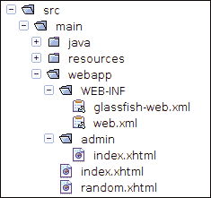

根据我们在部署描述符中设置的应用程序方式，具有`user`角色的用户将能够访问应用程序根目录下的两个页面（`index.xhtml`和`random.xhtml`）。只有具有`admin`角色的用户才能访问`admin`文件夹下的任何页面，在这个特定情况下是一个名为`index.xhtml`的单页。

在打包和部署我们的应用程序并将浏览器指向其任何页面的 URL 之后，我们应该看到一个弹出窗口，要求输入**用户名**和**密码**，如下截图所示：

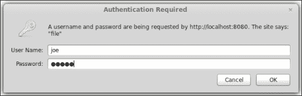

在输入正确的用户名和密码后，我们将被引导到我们试图查看的页面，如下所示：

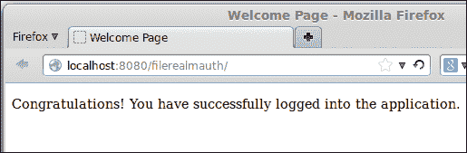

在这一点上，用户可以导航到应用程序中他/她被允许访问的任何页面，无论是通过跟随链接还是通过在浏览器中输入 URL，而无需重新输入用户名和密码。

注意，我们以用户`joe`的身份登录；此用户仅属于`user`角色。因此，他没有访问以`/admin`开头的任何页面的权限。如果`joe`尝试访问这些页面之一，他将收到一个显示**HTTP 状态 403-禁止访问**的 HTTP 错误，如下面的截图所示：

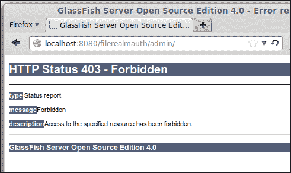

只有属于`admin`角色的用户才能看到截图中显示的 URL 匹配的页面。当我们向文件域添加用户时，我们添加了一个名为`peter`的用户，他拥有这个角色。如果我们以`peter`的身份登录，我们将能够看到请求的页面。对于基本身份验证，退出应用程序的唯一可能方法是关闭浏览器。因此，要登录为`peter`，我们需要关闭并重新打开浏览器。一旦以 Peter 的身份登录，我们将看到如下所示的窗口：

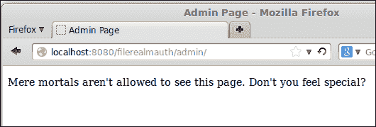

如前所述，我们在本例中使用的基本身份验证方法的一个缺点是登录信息没有加密。一种解决方法是通过使用 HTTPS（SSL 上的 HTTP）协议。当使用此协议时，浏览器和服务器之间的所有信息都会被加密。

使用 HTTPS 最简单的方法是修改应用程序的`web.xml`部署描述符，如下所示：

```java
<?xml version="1.0" encoding="UTF-8"?>
<web-app   xsi:schemaLocation="http://java.sun.com/xml/ns/javaee http://java.sun.com/xml/ns/javaee/web-app_3_0.xsd"
  version="3.0">
  <security-constraint>
    <web-resource-collection>
      <web-resource-name>Admin Pages</web-resource-name>
      <url-pattern>/admin/*</url-pattern>
    </web-resource-collection>
    <auth-constraint>
      <role-name>admin</role-name>
    </auth-constraint>
 <user-data-constraint>
 <transport-guarantee>CONFIDENTIAL</transport-guarantee>
 </user-data-constraint>
    </security-constraint>
  <security-constraint>
    <web-resource-collection>
      <web-resource-name>AllPages</web-resource-name>
      <url-pattern>/*</url-pattern>
    </web-resource-collection>
    <auth-constraint>
      <role-name>user</role-name>
    </auth-constraint>
 <user-data-constraint>
 <transport-guarantee>CONFIDENTIAL</transport-guarantee>
 </user-data-constraint>
  </security-constraint>
  <login-config>
    <auth-method>BASIC</auth-method>
    <realm-name>file</realm-name>
  </login-config>
</web-app>
```

如我们所见，为了让应用程序仅通过 HTTPS 访问，我们只需在每个想要加密的页面集中添加一个包含嵌套的`<transport-guarantee>`元素的`<user-data-constraint>`元素。需要保护的页面集在`web.xml`部署描述符中的`<security-constraint>`元素中声明。

现在，当我们通过（不安全的）HTTP 端口（默认为 8080）访问应用程序时，请求将被自动转发到（安全的）HTTPS 端口（默认为 8181）。

在我们的例子中，我们将`<transport-guarantee>`元素的值设置为`CONFIDENTIAL`。这会加密浏览器和服务器之间的所有数据。此外，如果请求是通过未加密的 HTTP 端口发出的，它将被自动转发到安全的 HTTPS 端口。

`<transport-guarantee>`元素的另一个有效值是`INTEGRAL`。当使用此值时，浏览器和服务器之间数据的完整性得到保证。换句话说，数据在传输过程中不能被更改。当使用此值时，通过 HTTP 发出的请求不会自动转发到 HTTPS。如果用户尝试在设置此值时通过 HTTP 访问安全页面，浏览器将拒绝请求并返回 403（访问被拒绝）错误。

`<transport-guarantee>`元素的第三个也是最后一个有效值是`NONE`。当使用此值时，不对数据的完整性和机密性做出任何保证。`NONE`值是在`<transport-guarantee>`元素未出现在应用程序的`web.xml`部署描述符中时使用的默认值。

在对`web.xml`部署描述符进行前面的修改后，重新部署应用程序，并将浏览器指向应用程序中的任何页面，当我们在 Firefox 上访问我们的应用程序时，我们应该看到以下警告页面：

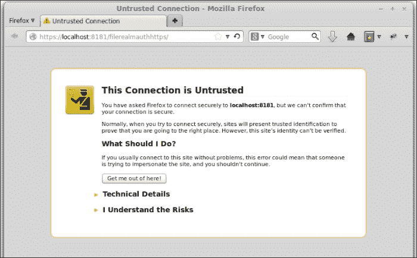

在展开**我了解风险**节点并单击标有**添加异常...**的按钮后，我们应该看到一个类似于以下截图的窗口：

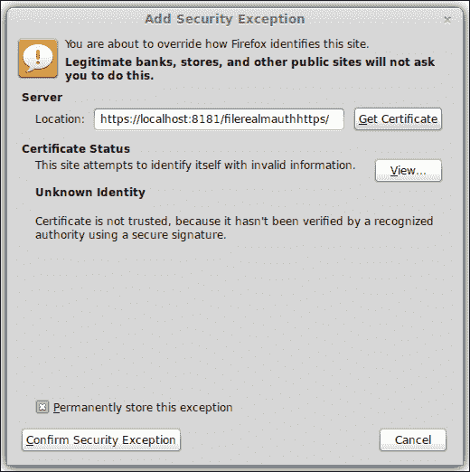

在单击标有**确认安全异常**的按钮后，我们会提示输入用户名和密码。在输入适当的凭据后，我们被允许访问请求的页面，如下面的截图所示：


我们看到此警告的原因是，为了使服务器能够使用 HTTPS 协议，它必须有一个 SSL 证书。通常，SSL 证书由**证书颁发机构**（**CA**）如 Verisign 或 Thawte 颁发。这些证书颁发机构对证书进行数字签名。通过这样做，他们证明服务器属于它声称属于的实体。

从这些证书颁发机构之一获得的数字证书通常花费约 400 美元，并在一年后到期。由于这些证书的成本可能对开发或测试目的来说过高，GlassFish 预先配置了一个自签名的 SSL 证书。由于此证书未由证书颁发机构签名，当我们尝试通过 HTTPS 访问受保护页面时，浏览器会显示警告窗口。

注意截图中的 URL。协议设置为 HTTPS，端口号为 8181。我们指向浏览器的 URL 是`http://localhost:8080/filerealmauthhttps`，因为我们修改了应用程序的`web.xml`部署描述符，请求被自动重定向到这个 URL。当然，用户可以直接输入安全的 URL，它将没有问题工作。

通过 HTTPS 传输的所有数据都是加密的，包括在浏览器生成的弹出窗口中输入的用户名和密码。使用 HTTPS 允许我们安全地使用基本身份验证。然而，基本身份验证有一个缺点，那就是用户注销应用程序的唯一方式是关闭浏览器。如果我们需要允许用户在不关闭浏览器的情况下注销应用程序，我们需要使用基于表单的身份验证。

#### 基于表单的身份验证

我们需要修改应用的`web.xml`部署描述符，以便使用基于表单的认证，如下所示：

```java
<?xml version="1.0" encoding="UTF-8"?>
<web-app version="3.0"   xsi:schemaLocation="http://java.sun.com/xml/ns/javaee http://java.sun.com/xml/ns/javaee/web-app_3_0.xsd">
  <context-param>
   <param-name>javax.faces.PROJECT_STAGE</param-name>
    <param-value>Development</param-value>
  </context-param>
  <servlet>
    <servlet-name>Faces Servlet</servlet-name>
    <servlet-class>javax.faces.webapp.FacesServlet</servlet-class>
    <load-on-startup>1</load-on-startup>
  </servlet>
  <servlet-mapping>
    <servlet-name>Faces Servlet</servlet-name>
    <url-pattern>*.jsf</url-pattern>
  </servlet-mapping>
  <welcome-file-list>
    <welcome-file>index.jsf</welcome-file>
  </welcome-file-list>
  <security-constraint>
    <web-resource-collection>
      <web-resource-name>Admin Pages</web-resource-name>
      <url-pattern>/admin/*</url-pattern>
    </web-resource-collection>
    <auth-constraint>
      <role-name>admin</role-name>
    </auth-constraint>
    <user-data-constraint>
      <transport-guarantee>CONFIDENTIAL</transport-guarantee>
    </user-data-constraint>
  </security-constraint>
  <security-constraint>
    <web-resource-collection>
      <web-resource-name>AllPages</web-resource-name>
      <url-pattern>/*</url-pattern>
    </web-resource-collection>
    <auth-constraint>
      <role-name>user</role-name>
    </auth-constraint>
    <user-data-constraint>
      <description/>
      <transport-guarantee>CONFIDENTIAL</transport-guarantee>
    </user-data-constraint>
  </security-constraint>
  <login-config>
 <auth-method>FORM</auth-method>
    <realm-name>file</realm-name>
 <form-login-config>
 <form-login-page>/login.jsf</form-login-page>
 <form-error-page>/loginerror.jsf</form-error-page>
 </form-login-config>
  </login-config>
</web-app>
```

当使用基于表单的认证时，我们只需在`web.xml`中将`<auth-method>`元素的值设置为`FORM`。使用此认证方法时，我们需要提供一个登录页面和一个登录错误页面。我们将登录和登录错误页面的 URL 分别作为`<form-login-page>`和`<form-error-page>`元素的值。正如我们在示例中所看到的，这些元素必须嵌套在`<form-login-config>`元素内部。

我们应用的登录页面标记如下所示：

```java
<?xml version='1.0' encoding='UTF-8' ?>
<!DOCTYPE html PUBLIC "-//W3C//DTD XHTML 1.0 Transitional//EN" "http://www.w3.org/TR/xhtml1/DTD/xhtml1-transitional.dtd">
<html  >
  <h:head>
    <title>Login</title>
  </h:head>
  <h:body>
    <p>Please enter your username and password to access the application
    </p>
 <form method="POST" action="j_security_check">
      <table cellpadding="0" cellspacing="0" border="0">
        <tr>
          <td align="right">Username:&nbsp;</td>
          <td>
 <input type="text" name="j_username"/>
          </td>
        </tr>
        <tr>
          <td align="right">Password:&nbsp;</td>
          <td>
 <input type="password" name="j_password"/>
          </td>
        </tr>
        <tr>
          <td></td>
          <td>
            <input type="submit" value="Login"/>
          </td>
        </tr>
      </table>
    </form>
  </h:body>
</html>
```

请注意，尽管我们的登录页面是一个 JSF 页面，但它使用的是标准的`<form>`标签，而不是 JSF 特定的`<h:form>`标签。这样做的原因是表单的`action`属性值必须是`j_security_check`，而在 JSF 的`<h:form>`标签中无法设置此属性。同样，表单中的输入字段是标准的 HTML 字段，而不是它们的 JSF 特定对应字段。

使用基于表单认证的应用的登录页面必须包含一个方法为`POST`且行为为`j_security_check`的表单。我们不需要实现认证代码，因为这是由应用服务器提供的。

登录页面中的表单必须包含一个名为`j_username`的文本字段。这个文本字段是用来存放用户名的。此外，表单还必须包含一个名为`j_password`的密码字段，用于存放密码。当然，表单必须包含一个提交按钮，以便将数据提交到服务器。

对于登录页面，唯一的要求是它必须有一个与我们的示例中属性匹配的表单，以及前一段中描述的`j_username`和`j_password`输入字段。

对于错误页面，没有特殊要求。当然，它应该显示一个错误消息，告诉用户登录失败。然而，它可以包含任何我们希望的内容。我们应用的错误页面只是告诉用户登录时出现了错误，并链接回登录页面，给用户一个重新登录的机会。

除了登录页面和登录错误页面之外，我们还向应用中添加了一个 CDI 命名 bean。这允许我们实现注销功能，这是我们使用基本认证时无法实现的。实现注销功能的代码如下：

```java
package net.ensode.glassfishbook;

import javax.enterprise.context.RequestScoped;
import javax.faces.context.ExternalContext;
import javax.faces.context.FacesContext;
import javax.inject.Named;
import javax.servlet.http.HttpSession;

@Named
@RequestScoped
public class LogoutManager {

  public String logout() {
    FacesContext facesContext = FacesContext.getCurrentInstance();
    ExternalContext externalContext = facesContext.getExternalContext();
    HttpSession session = (HttpSession) externalContext.getSession(true);

 session.invalidate();

    return "index?faces-redirect=true";
  }
}
```

登出方法的前几行是为了获取`HttpSession`对象的引用。一旦我们获得这个对象，我们只需要调用它的`invalidate()`方法来使会话无效。在我们的代码中，我们将响应重定向到首页。由于此时会话已经无效，安全机制会自动将用户重定向到登录页面。

我们现在可以测试基于表单的身份验证了。在构建我们的应用程序、部署它并将浏览器指向其任何页面后，我们应该在浏览器中看到我们的登录页面，如下面的截图所示：

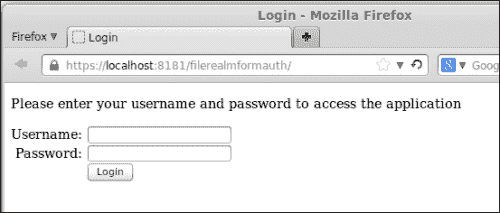

如果我们提交无效凭据，我们将自动转发到登录错误页面，如下面的截图所示：


我们可以点击**重试**链接再次尝试。在输入有效凭据后，我们被允许进入应用程序。以下截图显示了成功登录后的屏幕：

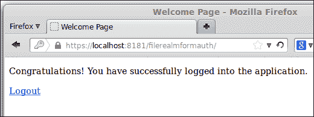

如我们所见，我们在页面上添加了一个**注销**链接。此链接将用户导向我们的 CDI 命名 bean 的`logout()`方法，正如之前提到的，这仅仅是无效化会话。从用户的角度来看，此链接将简单地让他们注销并导向登录屏幕。

### 证书领域

证书领域使用客户端证书进行身份验证。就像服务器端证书一样，客户端证书通常从证书颁发机构如 Verisign 或 Thawte 获取。这些证书颁发机构验证证书确实属于它所说的所有者。

从证书颁发机构获取证书需要付费并花费一些时间。在我们开发和/或测试应用程序时，从证书颁发机构之一获取证书可能并不实用。幸运的是，我们可以为测试目的创建自签名证书。

#### 创建自签名证书

我们可以使用包含在**Java 开发工具包**（**JDK**）中的**keytool**实用程序轻松创建自签名证书。

### 注意

我们将简要介绍一些 keytool 实用程序的关键功能，特别是创建和将自签名证书导入 GlassFish 和浏览器所必需的功能。要了解更多关于 keytool 实用程序的信息，请参阅[`docs.oracle.com/javase/7/docs/technotes/tools/solaris/keytool.html`](http://docs.oracle.com/javase/7/docs/technotes/tools/solaris/keytool.html)。

您可以在命令行中输入以下命令来生成自签名证书：

```java
keytool -genkey -v -alias selfsignedkey -keyalg RSA -storetype PKCS12 -keystore client_keystore.p12 -storepass wonttellyou -keypass wonttellyou

```

此命令假设 keytool 实用程序在系统路径中。此工具可以在 JDK 安装目录下的`bin`目录中找到。

将`-storepass`和`-keypass`参数的值替换为您自己的密码。这两个密码必须相同，才能成功使用证书对客户端进行身份验证。您可以为`-alias`参数选择任何值。您也可以为`-keystore`参数选择任何值。但是，值必须以`.p12`结尾，因为此命令生成的文件需要导入到网络浏览器中，并且如果没有`.p12`扩展名，则不会被识别。

在命令行中输入上述命令后，keytool 将提示以下信息：

```java
What is your first and last name?

 [Unknown]:  David Heffelfinger

What is the name of your organizational unit?

 [Unknown]:  Book Writing Division

What is the name of your organization?

 [Unknown]:  Ensode Technology, LLC

What is the name of your City or Locality?

 [Unknown]:  Fairfax

What is the name of your State or Province?

 [Unknown]:  Virginia

What is the two-letter country code for this unit?

 [Unknown]:  US

Is CN=David Heffelfinger, OU=Book Writing Division, O="Ensode Technology, LLC", L=Fairfax, ST=Virginia, C=US correct?

 [no]:  y

```

在每个提示中输入数据后，keytool 将生成证书。它将被存储在当前目录中，文件名将是用于 `-keystore` 参数的值（例如示例中的 `client_keystore.p12`）。

为了能够使用此证书来验证我们自身，我们需要将其导入到浏览器中。虽然过程类似，但每个浏览器的具体步骤可能不同。在 Firefox 中，可以通过转到**首选项**菜单，点击出现的弹出窗口顶部的**高级**图标，然后点击**证书**选项卡来完成，如下面的截图所示：

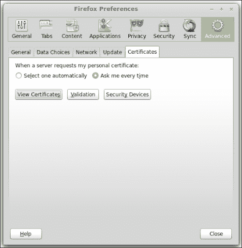

我们需要导航到出现的窗口中的**查看证书** | **你的证书** | **导入**。然后导航并从创建它的目录中选择我们的证书。此时，Firefox 将要求我们输入用于加密证书的密码；在我们的例子中，我们使用 `wonttellyou` 作为密码。输入密码后，我们应该看到一个弹出窗口确认我们的证书已成功导入。然后我们应该在证书列表中看到它，如下面的截图所示：

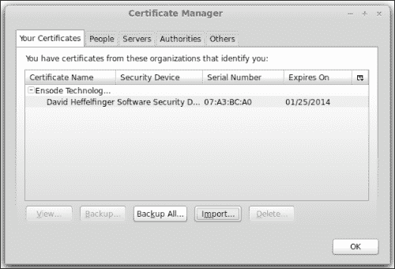

我们已经将我们的证书添加到 Firefox 中，以便它可以用来验证我们。如果你使用的是其他浏览器，则过程将类似。请查阅浏览器文档以获取详细信息。

在上一步中创建的证书需要导出为 GlassFish 可以理解的格式。我们可以通过运行以下命令来完成此操作：

```java
keytool -export -alias selfsignedkey -keystore client_keystore.p12 -storetype PKCS12 -storepass wonttellyou -rfc -file selfsigned.cer

```

`-alias`、`-keystore` 和 `-storepass` 参数的值必须与之前命令中使用的值匹配。对于 `-file` 参数，你可以选择任何值，但建议以 `.cer` 扩展名结尾。

由于我们的证书不是由证书颁发机构签发的，GlassFish 默认情况下不会将其识别为有效证书。GlassFish 根据创建它们的证书颁发机构知道哪些证书可以信任。这是通过将这些不同机构的证书存储在名为 `cacerts.jks` 的密钥库中实现的。此密钥库位于 `[glassfish 安装目录]/glassfish/domains/domain1/config/cacerts.jks`。

为了让 GlassFish 接受我们的证书，我们需要将其导入到 `cacerts` 密钥库中。这可以通过从命令行发出以下命令来完成：

```java
keytool -import -file selfsigned.cer -keystore [glassfish installation directory]/glassfish/domains/domain1/config/cacerts.jks -keypass changeit -storepass changeit

```

在此阶段，keytool 将在命令行中显示以下证书信息，并询问我们是否信任它：

```java
Owner: CN=David Heffelfinger, OU=Book Writing Division, O="Ensode Technology, LLC", L=Fairfax, ST=Virginia, C=US

Issuer: CN=David Heffelfinger, OU=Book Writing Division, O="Ensode Technology, LLC", L=Fairfax, ST=Virginia, C=US

Serial number: 7a3bca0

Valid from: Sun Oct 27 17:00:18 EDT 2013 until: Sat Jan 25 16:00:18 EST 2014

Certificate fingerprints:

 MD5:  46:EA:41:ED:12:8A:EC:CE:8C:BE:F2:49:D5:71:00:ED

 SHA1: 32:C2:D4:20:87:22:95:25:5D:B0:AC:35:43:0D:60:35:94:27:44:58

 SHA256: 8C:2E:56:F4:98:45:AC:46:FD:20:27:38:D2:7D:BF:D8:2D:56:D3:91:B7:78:AA:ED:FA:93:30:27:77:7F:F9:03

 Signature algorithm name: SHA256withRSA

 Version: 3

Extensions: 

#1: ObjectId: 2.5.29.14 Criticality=false

SubjectKeyIdentifier [

KeyIdentifier [

0000: E8 75 1D 12 2F 18 D0 4B   E5 84 C4 79 B6 C0 98 80  .u../..K...y....

0010: 33 84 E7 C0                                        3...

]

]

Trust this certificate? [no]:  y

Certificate was added to keystore

```

一旦我们将证书添加到 `cacerts.jks` 密钥库中，我们需要重新启动域以使更改生效。

我们实际上在这里做的是将自己添加为 GlassFish 将信任的证书颁发机构。当然，这不应该在生产系统中进行。

`-file` 参数的值必须与我们导出证书时使用的此参数的值匹配。

### 注意

注意，`changeit` 是 `-keypass` 和 `-storepass` 参数的 `cacerts.jks` 仓库的默认密码。此值可以通过以下命令更改：

```java
[glassfish installation directory]/glassfish/bin/asadmin change-master-password --savemasterpassword=true

```

此命令将提示输入现有密码和新密码。`–savemasterpassword=true` 参数是可选的；它将主密码保存到域根目录下名为 `master-password` 的文件中。如果我们更改主密码时不使用此参数，那么每次我们想要启动域时都需要输入主密码。

现在我们已经创建了一个自签名证书，将其导入到我们的浏览器中，并确立了自己作为 GlassFish 将信任的证书颁发机构，我们已准备好开发一个将使用客户端证书进行认证的应用程序。

#### 配置应用程序使用证书领域

由于我们正在利用 Java EE 安全功能，我们不需要修改任何代码即可使用安全领域。我们只需要修改应用程序的配置，即其部署描述符 `web.xml` 和 `glassfish-web.xml`，如下所示：

```java
<?xml version="1.0" encoding="UTF-8"?>
<web-app   xsi:schemaLocation="http://java.sun.com/xml/ns/javaee http://java.sun.com/xml/ns/javaee/web-app_3_0.xsd" version="3.0">
  <security-constraint>
    <web-resource-collection>
      <web-resource-name>AllPages</web-resource-name>
      <url-pattern>/*</url-pattern>
    </web-resource-collection>
    <auth-constraint>
      <role-name>users</role-name>
    </auth-constraint>
    <user-data-constraint>
      <transport-guarantee>CONFIDENTIAL</transport-guarantee>
    </user-data-constraint>
  </security-constraint>
 <login-config>
 <auth-method>CLIENT-CERT</auth-method>
 <realm-name>certificate</realm-name>
 </login-config>
</web-app>
```

与上一节中我们看到的 `web.xml` 部署描述符相比，这个 `web.xml` 部署描述符的主要区别在于 `<login-config>` 元素的内容。在这种情况下，我们声明 `CLIENT-CERT` 为授权方法，并将 `certificate` 作为用于认证的领域。这将导致 GlassFish 在允许用户进入应用程序之前要求浏览器提供一个客户端证书。

当使用客户端证书认证时，请求必须始终通过 HTTPS 进行。因此，将 `<transport-guarantee>` 元素添加到 `web.xml` 部署描述符中，并设置其值为 `CONFIDENTIAL` 是一个好主意。回想一下，上一节中提到这会将任何请求通过 HTTP 端口转发到 HTTPS 端口。如果我们不将此值添加到 `web.xml` 部署描述符中，任何通过 HTTP 端口的请求都会失败，因为客户端证书认证不能通过 HTTP 协议完成。

注意，我们声明只有具有 `user` 角色的用户可以访问系统中的任何页面。我们通过将 `user` 角色添加到 `web.xml` 部署描述符中 `<security-constraint>` 元素的 `<auth-constraint>` 元素内部的 `<role-name>` 元素来做到这一点。为了允许授权用户访问，我们需要将他们添加到这个角色中。这通过以下方式在 `glassfish-web.xml` 部署描述符中完成：

```java
<?xml version="1.0" encoding="UTF-8"?>
<!DOCTYPE glassfish-web-app PUBLIC "-//GlassFish.org//DTD GlassFish Application Server 3.1 Servlet 3.0//EN" "http://glassfish.org/dtds/glassfish-web-app_3_0-1.dtd">
<glassfish-web-app error-url="">
  <context-root>/certificaterealm</context-root>
 <security-role-mapping>
 <role-name>user</role-name>
 <principal-name>CN=David Heffelfinger, OU=Book Writing Division, O="Ensode Technology, LLC", L=Fairfax, ST=Virginia, C=US</principal-name>
 </security-role-mapping>
 <class-loader delegate="true"/>
</glassfish-web-app>
```

此分配是通过将主要用户映射到`glassfish-web.xml`部署描述符中的`<security-role-mapping>`元素中的角色来完成的；其`<role-name>`子元素必须包含角色名称，而`<principal-name>`子元素必须包含用户名。此用户名来自证书。

如果您不确定要使用的名称，可以使用 keytool 实用工具从证书中获取，如下所示：

```java
keytool -printcert -file selfsigned.cer
Owner: CN=David Heffelfinger, OU=Book Writing Division, O="Ensode Technology, LLC", L=Fairfax, ST=Virginia, C=US

Issuer: CN=David Heffelfinger, OU=Book Writing Division, O="Ensode Technology, LLC", L=Fairfax, ST=Virginia, C=US

Serial number: 7a3bca0

Valid from: Sun Oct 27 17:00:18 EDT 2013 until: Sat Jan 25 16:00:18 EST 2014

Certificate fingerprints:

 MD5:  46:EA:41:ED:12:8A:EC:CE:8C:BE:F2:49:D5:71:00:ED

 SHA1: 32:C2:D4:20:87:22:95:25:5D:B0:AC:35:43:0D:60:35:94:27:44:58

 SHA256: 8C:2E:56:F4:98:45:AC:46:FD:20:27:38:D2:7D:BF:D8:2D:56:D3:91:B7:78:AA:ED:FA:93:30:27:77:7F:F9:03

 Signature algorithm name: SHA256withRSA

 Version: 3

Extensions: 

#1: ObjectId: 2.5.29.14 Criticality=false

SubjectKeyIdentifier [

KeyIdentifier [

0000: E8 75 1D 12 2F 18 D0 4B   E5 84 C4 79 B6 C0 98 80  .u../..K...y....

0010: 33 84 E7 C0                                        3...

]

]

```

作为`<principal-name>`使用的值是`Owner:`之后的行。请注意，`<principal-name>`的值必须与其开放和关闭元素`(<principal-name>`和`</principal-name>`)在同一行。如果值前后有换行符或回车符，它们将被解释为值的一部分，验证将失败。

由于我们的应用程序只有一个用户和一个角色，我们已经准备好部署它。如果我们有更多用户，我们必须在`glassfish-web.xml`部署描述符中添加额外的`<security-role-mapping>`元素，至少每个用户一个。如果我们有属于多个角色的用户，那么我们将为用户所属的每个角色添加一个`<security-role-mapping>`元素，使用与每个用户的证书对应的`<principal-name>`值。

现在，我们已经准备好测试我们的应用程序。在我们部署它并将浏览器指向应用程序中的任何页面后，我们应该看到如下屏幕（假设浏览器尚未配置为在服务器请求证书时提供默认证书）：

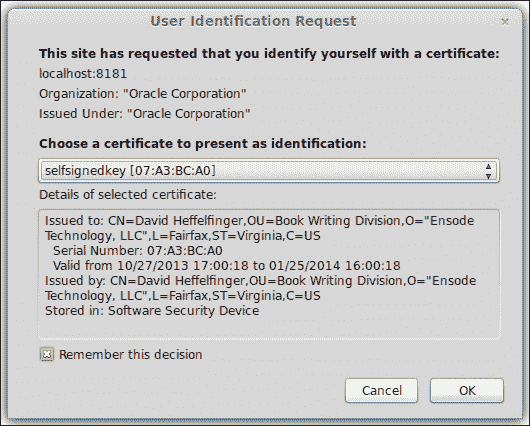

点击**确定**按钮后，我们就可以访问应用程序，如下面的截图所示：

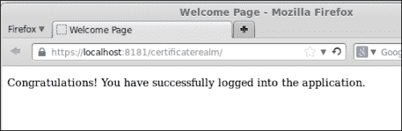

在允许访问应用程序之前，GlassFish 会检查颁发证书的证书颁发机构（由于我们自签了证书，证书所有者和证书颁发机构是相同的），并对照受信任的证书颁发机构列表进行检查。由于我们将自己作为受信任的权威机构通过将我们的自签名证书导入`cacerts.jks`密钥库中，GlassFish 识别证书颁发机构为有效的。然后它从证书中获取主体名称，并将其与应用程序`glassfish-web.xml`文件中的条目进行比较。由于我们将自己添加到这个部署描述符中，并给自己分配了一个有效角色，因此我们被允许进入应用程序。

## 定义额外的域

除了我们在上一节中讨论的三个预配置的安全域之外，我们还可以为应用程序身份验证创建额外的域。我们可以创建与文件域或 admin 域行为完全相同的域。我们还可以创建与证书域行为相似的域。此外，我们还可以创建使用其他身份验证方法的域。我们可以对 LDAP 数据库和关系数据库进行用户身份验证，当 GlassFish 安装在 Solaris 服务器上时，在 GlassFish 中使用 Solaris 身份验证。此外，如果预定义的身份验证机制不符合我们的需求，我们可以实现自己的。

### 定义额外的文件域

在管理控制台中，展开**配置**节点，然后是**server-config**节点，接着是**安全**节点。点击**域**节点，然后在 Web 控制台主区域的结果页面上的**新...**按钮。

我们现在应该看到如下屏幕：


我们要创建一个额外的域，只需在**名称**字段中为其输入一个唯一的名称，为**类名**字段选择`com.sun.enterprise.security.auth.realm.file.FileRealm`，并为**JAAS 上下文**和**密钥文件**字段输入值；**密钥文件**字段的值必须是存储用户信息的文件的绝对路径，对于文件域，**JAAS 上下文**字段的值必须始终是`fileRealm`。

在输入所有必要的信息后，我们可以点击**确定**按钮，我们的新域将被创建。然后我们可以像使用预定义的文件域一样使用它。希望对此新域进行身份验证的应用程序必须使用其名称作为应用程序的`web.xml`部署描述符中`<realm-name>`元素的价值。

或者，可以通过`asadmin`实用程序从命令行添加自定义文件域，通过执行以下命令：

```java
asadmin create-auth-realm --classname com.sun.enterprise.security.auth.realm.file.FileRealm --property file=/home/heffel/additionalFileRealmKeyFile:jaas-context=fileRealm newFileRealm

```

`create-auth-realm`参数告诉`asadmin`我们想要创建一个新的安全域。`--classname`参数的值对应于安全域类名。请注意，它与我们在 Web 控制台上选择的值相匹配。`--property`参数允许我们传递属性及其值；此参数的值必须是属性及其值的冒号（`:`）分隔列表。此命令的最后一个参数是我们希望给我们的安全域起的名字。

### 注意

虽然通过 Web 控制台设置安全域更容易，但通过`asadmin`命令行工具进行操作的优势在于它易于脚本化，允许我们将此命令保存在脚本中，并轻松配置多个 GlassFish 实例。

### 定义额外的证书域

要定义一个额外的证书领域，我们只需在**名称**字段中输入其名称，并将`com.sun.enterprise.security.auth.realm.certificate.CertificateRealm`作为`类名`字段的值，然后点击**确定**创建我们的新领域，如下面的屏幕截图所示：

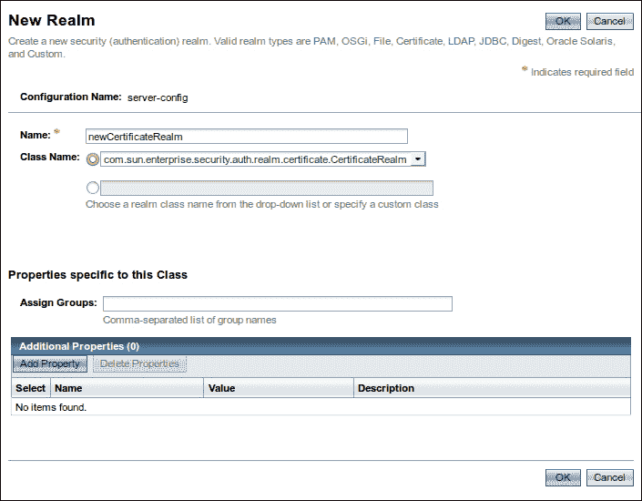

希望使用这个新领域进行身份验证的应用程序必须在`web.xml`部署描述符中的`<realm-name>`元素中使用其名称，并将其`<auth-method>`元素的值指定为`CLIENT-CERT`。当然，客户端证书必须存在并按照*配置应用程序以使用证书领域*部分中所述进行配置。

或者，可以通过`asadmin`实用程序在命令行上创建自定义证书领域，执行以下命令：

```java
asadmin create-auth-realm --classname com.sun.enterprise.security.auth.realm.certificate.CertificateRealm newCertificateRealm

```

在这种情况下，我们不需要传递任何属性，就像我们创建自定义文件领域时必须做的那样。因此，我们只需要传递适当的值给`--classname`参数，并指定新的安全领域名称。

### 定义 LDAP 领域

我们可以轻松设置一个领域以对**LDAP**（**轻量级目录访问协议**）数据库进行身份验证。为此，我们除了输入领域名称这一明显步骤外，还需要将`com.sun.enterprise.security.auth.realm.ldap.LDAPRealm`作为新领域的**类名**值。然后，我们需要在**目录**字段中输入目录服务器的 URL，以及用作搜索用户数据的**基础 DN**字段的值，如下面的屏幕截图所示：

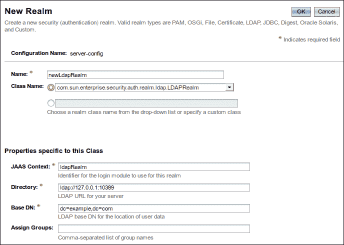

### 注意

在撰写本文时，GlassFish 存在一个错误，阻止从 Web 管理控制台成功添加 LDAP 领域。在本节中，我们解释了应该发生什么，而不是实际发生了什么。希望在你阅读本文时，问题已经得到解决。

如本节稍后所述，从命令行添加 LDAP 领域的方法是正确的。

创建 LDAP 领域后，应用程序可以使用它来对 LDAP 数据库进行身份验证。领域的名称需要用作应用程序`web.xml`部署描述符中`<realm-name>`元素的值。`<auth-method>`元素的值必须是`BASIC`或`FORM`。

LDAP 数据库中的用户和角色可以使用本章前面讨论的`<principal-name>`、`<role-name>`和`<group-name>`元素映射到应用程序的`glassfish-web.xml`部署描述符中的组。

要从命令行创建 LDAP 领域，我们需要使用以下语法：

```java
asadmin create-auth-realm --classname com.sun.enterprise.security.auth.realm.ldap.LDAPRealm --property "jaas-context=ldapRealm:directory=ldap\://127.0.0.1\:1389:base-dn=dc\=ensode,dc\=com" newLdapRealm

```

注意，在这种情况下，`--property` 参数的值在引号之间。这是必要的，因为我们需要转义其值中的某些字符，例如所有冒号和等号。为了转义这些特殊字符，我们只需在它们前面加上反斜杠（`\`）。

### 定义 Solaris 领域

当 GlassFish 安装在 Solaris 服务器上时，它可以通过 Solaris 领域利用操作系统的认证机制。此类领域没有特殊属性；我们只需为它选择一个名称，并将 `com.sun.enterprise.security.auth.realm.solaris.SolarisRealm` 作为 **类名** 字段的值，将 `solarisRealm` 作为 **JAAS 上下文** 字段的值，如以下截图所示：

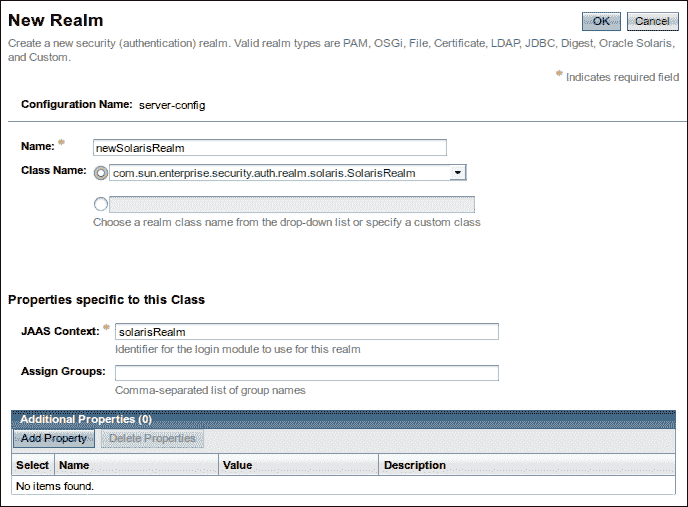

**JAAS 上下文** 字段必须设置为 `solarisRealm`。添加领域后，应用程序可以使用基本认证或基于表单的认证对其进行认证。操作系统组和用户可以通过应用程序的 `glassfish-web.xml` 部署描述符中的 `<principal-name>`、`<role-name>` 和 `<group-name>` 元素映射到应用程序中定义的应用程序角色。

可以通过执行以下命令从命令行创建 Solaris 领域：

```java
asadmin create-auth-realm --classname com.sun.enterprise.security.auth.realm.solaris.SolarisRealm --property jaas-context=solarisRealm newSolarisRealm

```

### 定义 JDBC 领域

我们可以创建的另一种领域类型是 JDBC 领域。这种类型的领域使用存储在数据库表中的用户信息进行用户认证。

为了说明如何对 JDBC 领域进行认证，我们需要创建一个数据库来存储用户信息。以下实体关系图显示了我们可以用来对 JDBC 领域进行认证的示例数据库：

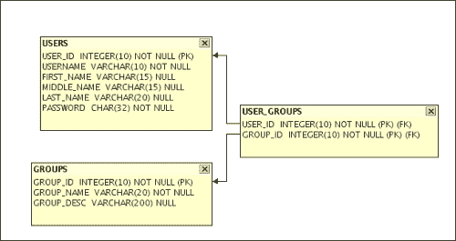

我们的数据库由三个表组成。一个是存储用户信息的 `USERS` 表，另一个是存储组信息的 `GROUPS` 表。由于 `USERS` 和 `GROUPS` 之间存在多对多关系，我们需要添加一个连接表以保持数据规范化。这个第三个表的名称是 `USER_GROUPS`。

注意，`USERS` 表的 `PASSWORD` 列是 `CHAR(32)` 类型。我们选择这种类型而不是 `VARCHAR` 的原因是我们将使用 MD5 散列算法来散列密码，而这些散列总是 32 个字符。

可以通过使用 JDK 包含的 `java.security.MessageDigest` 类轻松地将密码以预期格式加密。以下示例代码将接受明文密码并从中创建一个 MD5 散列：

```java
package net.ensode.glassfishbook;

import java.security.MessageDigest;
import java.security.NoSuchAlgorithmException;

public class EncryptPassword {

  public static String encryptPassword(String password)throws NoSuchAlgorithmException {
 MessageDigest messageDigest = MessageDigest.getInstance("MD5");
    byte[] bs;

    messageDigest.reset();
 bs = messageDigest.digest(password.getBytes());

    StringBuilder stringBuilder = new StringBuilder();

    //hex encode the digest
 for (int i = 0; i < bs.length; i++) {
 String hexVal = Integer.toHexString(0xFF & bs[i]);
 if (hexVal.length() == 1) {
 stringBuilder.append("0");
 }
 stringBuilder.append(hexVal);
 }

  return stringBuilder.toString();
  }

  public static void main(String[] args) {
    String encryptedPassword = null;

    try {

      if (args.length == 0) {
        System.err.println("Usage: java "+ "net.ensode.glassfishbook.EncryptPassword "+ "cleartext");
      } else {
        encryptedPassword = encryptPassword(args[0]);
        System.out.println(encryptedPassword);
      }
    } catch (NoSuchAlgorithmException e) {
       e.printStackTrace();
    }
  }
}
```

上述类的主要功能在其 `encryptPassword()` 方法中定义。它基本上接受一个明文字符串，并使用 `java.security.MessageDigest` 实例的 `digest()` 方法使用 MD5 算法对其进行散列。然后，它将散列编码为一系列十六进制数字。这种编码是必要的，因为 GlassFish 默认期望 MD5 散列的密码是十六进制编码的。

当使用 JDBC 域时，应用程序用户和组不是通过 GlassFish 控制台添加到域中的。相反，它们是通过向适当的表中插入数据来添加的。

一旦我们设置了将保存用户凭据的数据库，我们就可以创建一个新的 JDBC 域。

我们可以通过在 GlassFish 网络控制台的**新域**表单的**名称**字段中输入其名称来创建一个 JDBC 域，然后选择 `com.sun.enterprise.security.auth.realm.jdbc.JDBCRealm` 作为**类名**字段的值，如下截图所示：

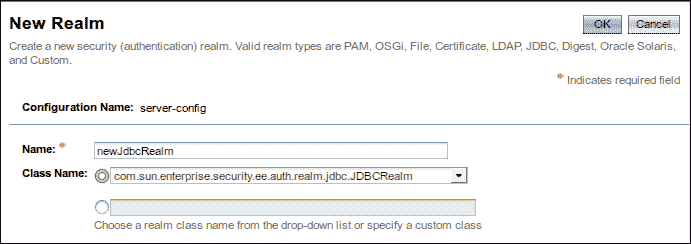

我们还需要为我们的新 JDBC 域设置一些其他属性，如下截图所示：

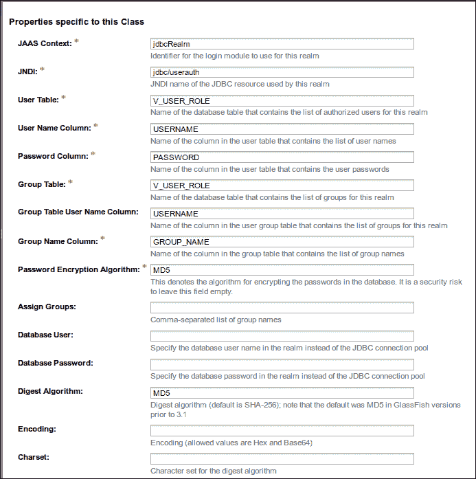

**JAAS 上下文**字段必须设置为 `jdbcRealm` 以用于 JDBC 域。**JNDI**属性值必须是包含域用户和组数据的数据库对应的数据源的 JNDI 名称。**用户表**属性值必须是包含用户名和密码信息的表的名称。

### 注意

注意，在前面的截图中，我们使用了 `V_USER_ROLE` 作为**用户表**属性的值。`V_USER_ROLE` 是一个包含用户和组信息的数据库视图。我们没有直接使用 `USERS` 表，因为 GlassFish 假设用户表和组表都包含一个包含用户名的列。这样做会导致数据重复。为了避免这种情况，我们创建了一个视图，我们可以将其用作**用户表**和**组表**（稍后讨论）属性的值。

**用户名列**属性必须包含在**用户表**属性中包含用户名的列。**密码列**属性值必须是**用户表**属性中包含用户密码的列的名称。**组表**属性值必须是包含用户组的表的名称。**组名列**属性必须包含在**组表**属性中包含用户组名称的列的名称。

所有其他属性都是可选的，在大多数情况下留空。特别值得注意的是**摘要算法**属性。此属性允许我们指定用于散列用户密码的消息摘要算法。此属性的合法值包括 JDK 所支持的所有算法。这些算法包括 MD2、MD5、SHA-1、SHA-256、SHA-384 和 SHA-512。此外，如果我们希望以明文形式存储用户密码，我们可以通过为此属性使用值 `none` 来实现。

### 注意

MD2、MD5 和 SHA-1 并不是很安全，在大多数情况下不应使用。

一旦我们定义了我们的 JDBC 域，我们需要通过其 `web.xml` 和 `glassfish-web.xml` 部署描述符来配置我们的应用程序。配置应用程序以依赖 JDBC 域进行授权和认证的方式与使用任何其他类型的域相同。

除了声明我们将依赖 JDBC 域进行认证和授权之外，就像使用其他类型的域一样，我们还需要将 `web.xml` 部署描述符中定义的角色映射到安全组名称。这可以在 `glassfish-web.xml` 部署描述符中完成。

可以通过执行以下命令从命令行创建 JDBC 域：

```java
asadmin create-auth-realm --classname com.sun.enterprise.security.ee.auth.realm.jdbc.JDBCRealm
--property jaas-context=jdbcRealm:datasource-jndi=jdbc/__UserAuthPool:user-table=V_USER_ROLE:user-name-column=USERNAME:password-column=PASSWORD:group-table=V_USER_ROLE:group-name-column=GROUP_NAME newJdbcRealm

```

### 定义自定义域

尽管预定义的域类型应该涵盖绝大多数情况，但如果我们提供的类型不符合我们的需求，我们可以创建定制的域类型。这样做需要编写定制的 `Realm` 和 `LoginModule` 类。让我们首先讨论定制的 `Realm` 类如下：

```java
package net.ensode.glassfishbook;

import java.util.Enumeration;
import java.util.Vector;

import com.sun.enterprise.security.auth.realm.IASRealm;
import com.sun.enterprise.security.auth.realm.InvalidOperationException;
import com.sun.enterprise.security.auth.realm.NoSuchUserException;

public class SimpleRealm extends IASRealm {

  @Override
 public Enumeration getGroupNames(String userName)throws InvalidOperationException, NoSuchUserException {
    Vector vector = new Vector();

    vector.add("appuser");
    vector.add("appadmin");

    return vector.elements();
    }

  @Override
  public String getAuthType() {
    return "simple";
  }

  @Override
 public String getJAASContext() {
    return "simpleRealm";
  }

 public boolean loginUser(String userName, String password) {
    boolean loginSuccessful = false;

    if ("glassfish".equals(userName) && "secret".equals(password)) {
      loginSuccessful = true;
    }

    return loginSuccessful;
  }
}
```

我们的定制 `Realm` 类必须扩展 `com.sun.enterprise.security.auth.realm.IASRealm`。此类位于 `security.jar` 文件中，因此必须在我们的 `Realm` 类成功编译之前将此 JAR 文件添加到 CLASSPATH 中。

### 注意

`security.jar` 文件可以在 `[glassfish 安装目录]/glassfish/modules` 下找到。

当使用 Maven 或 Ivy 依赖管理时，此 JAR 文件可以在以下存储库中找到：

[`download.java.net/maven/glassfish`](http://download.java.net/maven/glassfish)

组 ID 是 `org.glassfish.security`，而工件 ID 是 `security`。

我们必须重写一个名为 `getGroupNames()` 的方法。该方法接受一个字符串作为参数，并返回一个 `Enumeration` 参数。`String` 参数用于尝试登录域的用户的用户名。`Enumeration` 参数必须包含一个字符串集合，指示用户属于哪些组。在我们的简单示例中，我们只是硬编码了这些组。在实际应用程序中，这些组将从某种持久存储（数据库、文件等）中获取。

我们必须重写的下一个 `Realm` 类方法的是 `getAuthType()` 方法。该方法必须返回一个包含此域所使用的认证类型描述的 `String`。

`getGroupNames()` 和 `getAuthType()` 方法在 `IASRealm`（父）类中被声明为抽象的。尽管 `getJAASContext()` 方法不是抽象的，但我们仍然应该重写它，因为返回的值用于确定从应用程序服务器的 `login.conf` 文件中使用的认证类型。此方法的返回值用于将域映射到相应的登录模块。

最后，我们的 `Realm` 类必须包含一个用于认证用户的方法。我们可以自由地给它起任何名字。此外，我们可以使用任何类型的任意数量的参数。我们的简单示例将单个用户名和密码的值硬编码。再次强调，一个真实的应用程序会从某种持久存储中获取有效的凭证。这个方法是从相应的登录模块类中调用的，如下所示：

```java
package net.ensode.glassfishbook;

import java.util.Enumeration;

import javax.security.auth.login.LoginException;

import com.sun.appserv.security.AppservPasswordLoginModule;
import com.sun.enterprise.security.auth.realm.InvalidOperationException;
import com.sun.enterprise.security.auth.realm.NoSuchUserException;

public class SimpleLoginModule extends AppservPasswordLoginModule {

  @Override
 protected void authenticateUser() throws LoginException {
    Enumeration userGroupsEnum = null;
    String[] userGroupsArray = null;
    SimpleRealm simpleRealm;

    if (!(_currentRealm instanceof SimpleRealm)) {
      throw new LoginException();
    } else {
      simpleRealm = (SimpleRealm) _currentRealm;
    }

 if (simpleRealm.loginUser(_username, _password)) {
      try {
        userGroupsEnum = simpleRealm.getGroupNames(_username);
      } catch (InvalidOperationException e) {
        throw new LoginException(e.getMessage());
      } catch (NoSuchUserException e) {
        throw new LoginException(e.getMessage());
      }

      userGroupsArray = new String[2];
      int i = 0;

      while (userGroupsEnum.hasMoreElements()) {
        userGroupsArray[i++] = ((String) userGroupsEnum.nextElement());
      }
    } else {
      throw new LoginException();
    }
    commitUserAuthentication(userGroupsArray);
  }
}
```

我们的登录模块类必须扩展 `com.sun.appserv.security.AppservPasswordLoginModule`。这个类也位于 `security.jar` 文件中。我们的登录模块类只需要重写一个方法，即 `authenticateUser()`。这个方法不接受任何参数，如果用户认证失败，必须抛出 `LoginException` 异常。`_currentRealm` 变量在父类中定义，其类型为 `com.sun.enterprise.security.auth.realm`。`Realm` 类是所有 `Realm` 类的父类。这个变量在执行 `authenticateUser()` 方法之前被初始化。`LoginModule` 类必须验证这个类是否为预期的类型（在我们的例子中是 `SimpleRealm`）。如果不是，必须抛出 `LoginException` 异常。

在执行 `authenticateUser()` 方法之前定义并初始化的两个其他变量是 `_username` 和 `_password`。这些变量包含用户在登录表单（对于基于表单的认证）或弹出窗口（对于基本认证）中输入的凭证。在我们的例子中，我们简单地将这些值传递给 `Realm` 类，以便它可以验证用户凭证。

在成功认证后，`authenticateUser()` 方法必须调用父类的 `commitUserAuthentication()` 方法。这个方法接受一个包含用户所属组的字符串对象数组。在我们的例子中，我们简单地调用 `Realm` 类中定义的 `getGroupNames()` 方法，并将它返回的 `Enumeration` 参数的元素添加到一个数组中；然后将这个数组传递给 `commitUserAuthentication()`。

GlassFish 对我们的自定义领域和登录模块类不存在认知。我们需要将这些类添加到 GlassFish 的 CLASSPATH 中。最简单的方法是将包含我们的自定义领域和登录模块的 JAR 文件复制到 `[glassfish 安装目录]/glassfish/domains/domain1/lib`。

在我们可以对我们的自定义领域进行应用程序认证之前，我们需要遵循的最后一步是将我们的新自定义领域添加到域的 `login.conf` 文件中，如下所示：

```java
fileRealm {
  com.sun.enterprise.security.auth.login.FileLoginModule required;
};

ldapRealm {
  com.sun.enterprise.security.auth.login.LDAPLoginModule required;
};

solarisRealm {
  com.sun.enterprise.security.auth.login.SolarisLoginModule required;
};

jdbcRealm {
  com.sun.enterprise.security.auth.login.JDBCLoginModule required;
};

jdbcDigestRealm {
  com.sun.enterprise.security.auth.login.JDBCDigestLoginModule required;
};

pamRealm {

  com.sun.enterprise.security.ee.auth.login.PamLoginModule required;

};

simpleRealm {
 net.ensode.glassfishbook.SimpleLoginModule required;
};

```

开括号前的值必须与 `Realm` 类中定义的 `getJAASContext()` 方法的返回值匹配。在这个文件中，`Realm` 和 `LoginModule` 类被链接在一起。GlassFish 域需要重新启动才能使这个更改生效。

现在我们已经准备好使用我们的自定义领域在我们的应用程序中验证用户。我们需要通过 GlassFish 的管理控制台添加我们创建的新领域类型，如下截图所示：

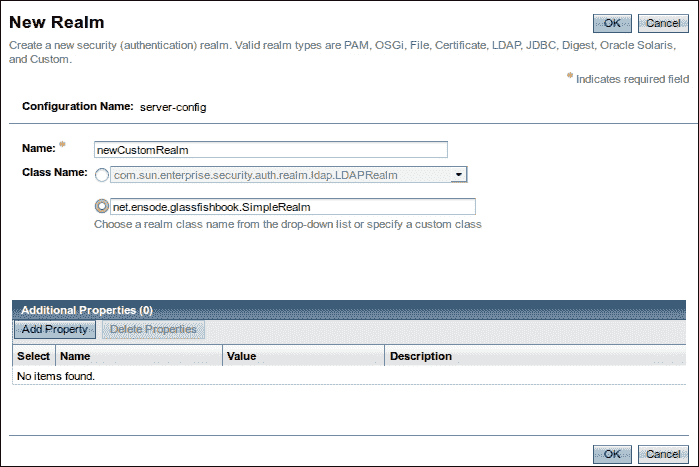

要创建我们的领域，像往常一样，我们需要给它一个名称。而不是从下拉菜单中选择类名，我们需要将其输入到文本字段中。我们的自定义领域没有任何属性；因此，在这个例子中我们不需要添加任何属性。如果有，它们将通过点击**添加属性**按钮并输入属性名称和相应的值来添加。然后，我们的领域将通过覆盖其父类的`init()`方法来获取属性。此方法具有以下签名：

```java
protected void init(Properties arg0) throws BadRealmException, NoSuchRealmException
```

它作为参数接受的`java.util.Properties`实例将预先填充截图所示页面中输入的属性（我们的自定义领域没有任何属性，但对于那些有属性的情况，属性是在截图所示的页面中输入的）。

一旦我们为我们的新自定义领域添加了相关信息，我们就可以像使用任何预定义领域一样使用它。应用程序需要指定其名称作为应用程序`web.xml`部署描述符中`<realm-name>`元素的值。在应用程序级别不需要做任何特别的事情。

就像标准领域一样，可以通过`asadmin`命令行实用程序添加自定义领域，例如，对于我们的自定义领域，我们将执行以下命令：

```java
asadmin create-auth-realm --classname net.ensode.glassfishbook.SimpleRealm newCustomRealm

```

# 摘要

在本章中，我们介绍了如何使用 GlassFish 的默认领域来验证我们的 Web 应用程序。我们介绍了文件领域，它将用户信息存储在平面文件中，以及证书领域，它要求客户端证书进行用户身份验证。

然后，我们介绍了如何使用 GlassFish 包含的领域类创建行为类似于默认领域的额外领域。

我们还介绍了如何使用 GlassFish 中包含的额外`Realm`类来创建针对 LDAP 数据库、关系数据库进行身份验证的领域，以及如何创建与 Solaris 服务器身份验证机制集成的领域。

最后，我们介绍了如何为那些内置的领域不满足我们需求的情况创建自定义`Realm`类。

在下一章中，我们将介绍使用 JAX-WS 的 SOAP Web 服务。
