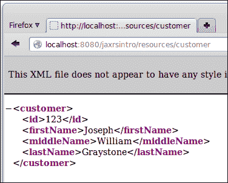

# 第十一章 使用 JAX-RS 开发 RESTful Web 服务

**表征状态转移**（**REST**）是一种架构风格，其中将网络服务视为资源，并且可以通过统一资源标识符（URIs）进行识别。

使用 REST 开发的 Web 服务被称为 RESTful Web 服务。

Java EE 6 通过添加 Java API for RESTful Web Services (JAX-RS) 的支持来支持 RESTful 网络服务。JAX-RS 之前已经作为一个独立的 API 存在了一段时间，在规范的第 6 版中它成为了 Java EE 的一部分。在本章中，我们将介绍如何通过 JAX-RS.API 开发 RESTful 网络服务。

本章将涵盖以下主题：

+   RESTful Web 服务与 JAX-RS 简介

+   开发一个简单的 RESTful 网络服务

+   开发 RESTful 网络服务客户端

+   路径参数

+   查询参数

# 介绍 RESTful 网络服务和 JAX-RS

RESTful 网络服务非常灵活。RESTful 网络服务可以消费多种不同的 MIME 类型，尽管它们通常被编写为消费和/或生成 XML 或 JSON（JavaScript 对象表示法）。

Web 服务必须支持以下四种 HTTP 方法之一或多个：

+   `GET`：按照惯例，`GET`请求用于检索现有资源

+   `POST`：按照惯例，`POST`请求用于更新现有资源

+   `PUT`：按照惯例，`PUT`请求用于创建一个新的资源

+   `DELETE`：按照惯例，`DELETE`请求用于删除现有的资源

我们通过创建一个带有注解方法的类来开发一个使用 JAX-RS 的 RESTful 网络服务，这些方法会在我们的网络服务接收到上述 HTTP 请求方法之一时被调用。一旦我们开发和部署了我们的 RESTful 网络服务，我们就需要开发一个客户端来向我们的服务发送请求。JAX-RS 2.0 引入了一个标准的客户端 API，我们可以使用它来开发 RESTful 网络服务客户端。

# 开发一个简单的 RESTful 网络服务

使用 JAX-RS 开发 RESTful 网络服务既简单又直接。我们每个 RESTful 网络服务都需要通过其唯一的资源标识符（URI）来调用。这个 URI 由 `@Path` 注解指定，我们需要使用它来装饰我们的 RESTful 网络服务资源类。

在开发 RESTful 网络服务时，我们需要开发当我们的网络服务接收到 HTTP 请求时将被调用的方法。我们需要实现处理 RESTful 网络服务所处理的四种请求类型之一或多个的方法：`GET`、`POST`、`PUT`和/或`DELETE`。

JAX-RS API 提供了四个我们可以用来装饰我们 Web 服务中方法的注解；这些注解的命名非常恰当，分别是 `@GET`、`@POST`、`@PUT` 和 `@DELETE`。在我们的 Web 服务中使用这些注解之一来装饰方法，将使其能够响应相应的 HTTP 方法。

此外，我们服务中的每个方法都必须生成和/或消耗一个特定的 MIME 类型。

### 小贴士

**多用途互联网邮件扩展**（**MIME**）是在互联网上传输非 ASCII 文本的标准。MIME 最初是为了通过电子邮件发送非文本数据而开发的，但后来其用途扩展到了包括其他形式的数据传输，如 RESTful Web 服务。

需要通过`@Produces`注解指定将要生成的 MIME 类型；同样，将要消耗的 MIME 类型必须通过`@Consumes`注解指定。

### 小贴士

请注意，这个示例实际上并没有做任何事情；它的目的是说明如何在我们的 RESTful Web 服务资源类中使不同的方法响应不同的 HTTP 方法。

以下示例说明了我们刚刚解释的概念：

```java
package com.ensode.jaxrsintro.service;

import javax.ws.rs.Consumes;
import javax.ws.rs.DELETE;
import javax.ws.rs.GET;
import javax.ws.rs.POST;
import javax.ws.rs.PUT;
import javax.ws.rs.Path;
import javax.ws.rs.Produces;

@Path("customer")
public class CustomerResource {

 @GET
 @Produces("text/xml")
  public String getCustomer() {
    //in a "real" RESTful service, we would retrieve data from a database
    //then return an XML representation of the data.

    System.out.println("--- " + this.getClass().getCanonicalName()
        + ".getCustomer() invoked");

    return "<customer>\n"
        + "<id>123</id>\n"
        + "<firstName>Joseph</firstName>\n"
        + "<middleName>William</middleName>\n"
        + "<lastName>Graystone</lastName>\n"
        + "</customer>\n";
  }

  /**
   * Create a new customer
   * @param customer XML representation of the customer to create
   */
 @PUT
 @Consumes("text/xml")
  public void createCustomer(String customerXML) {
    //in a "real" RESTful service, we would parse the XML
    //received in the customer XML parameter, then insert
    //a new row into the database.

    System.out.println("--- " + this.getClass().getCanonicalName()
        + ".createCustomer() invoked");

    System.out.println("customerXML = " + customerXML);
  }

 @POST
 @Consumes("text/xml")
  public void updateCustomer(String customerXML) {
    //in a "real" RESTful service, we would parse the XML
    //received in the customer XML parameter, then update
    //a row in the database.

    System.out.println("--- " + this.getClass().getCanonicalName()
        + ".updateCustomer() invoked");

    System.out.println("customerXML = " + customerXML);
  }

 @DELETE
 @Consumes("text/xml")
  public void deleteCustomer(String customerXML) {
    //in a "real" RESTful service, we would parse the XML
    //received in the customer XML parameter, then delete
    //a row in the database.

    System.out.println("--- " + this.getClass().getCanonicalName()
        + ".deleteCustomer() invoked");

    System.out.println("customerXML = " + customerXML);
  }
}
```

注意，这个类被`@Path`注解标注；这个注解指定了我们的 RESTful Web 服务的统一资源标识符（URI）。我们服务的完整 URI 将包括协议、服务器名称、端口、上下文根、REST 资源路径（见下一小节）以及传递给此注解的值。

假设我们的 Web 服务已部署到名为`example.com`的服务器上，使用 HTTP 协议在 8080 端口，上下文根为"jaxrsintro"，REST 资源路径为`resources`，那么我们服务的完整 URI 将是`http://example.com:8080/jaxrsintro/resources/customer`。

### 小贴士

由于 Web 浏览器在指向 URL 时会生成 GET 请求，我们可以通过将浏览器指向我们服务的 URI 来测试服务的 GET 方法。

注意，我们类中的每个方法都被`@GET`、`@POST`、`@PUT`或`@DELETE`注解之一标注。这些注解使我们的方法能够响应它们对应的 HTTP 方法。

此外，如果我们的方法需要向客户端返回数据，我们声明数据的 MIME 类型应该通过`@Produces`注解返回。在我们的示例中，只有`getCustomer()`方法向客户端返回数据；我们希望以 XML 格式返回数据，因此，我们将`@Produces`注解的值设置为`text/xml`。同样，如果我们的方法需要从客户端消耗数据，我们需要指定要消耗的数据的 MIME 类型；这是通过`@Consumes`注解完成的。我们服务中的所有方法（除了`getCustomer()`）都消耗数据；在所有情况下，我们期望数据以 XML 格式，因此，我们再次指定`text/xml`作为要消耗的 MIME 类型。

## 配置应用程序的 REST 资源路径

如前一小节简要提到的，在成功部署使用 JAX-RS 开发的 RESTful Web 服务之前，我们需要为我们的应用程序配置 REST 资源路径。我们可以通过开发一个扩展`javax.ws.rs.core.Application`的类并使用`@ApplicationPath`注解来装饰它来实现这一点。

### 通过@ApplicationPath 注解进行配置

如前几章所述，Java EE 6 向 Java EE 规范添加了几个新功能，因此在许多情况下，编写 `web.xml` 部署描述符是不必要的。JAX-RS 也不例外。我们可以通过注解在 Java 代码中配置 REST 资源路径。

要配置我们的 REST 资源路径，而无需依赖于 `web.xml` 部署描述符，我们只需编写一个扩展 `javax.ws.ApplicationPath` 的类，并用 `@ApplicationPath` 注解装饰它；传递给此注解的值是我们服务的 REST 资源路径。

以下代码示例说明了这个过程：

```java
package com.ensode.jaxrsintro.service.config;

import javax.ws.rs.ApplicationPath;
import javax.ws.rs.core.Application;

@ApplicationPath("resources")
public class JaxRsConfig extends Application {
}
```

注意，该类不需要实现任何方法。它只需扩展 `javax.ws.rs.Application` 并用 `@ApplicationPath` 注解装饰。该类必须是公共的，可以具有任何名称，并且可以放在任何包中。

## 测试我们的网络服务

正如我们之前提到的，网络浏览器会向它们指向的任何 URL 发送 `GET` 请求；因此，测试我们对服务发送的 `GET` 请求的最简单方法就是将浏览器指向我们的服务 URI，如下面的截图所示：



网络浏览器仅支持 `GET` 和 `POST` 请求。要通过浏览器测试 `POST` 请求，我们必须编写一个包含具有我们的服务 URI 的 action 属性值的 HTML 表单的 Web 应用程序。虽然对于单个服务来说这很简单，但对我们开发的每个 RESTful 网络服务都这样做可能会变得繁琐。

幸运的是，有一个名为 `curl` 的开源命令行实用工具，我们可以用它来测试我们的网络服务。`curl` 命令包含在大多数 Linux 发行版中，并且可以轻松地下载到 Windows、Mac OS X 和其他几个平台。您可以在 [`curl.haxx.se/`](http://curl.haxx.se/) 下载 `curl` 实用工具。

`curl` 可以向我们的服务发送所有四种请求方法（`GET`、`POST`、`PUT` 和 `DELETE`）。我们的服务器响应将简单地显示在命令行控制台上。`curl` 使用 `-X` 命令行选项，允许我们指定要发送的请求方法；要发送 `GET` 请求，我们只需在命令行中输入以下内容：

```java
curl -XGET http://localhost:8080/jaxrsintro/resources/customer

```

这导致以下输出：

```java
<customer>
<id>123</id>
<firstName>Joseph</firstName>
<middleName>William</middleName>
<lastName>Graystone</lastName>
</customer>

```

这，不出所料，是我们指向我们的服务 URI 时看到的相同输出。

`curl` 的默认请求方法是 `GET`，因此，我们之前示例中的 `-X` 参数是多余的；我们可以通过从命令行调用以下命令来达到相同的结果：

```java
curl  HYPERLINK "http://localhost:8080/jaxrsintro/resources/customer"http://localhost:8080/jaxrsintro/resources/customer

```

在提交任何前两个命令并检查 GlassFish 日志后，我们应该看到我们添加到 `getCustomer()` 方法的 `System.out.println()` 语句的输出。

```java
INFO: --- com.ensode.jaxrsintro.service.CustomerResource.getCustomer() invoked

```

对于所有其他请求方法类型，我们需要向我们的服务发送一些数据。这可以通过 `curl` 命令的 `--data` 命令行参数来实现，如下面的代码所示：

```java
curl -XPUT -HContent-type:text/xml --data "<customer><id>321</id><firstName>Amanda</firstName><middleName>Zoe</middleName><lastName>Adams</lastName></customer>" http://localhost:8080/jaxrsintro/resources/customer

```

如此示例所示，我们需要通过 curl 的`-H`命令行参数指定 MIME 类型，格式如示例所示。

我们可以通过检查 GlassFish 日志来验证之前的命令是否按预期工作，如下面的代码所示：

```java
INFO: --- com.ensode.jaxrsintro.service.CustomerResource.createCustomer() invoked
INFO: customerXML = <customer><id>321</id><firstName>Amanda</firstName><middleName>Zoe</middleName><lastName>Adams</lastName></customer>

```

我们可以通过执行以下代码轻松测试其他请求方法类型：

```java
curl -XPOST -HContent-type:text/xml --data "<customer><id>321</id><firstName>Amanda</firstName><middleName>Tamara</middleName><lastName>Adams</lastName></customer>" http://localhost:8080/jaxrsintro/resources/customer

```

GlassFish 日志显示了相应的输出：

```java
INFO: --- com.ensode.jaxrsintro.service.CustomerResource.updateCustomer() invoked
INFO: customerXML = <customer><id>321</id><firstName>Amanda</firstName><middleName>Tamara</middleName><lastName>Adams</lastName></customer>

```

我们可以通过执行以下命令来测试`delete`方法：

```java
curl -XDELETE -HContent-type:text/xml --data "<customer><id>321</id><firstName>Amanda</firstName><middleName>Tamara</middleName><lastName>Adams</lastName></customer>" http://localhost:8080/jaxrsintro/resources/customer

```

再次，GlassFish 日志显示了相应的输出：

```java
INFO: --- com.ensode.jaxrsintro.service.CustomerResource.deleteCustomer() invoked
INFO: customerXML = <customer><id>321</id><firstName>Amanda</firstName><middleName>Tamara</middleName><lastName>Adams</lastName></customer>

```

## 使用 JAXB 在 Java 和 XML 之间转换数据

在我们之前的例子中，我们处理了原始的 XML 数据。在实际应用中，我们更有可能解析从客户端接收到的 XML 数据，并使用它来填充 Java 对象。此外，我们需要返回给客户端的任何 XML 数据都必须从 Java 对象构建。

将数据从 Java 转换为 XML 以及反向转换是一个如此常见的用例，以至于 Java EE 规范提供了一个 API 来完成它。这个 API 是**Java API for XML Binding**（**JAXB**）。

JAXB 使得将数据从 Java 转换为 XML 变得透明且简单。我们只需要用`@XmlRootElement`注解装饰我们希望转换为 XML 的类。以下代码示例说明了如何做到这一点：

```java
package com.ensode.jaxrstest.entity;

import java.io.Serializable;
import javax.xml.bind.annotation.XmlRootElement;

@XmlRootElement
public class Customer implements Serializable {

  private Long id;
  private String firstName;
  private String middleName;
  private String lastName;

  public Customer() {
  }

  public Customer(Long id, String firstName,
      String middleInitial, String lastName) {
    this.id = id;
    this.firstName = firstName;
    this.middleName = middleInitial;
    this.lastName = lastName;
  }

  public String getFirstName() {
    return firstName;
  }

  public void setFirstName(String firstName) {
    this.firstName = firstName;
  }

  public Long getId() {
    return id;
  }

  public void setId(Long id) {
    this.id = id;
  }

  public String getLastName() {
    return lastName;
  }

  public void setLastName(String lastName) {
    this.lastName = lastName;
  }

  public String getMiddleName() {
    return middleName;
  }

  public void setMiddleName(String middleName) {
    this.middleName = middleName;
  }

  @Override
  public String toString() {
    return "id = " + getId() + "\nfirstName = " + getFirstName()
        + "\nmiddleName = " + getMiddleName() + "\nlastName = "
        + getLastName();
  }
}
```

如此示例所示，除了类级别的`@XmlRootElement`注解外，上述 Java 类没有其他不寻常之处。

一旦我们使用`@XmlRootElement`注解装饰了一个类，我们需要将我们的 Web 服务的参数类型从 String 更改为我们的自定义类，如下面的代码所示：

```java
package com.ensode.jaxbxmlconversion.service;

import com.ensode.jaxbxmlconversion.entity.Customer;
import javax.ws.rs.Consumes;
import javax.ws.rs.DELETE;
import javax.ws.rs.GET;
import javax.ws.rs.POST;
import javax.ws.rs.PUT;
import javax.ws.rs.Path;
import javax.ws.rs.Produces;

@Path("customer")
public class CustomerResource {

  private Customer customer;

  public CustomerResource() {
    //"fake" the data, in a real application the data
    //would come from a database.
    customer = new Customer(1L, "David",
        "Raymond", "Heffelfinger");
  }

  @GET
  @Produces("text/xml")
 public Customer getCustomer() {
    //in a "real" RESTful service, we would retrieve data from a database
    //then return an XML representation of the data.

    System.out.println("--- " + this.getClass().getCanonicalName()
        + ".getCustomer() invoked");

 return customer;
  }

  @POST
  @Consumes("text/xml")
 public void updateCustomer(Customer customer) {
    //in a "real" RESTful service, JAXB would parse the XML
    //received in the customer XML parameter, then update
    //a row in the database.

    System.out.println("--- " + this.getClass().getCanonicalName()
        + ".updateCustomer() invoked");

    System.out.println("---- got the following customer: "
        + customer);
  }

  @PUT
  @Consumes("text/xml")
 public void createCustomer(Customer customer) {
    //in a "real" RESTful service, we would insert
    //a new row into the database with the data in the
    //customer parameter

    System.out.println("--- " + this.getClass().getCanonicalName()
        + ".createCustomer() invoked");

    System.out.println("customer = " + customer);

  }

  @DELETE
  @Consumes("text/xml")
 public void deleteCustomer(Customer customer) {
    //in a "real" RESTful service, we would delete a row
    //from the database corresponding to the customer parameter
    System.out.println("--- " + this.getClass().getCanonicalName()
        + ".deleteCustomer() invoked");

    System.out.println("customer = " + customer);
  }
}
```

如我们所见，我们这个版本的 RESTful Web 服务与之前的版本之间的区别在于，所有参数类型和返回值都已从`String`更改为`Customer`。JAXB 负责将我们的参数和返回类型适当地转换为 XML。当使用 JAXB 时，我们的自定义类对象会自动用客户端发送的 XML 数据填充，返回值也会类似地透明地转换为 XML。

# 开发 RESTful Web 服务客户端

虽然`curl`允许我们快速测试 RESTful Web 服务，并且是一个开发者友好的工具，但它并不完全用户友好；我们不应该期望用户在命令行中输入`curl`命令来使用我们的 Web 服务。因此，我们需要为我们的服务开发一个客户端。JAX-RS 2.0 引入了一个标准客户端 API，我们可以使用它轻松地开发 RESTful Web 服务客户端。

以下示例说明了如何使用 JAX-RS 客户端 API：

```java
package com.ensode.jaxrsintroclient;

import com.ensode.jaxbxmlconversion.entity.Customer;
import javax.ws.rs.client.Client;
import javax.ws.rs.client.ClientBuilder;
import javax.ws.rs.client.Entity;

public class App {

    public static void main(String[] args) {
        App app = new App();
        app.insertCustomer();
    }

    public void insertCustomer() {
        Customer customer = new Customer(234L, "Tamara", "A",
                "Graystone");
 Client client = ClientBuilder.newClient(); 
 client.target(
 "http://localhost:8080/jaxbxmlconversion/resources/customer").
 request().put(
 Entity.entity(customer, "text/xml"),
 Customer.class);
    }
}
```

我们需要做的第一件事是通过在`javax.ws.rs.client.ClientBuilder`类上调用静态`newClient()`方法来创建`javax.ws.rs.client.Client`的一个实例。

然后，我们在我们的`Client`实例上调用`target()`方法，将我们的 RESTful 网络服务的 URI 作为参数传递。`target()`方法返回实现`javax.ws.rs.client.WebTarget`接口的类的实例。

在这一点上，我们在我们的`WebTarget`实例上调用`request()`方法；此方法返回`javax.ws.rs.client.Invocation.Builder`接口的实现。

在这个特定的例子中，我们正在向我们的 RESTful 网络服务发送一个`HTTP PUT`请求；因此，在这个时候，我们调用我们的`Invocation.Builder`实现中的`put()`方法。`put()`方法的第一参数是`javax.ws.rs.client.Entity`的实例。我们可以通过在`Entity`类上调用静态`entity()`方法即时创建`javax.ws.rs.client.Entity`的实例。此方法的第一参数是我们希望传递给我们的 RESTful 网络服务的对象，第二个参数是我们将传递给 RESTful 网络服务的数据的 MIME 类型的字符串表示。`put()`方法的第二个参数是客户端期望从服务中获得的响应类型。在调用`put()`方法后，向我们的 RESTful 网络服务发送一个`HTTP PUT`请求，并调用我们用`@Put`注解装饰的方法（在我们的例子中是`createCustomer()`）。我们还可以调用类似的`get()`、`post()`和`delete()`方法来向我们的 RESTful 网络服务发送相应的 HTTP 请求。

# 处理查询和路径参数

在我们之前的示例中，我们一直在使用一个 RESTful 网络服务来管理单个`customer`对象。在现实生活中，这显然不会很有帮助。常见的情况是开发一个 RESTful 网络服务来处理一组对象（在我们的例子中是客户）。为了确定我们正在处理集合中的哪个特定对象，我们可以向我们的 RESTful 网络服务传递参数。我们可以使用两种类型的参数：查询和路径。

## 查询参数

我们可以向将处理我们的网络服务中的 HTTP 请求的方法添加参数。带有`@QueryParam`注解的参数将从请求 URL 中检索。

以下示例说明了如何在我们的 JAX-RS RESTful 网络服务中使用查询参数：

```java
package com.ensode.queryparams.service;

import com.ensode.queryparams.entity.Customer;
import javax.ws.rs.Consumes;
import javax.ws.rs.DELETE;
import javax.ws.rs.GET;
import javax.ws.rs.POST;
import javax.ws.rs.PUT;
import javax.ws.rs.Path;
import javax.ws.rs.Produces;
import javax.ws.rs.QueryParam;

@Path("customer")
public class CustomerResource {

  private Customer customer;

  public CustomerResource() {
    customer = new Customer(1L, "Samuel",
        "Joseph", "Willow");
  }

  @GET
  @Produces("text/xml")
 public Customer getCustomer(@QueryParam("id") Long id) {
    //in a "real" RESTful service, we would retrieve data from a database
    //using the supplied id.

    System.out.println("--- " + this.getClass().getCanonicalName()
        + ".getCustomer() invoked, id = " + id);

    return customer;
  }

  /**
   * Create a new customer
   * @param customer XML representation of the customer to create
   */
  @PUT
  @Consumes("text/xml")
  public void createCustomer(Customer customer) {
    //in a "real" RESTful service, we would parse the XML
    //received in the customer XML parameter, then insert
    //a new row into the database.

    System.out.println("--- " + this.getClass().getCanonicalName()
        + ".createCustomer() invoked");

    System.out.println("customer = " + customer);

  }

  @POST
  @Consumes("text/xml")
  public void updateCustomer(Customer customer) {
    //in a "real" RESTful service, we would parse the XML
    //received in the customer XML parameter, then update
    //a row in the database.

    System.out.println("--- " + this.getClass().getCanonicalName()
        + ".updateCustomer() invoked");

    System.out.println("customer = " + customer);

    System.out.println("customer= " + customer);
  }

  @DELETE
  @Consumes("text/xml")
 public void deleteCustomer(@QueryParam("id") Long id) {
    //in a "real" RESTful service, we would invoke
    //a DAO and delete the row in the database with the
    //primary key passed as the "id" parameter.

    System.out.println("--- " + this.getClass().getCanonicalName()
        + ".deleteCustomer() invoked, id = " + id);

    System.out.println("customer = " + customer);
  }
}
```

注意，我们唯一需要做的就是用`@QueryParam`注解装饰参数。此注解允许 JAX-RS 检索与注解值匹配的任何查询参数，并将其值分配给参数变量。

我们可以向网络服务的 URL 添加一个参数，就像我们向任何 URL 传递参数一样：

```java
curl -XGET -HContent-type:text/xml http://localhost:8080/queryparams/resources/customer?id=1

```

### 通过 JAX-RS 客户端 API 发送查询参数

JAX-RS 客户端 API 提供了一个简单直接的方法来向 RESTful 网络服务发送查询参数。以下示例说明了如何做到这一点：

```java
package com.ensode.queryparamsclient;

import com.ensode.queryparamsclient.entity.Customer;
import javax.ws.rs.client.Client;
import javax.ws.rs.client.ClientBuilder;

public class App {

    public static void main(String[] args) {
        App app = new App();
        app.getCustomer();
    }

    public void getCustomer() {
        Client client = ClientBuilder.newClient();
        Customer customer = client.target(
              "http://localhost:8080/queryparams/resources/customer").
 queryParam("id", 1L).
                request().get(Customer.class);

        System.out.println("Received the following customer information:");
        System.out.println("Id: " + customer.getId());
        System.out.println("First Name: " + customer.getFirstName());
        System.out.println("Middle Name: " + customer.getMiddleName());
        System.out.println("Last Name: " + customer.getLastName());
    }
}
```

如我们所见，我们只需调用我们的`Client`实例上`target()`方法返回的`javax.ws.rs.client.WebTarget`实例上的`queryParam()`方法，就可以传递参数。此方法的第一参数是参数名称，它必须与 Web 服务中`@QueryParam`注解的值匹配。第二个参数是我们需要传递给 Web 服务的值。如果我们的 Web 服务接受多个参数，我们可以通过链式调用`queryParam()`方法，为我们的 RESTful Web 服务期望的每个参数使用一个。

## 路径参数

我们向 RESTful Web 服务传递参数的另一种方式是通过路径参数。以下示例说明了如何开发一个接受路径参数的 JAX-RS RESTful Web 服务：

```java
package com.ensode.pathparams.service;

import com.ensode.pathparams.entity.Customer;
import javax.ws.rs.Consumes;
import javax.ws.rs.DELETE;
import javax.ws.rs.GET;
import javax.ws.rs.POST;
import javax.ws.rs.PUT;
import javax.ws.rs.Path;
import javax.ws.rs.PathParam;
import javax.ws.rs.Produces;

@Path("/customer/")
public class CustomerResource {

  private Customer customer;

  public CustomerResource() {
    customer = new Customer(1L, "William",
        "Daniel", "Graystone");
  }

  @GET
  @Produces("text/xml")
 @Path("{id}/")
 public Customer getCustomer(@PathParam("id") Long id) {
    //in a "real" RESTful service, we would retrieve data from a database
    //using the supplied id.

    System.out.println("--- " + this.getClass().getCanonicalName()
        + ".getCustomer() invoked, id = " + id);

    return customer;
  }

  @PUT
  @Consumes("text/xml")
  public void createCustomer(Customer customer) {
    //in a "real" RESTful service, we would parse the XML
    //received in the customer XML parameter, then insert
    //a new row into the database.

    System.out.println("--- " + this.getClass().getCanonicalName()
        + ".createCustomer() invoked");

    System.out.println("customer = " + customer);

  }

  @POST
  @Consumes("text/xml")
  public void updateCustomer(Customer customer) {
    //in a "real" RESTful service, we would parse the XML
    //received in the customer XML parameter, then update
    //a row in the database.

    System.out.println("--- " + this.getClass().getCanonicalName()
        + ".updateCustomer() invoked");

    System.out.println("customer = " + customer);

    System.out.println("customer= " + customer);
  }

  @DELETE
  @Consumes("text/xml")
 @Path("{id}/")
 public void deleteCustomer(@PathParam("id") Long id) {
    //in a "real" RESTful service, we would invoke
    //a DAO and delete the row in the database with the
    //primary key passed as the "id" parameter.

    System.out.println("--- " + this.getClass().getCanonicalName()
        + ".deleteCustomer() invoked, id = " + id);

    System.out.println("customer = " + customer);
  }
}
```

任何接受路径参数的方法都必须用`@Path`注解装饰。此注解的`value`属性必须格式化为`"{paramName}/"`，其中`paramName`是方法期望接收的参数。此外，方法参数必须用`@PathParam`注解装饰。`@PathParam`注解的值必须与方法`@Path`注解中声明的参数名称匹配。

我们可以通过调整我们的 Web 服务的 URI 来从命令行传递路径参数；例如，要将`1`的`"id"`参数传递给`getCustomer()`方法（该方法处理`HTTP GET`请求），我们可以从命令行如下操作：

```java
curl -XGET -HContent-type:text/xml http://localhost:8080/pathparams/resources/customer/1

```

这将返回`getCustomer()`方法返回的`Customer`对象的 XML 表示形式的预期输出，如下所示：

```java
<?xml version="1.0" encoding="UTF-8" standalone="yes"?><customer><firstName>William</firstName><id>1</id><lastName>Graystone</lastName><middleName>Daniel</middleName></customer>

```

### 通过 JAX-RS 客户端 API 发送路径参数

通过 JAX-RS 客户端 API 向 Web 服务发送路径参数既简单又直接；我们只需添加几个方法调用，以指定路径参数及其值。以下示例说明了如何进行此操作：

```java
package com.ensode.pathparamsclient;

import com.ensode.pathparamsclient.entity.Customer;
import javax.ws.rs.client.Client;
import javax.ws.rs.client.ClientBuilder;

public class App {

    public static void main(String[] args) {
        App app = new App();
        app.getCustomer();
    }

    public void getCustomer() {
        Client client = ClientBuilder.newClient();
        Customer customer = client.target(
                http://localhost:8080/pathparams/resources/customer").
 path("{id}").
 resolveTemplate("id", 1L).
                request().get(Customer.class);

        System.out.println("Received the following customer information:");
        System.out.println("Id: " + customer.getId());
        System.out.println("First Name: " + customer.getFirstName());
        System.out.println("Middle Name: " + customer.getMiddleName());
        System.out.println("Last Name: " + customer.getLastName());
    }
}
```

在此示例中，我们调用`client.target()`返回的`WebTarget`实例上的`path()`方法。此方法将指定的路径追加到我们的`WebTarget`实例；此方法的价值必须与我们的 RESTful Web 服务中`@Path`注解的值匹配。

在我们的`WebTarget`实例上调用`path()`方法后，我们需要调用`resolveTemplate()`；此方法的第一参数是参数的名称（不带大括号），第二个参数是我们希望作为参数传递给我们的 RESTful Web 服务的值。

如果我们需要向我们的 Web 服务中的一个传递多个参数，我们只需在方法级别的`@Path`参数中使用以下格式：

```java
@Path("/{paramName1}/{paramName2}/")
```

然后使用以下方式对相应的方法参数进行`@PathParam`注解：

```java
public String someMethod(@PathParam("paramName1") String param1,
    @PathParam("paramName2") String param2)
```

然后，可以通过修改 Web 服务的 URI 来调用 Web 服务，将参数按`@Path`注解中指定的顺序传递。例如，以下 URI 将传递`paramName1`和`paramName2`的值`1`和`2`：

`http://localhost:8080/contextroot/resources/customer/1/2`

之前的 URI 无论是从命令行还是通过我们用 JAX-RS 客户端 API 开发的网络服务客户端都可以使用。

# 摘要

在本章中，我们讨论了如何使用 JAX-RS 开发 RESTful 网络服务，这是 Java EE 规范的新增内容。

我们介绍了如何通过在我们的代码中添加一些简单的注解来开发 RESTful 网络服务。我们还解释了如何利用 Java API for XML Binding (JAXB) 自动在 Java 和 XML 之间转换数据。

我们还讨论了如何通过 JAX-RS 客户端 API 开发 RESTful 网络服务客户端。

最后，我们介绍了如何通过 `@PathParam` 和 `@QueryParam` 注解将参数传递给我们的 RESTful 网络服务。
