# JavaServer Faces

在本章中，我们将介绍 **JavaServer Faces**（**JSF**），它是 Java EE 平台的标准组件框架。Java EE 8 包含了 JSF 2.3，这是 JSF 的最新版本。JSF 非常依赖于约定优于配置——如果我们遵循 JSF 的约定，那么我们就不需要编写很多配置。在大多数情况下，我们甚至不需要编写任何配置。这一事实，加上从 Java EE 6 开始 `web.xml` 是可选的，意味着在许多情况下，我们可以编写完整的 Web 应用程序，而无需编写任何一行 XML。

本章我们将涵盖以下主题：

+   Facelets

+   JSF 项目阶段

+   数据验证

+   命名 Bean

+   导航

+   启用 JSF 应用程序的 Ajax 功能

+   JSF HTML5 支持

+   Faces 流

+   JSF 艺术品注入

+   JSF WebSocket 支持

+   JSF 组件库

# 介绍 JSF

JSF 2.0 引入了许多增强功能，使 JSF 应用程序开发更加容易。在接下来的几节中，我们将探讨这些功能的一些。

对于不熟悉 JSF 早期版本的读者来说，可能无法完全理解以下几节。不用担心，到本章结束时，一切都会变得非常清晰。

# Facelets

现代版本的 JSF 与早期版本之间一个显著的差异是，Facelets 现在是首选的视图技术。早期版本的 JSF 使用 **Java Server Pages**（**JSP**）作为其默认的视图技术。由于 JSP 技术早于 JSF，有时使用 JSP 与 JSF 感觉不自然或造成问题。例如，JSP 生命周期与 JSF 生命周期不同；这种不匹配为 JSF 1.x 应用程序开发者引入了一些问题。

JSF 从一开始就被设计为支持多种视图技术。为了利用这一功能，Jacob Hookom 编写了一种专门针对 JSF 的视图技术。他将自己的视图技术命名为 **Facelets**。Facelets 非常成功，成为了 JSF 的实际标准。JSF 专家组认识到 Facelets 的流行，并在 JSF 规范的 2.0 版本中将 Facelets 设为官方视图技术。

# 可选的 faces-config.xml

传统的 J2EE 应用程序遭受了一些人认为过度的 XML 配置问题。

Java EE 5 采取了一些措施来显著减少 XML 配置。Java EE 6 进一步减少了所需的配置，使得 JSF 配置文件 `faces-config.xml` 在 JSF 2.0 中成为可选的。

在 JSF 2.0 及更高版本中，可以通过 `@ManagedBean` 注解配置 JSF 管理 Bean，从而无需在 `faces-config.xml` 中配置它们。Java EE 6 引入了 **上下文和依赖注入**（**CDI**）API，它提供了一种实现通常使用 JSF 管理 Bean 实现的功能的替代方法。截至 JSF 2.2，CDI 命名 Bean 优于 JSF 管理 Bean；JSF 2.3 更进一步，废弃了特定的 JSF 管理 Bean，转而使用 CDI 命名 Bean。

此外，JSF 导航有一个惯例：如果一个 JSF 2.0 命令链接或命令按钮的动作属性的值与一个 facelet（去掉 XHTML 扩展名）的名称相匹配，那么按照惯例，应用程序将导航到与动作名称匹配的 facelet。这个惯例允许我们避免在 `faces-config.xml` 中配置应用程序导航。

对于许多现代 JSF 应用程序，只要我们遵循既定的 JSF 惯例，`faces-config.xml` 完全没有必要。

# 标准资源位置

JSF 2.0 引入了标准资源位置。资源是页面或 JSF 组件需要正确渲染的工件。资源示例包括 CSS 样式表、JavaScript 文件和图片。

在 JSF 2.0 及更高版本中，资源可以放置在名为 `resources` 的文件夹下的子目录中，无论是 WAR 文件的根目录下还是其 `META-INF` 目录下。按照惯例，JSF 组件知道它们可以从这两个位置之一检索资源。

为了避免使 `resources` 目录杂乱，通常将 `资源` 放置在子目录中。这个子目录由 JSF 组件的 `library` 属性引用。

例如，我们可以在 `/resources/css/styles.css` 下放置一个名为 `styles.css` 的 CSS 样式表。

在我们的 JSF 页面中，我们可以使用 `<h:outputStylesheet>` 标签检索这个 CSS 文件，如下所示：

```java
<h:outputStylesheet library="css"  name="styles.css"/> 
```

`library` 属性的值必须与我们的 `stylesheet` 所在的子目录相匹配。

同样，我们可以在 `/resources/scripts/somescript.js` 下放置一个 JavaScript 文件，在 `/resources/images/logo.png` 下放置一个图片，并且我们可以按照以下方式访问这些 `资源`：

```java
<h:graphicImage library="images" name="logo.png"/>
```

以及：

```java
<h:outputScript library="scripts" name="somescript.js"/> 
```

注意，在每种情况下，`library` 属性的值与 `resources` 目录下的相应子目录名称相匹配，而 `name` 属性的值与资源的文件名相匹配。

# 开发我们的第一个 JSF 应用程序

为了说明基本的 JSF 概念，我们将开发一个由两个 Facelet 页面和一个名为 CDI 的单个命名 bean 组成的简单应用程序。

# Facelets

正如我们在本章引言中提到的，JSF 2.0 及更高版本的默认视图技术是**Facelets**。Facelets 需要使用标准 XML 编写。开发 Facelet 页面的最流行方式是结合使用 XHTML 和 JSF 特定的 XML 命名空间。以下示例显示了典型的 Facelet 页面看起来是什么样子：

```java
<?xml version='1.0' encoding='UTF-8' ?> 
<!DOCTYPE html PUBLIC "-//W3C//DTD XHTML 1.0 Transitional//EN" 
 "http://www.w3.org/TR/xhtml1/DTD/xhtml1-transitional.dtd"> 
 <html  

      > <h:head> 
        <title>Enter Customer Data</title> 
 </h:head> <h:body> <h:outputStylesheet library="css" name="styles.css"/> <h:form id="customerForm"> <h:messages></h:messages> <h:panelGrid columns="2" columnClasses="rightAlign,leftAlign"> <h:outputLabel for="firstName" value="First Name:"> </h:outputLabel> <h:inputText id="firstName" label="First Name" value="#{customer.firstName}" required="true"> <f:validateLength minimum="2" maximum="30"> </f:validateLength> </h:inputText> <h:outputLabel for="lastName" value="Last Name:"> </h:outputLabel> <h:inputText id="lastName" label="Last Name" value="#{customer.lastName}" required="true"> <f:validateLength minimum="2" maximum="30"> </f:validateLength> </h:inputText> <h:outputLabel for="email" value="Email:"> </h:outputLabel> <h:inputText id="email"                                                                                                                     
                 label="Email"                                                                                                                     
                 value="#{customer.email}"> <f:validateLength minimum="3" maximum="30"> </f:validateLength> </h:inputText> <h:panelGroup></h:panelGroup> <h:commandButton action="confirmation" value="Save"> </h:commandButton> </h:panelGrid> </h:form> </h:body> 
</html> 
```

以下截图说明了前一个页面在浏览器中的渲染效果：

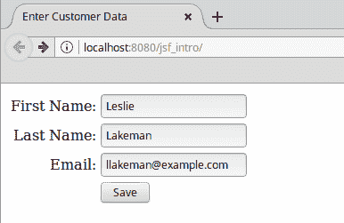

当然，前面的截图是在每个文本字段输入一些数据之后拍摄的；最初每个文本字段都是空的。

几乎任何 Facelet JSF 页面都会包含示例中展示的两个命名空间。第一个命名空间（`h:`）用于渲染 HTML 组件的标签；按照惯例，当使用这个 `标签` 库时，使用前缀 `h`（代表 HTML）。

第二个命名空间（``）是核心 JSF `tag`库，按照惯例，当使用这个`tag`库时，前缀`f`（代表 faces）被使用。`

在前面的示例中，我们首先看到的与 JSF 相关的标签是`<h:head>`和`<h:body>`标签。这些标签与标准的 HTML `<head>`和`<body>`标签类似，当页面在浏览器中显示时，它们会被这样渲染。

`<h:outputStylesheet>`标签用于从一个已知位置（JSF 标准化了资源的位置，如 CSS 样式表和 JavaScript 文件；这将在本章后面详细讨论）加载 CSS 样式表。`library`属性的值必须与 CSS 文件所在的目录相对应（这个目录必须在`resources`目录下）。`name`属性的值必须与我们要加载的 CSS 样式表的名称相对应。

下一个我们看到的标签是`<h:form>`标签。当页面渲染时，这个标签会生成一个 HTML 表单。正如示例所示，不需要为这个标签指定`action`或`method`属性；实际上，这个标签没有`action`或`method`属性。渲染的 HTML 表单的`action`属性将自动生成，而`method`属性始终是`post`。`<h:form>`的`id`属性是可选的；然而，始终添加它是一个好主意，因为它使得调试 JSF 应用程序变得更加容易。

下一个我们看到的标签是`<h:messages>`标签。正如其名所示，这个标签用于显示任何消息。正如我们很快就会看到的，JSF 可以自动生成验证消息，并在该标签内显示。此外，可以通过`javax.faces.context.FacesContext`中定义的`addMessage()`方法以编程方式添加任意消息。

接下来的 JSF 标签是`<h:panelGrid>`。这个标签大致相当于 HTML 表格，但它的工作方式略有不同。不是通过声明行（`<tr>`）和单元格（`<td>`），`<h:panelGrid>`标签有一个`columns`属性；这个属性的值表示由这个标签渲染的表格中的列数。当我们在这个标签内放置组件时，它们将按行放置，直到达到`columns`属性定义的列数，此时下一个组件将被放置在下一行。在示例中，`columns`属性的值是`2`，因此前两个标签将被放置在第一行，接下来的两个将被放置在第二行，以此类推。

`<h:panelGrid>` 的另一个有趣属性是 `columnClasses` 属性。这个属性为渲染表格中的每一列分配一个 CSS 类。在示例中，使用两个 CSS 类（用逗号分隔）作为此属性的值。这会产生将第一个 CSS 类分配给第一列，第二个分配给第二列的效果。如果有三列或更多列，第三列将获得第一个 CSS 类，第四列获得第二个，依此类推，交替进行。为了阐明这是如何工作的，下面的代码片段展示了前面页面生成的 HTML 标记源的一部分：

```java
<table> 
    <tbody> 
        <tr> 
 <td class="rightAlign"> <label for="customerForm:firstName"> First Name: </label> </td> <td class="leftAlign"> <input id="customerForm:firstName" type="text" name="customerForm:firstName" /> </td> 
        </tr> 
        <tr> 
 <td class="rightAlign"> <label for="customerForm:lastName"> Last Name: </label> </td> <td class="leftAlign"> <input id="customerForm:lastName" type="text" name="customerForm:lastName" /> </td> 
        </tr> 
        <tr> 
 <td class="rightAlign"> <label for="customerForm:lastName"> Email: </label> </td> <td class="leftAlign"> <input id="customerForm:email" type="text" name="customerForm:email" /> </td> 
        </tr> 
        <tr> 
 <td class="rightAlign"></td> <td class="leftAlign"> <input type="submit" name="customerForm:j_idt12" value="Save" /> </td> 
        </tr> 
    </tbody> 
</table> 
```

注意到每个 `<td>` 标签都有一个交替的 CSS 标签——`"rightAlign"` 或 `"leftAlign"`；我们通过将值 `"rightAlign,leftAlign"` 分配给 `<h:panelGrid>` 的 `columnClasses` 属性来实现这一点。我们应该注意，我们在示例中使用的 CSS 类是在我们之前讨论的 `<h:outputStylesheet>` 加载的 CSS 样式表中定义的。生成的标记的 ID 是我们分配给 `<h:form>` 组件的 ID 以及每个单独组件的 ID 的组合。注意，我们在页面末尾附近没有为 `<h:commandButton>` 组件分配 ID，因此 JSF 运行时自动分配了一个。

在示例的这个阶段，我们开始在 `<h:panelGrid>` 内部添加组件。这些组件将被渲染在由 `<h:panelGrid>` 渲染的表格内。正如我们之前提到的，渲染表格的列数由 `<h:panelGrid>` 的 `columns` 属性定义。因此，我们不需要担心列（或行），我们只需开始添加组件，它们就会被放置在正确的位置。

我们接下来看到的标签是 `<h:outputLabel>` 标签。这个标签渲染为一个 HTML `label` 元素。标签通过 `for` 属性与其他组件关联，其值必须与标签所针对的组件的 ID 匹配。

接下来，我们看到 `<h:inputText>` 标签。这个标签在渲染的页面中生成一个文本字段。它的 `label` 属性用于任何验证消息；它让用户知道消息指的是哪个字段。

虽然 `<h:inputText>` 的 `label` 属性的值与页面上显示的标签匹配不是强制性的，但强烈建议使用此值。在出现错误的情况下，这将使用户确切知道消息指的是哪个字段。

特别值得注意的是该标签的`value`属性。我们看到的这个属性的值是一个**值绑定表达式**。这意味着这个值与一个应用命名 bean 的属性相关联。在示例中，这个特定的文本字段与名为`customer`的命名 bean 中的`firstName`属性相关联。当用户为这个文本字段输入值并提交表单时，命名 bean 中相应的属性会更新为这个值。标签的`required`属性是可选的；它的有效值是`true`和`false`。如果这个属性设置为`true`，容器将不允许用户提交表单，直到用户为文本字段输入一些数据。如果用户尝试不输入必需的值提交表单，页面将被重新加载，并在`<h:messages>`标签内显示错误消息：

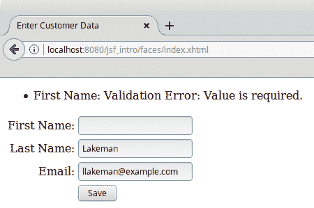

以下截图展示了当用户尝试在示例中保存表单而没有输入客户的首名值时显示的默认错误消息。消息的第一部分（First Name）来自相应`<h:inputTextField>`标签的`label`属性值。消息的文本可以自定义，以及其样式（字体、颜色等）。我们将在本章后面介绍如何进行这些操作。

# 项目阶段

在每个 JSF 页面上放置一个`<h:messages>`标签是个好主意；没有它，用户可能看不到验证消息，并且不知道为什么表单提交没有成功。默认情况下，JSF 验证消息不会在应用服务器日志中生成任何输出。新 JSF 开发者常见的错误是未能将`<h:messages>`标签添加到他们的页面上；如果没有它，如果验证失败，则导航似乎没有原因失败（如果导航失败，则渲染同一页面，如果没有`<h:messages>`标签，浏览器中不会显示错误消息）。

为了避免这种情况，JSF 2.0 引入了**项目阶段**的概念。

在 JSF 2.0 及更高版本中定义了以下项目阶段：

+   生产

+   开发

+   单元测试

+   系统测试

我们可以将项目阶段定义为`web.xml`中 Faces servlet 的初始化参数，或者作为一个自定义的 JNDI 资源。设置项目阶段的首选方式是通过自定义 JNDI 资源。

将全局 JNDI 资源映射到组件资源的流程是应用服务器特定的；当使用 GlassFish 时，需要修改应用的`web.xml`文件，并且我们需要使用 GlassFish 特定的部署描述符。

设置自定义 JNDI 资源是应用服务器特定的，请查阅您的应用服务器文档以获取详细信息。如果我们使用 GlassFish 来部署我们的应用，可以通过登录到 Web 控制台，导航到 JNDI | 自定义资源，然后点击新建...按钮来设置自定义 JNDI：

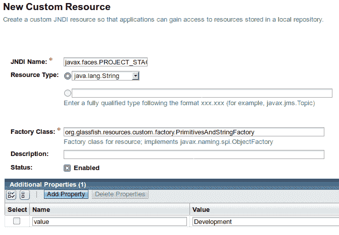

在生成的页面中，我们需要输入以下信息：

| JNDI 名称 | `javax.faces.PROJECT_STAGE` |
| --- | --- |
| 资源类型 | `java.lang.String` |

输入这两个值后，工厂类字段将自动填充为值：`org.glassfish.resources.custom.factory.PrimitivesAndStringFactory`。

输入这些值后，我们需要添加一个名为 value 的新属性，其值对应于我们想要使用的项目阶段（在先前的屏幕截图中为 Development）。

设置项目阶段允许我们在特定阶段运行时执行一些逻辑。例如，在我们的一个命名 bean 中，我们可能有如下代码：

```java
    Application application = facesContext.getApplication(); 

    if (application.getProjectStage().equals( 
        ProjectStage.Production)) { 
      //do production stuff 
    } else if (application.getProjectStage().equals( 
        ProjectStage.Development)) { 
      //do development stuff 
    } else if (application.getProjectStage().equals( 
        ProjectStage.UnitTest)) { 
      //do unit test stuff 
    } else if (application.getProjectStage().equals( 
        ProjectStage.SystemTest)) { 
      //do system test stuff 
    } 
```

如我们所见，项目阶段允许我们根据不同的环境修改我们代码的行为。更重要的是，设置项目阶段允许 JSF 引擎根据项目阶段设置以略有不同的方式运行。与我们的讨论相关，将项目阶段设置为 Development 会导致在应用程序服务器日志中生成额外的日志语句。因此，如果我们忘记在我们的页面上添加`<h:messages>`标签，我们的项目阶段是 Development，验证失败；即使我们省略了`<h:messages>`组件，页面上也会显示验证错误：

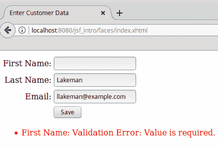

在默认的`Production`阶段，此错误消息不会在页面上显示，这让我们对我们的页面导航似乎不起作用感到困惑。

# 验证

注意到每个`<h:inputField>`标签都有一个嵌套的`<f:validateLength>`标签。正如其名称所暗示的，此标签验证输入的文本字段值是否在最小和最大长度之间。最小和最大值由标签的`minimum`和`maximum`属性定义。《f:validateLength》是 JSF 附带的标准验证器之一。就像`<h:inputText>`的`required`属性一样，当用户尝试提交一个值未通过验证的表单时，JSF 将自动显示默认错误消息：

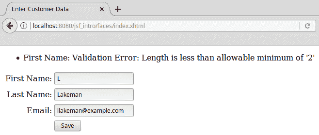

再次，默认消息和样式可以被覆盖；我们将在本章后面介绍如何做到这一点。

除了`<f:validateLength>`之外，JSF 还包括其他标准验证器，这些验证器在以下表中列出：

| **验证标签** | **描述** |
| --- | --- |
| `<f:validateBean>` | Bean 验证允许我们通过在命名`bean`中使用注解来验证命名`bean`的值，而无需向我们的 JSF 标签添加验证器。此标签允许我们在必要时微调 bean 验证。 |
| `<f:validateDoubleRange>` | 验证输入是否是有效的`Double`值，该值在标签的`minimum`和`maximum`属性指定的两个值之间，包括这两个值。 |
| `<f:validateLength>` | 验证输入的长度是否在标签的`minimum`和`maximum`值之间，包括这两个值。 |
| `<f:validateLongRange>` | 验证输入是否为在标签的`minimum`和`maximum`属性指定的值之间的有效`Double`值，包括这些值。 |
| `<f:validateRegex>` | 验证输入是否与标签的`pattern`属性中指定的正则表达式模式匹配。 |
| `<f:validateRequired>` | 验证输入是否不为空。此标签等同于在父输入字段中将`required`属性设置为`true`。 |

注意，在`<f:validateBean>`的描述中，我们简要提到了 bean 验证。bean 验证 JSR 旨在标准化 JavaBean 验证。JavaBeans 被用于多个其他 API 中，直到最近，它们必须实现自己的验证逻辑。JSF 2.0 采用了 bean 验证标准，以帮助验证命名 bean 属性。

如果我们要利用 bean 验证，我们只需要使用适当的 bean 验证注解注释所需的字段，而无需显式使用 JSF 验证器。

要获取完整的 bean 验证注解列表，请参考 Java EE 8 API 中的`javax.validation.constraints`包，链接为[`javaee.github.io/javaee-spec/javadocs/`](https://javaee.github.io/javaee-spec/javadocs/).

# 分组组件

`<h:panelGroup>`是示例中的下一个新标签。通常，`<h:panelGroup>`用于将多个组件组合在一起，以便它们在`<h:panelGrid>`中占据单个单元格。这可以通过在`<h:panelGroup>`内添加组件并将`<h:panelGroup>`添加到`<h:panelGrid>`中来实现。如示例所示，这个特定的`<h:panelGroup>`实例没有子组件。在这种情况下，`<h:panelGroup>`的目的是有空单元格，并使下一个组件`<h:commandButton>`与表单中的所有其他输入字段对齐。

# 表单提交

`<h:commandButton>`在浏览器中渲染一个 HTML 提交按钮。就像标准 HTML 一样，它的目的是提交表单。它的`value`属性简单地设置按钮的标签。此标签的`action`属性用于导航；要显示的下一页基于此属性的值。`action`属性可以有一个`String`常量或一个**方法绑定表达式**，这意味着它可以指向一个名为 bean 中的`method`，该方法返回一个字符串。

如果我们应用程序中页面的基本名称与`<h:commandButton>`标签的`action`属性值匹配，那么当我们点击按钮时，我们将导航到这个页面。这个 JSF 特性使我们免于定义导航规则，就像我们在 JSF 的旧版本中必须做的那样。在我们的示例中，我们的确认页面名为`confirmation.xhtml`；因此，按照惯例，当点击按钮时，将显示此页面，因为其`action`属性的值（confirmation）与页面的基本名称匹配。

即使按钮的标签显示为保存，在我们的简单示例中，点击按钮实际上并不会保存任何数据。

# 命名 Bean

有两种 Java Bean 可以与 JSF 页面交互：JSF 管理 Bean 和 CDI 命名 Bean。JSF 管理 Bean 自 JSF 规范的第一版以来就存在了，并且只能在 JSF 上下文中使用。CDI 命名 Bean 是在 Java EE 6 中引入的，并且可以与其他 Java EE API（如企业 JavaBeans）交互。因此，CDI 命名 Bean 比 JSF 管理 Bean 更受欢迎。

要使一个 Java 类成为 CDI 命名 Bean，我们只需要确保该类有一个公共的无参数构造函数（如果没有声明其他构造函数，则会隐式创建一个，正如我们的例子所示），并在类级别添加 `@Named` 注解。以下是我们的示例中的管理 Bean：

```java
package net.ensode.glassfishbook.jsf;
import javax.enterprise.context.RequestScoped; 
import javax.inject.Named; 

@Named 
@RequestScoped 
public class Customer { 

  private String firstName; 
  private String lastName; 
  private String email; 

  public String getEmail() { 
    return email; 
  } 

  public void setEmail(String email) { 
    this.email = email; 
  } 

  public String getFirstName() { 
    return firstName; 
  } 

  public void setFirstName(String firstName) { 
    this.firstName = firstName; 
  } 

  public String getLastName() { 
    return lastName; 
  } 

  public void setLastName(String lastName) { 
    this.lastName = lastName; 
  } 
} 
```

`@Named` 类注解指定这个 Bean 是一个 CDI 命名 Bean。这个注解有一个可选的 `value` 属性，我们可以用它给我们的 Bean 一个用于 JSF 页面的逻辑名称。然而，按照惯例，这个属性的值与类名（在我们的例子中是 `Customer`）相同，其第一个字符被转换为小写。在我们的例子中，我们让这个默认行为发生，因此我们通过 `customer` 逻辑名称访问我们的 Bean 属性。注意，在我们的示例页面中任何输入字段的 `value` 属性，以查看这个逻辑名称的实际应用。

注意，除了 `@Named` 和 `@RequestScoped` 注解之外，这个 Bean 没有特别之处。它是一个标准的 JavaBean，具有私有属性和相应的 `getter` 和 `setter` 方法。`@RequestScoped` 注解指定 Bean 应该存在于单个请求中。我们 JSF 应用程序中可用的不同命名 Bean 作用域将在下一节中介绍。

# 命名 Bean 作用域

管理 Bean 总是有一个作用域。管理 Bean 的作用域定义了应用程序的生命周期。管理 Bean 的作用域由类级别的注解定义。下表列出了所有有效的管理 Bean 作用域：

| **命名 Bean 作用域注解** | **描述** |
| --- | --- |
| `@ApplicationScoped` | 应用程序作用域的命名 Bean 的同一实例对所有我们的应用程序客户端都是可用的。如果一个客户端修改了应用程序作用域管理 Bean 的值，则更改将在客户端之间反映出来。 |
| `@SessionScoped` | 每个会话作用域的命名 Bean 实例都被分配给我们的应用程序的每个客户端。会话作用域的命名 Bean 可以用来在请求之间保持客户端特定的数据。 |
| `@RequestScoped` | 请求作用域的命名 Bean 只存在于单个 HTTP 请求中。 |
| `@Dependent` | 依赖作用域的命名 Bean 被分配给它们注入到的 Bean 相同的范围。 |
| `@ConversationScoped` | 会话作用域可以跨越多个请求，但通常比会话作用域短。 |

# 导航

如我们的输入页面所示，当在 `customer_data_entry.xhtml` 页面中点击保存按钮时，我们的应用程序将导航到名为 `confirmation.xhtml` 的页面。这是因为我们正在利用 JSF 的约定优于配置功能；如果命令按钮或链接的 `action` 属性值与另一个页面的基本名称匹配，则此导航将带我们到该页面。

点击按钮或链接时是否会导致同一页面的重新加载？当 JSF 未能识别命令按钮或命令链接的 `action` 属性值时，它将默认导航到用户点击按钮或链接时在浏览器中显示的同一页面。该按钮或链接原本是用来导航到另一个页面的。

如果导航似乎没有正常工作，那么很可能是此属性值的拼写错误。记住，按照惯例，JSF 将寻找一个基本名称与命令按钮或链接的 `action` 属性值匹配的页面。

`confirmation.xhtml` 的来源看起来是这样的：

```java
<?xml version='1.0' encoding='UTF-8' ?> 
<!DOCTYPE html PUBLIC "-//W3C//DTD XHTML 1.0 Transitional//EN" "http://www.w3.org/TR/xhtml1/DTD/xhtml1-transitional.dtd"> 
<html  
      > 
  <h:head> 
    <title>Customer Data Entered</title> 
  </h:head> 
  <h:body> 
    <h:panelGrid columns="2" columnClasses="rightAlign,leftAlign"> 
      <h:outputText value="First Name:"></h:outputText> 
      <h:outputText value="#{customer.firstName}"></h:outputText> 
      <h:outputText value="Last Name:"></h:outputText> 
      <h:outputText value="#{customer.lastName}"></h:outputText> 
      <h:outputText value="Email:"></h:outputText> 
      <h:outputText value="#{customer.email}"></h:outputText> 
    </h:panelGrid> 
  </h:body> 
</html> 
```

`<h:outputText>` 是我们之前没有介绍过的唯一标签。这个标签简单地将其 `value` 属性的值显示到渲染的页面，其 `value` 属性可以是简单的字符串或值绑定表达式。由于我们 `<h:outputText>` 标签中的值绑定表达式与之前页面中 `<h:inputText>` 标签使用的相同表达式，它们的值将对应于用户输入的数据：

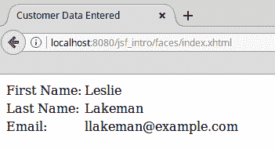

在传统的（即非 JSF）Java web 应用程序中，我们定义 URL 模式以供特定的 servlet 处理。对于 JSF，通常使用 `.jsf` 或 `.faces` 后缀；另一个常用的 JSF URL 映射是 `/faces` 前缀。在满足某些条件下，现代应用程序服务器会自动将所有三个映射添加到 faces `servlet`，如果这些条件得到满足，我们根本不需要指定任何 URL 映射。

如果满足以下任何条件，则 FacesServlet 将自动映射：

+   在我们 web 应用程序的 `WEB-INF` 目录中有一个 `faces-config.xml` 文件

+   在我们 web 应用程序的依赖项之一的 `META-INF` 目录中有一个 `faces-config.xml` 文件

+   在我们 web 应用程序的依赖项之一的 `META-INF` 目录中有一个以 `.faces-config.xml` 结尾的文件名

+   我们在 `web.xml` 或依赖项中的一个 `web-fragment.xml` 中声明一个名为 `javax.faces.CONFIG_FILES` 的上下文参数

+   在调用 `ServletContextInitializer` 的 `onStartup()` 方法时，传递一个非空的类集

当上述条件都不满足时，我们需要在我们的 `web.xml` 部署描述符中显式映射 Faces `servlet`，如下所示：

```java
<?xml version="1.0" encoding="UTF-8"?> 
<web-app  

         xsi:schemaLocation="http://xmlns.jcp.org/xml/ns/javaee http://xmlns.jcp.org/xml/ns/javaee/web-app_3_1.xsd" 
         version="3.1"> 
 <servlet> <servlet-name>Faces Servlet</servlet-name> <servlet-class>javax.faces.webapp.FacesServlet</servlet- 
         class> <load-on-startup>1</load-on-startup> </servlet> <servlet-mapping> <servlet-name>Faces Servlet</servlet-name> <url-pattern>/faces/*</url-pattern> </servlet-mapping> 
</web-app> 
```

我们应用中页面的 URL 是我们的 Facelets 页面的名称，前面加上 `/faces` 前缀。

# 自定义数据验证

除了提供标准验证器供我们使用外，JSF 允许我们创建 `custom validator`s。这可以通过两种方式之一完成——通过创建一个 `custom validator` 类或通过向我们的命名豆中添加 `validation` 方法。

# 创建自定义验证器

除了标准验证器外，JSF 允许我们通过创建一个实现 `javax.faces.validator.Validator` 接口的 Java 类来创建自定义验证器。

以下类实现了一个电子邮件验证器，我们将使用它来验证客户数据输入屏幕中的电子邮件文本输入字段：

```java
package net.ensode.glassfishbook.jsfcustomval; 

import javax.faces.application.FacesMessage; 
import javax.faces.component.UIComponent; 
import javax.faces.component.html.HtmlInputText; 
import javax.faces.context.FacesContext; 
import javax.faces.validator.FacesValidator; 
import javax.faces.validator.Validator; 
import javax.faces.validator.ValidatorException; 
import org.apache.commons.lang3.StringUtils; 

@FacesValidator(value = "emailValidator") 
public class EmailValidator implements Validator { 

  @Override 
 public void validate(FacesContext facesContext, UIComponent uiComponent, Object value) throws ValidatorException { 
    org.apache.commons.validator.routines.EmailValidator emailValidator = 
        org.apache.commons.validator.routines.EmailValidator.getInstance(); 
    HtmlInputText htmlInputText = (HtmlInputText) uiComponent; 

    String email = (String) value; 

    if (!StringUtils.isEmpty(email)) { 
      if (!emailValidator.isValid(email)) { 
        FacesMessage facesMessage = new FacesMessage(htmlInputText. 
            getLabel() 
            + ": email format is not valid"); 
        throw new ValidatorException(facesMessage); 
      } 
    } 
  } 
} 
```

`@FacesValidator` 注解将我们的类注册为 JSF 自定义验证器类。其 `value` 属性的值是 JSF 页面可以用来引用它的逻辑名称。

如示例所示，在实现 Validator 接口时，我们只需要实现一个名为 `validate()` 的方法。该方法接受三个参数——一个 `javax.faces.context.FacesContext` 实例、一个 `javax.faces.component.UIComponent` 实例和一个对象。通常，应用程序开发者只需关注后两个参数。第二个参数是我们正在验证数据的组件，第三个参数是实际值。在示例中，我们将 `uiComponent` 强制转换为 `javax.faces.component.html.HtmlInputText`；这样，我们可以访问其 `getLabel()` 方法，我们可以将其用作错误消息的一部分。

如果输入的值不是无效的电子邮件地址格式，则创建一个新的 `javax.faces.application.FacesMessage` 实例，将要在浏览器中显示的错误消息作为其 `constructor` 参数传递。然后我们抛出一个新的 `javax.faces.validator.ValidatorException`。错误消息随后在浏览器中显示；它通过 JSF API 在幕后到达。

**Apache Commons Validator**：我们的自定义 JSF 验证器使用 `Apache Commons Validator` 进行实际验证。这个库包括许多常见的验证，如日期、信用卡号码、ISBN 号码和电子邮件。在实现自定义验证器时，值得调查这个库是否已经有一个我们可以使用的验证器。

为了在我们的页面上使用我们的验证器，我们需要使用 `<f:validator>` JSF 标签。以下 Facelets 页面是客户数据输入屏幕的修改版本。这个版本使用 `<f:validator>` 标签来验证电子邮件：

```java
<?xml version='1.0' encoding='UTF-8' ?> 
<!DOCTYPE html PUBLIC "-//W3C//DTD XHTML 1.0 Transitional//EN" 
  "http://www.w3.org/TR/xhtml1/DTD/xhtml1-transitional.dtd"> 
<html  

      > 
  <h:head> 
    <title>Enter Customer Data</title> 
  </h:head> 
  <h:body> 
    <h:outputStylesheet library="css" name="styles.css"/> 
    <h:form> 
      <h:messages></h:messages> 
      <h:panelGrid columns="2" 
       columnClasses="rightAlign,leftAlign"> 
        <h:outputText value="First Name:"> 
        </h:outputText> 
        <h:inputText label="First Name" 
         value="#{customer.firstName}" 
         required="true"> 
          <f:validateLength minimum="2" maximum="30"> 
          </f:validateLength> 
        </h:inputText> 
        <h:outputText value="Last Name:"></h:outputText> 
        <h:inputText label="Last Name" 
         value="#{customer.lastName}" 
         required="true"> 
          <f:validateLength minimum="2" maximum="30"> 
          </f:validateLength> 
        </h:inputText> 
        <h:outputText value="Email:"> 
        </h:outputText> 
 <h:inputText label="Email" value="#{customer.email}">           
          <f:validator validatorId="emailValidator" /> </h:inputText> 
        <h:panelGroup></h:panelGroup> 
        <h:commandButton action="confirmation" value="Save"> 
        </h:commandButton> 
      </h:panelGrid> 
    </h:form> 
  </h:body> 
</html>
```

在编写我们的自定义验证器并修改我们的页面以利用它之后，我们可以看到我们的 `validator` 在行动：

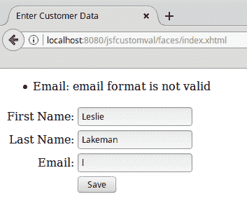

# 验证器方法

我们可以实施自定义验证的另一种方式是通过向应用程序的一个或多个命名豆中添加 `validation` 方法。以下 `Java` 类说明了使用 `validator` 方法进行 JSF 验证的使用：

```java
package net.ensode.glassfishbook.jsfcustomval; 

import javax.enterprise.context.RequestScoped; 
import javax.faces.application.FacesMessage; 
import javax.faces.component.UIComponent; 
import javax.faces.component.html.HtmlInputText; 
import javax.faces.context.FacesContext; 
import javax.faces.validator.ValidatorException; 
import javax.inject.Named; 

import org.apache.commons.lang3.StringUtils; 

@Named 
@RequestScoped 
public class AlphaValidator { 

 public void validateAlpha(FacesContext facesContext, UIComponent uiComponent, Object value) throws ValidatorException { 
    if (!StringUtils.isAlphaSpace((String) value)) { 
      HtmlInputText htmlInputText = (HtmlInputText) uiComponent; 
      FacesMessage facesMessage = new FacesMessage(htmlInputText. 
          getLabel() 
          + ": only alphabetic characters are allowed."); 
      throw new ValidatorException(facesMessage); 
    } 
  } 
} 
```

在这个示例中，该类只包含`validator`方法，但这并不总是必须的。我们可以给我们的`validator`方法起任何我们想要的名称；然而，它的返回值必须是`void`，并且它必须按照示例中所示顺序接受三个参数。换句话说，除了方法名外，验证器方法的签名必须与在`javax.faces.validator.Validator`接口中定义的`validate()`方法的签名相同。

如我们所见，前面的`validator`方法体几乎与我们的`custom validator`类中的`validate()`方法体相同。我们检查用户输入的值以确保它只包含字母字符和/或空格；如果不满足，则抛出一个包含适当错误消息`String`的`ValidatorException`：`StringUtils`。

在示例中，我们使用了`org.apache.commons.lang3.StringUtils`来执行实际的验证逻辑。除了示例中使用的方法外，这个类还包含了一些用于验证`String`是否为数字或字母数字的方法。这个类是`Apache Commons Lang`库的一部分，在编写自定义验证器时非常有用。

由于每个`validator`方法都必须在命名 bean 中，我们需要确保包含我们的`validator`方法的类被注解了`@Named`注解，正如我们在示例中所展示的那样。

我们需要做的最后一件事是将我们的`validator`方法绑定到我们的组件，通过标签的`validator`属性：

```java
<?xml version='1.0' encoding='UTF-8' ?> 
<!DOCTYPE html PUBLIC "-//W3C//DTD XHTML 1.0 Transitional//EN" 
  "http://www.w3.org/TR/xhtml1/DTD/xhtml1-transitional.dtd"> 
<html  

      > 
  <h:head> 
    <title>Enter Customer Data</title> 
  </h:head> 
  <h:body> 
    <h:outputStylesheet library="css" name="styles.css"/> 
    <h:form> 
      <h:messages></h:messages> 
      <h:panelGrid columns="2" 
                   columnClasses="rightAlign,leftAlign"> 
        <h:outputText value="First Name:"> 
        </h:outputText> 
 <h:inputText label="First Name" value="#{customer.firstName}" required="true" validator="#{alphaValidator.validateAlpha}"> 
          <f:validateLength minimum="2" maximum="30"> 
          </f:validateLength> 
 </h:inputText> 
        <h:outputText value="Last Name:"></h:outputText> 
 <h:inputText label="Last Name"         value="#{customer.lastName}" required="true" validator="#{alphaValidator.validateAlpha}"> 
          <f:validateLength minimum="2" maximum="30"> 
          </f:validateLength> 
 </h:inputText> 
        <h:outputText value="Email:"> 
        </h:outputText> 
        <h:inputText label="Email" value="#{customer.email}"> 
          <f:validateLength minimum="3" maximum="30"> 
          </f:validateLength> 
          <f:validator validatorId="emailValidator" /> 
        </h:inputText> 
        <h:panelGroup></h:panelGroup> 
        <h:commandButton action="confirmation" value="Save"> 
        </h:commandButton> 
      </h:panelGrid> 
    </h:form> 
  </h:body> 
</html> 
```

由于“姓氏”和“名字”字段都不应接受除字母字符和空格之外的内容，我们已将我们的自定义验证器方法添加到这两个字段。

注意到`<h:inputText>`标签的`validator`属性的值是一个 JSF 表达式语言；它使用包含我们的`validation`方法的 bean 的默认命名 bean 名称。`alphaValidator`是我们 bean 的名称，而`validateAlpha`是我们`validator`方法的名称。

在修改我们的页面以使用我们的`custom validator`之后，我们现在可以看到它的实际应用：

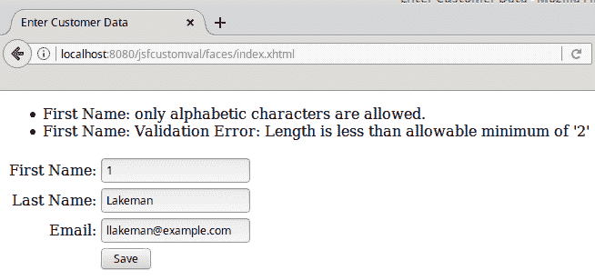

注意到对于“姓氏”字段，我们的自定义验证消息和标准的长度验证器都已被执行。

实现验证器方法的优势是无需创建一个仅用于单个`validator`方法的整个类（我们的示例就是这样做的，但在许多情况下，验证器方法被添加到包含其他方法的现有命名 bean 中）；然而，缺点是每个组件只能由单个验证器方法进行验证。当使用验证器类时，可以在要验证的标签内部嵌套多个`<f:validator>`标签，因此可以在字段上执行多个验证，包括自定义和标准验证。

# 自定义 JSF 的默认消息

正如我们之前提到的，可以自定义 JSF 默认验证消息的样式（字体、颜色、文本等）。此外，还可以修改默认 JSF 验证消息的文本。在接下来的章节中，我们将解释如何修改错误消息的格式和文本。

# 自定义消息样式

可以通过**层叠样式表**（**CSS**）来自定义消息样式。这可以通过使用`<h:message>`、`style`或`styleClass`属性来实现。当我们要声明内联 CSS 样式时，使用`style`属性。当我们要在 CSS 样式表中或在我们页面的`<style>`标签中使用预定义样式时，使用`styleClass`属性。

下面的标记示例展示了如何使用`styleClass`属性来改变错误消息的样式；这是我们在上一节中看到的输入页面的一个修改版本：

```java
<?xml version='1.0' encoding='UTF-8' ?> 
<!DOCTYPE html PUBLIC "-//W3C//DTD XHTML 1.0 Transitional//EN" 
  "http://www.w3.org/TR/xhtml1/DTD/xhtml1-transitional.dtd"> 
<html  

      > 
  <h:head> 
    <title>Enter Customer Data</title> 
  </h:head> 
  <h:body> 
    <h:outputStylesheet library="css" name="styles.css" /> 
    <h:form> 
 <h:messages styleClass="errorMsg"></h:messages> 
      <h:panelGrid columns="2" 
                   columnClasses="rightAlign,leftAlign"> 
        <h:outputText value="First Name:"> 
        </h:outputText> 
        <h:inputText label="First Name" 
         value="#{customer.firstName}" 
         required="true" validator="# 
         {alphaValidator.validateAlpha}"> 
          <f:validateLength minimum="2" maximum="30"> 
          </f:validateLength> 
        </h:inputText> 
        <h:outputText value="Last Name:"></h:outputText> 
        <h:inputText label="Last Name" 
         value="#{customer.lastName}" 
         required="true" 
         validator="#{alphaValidator.validateAlpha}"> 
          <f:validateLength minimum="2" maximum="30"> 
          </f:validateLength> 
        </h:inputText> 
        <h:outputText value="Email:"> 
        </h:outputText> 
        <h:inputText label="Email" value="#{customer.email}"> 
          <f:validator validatorId="emailValidator" /> 
        </h:inputText> 
        <h:panelGroup></h:panelGroup> 
        <h:commandButton action="confirmation" value="Save"> 
        </h:commandButton> 
      </h:panelGrid> 
    </h:form> 
  </h:body> 
</html> 
```

与前一页相比，唯一的区别是使用了`<h:messages>`标签的`styleClass`属性。正如我们之前提到的，`styleClass`属性的值必须与我们在级联样式表中定义的 CSS 样式的名称匹配。

在我们的案例中，我们为消息定义了如下 CSS 样式：

```java
.errorMsg { 
  color: red; 
} 
```

然后我们将这个样式用作我们`<h:messages>`标签的`styleClass`属性的值。

下面的截图展示了实施此更改后验证错误消息的外观：

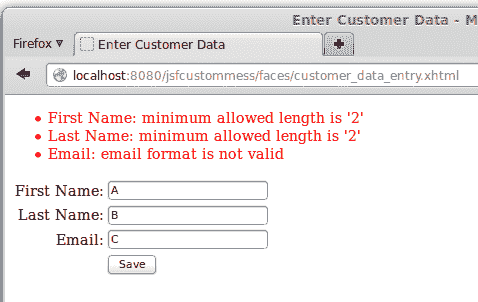

在这个特定案例中，我们只是将错误消息文本的颜色设置为红色，但我们仅限于 CSS 的能力来设置错误消息的样式。

几乎任何标准的 JSF 组件都同时具有`style`和`styleClass`属性，可以用来改变其样式。前者用于预定义的 CSS 样式，后者用于内联 CSS。

# 自定义消息文本

有时可能需要覆盖 JSF 默认验证错误的文本。默认验证错误定义在名为`Messages.properties`的资源包中。这个文件通常可以在应用程序服务器的 JSF JAR 文件中找到。例如，GlassFish 将其包含在`[glassfish 安装目录]/glassfish/modules`下的`javax.faces.jar`文件中。该文件包含多个消息；目前我们只对验证错误感兴趣。默认验证错误消息定义如下：

```java
javax.faces.validator.DoubleRangeValidator.MAXIMUM={1}: Validation Error: Value is greater than allowable maximum of "{0}" 
javax.faces.validator.DoubleRangeValidator.MINIMUM={1}: Validation Error: Value is less than allowable minimum of ''{0}'' 
javax.faces.validator.DoubleRangeValidator.NOT_IN_RANGE={2}: Validation Error: Specified attribute is not between the expected values of {0} and {1}. 
javax.faces.validator.DoubleRangeValidator.TYPE={0}: Validation Error: Value is not of the correct type 
javax.faces.validator.LengthValidator.MAXIMUM={1}: Validation Error: Length is greater than allowable maximum of ''{0}'' 
javax.faces.validator.LengthValidator.MINIMUM={1}: Validation Error: Length is less than allowable minimum of ''{0}'' 
javax.faces.validator.LongRangeValidator.MAXIMUM={1}: Validation Error: Value is greater than allowable maximum of ''{0}'' 
javax.faces.validator.LongRangeValidator.MINIMUM={1}: Validation Error: Value is less than allowable minimum of ''{0}'' 
javax.faces.validator.LongRangeValidator.NOT_IN_RANGE={2}: Validation Error: Specified attribute is not between the expected values of {0} and {1}. 
javax.faces.validator.LongRangeValidator.TYPE={0}: Validation Error: Value is not of the correct type. 
javax.faces.validator.NOT_IN_RANGE=Validation Error: Specified attribute is not between the expected values of {0} and {1}. 
javax.faces.validator.RegexValidator.PATTERN_NOT_SET=Regex pattern must be set. 
javax.faces.validator.RegexValidator.PATTERN_NOT_SET_detail=Regex pattern must be set to non-empty value. 
javax.faces.validator.RegexValidator.NOT_MATCHED=Regex Pattern not matched 
javax.faces.validator.RegexValidator.NOT_MATCHED_detail=Regex pattern of ''{0}'' not matched 
javax.faces.validator.RegexValidator.MATCH_EXCEPTION=Error in regular expression. 
javax.faces.validator.RegexValidator.MATCH_EXCEPTION_detail=Error in regular expression, ''{0}'' 
javax.faces.validator.BeanValidator.MESSAGE={0} 
```

为了覆盖默认的错误消息，我们需要创建自己的资源包，使用与默认资源包相同的键，但修改值以适应我们的需求。以下是我们应用程序的一个非常简单的自定义资源包示例。例如，要覆盖最小长度验证的消息，我们将在我们的自定义资源包中添加以下属性：

```java
javax.faces.validator.LengthValidator.MINIMUM={1}: minimum allowed length is ''{0}'' 
```

在这个资源包中，我们覆盖了当使用 `<f:validateLength>` 标签验证的字段输入值小于允许的最小值时的错误信息。为了让我们的应用程序知道我们有一个自定义的资源包用于消息属性，我们需要修改应用程序的 `faces-config.xml` 文件：

```java
<?xml version='1.0' encoding='UTF-8'?> 
<faces-config version="2.0" 

      xsi:schemaLocation="http://java.sun.com/xml/ns/javaee 
      http://java.sun.com/xml/ns/javaee/web-facesconfig_2_0.xsd"> 
 <application> <message-bundle>net.ensode.Messages</message-bundle> </application> 
</faces-config> 
```

如我们所见，我们只需要对应用程序的 `faces-config.xml` 文件进行修改，添加一个 `<message-bundle>` 元素，指定包含我们的自定义消息的资源包的名称和位置。

自定义错误消息文本定义是我们仍然需要为现代 JSF 应用程序定义 `faces-config.xml` 文件的不多几个情况之一。然而，请注意我们的 `faces-config.xml` 文件是多么简单，与典型的 JSF 1.x 的 `faces-config.xml` 相去甚远，后者通常包含命名 Bean 定义、导航规则和 JSF 验证器定义。

在添加我们的自定义消息资源包并修改应用程序的

`faces-config.xml` 文件后，我们可以看到我们的自定义验证消息在实际中的应用：

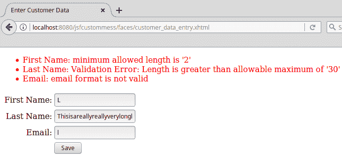

如截图所示，如果我们没有覆盖验证消息，默认消息仍然会显示。在我们的资源包中，我们只覆盖了最小长度验证错误消息，因此我们的自定义错误消息显示在“姓氏”文本字段中。由于我们没有在其他标准 JSF 验证器中覆盖错误消息，因此每个验证器都会显示默认错误消息。电子邮件验证器是我们在本章中之前开发的自定义验证器；由于它是一个自定义验证器，其错误消息不受影响。

# 启用 Ajax 的 JSF 应用程序

JSF 允许我们通过简单地使用 `<f:ajax>` 标签和 CDI 命名 Bean，轻松地将 **Ajax**（**异步 JavaScript 和 XML**）功能实现到我们的 Web 应用程序中，无需实现任何 JavaScript 代码或解析 JSON 字符串来实现带有 JSF 的 Ajax。

下图展示了 `<f:ajax>` 标签的典型用法：

```java
<?xml version='1.0' encoding='UTF-8' ?> 
<!DOCTYPE html PUBLIC "-//W3C//DTD XHTML 1.0 Transitional//EN" "http://www.w3.org/TR/xhtml1/DTD/xhtml1-transitional.dtd"> 
<html  

      > 
  <h:head> 
    <title>JSF Ajax Demo</title> 
  </h:head> 
  <h:body> 
    <h2>JSF Ajax Demo</h2> 
    <h:form> 
      <h:messages/> 
      <h:panelGrid columns="2"> 

        <h:outputText value="Echo input:"/> 
 <h:inputText id="textInput" value="#{controller.text}"> <f:ajax render="textVal" event="keyup"/> </h:inputText> 

        <h:outputText value="Echo output:"/> 
        <h:outputText id="textVal" value="#{controller.text}"/> 
      </h:panelGrid> 
      <hr/> 
      <h:panelGrid columns="2"> 
        <h:panelGroup/> 
        <h:panelGroup/> 
        <h:outputText value="First Operand:"/> 
        <h:inputText id="first" value="#{controller.firstOperand}" 
        size="3"/> 
        <h:outputText value="Second Operand:"/> 
        <h:inputText id="second" 
         value="#{controller.secondOperand}"  
         size="3"/> 
        <h:outputText value="Total:"/> 
        <h:outputText id="sum" value="#{controller.total}"/> 
 <h:commandButton 
         actionListener="#{controller.calculateTotal}" value="Calculate Sum"> <f:ajax execute="first second" render="sum"/> </h:commandButton> 
      </h:panelGrid> 
    </h:form> 
  </h:body> 
</html> 
```

在部署我们的应用程序后，前一页渲染的结果如下截图所示：

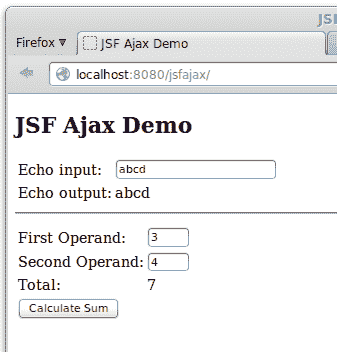

前一页展示了 `<f:ajax>` 标签的两个用法。在页面顶部，我们通过实现一个典型的 Ajax Echo 示例来使用这个标签，其中有一个 `<h:outputText>` 组件使用输入文本组件的值来更新自己。每当输入字段中输入任何字符时，`<h:outputText>` 组件的值会自动更新。

要实现前一段描述的功能，我们在 `<h:inputText>` 标签内放置一个 `<f:ajax>` 标签。`<f:ajax>` 标签的 `render` 属性值必须对应于在 Ajax 请求完成后希望更新的组件的 ID。在我们的特定示例中，我们希望更新 ID 为 `textVal` 的 `<h:outputText>` 组件，因此这是我们 `<f:ajax>` 标签的 `render` 属性的值。

在某些情况下，我们可能需要在 Ajax 事件完成后渲染多个 JSF 组件。为了适应这种情况，我们可以将多个 ID 作为 `render` 属性的值，我们只需用空格将它们分开即可。

在此实例中，我们使用的其他 `<f:ajax>` 属性是 `event` 属性。此属性指示触发 Ajax 事件的 JavaScript 事件。在这种情况下，我们需要在用户在输入字段中输入时释放任何键时触发事件；因此，适当的事件是使用 `keyup`。

以下表格列出了所有支持的 JavaScript 事件：

| **事件** | **描述** |
| --- | --- |
| `blur` | 组件失去焦点。 |
| `change` | 组件失去焦点且其值已被修改。 |
| `click` | 组件被点击。 |
| `dblclick` | 组件被双击。 |
| `focus` | 组件获得焦点。 |
| `keydown` | 当组件获得焦点时，按键被按下。 |
| `keypress` | 当组件获得焦点时，按键被按下或保持按下状态。 |
| `keyup` | 当组件获得焦点时，按键被释放。 |
| `mousedown` | 当组件获得焦点时，鼠标按钮被按下。 |
| `mousemove` | 鼠标指针在组件上移动。 |
| `mouseout` | 鼠标指针离开组件。 |
| `mouseover` | 鼠标指针放置在组件上。 |
| `mouseup` | 当组件获得焦点时，鼠标按钮被释放。 |
| `select` | 组件文本被选中。 |
| `valueChange` | 等同于 change；组件失去焦点且其值已被修改。 |

在页面下方再次使用 `<f:ajax>`，以使命令按钮组件启用 Ajax。在这种情况下，我们希望根据两个输入组件的值重新计算一个值。为了使服务器上的值更新为最新的用户输入，我们使用了 `<f:ajax>` 的 `execute` 属性；此属性接受一个空格分隔的组件 ID 列表，用作输入。然后，我们像之前一样使用 `render` 属性来指定在 Ajax 请求完成后需要重新渲染的组件。

注意我们正在使用 `<h:commandButton>` 的 `actionListener` 属性。此属性通常在我们点击按钮后不需要导航到另一个页面时使用。此属性的值是我们在一个命名豆中编写的 `action listener` 方法。`Action listener` 方法必须返回 `void`，并接受一个 `javax.faces.event.ActionEvent` 实例作为其唯一参数。

我们应用程序的命名 bean 看起来像这样：

```java
package net.ensode.glassfishbook.jsfajax;
import javax.faces.event.ActionEvent;
import javax.faces.view.ViewScoped;
import javax.inject.Named;
@Named
@ViewScoped
public class Controller {
  private String text;
  private int firstOperand;
  private int secondOperand;
  private int total;
  public Controller() {
  }
 public void calculateTotal(ActionEvent actionEvent) {
 total = firstOperand + secondOperand;
 }
  public String getText() {
    return text;
  }
  public void setText(String text) {
    this.text = text;
  }
  public int getFirstOperand() {
    return firstOperand;
  }
  public void setFirstOperand(int firstOperand) {
    this.firstOperand = firstOperand;
  }
  public int getSecondOperand() {
    return secondOperand;
  }
  public void setSecondOperand(int secondOperand) {
    this.secondOperand = secondOperand;
  }
  public int getTotal() {
    return total;
  }
  public void setTotal(int total) {
    this.total = total;
  }
}
```

注意，我们不需要在我们的命名 bean 中做任何特殊的事情来在我们的应用程序中启用 Ajax。所有这些都由页面上的`<f:ajax>`标签控制。

从这个例子中我们可以看出，启用 Ajax 的 JSF 应用程序非常简单；我们只需使用一个标签就可以将页面 Ajax 化，无需编写任何 JavaScript、JSON 或 XML 代码。

# JSF HTML5 支持

HTML5 是 HTML 规范的最新版本，并在之前版本的 HTML 上包含了一些改进。JSF 的现代版本包括几个特性，使得 JSF 页面能够很好地与 HTML5 协同工作。

# HTML5 友好标记

通过使用透传元素，我们可以使用 HTML5 开发页面，并将它们视为 JSF 组件。为此，我们需要指定至少一个元素属性使用[`xmlns.jcp.org/jsf 命名空间`](http://xmlns.jcp.org/jsf%20namespace)。以下示例展示了这种方法在实际中的应用：

```java
<!DOCTYPE html>
<html 
      >
 <head jsf:id="head">
 <title>JSF Page with HTML5 Markup</title>
 <link jsf:library="css" jsf:name="styles.css" rel="stylesheet"
 type="text/css" href="resources/css/styles.css"/>
    </head>
    <body jsf:id="body">
 <form jsf:prependId="false">
            <table style="border-spacing: 0; border-collapse:  
             collapse">
                <tr>
                     <td class="rightAlign">
                      <label jsf:for="firstName">First  
                       Name</label>
                    </td>
                    <td class="leftAlign">
                      <input type="text" jsf:id="firstName"
 jsf:value="#{customer.firstName}"/>
                    </td>
                </tr>
                <tr>
                    <td class="rightAlign">
                      <label jsf:for="lastName">
                       Last Name</label>
                    </td>
                    <td class="leftAlign">
                      <input type="text" jsf:id="lastName"
                       jsf:value="#{customer.lastName}"/>
                       </td>
                </tr>
                <tr>
                    <td class="rightAlign">
                      <label jsf:for="email">Email  
                      Address</label>
                    </td>
                    <td class="leftAlign">
 <input type="email" jsf:id="email" 
 jsf:value="#{customer.email}"/></td>
                </tr>
                <tr>
                    <td></td>
                  <td>
                    <input type="submit"  
                     jsf:action="confirmation"
                     value="Submit"/>
                  </td>
                </tr>
            </table>
        </form>
    </body>
</html>
```

我们首先应该注意的关于前面例子的是，在页面顶部附近带有`jsf`前缀的 XML 命名空间。这个命名空间允许我们在 HTML5 页面上添加 JSF 特定的属性。当 JSF 运行时遇到页面任何标签上以`jsf`为前缀的属性时，它会自动将 HTML5 标签转换为等效的 JSF 组件。JSF 特定的属性与常规 JSF 页面中的属性相同，只是它们以`jsf`为前缀，因此，在这个阶段，它们应该是自解释的，不会详细讨论。

前面的例子将渲染和表现就像本章中的第一个例子一样。

本节中描述的技术如果我们的团队中有经验丰富的 HTML 网页设计师，他们更喜欢对页面外观有完全控制权时非常有用。这些页面使用标准的 HTML5 和 JSF 特定的属性来开发，以便 JSF 运行时可以管理用户输入。

如果我们的团队主要由有限的 CSS/HTML 知识的 Java 开发者组成，那么最好使用 JSF 组件来开发我们的 Web 应用程序的 Web 页面。HTML5 引入了几个在之前 HTML 版本中不存在的属性。因此，JSF 2.2 引入了向 JSF 组件添加任意属性的能力；这种 JSF/HTML5 集成技术将在下一节中讨论。

# 透传属性

JSF 允许定义任何任意属性（不被 JSF 引擎处理）；这些属性在浏览器中显示的生成的 HTML 上简单地以原样渲染。以下示例是本章早期示例的新版本，修改后以利用 HTML5 透传属性：

```java
<?xml version='1.0' encoding='UTF-8' ?>
<!DOCTYPE html PUBLIC "-//W3C//DTD XHTML 1.0 Transitional//EN"
"http://www.w3.org/TR/xhtml1/DTD/xhtml1-transitional.dtd">
<html 

      > <h:head>
        <title>Enter Customer Data</title>
    </h:head>
    <h:body>
        <h:outputStylesheet library="css" name="styles.css"/>
        <h:form id="customerForm">
            <h:messages/>
            <h:panelGrid columns="2"
             columnClasses="rightAlign,leftAlign">
                <h:outputLabel for="firstName" value="First Name:">                
                </h:outputLabel>
                <h:inputText id="firstName"
                 label="First Name"
                 value="#{customer.firstName}"
                 required="true"
                 p:placeholder="First Name"> <f:validateLength minimum="2" maximum="30">
                    </f:validateLength>
                </h:inputText>
                <h:outputLabel for="lastName" value="Last Name:">
                </h:outputLabel>
                <h:inputText id="lastName"
                 label="Last Name"
                 value="#{customer.lastName}"
                 required="true"
                 p:placeholder="Last Name"> <f:validateLength minimum="2" maximum="30">                    
                    </f:validateLength>
                </h:inputText>
                <h:outputLabel for="email" value="Email:">
                </h:outputLabel>
                <h:inputText id="email"
                 label="Email"
                 value="#{customer.email}"
                 p:placeholder="Email Address"> <f:validateLength minimum="3" maximum="30">
                    </f:validateLength>
                </h:inputText>
                <h:panelGroup></h:panelGroup>
                <h:commandButton action="confirmation" 
                 value="Save">
                </h:commandButton>
            </h:panelGrid>
        </h:form>
    </h:body>
</html>
```

我们首先应该注意的关于这个例子的是添加了`http://xmlns.jcp.org/jsf/passthrough`命名空间，这允许我们向我们的 JSF 组件添加任何任意属性。

在我们的例子中，我们在页面上所有的输入文本字段中添加了 HTML5 的`placeholder`属性；正如我们所看到的，它需要以应用顶部定义的命名空间的前缀（在我们的例子中是`p`）为前缀。`placeholder` HTML 属性简单地为输入字段添加一些占位文本，一旦用户开始在输入字段中输入，这些文本就会自动删除（在 HTML5 之前，这种技术通常通过 JavaScript 手动实现）。

以下截图显示了我们的更新页面在实际操作中的效果：

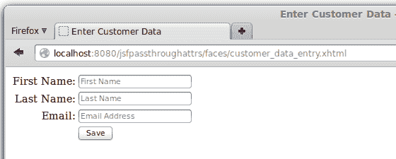

# JSF 2.2 Faces flows

JSF 2.2 引入了 Faces flows，它定义了一个可以跨越多个页面的作用域。当用户进入流程（一组网页）时创建流作用域的 bean，当用户离开流程时销毁。

Faces flows 遵循 JSF 的约定优于配置原则。在开发使用 faces flows 的应用程序时，通常使用以下约定：

+   流程中的所有页面都必须放置在一个以流程名称命名的目录中。

+   必须在包含流程页面的目录内存在一个以目录名称命名并后缀为-flow 的 XML 配置文件（文件可能为空，但必须存在）。

+   流程中的第一个页面必须以包含流程的目录名称命名。

+   流程中的最后一个页面不能位于包含流程的目录内，并且必须以目录名称命名，后缀为-return。

以下截图说明了这些约定：

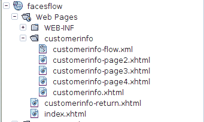

在前面的例子中，我们定义了一个名为`customerinfo`的流程；按照惯例，这些文件位于名为`customerinfo`的目录中，流程的第一个页面命名为`customerinfo.xhtml`（流程中其他页面的名称没有限制）。当我们退出流程时，我们将导航到一个名为`flowname-return.xml`的页面；在我们的例子中，由于我们的流程名为`customerinfo`，所以相关页面的名称是`customerinfo-return.xhtml`，它遵循命名约定并使我们退出流程。

页面的标记没有展示我们之前没有见过的内容；因此，我们不会展示它。所有示例代码都作为本书代码下载包的一部分提供。

所有的前一个页面都将数据存储在一个名为`Customer`的命名 bean 中，它具有流程作用域。

```java
@Named 
@FlowScoped("customerinfo") 
public class Customer implements Serializable { 
   //class body omitted 
} 
```

`@FlowScoped`注解有一个值属性，它必须与 bean 打算与之一起工作的流程的名称匹配（在这个例子中是`customerinfo`）。

此示例创建了一组向导风格的页面，用户可以在流程的多个页面中输入用户数据。

在第一页，我们输入姓名信息：

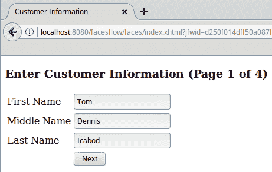

在第二页，我们输入地址信息：

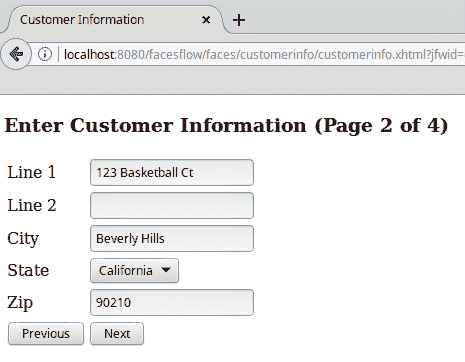

在下一页，我们输入电话号码信息：

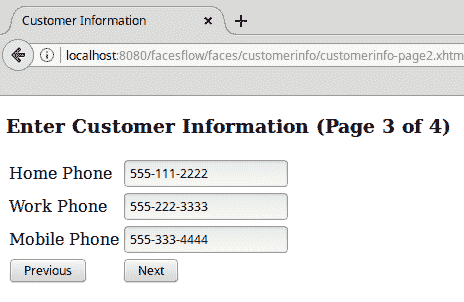

最后，我们显示一个确认页面：

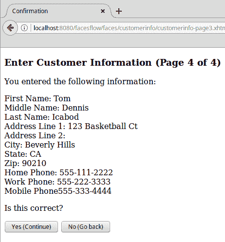

如果用户验证信息正确，我们将导航到`customerinfo-return.xhtml`页面外，否则我们将返回流程中的第一页，以便用户进行任何必要的更正。

# 注入 JSF 组件

JSF 规范早于 CDI。因此，许多 JSF 组件，如`FacesContext`和`ExternalContext`，必须通过`static entry`方法获取；这导致了难以阅读的样板代码。JSF 2.3 引入了通过 CDI 的`@Inject`注解注入 JSF 组件的能力，如下例所示：

```java
package net.ensode.javaee8book.jsfarbitrarymess; 

import java.io.Serializable; 
import javax.faces.application.FacesMessage; 
import javax.faces.context.FacesContext; 
import javax.faces.view.ViewScoped; 
import javax.inject.Inject; 
import javax.inject.Named; 

@Named 
@ViewScoped 
public class ArbitraryMessageController implements Serializable { 

 @Inject FacesContext facesContext; 

    public void saveData() { 
        FacesMessage facesMessage = new  
         FacesMessage(FacesMessage.SEVERITY_INFO, 
         "Data saved successfully", "All Data successfully  
          saved."); 
        facesContext.addMessage(null, facesMessage); 
    } 
} 
```

在这个例子中，我们需要一个`FacesContext`的实例，以便我们可以向一个`<h:messages>`组件发送任意消息；从 JSF 2.3 开始，我们可以简单地使用 CDI 的`@Inject`注解来注解我们的`FacesContext`实例。

第五章，*上下文和依赖注入*，详细介绍了 CDI。

为了能够成功将 JSF 组件注入我们的 CDI 命名 bean 中，我们需要在我们的 WAR 文件的`WEB-INF`目录中添加一个 CDI `beans.xml`部署描述符，确保将其`<beans>`标签的`bean-discovery-mode`属性设置为 all：

```java
<?xml version="1.0" encoding="UTF-8"?> 
<beans  

       xsi:schemaLocation="http://xmlns.jcp.org/xml/ns/javaee  
                           http://xmlns.jcp.org/xml/ns/javaee/beans_1_1.xsd" 
 bean-discovery-mode="all"> 
</beans> 
```

此外，我们还需要在我们的 WAR 文件中有一个被`@FacesConfig`注解的类（我们使用此注解来指定我们正在使用 JSF 2.3）：

```java
package net.ensode.javaee8book.jsfarbitrarymess.config; 

import javax.faces.annotation.FacesConfig; 

@FacesConfig(version = FacesConfig.Version.JSF_2_3) 
public class ConfigurationBean { 

} 
```

如前例所示，包含`@FacesConfig`注解的类不需要有任何代码。我们通过将`FacesConfig.Version.JSF_2_3`作为注解版本属性的值来指定我们正在使用 JSF 2.3。

除了说明如何注入 JSF 组件外，此示例还说明了我们之前未看到的 JSF 功能——通过`FacesContext`的`addMessage()`方法向`<h:messages>`组件发送任意消息的能力。接下来，我们将展示与前面 CDI 命名 bean 对应的标记：

```java
<?xml version='1.0' encoding='UTF-8' ?> 
<!DOCTYPE html PUBLIC "-//W3C//DTD XHTML 1.0 Transitional//EN" "http://www.w3.org/TR/xhtml1/DTD/xhtml1-transitional.dtd"> 
<html  

      > 
    <h:head> 
        <title>JSF Arbitrary Messages Demo</title> 
    </h:head> 
    <h:body> 
        <h:outputStylesheet library="css" name="styles.css"/> 
 <h:messages id="messages" /> 
        <h:form> 
            <h:panelGrid columns="2" 
             columnClasses="rightAlign,leftAlign"> 
                 <!-- Irrelevant markup omitted for brevity --> 
 <h:commandButton    
                actionListener="#     
                {arbitraryMessageController.saveData()}"                             
                 value="Save"> <f:ajax render="messages"/> </h:commandButton> 
            </h:panelGrid> 
        </h:form> 
    </h:body> 
</html> 
```

当用户点击由`<h:commandButton>`组件生成的按钮时，我们的 CDI 命名 bean 的`saveData()`方法被调用，这反过来创建了一个`FacesMessage`实例并将其传递给`FacesContext`的`addMessage()`方法，从而在浏览器中显示消息。

如果不明显，这个简单的示例实际上并没有保存任何数据；我们在这里展示的只是如何将任意消息传递给 JSF `<h:messages>`组件。

以下截图假设用户已经点击了保存按钮。顶部消息是我们对`FacesContext`的`addMessage()`方法的调用结果：

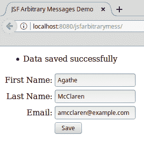

# JSF WebSocket 支持

在典型的 Web 应用程序中，服务器总是响应来自浏览器的请求；服务器没有不响应请求就向客户端浏览器发送数据的方法。**WebSocket**技术提供了浏览器和服务器之间的全双工通信，允许服务器独立地向客户端发送数据，而无需响应请求。WebSocket 技术使得可以为 Web 开发出无数新的应用程序，包括更新股票行情、多人在线游戏和聊天应用程序。

尽管一些这类 Web 应用程序是在 WebSocket 出现之前开发的，但它们依赖于一些技巧来绕过 HTTP 协议的限制。有了 WebSocket，这些技巧就不再必要了。

传统上，编写利用 WebSocket 协议的应用程序需要大量的 JavaScript 代码。JSF 2.3 引入了 WebSocket 支持，并抽象出了大部分 JavaScript 底层代码，使我们能够专注于开发应用程序的业务逻辑。

以下示例展示了使用 JSF 2.3 WebSocket 支持开发的简单聊天应用程序。

首先，让我们看看一个名为 bean 的应用范围 CDI，它负责向所有浏览器客户端发送消息：

```java
package net.ensode.javaee8book.jsfwebsocket; 

import java.io.Serializable; 
import javax.enterprise.context.ApplicationScoped; 
import javax.faces.push.Push; 
import javax.faces.push.PushContext; 
import javax.inject.Inject; 
import javax.inject.Named; 

@Named 
@ApplicationScoped 
public class JsfWebSocketMessageSender implements Serializable { 

    @Inject 
    @Push 
    private PushContext pushContext; 

    public void send(String message) { 
        System.out.println("Sending message: " + message); 
 pushContext.send(message); 
    } 
} 
```

如前例所示，为了通过 WebSockets 向客户端发送数据，我们需要注入一个实现`javax.faces.push.PushContext`接口的实例，并用`@Push`注解标注它。要实际向客户端发送消息，我们需要调用注入的`PushContext`实现中的`send()`方法；在我们的例子中，这是在 CDI named bean 的`send()`方法中完成的。

在我们的例子中，有一个会话范围的 CDI named bean 从用户那里获取输入，并将其传递给前面提到的应用范围 CDI named bean 的`send()`方法。我们的会话范围 CDI bean 如下所示：

```java
package net.ensode.javaee8book.jsfwebsocket; 
import java.io.Serializable; 
import javax.enterprise.context.SessionScoped; 
import javax.inject.Inject; 
import javax.inject.Named; 

@Named 
@SessionScoped 
public class JsfWebSocketController implements Serializable { 

 @Inject private JsfWebSocketMessageSender jsfWebSocketMessageSender; 

    private String userName; 
    private String message; 

 public void sendMessage() { jsfWebSocketMessageSender.send(String.format("%s: %s",            
       userName, message)); } 

    //setters getters and less relevant methods omitted for brevity. 
} 
```

前面的类中的`sendMessage()`方法调用我们之前讨论的应用范围 CDI bean 的`send()`方法，传递用户名和要向所有浏览器广播的消息。上述`sendMessage()`方法是通过 Ajax 在用户点击相应页面上的按钮时调用的，如下所示：

```java
    <h:body> 
 <f:websocket channel="pushContext" onmessage="socketListener" /> 

        <h:form prependId="false"> 
            <h:panelGrid columns="2"> 
                <h:outputLabel for="chatWindow" value="Chat  
                 Window:"/> 
                <textarea id="chatWindow" rows="10"/> 
                <h:outputLabel for="chatInput" value="Type 
                 something here:"/> 
                <h:inputText id="chatInput" 
                 value="#{jsfWebSocketController.message}"/> 
                <h:panelGroup/> 
                <h:commandButton 
                 actionListener="# 
                 {jsfWebSocketController.sendMessage()}"  
                  value="Send message"> 
                    <f:ajax execute="chatInput"  
                     render="chatWindow"/> 
                </h:commandButton> 
            </h:panelGrid> 
        </h:form> 

 <script type="text/javascript"> function socketListener(message, channel, event) { var textArea = document.getElementById('chatWindow'); var textAreaValue = textArea.value; if (textAreaValue.trim() !== '') { textAreaValue += "\n"; } textAreaValue += message; textArea.value = textAreaValue; textArea.scrollTop = textArea.scrollHeight; } </script> 
    </h:body> 
```

在前面的标记中，`<f:websocket>`标签是启用页面 WebSocket 支持所必需的。其`channel`属性的值将页面链接到服务器上相应的`PushContext`实例（在我们的例子中，它定义在应用范围的`JsfWebSocketMessageSender` CDI named bean 中）。按照惯例，`channel`属性的值必须与相应 CDI named bean 上的变量名匹配（在我们的例子中是`pushContext`）。

我们只展示了示例中最相关的部分；完整的示例可以从本书的 GitHub 仓库中下载，网址为[`github.com/dheffelfinger/Java-EE-8-Application-Development-Code-Samples`](https://github.com/dheffelfinger/Java-EE-8-Application-Development-Code-Samples)。

在构建和部署我们的应用程序之后，我们可以看到它的实际运行情况：

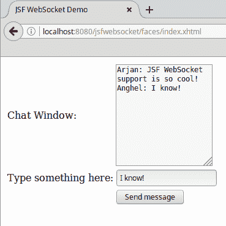

# 其他 JSF 组件库

除了标准的 JSF 组件库之外，还有许多第三方 JSF 标签库可供选择。以下表格列出了其中一些最受欢迎的：

| **标签库** | **发行商** | **许可** | **URL** |
| --- | --- | --- | --- |
| `ICEfaces` | ICEsoft | MPL 1.1 | [`www.icefaces.org`](http://www.icefaces.org) |
| `RichFaces` | Red Hat/JBoss | LGPL | [`www.jboss.org/richfaces`](http://www.jboss.org/richfaces) |
| `Primefaces` | Prime Technology | Apache 2.0 | [`www.primefaces.org`](http://www.primefaces.org) |

# 摘要

在本章中，我们介绍了如何使用 JavaServer Faces（Java EE 平台的标准组件框架）开发基于 Web 的应用程序。我们探讨了如何通过使用 Facelets 作为视图技术以及 CDI 命名豆来创建页面来编写一个简单的应用程序。我们还介绍了如何使用 JSF 的标准验证器、创建自定义验证器或编写`validator`方法来验证用户输入。此外，我们还介绍了如何自定义标准的 JSF 错误消息，包括消息文本和消息样式（字体、颜色等）。还介绍了如何开发启用 Ajax 的 JSF 页面，以及如何集成 JSF 和 HTML5。
