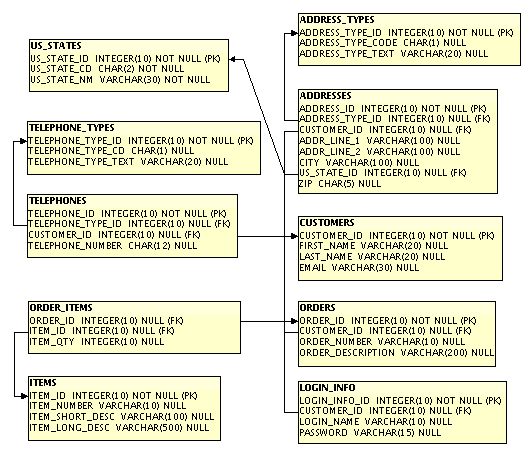

# 使用 Java 持久化 API 进行对象关系映射

任何非平凡的 Java EE 应用程序都会将数据持久化到关系数据库中。在本章中，我们将介绍如何连接到数据库并执行 CRUD（创建、读取、更新、删除）操作。

**Java 持久化 API**（**JPA**）是标准的 Java EE **对象关系映射**（**ORM**）工具。我们将在本章中详细讨论这个 API。

本章涵盖的一些主题包括：

+   通过 JPA 从数据库中检索数据

+   通过 JPA 在数据库中插入数据

+   通过 JPA 在数据库中更新数据

+   通过 JPA 在数据库中删除数据

+   通过 JPA Criteria API 编程构建查询

+   通过 JPA 2.0 的 Bean Validation 支持自动化数据验证

# 客户数据库

本章中的示例将使用名为`CUSTOMERDB`的数据库。该数据库包含跟踪虚构商店客户和订单信息的表。该数据库使用 JavaDB 作为其 RDBMS，因为它与 GlassFish 捆绑在一起，但它可以轻松地适应任何其他 RDBMS。

本书代码下载中包含一个脚本，用于创建此数据库并预先填充其中的一些表。如何执行脚本以及如何添加连接池和数据源以访问它的说明也包含在下载中。

`CUSTOMERDB`数据库的模式在以下图中表示：



如图中所示，数据库包含存储客户信息（如姓名、地址和电子邮件地址）的表。它还包含存储订单和项目信息的表。

`ADDRESS_TYPES`表将存储“家庭”、“邮寄”和“运输”等值，以区分`ADDRESSES`表中的地址类型；同样，`TELEPHONE_TYPES`表存储“手机”、“家庭”和“工作”等值。这两个表在创建数据库时预先填充，以及`US_STATES`表。

为了简单起见，我们的数据库只处理美国地址。

# Java 持久化 API

**Java 持久化 API (JPA**)是在 Java EE 规范的第 5 版中引入的。正如其名称所暗示的，它用于将数据持久化到关系数据库管理系统。JPA 是 J2EE 中使用的实体 Bean 的替代品。Java EE 实体是常规的 Java 类；Java EE 容器知道这些类是实体，因为它们被`@Entity`注解装饰。让我们看看`CUSTOMERDB`数据库中`CUSTOMER`表的实体映射：

```java
package net.ensode.javaee8book.jpaintro.entity; 

import java.io.Serializable; 

import javax.persistence.Column; 
import javax.persistence.Entity; 
import javax.persistence.Id; 
import javax.persistence.Table; 

@Entity 
@Table(name = "CUSTOMERS") 
public class Customer implements Serializable 
{ 
  @Id 
  @Column(name = "CUSTOMER_ID") 
  private Long customerId; 

  @Column(name = "FIRST_NAME") 
  private String firstName; 

  @Column(name = "LAST_NAME") 
  private String lastName; 

  private String email; 

  public Long getCustomerId() 
  { 
    return customerId; 
  } 
  public void setCustomerId(Long customerId) 
  { 
    this.customerId = customerId; 
  } 
  public String getEmail() 
  { 
    return email; 
  } 
  public void setEmail(String email) 
  { 
    this.email = email; 
  } 
  public String getFirstName() 
  { 
    return firstName; 
  } 
  public void setFirstName(String firstName) 
  { 
    this.firstName = firstName; 
  } 
  public String getLastName() 
  { 
    return lastName; 
  } 
  public void setLastName(String lastName) 
  { 
    this.lastName = lastName; 
  } 
} 
```

在前面的代码中，`@Entity`注解让任何其他 Java EE 兼容的应用程序服务器知道这个类是一个 JPA 实体。

`@Table(name = "CUSTOMERS")`注解让应用服务器知道将实体映射到哪个表。`name`元素的值包含实体映射到的数据库表的名称。此注解是可选的；如果类的名称映射到数据库表的名称，则不需要指定实体映射到的表。

`@Id`注解表示`customerId`字段映射到主键。

`@Column`注解将每个字段映射到表中的一列。如果字段的名称与数据库列的名称匹配，则不需要此注解。这就是为什么`email`字段没有被注解的原因。

`EntityManager`类（这实际上是一个接口；每个 Java EE 兼容的应用服务器都提供自己的实现）用于将实体持久化到数据库。以下示例说明了其用法：

```java
package net.ensode.javaee8book.jpaintro.namedbean; 

import javax.annotation.Resource; 
import javax.enterprise.context.RequestScoped; 
import javax.inject.Named; 
import javax.persistence.EntityManager; 
import javax.persistence.PersistenceContext; 
import javax.transaction.HeuristicMixedException; 
import javax.transaction.HeuristicRollbackException; 
import javax.transaction.NotSupportedException; 
import javax.transaction.RollbackException; 
import javax.transaction.SystemException; 
import javax.transaction.UserTransaction; 
import net.ensode.javaee8book.jpaintro.entity.Customer; 

@Named 
@RequestScoped 
public class JpaDemoBean { 

 @PersistenceContext 
    private EntityManager entityManager; 

    @Resource 
    private UserTransaction userTransaction; 

    public String updateDatabase() { 

        String retVal = "confirmation"; 

        Customer customer = new Customer(); 
        Customer customer2 = new Customer(); 
        Customer customer3; 

        customer.setCustomerId(3L); 
        customer.setFirstName("James"); 
        customer.setLastName("McKenzie"); 
        customer.setEmail("jamesm@notreal.com"); 

        customer2.setCustomerId(4L); 
        customer2.setFirstName("Charles"); 
        customer2.setLastName("Jonson"); 
        customer2.setEmail("cjohnson@phony.org"); 

        try { 
            userTransaction.begin(); 
            entityManager.persist(customer); 
            entityManager.persist(customer2); 
            customer3 = entityManager.find(Customer.class, 4L); 
            customer3.setLastName("Johnson"); 
            entityManager.persist(customer3); 
            entityManager.remove(customer); 

            userTransaction.commit(); 
        } catch (HeuristicMixedException | 
                HeuristicRollbackException | 
                IllegalStateException | 
                NotSupportedException | 
                RollbackException | 
                SecurityException | 
                SystemException e) { 
            retVal = "error"; 
            e.printStackTrace(); 
        } 

        return retVal; 
    } 
} 
```

前一个 CDI 命名的 bean 通过依赖注入获取实现`javax.persistence.EntityManager`接口的类的实例。这是通过使用`@PersistenceContext`注解装饰`EntityManager`变量来实现的。

然后，通过`@Resource`注解注入实现`javax.transaction.UserTransaction`接口的类的实例。这个对象是必要的，因为没有它，在数据库中持久化实体时，代码将抛出`javax.persistence.TransactionRequiredException`异常。

`EntityManager`执行许多数据库相关任务，例如在数据库中查找实体、更新它们或删除它们。

由于 JPA 实体是**普通的 Java 对象**（**POJOs**），它们可以通过`new`运算符进行实例化。

调用`setCustomerId()`方法利用了自动装箱，这是 Java 语言在 JDK 1.5 中添加的一个特性。请注意，该方法接受一个`java.lang.Long`实例作为其参数，但我们使用的是`long`原始类型。多亏了这个特性，代码能够正确编译和执行。

在`EntityManager`上对`persist()`方法的调用必须在事务中进行，因此需要通过调用`UserTransaction`上的`begin()`方法来启动一个事务。

然后，我们通过在`entityManager`上对两个先前在代码中填充的`Customer`类的实例调用`persist()`方法，向`CUSTOMERS`表插入两行新数据。

在将`customer`和`customer2`对象中的数据持久化后，我们通过在`entityManager`上调用`find()`方法在数据库中搜索具有四个主键的`CUSTOMERS`表中的行。这是通过调用我们想要获取的对象对应行的实体类作为其第一个参数来完成的。此方法大致等同于实体 bean 的 home 接口上的`findByPrimaryKey()`方法。

我们为`customer2`对象设置的键是 4，因此我们现在有一个该对象的副本。当我们将这位客户的数据最初插入数据库时，他的姓氏被拼错了。现在我们可以通过在`customer3`上调用`setLastName()`方法来纠正约翰逊先生的姓氏，然后我们可以通过调用`entityManager.persist()`来更新数据库中的信息。

然后，我们通过调用`entityManager.remove()`并传递`customer`对象作为参数来删除`customer`对象的信息。

最后，我们通过在`userTransaction`上调用`commit()`方法将更改提交到数据库。

为了使前面的代码按预期工作，必须在包含先前命名的 bean 的 WAR 文件中部署一个名为`persistence.xml`的 XML 配置文件。此文件必须放置在 WAR 文件内的`WEB-INF/classes/META-INF/`目录中。此文件的前面代码内容如下：

```java
<?xml version="1.0" encoding="UTF-8"?> 
<persistence version="2.2"   xsi:schemaLocation="http://xmlns.jcp.org/xml/ns/persistence http://xmlns.jcp.org/xml/ns/persistence/persistence_2_2.xsd"> 
  <persistence-unit name="customerPersistenceUnit"> 
    <jta-data-source>jdbc/__CustomerDBPool</jta-data-source> 
  </persistence-unit> 
</persistence> 
```

`persistence.xml`必须至少包含一个`<persistence-unit>`元素。每个`<persistence-unit>`元素必须为其`name`属性提供一个值，并且必须包含一个`<jta-data-source>`子元素，其值是要用于持久化单元的数据源的 JNDI 名称。

允许多于一个`<persistence-unit>`元素的原因是，一个应用程序可能需要访问多个数据库。对于应用程序将要访问的每个数据库，都需要一个`<persistence-unit>`元素。如果应用程序定义了多个`<persistence-unit>`元素，那么用于注入`EntityManager`的`@PersistenceContext`注解必须为其`unitName`元素提供一个值；此元素的值必须与`persistence.xml`中相应`<persistence-unit>`元素的`name`属性匹配。

无法持久化分离对象异常：通常，一个应用程序会通过`EntityManager.find()`方法检索一个 JPA 实体，然后将该实体传递给业务或用户界面层，在那里它可能会被修改，然后相应实体的数据库数据将被更新。在这种情况下，调用`EntityManager.persist()`将导致异常。为了以这种方式更新 JPA 实体，我们需要调用`EntityManager.merge()`。此方法接受一个 JPA 实体实例作为其单个参数，并使用其中存储的数据更新数据库中的对应行。

# 实体关系

在上一节中，我们看到了如何从数据库中检索、插入、更新和删除单个实体。实体很少是孤立的；在绝大多数情况下，它们与其他实体相关联。

实体可以有一对一、一对多、多对一和多对多的关系。

例如，在`CustomerDB`数据库中，`LOGIN_INFO`表和`CUSTOMERS`表之间存在一对一的关系。这意味着每个客户在登录信息表中恰好对应一行。`CUSTOMERS`表和`ORDERS`表之间存在一对多关系。这是因为一个客户可以下多个订单，但每个订单只属于一个客户。此外，`ORDERS`表和`ITEMS`表之间存在多对多关系。这是因为一个订单可以包含多个项目，而一个项目可以出现在多个订单中。

在接下来的几节中，我们将讨论如何建立 JPA 实体之间的关系。

# 一对一关系

当一个实体的实例可以对应零个或一个另一个实体的实例时，就会发生一对一关系。

一对一实体关系可以是双向的（每个实体都了解这种关系）或单向的（只有其中一个实体了解这种关系）。在`CUSTOMERDB`数据库中，`LOGIN_INFO`表和`CUSTOMERS`表之间的一对一映射是单向的，因为`LOGIN_INFO`表有一个指向`CUSTOMERS`表的外键，但反之则不然。正如我们很快就会看到的，这个事实并不会阻止我们在这两个实体之间创建一个双向的一对一关系。

这里可以看到映射到`LOGIN_INFO`表的`LoginInfo`实体的源代码：

```java
package net.ensode.javaee8book.entityrelationship.entity; 

import javax.persistence.Column; 
import javax.persistence.Entity; 
import javax.persistence.Id; 
import javax.persistence.JoinColumn; 
import javax.persistence.Table; 

@Entity 
@Table(name = "LOGIN_INFO") 
public class LoginInfo 
{ 
  @Id 
  @Column(name = "LOGIN_INFO_ID") 
  private Long loginInfoId; 

  @Column(name = "LOGIN_NAME") 
  private String loginName; 

  private String password; 

 @OneToOne @JoinColumn(name="CUSTOMER_ID") private Customer customer; 
  public Long getLoginInfoId() 
  { 
    return loginInfoId; 
  } 

  public void setLoginInfoId(Long loginInfoId) 
  { 
    this.loginInfoId = loginInfoId; 
  } 

  public String getPassword() 
  { 
    return password; 
  } 

  public void setPassword(String password) 
  { 
    this.password = password; 
  } 

  public String getLoginName() 
  { 
    return loginName; 
  } 

  public void setLoginName(String userName) 
  { 
    this.loginName = userName; 
  } 

  public Customer getCustomer() 
  { 
    return customer; 
  } 

  public void setCustomer(Customer customer) 
  { 
    this.customer = customer; 
  } 

} 
```

这个实体的代码与`Customer`实体的代码非常相似。它定义了映射到数据库列的字段。每个名称与数据库列名称不匹配的字段都装饰了`@Column`注解；除此之外，主键还装饰了`@Id`注解。

前面的代码变得有趣的地方在于`customer`字段的声明。如代码所示，`customer`字段装饰了`@OneToOne`注解；这使应用服务器知道这个实体与`Customer`实体之间存在一对一的关系。`customer`字段还装饰了`@JoinColumn`注解。这个注解让容器知道`LOGIN_INFO`表中的哪一列是对应`CUSTOMER`表主键的外键。由于`LOGIN_INFO`表（`LoginInfo`实体映射到的表）有一个指向`CUSTOMER`表的外键，因此`LoginInfo`实体拥有这个关系。如果这个关系是单向的，我们就不需要对`Customer`实体做任何修改。然而，由于我们希望这两个实体之间有一个双向关系，我们需要在`Customer`实体中添加一个`LoginInfo`字段，以及相应的 getter 和 setter 方法。

正如我们之前提到的，为了使`Customer`和`LoginInfo`实体之间的一对一关系双向，我们需要对`Customer`实体进行一些简单的修改：

```java
package net.ensode.javaee8book.entityrelationship.entity; 

import java.io.Serializable; 
import java.util.Set; 

import javax.persistence.CascadeType; 
import javax.persistence.Column; 
import javax.persistence.Entity; 
import javax.persistence.Id; 
import javax.persistence.OneToMany; 
import javax.persistence.OneToOne; 
import javax.persistence.Table; 

@Entity 
@Table(name = "CUSTOMERS") 
public class Customer implements Serializable 
{ 
  @Id 
  @Column(name = "CUSTOMER_ID") 
  private Long customerId; 

  @Column(name = "FIRST_NAME") 
  private String firstName; 

  @Column(name = "LAST_NAME") 
  private String lastName; 

  private String email; 

 @OneToOne(mappedBy = "customer") private LoginInfo loginInfo; public LoginInfo getLoginInfo() { return loginInfo; } public void setLoginInfo(LoginInfo loginInfo) { this.loginInfo = loginInfo; } 
   //Additional setters and getters omitted for brevity 
} 
```

为了使`Customer`实体中的一对一关系双向，我们只需要在该实体中添加一个`LoginInfo`字段，以及相应的 setter 和 getter 方法。`loginInfo`字段被`@OneToOne`注解装饰。由于`Customer`实体不拥有这个关系（它映射的表没有对应表的键外键），`@OneToOne`注解的`mappedBy`元素需要被添加。此元素指定对应实体中哪个字段有关系的另一端。在这个特定的情况下，`LoginInfo`实体中的客户字段对应于这个一对一关系的另一端。

以下 Java 类说明了前面实体使用的情况：

```java
package net.ensode.javaee8book.entityrelationship.namedbean; 

import javax.annotation.Resource; 
import javax.enterprise.context.RequestScoped; 
import javax.inject.Named; 
import javax.persistence.EntityManager; 
import javax.persistence.PersistenceContext; 
import javax.transaction.HeuristicMixedException; 
import javax.transaction.HeuristicRollbackException; 
import javax.transaction.NotSupportedException; 
import javax.transaction.RollbackException; 
import javax.transaction.SystemException; 
import javax.transaction.UserTransaction; 
import net.ensode.javaee8book.entityrelationship.entity.Customer; 
import net.ensode.javaee8book.entityrelationship.entity.LoginInfo; 

@Named 
@RequestScoped 
public class OneToOneRelationshipDemoBean { 

    @PersistenceContext 
    private EntityManager entityManager; 

    @Resource 
    private UserTransaction userTransaction; 

    public String updateDatabase() { 
        String retVal = "confirmation"; 
        Customer customer; 
        LoginInfo loginInfo = new LoginInfo(); 

        loginInfo.setLoginInfoId(1L); 
        loginInfo.setLoginName("charlesj"); 
        loginInfo.setPassword("iwonttellyou"); 

        try { 
            userTransaction.begin(); 

            customer = entityManager.find(Customer.class, 4L); 
            loginInfo.setCustomer(customer); 

            entityManager.persist(loginInfo); 

            userTransaction.commit(); 

        } catch (NotSupportedException | 
                SystemException | 
                SecurityException | 
                IllegalStateException | 
                RollbackException | 
                HeuristicMixedException | 
                HeuristicRollbackException e) { 
            retVal = "error"; 
            e.printStackTrace(); 
        } 

        return retVal; 
    } 
} 
```

在这个例子中，我们首先创建一个`LoginInfo`实体的实例，并用一些数据填充它。然后，我们通过调用`EntityManager`的`find()`方法从数据库中获取`Customer`实体的实例（该实体的数据在之前的某个例子中已插入到`CUSTOMERS`表中）。然后，我们在`LoginInfo`实体上调用`setCustomer()`方法，将客户对象作为参数传递。最后，我们调用`EntityManager.persist()`方法将数据保存到数据库中。

背后发生的事情是，`LOGIN_INFO`表的`CUSTOMER_ID`列被填充了对应于`CUSTOMERS`表中相应行的主键。这可以通过查询`CUSTOMERDB`数据库轻松验证。

注意到调用`EntityManager.find()`以获取客户实体是在调用`EntityManager.persist()`的同一事务中进行的。这必须是这样；否则，数据库将无法成功更新。

# 一对多关系

JPA 中的一对多实体关系可以是双向的（一个实体包含一个多对一关系，而相应的实体包含一个反向的一对多关系）。

使用 SQL，一对多关系通过一个表中的外键来定义。关系中的“多”部分是包含对关系“一”部分引用的部分。在 RDBMS 中定义的一对多关系通常是单向的，因为使它们双向通常会导致数据非规范化。

就像在 RDBMS 中定义单向的一对多关系一样，在 JPA 中，关系的“多”部分是包含对关系“一”部分引用的部分，因此用于装饰适当 setter 方法的注解是`@ManyToOne`。

在`CUSTOMERDB`数据库中，客户和订单之间存在单向的一对多关系。我们在`Order`实体中定义这个关系：

```java
package net.ensode.javaee8book.entityrelationship.entity; 

import javax.persistence.Column; 
import javax.persistence.Entity; 
import javax.persistence.Id; 
import javax.persistence.JoinColumn; 
import javax.persistence.ManyToOne; 
import javax.persistence.Table; 

@Entity 
@Table(name = "ORDERS") 
public class Order 
{ 
  @Id 
  @Column(name = "ORDER_ID") 
  private Long orderId; 

  @Column(name = "ORDER_NUMBER") 
  private String orderNumber; 

  @Column(name = "ORDER_DESCRIPTION") 
  private String orderDescription; 

 @ManyToOne @JoinColumn(name = "CUSTOMER_ID") private Customer customer; 

  public Customer getCustomer() 
  { 
    return customer; 
  } 

  public void setCustomer(Customer customer) 
  { 
    this.customer = customer; 
  } 

  public String getOrderDescription() 
  { 
    return orderDescription; 
  } 

  public void setOrderDescription(String orderDescription) 
  { 
    this.orderDescription = orderDescription; 
  } 

  public Long getOrderId() 
  { 
    return orderId; 
  } 

  public void setOrderId(Long orderId) 
  { 
    this.orderId = orderId; 
  } 

  public String getOrderNumber() 
  { 
    return orderNumber; 
  } 

  public void setOrderNumber(String orderNumber) 
  { 
    this.orderNumber = orderNumber; 
  } 
} 
```

如果我们要在`Orders`实体和`Customer`实体之间定义单向的一对多关系，我们就不需要对`Customer`实体进行任何更改。为了在这两个实体之间定义双向的一对多关系，需要在`Customer`实体中添加一个用`@OneToMany`注解装饰的新字段：

```java
package net.ensode.javaee8book.entityrelationship.entity; 

import java.io.Serializable; 
import java.util.Set; 

import javax.persistence.Column; 
import javax.persistence.Entity; 
import javax.persistence.Id; 
import javax.persistence.OneToMany; 
import javax.persistence.Table; 

@Entity 
@Table(name = "CUSTOMERS") 
public class Customer implements Serializable 
{ 
  @Id 
  @Column(name = "CUSTOMER_ID") 
  private Long customerId; 

  @Column(name = "FIRST_NAME") 
  private String firstName; 

  @Column(name = "LAST_NAME") 
  private String lastName; 

  private String email; 

  @OneToOne(mappedBy = "customer") 
  private LoginInfo loginInfo; 

 @OneToMany(mappedBy="customer") private Set<Order> orders; 

  public Long getCustomerId() 
  { 
    return customerId; 
  } 

  public void setCustomerId(Long customerId) 
  { 
    this.customerId = customerId; 
  } 

  public String getEmail() 
  { 
    return email; 
  } 

  public void setEmail(String email) 
  { 
    this.email = email; 
  } 

  public String getFirstName() 
  { 
    return firstName; 
  } 

  public void setFirstName(String firstName) 
  { 
    this.firstName = firstName; 
  } 

  public String getLastName() 
  { 
    return lastName; 
  } 

  public void setLastName(String lastName) 
  { 
    this.lastName = lastName; 
  } 

  public LoginInfo getLoginInfo() 
  { 
    return loginInfo; 
  } 

  public void setLoginInfo(LoginInfo loginInfo) 
  { 
    this.loginInfo = loginInfo; 
  } 

 public Set<Order> getOrders()  { return orders; } public void setOrders(Set<Order> orders) { this.orders = orders; } 
} 
```

与之前的`Customer`实体版本相比，唯一的区别是添加了`orders`字段和相关联的`getter`和`setter`方法。特别值得注意的是装饰此字段的`@OneToMany`注解。`mappedBy`属性必须与对应实体中关系`many`部分的相应字段名称匹配。简单来说，`mappedBy`属性值必须与关系另一端的 bean 中用`@ManyToOne`注解装饰的字段名称匹配。

以下示例代码说明了如何将一对多关系持久化到数据库中：

```java
package net.ensode.javaee8book.entityrelationship.namedbean; 

import javax.annotation.Resource; 
import javax.enterprise.context.RequestScoped; 
import javax.inject.Named; 
import javax.persistence.EntityManager; 
import javax.persistence.PersistenceContext; 
import javax.transaction.HeuristicMixedException; 
import javax.transaction.HeuristicRollbackException; 
import javax.transaction.NotSupportedException; 
import javax.transaction.RollbackException; 
import javax.transaction.SystemException; 
import javax.transaction.UserTransaction; 
import net.ensode.javaee8book.entityrelationship.entity.Customer; 
import net.ensode.javaee8book.entityrelationship.entity.Order; 

@Named 
@RequestScoped 
public class OneToManyRelationshipDemoBean { 

    @PersistenceContext 
    private EntityManager entityManager; 

    @Resource 
    private UserTransaction userTransaction; 

    public String updateDatabase() { 
        String retVal = "confirmation"; 

        Customer customer; 
        Order order1; 
        Order order2; 

        order1 = new Order(); 
        order1.setOrderId(1L); 
        order1.setOrderNumber("SFX12345"); 
        order1.setOrderDescription("Dummy order."); 

        order2 = new Order(); 
        order2.setOrderId(2L); 
        order2.setOrderNumber("SFX23456"); 
        order2.setOrderDescription("Another dummy order."); 

        try { 
            userTransaction.begin(); 

            customer = entityManager.find(Customer.class, 4L); 

            order1.setCustomer(customer); 
            order2.setCustomer(customer); 

            entityManager.persist(order1); 
            entityManager.persist(order2); 

            userTransaction.commit(); 

        } catch (NotSupportedException | 
                SystemException | 
                SecurityException | 
                IllegalStateException | 
                RollbackException | 
                HeuristicMixedException | 
                HeuristicRollbackException e) { 
            retVal = "error"; 
            e.printStackTrace(); 
        } 

        return retVal; 
    } 
} 
```

上述代码与之前的示例非常相似。它创建了两个`Order`实体的实例，用一些数据填充它们，然后在事务中找到`Customer`实体的一个实例并用作两个`Order`实体实例的`setCustomer()`方法的参数。然后我们通过为每个`Order`实体调用`EntityManager.persist()`来持久化这两个`Order`实体。

就像处理一对一关系时一样，幕后发生的事情是`CUSTOMERDB`数据库中`ORDERS`表的`CUSTOMER_ID`列被填充了对应于`CUSTOMERS`表中相关行的主键。

由于关系是双向的，我们可以通过在`Customer`实体上调用`getOrders()`方法来获取与客户相关的所有订单。

# 多对多关系

在`CUSTOMERDB`数据库中，`ORDERS`表和`ITEMS`表之间存在多对多关系。我们可以通过向`Order`实体添加一个新的`Collection<Item>`字段并使用`@ManyToMany`注解来映射这种关系：

```java
package net.ensode.javaee8book.entityrelationship.entity; 

import java.util.Collection; 

import javax.persistence.Column; 
import javax.persistence.Entity; 
import javax.persistence.Id; 
import javax.persistence.JoinColumn; 
import javax.persistence.JoinTable; 
import javax.persistence.ManyToMany; 
import javax.persistence.ManyToOne; 
import javax.persistence.Table; 

@Entity 
@Table(name = "ORDERS") 
public class Order 
{ 
  @Id 
  @Column(name = "ORDER_ID") 
  private Long orderId; 

  @Column(name = "ORDER_NUMBER") 
  private String orderNumber; 

  @Column(name = "ORDER_DESCRIPTION") 
  private String orderDescription; 

  @ManyToOne 
  @JoinColumn(name = "CUSTOMER_ID") 
  private Customer customer; 

 @ManyToMany @JoinTable(name = "ORDER_ITEMS",      
   joinColumns = @JoinColumn(name = "ORDER_ID",        
    referencedColumnName = "ORDER_ID"),         
     inverseJoinColumns = @JoinColumn(name = "ITEM_ID",                 
      referencedColumnName = "ITEM_ID"))
 private Collection<Item> items; 

  public Customer getCustomer() 
  { 
    return customer; 
  } 

  public void setCustomer(Customer customer) 
  { 
    this.customer = customer; 
  } 

  public String getOrderDescription() 
  { 
    return orderDescription; 
  } 

  public void setOrderDescription(String orderDescription) 
  { 
    this.orderDescription = orderDescription; 
  } 

  public Long getOrderId() 
  { 
    return orderId; 
  } 

  public void setOrderId(Long orderId) 
  { 
    this.orderId = orderId; 
  } 

  public String getOrderNumber() 
  { 
    return orderNumber; 
  } 

  public void setOrderNumber(String orderNumber) 
  { 
    this.orderNumber = orderNumber; 
  } 

 public Collection<Item> getItems() { return items; } public void setItems(Collection<Item> items) { this.items = items; } }
```

正如我们可以在前面的代码中看到的那样，除了被`@ManyToMany`注解装饰外，`items`字段还被`@JoinTable`注解装饰。正如其名称所暗示的那样，这个注解让应用程序服务器知道哪个表被用作连接表以在两个实体之间创建多对多关系。这个注解有三个相关元素：名称元素，它定义了连接表的名字，以及`joinColumns`和`inverseJoinColumns`元素，它们定义了作为连接表中指向实体主键的外键的列。`joinColumns`和`inverseJoinColumns`元素的值又是另一个注解：`@JoinColumn`注解。这个注解有两个相关元素：名称元素，它定义了连接表中的列名，以及`referencedColumnName`元素，它定义了实体表中的列名。

`Item`实体是一个简单的实体，映射到`CUSTOMERDB`数据库中的`ITEMS`表：

```java
package net.ensode.javaee8book.entityrelationship.entity; 

import java.util.Collection; 

import javax.persistence.Column; 
import javax.persistence.Entity; 
import javax.persistence.Id; 
import javax.persistence.ManyToMany; 
import javax.persistence.Table; 

@Entity 
@Table(name = "ITEMS") 
public class Item 
{ 
  @Id 
  @Column(name = "ITEM_ID") 
  private Long itemId; 

  @Column(name = "ITEM_NUMBER") 
  private String itemNumber; 

  @Column(name = "ITEM_SHORT_DESC") 
  private String itemShortDesc; 

  @Column(name = "ITEM_LONG_DESC") 
  private String itemLongDesc; 

 @ManyToMany(mappedBy="items")  private Collection<Order> orders; public Collection<Order> getOrders() { return orders; } public void setOrders(Collection<Order> orders) { this.orders = orders; } 

  //additional setters and getters removed for brevity 
} 
```

就像一对一和多对一关系一样，多对多关系可以是单向的也可以是双向的。由于我们希望`Order`和`Item`实体之间的多对多关系是双向的，所以我们添加了一个`Collection<Order>`字段，并用`@ManyToMany`注解装饰它。由于`Order`实体中相应的字段已经定义了连接表，因此在这里不需要再次定义。包含`@JoinTable`注解的实体被称为拥有关系；在多对多关系中，任一实体都可以拥有关系。在我们的例子中，`Order`实体拥有它，因为它的`Collection<Item>`字段被`@JoinTable`注解装饰。

就像一对一和多对一关系一样，双向多对多关系非拥有方上的`@ManyToMany`注解必须包含一个`mappedBy`元素，以指示拥有实体中定义关系的哪个字段。

现在我们已经看到了在`Order`和`Item`实体之间建立双向多对多关系所必需的更改，我们可以在下面的示例中看到这种关系是如何运作的：

```java
package net.ensode.javaee8book.entityrelationship.namedbean; 

import java.util.ArrayList; 
import java.util.Collection; 
import javax.annotation.Resource; 
import javax.enterprise.context.RequestScoped; 
import javax.inject.Named; 
import javax.persistence.EntityManager; 
import javax.persistence.PersistenceContext; 
import javax.transaction.HeuristicMixedException; 
import javax.transaction.HeuristicRollbackException; 
import javax.transaction.NotSupportedException; 
import javax.transaction.RollbackException; 
import javax.transaction.SystemException; 
import javax.transaction.UserTransaction; 
import net.ensode.javaee8book.entityrelationship.entity.Item; 
import net.ensode.javaee8book.entityrelationship.entity.Order; 

@Named 
@RequestScoped 
public class ManyToManyRelationshipDemoBean { 

    @PersistenceContext 
    private EntityManager entityManager; 

    @Resource 
    private UserTransaction userTransaction; 

    public String updateDatabase() { 
        String retVal = "confirmation"; 

        Order order; 
        Collection<Item> items = new ArrayList<Item>(); 
        Item item1 = new Item(); 
        Item item2 = new Item(); 

        item1.setItemId(1L); 
        item1.setItemNumber("BCD1234"); 
        item1.setItemShortDesc("Notebook Computer"); 
        item1.setItemLongDesc("64 bit Quad core CPU, 4GB memory"); 

        item2.setItemId(2L); 
        item2.setItemNumber("CDF2345"); 
        item2.setItemShortDesc("Cordless Mouse"); 
        item2.setItemLongDesc("Three button, infrared, " 
                + "vertical and horizontal scrollwheels"); 

        items.add(item1); 
        items.add(item2); 

        try { 
            userTransaction.begin(); 

 entityManager.persist(item1); entityManager.persist(item2); order = entityManager.find(Order.class, 1L); order.setItems(items); entityManager.persist(order); 

            userTransaction.commit(); 

        } catch (NotSupportedException | 
                SystemException | 
                SecurityException | 
                IllegalStateException | 
                RollbackException | 
                HeuristicMixedException | 
                HeuristicRollbackException e) { 
            retVal = "error"; 
            e.printStackTrace(); 
        } 

        return retVal; 
    } 
} 
```

上一段代码创建了两个`Item`实体的实例，并将一些数据填充到它们中。然后，它将这些两个实例添加到一个集合中。随后启动了一个事务，并将两个`Item`实例持久化到数据库中。然后从数据库中检索了一个`Order`实体的实例。随后调用`Order`实体实例的`setItems()`方法，并将包含两个`Item`实例的集合作为参数传递。然后，`Customer`实例被持久化到数据库中。此时，在后台为`ORDER_ITEMS`表创建了两个行，这是`ORDERS`和`ITEMS`表之间的连接表。

# 组合主键

`CUSTOMERDB`数据库中的大多数表都有一个列，其唯一目的是作为主键（这种类型的主键有时被称为代理主键或人工主键）。然而，一些数据库并不是这样设计的；相反，数据库中一个已知在行之间是唯一的列被用作主键。如果没有列的值在行之间不是保证唯一的，那么两个或更多列的组合被用作表的唯一主键。可以通过使用`primary key`类将此类主键映射到 JPA 实体。

`CUSTOMERDB`数据库中有一个表没有代理主键：`ORDER_ITEMS`表。除了作为`ORDERS`和`ITEMS`表的连接表，以及这两个表的外键之外，这个表还有一个额外的列，称为`ITEM_QTY`；这个列存储每个订单中每个项目的数量。由于这个表没有代理主键，映射到它的 JPA 实体必须有一个自定义的`primary key`类。在这个表中，`ORDER_ID`和`ITEM_ID`列的组合必须是唯一的，因此这是一个复合主键的好组合：

```java
package net.ensode.javaee8book.compositeprimarykeys.entity; 

import java.io.Serializable; 

public class OrderItemPK implements Serializable 
{ 
  public Long orderId; 
  public Long itemId; 

  public OrderItemPK() 
  { 

  } 

  public OrderItemPK(Long orderId, Long itemId) 
  { 
    this.orderId = orderId; 
    this.itemId = itemId; 
  } 

  @Override 
  public boolean equals(Object obj) 
  { 
    boolean returnVal = false; 

    if (obj == null) 
    { 
      returnVal = false; 
    } 
    else if (!obj.getClass().equals(this.getClass())) 
    { 
      returnVal = false; 
    } 
    else 
    { 
      OrderItemPK other = (OrderItemPK) obj; 

      if (this == other) 
      { 
        returnVal = true; 
      } 
      else if (orderId != null && other.orderId != null 
          && this.orderId.equals(other.orderId)) 
      { 
        if (itemId != null && other.itemId != null 
            && itemId.equals(other.itemId)) 
        { 
          returnVal = true; 
        } 
      } 
      else 
      { 
        returnVal = false; 
      } 
    } 

    return returnVal; 
  } 

  @Override 
  public int hashCode() 
  { 
    if (orderId == null || itemId == null) 
    { 
      return 0; 
    } 
    else 
    { 
      return orderId.hashCode() ^ itemId.hashCode(); 
    } 
  } 
} 
```

自定义`primary key`类必须满足以下要求：

+   该类必须是公开的

+   它必须实现`java.io.Serializable`

+   它必须有一个不接受任何参数的公开构造函数

+   它的字段必须是`public`或`protected`

+   它的字段名称和类型必须与实体的匹配

+   它必须重写`java.lang.Object`类中定义的默认`hashCode()`和`equals()`方法

前面的`OrderPK`类满足所有这些要求。它还有一个方便的构造函数，该构造函数接受两个`Long`对象来初始化其`orderId`和`itemId`字段。这个构造函数是为了方便而添加的；这不是将此类用作主键类的先决条件。

当实体使用自定义`primary key`类时，它必须被`@IdClass`注解装饰。由于`OrderItem`类使用`OrderItemPK`作为其自定义`primary key`类，它必须被上述注解装饰：

```java
package net.ensode.javaee8book.compositeprimarykeys.entity; 

import javax.persistence.Column; 
import javax.persistence.Entity; 
import javax.persistence.Id; 
import javax.persistence.IdClass; 
import javax.persistence.Table; 

@Entity 
@Table(name = "ORDER_ITEMS") 
@IdClass(value = OrderItemPK.class) 
public class OrderItem 
{ 
 @Id 
  @Column(name = "ORDER_ID") 
  private Long orderId; 

 @Id 
  @Column(name = "ITEM_ID") 
  private Long itemId; 

  @Column(name = "ITEM_QTY") 
  private Long itemQty; 

  public Long getItemId() 
  { 
    return itemId; 
  } 

  public void setItemId(Long itemId) 
  { 
    this.itemId = itemId; 
  } 

  public Long getItemQty() 
  { 
    return itemQty; 
  } 

  public void setItemQty(Long itemQty) 
  { 
    this.itemQty = itemQty; 
  } 

  public Long getOrderId() 
  { 
    return orderId; 
  } 

  public void setOrderId(Long orderId) 
  { 
    this.orderId = orderId; 
  } 
} 
```

前面的实体与我们之前看到的实体有两个不同之处。第一个不同之处在于，这个实体被`@IdClass`注解装饰，表示对应的主键类。第二个不同之处在于，前面的实体有多个字段被`@Id`注解装饰。由于这个实体有一个复合主键，每个作为主键一部分的字段都必须被这个注解装饰。

获取具有复合主键的实体引用与获取由单个字段组成的主键的实体引用没有太大区别。以下示例演示了如何做到这一点：

```java
package net.ensode.javaee8book.compositeprimarykeys.namedbean; 

import javax.enterprise.context.RequestScoped; 
import javax.inject.Named; 
import javax.persistence.EntityManager; 
import javax.persistence.PersistenceContext; 
import net.ensode.javaee8book.compositeprimarykeys.entity.OrderItem; 
import net.ensode.javaee8book.compositeprimarykeys.entity.OrderItemPK; 

@Named 
@RequestScoped 
public class CompositePrimaryKeyDemoBean { 

    @PersistenceContext 
    private EntityManager entityManager; 

    private OrderItem orderItem; 

    public String findOrderItem() { 
        String retVal = "confirmation"; 

        try { 
 orderItem = entityManager.find(OrderItem.class,                                                                  
            new OrderItemPK(1L, 2L)); 
        } catch (Exception e) { 
            retVal = "error"; 
            e.printStackTrace(); 
        } 

        return retVal; 
    } 

    public OrderItem getOrderItem() { 
        return orderItem; 
    } 

    public void setOrderItem(OrderItem orderItem) { 
        this.orderItem = orderItem; 
    } 

} 
```

如此例所示，在通过复合主键定位实体与通过单字段主键定位实体之间，唯一的区别是必须将自定义`主键`类的实例作为`EntityManager.find()`方法的第二个参数传递。此实例的字段必须填充主键中每个字段适当的值。

# Java 持久化查询语言

我们迄今为止获取数据库中实体的所有示例都方便地假设实体的主键在事先已知。我们都知道这通常不是情况。每当我们需要通过除实体主键之外的字段搜索实体时，我们必须使用**Java 持久化查询语言**（**JPQL**）。

JPQL 是一种类似于 SQL 的语言，用于在数据库中检索、更新和删除实体。以下示例说明了如何使用 JPQL 从`CUSTOMERDB`数据库中的`US_STATES`表中检索状态子集：

```java
package net.ensode.javaee8book.jpql.namedbean; 

import java.util.List; 
import javax.enterprise.context.RequestScoped; 
import javax.inject.Named; 
import javax.persistence.EntityManager; 
import javax.persistence.PersistenceContext; 
import javax.persistence.Query; 
import net.ensode.javaee8book.jpql.entity.UsState; 

@Named 
@RequestScoped 
public class SelectQueryDemoBean { 

    @PersistenceContext 
    private EntityManager entityManager; 

    private Stream<UsState> matchingStatesStream; 
    private List<UsState> matchingStatesList; 

    public String findStates() { 
        String retVal = "confirmation"; 

        try { 
 Query query = entityManager .createQuery( "SELECT s FROM UsState s WHERE s.usStateNm " + "LIKE :name"); query.setParameter("name", "New%"); matchingStatesStream = query.getResultStream(); if (matchingStatesStream != null) { matchingStatesList =
              matchingStatesStream.collect(Collectors.toList()); } 
        } catch (Exception e) { 
            retVal = "error"; 
            e.printStackTrace(); 
        } 
        return retVal; 
    } 

    public List<UsState> getMatchingStatesList() { 
        return matchingStatesList; 
    } 

    public void setMatchingStatesList(List<UsState> matchingStatesList) { 
        this.matchingStatesList = matchingStatesList; 
    } 

} 
```

之前的代码调用了`EntityManager.createQuery()`方法，传递一个包含 JPQL 查询的`String`作为参数。此方法返回一个`javax.persistence.Query`实例。该查询检索所有名称以单词`New`开头的`UsState`实体。

如前述代码所示，JPQL 类似于 SQL；然而，有一些差异可能会让对 SQL 有一定了解的读者感到困惑。代码中查询的等效 SQL 代码将是：

```java
SELECT * from US_STATES s where s.US_STATE_NM like 'New%' 
```

JPQL 与 SQL 之间的第一个区别是，在 JPQL 中我们始终引用实体名称，而在 SQL 中引用表名称。JPQL 查询中实体名称后面的`s`是实体的别名。在 SQL 中表别名是可选的，但在 JPQL 中实体别名是必需的。记住这些差异，JPQL 查询现在应该不会那么令人困惑。

查询中的`:name`是一个**命名参数**；命名参数的目的是用实际值替换。这是通过在`EntityManager.createQuery()`调用返回的`javax.persistence.Query`实例上调用`setParameter()`方法来完成的。JPQL 查询可以有多个命名参数。

要实际运行查询并从数据库中检索实体，必须在从`EntityManager.createQuery()`获得的`javax.persistence.Query`实例上调用`getResultList()`方法。此方法返回实现`java.util.List`接口的类的实例；此列表包含符合查询条件的实体。如果没有实体符合条件，则返回一个空列表。

如果我们确定查询将返回恰好一个实体，则可以在`Query`上调用`getSingleResult()`方法作为替代；此方法返回一个必须转换为适当实体的`Object`。

上述示例使用 `LIKE` 操作符来查找以单词 "New" 开头的实体。这是通过将查询的命名参数替换为值 "New%" 来实现的。参数值末尾的百分号表示 "New" 字词之后的任意数量的字符都将与表达式匹配。百分号可以在参数值中的任何位置使用，例如，值为 "%Dakota" 的参数将匹配任何以 "Dakota" 结尾的实体，值为 "A%a" 的参数将匹配任何以大写字母 "A" 开头并以小写字母 "a" 结尾的州。参数值中可以有多个百分号。下划线符号（_）可以用来匹配单个字符；所有关于百分号的规则也适用于下划线。

除了 `LIKE` 操作符之外，还有其他操作符可以用来从数据库中检索实体：

+   `=` 操作符将检索操作符左侧字段值与操作符右侧值完全匹配的实体

+   `>` 操作符将检索操作符左侧字段值大于操作符右侧值的实体

+   `<` 操作符将检索操作符左侧字段值小于操作符右侧值的实体

+   `>=` 操作符将检索操作符左侧字段值大于或等于操作符右侧值的实体

+   `<=` 操作符将检索操作符左侧字段值小于或等于操作符右侧值的实体

所有的上述操作符与 SQL 中的等效操作符工作方式相同。就像在 SQL 中一样，这些操作符可以与 `AND` 和 `OR` 操作符结合使用。与 `AND` 操作符结合的条件如果两个条件都为真则匹配；与 `OR` 操作符结合的条件如果至少有一个条件为真则匹配。

如果我们打算多次使用查询，它可以被存储在**命名查询**中。命名查询可以通过在相关实体类上使用 `@NamedQuery` 注解来定义。此注解有两个元素：一个 `name` 元素用于设置查询的名称，一个 `query` 元素用于定义查询本身。要执行命名查询，必须在 `EntityManager` 实例上调用 `createNamedQuery()` 方法。此方法接受一个包含查询名称的 `String` 作为其唯一参数，并返回一个 `javax.persistence.Query` 实例。

除了检索实体外，JPQL 还可以用来修改或删除实体。然而，实体修改和删除可以通过 `EntityManager` 接口以编程方式完成；这样做产生的代码通常比使用 JPQL 时更易于阅读。因此，我们不会介绍通过 JPQL 进行实体修改和删除。对编写修改和删除实体的 JPQL 查询感兴趣的读者，以及对 JPQL 感兴趣的读者，应鼓励查阅 Java Persistence 2.2 规范。该规范可从 [`jcp.org/en/jsr/detail?id=338`](http://jcp.org/en/jsr/detail?id=338) 下载。

# Criteria API

2.0 规范中 JPA 的主要新增功能之一是引入了 **Criteria API**。Criteria API 是作为 JPQL 的补充而设计的。

虽然 JPQL 非常灵活，但它有一些问题使得使用它比必要的更困难。首先，JPQL 查询以字符串形式存储，编译器无法验证 JPQL 语法。此外，JPQL 不是类型安全的：我们可能编写一个 JPQL 查询，其中我们的 where 子句可能有一个字符串值用于数值属性，而我们的代码编译和部署仍然很好。

为了克服前一段所述的 JPQL 限制，规范在 2.0 版本中引入了 Criteria API 到 JPA。Criteria API 允许我们以编程方式编写 JPA 查询，而无需依赖于 JPQL。

以下代码示例说明了如何在我们的 Java EE 应用程序中使用 Criteria API：

```java
package net.ensode.javaee8book.criteriaapi.namedbean; 

import java.util.List; 
import javax.enterprise.context.RequestScoped; 
import javax.inject.Named; 
import javax.persistence.EntityManager; 
import javax.persistence.PersistenceContext; 
import javax.persistence.TypedQuery; 
import javax.persistence.criteria.CriteriaBuilder; 
import javax.persistence.criteria.CriteriaQuery; 
import javax.persistence.criteria.Path; 
import javax.persistence.criteria.Predicate; 
import javax.persistence.criteria.Root; 
import javax.persistence.metamodel.EntityType; 
import javax.persistence.metamodel.Metamodel; 
import javax.persistence.metamodel.SingularAttribute; 
import net.ensode.javaee8book.criteriaapi.entity.UsState; 

@Named 
@RequestScoped 
public class CriteriaApiDemoBean { 

    @PersistenceContext 
    private EntityManager entityManager; 

    private List<UsState> matchingStatesList; 
    private List<UsState> matchingStatesList; 

    public String findStates() { 
        String retVal = "confirmation"; 
        try { 
 CriteriaBuilder criteriaBuilder = entityManager. getCriteriaBuilder(); CriteriaQuery<UsState> criteriaQuery = criteriaBuilder. createQuery(UsState.class); Root<UsState> root = criteriaQuery.from(UsState.class); Metamodel metamodel = entityManager.getMetamodel(); EntityType<UsState> usStateEntityType = 
             metamodel.entity( UsState.class); SingularAttribute<UsState, String> usStateAttribute= usStateEntityType.getDeclaredSingularAttribute( "usStateNm", String.class); Path<String> path = root.get(usStateAttribute); Predicate predicate = criteriaBuilder.like(path,
            "New%"); criteriaQuery = criteriaQuery.where(predicate); TypedQuery typedQuery = entityManager.createQuery( criteriaQuery); matchingStatesStream = typedQuery.getResultStream(); if (matchingStatesStream != null) { matchingStatesList =
             matchingStatesStream.collect(Collectors.toList()); } 

        } catch (Exception e) { 
            retVal = "error"; 
            e.printStackTrace(); 
        } 

        return retVal; 
    } 

    public List<UsState> getMatchingStatesList() { 
        return matchingStatesList; 
    } 

    public void setMatchingStatesList(List<UsState> 
     matchingStatesList) { 
        this.matchingStatesList = matchingStatesList; 
    } 

} 
```

上述示例与我们在本章前面看到的 JPQL 示例等效。然而，这个示例利用了 Criteria API 而不是依赖于 JPQL。

当使用 Criteria API 编写代码时，我们首先需要获取一个实现 `javax.persistence.criteria.CriteriaBuilder` 接口类的实例；正如前例所示，我们需要通过在 `EntityManager` 上调用 `getCriteriaBuilder()` 方法来获取此实例。

从我们的 `CriteriaBuilder` 实现中，我们需要获取一个实现 `javax.persistence.criteria.CriteriaQuery` 接口类的实例。我们通过在 `CriteriaBuilder` 实现中调用 `createQuery()` 方法来完成此操作。请注意，`CriteriaQuery` 是泛型类型的。泛型类型参数决定了我们的 `CriteriaQuery` 实现在执行后将返回的结果类型。通过这种方式利用泛型，Criteria API 允许我们编写类型安全的代码。

一旦我们获取了 `CriteriaQuery` 实现的实例，我们可以从中获取一个实现 `javax.persistence.criteria.Root` 接口类的实例。root 实现决定了我们将从哪个 JPA 实体进行查询。它与 JPQL（和 SQL）中的 `FROM` 查询类似。

在我们的示例中的下一行，我们利用了 JPA 规范中的另一个新特性：**Metamodel API**。为了利用 Metamodel API，我们需要通过在我们的 `EntityManager` 上调用 `getMetamodel()` 方法来获取 `javax.persistence.metamodel.Metamodel` 接口的实现。

从我们的 `Metamodel` 实现中，我们可以获取一个泛型类型的 `javax.persistence.metamodel.EntityType` 接口实例。泛型类型参数表示我们的 `EntityType` 实现对应的 JPA 实体。`EntityType` 允许我们在运行时浏览 JPA 实体的 `persistent` 属性。这正是我们在示例中的下一行所做的事情。在我们的例子中，我们获取了一个 `SingularAttribute` 的实例，它映射到我们 JPA 实体中的一个简单、单一属性。`EntityType` 有方法可以获取映射到集合、集合、列表和映射的属性。获取这些属性类型与获取 `SingularAttribute` 非常相似，因此我们不会直接介绍这些。有关更多信息，请参阅 Java EE 8 API 文档，网址为 [`javaee.github.io/javaee-spec/javadocs/`](https://javaee.github.io/javaee-spec/javadocs/)。

正如我们在示例中所看到的，`SingularAttribute` 包含两个泛型类型参数。第一个参数指定了我们正在处理的 JPA 实体，第二个参数表示属性的类型。我们通过在我们的 `EntityType` 实现上调用 `getDeclaredSingularAttribute()` 方法并传递属性名称（如在我们 JPA 实体中声明的那样）作为字符串来获取我们的 `SingularAttribute`。

一旦我们获得了我们的 `SingularAttribute` 实现，我们需要通过在我们的 `Root` 实例中调用 `get()` 方法，并传递我们的 `SingularAttribute` 作为参数，来获取一个导入的 `javax.persistence.criteria.Path` 实现。

在我们的例子中，我们将获取所有新的美国州列表；也就是说，所有以 `New` 开头的州。当然，这是一个“like”条件的任务。我们可以通过在我们的 `CriteriaBuilder` 实现上调用 `like()` 方法来使用 criteria API 完成此操作。`like()` 方法将我们的 `Path` 实现作为其第一个参数，并将要搜索的值作为其第二个参数。

`CriteriaBuilder` 有许多与 SQL 和 JPQL 子句类似的方法，例如 `equals()`、`greaterThan()`、`lessThan()`、`and()` 和 `or()`（有关完整列表，请参阅 Java EE 8 文档，网址为 [`javaee.github.io/javaee-spec/javadocs/`](https://javaee.github.io/javaee-spec/javadocs/)）。这些方法可以通过 Criteria API 组合起来创建复杂的查询。

`CriteriaBuilder`中的`like()`方法返回一个实现`javax.persistence.criteria.Predicate`接口的实例，我们需要将其传递给我们的`CriteriaQuery`实现中的`where()`方法。此方法返回一个`CriteriaBuilder`的新实例，我们将其分配给我们的`criteriaBuilder`变量。

到目前为止，我们已经准备好构建我们的查询。当使用 Criteria API 时，我们处理`javax.persistence.TypedQuery`接口，这可以被视为我们与 JPQL 一起使用的`Query`接口的类型安全版本。我们通过在`EntityManager`中调用`createQuery()`方法并传递我们的`CriteriaQuery`实现作为参数来获取`TypedQuery`的实例。

要将我们的查询结果作为列表获取，我们只需在我们的`TypedQuery`实现上调用`getResultList()`。值得注意的是，Criteria API 是类型安全的，因此尝试将`getResultList()`的结果分配给错误类型的列表会导致编译错误。

# 使用 Criteria API 更新数据

当 JPA Criteria API 最初添加到 JPA 2.0 时，它仅支持从数据库中选择数据。不支持修改现有数据。

JPA 2.1，在 Java EE 7 中引入，增加了通过`CriteriaUpdate`接口更新数据库数据的功能；以下示例说明了如何使用它：

```java
package net.ensode.javaee8book.criteriaupdate.namedbean; 

//imports omitted for brevity 

@Named 
@RequestScoped 
public class CriteriaUpdateDemoBean { 

    @PersistenceContext 
    private EntityManager entityManager; 

    @Resource 
    private UserTransaction userTransaction; 

    private int updatedRows; 

    public String updateData() { 
        String retVal = "confirmation"; 

        try { 

            userTransaction.begin(); 
            insertTempData(); 

 CriteriaBuilder criteriaBuilder = entityManager.getCriteriaBuilder(); CriteriaUpdate<Address> criteriaUpdate = criteriaBuilder.createCriteriaUpdate(Address.class); Root<Address> root = 
             criteriaUpdate.from(Address.class); criteriaUpdate.set("city", "New York"); criteriaUpdate.where(criteriaBuilder.equal( root.get("city"), "New Yorc")); Query query =
             entityManager.createQuery(criteriaUpdate); updatedRows = query.executeUpdate(); 
            userTransaction.commit(); 
        } catch (Exception e) { 
            retVal = "error"; 
            e.printStackTrace(); 
        } 
        return retVal; 
    } 

    public int getUpdatedRows() { 
        return updatedRows; 
    } 

    public void setUpdatedRows(int updatedRows) { 
        this.updatedRows = updatedRows; 
    } 

    private void insertTempData() throws NotSupportedException, 
            SystemException, RollbackException, HeuristicMixedException, 
            HeuristicRollbackException { 
      //body omitted since it is not relevant to the discussion at hand 
      //full source code available as part of this book's code download 
} 
```

这个示例实际上是在查找所有城市为“New Yorc”（一个拼写错误）的数据库行，并将其值替换为正确的拼写“New York”。

就像在先前的示例中一样，我们通过在我们的`EntityManager`实例上调用`getCriteriaBuilder()`方法来获取实现`CriteriaBuilder`接口的类的实例。

然后，我们通过在`CriteriaBuilder`实例上调用`createCriteriaUpdate()`来获取一个实现`CriteriaUpdate`的类的实例。

下一步是获取一个实现`Root`的类的实例，通过在我们的`CriteriaUpdate`实例上调用`from()`方法来实现。

我们随后在`CriteriaUpdate`上调用`set()`方法来指定更新后我们的行将具有的新值；`set()`方法的第一个参数必须是一个与`Entity`类中属性名称匹配的`String`，第二个参数必须是新值。

在这一点上，我们通过在`CriteriaUpdate`上调用`where()`方法并传递由`CriteriaBuilder`中调用的`equal()`方法返回的`Predicate`来构建 where 子句。

然后，我们通过在`EntityManager`上调用`createQuery()`并传递我们的`CriteriaUpdate`实例作为参数来获取`Query`实现。

最后，我们通过在`Query`实现上调用`executeUpdate()`来执行我们的查询。

# 使用 Criteria API 删除数据

除了通过 Criteria API 添加对数据更新的支持外，JPA 2.1 还增加了使用新的`CriteriaDelete`接口批量删除数据库行的能力。以下代码片段说明了其用法：

```java
package net.ensode.javaee8book.criteriadelete.namedbean; 

//imports omitted 

@Named 
@RequestScoped 
public class CriteriaDeleteDemoBean { 

    @PersistenceContext 
    private EntityManager entityManager; 

    @Resource 
    private UserTransaction userTransaction; 

    private int deletedRows; 

    public String deleteData() { 
        String retVal = "confirmation"; 

        try { 

            userTransaction.begin(); 

            CriteriaBuilder criteriaBuilder = 
            entityManager.getCriteriaBuilder(); 
            CriteriaDelete<Address> criteriaDelete 
            = criteriaBuilder.createCriteriaDelete(Address.class); 
            Root<Address> root =
            criteriaDelete.from(Address.class); 
            criteriaDelete.where(criteriaBuilder.or
            (criteriaBuilder.equal(root.get("city"), "New York"), 
             criteriaBuilder.equal(root.get("city"), "New York"))); 

            Query query = 
            entityManager.createQuery(criteriaDelete); 

            deletedRows = query.executeUpdate(); 
            userTransaction.commit(); 
        } catch (Exception e) { 
            retVal = "error"; 
            e.printStackTrace(); 
        } 
        return retVal; 
    } 

    public int getDeletedRows() { 
        return deletedRows; 
    } 

    public void setDeletedRows(int updatedRows) { 
        this.deletedRows = updatedRows; 
    } 
} 
```

要使用`CriteriaDelete`，我们首先以通常的方式获取一个`CriteriaBuilder`的实例，然后在我们的`CriteriaBuilder`实例上调用`createCriteriaDelete()`方法以获取一个`CriteriaDelete`的实现。

一旦我们有一个`CriteriaDelete`的实例，我们就用 Criteria API 以正常方式构建 where 子句。

一旦我们构建了 where 子句，我们就获取一个`Query`接口的实现，并像往常一样调用它的`executeUpdate()`方法。

# Bean Validation 支持

JPA 2.0 中引入的另一个特性是对 JSR 303 **Bean Validation**的支持。Bean Validation 支持允许我们用 Bean Validation 注解注解我们的 JPA 实体。这些注解使我们能够轻松验证用户输入并执行数据清理。

利用 Bean Validation 非常简单；我们只需要用`javax.validation.constraints`包中定义的任何验证注解来注解我们的 JPA 实体字段或 getter 方法。一旦我们的字段被适当地注解，`EntityManager`将阻止非验证数据被持久化。

以下代码示例是本章前面看到的`Customer` JPA 实体的一个修改版本。它已被修改以利用 Bean Validation 的一些字段：

```java
net.ensode.javaee8book.beanvalidation.entity; 

import java.io.Serializable; 

import javax.persistence.Column; 
import javax.persistence.Entity; 
import javax.persistence.Id; 
import javax.persistence.Table; 
import javax.validation.constraints.NotNull; 
import javax.validation.constraints.Size; 

@Entity 
@Table(name = "CUSTOMERS") 
public class Customer implements Serializable 
{ 
  @Id 
  @Column(name = "CUSTOMER_ID") 
  private Long customerId; 

  @Column(name = "FIRST_NAME") 
 @NotNull @Size(min=2, max=20) 
  private String firstName; 

  @Column(name = "LAST_NAME") 
 @NotNull @Size(min=2, max=20) 
  private String lastName; 

  private String email; 

  public Long getCustomerId() 
  { 
    return customerId; 
  } 

  public void setCustomerId(Long customerId) 
  { 
    this.customerId = customerId; 
  } 

  public String getEmail() 
  { 
    return email; 
  } 

  public void setEmail(String email) 
  { 
    this.email = email; 
  } 

  public String getFirstName() 
  { 
    return firstName; 
  } 

  public void setFirstName(String firstName) 
  { 
    this.firstName = firstName; 
  } 

  public String getLastName() 
  { 
    return lastName; 
  } 

  public void setLastName(String lastName) 
  { 
    this.lastName = lastName; 
  } 
} 
```

在这个例子中，我们使用了`@NotNull`注解来防止我们的实体`firstName`和`lastName`在持久化时带有`null`值。我们还使用了`@Size`注解来限制这些字段的长度范围。

这就是我们利用 JPA 中的 Bean Validation 所需要做的全部。如果我们的代码尝试持久化或更新一个未通过声明的验证的实体实例，将抛出一个类型为`javax.validation.ConstraintViolationException`的异常，并且实体不会被持久化。

如我们所见，Bean Validation 几乎自动化了数据验证，使我们免于手动编写验证代码。

除了前一个例子中讨论的两个注解之外，`javax.validation.constraints`包还包含几个额外的注解，我们可以使用它们来自动化 JPA 实体的验证。请参阅 Java EE 8 API 文档[`javaee.github.io/javaee-spec/javadocs/`](https://javaee.github.io/javaee-spec/javadocs/)以获取完整的列表。

# 最后的注意事项

在本章的示例中，我们展示了从作为控制器的 CDI 命名 bean 直接执行数据库访问。我们这样做是为了清晰地传达观点，而不陷入细节；然而，通常情况下，这并不是一个好的做法。数据库访问代码应该封装在**数据访问对象**（**DAOs**）中。

关于 DAO 设计模式的更多信息，请参阅[`www.oracle.com/technetwork/java/dao-138818.html.`](http://www.oracle.com/technetwork/java/dao-138818.html)

在使用 **模型-视图-控制器**（**MVC**）设计模式时，命名豆通常扮演控制器和/或模型的角色，这种做法非常普遍，已经成为 Java EE 应用的事实标准。

关于 MVC 设计模式的更多信息，请参阅 [`www.oracle.com/technetwork/java/mvc-140477.html.`](http://www.oracle.com/technetwork/java/mvc-140477.html)

此外，我们选择不在示例中展示任何用户界面代码，因为这与当前的主题无关。然而，本章的代码下载包括调用本章中命名豆的 JSF 页面，并在命名豆调用完成后显示确认页面。

# 摘要

本章介绍了如何通过 Java 持久化 API（JPA）访问数据库中的数据。

我们还介绍了如何通过使用 `@Entity` 注解将 Java 类标记为 JPA 实体，以及如何通过 `@Table` 注解将实体映射到数据库表。我们还介绍了如何通过 `@Column` 注解将实体字段映射到数据库列，以及通过 `@Id` 注解声明实体的主键。

使用 `javax.persistence.EntityManager` 接口查找、持久化和更新 JPA 实体也包含在内。

同时也涵盖了在 JPA 实体之间定义单向和双向的一对一、一对多和多对多关系。

此外，我们还探讨了如何通过开发自定义主键类来使用 JPA 组合主键。

此外，我们还介绍了如何使用 Java 持久化查询语言（JPQL）从数据库中检索实体。

我们讨论了额外的 JPA 功能，例如 Criteria API，它允许我们通过编程方式构建 JPA 查询；Metamodel API，它允许我们在使用 JPA 时利用 Java 的类型安全；以及 Bean Validation，它允许我们通过简单地注解我们的 JPA 实体字段来轻松验证输入。
