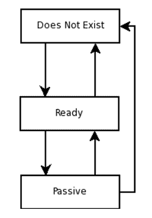
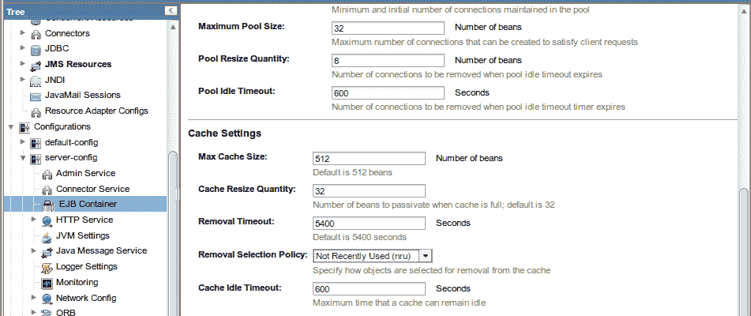
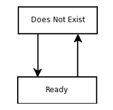
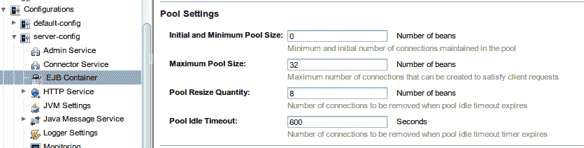
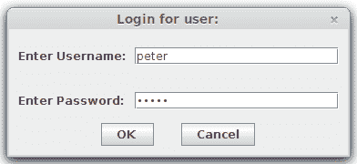

# 企业 JavaBeans

企业 JavaBeans 是封装应用程序业务逻辑的服务端组件。**企业 JavaBeans**（**EJB**）通过自动处理事务管理和安全性来简化应用程序开发。企业 JavaBean 有两种类型：会话 Bean，执行业务逻辑，和消息驱动 Bean，充当消息监听器。

熟悉 J2EE 先前版本的读者会注意到，在上一段中并未提及实体 Bean。在 Java EE 5 中，为了支持 Java 持久化 API（**JPA**），实体 Bean 已被弃用。尽管如此，为了向后兼容，实体 Bean 仍然得到支持；然而，进行对象关系映射（**ORM**）的首选方式是通过 JPA。

本章将涵盖以下主题：

+   会话 Bean

+   一个简单的会话 Bean

+   一个更实际的例子

+   使用会话 Bean 实现 DAO 设计模式

    +   单例会话 Bean

+   消息驱动 Bean

+   企业 JavaBeans 中的事务

+   容器管理的事务

+   Bean 管理的事务

+   企业 JavaBeans 生命周期

+   有状态会话 Bean 生命周期

+   无状态会话 Bean 生命周期

+   消息驱动 Bean 生命周期

+   EJB 定时器服务

+   EJB 安全性

# 会话 Bean

正如我们之前提到的，会话 Bean 通常封装业务逻辑。在 Java EE 中，创建会话 Bean 只需要创建一个或两个工件：Bean 本身和可选的业务接口。这些工件需要添加适当的注解，以便让 EJB 容器知道它们是会话 Bean。

J2EE 要求应用程序开发者创建多个工件以创建会话 Bean。这些工件包括 Bean 本身、本地或远程接口（或两者都有）、本地或远程 Home 接口（或两者都有），以及一个 XML 部署描述符。正如我们将在本章中看到的，Java EE 极大地简化了 EJB 开发。

# 一个简单的会话 Bean

以下示例演示了一个非常简单的会话 Bean。:

```java
package net.ensode.javaeebook;

import javax.ejb.Stateless;

@Stateless
public class SimpleSessionBean implements SimpleSession
{ 
  private String message = 
      "If you don't see this, it didn't work!";

  public String getMessage()
  {
    return message;
  }
}
```

`@Stateless`注解让 EJB 容器知道这个类是一个无状态会话 Bean。有三种类型的会话 Bean：无状态、有状态和单例。在我们解释这些类型会话 Bean 之间的区别之前，我们需要明确 EJB 实例是如何提供给 EJB 客户端应用程序的。

当无状态会话 Bean 被部署时，EJB 容器会为每个会话 Bean 创建一系列实例。这通常被称为 EJB 池。当 EJB 客户端应用程序获取一个 EJB 实例时，池中的一个实例会被提供给这个客户端应用程序。

有状态会话 bean 和无状态会话 bean 之间的区别在于，有状态会话 bean 与客户端保持会话状态，而无状态会话 bean 则不保持。简单来说，这意味着，当一个 EJB 客户端应用程序获取一个有状态会话 bean 的实例时，我们保证 bean 中任何实例变量的值在方法调用之间是一致的。因此，在修改有状态会话 bean 上的任何实例变量时是安全的，因为它们将在下一次方法调用中保留其值。EJB 容器通过钝化有状态会话 bean 来保存会话状态，并在 bean 被激活时恢复状态。会话状态是有状态会话 bean 的生命周期比无状态会话 bean 或消息驱动 bean 的生命周期复杂一些的原因（EJB 生命周期将在本章后面讨论）。

当 EJB 客户端应用程序请求一个无状态会话 bean 的实例时，EJB 容器可能会在池中提供任何 EJB 实例。由于我们无法保证每次方法调用都使用相同的实例，因此设置在无状态会话 bean 中的任何实例变量的值可能会“丢失”（它们实际上并没有丢失，修改发生在池中 EJB 的另一个实例中）。

除了被`@Stateless`注解装饰外，这个类没有其他特殊之处。请注意，它实现了一个名为**SimpleSession**的接口。这个接口是 bean 的业务接口。`SimpleSession`接口如下所示：

```java
package net.ensode.javaeebook; 

import javax.ejb.Remote; 

@Remote 
public interface SimpleSession 
{ 
  public String getMessage(); 
} 
```

这个接口唯一奇特的地方就是它被`@Remote`注解所装饰。这个注解表明这是一个远程业务接口。这意味着该接口可能位于调用它的客户端应用程序不同的 JVM 中。远程业务接口甚至可以跨网络调用。

业务接口也可以被`@Local`接口装饰。这个注解表明业务接口是一个本地业务接口。本地业务接口的实现必须与调用其方法的客户端应用程序在同一个 JVM 中。

由于远程业务接口可以从与客户端应用程序相同的 JVM 或不同的 JVM 中调用，乍一看我们可能会倾向于将所有业务接口都设置为远程。在这样做之前，我们必须意识到远程业务接口提供的灵活性伴随着性能上的代价，因为方法调用是在假设它们将在网络上进行的情况下进行的。事实上，大多数典型的 Java EE 应用程序由充当 EJB 客户端应用程序的 Web 应用程序组成。在这种情况下，客户端应用程序和 EJB 运行在同一个 JVM 上，因此本地接口比远程业务接口使用得更多。

一旦我们编译了会话 Bean 及其相应的业务接口，我们需要将它们放入一个 JAR 文件中并部署它们。如何部署 EJB JAR 文件取决于我们使用的是哪种应用服务器。然而，大多数现代应用服务器都有一个`autodeploy`目录；在大多数情况下，我们可以简单地复制我们的 EJB JAR 文件到这个目录。请查阅您的应用服务器文档以找到其`autodeploy`目录的确切位置。

# 实现 EJB 客户端代码

现在我们已经看到了会话 Bean 及其相应的业务接口，让我们看看一个客户端示例应用程序：

```java
package net.ensode.javaeebook; 

import javax.ejb.EJB; 

public class SessionBeanClient 
{ 
  @EJB 
  private static SimpleSession simpleSession; 

  private void invokeSessionBeanMethods() 
  { 
    System.out.println(simpleSession.getMessage()); 

    System.out.println("\nSimpleSession is of type: " 
        + simpleSession.getClass().getName()); 
  } 

  public static void main(String[] args) 
  { 
    new SessionBeanClient().invokeSessionBeanMethods(); 
  } 

} 
```

上述代码仅仅声明了一个类型为`net.ensode.SimpleSession`的实例变量，这是我们的会话 Bean 的业务接口。这个实例变量被`@EJB`注解所装饰；这个注解让 EJB 容器知道这个变量是一个会话 Bean 的业务接口。然后 EJB 容器注入一个业务接口的实现供客户端代码使用。

由于我们的客户端是一个独立的应用程序（而不是像 WAR 文件或另一个 EJB JAR 文件这样的 Java EE 工件），它实际上并没有部署到应用服务器。为了使其能够访问部署到服务器的代码，它必须能够访问应用服务器的客户端库。如何实现这一点的步骤因应用服务器而异。当使用 GlassFish 时，我们的客户端代码必须放入一个 JAR 文件中并通过`appclient`实用程序执行。这个实用程序可以在`[glassfish 安装目录]/glassfish/bin/`中找到。假设这个目录在 PATH 环境变量中，并且假设我们将我们的客户端代码放入一个名为`simplesessionbeanclient.jar`的 JAR 文件中，我们将在命令行中键入以下命令来执行前面的客户端代码：

```java
appclient -client simplesessionbeanclient-jar-with-dependencies.jar
```

执行上述命令会产生以下控制台输出：

```java
If you don't see this, it didn't work!

SimpleSession is of type: net.ensode.javaeebook._SimpleSession_Wrapper 
```

这是`SessionBeanClient`类的输出。

我们正在使用 Maven 来构建我们的代码。在这个例子中，我们使用了 Maven Assembly 插件([`maven.apache.org/plugins/maven-assembly-plugin/`](http://maven.apache.org/plugins/maven-assembly-plugin/))来构建一个包含所有依赖项的客户端 JAR 文件。这使我们免去了在`appclient`的`-classpath`命令行选项中指定所有依赖 JAR 文件的需要。要构建这个 JAR 文件，只需在命令行中调用`mvn assembly:assembly`。

输出的第一行仅仅是我们在会话 Bean 中实现的`getMessage()`方法的返回值。输出的第二行显示了实现业务接口的类的完全限定类名。请注意，类名不是我们所写的会话 Bean 的完全限定名称；相反，实际上提供的是由 EJB 容器在幕后创建的业务接口的实现。

# 一个更实际的例子

在上一节中，我们看到了一个非常简单的“Hello world”类型的示例。在本节中，我们将使用一个更实际的示例。会话 Bean 通常用作数据访问对象（**DAO**）。有时它们被用作 JDBC 调用的包装器，有时它们被用来包装获取或修改 JPA 实体的调用。在本节中，我们将采用后一种方法。

以下示例说明了如何在会话 Bean 中实现 DAO 设计模式。在查看 Bean 实现之前，让我们看看其对应的企业接口：

```java
package net.ensode.javaeebook; 

import javax.ejb.Remote; 

@Remote 
public interface CustomerDao 
{ 
  public void saveCustomer(Customer customer); 

  public Customer getCustomer(Long customerId); 

  public void deleteCustomer(Customer customer); 
} 
```

如我们所见，这是一个实现三个方法的远程接口；`saveCustomer()`方法将客户数据保存到数据库中，`getCustomer()`方法从数据库中获取客户数据，而`deleteCustomer()`方法从数据库中删除客户数据。所有这些方法都接受我们第三章中开发的`Customer`实体实例作为参数，*使用 JPA 进行对象关系映射*。

现在我们来看看实现上述业务接口的会话 Bean。正如我们即将看到的，在会话 Bean 和普通的`Java`对象中实现 JPA 代码的方式之间有一些区别：

```java
package net.ensode.javaeebook; 

import javax.ejb.Stateful; 
import javax.persistence.EntityManager; 
import javax.persistence.PersistenceContext; 

@Stateful 
public class CustomerDaoBean implements CustomerDao { 

    @PersistenceContext 
    private EntityManager entityManager;     

    public void saveCustomer(Customer customer) { 
        if (customer.getCustomerId() == null) { 
            saveNewCustomer(customer); 
        } else { 
            updateCustomer(customer); 
        } 
    } 

    private void saveNewCustomer(Customer customer) { 
        entityManager.persist(customer); 
    } 

    private void updateCustomer(Customer customer) { 
        entityManager.merge(customer); 
    } 

    public Customer getCustomer(Long customerId) { 
        Customer customer; 

        customer = entityManager.find(Customer.class, customerId); 

        return customer; 
    } 

    public void deleteCustomer(Customer customer) { 
        entityManager.remove(customer); 
    } 
} 
```

之前会话 Bean 与之前的 JPA 示例之间的主要区别在于，在之前的示例中，JPA 调用被包裹在`UserTransaction.begin()`和`UserTransaction.commit()`调用之间。我们必须这样做的原因是 JPA 调用必须被包裹在事务中；如果没有在事务中，大多数 JPA 调用将抛出`TransactionRequiredException`。我们不需要像之前示例中那样显式地包裹 JPA 调用在事务中，是因为会话 Bean 方法隐式地是事务性的，我们不需要做任何事情来使它们成为那样。这种默认行为被称为容器管理事务。容器管理事务将在本章后面详细讨论。

如第三章中所述，*使用 Java 持久化 API 进行对象关系映射*，当 JPA 实体在一个事务中检索并在另一个事务中更新时，需要调用`EntityManager.merge()`方法来更新数据库中的数据。在这种情况下调用`EntityManager.persist()`将导致“无法持久化分离对象”异常。

# 从 Web 应用程序调用会话 Bean

通常，Java EE 应用程序由充当 EJB 客户端的 Web 应用程序组成。在 Java EE 6 之前，部署包含 Web 应用程序和一个或多个会话 Bean 的 Java EE 应用程序的最常见方式是将 Web 应用程序的 WAR 文件和 EJB JAR 文件打包成一个**EAR**（**企业存档**）文件。

Java EE 6 简化了包含 EJB 和 Web 组件的应用程序的打包和部署。

在本节中，我们将开发一个 JSF 应用程序，其中包含一个 CDI 命名 bean 作为我们刚才在上一节中讨论的 DAO 会话 bean 的客户端。

为了使这个应用程序充当 EJB 客户端，我们将开发一个名为 `CustomerController` 的命名 bean，以便将保存新客户到数据库的逻辑委托给我们在上一节中开发的 `CustomerDaoBean` 会话 bean：

```java
package net.ensode.javaeebook.jsfjpa; 

//imports omitted for brevity 

@Named 
@RequestScoped 
public class CustomerController implements Serializable { 

    @EJB 
    private CustomerDaoBean customerDaoBean; 

    private Customer customer; 

    private String firstName; 
    private String lastName; 
    private String email; 

    public CustomerController() { 
        customer = new Customer(); 
    } 

    public String saveCustomer() { 
        String returnValue = "customer_saved"; 

        try { 
            populateCustomer(); 
            customerDaoBean.saveCustomer(customer); 
        } catch (Exception e) { 
            e.printStackTrace(); 
            returnValue = "error_saving_customer"; 
        } 

        return returnValue; 
    } 

    private void populateCustomer() { 
        if (customer == null) { 
            customer = new Customer(); 
        } 
        customer.setFirstName(getFirstName()); 
        customer.setLastName(getLastName()); 
        customer.setEmail(getEmail()); 
    } 

//setters and getters omitted for brevity 

} 
```

如我们所见，我们只需声明 `CustomerDaoBean` 会话 bean 的一个实例，并用 `@EJB` 注解来装饰它，以便注入相应的 EJB 实例，然后调用 EJB 的 `saveCustomer()` 方法。

注意，我们直接将会话 bean 的实例注入到我们的客户端代码中。我们可以这样做的原因是 Java EE 6 中引入的一个特性。当使用 Java EE 6 或更高版本时，我们可以去掉本地接口，并在客户端代码中直接使用会话 bean 实例。

现在我们已经修改了我们的 Web 应用程序以作为会话 bean 的客户端，我们需要将其打包成 **WAR**（**Web 归档**）文件并部署，以便使用它。

# 单例会话 bean

Java EE 6 中引入的一种新的会话 bean 类型是单例会话 bean。每个单例会话 bean 在应用服务器中只存在一个实例。

单例会话 bean 对于缓存数据库数据很有用。在单例会话 bean 中缓存常用数据可以提高性能，因为它大大减少了访问数据库的次数。常见的模式是在我们的 bean 中有一个带有 `@PostConstruct` 注解的方法；在这个方法中，我们检索我们想要缓存的数据。然后我们提供一个设置方法供 bean 的客户端调用。以下示例说明了这种技术：

```java
package net.ensode.javaeebook.singletonsession;  

import java.util.List;  
import javax.annotation.PostConstruct;  
import javax.ejb.Singleton;  
import javax.persistence.EntityManager;  
import javax.persistence.PersistenceContext;  
import javax.persistence.Query;  
import net.ensode.javaeebook.entity.UsStates;  

@Singleton  
public class SingletonSessionBean implements  
    SingletonSessionBeanRemote {  

  @PersistenceContext  
  private EntityManager entityManager;  
  private List<UsStates> stateList;  

  @PostConstruct  
  public void init() {  
    Query query = entityManager.createQuery(  
        "Select us from UsStates us");  
    stateList = query.getResultList();  
  }  

  @Override  
  public List<UsStates> getStateList() {  
    return stateList;  
  }  
}  
```

由于我们的 bean 是单例的，所以所有客户端都会访问同一个实例，避免了内存中存在重复数据。此外，由于它是单例的，因此可以安全地有一个实例变量，因为所有客户端都访问同一个 bean 的实例。

# 异步方法调用

有时进行异步处理很有用，即调用方法调用并立即将控制权返回给客户端，而无需客户端等待方法完成。

在 Java EE 的早期版本中，调用 EJB 方法异步的唯一方法是使用消息驱动 bean（将在下一节中讨论）。尽管消息驱动 bean 编写起来相对简单，但它们在使用之前确实需要一些配置，例如设置 JMS 消息队列或主题。

EJB 3.1 引入了 `@Asynchronous` 注解，它可以用来标记会话 bean 中的方法为异步。当 EJB 客户端调用异步方法时，控制权立即返回客户端，无需等待方法完成。

异步方法只能返回`void`或`java.util.concurrent.Future`接口的实现。以下示例说明了这两种情况：

```java
package net.ensode.javaeebook.asynchronousmethods;
import java.util.concurrent.Future;  
import java.util.logging.Level;  
import java.util.logging.Logger;  
import javax.ejb.AsyncResult;  
import javax.ejb.Asynchronous;  
import javax.ejb.Stateless;  

@Stateless  
public class AsynchronousSessionBean implements  
    AsynchronousSessionBeanRemote {  

  private static Logger logger = Logger.getLogger(  
      AsynchronousSessionBean.class.getName());  

  @Asynchronous  
  @Override  
  public void slowMethod() {  
    long startTime = System.currentTimeMillis();  
    logger.info("entering " + this.getClass().getCanonicalName()  
        + ".slowMethod()");  
    try {  
      Thread.sleep(10000); //simulate processing for 10 seconds  
    } catch (InterruptedException ex) {  
      Logger.getLogger(AsynchronousSessionBean.class.getName()).  
          log(Level.SEVERE, null, ex);  
    }  
    logger.info("leaving " + this.getClass().getCanonicalName()  
        + ".slowMethod()");  
    long endTime = System.currentTimeMillis();  
    logger.info("execution took " + (endTime - startTime)  
        + " milliseconds");  
  }  

  @Asynchronous  
  @Override  
  public Future<Long> slowMethodWithReturnValue() {  
    try {  
      Thread.sleep(15000); //simulate processing for 15 seconds  
    } catch (InterruptedException ex) {  
      Logger.getLogger(AsynchronousSessionBean.class.getName()).  
          log(Level.SEVERE, null, ex);  
    }  

    return new AsyncResult<Long>(42L);  
  }  
}  
```

当我们的异步方法返回`void`时，我们只需要用`@Asynchronous`注解装饰该方法，然后像往常一样从客户端代码中调用它。

如果我们需要返回值，则此值需要包装在`java.util.concurrent.Future`接口的实现中。Java EE API 以`javax.ejb.AsyncResult`类的形式提供了一个便利的实现。`Future`接口和`AsyncResult`类都使用泛型；我们需要将这些实物的返回类型指定为类型参数。

`Future`接口有几个我们可以用来取消异步方法执行、检查方法是否完成、获取方法的返回值或检查方法是否被取消的方法。以下表格列出了这些方法：

| **方法** | **描述** |
| --- | --- |
| `cancel(boolean mayInterruptIfRunning)` | 取消方法执行。如果`boolean`参数为 true，则此方法将尝试取消方法执行，即使它已经在运行。 |
| `get()` | 将返回方法的“未包装”返回值；返回值将是方法返回的`Future`接口实现中`type`参数的类型。 |
| `get(long timeout, TimeUnit unit)` | 将尝试方法的“未包装”返回值；返回值将是方法返回的`Future`接口实现中`type`参数的类型。此方法将阻塞由第一个参数指定的时间量。等待时间的单位由第二个参数确定；`TimeUnit`枚举具有 NANOSECONDS、MILLISECONDS、SECONDS、MINUTES 等常量。有关完整列表，请参阅其 Javadoc 文档。 |
| `isCancelled()` | 如果方法已被取消，则返回 true，否则返回 false。 |
| `isDone()` | 如果方法已执行完成，则返回 true，否则返回 false。 |

如我们所见，`@Asynchronous`注解使得在不设置消息队列或主题的开销下进行异步调用变得非常容易。这无疑是 EJB 规范中的一个受欢迎的补充。

# 消息驱动 bean

消息驱动 bean 的目的是根据所使用的消息传递域从 Java 消息服务（JMS）队列或 JMS 主题中消费消息（请参阅第八章，*Java 消息服务*）。消息驱动 bean 必须用`@MessageDriven`注解装饰；此注解的`mappedName`属性必须包含 bean 将从中消费消息的 JMS 消息队列或 JMS 消息主题的**Java 命名和目录接口**（**JNDI**）名称。以下示例说明了一个简单的消息驱动 bean：

```java
package net.ensode.javaeebook; 

import javax.ejb.MessageDriven; 
import javax.jms.JMSException; 
import javax.jms.Message; 
import javax.jms.MessageListener; 
import javax.jms.TextMessage; 

@MessageDriven(mappedName = "jms/JavaEE8BookQueue") 
public class ExampleMessageDrivenBean implements MessageListener 
{ 
  public void onMessage(Message message) 
  { 
    TextMessage textMessage = (TextMessage) message; 
    try 
    { 
      System.out.print("Received the following message: "); 
      System.out.println(textMessage.getText()); 
      System.out.println(); 
    } 
    catch (JMSException e) 
    { 
      e.printStackTrace(); 
    } 
  } 
} 
```

消息驱动 Bean 必须装饰 `@MessageDriven` 注解。它们监听在 `@MessageDriven` 接口的 `mappedName` 属性中定义的队列或主题上的消息（在这个例子中是 `jms/JavaEEBookQueue`）。

建议但不是必须的消息驱动 Bean 实现接口 `javax.jms.MessageListener`；然而，消息驱动 Bean 必须有一个名为 `onMessage()` 的方法，其签名与前面的示例相同。

客户端应用程序永远不会直接调用消息驱动 Bean 的方法；相反，它们将消息放入消息队列或主题，然后 Bean 消费这些消息并相应地执行。前面的示例只是将消息打印到标准输出；由于消息驱动 Bean 在 EJB 容器内执行，标准输出被重定向到日志。如果使用 GlassFish，服务器日志文件可以在 `[GlassFish 安装目录]/glassfish/domains/domain1/logs/server.log` 中找到。

# 企业 JavaBeans 中的事务

正如我们在本章前面提到的，默认情况下，所有 EJB 方法都会自动包装在一个事务中。这种默认行为被称为容器管理事务，因为事务是由 EJB 容器管理的。应用程序开发者也可以选择自己管理事务，这可以通过使用 Bean 管理事务来实现。这两种方法将在以下章节中讨论。

# 容器管理的事务

由于 EJB 方法默认是事务性的，当从已经在事务中的客户端代码调用 EJB 方法时，我们会遇到一个有趣的困境。EJB 容器应该如何表现？它应该挂起客户端事务，在一个新的事务中执行其方法，然后恢复客户端事务吗？或者它不应该创建新的事务，而是将方法作为客户端事务的一部分执行？或者它应该抛出异常？

默认情况下，如果 EJB 方法被已经在事务中的客户端代码调用，EJB 容器将简单地执行会话 Bean 方法作为客户端事务的一部分。如果这不是我们需要的操作，我们可以通过在方法上装饰 `@TransactionAttribute` 注解来改变它。这个注解有一个 `value` 属性，它决定了当会话 Bean 方法在现有事务中调用或在外部任何事务中调用时，EJB 容器的行为。`value` 属性的值通常是定义在 `javax.ejb.TransactionAttributeType` 枚举中的常量。

下表列出了 `@TransactionAttribute` 注解的可能值：

| **值** | **描述** |
| --- | --- |
| `TransactionAttributeType.MANDATORY` | 强制方法作为客户端事务的一部分被调用。如果方法在没有任何事务的情况下被调用，它将抛出 `TransactionRequiredException` 异常。 |
| `TransactionAttributeType.NEVER` | 方法永远不会在事务中执行。如果方法作为客户端事务的一部分被调用，它将抛出`RemoteException`。如果方法不在客户端事务内部调用，则不会创建事务。 |
| `TransactionAttributeType.NOT_SUPPORTED` | 如果方法作为客户端事务的一部分被调用，客户端事务将被挂起，方法将在任何事务之外执行；方法完成后，客户端事务将恢复。如果方法不在客户端事务内部调用，则不会创建事务。 |
| `TransactionAttributeType.REQUIRED` | 如果方法作为客户端事务的一部分被调用，则方法将作为此事务的一部分执行。如果方法在没有任何事务的情况下被调用，将为该方法创建一个新的事务。这是默认行为。 |
| `TransactionAttributeType.REQUIRES_NEW` | 如果方法作为客户端事务的一部分被调用，则此事务将被挂起，并为该方法创建一个新的事务。一旦方法完成，客户端事务将恢复。如果方法在没有任何事务的情况下被调用，将为该方法创建一个新的事务。 |
| `TransactionAttributeType.SUPPORTS` | 如果方法作为客户端事务的一部分被调用，它将作为此事务的一部分执行。如果方法在事务之外被调用，则不会为该方法创建新的事务。 |

尽管在大多数情况下默认事务属性是合理的，但能够在必要时覆盖此默认值是很好的。例如，由于事务有性能影响，能够关闭不需要事务的方法的事务是有益的。对于这种情况，我们将像以下代码片段所示的那样装饰我们的方法：

```java
@TransactionAttribute(value=TransactionAttributeType.NEVER)  
public void doitAsFastAsPossible() 
{ 
  //performance critical code goes here. 
} 
```

其他事务属性类型可以通过在方法上使用`TransactionAttributeType`枚举中相应的常量来声明。

如果我们希望在会话 Bean 中的所有方法上始终一致地覆盖默认事务属性，我们可以用`@TransactionAttribute`注解装饰会话 Bean 类；其`value`属性的值将应用于会话 Bean 中的每个方法。

容器管理的事务在 EJB 方法内部抛出异常时将自动回滚。此外，我们可以通过在对应于会话 Bean 的`javax.ejb.EJBContext`实例上调用`setRollbackOnly()`方法来程序化地回滚容器管理的事务。以下示例是本章前面看到的会话 Bean 的新版本，修改为在必要时回滚事务：

```java
package net.ensode.javaeebook; 

//imports omitted 

@Stateless 
public class CustomerDaoRollbackBean implements CustomerDaoRollback 
{ 
  @Resource     
  private EJBContext ejbContext; 

  @PersistenceContext 
  private EntityManager entityManager; 

  public void saveNewCustomer(Customer customer) 
  { 
    if (customer == null || customer.getCustomerId() != null) 
    { 
      ejbContext.setRollbackOnly(); 
    } 
    else 
    { 
      customer.setCustomerId(getNewCustomerId()); 
      entityManager.persist(customer); 
    } 
  } 

  public void updateCustomer(Customer customer) 
  { 
    if (customer == null || customer.getCustomerId() == null) 
    { 
      ejbContext.setRollbackOnly(); 
    } 
    else 
    { 
      entityManager.merge(customer); 
    } 
  } 
//Additional method omitted for brevity. 

} 
```

在这个版本的 DAO 会话 bean 版本中，我们删除了`saveCustomer()`方法，并将`saveNewCustomer()`和`updateCustomer()`方法设置为公共。现在，每个这些方法都会检查我们试图执行的操作的`customerId`字段是否设置正确（对于插入是`null`，对于更新不是`null`）。它还会检查要持久化的对象不是`null`。如果任何检查导致无效数据，该方法将简单地通过在注入的`EJBContext`实例上调用`setRollBackOnly()`方法来回滚交易，并且不更新数据库。

# Bean 管理的交易

正如我们所见，容器管理的交易使得编写被交易包裹的代码变得极其简单。我们不需要做任何特别的事情来达到这种效果；事实上，一些开发者在开发会话 bean 时甚至可能没有意识到他们正在编写具有交易性质的代码。容器管理的交易涵盖了我们将遇到的大部分典型用例。然而，它们确实有一个限制；每个方法可以包裹在一个单独的交易中，或者不包裹在交易中。使用容器管理的交易，无法实现生成多个交易的方法，但可以通过使用 bean 管理的交易来完成：

```java
package net.ensode.javaeebook; 

import java.sql.Connection; 
import java.sql.PreparedStatement; 
import java.sql.ResultSet; 
import java.sql.SQLException; 
import java.util.List; 

import javax.annotation.Resource; 
import javax.ejb.Stateless; 
import javax.ejb.TransactionManagement; 
import javax.ejb.TransactionManagementType; 
import javax.persistence.EntityManager; 
import javax.persistence.PersistenceContext; 
import javax.sql.DataSource; 
import javax.transaction.UserTransaction; 

@Stateless 
@TransactionManagement(value = TransactionManagementType.BEAN) 
public class CustomerDaoBmtBean implements CustomerDaoBmt 
{ 
  @Resource 
  private UserTransaction userTransaction; 

  @PersistenceContext 
  private EntityManager entityManager; 

  @Resource(name = "jdbc/__CustomerDBPool") 
  private DataSource dataSource; 

  public void saveMultipleNewCustomers( 
      List<Customer> customerList) 
  { 
    for (Customer customer : customerList) 
    { 
      try 
      { 
        userTransaction.begin(); 
        customer.setCustomerId(getNewCustomerId()); 
        entityManager.persist(customer); 
        userTransaction.commit(); 
      } 
      catch (Exception e) 
      { 
        e.printStackTrace(); 
      } 
    } 
  } 

  private Long getNewCustomerId() 
  { 
    Connection connection; 
    Long newCustomerId = null; 
    try 
    { 
      connection = dataSource.getConnection(); 
      PreparedStatement preparedStatement =  
          connection.prepareStatement("select " + 
          "max(customer_id)+1 as new_customer_id " +  
          "from customers"); 

      ResultSet resultSet = preparedStatement.executeQuery(); 

      if (resultSet != null && resultSet.next()) 
      { 
        newCustomerId = resultSet.getLong("new_customer_id"); 
      } 

      connection.close(); 
    } 
    catch (SQLException e) 
    { 
      e.printStackTrace(); 
    } 

    return newCustomerId; 
  } 
} 
```

在这个示例中，我们实现了一个名为`saveMultipleNewCustomers()`的方法。此方法仅接受一个客户`List`作为其唯一参数。此方法的目的是在`ArrayList`中尽可能多地保存元素。在保存实体时抛出的异常不应阻止方法尝试保存剩余的元素。使用容器管理的交易无法实现这种行为，因为当保存实体时抛出的异常将回滚整个交易；实现此行为的唯一方法是通过 bean 管理的交易。

如示例所示，我们通过在类上添加`@TransactionManagement`注解，并将`TransactionManagementType.BEAN`作为其`value`属性的值（此属性的另一个有效值是`TransactionManagementType.CONTAINER`，但由于这是默认值，因此没有必要指定它）来声明会话 bean 使用 bean 管理的交易。

为了能够以编程方式控制交易，我们注入了一个`javax.transaction.UserTransaction`实例，然后在`saveMultipleNewCustomers()`方法内的`for`循环中使用它来开始和提交每个循环迭代的交易。

如果我们需要回滚一个 bean 管理的交易，我们可以通过简单地调用`javax.transaction.UserTransaction`适当实例上的`rollback()`方法来实现。

在继续之前，值得注意的是，尽管本节中的所有示例都是会话 bean，但所解释的概念也适用于消息驱动的 bean。

# 企业 JavaBean 生命周期

企业 JavaBean 在其生命周期中会经历不同的状态。每种类型的 EJB 都有不同的状态。每种类型 EJB 的特定状态将在下一节中讨论。

# 有状态会话 Bean 生命周期

我们可以在会话 Bean 中注解方法，以便 EJB 容器在 Bean 生命周期的特定点自动调用它们。例如，我们可以在 Bean 创建后立即调用一个方法，或者在其销毁前调用一个方法。

在解释可用于实现生命周期方法的注解之前，有必要简要说明会话 Bean 的生命周期。有状态会话 Bean 的生命周期与无状态或单例会话 Bean 的生命周期不同。

有状态会话 Bean 的生命周期包含三个状态：不存在、就绪和被动：



在有状态会话 Bean 部署之前，它处于不存在状态。在成功部署后，EJB 容器会对 Bean 进行任何所需的依赖注入，然后进入就绪状态。此时，Bean 准备好被客户端应用程序调用其方法。

当有状态会话 Bean 处于就绪状态时，EJB 容器可能会决定将其钝化，即将其从主内存移动到二级存储，当这种情况发生时，Bean 进入被动状态。

如果有状态会话 Bean 的一段时间内没有被访问，EJB 容器将把 Bean 设置为不存在状态。Bean 在内存中保持多长时间才被销毁因应用服务器而异，通常是可以配置的。默认情况下，GlassFish 将在 90 分钟的不活动后把有状态会话 Bean 发送到不存在状态。当将我们的代码部署到 GlassFish 时，这个默认值可以通过访问 GlassFish 管理控制台；展开右侧树中的配置节点；展开服务器配置节点；点击 EJB 容器节点；滚动到页面底部并修改移除超时文本框的值；然后最终点击主页面右上角或右下角的任何一个保存按钮来更改： 



然而，这种技术为所有有状态会话 Bean 设置了超时值。如果我们需要修改特定会话 Bean 的超时值，我们需要在包含会话 Bean 的 JAR 文件中包含一个`glassfish-ejb-jar.xml`部署描述符。在这个部署描述符中，我们可以将超时值设置为`<removal-timeout-in-seconds>`元素的值：

```java
<?xml version="1.0" encoding="UTF-8"?> 
<!DOCTYPE glassfish-ejb-jar PUBLIC "-//GlassFish.org//DTD GlassFish Application Server 3.1 EJB 3.1//EN" "http://glassfish.org/dtds/glassfish-ejb-jar_3_1-1.dtd"> 
<glassfish-ejb-jar> 
  <enterprise-beans> 
    <ejb> 
      <ejb-name>MyStatefulSessionBean</ejb-name> 
      <bean-cache> 
          <removal-timeout-in-seconds> 
              600 
          </removal-timeout-in-seconds> 
      </bean-cache> 
    </ejb> 
  </enterprise-beans> 
</glassfish-ejb-jar> 
```

即使不再需要为我们的会话 Bean 创建`ejb-jar.xml`（在 J2EE 规范的先前版本中这是必要的），我们仍然可以创建一个。`glassfish-ejb-jar.xml`部署描述符中的`<ejb-name>`元素必须与`ejb-jar.xml`中同名元素的值匹配。如果我们选择不创建`ejb-jar.xml`，那么这个值必须与 EJB 类的名称匹配。有状态会话 Bean 的超时值必须是`<removal-timeout-in-seconds>`元素的值；正如元素名称所暗示的，时间单位是秒。在先前的例子中，我们将超时值设置为 600 秒，即 10 分钟。

装饰了`@PostActivate`注解的有状态会话 Bean 中的任何方法将在有状态会话 Bean 被激活后立即被调用。同样，装饰了`@PrePassivate`注解的任何方法将在有状态会话 Bean 被钝化之前被调用。

当一个处于“就绪”状态的有状态会话 Bean 超时并被发送到“不存在”状态时，任何装饰了`@PreDestroy`注解的方法将被执行。如果会话 Bean 处于“钝化”状态并且超时，则不会执行装饰了`@PreDestroy`注解的方法。此外，如果会话 Bean 的客户端执行了任何装饰了`@Remove`注解的方法，则执行装饰了`@PreDestroy`注解的方法，并且 Bean 将被标记为垃圾回收。

`@PostActivate`、`@PrePassivate`和`@Remove`注解仅对有状态会话 Bean 有效。`@PreDestroy`和`@PostConstruct`注解对有状态会话 Bean、无状态会话 Bean 和消息驱动 Bean 都有效。

# 无状态和单例会话 Bean 的生命周期

无状态或单例会话 Bean 的生命周期只包含“不存在”和“就绪”状态：



无状态和单例会话 Bean 永远不会被钝化。无状态或单例会话 Bean 的方法可以装饰`@PostConstruct`和`@PreDestroy`注解。就像在有状态会话 Bean 中一样，任何装饰了`@PostConstruct`注解的方法将在会话 Bean 从“不存在”状态转换为“就绪”状态时执行，任何装饰了`@PreDestroy`注解的方法将在无状态会话 Bean 从“就绪”状态转换为“不存在”状态时执行。由于无状态和单例会话 Bean 永远不会被钝化，因此无状态会话 Bean 中的任何`@PrePassivate`和`@PostActivate`注解都将被 EJB 容器简单地忽略。

大多数应用服务器允许我们配置在销毁空闲的无状态或单例会话 Bean 之前等待多长时间。如果使用 GlassFish，我们可以通过管理 Web 控制台来控制无状态会话 Bean（以及消息驱动 Bean）的生命周期管理：



前面的截图显示的设置允许我们控制无状态会话豆的生命周期：

+   初始和最小池大小指的是池中最少的豆的数量

+   最大池大小指的是池中豆的最大数量

+   池大小调整数量指的是在池空闲超时到期时从池中移除多少个豆。

+   池空闲超时指的是在从池中移除豆之前等待的不活动秒数

前面的设置影响所有池化（无状态会话豆和消息驱动豆）的 EJB。就像有状态会话豆一样，这些设置可以根据具体情况覆盖，通过添加特定的 GlassFish 部署描述符`glassfish-ejb.jar.xml`：

```java
<?xml version="1.0" encoding="UTF-8"?> 

<!DOCTYPE glassfish-ejb-jar PUBLIC "-//GlassFish.org//DTD GlassFish Application Server 3.1 EJB 3.1//EN" "http://glassfish.org/dtds/glassfish-ejb-jar_3_1-1.dtd"> 
<glassfish-ejb-jar> 
    <enterprise-beans> 
        <ejb> 
            <ejb-name>MyStatelessSessionBean</ejb-name> 
            <bean-pool> 
                <steady-pool-size>10</steady-pool-size> 
                <max-pool-size>60</max-pool-size> 
                <resize-quantity>5</resize-quantity> 
                <pool-idle-timeout-in-seconds> 
                    900 
                </pool-idle-timeout-in-seconds> 
            </bean-pool> 
        </ejb> 
    </enterprise-beans> 
</glassfish-ejb-jar> 
```

`glassfish-ejb-jar.xml`包含与 Web 控制台中相应设置等效的 XML 标签：

+   `<steady-pool-size>`对应于 GlassFish Web 控制台中的初始和最小池大小

+   `<max-pool-size>`对应于 GlassFish Web 控制台中的最大池大小

+   `<resize-quantity>`对应于 GlassFish Web 控制台中的池大小调整数量

+   `<pool-idle-timeout-in-seconds>`对应于 GlassFish Web 控制台中的池空闲超时

# 消息驱动豆生命周期

就像无状态会话豆一样，消息驱动豆只包含“不存在”和“就绪”状态：


消息驱动豆可以有被`@PostConstruct`和`@PreDestroy`方法装饰的方法。被`@PostConstruct`装饰的方法在豆进入就绪状态之前执行。被`@PreDestroy`注解的方法在豆进入不存在状态之前执行。

# EJB 计时器服务

无状态会话豆和消息驱动豆可以有一个在固定时间间隔定期执行的方法。这可以通过使用 EJB 计时器服务来实现。以下示例说明了如何利用此功能：

```java
package net.ensode.javaeebook; 

//imports omitted 

@Stateless 
public class EjbTimerExampleBean implements EjbTimerExample 
{ 
  private static Logger logger = Logger.getLogger(EjbTimerExampleBean.class  
      .getName());  
  @Resource  
  TimerService timerService;  

  public void startTimer(Serializable info)  
  {  
    Timer timer = timerService.createTimer  
      (new Date(), 5000, info);  
  }  

  public void stopTimer(Serializable info)  
  {  
    Timer timer;  
    Collection timers = timerService.getTimers();  

    for (Object object : timers)  
    {  
      timer = ((Timer) object);  

      if (timer.getInfo().equals(info))  
      {  
        timer.cancel();  
        break;  
      }  
    }  
  }  

 @Timeout 
  public void logMessage(Timer timer)  
  {  
    logger.info("This message was triggered by :" +  
        timer.getInfo() + " at "  
        + System.currentTimeMillis());  
  }  
} 
```

在前面的示例中，我们通过使用`@Resource`注解装饰该类型的实例变量来注入`javax.ejb.TimerService`接口的实现。然后我们可以通过调用此`TimerService`实例的`createTimer()`方法来创建一个计时器。

`createTimer()`方法有几个重载版本。我们选择使用的方法接受一个`java.util.Date`实例作为其第一个参数；此参数用于指示定时器应该到期的第一次时间（"trfgo off"）。在示例中，我们选择使用一个新的`Date`类实例，这使得定时器立即到期。`createTimer()`方法的第二个参数是在定时器再次到期之前等待的时间，以毫秒为单位。在上面的示例中，定时器每五秒到期一次。`createTimer()`方法的第三个参数可以是实现`java.io.Serializable`接口的任何类的实例。由于单个 EJB 可以同时执行多个定时器，因此此第三个参数用于唯一标识每个定时器。如果我们不需要标识定时器，可以将 null 作为此参数的值。

调用`TimerService.createTimer()`的 EJB 方法必须从 EJB 客户端调用。将此调用放置在 EJB 方法中（使用`@PostConstruct`注解以在 bean 处于 Ready 状态时自动启动定时器）将导致抛出`IllegalStateException`异常。

我们可以通过调用其`cancel()`方法来停止定时器。无法直接获取与 EJB 关联的单个定时器；我们需要做的是在链接到 EJB 的`TimerService`实例上调用`getTimers()`方法。此方法将返回一个包含与 EJB 关联的所有定时器的集合；然后我们可以遍历集合，通过调用其`getInfo()`方法来取消正确的定时器。此方法将返回我们传递给`createTimer()`方法的`Serializable`对象。

最后，任何被`@Timeout`注解装饰的 EJB 方法将在定时器到期时执行。被此注解装饰的方法必须返回 void 类型，并接受一个类型为`javax.ejb.Timer`的单个参数。在我们的例子中，该方法只是将一条消息写入服务器日志。

下面的类是前面 EJB 的独立客户端：

```java
package net.ensode.javaeebook; 

import javax.ejb.EJB; 

public class Client 
{ 
  @EJB  
  private static EjbTimerExample ejbTimerExample;  

  public static void main(String[] args)  
  {  
    try  
    {  
      System.out.println("Starting timer 1...");  
      ejbTimerExample.startTimer("Timer 1");  
      System.out.println("Sleeping for 2 seconds...");  
      Thread.sleep(2000);  
      System.out.println("Starting timer 2...");  
      ejbTimerExample.startTimer("Timer 2");  
      System.out.println("Sleeping for 30 seconds...");  
      Thread.sleep(30000);  
      System.out.println("Stopping timer 1...");  
      ejbTimerExample.stopTimer("Timer 1");  
      System.out.println("Stopping timer 2...");  
      ejbTimerExample.stopTimer("Timer 2");  
      System.out.println("Done.");  
    }  
    catch (InterruptedException e)  
    {  
      e.printStackTrace();  
    }  
  }  
} 
```

示例简单地启动一个定时器，等待几秒钟，然后启动第二个定时器。然后它睡眠 30 秒，然后停止两个定时器。在部署 EJB 并执行客户端后，我们应该在服务器日志中看到一些类似以下的条目：

```java
    [2013-08-26T20:44:55.180-0400] [glassfish 4.0] [INFO] [] [net.ensode.javaeebook.EjbTimerExampleBean] [tid: _ThreadID=147 _ThreadName=__ejb-thread-pool1] [timeMillis: 1377564295180] [levelValue: 800] [[

      This message was triggered by :Timer 1 at 1377564295180]]

    [2013-08-26T20:44:57.203-0400] [glassfish 4.0] [INFO] [] [net.ensode.javaeebook.EjbTimerExampleBean] [tid: _ThreadID=148 _ThreadName=__ejb-thread-pool2] [timeMillis: 1377564297203] [levelValue: 800] [[

      This message was triggered by :Timer 2 at 1377564297203]]

    [2013-08-26T20:44:58.888-0400] [glassfish 4.0] [INFO] [] [net.ensode.javaeebook.EjbTimerExampleBean] [tid: _ThreadID=149 _ThreadName=__ejb-thread-pool3] [timeMillis: 1377564298888] [levelValue: 800] [[

      This message was triggered by :Timer 1 at 1377564298888]]

    [2013-08-26T20:45:01.156-0400] [glassfish 4.0] [INFO] [] [net.ensode.javaeebook.EjbTimerExampleBean] [tid: _ThreadID=150 _ThreadName=__ejb-thread-pool4] [timeMillis: 1377564301156] [levelValue: 800] [[

      This message was triggered by :Timer 2 at 1377564301156]]

```

每当定时器中的一个到期时，都会创建这些条目。

# 基于日历的 EJB 定时器表达式

上一个示例有一个缺点：会话 bean 中的`startTimer()`方法必须由客户端调用才能启动定时器。这种限制使得定时器在 bean 部署后立即启动变得困难。

Java EE 6 引入了基于日历的 EJB 定时器表达式。基于日历的表达式允许我们的会话 beans 中的一个或多个方法在特定的日期和时间执行。例如，我们可以配置我们的一个方法在每晚 8:10 pm 执行，这正是我们下一个示例所做的事情：

```java
package com.ensode.javaeebook.calendarbasedtimer; 

import java.util.logging.Logger; 
import javax.ejb.Stateless; 
import javax.ejb.LocalBean; 
import javax.ejb.Schedule; 

@Stateless 
@LocalBean 
public class CalendarBasedTimerEjbExampleBean { 

  private static Logger logger = Logger.getLogger( 
      CalendarBasedTimerEjbExampleBean.class.getName()); 

  @Schedule(hour = "20", minute = "10") 
  public void logMessage() { 
    logger.info("This message was triggered at:" 
        + System.currentTimeMillis()); 
  } 
} 
```

正如前一个示例所示，我们通过 `javax.ejb.Schedule` 注解设置方法执行的时间。在这个特定的例子中，我们通过将 `@Schedule` 注解的 `hour` 属性设置为 `"20"`，并将其分钟属性设置为 `"10"`（因为小时属性是基于 24 小时的，小时 20 相当于晚上 8:00），来设置我们的方法在晚上 8:10 pm 执行。

`@Schedule` 注解有几个其他属性，允许在指定方法何时执行时具有很大的灵活性。例如，我们可以有一个方法在每月的第三个星期五执行，或者在月底执行，等等。

下表列出了 `@Schedule` 注解中所有允许我们控制注解方法何时执行的属性：

| **属性** | **描述** | **示例值** | **默认值** |
| --- | --- | --- | --- |
| `dayOfMonth` | 月份中的日期 | `"3"`: 月份的第三天 `"Last"`: 月份的最后一天`"-2"`: 月份结束前两天`"1st Tue"`: 月份的第一个星期二 | `"*"` |
| `dayOfWeek` | 周中的日期 | `"3"`: 每周三`"Thu"`: 每周四 | `"*"` |
| `hour` | 一天中的小时（基于 24 小时制） | `"14"`: 下午 2:00 | `"0"` |
| `minute` | 小时中的分钟 | `"10"`: 小时后的十分钟 | `"0"` |
| `month` | 年中的月份 | `"2"`: 二月`"March"`: 三月 | `"*"` |
| `second` | 分钟中的秒 | `"5"`: 分钟后的五秒 | `"0"` |
| `timezone` | 时区 ID | `"America/New York"` | "" |
| `year` | 四位年份 | `"2010"` | `"*"` |

除了单个值之外，大多数属性接受星号（`*`）作为通配符，这意味着注解的方法将在每个时间单位（每天、每小时等）执行。

此外，我们可以通过逗号分隔值来指定多个值；例如，如果我们需要一个方法在每周的星期二和星期四执行，我们可以将方法注解为 `@Schedule(dayOfWeek="Tue, Thu")`。

我们还可以指定一个值的范围，第一个值和最后一个值由破折号（-）分隔；要执行从星期一到星期五的方法，我们可以使用 `@Schedule(dayOfWeek="Mon-Fri")`。

此外，我们还可以指定方法需要每 *n* 个时间单位执行（例如，每天、每 2 小时、每 10 分钟等）。要执行类似的事情，我们可以使用 `@Schedule(hour="*/12")`，这将使方法每 12 小时执行一次。

如我们所见，`@Schedule` 注解在指定何时需要执行我们的方法时提供了很多灵活性。此外，它还提供了不需要客户端调用即可激活调度的优势。另外，它还具备使用类似 cron 的语法的优势；因此，熟悉这个 Unix 工具的开发者在使用这个注解时会感到非常自在。

# EJB 安全性

企业 JavaBeans 允许我们声明性地决定哪些用户可以访问其方法。例如，某些方法可能仅供具有特定角色的用户使用。一个典型的场景是，只有具有管理员角色的用户可以添加、删除或修改系统中的其他用户。

以下示例是本章前面提到的 DAO 会话 bean 的略微修改版本。在这个版本中，一些之前是私有的方法被改为公开。此外，会话 bean 被修改为只允许具有特定角色的用户访问其方法：

```java
package net.ensode.javaeebook; 

// imports omitted 

@Stateless 
@RolesAllowed("appadmin") 
public class CustomerDaoBean implements CustomerDao 
{ 
  @PersistenceContext 
  private EntityManager entityManager; 

  @Resource(name = "jdbc/__CustomerDBPool") 
  private DataSource dataSource; 

  public void saveCustomer(Customer customer) 
  { 
    if (customer.getCustomerId() == null) 
    { 
      saveNewCustomer(customer); 
    } 
    else 
    { 
      updateCustomer(customer); 
    } 
  } 

  public Long saveNewCustomer(Customer customer) 
  {      
    entityManager.persist(customer); 

    return customer.getCustomerId(); 
  } 

  public void updateCustomer(Customer customer) 
  { 
    entityManager.merge(customer); 
  } 

 @RolesAllowed({ "appuser", "appadmin" }) 
  public Customer getCustomer(Long customerId) 
  { 
    Customer customer; 

    customer = entityManager.find(Customer.class, customerId); 

    return customer; 
  } 

  public void deleteCustomer(Customer customer) 
  { 
    entityManager.remove(customer); 
  } 
} 
```

如我们所见，我们通过使用 `@RolesAllowed` 注解来声明哪些角色可以访问方法。此注解可以接受单个字符串或字符串数组作为参数。当使用单个字符串作为此注解的参数时，只有具有该参数指定的角色的用户可以访问该方法。如果使用字符串数组作为参数，则具有数组元素中指定的任何角色的用户都可以访问该方法。

可以使用 `@RolesAllowed` 注解来装饰 EJB 类，在这种情况下，其值适用于 EJB 中的所有方法，或者是一个或多个方法；在后一种情况下，其值仅适用于被注解的方法。如果，像我们的例子一样，EJB 类及其一个或多个方法都被 `@RolesAllowed` 注解装饰，则方法级别的注解具有优先权。

创建角色的过程因应用服务器而异；当使用 GlassFish 时，应用角色需要映射到安全域的组名（有关详细信息，请参阅第九章 [31a037d6-63a1-415d-a27f-dbec1ccff2cb.xhtml]，*Java EE 应用程序的安全性*）。此映射以及要使用的域设置在 `glassfish-ejb-jar.xml` 部署描述符中：

```java
<?xml version="1.0" encoding="UTF-8"?> 
<!DOCTYPE glassfish-ejb-jar PUBLIC "-//GlassFish.org//DTD GlassFish Application Server 3.1 EJB 3.1//EN" "http://glassfish.org/dtds/glassfish-ejb-jar_3_1-1.dtd"> 
<glassfish-ejb-jar> 
    <security-role-mapping> 
        <role-name>appuser</role-name> 
        <group-name>appuser</group-name> 
    </security-role-mapping> 
    <security-role-mapping> 
        <role-name>appadmin</role-name> 
        <group-name>appadmin</group-name> 
    </security-role-mapping> 
    <enterprise-beans> 
        <ejb> 
            <ejb-name>CustomerDaoBean</ejb-name> 
            <ior-security-config> 
                <as-context> 
                    <auth-method>username_password</auth-method> 
                    <realm>file</realm> 
                    <required>true</required> 
                </as-context> 
            </ior-security-config> 
        </ejb> 
    </enterprise-beans> 
</glassfish-ejb-jar> 
```

`glassfish-ejb-jar.xml` 的 `<security-role-mapping>` 元素在应用角色和安全域的组之间进行映射。`<role-name>` 子元素的值必须包含应用角色；此值必须与 `@RolesAllowed` 注解中使用的值匹配。`<group-name>` 子元素的值必须包含 EJB 所使用的安全域中的安全组名称。在上面的示例中，我们将两个应用角色映射到安全域中的相应组。尽管在这个特定的例子中，应用角色和安全组的名称匹配，但这并不一定需要如此。

自动匹配角色到安全组：当使用 GlassFish 时，可以将任何应用程序角色自动匹配到安全域中同名安全组。这可以通过登录到 GlassFish Web 控制台，点击配置节点，点击安全，点击标记为默认主体到角色映射的复选框，并最终保存此配置更改来实现。

如示例所示，用于认证的安全域在`<as-context>`元素的`<realm>`子元素中定义。此子元素的值必须与应用服务器中有效安全域的名称匹配。`<as-context>`元素的其它子元素包括`<auth-method>`；此元素的唯一有效值是`username_password`，以及`<required>`，其唯一有效值是`true`和`false`。

# 客户端认证

如果访问受保护 EJB 的客户端代码是 Web 应用程序的一部分，并且该用户已经进行了认证，那么将使用用户的凭据来确定用户是否应该被允许访问他们试图执行的方法。

当使用 GlassFish 作为我们的应用服务器时，独立客户端必须通过`appclient`实用程序执行。以下代码演示了一个典型的安全会话 Bean 客户端：

```java
package net.ensode.javaeebook; 

import javax.ejb.EJB; 

public class Client 
{ 
  @EJB 
  private static CustomerDao customerDao; 

  public static void main(String[] args) 
  { 
    Long newCustomerId; 

    Customer customer = new Customer(); 
    customer.setFirstName("Mark"); 
    customer.setLastName("Butcher"); 
    customer.setEmail("butcher@phony.org"); 

    System.out.println("Saving New Customer..."); 
    newCustomerId = customerDao.saveNewCustomer(customer); 

    System.out.println("Retrieving customer..."); 
    customer = customerDao.getCustomer(newCustomerId); 
    System.out.println(customer); 
  } 
} 
```

如我们所见，代码并没有对用户进行认证。会话 Bean 只是通过`@EJB`注解注入到代码中，并像往常一样使用。这种处理方式取决于我们使用的是哪种应用服务器。GlassFish 的`appclient`实用程序在通过`appclient`实用程序调用客户端代码后负责用户认证：

```java
appclient -client ejbsecurityclient.jar
```

当`appclient`实用程序尝试在 EJB 上调用安全方法时，它将向用户显示登录窗口：



假设凭据正确且用户具有适当的权限，EJB 代码将执行，我们应该看到来自前面`Client`类的预期输出：

```java
    Saving New Customer...
    Retrieving customer...
    customerId = 29
    firstName = Mark
    lastName = Butcher
    email = butcher@phony.org
```

# 摘要

在本章中，我们介绍了如何通过无状态和有状态会话 Bean 实现业务逻辑。此外，我们还介绍了如何实现消息驱动 Bean 以消费 JMS 消息。

我们还解释了如何利用 EJB 的事务性来简化实现 DAO 模式。

此外，我们解释了容器管理事务的概念，以及如何通过使用适当的注解来控制它们。我们还解释了如何在容器管理事务不足以满足我们要求的情况下实现 Bean 管理事务。

介绍了不同类型的企业 JavaBean 的生命周期，包括如何让 EJB 容器在生命周期中的特定点自动调用 EJB 方法。

我们还介绍了如何利用 EJB 定时器服务，让 EJB 方法被 EJB 容器定期调用。

最后，我们探讨了如何通过在 EJB 类和/或方法上添加适当的 EJB 安全注解，确保 EJB 方法只被授权用户调用。
