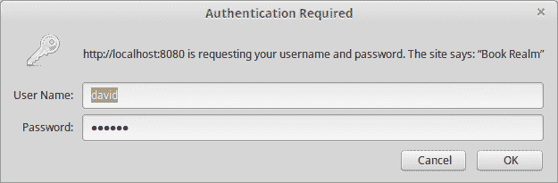
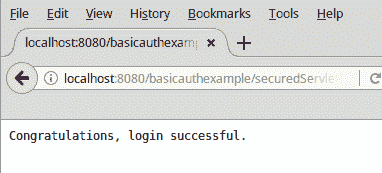
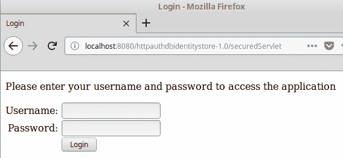
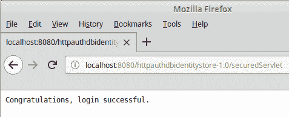
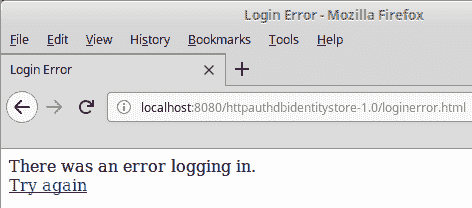
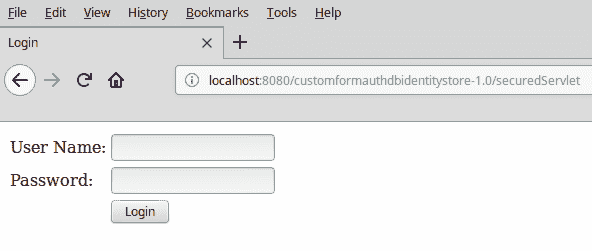
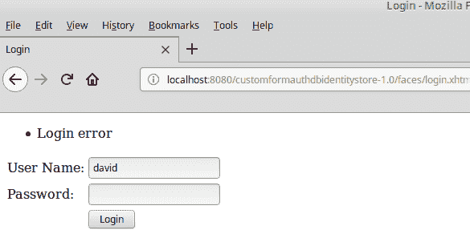

# 保护 Java EE 应用程序

Java EE 8 引入了一个新的安全 API，该 API 标准化了所有 Java EE 8 兼容应用程序服务器的应用程序安全。该 API 包括对身份存储的标准化访问，允许以统一的方式从关系或 LDAP 数据库检索用户凭证，并允许我们实现自定义身份存储的访问。新的 Java EE 8 API 包括对认证机制的支持，允许我们以标准方式验证用户。支持多种认证机制，例如基本 HTTP 认证、客户端证书、HTML 表单等。

在本章中，我们将介绍以下主题：

+   身份存储

+   认证机制

# 身份存储

身份存储提供对持久化存储系统的访问，例如关系数据库或**LDAP**（轻量级目录访问协议）数据库，其中存储用户凭证。Java EE 安全 API 直接支持关系和 LDAP 数据库，并且允许我们在必要时与自定义身份存储集成。

# 在关系数据库中设置存储的身份存储

要对存储在关系数据库中的凭证进行身份验证，例如 Servlet 或 JAX-RS RESTful Web 服务，我们需要在应用程序范围的 CDI bean 上使用`@DatabaseIdentityStoreDefinition`注解，如下面的示例所示。

```java
package net.ensode.javaee8book.httpauthdatabaseidentitystore.security; 

import javax.enterprise.context.ApplicationScoped; 
import javax.security.enterprise.identitystore.DatabaseIdentityStoreDefinition; 

@DatabaseIdentityStoreDefinition( 
        dataSourceLookup = "jdbc/userAuth", 
        callerQuery = "select password from users where name = ?", 
        groupsQuery = "select g.GROUP_NAME from " 
                + "USER_GROUPS ug, users u, " 
                + "GROUPS g where u.USERNAME=? " 
                + "and ug.USER_ID = u.user_id " 
                + "and g.GROUP_ID= ug.GROUP_ID" 
) 
@ApplicationScoped 
public class ApplicationConfig { 

} 
```

在我们的示例中，包含用户凭证的关系数据库的 JNDI 名称为`jdbc/userAuth`，这是我们提供给`@DatabaseIdentityStoreDefinition`注解的`dataSourceLookup`属性的值。

`@DatabaseIdentityStoreDefinition`的`callerQuery`参数用于指定用于检索我们正在验证的用户的用户名和密码的 SQL 查询。从数据库检索的值必须与用户提供的值匹配（通过稍后在本章中介绍的认证机制）。

大多数受保护的应用程序都有不同类型的用户，这些用户被分为不同的角色，例如，一个应用程序可能有“普通”用户和管理员。管理员将能够执行普通用户无法执行的操作。例如，管理员可以重置用户密码并从系统中添加或删除用户。`@DatabaseIdentityStoreDefinition`的`groupsQuery`属性允许我们检索用户的全部角色。

# 在 LDAP 数据库中设置存储的身份存储

要保护存储在 LDAP 数据库中的凭证的资源，我们需要使用`@LdapIdentityStoreDefinition`注解来注解要保护的资源（例如 servlet 或 JAX-RS RESTful Web 服务），以下示例说明了如何进行此操作：

```java
package net.ensode.javaee8book.httpauthdatabaseidentitystore.servlet; 
import java.io.IOException; 
import javax.security.enterprise.identitystore.
LdapIdentityStoreDefinition; 
import javax.servlet.ServletException; 
import javax.servlet.annotation.WebServlet; 
import javax.servlet.http.HttpServlet; 
import javax.servlet.http.HttpServletRequest; 
import javax.servlet.http.HttpServletResponse;  

@LdapIdentityStoreDefinition( 
        url = "ldap://myldapserver:33389/", 
        callerBaseDn = "ou=caller,dc=packtpub,dc=com", 
        groupSearchBase = "ou=group,dc=packtpub,dc=com") 
@WebServlet(name = "ControllerServlet", urlPatterns =   
 {"/controller"}) 
public class ControllerServlet extends HttpServlet { 

    @Override 
    protected void doGet(
    HttpServletRequest req, HttpServletResponse res)  
            throws ServletException, IOException { 
        System.out.println("doGet() invoked"); 
    } 
} 
```

`@LdapIdentityStoreDefinition`的`url`属性用于指定包含我们应用程序用户凭据的 LDAP 服务器的 URL，其`callerBaseDn`属性用于指定用于验证用户提供的用户凭据的 LDAP 基本区分名称。最后，其`groupSearchBase`属性用于检索用户的角色。

# 自定义身份存储

在某些情况下，我们可能需要将我们的应用程序安全性与安全 API 未直接支持的身份存储进行集成，例如，我们可能需要集成现有的商业安全产品。对于此类情况，Java EE 安全 API 允许我们自定义身份存储定义。

要处理自定义身份存储，我们需要创建一个应用程序范围的 CDI Bean；该 Bean 必须实现`IdentityStore`接口，如下面的示例所示：

```java
package net.ensode.javaee8book.security.basicauthexample; 

import java.util.Arrays; 
import java.util.HashSet; 
import java.util.Set; 
import javax.annotation.PostConstruct; 
import javax.enterprise.context.ApplicationScoped; 
import javax.security.enterprise.credential.Credential; 
import javax.security.enterprise.credential.UsernamePasswordCredential; 
import javax.security.enterprise.identitystore.CredentialValidationResult; 
import javax.security.enterprise.identitystore.IdentityStore; 

@ApplicationScoped 
public class DummyIdentityStore implements IdentityStore { 

  Set<String> adminRoleSet; 
  Set userRoleSet; 
  Set userAdminRoleSet; 

  @PostConstruct 
  public void init() { 
    adminRoleSet = new HashSet<>(Arrays.asList("admin")); 
    userRoleSet = new HashSet<>(Arrays.asList("user")); 
    userAdminRoleSet = new HashSet<>(Arrays.asList("user",  
     "admin")); 
  } 

  @Override 
  public CredentialValidationResult validate(Credential credential)
 { 
    UsernamePasswordCredential usernamePasswordCredential =  
            (UsernamePasswordCredential) credential; 

    CredentialValidationResult credentialValidationResult; 

    if (usernamePasswordCredential.compareTo( 
            "david", "secret")) { 
      credentialValidationResult =  
              new CredentialValidationResult("david", 
              adminRoleSet); 
    } 
    else if (usernamePasswordCredential.compareTo("alan",
 "iforgot")) { 
      credentialValidationResult =  
              new CredentialValidationResult("alan",
 userAdminRoleSet); 
    } 
    else { 
      credentialValidationResult = 
        CredentialValidationResult.INVALID_RESULT; 
    } 

    return credentialValidationResult; 
  } 
} 
```

`validate()`方法是在安全 API 提供的`IdentityStore`接口中定义的；在我们的示例中，我们实现此方法以便我们可以为我们的应用程序实现自定义验证。

在我们的示例中，我们将有效的凭据硬编码到代码中，但请勿在实际应用程序中这样做！

在`IdentityStore`接口中定义的`validate()`方法接受一个实现`Credential`接口的类的实例作为其唯一参数。在我们的方法体中，我们将其向下转换为`UserNamePasswordCredential`，然后调用其`compareTo()`方法，传递预期的用户名和密码。如果提供的凭据与预期的任何一组凭据匹配，则允许用户成功登录；我们通过返回一个包含用户名和一个包含用户在我们应用程序中所有角色的`Set`的`CredentialValidationResult`实例来完成此操作。

如果提供的凭据与预期的任何凭据都不匹配，则通过返回`CredentialValidationResult.INVALID_RESULT`来阻止用户登录。

# 身份验证机制

身份验证机制为用户提供了一种提供其凭据的方式，以便它们可以与身份存储进行身份验证。

Java EE 8 安全 API 提供了对基本 HTTP 身份验证的支持，这是大多数网络浏览器支持的标准身份验证机制，以及表单身份验证，其中用户通过 HTML 表单提供他们的凭据。默认情况下，表单身份验证将表单提交给 Java EE 实现提供的安全 servlet。如果我们需要更多的灵活性或更好地与其他 Java EE 技术对齐，安全 API 还提供了自定义表单身份验证，这允许我们作为应用程序开发者，对尝试访问我们应用程序的用户如何进行身份验证有更多的控制。

# 基本身份验证机制

通过使用 `@BasicAuthenticationMechanismDefinition` 注解来注解要安全化的资源（即，一个 servlet 或 JAX-RS RESTful Web 服务），可以实现基本身份验证机制：

```java
package net.ensode.javaee8book.security.basicauthexample; 

import java.io.IOException; 
import javax.annotation.security.DeclareRoles; 
import javax.security.enterprise.authentication.mechanism.http.BasicAuthenticationMechanismDefinition; 
import javax.servlet.ServletException; 
import javax.servlet.annotation.HttpConstraint; 
import javax.servlet.annotation.ServletSecurity; 
import javax.servlet.annotation.WebServlet; 
import javax.servlet.http.HttpServlet; 
import javax.servlet.http.HttpServletRequest; 
import javax.servlet.http.HttpServletResponse; 

@BasicAuthenticationMechanismDefinition( 
        realmName = "Book Realm" 
) 
@WebServlet(name = "SecuredServlet", 
     urlPatterns = {"/securedServlet"}) 
@DeclareRoles({"user", "admin"}) 
@ServletSecurity( 
        @HttpConstraint(rolesAllowed = "admin")) 
public class SecuredServlet extends HttpServlet { 

    @Override 
    protected void doGet(HttpServletRequest request, 
         HttpServletResponse response) 
            throws ServletException, IOException { 
        response.getOutputStream().
             print("Congratulations, login successful."); 
    } 
} 
```

`@BasicAuthenticationMechanismDefinition` 注解的 `realmName` 属性值将发送到浏览器的 `WWW-Authenticate` 响应头中。

使用基本身份验证会导致浏览器弹出一个窗口，要求输入用户名和密码：



一旦用户输入正确的凭据，则允许访问受保护的资源：



# 表单身份验证机制

我们可以用来验证用户的一种方法是开发一个 HTML 表单来收集用户的凭据，然后将身份验证委托给 Java EE 安全 API。采用这种方法的第一步是开发一个 HTML 页面，用户可以在其中登录到应用程序，如下例所示：

```java
<!DOCTYPE html> 
<html> 
    <head> 
        <meta http-equiv="Content-Type" content="text/html; charset=UTF-8"> 
        <title>Login</title> 
    </head> 
    <body> 
        <p>Please enter your username and password to access the  
          application</p> 
        <form method="POST" action="j_security_check"> 
            <table cellpadding="0" cellspacing="0" border="0"> 
                <tr> 
                    <td align="right">Username: </td> 
                    <td> 
                           <input type="text" name="j_username"> 
                    </td> 
                </tr> 
                <tr> 
                    <td align="right">Password: </td> 
                    <td> 
                         <input type="password" 
 name="j_password"> 
                  </td> 
                </tr> 
                <tr> 
                    <td></td> 
                    <td><input type="submit" value="Login"></td> 
                </tr> 
            </table> 
        </form> 
    </body> 
</html> 
```

如示例所示，用于登录的 HTML 表单必须提交一个 HTTP POST 请求，其 `action` 属性的值必须是 `j_security_check`。`j_security_check` 映射到 Java EE 安全 API 提供的 servlet，我们不需要自己开发任何验证逻辑。表单必须包含几个输入字段，一个用于用户名，一个用于密码，这些字段的名称必须分别是 `j_username` 和 `j_password`；Java EE API 提供的安全 servlet 将检索这些值并自动验证用户。

此外，我们还需要提供一个 HTML 页面，如果登录失败，用户将被重定向到该页面。该页面可以有任何有效的 HTML 标记；在我们的示例中，我们只是提供了一个错误消息和一个链接，将用户重定向回登录页面，以便他们可以再次尝试登录：

```java
<!DOCTYPE html> 
<html> 
    <head> 
        <meta http-equiv="Content-Type" content="text/html; 
         charset=UTF-8"> 
        <title>Login Error</title> 
    </head> 
    <body> 
        There was an error logging in. 
        <br /> 
        <a href="login.html">Try again</a> 
    </body> 
</html> 
```

在服务器端，我们所需做的就是使用 `@FormAuthenticationMechanismDefinition` 注解注解受保护的资源，这将让 Java EE 安全 API 知道我们正在使用基于表单的身份验证，以及要使用的登录或登录失败时显示的 HTML 页面：

```java
package net.ensode.javaee8book.httpauthdbidentitystore; 

import java.io.IOException; 
import javax.annotation.security.DeclareRoles; 
import javax.security.enterprise.authentication.mechanism.http.FormAuthenticationMechanismDefinition; 
import javax.security.enterprise.authentication.mechanism.http.LoginToContinue; 
import javax.security.enterprise.identitystore.DatabaseIdentityStoreDefinition; 
import javax.security.enterprise.identitystore.Pbkdf2PasswordHash; 
import javax.servlet.ServletException; 
import javax.servlet.annotation.HttpConstraint; 
import javax.servlet.annotation.ServletSecurity; 
import javax.servlet.annotation.WebServlet; 
import javax.servlet.http.HttpServlet; 
import javax.servlet.http.HttpServletRequest; 
import javax.servlet.http.HttpServletResponse; 

@FormAuthenticationMechanismDefinition( 
        loginToContinue = @LoginToContinue( 
                loginPage = "/login.html", 
                errorPage = "/loginerror.html" 
        ) 
) 

@DatabaseIdentityStoreDefinition( 
        dataSourceLookup = "java:global/authDS", 
        callerQuery = "select password from users where USERNAME =     
         ?", 
        groupsQuery = "select g.GROUP_NAME from USER_GROUPS ug, 
        users u, GROUPS g where ug.USER_ID = u.user_id and  
        g.GROUP_ID= ug.GROUP_ID and u.USERNAME=?", 
        hashAlgorithm = Pbkdf2PasswordHash.class, 
        hashAlgorithmParameters = { 
            "Pbkdf2PasswordHash.Iterations=3072", 
            "Pbkdf2PasswordHash.Algorithm=PBKDF2WithHmacSHA512", 
            "Pbkdf2PasswordHash.SaltSizeBytes=64" 
        } 
) 
@DeclareRoles({"user", "admin"}) 
@WebServlet("/securedServlet") 
@ServletSecurity( 
        @HttpConstraint(rolesAllowed = {"admin"})) 
public class SecuredServlet extends HttpServlet { 

    @Override 
    protected void doGet(HttpServletRequest request, 
     HttpServletResponse response) 
            throws ServletException, IOException { 
        response.getWriter().write("Congratulations, login  
        successful."); 
    } 
} 
```

`@FormAuthenticationMechanismDefinition` 注解有一个必需的 `loginToContinue` 属性；此属性的值必须是 `@LoginToContinue` 注解的一个实例。`@LoginToContinue` 有两个必需的属性，`loginPage` 和 `errorPage`；这些属性的值必须分别指示登录页面的路径和在身份验证失败时显示的页面的路径。

在构建和部署我们的代码后，尝试访问受保护的资源，用户将被自动重定向到我们的登录页面：



如果用户输入正确的凭据，则允许访问受保护的资源：



如果输入了无效的凭证，则用户将被重定向到我们的错误页面：



# 自定义表单认证机制

在我们的应用程序中，我们还可以通过使用自定义表单认证机制来验证用户；当我们需要将应用程序与一个 Web 框架，如 JSF 集成时，这种认证机制非常有用。在接下来的示例中，我们将展示如何做到这一点，通过自定义表单认证将 Java EE 安全 API 与 JSF 集成。

要在我们的应用程序中使用自定义表单认证，我们需要使用名为`@CustomFormAuthenticationMechanismDefinition`的注解，如下面的示例所示：

```java
package net.ensode.javaee8book.httpauthdbidentitystore; 

import java.io.IOException; 
import javax.annotation.security.DeclareRoles; 
import javax.security.enterprise.authentication.mechanism.http.CustomFormAuthenticationMechanismDefinition; 
import javax.security.enterprise.authentication.mechanism.http.LoginToContinue; 
import javax.security.enterprise.identitystore.DatabaseIdentityStoreDefinition; 
import javax.security.enterprise.identitystore.Pbkdf2PasswordHash; 
import javax.servlet.ServletException; 
import javax.servlet.annotation.HttpConstraint; 
import javax.servlet.annotation.ServletSecurity; 
import javax.servlet.annotation.WebServlet; 
import javax.servlet.http.HttpServlet; 
import javax.servlet.http.HttpServletRequest; 
import javax.servlet.http.HttpServletResponse; 

@CustomFormAuthenticationMechanismDefinition( 
    loginToContinue = @LoginToContinue( 
        loginPage="/faces/login.xhtml", 
        errorPage="" 
    ) 
) 

@DatabaseIdentityStoreDefinition( 
        dataSourceLookup = "java:global/authDS", 
        callerQuery = "select password from users where USERNAME =  
         ?", 
        groupsQuery = "select g.GROUP_NAME from USER_GROUPS ug, " 
                + "users u, GROUPS g where ug.USER_ID = u.user_id " 
                + "and g.GROUP_ID= ug.GROUP_ID and u.USERNAME=?", 
                 hashAlgorithm = Pbkdf2PasswordHash.class, 
        hashAlgorithmParameters = { 
            "Pbkdf2PasswordHash.Iterations=3072", 
            "Pbkdf2PasswordHash.Algorithm=PBKDF2WithHmacSHA512", 
            "Pbkdf2PasswordHash.SaltSizeBytes=64" 
        } 
) 
@DeclareRoles({"user", "admin"}) 
@WebServlet("/securedServlet") 
@ServletSecurity( 
        @HttpConstraint(rolesAllowed = {"admin"})) 
public class SecuredServlet extends HttpServlet { 

    @Override 
    protected void doGet(HttpServletRequest request,  
     HttpServletResponse response) 
            throws ServletException, IOException { 
        response.getWriter().write("Congratulations, login  
        successful."); 
    } 
} 
```

就像之前看到的`@FormAuthenticationMechanismDefinition`注解一样，`@CustomFormAuthenticationMechanismDefinition`注解有一个`loginToContinue`属性，它接受一个`@LoginToContinue`注解的实例作为其值。在这种情况下，由于我们正在与 JSF 集成，`@LoginToContinue`的`loginPage`属性值必须指向用户登录所使用的 Facelets 页面的路径。当使用 JSF 进行用户认证时，预期登录页面会在认证失败时显示错误消息，因此我们需要将`@LoginToContinue`的`errorPage`属性留空。

我们的登录页面是一个标准的 Facelets 页面，它收集用户凭证并将重定向到一个充当控制器的 CDI bean：

```java
<?xml version='1.0' encoding='UTF-8' ?> 
<!DOCTYPE html PUBLIC "-//W3C//DTD XHTML 1.0 Transitional//EN" "http://www.w3.org/TR/xhtml1/DTD/xhtml1-transitional.dtd"> 
<html  
      > 
    <h:head> 
        <title>Login</title> 
    </h:head> 
    <h:body> 
        <h:form> 
            <h:messages/> 
            <h:panelGrid columns="2"> 
                <h:outputLabel for="userName"  
                   value="User Name:"/> 
                  <h:inputText id="userName"
 value="#{user.userName}"/> 
                <h:outputLabel for="password"  
                  value="Password: "/> 
                  <h:inputSecret id="password" 
                    value="#{user.password}"/> 
                <h:panelGroup/> 
               <h:commandButton  
                  action="#{loginController.login()}" 
 value="Login"/> 
            </h:panelGrid> 
        </h:form> 
    </h:body> 
</html> 
```

我们的登录页面有用户名和密码的输入字段；它通过值绑定表达式将这些值存储到一个 CDI 命名 bean 中（未显示，因为它很 trivial）。当用户点击登录按钮时，控制权转移到执行实际认证的`LoginController` CDI 命名 bean：

```java
package net.ensode.javaee8book.httpauthdbidentitystore.customauth; 

import javax.enterprise.context.RequestScoped; 
import javax.faces.application.FacesMessage; 
import javax.faces.context.ExternalContext; 
import javax.faces.context.FacesContext; 
import javax.inject.Inject; 
import javax.inject.Named; 
import javax.security.enterprise.AuthenticationStatus; 
import javax.security.enterprise.SecurityContext; 
import javax.security.enterprise.authentication.mechanism.http.AuthenticationParameters; 
import javax.security.enterprise.credential.UsernamePasswordCredential; 
import javax.servlet.http.HttpServletRequest; 
import javax.servlet.http.HttpServletResponse; 

@Named 
@RequestScoped 
public class LoginController { 

    @Inject 
    private SecurityContext securityContext; 

    @Inject 
    private User user; 

    public void login() { 
        FacesContext facesContext = 
        FacesContext.getCurrentInstance(); 
        ExternalContext externalContext =
             facesContext.getExternalContext(); 
        HttpServletRequest httpServletRequest = 
             (HttpServletRequest) externalContext.getRequest(); 
        HttpServletResponse httpServletResponse = 
             (HttpServletResponse) externalContext.getResponse(); 
       UsernamePasswordCredential uNamePasswordCredential = 
 new UsernamePasswordCredential(user.getUserName(),
 user.getPassword()); 

        AuthenticationParameters authenticationParameters =
 AuthenticationParameters.withParams().credential(
 uNamePasswordCredential); 

        AuthenticationStatus authenticationStatus =
 securityContext.authenticate(httpServletRequest,
 httpServletResponse, authenticationParameters); 

        if (authenticationStatus.equals(
 AuthenticationStatus.SEND_CONTINUE)) { 
            facesContext.responseComplete(); 
        } else if (authenticationStatus.equals(
 AuthenticationStatus.SEND_FAILURE)) { 
            FacesMessage facesMessage = new FacesMessage(
 "Login error"); 
            facesContext.addMessage(null, facesMessage); 
        } 

    } 
} 
```

在我们的`LoginController`类中，我们需要注入一个`javax.security.enterprise.SecurityContext`的实例，因为我们将在认证时需要它。我们的`login()`方法是实现认证逻辑的地方。首先我们需要做的是创建一个`UsernamePasswordCredential`的实例，将用户输入的用户名和密码作为参数传递给其构造函数。

我们首先通过在`AuthenticationParameters`上调用静态的`withParams()`方法，然后在该`AuthenticationParameters`的实例上调用`credential()`方法，创建一个`javax.security.enterprise.authentication.mechanism.http.AuthenticationParameters`的实例。然后，我们将刚刚创建的`UserNamePasswordCredential`实例作为参数传递；这会返回另一个`AuthenticationParameters`的实例，我们可以使用它来实际验证用户输入的凭证。

我们通过在`SecurityContext`实例上调用`authenticate()`方法来验证用户输入的凭据，将 HTTP 请求和响应对象作为参数传递，以及包含用户输入凭据的`AuthenticationParameters`实例。这个方法调用将返回一个`AuthenticationStatus`实例，我们需要检查返回的实例以确定用户是否输入了有效的凭据。

如果`SecurityContext.authenticate()`返回`AuthenticationStatus.SEND_CONTINUE`，则用户输入的凭据是有效的，我们可以允许用户访问请求的资源。如果该方法返回`AuthenticationStatus.SEND_FAILURE`，则用户输入的凭据是无效的，我们需要阻止用户访问受保护的资源。

在部署和运行我们的应用程序后，当用户尝试访问受保护的资源时，他们将被自动重定向到登录页面，在这种情况下，由于我们使用自定义表单认证，它是通过 JSF 实现的：



输入正确的凭据将直接将用户导向受保护的资源（未显示），而输入错误的凭据则将用户重定向回登录页面，该页面应显示适当的错误消息：



# 摘要

在本章中，我们介绍了 Java EE 8 中引入的新安全 API。我们介绍了如何访问不同类型的身份存储来检索用户凭据，例如关系数据库或 LDAP 数据库。我们还介绍了安全 API 如何提供与自定义身份存储集成的能力，以防我们需要访问一个直接不支持的身份存储。

此外，我们看到了如何使用不同的认证机制来允许访问我们的受保护 Java EE 应用程序。这包括如何实现所有网络浏览器提供的基本认证机制，以及如何实现基于表单的认证机制，其中我们提供用于认证的自定义 HTML 页面。此外，我们还看到了如何使用安全 API 提供的自定义表单认证机制，以便我们可以将我们的应用程序安全性与 JSF 等网络框架集成。
