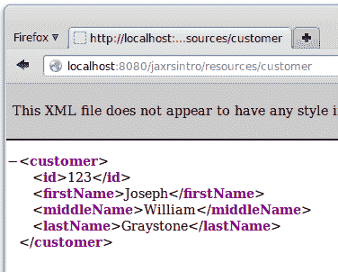

# 使用 JAX-RS 的 RESTful 网络服务

**表征状态转移**（**REST**）是一种架构风格，在这种风格中，网络服务被视为资源，并且可以通过**统一资源标识符**（**URIs**）来识别。

使用这种风格开发的网络服务被称为 RESTful 网络服务。

JAX-RS 在 Java EE 规范的第 6 版中成为 Java EE 的一部分，尽管在此之前它已经作为一个独立的 API 提供。在本章中，我们将介绍如何通过 JAX-RS API 开发 RESTful 网络服务。

本章将涵盖以下主题：

+   RESTful 网络服务和 JAX-RS 简介

+   开发一个简单的 RESTful 网络服务

+   开发 RESTful 网络服务客户端

+   路径参数

+   查询参数

+   服务器端发送事件

# RESTful 网络服务和 JAX-RS 简介

RESTful 网络服务非常灵活。它们可以消费多种不同类型的 MIME 类型，尽管它们通常被编写为消费和/或生成 XML 或**JSON**（**JavaScript 对象表示法**）。

网络服务必须支持以下四种 HTTP 方法之一：

+   **GET** - 按照惯例，`GET`请求用于检索现有资源

+   **POST** - 按照惯例，`POST`请求用于更新现有资源

+   **PUT** - 按照惯例，`PUT`请求用于创建新资源

+   **DELETE** - 按照惯例，`DELETE`请求用于删除现有资源

我们通过创建一个带有注解方法的类来开发一个 RESTful 网络服务，这些方法在收到上述 HTTP 请求之一时将被调用。一旦我们开发和部署了我们的 RESTful 网络服务，我们需要开发一个客户端来向我们的服务发送请求。JAX-RS 包括一个标准的客户端 API，我们可以使用它来开发 RESTful 网络服务客户端。

# 开发一个简单的 RESTful 网络服务

在本节中，我们将开发一个简单的网络服务来展示我们如何使服务中的方法响应不同的 HTTP 请求方法。

使用 JAX-RS 开发 RESTful 网络服务简单直接。我们的每个 RESTful 网络服务都需要通过其**唯一资源标识符**（**URI**）来调用。这个 URI 由`@Path`注解指定，我们需要使用它来装饰我们的 RESTful 网络服务资源类。

在开发 RESTful 网络服务时，我们需要开发当我们的网络服务接收到 HTTP 请求时将被调用的方法。我们需要实现方法来处理 RESTful 网络服务处理的四种类型之一或多种请求：`GET`、`POST`、`PUT`和/或`DELETE`。

JAX-RS API 提供了四个注解，我们可以使用这些注解来装饰我们的网络服务中的方法。这些注解的名称分别是`@GET`、`@POST`、`@PUT`和`@DELETE`。在我们的网络服务中用其中一个注解装饰方法，将使其能够响应相应的 HTTP 方法。

此外，我们服务中的每个方法都必须产生和/或消费特定的 MIME 类型。需要产生的 MIME 类型需要使用`@Produces`注解进行指定。同样，需要消费的 MIME 类型必须使用`@Consumes`注解进行指定。

以下示例说明了我们刚刚解释的概念：

请注意，这个示例实际上并没有做什么；示例的目的是说明如何使我们的 RESTful Web 服务资源类中的不同方法响应不同的 HTTP 方法。

```java
package com.ensode.javaee8book.jaxrsintro.service; 

import javax.ws.rs.Consumes; 
import javax.ws.rs.DELETE; 
import javax.ws.rs.GET; 
import javax.ws.rs.POST; 
import javax.ws.rs.PUT; 
import javax.ws.rs.Path; 
import javax.ws.rs.Produces; 
import javax.ws.rs.core.MediaType; 

@Path("customer") 
public class CustomerResource { 

 @GET @Produces("text/xml") 
  public String getCustomer() { 
    //in a "real" RESTful service, we would retrieve data from a database 
    //then return an XML representation of the data. 

    System.out.println("--- " + this.getClass().getCanonicalName() 
        + ".getCustomer() invoked"); 

    return "<customer>\n" 
        + "<id>123</id>\n" 
        + "<firstName>Joseph</firstName>\n" 
        + "<middleName>William</middleName>\n" 
        + "<lastName>Graystone</lastName>\n" 
        + "</customer>\n"; 
  } 

  /** 
   * Create a new customer 
   * @param customer XML representation of the customer to create 
   */ 
 @PUT @Consumes("text/xml") 
  public void createCustomer(String customerXML) { 
    //in a "real" RESTful service, we would parse the XML 
    //received in the customer XML parameter, then insert 
    //a new row into the database. 

    System.out.println("--- " + this.getClass().getCanonicalName() 
        + ".createCustomer() invoked"); 

    System.out.println("customerXML = " + customerXML); 
  } 

 @POST @Consumes(MediaType.TEXT_XML) 
  public void updateCustomer(String customerXML) { 
    //in a "real" RESTful service, we would parse the XML 
    //received in the customer XML parameter, then update 
    //a row in the database. 

    System.out.println("--- " + this.getClass().getCanonicalName() 
        + ".updateCustomer() invoked"); 

    System.out.println("customerXML = " + customerXML); 
  } 

 @DELETE @Consumes("text/xml") 
  public void deleteCustomer(String customerXML) { 
    //in a "real" RESTful service, we would parse the XML 
    //received in the customer XML parameter, then delete 
    //a row in the database. 

    System.out.println("--- " + this.getClass().getCanonicalName() 
        + ".deleteCustomer() invoked"); 

    System.out.println("customerXML = " + customerXML); 
  } 
} 
```

注意，这个类使用了`@Path`注解。这个注解指定了我们的 RESTful Web 服务的统一资源标识符（URI）。我们服务的完整 URI 将包括协议、服务器名、端口、上下文根、REST 资源路径（见下一小节），以及传递给此注解的值。

假设我们的 Web 服务已部署到名为 example.com 的服务器上，使用 HTTP 协议在 8080 端口，上下文根为`jaxrsintro`，REST 资源路径为`"resources"`，那么我们服务的完整 URI 将是：

[`example.com:8080/jaxrsintro/resources/customer`](http://example.com:8080/jaxrsintro/resources/customer)

由于 Web 浏览器在指向 URL 时会生成一个`GET`请求，因此我们可以通过将浏览器指向我们服务的 URI 来简单地测试我们服务的 GET 方法。

注意，我们课程中的每个方法都使用`@GET`、`@POST`、`@PUT`或`@DELETE`中的一个注解进行标注。这些注解使得我们的方法能够响应相应的 HTTP 方法。

此外，如果我们的方法需要向客户端返回数据，我们将在`@Produces`注解中声明返回数据的 MIME 类型。在我们的示例中，只有`getCustomer()`方法向客户端返回数据。我们希望以 XML 格式返回数据，因此我们将`@Produces`注解的值设置为 JAX-RS 提供的常量`MediaType.TEXT_XML`，其值为`"text/xml"`。同样，如果我们的方法需要从客户端消费数据，我们需要指定要消费的数据的 MIME 类型。这是通过`@Consumes`注解完成的。在我们的服务中，除了`getCustomer()`之外的所有方法都消费数据。在所有情况下，我们期望数据以 XML 格式存在，因此我们再次指定`MediaType.TEXT_XML`作为要消费的 MIME 类型。

# 为我们的应用程序配置 REST 资源路径

如前一小节简要提到的，在成功部署使用 JAX-RS 开发的 RESTful Web 服务之前，我们需要为我们的应用程序配置 REST 资源路径。我们可以通过开发一个扩展`javax.ws.rs.core.Application`的类，并用`@ApplicationPath`注解来装饰它来实现这一点。

# 通过`@ApplicationPath`注解进行配置

在开发针对 Java EE 现代版本的程序时，在许多情况下，编写`web.xml`部署描述符并不是必需的；JAX-RS 也不例外。我们可以通过注解在 Java 代码中配置 REST 资源路径。

要配置我们的 REST 资源路径，而无需依赖于`web.xml`部署描述符，我们只需要编写一个扩展`javax.ws.ApplicationPath`的类，并用`@ApplicationPath`注解装饰它。传递给此注解的值是我们服务的 REST 资源`path`。

以下代码示例说明了这个过程：

```java
package com.ensode.javaee8book..jaxrsintro.service.config; 

import javax.ws.rs.ApplicationPath; 
import javax.ws.rs.core.Application; 

@ApplicationPath("resources") 
public class JaxRsConfig extends Application { 
} 
```

注意，该类不需要实现任何方法；它只需要扩展`javax.ws.rs.Application`并用`@ApplicationPath`注解装饰。该类必须是公共的，可以具有任何名称，并且可以放在任何包中。

# 测试我们的 Web 服务

正如我们之前提到的，网络浏览器会将`GET`请求发送到我们指向的任何 URL。因此，测试我们对服务发出的`GET`请求的最简单方法就是直接将浏览器指向我们的服务 URI：



网络浏览器只支持`GET`和`POST`请求。要通过浏览器测试`POST`请求，我们必须编写一个包含具有我们的服务 URI 作为 action 属性值的 HTML 表单的 Web 应用程序。虽然对于一个单一的服务来说这很简单，但对我们开发的每个 RESTful Web 服务都这样做可能会变得繁琐。

幸运的是，有一个名为 curl 的开源命令行工具，我们可以用它来测试我们的 Web 服务。curl 包含在大多数 Linux 发行版中，并且可以轻松地下载到 Windows、mac OS X 和几个其他平台，详情请访问[`curl.haxx.se/`](http://curl.haxx.se/)。

curl 可以向我们的服务发送所有四种请求方法（`GET`、`POST`、`PUT`和`DELETE`）。我们的服务器响应将简单地显示在命令行控制台上。Curl 有一个`-X`命令行选项，允许我们指定要发送哪种请求方法。要发送`GET`请求，我们只需在命令行中输入以下内容：

```java
curl -XGET 
http://localhost:8080/jaxrsintro/resources/customer
```

这导致以下输出：

```java
<customer> 
<id>123</id> 
<firstName>Joseph</firstName> 
<middleName>William</middleName> 
<lastName>Graystone</lastName> 
</customer> 
```

这，不出所料，是我们将浏览器指向服务 URI 时看到的相同输出。

curl 的默认请求方法是`GET`，因此，我们上面示例中的`-X`参数是多余的；我们可以通过从命令行调用以下命令来达到相同的结果：

```java
curl http://localhost:8080/jaxrsintro/resources/customer
```

提交上述两个命令之一并检查应用程序服务器日志后，我们应该看到我们添加到`getCustomer()`方法中的`System.out.println()`语句的输出：

```java
INFO: --- com.ensode.jaxrsintro.service.CustomerResource.getCustomer() invoked
```

对于所有其他请求方法类型，我们需要向我们的服务发送一些数据。这可以通过 curl 的`--data`命令行参数来完成：

```java
curl -XPUT -HContent-type:text/xml --data "<customer><id>321</id><firstName>Amanda</firstName><middleName>Zoe</middleName><lastName>Adams</lastName></customer>" http://localhost:8080/jaxrsintro/resources/customer
```

如前例所示，我们需要通过 curl 的`-H`命令行参数指定 MIME 类型，格式如前例所示。

我们可以通过检查应用服务器日志来验证前面的命令是否按预期工作：

```java
INFO: --- com.ensode.jaxrsintro.service.CustomerResource.createCustomer() invoked
INFO: customerXML = <customer><id>321</id><firstName>Amanda</firstName><middleName>Zoe</middleName><lastName>Adams</lastName></customer>
```

我们可以同样容易地测试其他`request`方法类型：

```java
curl -XPOST -HContent-type:text/xml --data "<customer><id>321</id><firstName>Amanda</firstName><middleName>Tamara</middleName><lastName>Adams</lastName></customer>" http://localhost:8080/jaxrsintro/resources/customer
```

这将在应用服务器日志中产生以下输出：

```java
INFO: --- com.ensode.jaxrsintro.service.CustomerResource.updateCustomer() invoked
INFO: customerXML = <customer><id>321</id><firstName>Amanda</firstName><middleName>Tamara</middleName><lastName>Adams</lastName></customer>
```

我们可以通过执行以下命令来测试`delete`方法：

```java
curl -XDELETE -HContent-type:text/xml --data "<customer><id>321</id><firstName>Amanda</firstName><middleName>Tamara</middleName><lastName>Adams</lastName></customer>" http://localhost:8080/jaxrsintro/resources/customer
```

结果在应用服务器日志中产生以下输出：

```java
INFO: --- com.ensode.jaxrsintro.service.CustomerResource.deleteCustomer() invoked
INFO: customerXML = <customer><id>321</id><firstName>Amanda</firstName><middleName>Tamara</middleName><lastName>Adams</lastName></customer>
```

# 使用 JAXB 在 Java 和 XML 之间转换数据

在我们之前的示例中，我们处理了作为参数接收到的“原始”XML，以及返回给客户端的“原始”XML。在实际应用中，我们更有可能解析从客户端接收到的 XML，并使用它来填充一个 Java 对象。此外，我们需要返回给客户端的任何 XML 都必须从一个 Java 对象构建。

将数据从 Java 转换为 XML 然后再转换回来是一个非常常见的用例，Java EE 规范提供了一个 API 来完成这个任务。这个 API 就是**Java API for XML Binding**（**JAXB**）。

JAXB 使得将数据从 Java 转换为 XML 变得透明且简单；我们所需做的只是用`@XmlRootElement`注解装饰我们希望转换为 XML 的类。以下代码示例说明了如何进行此操作：

```java
package com.ensode.javaee8book.jaxrstest.entity; 

import java.io.Serializable; 
import javax.xml.bind.annotation.XmlRootElement; 

@XmlRootElement 
public class Customer implements Serializable { 

  private Long id; 
  private String firstName; 
  private String middleName; 
  private String lastName; 

  public Customer() { 
  } 

  public Customer(Long id, String firstName, 
      String middleInitial, String lastName) { 
    this.id = id; 
    this.firstName = firstName; 
    this.middleName = middleInitial; 
    this.lastName = lastName; 
  } 

  //getters and setters omitted for brevity 

  @Override 
  public String toString() { 
    return "id = " + getId() + "\nfirstName = " + getFirstName() 
        + "\nmiddleName = " + getMiddleName() + "\nlastName = " 
        + getLastName(); 
  } 
} 
```

如我们所见，除了在类级别上的`@XmlRootElement`注解之外，上述 Java 类并没有什么异常之处。

一旦我们有一个装饰了`@XmlRootElement`注解的类，我们需要将我们的 Web 服务的参数类型从`String`更改为我们的自定义类：

```java
package com.ensode.javaee8book.jaxbxmlconversion.service; 

import com.ensode.jaxbxmlconversion.entity.Customer; 
import javax.ws.rs.Consumes; 
import javax.ws.rs.DELETE; 
import javax.ws.rs.GET; 
import javax.ws.rs.POST; 
import javax.ws.rs.PUT; 
import javax.ws.rs.Path; 
import javax.ws.rs.Produces; 

@Path("customer") 
public class CustomerResource { 

  private Customer customer; 

  public CustomerResource() { 
    //"fake" the data, in a real application the data 
    //would come from a database. 
    customer = new Customer(1L, "David", 
        "Raymond", "Heffelfinger"); 
  } 

  @GET 
  @Produces("text/xml") 
  public Customer getCustomer() { 
    //in a "real" RESTful service, we would retrieve data from a   
     database 
    //then return an XML representation of the data. 

    System.out.println("--- " + this.getClass().getCanonicalName() 
        + ".getCustomer() invoked"); 

    return customer; 
  } 

  @POST 
  @Consumes("text/xml") 
  public void updateCustomer(Customer customer) { 
    //in a "real" RESTful service, JAXB would parse the XML 
    //received in the customer XML parameter, then update 
    //a row in the database. 

    System.out.println("--- " + this.getClass().getCanonicalName() 
        + ".updateCustomer() invoked"); 

    System.out.println("---- got the following customer: " 
        + customer); 
  } 

  @PUT 
  @Consumes("text/xml") 
 public void createCustomer(Customer customer) { 
    //in a "real" RESTful service, we would insert 
    //a new row into the database with the data in the 
    //customer parameter 

    System.out.println("--- " + this.getClass().getCanonicalName() 
        + ".createCustomer() invoked"); 

    System.out.println("customer = " + customer); 

  } 

  @DELETE 
  @Consumes("text/xml") 
 public void deleteCustomer(Customer customer) { 
    //in a "real" RESTful service, we would delete a row 
    //from the database corresponding to the customer parameter 
    System.out.println("--- " + this.getClass().getCanonicalName() 
        + ".deleteCustomer() invoked"); 

    System.out.println("customer = " + customer); 
  } 
} 
```

如我们所见，我们这个版本的 RESTful Web 服务与之前的版本之间的区别在于，所有参数类型和返回值都已经从`String`更改为`Customer`。JAXB 负责将我们的参数和返回类型适当地转换为 XML。当使用 JAXB 时，我们的自定义类对象会自动用从客户端发送的 XML 数据填充，同样，返回值会透明地转换为 XML。

# 开发 RESTful Web 服务客户端

虽然 curl 允许我们快速测试我们的 RESTful Web 服务，并且它是一个对开发者友好的工具，但它并不完全对用户友好；我们不应该期望用户在命令行中输入 curl 命令来使用我们的 Web 服务。因此，我们需要为我们的服务开发一个客户端。JAX-RS 包括一个标准的客户端 API，我们可以使用它来轻松地开发 RESTful Web 服务客户端。

以下示例说明了如何使用 JAX-RS 客户端 API：

```java
package com.ensode.javaee8book.jaxrsintroclient; 

import com.ensode.jaxbxmlconversion.entity.Customer; 
import javax.ws.rs.client.Client; 
import javax.ws.rs.client.ClientBuilder; 
import javax.ws.rs.client.Entity; 

public class App { 

    public static void main(String[] args) { 
        App app = new App(); 
        app.insertCustomer(); 
    } 

    public void insertCustomer() { 
        Customer customer = new Customer(234L, "Tamara", "A", 
                "Graystone"); 
 Client client = ClientBuilder.newClient();         
        client.target( "http://localhost:8080/jaxbxmlconversion/resources/customer"). request().put( Entity.entity(customer, "text/xml"), Customer.class); 
    } 
} 
```

我们首先需要做的是通过在`javax.ws.rs.client.ClientBuilder`类上调用静态的`newClient()`方法来创建一个`javax.ws.rs.client.Client`实例。

然后，我们在`Client`实例上调用`target()`方法，将我们的 RESTful Web 服务的 URI 作为参数传递。`target()`方法返回一个实现`javax.ws.rs.client.WebTarget`接口的类的实例。

在这一点上，我们在`WebTarget`实例上调用`request()`方法。此方法返回`javax.ws.rs.client.Invocation.Builder`接口的实现。

在这个特定的例子中，我们正在向我们的 RESTful 网络服务发送一个 HTTP `PUT`请求，因此，在这个时候，我们调用`Invocation.Builder`实现的`put()`方法。`put()`方法的第一参数是`javax.ws.rs.client.Entity`的实例。我们可以通过在`Entity`类上调用静态的`entity()`方法来创建一个。此方法的第一参数是我们希望传递给我们的 RESTful 网络服务的对象，第二个参数是我们将传递给 RESTful 网络服务的数据的 MIME 类型的字符串表示。`put()`方法的第二个参数是客户端期望从服务中得到的响应类型。在调用`put()`方法后，一个 HTTP `PUT`请求被发送到我们的 RESTful 网络服务，并且带有`@Put`注解的方法（在我们的例子中是`createCustomer()`）被调用。还有类似的`get()`、`post()`和`delete()`方法，我们可以调用以向我们的 RESTful 网络服务发送相应的 HTTP 请求。

# 查询和路径参数

在我们之前的例子中，我们正在使用一个 RESTful 网络服务来管理单个客户对象。在现实生活中，这显然不会很有帮助。一个常见的案例是开发一个 RESTful 网络服务来处理一组对象（在我们的例子中是客户）。为了确定我们在集合中处理的是哪个特定对象，我们可以向我们的 RESTful 网络服务传递参数。我们可以使用两种类型的参数，**查询**和**路径**参数。

# 查询参数

我们可以在处理我们的网络服务中的 HTTP 请求的方法中添加参数。带有`@QueryParam`注解的参数将从请求 URL 中检索。

以下示例说明了如何在我们的 JAX-RS RESTful 网络服务中使用查询参数：

```java
package com.ensode.javaee8book.queryparams.service; 

import com.ensode.queryparams.entity.Customer; 
import javax.ws.rs.Consumes; 
import javax.ws.rs.DELETE; 
import javax.ws.rs.GET; 
import javax.ws.rs.POST; 
import javax.ws.rs.PUT; 
import javax.ws.rs.Path; 
import javax.ws.rs.Produces; 
import javax.ws.rs.QueryParam; 

@Path("customer") 
public class CustomerResource { 

  private Customer customer; 

  public CustomerResource() { 
    customer = new Customer(1L, "Samuel", 
        "Joseph", "Willow"); 
  } 

  @GET 
  @Produces("text/xml") 
 public Customer getCustomer(@QueryParam("id") Long id) { 
    //in a "real" RESTful service, we would retrieve data from a  
    database 
    //using the supplied id. 

    System.out.println("--- " + this.getClass().getCanonicalName() 
        + ".getCustomer() invoked, id = " + id); 

    return customer; 
  } 

  /** 
   * Create a new customer 
   * @param customer XML representation of the customer to create 
   */ 
  @PUT 
  @Consumes("text/xml") 
  public void createCustomer(Customer customer) { 
    //in a "real" RESTful service, we would parse the XML 
    //received in the customer XML parameter, then insert 
    //a new row into the database. 

    System.out.println("--- " + this.getClass().getCanonicalName() 
        + ".createCustomer() invoked"); 

    System.out.println("customer = " + customer); 

  } 

  @POST 
  @Consumes("text/xml") 
  public void updateCustomer(Customer customer) { 
    //in a "real" RESTful service, we would parse the XML 
    //received in the customer XML parameter, then update 
    //a row in the database. 

    System.out.println("--- " + this.getClass().getCanonicalName() 
        + ".updateCustomer() invoked"); 

    System.out.println("customer = " + customer); 

    System.out.println("customer= " + customer); 
  } 

  @DELETE 
  @Consumes("text/xml") 
 public void deleteCustomer(@QueryParam("id") Long id) { 
    //in a "real" RESTful service, we would invoke 
    //a DAO and delete the row in the database with the 
    //primary key passed as the "id" parameter. 

    System.out.println("--- " + this.getClass().getCanonicalName() 
        + ".deleteCustomer() invoked, id = " + id); 

    System.out.println("customer = " + customer); 
  } 
} 
```

注意，我们只需要用`@QueryParam`注解装饰参数。这个注解允许 JAX-RS 检索任何与注解值匹配的查询参数，并将其值分配给参数变量。

我们可以在网络服务的 URL 中添加一个参数，就像我们向任何 URL 传递参数一样：

```java
curl -XGET -HContent-type:text/xml http://localhost:8080/queryparams/resources/customer?id=1 
```

# 通过 JAX-RS 客户端 API 发送查询参数

JAX-RS 客户端 API 提供了一个简单直接的方式来向 RESTful 网络服务发送查询参数。以下示例说明了如何做到这一点：

```java
package com.ensode.javaee8book.queryparamsclient; 

import com.ensode.javaee8book.queryparamsclient.entity.Customer; 
import javax.ws.rs.client.Client; 
import javax.ws.rs.client.ClientBuilder; 

public class App { 

    public static void main(String[] args) { 
        App app = new App(); 
        app.getCustomer(); 
    } 

    public void getCustomer() { 
        Client client = ClientBuilder.newClient(); 
        Customer customer = client.target( 
                "http://localhost:8080/queryparams/resources/customer"). 
 queryParam("id", 1L). 
                request().get(Customer.class); 

        System.out.println("Received the following customer  
        information:"); 
        System.out.println("Id: " + customer.getId()); 
        System.out.println("First Name: " +  
        customer.getFirstName()); 
        System.out.println("Middle Name: " +  
        customer.getMiddleName()); 
        System.out.println("Last Name: " + customer.getLastName()); 
    } 
} 
```

如我们所见，我们只需要在`Client`实例上调用`target()`方法返回的`javax.ws.rs.client.WebTarget`实例上调用`queryParam()`方法来传递参数。此方法的第一参数是参数名称，必须与网络服务上的`@QueryParam`注解的值匹配。第二个参数是我们需要传递给网络服务的值。如果我们的网络服务接受多个参数，我们可以链式调用`queryParam()`方法，每个参数使用一个`queryParam()`方法。

# 路径参数

我们还可以通过`path`参数将参数传递给我们的 RESTful 网络服务。以下示例说明了如何开发一个接受`path`参数的 JAX-RS RESTful 网络服务：

```java
package com.ensode.javaee8book.pathparams.service; 

import com.ensode.pathparams.entity.Customer; 
import javax.ws.rs.Consumes; 
import javax.ws.rs.DELETE; 
import javax.ws.rs.GET; 
import javax.ws.rs.POST; 
import javax.ws.rs.PUT; 
import javax.ws.rs.Path; 
import javax.ws.rs.PathParam; 
import javax.ws.rs.Produces; 

@Path("/customer/") 
public class CustomerResource { 

  private Customer customer; 

  public CustomerResource() { 
    customer = new Customer(1L, "William", 
        "Daniel", "Graystone"); 
  } 

  @GET 
  @Produces("text/xml") 
 @Path("{id}/") public Customer getCustomer(@PathParam("id") Long id) { 
    //in a "real" RESTful service, we would retrieve data from a database 
    //using the supplied id. 

    System.out.println("--- " + this.getClass().getCanonicalName() 
        + ".getCustomer() invoked, id = " + id); 

    return customer; 
  } 

  @PUT 
  @Consumes("text/xml") 
  public void createCustomer(Customer customer) { 
    //in a "real" RESTful service, we would parse the XML 
    //received in the customer XML parameter, then insert 
    //a new row into the database. 

    System.out.println("--- " + this.getClass().getCanonicalName() 
        + ".createCustomer() invoked"); 
    System.out.println("customer = " + customer); 

  } 

  @POST 
  @Consumes("text/xml") 
  public void updateCustomer(Customer customer) { 
    //in a "real" RESTful service, we would parse the XML 
    //received in the customer XML parameter, then update 
    //a row in the database. 

    System.out.println("--- " + this.getClass().getCanonicalName() 
        + ".updateCustomer() invoked"); 

    System.out.println("customer = " + customer); 
     System.out.println("customer= " + customer); 
  } 

  @DELETE 
  @Consumes("text/xml") 
 @Path("{id}/") public void deleteCustomer(@PathParam("id") Long id) { 
    //in a "real" RESTful service, we would invoke 
    //a DAO and delete the row in the database with the 
    //primary key passed as the "id" parameter. 

    System.out.println("--- " + this.getClass().getCanonicalName() 
        + ".deleteCustomer() invoked, id = " + id); 

    System.out.println("customer = " + customer); 
  } 
} 
```

任何接受`path`参数的方法都必须用`@Path`注解装饰。此注解的值属性必须格式化为`"{paramName}/"`，其中`paramName`是方法期望接收的参数。此外，方法参数必须用`@PathParam`注解装饰。此注解的值必须与方法上`@Path`注解中声明的参数名称匹配。

我们可以通过调整我们的网络服务的 URI 来从命令行传递`path`参数。例如，要将`1`这个`"id"`参数传递给上面的`getCustomer()`方法（它处理 HTTP `GET`请求），我们可以在命令行中这样做，如下所示：

```java
curl -XGET -HContent-type:text/xml http://localhost:8080/pathparams/resources/customer/1
```

这将返回由`getCustomer()`方法返回的`Customer`对象的 XML 表示形式的预期输出：

```java
<?xml version="1.0" encoding="UTF-8"
standalone="yes"?><customer><firstName>William</firstName><id>1</id><lastName>Graystone</lastName><middleName>Daniel</middleName></customer>
```

# 通过 JAX-RS 客户端 API 发送路径参数

通过 JAX-RS 客户端 API 将路径参数发送到网络服务既简单又直接；我们只需要添加几个方法调用来指定路径参数及其值。以下示例说明了如何做到这一点：

```java
package com.ensode.javaee8book..pathparamsclient; 

import com.ensode.javaee8book.pathparamsclient.entity.Customer; 
import javax.ws.rs.client.Client; 
import javax.ws.rs.client.ClientBuilder; 

public class App { 

    public static void main(String[] args) { 
        App app = new App(); 
        app.getCustomer(); 
    } 

    public void getCustomer() { 
        Client client = ClientBuilder.newClient(); 
        Customer customer = client.target( 
                "http://localhost:8080/pathparams/resources/customer"). 
 path("{id}"). resolveTemplate("id", 1L). 
                request().get(Customer.class); 

        System.out.println("Received the following customer  
        information:"); 
        System.out.println("Id: " + customer.getId()); 
        System.out.println("First Name: " + 
        customer.getFirstName()); 
        System.out.println("Middle Name: " + 
        customer.getMiddleName()); 
        System.out.println("Last Name: " + customer.getLastName()); 
    } 
} 
```

在这个例子中，我们在`client.target()`返回的`WebTarget`实例上调用`path()`方法。此方法将指定的`path`追加到我们的`WebTarget`实例。此方法的价值必须与我们的 RESTful 网络服务中`@Path`注解的值匹配。

在我们的`WebTarget`实例上调用`path()`方法后，我们需要调用`resolveTemplate()`。此方法的第一参数是参数的名称（不带花括号），第二个参数是我们希望作为参数传递给我们的 RESTful 网络服务的值。

如果我们需要将多个参数传递给我们的某个网络服务，我们只需在方法级别的`@Path`参数中使用以下格式：

```java
@Path("/{paramName1}/{paramName2}/") 
```

然后，用`@PathParam`注解标注相应的方法参数：

```java
public String someMethod(@PathParam("paramName1") String param1, 
@PathParam("paramName2") String param2) 
```

然后，通过修改网络服务的 URI 来传递参数，按照`@Path`注解中指定的顺序调用网络服务。例如，以下 URI 将传递`paramName1`和`paramName2`的值`1`和`2`：

`http://localhost:8080/contextroot/resources/customer/1/2`

上述 URI 既可以通过命令行使用，也可以通过我们使用 JAX-RS 客户端 API 开发的 Web 服务客户端使用。

# 服务器端发送事件

通常，Web 服务和其客户端之间的每次交互都是由客户端发起的；客户端发送一个请求（`GET`、`POST`、`PUT`或`DELETE`），然后从服务器接收响应。服务器端发送事件技术允许 RESTful Web 服务“主动”向客户端发送消息，即发送不是响应客户端请求的数据。服务器端发送事件对于向客户端连续发送数据非常有用，例如股票行情、新闻源、体育比分等。

JAX-RS 2.1 引入了服务器端发送事件支持。以下示例演示了如何将此功能实现到我们的 JAX-RS RESTful Web 服务中：

```java
package net.ensode.javaee8book.jaxrs21sse; 

import java.util.List; 
import java.util.concurrent.Executor; 
import java.util.concurrent.Executors; 
import java.util.concurrent.TimeUnit; 
import java.util.stream.Collectors; 
import java.util.stream.Stream; 
import javax.ws.rs.GET; 
import javax.ws.rs.Path; 
import javax.ws.rs.Produces; 
import javax.ws.rs.core.Context; 
import javax.ws.rs.core.MediaType; 
import javax.ws.rs.sse.OutboundSseEvent; 
import javax.ws.rs.sse.Sse; 
import javax.ws.rs.sse.SseEventSink; 

@Path("serversentevents") 
public class SseResource { 

    List<Float> stockTickerValues = null; 
    Executor executor = Executors.newSingleThreadExecutor(); 

    @GET 
    @Produces(MediaType.SERVER_SENT_EVENTS) 
 public void sendEvents(@Context SseEventSink sseEventSink,       
      @Context Sse sse) { 
        initializeStockTickerValues(); 
        executor.execute(() -> { 
            stockTickerValues.forEach(value -> { 
                try { 
                    TimeUnit.SECONDS.sleep(5); 
                    System.out.println(String.format( 
                      "Sending the following value: %.2f", value)); 
 final OutboundSseEvent outboundSseEvent = sse.newEventBuilder() .name("ENSD stock ticker value") .data(String.class,     
                      String.format("%.2f", value)) .build(); sseEventSink.send(outboundSseEvent); 
                } catch (InterruptedException ex) { 
                    ex.printStackTrace(); 
                } 

            }); 

        }); 
    } 

    private void initializeStockTickerValues() { 
        stockTickerValues = Stream.of(50.3f, 55.5f, 62.3f,  
         70.7f, 10.1f, 5.1f).collect(Collectors.toList()); 
    } 
} 
```

上述示例模拟了向客户端发送虚构公司的股票价格。为了向客户端发送服务器端发送的事件，我们需要利用`SseEventSink`和`Sse`类的实例，正如我们在示例中所展示的那样。这两个类都通过`@Context`注解注入到我们的 RESTful Web 服务中。

要发送一个事件，我们首先需要通过`Sse`实例的`newEventBuilder()`方法构建一个`OutboundSseEvent`实例。此方法创建一个`OutboundSseEvent.Builder`实例，然后用于创建必要的`OutboundSseEvent`实例。

我们通过在`OutboundSseEvent.Builder`实例上调用`name()`方法给我们的事件命名，然后通过其`data()`方法设置要发送给客户端的数据。`data()`方法接受两个参数：第一个是我们发送给客户端的数据类型（在我们的例子中是`String`），第二个是我们实际发送给客户端的数据。

一旦我们通过相应的方法设置了事件名称和数据，我们就通过在`OutboundSseEvent.Builder`上调用`build()`方法来构建一个`OutboundSseEvent`实例。

一旦我们构建了`OutboundSseEvent`实例，我们就通过将其作为参数传递给`SseEventSink`的`send()`方法将其发送到客户端。在我们的示例中，我们遍历模拟的股票价格并将其发送到客户端。

# JavaScript 服务器端发送事件客户端

到目前为止，我们所有的客户端示例要么使用了 curl 命令行工具，要么使用了 JAX-RS RESTful Web 服务客户端 API。使用在浏览器上运行的 JavaScript 代码作为 RESTful Web 服务客户端是非常常见的，因此，在本节中，我们将采用这种方法。以下示例演示了一个 HTML/JavaScript 客户端接收服务器端发送的事件：

```java
<!DOCTYPE html> 
<html> 
    <head> 
        <title>Stock Ticker Monitor</title> 
        <meta http-equiv="Content-Type" content="text/html; charset=UTF-8"> 
    </head> 
    <body onload="getStockTickerValues()"> 
        <h2>Super fancy stock ticker monitor</h2> 
        <table cellspacing="0" cellpadding="0"> 
            <tr> 
                <td>ENSD Stock Ticker Value: </td> 
                <td> <span id="stickerVal"></span></td> 
            </tr> 
            <tr> 
                <td></td><td><button>Buy!</button></td> 
            </tr> 
        </table> 
        <script> 
 function getStockTickerValues() { var source = new                   
                 EventSource("webresources/serversentevents/"); source.addEventListener('ENSD stock ticker value', function (event) { document.getElementById("stickerVal").
                      innerHTML = event.data; }, false); } 
        </script> 
    </body> 
</html> 
```

`getStockTickerValues()` JavaScript 函数创建了一个 `EventSource` 对象。这个构造函数接受一个表示发送事件的服务器 URL 的 `String` 作为参数。在我们的例子中，我们使用了一个相对 URL，因为前面的 HTML/JavaScript 代码托管在与服务器代码相同的服务器上。如果不是这种情况，我们就需要使用一个完整的 URL。

我们通过向我们的 `EventSource` 实例添加事件监听器来执行客户端接收到事件时要执行的功能。这个函数接受事件名称（注意，该值与我们在 Java 代码中为我们的 RESTful 网络服务发送的名称相匹配），以及一个在接收到事件时要执行的功能。在我们的例子中，我们只是简单地更新一个 `<span>` 标签的内容，以显示接收到的消息数据。

# 摘要

在本章中，我们讨论了如何使用 JAX-RS，Java EE 规范的新增内容，轻松地开发 RESTful 网络服务。

我们通过在我们的代码中添加几个简单的注解来开发 RESTful 网络服务。我们还解释了如何利用 **Java API for XML Binding**（**JAXB**）自动在 Java 和 XML 之间转换数据。

此外，我们还介绍了如何通过 `@PathParam` 和 `@QueryParam` 注解将参数传递给我们的 RESTful 网络服务。

最后，我们讨论了如何开发能够向所有客户端发送服务器端事件的网络服务，利用新的 JAX-RS 2.1 服务器端事件支持。
