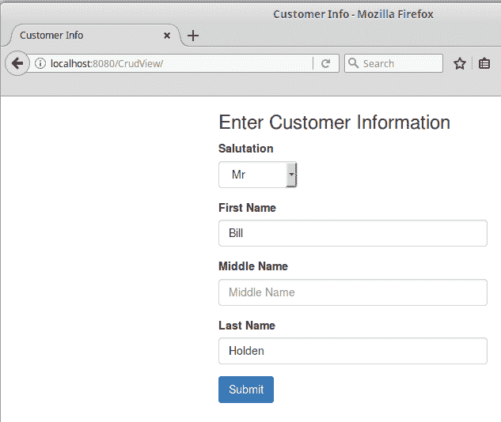
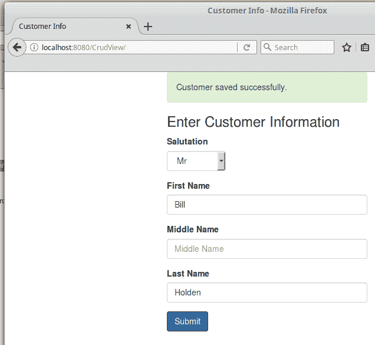
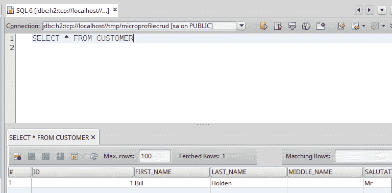

# 使用 Java EE 进行微服务开发

微服务是一种将代码部署在小而粒度化的模块中的架构风格。微服务架构减少了耦合并增加了内聚。通常，微服务被实现为 RESTful Web 服务，通常使用 JSON 通过调用 HTTP 方法（`GET`、`POST`、`PUT`或`DELETE`）在彼此之间传递数据。由于微服务之间的通信是通过 HTTP 方法完成的，因此用不同编程语言编写的微服务可以相互交互。在本章中，我们将介绍如何使用 Java EE 实现微服务。

在本章中，我们将介绍以下主题：

+   微服务简介

+   微服务架构的优势

+   微服务架构的劣势

+   使用 Java EE 开发微服务

# 微服务简介

将应用程序设计为一系列微服务相对于传统设计应用程序有一些优势，但也存在一些劣势。在考虑为我们的应用程序采用微服务架构时，我们必须在做出决定之前仔细权衡利弊。

# 微服务架构的优势

将应用程序作为一系列微服务开发具有比传统设计应用程序的多个优势：

+   **更小的代码库**：由于每个微服务都是一个小的、独立的单元，因此微服务的代码库通常比传统设计的应用程序更小，更容易管理。

+   **微服务鼓励良好的编码实践**：微服务架构鼓励松耦合和高内聚。

+   **更高的容错性**：传统设计的应用程序作为一个单点故障；如果应用程序的任何组件出现故障或不可用，整个应用程序将不可用。由于微服务是独立的模块，一个组件（即一个微服务）出现故障并不一定导致整个应用程序不可用。

+   **可伸缩性**：由于作为一系列微服务开发的应用程序由多个不同的模块组成，因此可伸缩性变得更容易；我们只需关注可能需要扩展的服务，而无需在不需要扩展的应用程序部分上浪费精力。

# 微服务架构的劣势

无论使用哪种编程语言或应用程序框架来开发应用程序，开发并部署遵循微服务架构的应用程序都会带来其自身的挑战：

+   **额外的操作和工具开销**：每个微服务实现都需要其自己的（可能是自动化的）部署、监控系统等。

+   **调试微服务可能比调试传统的企业应用程序更复杂**：如果最终用户报告了他们应用程序的问题，并且该应用程序内部使用了多个微服务，那么并不总是清楚哪个微服务可能是罪魁祸首。如果涉及的微服务是由不同团队开发，且优先级不同，这可能会特别困难。

+   **分布式事务可能是一个挑战**：涉及多个微服务的回滚事务可能很难。一种常见的解决方案是尽可能地将微服务隔离，将它们视为单一单元，然后为每个微服务进行本地事务管理。例如，如果微服务 A 调用了微服务 B，如果微服务 B 存在问题，微服务 B 的本地事务将回滚，然后它将返回 HTTP 状态码`500`（服务器错误）给微服务 A。微服务 A 可以使用这个 HTTP 状态码作为信号来启动补偿事务，使系统恢复到初始状态。

+   **网络延迟**：由于微服务依赖于 HTTP 方法调用来进行通信，性能有时会因网络延迟而受到影响。

+   **潜在的复杂依赖性**：虽然独立的微服务往往很简单，但它们相互依赖。微服务架构可能创建一个复杂的依赖图。如果我们的某些服务依赖于其他团队开发的微服务，而这些团队可能有冲突的优先级（例如，如果我们发现他们的微服务中存在一个错误，然而，修复这个错误可能不是其他团队的优先事项），这种情况可能会令人担忧。

+   **容易受到分布式计算谬误的影响**：按照微服务架构开发的应用程序可能会做出一些不正确的假设，例如网络可靠性、零延迟、无限带宽等。

# 微服务与 Java EE

有些人可能认为 Java EE 对于微服务开发来说“过于重量级”，但这根本不是事实。正因为这种误解，有些人可能会认为 Java EE 可能不适合微服务架构，然而实际上，Java EE 非常适合微服务开发。在过去，Java EE 应用程序被部署到“重量级”的应用服务器上。如今，大多数 Java EE 应用服务器供应商都提供轻量级的应用服务器，这些服务器使用的内存或磁盘空间非常少。这些 Java EE 兼容的轻量级应用服务器的例子包括 IBM 的 Open Liberty、Red Hat 的 WildFly Swarm、Apache TomEE 和 Payara Micro。

使用 Java EE 开发微服务涉及编写标准的 Java EE 应用程序，同时将自己限制在 Java EE API 的某个子集——通常是 JAX-RS 和 JSON-P 或 JSON-B，以及一些其他，如 CDI，如果与关系数据库交互，则是 JPA。Java EE 开发者可以在开发微服务时利用他们现有的专业知识。主要要求是使用 JAX-RS 开发 RESTful 网络服务。然后，将这些网络服务打包在 WAR 文件中，并像往常一样部署到轻量级应用程序服务器上。

当使用现代、可嵌入的 Java EE 应用程序服务器时，通常每个应用程序服务器实例只部署一个应用程序，在某些情况下，可以说“形势逆转”，应用程序服务器只是一个应用程序作为依赖项使用的库。使用这些现代应用程序服务器，通常会在服务器上部署多个应用程序服务器实例，这使得现代 Java EE 特别适合微服务开发。许多现代、轻量级的 Java EE 应用程序服务器是可嵌入的，允许创建一个“超级 jar”，它包含应用程序代码和应用程序服务器库。然后，将这个“超级 jar”传输到服务器上并作为独立应用程序运行。除了“超级 jar”之外，现代应用程序服务器还可以添加到容器镜像（如 Docker）中，然后应用程序可以作为瘦 war 部署，通常只有几 KB 大小；这种方法具有非常快速部署的优势，通常在 2 秒以内。

通过部署到符合当代 Java EE Web Profile 的应用程序服务器（或，如前一段所述，创建一个“超级 jar”），Java EE 开发者当然可以利用他们现有的专业知识来开发符合微服务规范的应用程序。

# 使用 Java EE 开发微服务

现在我们已经对微服务进行了简要介绍，我们准备查看一个使用 Java EE 编写的示例微服务应用程序。我们的示例应用程序对大多数 Java EE 开发者来说应该非常熟悉。它是一个简单的 **CRUD**（**创建、读取、更新、删除**）应用程序。作为一系列微服务的开发，该应用程序将遵循熟悉的 MVC 设计模式，其中“视图”和“控制器”作为微服务进行开发。该应用程序还将利用非常常见的 DAO 模式，我们的 DAO 也作为微服务进行开发。

实际上，示例代码不是一个完整的 CRUD 应用程序。为了简单起见，我们决定只实现 CRUD 应用程序的“创建”部分。

我们将使用 Payara Micro 来部署我们的示例代码。Payara Micro 是从 GlassFish 派生出的轻量级 Java EE 应用程序服务器，它是开源的，可以免费获取，并支持 Java EE 网络配置文件，该配置文件包括所有 Java EE 规范的一个子集，即安全、Bean 验证、CDI、EJB Lite（提供完整 EJB 功能的一个子集）、统一表达式语言、JAX-RS、JDBC、JNDI、JPA、JSF、JSON-P、JSP、Servlets 和 WebSockets。

可以在[`www.payara.fish/downloads.`](https://www.payara.fish/downloads)下载 Payara Micro。

我们的应用程序将开发为三个模块：首先是一个微服务客户端，其次是 MVC 设计模式中的控制器微服务实现，然后是实现为微服务的 DAO 设计模式。

# 开发微服务客户端代码

在深入开发我们的服务之前，我们首先将开发一个微服务客户端，其形式为一个 HTML5 页面，使用流行的 Twitter Bootstrap CSS 库以及无处不在的 jQuery JavaScript 库。前端服务中的 JavaScript 代码将调用控制器微服务，传递用户输入数据的 JSON 表示。然后，控制器服务将调用持久化服务并将数据保存到数据库中。每个微服务都将返回一个 HTTP 状态码，指示成功或错误条件。

我们客户端代码中最相关的部分是 HTML 表单以及提交表单到我们的控制器微服务的 jQuery 代码。

我们在这里只展示代码的小片段。示例应用的完整代码可以在以下位置找到：

[`github.com/dheffelfinger/Java-EE-8-Application-Development-Code-Samples`](https://github.com/dheffelfinger/Java-EE-8-Application-Development-Code-Samples).

我们 HTML5 页面中的表单标记如下所示：

```java
<form id="customerForm"> 
    <div class="form-group"> 
        <label for="salutation">Salutation</label><br/> 
        <select id="salutation" name="salutation" 
            class="form-control" style="width: 100px !important;"> 
            <option value=""> </option> 
            <option value="Mr">Mr</option> 
            <option value="Mrs">Mrs</option> 
            <option value="Miss">Miss</option> 
            <option value="Ms">Ms</option> 
            <option value="Dr">Dr</option> 
        </select> 
    </div> 
    <div class="form-group"> 
        <label for="firstName">First Name</label> 
        <input type="text" maxlength="10" class="form-control"
         id="firstName" name="firstName"  placeholder="First Name"> 
    </div> 
    <div class="form-group"> 
        <label for="middleName">Middle Name</label> 
        <input type="text" maxlength="10" class="form-control"
         id="middleName" name="middleName" placeholder="Middle 
         Name"> 
    </div> 
    <div class="form-group"> 
        <label for="lastName">Last Name</label> 
        <input type="text" maxlength="20" class="form-control"
         id="lastName" name="lastName" placeholder="Last Name"> 
    </div> 
    <div class="form-group"> 
        <button type="button" id="submitBtn" 
         class="btn btn-primary">Submit</button> 
    </div> 
</form> 
As we can see, this is a standard HTML form using Twitter Bootstrap CSS classes. Our page also has a script to send form data to the controller microservice. 
<script> 
  $(document).ready(function () { 
      $("#submitBtn").on('click', function () { 
          var customerData = $("#customerForm").serializeArray(); 
          $.ajax({ 
              headers: { 
                  'Content-Type': 'application/json' 
              }, 
              crossDomain: true, 
              dataType: "json", 
              type: "POST", 
              url:   
          "http://localhost:8180/CrudController/webresources/customercontroller/", 
              data: JSON.stringify(customerData) 
            }).done(function (data, textStatus, jqXHR) { 
              if (jqXHR.status === 200) { 
                  $("#msg").removeClass(); 
                  $("#msg").toggleClass("alert alert-success"); 
                  $("#msg").html("Customer saved successfully."); 
              } else { 
                  $("#msg").removeClass(); 
                  $("#msg").toggleClass("alert alert-danger"); 
                  $("#msg").html("There was an error saving 
                   customer data."); 
              } 
          }).fail(function (data, textStatus, jqXHR) { 
              console.log("ajax call failed"); 
              console.log("data = " + JSON.stringify(data)); 
              console.log("textStatus = " + textStatus); 
              console.log("jqXHR = " + jqXHR); 
              console.log("jqXHR.status = " + jqXHR.status); 
          }); 
      }); 
  }); 
</script> 
```

当页面上的提交按钮被点击时，将调用脚本。它使用 jQuery 的`serializeArray()`函数收集用户输入的表单数据，并创建一个带有该数据的 JSON 格式数组。`serializeArray()`函数创建一个 JSON 对象数组。数组中的每个元素都有一个与 HTML 标记上的名称属性匹配的名称属性，以及一个与用户输入值匹配的`value`属性。

例如，如果用户在问候下拉菜单中选择了`"Mr"`，在名字字段中输入了`"John"`，中间名留空，并以`"Doe"`作为姓氏，生成的 JSON 数组将如下所示：

```java
[{"name":"salutation","value":"Mr"},{"name":"firstName","value":"John"},{"name":"middleName","value":""},{"name":"lastName","value":"Doe"}] 
```

注意，上述 JSON 数组中每个`"name"`属性的值与 HTML 表单中的`"name"`属性匹配；相应的`"value"`属性与用户输入的值匹配。

由于生成的 HTTP 请求将被发送到 Payara Micro 的不同实例，即使我们将所有微服务部署到同一服务器（或在我们的情况下，部署到我们的本地工作站），我们也需要将`Ajax`设置对象的`crossDomain`属性设置为`true`。

注意，`Ajax`设置对象的`url`属性值端口为`8180`，当我们部署时，我们需要确保我们的控制器微服务正在监听这个端口。

我们可以从命令行将我们的 View 微服务部署到 Payara Micro，如下所示：

```java
java -jar payara-micro-4.1.2.173.jar --noCluster --deploy /path/to/CrudView.war
```

Payara micro 以可执行的 JAR 文件形式分发，因此我们可以通过`java -jar`命令启动它。JAR 文件的准确名称将取决于你使用的 Payara Micro 版本。

默认情况下，运行在同一服务器上的 Payara Micro 实例会自动形成一个集群。对于我们的简单示例，我们不需要这个功能，因此我们使用了`--noCluster`命令行参数。

`--deploy`命令行参数用于指定我们想要部署的工件。在我们的例子中，它是一个包含作为我们示例应用程序用户界面的 HTML5 页面的 WAR 文件。

我们可以通过检查 Payara Micro 的输出以确保我们的应用程序已成功部署：

```java
    **[2017-10-21T12:00:35.196-0400] [] [INFO] [AS-WEB-GLUE-00172] [javax.enterprise.web] [tid: _ThreadID=1 _ThreadName=main] [timeMillis: 1508601635196] [levelValue: 800] Loading application [CrudView] at [/CrudView]** 

    **[2017-10-21T12:00:35.272-0400] [] [INFO] [] [javax.enterprise.system.core] [tid: _ThreadID=1 _ThreadName=main] [timeMillis: 1508601635272] [levelValue: 800] CrudView was successfully deployed in 1,332 milliseconds.** 

    **[2017-10-21T12:00:35.274-0400] [] [INFO] [] [PayaraMicro] [tid: _ThreadID=1 _ThreadName=main] [timeMillis: 1508601635274] [levelValue: 800] Deployed 1 archive(s)** 

```

现在，我们可以将我们的浏览器指向我们的 CrudView 应用程序 URL（在我们的例子中是`http://localhost:8080/CrudView`）。输入一些数据后，页面将看起来如下截图所示：



当用户点击提交按钮时，客户端将用户输入数据的 JSON 表示传递给控制器服务。

# 控制器服务

控制器服务是 MVC 设计模式中控制器的一个标准 RESTful Web 服务实现，使用 JAX-RS 实现：

```java
package net.ensode.javaee8book.microservices.crudcontroller.service; 
//imports omitted for brevity 
@Path("/customercontroller") 
public class CustomerControllerService { 

    public CustomerControllerService() { 
    } 

    @OPTIONS 
    public Response options() { 
        return Response.ok("") 
 .header("Access-Control-Allow-Origin", "http://localhost:8080") 
                .header("Access-Control-Allow-Headers", "origin," +  
                        "content-type, accept, authorization") 
                .header("Access-Control-Allow-Credentials", "true") 
                .header("Access-Control-Allow-Methods",  
                        "GET, POST, PUT, DELETE, OPTIONS, HEAD") 
                .header("Access-Control-Max-Age", "1209600") 
                .build(); 
    } 

    @POST 
    @Consumes(MediaType.APPLICATION_JSON) 
    public Response addCustomer(String customerJson) { 
        Response response; 
        Response persistenceServiceResponse; 
        CustomerPersistenceClient client =  
          new CustomerPersistenceClient(); 
        Customer customer = jsonToCustomer(customerJson); 
        persistenceServiceResponse = client.create(customer); 
        client.close(); 

        if (persistenceServiceResponse.getStatus() == 201) { 
            response = Response.ok("{}"). 
                    header("Access-Control-Allow-Origin", 
                           "http://localhost:8080").build(); 

        } else { 
            response = Response.serverError(). 
                    header("Access-Control-Allow-Origin",
 "http://localhost:8080").build(); 
        } 
        return response; 
    } 

    private Customer jsonToCustomer(String customerJson) { 
        Customer customer = new Customer(); 
        JsonArray jsonArray; 
        try (JsonReader jsonReader = Json.createReader( 
                new StringReader(customerJson))) { 
            jsonArray = jsonReader.readArray(); 
        } 

        for (JsonValue jsonValue : jsonArray) { 
            JsonObject jsonObject = (JsonObject) jsonValue; 
            String propertyName = jsonObject.getString("name"); 
            String propertyValue = jsonObject.getString("value"); 

            switch (propertyName) { 
                case "salutation": 
                    customer.setSalutation(propertyValue); 
                    break; 
                case "firstName": 
                    customer.setFirstName(propertyValue); 
                    break; 
                case "middleName": 
                    customer.setMiddleName(propertyValue); 
                    break; 
                case "lastName": 
                    customer.setLastName(propertyValue); 
                    break; 
                default: 
                    LOG.log(Level.WARNING, String.format( 
                            "Unknown property name found: %s", 
                             propertyName)); 
                    break; 
            } 
        } 
        return customer; 
    } 
} 
```

带有`javax.ws.rs.OPTIONS`注解的`options()`方法是必要的，因为浏览器在调用包含我们服务器主要逻辑的实际`POST`请求之前会自动调用它。在这个方法中，我们设置了一些头部值以允许**跨源资源共享**（**CORS**），简单来说就是允许我们的服务从不同于我们服务运行的服务器上调用。在我们的例子中，客户端部署到了 Payara Micro 的不同实例上，因此被视为不同的源。这些头部值是必要的，以便允许我们的客户端代码和控制器服务相互通信。注意，我们明确允许来自`http://localhost:8080`的请求，这是我们的客户端代码部署的主机和端口。

我们控制器服务的主要逻辑位于`addCustomer()`方法中。此方法接收客户端发送的 JSON 字符串作为参数。在这个方法中，我们创建了一个`CustomerPersistenceClient()`实例，这是一个使用 JAX-RS 客户端 API 实现的持久化服务客户端。

然后，我们通过调用`jsonToCustomer()`方法创建一个`Customer`类的实例。此方法接收客户端发送的 JSON 字符串，并使用标准的 Java EE JSON-P API，用 JSON 字符串中的对应值填充`Customer`类的实例。

`Customer` 类是一个简单的 **数据传输对象** (**DTO**)，包含一些属性，与客户端表单中的输入字段相匹配，以及相应的 getter 和 setter。这个类非常简单，所以我们决定不展示它。

然后，我们的 `addCustomer()` 方法通过在 `CustomerPersistenceClient` 上调用 `create()` 方法来调用持久化服务，检查持久化服务返回的 HTTP 状态码，然后向客户端返回相应的状态码。

让我们现在看看我们的 JAX-RS 客户端代码的实现：

```java
package net.ensode.javaee8book.microservices.crudcontroller.restclient; 
//imports omitted 
public class CustomerPersistenceClient { 

    private final WebTarget webTarget; 
    private final Client client; 
 private static final String BASE_URI = "http://localhost:8280/CrudPersistence/webresources"; 

    public CustomerPersistenceClient() { 
 client = javax.ws.rs.client.ClientBuilder.newClient(); webTarget = client.target(BASE_URI).path("customerpersistence"); 
    } 

    public Response create(Customer customer) throws 
      ClientErrorException { 
 return webTarget.request( javax.ws.rs.core.MediaType.APPLICATION_JSON). post(javax.ws.rs.client.Entity.entity(customer, javax.ws.rs.core.MediaType.APPLICATION_JSON), Response.class); 
    } 

    public void close() { 
        client.close(); 
    } 
} 
```

我们的控制器服务只使用了两个标准的 Java EE API，即 JAX-RS 和 JSON-P。正如我们所见，我们的客户端代码是一个相当简单的类。利用 JAX-RS 客户端 API，我们声明一个包含我们正在调用的服务的基础 URI 的常量（我们的持久化服务）。在其构造函数中，我们创建一个新的 `javax.ws.rs.client.ClientBuilder` 实例，然后设置其基础 URI 和路径，匹配我们持久化服务的适当值。我们的客户端类有一个单一的方法，该方法向持久化服务提交一个 HTTP `POST` 请求，然后返回它发送回来的响应。

我们可以从命令行将我们的控制器服务部署到 Payara Micro，如下所示：

```java
java -jar payara-micro-4.1.2.173.jar --noCluster --port 8180 --deploy /path/to/CrudController.war
```

通过检查 Payara Micro 的输出，我们可以看到我们的代码部署成功：

```java
[2017-10-21T12:04:06.505-0400] [] [INFO] [AS-WEB-GLUE-00172] [javax.enterprise.web] [tid: _ThreadID=1 _ThreadName=main] [timeMillis: 1508601846505] [levelValue: 800] Loading application [CrudController] at [/CrudController]

[2017-10-21T12:04:06.574-0400] [] [INFO] [] [javax.enterprise.system.core] [tid: _ThreadID=1 _ThreadName=main] [timeMillis: 1508601846574] [levelValue: 800] CrudController was successfully deployed in 1,743 milliseconds.

[2017-10-21T12:04:06.576-0400] [] [INFO] [] [PayaraMicro] [tid: _ThreadID=1 _ThreadName=main] [timeMillis: 1508601846576] [levelValue: 800] Deployed 1 archive(s)
```

现在我们已经成功部署了我们的控制器服务，我们准备检查我们应用程序的最后一个组件，即持久化服务：

```java
package net.ensode.javaee9book.microservices.crudpersistence.service; 

//imports omitted for brevity 
@ApplicationScoped 
@Path("customerpersistence") 
public class CustomerPersistenceService { 
    @Context 
    private UriInfo uriInfo; 
    @Inject 
    private CrudDao customerDao; 

    @POST 
    @Consumes(MediaType.APPLICATION_JSON) 
    public Response create(Customer customer) { 
        try { 
            customerDao.create(customer); 
        } catch (Exception e) { 
            return Response.serverError().build(); 
        } 
        return Response.created(uriInfo.getAbsolutePath()).build(); 
    } 
} 
```

在这种情况下，由于调用我们服务的客户端代码是用 Java 开发的，所以我们不需要将接收到的 JSON 字符串转换为 Java 代码；这是在幕后自动完成的。我们的 `create()` 方法在控制器服务向持久化服务发送 HTTP `POST` 请求时被调用。该方法简单地在一个实现 DAO 设计模式的类上调用 `create()` 方法。我们的持久化服务返回 `HTTP 响应 201`（已创建）。如果一切顺利，如果 DAO 的 `create()` 方法抛出异常，那么我们的服务将返回 `HTTP 错误 500`（内部服务器错误）。

我们的 DAO 作为 CDI 管理的 Bean 实现，使用 JPA 将数据插入到数据库中：

```java
package net.ensode.microservices.crudpersistence.dao; 
//imports omitted for brevity 
@ApplicationScoped 
@Transactional 
public class CrudDao { 
    @PersistenceContext(unitName = "CustomerPersistenceUnit") 
    private EntityManager em; 

    public void create(Customer customer) { 
        em.persist(customer); 
    } 
} 
```

我们的 DAO 实现非常简单；它实现了一个方法，该方法在注入的 `EntityManager` 实例上调用 `persist()` 方法。

在我们的持久化服务项目中，`Customer` 类是一个简单的 JPA 实体。

我们现在像往常一样将我们的持久化服务部署到 Payara Micro：

```java
java -jar payara-micro-4.1.2.173.jar --port 8280 --noCluster --deploy /path/to//CrudPersistence.war 
```

检查 Payara Micro 的输出，我们可以看到我们的持久化服务已成功部署：

```java
[2017-10-21T15:15:17.361-0400] [] [INFO] [AS-WEB-GLUE-00172] [javax.enterprise.web] [tid: _ThreadID=1 _ThreadName=main] [timeMillis: 1508613317361] [levelValue: 800] Loading application [CrudPersistence] at [/CrudPersistence]

[2017-10-21T15:15:17.452-0400] [] [INFO] [] [javax.enterprise.system.core] [tid: _ThreadID=1 _ThreadName=main] [timeMillis: 1508613317452] [levelValue: 800] CrudPersistence was successfully deployed in 4,201 milliseconds.

[2017-10-21T15:15:17.453-0400] [] [INFO] [] [PayaraMicro] [tid: _ThreadID=1 _ThreadName=main] [timeMillis: 1508613317453] [levelValue: 800] Deployed 1 archive(s)

```

现在我们已经部署了应用程序的所有三个组件，我们准备看到它在实际中的应用。

一旦用户输入一些数据并点击提交按钮，我们应该在我们的页面顶部看到一条 *成功* 消息：



如果我们查看数据库，我们应该看到用户输入的数据已成功持久化：



如我们的示例代码所示，在 Java EE 中遵循微服务架构开发应用程序非常简单；它不需要任何特殊知识。微服务使用标准的 Java EE API 进行开发，并部署到轻量级的应用服务器。我们所有的示例代码都使用了之前章节中介绍的标准 Java EE API。

# 摘要

如我们所见，Java EE 特别适合微服务开发。Java EE 开发者可以利用他们现有的知识来开发微服务架构并将其部署到现代、轻量级的应用服务器。传统的 Java EE 应用程序可以很好地与微服务交互，并且在有意义的场合可以迭代重构为微服务架构。无论是开发遵循微服务架构的新应用程序，重构现有应用程序为微服务，还是修改现有应用程序以与微服务交互，Java EE 开发者都可以利用他们现有的技能来完成这项任务。
