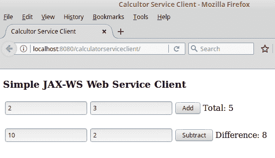
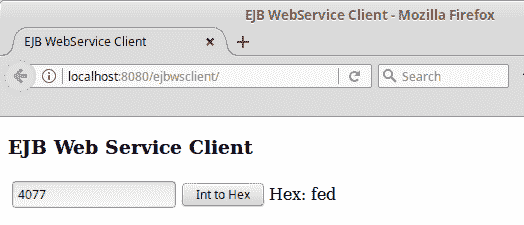

# 使用 JAX-WS 的 Web 服务

Java EE 规范将 JAX-WS API 作为其技术之一。JAX-WS 是在 Java 平台上开发 **SOAP**（**简单对象访问协议**）网络服务的标准方式，代表 Java API for XML Web Services。JAX-WS 是一个高级 API；通过 JAX-WS 调用网络服务是通过远程过程调用完成的。JAX-WS 对于 Java 开发者来说是一个非常自然的 API。

网络服务是可以远程调用的应用程序编程接口。网络服务可以从任何语言的客户端调用。

我们将涵盖的一些主题包括：

+   使用 JAX-WS API 开发网络服务

+   使用 JAX-WS API 开发网络服务客户端

+   向网络服务调用添加附件

+   将 EJB 作为网络服务公开

# 使用 JAX-WS 开发网络服务

JAX-WS 是一个高级 API，它简化了基于 SOAP 的网络服务的开发。JAX-WS 代表 **Java API for XML Web Services**。通过 JAX-WS 开发网络服务包括编写一个公共方法以供作为网络服务公开的类。该类需要用 `@WebService` 注解进行装饰。类中的所有公共方法都会自动公开为网络服务。它们可以选择性地用 `@WebService` 注解进行装饰。以下示例说明了这个过程：

```java
package net.ensode.glassfishbook; 

import javax.jws.WebMethod; 
import javax.jws.WebService; 

@WebService 
public class Calculator { 

 @WebMethod 
    public int add(int first, int second) { 
        return first + second; 
    } 

 @WebMethod 
    public int subtract(int first, int second) { 
        return first - second; 
    } 
} 
```

前面的类将其两个方法公开为网络服务。`add()` 方法简单地将它接收的两个 `int` 原始参数相加并返回结果；`substract()` 方法从其两个参数中减去并返回结果。

我们通过用 `@WebService` 注解装饰类来表示该类实现了网络服务。任何我们希望公开为网络服务的方法都可以用 `@WebMethod` 注解进行装饰，但这不是必需的；所有公共方法都会自动公开为网络服务。我们仍然可以使用 `@WebMethod` 注解以提高清晰度，但这并不是部署我们的网络服务所必需的；我们只需像往常一样将其打包到 WAR 文件中即可。

网络服务客户端需要一个 **WSDL**（**Web 服务定义语言**）文件来生成它们可以用来调用网络服务的可执行代码。WSDL 文件通常放置在 Web 服务器上，并通过客户端的 URL 访问。

当部署使用 JAX-WS 开发的网络服务时，会自动为我们生成一个 WSDL。生成的 WSDL 的确切 URL 依赖于我们使用的 Java EE 8 应用服务器。当使用 GlassFish 时，JAX-WS WSDL 的 URL 格式如下：

`[http|https]://[server]:[port]/[context root]/[service name]?wsdl`

在我们的示例中，当我们的网络服务（部署到 GlassFish）的 WSDL 的 URL 为 `http://localhost:8080/calculatorservice/CalculatorService?wsdl`（假设 GlassFish 在我们的本地工作站上运行，并且 GlassFish 在其默认的 8080 端口上监听 HTTP 连接）。

# 开发网络服务客户端

如我们之前提到的，需要从网络服务的 WSDL 生成可执行代码。然后，网络服务客户端将调用这个可执行代码来访问网络服务。

**Java 开发工具包**（**JDK**）包括一个从 WSDL 生成 Java 代码的工具。这个工具的名称是 `wsimport`。它可以在 `$JAVA_HOME/bin` 下找到。`wsimport` 的唯一必需参数是与网络服务对应的 WSDL 的 URL，例如：

`wsimport http://localhost:8080/calculatorservice/CalculatorService?wsdl`

上述命令将生成多个编译后的 Java 类，允许客户端应用程序访问我们的网络服务：

+   `Add.class`

+   `AddResponse.class`

+   `Calculator.class`

+   `CalculatorService.class`

+   `ObjectFactory.class`

+   `package-info.class`

+   `Subtract.class`

+   `SubtractResponse.class`

保持生成的源代码：默认情况下，生成的类文件的源代码会被自动删除；可以通过传递 `-keep` 参数给 `wsimport` 来保留它。

这些类需要添加到客户端的 `CLASSPATH` 中，以便它们可以被客户端代码访问。

如果我们使用 Apache Maven 来构建我们的代码，我们可以利用 JAX-WS Maven 插件在构建客户端代码时自动调用 `wsimport`。这种方法在下面的 `pom.xml` 文件中得到了说明：

```java
<?xml version="1.0" encoding="UTF-8"?> 
<project   xsi:schemaLocation="http://maven.apache.org/POM/4.0.0 http://maven.apache.org/xsd/maven-4.0.0.xsd"> 
    <modelVersion>4.0.0</modelVersion> 

    <groupId>net.ensode.javaee8book</groupId> 
    <artifactId>calculatorserviceclient</artifactId> 
    <version>1.0</version> 
    <packaging>war</packaging> 

    <name>calculatorserviceclient</name> 

    <properties> 
        <endorsed.dir>${project.build.directory}/endorsed</endorsed.dir> 
        <project.build.sourceEncoding>UTF-8</project.build.sourceEncoding> 
    </properties> 

    <dependencies> 
        <dependency> 
            <groupId>javax</groupId> 
            <artifactId>javaee-api</artifactId> 
            <version>7.0</version> 
            <scope>provided</scope> 
        </dependency> 
    </dependencies> 

    <build> 
        <plugins> 
        <plugin> 
                <groupId>org.codehaus.mojo</groupId> 
                <artifactId>jaxws-maven-plugin</artifactId> 
                <version>2.4.1</version> 
                <executions> 
                    <execution> 
                        <goals> 
                            <goal>wsimport</goal> 
                        </goals> 
                        <configuration> 
                            <vmArgs> 
                            <vmArg>-Djavax.xml.accessExternalSchema=all</vmArg> 
                            </vmArgs> 
                            <wsdlUrls> 
                               <wsdlUrl> 
                     http://localhost:8080/calculatorservice/CalculatorService?wsdl 
                              </wsdlUrl> 
                            </wsdlUrls> 
                            <keep>true</keep> 
                        </configuration> 
                    </execution> 
                </executions> 
            </plugin> 
           <!-- additional plugins removed for brevity --> 
        </plugins> 
    </build> 
</project> 
```

上述 `pom.xml` Maven 构建文件将在我们通过 `mvn package` 或 `mvn install` 命令构建代码时自动调用 `wsimport` 工具。

到目前为止，我们已经准备好开发一个简单的客户端来访问我们的网络服务。我们将实现我们的客户端作为一个 JSF 应用程序。我们客户端应用程序源代码中最相关的部分如下所示：

```java
package net.ensode.javaee8book.calculatorserviceclient;
import javax.enterprise.context.RequestScoped;
import javax.faces.event.ActionEvent;
import javax.inject.Inject;
import javax.inject.Named;
import javax.xml.ws.WebServiceRef;
import net.ensode.javaee8book.jaxws.Calculator;
import net.ensode.javaee8book.jaxws.CalculatorService;
@Named
@RequestScoped
public class CalculatorClientController { @WebServiceRef(wsdlLocation =
          "http://localhost:8080/calculatorservice/CalculatorService?wsdl") private CalculatorService calculatorService;  
    @Inject   
    private CalculatorServiceClientModel
    calculatorServiceClientModel;   
    private Integer sum;  
    private Integer difference;   
    public void add(ActionEvent actionEvent) { Calculator calculator = 
         calculatorService.getCalculatorPort();     
        sum = calculator.add(calculatorServiceClientModel.getAddend1(),                           
        calculatorServiceClientModel.getAddend2());   
    }    
    public void subtract(ActionEvent actionEvent) { Calculator calculator = 
         calculatorService.getCalculatorPort();   
        difference = 
         calculator.subtract(calculatorServiceClientModel.getMinuend(),                             
         calculatorServiceClientModel.getSubtrahend());   
    } 
    public Integer getSum() {  
        return sum;   
    }   
    public void setSum(Integer sum) { 
        this.sum = sum;  
    }    
    public Integer getDifference() {    
        return difference; 
    }  
    public void setDifference(Integer difference) {       
        this.difference = difference; 
    } 
} 
```

`@WebServiceRef` 注解将一个网络服务实例注入到我们的客户端应用程序中。它的 `wsdlLocation` 属性包含我们正在调用的网络服务的 WSDL 的 URL。

注意，这个网络服务类是名为 `CalculatorService` 的类的实例。这个类是在我们调用 `wsimport` 工具时创建的，因为 `wsimport` 总是生成一个类，其名称是我们实现的类名加上服务后缀。我们使用这个服务类来获取我们开发的网络“服务”类的实例。在我们的例子中，我们通过在 `CalculatorService` 实例上调用 `getCalculatorPort()` 方法来实现这一点。一般来说，获取我们网络服务类实例的方法遵循 `getNamePort()` 的模式，其中 `Name` 是我们编写的实现网络服务的类的名称。一旦我们获取了我们的网络服务类实例，我们就可以像使用任何常规 Java 对象一样调用它的方法。

严格来说，服务类的`getNamePort()`方法返回一个实现由`wsimport`生成的接口的类的实例。这个接口被赋予我们的 Web 服务类的名称，并声明了我们声明的所有作为 Web 服务的方法。从所有实际目的来看，返回的对象等同于我们的 Web 服务类。

我们简单客户端应用程序的用户界面是使用 Facelets 开发的，这在开发 JSF 应用程序时是惯例：

```java
<?xml version='1.0' encoding='UTF-8' ?> 
<!DOCTYPE html PUBLIC "-//W3C//DTD XHTML 1.0 Transitional//EN" "http://www.w3.org/TR/xhtml1/DTD/xhtml1-transitional.dtd"> 
<html  

      > 
    <h:head> 
        <title>Calculator Service Client</title> 
    </h:head> 
    <h:body> 
        <h3>Simple JAX-WS Web Service Client</h3> 
        <h:messages/> 
        <h:form> 
            <h:panelGrid columns="4"> 
                <h:inputText id="addend1"
                   value="#{calculatorServiceClientModel.addend1}"/> 
                <h:inputText id="addend2" 
                  value="#{calculatorServiceClientModel.addend2}"/> 
                <h:commandButton value="Add" 
                  actionListener="#  
                   {calculatorClientController.add}"> 
                    <f:ajax execute="addend1 addend2" 
                     render="sum"/> 
                </h:commandButton> 
                <h:panelGroup> 
                    Total: <h:outputText id="sum"
                       value="#{calculatorClientController.sum}"/> 
                </h:panelGroup> 
            </h:panelGrid> 
            <br/> 
            <h:panelGrid columns="4"> 
                <h:inputText id="minuend" 
                   value="#{calculatorServiceClientModel.minuend}"/> 
                <h:inputText id="subtrahend" 
                  value="# 
                   {calculatorServiceClientModel.subtrahend}"/> 
                <h:commandButton value="Subtract" 
                   actionListener="#
                    {calculatorClientController.subtract}"> 
                    <f:ajax execute="minuend subtrahend"  
                     render="difference"/> 
                </h:commandButton> 
                <h:panelGroup> 
                    Difference: <h:outputText id="difference" 
                      value="#
                       {calculatorClientController.difference}"/> 
                </h:panelGroup> 
            </h:panelGrid> 
        </h:form> 
    </h:body> 
</html> 
```

用户界面使用 Ajax 调用`CalculatorClientController` CDI 命名豆上的相关方法（有关详细信息，请参阅第二章，*JavaServer Faces*）。

在部署我们的代码后，我们的浏览器应按以下方式渲染我们的页面（在输入一些数据并点击相应的按钮后显示）：



在此示例中，我们传递了`Integer`对象作为参数和返回值。当然，也可以将原始类型作为参数和返回值传递。不幸的是，当通过 JAX-WS 实现基于 SOAP 的 Web 服务时，并非所有标准 Java 类或原始类型都可以用作方法参数或返回值。这是因为，在幕后，方法参数和返回类型被映射到 XML 定义，并且并非所有类型都可以正确映射。

在此列出了可用于 JAX-WS Web 服务调用的有效类型：

+   `java.awt.Image`

+   `java.lang.Object`

+   `Java.lang.String`

+   `java.math.BigDecimal`

+   `java.math.BigInteger`

+   `java.net.URI`

+   `java.util.Calendar`

+   `java.util.Date`

+   `java.util.UUID`

+   `` `javax.activation.DataHandler` ``

+   `javax.xml.datatype.Duration`

+   `javax.xml.datatype.XMLGregorianCalendar`

+   `javax.xml.namespace.QName`

+   `javax.xml.transform.Source`

此外，以下原始类型也可以使用：

+   `Boolean`

+   `byte`

+   `byte[]`

+   `double`

+   `float`

+   `int`

+   `long`

+   `short`

我们还可以使用我们自己的自定义类作为 Web 服务方法的参数和/或返回值，但我们的类的成员变量必须是列出的类型之一。

此外，使用数组作为方法参数和返回值也是合法的；然而，在执行`wsimport`时，这些数组会被转换为列表，导致 Web 服务中的方法签名与客户端调用的方法调用之间产生不匹配。因此，更倾向于使用列表作为方法参数和/或返回值，因为这同样是合法的，并且不会在客户端和服务器之间产生不匹配。

JAX-WS 内部使用 Java Architecture for XML Binding (JAXB)来从方法调用创建 SOAP 消息。我们允许用于方法调用和返回值的类型是 JAXB 支持的类型。有关 JAXB 的更多信息，请参阅[`github.com/javaee/jaxb-v2`](https://github.com/javaee/jaxb-v2)。

# 向 Web 服务发送附件

除了发送和接受上一节讨论的数据类型外，`web service` 方法还可以发送和接受文件附件。以下示例说明了如何做到这一点：

```java
package net.ensode.javaeebook.jaxws; 

import java.io.FileOutputStream; 
import java.io.IOException; 

import javax.activation.DataHandler; 
import javax.jws.WebMethod; 
import javax.jws.WebService; 

@WebService 
public class FileAttachment { 

    @WebMethod 
 public void attachFile(DataHandler dataHandler) { 
        FileOutputStream fileOutputStream; 
        try { 
 fileOutputStream = 
              new FileOutputStream("/tmp/logo.png");
            dataHandler.writeTo(fileOutputStream); 

            fileOutputStream.flush(); 
            fileOutputStream.close(); 
        } catch (IOException e) { 
            e.printStackTrace(); 
        } 

    } 
} 
```

为了编写一个接收一个或多个附件的 Web 服务方法，我们只需要为方法将接收到的每个附件添加一个类型为 `javax.activation.DataHandler` 的参数。在先前的示例中，`attachFile()` 方法接受一个此类参数并将其简单地写入文件系统。

到目前为止，我们需要将我们的代码打包到 WAR 文件中，并按常规部署。一旦部署，就会自动生成 WSDL。然后，我们需要执行 `wsimport` 工具来生成我们的 Web 服务客户端可以使用以访问 Web 服务的代码。如前所述，`wsimport` 可以直接从命令行或通过 Apache Maven 插件调用。

执行 `wsimport` 生成访问 Web 服务的代码后，我们可以编写和编译我们的客户端代码：

```java
package net.ensode.javaee8book.fileattachmentserviceclient; 

import java.io.ByteArrayOutputStream; 
import java.io.IOException; 
import java.io.InputStream; 
import java.net.URL; 
import javax.enterprise.context.RequestScoped; 
import javax.inject.Named; 
import javax.xml.ws.WebServiceRef; 
import net.ensode.javaeebook.jaxws.FileAttachment; 
import net.ensode.javaeebook.jaxws.FileAttachmentService; 

@Named 
@RequestScoped 
public class FileAttachmentServiceClientController { 

    @WebServiceRef(wsdlLocation = "http://localhost:8080/fileattachmentservice/" 
            + "FileAttachmentService?wsdl") 
    private FileAttachmentService fileAttachmentService; 

    public void invokeWebService() { 
        try { 
            URL attachmentUrl = new URL( 
        "http://localhost:8080/fileattachmentserviceclient/resources/img/logo.png"); 

            FileAttachment fileAttachment = fileAttachmentService. 
                    getFileAttachmentPort(); 

            InputStream inputStream = attachmentUrl.openStream(); 

 byte[] fileBytes = inputStreamToByteArray(inputStream); fileAttachment.attachFile(fileBytes); 
        } catch (IOException ioe) { 
            ioe.printStackTrace(); 
        } 
    } 

    private byte[] inputStreamToByteArray(InputStream inputStream) throws 
      IOException { 
        ByteArrayOutputStream byteArrayOutputStream =  
          new ByteArrayOutputStream(); 
        byte[] buffer = new byte[1024]; 
        int bytesRead = 0; 
        while ((bytesRead = inputStream.read(buffer, 0, buffer.length)) != -1) { 
            byteArrayOutputStream.write(buffer, 0, bytesRead); 
        } 
        byteArrayOutputStream.flush(); 
        return byteArrayOutputStream.toByteArray(); 
    } 
} 
```

Web 服务附件需要以 `byte` 数组的形式发送到 Web 服务，因此，Web 服务客户端需要将需要附加的文件转换为这种类型。在我们的示例中，我们发送一个图像作为附件，通过创建一个 `java.net.URL` 实例并将图像的 URL 作为参数传递给其构造函数来将图像加载到内存中。然后，我们通过在 `URL` 实例上调用 `openStream()` 方法来获取与图像对应的 `InputStream` 实例，将我们的 `InputStream` 实例转换为字节数组，然后将这个字节数组传递给期望附件的 `web service` 方法。

注意，与传递标准参数不同，当客户端调用期望附件的方法时使用的参数类型与 Web 服务器代码中方法的参数类型不同。Web 服务器代码中的方法期望每个附件都有一个 `javax.activation.DataHandler` 实例；然而，由 `wsimport` 生成的代码期望每个附件都是一个字节数组。这些字节数组在 `wsimport` 生成的代码背后被转换为正确的类型（`javax.activation.DataHandler`）。作为应用程序开发者，我们不需要关心为什么会发生这种情况；我们只需要记住，当向 Web 服务方法发送附件时，Web 服务代码和客户端调用中的参数类型将不同。

# 将 EJBs 公开为 Web 服务

除了创建上一节中描述的 Web 服务外，可以通过简单地在 EJB 类上添加注解，轻松地将无状态会话 Bean 的公共方法公开为 Web 服务。以下示例说明了如何做到这一点：

```java
package net.ensode.javaee8book.ejbws; 

import javax.ejb.Stateless; 
import javax.jws.WebService; 

@Stateless 
@WebService 
public class DecToHexBean { 

  public String convertDecToHex(int i) { 
    return Integer.toHexString(i); 
  } 
} 
```

正如我们所见，要公开无状态会话 Bean 的公共方法，我们只需要用`@WebService`注解装饰其类声明。不用说，由于这个类是一个会话 Bean，它也需要用`@Stateless`注解进行装饰。

正如常规的无状态会话 Bean 一样，那些将方法公开为 Web 服务的 Bean 需要部署在一个 JAR 文件中。

正如标准 Web 服务一样，EJB Web 服务的 WSDL URL 取决于所使用的应用服务器。请查阅您的应用服务器文档以获取详细信息。

# EJB Web 服务客户端

以下类展示了从客户端应用程序访问 EJB Web 服务方法的步骤：

```java
package net.ensode.javaee8book.ejbwsclient; 

import javax.enterprise.context.RequestScoped; 
import javax.inject.Inject; 
import javax.inject.Named; 
import javax.xml.ws.WebServiceRef; 
import net.ensode.javaee8book.ejbws.DecToHexBeanService; 

@Named 
@RequestScoped 
public class EjbClientController { 

    @WebServiceRef(wsdlLocation =  
    "http://localhost:8080/DecToHexBeanService/DecToHexBean?wsdl") 
    private DecToHexBeanService decToHexBeanService; 

    @Inject 
    private EjbClientModel ejbClientModel; 

    private String hexVal; 

    public void convertIntToHex() { 
        hexVal = decToHexBeanService.getDecToHexBeanPort(). 
                convertDecToHex(ejbClientModel.getIntVal()); 
    } 

    public String getHexVal() { 
        return hexVal; 
    } 

    public void setHexVal(String hexVal) { 
        this.hexVal = hexVal; 
    } 
} 
```

正如我们所见，当从客户端访问 EJB Web 服务时，不需要做任何特别的事情。过程与标准 Web 服务相同。

前面的类是一个 CDI（上下文依赖注入）命名 Bean，下面的截图展示了使用前面的类来调用我们的 Web 服务的简单 JSF 基于 Web 的用户界面：



# 摘要

在本章中，我们介绍了如何通过 JAX-WS API 开发 Web 服务和 Web 服务客户端。我们解释了在使用 ANT 或 Maven 作为构建工具时如何将 Web 服务客户端的代码生成集成到 Web 服务中。我们还介绍了可以通过 JAX-WS 进行远程方法调用时可以使用的有效类型。此外，我们还讨论了如何向 Web 服务发送附件。我们还介绍了如何将 EJB 的方法公开为 Web 服务。
