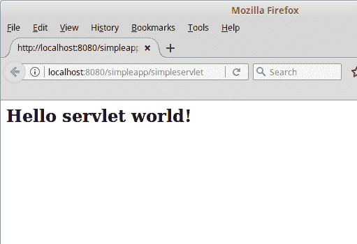
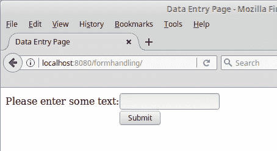
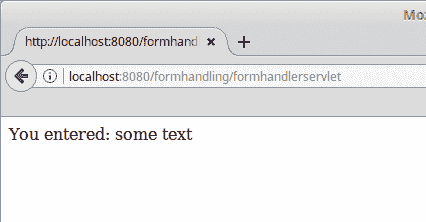
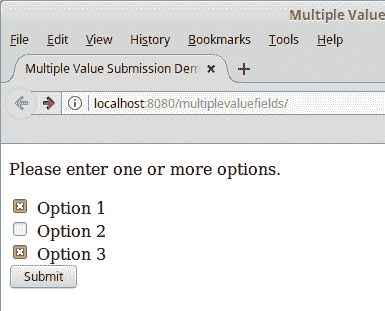
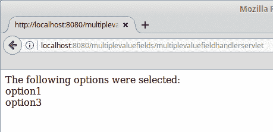
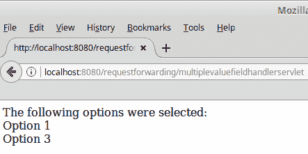
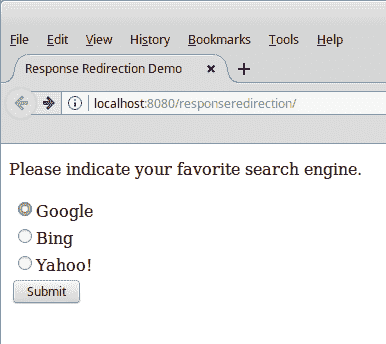
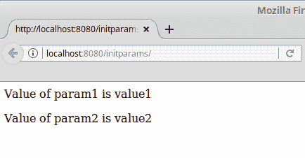

# Servlet 开发和部署

在本章中，我们将讨论如何开发和部署 Java servlet。Servlet 允许我们作为应用程序开发者，在 Java Web 和企业应用程序中实现服务器端逻辑。

涵盖的一些主题包括：

+   解释什么是 servlet

+   开发、配置、打包和部署我们的第一个 servlet

+   HTML 表单处理

+   转发 HTTP 请求

+   重定向 HTTP 响应

+   在 HTTP 请求之间持久化数据

+   通过注解初始化 servlet

+   Servlet 过滤器

+   Servlet 监听器

+   Servlet 的可插拔性

+   以编程方式配置 Web 应用程序

+   异步处理

+   HTTP/2 服务器推送支持

# 什么是 servlet？

Servlet 是一个 Java 类，用于扩展托管服务器端 Web 应用程序的服务器的功能。Servlet 可以响应请求并生成响应。所有 servlet 的基类是`javax.servlet.GenericServlet`，定义了一个通用的、协议无关的 servlet。

到目前为止，最常见类型的 servlet 是 HTTP servlet。这种类型的 servlet 用于处理 HTTP 请求并生成 HTTP 响应。HTTP servlet 是一个扩展了`javax.servlet.http.HttpServlet`类的类，它是`javax.servlet.GenericServlet`的子类。

Servlet 必须实现一个或多个方法来响应特定的 HTTP 请求。这些方法是从父类`HttpServlet`中重写的。如下表所示，这些方法的命名方式使得知道使用哪个方法是很直观的：

| **HTTP 请求** | **HttpServlet 方法** |
| --- | --- |
| `GET` | `doGet`(`HttpServletRequest` request, `HttpServletResponse` response) |
| `POST` | `doPost`(`HttpServletRequest` request, `HttpServletResponse` response) |
| `PUT` | `doPut`(`HttpServletRequest` request, `HttpServletResponse` response) |
| `DELETE` | `doDelete`(`HttpServletRequest` request, `HttpServletResponse` response) |

这些方法都接受相同的两个参数，即实现`javax.servlet.http.HttpServletRequest`接口的类的实例和实现`javax.servlet.http.HttpServletResponse`接口的类的实例。这些接口将在本章后面详细讨论。

应用程序开发者永远不会直接调用前面的方法，它们会在应用程序服务器接收到相应的 HTTP 请求时自动调用。

在前面列出的四种方法中，`doGet()`和`doPost()`是最常用的。

当用户在浏览器中输入 servlet 的 URL、点击指向 servlet URL 的链接，或者使用`GET`方法提交 HTML 表单（表单的 action 指向 servlet 的 URL）时，都会生成一个 HTTP `GET`请求。在这些情况下，servlet 的`doGet()`方法中的代码都会被执行。

当用户使用`POST`方法提交 HTML 表单并指向 Servlet 的 URL 的动作时，通常会生成一个 HTTP `POST`请求。在这种情况下，`doPost()`方法中的 Servlet 代码将被执行。

# 编写我们的第一个 Servlet

在本节中，我们将开发一个简单的 Servlet 来展示如何使用 Servlet API。我们的 Servlet 代码如下所示：

```java
package net.ensode.javaee8book.simpleapp; 

import java.io.IOException; 
import java.io.PrintWriter; 

import javax.servlet.http.HttpServlet; 
import javax.servlet.http.HttpServletRequest; 
import javax.servlet.http.HttpServletResponse; 

@WebServlet(urlPatterns = {"/simpleservlet"}) 
public class SimpleServlet extends HttpServlet { 

    @Override 
    protected void doGet(HttpServletRequest req,    
     HttpServletResponse res) { 
        try { 
            res.setContentType("text/html"); 
            PrintWriter printWriter = res.getWriter(); 
            printWriter.println("<h2>"); 
            printWriter 
                    .println("Hello servlet world!"); 
            printWriter.println("</h2>"); 
        } catch (IOException ioException) { 
            ioException.printStackTrace(); 
        } 
    } 
} 
```

`@WebServlet`注解指定我们的类是一个 Servlet；其`urlPatterns`属性指定了我们的 Servlet 的相对 URL。

Servlet 也可以通过`web.xml`部署描述符进行配置；然而，由于 Java EE 6 基于注解的配置更受欢迎。

由于这个 Servlet 旨在用户在浏览器窗口中输入其 URL 时执行，我们需要重写父类`HttpServlet`中的`doGet()`方法。正如我们之前解释的，这个方法接受两个参数，一个是实现`javax.servlet.http.HttpServletRequest`接口的类的实例，另一个是实现`javax.servlet.http.HttpServletResponse`接口的类的实例。

尽管`HttpServletRequest`和`HttpServletResponse`是接口，但应用程序开发者通常不会编写实现它们的类。当控制从 HTTP 请求传递到 Servlet 时，应用程序服务器会提供实现这些接口的对象。

我们的`doGet()`方法首先设置`HttpServletResponse`对象的内容类型为`"text/html"`。如果我们忘记这样做，将使用默认的内容类型`"text/plain"`，这意味着 HTML 标签将在页面上显示，而不是由浏览器解释。

然后我们通过调用`HttpServletResponse.getWriter()`方法来获取`java.io.PrintWriter`的实例。然后我们可以通过调用`PrintWriter.print()`和`PrintWriter.println()`方法（前一个示例仅使用`println()`）将文本输出到浏览器。由于我们设置了内容类型为`"text/html"`，浏览器会正确地解释任何 HTML 标签。

# 测试 Web 应用程序

为了验证 Servlet 是否已正确部署，我们需要将我们的浏览器指向应用程序的 URL，例如，`http://localhost:8080/simpleapp/simpleservlet`。完成此操作后，我们应该看到如下截图所示的页面：



# 处理 HTML 表单

Servlet 很少通过直接在浏览器中输入它们的 URL 来访问。Servlet 最常见的使用是处理用户在 HTML 表单中输入的数据。在本节中，我们将展示这个过程。

包含我们应用程序表单的 HTML 文件看起来如下所示：

```java
<!DOCTYPE html PUBLIC "-//W3C//DTD HTML 4.01 Transitional//EN" "http://www.w3.org/TR/html4/loose.dtd"> 
<html> 
    <head> 
        <meta http-equiv="Content-Type" content="text/html; charset=UTF-8"> 
        <title>Data Entry Page</title> 
    </head> 
    <body> 
 <form method="post" action="formhandlerservlet"> 
            <table cellpadding="0" cellspacing="0" border="0"> 
                <tr> 
                    <td>Please enter some text:</td> 
                    <td>
                     <input type="text" name="enteredValue" />
                    </td>
                </tr> 
                <tr> 
                    <td></td> 
 <td><input type="submit" value="Submit"></td> 
                </tr> 
            </table> 
        </form> 
    </body> 
</html> 
```

表单的`action`属性值必须与 Servlet 的`@WebServlet`注解中的`urlPatterns`属性值匹配。由于表单的`method`属性值为`"post"`，当表单提交时，我们的 Servlet 的`doPost()`方法将被执行。

现在我们来看看我们的 Servlet 代码：

```java
package net.ensode.javaee8book.formhandling; 

import java.io.IOException; 
import java.io.PrintWriter; 
import javax.servlet.annotation.WebServlet; 

import javax.servlet.http.HttpServlet; 
import javax.servlet.http.HttpServletRequest; 
import javax.servlet.http.HttpServletResponse; 

@WebServlet(urlPatterns = {"/formhandlerservlet"}) 
public class FormHandlerServlet extends HttpServlet { 

    @Override 
    protected void doPost(HttpServletRequest request,   
     HttpServletResponse response) { 
        String enteredValue; 

 enteredValue = request.getParameter("enteredValue"); 

        response.setContentType("text/html"); 

        PrintWriter printWriter; 
        try { 
            printWriter = response.getWriter(); 

            printWriter.println("<p>"); 
            printWriter.print("You entered: "); 
 printWriter.print(enteredValue); 
            printWriter.print("</p>"); 
        } catch (IOException e) { 
            e.printStackTrace(); 
        } 
    } 
} 
```

如此例所示，我们通过调用`request.getParameter()`方法来获取用户输入的值的引用。此方法仅接受一个`String`对象作为其唯一参数，并且此字符串的值必须与 HTML 文件中输入字段的名称匹配。在这种情况下，HTML 文件有一个名为`"enteredValue"`的文本字段：

```java
    <input type="text" name="enteredValue" />
```

因此 servlet 中有一行相应的代码：

```java
    enteredValue = request.getParameter("enteredValue");
```

这一行用于获取用户输入的文本并将其存储在名为`enteredValue`的`String`变量中（变量的名称不需要与输入字段名称匹配，但这样命名是一种良好的实践；这使得记住变量所持有的值变得容易）。

在将前面三个文件打包成名为`formhandling.war`的 WAR 文件后，然后部署 WAR 文件，我们可以在浏览器中输入类似以下 URL 来查看渲染的 HTML 文件（确切的 URL 将取决于所使用的 Java EE 应用服务器）：`http://localhost:8080/formhandling`。



用户在文本字段中输入一些文本并提交表单（无论是按“Enter”键还是点击提交按钮）后，我们应该看到 servlet 的输出：



`HttpServletRequest.getParameter()`方法可以用来获取任何只能返回一个值的 HTML 输入字段的值（文本框、文本区域、单选下拉列表、单选按钮、隐藏字段等）。获取这些字段值的过程是相同的；换句话说，servlet 不在乎用户是在文本字段中键入了值，还是从一组单选按钮中选择它，等等。只要输入字段的名称与传递给`getParameter()`方法的值匹配，前面的代码就会生效。

当处理单选按钮时，所有相关的单选按钮必须具有相同的名称。调用`HttpServletRequest.getParameter()`方法并传递单选按钮的名称将返回所选单选按钮的值。

一些 HTML 输入字段，如复选框和多重选择框，允许用户选择多个值。对于这些字段，除了使用`HttpServletRequest.getParameter()`方法外，还使用`HttpServletRequest.getParameterValues()`方法。此方法也接受一个包含输入字段名称的`String`作为其唯一参数，并返回一个包含用户所选所有值的字符串数组。

以下示例说明了这种情况。我们新的 HTML 标记的相关部分如下所示：

```java
<form method="post" action="multiplevaluefieldhandlerservlet"> 
<p>Please enter one or more options.</p> 
<table cellpadding="0" cellspacing="0" border="0"> 
  <tr> 
 <td><input name="options" type="checkbox" value="option1" /> 
    Option 1</td> 
  </tr> 
  <tr> 
 <td><input name="options" type="checkbox" value="option2" /> 
    Option 2</td> 
  </tr> 
  <tr> 
 <td><input name="options" type="checkbox" value="option3" /> 
    Option 3</td> 
  </tr> 
  <tr> 
    <td><input type="submit" value="Submit" /></td> 
  </tr> 
</table> 
</form> 
```

新的 HTML 文件包含一个简单的表单，有三个复选框和一个提交按钮。注意每个复选框的`name`属性都有相同的值。正如我们之前提到的，用户点击的任何复选框都将被发送到 servlet。

让我们现在看看将处理前面 HTML 表单的 servlet：

```java
package net.ensode.javaee8book.multiplevaluefields; 

import java.io.IOException; 
import java.io.PrintWriter; 
import javax.servlet.annotation.WebServlet; 

import javax.servlet.http.HttpServlet; 
import javax.servlet.http.HttpServletRequest; 
import javax.servlet.http.HttpServletResponse; 

@WebServlet(urlPatterns = {"/multiplevaluefieldhandlerservlet"}) 
public class MultipleValueFieldHandlerServlet extends HttpServlet { 

    @Override 
    protected void doPost(HttpServletRequest request, 
        HttpServletResponse response) { 
 String[] selectedOptions =  
        request.getParameterValues("options"); 

        response.setContentType("text/html"); 

        try { 
            PrintWriter printWriter = response.getWriter(); 

            printWriter.println("<p>"); 
            printWriter.print("The following options were
            selected:"); 
            printWriter.println("<br/>"); 

 if (selectedOptions != null) { for (String option : selectedOptions) { printWriter.print(option); printWriter.println("<br/>"); } } else { printWriter.println("None"); } 
            printWriter.println("</p>"); 
        } catch (IOException e) { 
            e.printStackTrace(); 
        } 
    } 
} 
```

前面的代码调用 `request.getParameterValues()` 方法并将它的返回值赋给 `selectedOptions` 变量。在 `doPost()` 方法的更下方，代码遍历 `selectedOptions` 数组并在浏览器中打印选定的值。

如果没有点击复选框，`request.getParameterValues()` 方法将返回 `null`，因此在进行遍历此方法返回值之前检查 null 是一个好主意。

在将我们的新 servlet 打包到 WAR 文件并部署后，我们可以在浏览器窗口中输入其 URL 来查看实际的变化。对于大多数应用程序服务器，URL 将是 `http://localhost:8080/formhandling/`。



提交表单后，控制权转到我们的 servlet，浏览器窗口应类似于以下内容：



当然，浏览器窗口中实际看到的消息将取决于用户点击了哪些复选框。

# 请求转发和响应重定向

在许多情况下，一个 servlet 处理表单数据，然后转移到另一个 servlet 或 JSP 进行更多处理或显示屏幕上的确认消息。有两种方法可以实现这一点，即请求可以转发或响应可以重定向到另一个 servlet 或页面。

# 请求转发

注意，上一节示例中显示的文本与被点击的复选框的 `value` 属性值匹配，而不是上一页上显示的标签。这可能会让用户感到困惑。让我们修改 servlet 以更改这些值，使它们与标签匹配，然后转发请求到另一个 servlet，该 servlet 将在浏览器中显示确认消息。

`MultipleValueFieldHandlerServlet` 的新版本如下所示：

```java
package net.ensode.javaee8book.formhandling; 

import java.io.IOException; 
import java.util.ArrayList; 

import javax.servlet.ServletException; 
import javax.servlet.annotation.WebServlet; 
import javax.servlet.http.HttpServlet; 
import javax.servlet.http.HttpServletRequest; 
import javax.servlet.http.HttpServletResponse; 

@WebServlet(urlPatterns = {"/multiplevaluefieldhandlerservlet"}) 
public class MultipleValueFieldHandlerServlet extends HttpServlet { 

    protected void doPost(HttpServletRequest request,     
    HttpServletResponse response) { 
        String[] selectedOptions =  
        request.getParameterValues("options"); 
        ArrayList<String> selectedOptionLabels = null; 

        if (selectedOptions != null) { 
            selectedOptionLabels = new ArrayList<String>  
            (selectedOptions.length); 

            for (String selectedOption : selectedOptions) { 
                if (selectedOption.equals("option1")) { 
                    selectedOptionLabels.add("Option 1"); 
                } else if (selectedOption.equals("option2")) { 
                    selectedOptionLabels.add("Option 2"); 
                } else if (selectedOption.equals("option3")) { 
                    selectedOptionLabels.add("Option 3"); 
                } 
            } 
        } 

 request.setAttribute("checkedLabels", 
         selectedOptionLabels); 

        try { 
 request.getRequestDispatcher("confirmationservlet").
              forward(
              request, response); 
        } catch (ServletException e) { 
            e.printStackTrace(); 
        } catch (IOException e) { 
            e.printStackTrace(); 
        } 
    } 
} 
```

此版本的 servlet 遍历选定的选项，并将相应的标签添加到字符串的 `ArrayList` 中。然后通过调用 `request.setAttribute()` 方法将此字符串附加到 `request` 对象。此方法用于将任何对象附加到请求，以便任何其他代码在稍后转发请求时都可以访问它。

在将 `ArrayList` 附加到请求后，我们在以下代码行中将其转发到新的 servlet：

```java
    request.getRequestDispatcher("confirmationservlet").forward(
     request, response);
```

此方法的 `String` 参数必须与 servlet 的 `@WebServlet` 注解中的 `urlPatterns` 标签的值匹配。

到目前为止，控制权转到我们的新 servlet。此新 servlet 的代码如下所示：

```java
package net.ensode.javaee8book.requestforward; 

import java.io.IOException; 
import java.io.PrintWriter; 
import java.util.List; 
import javax.servlet.annotation.WebServlet; 

import javax.servlet.http.HttpServlet; 
import javax.servlet.http.HttpServletRequest; 
import javax.servlet.http.HttpServletResponse; 

@WebServlet(urlPatterns = {"/confirmationservlet"}) 
public class ConfirmationServlet extends HttpServlet { 

    @Override 
    protected void doPost(HttpServletRequest request,  
    HttpServletResponse response) { 
        try { 
            PrintWriter printWriter; 
            List<String> checkedLabels = (List<String>) request 
                    .getAttribute("checkedLabels"); 

            response.setContentType("text/html"); 
            printWriter = response.getWriter(); 
            printWriter.println("<p>"); 
            printWriter.print("The following options were  
            selected:"); 
            printWriter.println("<br/>"); 

            if (checkedLabels != null) { 
                for (String optionLabel : checkedLabels) { 
                    printWriter.print(optionLabel); 
                    printWriter.println("<br/>"); 
                } 
            } else { 
                printWriter.println("None"); 
            } 
            printWriter.println("</p>"); 
        } catch (IOException ioException) { 
            ioException.printStackTrace(); 
        } 
    } 
} 
```

此代码获取先前由 servlet 附加到请求的 `ArrayList`。这是通过调用 `request.getAttribute()` 方法实现的；此方法的参数必须与用于将对象附加到请求的值匹配。

一旦前面的 servlet 获取到选项标签列表，它将遍历该列表并在浏览器中显示它们：



如前所述，将请求转发仅适用于与执行转发的代码处于同一上下文的其他资源（servlets 和 JSP 页面）。简单来说，我们想要转发的 servlet 或 JSP 必须打包在与调用`request.getRequestDispatcher().forward()`方法的代码相同的 WAR 文件中。如果我们需要将用户重定向到另一个上下文中的页面（或者在同一个服务器上的另一个 WAR 文件中部署，或者在另一个服务器上部署），我们可以通过重定向响应对象来实现。

# 响应重定向

前一节中描述的请求转发的缺点是，请求只能转发到同一上下文中的其他 servlets 或 JSPs。如果我们需要将用户重定向到不同上下文中的页面（部署在同一个服务器上的另一个 WAR 文件中或在不同的服务器上部署），我们需要使用`HttpServletResponse.sendRedirect()`方法。

为了说明响应重定向，让我们开发一个简单的 Web 应用程序，该程序要求用户选择他们最喜欢的搜索引擎，然后引导用户到他们选择的搜索引擎。此应用程序的 HTML 页面看起来如下所示：

```java
<!DOCTYPE html PUBLIC "-//W3C//DTD HTML 4.01 Transitional//EN" "http://www.w3.org/TR/html4/loose.dtd"> 
<html> 
    <head> 
        <meta http-equiv="Content-Type" content="text/html; charset=UTF-8"> 
        <title>Response Redirection Demo</title> 
    </head> 
    <body> 
 <form method="post" action="responseredirectionservlet"> 
            <p>Please indicate your favorite search engine.</p> 
            <table> 
 <tr> <td><input type="radio" name="searchEngine" value="http://www.google.com">Google</td> </tr> <tr> <td><input type="radio" name="searchEngine" value="http://www.bing.com">Bing</td> </tr> <tr> <td><input type="radio" name="searchEngine" value="http://www.yahoo.com">Yahoo!</td> </tr> 
                <tr> 
                    <td><input type="submit" value="Submit" /></td> 
                </tr> 
            </table> 
        </form> 
    </body> 
</html> 
```

上一标记代码中的 HTML 表单包含三个单选按钮，每个按钮的值对应于用户选择的搜索引擎的 URL。注意每个单选按钮的`name`属性值相同，即`"searchEngine"`。servlet 将通过调用`request.getParameter()`方法并传递字符串`"searchEngine"`来获取所选单选按钮的值，如下面的代码所示：

```java
package net.ensode.javaee8book.responseredirection; 

import java.io.IOException; 
import java.io.PrintWriter; 
import javax.servlet.annotation.WebServlet; 

import javax.servlet.http.HttpServlet; 
import javax.servlet.http.HttpServletRequest; 
import javax.servlet.http.HttpServletResponse; 

@WebServlet(urlPatterns = {"/responseredirectionservlet"}) 
public class ResponseRedirectionServlet extends HttpServlet { 

    @Override 
    protected void doPost(HttpServletRequest request,  
    HttpServletResponse response) 
            throws IOException { 
 String url = request.getParameter("searchEngine"); 

        if (url != null) { 
 response.sendRedirect(url); 
        } else { 
            PrintWriter printWriter = response.getWriter(); 

            printWriter.println("No search engine was selected."); 
        } 
    } 
} 
```

通过调用`request.getParameter("searchEngine")`，前面的代码将所选搜索引擎的 URL 分配给`url`变量。然后（在检查`null`之后，以防用户在未选择搜索引擎的情况下点击提交按钮），通过调用`response.sendRedirect()`并将`url`变量作为参数传递，将用户重定向到所选的搜索引擎。

此应用程序的`web.xml`文件应该相当简单，此处未显示（它是本书代码下载的一部分）。

在打包代码并部署后，我们可以在浏览器中输入类似以下 URL 来查看其效果：`http://localhost:8080/responseredirection/`。



点击提交按钮后，用户将被引导到他们最喜欢的搜索引擎。

应该注意的是，如前所述的重定向响应会创建一个新的 HTTP 请求到我们要重定向到的页面，因此任何请求参数和属性都会丢失：


# 在请求之间持久化应用程序数据

在上一节中，我们看到了如何通过调用`HttpRequest.setAttribute()`方法将对象存储在请求中，以及稍后如何通过调用`HttpRequest.getAttribute()`方法检索此对象。这种方法仅在请求被转发到调用`getAttribute()`方法的 servlet 时才有效。如果不是这种情况，`getAttribute()`方法将返回 null。

有可能在请求之间持久化对象。除了将对象附加到请求对象之外，还可以将对象附加到会话对象或 servlet 上下文。这两种之间的区别在于，附加到会话的对象对不同的用户不可见，而附加到 servlet 上下文的对象是可见的。

将对象附加到会话和 servlet 上下文与将其附加到请求非常相似。要将对象附加到会话，必须调用`HttpServletRequest.getSession()`方法；此方法返回一个`javax.servlet.http.HttpSession`实例。然后我们调用`HttpSession.setAttribute()`方法将对象附加到会话。以下代码片段说明了这个过程：

```java
protected void doPost(HttpServletRequest request, HttpServletResponse response) 
{ 
  . 
  . 
  . 
  Foo foo = new Foo(); //theoretical object 
 HttpSession session = request.getSession(); session.setAttribute("foo", foo); 
  . 
  . 
  . 
} 
```

然后，我们可以通过调用`HttpSession.getAttribute()`方法从会话中检索对象：

```java
protected void doPost(HttpServletRequest request, HttpServletResponse response) 
{ 
 HttpSession session = request.getSession(); 
  Foo foo =
  (Foo)session.getAttribute("foo");
} 
```

注意`session.getAttribute()`的返回值需要转换为适当类型。这是必要的，因为此方法的返回值是`java.lang.Object`。

将对象附加和从 servlet 上下文中检索对象的过程非常相似。servlet 需要调用`getServletContext()`方法（定义在一个名为`GenericServlet`的类中，它是`HttpServlet`的父类，而`HttpServlet`又是我们 servlet 的父类）。此方法返回一个`javax.servlet.ServletContext`实例，它定义了一个`setAttribute()`和一个`getAttribute()`方法。这些方法与它们的`HttpServletRequest`和`HttpSessionResponse`对应方法的工作方式相同。

以下代码片段说明了将对象附加到 servlet 上下文的过程：

```java
protected void doPost(HttpServletRequest request, HttpServletResponse response) 
{ 
  //The getServletContext() method is defined higher in 
  //the inheritance hierarchy. 
 ServletContext servletContext = getServletContext(); 

  Foo foo = new Foo(); 
  servletContext.setAttribute("foo", foo); 
  . 
  . 
  . 
} 
```

以下代码将`foo`对象附加到 servlet 上下文；此对象将可用于我们应用程序中的任何 servlet，并且将在会话之间保持相同。可以通过调用`ServletContext.getAttribute()`方法检索它，如下面的代码所示：

```java
protected void doPost(HttpServletRequest request, HttpServletResponse response) 
{ 
 ServletContext servletContext = getServletContext();
  Foo foo = (Foo)servletContext.getAttribute(“foo”);
  . 
  . 
  . 
} 
```

此代码从请求上下文中获取`foo`对象；再次，由于`ServletContext.getAttribute()`方法，就像其对应方法一样，返回一个`java.lang.Object`实例，因此需要类型转换。

附加到 servlet 上下文的对象被称为具有*应用*范围。同样，附加到会话的对象被称为具有*会话*范围，而附加到请求的对象被称为具有*请求*范围。

# 通过注解将初始化参数传递给 servlet

有时将一些初始化参数传递给 servlet 是有用的；这样我们就可以确保 servlet 根据发送给它的参数以不同的方式行为。例如，我们可能希望配置 servlet 在开发和生产环境中以不同的方式行为。

在过去，servlet 初始化参数是通过`web.xml`中的`<init-param>`参数发送的。从 servlet 3.0 开始，初始化参数可以作为`@WebServlet`注解的`initParams`属性的值传递给 servlet。以下示例说明了如何做到这一点：

```java
package net.ensode.javaee8book.initparam; 

import java.io.IOException; 
import java.io.PrintWriter; 
import javax.servlet.ServletConfig; 
import javax.servlet.ServletException; 
import javax.servlet.annotation.WebInitParam; 
import javax.servlet.annotation.WebServlet; 
import javax.servlet.http.HttpServlet; 
import javax.servlet.http.HttpServletRequest; 
import javax.servlet.http.HttpServletResponse; 

@WebServlet(name = "InitParamsServlet", urlPatterns = { "/InitParamsServlet"}, initParams = { @WebInitParam(name = "param1", value = "value1"), @WebInitParam(name = "param2", value = "value2")}) 
public class InitParamsServlet extends HttpServlet { 

  @Override 
  protected void doGet(HttpServletRequest request, 
          HttpServletResponse response) 
          throws ServletException, IOException { 
 ServletConfig servletConfig = getServletConfig(); String param1Val = servletConfig.getInitParameter("param1"); String param2Val = servletConfig.getInitParameter("param2"); 
    response.setContentType("text/html"); 
    PrintWriter printWriter = response.getWriter(); 

    printWriter.println("<p>"); 
    printWriter.println("Value of param1 is " + param1Val); 
    printWriter.println("</p>"); 

    printWriter.println("<p>"); 
    printWriter.println("Value of param2 is " + param2Val); 
    printWriter.println("</p>"); 
  } 
} 
```

如我们所见，`@WebServlet`注解的`initParams`属性的值是一个`@WebInitParam`注解的数组。每个`@WebInitParam`注解有两个属性——`name`，对应于参数名称，和`value`，对应于参数值。

我们可以通过在`javax.servlet.ServletConfig`类上调用`getInitParameter()`方法来获取我们参数的值。该方法接受一个`String`参数作为参数，对应于参数名称，并返回一个对应于参数值的`String`。

每个 servlet 都有一个对应的`ServletConfig`实例分配给它。如本例所示，我们可以通过调用`getServletConfig()`方法来获取此实例，这是一个从`javax.servlet.GenericServlet`继承的方法，`HttpServlet`是`HttpServlet`的父类，我们扩展了 servlet。

在我们将 servlet 打包到 WAR 文件并部署到我们选择的 Java EE 8 应用服务器之后，我们将在浏览器中看到以下页面渲染：



如我们所见，渲染的值对应于我们在每个`@WebInitParam`注解中设置的值。

# Servlet 过滤器

过滤器是在 servlet 规范的第 2.3 版中引入的。过滤器是一个对象，可以在请求被 servlet 处理之前动态拦截请求并操纵其数据。过滤器还可以在 servlet 的`doGet()`或`doPost()`方法完成后，但在输出发送到浏览器之前操纵响应。

在早期的 servlet 规范中配置过滤器的唯一方法是使用`web.xml`中的`<filter-mapping>`标签。servlet 3.0 引入了通过`@WebFilter`注解配置 servlet 的能力。

以下示例说明了如何做到这一点：

```java
package net.ensode.javaee8book.simpleapp; 

import java.io.IOException; 
import java.util.Enumeration; 
import javax.servlet.Filter; 
import javax.servlet.FilterChain; 
import javax.servlet.FilterConfig; 
import javax.servlet.ServletContext; 
import javax.servlet.ServletException; 
import javax.servlet.ServletRequest; 
import javax.servlet.ServletResponse; 
import javax.servlet.annotation.WebFilter; 
import javax.servlet.annotation.WebInitParam; 

@WebFilter(filterName = "SimpleFilter", initParams = { @WebInitParam(name = "filterparam1", value = "filtervalue1")}, urlPatterns = {"/InitParamsServlet"}) 
public class SimpleFilter implements Filter { 

  private FilterConfig filterConfig; 

  @Override 
  public void init(FilterConfig filterConfig) throws 
          ServletException { 
    this.filterConfig = filterConfig; 
  } 

  @Override 
  public void doFilter(ServletRequest servletRequest, 
          ServletResponse servletResponse, FilterChain filterChain) 
          throws 
          IOException, ServletException { 
    ServletContext servletContext = 
     filterConfig.getServletContext(); 
    servletContext.log("Entering doFilter()"); 
    servletContext.log("initialization parameters: "); 
    Enumeration<String> initParameterNames = 
            filterConfig.getInitParameterNames(); 
    String parameterName; 
    String parameterValue; 

    while (initParameterNames.hasMoreElements()) { 
      parameterName = initParameterNames.nextElement(); 
      parameterValue = 
       filterConfig.getInitParameter(parameterName); 
      servletContext.log(parameterName + " = " + parameterValue); 
    } 

    servletContext.log("Invoking servlet..."); 
    filterChain.doFilter(servletRequest, servletResponse); 
    servletContext.log("Back from servlet invocation"); 

  } 

  @Override 
  public void destroy() { 
    filterConfig = null; 
  } 
} 
```

如示例所示，`@WebFilter`注解有几个我们可以用来配置过滤器的属性。其中特别重要的是`urlPatterns`属性。该属性接受一个`String`对象的数组作为其值，数组中的每个元素对应于我们的过滤器将拦截的 URL。在我们的示例中，我们拦截了一个单个的 URL 模式，这对应于我们在上一节中编写的 servlet。

`@WebFilter`注解中的其他属性包括可选的`filterName`属性，我们可以使用它来为我们的过滤器命名。如果我们没有为我们的过滤器指定名称，那么过滤器名称将默认为过滤器的类名。

如前例所示，我们可以向过滤器发送初始化参数。这与我们向 servlet 发送初始化参数的方式相同。`@WebFilter`注解有一个`initParams`属性，它接受一个`@WebInitParam`注解数组作为其值。我们可以通过在`javax.servlet.FilterConfig`上调用`getInitParameter()`方法来获取这些参数的值，如示例所示。

我们的过滤器相当简单，它只是在 servlet 被调用前后向服务器日志发送一些输出。部署我们的应用程序后检查服务器日志，并将浏览器指向 servlet 的 URL，应该会揭示我们的过滤器输出：

```java
    [2017-05-31T20:02:46.044-0400] [glassfish 5.0] [INFO] [] [javax.enterprise.web] [tid: _ThreadID=112 _ThreadName=http-listener-1(5)] [timeMillis: 1496275366044] [levelValue: 800] [[
      WebModule[/servletfilter] ServletContext.log():Entering doFilter()]]

    [2017-05-31T20:02:46.045-0400] [glassfish 5.0] [INFO] [] [javax.enterprise.web] [tid: _ThreadID=112 _ThreadName=http-listener-1(5)] [timeMillis: 1496275366045] [levelValue: 800] [[
      WebModule[/servletfilter] ServletContext.log():initialization parameters: ]]

    [2017-05-31T20:02:46.045-0400] [glassfish 5.0] [INFO] [] [javax.enterprise.web] [tid: _ThreadID=112 _ThreadName=http-listener-1(5)] [timeMillis: 1496275366045] [levelValue: 800] [[
      WebModule[/servletfilter] ServletContext.log():filterparam1 = filtervalue1]]

    [2017-05-31T20:02:46.045-0400] [glassfish 5.0] [INFO] [] [javax.enterprise.web] [tid: _ThreadID=112 _ThreadName=http-listener-1(5)] [timeMillis: 1496275366045] [levelValue: 800] [[
      WebModule[/servletfilter] ServletContext.log():Invoking servlet...]]

    [2017-05-31T20:02:46.046-0400] [glassfish 5.0] [INFO] [] [javax.enterprise.web] [tid: _ThreadID=112 _ThreadName=http-listener-1(5)] [timeMillis: 1496275366046] [levelValue: 800] [[
      WebModule[/servletfilter] ServletContext.log():Back from servlet invocation]]
```

Servlet 过滤器当然有很多实际用途。它们可以用于分析 Web 应用程序、应用安全性和压缩数据，以及其他许多用途。

# Servlet 监听器

在典型 Web 应用程序的生命周期中，会发生许多事件，例如 HTTP 请求的创建或销毁、请求或会话属性的增加、删除或修改，等等。

Servlet API 提供了一系列我们可以实现的监听器接口，以便对这些事件做出反应。所有这些接口都在`javax.servlet`包中，以下表格总结了它们：

| **监听器接口** | **描述** |
| --- | --- |
| `ServletContextListener` | 包含用于处理上下文初始化和销毁事件的方法。 |
| `ServletContextAttributeListener` | 包含用于对 servlet 上下文（应用程序范围）中添加、删除或替换的任何属性做出反应的方法。 |
| `ServletRequestListener` | 包含用于处理请求初始化和销毁事件的方法。 |
| `ServletRequestAttributeListener` | 包含用于对请求中添加、删除或替换的任何属性做出反应的方法。 |
| `HttpSessionListener` | 包含用于处理 HTTP 会话初始化和销毁事件的方法。 |
| `HttpSessionAttributeListener` | 包含用于对 HTTP 会话中添加、删除或替换的任何属性做出反应的方法。 |

要处理前表中所描述的接口处理的所有事件，我们只需实现前述接口之一，并用`@WebListener`接口注解它，或者通过`<listener>`标签在`web.xml`部署描述符中声明它。不出所料，使用注解注册监听器的功能是在 Servlet 规范的第 3.0 版中引入的。

所有上述接口的 API 都相当简单直观。我们将展示前述接口中的一个示例，其他接口将非常相似。

所有上述接口的 JavaDoc 可以在以下位置找到：[`javaee.github.io/javaee-spec/javadocs/`](http://java.sun.com/javaee/6/docs/api/javax/servlet/http/package-summary.html)。

以下示例说明了如何实现`ServletRequestListener`接口，该接口可以在 HTTP 请求创建或销毁时执行操作：

```java
    package net.ensode.javaee8book.listener;
    import javax.servlet.ServletContext;
    import javax.servlet.ServletRequestEvent;
    import javax.servlet.ServletRequestListener;
    import javax.servlet.annotation.WebListener;
    @WebListener() 
    public class HttpRequestListener implements ServletRequestListener   
   {

    @Override
    public void requestInitialized(ServletRequestEvent  
      servletRequestEvent) { 

    ServletContext servletContext =

    servletRequestEvent.getServletContext();

    servletContext.log("New request initialized");

    }

    @Override
    public void requestDestroyed(ServletRequestEvent   
      servletRequestEvent) { 

    ServletContext servletContext =

    servletRequestEvent.getServletContext();

    servletContext.log("Request destroyed");

    }
    }
```

如我们所见，要激活我们的监听器类，只需使用`@WebListener`注解即可。我们的监听器还必须实现我们之前列出的监听器接口之一。在我们的例子中，我们选择实现`javax.servlet.ServletRequestListener`接口；该接口有方法，当 HTTP 请求初始化或销毁时自动调用。

`ServletRequestListener`接口有两个方法，`requestInitialized()`和`requestDestroyed()`。在我们之前的简单实现中，我们只是向日志发送了一些输出，但当然我们可以在我们的实现中做任何需要做的事情。

将我们之前开发的简单 Servlet 与监听器一起部署，我们可以在应用服务器日志中看到以下输出：

```java
    [2017-05-31T20:15:57.900-0400] [glassfish 5.0] [INFO] [] [javax.enterprise.web] [tid: _ThreadID=109 _ThreadName=http-listener-1(2)] [timeMillis: 1496276157900] [levelValue: 800] [[ 
    WebModule[/servletlistener] ServletContext.log():New request initialized]] 

    [2017-05-31T20:15:58.013-0400] [glassfish 5.0] [INFO] [] [javax.enterprise.web] [tid: _ThreadID=109 _ThreadName=http-listener-1(2)] [timeMillis: 1496276158013] [levelValue: 800] [[ 

WebModule[/servletlistener] ServletContext.log():Request destroyed]] 
```

实现其他监听器接口同样简单直接。

# 可插拔性

当原始的 Servlet API 在 20 世纪 90 年代末发布时，编写 Servlet 是 Java 编写服务器端 Web 应用的唯一方式。从那时起，在 Servlet API 之上构建了几个标准 Java EE 和第三方框架。这些标准框架的例子包括 JSP 和 JSF，第三方框架包括 Struts、Wicket、Spring Web MVC 以及几个其他框架。

现在，极少数（如果有的话）Java Web 应用是直接使用 Servlet API 构建的；相反，绝大多数项目都利用了几个可用的 Java Web 应用框架之一。所有这些框架都在“幕后”使用 Servlet API，因此设置一个应用以使用这些框架之一始终涉及到在应用的`web.xml`部署描述符中进行一些配置。在某些情况下，一些应用使用多个框架，但这往往会使`web.xml`部署描述符变得相当大且难以维护。

Servlet 3.0 引入了可插拔性的概念。Web 应用框架的开发者现在不仅仅有一种，而是有两种方式来避免应用开发者必须修改`web.xml`部署描述符才能使用他们的框架。框架开发者可以选择使用注解而不是`web.xml`来配置他们的 Servlet；完成这一步后，要使用框架只需要将框架开发者提供的库 JAR 文件包含在应用 WAR 文件中即可。或者，框架开发者可以选择将`web-fragment.xml`作为 JAR 文件的一部分包含在应用框架中。

`web-fragment.xml`几乎与`web.xml`相同，主要区别在于`web-fragment.xml`的根元素是`<web-fragment>`，而不是`<web-app>`。以下示例演示了一个示例`web-fragment.xml`：

```java
<?xml version="1.0" encoding="UTF-8"?> 
<web-fragment version="3.0"  

  xsi:schemaLocation="http://java.sun.com/xml/ns/javaee 
  http://java.sun.com/xml/ns/javaee/web-fragment_3_0.xsd"> 
  <servlet> 
    <servlet-name>WebFragment</servlet-name> 
    <servlet-class> 
      net.ensode.glassfishbook.webfragment.WebFragmentServlet 
    </servlet-class> 
  </servlet> 
  <servlet-mapping> 
    <servlet-name>WebFragment</servlet-name> 
    <url-pattern>/WebFragment</url-pattern> 
  </servlet-mapping> 
</web-fragment> 
```

如我们所见，`web-fragment.xml`几乎与典型的`web.xml`相同。在这个简单的示例中，我们只使用了`<servlet>`和`<servlet-mapping>`元素，但所有其他通常的`web.xml`元素，如`<filter>`、`<filter-mapping>`和`<listener>`，也都是可用的。

如我们在`web-fragment.xml`中指定的，我们的 servlet 可以通过其 URL 模式`/WebFragment`来调用，因此一旦作为 Web 应用程序的一部分部署，执行我们的 servlet 的 URL 将是`http://localhost:8080/webfragmentapp/WebFragment`。当然，主机名、端口号和上下文根必须根据需要进行调整。

对于任何 Java EE 兼容的应用程序服务器，我们只需要将文件放置在我们打包 servlet、过滤器或/和监听器的库的`META-INF`文件夹中，然后将我们的库的 JAR 文件放置在包含我们的应用程序的 WAR 文件的`lib`文件夹中，就可以抓取`web-fragment.xml`中的设置。

# 以编程方式配置 Web 应用程序

除了允许我们通过注解和`web-fragment.xml`配置 Web 应用程序之外，Servlet 3.0 还允许我们在运行时以编程方式配置我们的 Web 应用程序。

`ServletContext`类有新的方法来以编程方式配置 servlet、过滤器监听器。以下示例演示了如何在运行时以编程方式配置 servlet，而不需要使用`@WebServlet`注解或 XML：

```java
package net.ensode.javaee8book.servlet; 

import javax.servlet.ServletContext; 
import javax.servlet.ServletContextEvent; 
import javax.servlet.ServletContextListener; 
import javax.servlet.ServletException; 
import javax.servlet.ServletRegistration; 
import javax.servlet.annotation.WebListener; 

@WebListener() 
public class ServletContextListenerImpl implements 
        ServletContextListener { 

  @Override 
  public void contextInitialized( 
          ServletContextEvent servletContextEvent) { 
    ServletContext servletContext = servletContextEvent. 
            getServletContext(); 
    try { 
 ProgrammaticallyConfiguredServlet servlet = servletContext. createServlet(ProgrammaticallyConfiguredServlet.class); servletContext.addServlet(
       "ProgrammaticallyConfiguredServlet", servlet); ServletRegistration servletRegistration = servletContext. getServletRegistration( "ProgrammaticallyConfiguredServlet"); servletRegistration.addMapping( "/ProgrammaticallyConfiguredServlet"); 
    } catch (ServletException servletException) { 
      servletContext.log(servletException.getMessage()); 
    } 
  } 

  @Override 
  public void contextDestroyed( 
          ServletContextEvent servletContextEvent) { 
  } 
} 
```

在本例中，我们调用`ServletContext`的`createServlet()`方法来创建我们即将配置的 servlet。此方法接受一个与我们的 servlet 类对应的`java.lang.Class`实例。此方法返回一个实现`javax.servlet.Servlet`或其任何子接口的类。

一旦我们创建了我们的 servlet，我们需要在我们的`ServletContext`实例上调用`addServlet()`来将我们的 servlet 注册到 servlet 容器。此方法接受两个参数，第一个是一个与 servlet 名称对应的`String`，第二个是通过调用`createServlet()`返回的 servlet 实例。

一旦我们注册了我们的 servlet，我们需要为它添加一个 URL 映射。为了做到这一点，我们需要在我们的`ServletContext`实例上调用`getServletRegistration()`方法，并将 servlet 名称作为参数传递。此方法返回 servlet 容器的`javax.servlet.ServletRegistration`实现。从这个对象中，我们需要调用其`addMapping()`方法，传递我们希望我们的 servlet 处理的 URL 映射。

我们的示例 servlet 非常简单，它只是在浏览器中显示一条文本消息：

```java
package net.ensode.javaee8book.servlet; 

import java.io.IOException; 
import javax.servlet.ServletException; 
import javax.servlet.ServletOutputStream; 
import javax.servlet.http.HttpServlet; 
import javax.servlet.http.HttpServletRequest; 
import javax.servlet.http.HttpServletResponse; 

public class ProgrammaticallyConfiguredServlet extends HttpServlet { 

  @Override 
  protected void doGet(HttpServletRequest request, 
          HttpServletResponse response) 
          throws ServletException, IOException { 
    ServletOutputStream outputStream = response.getOutputStream(); 

    outputStream.println( 
            "This message was generated from a servlet that was " 
            + "configured programmatically."); 
  } 
} 
```

在将我们的代码打包成 WAR 文件，部署到 GlassFish，并将浏览器指向适当的 URL（即，`http://localhost:8080/programmaticservletwebapp/ProgrammaticallyConfiguredServlet`，假设我们将应用程序打包成名为`programmaticservletwebapp.war`的 WAR 文件，并且没有覆盖默认上下文根），我们应该在浏览器中看到以下消息：

```java
This message was generated from a servlet that was configured programmatically.
```

`ServletContext`接口有创建和添加 servlet 过滤器监听器的方法，它们的工作方式与`addServlet()`和`createServlet()`方法非常相似，因此我们不会详细讨论它们。有关详细信息，请参阅 Java EE API 文档：[`javaee.github.io/javaee-spec/javadocs/`](https://javaee.github.io/javaee-spec/javadocs/)。

# 异步处理

传统上，servlet 在 Java Web 应用程序中为每个请求创建一个单独的线程。请求处理完毕后，线程会被释放供其他请求使用。这种模型对于传统 Web 应用程序来说效果相当不错，因为 HTTP 请求相对较少且间隔较远。然而，大多数现代 Web 应用程序都利用 Ajax（异步 JavaScript 和 XML）技术，这种技术使得 Web 应用程序比传统 Web 应用程序更加响应。Ajax 的一个副作用是生成比传统 Web 应用程序更多的 HTTP 请求，如果其中一些线程长时间阻塞等待资源就绪，或者执行任何需要长时间处理的事情，那么我们的应用程序可能会遭受线程饥饿。

为了缓解前一段描述的情况，Servlet 3.0 规范引入了异步处理。使用这种新功能，我们不再受限于每个请求一个线程的限制。现在我们可以创建一个单独的线程，并将原始线程返回到线程池，以便其他客户端重用。

以下示例说明了如何使用 Servlet 3.0 引入的新功能来实现异步处理：

```java
package net.ensode.javaee8book.asynchronousservlet; 

import java.io.IOException; 
import java.util.logging.Level; 
import java.util.logging.Logger; 
import javax.servlet.AsyncContext; 
import javax.servlet.ServletException; 
import javax.servlet.annotation.WebServlet; 
import javax.servlet.http.HttpServlet; 
import javax.servlet.http.HttpServletRequest; 
import javax.servlet.http.HttpServletResponse; 

@WebServlet(name = "AsynchronousServlet", urlPatterns = {
 "/AsynchronousServlet"}, asyncSupported = true) 
public class AsynchronousServlet extends HttpServlet { 

  @Override 
  protected void doGet(HttpServletRequest request, 
          HttpServletResponse response) 
          throws ServletException, IOException { 
    final Logger logger = 
            Logger.getLogger(AsynchronousServlet.class.getName()); 
    logger.log(Level.INFO, "--- Entering doGet()"); 
 final AsyncContext ac = request.startAsync(); 
    logger.log(Level.INFO, "---- invoking ac.start()"); 
 ac.start(new Runnable() { 

      @Override 
      public void run() { 
        logger.log(Level.INFO, "inside thread"); 
        try { 
          //simulate a long running process. 
          Thread.sleep(10000); 
        } catch (InterruptedException ex) { 
          Logger.getLogger(AsynchronousServlet.class.getName()). 
                  log(Level.SEVERE, null, ex); 
        } 
        try { 
 ac.getResponse().getWriter(). println("You should see this after a brief wait"); ac.complete(); 
        } catch (IOException ex) { 
          Logger.getLogger(AsynchronousServlet.class.getName()). 
                  log(Level.SEVERE, null, ex); 
        } 
      } 
    }); 
    logger.log(Level.INFO, "Leaving doGet()"); 
  } 
} 
```

为了确保我们的异步处理代码按预期工作，我们首先需要将`@WebServlet`注解的`asyncSupported`属性设置为 true。

要实际启动一个异步过程，我们需要在我们的 servlet 中的`doGet()`或`doPost()`方法中调用接收到的`HttpServletRequest`实例上的`startAsync()`方法。此方法返回一个`javax.servlet.AsyncContext`实例。这个类有一个`start()`方法，它接受一个实现`java.lang.Runnable`接口的类的实例作为唯一参数。在我们的示例中，我们使用匿名内部类在行内实现了`Runnable`；当然，也可以使用实现`Runnable`接口的标准 Java 类。

当我们调用`AsyncContext`的`start()`方法时，会启动一个新的线程，并执行`Runnable`实例的`run()`方法。此线程在后台运行，`doGet()`方法立即返回，请求线程立即可用于服务其他客户端。重要的是要注意，尽管`doGet()`方法立即返回，但响应直到启动的线程完成后才提交。它可以通过在`AsyncContext`上调用`complete()`方法来表示它已完成处理。

在前面的示例中，我们向应用程序服务器日志文件发送了一些条目，以更好地说明正在发生的情况。通过观察我们的 servlet 执行后的应用程序服务器日志，我们应该注意到所有日志条目都在彼此之间的一瞬间被写入日志；消息“您应该在稍等片刻后看到此信息”不会在浏览器中显示，直到表示我们正在离开`doGet()`方法的日志条目被写入日志。

# HTTP/2 服务器推送支持

HTTP/2 是 HTTP 协议的最新版本。它相对于 HTTP 1.1 提供了几个优点。例如，在 HTTP/2 中，浏览器和服务器之间只有一个连接，并且此连接在用户导航到另一个页面之前保持打开状态。HTTP/2 还提供了多路复用，这意味着允许浏览器向服务器发送多个并发请求。此外，HTTP/2 具有服务器推送功能，这意味着服务器可以在浏览器没有特别请求的情况下向浏览器发送资源。

HTTP/2 服务器推送支持在版本 4.0 的 servlet 规范中添加，作为 Java EE 8 的一部分发布。在本节中，我们将了解如何编写代码以利用 HTTP/2 的服务器推送功能。以下示例说明了如何实现这一点：

```java
package net.ensode.javaee8book.servlet; 

import java.io.IOException; 
import java.io.PrintWriter; 
import javax.servlet.ServletException; 
import javax.servlet.annotation.WebServlet; 
import javax.servlet.http.HttpServlet; 
import javax.servlet.http.HttpServletRequest; 
import javax.servlet.http.HttpServletResponse; 
import javax.servlet.http.PushBuilder; 

@WebServlet(name = "ServletPushDemoServlet", urlPatterns = {"/ServletPushDemoServlet"}) 
public class ServletPushDemoServlet extends HttpServlet { 
    @Override 
    protected void doPost(HttpServletRequest request, 
     HttpServletResponse response) 
            throws ServletException, IOException { 
 PushBuilder pushBuilder = request.newPushBuilder(); 

        if (pushBuilder != null) { 
            //We know the browser is going to need the image 
            //so we push it before it even requests it. 
            //We could do the same for Javascript files, CSS, etc. 
 pushBuilder.path("images/david_heffelfinger.png"). addHeader("content-type", "image/png"). push(); 
            response.sendRedirect("response.html"); 
        } else { 
           //Gracefully handle the case when the browser does not  
           support HTTP/2\. 
        } 
    } 
} 
```

我们可以通过在版本 4 的 servlet 规范中引入的新`PushBuilder`接口将资源推送到浏览器。我们可以通过在我们的`doPost()`方法中作为参数获得的`HttpServletRequest`实例上调用新的`PushBuilder()`方法来获取实现`PushBuilder`的类的实例。

如其名称所示，`PushBuilder`接口实现了 Builder 模式，这意味着其大多数方法都返回一个新的`PushBuilder`实例，我们可以使用它，允许我们方便地将方法调用链接在一起。

我们通过从`PushBuilder`调用名为`path()`的方法来指示我们希望推送到浏览器的资源路径。此方法接受一个表示要推送的资源路径的单个`String`参数。以正斜杠（`/`）开头的路径表示绝对路径，所有其他路径表示相对于我们应用程序上下文根的路径。

一旦我们指定了资源的路径，我们可以选择性地设置一些 HTTP 头；在我们的例子中，我们正在推送一个 PNG 格式的图像，因此我们设置了适当的内容类型。

最后，我们在`PushBuilder`实例上调用`push()`方法，实际上将我们的资源推送到浏览器。

我们通过示例实现了在浏览器提交对该资源的请求之前将其推送到浏览器；在 HTTP/2 协议发布之前，这项任务是不可能的。

# 摘要

本章涵盖了如何开发、配置、打包和部署 servlet。我们还介绍了如何通过访问 HTTP 请求对象来处理 HTML 表单信息。此外，还涵盖了将 HTTP 请求从一个 servlet 转发到另一个 servlet，以及将 HTTP 响应重定向到不同服务器。

我们讨论了如何通过将对象附加到 servlet 上下文和 HTTP 会话来在请求之间持久化对象。我们还涵盖了 servlet API 的附加功能，包括通过注解配置 Web 应用程序，通过`web-fragment.xml`进行可插拔性配置，程序化 servlet 配置和异步处理。最后，我们介绍了支持 HTTP/2 服务器推送的新 Servlet 4.0 API。
