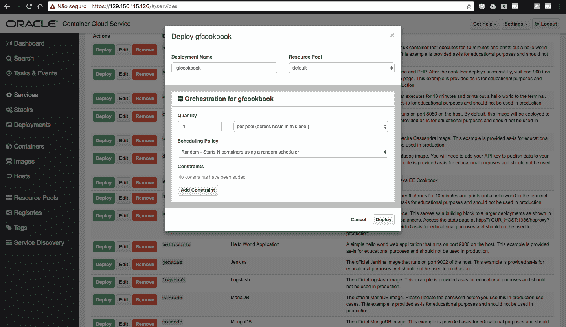
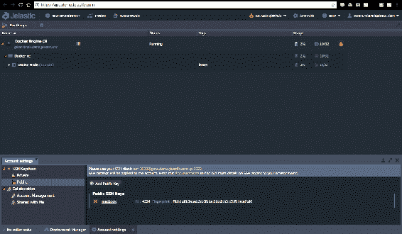
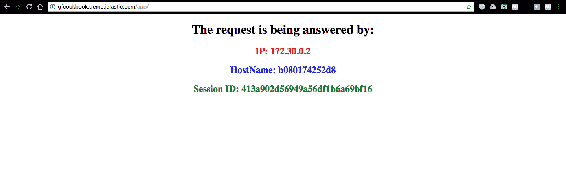

# 迈向云端——Java EE、容器和云计算

本章涵盖了以下食谱：

+   使用 Docker 构建 Java EE 容器

+   在云端使用 Oracle Cloud 进行容器编排

+   在云端使用 Jelastic 进行容器编排

+   在云端使用 OpenShift 进行容器编排

+   在云端使用 AWS 进行容器编排

# 简介

计算机行业发生了两件改变其命运的事情——**云计算**和**容器**。云计算先出现，改变了看待基础设施、消费软件以及许多业务增长的方式。现在，计算已成为一种商品。

容器正在改变，并且正在改变我们构建和交付软件的方式。它们也是 DevOps 的关键粘合剂，以及将 CI/CD 提升到另一个层次的方法。

将它们组合起来，您将拥有 IT 领域中最强大的环境之一。但是 Java EE 能否利用它呢？当然可以！如果应用程序服务器是 Java EE 应用的抽象，那么容器就是服务器的抽象，一旦您在 Docker 这样的标准中构建了它们，您就有权使用这些工具来管理应用程序服务器。

本章将向您展示如何将您的 Java EE 应用程序放入容器中，以及如何使用我们今天拥有的最佳提供商之一交付这个容器。

# 使用 Docker 构建 Java EE 容器

从第一天起，Java EE 就基于容器。如果您对此表示怀疑，只需查看这张图：


Java EE 架构：https://docs.oracle.com/javaee/6/tutorial/doc/bnacj.html

它属于 Oracle 公司官方的 Java EE 6 文档，实际上，自从 Sun 时代以来，其架构一直保持不变。

如果您注意观察，您会注意到存在不同的容器：一个 Web 容器、一个 EJB 容器和应用程序客户端容器。在这个架构中，这意味着使用这些 API 开发的应用程序将依赖于容器提供的许多特性和服务。

当我们将 Java EE 应用程序服务器放入 Docker 容器中时，我们正在做同样的事情——它依赖于 Docker 环境提供的一些特性和服务。

这个食谱将向您展示如何将 Java EE 应用程序打包在一个容器包中，这被称为**设备**。

# 准备工作

当然，首先您需要在您的环境中安装 Docker 平台。有很多选择，所以我建议您访问以下链接以获取更多详细信息：

[`docs.docker.com/install/`](https://docs.docker.com/install/)

如果您不熟悉 Docker 命令，我建议您查看这份精美的速查表：

[`zeroturnaround.com/rebellabs/docker-commands-and-best-practices-cheat-sheet/`](https://zeroturnaround.com/rebellabs/docker-commands-and-best-practices-cheat-sheet/)

你还需要在 Docker Hub 上创建一个账户，以便你可以存储自己的镜像。查看它：[`hub.docker.com/`](https://hub.docker.com/)。

公共镜像免费。

# 如何操作...

要构建你的 Java EE 容器，你首先需要一个 Docker 镜像。要构建它，你需要一个像这样的 Dockerfile：

```java
FROM openjdk:8-jdk

ENV GLASSFISH_HOME /usr/local/glassfish
ENV PATH ${GLASSFISH_HOME}/bin:$PATH
ENV GLASSFISH_PKG latest-glassfish.zip
ENV GLASSFISH_URL https://download.oracle.com/glassfish/5.0/nightly/latest-glassfish.zip

RUN mkdir -p ${GLASSFISH_HOME}

WORKDIR ${GLASSFISH_HOME}

RUN set -x \
  && curl -fSL ${GLASSFISH_URL} -o ${GLASSFISH_PKG} \
    && unzip -o $GLASSFISH_PKG \
    && rm -f $GLASSFISH_PKG \
  && mv glassfish5/* ${GLASSFISH_HOME} \
  && rm -Rf glassfish5

RUN addgroup glassfish_grp \
    && adduser --system glassfish \
    && usermod -G glassfish_grp glassfish \
    && chown -R glassfish:glassfish_grp ${GLASSFISH_HOME} \
    && chmod -R 777 ${GLASSFISH_HOME}

COPY docker-entrypoint.sh /
RUN chmod +x /docker-entrypoint.sh

USER glassfish

ENTRYPOINT ["/docker-entrypoint.sh"]

EXPOSE 4848 8080 8181
CMD ["asadmin", "start-domain", "-v"]
```

这个镜像将成为我们的基础镜像，我们将从这个镜像构建本章中的其他镜像。现在我们需要构建它：

```java
docker build -t eldermoraes/gf-javaee-jdk8 .
```

好吧，把它推送到你的 Docker Hub Docker Registry：

```java
docker push eldermoraes/gf-javaee-jdk8
```

现在，你可以通过自定义上一个镜像来创建另一个镜像，然后将你的应用程序放在上面：

```java
FROM eldermoraes/gf-javaee-jdk8

ENV DEPLOYMENT_DIR ${GLASSFISH_HOME}/glassfish/domains/domain1/autodeploy/

COPY app.war ${DEPLOYMENT_DIR}
```

在同一个文件夹中，我们有一个 Java EE 应用程序文件（`app.war`），它将被部署在容器内。查看“也见”部分以下载所有文件。

保存你的 Dockerfile 后，你可以构建你的镜像：

```java
docker build -t eldermoraes/gf-javaee-cookbook .
```

现在你可以创建容器：

```java
docker run -d --name gf-javaee-cookbook \
 -h gf-javaee-cookbook \
 -p 80:8080 \
 -p 4848:4848 \
 -p 8686:8686 \
 -p 8009:8009 \
 -p 8181:8181 \
 eldermoraes/gf-javaee-cookbook
```

等待几秒钟，然后在你的浏览器中打开此 URL：

`http://localhost/app`

# 它是如何工作的...

让我们理解我们的第一个 Dockerfile：

```java
FROM openjdk:8-jdk
```

这个`FROM`关键字将要求 Docker 拉取`openjdk:8-jdk`镜像，但这意味着什么？

这意味着在某个地方有一个注册表，你的 Docker 可以在那里找到预构建的镜像。如果你的本地环境中没有镜像注册表，它将在 Docker Hub 上搜索，这是云中的官方和公共 Docker 注册表。

当你说你使用的是预构建镜像时，这意味着你不需要从头开始构建，在我们的例子中，整个 Linux 容器。已经有一个你可以依赖的模板：

```java
ENV GLASSFISH_HOME /usr/local/glassfish
ENV PATH ${GLASSFISH_HOME}/bin:$PATH
ENV GLASSFISH_PKG latest-glassfish.zip
ENV GLASSFISH_URL https://download.oracle.com/glassfish/5.0/nightly/latest-glassfish.zip

RUN mkdir -p ${GLASSFISH_HOME}

WORKDIR ${GLASSFISH_HOME}
```

这里有一些环境变量，可以帮助进行编码。

```java
RUN set -x \
 && curl -fSL ${GLASSFISH_URL} -o ${GLASSFISH_PKG} \
 && unzip -o $GLASSFISH_PKG \
 && rm -f $GLASSFISH_PKG \
 && mv glassfish5/* ${GLASSFISH_HOME} \
 && rm -Rf glassfish5
```

Dockerfile 中的`RUN`子句在容器创建时执行一些 bash 命令。基本上，这里发生的事情是 GlassFish 正在被下载并在容器中准备：

```java
RUN addgroup glassfish_grp \
 && adduser --system glassfish \
 && usermod -G glassfish_grp glassfish \
 && chown -R glassfish:glassfish_grp ${GLASSFISH_HOME} \
 && chmod -R 777 ${GLASSFISH_HOME}
```

为了安全起见，我们定义了将持有 GlassFish 文件和进程权限的用户：

```java
COPY docker-entrypoint.sh /
RUN chmod +x /docker-entrypoint.sh
```

在这里，我们在容器内包含一个 bash 脚本以执行一些 GlassFish 管理任务：

```java
#!/bin/bash

if [[ -z $ADMIN_PASSWORD ]]; then
  ADMIN_PASSWORD=$(date| md5sum | fold -w 8 | head -n 1)
  echo "##########GENERATED ADMIN PASSWORD: $ADMIN_PASSWORD
  ##########"
fi

echo "AS_ADMIN_PASSWORD=" > /tmp/glassfishpwd
echo "AS_ADMIN_NEWPASSWORD=${ADMIN_PASSWORD}" >> /tmp/glassfishpwd

asadmin --user=admin --passwordfile=/tmp/glassfishpwd change-admin-password --domain_name domain1
asadmin start-domain

echo "AS_ADMIN_PASSWORD=${ADMIN_PASSWORD}" > /tmp/glassfishpwd

asadmin --user=admin --passwordfile=/tmp/glassfishpwd enable-secure-admin
asadmin --user=admin stop-domain
rm /tmp/glassfishpwd

exec "$@"
```

在将 bash 文件复制到容器后，我们进入最后的块：

```java
USER glassfish

ENTRYPOINT ["/docker-entrypoint.sh"]

EXPOSE 4848 8080 8181
CMD ["asadmin", "start-domain", "-v"]
```

`USER`子句定义了从文件此点开始将使用的用户。这很棒，因为从那里开始，所有任务都将由`glassfish`用户执行。

`ENTRYPOINT`子句将执行`docker-entrypoint.sh`脚本。

`EXPOSE`子句将定义使用此镜像的容器可用的端口。

最后，`CMD`子句将调用初始化容器的 GlassFish 脚本。

现在我们来理解我们的第二个 Dockerfile：

```java
FROM eldermoraes/gf-javaee-jdk8
```

我们需要考虑与预构建镜像相同的考虑因素，但现在这个镜像是由你制作的。恭喜你！

```java
ENV DEPLOYMENT_DIR ${GLASSFISH_HOME}/glassfish/domains/domain1/autodeploy/
```

在这里，我们正在构建一个环境变量来帮助部署。它是以与 Linux 系统相同的方式进行：

```java
COPY app.war ${DEPLOYMENT_DIR}
```

这个`COPY`命令将直接将`app.war`文件复制到`DEPLOYMENT_DIR`环境变量定义的文件夹中。

从这里开始，你就可以构建一个镜像并创建一个容器。镜像构建器是自我解释的：

```java
docker build -t eldermoraes/gf-javaee-cookbook .
```

让我们检查`docker run`命令：

```java
docker run -d --name gf-javaee-cookbook \
 -h gf-javaee-cookbook \
 -p 80:8080 \
 -p 4848:4848 \
 -p 8686:8686 \
 -p 8009:8009 \
 -p 8181:8181 \
 eldermoraes/gf-javaee-cookbook
```

如果我们将其分解，以下是命令中各个元素的含义：

+   `-h`: 定义容器的主机名。

+   `-p`: 定义了哪些端口将被暴露以及如何实现。例如，当多个容器默认使用相同的端口时，这很有用——你只需以不同的方式使用它们。

+   `eldermoraes/gf-javaee-cookbook`: 对你刚刚构建的镜像的引用。

# 相关链接

+   本食谱中使用的源代码和文件位于[`github.com/eldermoraes/javaee8-cookbook/tree/master/chapter11/ch11-docker`](https://github.com/eldermoraes/javaee8-cookbook/tree/master/chapter11/ch11-docker)。

# 在云中使用 Oracle Cloud 进行容器编排

在云中使用容器最佳方式是通过使用提供商。为什么？因为它们可以以较低的价格提供良好的基础设施和优质的服务。

本食谱将向您展示如何获取本章第一个食谱中创建的容器，并使用 Oracle Cloud 进行交付。

# 准备工作

如果您没有 Oracle Cloud 账户，您可以在[`cloud.oracle.com/tryit`](https://cloud.oracle.com/tryit)注册试用。

这就是所有你需要做的，除了在本章第一个食谱中创建 Docker 镜像之外。

# 如何操作...

1.  登录平台后，您将看到此仪表板：


Oracle Cloud 仪表板

1.  滚动页面，直到找到 Oracle Cloud Infrastructure - 容器服务并点击它：


容器服务访问

1.  在容器服务的主页（以下截图）上，点击“我的服务 URL”链接：


容器服务概述页面

1.  您将进入云服务仪表板。点击“容器经典”：


云服务仪表板

1.  在打开的页面上，点击“打开服务控制台”按钮：


服务控制台访问

1.  在下一页上，点击“创建实例”按钮：


容器云服务欢迎页面

1.  填写表格如下：


实例创建字段

在“SSH 公钥”字段中，您需要设置一个有效的公钥，它有一个私钥对。没有它，您将无法使用 SSH 登录到服务。

点击“下一步”。

1.  在打开的页面上，确认您的数据并点击“创建”按钮：


数据确认

1.  在服务创建过程中，您将返回主页面（注意“创建服务...”标签）：


新服务正在创建

1.  一旦服务创建完成，点击“选项”按钮并点击“容器控制台”：


访问容器控制台

您现在位于您刚刚创建的服务仪表板：


容器云服务仪表板

1.  点击“服务”（左侧）然后点击“新建服务”（右侧）：


服务页面

1.  在弹出的窗口中，为服务命名（服务名称字段），并在“镜像”字段中填写预构建镜像的详细信息：


服务创建字段

1.  在“可用选项”字段中，勾选“端口”选项。它将在“环境变量”下的“端口”部分打开。点击“添加”按钮，并在弹出的窗口中填写表格，如下所示：


端口转发

1.  现在您的服务已出现在这个列表中。点击其“部署”按钮：


服务列表

1.  在弹出的窗口中，填写截图所示的表格，然后点击部署：



服务部署弹窗

1.  现在，只需稍等片刻，直到您的新服务启动并运行：


进行中的部署

1.  一旦部署完成，它将变为绿色，您将获得有关您创建的容器的信息。点击“容器名称”标签下的链接：


部署完成

您现在将看到有关您的容器的详细信息：


容器详情

1.  点击标签页上标有“环境变量”的部分，找到名为 OCCS_HOSTIPS 的变量。在同一行中，有一个标有 public_ip 的 IP 地址。复制它：


容器环境变量

使用它导航到`http://[public_ip]:8080/app`：


我们应用程序的测试页面

如果您能看到前面的图片，说明您已经成功了！现在您的容器正在使用 Oracle Cloud 进行云编排。

# 它是如何工作的...

这之所以如此简单，是因为您正在使用一个旨在使其简化的平台。因此，您在自己的基础设施中需要做的所有繁重工作都由平台完成。

# 更多...

您应该使用提供商在云中编排容器的理由不仅是因为创建服务的便捷性，而且因为平台将负责保持其正常运行。

因此，如果您的容器出现故障并需要停止、重启，甚至杀死并重新创建，平台将自动完成这些操作。

# 在云中使用 Jelastic 进行容器编排

在云中使用容器最好的方式是通过使用提供商。为什么？因为它们可以以较低的价格为您提供良好的基础设施和优质的服务。

本教程将向您展示如何使用 Jelastic 将本章第一篇教程中创建的容器交付。

# 准备工作

如果您没有 Jelastic 账户，您可以在[`jelastic.com/`](https://jelastic.com/)注册免费试用。

# 如何操作...

1.  登录平台后，您将到达这个主页：


Jelastic 主页

1.  首先，点击右上角的设置按钮。它将打开账户设置部分（左下角）：


账户设置

1.  点击 SSH 密钥链中的“公共”并上传您的公钥 SSH 密钥：


SSH 公钥信息

1.  确保您的 SSH 密钥已真正上传，否则您将无法使用 SSH 登录平台：


SSH 确认

1.  在页面顶部，点击市场按钮。转到其他部分并选择 Docker Engine CE。点击安装：


市场弹出窗口

1.  给这个环境起一个名字并点击安装：


Docker Engine CE 配置弹出窗口

等待完成：


安装状态

1.  完成后，将弹出一个包含您需要用于登录平台的命令的窗口。复制它：


安装确认和连接命令

1.  在您的机器上打开终端并粘贴复制的命令：


终端上的命令执行

在控制台窗口的输出末尾有这个命令：

```java
docker-machine env [environment-name]
```

输出将如下所示：


环境变量输出

1.  现在，您只需运行命令即可创建容器：

```java
docker run -d --name gf-javaee-cookbook \
 -h gf-javaee-cookbook \
 -p 80:8080 \
 -p 4848:4848 \
 -p 8686:8686 \
 -p 8009:8009 \
 -p 8181:8181 \
 eldermoraes/gf-javaee-cookbook
```

检查输出：


容器日志输出

这与您在自己的本地机器上运行几乎一样，但实际上您是在 Jelastic 平台上运行。

现在，如果您回到主页，您将看到您的环境正在运行：



创建节点的主页

在 Docker Engine CE 标签下有您环境的 URL。只需点击它并在末尾添加`/app`：



我们应用程序的测试页面

如果您能看到这个页面，恭喜！您的应用程序已部署到 Jelastic。

# 它是如何工作的...

这之所以如此简单，是因为您正在使用一个旨在使其简化的平台。因此，您在自己的基础设施中需要做的所有繁重工作都由平台完成。

# 更多...

您应该使用提供商在云中编排容器的原因不仅在于创建服务的便捷性，还因为平台将负责保持其正常运行。

因此，如果您的容器出现故障并需要停止、重启，甚至杀死并重新创建，平台将自动完成这些操作。

# 在云中使用 OpenShift 进行容器编排

在云中使用容器最好的方式是通过使用提供商。为什么？因为它们可以以较小的价格为您提供良好的基础设施和优质的服务。

此配方将向您展示如何使用 OpenShift 将本章第一个配方中创建的容器交付。

# 准备工作

如果您没有 OpenShift 账户，可以免费试用。访问[`www.openshift.com/`](https://www.openshift.com/)并点击免费注册。

# 如何操作...

1.  登录平台后，您将看到此主页：


OpenShift 主页

1.  点击创建项目按钮并填写空白。点击创建：


填写新项目字段

1.  一旦您的项目创建完成，点击它：


新项目的访问权限

1.  在打开的页面中，点击右上角的添加到项目，然后部署镜像：


项目主页

1.  在弹出窗口中选择镜像名称，填写表单并使用我们预构建的镜像（`eldermoraes/gf-javaee-cookbook`），然后点击搜索图标。

您将看到如下警告：


图像部署弹出窗口

让我为您节省时间：不要部署它，因为它不会工作。OpenShift 平台要求您的容器应以除`root`以外的用户运行。因此，我们需要为它构建另一个镜像。

幸运的是，这相当简单。新的 Dockerfile 如下所示：

```java
FROM eldermoraes/gf-javaee-jdk8

ENV DEPLOYMENT_DIR ${GLASSFISH_HOME}/glassfish/domains/domain1/autodeploy/

COPY app.war ${DEPLOYMENT_DIR}

USER root

RUN chown -R glassfish:glassfish_grp ${DEPLOYMENT_DIR}/app.war \
    && chmod -R 777 ${DEPLOYMENT_DIR}/app.war

USER glassfish
```

1.  然后根据此 Dockerfile 构建一个新的镜像：

```java
docker build -t eldermoraes/gf-javaee-cookbook-os .
```

1.  然后将这个新镜像推送到 Docker Hub：

```java
docker push eldermoraes/gf-javaee-cookbook-os
```

现在您可以开始了：


图像部署弹出窗口

1.  没有警告，所以请继续点击部署。在打开的页面中，点击继续到项目概览标签：


图像部署确认

1.  观察以下页面，直到 Pod 图标变为蓝色。准备好后，点击创建路由链接：


监控 Pod 创建

1.  在弹出窗口中，填写路径字段为`/app`，在目标端口选择 8080 -> 8080（TCP）：


路由创建

1.  点击创建并等待：


路由确认

1.  完成后，点击左上角的概览菜单。在应用程序名称所在的同一行，有一个指向您的容器的 URL：


我们应用程序的测试页面

如果您能看到页面，恭喜！您的应用程序现在已在 OpenShift 上编排。

# 它是如何工作的...

这之所以如此简单，是因为您正在使用一个旨在使其简化的平台。因此，您在自己的基础设施中需要做的所有繁重工作都由平台完成。

我们为使应用程序在 OpenShift 上运行所做的更改非常简单：

```java
USER root

RUN chown -R glassfish:glassfish_grp ${DEPLOYMENT_DIR}/app.war \
    && chmod -R 777 ${DEPLOYMENT_DIR}/app.war

USER glassfish
```

首先，我们使用`root`用户更改`app.war`的权限。然后主要目的是指定使用`glassfish`用户。这个特性告诉 Docker 内部进程将由`glassfish`用户拥有，而不是`root`。

# 更多...

您应该在云中使用提供者来编排容器的原因不仅是因为创建服务的简便性，还因为平台将负责保持其运行。

因此，如果您的容器出现错误需要停止、重启，甚至需要杀死并重新创建，平台将自动完成这些操作。

# 相关内容

+   在[`github.com/eldermoraes/javaee8-cookbook/tree/master/chapter11/ch11-openshift`](https://github.com/eldermoraes/javaee8-cookbook/tree/master/chapter11/ch11-openshift)查看本食谱的完整源代码。

# 在云中使用 AWS 进行容器编排

在云中使用容器的最佳方式是通过使用提供者。为什么？因为它们可以以较低的价格为您提供良好的基础设施和优质的服务。

本食谱将向您展示如何获取本章第一个食谱中创建的容器，并使用**亚马逊网络服务**（**AWS**）交付它。

# 准备工作

如果您没有 AWS 账户，请在[`aws.amazon.com/free/start-your-free-trial/`](https://aws.amazon.com/free/start-your-free-trial/)注册免费试用。

# 如何操作...

1.  一旦您登录到平台，您将到达这个主页面：


AWS 主页

1.  点击左上角的“服务”菜单，然后选择“弹性容器服务”（在“计算”菜单下）：


服务列表

1.  在打开的页面上，点击“开始”：


ECS 的入门页面

1.  仅选择“在 Amazon ECS 集群上部署示例应用程序”选项。然后点击“继续”：


创建 ECS 的第一页

1.  按照以下方式填写空白，特别关注“镜像”字段，您将使用我们的预构建镜像：


任务定义页

1.  滚动页面并设置端口号映射，如图所示。点击“继续”：


端口号映射

1.  给服务起一个名字，并将期望的任务数量设置为`1`。点击“下一步”：


服务和网络配置

1.  按照以下方式配置集群：


集群配置

1.  滚动到页面并点击启动实例 & 运行服务：


启动实例

1.  你可以在以下页面上跟踪进程的状态。完成后，点击查看服务按钮：


启动状态

1.  你将在以下页面上看到你的服务详情。点击默认 > 标签：


集群信息

在打开的页面上，你可以看到更多关于集群的详细信息：


集群详情

1.  点击任务标签以查看关于任务和创建的容器的信息：


容器任务

1.  点击容器实例标签以查看已创建容器的详细信息：


容器详情

1.  检查公共 IP 标签并复制 IP。它自动映射到`8080`端口。使用`http://[public-ip]/app`来尝试：


我们应用程序的测试页面

如果你看到了相同的截图，那就太好了！你现在正在 AWS 中编排你的容器。

# 它是如何工作的...

它之所以如此简单，是因为你正在使用一个旨在使其简化的平台。因此，你原本需要在自己的基础设施中完成的繁重工作，现在都由平台来完成。

# 还有更多...

你应该使用提供商在云中编排你的容器的原因，不仅是因为创建服务的便捷性，还因为平台将负责保持其运行。

因此，如果你的容器出现错误并需要停止、重启，甚至杀死并重新创建，平台将自动完成这些操作。
