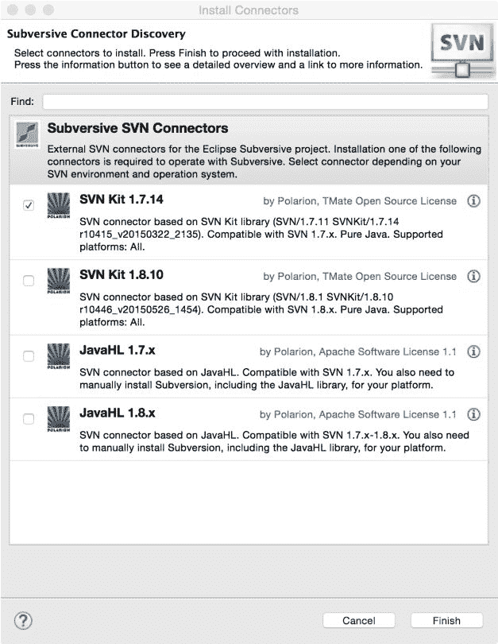

# 第三章：Eclipse 中的源代码管理

在上一章中，我们学习了如何使用 JSP、JSF 和 servlets 创建简单的 Web 应用程序。我们还学习了如何使用 Maven 进行构建和项目管理。

在本章中，我们将学习如何将 Eclipse 与 SVN 和 Git 集成。本章涵盖了以下主题：

+   安装 Eclipse 的 SVN 和 Git 插件

+   在 Eclipse 中执行源控制任务，例如检出文件、提交更改等

+   与远程仓库同步项目

**源代码管理**（**SCM**）是软件开发的一个基本组成部分。通过使用 SCM 工具，您可以确保在重要的里程碑处能够访问到代码的版本。SCM 还有助于在团队工作中管理源代码，通过提供工具确保您不会覆盖他人的工作。无论您的项目大小如何，无论您是单独工作还是在一个大型团队中，使用 SCM 都会为您带来好处。

Eclipse 很早就支持集成各种 SCM 工具——这包括对 CVS、Microsoft SourceSafe、Perforce 和 **Subversion**（**SVN**）的支持。Eclipse 的最新版本也内置了对 Git 的支持。

我们将首先学习如何在 Eclipse 中使用 SVN。

# Eclipse 子版本控制插件

在本节中，我们将学习如何安装和使用 SVN Eclipse 插件。我们将创建一个小型项目，并查看如何在 Eclipse 内部将项目检入 SVN。我们还将了解如何与现有的 SVN 仓库同步。

您需要访问一个 SVN 仓库才能遵循本章中的步骤。如果您没有访问 SVN 仓库的权限，您可以从网上的一些免费 SVN 提供中选择。本书不推荐或建议使用任何特定的在线 SVN 托管，但为了解释 SVN Eclipse 插件的功能，作者使用了 [`riouxsvn.com`](https://riouxsvn.com)。然而，该插件与任何 SVN 服务器的工作方式相同。

# 安装 Eclipse Subversion 插件

1.  通过选择 Help | Eclipse Marketplace 菜单打开 Eclipse 市场 place。搜索 `subversion`：


图 3.1：安装 Subversion 插件

1.  安装插件。在我们配置 Eclipse 中的 SVN 仓库之前，我们需要选择/安装一个 SVN 连接器。转到 Eclipse 首选项，并在过滤器框中输入 `svn`。然后，转到 SVN 连接器选项卡：


图 3.2：SVN 连接器首选项

如果没有安装连接器，您将看到一个 Get Connectors... 按钮。点击该按钮。

1.  Eclipse 显示了多个可用的连接器。我们将选择 SVN Kit 连接器并安装它（点击 Finish 按钮）：



图 3.3：SVN 连接器发现向导

1.  我们现在将在 Eclipse 中配置现有的 SVN 仓库。选择 Window | Open Perspective | Other 菜单，然后选择 SVN Repository Exploring 视图：


图 3.4：打开 SVN 视图

# 将项目添加到 SVN 仓库

执行以下步骤将项目添加到 SVN 仓库：

1.  在 SVN 仓库视图中右键单击，然后选择新建 | 仓库位置。

1.  输入您的 SVN 仓库的 URL、用户名和密码。如果您需要设置 SSH 或 SSL 信息以连接到您的 SVN 仓库，请单击相应的选项卡并输入信息。单击“完成”将仓库添加到 Eclipse：


图 3.5：配置 SVN 仓库

现在我们将创建一个简单的 Java 项目，我们将将其检查入 SVN 仓库。在本章中，您在项目中编写的代码并不重要；我们只是使用项目来了解如何将项目文件检查入 SVN，然后查看如何同步项目。

1.  创建一个如图所示的简单 Java 项目：


图 3.6：SVN 测试的示例项目

1.  该项目有一个源文件。我们现在将此项目检查入 SVN。在项目上右键单击，然后选择团队 | 共享项目...。

1.  选择 SVN 并单击“下一步”按钮。向导为您提供选项，要么创建一个新的 SVN 仓库，要么选择一个已经配置好的 SVN 仓库：


图 3.7：与 SVN 仓库共享项目

1.  我们将使用已经配置好的仓库。因此，选择仓库：


图 3.8：选择 SVN 仓库或创建一个新的

1.  我们可以单击“下一步”并配置高级选项，但我们将保持配置简单并单击“完成”。您将被提示检查项目中的现有文件：


图 3.9：与 SVN 仓库共享项目

1.  选择要检查入的文件并输入检查入注释。然后单击“确定”。要查看 SVN 仓库中的已检查入文件，切换到 SVN 仓库浏览视角，然后切换到 SVN 仓库视图：


图 3.10：SVN 仓库视图中的已检查入文件

# 将更改提交到 SVN 仓库

现在让我们修改一个文件并检查更改。切换回 Java 视角，从包资源管理器或导航器打开`SVNTestApplication.java`。修改文件并保存更改。要比较工作目录中的文件或文件夹与仓库中的文件或文件夹，在导航器中右键单击`文件/文件夹/项目`，然后选择与 | 仓库最新版本比较。

现在我们已经修改了`SVNTestApplication.java`，让我们看看它与仓库中的版本有何不同：


图 3.11：比较 SVN 文件

现在我们将在项目的根目录下添加一个新文件，比如`readme.txt`。要将文件添加到仓库，右键单击文件并选择团队 | 添加到版本控制...：


图 3.12：将文件添加到 SVN 仓库

# 与 SVN 仓库同步

要将本地项目与远程仓库同步，右键单击项目并选择 Team | Synchronize with Repository。这将使用远程仓库中的文件更新项目，显示本地文件夹中新的文件，并显示已更改的文件：


图 3.13：同步视图

你可以按传入模式（来自远程仓库的更改）、传出模式（工作目录中的更改）或两者都进行过滤。如图 3.13 所示，我们在工作目录中有两个已更改的文件；一个已修改，一个新创建。要提交更改，右键单击项目并选择 Commit.... 如果你想从导航器或包资源管理器提交，则右键单击项目并选择 Team | Commit.... 输入提交注释并点击 OK。要更新项目（接收来自远程仓库的所有更改），右键单击项目并选择 Team | Update。

要查看文件或文件夹的修订历史，右键单击导航器或包资源管理器并选择 Team | Show History：


图 3.14：SVN 文件修订历史

# 从 SVN 检出项目

从 SVN 仓库检出项目到新工作空间很容易。在 SVN Repositories 视图中，点击你想要检出的项目，然后选择 Check Out 选项：


图 3.15：SVN 文件修订历史

此选项将在当前工作空间中检出项目。你还可以使用导入项目选项从 SVN 检出项目。选择 File | Import 菜单选项，然后选择 SVN | Project from SVN 选项。

你可以从 Eclipse 使用许多其他 SVN 功能。请参阅 [`www.eclipse.org/subversive/documentation.php`](http://www.eclipse.org/subversive/documentation.php)。

# Eclipse Git 插件

近期版本的 Eclipse 预装了 Eclipse **Git 插件**（**EGit**）。如果没有，你可以从 Eclipse 市场安装插件。选择 Help | Eclipse Marketplace... 选项，并在 Find 文本框中输入 `egit`：


图 3.16：在 Eclipse 市场中搜索 EGit 插件

如果插件已经安装，它将被标记为已安装。

# 将项目添加到 Git

Git 是一个分布式仓库。与一些其他源代码管理系统不同，Git 还维护了完整的本地仓库。因此，你可以在不连接任何远程仓库的情况下，在本地仓库中执行诸如检出和提交等活动。当你准备好将代码移动到远程仓库时，你可以连接到它并将文件推送到远程仓库。

如果你刚开始使用 Git，请查看以下文档和教程：

[`git-scm.com/doc`](https://git-scm.com/doc) 和 [`www.atlassian.com/git/tutorials/`](https://www.atlassian.com/git/tutorials/)。

要学习如何将项目添加到 Git，让我们在工作区中创建一个简单的 Java 项目。同样，在上一节中，你在这个项目中编写的代码现在并不重要：

1.  在项目中创建一个 Java 类。

1.  要将此项目添加到 Git，请在包资源管理器或导航器中右键单击项目，并选择团队 | 共享项目...：


图 3.17：使用 Git 共享 Eclipse 项目

1.  选择 Git 并点击下一步。勾选使用或创建项目父文件夹中的仓库。

1.  选择项目（勾选项目复选框）并点击创建仓库按钮。然后点击完成：


图 3.18：为项目创建 Git 仓库

1.  这将在项目文件夹中创建一个新的 Git 仓库。切换到 Git 视图（或从窗口 | 显示视图 | 其他选项打开 Git 仓库视图），你应该在 Git 仓库视图中看到项目列表（见以下截图）：


图 3.19：Git 仓库视图

# 在 Git 仓库中提交文件

在 Git 中，新文件或修改后的文件已暂存以供提交。要查看暂存文件，请单击 Git 视图中的 Git 预览选项卡：


图 3.20：Git 预览视图

如果你不想将文件添加到 Git 仓库中，那么在该文件（或多个文件选择）上右键单击并选择忽略选项。在将文件提交到 Git 之前，你需要将未暂存更改移动到暂存更改。我们将把所有文件添加到 Git 中。因此，在未暂存更改视图中选择所有文件，并将它们拖放到暂存更改视图中。还建议设置作者名称和提交者。通常以 `Name <email>` 格式。要在 Eclipse 中设置全局选项（这样你就不必在每次提交时设置这些字段），请转到 Eclipse 首选项并搜索 `Git`。然后转到团队 | Git | 配置页面并点击添加条目...按钮：


图 3.21：添加 Git 配置条目

类似地，添加 `user.email` 条目：


图 3.22：首选项中的 Git 配置

返回到 Git 预览视图，输入作者、提交者和提交信息。然后点击提交按钮。

# 修改后查看文件差异

让我们修改之前项目中创建的单个 Java 类。如果你在更改文件后转到 Git 预览视图，你会看到该文件出现在未暂存更改列表中。要查看自上次提交以来对文件所做的更改，请双击 Git 预览视图中的文件。

要提交这些更改，将其移动到暂存更改视图，输入提交信息，并点击提交按钮。你还可以通过在包资源管理器中单击文件并选择与 | 头版本比较来查看文件差异：


图 3.23：查看文件差异

要查看项目或文件（夹）的更改历史，右键单击并选择“团队 | 显示在历史中”：


图 3.24：Git 历史视图

# 创建新分支

当你使用源代码管理创建单独的分支以用于功能或甚至用于错误修复时，这是典型的。想法是主分支或主分支应始终包含工作代码，你可以在可能不稳定的分支上进行开发。当你完成一个功能或修复一个错误，并且知道该分支是稳定的，然后你将那个分支的代码合并到主分支。

要创建一个新分支，转到 Git 仓库视图，然后右键单击要分支的仓库。然后选择“切换到 | 新分支...”选项：


图 3.25：创建新分支

注意“检出新分支”框应该被勾选。因为这个选项，新分支一旦创建就变为活动分支。你提交的任何更改都将在这个分支和主分支中进行，而主分支保持不变。点击完成以创建分支。

让我们对代码进行一些更改，比如在`GitTestApp`类的`main`方法中：

```java
public class GitTestApp { 

  public static void main(String[] args) { 
    System.out.println("Hello Git, from branch bug#1234 !!"); 
  } 
} 
```

将前面的更改提交到新分支。

现在让我们检出主分支。在 Git 仓库视图中右键单击仓库，并选择“切换到 | master”。打开新分支中修改的文件。你会观察到你对文件所做的更改不存在。如前所述，你对分支所做的任何更改都不会提交到主分支。你必须显式合并更改。

要将 bug#1234 分支的更改合并到主分支，在 Git 仓库视图中右键单击仓库，并选择“合并...”：


图 3.26：合并 Git 分支

选择分支 bug#1234。此分支将被合并到主分支中。点击合并。Git 将显示合并摘要。点击确定以完成合并操作。现在主分支中的文件将包含来自 bug#1234 分支所做的更改。

我们已经将 bug#1234 分支的所有更改合并到主分支，不再需要它。所以，让我们删除 bug#1234 分支。在 Git 仓库视图中展开分支节点，然后右键单击要删除的分支（删除时选中的分支不应是活动分支）。然后选择“删除分支”菜单选项：


图 3.27：删除 Git 分支

# 将项目提交到远程仓库

到目前为止，我们一直在本地 Git 仓库中工作。但如果你想要共享你的代码并确保你不会丢失本地更改，你可能想要将你的项目推送到远程仓库。所以在本节中，我们将学习如何将本地项目推送到远程 Git 仓库。如果你没有访问 Git 仓库的权限，你可以在[`www.github.com`](http://www.github.com)创建一个。

1.  在远程 Git 服务器上创建一个名为`GitPluginTest`的新仓库。

1.  在 Git Repositories 视图中，右键单击 Remotes 节点并选择创建远程...选项：


图 3.28：添加远程 Git 仓库

1.  按照惯例，远程仓库的名称是`origin`。点击 OK。在下一页，设置推送的配置。点击 URI 文本框旁边的 Change 按钮：


图 3.29：设置远程 Git URI

1.  输入远程 Git 仓库的 URI。向导从 URI 中提取主机、仓库路径和协议。输入你的用户 ID 和密码，然后点击 Finish：


图 3.30：配置 Git push

1.  点击保存并推送。这会将本地 master 分支中的文件发送到远程 Git 仓库。

# 从远程仓库拉取更改

当你在团队中工作时，团队成员也会对远程仓库进行更改。当你想要将远程仓库中的更改获取到本地仓库时，你使用 Pull 选项。但在执行 Pull 操作之前，你需要进行配置。

在 Package Explorer 中，右键单击项目并选择团队 | 远程 | 从上游配置 Fetch...：


图 3.31：配置 Git Fetch

在 Git 中，Pull 和 Fetch 都可以从远程仓库获取更改。然而，Fetch 操作不会将更改合并到本地仓库中。Pull 操作首先获取更改，然后将其合并到本地仓库中。如果你想在合并之前检查文件，那么请选择 Fetch 选项。

我们需要将本地 master 分支映射到远程仓库中的一个分支。这告诉 Pull 操作从远程仓库的分支获取更改并将其合并到指定的（在这种情况下，master）本地仓库中。点击 Add...按钮：


图 3.32：配置 Git Fetch

在源文本框中开始键入分支名称，向导将从远程仓库获取分支信息并自动完成。点击 Next 然后 Finish。这会将你带回到配置 Fetch 页面，并添加了映射的分支：


图 3.33：配置 Git Fetch 并添加映射

点击保存并获取以从远程仓库拉取更改。

# 克隆远程仓库

我们已经学习了如何使用本地 Git 仓库开始开发，然后将更改推送到远程仓库。现在让我们学习如何获取现有的远程 Git 仓库并创建本地副本；换句话说，我们将学习如何克隆远程 Git 仓库。最简单的方法是导入远程 Git 项目。从主菜单中选择文件 | 导入...，然后 Git | 从 Git 导入 | 克隆 URI。

向导将显示一个类似于*图 3.29*的页面。输入远程仓库的 URI、用户名和密码，然后点击 Next。选择远程分支并点击 Next：


图 3.34：选择要克隆的远程分支

在分支选择页面点击 Next 按钮：


图 3.35：选择克隆项目的位置

选择项目要保存的位置并点击“下一步”：


图 3.36：导入克隆项目的选项

有三种导入克隆项目的选项。如果远程仓库包含整个 Eclipse 项目，则选择“导入现有 Eclipse 项目”，否则选择剩下的两个选项之一。由于我们在远程仓库中已经提交了 Eclipse 项目，我们将选择第一个选项。点击“下一步”然后点击“完成”。

关于 Eclipse Git 插件的更多信息，请参阅[`wiki.eclipse.org/EGit/User_Guide`](https://wiki.eclipse.org/EGit/User_Guide)。

# 摘要

有许多 Eclipse 插件可供各种 SCM 系统使用。在本章中，我们学习了如何使用 Eclipse 插件进行 SVN 和 Git 操作。使用这些插件，你可以在 Eclipse IDE 中执行许多典型的 SCM 操作，例如检出源代码、比较版本和提交更改，这提供了极大的便利并可以提高你的工作效率。

在下一章中，我们将看到如何使用 JDBC 和 JDO 创建 JEE 数据库应用程序。
