# 创建 JEE 数据库应用程序

在上一章中，我们学习了如何从 Eclipse 使用源代码管理软件。具体来说，我们学习了如何从 Eclipse 使用 SVN 和 Git。在本章中，我们将回到讨论 JEE 应用程序开发。如今，大多数网络应用程序都需要访问数据库。在本章中，我们将学习两种从 JEE 网络应用程序访问数据库的方法：使用 JDBC API 和使用 JPA API。

JDBC4 自 JDK 1.1 版本以来一直是 JDK 的一部分。它提供了统一的 API 来访问不同的关系型数据库。在 JDBC API 和数据库之间，是针对该数据库的 JDBC 驱动程序（由数据库供应商提供或第三方供应商提供）。JDBC 将常见的 API 调用转换为数据库特定的调用。数据库返回的结果也被转换为通用数据访问类的对象。尽管 JDBC API 要求你编写更多的代码来访问数据库，但由于其简单性、使用数据库特定 SQL 语句的灵活性以及低学习曲线，它仍然在 JEE 网络应用程序中很受欢迎。

JPA 是 Java 规范请求 220（代表 JSR）的结果。使用 JDBC API 直接的一个问题是将数据对象表示转换为关系数据。对象表示位于你的 JEE 应用程序中，需要映射到关系数据库中的表和列。处理从关系数据库返回的数据时，这个过程是相反的。如果有一种方法可以自动将网络应用程序中的面向对象的数据表示映射到关系数据，这将节省开发者大量的时间。这也被称为 **对象关系映射**（ORM）。Hibernate ([`hibernate.org/`](http://hibernate.org/)) 是 Java 应用程序中非常流行的 ORM 框架。

许多流行的第三方 ORM 框架的概念都被纳入了 JPA。正如 JDBC 为访问关系型数据库提供了统一的 API 一样，JPA 为访问 ORM 库提供了统一的 API。第三方 ORM 框架在其自己的框架之上提供了 JPA 的实现。JPA 实现可能使用 JDBC API 作为底层。 

在本章中，我们将构建使用这些框架的应用程序，同时探索 JDBC 和 JPA 的许多特性。实际上，我们将构建同一个应用程序，一次使用 JDBC，然后使用 JPA。

我们将要构建的应用程序是用于学生课程管理。目标是提供一个示例，展示如何建模表之间的关系并在 JEE 应用程序中使用它们。我们将使用 MySQL 数据库和 Tomcat 网络应用程序容器。尽管本章是关于 JEE 的数据库编程，但我们将回顾我们在第二章，“创建简单的 JEE 网络应用程序”中学到的一些关于 JSTL 和 JSF 的内容。我们将使用它们来创建数据库网络应用程序的用户界面。请确保您已按照第二章，“创建简单的 JEE 网络应用程序”中所述在 Eclipse 中配置了 Tomcat。

我们将涵盖以下主题：

+   核心 JDBC 概念

+   使用 JDBC 访问数据库

+   使用 JDBC 连接池

+   核心 JPA 概念

+   使用 JPA 将实体（类）映射到数据库中的表

+   配置 JPA 实体之间的关系

让我们先为这个应用程序创建一个数据库和表。

# 创建数据库架构

在 MySQL 中创建数据库表和关系有许多方法：

+   您可以直接在终端的 MySQL 命令提示符中使用 **数据描述语言**（**DDL**）语句

+   您可以使用 MySQL Workbench 直接创建表

+   您可以在 MySQL Workbench 中创建实体-关系图，将其导出以创建 DDL 脚本，然后运行此脚本以创建表和关系

我们将使用第三个选项。如果您只想获取创建表的脚本并跳过创建 ER 图，请跳转到本章的“创建表和关系的脚本”部分。

如果您尚未安装 MySQL 和 MySQL Workbench，请参阅第一章，“介绍 JEE 和 Eclipse”，获取说明：

1.  打开 MySQL Workbench。选择“文件 | 新模型”菜单。将创建一个空白模型，并可以选择创建 ER 图：

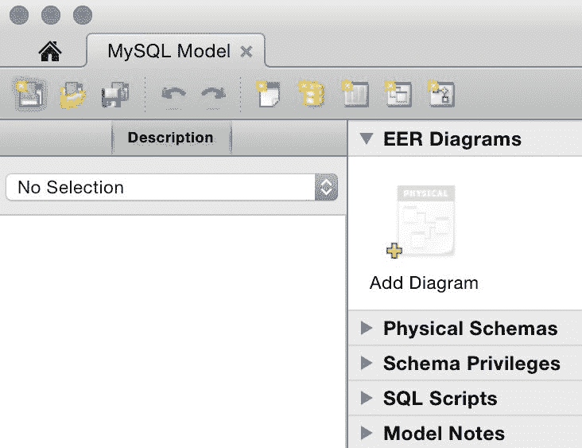

图 4.1：创建新的 MySQL Workbench 模型

1.  双击“添加图”图标；将打开一个空白 ER 图：

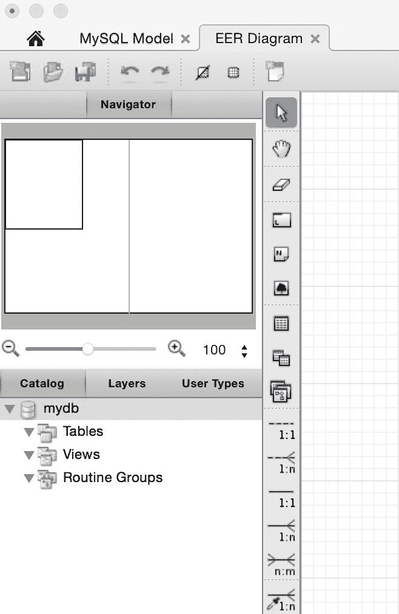

图 4.2：创建新的 ER 图

1.  默认情况下，新架构命名为 `mydb`。双击它以打开架构属性。重命名架构为 `course_management`：

    图 4.3：重命名架构

    1.  在页面左侧的工具栏按钮上悬停，您将看到有关其功能的工具提示。单击创建新表的按钮，然后单击空白页面。这将插入一个名为 `table1` 的新表。双击表图标以打开表的属性页面。在属性页面中，将表名更改为 `Course`：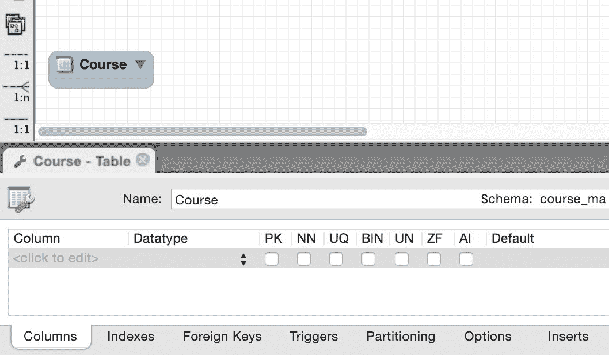

        图 4.4：在 ER 图中创建表

        1.  现在，我们将创建表的列。双击第一列并命名为 id。勾选 PK（**主键**）、NN（**非空**）和 AI（**自动递增**）复选框。添加其他列，如下面的截图所示！[](img/00097.jpeg)

            图 4.5：在 ER 图中创建表格的列

            1.  创建其他表格，即`Student`和`Teacher`，如下面的截图所示！[](img/00098.jpeg)

                图 4.6：创建额外的表格

                注意，如果您想编辑任何表格的列属性，请在 ER 图中双击该表格。仅通过单次点击选择表格不会改变属性页中的表格选择。所有表格中的所有列都是必需的（非空），除了`Student`和`Teacher`表中的`last_name`列。

                我们现在将在表格之间创建关系。一门课程可以有多个学生，学生也可以选修多门课程。因此，`Course`和`Student`之间存在多对多关系。

                我们将假设只有一位教师教授一门课程。然而，一位教师可以教授多门课程。因此，`Course`和`Teacher`之间存在多对一关系。

                现在，让我们在 ER 图中建模这些关系：

                1.  首先，我们将创建`Course`和`Teacher`之间的非标识关系。

                1.  在工具栏中点击非标识的一对多按钮（虚线和 1:n）。

                1.  然后，首先点击`Course`表，然后点击`Teacher`表。这将创建如图*图 4.7*所示的关联。注意，在`Course`表中创建了一个外键`Teacher_id`。我们不想在`Course`中使`Teacher_id`字段成为必填项。在我们的应用程序中，课程可以没有教师而存在。因此，双击连接`Course`和`Teacher`表的链接。

                1.  然后，点击 外键标签页。

                1.  在 引用表一侧，取消勾选必填复选框！[](img/00099.jpeg)

                    图 4.7：在表格之间创建一对一关系

                    创建多对多关系需要创建一个链接表。要创建`Course`和`Student`之间的多对多关系，点击多对多（n:m）图标，然后点击 `Course`表和 `Student`表。这将创建一个名为`Course_has_Student`的第三张表（链接表）。我们将此表重命名为`Course_Student`。最终的图如下所示：

                    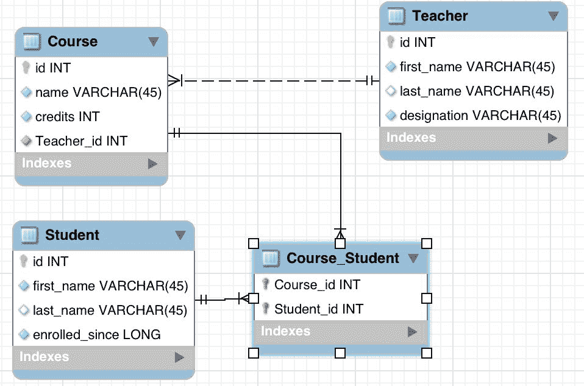

                    图 4.8：课程管理示例的 ER 图

                    按照以下步骤从 ER 图创建 DDL 脚本：

                    1.  选择 文件 | 导出 | 前向工程 SQL 创建脚本... 菜单。

                    1.  在 SQL 导出选项页，选择两个选项的复选框：

                        +   在每个 CREATE 语句之前生成 DROP 语句

                        +   生成 DROP SCHEMA

                    1.  如果您想保存脚本，请指定 输出 SQL 脚本文件路径。

                    1.  在导出向导的最后一步，您将看到 MySQL Workbench 生成的脚本。通过点击 复制到剪贴板按钮来复制此脚本。

                    # 创建表和关系的脚本

                    下面的 DDL 脚本用于创建表和关系，用于课程管理示例：

                    ```java
                    -- MySQL Script generated by MySQL Workbench 
                    -- Sun Mar  8 18:17:07 2015 
                    -- Model: New Model    Version: 1.0 
                    -- MySQL Workbench Forward Engineering 

                    SET @OLD_UNIQUE_CHECKS=@@UNIQUE_CHECKS, UNIQUE_CHECKS=0; 
                    SET @OLD_FOREIGN_KEY_CHECKS=@@FOREIGN_KEY_CHECKS, FOREIGN_KEY_CHECKS=0; 
                    SET @OLD_SQL_MODE=@@SQL_MODE, SQL_MODE='TRADITIONAL,ALLOW_INVALID_DATES'; 

                    -- ----------------------------------------------------- 
                    -- Schema course_management 
                    -- ----------------------------------------------------- 
                    DROP SCHEMA IF EXISTS `course_management` ; 

                    -- ----------------------------------------------------- 
                    -- Schema course_management 
                    -- ----------------------------------------------------- 
                    CREATE SCHEMA IF NOT EXISTS `course_management` DEFAULT CHARACTER SET utf8 COLLATE utf8_general_ci ; 
                    USE `course_management` ; 

                    -- ----------------------------------------------------- 
                    -- Table `course_management`.`Teacher` 
                    -- ----------------------------------------------------- 
                    DROP TABLE IF EXISTS `course_management`.`Teacher` ; 

                    CREATE TABLE IF NOT EXISTS `course_management`.`Teacher` ( 
                      `id` INT NOT NULL AUTO_INCREMENT, 
                      `first_name` VARCHAR(45) NOT NULL, 
                      `last_name` VARCHAR(45) NULL, 
                      `designation` VARCHAR(45) NOT NULL, 
                      PRIMARY KEY (`id`)) 
                    ENGINE = InnoDB; 

                    -- ----------------------------------------------------- 
                    -- Table `course_management`.`Course` 
                    -- ----------------------------------------------------- 
                    DROP TABLE IF EXISTS `course_management`.`Course` ; 

                    CREATE TABLE IF NOT EXISTS `course_management`.`Course` ( 
                      `id` INT NOT NULL AUTO_INCREMENT, 
                      `name` VARCHAR(45) NOT NULL, 
                      `credits` INT NOT NULL, 
                      `Teacher_id` INT NULL, 
                      PRIMARY KEY (`id`), 
                      INDEX `fk_Course_Teacher_idx` (`Teacher_id` ASC), 
                      CONSTRAINT `fk_Course_Teacher` 
                        FOREIGN KEY (`Teacher_id`) 
                        REFERENCES `course_management`.`Teacher` (`id`) 
                        ON DELETE NO ACTION 
                        ON UPDATE NO ACTION) 
                    ENGINE = InnoDB; 

                    -- ----------------------------------------------------- 
                    -- Table `course_management`.`Student` 
                    -- ----------------------------------------------------- 
                    DROP TABLE IF EXISTS `course_management`.`Student` ; 

                    CREATE TABLE IF NOT EXISTS `course_management`.`Student` ( 
                      `id` INT NOT NULL AUTO_INCREMENT, 
                      `first_name` VARCHAR(45) NOT NULL, 
                      `last_name` VARCHAR(45) NULL, 
                      `enrolled_since` MEDIUMTEXT NOT NULL, 
                      PRIMARY KEY (`id`)) 
                    ENGINE = InnoDB; 

                    -- ----------------------------------------------------- 
                    -- Table `course_management`.`Course_Student` 
                    -- ----------------------------------------------------- 
                    DROP TABLE IF EXISTS `course_management`.`Course_Student` ; 

                    CREATE TABLE IF NOT EXISTS `course_management`.`Course_Student` ( 
                      `Course_id` INT NOT NULL, 
                      `Student_id` INT NOT NULL, 
                      PRIMARY KEY (`Course_id`, `Student_id`), 
                      INDEX `fk_Course_has_Student_Student1_idx` (`Student_id` ASC), 
                      INDEX `fk_Course_has_Student_Course1_idx` (`Course_id` ASC), 
                      CONSTRAINT `fk_Course_has_Student_Course1` 
                        FOREIGN KEY (`Course_id`) 
                        REFERENCES `course_management`.`Course` (`id`) 
                        ON DELETE NO ACTION 
                        ON UPDATE NO ACTION, 
                      CONSTRAINT `fk_Course_has_Student_Student1` 
                        FOREIGN KEY (`Student_id`) 
                        REFERENCES `course_management`.`Student` (`id`) 
                        ON DELETE NO ACTION 
                        ON UPDATE NO ACTION) 
                    ENGINE = InnoDB; 

                    SET SQL_MODE=@OLD_SQL_MODE; 
                    SET FOREIGN_KEY_CHECKS=@OLD_FOREIGN_KEY_CHECKS; 
                    SET UNIQUE_CHECKS=@OLD_UNIQUE_CHECKS; 
                    ```

                    # 在 MySQL 中创建表

                    让我们现在使用上一节中创建的脚本在 MySQL 数据库中创建表和关系。

                    确保 MySQL 正在运行，并且从 MySQL Workbench 到服务器的连接是开放的（有关更多详细信息，请参阅第一章，介绍 JEE 和 Eclipse）：

                    1.  创建一个新的查询标签页（工具栏中的第一个按钮）并粘贴前面的脚本。

                    1.  执行查询。

                    1.  执行完成后，在左侧面板中刷新模式。你应该会看到 course_management 模式以及其中创建的表！

                    图 4.9：课程管理示例的 MySQL 模式

                    # 使用 JDBC 创建数据库应用程序

                    在本节中，我们将使用 JDBC 创建一个简单的课程管理 Web 应用程序。我们将使用上一节中创建的 MySQL 模式。此外，我们将使用 Tomcat 创建 Web 应用程序；我们已经在第二章中看到了如何创建它，创建简单的 JEE Web 应用程序。在同一章中，我们还学习了如何使用 JSTL 和 JSF。在本节中，我们将使用 JSTL 和 JDBC 创建课程管理应用程序，在下一节中，我们将使用 JSF 和 JPA 创建相同的应用程序。我们将使用 Maven（如第二章中所述，创建简单的 JEE Web 应用程序）进行项目管理，当然，我们的 IDE 将是 Eclipse JEE。

                    # 创建项目和设置 Maven 依赖项

                    我们将执行以下步骤来创建我们应用程序的 Maven 项目：

                    1.  按照第二章中所述创建 Maven Web 项目，创建简单的 JEE Web 应用程序。

                    1.  将项目命名为 `CourseManagementJDBC`。

                    1.  添加 servlet 和 JSP 的依赖项，但不要添加 JSF 的依赖项。

                    1.  要添加 JSTL 的依赖项，打开 `pom.xml` 并转到依赖项选项卡。点击“添加...”按钮。在搜索框中输入 `javax.servlet` 并选择 jstl：

                    图 4.10：添加 jstl 的依赖项：

                    1.  也添加 MySQL JDBC 驱动程序的依赖项：

                        图 4.11：添加 MySQL JDBC 驱动程序的依赖项

                        在添加依赖项后，这是 `pom.xml` 文件：

                        ```java
                        <project  

                          xsi:schemaLocation="http://maven.apache.org/POM/4.0.0 
                         http://maven.apache.org/xsd/maven-4.0.0.xsd"> 
                          <modelVersion>4.0.0</modelVersion> 
                          <groupId>packt.book.jee.eclipse</groupId> 
                          <artifactId>CourseManagementJDBC</artifactId> 
                          <version>1</version> 
                          <packaging>war</packaging> 
                          <dependencies> 
                            <dependency> 
                              <groupId>javax.servlet</groupId> 
                              <artifactId>javax.servlet-api</artifactId> 
                              <version>3.1.0</version> 
                        <scope>provided</scope> 
                            </dependency> 
                            <dependency> 
                              <groupId>javax.servlet</groupId> 
                              <artifactId>jstl</artifactId> 
                              <version>1.2</version> 
                            </dependency> 
                            <dependency> 
                              <groupId>mysql</groupId> 
                              <artifactId>mysql-connector-java</artifactId> 
                              <version>8.0.9-rc</version> 
                            </dependency> 
                            <dependency> 
                              <groupId>javax.servlet.jsp</groupId> 
                              <artifactId>jsp-api</artifactId> 
                              <version>2.2</version> 
                              <scope>provided</scope> 
                            </dependency> 
                          </dependencies> 
                        </project> 
                        ```

                        注意，servlet 和 JSP 的依赖项被标记为 provided，这意味着它们将由 Web 容器（Tomcat）提供，并且不会与应用程序一起打包。

                        这里省略了如何配置 Tomcat 并向其中添加项目的描述。有关这些详细信息，请参阅第二章，“创建简单的 JEE Web 应用程序”。本节也不会重复介绍如何在第二章“创建简单的 JEE Web 应用程序”中提到的运行 JSP 页面和关于 JSTL 的信息。

                        # 创建用于数据存储的 JavaBeans

                        我们将首先为 `Student`、`Course` 和 `Teacher` 创建 JavaBean 类。由于学生和教师都是人，我们将创建一个新的类 `Person`，并让 `Student` 和 `Teacher` 类继承它。按照以下方式在 `packt.book.jee.eclipse.ch4.beans` 包中创建这些 JavaBeans。

                        `Course` 实体的代码如下：

                        ```java
                        package packt.book.jee.eclipse.ch4.bean; 

                        public class Course { 
                          private int id; 
                          private String name; 
                          private int credits; 
                          public int getId() { 
                            return id; 
                          } 
                          public void setId(int id) { 
                            this.id = id; 
                          } 
                          public String getName() { 
                            return name; 
                          } 
                          public void setName(String name) { 
                            this.name = name; 
                          } 
                          public int getCredits() { 
                            return credits; 
                          } 
                          public void setCredits(int credits) { 
                            this.credits = credits; 
                          } 
                        } 
                        ```

                        `Person` Bean 的代码如下：

                        ```java
                        package packt.book.jee.eclipse.ch4.bean; 

                        public class Person { 
                          private int id; 
                          private String firstName; 
                          private String lastName; 

                          public int getId() { 
                            return id; 
                          } 
                          public void setId(int id) { 
                            this.id = id; 
                          } 
                          public String getFirstName() { 
                            return firstName; 
                          } 
                          public void setFirstName(String firstName) { 
                            this.firstName = firstName; 
                          } 
                          public String getLastName() { 
                            return lastName; 
                          } 
                          public void setLastName(String lastName) { 
                            this.lastName = lastName; 
                          } 
                        } 
                        ```

                        `Student` Bean 的代码如下：

                        ```java
                        package packt.book.jee.eclipse.ch4.bean; 

                        public class Student extends Person { 
                          private long enrolledsince; 

                          public long getEnrolledsince() { 
                            return enrolledsince; 
                          } 

                          public void setEnrolledsince(long enrolledsince) { 
                            this.enrolledsince = enrolledsince; 
                          } 
                        } 
                        ```

                        `Teacher` 实体的代码如下：

                        ```java
                        package packt.book.jee.eclipse.ch4.bean; 

                        public class Teacher extends Person { 
                          private String designation; 

                          public String getDesignation() { 
                            return designation; 
                          } 

                          public void setDesignation(String designation) { 
                            this.designation = designation; 
                          } 
                        } 
                        ```

                        # 创建用于添加课程的 JSP 页面

                        现在让我们创建一个用于添加新课程的 JSP 页面。在包资源管理器中右键单击项目，然后选择“新建 | 其他...”选项。在过滤器框中输入 `jsp` 并选择 JSP 文件。将文件命名为 `addCourse.jsp`。Eclipse 将在项目的 `src/main/webapp` 文件夹中创建该文件。

                        在 `addCourse.jsp` 文件中输入以下代码：

                        ```java
                        <%@ page language="java" contentType="text/html; charset=UTF-8" 
                            pageEncoding="UTF-8"%> 
                        <%@ taglib prefix="c" uri="http://java.sun.com/jsp/jstl/core" %> 

                        <!DOCTYPE html PUBLIC "-//W3C//DTD HTML 4.01 Transitional//EN" "http://www.w3.org/TR/html4/loose.dtd"> 
                        <html> 
                        <head> 
                        <meta http-equiv="Content-Type" content="text/html; charset=UTF-8"> 
                        <title>Add Course</title> 
                        </head> 
                        <body> 
                          <c:set var="errMsg" value="${null}"/> 
                          <c:set var="displayForm" value="${true}"/> 
                            <c:if test="${\"POST\".equalsIgnoreCase(pageContext.request.method) 
                                && pageContext.request.getParameter(\"submit\") != null}"> 
                            <jsp:useBean id="courseBean" class="packt.book.jee.eclipse.ch4.bean.Course"> 
                              <c:catch var="beanStorageException"> 
                                <jsp:setProperty name="courseBean" property="*" /> 
                              </c:catch> 
                            </jsp:useBean> 
                            <c:choose> 
                              <c:when test="${!courseBean.isValidCourse() || beanStorageException != null}"> 
                                <c:set var="errMsg" value="Invalid course details. Please 
                                 try again"/> 
                              </c:when> 
                              <c:otherwise> 
                                <c:redirect url="listCourse.jsp"/> 
                              </c:otherwise> 
                            </c:choose> 
                          </c:if> 

                          <h2>Add Course:</h2> 
                          <c:if test="${errMsg != null}"> 
                            <span style="color: red;"> 
                              <c:out value="${errMsg}"></c:out> 
                            </span> 
                          </c:if> 
                          <form method="post"> 
                            Name: <input type="text" name="name"> <br> 
                            Credits : <input type="text" name="credits"> <br> 
                            <button type="submit" name="submit">Add</button> 
                          </form> 

                        </body> 
                        </html> 
                        ```

                        如果您已经阅读了第二章“创建简单的 JEE Web 应用程序”（见 *使用 JSTL* 部分），那么大部分代码应该都很熟悉。我们有一个表单来添加课程。在文件顶部，我们检查是否发出了 `post` 请求；如果是，将表单内容存储在 `courseBean` 中（确保 `form` 字段的名称与在 Bean 中定义的成员名称相同）。我们在这里使用的新标签是 `<c:catch>`。它类似于 Java 中的 *try-catch* 块。在 `<c:catch>` 的主体中抛出的任何异常都将分配给在 `var` 属性中声明的变量名称。在这里，我们不对 `beanStorageException` 做任何事情；我们只是抑制异常。当抛出异常时，`Course` Bean 的 `credits` 字段将保持为零，并在 `courseBean.isValidCourse` 方法中被捕获。如果课程数据有效，则使用 JSTL `<c:redirect>` 标签将请求重定向到 `listCourse.jsp` 页面。

                        我们需要在 `Course` Bean 中添加 `isValidCourse` 方法。因此，在编辑器中打开该类，并添加以下方法：

                        ```java
                          public boolean isValidCourse() { 
                            return name != null && credits != 0; 
                          } 
                        ```

                        我们还需要创建 `listCourse.jsp`。目前，只需创建一个简单的 JSP 文件，不包含 JSTL/Java 代码，且在 `body` 标签中只有一个标题：

                        ```java
                        <h2>Courses:</h2> 
                        ```

                        在包资源管理器中右键单击`addCourse.jsp`并选择运行方式 | 在服务器上运行。如果你已经正确配置了 Tomcat 并将你的项目添加到 Tomcat 中（如第二章[part0037.html#1394Q0-d43a3a5ee6dd4ebc9d7c7e1cc8d7df55]，*创建一个简单的 JEE Web 应用程序*）中所述），那么你应该看到 JSP 页面在 Eclipse 内部浏览器中运行。使用有效和无效数据（例如，错误的学分值；例如，非数值）测试页面。如果输入的数据有效，则会被重定向到`listCourse.jsp`，否则会显示相同的页面并带有错误消息。

                        在我们开始编写 JDBC 代码之前，让我们学习一些 JDBC 的基本概念。

                        # JDBC 概念

                        在 JDBC 中执行任何操作之前，我们需要与数据库建立连接。以下是 JDBC 中用于执行 SQL 语句的一些重要类/接口：

                        | **JDBC 类/接口** | **描述** |
                        | --- | --- |
                        | `java.sql.Connection` | 表示应用程序与后端数据库之间的连接。执行数据库上的任何操作所必需的。 |
                        | `java.sql.DriverManager` | 管理应用程序中使用的 JDBC 驱动程序。通过调用`DriverManager.getConnection`静态方法来获取连接。 |
                        | `java.sql.Statement` | 用于执行静态 SQL 语句。 |
                        | `java.sql.PreparedStatement` | 用于准备参数化 SQL 语句。SQL 语句被预编译，可以重复使用不同的参数执行。 |
                        | `Java.sqlCallableStatement` | 用于执行存储过程。 |
                        | `java.sql.ResultSet` | 表示由`Statement`或`PreparedStatement`执行 SQL 查询后返回的结果集中的数据库表中的行。 |

                        你可以在[`docs.oracle.com/javase/8/docs/api/java/sql/package-frame.html`](http://docs.oracle.com/javase/8/docs/api/java/sql/package-frame.html)找到所有 JDBC 接口。

                        其中许多是接口，这些接口的实现由 JDBC 驱动程序提供。

                        # 创建数据库连接

                        确保你想要连接到的数据库的 JDBC 驱动程序已下载并位于类路径中。在我们的项目中，我们已经通过在 Maven 中添加依赖项来确保这一点。Maven 下载驱动程序并将其添加到我们的 Web 应用程序的类路径中。

                        确保当应用程序运行时 JDBC 驱动程序类是可用的。如果不是，我们可以设置一个合适的错误消息并且不执行任何 JDBC 操作。MySQL JDBC 驱动程序类的名称是`com.mysql.cj.jdbc.Driver`：

                        ```java
                        try { 
                          Class.forName("com.mysql.cj.jdbc.Driver"); 
                        } 
                        catch (ClassNotFoundException e) { 
                          //log excetion 
                          //either throw application specific exception or return 
                          return; 
                        } 

                        ```

                        然后，通过调用`DriverManager.getConnection`方法来获取连接：

                        ```java
                        try { 
                          Connection con = 
                         DriverManager.getConnection("jdbc:mysql://localhost:3306/schema_name?" + 
                              "user=your_user_name&password=your_password"); 
                        //perform DB operations and then close the connection 
                          con.close(); 
                        } 
                        catch (SQLException e) { 
                          //handle exception 
                        } 
                        https://dev.mysql.com/doc/connector-j/8.0/en/connector-j-reference-configuration-properties.html.
                        ```

                        连接 URL 包含以下详细信息：MySQL 数据库服务器的 hostname、它运行的端口号（默认为 3306）以及模式名称（你想要连接到的数据库名称）。你可以通过 URL 参数传递用户名和密码来连接到数据库。

                        创建连接是一个昂贵的操作。此外，数据库服务器允许连接到它的最大连接数，因此应该谨慎创建连接。建议缓存数据库连接并重用。但是，确保在不再需要时关闭连接，例如在代码的`final`块中。稍后，我们将看到如何创建连接池，以便我们创建有限数量的连接，在需要时从池中取出，执行所需的操作，然后将它们返回到池中以便重用。

                        # 执行 SQL 语句

                        使用`Statement`执行静态 SQL（没有参数）和`PreparedStatement`执行参数化语句。

                        为了避免 SQL 注入的风险，请参阅[`www.owasp.org/index.php/SQL_injection`](https://www.owasp.org/index.php/SQL_injection)。

                        要执行任何`Statement`，首先需要使用`Connection`对象创建语句。然后，您可以执行任何 SQL 操作，例如`create`、`update`、`delete`和`select`。`Select`语句（查询）返回一个`ResultSet`对象。遍历`ResultSet`对象以获取单独的行。

                        例如，以下代码从`Course`表中获取所有行：

                        ```java
                        Statement stmt = null; 
                        ResultSet rs = null; 
                        try { 
                          stmt = con.createStatement(); 
                          rs = stmt.executeQuery("select * from Course"); 

                          List<Course> courses = new ArrayList<Course>(); 
                          //Depending on the database that you connect to, you may have to  
                          //call rs.first() before calling rs.next(). In the case of a MySQL 
                          //database, it is not necessary to call rs.first() 
                          while (rs.next()) { 
                            Course course = new Course(); 
                            course.setId(rs.getInt("id")); 
                            course.setName(rs.getString("name")); 
                            course.setCredits(rs.getInt("credits")); 
                            courses.add(course); 
                          } 
                        } 
                        catch (SQLException e) { 
                          //handle exception 
                          e.printStackTrace(); 
                        } 
                        finally { 
                          try { 
                            if (rs != null) 
                            rs.close(); 
                            if (stmt != null) 
                            stmt.close(); 
                          } 
                          catch (SQLException e) { 
                            //handle exception 
                          } 
                        } 
                        ```

                        注意事项：

                        +   调用`Connection.createStatement()`来创建`Statement`实例。

                        +   `Statement.executeQuery`返回`ResultSet`。如果 SQL 语句不是一个查询，例如`create`、`update`和`delete`语句，那么调用`Statement.execute`（如果语句执行成功则返回`true`；否则返回`false`）或调用`Statement.executeUpdate`（返回受影响的行数或如果没有行受影响则返回零）。

                        +   将 SQL 语句传递给`Statement.executeQuery`函数。这可以是数据库理解的任何有效 SQL 字符串。

                        +   通过调用`next`方法遍历`ResultSet`，直到它返回`false`。

                        +   调用不同的`get`方法变体（根据列的数据类型而定）以获取当前行中`ResultSet`所指向的列的值。您可以选择传递传递给`executeQuery`的 SQL 中的列的位置索引，或者传递数据库表或 SQL 语句中指定的别名中使用的列名。例如，如果我们已经在 SQL 中指定了列名，我们会使用以下代码：

                        ```java
                        rs = stmt.executeQuery("select id, name, credits as courseCredit from Course"); 
                        ```

                        然后，我们可以按以下方式检索列值：

                        ```java
                        course.setId(rs.getInt(1)); 
                        course.setName(rs.getString(2)); 
                        course.setCredits(rs.getInt("courseCredit")); 
                        ```

                        +   确保关闭`ResultSet`和`Statement`。

                        如果您想获取特定的课程而不是所有课程，您应该使用`PreparedStatement`：

                        ```java
                        PreparedStatement stmt = null; 
                        int courseId = 10; 
                        ResultSet rs = null; 
                        try { 
                          stmt = con.prepareStatement("select * from Course where id = 
                           ?"); 
                          stmt.setInt(1, courseId); 
                          rs = stmt.executeQuery(); 

                          Course course = null; 
                          if (rs.next()) { 
                            course = new Course(); 
                            course.setId(rs.getInt("id")); 
                            course.setName(rs.getString("name")); 
                            course.setCredits(rs.getInt("credits")); 
                          } 
                        } 
                        catch (SQLException e) { 
                          //handle exception 
                          e.printStackTrace(); 
                        } 
                        finally { 
                          try { 
                            if (rs != null) 
                            rs.close(); 
                            if (stmt != null 
                            stmt.close(); 
                          } 
                        catch (SQLException e) { 
                            //handle exception 
                          } 
                        } 
                        ```

                        在这个例子中，我们试图获取 ID 为 `10` 的课程。我们首先通过调用 `Connection.prepareStatement` 获取 `PreparedStatement` 的实例。请注意，您需要将 SQL 语句作为参数传递给此函数。查询中的参数由 `?` 占位符替换。然后，我们通过调用 `stmt.setInt` 设置参数的值。第一个参数是参数的位置（它从 `1` 开始），第二个参数是值。对于不同的数据类型，`set` 方法有许多变体。

                        # 处理事务

                        如果您想将多个更改作为单个单元对数据库进行操作，也就是说，所有更改都应该完成或一个都不做，那么您需要在 JDBC 中启动一个事务。您通过调用 `Connection.setAutoCommit(false)` 来启动事务。一旦所有操作都成功执行，通过调用 `Connection.commit` 将更改提交到数据库。如果出于任何原因想要中止事务，请调用 `Connection.rollback()`。直到您调用 `Connection.commit`，更改都不会在数据库中完成。

                        这里是一个将一系列课程插入数据库的示例。虽然在实际应用程序中，当其中一个课程未插入时中止事务可能没有意义，但在这里我们假设要么所有课程都必须插入到数据库中，要么一个都不插入：

                        ```java
                        PreparedStatement stmt = con.prepareStatement("insert into Course (id, name, credits) values (?,?,?)"); 

                        con.setAutoCommit(false); 
                        try { 
                          for (Course course : courses) { 
                            stmt.setInt(1, course.getId()); 
                            stmt.setString(2, course.getName()); 
                            stmt.setInt(3, course.getCredits()); 
                            stmt.execute(); 
                          } 
                          //commit the transaction now 
                          con.commit(); 
                        } 
                        catch (SQLException e) { 
                          //rollback commit 
                          con.rollback(); 
                        } 
                        ```

                        关于事务，还有更多内容需要学习，这里没有解释。请参阅 Oracle 的 JDBC 教程 [`docs.oracle.com/javase/tutorial/jdbc/basics/transactions.html`](http://docs.oracle.com/javase/tutorial/jdbc/basics/transactions.html)。

                        # 使用 JDBC 数据库连接池

                        如前所述，JDBC 数据库连接是一个昂贵的操作，并且连接对象应该被重用。为此目的，使用连接池。大多数 Web 容器都提供了自己的连接池实现，并提供了使用 JNDI 配置它的方法。Tomcat 也允许您使用 JNDI 配置连接池。使用 JNDI 配置连接池的优势在于，数据库配置参数，如主机名和端口号，保留在源代码之外，并且可以轻松修改。请参阅 [`tomcat.apache.org/tomcat-8.0-doc/jdbc-pool.html`](http://tomcat.apache.org/tomcat-8.0-doc/jdbc-pool.html)。

                        然而，Tomcat 连接池也可以在不使用 JNDI 的情况下使用，如前一个链接中所述。在这个例子中，我们将使用不带 JNDI 的连接池。优势在于，您可以使用第三方提供的连接池实现；然后，您的应用程序可以轻松地移植到其他 Web 容器。使用 JNDI，只要您在您要切换到的 Web 容器中创建 JNDI 上下文和资源，您也可以移植您的应用程序。

                        我们将向 Maven 的`pom.xml`文件中添加 Tomcat 连接池库的依赖项。打开`pom.xml`文件，并添加以下依赖项（参见第二章，*创建一个简单的 JEE Web 应用程序*，了解如何向 Maven 添加依赖项）：

                        ```java
                          <dependency> 
                            <groupId>org.apache.tomcat</groupId> 
                            <artifactId>tomcat-jdbc</artifactId> 
                            <version>9.0.6</version> 
                          </dependency> 
                        ```

                        注意，你可以使用任何其他的 JDBC 连接池实现。其中一个这样的连接池库是 HikariCP ([`github.com/brettwooldridge/HikariCP`](https://github.com/brettwooldridge/HikariCP))。

                        我们还希望将数据库属性从代码中移除。因此，在`src/main/resources`中创建一个名为`db.properties`的文件。Maven 将所有文件放在这个文件夹中，并将其放在应用程序的类路径中。在`db.properties`中添加以下属性：

                        ```java
                        db_host=localhost 
                        db_port=3306 
                        db_name=course_management 
                        db_user_name=your_user_name 
                        db_password=your_password 
                        db_driver_class_name=com.mysql.cj.jdbc.Driver 
                        ```

                        我们将创建一个单例类来使用 Tomcat 连接池创建 JDBC 连接。创建一个`packt.book.jee.eclipse.ch4.db.connection`包，并在其中创建一个`DatabaseConnectionFactory`类：

                        ```java
                        package packt.book.jee.eclipse.ch4.db.connection; 

                        // skipping imports to save space here

                        /** 
                         * Singleton Factory class to create JDBC database connections 
                         * 
                         */ 
                        public class DatabaseConnectionFactory { 
                          //singleton instance 
                          private static DatabaseConnectionFactory conFactory = new 
                           DatabaseConnectionFactory(); 

                          private DataSource dataSource = null; 

                          //Make the construction private 
                          private DatabaseConnectionFactory() {} 

                          /** 
                           * Must be called before any other method in this class. 
                           * Initializes the data source and saves it in an instance 
                           variable 
                           * 
                           * @throws IOException 
                           */ 
                          public synchronized void init() throws IOException { 
                            //Check if init was already called 
                          if (dataSource != null) 
                            return; 

                            //load db.properties file first 
                            InputStream inStream = 
                         this.getClass().getClassLoader().getResourceAsStream("db.properties"); 
                            Properties dbProperties = new Properties(); 
                            dbProperties.load(inStream); 
                            inStream.close(); 

                            //create Tomcat specific pool properties 
                            PoolProperties p = new PoolProperties(); 
                        p.setUrl("jdbc:mysql://" + dbProperties.getProperty("db_host") + 
                        ":" + dbProperties.getProperty("db_port") + "/" + 
                        dbProperties.getProperty("db_name")); 

                        p.setDriverClassName(dbProperties.getProperty("db_driver_class_name")); 
                            p.setUsername(dbProperties.getProperty("db_user_name")); 
                            p.setPassword(dbProperties.getProperty("db_password")); 
                            p.setMaxActive(10); 

                            dataSource = new DataSource(); 
                            dataSource.setPoolProperties(p); 
                          } 

                          //Provides access to singleton instance 
                          public static DatabaseConnectionFactory getConnectionFactory() { 
                            return conFactory; 
                          } 

                          //returns database connection object  
                          public Connection getConnection () throws SQLException { 
                            if (dataSource == null) 
                              throw new SQLException("Error initializing datasource"); 
                            return dataSource.getConnection(); 
                          } 
                        } 
                        ```

                        在从它获取连接之前，我们必须调用`DatabaseConnectionFactory`的`init`方法。我们将创建一个 servlet 并在启动时加载它。然后，我们将从 servlet 的`init`方法中调用`DatabaseConnectionFactory.init`。

                        创建`package packt.book.jee.eclipse.ch4.servlet`，然后在其中创建一个`InitServlet`类：

                        ```java
                        package packt.book.jee.eclipse.ch4.servlet; 
                        import java.io.IOException; 
                        import javax.servlet.ServletConfig; 
                        import javax.servlet.ServletException; 
                        import javax.servlet.annotation.WebServlet; 
                        import javax.servlet.http.HttpServlet; 

                        import packt.book.jee.eclipse.ch4.db.connection.DatabaseConnectionFactory; 

                        @WebServlet(value="/initServlet", loadOnStartup=1) 
                        public class InitServlet extends HttpServlet { 
                          private static final long serialVersionUID = 1L; 

                          public InitServlet() { 
                            super(); 
                          } 

                          public void init(ServletConfig config) throws ServletException { 
                            try { 
                              DatabaseConnectionFactory.getConnectionFactory().init(); 
                            } 
                            catch (IOException e) { 
                              config.getServletContext().log(e.getLocalizedMessage(),e); 
                            } 
                          } 
                        } 
                        ```

                        注意，我们使用了`@WebServlet`注解来标记这个类为 servlet，并将`loadOnStartup`属性设置为`1`，以告诉 web 容器在启动时加载这个 servlet。

                        现在，我们可以在应用程序的任何地方调用以下语句来获取一个`Connection`对象：

                        ```java
                        Connection con = DatabaseConnectionFactory.getConnectionFactory().getConnection(); 
                        ```

                        如果连接池中没有更多的连接可用，那么`getConnection`方法会抛出一个异常（特别是在`Tomcat`数据源的情况下，它会抛出`PoolExhaustedException`）。当你关闭从连接池获得的连接时，连接会被返回到池中以供重用。

                        # 使用 JDBC 在数据库表保存课程

                        现在我们已经弄清楚如何使用 JDBC 连接池并从中获取连接，让我们编写将课程保存到数据库的代码。

                        我们将创建**课程数据访问对象**（**CourseDAO**），它将具有直接与数据库交互所需的功能。因此，我们将访问数据库的代码与 UI 和业务代码分离。

                        创建`package packt.book.jee.eclipse.ch4.dao`。在它里面创建一个名为`CourseDAO`的类：

                        ```java
                        package packt.book.jee.eclipse.ch4.dao; 

                        import java.sql.Connection; 
                        import java.sql.PreparedStatement; 
                        import java.sql.ResultSet; 
                        import java.sql.SQLException; 
                        import java.sql.Statement; 

                        import packt.book.jee.eclipse.ch4.bean.Course; 
                        import packt.book.jee.eclipse.ch4.db.connection.DatabaseConnectionFactory; 

                        public class CourseDAO { 

                          public static void addCourse (Course course) throws SQLException 
                           { 
                            //get connection from connection pool 
                            Connection con = 
                         DatabaseConnectionFactory.getConnectionFactory().getConnection(); 
                            try { 
                              final String sql = "insert into Course (name, credits) 
                               values (?,?)";      //create the prepared statement with an option to get auto- 
                               generated keys      PreparedStatement stmt = con.prepareStatement(sql, 
                               Statement.RETURN_GENERATED_KEYS); 
                              //set parameters 
                              stmt.setString(1, course.getName()); 
                              stmt.setInt(2, course.getCredits()); 

                              stmt.execute(); 

                              //Get auto-generated keys 
                              ResultSet rs = stmt.getGeneratedKeys(); 

                              if (rs.next()) 
                                course.setId(rs.getInt(1)); 

                              rs.close(); 
                              stmt.close(); 
                            } 
                            finally { 
                              con.close(); 
                            } 
                          } 
                        } 
                        ```

                        我们已经看到了如何使用 JDBC 插入记录。前述代码中唯一的新内容是获取自动生成的 ID。回想一下，`Course`表中的`id`列是自动生成的。这就是为什么我们没有在插入 SQL 中指定它的原因：

                        ```java
                        String sql = "insert into Course (name, credits) values (?,?)"; 
                        ```

                        当我们准备一个语句时，我们是在告诉驱动程序获取自动生成的 ID。在行被插入到表中之后，我们通过调用以下代码来获取自动生成的 ID：

                        ```java
                        ResultSet rs = stmt.getGeneratedKeys(); 
                        ```

                        我们已经创建了 `addCourse.jsp`。某种方式下，`addCourse.jsp` 需要将表单数据发送到 `CourseDAO` 以将数据保存到数据库中。`addCourse.jsp` 已经可以访问 `Course` 实体，并将表单数据保存在其中。因此，`Course` 实体在 `addCourse.jsp` 和 `CourseDAO` 之间作为接口是有意义的。让我们修改 `Course` 实体，添加一个 `CourseDAO` 实例作为成员变量，然后创建一个向数据库添加课程（`CourseDAO` 实例）的功能：

                        ```java
                        public class Course { 
                        .... 

                          private CourseDAO courseDAO = new CourseDAO(); 

                        ... 

                          public void addCourse() throws SQLException { 
                            courseDAO.addCourse(this); 
                          } 
                        } 
                        ```

                        然后，我们将修改 `addCourse.jsp` 以调用 `Course` 实体的 `addCourse` 方法。我们将在表单提交和数据验证后添加此代码：

                        ```java
                        <c:catch var="addCourseException"> 
                          ${courseBean.addCourse()} 
                        </c:catch> 
                        <c:choose> 
                          <c:when test="${addCourseException != null}"> 
                            <c:set var="errMsg" value="${addCourseException.message}"/> 
                          </c:when> 
                          <c:otherwise> 
                            <c:redirect url="listCourse.jsp"/> 
                          </c:otherwise> 
                        </c:choose> 
                        ```

                        在前面的代码中需要注意的一点是以下语句：

                        ```java
                        ${courseBean.addCourse()} 
                        ```

                        你可以在 JSP 中插入 **表达式语言**（**EL**），正如之前所讨论的。这种方法不返回任何内容（它是一个无返回值的方法）。因此，我们没有使用 `<c:set>` 标签。此外，请注意调用是在 `<c:catch>` 标签内进行的。如果方法抛出任何 `SQLException`，则它将被分配给 `addCourseException` 变量。然后我们在 `<c:when>` 标签中检查 `addCourseException` 是否已设置。如果值不为 null，则意味着抛出了异常。我们设置错误消息，该消息稍后将在同一页面上显示。如果没有抛出错误，则请求将被重定向到 `listCourse.jsp`。以下是 `addCourse.jsp` 的完整代码：

                        ```java
                        <%@ page language="java" contentType="text/html; charset=UTF-8" 
                            pageEncoding="UTF-8"%> 
                        <%@ taglib prefix="c" uri="http://java.sun.com/jsp/jstl/core" %> 

                        <!DOCTYPE html PUBLIC "-//W3C//DTD HTML 4.01 Transitional//EN" 
                         "http://www.w3.org/TR/html4/loose.dtd"> 
                        <html> 
                        <head> 
                        <meta http-equiv="Content-Type" content="text/html; charset=UTF-8"> 
                        <title>Insert title here</title> 
                        </head> 
                        <body> 
                          <c:set var="errMsg" value="${null}"/> 
                          <c:set var="displayForm" value="${true}"/> 
                          <c:if 
                         test="${"POST".equalsIgnoreCase(pageContext.request.method) 
                        && pageContext.request.getParameter("submit") != null}"> 
                          <jsp:useBean id="courseBean" 
                           class="packt.book.jee.eclipse.ch4.bean.Course"> 
                            <c:catch var="beanStorageException"> 
                            <jsp:setProperty name="courseBean" property="*" /> 
                            </c:catch> 
                            </jsp:useBean> 
                            <c:choose> 
                              <c:when test="${!courseBean.isValidCourse() || 
                               beanStorageException != null}">      <c:set var="errMsg" value="Invalid course details. Please 
                               try again"/> 
                              </c:when> 
                              <c:otherwise> 
                                <c:catch var="addCourseException"> 
                                ${courseBean.addCourse()} 
                                </c:catch> 
                                <c:choose> 
                                  <c:when test="${addCourseException != null}"> 
                                  <c:set var="errMsg" 
                                   value="${addCourseException.message}"/> 
                                  </c:when> 
                                  <c:otherwise> 
                                    <c:redirect url="listCourse.jsp"/> 
                                  </c:otherwise> 
                                </c:choose> 
                              </c:otherwise> 
                            </c:choose> 
                          </c:if> 

                          <h2>Add Course:</h2> 
                          <c:if test="${errMsg != null}"> 
                            <span style="color: red;"> 
                              <c:out value="${errMsg}"></c:out> 
                            </span> 
                          </c:if> 
                          <form method="post"> 
                            Name: <input type="text" name="name"> <br> 
                            Credits : <input type="text" name="credits"> <br> 
                            <button type="submit" name="submit">Add</button> 
                          </form> 

                        </body> 
                        </html> 
                        ```

                        运行页面，无论是在 Eclipse 中还是在 Eclipse 的内部浏览器外（参见第二章，创建一个简单的 JEE Web 应用程序，了解如何在 Eclipse 中运行 JSP 并在 Eclipse 的内部浏览器中查看它），并添加几门课程。

                        # 使用 JDBC 从数据库表获取课程

                        我们现在将修改 `listCourses.jsp` 以显示我们使用 `addCourse.jsp` 添加的课程。然而，我们首先需要在 `CourseDAO` 中添加一个方法来从数据库获取所有课程。

                        注意，`Course` 表与 `Teacher` 表之间存在一对一的关系。它存储了教师 ID。此外，教师 ID 不是必填字段，因此课程可以在 `Course` 表中以 `null` 的 `teacher_id` 存在。要获取一个课程的全部详细信息，我们需要获取该课程的教师。然而，我们无法在 SQL 查询中创建一个简单的连接来获取课程和每个课程的教师的详细信息，因为可能没有为课程设置教师。在这种情况下，我们使用 *左外连接*，它返回连接左侧表的所有记录，但只返回连接右侧表匹配的记录。以下是获取所有课程和每个课程的教师的 SQL 语句：

                        ```java
                        select course.id as courseId, course.name as courseName, 
                          course.credits as credits, Teacher.id as teacherId, 
                          Teacher.first_name as firstName,Teacher.last_name as lastName, 
                          Teacher.designation designation 
                        from Course left outer join Teacher on 
                        course.Teacher_id = Teacher.id 
                        order by course.name 
                        ```

                        我们将在 `CourseDAO` 中使用前面的查询来获取所有课程。打开 `CourseDAO` 类并添加以下方法：

                        ```java
                        public List<Course> getCourses () throws SQLException { 
                          //get connection from connection pool 
                          Connection con = 
                         DatabaseConnectionFactory.getConnectionFactory().getConnection(); 

                          List<Course> courses = new ArrayList<Course>(); 
                          Statement stmt = null; 
                          ResultSet rs = null; 
                          try { 
                            stmt = con.createStatement(); 

                            //create SQL statement using left outer join 
                            StringBuilder sb = new StringBuilder("select course.id as 
                             courseId, course.name as courseName,")      .append("course.credits as credits, Teacher.id as teacherId, 
                               Teacher.first_name as firstName, ")      .append("Teacher.last_name as lastName, Teacher.designation 
                               designation ") 
                              .append("from Course left outer join Teacher on ") 
                              .append("course.Teacher_id = Teacher.id ") 
                              .append("order by course.name"); 

                        //execute the query 
                            rs = stmt.executeQuery(sb.toString()); 

                        //iterate over result set and create Course objects 
                        //add them to course list 
                            while (rs.next()) { 
                              Course course = new Course(); 
                              course.setId(rs.getInt("courseId")); 
                              course.setName(rs.getString("courseName")); 
                              course.setCredits(rs.getInt("credits")); 
                              courses.add(course); 

                              int teacherId = rs.getInt("teacherId"); 
                        //check whether teacher id was null in the table 
                              if (rs.wasNull()) //no teacher set for this course. 
                                continue; 
                              Teacher teacher = new Teacher(); 
                              teacher.setId(teacherId); 
                              teacher.setFirstName(rs.getString("firstName")); 
                              teacher.setLastName(rs.getString("lastName")); 
                              teacher.setDesignation(rs.getString("designation")); 
                              course.setTeacher(teacher); 
                            } 

                            return courses; 
                          } 
                        finally { 
                          try {if (rs != null) rs.close();} catch (SQLException e) {} 
                          try {if (stmt != null) stmt.close();} catch (SQLException e) {} 
                          try {con.close();} catch (SQLException e) {} 
                          } 
                        } 
                        ```

                        我们使用`Statement`来执行查询，因为它是一个静态查询。我们使用`StringBuilder`来构建 SQL 语句，因为它是一个相对较大的查询（与之前所写的查询相比），我们希望避免字符串对象的连接，因为字符串是不可变的。在执行查询后，我们遍历结果集，创建一个`Course`对象并将其添加到课程列表中，最后返回该列表。

                        这里一个有趣的事情是使用`ResultSet.wasNull`。我们想检查特定行的`Course`表中的`teacher_id`字段是否为 null。因此，在调用`rs.getInt("teacherId")`之后，我们通过调用`rs.wasNull`来检查通过`ResultSet`获取的值是否为 null。如果`teacher_id`为 null，则表示该课程没有设置教师，所以我们继续循环，跳过创建`Teacher`对象的代码。

                        在最后的代码块中，我们在关闭`ResultSet`、`Statement`和`Connection`时捕获异常并忽略它。

                        现在我们向`Course`对象中添加一个方法来通过调用`CourseDAO`的`getCourses`方法来获取课程。打开`Course`对象并添加以下方法：

                        ```java
                        public List<Course> getCourses() throws SQLException { 
                          return courseDAO.getCourses(); 
                        } 
                        ```

                        我们现在准备好修改`listCourse.jsp`以显示课程。打开 JSP 并替换现有的代码为以下内容：

                        ```java
                        <%@ page language="java" contentType="text/html; charset=UTF-8" 
                            pageEncoding="UTF-8"%> 
                        <%@ taglib prefix="c" uri="http://java.sun.com/jsp/jstl/core" %> 

                        <!DOCTYPE html PUBLIC "-//W3C//DTD HTML 4.01 Transitional//EN" "http://www.w3.org/TR/html4/loose.dtd"> 
                        <html> 
                        <head> 
                        <meta http-equiv="Content-Type" content="text/html; charset=UTF-8"> 
                        <title>Courses</title> 
                        </head> 
                        <body> 
                          <c:catch var="err"> 
                            <jsp:useBean id="courseBean" 
                             class="packt.book.jee.eclipse.ch4.bean.Course"/> 
                            <c:set var="courses" value="${courseBean.getCourses()}"/> 
                          </c:catch> 
                          <c:choose> 
                            <c:when test="${err != null}"> 
                              <c:set var="errMsg" value="${err.message}"/> 
                            </c:when> 
                            <c:otherwise> 
                            </c:otherwise> 
                          </c:choose> 
                          <h2>Courses:</h2> 
                          <c:if test="${errMsg != null}"> 
                            <span style="color: red;"> 
                              <c:out value="${errMsg}"></c:out> 
                            </span> 
                          </c:if> 
                          <table> 
                            <tr> 
                              <th>Id</th> 
                              <th>Name</th> 
                              <th>Credits</th> 
                              <th>Teacher</th> 
                            </tr> 
                            <c:forEach items="${courses}" var="course"> 
                              <tr> 
                                <td>${course.id}</td> 
                                <td>${course.name}</td> 
                                <td>${course.credits}</td> 
                                <c:choose> 
                                  <c:when test="${course.teacher != null}"> 
                                    <td>${course.teacher.firstName}</td> 
                                  </c:when> 
                                  <c:otherwise> 
                                    <td></td> 
                                  </c:otherwise> 
                                </c:choose> 
                              </tr> 
                            </c:forEach> 
                          </table> 
                        </body> 
                        </html> 
                        ```

                        大部分代码应该很容易理解，因为我们已经在之前的例子中使用过类似的代码。在脚本开始时，我们创建一个`Course`对象并获取所有课程，将课程列表赋值给名为`courses`的变量：

                        ```java
                        <c:catch var="err"> 
                            <jsp:useBean id="courseBean" 
                             class="packt.book.jee.eclipse.ch4.bean.Course"/> 
                            <c:set var="courses" value="${courseBean.getCourses()}"/> 
                        </c:catch> 
                        ```

                        要显示课程，我们创建一个 HTML 表格并设置其标题。在前面的代码中，新的一步是使用`<c:forEach>` JSTL 标签来遍历列表。`forEach`标签包含以下两个属性：

                        +   对象列表

                        +   遍历列表时单个项目的变量名

                        在前面的例子中，对象列表是由我们在脚本开始时设置的`courses`变量提供的，我们用变量名`course`来标识列表中的单个项目。然后我们显示课程详情和教师信息（如果有）。

                        编写添加`Teacher`和`Student`并列出它们的代码留给读者作为练习。代码将与`course`非常相似，但表和类名不同。

                        # 完成添加课程功能

                        我们还没有完成添加新课程的功能；我们需要在添加新课程时提供一个选项来为课程分配教师。假设你已经实现了`TeacherDAO`并在`Teacher`对象中创建了`addTeacher`和`getTeachers`方法，我们现在可以完成添加课程的功能。

                        首先，修改`CourseADO`中的`addCourse`以保存每个课程的教师 ID，如果它不是零。插入课程更改的 SQL 语句如下：

                        ```java
                        String sql = "insert into Course (name, credits, Teacher_id) values (?,?,?)"; 
                        ```

                        我们添加了`Teacher_id`列和相应的参数持有者`?`。如果它是零，我们将`Teacher_id`设置为 null；否则设置为实际值：

                        ```java
                        if (course.getTeacherId() == 0) 
                          stmt.setNull(3, Types.INTEGER); 
                        else 
                          stmt.setInt(3,course.getTeacherId()); 
                        ```

                        然后，我们将修改`Course`对象以保存将随 HTML 表单的`POST`请求一起传递的教师 ID：

                        ```java
                        public class Course { 

                          private int teacherId; 
                          public int getTeacherId() { 
                            return teacherId; 
                        } 
                          public void setTeacherId(int teacherId) { 
                            this.teacherId = teacherId; 
                          } 
                        } 
                        ```

                        接下来，我们将修改`addCourse.jsp`以在添加新课程时显示教师下拉列表。我们首先需要获取教师列表。因此，我们将创建一个`Teacher`对象，并在其上调用`getTeachers`方法。我们将在“添加课程”标题之前做这件事：

                        ```java
                        <jsp:useBean id="teacherBean" class="packt.book.jee.eclipse.ch4.bean.Teacher"/> 
                        <c:catch var="teacherBeanErr"> 
                        <c:set var="teachers" value="${teacherBean.getTeachers()}"/> 
                        </c:catch> 
                        <c:if test="${teacherBeanErr != null}"> 
                          <c:set var="errMsg" value="${err.message}"/> 
                        </c:if> 
                        ```

                        在表单中显示 HTML 下拉列表，并用教师姓名填充它：

                        ```java
                        Teacher : 
                        <select name="teacherId"> 
                        <c:forEach items="${teachers}" var="teacher"> 
                        <option value="${teacher.id}">${teacher.firstName} 
                        </option> 
                        </c:forEach> 
                        </select> 
                        ```

                        下载本章的配套代码，以查看`CourseDAO`和`addCourse.jsp`的完整源代码。

                        通过这种方式，我们结束了关于使用 JDBC 创建使用数据库的 Web 应用程序的讨论。通过您迄今为止看到的示例，您应该能够通过添加修改和删除数据库记录的功能来完成剩余的应用程序。`update`和`delete` SQL 语句可以通过`Statement`或`PreparedStatement`执行，就像`insert`语句使用这两个类一样执行。

                        # 使用 Eclipse 数据源浏览器

                        如果您可以从 IDE 中查看数据库表中的数据并修改它，有时会很有用。在 Eclipse JEE 中使用数据源浏览器就可以做到这一点。此视图在 Java EE 视图中显示在底部面板的标签中，位于编辑器下方。如果您看不到此视图或已关闭视图，可以通过选择“窗口 | 显示视图 | 其他”菜单重新打开它。在过滤器文本框中输入“数据源”，您应该在“数据管理”组下看到视图名称。打开视图：

                        

                        

                        右键点击数据库连接节点，选择新建。从列表中选择 MySQL：

                        

                        图 4.13：选择 MySQL 连接配置文件

                        点击“下一步”。如果驱动程序列表为空，您尚未配置驱动程序。点击下拉列表旁边的图标以打开配置页面：

                        

                        

                        选择适当的 MySQL 版本，然后点击 JAR 列表标签：

                        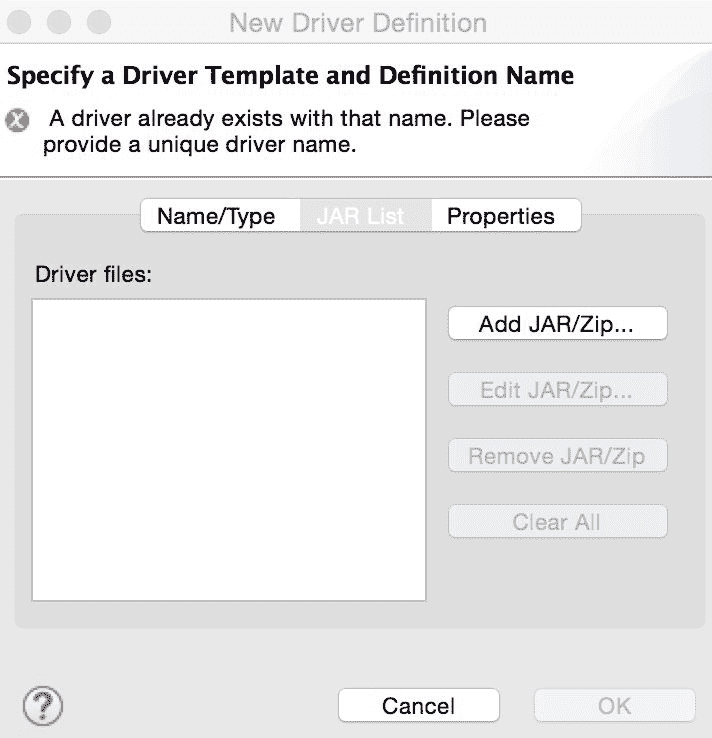

                        

                        从驱动程序文件列表中删除任何文件。点击“添加 JAR/ZIP...”按钮。这将打开文件打开对话框。选择您已选择的 MySQL 驱动程序的 JAR 文件。由于 Maven 已经为您下载了 JAR 文件，您可以从本地 Maven 仓库中选择它。在 OS X 和 Linux 上，路径是`~/.m2/repository/mysql/mysql-connector-java/<version_num>/mysql_connector_java_version_num/mysql-connector-java-version_num.jar`（`version_num`是路径中实际版本号的占位符）。在 Windows 上，您可以在`C:\Users\{your-username}\.m2`找到 Maven 仓库，然后 MySQL 驱动程序的相对路径与 OS X 上的相同。

                        如果你在本地 Maven 仓库中找不到 JAR 文件，你可以从 [`dev.mysql.com/downloads/connector/j/`](http://dev.mysql.com/downloads/connector/j/) 下载 JAR 文件（MySQL JDBC 驱动程序）。

                        一旦指定了正确的驱动程序 JAR 文件，你需要设置以下属性：

                        

                        图 4.16：设置 JDBC 驱动程序属性

                        点击“下一步”然后“完成”。将在数据源资源管理器中添加一个新的数据库连接。你现在可以浏览数据库模式和表：

                        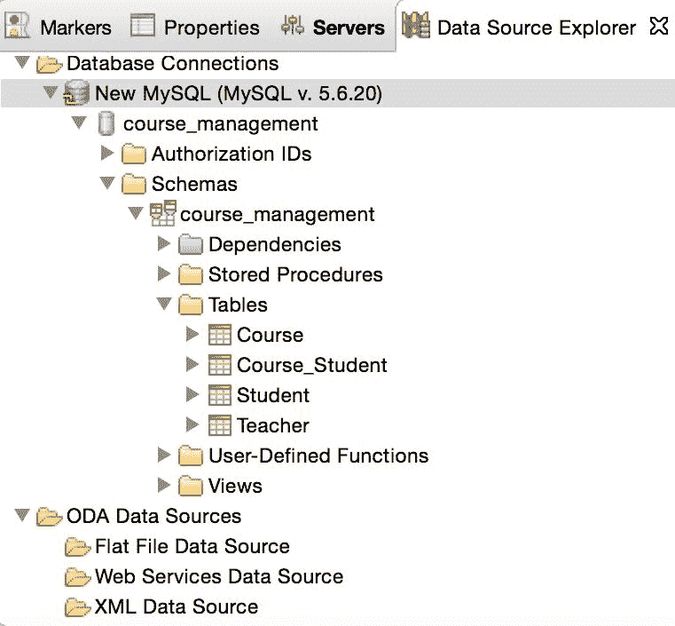

                        图 4.17：在数据源资源管理器中浏览表

                        右键单击任何表以查看不同操作可用的菜单选项：

                        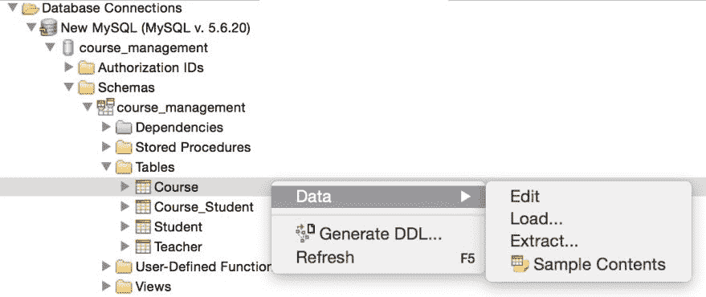

                        图 4.18：数据源资源管理器中的表菜单选项

                        选择“编辑”菜单以在编辑器中打开一个页面，你可以看到表中现有的记录。你还可以在同一页面上修改或添加新数据。选择“加载”选项将数据从外部文件加载到表中。选择“提取”选项将数据从表中导出。

                        # 使用 JPA 创建数据库应用程序

                        在上一节中，我们学习了如何使用 JDBC 和 JSTL 创建 *课程管理* 应用程序。在本节中，我们将使用 JPA 和 JSF 构建相同的应用程序。我们在 第二章，*创建一个简单的 JEE Web 应用程序* 中学习了如何使用 JSF 创建一个 Web 应用程序。我们将在本节中大量使用这些知识。

                        如本章开头所述，JPA 是一个 ORM 框架，现在是 JEE 规范的一部分。在撰写本文时，它处于 2.2 版本。随着我们开发应用程序，我们将学习很多关于 JPA 的知识。

                        创建一个名为 `CourseManagementJPA` 的 Maven 项目，其组 ID 为 `packt.book.jee_eclipse`，组件 ID 为 `CourseManagementJPA`。Eclipse JEE 有创建使用 JPA 的应用程序的强大工具，但你需要将你的项目转换为 JPA 项目。我们将在本节后面看到如何做到这一点。

                        # 使用 JSF 创建添加课程的用户界面

                        在我们使用 JPA 编写任何数据访问代码之前，让我们首先使用 JSF 创建用户界面。正如我们在 第二章，*创建一个简单的 JEE Web 应用程序* 中所学的，我们需要在 `pom.xml` 中添加 Maven 依赖项以支持 JSF。在 `pom.xml` 中添加以下依赖项：

                        ```java
                          <dependencies> 
                            <dependency> 
                              <groupId>javax.servlet</groupId> 
                              <artifactId>javax.servlet-api</artifactId> 
                              <version>3.1.0</version> 
                              <scope>provided</scope> 
                            </dependency> 
                            <dependency> 
                              <groupId>com.sun.faces</groupId> 
                              <artifactId>jsf-api</artifactId> 
                              <version>2.2.16</version> 
                            </dependency> 
                            <dependency> 
                              <groupId>com.sun.faces</groupId> 
                              <artifactId>jsf-impl</artifactId> 
                              <version>2.2.16</version> 
                            </dependency> 
                          </dependencies> 
                        ```

                        当您稍后运行应用程序时，如果 Tomcat 抛出找不到 `javax.faces.webapp.FacesServlet` 的异常，那么您可能需要下载 `jsf-api-2.2.16.jar` ([`central.maven.org/maven2/com/sun/faces/jsf-impl/2.2.16/jsf-impl-2.2.16.jar`](http://central.maven.org/maven2/com/sun/faces/jsf-api/2.2.16/jsf-api-2.2.16.jar)) 和 `jsf-impl-2.2.16.jar` ([`central.maven.org/maven2/com/sun/faces/jsf-impl/2.2.16/jsf-impl-2.2.16.jar`](http://central.maven.org/maven2/com/sun/faces/jsf-impl/2.2.16/jsf-impl-2.2.16.jar))，并将它们复制到 `<tomcat-install-folder>/lib` 文件夹中。将这些库的作用域设置为提供：在 `pom.xml` 中设置为 `<scope>provided</scope>`。然后清理项目（运行 As | Maven Clean）并重新安装（运行 As | Maven Install）。

                        我们需要添加 `web.xml`，在其中添加对 JSF Servlet 的声明，并添加 Servlet 映射。Eclipse 提供了一种非常简单的方法来添加 `web.xml`（它应该位于 `WEB-INF` 文件夹中）。在项目上右键单击，选择 Java EE Tools | Generate Deployment Descriptor Stub 菜单。这将在 `src/main/webapp` 下的 `WEB-INF` 文件夹中创建 `WEB-INF` 文件夹，并在 `WEB-INF` 文件夹中创建具有默认内容的 `web.xml`。现在，添加以下 Servlet 和映射：

                        ```java
                          <servlet> 
                            <servlet-name>JSFServlet</servlet-name> 
                            <servlet-class>javax.faces.webapp.FacesServlet</servlet-class> 
                            <load-on-startup>1</load-on-startup> 
                          </servlet> 
                          <servlet-mapping> 
                            <servlet-name>JSFServlet</servlet-name> 
                            <url-pattern>*.xhtml</url-pattern> 
                          </servlet-mapping> 
                        ```

                        现在，让我们创建 `Course`、`Teacher`、`Student` 和 `Person` 的 JavaBeans，就像我们在上一个例子中为 JDBC 创建它们一样。创建一个名为 `packt.book.jee.eclipse.ch4.jpa.bean` 的包，并创建以下 JavaBeans。

                        这是 `Course` Bean 的源代码（在 `Course.java` 中）：

                        ```java
                        package packt.book.jee.eclipse.ch4.jpa.bean; 

                        import java.io.Serializable; 
                        import javax.faces.bean.ManagedBean; 
                        import javax.faces.bean.RequestScoped; 

                        @ManagedBean (name="course") 
                        @RequestScoped 
                        public class Course implements Serializable { 
                          private static final long serialVersionUID = 1L; 

                          private int id; 
                          private String name; 
                          private int credits; 
                          private Teacher teacher; 

                          public int getId() { 
                            return id; 
                          } 
                          public void setId(int id) { 
                            this.id = id; 
                          } 
                          public String getName() { 
                            return name; 
                          } 
                          public void setName(String name) { 
                            this.name = name; 
                          } 
                          public int getCredits() { 
                            return credits; 
                          } 
                          public void setCredits(int credits) { 
                            this.credits = credits; 
                          } 
                          public boolean isValidCourse() { 
                            return name != null && credits != 0; 
                          } 
                          public Teacher getTeacher() { 
                            return teacher; 
                          } 
                          public void setTeacher(Teacher teacher) { 
                            this.teacher = teacher; 
                          } 
                        } 
                        ```

                        这是 `Person` Bean 的源代码（在 `Person.java` 中）：

                        ```java
                        package packt.book.jee.eclipse.ch4.jpa.bean; 

                        import java.io.Serializable; 

                        public class Person implements Serializable{ 
                          private static final long serialVersionUID = 1L; 

                          private int id; 
                          private String firstName; 
                          private String lastName; 

                          public int getId() { 
                            return id; 
                          } 
                          public void setId(int id) { 
                            this.id = id; 
                          } 
                          public String getFirstName() { 
                            return firstName; 
                          } 
                          public void setFirstName(String firstName) { 
                            this.firstName = firstName; 
                          } 
                          public String getLastName() { 
                            return lastName; 
                          } 
                          public void setLastName(String lastName) { 
                            this.lastName = lastName; 
                          } 
                        } 
                        ```

                        这是 `Student` Bean 的源代码（在 `Student.java` 中）：

                        ```java
                        package packt.book.jee.eclipse.ch4.jpa.bean; 

                        import javax.faces.bean.ManagedBean; 
                        import javax.faces.bean.RequestScoped; 
                        import java.util.Date; 

                        @ManagedBean (name="student") 
                        @RequestScoped 
                        public class Student extends Person { 
                          private static final long serialVersionUID = 1L; 

                          private Date enrolledsince; 

                          public Date getEnrolledsince() { 
                            return enrolledsince; 
                          } 

                          public void setEnrolledsince(Date enrolledsince) { 
                            this.enrolledsince = enrolledsince; 
                          } 
                        } 
                        ```

                        最后，以下是 `Teacher` Bean 的源代码（在 `Teacher.java` 中）：

                        ```java
                        package packt.book.jee.eclipse.ch4.jpa.bean; 

                        import javax.faces.bean.ManagedBean; 
                        import javax.faces.bean.RequestScoped; 

                        @ManagedBean (name="teacher") 
                        @RequestScoped 
                        public class Teacher extends Person { 
                          private static final long serialVersionUID = 1L; 

                          private String designation; 

                          public String getDesignation() { 
                            return designation; 
                          } 

                          public void setDesignation(String designation) { 
                            this.designation = designation; 
                          } 
                          public boolean isValidTeacher() { 
                            return getFirstName() != null; 
                          } 
                        } 
                        ```

                        所有这些都是 `RequestScope` 中的 JSF 管理 Bean。有关管理 Bean 和作用域的更多信息，请参阅第二章中的 JSF 讨论内容，*创建一个简单的 JEE Web 应用程序*。

                        这些豆子现在可以用于 JSF 页面。创建一个 JSF 页面，并将其命名为 `addCourse.xhtml`，然后添加以下内容：

                        ```java
                        <html  

                            > 

                          <h2>Add Course:</h2> 
                          <h:form> 
                            <h:outputLabel value="Name:" for="name"/> 
                              <h:inputText value="#{course.name}" id="name"/> <br/> 
                            <h:outputLabel value="Credits:" for="credits"/> 
                              <h:inputText value="#{course.credits}" id="credits"/> 
                            <br/> 
                            <h:commandButton value="Add" action=" 
                             #{courseServiceBean.addCourse} "/> 
                          </h:form> 

                        </html> 
                        ```

                        该页面使用 JSF 标签和管理 Bean 来获取和设置值。注意 `h:commandButton` 标签的 `action` 属性值——它是 `courseServiceBean.addCourse` 方法，当点击添加按钮时将被调用。在我们使用 JDBC 创建的应用程序中，我们编写了与 JavaBean 中的 DAO 交互的代码。例如，`Course` Bean 有 `addCourse` 方法。然而，在 JPA 项目中，我们将以不同的方式处理。我们将创建服务 Bean 类（它们也是管理 Bean，就像 `Course` 一样）来与数据访问对象交互，并让 `Course` Bean 只包含用户设置的值。

                        创建一个名为 `packt.book.jee.eclipse.ch4.jpa.service_bean` 的包。在这个包中创建一个名为 `CourseServiceBean` 的类，其代码如下：

                        ```java
                        package packt.book.jee.eclipse.ch4.jpa.service_bean; 

                        import javax.faces.bean.ManagedBean; 
                        import javax.faces.bean.ManagedProperty; 
                        import javax.faces.bean.RequestScoped; 

                        import packt.book.jee.eclipse.ch4.jpa.bean.Course; 

                        @ManagedBean(name="courseServiceBean") 
                        @RequestScoped 
                        public class CourseServiceBean { 
                          @ManagedProperty(value="#{course}") 
                          private Course course; 

                          private String errMsg= null; 

                          public Course getCourse() { 
                            return course; 
                          } 

                          public void setCourse(Course course) { 
                            this.course = course; 
                          } 

                          public String getErrMsg() { 
                            return errMsg; 
                          } 

                          public void setErrMsg(String errMsg) { 
                            this.errMsg = errMsg; 
                          } 

                          public String addCourse() { 
                            return "listCourse"; 
                          } 
                        } 
                        ```

                        `CourseServiceBean` 是一个托管豆，它包含 `errMsg` 字段（用于存储在请求处理过程中的任何错误消息）、`addCourse` 方法以及 `course` 字段（该字段注解了 `@ManagedProperty`）。

                        `ManagedProperty` 注解告诉 JSF 实现将另一个豆（指定为 `value` 属性）注入当前豆中。在这里，我们期望 `CourseServiceBean` 在运行时能够访问 `course` 豆，而不需要实例化它。这是 Java EE 支持的 **依赖注入（DI**） 框架的一部分。我们将在后面的章节中了解更多关于 Java EE 中的 DI 框架的内容。在这一点上，`addCourse` 函数并没有做什么，它只是返回了 `"listCourse"` 字符串。如果你现在想执行 `addCourse.xhtml`，创建一个包含一些占位符内容的 `listCourse.xml` 文件并测试 `addCourse.xhtml`。我们将在本节的后面添加更多内容到 `listCourse.xml`。

                        # JPA 概念

                        JPA 是 JEE 中的一个 ORM 框架。它提供了一组 API，JPA 实现提供者预期将实现这些 API。有许多 JPA 提供者，例如 **EclipseLink** ([`eclipse.org/eclipselink/`](https://eclipse.org/eclipselink/))、**Hibernate JPA** ([`hibernate.org/orm/`](http://hibernate.org/orm/)) 和 **OpenJPA** ([`openjpa.apache.org/`](http://openjpa.apache.org/))。在我们开始使用 JPA 编写持久化代码之前，了解 JPA 的基本概念是很重要的。

                        # 实体

                        实体代表一个单个对象实例，通常与一个表相关联。任何 **纯 Java 对象（POJO**）都可以通过在类上注解 `@Entity` 转换为实体。类的成员映射到数据库表中的列。实体类是简单的 Java 类，因此它们可以扩展或包含其他 Java 类，甚至另一个 JPA 实体。我们将在我们的应用程序中看到这个例子。您还可以为实体类的成员指定验证规则；例如，您可以使用 `@NotNull` 注解标记一个成员为非空。这些注解由 Java EE Bean Validation API 提供。有关验证注解的列表，请参阅 [`javaee.github.io/tutorial/bean-validation002.html#GIRCZ`](https://javaee.github.io/tutorial/bean-validation002.html#GIRCZ)。

                        # 管理实体管理器

                        `EntityManager`提供了实体存在的持久化上下文。持久化上下文还允许您管理事务。使用`EntityManager` API，您可以在实体上执行查询和写操作。实体管理器可以是 Web 容器管理的（在这种情况下，`EntityManager`的实例由容器注入），或者应用程序管理的。在本章中，我们将探讨应用程序管理的实体管理器。当学习 EJB 时，我们将在第七章“使用 EJB 创建 JEE 应用程序”中访问容器管理的实体管理器。实体管理器的持久化单元定义了数据库连接信息并将实体分组为持久化单元的一部分。它在名为`persistence.xml`的配置文件中定义，并期望在类路径中的`META-INF`中。

                        `EntityManager`有自己的持久化上下文，这是一个实体缓存。实体的更新首先在缓存中完成，然后在事务提交或数据被显式推送到数据库时推送到数据库。

                        当应用程序管理`EntityManager`时，建议为持久化单元只有一个`EntityManager`实例。

                        # EntityManagerFactory

                        `EntityManagerFactory`创建`EntityManager`。`EntityManagerFactory`本身是通过调用静态的`Persistence.createEntityManagerFactory`方法获得的。这个函数的参数是一个在`persistence.xml`中指定的`persistence-unit`名称。

                        # 创建 JPA 应用程序

                        创建 JPA 应用程序的典型步骤如下：

                        1.  创建数据库模式（表和关系）。可选地，您可以从 JPA 实体创建表和关系。我们将看到这个示例。然而，应该在这里提到，虽然从 JPA 实体创建表对于开发来说是可以的，但在生产环境中并不推荐这样做；这样做可能会导致非优化的数据库模型。

                        1.  创建`persistence.xml`并指定数据库配置。

                        1.  创建实体和关系。

                        1.  通过调用`Persistence.createEntityManagerFactory`来获取`EntityManagerFactory`的实例。

                        1.  从`EntityManagerFactory`创建`EntityManager`的实例。

                        1.  如果您在实体上执行`insert`或`update`操作，请在`EntityManager`上启动事务。

                        1.  对实体执行操作。

                        1.  提交事务。

                        这里有一个示例片段：

                        ```java
                        EntityManagerFactory factory = 
                         Persistance.Persistence.createEntityManagerFactory("course_management") 
                        EntityManager entityManager = factory.createEntityManager(); 
                        EntityTransaction txn = entityManager.getTransaction(); 
                        txn.begin(); 
                        entityManager. persist(course); 
                        txn.commit(); 
                        ```

                        您可以在[`www.eclipse.org/eclipselink/documentation/2.7/jpa/extensions/annotations_ref.htm`](http://www.eclipse.org/eclipselink/documentation/2.7/jpa/extensions/annotations_ref.htm)找到 JPA 注解的描述。

                        在 Eclipse EE 中的 JPA 工具使得添加许多注解变得非常容易，正如我们将在本节中看到的。

                        # 创建新的 MySQL 模式

                        对于此示例，我们将创建一个单独的 MySQL 模式（我们不会使用为 JDBC 应用程序创建的相同模式，尽管这样做是可能的）。打开 MySQL Workbench 并连接到您的 MySQL 数据库（如果您不知道如何从 MySQL Workbench 连接到 MySQL 数据库，请参阅第一章介绍 JEE 和 Eclipse）。

                        在模式窗口中右键单击并选择创建模式...：

                        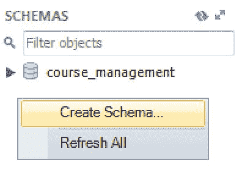

                        图 4.19：创建新的 MySQL 模式

                        将新模式命名为 `course_management_jpa` 并点击应用。我们将使用此模式进行 JPA 应用程序。

                        # 设置 JPA 的 Maven 依赖项

                        在此示例中，我们将使用 EclipseLink ([`eclipse.org/eclipselink/`](https://eclipse.org/eclipselink/)) JPA 实现。我们将使用 MySQL JDBC 驱动程序和 Bean 验证框架来验证实体的成员。最后，我们将使用由 JSR0250 提供的 Java 注解。因此，让我们为所有这些添加 Maven 依赖项：

                        ```java
                              <dependency> 
                                <groupId>org.eclipse.persistence</groupId> 
                                <artifactId>eclipselink</artifactId> 
                                <version>2.5.2</version> 
                              </dependency> 
                              <dependency> 
                                <groupId>mysql</groupId> 
                                <artifactId>mysql-connector-java</artifactId> 
                                <version>5.1.34</version> 
                              </dependency> 
                              <dependency> 
                                <groupId>javax.validation</groupId> 
                                <artifactId>validation-api</artifactId> 
                                <version>1.1.0.Final</version> 
                              </dependency> 
                              <dependency> 
                                <groupId>javax.annotation</groupId> 
                                <artifactId>jsr250-api</artifactId> 
                                <version>1.0</version> 
                              </dependency> 
                        ```

                        # 将项目转换为 JPA 项目

                        许多 JPA 工具仅在项目是 JPA 项目时才在 Eclipse JEE 中激活。尽管我们创建了一个 Maven 项目，但很容易向其中添加 Eclipse JPA 特性：

                        1.  右键单击项目并选择配置 | 转换为 JPA 项目！[](img/00112.jpeg)

                        图 4.20：向项目添加 JPA 特性

                        1.  确保已选择 JPA。

                        1.  在下一页上，选择 EclipseLink 2.5.x 作为平台。

                        1.  对于 JPA 实现类型，选择禁用库配置。

                        1.  连接下拉列表列出了在数据源资源管理器中配置的所有连接。目前，请不要选择任何连接。在页面底部，选择自动发现注解类选项！[](img/00113.jpeg)

                        图 4.21：配置 JPA 特性

                        1.  点击完成。

                        1.  注意，JPA 内容组是在项目下创建的，`persistence.xml` 也创建在其中。在编辑器中打开 `persistence.xml`。

                        1.  点击“连接”选项卡并将事务类型更改为资源本地。我们选择资源本地是因为，在本章中，我们将管理 `EntityManager`。如果您想让 JEE 容器管理 `EntityManager`，则应将事务类型设置为 JTA。我们将在第七章创建 JEE 应用程序与 EJB 中看到一个 JTA 事务类型的示例。

                        1.  按照以下截图输入 EclipseLink 连接池属性并保存文件！[](img/00114.jpeg)

                        图 4.22：设置持久化单元连接

                        1.  接下来，点击“模式生成”选项卡。在这里，我们将设置从实体生成数据库表和关系的选项。选择以下截图所示的选项！[](img/00115.jpeg)

                        图 4.23：设置持久化单元的模式生成选项

                        在设置前面的选项后，以下是 `persistence.xml` 文件的内容：

                        ```java
                        <?xml version="1.0" encoding="UTF-8"?> 
                        <persistence version="2.1"   xsi:schemaLocation="http://xmlns.jcp.org/xml/ns/persistence http://xmlns.jcp.org/xml/ns/persistence/persistence_2_1.xsd"> 
                          <persistence-unit name="CourseManagementJPA" transaction-type="RESOURCE_LOCAL"> 
                            <properties> 
                              <property name="javax.persistence.jdbc.driver" 
                               value="com.mysql.jdbc.Driver"/>      <property name="javax.persistence.jdbc.url" 
                               value="jdbc:mysql://localhost/course_management_jpa"/> 
                              <property name="javax.persistence.jdbc.user" value="root"/> 
                              <property name="javax.persistence.schema- 
                               generation.database.action" value="create"/>      <property name="javax.persistence.schema- 
                               generation.scripts.action" value="create"/> 
                        <property name="eclipselink.ddl-generation" value="create- tables"/> 
                              <property name="eclipselink.ddl-generation.output-mode" value="both"/> 
                            </properties> 
                          </persistence-unit> 
                        </persistence> 
                        ```

                        # 创建实体

                        我们已经为`Course`、`Person`、`Student`和`Teacher`创建了 JavaBeans。现在，我们将使用`@Entity`注解将它们转换为 JPA 实体。打开`Course.java`并添加以下注解：

                        ```java
                        @ManagedBean (name="course") 
                        @RequestScoped 
                        @Entity 
                        public class Course implements Serializable 
                        ```

                        同一个 Bean 可以同时作为 JSF 的管理 Bean 和 JPA 的实体。请注意，如果类的名称与数据库中的表名不同，你需要指定`@Entity`注解的`name`属性。例如，如果我们的`Course`表被命名为`SchoolCourse`，那么实体声明将如下所示：

                        ```java
                        @Entity(name="SchoolCourse") 
                        ```

                        要指定`Entity`的主键，使用`@Id`注解。在`Course`表中，`id`是主键，并且是自动生成的。为了指示值的自动生成，使用`@GeneratedValue`注解。使用`@Column`注解来指示成员变量对应于表中的列。因此，`id`的注解如下所示：

                        ```java
                        @Id 
                        @GeneratedValue(strategy=GenerationType.IDENTITY) 
                        @Column(name="id") 
                        private int id; 
                        ```

                        你可以使用前面提到的 Bean Validation 框架注解为列指定验证。例如，课程名称不应为空：

                        ```java
                        @NotNull 
                        @Column(name="name") 
                        private String name; 
                        ```

                        此外，学分的最低值应为`1`：

                        ```java
                        @Min(1) 
                        @Column(name="credits") 
                        private int credits;
                        ```

                        在前面的示例中，如果字段名与列名相同，则不需要`@Column`注解来指定列名。

                        如果你使用 JPA 实体来创建表并希望精确指定列的类型，那么你可以使用`@Column`注解的`columnDefinition`属性；例如，为了指定类型为`varchar`且长度为`20`的列，你可以使用`@Column(columnDefinition="VARCHAR(20)")`。

                        请参考[`javaee.github.io/javaee-spec/javadocs/javax/persistence/Column.html`](https://javaee.github.io/javaee-spec/javadocs/javax/persistence/Column.html)以查看`@Column`注解的所有属性。

                        我们将在需要时向`Course Entity`添加更多注解。现在，让我们将注意力转向`Person`类。这个类是`Student`和`Teacher`类的父类。然而，在数据库中，没有`Person`表，`Person`和`Student`的所有字段都在`Student`表中；对于`Teacher`表也是如此。那么，我们如何在 JPA 中建模这种情况？JPA 支持实体的继承，并提供控制它们如何映射到数据库表的方式。打开`Person`类并添加以下注解：

                        ```java
                        @Entity 
                        @Inheritance(strategy=TABLE_PER_CLASS) 
                        public abstract class Person implements Serializable { ... 
                        ```

                        我们不仅将`Person`类标识为`Entity`，而且还表明它用于继承（使用`@Inheritance`）。继承策略决定了如何将表映射到类。有三种可能的策略：

                        +   `SINGLE_TABLE`：在这种情况下，父类和子类的字段将被映射到父类的表中。如果我们使用这种策略，那么`Person`、`Student`和`Teacher`的字段将被映射到`Person`实体对应的表中。

                        +   `TABLE_PER_CLASS`：在这种情况下，每个具体类（非抽象类）映射到数据库中的一个表。父类的所有字段也映射到子类的表中。例如，`Person`和`Student`的所有字段都将映射到`Student`表的列中。由于`Person`被标记为抽象的，`Person`类不会映射任何表。它仅存在于为应用程序提供继承支持。

                        +   `JOINED`：在这种情况下，父级及其子级映射到单独的表。例如，`Person`将映射到`Person`表，而`Student`和`Teacher`将映射到数据库中的相应表。

                        根据我们为 JDBC 应用程序创建的架构，我们有`Student`和`Teacher`表，包含所有必要的列，并且没有`Person`表。因此，我们在这里选择了`TABLE_PER_CLASS`策略。

                        在 JPA 中了解更多关于实体继承的信息，请访问[`javaee.github.io/tutorial/persistence-intro003.html#BNBQN`](https://javaee.github.io/tutorial/persistence-intro003.html#BNBQN)。

                        `Person`表中的`id`、`firstName`和`lastName`字段被`Student`和`Teacher`共享。因此，我们需要将它们标记为表中的列，并设置主键。所以，向`Person`类中的字段添加以下注解：

                        ```java
                          @Id 
                          @GeneratedValue(strategy=GenerationType.IDENTITY) 
                          @Column(name="id") 
                          private int id; 

                          @Column(name = "first_name") 
                          @NotNull 
                          private String firstName; 

                          @Column(name = "last_name") 
                          private String lastName; 
                        ```

                        在这里，表中的列名与类字段不匹配。因此，我们必须在`@Column`注解中指定名称属性。

                        现在将`Student`类标记为`Entity`：

                        ```java
                        @Entity 
                        @ManagedBean (name="student") 
                        @RequestScoped 
                        public class Student extends Person implements Serializable
                        ```

                        `Student`类有一个名为`enrolledSince`的`Date`字段，其类型为`java.util.Date`。然而，JDBC 和 JPA 使用的是`java.sql.Date`类型。如果您希望 JPA 自动将`java.sql.Date`转换为`java.util.Date`，则需要使用`@Temporal`注解标记该字段：

                        ```java
                        @Temporal(DATE) 
                        @Column(name="enrolled_since") 
                        private Date enrolledSince; 
                        ```

                        打开`Teacher`类，并向其添加`@Entity`注解：

                        ```java
                        @Entity 
                        @ManagedBean (name="teacher") 
                        @RequestScoped 
                        public class Teacher extends Person implements Serializable 
                        ```

                        然后，映射类中的`designation`字段：

                        ```java
                        @NotNull 
                        @Column(name="designation") 
                        private String designation; 
                        ```

                        我们现在已为所有不参与表关系的表和字段添加了注解。接下来，我们将建模我们类中表之间的关系。

                        # 配置实体关系

                        首先，我们将建模`Course`和`Teacher`之间的关系。它们之间存在一对一的关系：一位教师可以教授多门课程。在编辑器中打开`Course.java`。在 Eclipse JEE 中打开 JPA 视角（窗口 | 打开视角 | JPA 菜单）。

                        # 配置多对一关系

                        在编辑器中打开`Course.java`文件，点击下窗口中的 JPA Details 标签页（位于编辑器窗口下方）。在`Course.java`中，点击`teacher`成员变量。JPA Details 标签页会显示这个属性的详细信息：

                        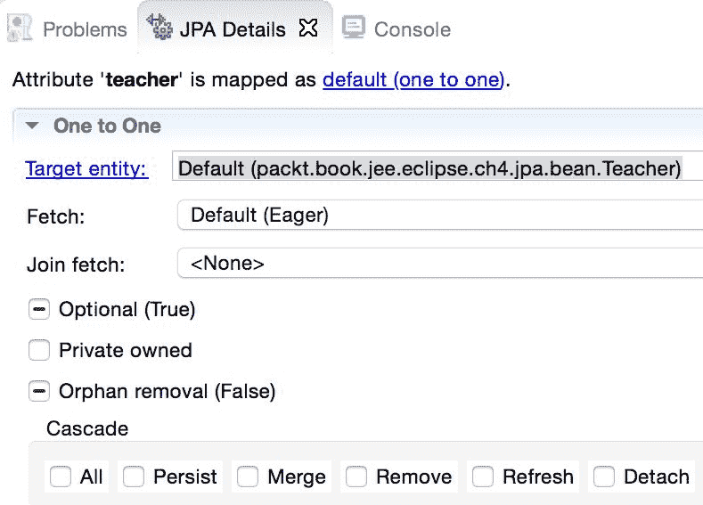

                        图 4.24：实体属性的 JPA 详情

                        目标实体自动选择（作为`Teacher`），因为我们已将`Teacher`标记为实体，且`teacher`字段的类型为`Teacher`。

                        然而，Eclipse 假设`Course`和`Teacher`之间存在一对一关系，这是不正确的。`Course`和`Teacher`之间存在多对一关系。要更改此设置，请点击 JPA 详情视图顶部的（一对一）超链接，并在映射类型选择对话框中选择多对一。

                        仅选择合并和刷新级联选项；否则，对于你为课程选择的每个`Teacher`，`Teacher`表将添加重复条目。

                        有关实体关系和级联选项的更多详细信息，请参阅[`javaee.github.io/tutorial/persistence-intro002.html#BNBQH`](https://javaee.github.io/tutorial/persistence-intro002.html#BNBQH)。

                        当你选择合并和刷新级联选项时，添加到注解中的`cascade`属性将被添加到`Course`实体的`teacher`字段中：

                        ```java
                          @ManyToOne(cascade = { MERGE, REFRESH }) 
                          private Teacher teacher; 
                        ```

                        滚动到 JPA 详情页面以查看连接策略。这决定了`Course`和`Teacher`表中的列如何连接：

                        

                        图 4.25：在实体关系图中编辑连接策略

                        注意，默认的连接策略是`Course`表中的`teacher_id`列映射到`Teacher`表中的`id`列。Eclipse 刚刚猜测了`teacher_id`（添加到`Course`实体中`teacher`字段的附加`id`），但如果我们在`Course`表中有一个不同的连接列，例如`teacherId`，那么我们就需要覆盖默认的连接列。点击覆盖默认选项复选框，然后点击文本框右侧的编辑按钮：

                        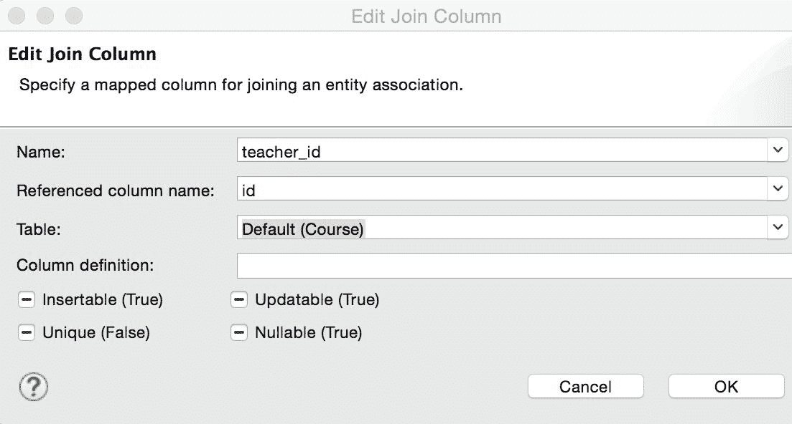

                        图 4.26：编辑连接列

                        在我们的案例中，默认选项与表列匹配，因此我们将保持不变。当你选择覆盖默认选项复选框时，`@JoinColumn`注解将被添加到`Course`实体的`teacher`字段中：

                        ```java
                          @JoinColumn(name = "teacher_id", referencedColumnName = "id") 
                          @ManyToOne(cascade = { MERGE, REFRESH }) 
                          private Teacher teacher; 
                        ```

                        现已为`teacher`字段添加所有必要的注释。

                        # 配置多对多关系

                        现在我们将配置`Course`和`Student`实体以实现多对多关系（一门课程可以有多个学员，一个学员可以选修多门课程）。

                        多对多关系可以是单向的或双向的。例如，你可能只想跟踪注册课程的学员（因此`Course`实体将有一个学员列表），而不跟踪选课的学员（`Student`实体不会保留课程列表）。这是一个单向关系，其中只有`Course`实体知道学员，但`Student`实体不知道课程）。

                        在双向关系中，每个实体都知道另一个实体。因此，`Course`实体将保留学员列表，而`Student`实体将保留课程列表。我们将在此示例中配置双向关系。

                        多对多关系也有一个拥有方和一个反向方。您可以在关系中的任何实体上标记为拥有实体。从配置的角度来看，反向方通过`mappedBy`属性标记为`@ManyToMany`注解。

                        在我们的应用程序中，我们将`Student`作为关系的拥有方，将`Course`作为反向方。数据库中的多对多关系需要一个连接表，该表通过`@JoinTable`注解在拥有实体中进行配置。

                        我们首先将在`Course`实体中配置一个多对多关系。在`Course`中添加一个成员变量以保存`Student`实体列表，并添加其 getter 和 setter：

                        ```java
                        private List<Student> students; 
                        public List<Student> getStudents() { 
                          return students; 
                        } 
                        public void setStudents(List<Student> students) { 
                          this.students = students; 
                        } 
                        ```

                        然后，点击之前添加的`students`字段，并注意 JPA Details 视图中的设置：

                        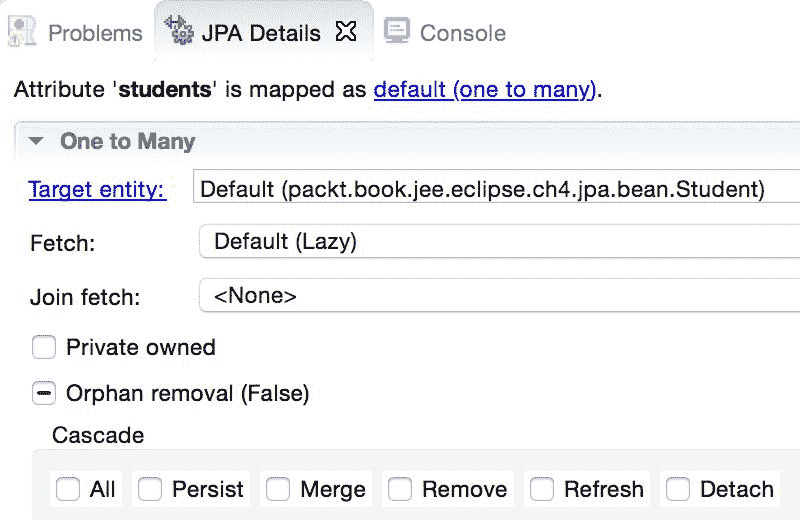

                        图 4.27：Course 实体中 students 字段的默认 JPA 详情

                        因为`students`字段是一个`Student`实体的列表，Eclipse 已经假设了一个一对一的关系（参见 JPA Details 视图顶部的链接）。我们需要更改这一点。点击`one_to_many`链接并选择多对多。

                        检查合并和刷新级联选项。由于我们在关系的反向侧放置了一个`Course`实体，请选择通过映射作为连接策略。在属性文本字段中输入`courses`。编译器将显示错误，因为我们还没有在`Student`实体中添加`courses`字段。我们将很快修复这个问题。`students`字段的 JPA 设置应如图所示：

                        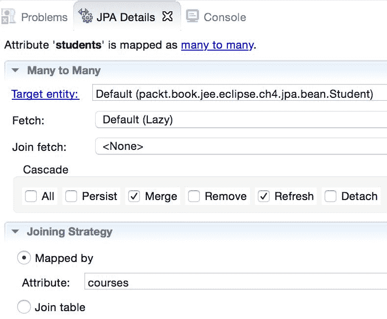

                        图 4.28：Course 实体中 students 字段的修改后的 JPA 设置

                        `Course`实体中`students`字段的注解应如下所示：

                        ```java
                        @ManyToMany(cascade = { MERGE, REFRESH }, mappedBy = "courses") 
                        private List<Student> students; 
                        ```

                        在编辑器中打开`Student.java`。添加`courses`字段及其 getter 和 setter。在文件中点击`courses`字段，并在 JPA Details 视图中将关系从一对一更改为多对多（如之前对`Course`实体中的`students`字段所描述）。选择合并和刷新级联选项。在连接策略部分，确保选择了连接表选项。Eclipse 通过连接拥有表和反向表，并用下划线分隔（在这种情况下为`Student_Course`）创建默认的连接表。将其更改为`Course_Student`以使其与为 JDBC 应用程序创建的模式保持一致。

                        在连接列部分，选择覆盖默认选项。Eclipse 已将连接列命名为`students_id->id`，但在我们在 JDBC 应用程序中创建的`Course_Student`表中，我们有一个名为`student_id`的列。因此，点击编辑按钮并将名称更改为`student_id`。

                        同样，将反向连接列从`courses_id->id`更改为`course_id->id`。在这些更改之后，`courses`字段的 JPA Details 应如图所示：

                        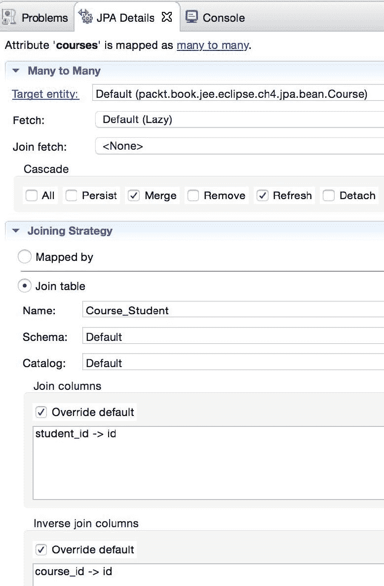

                        图 4.29：学生实体中 courses 字段的 JPA 详情

                        之前的设置为`courses`字段创建了以下注解：

                        ```java
                        @ManyToMany(cascade = { MERGE, REFRESH }) 
                        @JoinTable(name = "Course_Student", joinColumns = @JoinColumn(name = "student_id", referencedColumnName = "id"), inverseJoinColumns = 
                         @JoinColumn(name = "course_id", referencedColumnName = "id")) 

                        List<Course> courses; 
                        ```

                        我们已经设置了应用程序所需的所有实体关系。下载本章附带的代码，以查看`Course`、`Student`和`Teacher`实体的完整源代码。

                        我们需要在`persistence.xml`中添加我们之前创建的实体。打开文件，确保“常规”选项卡已打开。在“管理类”会话中，点击“添加”按钮。输入要添加的实体名称（例如，`Student`），并从列表中选择类。添加我们创建的所有四个实体：

                        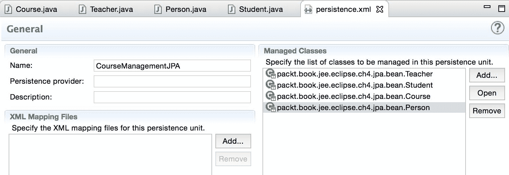

                        图 4.30：在 persistence.xml 中添加实体

                        # 从实体创建数据库表

                        按照以下步骤从我们已建模的实体和关系创建数据库表：

                        1.  右键单击项目，选择 JPA 工具 | 从实体生成表：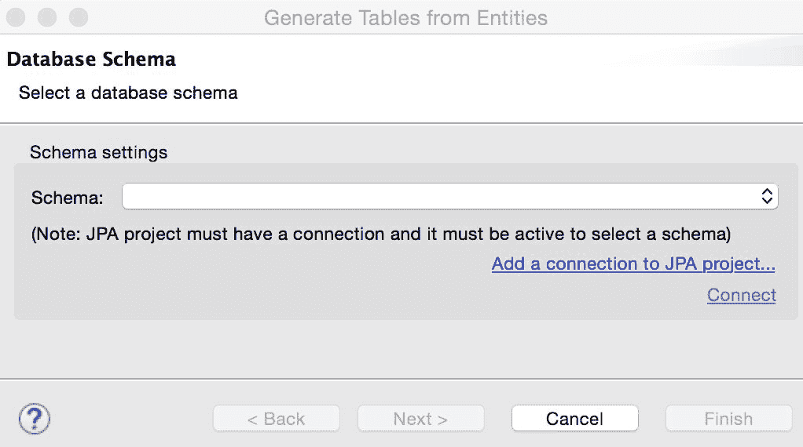

                        图 4.31：学生实体中 courses 字段的 JPA 详情

                        1.  由于我们没有为我们的 JPA 项目配置任何模式，因此“模式”下拉菜单将为空。点击“添加 JPA 项目连接”链接：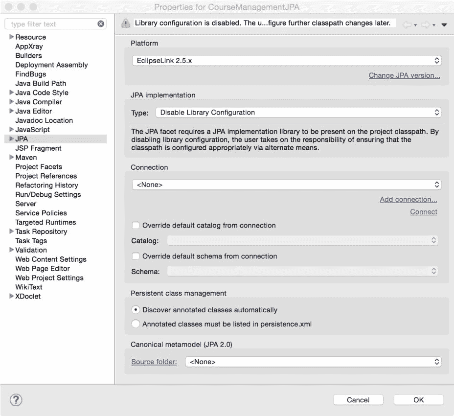

                        图 4.32：JPA 项目属性

                        1.  点击“添加连接”链接，创建到我们之前创建的`course_management_jpa`模式的连接。我们已经在本章的“使用 Eclipse 数据源资源管理器”部分中看到了如何创建到 MySQL 模式的连接。

                        1.  在图 4.31 所示的下拉列表中选择`course_management_jpa`，然后点击下一步：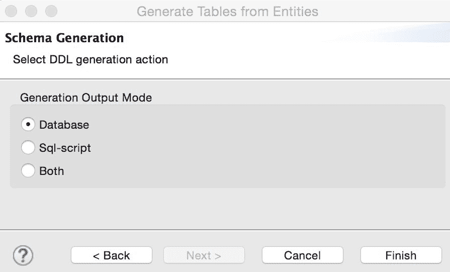

                        图 4.33：从实体生成模式

                        1.  点击完成。

                        Eclipse 生成创建表和关系的 DDL 脚本，并在所选模式中执行这些脚本。一旦脚本成功运行，打开数据源资源管理器视图（参见本章的“使用 Eclipse 数据源资源管理器”部分），在`course_management_jpa`连接中浏览表。确保表和字段是根据我们创建的实体创建的：

                        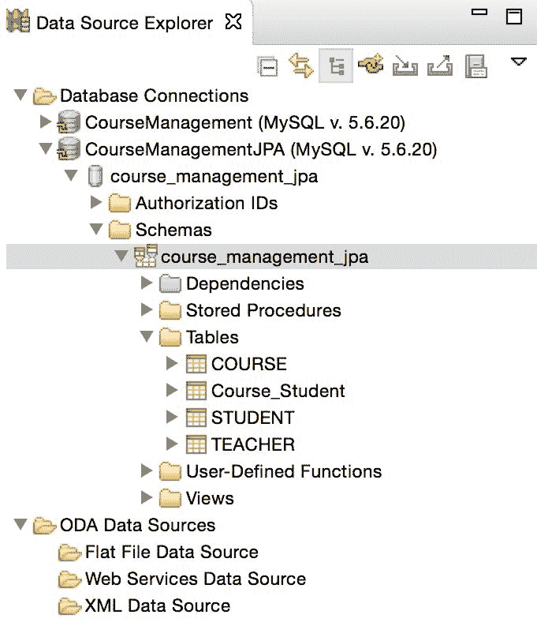

                        图 4.34：从 JPA 实体创建的表

                        Eclipse 和 JPA 的这个特性使得在修改实体时更新数据库变得非常容易。

                        # 使用 JPA API 管理数据

                        我们现在将创建使用 JPA API 来管理课程管理应用程序数据的类。我们将为`Course`、`Teacher`和`Student`实体创建服务类，并添加直接通过 JPA API 访问数据库的方法。

                        如同在 *JPA 概念* 部分所述，将 `EntityManagerFactory` 的实例缓存到我们的应用程序中是一个好的实践。此外，JSF 的托管 Bean 作为 UI 和后端代码之间的链接，以及 UI 和数据访问对象之间传输数据的通道。因此，它们必须有一个数据访问对象（使用 JPA 从数据库访问数据）的实例。为了缓存 `EntityManagerFactory` 的实例，我们将创建另一个托管 Bean，其唯一的工作是使 `EntityManagerFactory` 实例对其他托管 Bean 可用。

                        在 `packt.book.jee.eclipse.ch4.jpa.service_bean` 包中创建一个 `EntityManagerFactoryBean` 类。此包包含所有托管 Bean。`EntityManagerFactoryBean` 在构造函数中创建一个 `EntityManagerFactory` 实例并提供一个获取器方法：

                        ```java
                        package packt.book.jee.eclipse.ch4.jpa.service_bean; 

                        import javax.faces.bean.ApplicationScoped; 
                        import javax.faces.bean.ManagedBean; 
                        import javax.persistence.EntityManagerFactory; 
                        import javax.persistence.Persistence; 

                        //Load this bean eagerly, i.e., before any request is made 
                        @ManagedBean(name="emFactoryBean", eager=true) 
                        @ApplicationScoped 
                        public class EntityManagerFactoryBean { 

                          private EntityManagerFactory entityManagerFactory; 

                          public EntityManagerFactoryBean() { 
                            entityManagerFactory = 
                         Persistence.createEntityManagerFactory("CourseManagementJPA"); 
                          } 

                          public EntityManagerFactory getEntityManagerFactory() { 
                            return entityManagerFactory; 
                          } 

                        } 
                        ```

                        注意以下传递的参数：

                        ```java
                        entityManagerFactory = 
                         Persistence.createEntityManagerFactory("CourseManagementJPA");
                        ```

                        这是 `persistence.xml` 中持久化单元的名称。

                        现在让我们创建实际使用 JPA API 访问数据库表的服务类。

                        创建一个名为 `packt.book.jee.eclipse.ch4.jpa.service` 的包。创建一个名为 `CourseService` 的类。每个服务类都需要访问 `EntityManagerFactory`。因此，创建一个如下所示的私有成员变量：

                        ```java
                        private EntityManagerFactory factory; 
                        ```

                        构造函数接受一个 `EntityManagerFactoryBean` 实例，并从中获取 `EntityManagerFactory` 的引用：

                        ```java
                        public CourseService(EntityManagerFactoryBean factoryBean) { 
                          this.factory = factoryBean.getEntityManagerFactory(); 
                        } 
                        ```

                        现在让我们添加一个从数据库获取所有 `courses` 的函数：

                        ```java
                        public List<Course> getCourses() { 
                          EntityManager em = factory.createEntityManager(); 
                          CriteriaBuilder cb = em.getCriteriaBuilder(); 
                          CriteriaQuery<Course> cq = cb.createQuery(Course.class); 
                          TypedQuery<Course> tq = em.createQuery(cq); 
                          List<Course> courses = tq.getResultList(); 
                          em.close(); 
                          return courses; 
                        } 
                        ```

                        注意 `CriteriaBuilder`、`CriteriaQuery` 和 `TypesQuery` 如何用于获取所有课程。这是一种类型安全的查询执行方式。

                        有关如何使用 JPA 条件 API 的详细讨论，请参阅 [`javaee.github.io/tutorial/persistence-criteria.html#GJITV`](https://javaee.github.io/tutorial/persistence-criteria.html#GJITV)。

                        我们可以使用 **Java Persistence Query Language** (**JQL**)——[`www.oracle.com/technetwork/articles/vasiliev-jpql-087123.html`](http://www.oracle.com/technetwork/articles/vasiliev-jpql-087123.html)——来完成相同的事情，但它不是类型安全的。然而，这里有一个使用 JQL 编写 `getCourses` 函数的示例：

                        ```java
                        public List<Course> getCourses() { 
                          EntityManager em = factory.createEntityManager(); 
                          List<Course> courses = em.createQuery("select crs from Course crs").getResultList(); 
                          em.close(); 
                          return courses; 
                        } 
                        ```

                        添加一个将课程插入数据库的方法：

                        ```java
                        public void addCourse (Course course) { 
                          EntityManager em = factory.createEntityManager(); 
                          EntityTransaction txn = em.getTransaction(); 
                          txn.begin(); 
                          em.persist(course); 
                          txn.commit(); 
                        } 
                        ```

                        代码相当简单。我们获取实体管理器并开始一个事务，因为这是一个 `update` 操作。然后，我们通过传递一个 `Course` 实例来调用 `EntityManager` 上的 `persist` 方法以保存。然后，我们提交事务。更新和删除的方法也很简单。以下是 `CourseService` 的整个源代码：

                        ```java
                        package packt.book.jee.eclipse.ch4.jpa.service; 

                        // imports skipped

                        import packt.book.jee.eclipse.ch4.jpa.bean.Course; 
                        import packt.book.jee.eclipse.ch4.jpa.service_bean.EntityManagerFactoryBean; 

                        public class CourseService { 
                          private EntityManagerFactory factory; 

                          public CourseService(EntityManagerFactoryBean factoryBean) { 
                            factory = factoryBean.getEntityManagerFactory(); 
                          } 

                          public List<Course> getCourses() { 
                            EntityManager em = factory.createEntityManager(); 
                            CriteriaBuilder cb = em.getCriteriaBuilder(); 
                            CriteriaQuery<Course> cq = cb.createQuery(Course.class); 
                            TypedQuery<Course> tq = em.createQuery(cq); 
                            List<Course> courses = tq.getResultList(); 
                            em.close(); 
                            return courses; 
                          } 

                        public void addCourse (Course course) { 
                            EntityManager em = factory.createEntityManager(); 
                            EntityTransaction txn = em.getTransaction(); 
                            txn.begin(); 
                            em.persist(course); 
                            txn.commit(); 
                        } 

                          public void updateCourse (Course course) { 
                            EntityManager em = factory.createEntityManager(); 
                            EntityTransaction txn = em.getTransaction(); 
                            txn.begin(); 
                            em.merge(course); 
                            txn.commit(); 
                          } 

                          public Course getCourse (int id) { 
                            EntityManager em = factory.createEntityManager(); 
                            return em.find(Course.class, id); 
                          } 

                          public void deleteCourse (Course course) { 
                            EntityManager em = factory.createEntityManager(); 
                            EntityTransaction txn = em.getTransaction(); 
                            txn.begin(); 
                            Course mergedCourse = em.find(Course.class, course.getId()); 
                            em.remove(mergedCourse); 
                            txn.commit(); 
                          } 
                        } 
                        ```

                        现在让我们创建具有以下方法的 `StudentService` 和 `TeacherService` 类：

                        ```java
                        public class StudentService { 
                          private EntityManagerFactory factory; 

                          public StudentService (EntityManagerFactoryBean factoryBean) { 
                            factory = factoryBean.getEntityManagerFactory(); 
                          } 

                          public void addStudent (Student student) { 
                            EntityManager em = factory.createEntityManager(); 
                            EntityTransaction txn = em.getTransaction(); 
                            txn.begin(); 
                            em.persist(student); 
                            txn.commit(); 
                          } 

                          public List<Student> getStudents() { 
                            EntityManager em = factory.createEntityManager(); 
                            CriteriaBuilder cb = em.getCriteriaBuilder(); 
                            CriteriaQuery<Student> cq = cb.createQuery(Student.class); 
                            TypedQuery<Student> tq = em.createQuery(cq); 
                            List<Student> students = tq.getResultList(); 
                            em.close(); 
                            return students; 
                          } 

                        } 

                        public class TeacherService { 
                          private EntityManagerFactory factory; 

                          public TeacherService (EntityManagerFactoryBean factoryBean) { 
                            factory = factoryBean.getEntityManagerFactory(); 
                          } 

                          public void addTeacher (Teacher teacher) { 
                            EntityManager em = factory.createEntityManager(); 
                            EntityTransaction txn = em.getTransaction(); 
                            txn.begin(); 
                            em.persist(teacher); 
                            txn.commit(); 
                          } 

                          public List<Teacher> getTeacher() { 
                            EntityManager em = factory.createEntityManager(); 
                            CriteriaBuilder cb = em.getCriteriaBuilder(); 
                            CriteriaQuery<Teacher> cq = cb.createQuery(Teacher.class); 
                            TypedQuery<Teacher> tq = em.createQuery(cq); 
                            List<Teacher> teachers = tq.getResultList(); 
                            em.close(); 
                            return teachers; 
                          } 

                          public Teacher getTeacher (int id) { 
                            EntityManager em = factory.createEntityManager(); 
                            return em.find(Teacher.class, id); 
                          } 
                        } 
                        ```

                        # 将用户界面与 JPA 服务类连接

                        现在我们已经准备好了所有数据访问类，我们需要将我们为添加课程创建的用户界面 `addCourse.xhtml` 连接到 JPA 服务类，以便传递数据和从 JPA 服务类获取数据。如前所述，我们将使用托管 Bean 来完成这项工作，在这种情况下，`CourseServiceBean`。

                        `CourseServiceBean`需要创建`CourseService`的一个实例并调用`addCourse`方法。打开`CourseServiceBean`并创建如下成员变量：

                        ```java
                        private CourseService courseService ; 
                        ```

                        我们还需要我们之前创建的`EntityManagerFactoryBean`托管 Bean 的一个实例：

                        ```java
                        @ManagedProperty(value="#{emFactoryBean}") 
                        private EntityManagerFactoryBean factoryBean; 
                        ```

                        `factoryBean`实例由 JSF 运行时注入，并且只有在托管 Bean 完全构建之后才可用。然而，为了使此 Bean 能够注入，我们需要提供一个 setter 方法。因此，为`factoryBean`添加一个 setter 方法。我们可以通过在方法上注解`@PostConstruct`来让 JSF 在 Bean 完全构建后调用我们的 Bean 的方法。所以，让我们创建一个名为`postConstruct`的方法：

                        ```java
                        @PostConstruct 
                        public void init() { 
                          courseService = new CourseService(factoryBean); 
                        } 
                        ```

                        然后，修改`addCourse`方法以调用我们的服务方法：

                        ```java
                        public String addCourse() { 
                          courseService.addCourse(course); 
                          return "listCourse"; 
                        } 
                        ```

                        由于`listCourse.xhtml`页面需要获取课程列表，因此我们也在`CourseServiceBean`中添加了`getCourses`方法：

                        ```java
                        public List<Course> getCourses() { 
                          return courseService.getCourses(); 
                        } 
                        ```

                        在前面的更改之后，这是`CourseServiceBean`的代码：

                        ```java
                        @ManagedBean(name="courseServiceBean") 
                        @RequestScoped 
                        public class CourseServiceBean { 

                          private CourseService courseService ; 

                          @ManagedProperty(value="#{emFactoryBean}") 
                          private EntityManagerFactoryBean factoryBean; 

                          @ManagedProperty(value="#{course}") 
                          private Course course; 

                          private String errMsg= null; 

                          @PostConstruct 
                          public void init() { 
                            courseService = new CourseService(factoryBean); 
                          } 

                          public void setFactoryBean(EntityManagerFactoryBean factoryBean) 
                           { 
                            this.factoryBean = factoryBean; 
                          } 

                          public Course getCourse() { 
                            return course; 
                          } 

                          public void setCourse(Course course) { 
                            this.course = course; 
                          } 

                          public String getErrMsg() { 
                            return errMsg; 
                          } 

                          public void setErrMsg(String errMsg) { 
                            this.errMsg = errMsg; 
                          } 

                          public String addCourse() { 
                            courseService.addCourse(course); 
                            return "listCourse"; 
                          } 

                          public List<Course> getCourses() { 
                            return courseService.getCourses(); 
                          } 

                        } 
                        ```

                        最后，我们将编写在`listCourse.xhtml`中显示课程列表的代码：

                        ```java
                        <html  

                            > 

                            <h2>Courses:</h2> 
                            <h:form> 
                              <h:messages style="color:red"/> 
                            <h:dataTable value="#{courseServiceBean.courses}" 
                             var="course"> 
                              <h:column> 
                                <f:facet name="header">ID</f:facet> 
                                <h:outputText value="#{course.id}"/> 
                              </h:column> 
                              <h:column> 
                                <f:facet name="header">Name</f:facet> 
                                <h:outputText value="#{course.name}"/> 
                              </h:column> 
                              <h:column> 
                                <f:facet name="header">Credits</f:facet> 
                                <h:outputText value="#{course.credits}" 
                                 style="float:right" /> 
                              </h:column> 
                            </h:dataTable> 
                          </h:form> 

                          <h:panelGroup rendered="#{courseServiceBean.courses.size() == 
                           0}"> 
                            <h3>No courses found</h3> 
                          </h:panelGroup> 

                          <c:if test="#{courseServiceBean.courses.size() > 0}"> 
                            <b>Total number of courses 
                              <h:outputText value="#{courseServiceBean.courses.size()}"/> 
                            </b> 
                          </c:if> 
                          <p/> 
                          <h:button value="Add" outcome="addCourse"/> 
                        </html> 
                        ```

                        由于空间限制，我们不会讨论如何添加删除/更新课程的功能，或者如何创建带有`Teacher`字段选中的课程。请下载本章讨论的示例的源代码，以查看完成的项目。

                        # 摘要

                        在本章中，我们学习了如何构建需要从关系型数据库访问数据的 Web 应用程序。首先，我们使用 JDBC 和 JSTL 构建了一个简单的*课程管理*应用程序，然后，使用 JPA 和 JSF 构建了相同的应用程序。

                        与 JDBC 相比，JPA 更受欢迎，因为最终你写的代码要少得多。映射对象数据到关系型数据的代码由 JPA 实现为你创建。然而，JDBC 仍然被许多 Web 应用程序使用，因为它更简单易用。尽管 JPA 的学习曲线适中，但 Eclipse EE 中的 JPA 工具可以使使用 JPA API 变得更容易一些，尤其是在配置实体、关系和`persistence.xml`方面。

                        在下一章中，我们将稍微偏离我们对 JEE 的讨论，看看如何为 Java 应用程序编写和运行单元测试。我们还将了解如何在运行单元测试后测量代码覆盖率。
