# 调试 JEE 应用程序

在上一章中，我们学习了如何使用 Eclipse 和 JUnit 为 Java 应用程序编写和运行单元测试。在本章中，我们将学习如何使用 Eclipse 调试 JEE 应用程序。调试是应用程序开发中不可避免的一部分。除非应用程序非常简单，否则它可能不会在第一次尝试时就按预期工作，你将花费一些时间来找出原因。在非常复杂的应用程序中，应用程序开发者可能最终会花费比编写应用程序代码更多的时间来调试。问题可能不一定存在于你的代码中，但可能存在于你的应用程序所依赖的外部系统中。调试复杂软件需要技能，这些技能可以通过经验来培养。然而，这也需要应用程序运行时和 IDE 的良好支持。

调试应用程序有不同的方法。你可以在代码中添加 `System.out.println()` 语句并打印变量的值，或者只是打印一条消息，说明应用程序的执行已达到某个点。如果应用程序很小或简单，这可能有效，但在调试大型和复杂的应用程序时，这可能不是一个好主意。你还需要记住在将代码移动到预发布或生产环境之前删除这些调试语句。如果你编写了单元测试，并且其中一些单元测试失败，那么这可能给你一些关于代码中问题的线索。然而，在许多情况下，你可能希望监控代码的行级或函数级执行，并检查该行或该函数中的变量值。这需要语言运行时的支持和一款能够帮助你可视化和控制调试过程的良好 IDE。幸运的是，Java 拥有出色的调试器，Eclipse JEE 为调试 Java 代码提供了极大的支持。

本章将学习如何使用 Eclipse JEE 调试 JEE 应用程序。我们将使用我们在第四章，“创建 JEE 数据库应用程序”中构建的相同的 *课程管理* 应用程序进行调试。本章中描述的调试技术可以应用于远程调试任何 Java 应用程序，并不一定仅限于 JEE 应用程序。

本章将涵盖以下主题：

+   将 Eclipse 配置为远程调试 JEE 应用程序

+   理解如何执行不同的调试操作，例如设置断点、检查变量和表达式，以及逐步执行代码

+   将 Eclipse 的调试器连接到外部运行的 JEE 应用程序服务器

# 调试远程 Java 应用程序

你可能已经从 Eclipse 调试过独立的 Java 应用程序。你在代码中设置断点，从 Eclipse 以调试模式运行应用程序，然后通过单步执行代码来调试应用程序。调试远程 Java 应用程序略有不同，尤其是在如何启动调试器方面。在本地应用程序的情况下，调试器启动应用程序。在远程应用程序的情况下，它已经启动，你需要将调试器连接到它。一般来说，如果你想允许应用程序进行远程调试，你需要使用以下参数运行应用程序：

```java
-Xdebug -Xrunjdwp:transport=dt_socket,address=9001,server=y,suspend=n

```

+   `Xdebug` 启用调试

+   `Xrunjdwp` 运行 Java 调试线协议（JDWP）的调试实现

除了 `-Xdebug -Xrunjdwp`，你也可以为 JDK 1.5 及以上版本使用 `-agentlib:jdwp`，例如：

```java
 -agentlib:jdwp=transport= dt_socket,address=9001,server=y,suspend=n
```

让我们详细了解一下这里使用的参数：

+   `transport=dt_socket`: 这将在`address=9001`（这可以是任何空闲端口）启动一个套接字服务器，以接收调试命令并发送响应。

+   `server=y`: 这告诉 JVM 在调试通信的上下文中，应用程序是服务器还是客户端。对于远程应用程序，使用 `y` 值。

+   `suspend=n`: 这告诉 JVM 不要等待调试客户端连接到它。如果值为 `y`，则 JVM 将在执行主类之前等待，直到调试客户端连接到它。为该选项设置 `y` 值可能在你想调试，例如，在 Web 容器启动时加载的 servlet 的初始化代码的情况下很有用。在这种情况下，如果你不选择在调试器连接到它之前挂起应用程序，你想要调试的代码可能会在调试器客户端连接到它之前执行。

# 使用 Eclipse EE 中的 Tomcat 调试 Web 应用程序

我们已经学习了如何在 Eclipse EE 中配置 Tomcat 并从 Eclipse 中部署 Web 应用程序（请参阅第二章[part0037.html#1394Q0-d43a3a5ee6dd4ebc9d7c7e1cc8d7df55]中的“配置 Tomcat 在 Eclipse”和“在 Tomcat 中运行 JSP”部分，以及第四章[part0037.html#1394Q0-d43a3a5ee6dd4ebc9d7c7e1cc8d7df55]中的“创建简单的 JEE Web 应用程序”）。我们将使用我们在第四章[part0037.html#1394Q0-d43a3a5ee6dd4ebc9d7c7e1cc8d7df55]中创建的“课程管理”应用程序（JDBC 版本）进行调试。

# 以调试模式启动 Tomcat

如果你想调试远程 Java 进程，你需要使用调试参数启动该进程。然而，如果你已经在 Eclipse EE 中配置了 Tomcat，你不需要手动这样做。Eclipse 会负责以调试模式启动 Tomcat。要启动 Tomcat 以调试模式，请在“服务器视图”中选择服务器并点击“调试”按钮。或者，右键单击服务器并从菜单中选择调试。确保你想要调试的项目已经添加到 Tomcat 中；在这种情况下，项目是 `CourseManagementJDBC`：

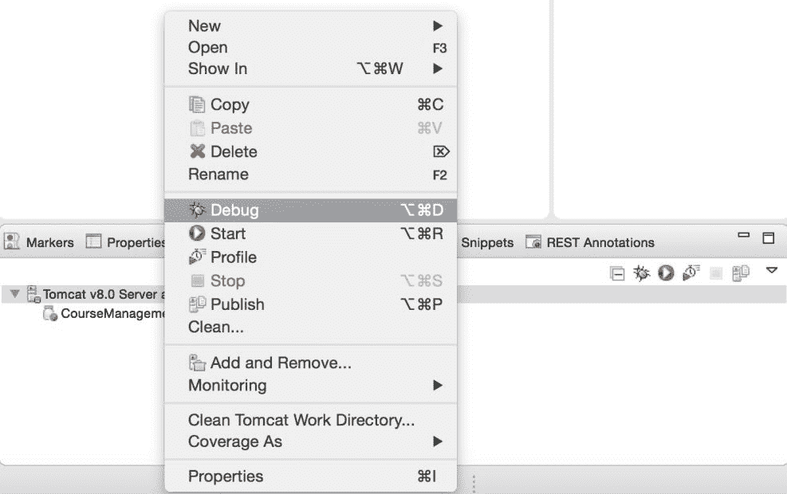

图 6.1：以调试模式启动 Tomcat

一旦 Tomcat 以调试模式启动，其状态将变为调试模式：

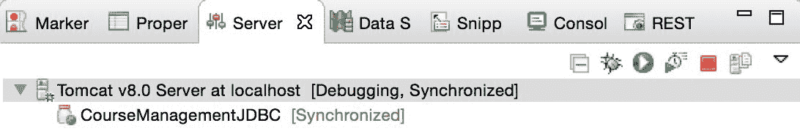

图 6.2：Tomcat 以调试模式运行

# 设置断点

现在，在我们启动`CourseManagement`应用程序之前，让我们在代码中设置断点。从`CourseManagementJDBC`项目打开`CourseDAO`，并在`getCourses`方法的第一行左侧边缘双击：

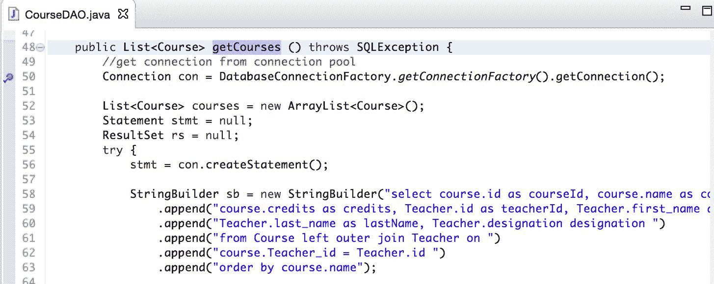

图 6.3：设置断点

在行上设置断点的另一种方法是右键单击左侧边缘并选择切换断点：

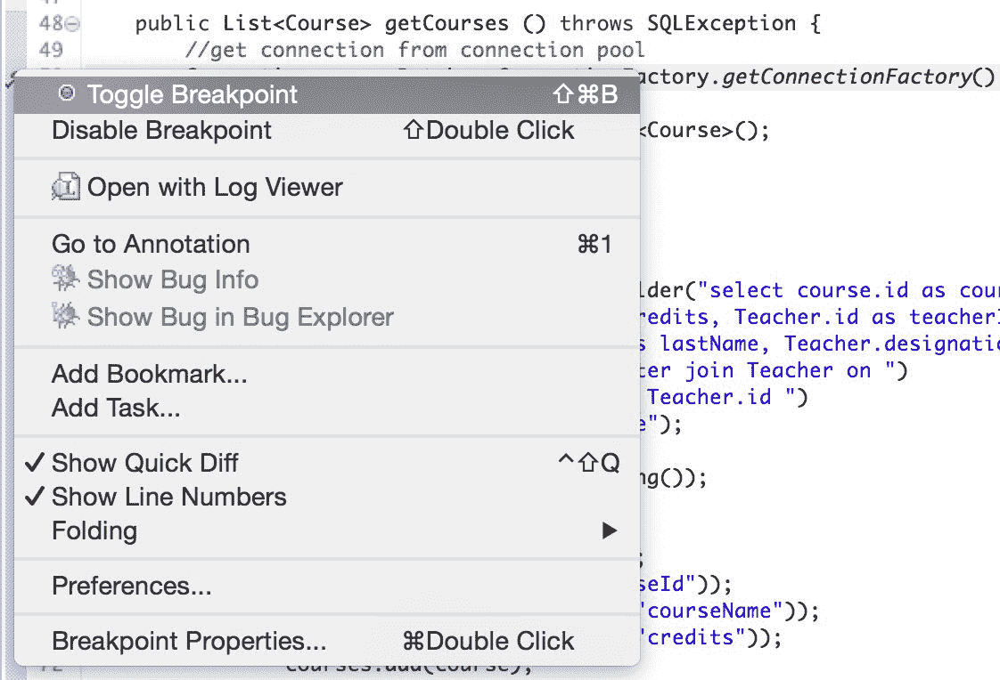

图 6.4：使用菜单切换断点

你也可以在方法级别设置断点。只需将光标放在任何方法内部，然后选择运行 | 切换方法断点菜单。这相当于在方法的第一行设置断点。当你总是想在方法开始时停止时，这比在方法的第一行设置断点更受欢迎。即使你后来在方法开头插入代码，调试器也会始终在方法的第一条语句处停止。

另一个有用的断点选项是在程序执行期间发生任何异常时设置它。通常，你可能不想在特定位置设置断点，但可能想调查异常发生的原因。如果你无法访问异常的堆栈跟踪，你只需为异常设置断点并再次运行程序。下次，执行将在异常发生的代码位置停止。这使得调试异常变得容易。要为异常设置断点，请选择运行 | 添加 Java 异常断点...并从列表中选择`Exception`类：

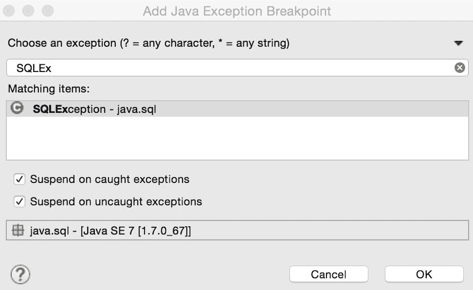

图 6.5：在异常处设置断点

# 以调试模式运行应用程序

现在，让我们以调试模式运行`listCourse.jsp`页面：

1.  在项目导航器中，转到`src/main/webapp/listCourse.jsp`，在文件上右键单击。选择调试为 | 服务器调试。Eclipse 可能会提示你使用现有的调试服务器：

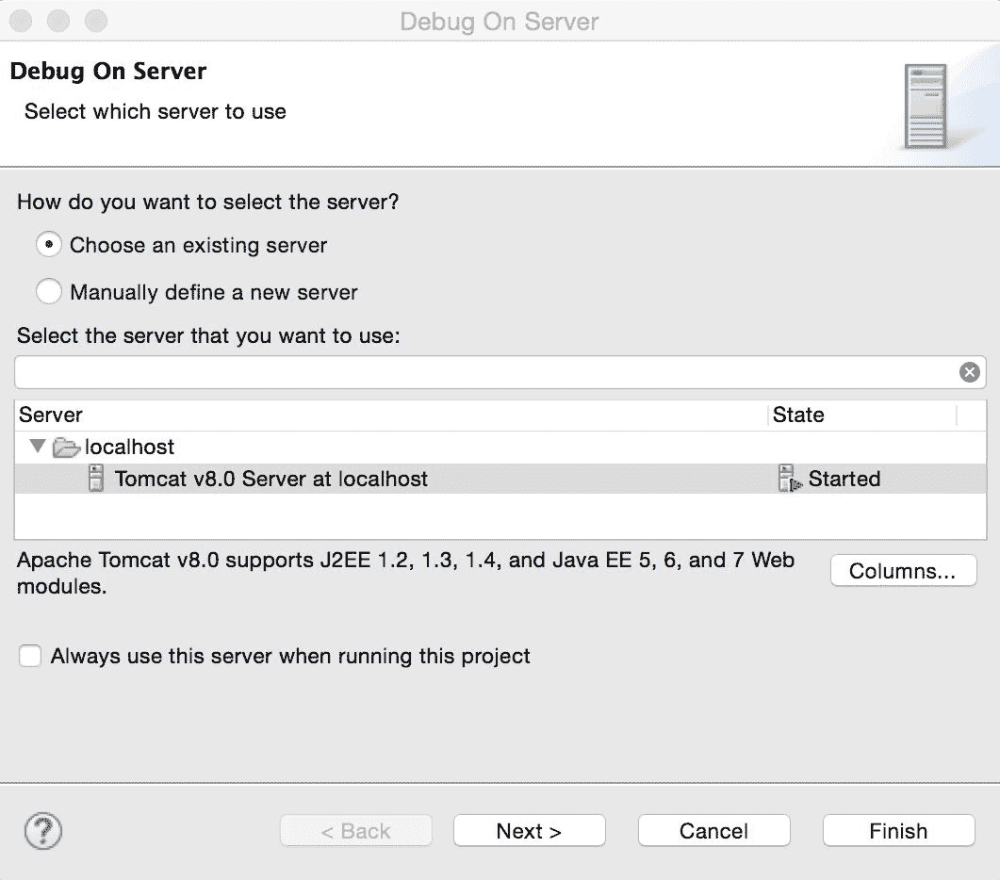

图 6.6：选择现有的调试服务器

1.  点击完成。Eclipse 会询问你是否想要切换到调试视角（有关 Eclipse 视角的讨论，请参阅第一章，*介绍 JEE 和 Eclipse*）：

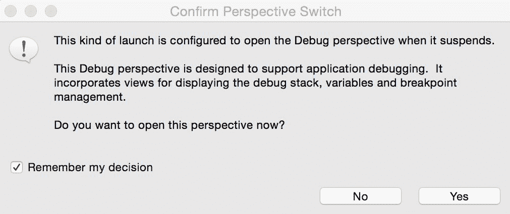

图 6.7：自动切换到调试视角

1.  选择“记住我的决定”选项并点击“是”按钮。Eclipse 将切换到调试视角。Eclipse 会尝试在内部 Eclipse 浏览器中打开页面，但不会立即显示页面。回想一下`listCourse.jsp`调用`Course.getCourses()`，它反过来调用`CourseDAO.getCourses()`。我们在`CourseDAO.getCourses()`方法中设置了断点，因此页面的执行在此处停止：

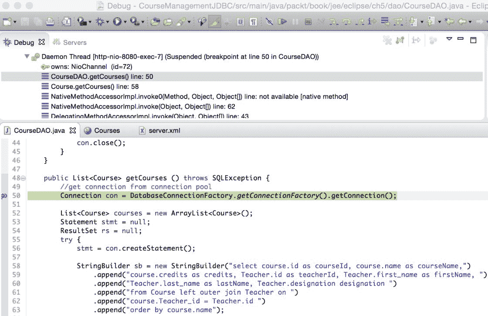

图 6.8：调试器在断点处暂停

# 执行步骤操作和检查变量

您现在可以使用顶部的工具栏图标或使用键盘快捷键执行不同的步骤操作（步骤跳过、步骤进入和步骤退出）。打开运行菜单的下拉菜单，了解调试的菜单和工具栏快捷键。通常，您会检查变量或执行步骤操作以验证执行流程是否正确，然后通过单击“继续”按钮或使用菜单/键盘快捷键继续执行。

在调试选项卡中（参见图 6.8），当调试器暂停时，您可以看到所有线程并检查每个线程的堆栈帧。线程的堆栈帧显示了程序在该线程中的执行路径，直到调试器在遇到断点或由于步骤操作而暂停的点。在多线程应用程序中，例如 Tomcat Web 容器，可能同时暂停多个线程，并且每个线程可能具有不同的堆栈帧。在调试多线程应用程序时，请确保在选择步骤操作/进入/退出或继续选项之前，您已经在调试选项卡中选择了所需的线程。

通常，您会进入一个方法，发现值不是您预期的，您想重新运行当前方法中的语句来调查它们。在这种情况下，您可以退回到任何之前的堆栈帧并重新开始。

例如，假设在前面的例子中我们进入`DatabaseConnectionFactory.getConnectionFactory().getConnection`方法。当我们进入时，调试器首先进入`getConnectionFactory`方法，然后在下一步进入操作中，它进入`getConnection`方法。假设当我们处于`getConnection`方法中时，我们想返回并检查`getConnectionFactory`方法中可能之前错过的事情（尽管在这个简单的例子中，`getConnectionFactory`方法中并没有发生太多；它应该只作为一个例子）。我们可以返回到`getCourses`方法，并重新开始`getConnectionFactory`和`getConnection`的执行。在调试选项卡中，右键单击`CourseDAO.getCourses()`堆栈帧，并选择“退到帧”，如图所示：

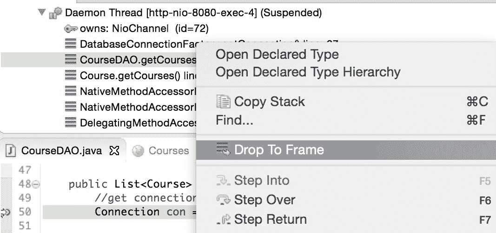

图 6.9 退到帧

调试器丢弃所选帧以上的所有堆栈帧，执行退回到所选帧；在这种情况下，在`CourseDAO`类的`getCourses`方法中。然后您可以再次进入`getConnection`方法。请注意，当您退到帧时，只会丢弃堆栈变量及其值。对不在堆栈上的引用对象所做的任何更改都不会回滚。

# 检查变量值

现在让我们跳过几个语句，直到进入`while`循环，从结果集返回的数据中创建课程对象。在右上角的窗口中，您将找到变量视图，它显示在执行该点时适用的变量：

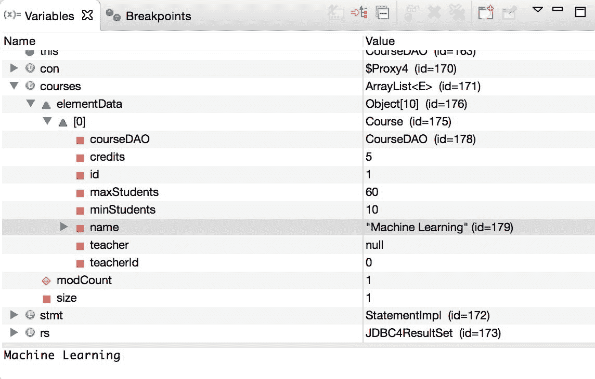

图 6.10：调试器在断点处暂停

您也可以通过更改调试选项卡中的选择来检查上一个方法调用中的变量：点击任何先前的方法调用（堆栈帧），变量视图将显示所选方法的变量。您可以更改任何变量的值，包括对象的成员变量的值。例如，在*图 6.8*中，我们可以将课程名称从`"Machine Learning"`更改为`"Machine Learning - Part1"`。要更改变量值，请在变量视图中右键单击变量并选择更改值：

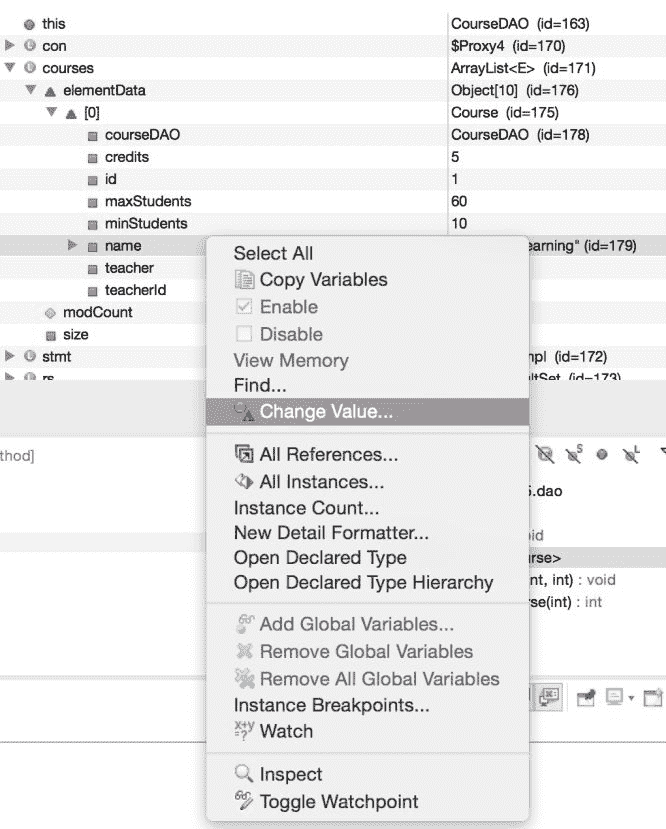

图 6.11：在调试过程中更改变量的值

您不必每次都去变量视图检查变量的值。有一个快速的方法：只需将光标悬停在编辑器中的变量上，Eclipse 就会弹出一个显示变量值的窗口：

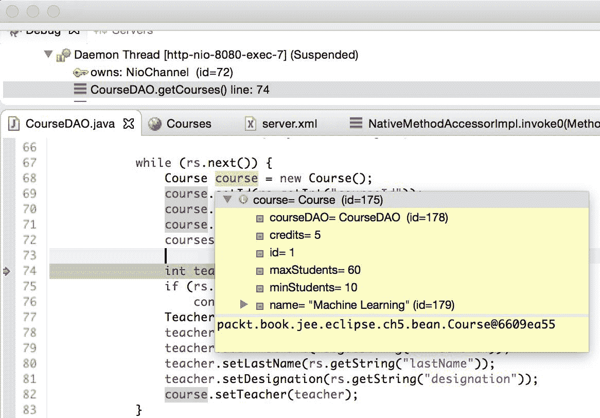

图 6.12：检查变量

您也可以右键单击变量并选择检查选项来查看变量的值。然而，当您选择检查选项时，无法更改值。

如果您想经常查看变量的值（例如，循环中的变量），可以将变量添加到监视列表。这是一个比在变量视图中搜索变量更方便的选项。右键单击变量并从菜单中选择监视选项。监视选项将变量添加到表达式视图（其默认位置在右上角的断点视图旁边）并显示其值：

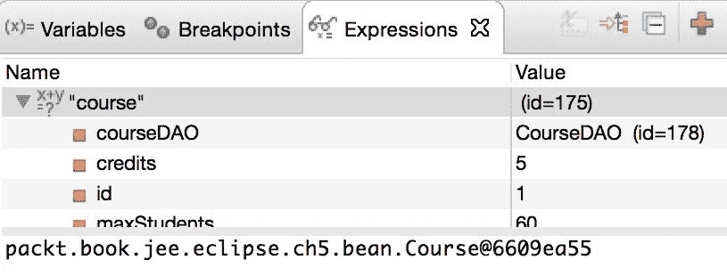

图 6.13：检查变量

表达式视图的使用不仅限于监视变量值。您可以监视任何有效的 Java 表达式，例如算术表达式，甚至方法调用。在表达式视图中单击加号图标并添加一个表达式。

# 在外部配置的 Tomcat 中调试应用程序

到目前为止，我们已经使用在 Eclipse 中配置的 Tomcat 调试我们的应用程序。当我们以调试模式启动 Tomcat 时，Eclipse 负责将调试 JVM 参数添加到 Tomcat 启动脚本中。在本节中，我们将了解如何启动一个外部（相对于 Eclipse）的 Tomcat 实例，并从 Eclipse 连接到它。尽管我们将调试远程 Tomcat 实例，但本节中的信息也可以用于连接到任何以调试模式启动的远程 Java 程序。我们已经看到了在调试模式下启动远程应用程序时传递的调试参数。

在调试模式下外部启动 Tomcat 并不太难。Tomcat 启动脚本已经有一个选项可以以调试模式启动服务器；您只需要传递适当的参数。从命令提示符中，选择`<TOMCAT_HOME>/bin`文件夹，在 Windows 中输入以下命令：

```java
>catalina.bat jpda start 
```

在 Mac OSX 和 Linux 中以调试模式启动 Tomcat：

```java
$./catalina.sh jpda start  
```

通过传递`jpda`参数，将所有所需的调试参数设置为默认值。默认调试端口是 8000。如果您想更改它，可以修改`catalin.bat/catalin.sh`或按以下方式设置环境变量`JPDA_ADDRESS`：

在 Windows 中设置`JPDA_ADDRESS`环境变量：

```java
>set JPDA_ADDRESS=9001  
```

在 OSX 和 Linux 中设置`JPDA_ADDRESS`环境变量：

```java
$export JPDA_ADDRESS=9001  
```

同样，您可以将`JPDA_SUSPEND`设置为`y`或`n`来控制调试器在执行`main`类之前是否应该等待客户端连接。

要从 Eclipse 连接到远程实例，请选择“运行 | 调试配置...”菜单。在左侧的列表视图中右键单击“远程 Java 应用程序”节点，然后选择“新建”：

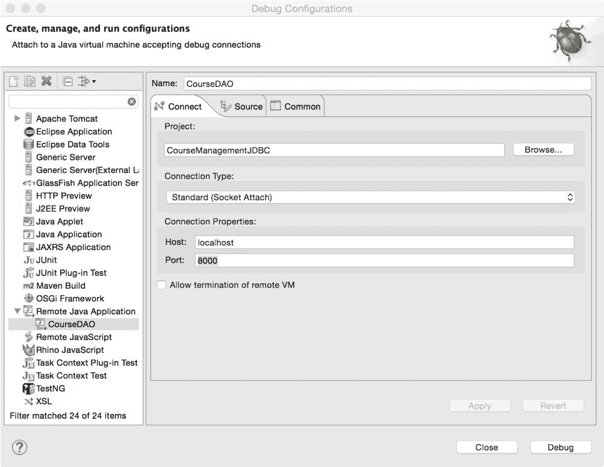

图 6.14：检查变量

设置适当的项目和端口（与您在调试模式下启动 Tomcat 时选择的相同，即默认：`8000`）并点击“调试”。如果调试器连接成功，Eclipse 将切换到调试视角。从现在开始，调试的过程与之前解释的相同。

# 使用调试器了解程序执行状态

我们已经看到如何使用调试器来验证程序的执行流程（使用单步操作）以及检查变量。您还可以使用调试器来了解正在运行的程序的状态。例如，一个 Web 请求耗时过长，您想知道执行确实卡在了哪里。您可以使用调试器来找到这一点。这类似于获取正在运行的程序的线程转储，但比获取线程转储的方法要简单得多。让我们假设我们的`CourseDAO.getCourses`方法执行时间过长。我们可以通过使用几个`Thread.sleep`调用来模拟这种情况，如下面的代码片段所示：

```java
public List<Course> getCourses () throws SQLException { 
  //get connection from connection pool 
  Connection con = 
 DatabaseConnectionFactory.getConnectionFactory().getConnection(); 

  try { 
    Thread.sleep(5000); 
  } catch (InterruptedException e) {} 

  List<Course> courses = new ArrayList<Course>(); 
  Statement stmt = null; 
  ResultSet rs = null; 
  try { 
    stmt = con.createStatement(); 

    StringBuilder sb = new StringBuilder("select course.id as 
     courseId, course.name as courseName,")      .append("course.credits as credits, Teacher.id as teacherId, 
       Teacher.first_name as firstName, ")      .append("Teacher.last_name as lastName, Teacher.designation 
       designation ") 
      .append("from Course left outer join Teacher on ") 
      .append("course.Teacher_id = Teacher.id ") 
      .append("order by course.name"); 

    rs = stmt.executeQuery(sb.toString()); 

    while (rs.next()) { 
      Course course = new Course(); 
      course.setId(rs.getInt("courseId")); 
      course.setName(rs.getString("courseName")); 
      course.setCredits(rs.getInt("credits")); 
      courses.add(course); 

      int teacherId = rs.getInt("teacherId"); 
      if (rs.wasNull()) //no teacher set for this course. 
        continue; 
      Teacher teacher = new Teacher(); 
      teacher.setId(teacherId); 
      teacher.setFirstName(rs.getString("firstName")); 
      teacher.setLastName(rs.getString("lastName")); 
      teacher.setDesignation(rs.getString("designation")); 
      course.setTeacher(teacher); 
    } 

    try { 
      Thread.sleep(5000); 
    } catch (InterruptedException e) {} 

    return courses; 
  } finally { 
    try {if (rs != null) rs.close();} catch (SQLException e) {} 
    try {if (stmt != null) stmt.close();} catch (SQLException e) 
 {} 
    try {con.close();} catch (SQLException e) {} 
  } 
} 
```

以调试模式启动 Tomcat，并以调试模式运行`listCourses.jsp`。因为我们插入了`Thread.sleep`语句，所以请求将需要时间。转到“调试”视图，这是显示线程和调用栈的地方。在 Tomcat 调试配置节点下的第一个节点上单击，并选择“暂停”选项，如下面的屏幕截图所示：

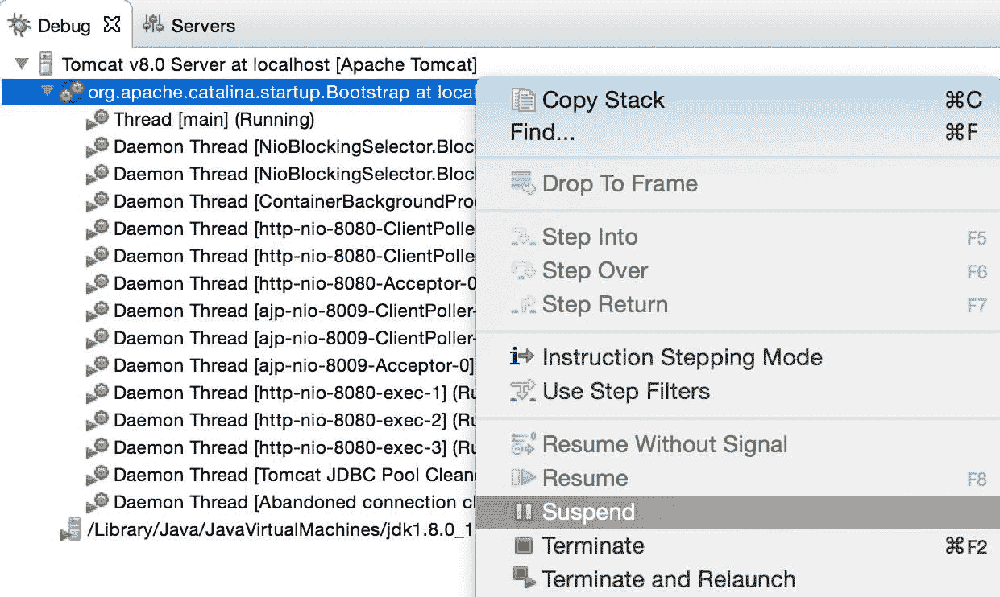

图 6.15：暂停程序执行

调试器暂停程序中所有线程的执行。然后您可以通过展开线程节点来查看每个线程的状态。您将找到一个线程正在执行`CourseDAO.getCourse`方法，以及它在暂停之前正在执行的语句：

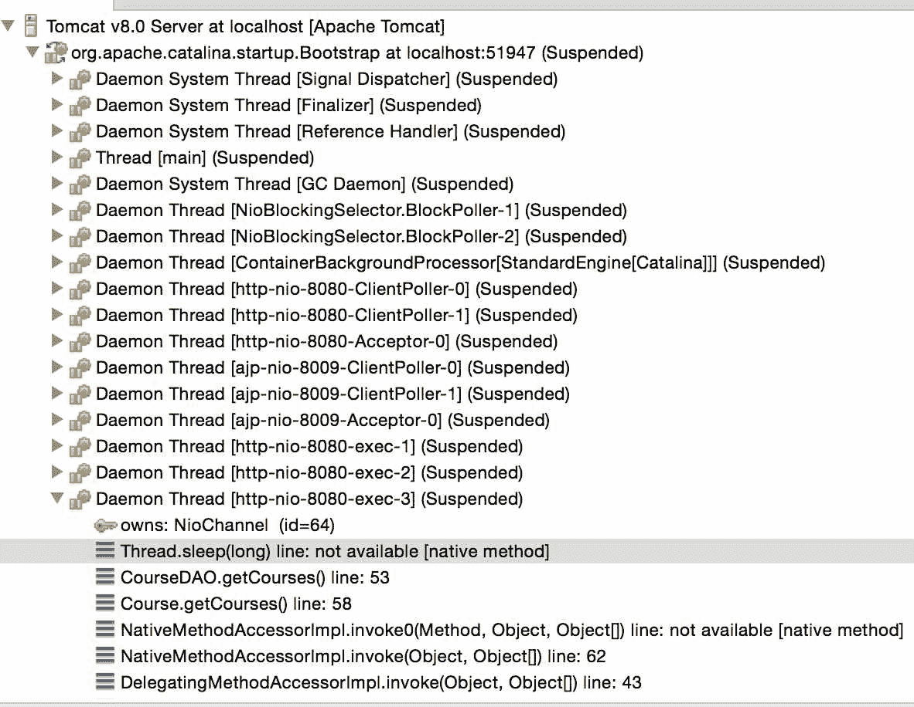

图 6.16：暂停线程的状态

从前面的屏幕截图中，您可以看到线程的执行在`Thread.sleep`语句的`CourseDAO.getCourses`方法中被暂停。当程序暂停时，您甚至可以在每个调用栈帧中检查变量。通过暂停程序并检查线程和调用栈的状态，您可能能够找到应用程序中的瓶颈。

# 摘要

语言运行时和 IDE 对调试的良好支持可以显著减少调试所花费的时间。Java 运行时和 Eclipse 为本地和远程应用程序的调试提供了出色的支持。要调试远程应用程序，请使用 JVM 调试参数启动它，并将 Eclipse 调试器连接到它。然后，你可以像调试本地应用程序一样调试远程应用程序，即设置断点、执行步骤操作和检查变量。你还可以在应用程序执行暂停时更改变量值。

在下一章中，我们将了解如何使用 EJBs 开发 JEE 应用程序并使用 GlassFish 服务器。尽管本章解释了在 Tomcat 部署的 JEE 应用程序的调试，但你也可以在 GlassFish 服务器中使用相同的技巧。
