# 使用 EJB 创建 JEE 应用程序

在上一章中，我们学习了从 Eclipse 调试 JEE 应用程序的一些技术。在本章中，我们将将我们的重点重新转向 JEE 应用程序开发，并学习如何创建和使用 **企业 JavaBeans**（**EJB**）。如果你还记得 第四章，“创建 JEE 数据库应用程序”中的数据库应用程序架构，我们使用了 JSP 或 JSF 页面调用 JSP Bean 或托管 Bean。然后，Bean 调用 DAO 执行数据访问代码。这样，用户界面、业务逻辑和数据库的代码就很好地分离了。这对于小型或中型应用程序来说可能适用，但在大型企业应用程序中可能会成为瓶颈；应用程序可能扩展性不好。如果业务逻辑的处理耗时较长，那么将其分布在不同服务器上以获得更好的可扩展性和弹性会更有意义。如果用户界面、业务逻辑和数据访问的代码都在同一台机器上，那么它可能会影响应用程序的可扩展性；也就是说，在负载下可能表现不佳。

在需要将处理业务逻辑的组件分布在不同服务器上的场景中，使用 EJB 实现业务逻辑是理想的。然而，这只是 EJB 的优势之一。即使你在与 Web 应用程序相同的服务器上使用 EJB，你也可以从 EJB 容器提供的众多服务中获益；你可以声明性地（使用注解）指定调用 EJB 方法的安全约束，并可以使用注解轻松指定事务边界（指定一个事务的一部分的方法调用集合）。此外，容器处理 EJB 的生命周期，包括某些类型 EJB 对象的池化，以便在应用程序负载增加时可以创建更多对象。

在 第四章，“创建 JEE 数据库应用程序”，我们使用简单的 JavaBeans 创建了一个 *课程管理* 网络应用程序。在本章中，我们将使用 EJB 创建相同的应用程序并将其部署到 GlassFish 服务器上。然而，在此之前，我们需要了解一些 EJB 的基本概念。

我们将涵盖以下广泛的主题：

+   理解不同类型的 EJB 以及它们如何从不同的客户端部署场景中访问

+   在 Eclipse 中配置 GlassFish 服务器以测试 EJB 应用程序

+   使用和未使用 Maven 从 Eclipse 创建和测试 EJB 项目

# EJB 类型

根据 EJB3 规范，EJB 可以有以下类型：

+   会话 Bean：

+   +   有状态会话 Bean

    +   无状态会话 Bean

    +   单例会话 Bean

+   消息驱动 Bean

当我们学习到 JEE 应用程序中的异步请求处理时，我们将在第十章 Chapter 10，“使用 JMS 的异步编程”，将详细讨论**消息驱动 Bean**（**MDB**）。在这一章中，我们将专注于会话 Bean。

# 会话 Bean

通常，会话 Bean 旨在包含执行企业应用程序主要业务逻辑的方法。任何**普通 Java 对象**（**POJO**）都可以通过适当的 EJB3 特定注解来注解，使其成为一个会话 Bean。会话 Bean 有三种类型。

# 有状态会话 Bean

一个有状态会话 Bean 只为一个客户端提供服务。有状态会话 Bean 与客户端之间存在一对一的映射。因此，有状态 Bean 可以在多个方法调用之间保留客户端的状态数据。在我们的*课程管理*应用程序中，我们可以在学生登录后使用一个有状态 Bean 来保存学生数据（学生资料和她/他选择的课程）。当服务器重启或会话超时时，由有状态 Bean 维护的状态将丢失。由于每个客户端都有一个有状态 Bean，使用有状态 Bean 可能会影响应用程序的可伸缩性。

我们在类上使用`@Stateful`注解来标记它为一个有状态会话 Bean。

# 无状态会话 Bean

无状态会话 Bean 不保留任何客户端的状态信息。因此，一个会话 Bean 可以被多个客户端共享。EJB 容器维护着一组无状态 Bean 的池，当客户端请求到来时，它会从池中取出一个 Bean，执行方法，然后将 Bean 返回池中。无状态会话 Bean 提供了卓越的可伸缩性，因为它们可以被共享，并且不需要为每个客户端创建。

我们在类上使用`@Stateless`注解来标记它为一个无状态会话 Bean。

# 单例会话 Bean

如其名所示，在 EJB 容器中只有一个单例 Bean 类的实例（这在集群环境中也是正确的；每个 EJB 容器将有一个单例 Bean 的实例）。这意味着它们被多个客户端共享，并且不会被 EJB 容器池化（因为只能有一个实例）。由于单例会话 Bean 是一个共享资源，我们需要在其中管理并发。Java EE 为单例会话 Bean 提供了两种并发管理选项，即容器管理并发和 Bean 管理并发。容器管理并发可以通过注解轻松指定。

有关在单例会话 Bean 中管理并发的更多信息，请参阅[`javaee.github.io/tutorial/ejb-basicexamples003.html#GIPSZ`](https://javaee.github.io/tutorial/ejb-basicexamples003.html#GIPSZ)。

如果存在资源竞争，单例 Bean 的使用可能会影响应用程序的可伸缩性。

我们在类上使用`@Singleton`注解来标记它为一个单例会话 Bean。

# 从客户端访问会话 Bean

会话 Bean 可以被设计为本地访问（客户端和 Bean 在同一个应用程序中），远程访问（从运行在不同应用程序或 JVM 中的客户端），或两者兼而有之。在远程访问的情况下，会话 Bean 必须实现一个远程接口。对于本地访问，会话 Bean 可以实现一个本地接口或实现无接口（会话 Bean 的无接口视图）。会话 Bean 实现的远程和本地接口有时也被称为**业务接口**，因为它们通常暴露主要业务功能。

# 创建无接口会话 Bean

要创建具有无接口视图的会话 Bean，创建一个 POJO，并使用适当的 EJB 注解类型和`@LocalBean`对其进行注解。例如，我们可以创建一个本地状态 ful 的`Student` Bean 如下：

```java
import javax.ejb.LocalBean; 
import javax.ejb.Singleton; 

@Singleton 
@LocalBean 
public class Student { 
... 
} 
```

# 使用依赖注入访问会话 Bean

您可以通过使用`@EJB`注解（该注解将 Bean 注入客户端类）或通过执行**Java 命名和目录接口**（**JNDI**）查找来访问会话 Bean。EJB 容器必须使 EJB 的 JNDI URL 对客户端可用。

使用`@EJB`注入仅适用于受管理组件，即由 EJB 容器管理生命周期的应用程序组件。当组件由容器管理时，它由容器创建（实例化）和销毁。您不使用`new`运算符创建受管理组件。支持直接注入 EJB 的 JEE 受管理组件包括 servlet、JSF 页面的受管理 Bean 以及 EJB 本身（一个 EJB 可以注入另一个 EJB）。不幸的是，您不能让 Web 容器在 JSP 或 JSP Bean 中注入 EJB。此外，您不能将 EJB 注入您创建并使用`new`运算符实例化的任何自定义类。在本章的后面部分，我们将看到如何使用 JNDI 从不受容器管理的对象访问 EJB。

我们可以从 JSF 的受管理 Bean 中使用之前创建的学生 Bean 如下：

```java
import javax.ejb.EJB; 
import javax.faces.bean.ManagedBean; 

@ManagedBean 
public class StudentJSFBean { 
  @EJB 
  private Student studentEJB; 
} 
```

注意，如果您创建了一个无接口视图的 EJB，那么该 EJB 中的所有`public`方法都将暴露给客户端。如果您想控制客户端可以调用的方法，那么您应该实现一个业务接口。

# 使用本地业务接口创建会话 Bean

EJB 的业务接口是一个简单的 Java 接口，用`@Remote`或`@Local`进行注解。因此，我们可以创建一个学生 Bean 的本地接口如下：

```java
import java.util.List; 
import javax.ejb.Local; 

@Local 
public interface StudentLocal { 
  public List<Course> getCourses(); 
} 
```

此外，我们可以如下实现会话 Bean：

```java
import java.util.List; 
import javax.ejb.Local; 
import javax.ejb.Stateful; 

@Stateful 
@Local 
public class Student implements StudentLocal { 
  @Override 
  public List<CourseDTO> getCourses() { 
    //get courses are return 
... 
  } 
} 
```

客户端只能通过本地接口访问`Student` EJB：

```java
import javax.ejb.EJB; 
import javax.faces.bean.ManagedBean; 

@ManagedBean 
public class StudentJSFBean { 
  @EJB 
  private StudentLocal student; 
} 
```

会话 Bean 可以实现多个业务接口。

# 使用 JNDI 查找访问会话 Bean

虽然使用依赖注入访问 EJB 是最简单的方法，但它仅当容器管理访问 EJB 的类时才有效。如果你想从一个不是管理 bean 的 POJO 中访问 EJB，则依赖注入将不起作用。依赖注入不起作用的另一个场景是当 EJB 部署在单独的 JVM（可能是在远程服务器上）时。在这种情况下，你必须使用 JNDI 查找来访问 EJB（有关 JNDI 的更多信息，请访问[`docs.oracle.com/javase/tutorial/jndi/`](https://docs.oracle.com/javase/tutorial/jndi/)）。

JEE 应用程序可以打包成**企业应用程序存档**（**EAR**），其中包含 EJB 的`.jar`文件和 Web 应用程序的`.war`文件（以及包含两个都需要的库的`lib`文件夹）。例如，如果 EAR 文件的名称是`CourseManagement.ear`，其中 EJB 的`.jar`文件名称是`CourseManagementEJBs.jar`，则应用程序的名称是`CourseManagement`（EAR 文件的名称），模块名称是`CourseManagementEJBs`。EJB 容器使用这些名称来创建查找 EJB 的 JNDI URL。EJB 的全局 JNDI URL 创建如下：

```java
"java:global/<application_name>/<module_name>/<bean_name>![<bean_interface>]" 
```

让我们看看前面代码片段中使用的不同参数：

+   `java:global`: 这表示它是一个全局 JNDI URL。

+   `<application_name>`: 这通常是 EAR 文件的名称。

+   `<module_name>`: 这是 EJB JAR 的名称。

+   `<bean_name>`: 这是 EJB bean 类的名称。

+   `<bean_interface>`: 如果 EJB 有一个无接口视图，或者如果 EJB 只实现了一个业务接口，则此属性是可选的。否则，它是业务接口的完全限定名称。

EJB 容器必须为每个 EJB 发布两个 JNDI URL 的变体。这些不是全局 URL，这意味着它们不能用于从不在同一 JEE 应用程序（同一 EAR）中的客户端访问 EJB：

+   `java:app/[<module_name>]/<bean_name>![<bean_interface>]`

+   `java:module/<bean_name>![<bean_interface>]`

如果 EJB 客户端在同一应用程序中，则可以使用第一个 URL；如果客户端在同一模块中（与 EJB 相同的`.jar`文件），则可以使用第二个 URL。

在你查找 JNDI 服务器中的任何 URL 之前，你需要创建`InitialContext`，这包括其他信息，例如 JNDI 服务器的主机名和它运行的端口。如果你在同一服务器中创建`InitialContext`，那么不需要指定这些属性：

```java
InitialContext initCtx  = new InitialContext(); 
Object obj = initCtx.lookup("jndi_url"); 
```

我们可以使用以下 JNDI URL 来访问无接口（`LocalBean`）的`Student` EJB（假设 EAR 文件的名称是`CourseManagement`，EJB 的`.jar`文件名称是`CourseManagementEJBs`）：

| **URL** | **何时使用** |
| --- | --- |
| `java:global/CourseManagement/ CourseManagementEJBs/Student` | 客户端可以位于 EAR 文件中的任何位置，因为我们使用了全局 URL。请注意，我们没有指定接口名称，因为我们假设在这个示例中学生 Bean 提供了一个无接口视图。 |
| `java:app/CourseManagementEJBs/Student` | 客户端可以位于 EAR 中的任何位置。我们跳过了应用程序名称，因为客户端预期位于同一应用程序中，因为 URL 的命名空间是 `java:app`。 |
| `java:module/Student` | 客户端必须在与 EJB 相同的 `.jar` 文件中。 |

我们可以使用以下 JNDI URL 来访问实现了名为 `StudentLocal` 的本地接口的 `Student` EJB：

| **URL** | **何时使用** |
| --- | --- |
| `java:global/CourseManagement/ CourseManagementEJBs/Student!packt.jee.book.ch6.StudentLocal` | 客户端可以位于 EAR 文件中的任何位置，因为我们使用了全局 URL。 |
| `java:global/CourseManagement/ CourseManagementEJBs/Student` | 客户端可以位于 EAR 中的任何位置。我们跳过了接口名称，因为 Bean 只实现了单个业务接口。请注意，从这个调用返回的对象将是 `StudentLocal` 类型，而不是 `Student` 类型。 |
| `java:app/CourseManagementEJBs/Student` 或 `java:app/CourseManagementEJBs/Student!packt.jee.book.ch6.StudentLocal` | 客户端可以位于 EAR 中的任何位置。我们跳过了应用程序名称，因为 JNDI 命名空间是 `java:app`。 |
| `java:module/Student` 或 `java:module/Student!packt.jee.book.ch6.StudentLocal` | 客户端必须在与 EJB 相同的 EAR 中。 |

以下是从我们的 Web 应用程序中的非 Web 容器管理的对象（之一）调用具有本地业务接口的学生 Bean 的示例：

```java
InitialContext ctx = new InitialContext(); 
StudentLocal student = (StudentLocal) ctx.loopup 
 ("java:app/CourseManagementEJBs/Student"); 
return student.getCourses(id) ; //get courses from Student EJB 
```

# 使用远程业务接口创建会话 Bean

如果您创建的会话 Bean 将由不在 Bean 所在 JVM 中的客户端对象访问，则该 Bean 需要实现远程业务接口。您可以通过在类上使用 `@Remote` 注解来创建远程业务接口：

```java
import java.util.List; 
import javax.ejb.Remote; 

@Remote 
public interface StudentRemote { 
  public List<CourseDTO> getCourses(); 
} 
```

实现远程接口的 EJB 也用 `@Remote` 注解：

```java
@Stateful 
@Remote 
public class Student implements StudentRemote { 
  @Override 
  public List<CourseDTO> getCourses() { 
    //get courses are return 
... 
  } 
} 
```

远程 EJB 可以使用 `@EJB` 注解注入到同一应用程序中的管理对象中。例如，一个 JSF Bean 可以如下访问之前提到的学生 Bean（位于同一应用程序中）：

```java
import javax.ejb.EJB; 
import javax.faces.bean.ManagedBean; 

@ManagedBean 
public class StudentJSFBean { 
  @EJB 
  private StudentRemote student; 
} 
```

# 访问远程会话 Bean

要访问远程 `Student` EJB，我们可以使用以下 JNDI URL：

| **URL** | **何时使用** |
| --- | --- |
| `java:global/CourseManagement/ CourseManagementEJBs/Student!packt.jee.book.ch6.StudentRemote` | 客户端可以在同一应用程序或远程位置。对于远程客户端，我们需要设置适当的 `InitialContext` 参数。 |
| `java:global/CourseManagement/CourseManagementEJBs/Student` | 客户端可以在同一应用程序或远程位置。我们跳过了接口名称，因为 Bean 只实现了单个业务接口。 |
| `java:app/CourseManagementEJBs/Student`或`java:app/CourseManagementEJBs/Student!packt.jee.book.ch6.StudentRemote` | 客户端可以在 EAR 的任何位置。我们跳过了应用程序名称，因为 JNDI 命名空间是`java:app`。 |
| `java:module/Student`或`java:module/Student!packt.jee.book.ch6.StudentRemote` | 客户端必须在与 EJB 相同的 EAR 中。 |

要从远程客户端访问 EJB，您需要使用 JNDI 查找方法。此外，您需要设置具有某些属性的`InitialContext`；其中一些属性是 JEE 应用服务器特定的。如果远程 EJB 和客户端都部署在 GlassFish 中（不同的 GlassFish 实例），那么您可以按以下方式查找远程 EJB：

```java
Properties jndiProperties = new Properties(); 
jndiProperties.setProperty("org.omg.CORBA.ORBInitialHost", 
 "<remote_host>"); 
//target ORB port. default is 3700 in GlassFish 
jndiProperties.setProperty("org.omg.CORBA.ORBInitialPort", 
 "3700"); 

InitialContext ctx = new InitialContext(jndiProperties); 
StudentRemote student = 
 (StudentRemote)ctx.lookup("java:app/CourseManagementEJBs/Student"); 
return student.getCourses(); 
```

# 在 Eclipse 中配置 GlassFish 服务器

我们将在本章中使用 GlassFish 应用服务器。我们已经在第一章的“安装 GlassFish 服务器”部分中看到了如何安装 GlassFish。

我们将首先在 Eclipse JEE 中配置 GlassFish 服务器：

1.  要在 Eclipse EE 中配置 GlassFish 服务器，请确保您处于 Eclipse 的 Java EE 视图中。右键单击服务器视图并选择新建 | 服务器。如果您在服务器类型列表中看不到 GlassFish 服务器组，请展开 Oracle 节点并选择和安装 GlassFish 工具：

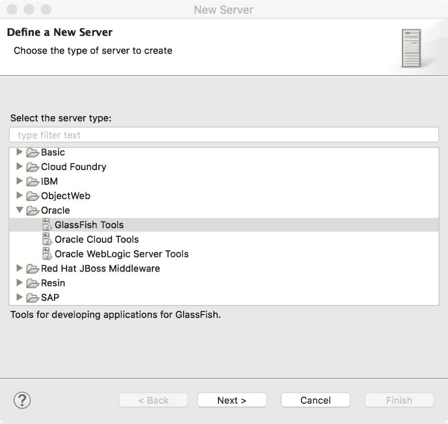

图 7.1：安装 GlassFish 工具

1.  如果您已经安装了 GlassFish 工具，或者 GlassFish 服务器类型在列表中可用，那么展开它并选择 GlassFish 选项：

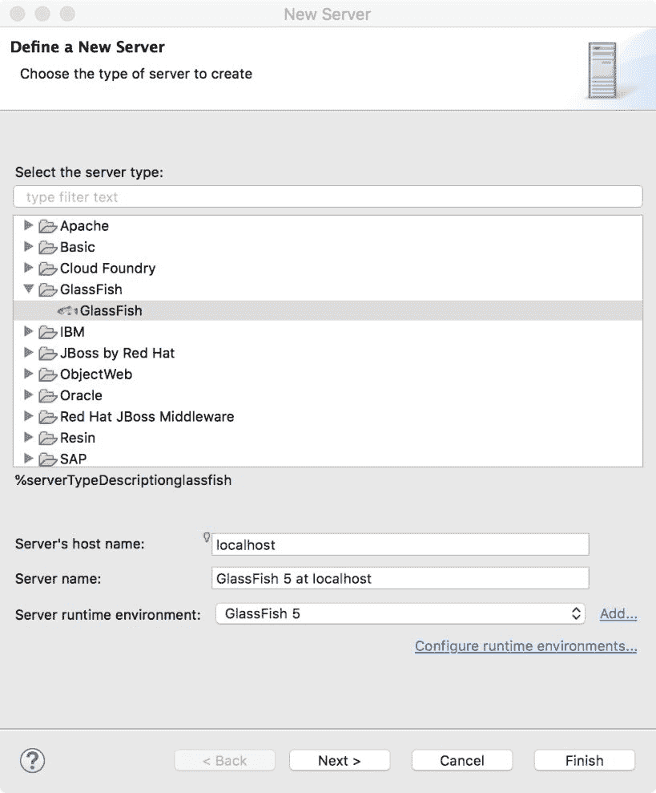

图 7.2：在 Eclipse 中创建 GlassFish 服务器实例

1.  点击下一步。在“域路径”字段中输入您本地机器上的 GlassFish 服务器路径。如果适用，输入管理员名称和密码，然后点击下一步：

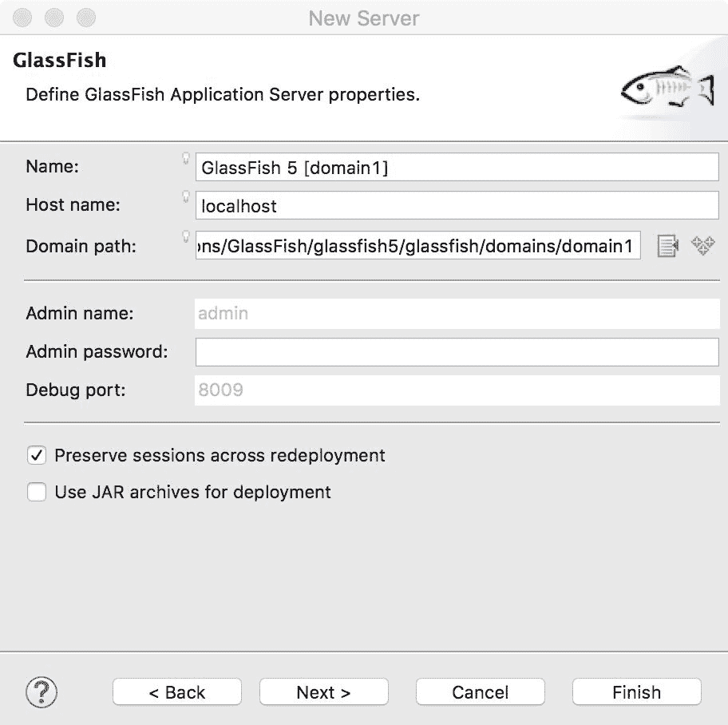

图 7.3：定义 GlassFish 服务器属性

1.  下一页允许您在 GlassFish 中部署现有的 Java EE 项目。目前我们没有要添加的项目，所以只需点击完成。

1.  服务器已添加到服务器视图。右键单击服务器并选择启动。如果服务器已正确安装和配置，则服务器状态应更改为已启动。

1.  要打开服务器的管理页面，右键单击服务器并选择 GlassFish | 查看管理控制台。管理页面在内置的 Eclipse 浏览器中打开。您可以通过打开`http://localhost:8080` URL 来浏览服务器主页。`8080`是 GlassFish 的默认端口。

# 使用 EJB 创建课程管理应用程序

现在我们来创建我们在第四章中创建的*课程管理*应用程序，这次使用 EJB。在第四章中，我们创建了用于编写业务逻辑的服务类（它们是 POJO）。我们将用 EJB 来替换它们。我们将首先创建 EJB 的 Eclipse 项目。

# 在 Eclipse 中创建 EJB 项目

EJB 打包在一个 JAR 文件中。Web 应用程序打包在一个**Web 应用程序存档**（**WAR**）中。如果 EJB 需要远程访问，则客户端需要访问业务接口。因此，EJB 业务接口和共享对象（在 EJB 和客户端之间共享）打包在一个单独的 JAR 中，称为 EJB 客户端 JAR。此外，如果 EJB 和 Web 应用程序要作为一个单一应用程序部署，那么它们需要打包在一个 EAR 中。

因此，在大多数情况下，带有 EJB 的应用程序不是一个单一的项目，而是四个不同的项目：

+   创建 EJB JAR 的 EJB 项目

+   包含业务类和共享（在 EJB 和客户端之间）类的 EJB 客户端项目

+   生成 WAR 的 Web 项目

+   生成包含 EJB JAR、EJB 客户端 JAR 和 WAR 的 EAR 项目

您可以独立创建这些项目并将它们集成。然而，Eclipse 提供了使用一个向导创建 EJB 项目、EJB 客户端项目和 EAR 项目的选项：

1.  选择文件 | 新建 | EJB 项目。在项目名称文本框中输入`CourseManagementEJBs`：

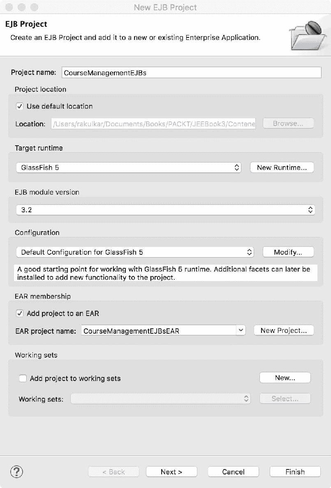

图 7.4：新建 EJB 项目向导

确保目标运行时为 GlassFish 5，EJB 模块版本为 3.2 或更高。从配置下拉列表中选择 GlassFish 5 的默认配置。在 EAR 成员组中，勾选将项目添加到 EAR 的框。

1.  选择下一步。在下一页上，指定类的源文件夹和输出文件夹。在此页上保持默认设置不变：

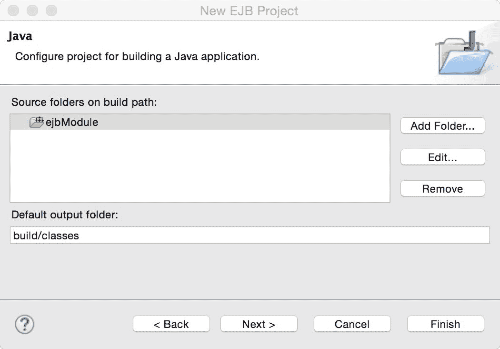

图 7.5：选择源文件夹和输出文件夹

1.  此项目的源 Java 文件将创建在`ejbModule`文件夹中。点击下一步：

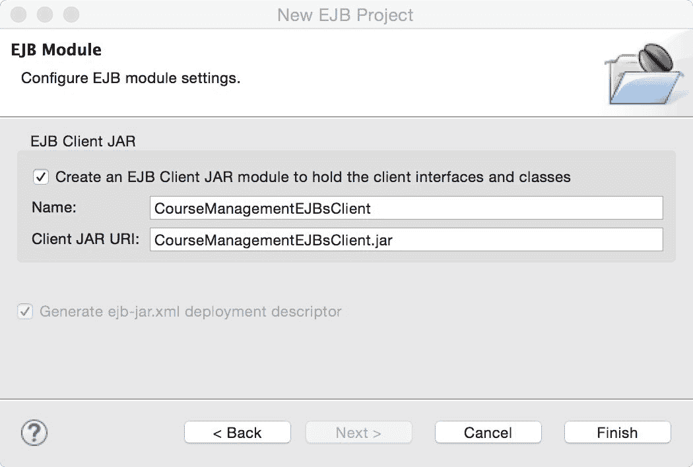

图 7.6：创建 EJB 客户端项目

1.  Eclipse 提供了创建 EJB 客户端项目的选项。选择该选项并点击完成。

1.  由于我们正在构建一个 Web 应用程序，我们将创建一个 Web 项目。选择文件 | 动态 Web 项目。将项目名称设置为`CourseManagementWeb`：

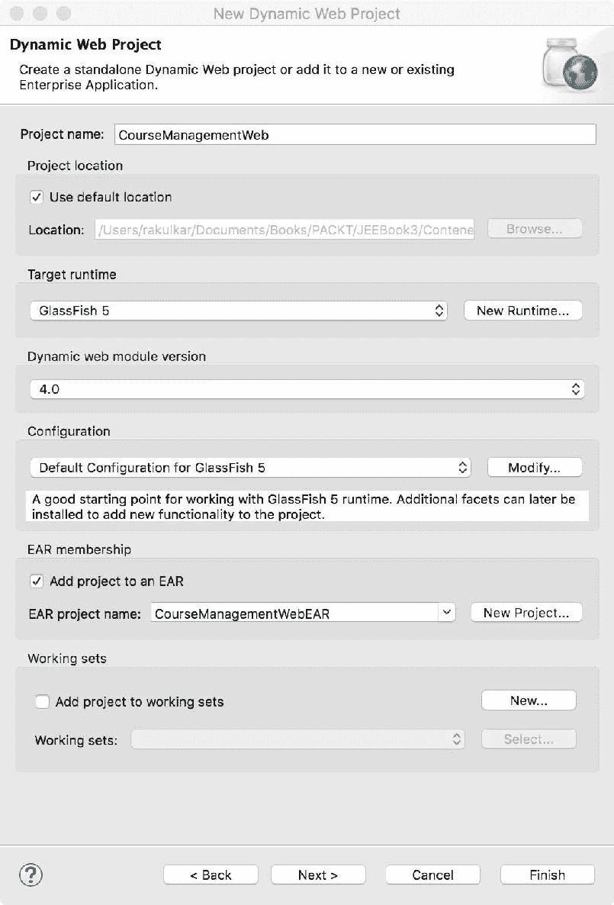

图 7.7：新建动态 Web 项目

1.  选择将项目添加到 EAR 的复选框。由于我们在工作空间中只有一个 EAR 项目，Eclipse 会从下拉列表中选择此项目。点击完成。

现在我们工作空间中有以下四个项目：

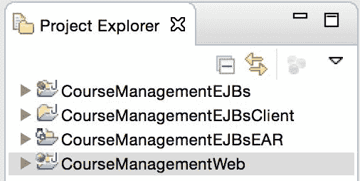

图 7.8：课程管理项目

在课程管理应用程序中，我们将创建一个无状态的 EJB，称为 `CourseBean`。我们将使用 **Java 持久性 API**（JPA）进行数据访问并创建一个 `Course` 实体。有关使用 JPAs 的详细信息，请参阅第四章，*创建 JEE 数据库应用程序*。`CourseManagementEJBClient` 项目将包含 EJB 业务接口和共享类。在 `CourseManagementWeb` 中，我们将创建一个 JSF 页面和一个管理 Bean，该 Bean 将访问 `CourseManagementEJBs` 项目中的 `Course` EJB 以获取课程列表。

# 配置 GlassFish 中的数据源

在第四章，*创建 JEE 数据库应用程序*中，我们在应用程序本地创建了 JDBC 数据源。在本章中，我们将在 GlassFish 中创建 JDBC 数据源。GlassFish 服务器没有打包 MySQL 的 JDBC 驱动程序。因此，我们需要将 `MySQLDriver` 的 `.jar` 文件放置在 GlassFish 可以找到它的路径中。您可以将此类外部库放置在您想要部署应用程序的 GlassFish 域的 `lib`/`ext` 文件夹中。对于本例，我们将复制 JAR 文件到 `<glassfish_home>/glassfish/domains/domain1/lib/ext`。

如果您没有 MySQL JDBC 驱动程序，您可以从以下网址下载它：`http://dev.mysql.com/downloads/connector/j/`：

1.  打开 GlassFish 管理控制台，可以通过在“服务器视图”中右键单击服务器并选择 GlassFish | 查看管理控制台（这将在 Eclipse 内打开管理控制台）或浏览到 `http://localhost:4848`（`4848` 是 GlassFish 管理控制台应用程序默认监听的端口号）。在管理控制台中，选择资源 | JDBC | JDBC 连接池。在 JDBC 连接池页面上单击“新建”按钮：

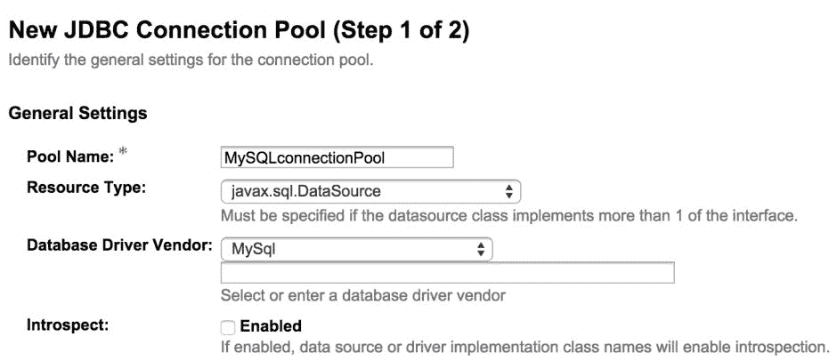

图 7.9：在 GlassFish 中创建 JDBC 连接池

1.  将池名称设置为 `MySQLconnectionPool` 并选择 javax.sql.DataSource 作为资源类型。从数据库驱动程序供应商列表中选择 MySql 并单击下一步。在下一页上，选择正确的数据源类名（com.mysql.jdbc.jdbc2.optional.MysqlDatasource）：

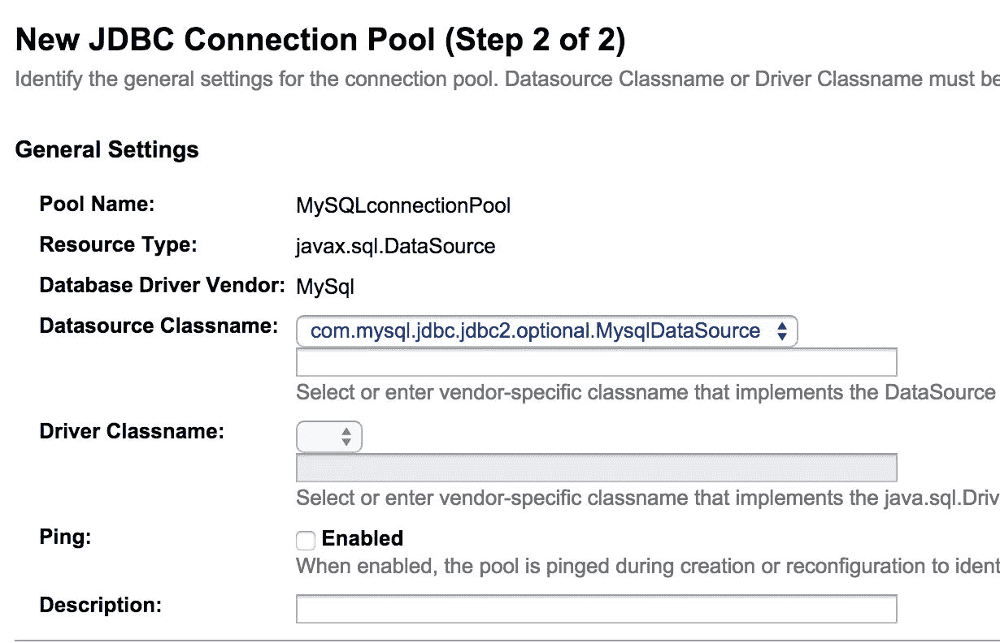

图 7.10：GlassFish 中的 JDBC 连接池设置

1.  我们需要设置 MySQL 的主机名、端口号、用户名和密码。在管理页面上，向下滚动到“附加属性”部分，并设置以下属性：

| **属性** | **值** |
| --- | --- |
| 端口/端口号 | `3306` |
| 数据库名称 | `<schemaname_of_coursemanagement>`, 例如，`course_management`。有关创建 *Course Management* 数据库的 MySQL 模式的详细信息，请参阅第四章，*创建 JEE 数据库应用程序*。 |
| 密码 | MySQL 数据库密码。 |
| URL/URL | `jdbc:mysql://:3306/<database_name>`，例如，`jdbc:mysql://:3306/course_management` |
| 服务器名称 | `localhost` |
| 用户 | MySQL 用户名 |

1.  点击完成。新的连接池已添加到左侧窗格中的列表中。点击新添加的连接池。在“常规”选项卡中，点击“Ping”按钮并确保 ping 操作成功：

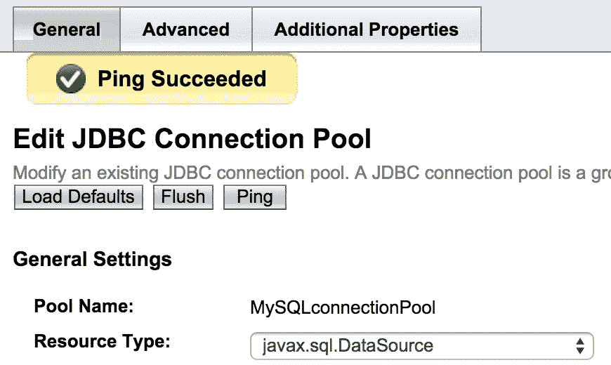

图 7.11：在 GlassFish 中测试 JDBC 连接池

1.  接下来，我们需要为这个连接池创建一个 JNDI 资源，以便它可以从客户端应用程序访问。在左侧窗格中选择“资源”|“JDBC”|“JDBC 资源”节点。点击“新建”按钮创建一个新的 JDBC 资源：

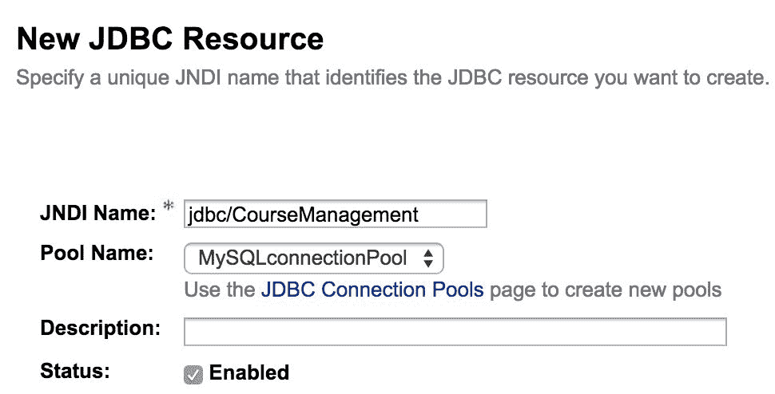

图 7.12：在 GlassFish 中测试 JDBC 连接池

1.  将 JNDI 名称设置为`jdbc/CourseManagement`。从“池名称”下拉列表中选择我们为 MySQL 创建的连接池，即`MySQLconnectionPool`。点击保存。

# 在 Eclipse 项目中配置 JPA

现在我们将配置我们的 EJB 项目以使用 JPA 来访问 MySQL 数据库。我们已经在第四章的*创建 JEE 数据库应用程序*部分中学习了如何为 Eclipse 项目启用 JPA。然而，我们将在下面再次简要介绍这些步骤：

1.  在项目探索器中右键单击`CourseManagementEJBs`项目，选择“配置”|“转换为 JPA 项目”。Eclipse 打开“项目特性”窗口：

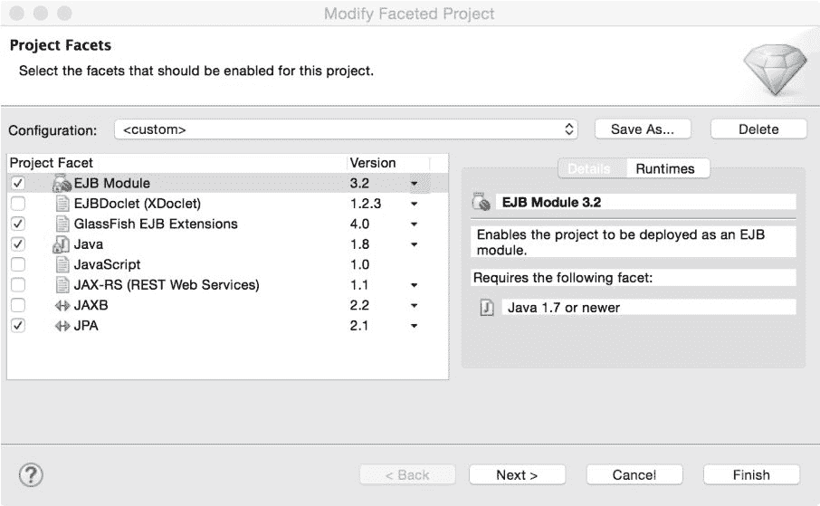

图 7.13：Eclipse 项目特性

1.  点击下一步进入“JPA 特性”页面：

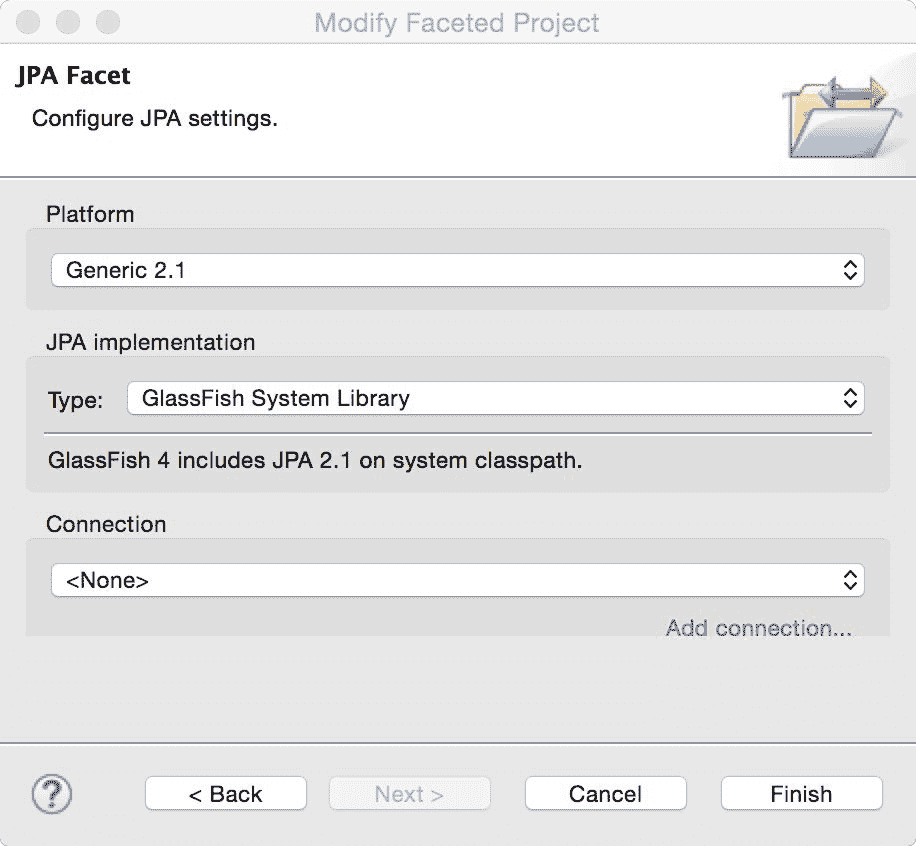

图 7.14：JPA 特性

保持默认值不变，然后点击完成。Eclipse 会将 JPA 所需的`persistence.xml`文件添加到项目探索器中的“JPA 内容”组下的项目中。我们需要在`persistence.xml`中配置 JPA 数据源。打开`persistence.xml`并点击“连接”选项卡。将事务类型设置为`JTA`。在 JTA 数据源文本框中，输入我们在上一节中为 MySQL 数据库设置的 JNDI 名称，即`jdbc/CourseManagement`。保存文件。请注意，`persistence.xml`的实际位置是`ejbModule`/`META-INF`。

现在我们将在 Eclipse 中创建一个数据库连接，并将其与项目的 JPA 属性链接起来，以便我们可以从数据库表中创建 JPA 实体。在`CourseManagementEJBs`项目上右键单击并选择“属性”。这会打开“项目属性”窗口。点击“JPA”节点以查看详细信息页面。在连接下拉框下方点击“添加连接”链接。我们已经在第四章的“使用 Eclipse 数据源探索器”部分中看到了如何设置数据库连接，*创建 JEE 数据库应用程序*。然而，我们将在下面简要回顾这些步骤：

1.  在“连接配置”窗口中，选择 MySQL：

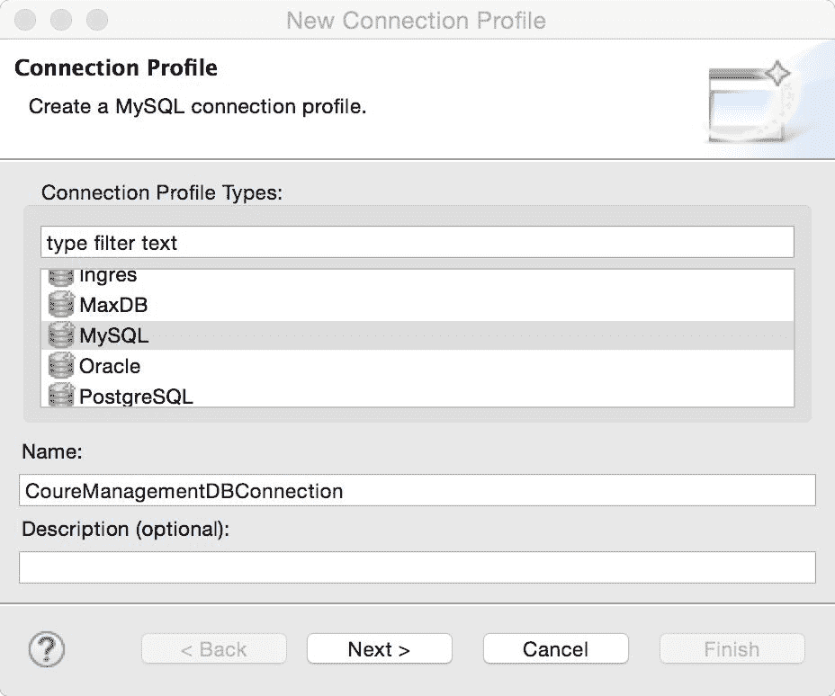

图 7.15：新的数据库连接配置文件

1.  在名称文本框中输入`CourseManagementDBConnection`并点击下一步。在“新连接配置”窗口中，点击新连接配置按钮（位于“驱动程序”下拉框旁边的圆圈）以打开“新驱动程序定义”窗口。选择适当的 MySQL JDBC 驱动程序版本，并点击“JAR 列表”标签。如果出现任何错误，删除任何现有的`.jar`文件，并点击“添加 JAR/ZIP”按钮。浏览到我们在`<glassfish_home>/glassfish/domains/domain1/lib/ext`文件夹中保存的 MySQL JDBC 驱动程序 JAR 文件。点击确定。回到“新连接配置”窗口，输入数据库名称，修改连接 URL，并输入用户名和密码：

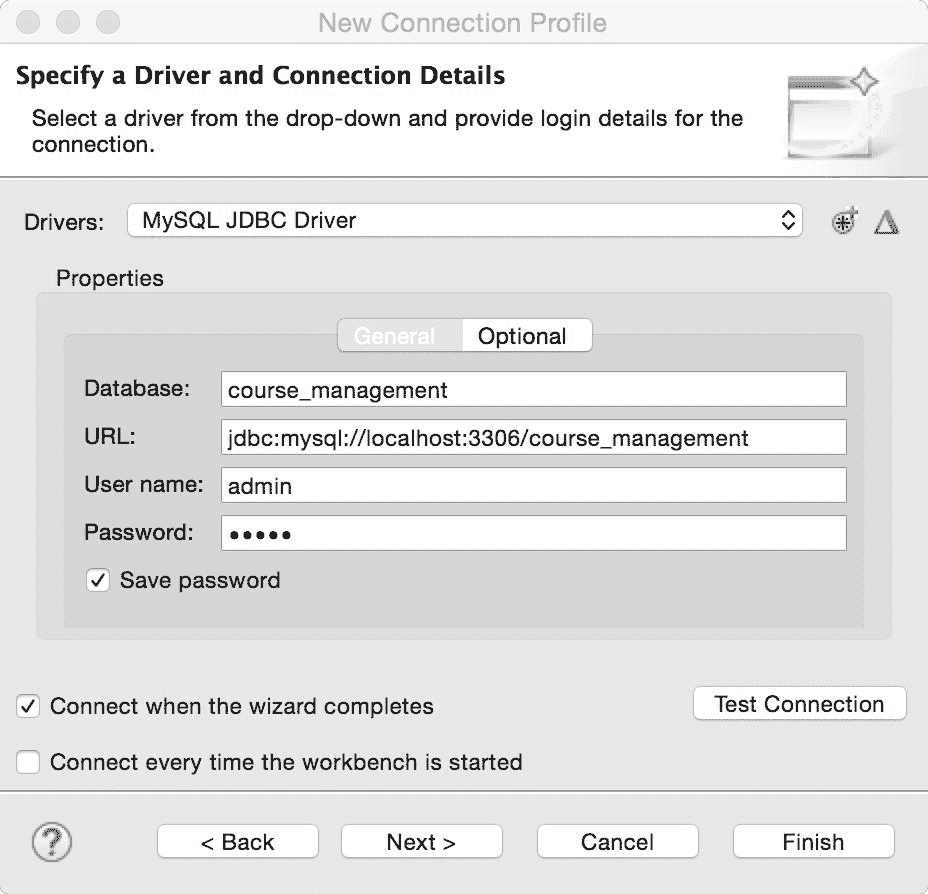

图 7.16：配置 MySQL 数据库连接

1.  选择“保存密码”复选框。点击“测试连接”按钮并确保测试成功。点击完成按钮。回到 JPA 属性页面，新的连接被添加，并选择了适当的模式：

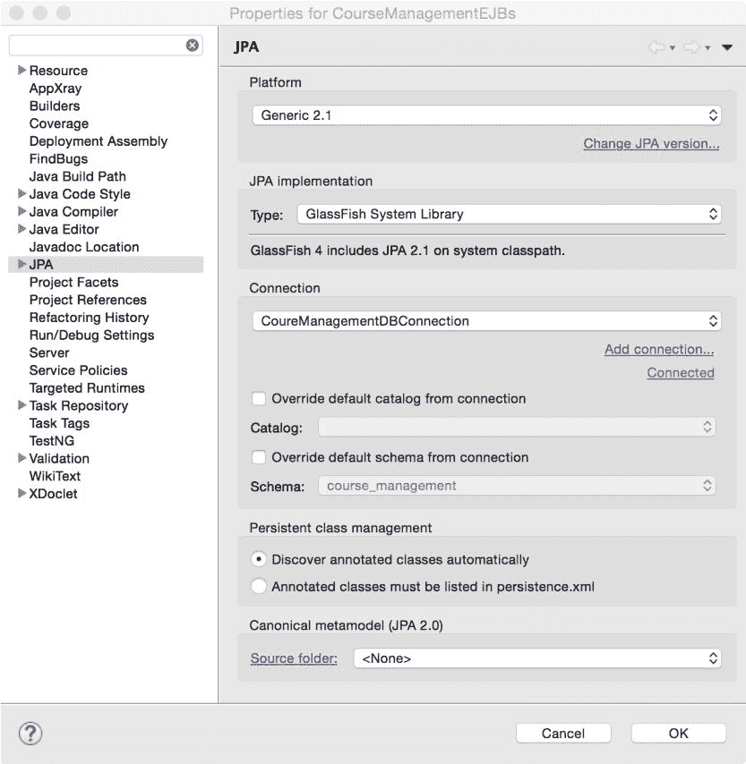

图 7.17：添加到 JPA 项目属性的连接

1.  点击确定以保存更改。

# 创建 JPA 实体

我们现在将使用 Eclipse JPA 工具为`Course`创建实体类：

1.  右键单击`CourseManagementEJBs`项目，并选择 JPA 工具 | 从表生成实体：

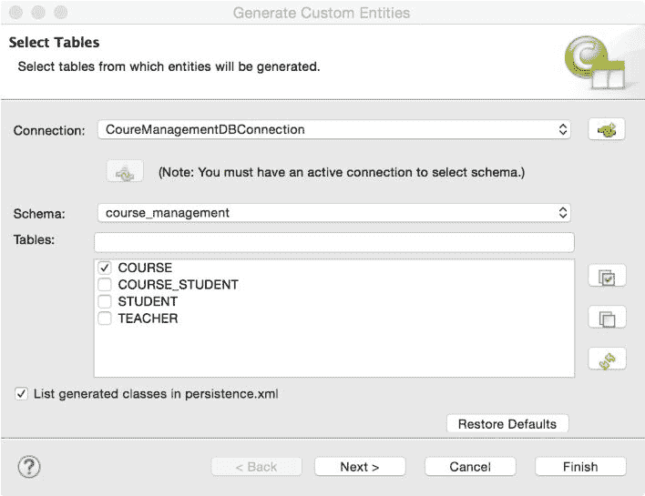

图 7.18：从表创建实体

1.  选择课程表并点击下一步。在“表关联”窗口中点击下一步。在下一页上，选择`identity`作为键生成器：

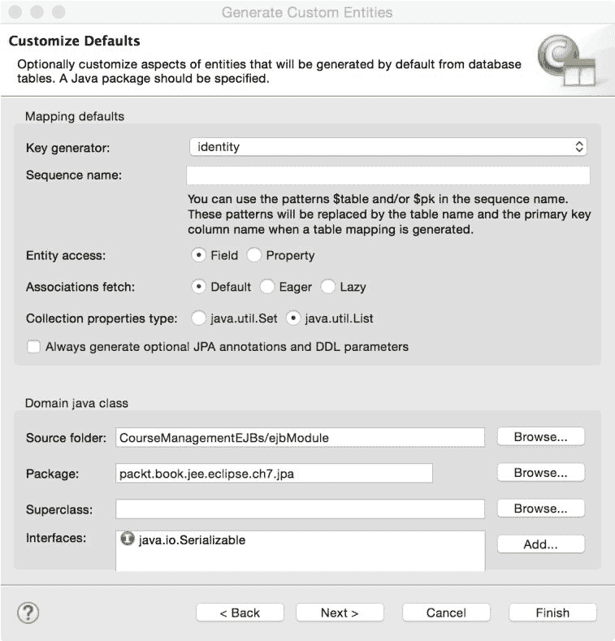

图 7.19：自定义 JPA 实体细节

1.  输入包名。我们不想在下一页上更改任何内容，因此点击完成。注意，向导为我们的类创建了一个`findAll`查询，我们可以使用它来获取所有课程：

```java
@Entity 
@NamedQuery(name="Course.findAll", query="SELECT c FROM 
 Course c") 
public class Course implements Serializable { ...} 
```

# 创建无状态 EJB

我们现在将为我们的应用程序创建无状态 EJB：

1.  在项目资源管理器中右键单击`CourseManagementEJBs`项目的`ejbModule`文件夹，并选择新建 | 会话 Bean（3.x）。在 Java 包文本框中输入`packt.book.jee.eclipse.ch7.ejb`，在类名中输入`CourseBean`。选择远程复选框：

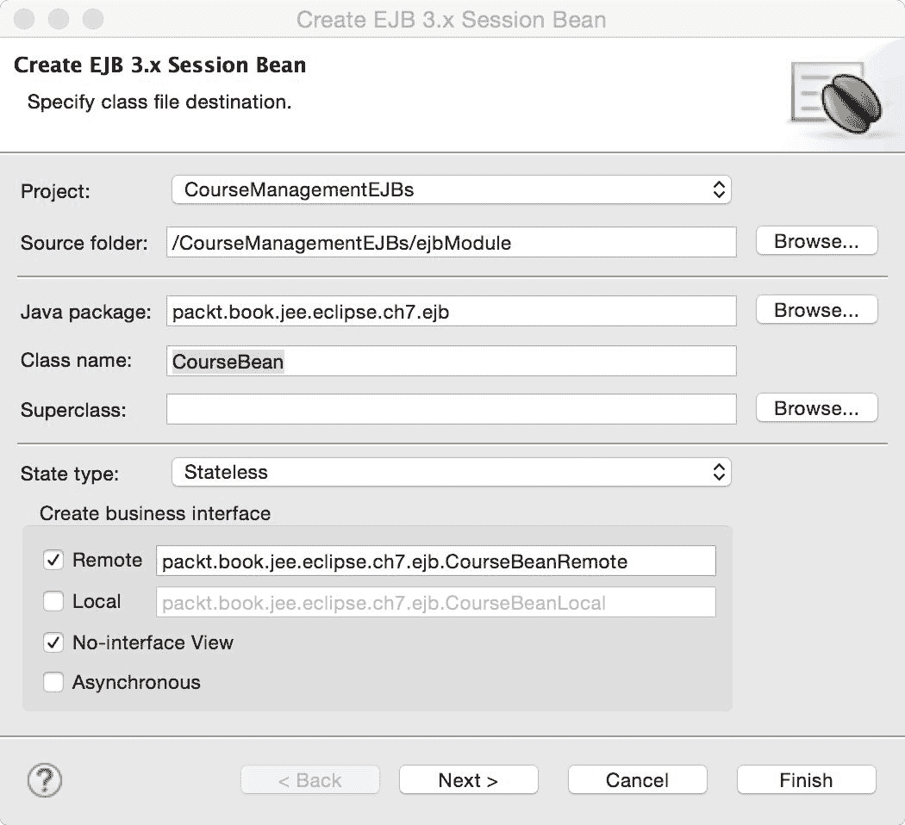

图 7.20：创建无状态会话 Bean

1.  点击下一步。在下一页上不需要进行任何更改：

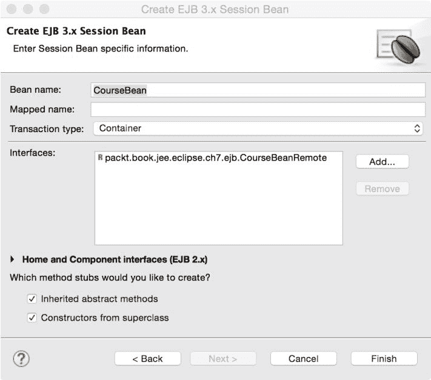

图 7.21：无状态会话 Bean 信息

1.  点击完成。一个带有`@Stateless`和`@Localbean`注解的`CourseBean`类被创建。该类还实现了在`CourseManagementEJBClient`项目中定义的`CourseBeanRemote`接口，这是一个共享接口（调用 EJB 的客户需要访问此接口）：

```java
@Stateless 
@LocalBean 
public class CourseBean implements CourseBeanRemote { 
    public CourseBean() { 
    } 
} 
```

接口被注解为`@Remote`：

```java
@Remote 
public interface CourseBeanRemote { 

} 
```

现在，问题是我们是怎样从我们的 EJB 返回 `Course` 信息的？EJB 将调用 JPA API 来获取 `Course` 实体的实例，但我们希望 EJB 返回 `Course` 实体的实例，还是应该返回轻量级的数据传输对象（**DTO**）的实例？每种方法都有其自身的优点。如果我们返回一个 `Course` 实体，那么我们就不需要在不同对象之间传输数据；这在 DTO 的情况下是必须做的（从实体传输数据到相应的 DTO）。然而，如果 EJB 客户端不在同一应用程序中，那么在层之间传递实体可能不是一个好主意，你可能不希望将你的数据模型暴露给外部应用程序。此外，通过返回 JPA 实体，你正在迫使客户端应用程序在其实现中依赖 JPA 库。

DTOs 轻量级，并且你可以仅暴露那些你希望客户端使用的字段。然而，你将不得不在实体和 DTO 之间传输数据。

如果你的 EJB 将被同一应用程序中的客户端使用，那么从 EJB 传输实体到客户端可能更容易。然而，如果你的客户端不是同一 EJB 应用程序的一部分，或者当你想将 EJB 作为 Web 服务（我们将在 第九章，*创建 Web 服务*）暴露时，你可能需要使用 DTO。

在我们的应用程序中，我们将看到两种方法的示例，即 EJB 方法返回 JPA 实体以及 DTO。记住，我们已经创建了 `CourseBean` 作为远程以及本地 Bean（无接口视图）。远程接口方法的实现将返回 DTO，而本地方法的实现将返回 JPA 实体。

现在，让我们将 `getCourses` 方法添加到 EJB 中。我们将创建 `CourseDTO`，一个数据传输对象，它是一个 POJO，并且从 `getCourses` 方法返回 DTO 的实例。此 DTO 需要位于 `CourseManagementEJBsClient` 项目中，因为它将在 EJB 和其客户端之间共享。

在 `CourseManagementEJBsClient` 项目的 `packt.book.jee.eclipse.ch7.dto` 包中创建以下类：

```java
package packt.book.jee.eclipse.ch7.dto; 

public class CourseDTO { 
  private int id; 
  private int credits; 
  private String name; 
  public int getId() { 
    return id; 
  } 
  public void setId(int id) { 
    this.id = id; 
  } 
  public int getCredits() { 
    return credits; 
  } 
  public void setCredits(int credits) { 
    this.credits = credits; 
  } 
  public String getName() { 
    return name; 
  } 
  public void setName(String name) { 
    this.name = name; 
  } 
} 
```

将以下方法添加到 `CourseBeanRemote`：

```java
public List<CourseDTO> getCourses(); 
```

我们需要在 `CourseBean` EJB 中实现此方法。要从数据库获取课程，EJB 需要先获取一个 `EntityManager` 实例。回想一下，在 第四章，*创建 JEE 数据库应用程序*，我们创建了 `EntityManagerFactory` 并从其中获取了一个 `EntityManager` 实例。然后，我们将该实例传递给服务类，该类实际上使用 JPA API 从数据库中获取数据。

JEE 应用服务器使注入`EntityManager`变得非常简单。你只需在 EJB 类中创建`EntityManager`字段，并用`@PersistenceContext(unitName="<name_as_specified_in_persistence.xml>")`注解它。如果`persistence.xml`中只定义了一个持久化单元，则`unitName`属性是可选的。打开`CourseBean`类，并添加以下声明：

```java
@PersistenceContext 
EntityManager entityManager; 
```

EJB 是受管理的对象，EJB 创建后，EJB 容器会注入`EntityManager`。

对象的自动注入是 JEE 特性的一部分，称为**上下文和依赖注入**（**CDI**）。有关 CDI 的信息，请参阅[`javaee.github.io/tutorial/cdi-basic.html#GIWHB`](https://javaee.github.io/tutorial/cdi-basic.html#GIWHB)。

现在我们给`CourseBean` EJB 添加一个方法，该方法将返回一个`Course`实体的列表。我们将把这个方法命名为`getCourseEntities`。这个方法将由同一 EJB 中的`getCourses`方法调用，然后将其转换成 DTO 列表。`getCourseEntities`方法也可以由任何 Web 应用程序调用，因为 EJB 公开了无接口视图（使用`@LocalBean`注解）：

```java
public List<Course> getCourseEntities() { 
//Use named query created in Course entity using @NameQuery 
 annotation.      TypedQuery<Course> courseQuery = 
 entityManager.createNamedQuery("Course.findAll", Course.class); 
      return courseQuery.getResultList(); 
} 
```

在实现`getCourses`方法（定义在我们的远程业务接口`CourseBeanRemote`中）之后，我们得到`CourseBean`，如下所示：

```java
@Stateless 
@LocalBean 
public class CourseBean implements CourseBeanRemote { 
  @PersistenceContext 
  EntityManager entityManager; 

    public CourseBean() { 
    } 

    public List<Course> getCourseEntities() { 
      //Use named query created in Course entity using @NameQuery 
       annotation.      TypedQuery<Course> courseQuery = 
 entityManager.createNamedQuery("Course.findAll", Course.class); 
      return courseQuery.getResultList(); 
    } 

  @Override 
  public List<CourseDTO> getCourses() { 
    //get course entities first 
    List<Course> courseEntities = getCourseEntities(); 

    //create list of course DTOs. This is the result we will 
     return 
    List<CourseDTO> courses = new ArrayList<CourseDTO>(); 

    for (Course courseEntity : courseEntities) { 
      //Create CourseDTO from Course entity 
      CourseDTO course = new CourseDTO(); 
      course.setId(courseEntity.getId()); 
      course.setName(courseEntity.getName()); 
      course.setCredits(course.getCredits()); 
      courses.add(course); 
    } 
    return courses; 
  } 
} 
```

# 创建 JSF 和管理 Bean

我们现在将在`CourseManagementWeb`项目中创建一个 JSF 页面来显示课程。我们还将创建一个管理 Bean 来调用`CourseEJB`的`getCourses`方法。有关 JSF 的详细信息，请参阅第二章的*Java 服务器页面*部分，*创建一个简单的 JEE Web 应用程序*。

如第二章中所述，*创建一个简单的 JEE Web 应用程序*，我们需要在`web.xml`中添加 JSF Servlet 和映射。从`CourseManagementWeb`项目打开`web.xml`。你可以通过双击项目资源管理器中的“部署描述符：CourseManagementWeb”节点（在项目下）或从`WebContent/Web-INF`文件夹（再次在项目下）打开此文件。在`web-app`节点内添加以下 Servlet 声明和映射：

```java
<servlet> 
  <servlet-name>JSFServlet</servlet-name> 
  <servlet-class>javax.faces.webapp.FacesServlet</servlet-class> 
  <load-on-startup>1</load-on-startup> 
</servlet> 

<servlet-mapping> 
  <servlet-name>JSFServlet</servlet-name> 
  <url-pattern>*.xhtml</url-pattern> 
</servlet-mapping> 
```

`CourseManagementWeb`项目需要访问 EJB 的业务接口，该接口位于`CourseManagementEJBsClient`中。因此，我们需要将`CourseManagementEJBsClient`的引用添加到`CourseManagementWeb`中。打开`CourseManagementWeb`项目的项目属性（在`CourseManagementWeb`项目上右键单击并选择属性），然后选择 Java 构建路径。单击“项目”选项卡，然后单击“添加...”按钮。从列表中选择`CourseManagementEJBsClient`并单击确定：

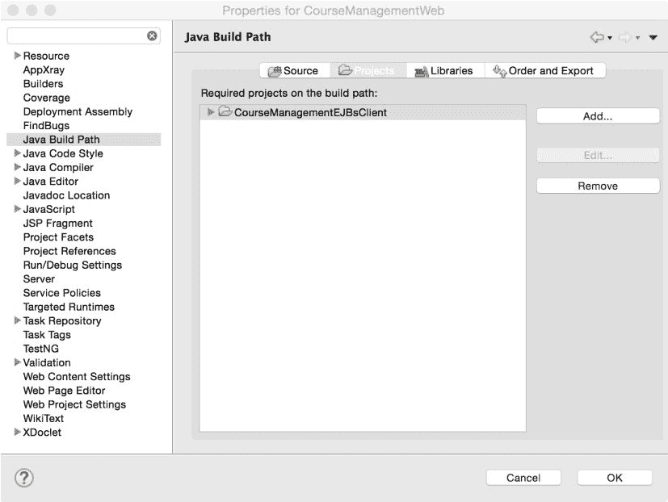

图 7.22：添加项目引用

现在，让我们为稍后要创建的 JSF 创建一个托管豆。在 `CourseManagementWeb` 项目的 `packt.book.jee.eclipse.ch7.web.bean` 包中创建一个 `CourseJSFBean` 类（Java 源文件位于 Java 资源组下的 `src` 文件夹中）：

```java
import java.util.List; 
import javax.ejb.EJB; 
import javax.faces.bean.ManagedBean; 
import packt.book.jee.eclipse.ch7.dto.CourseDTO; 
import packt.book.jee.eclipse.ch7.ejb.CourseBeanRemote; 

@ManagedBean(name="Course") 
public class CourseJSFBean { 
  @EJB 
  CourseBeanRemote courseBean; 

  public List<CourseDTO> getCourses() { 
    return courseBean.getCourses(); 
  } 
} 
```

JSF 豆是托管豆，因此我们可以使用 `@EJB` 注解让容器注入 EJB。在前面的代码中，我们使用其远程接口 `CourseBeanRemote` 引用了 `CourseBean`。然后我们创建了一个名为 `getCourses` 的方法，该方法调用 `Course` EJB 上相同名称的方法，并返回 `CourseDTO` 对象的列表。

注意，我们在 `@ManagedBean` 注解中设置了 `name` 属性。这个托管豆将通过 JSF 作为变量 `Course` 访问。

我们现在将创建 JSF 页面 `course.xhtml`。在 `CourseManagementWeb` 项目的 `WebContent` 组中右键单击，选择新建 | 文件。创建 `courses.xhtml` 并包含以下内容：

```java
<html  

 > 

<head> 
  <title>Courses</title> 
</head> 
<body> 
  <h2>Courses</h2> 
  <h:dataTable value="#{Course.courses}" var="course"> 
      <h:column> 
      <f:facet name="header">Name</f:facet> 
      #{course.name} 
    </h:column> 
      <h:column> 
      <f:facet name="header">Credits</f:facet> 
      #{course.credits} 
    </h:column> 
  </h:dataTable> 
</body> 
</html> 
```

该页面使用 `dataTable` 标签 ([`docs.oracle.com/javaee/7/javaserver-faces-2-2/vdldocs-jsp/h/dataTable.html`](https://docs.oracle.com/javaee/7/javaserver-faces-2-2/vdldocs-jsp/h/dataTable.html))，它从 `Course` 托管豆（实际上是 `CourseJSFBean` 类）接收数据以填充。表达式语言语法中的 `Course.courses` 是 `Course.getCourses()` 的简写形式。这导致调用 `CourseJSFBean` 类的 `getCourses` 方法。

`Course.courses` 返回的列表的每个元素，即 `CourseDTO` 的 `List`，都由 `course` 变量（在 `var` 属性值中）表示。然后我们使用 `column` 子标签在表中显示每门课程的名字和学分。

# 运行示例

在我们可以运行示例之前，我们需要启动 GlassFish 服务器并将我们的 JEE 应用程序部署到其中：

1.  启动 GlassFish 服务器。

1.  一旦启动，在服务器视图中右键单击 GlassFish 服务器，并选择添加和移除...菜单选项：

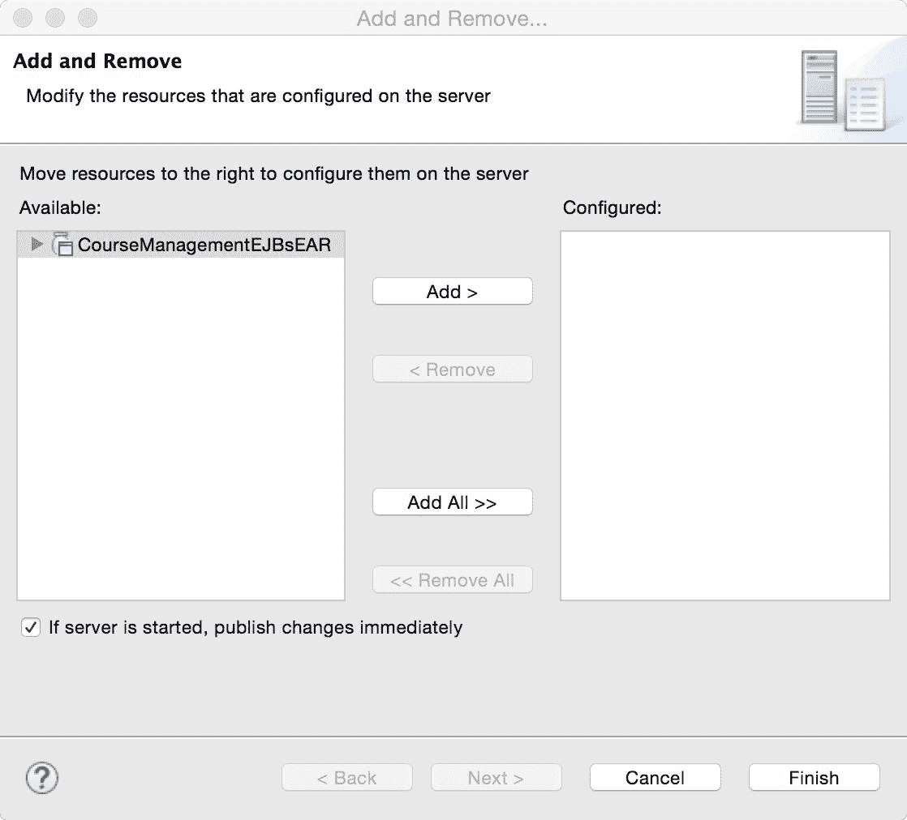

图 7.23：将项目添加到 GlassFish 以进行部署

1.  选择 EAR 项目并点击添加按钮。然后，点击完成。

    选定的 EAR 应用程序将在服务器中部署：

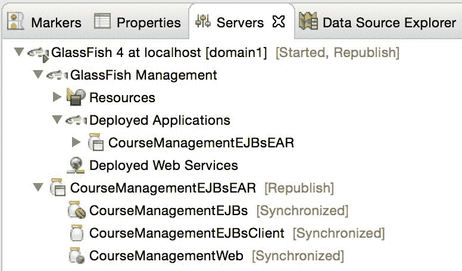

图 7.24：在 GlassFish 中部署的应用程序

1.  要运行 JSF 页面 `course.xhtml`，在项目资源管理器中右键单击它。

    然后选择运行方式 | 在服务器上运行。页面将在内部 Eclipse 浏览器中打开，MySQL 数据库中的课程将显示在页面上。

注意，我们可以在 `CourseJSFBean` 中使用 `CourseBean`（EJB）作为本地豆，因为它们位于同一应用程序中，在相同的服务器上部署。为此，在 `CourseManagementWeb` 的构建路径中添加 `CourseManagementEJBs` 项目的引用（打开 `CourseManagementWeb` 的项目属性，选择 Java 构建路径，选择项目标签，然后点击添加...按钮。选择 `CourseManagementEJBs` 项目并添加其引用）。

然后，在 `CourseJSFBean` 类中，删除 `CourseBeanRemote` 的声明并添加一个 `CourseBean`：

```java
  //@EJB 
  //CourseBeanRemote courseBean; 

  @EJB 
  CourseBean courseBean; 
```

当您对代码进行任何更改时，需要重新部署 EAR 项目到 GlassFish 服务器。在服务器视图中，您可以通过检查服务器状态来查看是否需要重新部署。如果状态是[已启动，同步]，则不需要重新部署。然而，如果状态是[已启动，重新发布]，则需要重新部署。只需单击服务器节点并选择发布菜单选项。

# 在 Eclipse 外部创建 EAR 文件进行部署

在上一节中，我们学习了如何从 Eclipse 部署应用程序到 GlassFish。这在开发过程中运行良好，但最终您需要创建 EAR 文件以部署到外部服务器。要从项目创建 EAR 文件，请右键单击 EAR 项目（在我们的示例中，它是 `CourseManagementEJBsEAR`），然后选择导出 | EAR 文件：

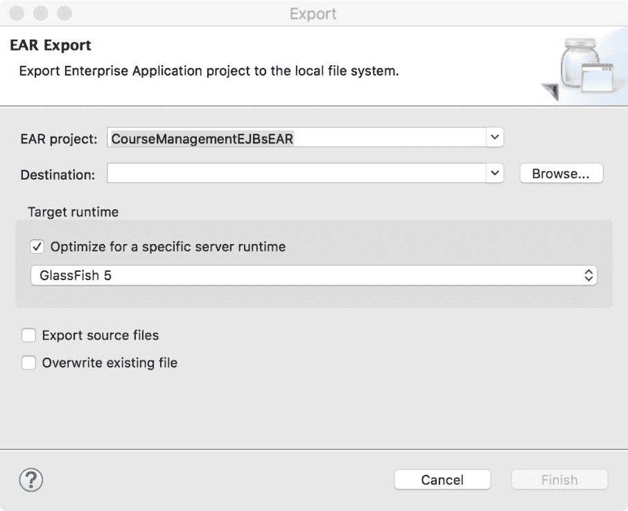

图 7.25：导出到 EAR 文件

选择目标文件夹并单击完成。然后，可以使用管理控制台或将其复制到 GlassFish 的 `autodeploy` 文件夹来部署此文件。

# 使用 Maven 创建 JEE 项目

在本节中，我们将学习如何使用 Maven 创建带有 EJB 的 JEE 项目。创建 Maven 项目可能比 Eclipse JEE 项目更可取，因为构建可以自动化。我们在上一节中看到了创建 EJB、JPA 实体和其他类的许多细节，所以这里不会重复所有这些信息。我们还学习了如何在第二章，“创建简单的 JEE Web 应用程序”和第三章，“Eclipse 中的源代码管理”中创建 Maven 项目，所以创建 Maven 项目的详细信息也不会重复。我们将主要关注如何使用 Maven 创建 EJB 项目。我们将创建以下项目：

+   `CourseManagementMavenEJBs`：该项目包含 EJB

+   `CourseManagementMavenEJBClient`：该项目包含 EJB 项目和客户端项目之间的共享接口和对象

+   `CourseManagementMavenWAR`：这是一个包含 JSF 页面和管理 Bean 的 Web 项目

+   `CourseManagementMavenEAR`：该项目创建可以部署到 GlassFish 的 EAR 文件

+   `CourseManagement`：该项目是所有之前提到的项目的整体父项目，构建所有这些项目

我们仍然从 `CourseManagementMavenEJBs` 开始。该项目应生成 EJB JAR 文件。让我们创建一个具有以下详细信息的 Maven 项目：

| **字段** | **值** |
| --- | --- |
| 组 ID | packt.book.jee.eclipse.ch7.maven |
| 艺术品 ID | CourseManagementMavenEJBClient |
| 版本 | 1 |
| 打包 | jar |

我们需要将 JEE API 的依赖项添加到我们的 EJB 项目中。让我们将`javax.javaee-api`的依赖项添加到`pom.xml`中。由于我们打算在带有自己的 JEE 实现和库的 GlassFish 中部署此项目，我们将此依赖项的范围设置为提供。在`pom.xml`中添加以下内容：

```java
  <dependencies> 
    <dependency> 
      <groupId>javax</groupId> 
      <artifactId>javaee-api</artifactId> 
      <version>8.0</version> 
      <scope>provided</scope> 
    </dependency> 
  </dependencies> 
```

当我们在本项目中创建 EJB 时，需要在共享项目（客户端项目）中创建本地或远程业务接口。因此，我们将创建`CourseManagementMavenEJBClient`，以下为详细信息：

| **字段** | **值** |
| --- | --- |
| 组 ID | packt.book.jee.eclipse.ch7.maven |
| 艺术品 ID | CourseManagementMavenEJBs |
| 版本 | 1 |
| 打包 | jar |

此共享项目还需要访问 EJB 注解。因此，将之前添加到`pom.xml`文件的`javax.javaee-api`依赖项添加到`CourseManagementMavenEJBClient`项目的`pom.xml`文件中。

我们将在本项目中创建一个`packt.book.jee.eclipse.ch7.ejb`包，并创建一个远程接口。创建一个`CourseBeanRemote`接口（就像我们在本章*创建无状态 EJB*部分的创建无状态 EJB 中创建的那样）。此外，在`packt.book.jee.eclipse.ch7.dto`包中创建一个`CourseDTO`类。此类与我们创建的*创建无状态 EJB*部分中的类相同。

我们将在`CourseManagementMavenEJBs`项目中创建一个`Course` JPA 实体。在我们这样做之前，让我们将此项目转换为 JPA 项目。在包资源管理器中右键单击项目，选择配置 | 转换为 JPA 项目。在 JPA 配置向导中，选择以下 JPA 特性详细信息：

| **字段** | **值** |
| --- | --- |
| 平台 | Generic 2.1 |
| JPA 实现 | 禁用库配置 |

JPA 向导在项目的`src`文件夹中创建一个`META-INF`文件夹，并创建`persistence.xml`文件。打开`persistence.xml`文件，点击连接选项卡。我们已经在 GlassFish 中创建了 MySQL 数据源（参见*配置 GlassFish 中的数据源*部分）。在 JTA 数据源字段中输入数据源的 JNDI 名称，`jdbc/CourseManagement`。

在`packt.book.jee.eclipse.ch7.jpa`中创建一个`Course`实体，如*创建 JPA 实体*部分所述。在我们创建本项目的 EJB 之前，让我们给本项目添加一个 EJB 特性。在项目上右键单击，选择属性。点击项目特性组，并选择 EJB 模块复选框。将版本设置为最新版本（撰写本文时，最新版本为 3.2）。我们现在将创建之前创建的远程会话 bean 接口的实现类。在`CourseManagementMavenEJBs`项目上右键单击，并选择新建 | 会话 bean 菜单。创建 EJB 类，以下为详细信息：

| **字段** | **值** |
| --- | --- |
| Java 包 | packt.book.jee.eclipse.ch7.ejb |
| 类名 | CourseBean |
| 状态类型 | 无状态 |

不要选择任何业务接口，因为我们已经在 `CourseManagementMavenEJBClient` 项目中创建了业务接口。点击“下一步”。在下一页，选择 `CourseBeanRemote`。此时 Eclipse 将显示错误，因为 `CourseManagementMavenEJBs` 不了解 `CourseManagementMavenEJBClient`，它包含 `CourseBeanRemote` 接口，该接口在 EJB 项目中的 `CourseBean` 中使用。在 `CourseManagementMavenEJBs` 中添加 `CourseManagementMavenEJBClient` 的 Maven 依赖项（在 `pom.xml` 中）并在 EJB 类中实现 `getCourses` 方法应该可以修复编译错误。现在按照本章 *创建无状态 EJB* 部分的描述完成 `CourseBean` 类的实现。确保将 EJB 标记为 `Remote`：

```java
@Stateless 
@Remote 
public class CourseBean implements CourseBeanRemote { 
... 
} 
```

让我们使用 Maven 创建一个用于课程管理的 Web 应用程序项目。创建一个具有以下详细信息的 Maven 项目：

| **字段** | **值** |
| --- | --- |
| 组 ID | packt.book.jee.eclipse.ch7.maven |
| 艺术品 ID | CourseManagementMavenWebApp |
| 版本 | 1 |
| 打包 | war |

要在此项目中创建 `web.xml`，请右键单击项目并选择 Java EE

工具 | 生成部署描述符占位符。`web.xml` 文件将在 `src/main/webapp/WEB-INF` 文件夹中创建。打开 `web.xml` 并添加 JSF 的 servlet 定义和映射（参见本章的 *创建 JSF 和托管 Bean* 部分）。在 `CourseManagementMavenWebApp` 项目的 `pom.xml` 中添加 `CourseManagementMavenEJBClient` 项目和 `javax.javaee-api` 的依赖项，以便 Web 项目能够访问共享项目中声明的 EJB 业务接口以及 EJB 注解。

现在，让我们在 Web 项目中创建一个 `CourseJSFBean` 类，如本章 *创建 JSF 和托管 Bean* 部分所述。请注意，这将引用 EJB 的远程接口，如下所示：

```java
@ManagedBean(name="Course") 
public class CourseJSFBean { 
  @EJB 
  CourseBeanRemote courseBean; 

  public List<CourseDTO> getCourses() { 
    return courseBean.getCourses(); 
  } 
} 
```

按照本章 *创建 JSF 和托管 Bean* 部分的描述，在 `webapp` 文件夹中创建 `course.xhtml`。

现在，让我们创建一个具有以下详细信息的 `CourseManagementMavenEAR` 项目：

| **字段** | **值** |
| --- | --- |
| 组 ID | packt.book.jee.eclipse.ch7.maven |
| 艺术品 ID | CourseManagementMavenEAR |
| 版本 | 1 |
| 打包 | ear |

您必须在打包文件中键入 `ear`；下拉列表中没有 `ear` 选项。将 `web`、`ejb` 和客户端项目的依赖项添加到 `pom.xml` 中，如下所示：

```java
  <dependencies> 
    <dependency> 
      <groupId>packt.book.jee.eclipse.ch7.maven</groupId> 
      <artifactId>CourseManagementMavenEJBClient</artifactId> 
      <version>1</version> 
    <type>jar</type> 
    </dependency> 
    <dependency> 
      <groupId>packt.book.jee.eclipse.ch7.maven</groupId> 
      <artifactId>CourseManagementMavenEJBs</artifactId> 
      <version>1</version> 
      <type>ejb</type> 
    </dependency> 
    <dependency> 
      <groupId>packt.book.jee.eclipse.ch7.maven</groupId> 
      <artifactId>CourseManagementMavenWebApp</artifactId> 
      <version>1</version> 
      <type>war</type> 
    </dependency> 
  </dependencies> 
```

确保正确设置每个依赖项的 `<type>`。您还需要更新任何名称更改的 JNDI URL。

Maven 没有内置支持来打包 EAR。然而，有一个针对 EAR 的 Maven 插件。您可以在[`maven.apache.org/plugins/maven-ear-plugin/`](https://maven.apache.org/plugins/maven-ear-plugin/)和[`maven.apache.org/plugins/maven-ear-plugin/modules.html`](https://maven.apache.org/plugins/maven-ear-plugin/modules.html)找到此插件的详细信息。我们需要将其添加到我们的`pom.xml`中并配置其参数。我们的 EAR 文件将包含 EJB 项目的 JAR 文件、客户端项目以及 Web 项目的 WAR 文件。右键点击 EAR 项目的`pom.xml`，选择 Maven | 添加插件。在过滤器框中输入`ear`，并在 maven-ear-plugin 下选择最新插件版本。确保您还安装了 maven-acr-plugin 插件。在`pom.xml`的详细信息中配置 EAR 插件，如下所示：

```java
<build> 
  <plugins> 
    <plugin> 
       <groupId>org.apache.maven.plugins</groupId> 
       <artifactId>maven-acr-plugin</artifactId> 
       <version>1.0</version> 
       <extensions>true</extensions> 
    </plugin> 

    <plugin> 
      <groupId>org.apache.maven.plugins</groupId> 
      <artifactId>maven-ear-plugin</artifactId> 
      <version>2.10</version> 
      <configuration> 
         <version>6</version> 
      <defaultLibBundleDir>lib</defaultLibBundleDir> 
      <modules> 
      <webModule> 
      <groupId>packt.book.jee.eclipse.ch7.maven</groupId> 
      <artifactId>CourseManagementMavenWebApp</artifactId> 
      </webModule> 
      <ejbModule> 
      <groupId>packt.book.jee.eclipse.ch7.maven</groupId> 
      <artifactId>CourseManagementMavenEJBs</artifactId> 
      </ejbModule> 
      < jarModule > 
      <groupId>packt.book.jee.eclipse.ch7.maven</groupId> 
      <artifactId>CourseManagementMavenEJBClient</artifactId> 
      </ jarModule > 
      </modules> 
      </configuration> 
    </plugin> 
    </plugins> 
  </build> 
```

修改`pom.xml`后，有时 Eclipse 可能会显示以下错误：

```java
Project configuration is not up-to-date with pom.xml. Run Maven->Update Project or use Quick Fix... 
```

在这种情况下，右键点击项目并选择 Maven | 更新项目。

在本节中我们创建的最后一个项目是`CourseManagement`，它将成为所有其他 EJB 项目的容器项目。当此项目安装时，它应该构建并安装所有包含的项目。创建一个具有以下详细信息的 Maven 项目：

| **字段** | **值** |
| --- | --- |
| 组 ID | packt.book.jee.eclipse.ch7.maven |
| 艺术品 ID | CourseManagement |
| 版本 | 1 |
| 打包 | Pom |

打开`pom.xml`并点击“概览”选项卡。展开“模块”组，并将所有其他项目作为模块添加。以下模块应列在`pom.xml`中：

```java
  <modules> 
    <module>../CourseManagementMavenEAR</module> 
    <module>../CourseManagementMavenEJBClient</module> 
    <module>../CourseManagementMavenEJBs</module> 
    <module>../CourseManagementMavenWebApp</module> 
  </modules> 
```

右键点击`CourseManagement`项目，选择运行方式 | Maven 安装。这将构建所有 EJB 项目，并在`CourseManagementMavenEAR`项目的目标文件夹中创建一个 EAR 文件。您可以从 GlassFish 的管理控制台部署此 EAR 文件，或者您可以在 Eclipse 的“服务器视图”中右键点击配置的 GlassFish 服务器，选择“添加和移除...”选项，并在 Eclipse 内部部署 EAR 项目。浏览到`http://localhost:8080/CourseManagementMavenWebApp/course.xhtml`以查看由`course.xhtml` JSF 页面显示的课程列表。

# 摘要

EJB 非常适合在 Web 应用程序中编写业务逻辑。它们可以作为 JSF、servlet 或 JSP 等 Web 界面组件与 JDO 等数据访问对象之间的完美桥梁。EJB 可以跨多个 JEE 应用程序服务器分布（这可以提高应用程序的可伸缩性），并且其生命周期由容器管理。EJB 可以轻松注入到管理对象中，或者可以使用 JNDI 查找。

Eclipse JEE 使得创建和消费 EJB 非常容易。就像我们看到的如何在 Eclipse 中配置和管理 Tomcat 一样，JEE 应用程序服务器，如 GlassFish，也可以在 Eclipse 中管理。

在下一章中，我们将学习如何使用 Spring MVC 创建 Web 应用程序。尽管 Spring 不是 JEE 的一部分，但它是一个流行的框架，用于在 JEE Web 应用程序中实现 MVC 模式。Spring 还可以与许多 JEE 规范协同工作。
