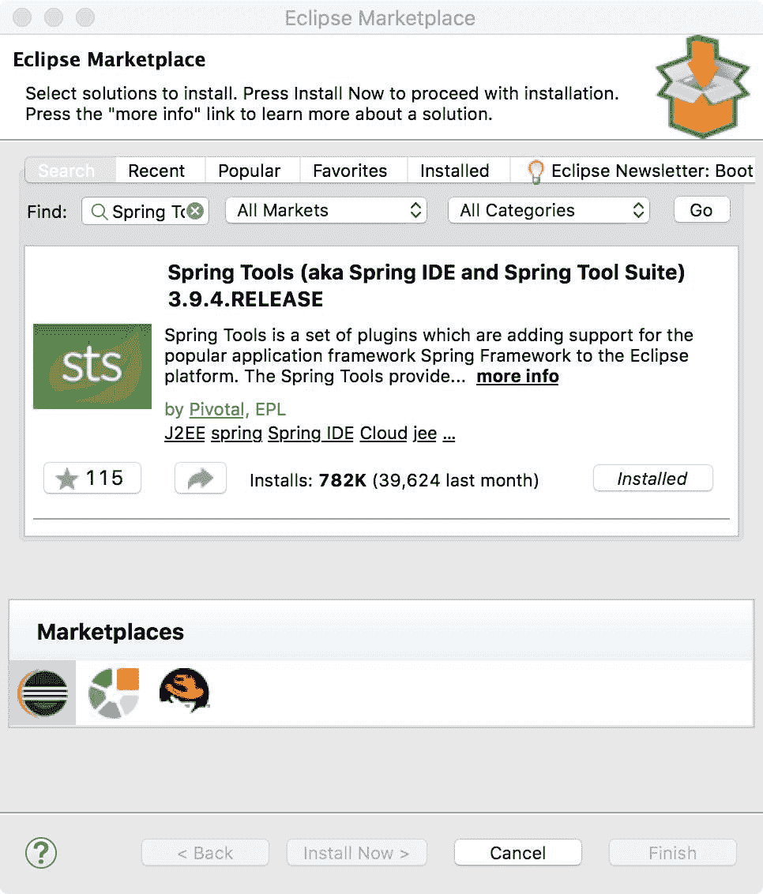
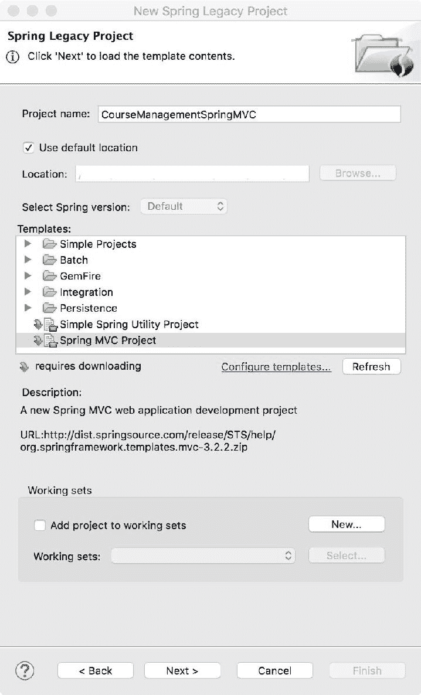
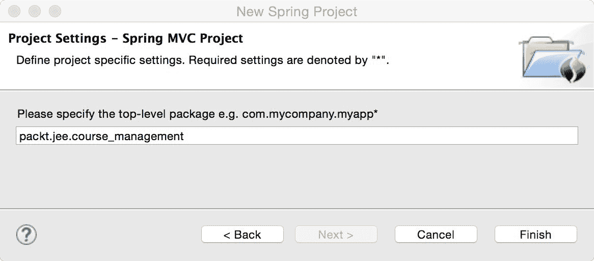
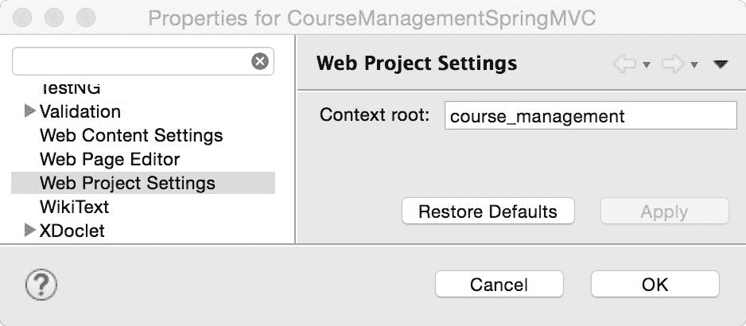
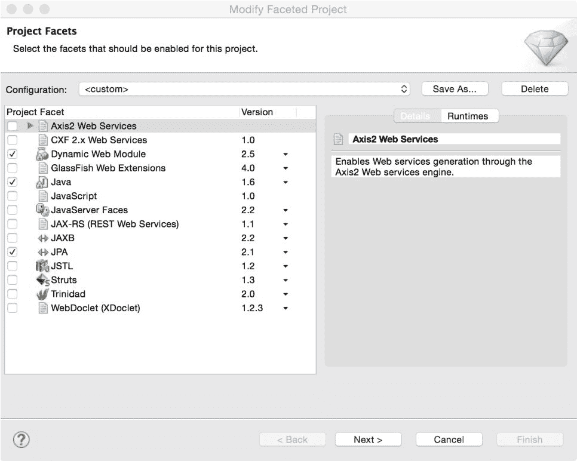
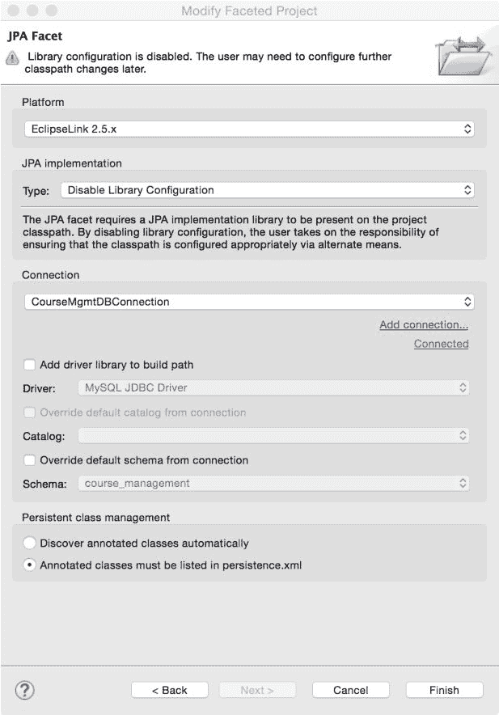
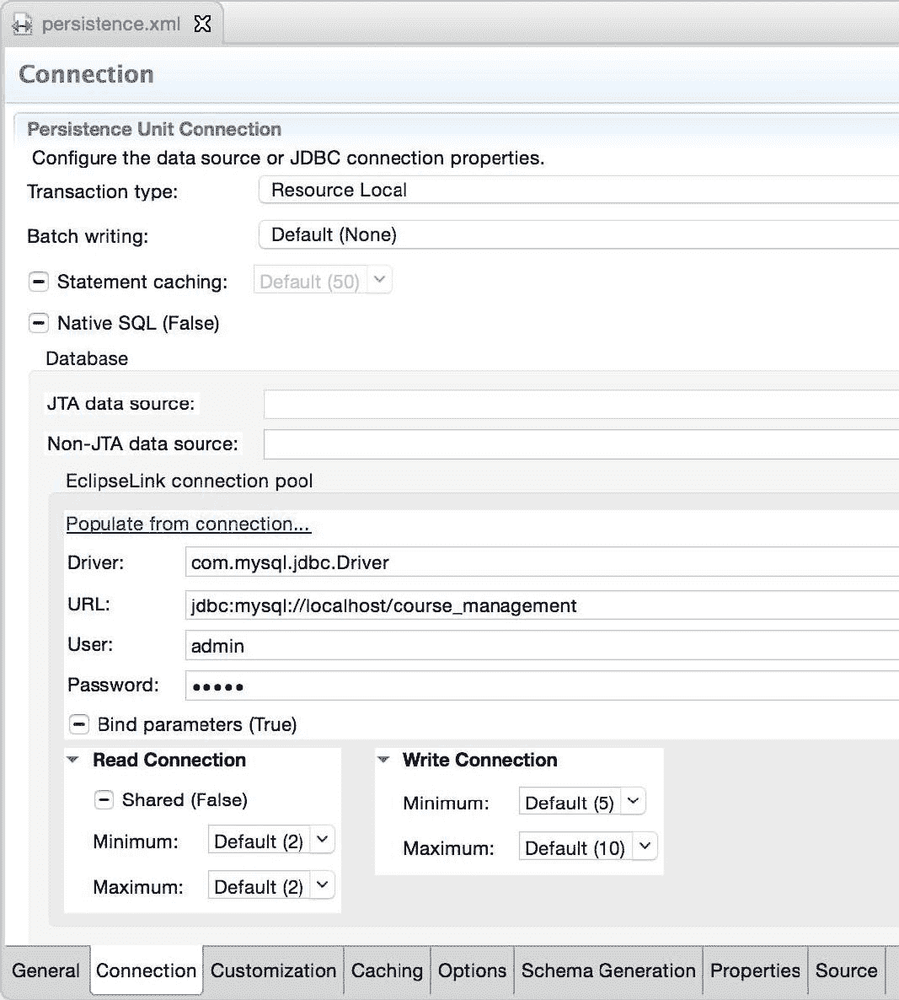
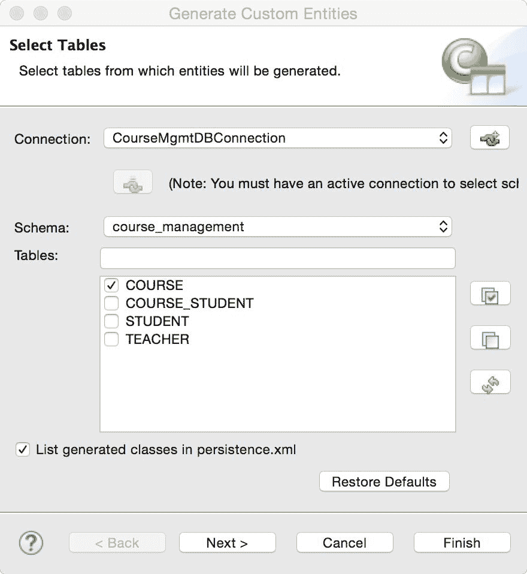
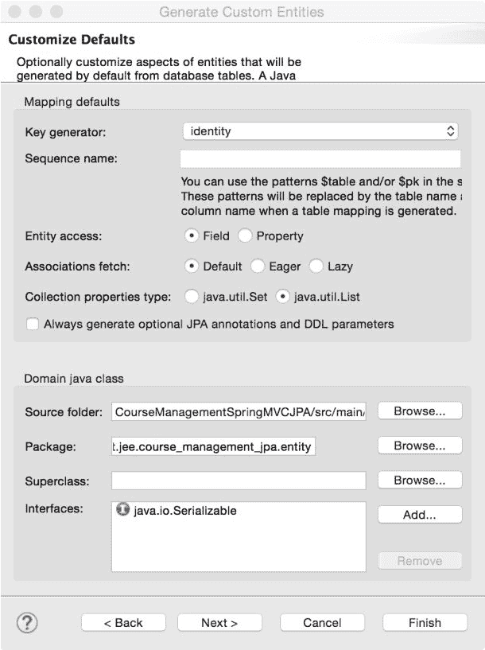
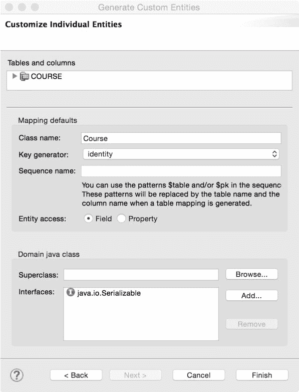

# 使用 Spring MVC 创建 Web 应用程序

在上一章中，我们学习了如何使用 EJBs 创建 JEE 应用程序。在这一章中，我们将稍微偏离核心 JEE 规范，学习 Spring MVC。

虽然这本书是关于 JEE 和 Eclipse 的，Spring MVC 不是 JEE 的一部分，但了解 Spring MVC 框架是值得的。Spring MVC 是一个非常流行的用于创建 Web 应用的框架，并且可以与其他 JEE 技术（如 servlet、JSP、JPA 和 EJBs）一起使用。

JEE 默认支持 MVC，如果你使用 JSF。有关详细信息，请参阅第二章中的*Java 服务器端面*，*创建一个简单的 JEE Web 应用程序*。然而，JSF 和 Spring MVC 的设计有所不同。JSF 是一个基于组件的 MVC 框架。它被设计成用户界面设计师可以通过组装由 JSF 提供或自定义开发的可重用组件来创建页面。Spring MVC 是一个基于请求-响应的 MVC 框架。如果你熟悉编写 JSP 或 servlet，那么 Spring MVC 将比 JSF 更容易使用。你可以在 Ed Burns 的[`www.oracle.com/technetwork/articles/java/mvc-2280472.html`](http://www.oracle.com/technetwork/articles/java/mvc-2280472.html)上找到关于基于组件的 MVC（由 JSF 实现）和基于请求-响应的 MVC（由 Spring MVC 实现）的良好描述。MVC 的 JSR 371 原本应该是 JEE 8 的一部分，但这个 JSR 后来从 JEE 8 规范中撤回。你可以在[`www.mvc-spec.org/`](https://www.mvc-spec.org/)上找到更多关于 JSR 371（也称为 MVC 1.0）的信息。

在我们了解 Spring MVC 是如何工作之前，我们需要了解 MVC 框架是什么。**MVC**代表**模型-视图-控制器**。我们将在 Java Web 应用程序的上下文中引用 MVC 框架，尽管应该在这里提到，MVC 模式也常用于桌面应用程序：

+   **模型**：模型包含视图用于创建输出的数据。在我们这本书中跟随的示例中，*课程管理*应用程序，如果你有一个包含要在页面上显示的课程信息的`Course`类，那么这个`Course`对象可以被称为模型。

    MVC 的一些定义也包括在模型层实现业务逻辑的类。例如，一个`CourseService`类，它接受一个`Course`对象并调用`CourseDAO`将`Course`保存到数据库中，也可以被认为是模型层的一部分。

+   **视图**：视图是显示给用户的页面。一个显示课程列表的 JSP 可以被认为是视图层的一部分。视图持有模型对象的引用，并使用它包含的数据来创建用户在浏览器中看到的页面。

+   **控制器**：控制器是模型和视图之间的粘合剂。它处理来自网络客户端（例如，浏览器）的请求/操作，调用模型来处理业务逻辑，并将模型对象提供给视图以创建要返回给客户端的页面（用户界面）。控制器可以是 servlet，如 JSF 的情况，或者可以是 POJO（如 Spring MVC 的情况）。当控制器是 POJO 时，通常由`DispatcherServlet`调用。`DispatcherServlet`是一个接收请求并将其调度到配置中的一个控制器上的 servlet。我们将在本章后面看到这个示例。

MVC 提供了关注点的分离；也就是说，用户界面和业务逻辑的代码是分开的。正因为如此，UI 和业务层可以很大程度上独立地进行修改。当然，由于 UI 通常显示由业务层生成的数据，因此可能并不总是能够独立于其他层对每一层进行修改。具备适当技能的开发者可以独立地对每一层进行工作。UI 专家无需过分担心业务层的实现方式，反之亦然。

在本章中，我们将涵盖以下主题：

+   Spring 依赖注入简介

+   配置 Spring Bean 并将它们注入到应用程序中

+   使用 Eclipse 插件和 JEE 规范（如 JDBC、JPA 和 JSP）创建 Spring MVC 应用程序

# 依赖注入

Spring MVC 是 Spring 框架整体的一部分。Spring 框架的核心特性是**依赖注入**（**DI**）。Spring 框架的几乎所有其他特性都使用了 DI。由依赖注入框架管理的对象不是直接在代码中实例化的（例如，使用`new`运算符）。我们可以称它们为*管理对象*。这些对象是由 DI 框架（如 Spring）创建的。因为这些对象是由框架创建的，所以框架在决定如何设置对象中的值以及从哪里获取它们方面具有更多的灵活性。例如，你的**数据访问对象**（**DAO**）类可能需要一个数据库连接工厂对象的实例。然而，你不需要在 DAO 类中实例化它，你只需告诉 DI 框架，当它实例化 DAO 时，它必须设置连接池工厂成员变量的值。当然，连接池工厂的参数必须在某处进行配置，并且为 DI 框架所知。

当一个类实例化另一个类时，它们之间存在紧密的依赖关系。如果你希望独立于其他类测试类，这种设计可能会成为问题。例如，你可能想测试一个具有业务逻辑的类，但它也引用了一个 DAO，而 DAO 又依赖于一个 JDBC 连接对象。当你测试第一个类时，你必须实例化 DAO 并配置连接池。正如我们在第五章“单元测试”中看到的，单元测试应该能够在没有任何外部依赖的情况下运行。实现这一目标的一种方法是通过使用 DI。我们不是实例化 DAO 类，而是让我们的类引用由 DAO 实现的接口，并在运行时由 DI 框架注入该接口的实现。当你对这个类进行单元测试时，可以配置 DI 框架注入一个实现了所需接口的模拟对象。因此，DI 使得对象之间能够实现松耦合。

# Spring 中的依赖注入

因为依赖注入（DI）是 Spring 框架的核心，让我们花些时间来了解它在 Spring 中的工作方式。为此，我们将创建一个独立的应用程序。创建一个简单的 Maven 项目。为 Spring 框架添加以下依赖项：

```java
    <dependency> 
      <groupId>org.springframework</groupId> 
      <artifactId>spring-context</artifactId> 
      <version>5.0.5.RELEASE</version> 
    </dependency> 
```

将前面的版本号替换为 Spring 的最新版本。由 Spring 的 DI 容器管理的类被称为 bean 或组件。你可以要么在 XML 文件中声明 bean，要么在类上使用注解。在本章中，我们将使用注解。然而，尽管我们使用了注解，我们仍需要在 XML 文件中指定最小配置。因此，在你的项目`src/main/resource`文件夹中创建一个 XML 文件，并将其命名为`context.xml`。我们在`src/main.resource`文件夹中创建此文件的原因是，此文件夹中的文件将在类路径中可用。接下来，将以下内容添加到`context.xml`文件中：

```java
<?xml version="1.0" encoding="UTF-8"?> 
<beans xmlns="http://www.springframework.org/schema/beans" 
    xmlns:xsi="http://www.w3.org/2001/XMLSchema-instance" 
    xmlns:context="http://www.springframework.org/schema/context" 
   xsi:schemaLocation="http://www.springframework.org/schema/beans
        http://www.springframework.org/schema/beans/spring-beans.xsd
        http://www.springframework.org/schema/context
        http://www.springframework.org/schema/context/spring-context.xsd"> 
        <context:component-scan base-package="packt.jee.eclipse.spring"/> 
</beans> 
```

通过使用`<context:component-scan>`标签，我们告诉 Spring 框架扫描`base-package`文件夹，然后查找带有`@Component`注解的类，并将它们识别为受管理的类，以便在注入依赖项时可以使用。在前面的例子中，`packt.jee.eclipse.spring`包（及其子包）中的所有类都将被扫描以识别组件。

从配置文件中读取的信息必须保存到一个对象中。在 Spring 中，它被保存在`ApplicationContext`接口的一个实例中。`ApplicationContext`有不同的实现方式。我们将使用`ClassPathXmlApplicationContext`类，它在类路径中查找配置 XML 文件。

我们现在将创建两个 Spring 组件。第一个是`CourseDAO`，第二个是`CourseService`。尽管我们不会在这些类中编写任何业务逻辑（此示例的目的是了解 Spring 中的 DI 如何工作），但假设`CourseDAO`可能有访问数据库的代码，而`CourseService`调用`CourseDAO`来执行数据库操作。因此，`CourseService`依赖于`CourseDAO`。为了使代码简单，我们不会为`CourseDAO`创建任何接口，而是将直接依赖。按照以下方式创建`CourseDAO`类：

```java
package packt.jee.eclipse.spring; 

import org.springframework.stereotype.Component; 

@Component 
public class CourseDAO { 

} 
```

在`CourseDAO`中，我们将没有方法，但如前所述，它可能有访问数据库的方法。`@Component`将此类标记为由 Spring 管理。现在，创建`CourseService`类。此类需要一个`CourseDAO`实例：

```java
package packt.jee.eclipse.spring; 

import org.springframework.beans.factory.annotation.Autowired; 
import org.springframework.stereotype.Component; 

@Component 
public class CourseService { 

  @Autowired 
  private CourseDAO courseDAO; 

  public CourseDAO getCourseDAO() { 
    return courseDAO; 
  } 
} 
```

我们已声明一个名为`courseDAO`的成员变量，并使用`@Autowired`进行了注解。这告诉 Spring 在其上下文中查找（`CourseDAO`类型的）组件并将其分配给`courseDAO`成员。

我们现在将创建主类。它创建`ApplicationContext`，获取`CourseService`豆/组件，调用`getCourseDAO`方法，然后检查它是否被正确注入。创建`SpringMain`类：

```java
package packt.jee.eclipse.spring; 

import org.springframework.context.ApplicationContext; 
import org.springframework.context.support.ClassPathXmlApplicationContext; 

public class SpringMain { 

  public static void main (String[] args) { 
    //create ApplicationContext 
    ApplicationContext ctx = new 
     ClassPathXmlApplicationContext("context.xml"); 
    //Get bean 
    CourseService courseService = (CourseService) 
     ctx.getBean("courseService"); 
    //Get and print CourseDAO. It should not be null 
    System.out.println("CourseDAO = " + 
     courseService.getCourseDAO()); 
  } 
} 
```

我们首先创建一个`ClassPathXmlApplicationContext`实例。配置 XML 文件作为参数传递给构造函数。然后我们获取`courseService`豆/组件。注意指定豆名称时的命名约定；它是类名，首字母小写。然后我们获取并打印`CourseDAO`的值。值不会显示任何有意义的信

在前面的代码中，我们看到了在成员声明处注入对象的一个示例（这也可以称为属性注入）。我们也可以在构造函数中注入此对象：

```java
@Component 
public class CourseService { 

  private CourseDAO courseDAO; 

  @Autowired 
  public CourseService (CourseDAO courseDAO) { 
    this.courseDAO = coueseDAO; 
  } 

  public CourseDAO getCourseDAO() { 
    return courseDAO; 
  } 
} 
```

注意，`@Autowired`注解已移动到构造函数中，并且单个构造函数参数是自动注入的。您也可以在设置器中注入对象：

```java
@Component 
public class CourseService { 

  private CourseDAO courseDAO; 

  @Autowired 
  public void setCourseDAO (CourseDAO courseDAO) { 
    this.courseDAO = courseDAO; 
  } 

  public CourseDAO getCourseDAO() { 
    return courseDAO; 
  } 
} 
```

# 组件作用域

您可以在 Spring MVC 中指定组件的作用域。默认作用域是单例，这意味着在上下文中将只有一个组件实例。对每个此组件的请求都将使用相同的实例。其他作用域如下：

+   **原型**：为每个组件请求提供该类的新实例。

+   **请求**：适用于 Web 应用程序。为每个 HTTP 请求创建的组件类的单个实例。

+   **会话**：为每个 HTTP 会话创建的组件类的单个实例。用于 Web 应用程序。

+   **全局会话**：为全局 HTTP 会话创建的组件类的单个实例。用于 portlet 应用程序。

+   **应用程序**：在 Web 应用程序中组件类的单个实例。该实例由该应用程序中的所有会话共享。

有关 Spring 中组件作用域的更多信息，请访问[`docs.spring.io/spring/docs/current/spring-framework-reference/core.html#beans-factory-scopes`](https://docs.spring.io/spring/docs/current/spring-framework-reference/core.html#beans-factory-scopes)。

如果在请求组件时该组件尚未实例化，那么 Spring 将创建该组件的一个实例。在先前的例子中，我们没有指定`CourseDAO`组件的作用域，因此如果有另一个请求注入`CourseDAO`，则将注入相同的实例。你可以在`@Component`注解中指定作用域。如果你想覆盖 Spring 给组件提供的默认名称，也可以指定组件名称。

要查看在没有指定作用域的情况下是否注入了组件的单个实例，让我们更改`SpringMain`类中的`main`方法并调用两次`getBean`方法：

```java
  public static void main (String[] args) { 
    //create ApplicationContext 
    ApplicationContext ctx = new 
     ClassPathXmlApplicationContext("context.xml"); 
    //call and print ctx.getBean first time 
    System.out.println("Course Service 1 - " + 
     ctx.getBean("courseService"));    System.out.println("Course Service 2 - " + 
     ctx.getBean("courseService")); 
  } 
```

运行应用程序，你应该会看到打印出相同的`courseService` bean 实例。现在让我们改变`CourseService`组件的作用域：

```java
@Component 
@Scope(ConfigurableBeanFactory.SCOPE_PROTOTYPE) 
public class CourseService { 
  //content remains the same 
} 
```

再次运行应用程序；这次，你应该会看到`CourseService`组件的不同实例。

当 Spring 遇到`@Autowire`注解时，它会尝试通过类型查找组件。在先前的例子中，`courseDAO`被注解为`@Autowire`。Spring 会尝试找到一个`CourseDAO`类型的组件；它找到一个`CourseDAO`的实例并将其注入。但如果上下文中存在该类的多个实例呢？在这种情况下，我们可以使用`@Qualifier`注解来唯一标识组件。现在让我们创建`ICourseDAO`接口，该接口将由两个组件实现，即`CourseDAO`和`CourseDAO1`：

```java
public interface ICourseDAO { 
} 
```

`CourseDAO`实现了`ICourseDAO`，并且被唯一限定为`"courseDAO"`：

```java
@Component 
@Qualifier("courseDAO") 
public class CourseDAO implements ICourseDAO { 
} 
```

`CourseDAO1`实现了`ICourseDAO`，并且被唯一限定为`"courseDAO1"`：

```java
@Component 
@Qualifier("courseDAO1") 
public class CourseDAO1 implements ICourseDAO { 
} 
```

在`CourseService`类中，我们将使用限定符来唯一标识我们想要注入`CourseDAO`还是`CourseDAO1`：

```java
@Component 
public class CourseService { 

  @Autowired 
  private @Qualifier("courseDAO1") ICourseDAO courseDAO; 

  public ICourseDAO getCourseDAO() { 
    return courseDAO; 
  } 
} 
```

限定符也可以在方法参数中指定，例如：

```java
@Autowired 
public void setCourseDAO (@Qualifier("courseDAO1") ICourseDAO 
 courseDAO) { 
  this.courseDAO = courseDAO; 
} 
```

现在运行应用程序。你应该会在控制台看到打印出一个`CourseDAO1`实例。

我们已经介绍了 Spring 中依赖注入的基本知识。然而，Spring 提供的依赖注入选项和功能比我们在这里介绍的要多得多。在本章中，我们将根据需要看到更多的 DI 功能。

有关 Spring 中依赖注入的更多信息，请访问[`docs.spring.io/spring/docs/current/spring-framework-reference/core.html#beans-dependencies`](https://docs.spring.io/spring/docs/current/spring-framework-reference/core.html#beans-dependencies)。

# 安装 Spring Tool Suite

**Spring Tool Suite**（**STS**）是 Eclipse 中用于创建 Spring 应用的一组工具。它既可以作为 Eclipse JEE 现有安装的插件安装，也可以独立安装。STS 的独立版本也包含在 Eclipse EE 中，因此 STS 也提供了所有 Eclipse Java EE 开发功能。您可以从[`spring.io/tools`](https://spring.io/tools)下载 STS。由于我们已安装 Eclipse EE，我们将以插件的形式安装 STS。在 Eclipse Marketplace 中安装 STS 插件的最简单方法是选择“帮助 | Eclipse Marketplace...”菜单。

在查找框中输入`Spring Tool Suite`，然后点击“Go”按钮：



图 8.1：在 Eclipse Marketplace 中搜索 STS

点击“安装”。下一页将显示将要安装的 STS 功能。点击“确认”以安装所选功能。

# 创建 Spring MVC 应用

Spring MVC 可用于创建 Web 应用。它提供了一个简单的框架，将传入的 Web 请求映射到处理类（控制器）并创建动态 HTML 输出。它是 MVC 模式的实现。控制器和模型作为 POJO 创建，视图可以使用 JSP、JSTL、XSLT 甚至 JSF 创建。然而，在本章中，我们将专注于使用 JSP 和 JSTL 创建视图。

您可以在[`docs.spring.io/spring/docs/current/spring-framework-reference/web.html`](https://docs.spring.io/spring/docs/current/spring-framework-reference/web.html)找到 Spring 网络文档。

Spring MVC 通过四层处理网络请求：

+   **前端控制器**：这是一个配置在`web.xml`中的 Spring servlet。根据请求 URL 模式，它将请求传递到控制器。

+   **控制器**：这些是带有`@Controller`注解的 POJO。对于您编写的每个控制器，您需要指定控制器预期处理的 URL 模式。子 URL 模式也可以在方法级别指定。我们将在稍后看到这方面的示例。控制器可以访问模型以及 HTTP 请求和响应对象。控制器可以将请求的处理委托给其他业务处理对象，获取结果，并填充模型对象，该对象由 Spring MVC 提供给视图。

+   **模型**：这些是数据对象。控制器和视图层可以设置和获取模型对象中的数据。

+   **视图**：这些通常是 JSP 页面，但 Spring MVC 也支持其他类型的视图。请参阅 Spring 文档中的视图技术[`docs.spring.io/spring/docs/current/spring-framework-reference/web.html#mvc-view`](https://docs.spring.io/spring/docs/current/spring-framework-reference/web.html#mvc-view)。

我们将通过示例学习本章的 Spring MVC，就像我们在本书的一些其他章节中学习的那样。我们将使用 Spring MVC 创建同一**课程管理**应用的一部分。该应用将显示课程列表，并提供添加、删除和修改课程的功能。

# 创建 Spring 项目

首先，确保你在 Eclipse EE 中安装了 STS。从 Eclipse 菜单中选择 File | New | Other，然后选择 Spring | Spring Legacy Project 选项。输入项目名称并选择 Spring MVC Project 模板：



图 8.2：选择 Spring MVC 项目模板

点击下一步。页面将要求你输入顶级包名：



图 8.3：输入顶级包名

无论你输入什么作为顶级包，向导都会将第三个子包作为应用程序名称。当应用程序在服务器上部署时，应用程序名称变为上下文名称。例如，如果你输入的包名为`packt.jee.course_management`，那么`course_management`将成为应用程序名称，本地机器上应用程序的基本 URL 将是`http://localhost:8080/course_management/`。

点击完成。这将创建一个包含所需库的 Maven 项目，用于 Spring MVC。

# 理解 Spring MVC 项目模板创建的文件

让我们检查模板创建的一些文件：

+   `src/main/webapp/WEB-INF/web.xml`: 在这里声明了一个前端控制器 servlet 以及其他配置：

```java
<!-- Processes application requests --> 
<servlet> 
  <servlet-name>appServlet</servlet-name> 
  <servlet- 
 class>org.springframework.web.servlet.DispatcherServlet</servlet-class> 
  <init-param> 
    <param-name>contextConfigLocation</param-name> 
    <param-value>/WEB-INF/spring/appServlet/servlet- 
     context.xml</param-value> 
  </init-param> 
  <load-on-startup>1</load-on-startup> 
</servlet> 
```

`DispatcherServlet`是前端控制器 servlet。它传递上下文（XML）文件的路径以配置 Spring DI。回想一下，在独立 Spring 应用程序中，我们创建了`context.xml`来配置依赖注入。`DispatcherServlet` servlet 被映射来处理对此 Web 应用程序的请求。

+   `src/main/webapp/WEB-INF/spring/appServlet/servlet-context.xml`：Spring DI 的上下文配置。此文件中的一些显著配置参数如下：

```java
<annotation-driven /> 
```

这启用了在类级别配置依赖注入的注解：

```java
<resources mapping="/resources/**" location="/resources/" /> 
```

静态文件，如 CSS、JavaScript 和图像，可以放置在`resources`文件夹中（`src/main/webapp/resources`）：

```java
<beans:bean 
 class="org.springframework.web.servlet.view.InternalResourceViewResolver"> 
  <beans:property name="prefix" value="/WEB-INF/views/" /> 
  <beans:property name="suffix" value=".jsp" /> 
</beans:bean> 
```

这告诉 Spring 使用`InternalResourceViewResolver`类来解析视图。此 bean 的属性告诉`InternalResourceViewResolver`类在`/WEB-INF/views`文件夹中查找视图文件。此外，视图将是 JSP 文件，如后缀属性所示。我们的视图将是`src/main/webapp/WEB-INF/views`文件夹中的 JSP 文件：

```java
<context:component-scan base-package="packt.jee.course_management" /> 
```

这告诉 Spring 扫描`packt.jee.course_management`包及其子包以搜索组件（由`@Component`注解）。

默认模板还创建了一个控制器和一个视图。控制器类是你在 Spring 项目向导中指定的包中的`HomeController`（在我们的例子中是`packt.jee.course_management`）。Spring MVC 中的控制器由调度器 servlet 调用。控制器通过`@Controller`注解。要映射请求路径到控制器，你使用`@RequestMapping`注解。让我们看看模板在`HomeController`类中生成的代码：

```java
@Controller 
public class HomeController { 

  private static final Logger logger = 
   LoggerFactory.getLogger(HomeController.class); 

  /** 
   * Simply selects the home view to render by returning its name. 
   */ 
  @RequestMapping(value = "/", method = RequestMethod.GET) 
  public String home(Locale locale, Model model) { 
    logger.info("Welcome home! The client locale is {}.", locale); 

    Date date = new Date(); 
    DateFormat dateFormat = 
 DateFormat.getDateTimeInstance(DateFormat.LONG, DateFormat.LONG, locale); 

    String formattedDate = dateFormat.format(date); 

    model.addAttribute("serverTime", formattedDate ); 

    return "home"; 
  } 
} 
```

`home`方法被`@RequestMapping`注解。映射的值是`/`，这告诉 Dispatcher Servlet 将所有传入的请求发送到这个方法。`method`属性告诉 Dispatcher 只对 HTTP 请求的`GET`类型调用`home`方法。`home`方法接受两个参数，即`Locale`和`Model`；这两个都是在运行时由 Spring 注入的。`@RequestMapping`注解还告诉 Spring 在调用`home`方法时插入任何依赖项，因此`locale`和`model`会自动注入。

该方法本身并没有做什么；它获取当前的日期和时间，并将其设置为 Model 的属性。在 Model 中设置的任何属性都对 View（JSP）可用。该方法返回一个字符串，`"home"`。这个值被 Spring MVC 用来解析要显示的 View。我们在之前的`servlet-context.xml`中看到的`InternalResourceViewResolver`将这个值解析为`/WEB-INF/views`文件夹中的`home.jsp`。`home.jsp`在`<body>`标签中有以下代码：

```java
<P>  The time on the server is ${serverTime}. </P> 
```

`serverTime`变量来自`HomeController`的`home`方法中设置的 Model 对象。

要运行此项目，我们需要在 Eclipse 中配置一个服务器并将此项目添加到服务器中。请参考第二章中的*在 Eclipse 中配置 Tomcat*和*在 Tomcat 中运行 JSP*部分，*创建一个简单的 JEE Web 应用程序*。

一旦你配置了 Tomcat 并将项目添加到其中，启动服务器。然后，在项目上右键单击并选择 Run As | Run on Server。你应该在 Eclipse 的内部浏览器中看到一个带有时间戳的 hello 消息。浏览器地址栏中的 URL 应该是`http://localhost:8080/course_management/`，假设 Tomcat 部署在端口`8080`，上下文名称（从顶级包名派生）是`course_management`。如果你想更改默认的上下文名称或删除上下文，即以根上下文部署应用程序，那么打开项目属性（在项目上右键单击并选择 Properties）并转到 Web Project Settings。你可以从这个页面更改上下文根名称或删除它：



图 8.4：上下文根设置

对于我们的*课程管理*应用程序，我们不需要`HomeController`类或`home.jsp`，所以你可以继续删除这些文件。

# 使用 JDBC 构建 Spring MVC 应用程序

在本节中，我们将使用 Spring MVC 和 JDBC 构建课程管理应用程序的一部分。该应用程序将显示课程列表以及添加、删除和修改课程的选项。我们将继续使用上一节中创建的项目。随着我们的进行，我们将学习使用 JDBC 作为数据访问的许多 Spring 特性。

首先，我们将配置我们的数据源。我们将使用与第四章，*创建 JEE 数据库应用*中*创建数据库模式*部分创建的相同 MySQL 数据库。

# 配置数据源

在春季，您可以在 Java 代码或 XML 配置（上下文）文件中配置 JDBC 数据源。在我们看到如何配置数据源之前，我们需要在 Maven 中添加一些依赖项。在本章中，我们将使用 Apache 的 Commons DBCP 组件来实现连接池（回想一下，在第四章，*创建 JEE 数据库应用*中，我们选择了 Hikari 连接池）。有关 Apache DBCP 的详细信息，请访问[`commons.apache.org/proper/commons-dbcp/`](https://commons.apache.org/proper/commons-dbcp/)。除了添加 Apache DBCP 的依赖项之外，我们还需要添加 Spring JDBC 和 MySQL JDBC 驱动程序的依赖项。将以下依赖项添加到项目的`pom.xml`文件中：

```java
<!-- Spring JDBC --> 
<dependency> 
  <groupId>org.springframework</groupId> 
  <artifactId>spring-jdbc</artifactId> 
  <version>${org.springframework-version}</version> 
</dependency> 

<!-- Apache DBCP --> 
<dependency> 
  <groupId>commons-dbcp</groupId> 
  <artifactId>commons-dbcp</artifactId> 
  <version>1.4</version> 
</dependency> 

<!-- MySQL --> 
<dependency> 
  <groupId>mysql</groupId> 
  <artifactId>mysql-connector-java</artifactId> 
  <version>8.0.9-rc</version> 
</dependency> 
```

如果您想在 Java 代码中创建数据源，可以按照以下方式操作：

```java
DriverManagerDataSource dataSource = new 
 DriverManagerDataSource(); 
dataSource.setDriverClassName("com.mysql.jdbc.Driver"); 
dataSource.setUrl("jdbc:mysql://localhost:3306/course_management"); 
dataSource.setUsername("your_user_name"); 
dataSource.setPassword("your_password"); 
```

然而，我们将使用 XML 配置文件来配置数据源。打开`servlet-context.xml`（您可以在`src/main/webapp/WEB-INF/spring/appServlet`文件夹中找到它）并添加以下 bean：

```java
<beans:bean id="dataSource" 
  class="org.apache.commons.dbcp.BasicDataSource" destroy- method="close"> 
    <beans:property name="driverClassName" 
 value="com.mysql.jdbc.Driver"/>  <beans:property name="url" 
 value="jdbc:mysql://localhost:3306/course_management" /> 
  <beans:property name="username" value="your_user_name"/> 
  <beans:property name="password" value="your_password"/> 
</beans:bean> 
```

如果您想知道*bean*是什么意思，它与我们在本章早期示例中创建的组件相同。我们到目前为止已经使用注解创建了一个组件，但组件和 bean 也可以在 XML 文件中声明。实际上，这是在早期版本中使用的做法，直到 Spring 添加了对注解的支持。在现实世界的应用程序中，您可能希望在配置文件中指定数据库密码之前对其进行加密。在将密码发送到数据库之前解密密码的一种方法是为数据源创建一个包装类（在前面的示例中，为`org.apache.commons.dbcp.BasicDataSource`创建一个包装器）并重写`setPassword`方法，在那里您可以解密密码。

如果您想将数据库连接参数与 Spring 配置分开，则可以使用一个`properties`文件。Spring 提供了一种一致的方式来访问资源，例如`properties`文件。就像您可以使用`http`协议前缀访问 Web URL 或使用`file`协议前缀访问文件 URL 一样，Spring 允许您使用`classpath`前缀访问类路径中的资源。例如，如果我们创建一个`jdbc.properties`文件并将其保存在类路径中的一个文件夹中，那么我们可以将其访问为`classpath:jdbc.properties`。

访问 [`docs.spring.io/spring/docs/current/spring-framework-reference/core.html#resources`](https://docs.spring.io/spring/docs/current/spring-framework-reference/core.html#resources) 获取有关使用 Spring 访问资源的详细信息。Spring 资源 URL 格式可用于配置文件或期望资源位置的 Spring API 中。

Spring 还提供了一个方便的标签来在上下文配置 XML 中加载属性文件。您可以使用 `${property_name}` 语法在配置 XML 中访问属性文件中的属性值。

在本例中，我们将数据库连接属性移动到一个文件中。在 `src/main/resources` 文件夹中创建 `jdbc.properties`。Maven 使此文件夹可用于类路径，因此我们可以使用 XML 配置文件中的 Spring 资源格式来访问它：

```java
jdbc.driverClassName=com.mysql.jdbc.Driver 
jdbc.url=jdbc:mysql://localhost:3306/course_management 
jdbc.username=your_user_name 
jdbc.password=your_password 
```

我们将使用 `property-placeholder` 标签从 `servlet-context.xml` 中加载此 `properties` 文件：

```java
<context:property-placeholder location="classpath:jdbc.properties"/> 
```

注意，`property` 文件的存放位置是使用 Spring 资源格式指定的。在这种情况下，我们要求 Spring 在类路径中查找 `jdbc.properties` 文件。此外，因为 `src/main/resources` 文件夹位于类路径中（我们在这里保存了 `jdbc.properties`），它应该由 Spring 加载。

现在让我们修改 `servlet-context.xml` 中的 `datasource` bean 声明，以使用属性值：

```java
<beans:bean id="dataSource" 
  class="org.apache.commons.dbcp.BasicDataSource" destroy- method="close"> 
    <beans:property name="driverClassName" 
 value="${jdbc.driverClassName}"/> 
  <beans:property name="url" value="${jdbc.url}" /> 
  <beans:property name="username" value="${jdbc.username}"/> 
  <beans:property name="password" value="${jdbc.password}"/> 
</beans:bean> 
```

注意，`property-placeholder` 标签的顺序以及属性的使用位置并不重要。Spring 在将属性引用替换为其值之前，会加载整个 XML 配置文件。

# 使用 Spring JDBCTemplate 类

Spring 提供了一个名为 `JDBCTemplate` 的实用工具类，它使得使用 JDBC 执行许多操作变得容易。它提供了执行 SQL 语句、将查询结果映射到对象（使用 `RowMapper` 类）、在数据库操作结束时关闭数据库连接等方便的方法。

访问 [`docs.spring.io/spring/docs/current/spring-framework-reference/data-access.html#jdbc`](https://docs.spring.io/spring/docs/current/spring-framework-reference/data-access.html#jdbc) 获取有关 `JDBCTemplate` 的更多信息。

在我们编写任何数据访问代码之前，我们将创建一个 **数据传输对象**（**DTO**），名为 `CourseDTO`，它将仅包含描述一个 `Course` 的成员以及它们的设置和获取器。在 `packt.jee.course_management.dto` 包中创建 `CourseDTO`。此类实例将用于在不同层之间传输我们的应用程序中的数据：

```java
public class CourseDTO { 
  private int id; 
  private int credits; 
  private String name; 

  //skipped setters and getters to save space 
} 
```

我们现在将创建一个简单的 DAO，它将使用 `JdbcTemplate` 类执行查询以获取所有课程。在 `packt.jee.course_management.dao` 包中创建 `CourseDAO` 类。使用 `@Repository` 注解 `CourseDAO` 类。类似于 `@Component`，`@Repository` 注解将类标记为 Spring DI 容器管理的类。

根据 Spring 文档（[`docs.spring.io/spring/docs/current/spring-framework-reference/core.html#beans-stereotype-annotations`](https://docs.spring.io/spring/docs/current/spring-framework-reference/core.html#beans-stereotype-annotations)），`@Component` 是一个通用的注解，用于标记一个类为 Spring 容器管理，而 `@Repository` 和 `@Controller` 是更具体的注解。更具体的注解有助于识别用于特定处理的类。建议为 DAO 使用 `@Repository` 注解。

`CourseDAO` 需要一个 `JdbcTemplate` 类的实例来执行查询和其他 SQL 语句。`JdbcTemplate` 在使用之前需要一个 `DataSource` 对象。我们将在 `CourseDAO` 的一个方法中注入 `DataSource`：

```java
@Repository 
public class CourseDAO { 

  private JdbcTemplate jdbcTemplate; 

  @Autowired 
  public void setDatasource (DataSource dataSource) { 
    jdbcTemplate = new JdbcTemplate(dataSource); 
  } 
} 
```

我们在 `servlet-context.xml` 中配置的 `datasource` 将在创建 `CourseDAO` 对象时由 Spring 注入。

我们现在将编写一个获取所有课程的方法。`JdbcTemplate` 类有一个 `query` 方法，允许你指定 `RowMapper`，其中你可以将查询中的每一行映射到一个 Java 对象：

```java
public List<CourseDTO> getCourses() { 
  List<CourseDTO> courses = jdbcTemplate.query("select * from 
  course", 
    new CourseRowMapper()); 

  return courses; 
} 

public static final class CourseRowMapper implements 
 RowMapper<CourseDTO> { 
  @Override 
  public CourseDTO mapRow(ResultSet rs, int rowNum) throws 
   SQLException { 
    CourseDTO course = new CourseDTO(); 
    course.setId(rs.getInt("id")); 
    course.setName(rs.getString("name")); 
    course.setCredits(rs.getInt("credits")); 
    return course; 
  } 
} 
```

在 `getCourses` 方法中，我们将执行一个静态查询。稍后，我们将看到如何执行参数化查询。`JDBCTemplate.query` 方法的第二个参数是 `RowMapper` 接口的一个实例。我们创建了一个静态内部类 `CourseRowMapper`，它实现了 `RowMapper` 接口。我们重写了 `mapRow` 方法，该方法在 `ResultSet` 的每一行上被调用，然后我们从传入的参数中的 `ResultSet` 创建/映射 `CourseDTO` 对象。该方法返回一个 `CourseDTO` 对象。`JdbcTemplate.query` 的结果是 `CourseDTO` 对象的列表。请注意，`query` 方法还可以返回其他 Java 集合对象，例如 `Map`。

现在，让我们编写一个方法来向表中添加课程：

```java
public void addCourse (final CourseDTO course) { 
  KeyHolder keyHolder = new GeneratedKeyHolder(); 
  jdbcTemplate.update(new PreparedStatementCreator() { 

    @Override 
    public PreparedStatement createPreparedStatement(Connection 
     con) 
        throws SQLException { 
      String sql = "insert into Course (name, credits) values 
       (?,?)";      PreparedStatement stmt = con.prepareStatement(sql, new 
       String[] {"id"}); 
      stmt.setString(1, course.getName()); 
      stmt.setInt(2, course.getCredits()); 
      return stmt; 
    } 
  }, keyHolder); 

  course.setId(keyHolder.getKey().intValue()); 
} 
```

当我们添加或插入一个新的课程时，我们希望获取新记录的 ID，它是自动生成的。此外，我们希望使用预处理语句来执行 SQL。因此，首先我们为自动生成的字段创建 `KeyHolder`。`JdbcTemplate` 的 `update` 方法有多个重载版本。我们使用一个接受 `PreparedStatementCreator` 和 `KeyHolder` 的版本。我们创建一个 `PreparedStatementCreator` 的实例并重写 `createPreparedStatement` 方法。在这个方法中，我们创建一个 JDBC `PreparedStatement` 并返回它。一旦更新方法成功执行，我们通过调用 `KeyHolder` 的 `getKey` 方法来检索自动生成的值。

更新或删除课程的这些方法类似：

```java
public void updateCourse (final CourseDTO course) { 
  jdbcTemplate.update(new PreparedStatementCreator() { 
    @Override 
    public PreparedStatement createPreparedStatement(Connection 
     con) 
        throws SQLException { 
      String sql = "update Course set name = ?, credits = ? where 
       id = ?"; 
      PreparedStatement stmt = con.prepareStatement(sql); 
      stmt.setString(1, course.getName()); 
      stmt.setInt(2, course.getCredits()); 
      stmt.setInt(3, course.getId()); 
      return stmt; 
    } 
  }); 
} 

public void deleteCourse(final int id) { 
  jdbcTemplate.update(new PreparedStatementCreator() { 
    @Override 
    public PreparedStatement createPreparedStatement(Connection 
     con) 
        throws SQLException { 
      String sql = "delete from Course where id = ?"; 
      PreparedStatement stmt = con.prepareStatement(sql); 
      stmt.setInt(1, id); 
      return stmt; 
    } 
  }); 
} 
```

我们需要向 `CourseDAO` 添加一个额外的方法，以便根据 ID 获取课程的详细信息：

```java
public CourseDTO getCourse (int id) { 
  String sql = "select * from course where id = ?"; 
  CourseDTO course = jdbcTemplate.queryForObject(sql, new 
   CourseRowMapper(), id); 
  return course; 
}
```

`queryForObject`方法针对给定查询返回单个对象。在这里我们使用参数化查询，并将参数作为`queryForObject`方法的最后一个参数传递。此外，我们使用`CourseRowMapper`将此查询返回的单行映射到`CourseDTO`。请注意，您可以向`queryForObject`方法传递可变数量的参数，尽管在这种情况下，我们传递了一个单一值，即 ID。

我们现在在`CourseDAO`类中拥有了访问`Course`数据的所有方法。

有关在 Spring 中使用 JDBC 进行数据访问的详细讨论，请参阅[`docs.spring.io/spring/docs/current/spring-framework-reference/data-access.html#jdbc`](https://docs.spring.io/spring/docs/current/spring-framework-reference/data-access.html#jdbc)。

# 创建 Spring MVC 控制器

我们现在将创建`Controller`类。在 Spring MVC 中，控制器映射到请求 URL 并处理与 URL 模式匹配的请求。在控制器中，在方法级别指定用于匹配传入请求的请求 URL。然而，可以在`Controller`类级别指定更通用的请求映射，并且可以在方法级别指定相对于类级别的特定 URL。

在`packt.jee.course_management.controller`包中创建一个名为`CourseController`的类。使用`@Controller`注解它。`@Controller`注解是`@Component`类型，允许 Spring 框架特别识别该类为控制器。在`CourseController`中添加获取课程的方法：

```java
@Controller 
public class CourseController { 
  @Autowired 
  CourseDAO courseDAO; 

  @RequestMapping("/courses") 
  public String getCourses (Model model) { 
    model.addAttribute("courses", courseDAO.getCourses()); 
    return "courses"; 
  } 
} 
```

`CourseDAO`实例是自动装配的；也就是说，它将由 Spring 注入。我们添加了`getCourses`方法，该方法接受一个 Spring Model 对象。可以使用此 Model 对象在视图和控制器之间共享数据。因此，我们在 Model 中添加了一个名为`courses`的属性，并将通过调用`courseDAO.getCourses`获得的课程列表分配给该属性。这个列表可以在视图 JSP 中作为`courses`变量使用。我们使用`@RequestMapping`注解了这个方法。此注解将传入请求 URL 映射到控制器方法。在这种情况下，我们表示任何以`/courses`开头的相对根请求都应该由这个控制器中的`getCourses`方法处理。我们将在`CourseController`中添加更多方法，并讨论我们可以传递给`@RequestMapping`注解的一些参数，但首先让我们创建一个视图来显示课程列表。

# 创建视图

我们已经为`Course`创建了一个数据访问对象和一个控制器。让我们看看我们如何从视图中调用它们。Spring 中的视图通常是 JSP。在`src/main/webapp/WEB-INF/views`文件夹中创建一个 JSP（命名为`courses.jsp`）。这是我们在`servlet-context.xml`中配置的文件夹，用于存放 Spring 视图文件。

在`courses.jsp`中添加 JSTL 标签库：

```java
<%@ taglib prefix="c" uri="http://java.sun.com/jsp/jstl/core" %> 
```

显示课程的标记代码非常简单；我们使用`courses`变量，该变量由`CourseController.getCourses`方法在模型中提供，并使用 JSTL 表达式显示值：

```java
<table> 
  <tr> 
    <th>Id</th> 
    <th>Name</th> 
    <th>Credits</th> 
    <th></th> 
  </tr> 
  <c:forEach items="${courses}" var="course"> 
    <tr> 
      <td>${course.id}</td> 
      <td>${course.name}</td> 
      <td>${course.credits}</td> 
    </tr> 
  </c:forEach> 
</table> 
```

回想一下，`courses`是一个`CourseDTO`类型的对象列表。`CourseDTO`的成员在`forEach`标签中访问以显示实际值。

不幸的是，我们无法像本书中之前那样从 Eclipse 中运行这个页面，即通过在项目或页面上右键单击并选择“运行”|“在服务器上运行”。如果你尝试运行项目（在项目上右键单击并选择运行菜单），那么 Eclipse 将尝试打开`http://localhost:8080/course_management/` URL，因为我们没有任何起始页面（`index.html`或`index.jsp`），我们将得到 HTTP 404 错误。我们无法通过右键单击并选择运行选项来运行页面的原因是 Eclipse 试图打开`http://localhost:8080/course_management/WEB-INF/views/courses.jsp`，这失败了，因为`WEB-INF`中的文件无法从服务器外部访问。另一个原因，或者更确切地说，主要原因，是这个 URL 不会工作是因为在`web.xml`中，我们已经将所有请求映射到由 Spring 框架的`DispatcherServlet`处理的请求，并且它找不到适合请求 URL 的映射。要运行应用程序，请在浏览器中打开 URL`http://localhost:8080/course_management/courses`。

# 使用@ModelAttribute 映射数据

在本节中，我们将实现插入新课程的功能。在这个过程中，我们将更多地了解将请求映射到方法和将请求参数映射到方法参数。

在上一节中，我们使用一个方法`getCourses`实现了`CourseController`。现在我们将添加插入新课程的方法。要添加一门课程，我们首先需要显示一个包含用户输入表单的视图。当用户实际提交表单时，表单数据应该被发送到处理将数据插入数据库的 URL。因此，这里涉及两个请求：第一个是显示*添加课程*表单，第二个是处理从表单发送的数据。我们将第一个请求称为`addCourse`，第二个请求称为`doAddCourse`。让我们首先创建用户界面。创建一个新的 JSP 页面并命名为`addCourse.jsp`。将以下标记添加到页面的`body`部分（跳过了 JSTL 和其他头部声明以节省空间）：

```java
  <h2>Add Course</h2> 
  <c:if test="${not empty error}"> 
    <span style="color:red;"> 
      ${error}<br> 
    </span> 
  </c:if> 

  <c:set var="actionPath" 
   value="${pageContext.request.contextPath}/doAddCourse"/> 
  <form method="post" action="${actionPath}"> 
    <table> 
      <tr> 
        <td>Course Name:</td> 
        <td><input type="text" name="name" value="${course.name}"> 
         </td> 
      </tr> 
      <tr> 
        <td>Credits:</td> 
        <td><input type="text" name="credits" 
         value="${course.credits}"> </td> 
      </tr> 
      <tr> 
        <td colspan="2"> 
        <button type="submit">Submit</button> 
        </td> 
      </tr> 
    </table> 
    <input type="hidden" name="id" value="${course.id}"> 
  </form> 
```

页面期望控制器提供`course`变量。在表单体中，它将课程值分配到适当的输入字段；例如，`${course.name}`值分配给`课程名称`的文本输入。表单将数据发送到`"${pageContext.request.contextPath}/doAddCourse"` URL。请注意，由于我们的应用程序没有部署在根上下文，我们需要在 URL 中包含上下文名称。

现在让我们添加控制器方法来处理两个添加请求：`addCourse` 和 `doAddCourse`。当发起 `addCourse` 请求时，我们希望提供显示输入表单的页面。当用户点击提交按钮时，我们希望使用 `doAddCourse` 请求发送表单数据。打开 `CourseController` 类并添加以下方法：

```java
  @RequestMapping("/addCourse") 
  public String addCourse (@ModelAttribute("course") CourseDTO 
   course, Model model) { 
    if (course == null) 
      course = new CourseDTO(); 
    model.addAttribute("course", course); 
    return "addCourse"; 
} 
```

`addCourse` 方法使用 `@RequestMapping` 注解配置，以处理以（相对于上下文根）以 `"/addCourse"` 开头的请求 URL。如果之前已将 `course` 属性添加到 Model 中，那么我们希望将此对象作为参数传递给此函数。使用 `@ModelAttribute`，我们告诉 Spring 框架如果存在，则注入名为 `course` 的 Model 属性并将其分配给名为 `course` 的参数；否则，传递 `null`。在第一次请求的情况下，Model 不会有 `course` 属性，因此它将是 `null`。在随后的请求中，例如，当用户在表单中输入的数据（用于添加课程）无效并且我们想要重新显示页面时，Model 将具有 `course` 属性。

我们现在将为 `'/doAddCourse'` 请求创建一个处理器方法。这是一个当用户在 `addCourse.jsp` 中提交表单时发送的 `POST` 请求（参考之前讨论的表单及其 `POST` 属性）：

```java
  @RequestMapping("/doAddCourse")  
  public String doAddCourse (@ModelAttribute("course") CourseDTO 
   course,  Model model) { 
    try { 
      coursesDAO.addCourse(course); 
    } catch (Throwable th) { 
      model.addAttribute("error", th.getLocalizedMessage()); 
      return "addCourse"; 
    } 
    return "redirect:courses"; 
  } 
```

`doAddCourse` 方法还要求 Spring 将名为 `course` 的 Model 属性作为第一个参数注入。然后，它使用 `CourseDAO` 将课程添加到数据库中。如果发生错误，它将返回 `addCourse` 字符串，Spring MVC 将再次显示 `addCourse.jsp`。如果课程成功添加，则请求将被重定向到 `courses`，这告诉 Spring 处理并显示 `courses.jsp`。回想一下，在 `servlet-context.xml`（位于 `src/main/webapp/WEB-INF/spring/appServlet` 文件夹中的 Spring 上下文配置文件），我们配置了一个具有 `org.springframework.web.servlet.view.InternalResourceViewResolver` 类的 bean。这个类扩展了 `UrlBasedViewResolver`，它理解如何处理带有 `redirect` 和 `forward` 前缀的 URL。因此，在 `doAddCourse` 中，我们将在数据库中保存数据，如果成功，我们将请求重定向到 `courses`，它将在处理 `courses.jsp` 后显示课程列表。

到目前为止，如果您想测试应用程序，请浏览到 `http://localhost:8080/course_management/addCourse`。输入课程名称和学分，然后点击提交。这应该会带您到课程页面并显示课程列表。

注意，Spring MVC 在将表单字段名称映射到 Model（在这种情况下，`CourseDTO`）中的对象属性时，会查看 Model 中的对象属性。例如，表单字段 `name` 被映射到 `CourseDTO.name` 属性。因此，请确保表单字段的名称和类（其对象被添加到 Model 中）中的属性名称相同。

# 使用 @RequestMapping 参数

我们已经看到了如何使用`@RequestMapping`注解将传入的请求映射到 Controller 方法。到目前为止，我们已经在`@RequestMapping`中映射了静态 URL 模式。然而，使用`@RequestMapping`也可以映射参数化 URL（如 REST 中使用的；参见[`spring.io/understanding/REST`](https://spring.io/understanding/REST)）。参数在`{}`内指定。

让我们添加更新现有课程的功能。在这里，我们只讨论如何为这个功能编写 Controller 方法。完整的代码在您下载本章的示例时可用。

让我们在`CourseController`中添加以下方法：

```java
  @RequestMapping("/course/update/{id}") 
  public String updateCourse (@PathVariable int id, Model model) { 
    //TODO: Error handling 
    CourseDTO course = coursesDAO.getCourse(id); 
    model.addAttribute("course", course); 
    model.addAttribute("title", "Update Course"); 
    return "updateCourse"; 
  } 
```

在这里，我们将`updateCourse`方法映射到以下 URL 模式的请求：`/course/update/{id}`，其中`{id}`可以是任何现有课程的 ID（数字），或者换句话说，任何整数。为了访问此参数的值，我们在参数中使用了`@PathVariable`注解。

# 使用 Spring 拦截器

Spring 拦截器可以在请求到达控制器之前处理任何请求。例如，这些可以用来实现安全功能（认证和授权）。与请求映射器一样，拦截器也可以为特定的 URL 模式声明。让我们将登录页面添加到我们的应用程序中，如果用户尚未登录，它应该显示在应用程序中的任何其他页面之前。

我们首先将在`packt.jee.course_management.dto`包中创建`UserDTO`。这个类包含用户名、密码以及要在登录页面上显示的任何消息，例如，认证错误：

```java
public class UserDTO { 
  private String userName; 
  private String password; 
  private String message; 

  public boolean messageExists() { 
    return message != null && message.trim().length() > 0; 
  } 

  //skipped setters and getters follow 
} 
```

现在，让我们创建将处理登录请求的`UserController`。一旦用户成功登录，我们希望将此信息保留在会话中。可以通过检查会话中是否存在此对象来使用此对象的存在来检查用户是否已经登录。在`packt.jee.course_management.controller`包中创建`UserController`类：

```java
@Controller 
public class UserController { 
} 
```

为登录页面的`GET`请求添加一个处理方法：

```java
  @RequestMapping (value="/login", method=RequestMethod.GET) 
  public String login (Model model) {
    UserDTO  user = new UserDTO(); 
    model.addAttribute("user", user); 
    return "login"; 
  } 
```

注意，我们在`@RequestMapping`注解中指定了方法属性。当请求 URL 是`/login`且 HTTP 请求类型是`GET`时，才会调用`login`方法。如果客户端发送`POST`请求，则不会调用此方法。在`login`方法中，我们创建一个`UserDTO`实例并将其添加到 Model 中，以便它对 View 可访问。

我们将添加一个方法来处理来自登录页面的`POST`请求。我们将保持相同的 URL，即`/login`：

```java
  @RequestMapping (value="/login", method=RequestMethod.POST) 
  public String doLogin (@ModelAttribute ("user") UserDTO user, 
  Model model) { 

    //Hard-coded validation of user name and 
//password to keep this example simple 
    //But validation could be done against database or 
//any other means here. 
    if (user.getUserName().equals("admin") && 
         user.getPassword().equals("admin")) 
      return "redirect:courses"; 

    user.setMessage("Invalid user name or password. Please try 
     again"); 
    return "login"; 
  } 
```

我们现在在`UserController`中有两种方法来处理请求 URL `/login`。然而，登录方法处理`GET`请求，而`doLogin`处理`POST`请求。如果在`doLogin`方法中认证成功，那么我们将重定向到课程（列表）页面。否则，我们将设置错误信息并返回到登录页面。

让我们在登录方法中创建的用户对象保存在 HTTP 会话中。这可以通过简单的 `@SessionAttributes` 注解来完成。您可以指定需要保存在会话中的 Model 中的属性列表。此外，我们还想将 Model 的 `user` 属性保存在会话中。因此，我们将向 `UserController` 类添加以下注解：

```java
@Controller 
@SessionAttributes("user") 

public class UserController { 
} 
```

现在，让我们创建登录页面。在 `views` 文件夹中创建 `login.jsp` 并在 HTML `<body>` 中添加以下代码：

```java
<c:if test="${user.messageExists()}"> 
  <span style="color:red;"> 
    ${user.message}<br> 
  </span> 
</c:if> 

<form id="loginForm" method="POST"> 
  User Id : <input type="text" name="userName" required="required" 
   value="${user.userName}"><br> 
  Password : <input type="password" name="password"><br> 
  <button type="submit">Submit</button> 
</form> 
```

页面期望 `user`（`UserDTO` 的实例）可用。这是通过 `UserController` 通过 Model 提供的。

我们现在有了登录页面和 `UserController` 来处理认证，但如何确保当用户未登录时，此页面会显示在每个请求中？这就是我们可以使用 Spring 拦截器的地方。我们将在 Spring 上下文配置文件 `servlet-context.xml` 中配置一个拦截器。将以下代码添加到 `servlet-context.xml`：

```java
<interceptors> 
  <interceptor> 
    <mapping path="/**"/> 
      <beans:bean 
 class="packt.jee.course_management.interceptor.LoginInterceptor"/> 
  </interceptor> 
</interceptors> 
```

在此配置中，我们正在告诉 Spring 在执行任何请求之前调用 `LoginInterceptor`（由 `mapping path = "/**"` 表示）。

现在让我们实现 `LoginInterceptor`。拦截器必须实现 `HandlerInterceptor`。我们将使 `LoginInterceptor` 继承 `HandlerInterceptorAdapter`，它实现了 `HandlerInterceptor`。

在 `packt.jee.course_management.interceptor` 包中创建 `LoginInterceptor`：

```java
@Component 
public class LoginInterceptor extends HandlerInterceptorAdapter { 

  public boolean preHandle(HttpServletRequest request, 
   HttpServletResponse response, Object handler) 
        throws Exception { 

    //get session from request 
    HttpSession session = request.getSession(); 
    UserDTO user = (UserDTO) session.getAttribute("user"); 

    //Check if the current request is for /login. In that case 
    //do nothing, else we will execute the request in loop 
    //Intercept only if request is not /login 
    String context = request.getContextPath(); 
    if (!request.getRequestURI().equals(context + "/login") && 
      (user == null || user.getUserName() == null)) { 
      //User is not logged in. Redirect to /login 
      response.sendRedirect(request.getContextPath() + "/login"); 
      //do not process this request further 
      return false; 
    } 

    return true; 
  } 

} 
```

拦截器的 `preHandle` 方法在 Spring 执行任何请求之前被调用。如果我们从该方法返回 `true`，则请求将被进一步处理；否则，它将被终止。在 `preHandle` 中，我们首先检查会话中是否存在 `user` 对象。`user` 对象的存在意味着用户已经登录。在这种情况下，我们在这个拦截器中不做任何更多的事情，并返回 `true`。如果用户未登录，则我们将重定向到登录页面并返回 `false`，这样 Spring 就不会进一步处理此请求。

浏览到 `http://localhost:8080/course_management/courses` 以测试登录页面。如果您尚未登录，登录页面应该会显示。

# 使用 JPA 的 Spring MVC 应用程序

在上一节中，我们学习了如何使用 Spring 和 JDBC 创建一个网络应用程序。在本节中，我们将快速查看如何使用 **JPA**（**Java Persistence API**）与 Spring 一起使用。我们已经在 第四章 和 第七章 中学习了如何使用 JPA，分别是在 *创建 JEE 数据库应用程序* 和 *使用 EJB 创建 JEE 应用程序* 中，因此我们不会详细介绍如何为 JPA 设置 Eclipse 项目。然而，在本节中，我们将详细讨论如何与 Spring 一起使用 JPA。

我们将为这个示例创建一个单独的项目。按照本章中*创建 Spring 项目*部分所述创建一个 Spring MVC 项目。在项目向导的第二页，当被要求输入顶级包名时，输入`packt.jee.course_management_jpa`。回想一下，包名的最后一部分也用作 Web 应用程序上下文。

# 配置 JPA

我们将在本项目中使用 EclipseLink JPA 提供者和 MySQL 数据库驱动程序。因此，在项目的`pom.xml`文件中添加它们的 Maven 依赖项：

```java
  <!-- JPA --> 
  <dependency> 
        <groupId>org.eclipse.persistence</groupId> 
        <artifactId>eclipselink</artifactId> 
        <version>2.7.1</version> 
      </dependency> 
      <dependency> 
        <groupId>mysql</groupId> 
        <artifactId>mysql-connector-java</artifactId> 
        <version>8.0.9-rc</version> 
  </dependency> 
```

现在我们将为 JPA 配置项目。在项目上右键单击并选择配置 | 转换为 JPA 项目。这打开项目特性页面，其中 JPA 被选为特性之一：



图 8.5：项目特性

点击下一步按钮以配置 JPA 特性：



图 8.6：JPA 特性

在上一页中选择 EclipseLink 平台。我们还将禁用库配置（从类型字段的下拉列表中选择）。配置 MySQL 连接（命名为 CourseMgmtDBConnection），如第七章中*配置 JPA*部分所述第七章，*使用 EJB 创建 JEE 应用程序*。

点击完成。`Persistence.xml`文件将在项目资源管理器中的 JPA 内容组下创建（该文件的实际位置是`src/main/resources/META-INF/persistence.xml`）。我们将在其中配置 MySQL JDBC 连接的属性。打开文件并点击“连接”选项卡：



图 8.7：在 persistence.xml 中配置连接

选择事务类型为`资源局部`。然后输入 JDBC 驱动程序详细信息。保存文件。

# 创建课程实体

现在让我们创建`Course`实体。在项目上右键单击并选择 JPA 工具 | 从实体生成表菜单：



图 8.8：生成课程实体

确保已选择`CourseMgmtDBConnection`（请参阅第七章中*配置 JPA*部分第七章，*使用 EJB 创建 JEE 应用程序*)，并且已选中在`persistence.xml`中列出生成的类。在此页面上点击下一步，然后在下一页上。在自定义默认值页面上，选择 identity 作为键生成器，并将包名设置为`packt.jee.course_management_jpa.entity`：



图 8.9：自定义 JPA 实体默认值

点击下一步。验证实体类名称和其他详细信息：



图 8.10：自定义 JPA 实体详细信息

点击完成。`Course`实体类将创建在所选的包中：

```java
//skipped imports 
@Entity 
@Table(name="COURSE") 
@NamedQuery(name="Course.findAll", query="SELECT c FROM Course c") 
public class Course implements Serializable { 
  private static final long serialVersionUID = 1L; 

  @Id 
  @GeneratedValue(strategy=GenerationType.IDENTITY) 
  private int id; 

  private int credits; 

  private String name; 

  @Column(name="teacher_id") 
  private int teacherId; 

  //skipped setter and getters 
} 
```

注意，向导还创建了一个命名查询，用于从表中获取所有课程。

我们现在需要创建 `EntityManagerFactory`，以便可以从它创建 `EntityManager`（参考第四章 *JPA 概念* 部分，*创建 JEE 数据库应用程序*）。我们将创建一个 Spring bean/component 来创建和存储 `EntityManagerFactory`。此外，我们将将其注入（自动连接）到 DAO 类中。

在 `packt.jee.course_management_jpa.entity` 包中创建 `JPAEntityFactoryBean` 类：

```java
//skipped imports 

@Component 
public class JPAEntityFactoryBean { 

  EntityManagerFactory entityManagerFactory; 

  @PostConstruct 
  public void init() { 
    entityManagerFactory = 
Persistence.createEntityManagerFactory("CourseManagementSpringMVCJPA"); 
  } 

  public EntityManagerFactory getEntityManagerFactory() { 
    return entityManagerFactory; 
  } 
} 
```

在类的构造函数中，我们创建 `EntityManagerFactory`。`createEntityManagerFactory` 的参数是 persistence.xml 中指定的持久化单元的名称。

# 创建 CourseDAO 和 Controller

现在让我们创建 `CourseDAO` 类。我们将在这个类中注入（自动连接）`JPAEntityFactoryBean` 的一个实例。在 `packt.jee.course_management_jpa.dao` 包中创建 `CourseDAO` 类：

```java
@Component 
public class CourseDAO { 

  @Autowired 
  JPAEntityFactoryBean entityFactoryBean; 

  public List<Course> getCourses() { 
    //Get entity manager 
    EntityManagerFactory emf = 
     entityFactoryBean.getEntityManagerFactory(); 
    EntityManager em = emf.createEntityManager(); 

    //Execute Query 
    TypedQuery<Course> courseQuery = 
     em.createNamedQuery("Course.findAll", Course.class); 
      List<Course> courses = courseQuery.getResultList(); 
      em.close(); 

      return courses; 
  } 
} 
```

在 `getCourses` 方法中，我们首先创建 `EntityManager`（来自 `JPAEntityFactoryBean`）并执行命名查询。一旦我们得到结果，我们就关闭 `EntityManager`。

`Course` 的 `Controller` 类将自动注入（自动连接）`CourseDAO`。在 `packt.jee.course_management_jpa.controller` 包中创建 `CourseController`：

```java
//skipped imports 
@Controller 
public class CourseController { 
  @Autowired 
  CourseDAO courseDAO; 

  @RequestMapping("/courses") 
  public String getCourses(Model model) { 
    model.addAttribute("courses", courseDAO.getCourses()); 
    return "courses"; 
  } 
} 
```

正如我们在之前为 JDBC 应用程序创建的 `CourseController` 中所看到的，我们从数据库中获取课程并将课程列表添加到以 `courses` 为键名的模型中。这个变量将可用于显示课程列表的视图页面。

# 创建课程列表视图

我们现在有了获取课程所需的所有类。现在让我们创建一个 JSP 来显示课程列表。在 `src/main/webapp/WEB-INF/views` 文件夹中创建 `courses.jsp`。在页面的 HTML `body` 标签中添加以下内容：

```java
<h2>Courses:</h2> 

<table> 
  <tr> 
    <th>Id</th> 
    <th>Name</th> 
    <th>Credits</th> 
    <th></th> 
  </tr> 
  <c:forEach items="${courses}" var="course"> 
    <tr> 
      <td>${course.id}</td> 
      <td>${course.name}</td> 
      <td>${course.credits}</td> 
    </tr> 
  </c:forEach> 
</table> 
```

视图页面使用 JSTL 标签遍历课程（使用控制器通过模型提供的变量）并显示它们。

我们在这里不会构建整个应用程序。我们的想法是了解如何使用 JPA 与 Spring MVC，这是我们在这个部分学到的。浏览到 `http://localhost:8080/course_management_jpa/courses` 来运行应用程序。

# 概述

在本章中，我们学习了如何使用 Spring MVC 创建 Web 应用程序。正如其名称所示，Spring MVC 实现了 MVC 设计模式，这有助于清晰地分离用户界面代码和业务逻辑代码。

使用 Spring 框架的依赖注入功能，我们可以轻松地管理应用程序中不同对象的依赖关系。我们还学习了如何使用 JDBC 和 JPA 与 Spring MVC 一起创建数据驱动的 Web 应用程序。

在下一章中，我们将看到如何在 JEE 应用程序中创建和消费 Web 服务。我们将探讨基于 SOAP 和 RESTful 的 Web 服务。
