# 创建 Web 服务

在上一章中，我们学习了如何使用 MVC 框架在 Java 中创建 Web 应用程序。在本章中，我们将学习如何在 Java 中实现 Web 服务。

我们将涵盖以下主题：

+   使用 JAXB 和 JSON-B 进行 Java 对象绑定和序列化

+   实现和消费 RESTful Web 服务

+   实现和消费 SOAP Web 服务

# 什么是 Web 服务？

在第七章，“使用 EJB 创建 JEE 应用程序”中，我们学习了 EJB 可以用来创建分布式应用程序。EJB 可以作为粘合剂，帮助企业中的不同 JEE 应用程序相互通信。然而，如果企业希望其合作伙伴或客户使用某些应用程序功能，会怎样呢？例如，航空公司可能希望让其合作伙伴进行在线预订。

一种选择是让合作伙伴将其客户重定向到航空公司网站，但这不会为用户提供统一的使用体验。更好的处理方式是航空公司将其预订 API 暴露给合作伙伴，合作伙伴可以将这些 API 集成到自己的应用程序中，从而提供统一的使用体验。这是一个分布式应用程序的例子，可以使用 EJB 来实现。

然而，为了在 API 调用跨越企业边界的情况下使 EJBs 工作，API 的客户端也需要用 Java 实现。正如我们所知，这并不实用。在这个例子中，一些航空合作伙伴可能使用不同的编程平台实现其应用程序，例如.NET 和 PHP。

在这里提到的情况下，Web 服务非常有用。Web 服务是基于开放标准的自包含 API，且与平台无关。它们广泛用于不同系统之间的通信。主要有两种 Web 服务实现方式：

+   基于简单对象访问协议（SOAP）

+   表现性状态转移（RESTful）服务

多年来，基于 SOAP 的 Web 服务相当流行，但最近，由于实现和消费的简单性，RESTful 服务已经开始占据优势。

Web 服务提供了一个通用的集成平台，并提供了**面向服务的架构**（**SOA**），其中某些组件暴露服务供其他组件或应用程序消费。此类服务的消费者可以通过组装多个此类松散耦合的服务来创建整个应用程序，这些服务可能来自不同的来源。

在本章中，我们将看到如何使用 JEE 和 Eclipse 开发和消费 SOAP 和 RESTful 服务。然而，首先了解如何将 Java 对象转换为 XML 和 JSON，以及反向操作将是有用的，因为 REST 和 SOAP 网络服务实现都需要执行这些操作。首先，我们将探讨 JAXB（Java XML 绑定），使用它可以绑定 Java 对象到 XML 和 JSON。然后我们将探讨 JSON-B（JEE 8 中添加的新规范）用于 Java JSON 绑定。

# JAXB

JAXB 提供了一种简单的方法将数据的 XML 或 JSON 表示转换为 Java 对象，反之亦然。使用简单的注解，你可以让 JAXB 实现从 Java 对象创建 XML 或 JSON 数据，或者从 XML 或 JSON 创建 Java 对象。

要了解 Java 数据类型如何在 JAXB 中映射到 XML 架构类型，请参阅 [`docs.oracle.com/javase/tutorial/jaxb/intro/bind.html`](https://docs.oracle.com/javase/tutorial/jaxb/intro/bind.html)。

以下是一些重要的 JAXB 注解：

+   `@XmlRootElement`: 这个注解指定了 XML 文档的根元素，通常用于类级别。

+   `@XmlElement`: 这个注解指定了一个非根元素的 XML 元素。当类被 `@XmlRootElement` 注解时，Java 类成员可以被标记为 `XMLElement`。

+   `@XmlAttribute`: 这个注解将 Java 类的成员标记为父 XML 元素的属性。

+   `@XmlAccessorType`: 这个注解在类级别指定。它允许你控制类字段如何序列化为 XML 或 JSON。有效值包括 `XmlAccessType.FIELD`（每个非静态和非 `@XmlTransient` 字段都会被序列化）、`XmlAccessType.PROPERTY`（每个未用 `@XmlTransient` 注解的 getter/setter 对都会被序列化）、`XmlAccessType.NONE`（没有字段会被序列化，除非特定的字段被注解为序列化）、以及 `XmlAccessType.PUBLIC_MEMBER`（所有公共 getter/setter 对都会被序列化，除非它们被 `@XmlTransient` 注解）。

+   `@XMLTransient`: 这个注解指定了一个成员或 getter/setter 对，这些成员不应该被序列化。

对于 JAXB 注解的完整列表，请参阅 [`jaxb.java.net/tutorial/section_6_1-JAXB-Annotations.html#JAXB`](https://jaxb.java.net/tutorial/section_6_1-JAXB-Annotations.html#JAXB)。

# JAXB 示例

让我们创建一个 Maven 项目来尝试使用 JAXB API。选择 File | Maven Project 菜单：

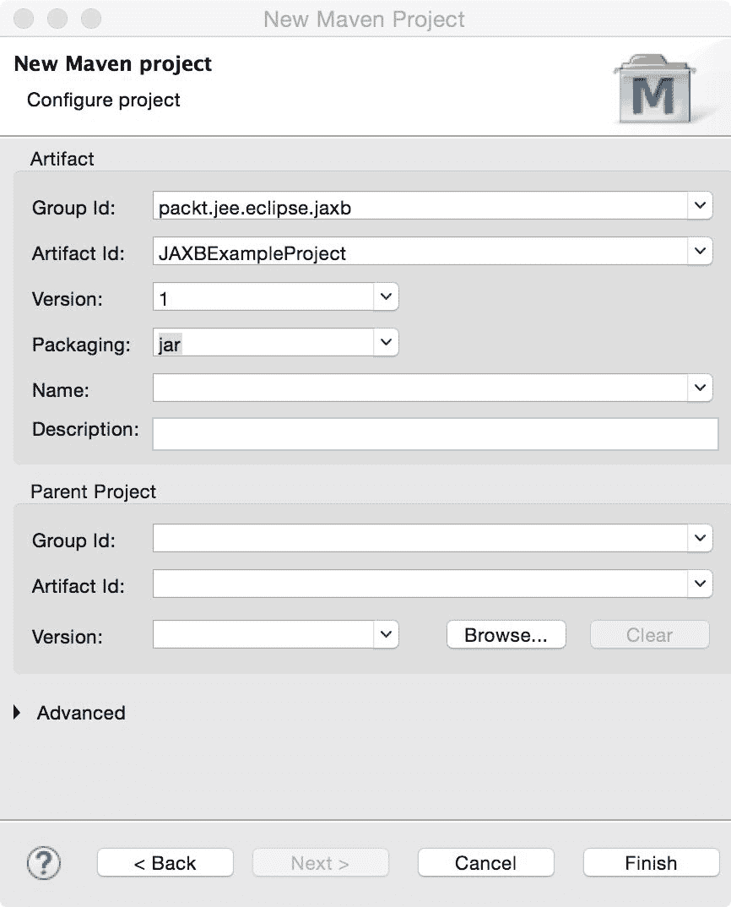

图 9.1：为 JAXB 示例创建 Maven 项目

确保项目配置为使用 JRE 1.7 或更高版本。现在让我们创建两个类，`Course` 和 `Teacher`。我们希望将这些类的实例序列化为 XML 并反向操作。在 `packt.jee.eclipse.jaxb.example` 包中创建这些类。以下是 `Course` 类的源代码：

```java
package packt.jee.eclipse.jaxb.example; 
//Skipped imports 

@XmlRootElement 
@XmlAccessorType(XmlAccessType.FIELD) 
public class Course { 
  @XmlAttribute 
  private int id; 
  @XmlElement(namespace="http://packt.jee.eclipse.jaxb.example") 
  private String name; 
  private int credits; 
  @XmlElement(name="course_teacher") 
  private Teacher teacher; 

  public Course() {} 

  public Course (int id, String name, int credits) { 
    this.id = id; 
    this.name = name; 
    this.credits = credits; 
  } 

  //Getters and setters follow 
} 
```

当一个 `Course` 被序列化为 XML 文档时，我们希望 `course` 元素作为根。因此，该类被注解为 `@XmlRootElement`。

序列化是将数据（通常是对象）写入格式（如 XML 或 JSON）的过程。反序列化是从格式中读取数据并创建对象的过程。

你可以通过指定`name`属性来为根元素指定不同的名称（除了类名），例如：

```java
@XmlRootElement(name="school_course") 
```

`id`字段被标记为根元素的一个属性。如果这些字段有公共的 getter/setter 方法，你不需要特别将字段标记为元素。然而，如果你想设置额外的属性，那么你需要用`@XmlElement`注解它们。例如，我们为`name`字段指定了一个命名空间。`credits`字段没有被注解，但它仍然会被作为 XML 元素进行序列化。

这是`Teacher`类的源代码：

```java
package packt.jee.eclipse.jaxb.example; 

public class Teacher { 
  private int id; 
  private String name; 

  public Teacher() {} 

  public Teacher (int id, String name) { 
    this.id = id; 
    this.name = name; 
  } 

  //Getters and setters follow 
} 
```

我们没有为`Teacher`类添加 JAXB 注解，因为我们不打算直接序列化它。它将在`Course`实例被序列化时由 JAXB 进行序列化。

让我们创建带有`main`方法的`JAXBExample`类：

```java
package packt.jee.eclipse.jaxb.example; 

//Skipped imports 

public class JAXBExample { 

  public static void main(String[] args) throws Exception { 
    doJAXBXml(); 

  } 

  //Create XML from Java object and then vice versa 
  public static void doJAXBXml() throws Exception { 
    Course course = new Course(1,"Course-1", 5); 
    course.setTeacher(new Teacher(1, "Teacher-1")); 

    JAXBContext context = JAXBContext.newInstance(Course.class); 

    //Marshall Java object to XML 
    Marshaller marshaller = context.createMarshaller(); 
    //Set option to format generated XML 
    marshaller.setProperty(Marshaller.JAXB_FORMATTED_OUTPUT, 
     true); 
    StringWriter stringWriter = new StringWriter(); 
    //Marshal Course object and write to the StringWriter 
    marshaller.marshal(course, stringWriter); 
    //Get String from the StringWriter 
    String courseXml = stringWriter.getBuffer().toString(); 
    stringWriter.close(); 
    //Print course XML 
    System.out.println(courseXml); 

    //Now unmarshall courseXML to create Course object 
    Unmarshaller unmarshaller = context.createUnmarshaller(); 
    //Create StringReader from courseXml 
    StringReader stringReader = new StringReader(courseXml); 
    //Create StreamSource which will be used by JAXB unmarshaller 
    StreamSource streamSource = new StreamSource(stringReader); 
    Course unmarshalledCourse = 
     unmarshaller.unmarshal(streamSource, Course.class).getValue();    
     System.out.println("-----------------nUnmarshalled course name - " 
        + unmarshalledCourse.getName()); 
    stringReader.close(); 
   } 
} 
```

要使用 JAXB 进行序列化或反序列化，我们首先创建`JAXBContext`，传递给它需要处理的 Java 类。然后，我们创建 marshaller 或 unmarshaller，设置相关属性，并执行操作。代码相当简单。我们首先将`Course`实例序列化为 XML，然后使用相同的 XML 输出将其反序列化回`Course`实例。在类上右键单击并选择 Run As | Java Application。你应该在控制台看到以下输出：

```java
<?xml version="1.0" encoding="UTF-8" standalone="yes"?> 
<course id="1" > 
    <ns2:name>Course-1</ns2:name> 
    <credits>5</credits> 
    <course_teacher> 
        <id>1</id> 
        <name>Teacher-1</name> 
    </course_teacher> 
</course> 

----------------- 
Unmarshalled course name - Course-1 
```

现在我们来看一下如何将 Java 对象序列化为 JSON 然后再反序列化。JAXB 在 JDK 中默认不支持 JSON。我们将不得不使用一个支持 JAXB API 和 JSON 的外部库。这样的库之一是 EclipseLink MOXy ([`eclipse.org/eclipselink/#moxy`](https://eclipse.org/eclipselink/#moxy))。我们将使用这个库将`Course`实例序列化为 JSON。

打开`pom.xml`并添加对 EclipseLink 的依赖项：

```java
  <dependencies> 
    <dependency> 
      <groupId>org.eclipse.persistence</groupId> 
      <artifactId>eclipselink</artifactId> 
      <version>2.6.1-RC1</version> 
    </dependency> 
  </dependencies> 
```

我们还需要设置`javax.xml.bind.context.factory`属性，以便 JAXB 实现使用 EclipseLink 的`JAXBContextFactory`。在要序列化的实例的类所在的包中创建`jaxb.properties`文件。在这种情况下，在`packt.jee.eclipse.jaxb.example`包中创建该文件。在这个文件中设置以下属性：

```java
javax.xml.bind.context.factory=org.eclipse.persistence.jaxb.JAXBContextFactory 
```

这非常重要。如果你不设置这个属性，那么示例将无法工作。接下来，打开`JAXBExample.java`并添加以下方法：

```java
  //Create JSON from Java object and then vice versa 
  public static void doJAXBJson() throws Exception { 

    Course course = new Course(1,"Course-1", 5); 
    course.setTeacher(new Teacher(1, "Teacher-1")); 

    JAXBContext context = JAXBContext.newInstance(Course.class); 

    //Marshal Java object to JSON 
    Marshaller marshaller = context.createMarshaller(); 
    //Set option to format generated JSON 
    marshaller.setProperty(Marshaller.JAXB_FORMATTED_OUTPUT, 
     true);    marshaller.setProperty(MarshallerProperties.MEDIA_TYPE, 
     "application/json");    marshaller.setProperty(MarshallerProperties.JSON_INCLUDE_ROOT, 
     true); 

    StringWriter stringWriter = new StringWriter(); 
    //Marshal Course object and write to the StringWriter 
    marshaller.marshal(course, stringWriter); 
    //Get String from the StringWriter 
    String courseJson = stringWriter.getBuffer().toString(); 
    stringWriter.close(); 
    //Print course JSON 
    System.out.println(courseJson); 

    //Now, unmarshall courseJson to create Course object 
    Unmarshaller unmarshler = context.createUnmarshaller(); 
    unmarshler.setProperty(MarshallerProperties.MEDIA_TYPE, 
     "application/json");    unmarshler.setProperty(MarshallerProperties.JSON_INCLUDE_ROOT, 
     true); 

    //Create StringReader from courseJson 
    StringReader stringReader = new StringReader(courseJson); 
    //Create StreamSource which will be used by JAXB unmarshaller 
    StreamSource streamSource = new StreamSource(stringReader); 
    Course unmarshalledCourse = unmarshler.unmarshal(streamSource, 
     Course.class).getValue();    
    System.out.println("-----------------nUnmarshalled course name - " + unmarshalledCourse.getName()); 
    stringReader.close(); 
  } 
```

大部分代码与`doJAXBXml`方法中的代码相同。具体更改如下：

+   我们设置了`marshaller`属性以生成 JSON 输出（`application/json`）

+   我们设置另一个`marshaller`属性以在输出中包含 JSON 根元素

+   我们在`unmarshaller`上设置了相应的属性

修改主方法以调用`doJAXBJson`，而不是`doJAXBXml`。当你运行应用程序时，你应该看到以下输出：

```java
{ 
   "course" : { 
      "id" : 1, 
      "name" : "Course-1", 
      "credits" : 5, 
      "course_teacher" : { 
         "id" : 1, 
         "name" : "Teacher-1" 
      } 
   } 
} 
----------------- 
Unmarshalled course name - Course-1 
```

在本章中，我们已经介绍了 JAXB 的基础知识。有关 JAXB 的详细教程，请参阅 [`docs.oracle.com/javase/tutorial/jaxb/intro/index.html`](https://docs.oracle.com/javase/tutorial/jaxb/intro/index.html)。

# JSON-B

JSON-B 是 JEE 8 中包含的新规范。使用简单的注解，您可以转换 Java 对象到 JSON，反之亦然。JSON-B 有一个重要的注解，`@JsonProperty`。为类成员指定此注解，将其标记为序列化到或从 JSON。

JSON-B 提供了 `JsonbBuilder` 类，使用它可以执行实际的序列化。让我们通过一个简单的应用程序来学习如何使用 JSON-B。

# 一个 JSON-B 示例

让我们创建一个 Maven 项目，组 ID 为 JAXBExample，工件 ID 为 JSONBExampleProject。JSON-B 不是 JDK 的一部分，因此我们需要添加提供 JSON-B API 和其实现的库的 Maven 依赖项。在这个例子中，我们将使用 Eclipse 的 Yasson ([`projects.eclipse.org/projects/ee4j.yasson`](https://projects.eclipse.org/projects/ee4j.yasson)) 对 JSON-B 的实现。我们将在 `pom.xml` 中添加以下依赖项：

```java
   <dependency>
    <groupId>javax.json.bind</groupId>
    <artifactId>javax.json.bind-api</artifactId>
    <version>1.0</version>
   </dependency>

   <dependency>
    <groupId>org.eclipse</groupId>
    <artifactId>yasson</artifactId>
    <version>1.0.1</version>
   </dependency>

   <dependency>
    <groupId>org.glassfish</groupId>
    <artifactId>javax.json</artifactId>
    <version>1.1.2</version>
   </dependency>
  </dependencies>
```

由于 `yasson` 实现依赖于其 JSON-P 实现，因此添加了对 `javax.json` 的依赖。

现在我们将创建 `Course` 和 `Teacher` 类，就像我们在上一节中为 JAXB 创建它们一样，但这次使用 JSON-B 注解。在 `packt.jee.eclipse.jsonb.example` 包中创建这两个类。以下是 `Course` 类的源代码：

```java
package packt.jee.eclipse.jsonb.example;
import javax.json.bind.annotation.JsonbProperty;

public class Course {
 @JsonbProperty
 private int id;

 @JsonbProperty
 private String name;

 @JsonbProperty
 private int credits;

 @JsonbProperty("course_teacher")
 private Teacher teacher;

 //skipped constructors, getters and setters to save space
}
```

我们已经使用 `@JsonbProperty` 注解了 `Course` 类的成员。如果您想更改 JSON 中字段的名称，可以将它指定为 `@JsonbProperty` 的参数；例如，在上面的代码中，我们将 `teacher` 字段映射到 JSON 中的 `course_teacher` 名称。

`Teacher` 类与我们在 JAXB 部分创建的类相同。现在让我们创建主应用程序类，称为 `JSONBExample`，在其中我们将 `Course` 类的实例转换为 `String`，然后再从 `String` 转换回 `Course` 对象的实例：

```java
package packt.jee.eclipse.jsonb.example;
import javax.json.bind.Jsonb;
import javax.json.bind.JsonbBuilder;
public class JSONBExample {
  public static void main(String[] args) throws Exception {
    Course course = new Course(1,"Course-1", 5);
    course.setTeacher(new Teacher(1, "Teacher-1"));

    // Serialize to JSON string
    Jsonb jsonb = JsonbBuilder.create();
    String courseJson = jsonb.toJson(course, Course.class);
    System.out.println(courseJson);

    // De-serialize fromd JSON string
    Course deserializedCourse = jsonb.fromJson(courseJson, Course.class);
    System.out.println(deserializedCourse.getName());
  }
}
```

要序列化 `Course` 类的实例，我们首先创建一个 `JsonBuilder` 实例，然后在该实例上调用 `toJson` 方法。要从 `Course` 类的 JSON 表示形式反序列化字符串，我们在同一个 `JsonBuilder` 实例上调用 `fromJson`。如果您运行应用程序，应该会看到我们创建的课程对象的 JSON 字符串。

关于 JSON-B 的更多详细信息，请参阅 [`json-b.net/index.html.`](http://json-b.net/index.html)

# RESTful 网络服务

我们将从 RESTful 服务开始学习 Web 服务，因为它们被广泛使用且易于实现。REST 不一定是一个协议，而是一种架构风格，通常基于 HTTP。RESTful Web 服务在服务器上对资源进行操作，操作基于 HTTP 方法（`Get`、`Post`、`Put`和`Delete`）。资源的状态以 XML 或 JSON 格式通过 HTTP 传输，尽管 JSON 更受欢迎。服务器上的资源通过 URL 进行标识。例如，要获取 ID 为`10`的课程详细信息，你可以使用以下 URL 的 HTTP `GET`方法：`http://<server_address>:<port>/course/10`。请注意，参数是基本 URL 的一部分。要添加新的`Course`或修改`Course`，你可以使用`POST`或`PUT`方法。此外，可以使用`DELETE`方法通过相同的 URL 删除`Course`，即用于获取课程的 URL，即`http://<server_address>:<port>/course/10`。

RESTful Web 服务中的资源 URL 也可以嵌套；例如，要获取特定部门（例如 ID 为`20`）的所有课程，REST URL 可以是以下形式：`http://<server_address>:<port>/department/20/courses`。

有关 RESTful Web 服务的属性和用于在服务器上操作 REST 资源的 HTTP 方法的更多详细信息，请参阅[`en.wikipedia.org/wiki/Representational_state_transfer`](https://en.wikipedia.org/wiki/Representational_state_transfer)。

用于处理 RESTful Web 服务的 Java 规范称为 JAX-RS，即 Java API for RESTful services ([`jax-rs-spec.java.net/`](https://jax-rs-spec.java.net/))。Project Jersey ([`jersey.java.net/`](https://jersey.java.net/))是该规范的参考实现。我们将使用这个参考实现在本章中。

# 使用 Jersey 创建 RESTful Web 服务

我们将为本书中一直在开发的*课程管理*示例创建一个 Web 服务。该 Web 服务将包含获取所有课程和创建新课程的方法。为了使示例简单，我们不会编写数据访问代码（你可以使用我们在前几章中学到的 JDBC 或 JDO API），而是将数据硬编码。

首先，创建一个 Maven Web 项目。选择 File | New | Maven Project。在向导的第一页上选择 Create a Simple Project 复选框，然后点击 Next：

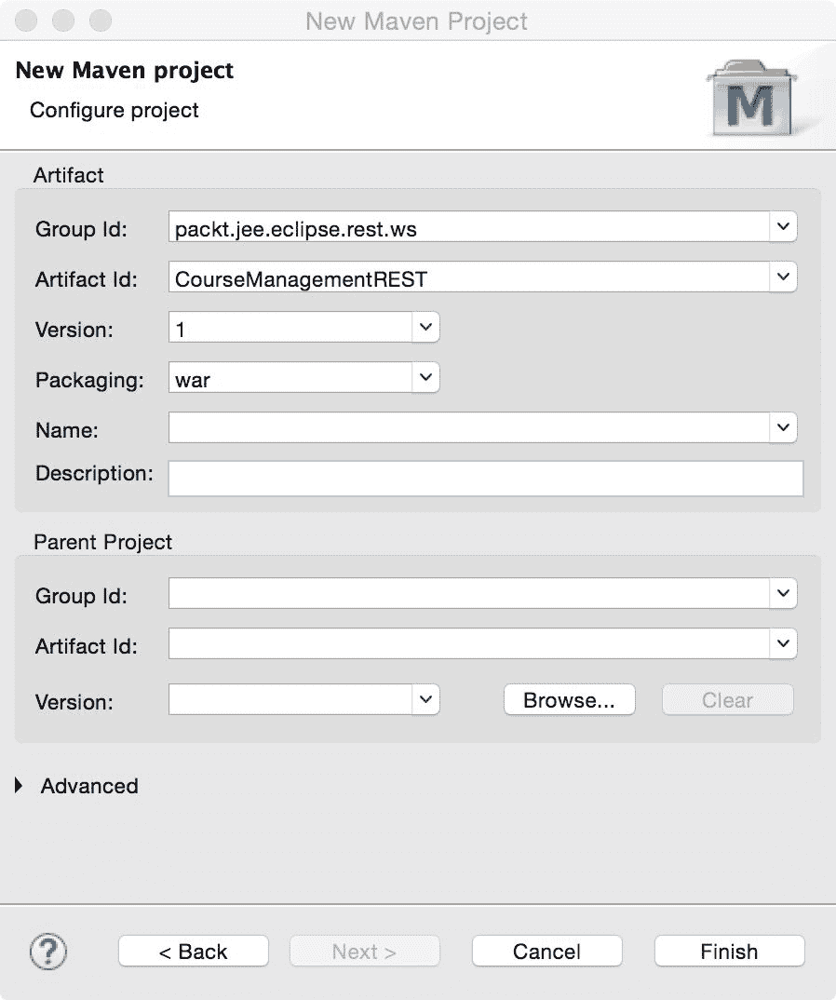

图 9.2：为 RESTful Web 服务创建 Maven 项目

输入项目配置详细信息并点击 Finish。确保打包方式为`war`。

由于我们将使用`Jersey`库来实现 JAX-RS，我们将将其 Maven 依赖项添加到项目中。打开`pom.xml`文件，并添加以下依赖项：

```java
  <dependencies> 
    <dependency> 
      <groupId>org.glassfish.jersey.containers</groupId> 
      <artifactId>jersey-container-servlet</artifactId> 
      <version>2.26</version> 
    </dependency> 
  </dependencies> 
```

使用 JAX-RS 的 `@Path` 注解，我们可以将任何 Java 类转换为 REST 资源。传递给 `@Path` 注解的值是该资源的相对 URI。实现类中的方法，用于执行不同的 HTTP 方法，被以下注解之一标注：`@GET`、`@PUT`、`@POST` 或 `@DELETE`。`@Path` 注解也可以用于方法级别，用于子资源路径（主资源或根资源路径在类级别，再次使用 `@Path` 注解）。我们还可以通过使用 `@Produces` 或 `@Consumes` 注解来分别指定先前方法产生的/消费的 MIME 类型。

在我们创建网络服务实现类之前，让我们创建一些实用类，更具体地说，在这个案例中是 DTOs。

在 `packt.jee.eclipse.rest.ws.dto` 包中创建 `Course` 和 `Teacher` 类。我们还将它们标注为 JAXB 注解。以下是 `Teacher` 类的源代码：

```java
package packt.jee.eclipse.rest.ws.dto; 

import javax.xml.bind.annotation.XmlAccessType; 
import javax.xml.bind.annotation.XmlAccessorType; 
import javax.xml.bind.annotation.XmlAttribute; 
import javax.xml.bind.annotation.XmlElement; 
import javax.xml.bind.annotation.XmlRootElement; 

@XmlRootElement 
@XmlAccessorType(XmlAccessType.FIELD) 
public class Teacher { 

  @XmlAttribute 
  private int id; 

  @XmlElement(name="teacher_name") 
  private String name; 

  //constructors 
  public Course() {} 

  public Course (int id, String name, int credits, Teacher 
   teacher) { 
    this.id = id; 
    this.name = name; 
    this.credits = credits; 
    this.teacher = teacher; 
  } 

  //Getters and setters follow 
} 
```

以下是为 `Course` 类的源代码，我们将在后续章节中将它用于序列化为 XML 和 JSON：

```java
package packt.jee.eclipse.rest.ws.dto; 

import javax.xml.bind.annotation.XmlAccessType; 
import javax.xml.bind.annotation.XmlAccessorType; 
import javax.xml.bind.annotation.XmlAttribute; 
import javax.xml.bind.annotation.XmlElement; 
import javax.xml.bind.annotation.XmlRootElement; 

@XmlRootElement 
@XmlAccessorType(XmlAccessType.FIELD) 
public class Course { 

  @XmlAttribute 
  private int id; 

  @XmlElement(name="course_name") 
  private String name; 

  private int credits; 

  private Teacher teacher; 

  //constructors 
  public Teacher() {} 

  public Teacher (int id, String name) { 
    this.id = id; 
    this.name = name; 
  } 

  //Getters and setters follow 
} 
```

我们在两个类中的 `id` 字段上标注了 `@XMLAttribute`。如果这些类的对象被序列化（从 Java 对象转换为 XML），则 `Course id` 和 `Teacher id` 将是根元素（分别对应 `Course` 和 `Teacher`）的属性（而不是元素）。如果没有指定字段注解，并且存在属性的公共 getter/setter，则它被视为具有相同名称的 XML 元素。

我们特别使用了 `@XMLElement` 注解来标注 `name` 字段，因为我们希望在将它们序列化为 XML 时将它们重命名为 `course_name` 或 `teacher_name`。

# 实现 REST GET 请求

现在我们来实现 RESTful 网络服务类。在 `packt.jee.eclipse.rest.ws.services` 包中创建 `CourseService` 类：

```java
package packt.jee.eclipse.rest.ws.services; 

import javax.ws.rs.GET; 
import javax.ws.rs.Path; 
import javax.ws.rs.PathParam; 
import javax.ws.rs.Produces; 
import javax.ws.rs.core.MediaType; 

import packt.jee.eclipse.rest.ws.dto.Course; 
import packt.jee.eclipse.rest.ws.dto.Teacher; 

@Path("/course") 
public class CourseService { 

  @GET 
  @Produces (MediaType.APPLICATION_XML) 
  @Path("get/{courseId}") 
  public Course getCourse (@PathParam("courseId") int id) { 

    //To keep the example simple, we will return 
    //hardcoded values here. However, you could get 
    //data from database using, for example, JDO or JDBC 

    return new Course(id,"Course-" + id, 5, new Teacher(2, 
     "Teacher1")); 
  } 
} 
```

`@Path` 注解指定了由此类提供的资源可以通过相对 URI `"/course"` 访问。

`getCourse` 方法有许多注解。让我们逐一讨论它们。

`@GET` 注解指定，当使用 HTTP `GET` 方法调用由 `CourseService` 类上的 `@Path` 指定的相对 URI `"/course"` 时，将调用此方法。

`@Produces` (`MediaType.APPLICATION_JSON`) 指定此方法生成 JSON 输出。如果客户端指定了接受的 MIME 类型，则此注解将用于解析要调用的方法，如果多个方法都注有 `@GET`（或任何其他 HTTP 方法注解）。例如，如果我们有一个名为 `getCourseJSON` 的方法，它注有 `@GET` 并生成具有不同 MIME 类型（由 `@Produces` 指定）的数据，则将根据客户端请求的 MIME 类型选择适当的方法。`@Produces` 注解中的 MIME 类型还告诉 JAX-RS 实现当将返回给该方法的 Java 对象进行序列化时，要创建的响应的 MIME 类型。例如，在 `getCourse` 方法中，我们返回 `Course` 类的实例，`@Produces` 中指定的 MIME 类型告诉 Jersey 生成此实例的 XML 表示形式。

`@Path` 注解也可以在方法级别上使用，以指定子资源。在方法级别上指定的 `@Path` 值相对于类级别上指定的路径值是相对的。具有 ID `20` 的资源（在这种情况下，`Course`）可以通过 `/course/get/20` 访问。完整的 URL 可以是 `http://<server-address>:<port>/<app-name>/course/get/10`。路径值中的参数名称在注解中以 `{}` 包围。

需要通过使用 `@PathParam` 注解和参数名称作为其值来在方法参数中标识路径参数。JAX-RS 实现框架将路径参数与匹配 `@PathParam` 注解的参数进行匹配，并适当地将参数值传递给方法。

为了使示例简单并保持对 RESTful 网络服务实现的关注，我们不会在这个方法中实现任何业务逻辑。我们可以通过使用 JDO 或 JDBC API（我们在前面的章节中已经看到了如何使用这些 API 的示例）从数据库中获取数据，但我们只是将返回一些硬编码的数据。该方法返回 `Course` 类的实例。当数据最终返回给客户端时，JAX-RS 实现将使用 JAXB 将此对象转换为 XML 表示形式。

我们需要告诉 Jersey 框架它需要扫描哪些包以查找 REST 资源。有两种方法可以做到这一点：

+   在 `web.xml` 中配置 Jersey servlet（见 [`jersey.java.net/nonav/documentation/latest/user-guide.html#deployment.servlet`](https://jersey.java.net/nonav/documentation/latest/user-guide.html#deployment.servlet)）。

+   对于 Servlet 3.x 容器，我们可以创建 `javax.ws.rs.core.Application` 的子类。我们在这本书中使用过的 Tomcat 8.0 是一个 Servlet 3.x 容器。

我们将使用第二种选项来创建 `Application` 的子类。然而，我们不会直接继承 `Application`，而是会继承 Jersey 的 `ResourceConfig` 类，它反过来又扩展了 `Application`。

在 `packt.jee.eclipse.rest.ws` 包中创建 `CourseMgmtRESTApplication` 类：

```java
package packt.jee.eclipse.rest.ws; 

import javax.ws.rs.ApplicationPath; 

import org.glassfish.jersey.server.ResourceConfig; 

@ApplicationPath("services") 
public class CourseMgmtRESTApplication extends ResourceConfig { 

  public CourseMgmtRESTApplication () { 
    packages("packt.jee.eclipse.rest.ws.services"); 
  } 

} 
```

我们使用了 `@ApplicationPath` 注解来指定使用 JAX-RS 实现的 REST 服务的 URL 映射。资源实现类上的所有 `@Path` URI 都将相对于此路径。例如，我们为 `CourseService` 类指定的 `"/course"` URI 将相对于在 `@ApplicationPath` 注解中指定的 `"services"` 路径。

在部署应用程序并测试我们的服务之前，我们需要生成 `web.xml`。在项目资源管理器中右键单击项目，选择 Java EE Tools | Generate Deployment Descriptor Stub。这将创建 `WEB-INF` 文件夹中的 `web.xml`。对于此示例，我们不需要修改它。

按照第一章 *安装 Tomcat* 部分中 *介绍 JEE 和 Eclipse* 的说明，以及第二章 *在 Eclipse 中配置 Tomcat* 部分中的说明配置 Eclipse 中的 Tomcat。要部署 Web 应用程序，在 Servers 视图中右键单击配置的 Tomcat 服务器，并选择 Add and Remove 选项。添加当前项目。

通过在 `Servers` 视图中右键单击配置的服务并选择启动来启动 Tomcat 服务器。

# 在浏览器中测试 REST GET 请求

在本节中，我们将测试上一节创建的 Web 服务。要测试 Web 服务，请浏览到 `http://localhost:8080/CourseManagementREST/services/course/get/10`。

你应该在浏览器中看到以下 XML：

```java
<?xml version="1.0" encoding="UTF-8" standalone="yes"?> 
<course id="10"> 
  <course_name>Course-10</course_name> 
  <credits>5</credits> 
  <teacher id="2"> 
    <teacher_name>Teacher1</teacher_name> 
  </teacher> 
</course>
```

我们不想生成 XML 响应，而是想创建一个 JSON 响应，因为从网页中的 JavaScript 消费 JSON 响应比 XML 响应要容易得多。要创建 JSON 响应，我们需要更改 `CourseService` 类中 `@Produces` 注解的值。目前，它设置为 `MediaType.APPLICATION_XML`，我们希望将其设置为 `MediaType.APPLICATION_JSON`：

```java
public class CourseService { 

  @GET 
  @Produces (MediaType.APPLICATION_JSON) 
  @Path("get/{courseId}") 
  public Course getCourse (@PathParam("courseId") int id) { 
... 
} 
} 
```

我们还需要添加库来创建 JSON 响应。打开项目的 `pom.xml` 文件并添加以下依赖项：

```java
    <dependency> 
      <groupId>org.glassfish.jersey.media</groupId> 
      <artifactId>jersey-media-json-jackson</artifactId> 
      <version>2.18</version> 
    </dependency> 
```

重新启动 Tomcat 服务器，再次浏览到 `http://localhost:8080/CourseManagementREST/services/course/get/10` URL。这次，你应该看到一个 JSON 响应：

```java
{ 
    id: 10, 
    credits: 5, 
    teacher: { 
        id: 2, 
        teacher_name: "Teacher1" 
    }, 
    course_name: "Course-10" 
} 
```

让我们创建 `getCourse` 方法的两个版本，一个生成 XML，另一个生成 JSON。用以下代码替换 `getCourse` 函数：

```java
  @GET 
  @Produces (MediaType.APPLICATION_JSON) 
  @Path("get/{courseId}") 
  public Course getCourseJSON (@PathParam("courseId") int id) { 

    return createDummyCourse(id); 

  } 

  @GET 
  @Produces (MediaType.APPLICATION_XML) 
  @Path("get/{courseId}") 
  public Course getCourseXML (@PathParam("courseId") int id) { 

    return createDummyCourse(id); 

  } 

  private Course createDummyCourse (int id) { 
    //To keep the example simple, we will return 
    //hardcoded value here. However, you could get 
    //data from database using, for example, JDO or JDBC 

    return new Course(id,"Course-" + id, 5, new Teacher(2, 
     "Teacher1")); 
  } 
```

我们添加了 `createDummyCourse` 方法，该方法与我们之前在 `getCourse` 方法中使用的代码相同。现在我们有两个版本的 `getCourse` 方法：`getCourseXML` 和 `getCourseJSON`，分别生成 XML 和 JSON 响应。

# 为 REST GET 网络服务创建 Java 客户端

现在让我们创建一个 Java 客户端应用程序，该应用程序调用先前的 Web 服务。创建一个简单的 Maven 项目，并将其命名为 `CourseManagementRESTClient`：

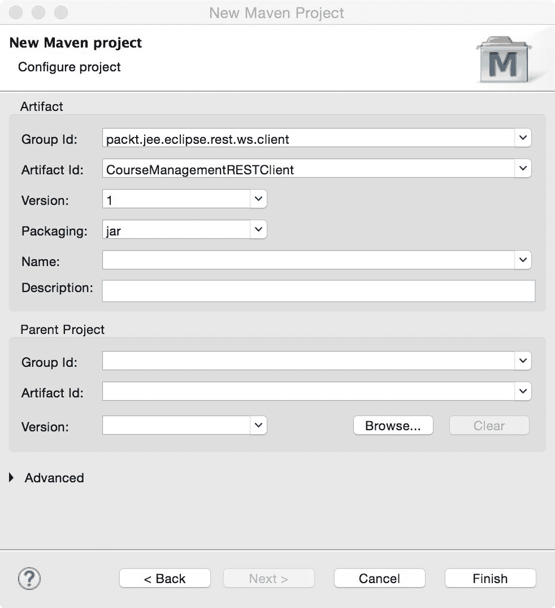

图 9.3：创建 JAX-RS 客户端项目

打开 `pom.xml` 并添加对 Jersey 客户端模块的依赖项：

```java
  <dependencies> 
    <dependency> 
      <groupId>org.glassfish.jersey.core</groupId> 
      <artifactId>jersey-client</artifactId> 
      <version>2.18</version> 
    </dependency> 
  </dependencies>
```

在 `packt.jee.eclipse.rest.ws.client` 包中创建一个名为 `CourseManagementRESTClient` 的 Java 类：

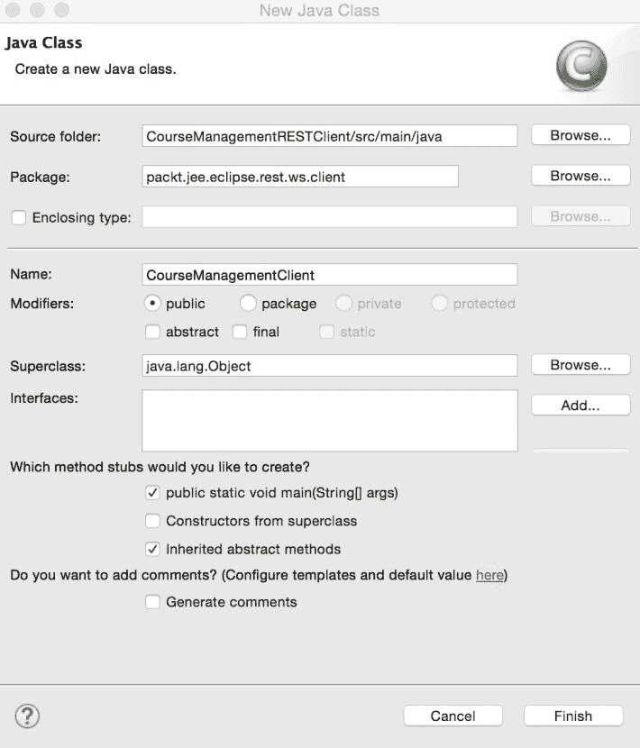

图 9.4：创建 REST 客户端主类

你可以使用 `java.net.HttpURLConnection` 或其他外部 HTTP 客户端库来调用 RESTful Web 服务。但 JAX-RS 客户端 API 使这项任务变得容易得多，如下面的代码所示：

```java
package packt.jee.eclipse.rest.ws.client; 

import javax.ws.rs.client.Client; 
import javax.ws.rs.client.ClientBuilder; 
import javax.ws.rs.client.WebTarget; 
import javax.ws.rs.core.MediaType; 
import javax.ws.rs.core.Response; 

/** 
 * This is a simple test class for invoking RESTful web service 
 * using JAX-RS client APIs 
 */ 
public class CourseManagementClient { 

  public static void main(String[] args) { 

testGetCoursesJSON(); 

  } 

  //Test getCourse method (XML or JSON) of CourseService 
  public static void testGetCoursesJSON() { 
    //Create JAX-RS client 
    Client client = ClientBuilder.newClient(); 
    //Get WebTarget for a URL 
    WebTarget webTarget = 
 client.target("http://localhost:8080/CourseManagementREST/services/course"); 
    //Add paths to URL 
    webTarget = webTarget.path("get").path("10"); 

    //We could also have create webTarget in one call with the full URL - 
    //WebTarget webTarget = 
 client.target("http://localhost:8080/CourseManagementREST/services/course/get/10"); 

    //Execute HTTP get method 
    Response response = 
     webTarget.request(MediaType.APPLICATION_JSON).get(); 

    //Check response code. 200 is OK 
    if (response.getStatus() != 200) { 
      System.out.println("Error invoking REST web service - " + 
       response.getStatusInfo().getReasonPhrase()); 
      return; 
    } 

    //REST call was successful. Print the response 
    System.out.println(response.readEntity(String.class)); 
  } 
} 
```

有关如何使用 JAX-RS 客户端 API 的详细说明，请参阅 [`jersey.java.net/documentation/latest/client.html`](https://jersey.java.net/documentation/latest/client.html)。

# 实现 REST POST 请求

我们看到了如何使用 JAX-RS 实现 HTTP `GET` 请求的示例。现在让我们实现一个 `POST` 请求。我们将在 `CourseService` 类中实现一个添加课程的方法，这是我们的 `CourseManagementREST` 项目中的 Web 服务实现类。

就像 `getCourse` 方法的情况一样，我们实际上不会访问数据库，而只是简单地编写一个虚拟方法来保存数据。再次强调，我们的目的是保持示例简单，并仅关注 JAX-RS API 和实现。打开 `CourseService.java` 并添加以下方法：

```java
  @POST 
  @Consumes (MediaType.APPLICATION_JSON) 
  @Produces (MediaType.APPLICATION_JSON) 
  @Path("add") 
  public Course addCourse (Course course) { 

    int courseId = dummyAddCourse(course.getName(), 
     course.getCredits()); 

    course.setId(courseId); 

    return course; 
  } 

  private int dummyAddCourse (String courseName, int credits) { 

    //To keep the example simple, we will just print 
    //parameters we received in this method to console and not 
    //actually save data to database. 
    System.out.println("Adding course " + courseName + ", credits 
 = " + credits); 

    //TODO: Add course to database table 

    //return hard-coded id 
    return 10; 
  } 
```

`addCourse` 方法生成并消费 JSON 数据。当资源路径（Web 服务端点 URL）具有以下相对路径时调用它：`"/course/add"`。回想一下，`CourseService` 类注解了以下路径：`"/course"`。因此，`addCourse` 方法的相对路径成为类级别和方法级别（在这种情况下是 `"add"`)指定的路径。我们从 `addCourse` 返回 `Course` 的新实例。Jersey 根据类 `Course` 中的 JAXB 注解创建此类的适当 JSON 表示形式。我们已经在项目中添加了对处理 JSON 格式的 Jersey 模块的依赖项（在 `pom.xml` 中，我们添加了对 `jersey-media-json-jackson` 的依赖项）。

重新启动 Tomcat 服务器以使这些更改生效。

# 编写 REST POST Web 服务客户端

我们现在将在 `CourseManagementClient` 类中添加一个测试方法，在 `CourseManagementRESTClient` 项目中：

```java
  //Test addCourse method (JSON version) of CourseService 
  public static void testAddCourseJSON() { 

    //Create JAX-RS client 
    Client client = ClientBuilder.newClient(); 

    //Get WebTarget for a URL 
    WebTarget webTarget = 
 client.target("http://localhost:8600/CourseManagementREST/services/course/add"); 

    //Create JSON representation of Course, 
    //with course_name and credits fields. Instead of creating 
    //JSON manually, you could also use JAXB to create JSON from 
    //Java object. 
    String courseJSON = "{"course_name":"Course-4", 
     "credits":5}"; 

    //Execute HTTP post method 
    Response response = webTarget.request(). 
        post(Entity.entity(courseJSON, 
         MediaType.APPLICATION_JSON_TYPE)); 

    //Check response code. 200 is OK 
    if (response.getStatus() != 200) { 
      //Print error message 
      System.out.println("Error invoking REST Web Service - " + 
       response.getStatusInfo().getReasonPhrase() + 
          ", Error Code : " + response.getStatus()); 
      //Also dump content of response message 
      System.out.println(response.readEntity(String.class)); 
      return; 
    } 

    //REST call was successful. Print the response 
    System.out.println(response.readEntity(String.class)); 
  } 
```

我们需要以 JSON 格式发送输入数据（`Course` 信息）。尽管我们在示例中硬编码了 JSON，但你也可以使用 JAXB 或其他任何将 Java 对象转换为 JSON 的库。

注意，我们正在使用 HTTP `POST` 方法执行请求 `webTarget.request().post(...)`。我们还已将请求的内容类型设置为 `"application/JSON"`，因为我们的 Web 服务添加 `Course` 消费 JSON 格式。我们通过创建实体并设置其内容类型为 `JSON` 来完成此操作：

```java
//Execute HTTP post method 
Response response = 
 webTarget.request().post(Entity.entity(courseJSON, 
       MediaType.APPLICATION_JSON_TYPE)); 
```

现在，修改 `CourseManagementClient` 类的 `main` 方法以调用 `testAddCourseJSON` 方法。在类上右键单击并选择 Run As | Java Application。你应该在控制台看到以 JSON 格式打印的 `Course` 信息。同时，检查 Eclipse 中的 Tomcat 控制台。在那里，你应该看到我们在 `CourseService.dummyAddCourse` 方法中打印的控制台消息。

# 从 JavaScript 调用 POST RESTful 网络服务

下面是一个如何从 JavaScript 调用我们的 RESTful 网络服务以添加课程的简单示例：

```java
<!DOCTYPE html> 
<html> 
<head> 
<meta charset="UTF-8"> 
<title>Add Course - JSON</title> 

<script type="text/javascript"> 

  function testAddCourseJSON() { 

    //Hardcoded course information to keep example simple. 
    //This could be passed as arguments to this function 
    //We could also use HTML form to get this information from 
     users 
    var courseName = "Course-4"; 
    var credits = 4; 

    //Create XMLHttpRequest 
    var req = new XMLHttpRequest(); 

    //Set callback function, because we will have XMLHttpRequest 
    //make asynchronous call to our web service 
    req.onreadystatechange = function () { 
      if (req.readyState == 4 && req.status == 200) { 
        //HTTP call was successful. Display response 
        document.getElementById("responseSpan").innerHTML = 
         req.responseText; 
      } 
    }; 

    //Open request to our REST service. Call is going to be asyc 
    req.open("POST", 
 "http://localhost:8080/CourseManagementREST/services/course/add", 
 true); 
    //Set request content type as JSON 
    req.setRequestHeader("Content-type", "application/JSON"); 

    //Create Course object and then stringify it to create JSON 
     string 
    var course = { 
      "course_name": courseName, 
      "credits" : credits 
    }; 

    //Send request. 
    req.send(JSON.stringify(course)); 
  } 
</script> 

</head> 
<body> 
  <button type="submit" onclick="return testAddCourseJSON();">Add 
   Course using JSON</button> 
  <p/> 
  <span id="responseSpan"></span> 
</body> 
</html> 
```

如果你想测试这段代码，请创建一个 HTML 文件，例如 `addCourseJSON.html`，在 `CourseManagementREST` 项目的 `src/main/webapp` 文件夹中。然后，浏览到 `http://localhost:8080/CourseManagementREST/addCourseJSON.html`。点击“使用 JSON 添加课程”按钮。响应将在同一页面上显示。

# 使用表单 POST 创建 RESTful 网络服务

我们迄今为止已经创建了使用 HTTP `GET` 和 `POST` 方法的 RESTful 网络服务。使用 `POST` 方法的网络服务以 JSON 格式接收输入。我们也可以让网络服务的 `POST` 方法从 HTML 表单元素接收输入。让我们创建一个处理从 HTML 表单提交的数据的方法。打开 `CourseManagementREST` 项目的 `CourseService.java` 文件。添加以下方法：

```java
@POST 
@Consumes (MediaType.APPLICATION_FORM_URLENCODED) 
@Path("add") 
public Response addCourseFromForm (@FormParam("name") String courseName, 
    @FormParam("credits") int credits) throws URISyntaxException { 

  dummyAddCourse(courseName, credits); 

  return Response.seeOther(new 
 URI("../addCourseSuccess.html")).build(); 
} 
```

该方法通过指定具有以下值的 `@Consume` 注解来标记处理表单数据：`"application/x-www-form-urlencoded"`。正如我们在 `getCourse` 方法中使用 `@PathParam` 映射路径参数一样，我们使用 `@FormParam` 注解将表单字段映射到方法参数。最后，一旦我们成功保存课程，我们希望客户端重定向到 `addCourseSuccess.html`。我们通过调用 `Response.seeOther` 方法来实现这一点。`addCourseFromForm` 方法返回 `Response` 对象。

有关如何配置网络服务中的 `Response` 的更多信息，请参阅 [`jersey.java.net/documentation/latest/representations.html`](https://jersey.java.net/documentation/latest/representations.html)。

我们需要创建 `addCourseSuccess.html` 以完成此示例。在 `CourseManagementREST` 项目的 `src/main/webapp` 文件夹中创建此文件，并包含以下内容：

```java
<h3>Course added successfully</h3> 
```

# 为表单编码的 RESTful 网络服务创建 Java 客户端

现在，让我们为调用之前消耗表单编码数据的网络服务创建一个测试方法。打开 `CourseManagementRESTClient` 项目的 `CourseManagementClient.java` 文件并添加以下方法：

```java
  //Test addCourse method (Form-Encoded version) of CourseService 
  public static void testAddCourseForm() { 

    //create JAX-RS client 
    Client client = ClientBuilder.newClient(); 

    //Get WebTarget for a URL 
    WebTarget webTarget = 
 client.target("http://localhost:8600/CourseManagementREST/services/course/add"); 

    //Create Form object and populate fields 
    Form form = new Form(); 
    form.param("name", "Course-5"); 
    form.param("credits", "5"); 

    //Execute HTTP post method 
    Response response = webTarget.request(). 
        post(Entity.entity(form, 
         MediaType.APPLICATION_FORM_URLENCODED)); 

    //check response code. 200 is OK 
    if (response.getStatus() != 200) { 
      //Print error message 
      System.out.println("Error invoking REST Web Service - " + 
       response.getStatusInfo().getReasonPhrase() + 
          ", Error Code : " + response.getStatus()); 
      //Also dump content of response message 
      System.out.println(response.readEntity(String.class)); 
      return; 
    } 

    //REST call was successful. Print the response 
    System.out.println(response.readEntity(String.class)); 
  } 
```

注意，表单数据是通过创建 `Form` 对象的实例并设置其参数来创建的。`POST` 请求使用 `MediaType.APPLICATION_FORM_URLENCODED` 编码，其值为 `"application/x-www-form-urlencoded"`。

现在，修改`main`方法以调用`testAddCourseForm`。然后，通过右键单击类并选择“运行方式”|“Java 应用程序”来运行应用程序。你应该在控制台中看到成功消息（来自`addCourseSuccess.html`）被打印出来。

# 使用 JSON-B 的 RESTful 网络服务

在上一节中，我们使用 JAXB 实现了 RESTful 网络服务。如前所述，JEE 8 增加了一个新的 JSON 绑定规范，称为 JSON-B。在本节中，我们将学习如何修改我们的网络服务以使用 JSON-B。

从 JAXB 切换到 JSON-B，实际上我们不需要在代码中做太多更改。我们需要使用 JSON-B 的`@JsonbProperty`注解在`Course`类中指定字段绑定，而不是使用 JAXB 的`@XmlAttribute`注解。然后，我们需要添加 Maven 依赖项以包含提供 JSON-B API 及其实现的库。将 pom.xml 中的依赖项部分替换为以下内容：

```java
  <dependencies>
   <dependency>
    <groupId>org.glassfish.jersey.containers</groupId>
    <artifactId>jersey-container-servlet</artifactId>
    <version>2.26</version>
   </dependency>
   <dependency>
    <groupId>org.glassfish.jersey.media</groupId>
    <artifactId>jersey-media-json-binding</artifactId>
    <version>2.26</version>
   </dependency>
   <dependency>
    <groupId>org.glassfish.jersey.inject</groupId>
    <artifactId>jersey-hk2</artifactId>
    <version>2.26</version>
   </dependency>
  </dependencies> 
```

对`jersey-container-servlet`的依赖没有改变。然而，我们已经用`jersey-media-json-binding`和`jersey-hk2`替换了对`jersey-media-json-jackson`的依赖。当网络服务方法被注解时，Jersey 框架会自动处理 Java 对象到 JSON 的转换：

```java
@Produces (MediaType.APPLICATION_JSON)
```

这在`CourseService`类中进行了指定。

在本章的配套源代码中，为这一节创建了一个名为`CourseManagementREST-JSONB`的独立项目。

# SOAP 网络服务

**简单对象访问协议**（**SOAP**）是来自**万维网联盟**（**W3C**）的规范（[`www.w3.org/TR/2007/REC-soap12-part0-20070427/`](http://www.w3.org/TR/2007/REC-soap12-part0-20070427/)）。尽管我们在这里讨论的是基于 SOAP 的网络服务，但 SOAP 是实现基于 XML 的网络服务所使用的规范之一。还有几个其他规范是实现 SOAP 网络服务所必需的，我们将在后面看到。SOAP 网络服务的一个前提是服务的动态发现和调用。例如，一个应用程序可以从中央目录中查找服务并动态调用它。然而，在实践中，很少有企业愿意在没有测试的情况下动态调用服务，因此 SOAP 网络服务的这一方面使用较少。

W3C 为 SOAP 网络服务定义了许多规范，例如消息、自动发现、安全和服务编排的规范。然而，在开发 SOAP 网络服务之前，我们至少需要了解以下规范。

# SOAP

SOAP 定义了网络服务提供者和消费者之间消息交换的格式：

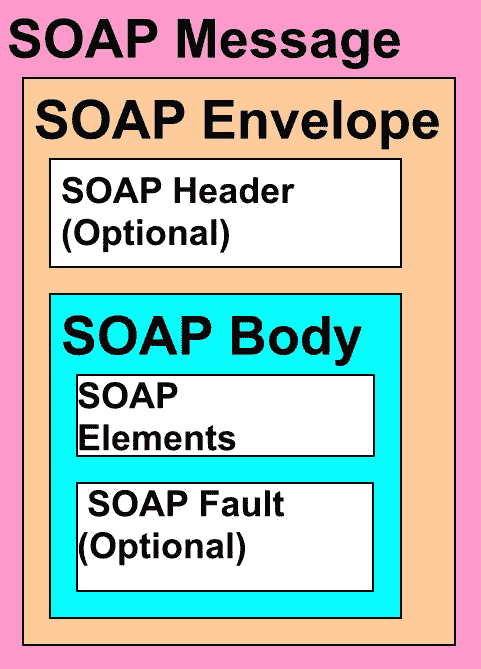

图 9.5：SOAP 消息结构

**SOAP 消息**的顶级元素是**SOAP Envelope**。它包含一个可选的**SOAP Header**和一个**SOAP Body**。实际上，**SOAP Body**包含消息有效负载（供消费者处理）以及可选的**SOAP Fault**（可选），如果有任何错误。

SOAP 头部为 SOAP 消息提供了扩展性。它可以包含用户凭据、事务管理和消息路由等信息。

# WSDL

如其名所示，**Web 服务描述语言**（**WSDL**）描述 Web 服务；特别是，它描述了使用的数据类型（模式）、输入和输出消息、操作（方法）以及绑定和服务端点：

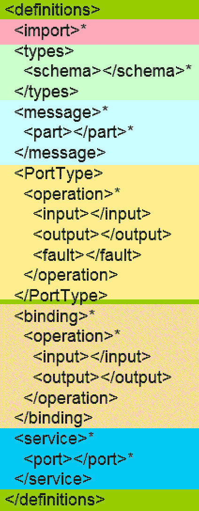

图 9.6：WSDL 结构

虽然在 Java 中创建 Web 服务时您不一定需要了解 WSDL 的详细信息，但了解 WSDL 的基本结构是很好的。WSDL 通常旨在由程序生成和处理，开发者不期望手动编写它们。以下是 WSDL 中的一些元素：

+   `定义`: 这是 WSDL 的根元素。

+   `导入`: 此元素允许您从外部文件导入元素。这样，您可以使 WSDL 文件模块化。

+   `类型`: 此元素定义了 WSDL 中使用的不同数据类型的模式。

+   `消息`: 此元素定义了 Web 服务和客户端之间交换的输入和输出消息的格式。

+   `PortType`: 此定义了 Web 服务支持的方法或操作。`PortType`中的每个操作都可以声明请求和响应消息。`PortType`中的操作引用在消息元素中定义的消息。

尽管在*图 9.6*中，`绑定`元素看起来与`PortType`相同，但它实际上指定了绑定到操作和消息类型（**远程过程调用**或**文档类型**）以及消息的编码（编码或文本）的传输协议，这些操作和消息类型是在`PortType`中声明的。典型的传输协议是 HTTP，但它也可能是其他协议，如 JMS 和 SMTP。RPC 和文档类型之间的区别在于，RPC 消息类型包含消息中的远程方法名称，而文档类型不包含方法名称。处理文档类型消息中的有效负载的方法名称要么是从端点 URL 中派生的，要么是从头部信息中获取的。然而，还有一种称为**文档包装**的类型，它确实包含方法名称作为实际消息有效负载的封装元素。

`服务`元素包含每个 Web 服务端点的实际位置。

# UDDI

**通用描述、发现与集成**（**UDDI**）是一个 Web 服务目录，您可以在其中发布自己的 Web 服务或搜索现有的 Web 服务。该目录可以是全球性的，也可以是企业本地的。UDDI 也是一个支持发布和搜索内容的 Web 服务。

本书将不会重点介绍 UDDI，但您可以访问[`docs.oracle.com/cd/E14571_01/web.1111/e13734/uddi.htm#WSADV226`](http://docs.oracle.com/cd/E14571_01/web.1111/e13734/uddi.htm#WSADV226)获取更多信息。

# 在 Java 中开发 Web 服务

在 Java 中开发网络服务有许多框架。随着规范的改变，新的框架不断涌现。多年来，Java 开发网络服务的流行框架包括 Apache Axis ([`axis.apache.org/axis/`](https://axis.apache.org/axis/))、Apache Axis2 ([`axis.apache.org/axis2/java/core/`](http://axis.apache.org/axis2/java/core/))、Apache CFX ([`cxf.apache.org/`](http://cxf.apache.org/)) 和 GlassFish Metro ([`metro.java.net/`](https://metro.java.net/))。

早期网络服务框架的实现基于 **JAX-RPC** （**基于 XML 的 RPC 的 Java API**）规范 ([`www.oracle.com/technetwork/java/docs-142876.html`](http://www.oracle.com/technetwork/java/docs-142876.html))。JAX-RPC 在 JEE 5 中被 **Java API for XML Web Services** （**JAX-WS**）所取代。JAX-WS 通过支持注解使网络服务的开发变得更加容易。在本章中，我们将学习如何使用 JAX-WS 创建和消费网络服务。继续使用本书中一直跟踪的示例（*课程管理*），我们将创建网络服务以获取所有课程并添加新课程。

首先，让我们创建一个 Maven 网络项目。选择 File | New | Maven Project。选择创建一个简单项目的选项：

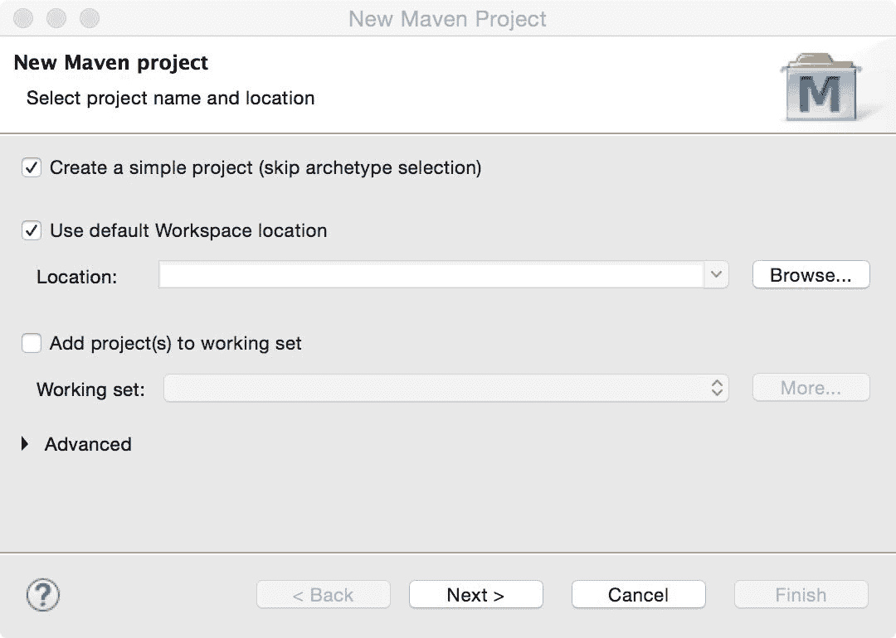

图 9.7：新 Maven 项目

点击“下一步”。在下一页中输入 Group Id、Artifact id 和 Version。选择 `war` 打包方式：

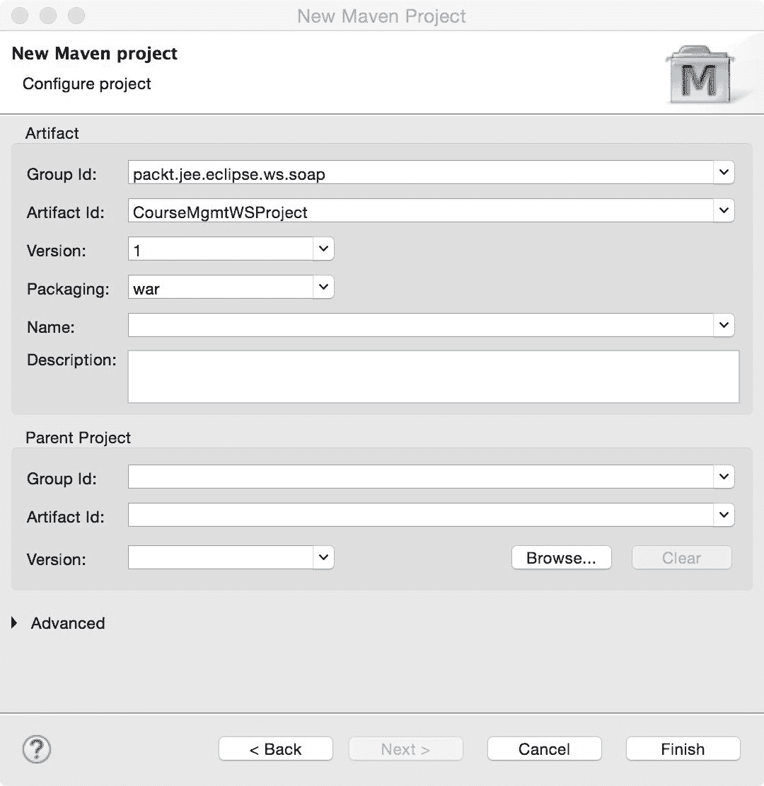

图 9.8：输入工件详情

点击“完成”以完成向导。

# 创建网络服务实现类

JAX-WS 注解是在 Java EE 5.0 中添加的。使用这些注解，我们可以将任何 Java 类（包括 POJOs）转换为网络服务。使用 `@Webservice` 注解将任何 Java 类转换为网络服务。这个注解可以用于接口或 Java 类上。如果一个 Java 类被 `@Webservice` 注解，那么该类中所有的公共方法都会在网络服务中暴露。如果一个 Java 接口被 `@Webservice` 注解，那么实现类仍然需要被 `@Webservice` 注解，并且需要 `endpointInterface` 属性及其值为接口名称。

在我们创建网络服务实现类之前，让我们创建几个辅助类。第一个是 `Course` 数据传输对象。这是我们在前几章中创建的相同类。在 `packt.jee.eclipse.ws.soap` 包中创建 `Course` 类：

```java
package packt.jee.eclipse.ws.soap; 

public class Course { 
  private int id; 
  private String name; 
  private int credits; 

  //Setters and getters follow here 
} 
```

现在，让我们在 `packt.jee.eclipse.ws.soap` 包中创建网络服务实现类 `CourseManagementService`：

```java
package packt.jee.eclipse.ws.soap; 

import java.util.ArrayList; 
import java.util.List; 

import javax.jws.WebService; 

@WebService 
public class CourseManagementService { 

  public List<Course> getCourses() { 
    //Here courses could be fetched from database using, 
    //for example, JDBC or JDO. However, to keep this example 
    //simple, we will return hardcoded list of courses 

    List<Course> courses = new ArrayList<Course>(); 

    courses.add(new Course(1, "Course-1", 4)); 
    courses.add(new Course(2, "Course-2", 3)); 

    return courses; 
  } 

  public Course getCourse(int courseId) { 
    //Here again, we could get course details from database using 
    //JDBC or JDO. However, to keep this example 
    //simple, we will return hardcoded course 

    return new Course(1,"Course-1",4); 
  } 
} 
```

`CourseManagementService`有两个方法：`getCourses`和`getCourse`。为了使示例简单，我们硬编码了值，但你完全可以从数据库中获取数据，例如使用我们在这本书前面讨论过的 JDBC 或 JDO API。该类使用`@WebService`注解，这告诉 JAX-WS 实现将此类视为网络服务。这个类中的所有方法都将公开作为网络服务操作。如果你想公开特定的方法，可以使用`@WebMethod`。

# 使用 JAX-WS 参考实现（Glassfish Metro）

仅使用`@WebService`注解一个类不足以实现网络服务。我们需要一个实现 JAX-WS 规范的库。有多个 JAX-WS 框架可供选择，例如 Axis2、Apache CFX 和 Glassfish Metro。在本章中，我们将使用 Glassfish Metro 实现，它也是 Oracle 提供的 JAX-WS 参考实现([`jax-ws.java.net/`](https://jax-ws.java.net/))。

让我们添加 JAX-WS 框架的 Maven 依赖项。打开`pom.xml`并添加以下依赖项：

```java
  <dependencies> 
    <dependency> 
      <groupId>com.sun.xml.ws</groupId> 
      <artifactId>jaxws-rt</artifactId> 
      <version>2.2.10</version> 
    </dependency> 
  </dependencies> 
```

将之前的版本号替换为框架的最新版本。Metro 框架还要求你在名为`sun-jaxws.xml`的配置文件中声明网络服务端点。在`src/main/webapp/WEB-INF`文件夹中创建`sun-jaxws.xml`文件，并按如下方式添加端点：

```java
<?xml version="1.0" encoding="UTF-8"?> 
<endpoints  
 version="2.0"> 
  <endpoint name="CourseService" implementation="packt.jee.eclipse.ws.soap.CourseManagementService" 
        url-pattern="/courseService" /> 
</endpoints> 
```

端点实现是我们网络服务实现类的完全限定名称。`url-pattern`就像你在`web.xml`中指定的 servlet 映射。在这种情况下，任何以`/courseService`开头的相对 URL 都会导致调用我们的网络服务。

# 检查 WSDL

我们已经完成了网络服务的实现。正如你所看到的，JAX-WS 确实使得开发网络服务变得非常容易。现在让我们检查一下我们网络服务的 WSDL。按照第一章中“安装 Tomcat”部分和第二章中“在 Eclipse 中配置 Tomcat”部分的描述，在 Eclipse 中配置 Tomcat。要部署网络应用程序，在服务器视图中右键单击配置的 Tomcat 服务器，并选择添加和移除选项：

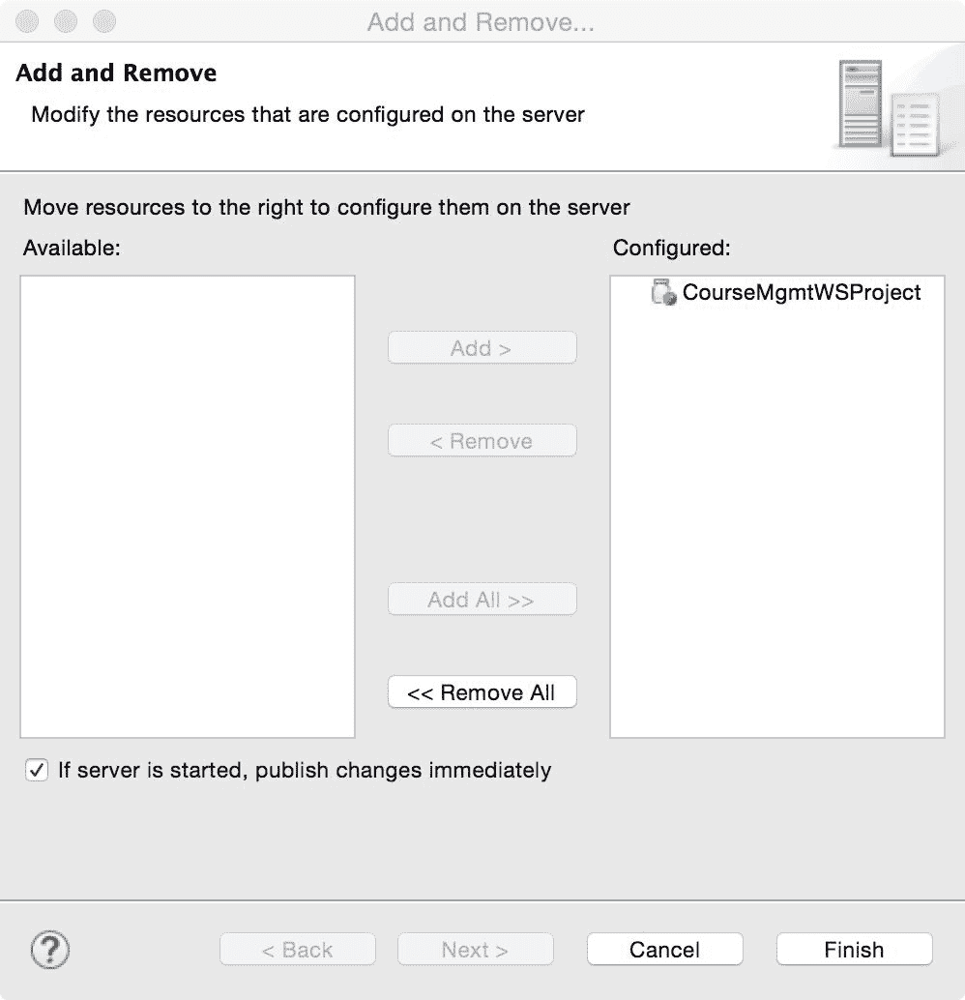

图 9.9：将项目添加到 Tomcat

添加项目并点击完成。

通过在服务器视图中右键单击配置的服务并选择启动来启动 Tomcat 服务器。

要检查我们网络服务的 WSDL，请浏览到`http://localhost:8080/CourseMgmtWSProject/courseService?wsdl`（假设 Tomcat 运行在端口`8080`）。以下 WSDL 应该被生成（参见 WSDL 部分中*图 9.6*之后的描述，以了解此处生成的 WSDL 的结构）：

```java
<definitions 

 targetNamespace="http://soap.ws.eclipse.jee.packt/" 
  name="CourseManagementServiceService"> 
  <types> 
    <xsd:schema> 
      <xsd:import namespace="http://soap.ws.eclipse.jee.packt/" 
schemaLocation="http://localhost:8080/CourseMgmtWSProject/courseService?xsd=1" /> 
    </xsd:schema> 
  </types> 
  <message name="getCourses"> 
    <part name="parameters" element="tns:getCourses" /> 
  </message> 
  <message name="getCoursesResponse"> 
    <part name="parameters" element="tns:getCoursesResponse" /> 
  </message> 
  <message name="getCourse"> 
    <part name="parameters" element="tns:getCourse" /> 
  </message> 
  <message name="getCourseResponse"> 
    <part name="parameters" element="tns:getCourseResponse" /> 
  </message> 
  <portType name="CourseManagementService"> 
    <operation name="getCourses"> 
      <input 
wsam:Action="http://soap.ws.eclipse.jee.packt/CourseManagementService/getCoursesRequest" 
        message="tns:getCourses" /> 
      <output 
wsam:Action="http://soap.ws.eclipse.jee.packt/CourseManagementService/getCoursesResponse" 
        message="tns:getCoursesResponse" /> 
    </operation> 
    <operation name="getCourse"> 
      <input 
wsam:Action="http://soap.ws.eclipse.jee.packt/CourseManagementService/getCourseRequest" 
        message="tns:getCourse" /> 
      <output 
wsam:Action="http://soap.ws.eclipse.jee.packt/CourseManagementService/getCourseResponse" 
        message="tns:getCourseResponse" /> 
    </operation> 
  </portType> 
  <binding name="CourseManagementServicePortBinding" 
   type="tns:CourseManagementService"> 
    <soap:binding transport="http://schemas.xmlsoap.org/soap/http" 
      style="document" /> 
    <operation name="getCourses"> 
      <soap:operation soapAction="" /> 
      <input> 
        <soap:body use="literal" /> 
      </input> 
      <output> 
        <soap:body use="literal" /> 
      </output> 
    </operation> 
    <operation name="getCourse"> 
      <soap:operation soapAction="" /> 
      <input> 
        <soap:body use="literal" /> 
      </input> 
      <output> 
        <soap:body use="literal" /> 
      </output> 
    </operation> 
  </binding> 
  <service name="CourseManagementServiceService"> 
    <port name="CourseManagementServicePort" 
     binding="tns:CourseManagementServicePortBinding"> 
      <soap:address 
location="http://localhost:8080/CourseMgmtWSProject/courseService" 
 /> 
    </port> 
  </service> 
</definitions> 
```

注意，此 Web 服务的模式（参见`/types/xsd:schemas`元素的定义）已导入到之前的 WSDL 中。您可以在`http://localhost:8080/CourseMgmtWSProject/courseService?xsd=1`中看到生成的模式：

```java
<xs:schema  
   version="1.0" 
  targetNamespace="http://soap.ws.eclipse.jee.packt/"> 

  <xs:element name="getCourse" type="tns:getCourse" /> 
  <xs:element name="getCourseResponse" 
   type="tns:getCourseResponse" /> 
  <xs:element name="getCourses" type="tns:getCourses" /> 
  <xs:element name="getCoursesResponse" 
 type="tns:getCoursesResponse" /> 

  <xs:complexType name="getCourses"> 
    <xs:sequence /> 
  </xs:complexType> 
  <xs:complexType name="getCoursesResponse"> 
    <xs:sequence> 
      <xs:element name="return" type="tns:course" minOccurs="0" 
        maxOccurs="unbounded" /> 
    </xs:sequence> 
  </xs:complexType> 
  <xs:complexType name="course"> 
    <xs:sequence> 
      <xs:element name="credits" type="xs:int" /> 
      <xs:element name="id" type="xs:int" /> 
      <xs:element name="name" type="xs:string" minOccurs="0" /> 
    </xs:sequence> 
  </xs:complexType> 
  <xs:complexType name="getCourse"> 
    <xs:sequence> 
      <xs:element name="arg0" type="xs:int" /> 
    </xs:sequence> 
  </xs:complexType> 
  <xs:complexType name="getCourseResponse"> 
    <xs:sequence> 
      <xs:element name="return" type="tns:course" minOccurs="0" /> 
    </xs:sequence> 
  </xs:complexType> 
</xs:schema>
```

模式文档定义了`getCourse`和`getCourses`方法及其响应（`getCoursesResponse`和`getCourseResponse`）以及`Course`类的数据类型。它还声明了`Course`数据类型的成员（`id`、`credits`和`name`）。请注意，`getCourse`数据类型有一个子元素（它是`CourseManagementService`中对`getCourse`方法的调用参数），称为`arg0`，实际上是`int`类型的课程 ID。此外，请注意`getCoursesResponse`的定义。在我们的实现类中，`getCourses`返回`List<Course>`，在 WSDL（或 WSDL 中的类型）中将其转换为课程类型的序列。

在之前的 WSDL 中定义了以下四个消息：`getCourses`、`getCoursesResponse`、`getCourse`和`getCourseResponse`。每个消息都包含一个部分元素，该元素引用在`types`（或 schema）中声明的数据类型。

`PortType`名称与名为`CourseManagementService`的 Web 服务实现类相同，端口的操作与类的公共方法相同。每个操作的输入和输出都引用 WSDL 中已定义的消息。

绑定定义了网络传输类型，在这个例子中是 HTTP，以及 SOAP 体中的消息样式，它是文档类型。在我们的 Web 服务实现中，我们没有定义任何消息类型，但 JAX-WS 参考实现（Glassfish Metro）已将默认消息类型设置为`document`。绑定还定义了每个操作的输入和输出消息的消息编码类型。

最后，`Service`元素指定了端口的地址，即我们访问以调用 Web 服务的 URL。

# 使用接口实现 Web 服务

在我们的 Web 服务实现类`CourseManagementService`中声明的所有方法都作为 Web 服务操作公开。然而，如果你想只公开 Web 服务实现类中的有限方法集，则可以使用 Java 接口。例如，如果我们只想公开`getCourses`方法作为 Web 服务操作，则可以创建一个接口，比如`ICourseManagementService`：

```java
package packt.jee.eclipse.ws.soap; 

import java.util.List; 

import javax.jws.WebService; 

@WebService 
public interface ICourseManagementService { 
  public List<Course> getCourses(); 
} 
```

实现类也需要使用`@WebService`注解，并将`endpointInterface`属性设置为接口名称：

```java
package packt.jee.eclipse.ws.soap; 

import java.util.ArrayList; 
import java.util.List; 

import javax.jws.WebService; 

@WebService 
 (endpointInterface="packt.jee.eclipse.ws.soap.ICourseManagementService") 
public class CourseManagementService implements ICourseManagementService { 

  //getCourses and getCourse methods follow here 
} 
```

现在，重新启动 Tomcat 并检查 WSDL。你会注意到在 WSDL 中只定义了`getCourses`操作。

# 使用 JAX-WS 消费 Web 服务

现在让我们创建一个简单的 Java 控制台应用程序来消费我们之前创建的 Web 服务。选择 File | New | Maven Project。在第一页上选择“Create a simple project”选项并点击 Next。输入以下配置详细信息：

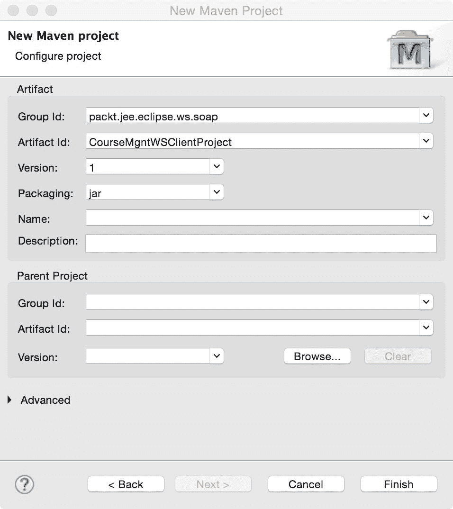

图 9.10：为网络服务客户端创建 Maven 项目

确保打包类型为`jar`。点击完成。

现在我们将在客户端生成一个存根和支持类以调用网络服务。我们将使用`wsimport`工具生成客户端类。我们将使用`-p`选项指定生成类的包，并使用 WSDL 位置生成客户端类。`wsimport`工具是 JDK 的一部分，如果使用 JDK 1.7 或更高版本，它应该位于`<JDK_HOME>/bin`文件夹中。

将文件夹更改为`<project_home>/src//main/java`并运行以下命令：

```java
wsimport -keep -p packt.jee.eclipse.ws.soap.client http://localhost:8080/CourseMgmtWSProject/courseService?wsdl

```

`-keep`标志指示`wsimport`保留生成的文件，而不是删除它。

`-p`选项指定生成类的包名。

最后一个参数是网络服务的 WSDL 位置。在 Eclipse 的包资源管理器或项目资源管理器中，刷新客户端项目以查看生成的文件。这些文件应在`packt.jee.eclipse.ws.soap.client`包中。

`wsimport`为模式中定义的每个类型（在 WSDL 的类型元素中）生成客户端类。因此，您将找到`Course`、`GetCourse`、`GetCourseResponse`、`GetCourses`和`GetCoursesResponse`类。此外，它还为 WSDL 的`portType`（`CourseManagementService`）和`service`（`CourseManagementServiceService`）元素生成类。此外，它还创建了一个`ObjectFactory`类，该类使用 JAXB 从 XML 创建 Java 对象。

现在我们来编写实际调用网络服务的代码。在`packt.jee.eclipse.ws.soap.client.test`包中创建`CourseMgmtWSClient`类：

```java
package packt.jee.eclipse.ws.soap.client.test; 

import packt.jee.eclipse.ws.soap.client.Course; 
import packt.jee.eclipse.ws.soap.client.CourseManagementService; 
import packt.jee.eclipse.ws.soap.client.CourseManagementServiceService; 

public class CourseMgmtWSClient { 

  public static void main(String[] args) { 
    CourseManagementServiceService service = new 
 CourseManagementServiceService();    CourseManagementService port = 
     service.getCourseManagementServicePort(); 

    Course course = port.getCourse(1); 
    System.out.println("Course name = " + course.getName()); 
  } 

} 
```

我们首先创建`Service`对象，然后从中获取端口。`port`对象定义了网络服务的操作。然后我们在`port`对象上调用实际的网络服务方法。在类上右键单击并选择运行方式 | Java 应用程序。输出应该是我们在网络服务实现中硬编码的课程名称，即`Course-1`。

# 在网络服务操作中指定参数名称

如前所述，当为我们的`Course`网络服务创建 WSDL 时，`getCourse`操作名称的参数被创建为`arg0`。您可以通过浏览到`http://localhost:8080/CourseMgmtWSProject/courseService?xsd=1`并检查`getCourse`类型来验证这一点：

```java
<xs:complexType name="getCourse"> 
     <xs:sequence> 
         <xs:element name="arg0" type="xs:int"/> 
     </xs:sequence> 
</xs:complexType> 
```

因此，客户端生成的代码（由`wsimport`生成）在`CourseManagementService.getCourse`中也命名参数为`arg0`。给参数起一个有意义的名称会很好。这可以通过在我们的网络服务实现类`CourseManagementService`中添加`@WSParam`注解轻松完成：

```java
public Course getCourse(@WebParam(name="courseId") int courseId) {...} 
```

在此更改后重新启动 Tomcat，并再次浏览到 WSDL 模式 URL（`http://localhost:8080/CourseMgmtWSProject/courseService?xsd=1`）。现在您应该能在`getCourse`类型中看到正确的参数名称：

```java
<xs:complexType name="getCourse"> 
     <xs:sequence> 
         <xs:element name="courseId" type="xs:int"/> 
     </xs:sequence> 
</xs:complexType> 
```

再次使用`wsimport`生成客户端代码，你会看到`getCourse`方法的参数被命名为`courseId`。

# 检查 SOAP 消息

虽然你不必一定理解 Web 服务和客户端之间传递的 SOAP 消息，但有时检查两者之间交换的 SOAP 消息可以帮助调试一些问题。

当运行客户端时，你可以通过设置以下系统属性轻松地打印请求和响应 SOAP 消息：

`com.sun.xml.internal.ws.transport.http.client.HttpTransportPipe.dump=true`

在 Eclipse 中，右键单击`CourseMgmtWSClient`类，选择“运行”|“运行配置”。单击“参数”选项卡，并指定以下 VM 参数：

`Dcom.sun.xml.internal.ws.transport.http.client.HttpTransportPipe.dump=true`

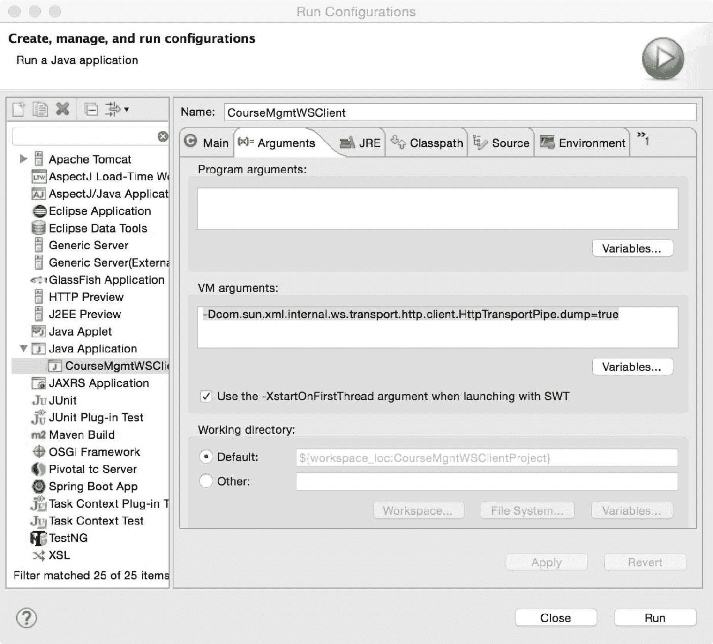

图 9.11：设置 VM 参数

点击运行。你将在 Eclipse 的控制台窗口中看到请求和响应 SOAP 消息被打印出来。在格式化请求消息后，这是请求 SOAP 消息的外观：

```java
<?xml version="1.0" ?> 
<S:Envelope > 
  <S:Body> 
    <ns2:getCourse > 
      <courseId>1</courseId> 
    </ns2:getCourse> 
  </S:Body> 
</S:Envelope> 
```

响应如下：

```java
<?xml version='1.0' encoding='UTF-8'?> 
<S:Envelope > 
  <S:Body> 
    <ns2:getCourseResponse 
     > 
      <return> 
        <credits>4</credits> 
        <id>1</id> 
        <name>Course-1</name> 
      </return> 
    </ns2:getCourseResponse> 
  </S:Body> 
</S:Envelope> 
```

# RPC 样式 Web 服务中的接口处理

回想一下，我们 Web 服务实现类的消息风格是`Document`，编码是`literal`。让我们将风格更改为 RPC。打开`CourseManagementService.java`，将 SOAP 绑定的风格从`Style.DOCUMENT`更改为`Style.RPC`：

```java
@WebService 
@SOAPBinding(style=Style.RPC, use=Use.LITERAL) 
public class CourseManagementService {...} 
```

重新启动 Tomcat。在 Tomcat 控制台中，你可能会看到以下错误：

```java
    Caused by: com.sun.xml.bind.v2.runtime.IllegalAnnotationsException: 1 counts of IllegalAnnotationExceptions
    java.util.List is an interface, and JAXB can't handle interfaces.
      this problem is related to the following location:
        at java.util.List
```

这个问题是由`CourseManagementService`类中的以下方法定义引起的：

```java
  public List<Course> getCourses() {...} 
```

在 RPC 样式的 SOAP 绑定中，JAX-WS 使用 JAXB，而 JAXB 不能很好地序列化接口。一篇博客文章[`community.oracle.com/blogs/kohsuke/2006/06/06/jaxb-and-interfaces`](https://community.oracle.com/blogs/kohsuke/2006/06/06/jaxb-and-interfaces)试图解释这一原因。解决方案是为`List`创建一个包装器，并用`@XMLElement`注解它。因此，在同一个包中创建一个名为`Courses`的新类：

```java
package packt.jee.eclipse.ws.soap; 

import java.util.List; 

import javax.xml.bind.annotation.XmlAnyElement; 
import javax.xml.bind.annotation.XmlRootElement; 

@XmlRootElement 
public class Courses { 
  @XmlAnyElement 
  public List<Course> courseList; 

  public Courses() { 

  } 

  public Courses (List<Course> courseList) { 
    this.courseList = courseList; 
  } 
} 
```

然后，将`CourseManagementService`的`getCourses`方法修改为返回`Courses`对象而不是`List<Course>`：

```java
  public Courses getCourses() { 
    //Here, courses could be fetched from database using, 
    //for example, JDBC or JDO. However, to keep this example 
    //simple, we will return hardcoded list of courses 

    List<Course> courses = new ArrayList<Course>(); 

    courses.add(new Course(1, "Course-1", 4)); 
    courses.add(new Course(2, "Course-2", 3)); 

    return new Courses(courses); 
  } 
```

重新启动 Tomcat。这次，应用程序应该在 Tomcat 中无错误地部署。使用`wsimport`重新生成客户端类，运行客户端应用程序，并验证结果。

# 异常处理

在 JAX-WS 中，当 XML 有效载荷发送到客户端时，从 Web 服务抛出的 Java 异常被映射为 SOAP 故障。在客户端，JAX-WS 将 SOAP 故障映射为`SOAPFaultException`或映射为特定于应用程序的异常。客户端代码可以在`try...catch`块中包装 Web 服务调用以处理 Web 服务抛出的异常。

关于如何在 JAX-WS 中处理 SOAP 异常的详细描述，请参阅[`docs.oracle.com/cd/E24329_01/web.1211/e24965/faults.htm#WSADV624`](https://docs.oracle.com/cd/E24329_01/web.1211/e24965/faults.htm#WSADV624)。

# 摘要

Web 服务是企业应用集成的一种非常有用的技术。它们允许不同的系统相互通信。Web 服务 API 通常是自包含且轻量级的。

Web 服务大致分为两种类型：基于 SOAP 的和 RESTful 的。基于 SOAP 的 Web 服务是基于 XML 的，并提供许多功能，如安全性、附件和事务。RESTful Web 服务可以通过使用 XML 或 JSON 交换数据。RESTful JSON Web 服务非常受欢迎，因为它们可以从 JavaScript 代码中轻松消费。

在本章中，我们学习了如何使用最新的 Java 规范 JAX-RS 和 JAX-WS 来开发和消费基于 SOAP 和 RESTful 的 Web 服务。

在下一章中，我们将探讨另一种应用集成技术：使用**Java 消息服务**（**JMS**）的异步编程。
