# 第十一章：Java CPU 分析器和内存跟踪

在上一章中，我们学习了如何使用 JMS（Java 消息服务）API 编写异步应用程序。在本章中，我们将了解一些用于分析 Java 应用程序的技术和工具。企业应用程序往往相当复杂且庞大。可能存在应用程序不符合你的要求或预期的情况。例如，应用程序中执行的一些操作可能花费的时间过长或消耗的内存比你预期的要多。此外，调试性能和内存问题有时可能变得非常困难。

幸运的是，JDK 和 Eclipse 都提供了工具来帮助我们调试这些问题。JDK 6（更新 7）及以上版本捆绑了**jVisualVM**应用程序，该程序可以连接到远程或本地应用程序。你可以在`<JDK_HOME>/bin`文件夹中找到这个工具。jVisualVM 可以帮助你分析内存和 CPU 使用情况。它还可以配置为在从 Eclipse 运行应用程序时从 Eclipse 启动。我们将在本章中学习如何使用 VisualVM 来分析 Java 应用程序。你可以在[`visualvm.github.io/`](https://visualvm.github.io/)找到有关 jVisualVM/VisualVM 的详细信息。

我们将创建一个独立的 Java 应用程序来模拟性能和内存问题，并了解如何使用 VisualVM 进行故障排除。虽然你可能想要调试的实际应用程序可能要复杂得多，但我们将在本章中学到的技术也可以用于复杂的应用程序。

在本章中，我们将涵盖以下主题：

+   使用 VisualVM 进行 CPU 和内存分析

+   检测内存泄漏和死锁的技术

+   使用 Eclipse 内存分析器分析由 VisualVM 创建的堆转储

# 创建用于性能分析的示例 Java 项目

我们将创建一个简单的独立 Java 应用程序，这样你就可以轻松学习如何使用 VisualVM 进行性能分析。虽然它将是一个独立的应用程序，但我们将创建一些类，这些类与我们在前几章中为`CourseManagement` Web 应用程序创建的类相似，特别是`CourseDTO`、`CourseBean`（JSP Bean）、`CourseService`（服务 Bean）和`CourseDAO`（用于数据库访问）。

1.  在 Eclipse 中创建一个名为`CourseManagementStandalone`的标准 Java 项目。在`packt.jee.eclipse.profile.dto`包中创建`CourseDTO`类：

```java
package packt.jee.eclipse.profile.dto; 

public class CourseDTO { 
  private int id; 
  private String name; 
  private int credits; 

  //skipped Getters and Setters 
} 
```

1.  在`packt.jee.eclopse.profile.dao`包中创建`CourseDAO`类：

```java
//skipped imports 
public class CourseDAO { 

  public List<CourseDTO> getCourses() { 
    //No real database access takes place here 
    //We will just simulate a long-running database operation 

    try { 
      Thread.sleep(2000); //wait 2 seconds 
    } catch (InterruptedException e) { 
      e.printStackTrace(); 
    } 

    //return dummy/empty list 
    return new ArrayList<>(); 
  } 
} 
```

我们通过使线程休眠几秒钟来在`getCourses`方法中模拟了一个长时间运行的数据库操作。

1.  在`packt.jee.eclipse.profile.service`包中创建`CourseService`类：

```java
//skipped imports 
public class CourseService { 

  private CourseDAO courseDAO = new CourseDAO(); 

  public List<CourseDTO> getCourses() { 
    return courseDAO.getCourses(); 
  } 
} 
```

`CourseService.getCourses`将调用委托给`CourseDAO`。

1.  在`packt.jee.eclipse.profile.bean`包中创建`CourseBean`类：

```java
//skipped imports 
public class CourseBean { 
  private CourseService courseService = new CourseService(); 

  public List<CourseDTO> getCourses() { 
    return courseService.getCourses(); 
  } 
} 
```

`CourseBean.getcourses`将调用委托给`CourseService`。

1.  最后，在`packt.jee.eclipse.profile`包中创建`CourseManagement`类。此类包含`main`方法，并在读取标准输入的任何字符后重复调用`getCourses`方法：

```java
//skipped imports 
public class CourseManagement { 

  public static void main(String[] args) throws IOException { 

    CourseBean courseBean = new CourseBean(); 

    System.out.println("Type any character to get courses. Type q 
     to quit."); 

    int ch; 
    while ((ch = System.in.read()) != -1) { 
      if (ch != 10 && ch != 13) { //ignore new lines 
        if (ch == 'q') //quit if user types q 
          break; 

        System.out.println("Getting courses"); 
        List<CourseDTO> courses = courseBean.getCourses(); 
        System.out.println("Got courses"); 

        System.out.println("Type any character to get courses. 
         Type q to quit."); 
      } 
    } 

    System.out.println("Quitting ..."); 
  } 
} 
```

1.  运行应用程序（右键单击文件并选择运行方式 | Java 应用程序）。

    在控制台窗口中，输入任何字符并按*Enter*。您应该看到“获取课程”和“获取课程”的消息。

# 分析 Java 应用程序

1.  从`<JDK_HOME>/bin`文件夹运行 jvisualvm：

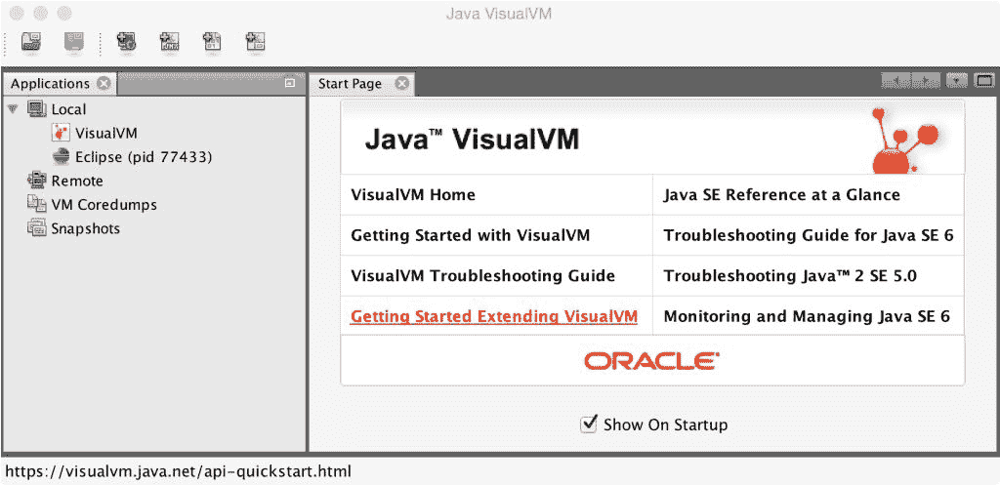

图 11.1：Java VisualVM 分析器

VisualVM 列出了本地节点下可以由它分析的本地所有 Java 进程。您可以看到 VisualVM 本身以及 Eclipse 被列出。

1.  一旦运行了`CourseManagement`应用程序，该进程也应该在本地显示：

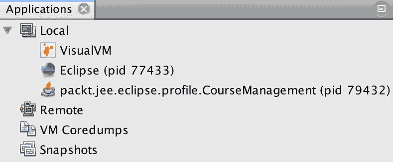

图 11.2：可用于分析的 CourseManagement 应用程序

1.  双击进程（或右键单击并选择打开）。然后，转到 Profile 选项卡并单击 CPU 按钮：

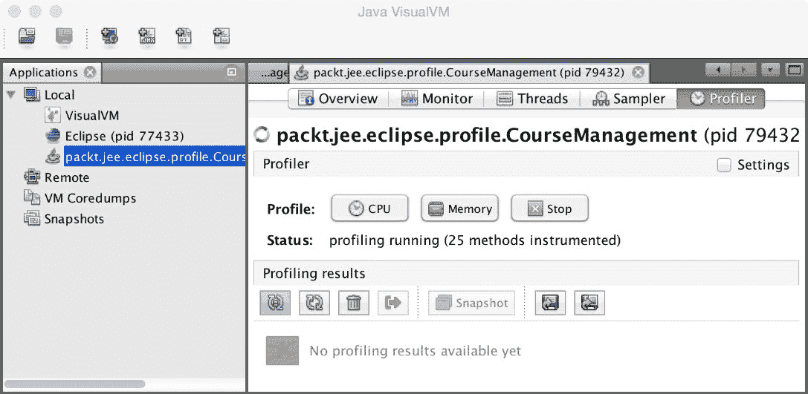

图 11.3：VisualVM 分析器选项卡

您应该看到状态设置为分析运行。

1.  在开始 CPU 分析后，如果您遇到错误，例如“重新定义失败，错误代码 62”，请尝试使用`-XVerify:none`参数运行应用程序。在 Eclipse 中，选择 Run | Run Configurations 菜单，然后在 Java Application 组下选择 CourseManagement 应用程序。转到 Arguments 选项卡，并将`-Xverify:none`添加到 VM arguments。再次运行应用程序。

1.  在 VisualVM 分析器页面，单击设置复选框以查看用于分析的包。请注意，VisualVM 会自动选择这些包：

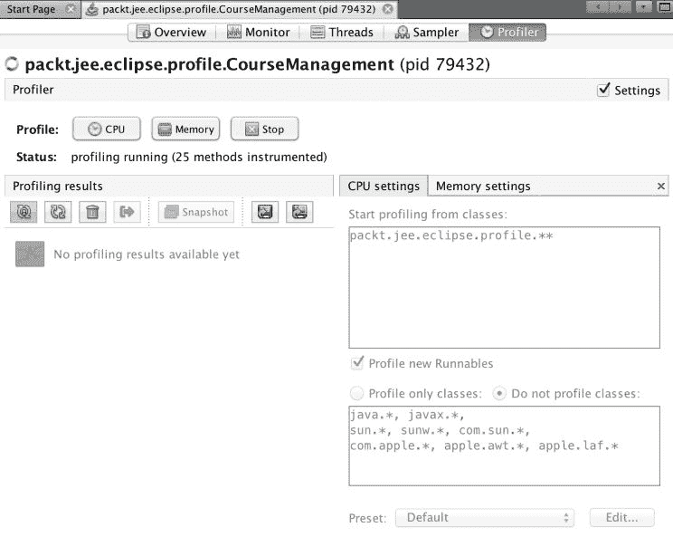

图 11.4：VisualVM 分析器设置

1.  您必须停止 CPU 分析才能编辑设置。然而，我们将保留默认设置。取消选中设置框以隐藏设置。

1.  点击 Monitor 表以查看分析活动的概述：

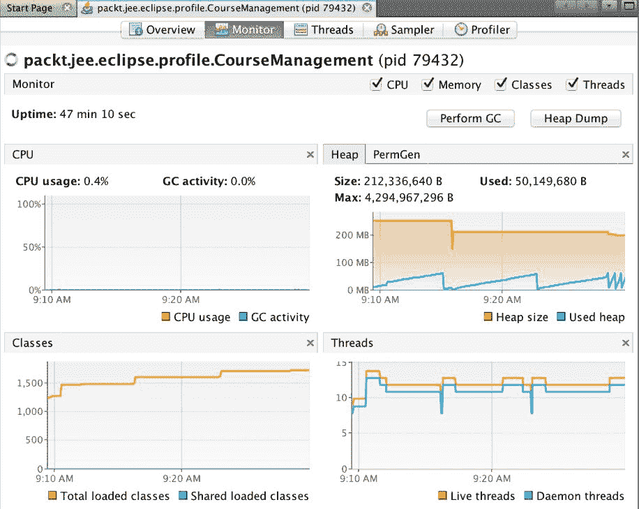

图 11.5：分析活动概述

1.  现在，让我们在我们的应用程序中执行`getCourse`方法。转到 Eclipse 的控制台视图，其中我们的应用程序正在运行，输入一个字符（除了`q`），然后按*Enter*。转到 VisualVM 的 Profiler 选项卡以查看分析数据：

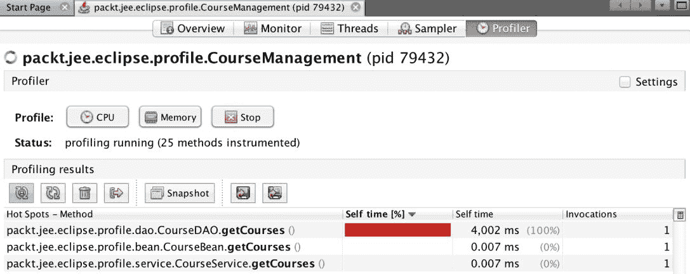

图 11.6：CourseManagement 的 CPU 分析

观察 Self time 列。这表示 CPU 时间或执行相应方法所花费的流逝时间，不包括执行从该方法调用的其他方法的时间。在我们的案例中，`CourseDAO.getCourses`花费了最长时间，因此它位于列表的顶部。这份报告可以帮助您识别应用程序中的瓶颈。

# 识别资源竞争

在多线程应用程序中，线程锁定或等待锁是很常见的。线程转储可用于识别资源竞争。让我们通过修改`CourseManagement`类的`main`方法来在我们的应用程序中模拟此场景，以在单独的线程中调用`courseBean.getCourses`：

```java
public class CourseManagement { 

  public static void main(String[] args) throws IOException { 

    final CourseBean courseBean = new CourseBean(); 

    System.out.println("Type any character to get courses. Type q 
     to quit."); 

    int ch, threadIndex = 0; 
    while ((ch = System.in.read()) != -1) { 
      if (ch != 10 && ch != 13) { //ignore new lines 
        if (ch == 'q') //quit if user types q 
          break; 

        threadIndex++; //used for naming the thread 
        Thread getCourseThread = new Thread("getCourseThread" + 
         threadIndex) 
{ 

          @Override 
          public void run() { 
            System.out.println("Getting courses"); 
            courseBean.getCourses(); 
            System.out.println("Got courses"); 
          } 
        }; 

        //Set this thread as Daemon so that the application can exit 
        //immediately when user enters 'q' 
        getCourseThread.setDaemon(true); 

        getCourseThread.start();  

        System.out.println("Type any character to get courses. 
         Type q to quit."); 
      } 
    } 

    System.out.println("Quitting ..."); 
  } 
} 
```

注意我们在`while`循环中创建一个新的`Thread`对象，并在线程的`run`方法中调用`courseBean.getCourses`。`while`循环不等待`getCourses`返回结果，可以立即处理下一个用户输入。这将允许我们模拟资源竞争。

要实际引起资源竞争，让我们同步`CourseService.getCourses`:

```java
public class CourseService { 

  private CourseDAO courseDAO = new CourseDAO(); 

  public synchronized List<CourseDTO> getCourses() { 
    return courseDAO.getCourses(); 
  } 
 } 
```

同步的`getCourses`方法将导致只有一个线程在`CourseService`类的实例中执行此方法。现在我们可以通过在控制台中输入字符来同时触发多个`getCourses`调用，而不必等待对`getCourse`方法的先前调用返回。为了给我们更多的时间获取线程转储，让我们将`CourseDAO.getCourses`中的线程睡眠时间增加到，比如说，30 秒：

```java
public class CourseDAO { 

  public List<CourseDTO> getCourses() { 
    //No real database access takes place here. 
    //We will just simulate a long-running database operation 

    try { 
      Thread.sleep(30000); //wait 30 seconds 
    } catch (InterruptedException e) { 
      e.printStackTrace(); 
    } 

    //return dummy/empty list 
    return new ArrayList<>(); 
  } 
} 
```

运行应用程序，并在 VisualVM 中开始监控此进程。在 Eclipse 中运行应用程序的控制台窗口中，输入一个字符并按*Enter*。重复一次。现在，将触发两个`getCourses`调用。在 VisualVM 中，转到线程选项卡并单击 ThreadDump 按钮。一个新的线程转储将保存在进程节点下，并在新选项卡中显示。查找以`getCourseThread`为前缀的线程。以下是两个`getCourseThreads`的示例线程转储：

```java
"getCourseThread2" daemon prio=6 tid=0x000000001085b800 nid=0x34f8 waiting for monitor entry [0x0000000013aef000] 
   java.lang.Thread.State: BLOCKED (on object monitor) 
  at 
 packt.jee.eclipse.profile.service.CourseService.getCourses(CourseService.java:13)  - waiting to lock <0x00000007aaf57a80> (a 
 packt.jee.eclipse.profile.service.CourseService) 
  at packt.jee.eclipse.profile.bean.CourseBean.getCourses(CourseBean.java:12) 
  at packt.jee.eclipse.profile.CourseManagement$1.run(CourseManagement.java:27) 

   Locked ownable synchronizers: 
  - None 

"getCourseThread1" daemon prio=6 tid=0x000000001085a800 nid=0x2738 waiting on condition [0x000000001398f000] 
   java.lang.Thread.State: TIMED_WAITING (sleeping) 
  at java.lang.Thread.sleep(Native Method) 
  at packt.jee.eclipse.profile.dao.CourseDAO.getCourses(CourseDAO.java:15) 
  at packt.jee.eclipse.profile.service.CourseService.getCourses(CourseService.java:13) 
  - locked <0x00000007aaf57a80> (a packt.jee.eclipse.profile.service.CourseService) 
  at packt.jee.eclipse.profile.bean.CourseBean.getCourses(CourseBean.java:12) 
  at packt.jee.eclipse.profile.CourseManagement$1.run(CourseManagement.java:27) 

   Locked ownable synchronizers: 
  - None 
```

从前面的线程转储中可以看出，`getCourseThread2`正在等待（`to lock <0x00000007aaf57a80>`）而`getCourseThread1`正在持有对该对象的锁（`locked <0x00000007aaf57a80>`）。

使用相同的技巧（检查锁），你还可以在应用程序中检测死锁。实际上，VisualVM 可以检测死锁并明确指出死锁的线程。让我们修改`CourseManagement`类的`main`方法来引起死锁。我们将创建两个线程并使它们以相反的顺序锁定两个对象：

警告

以下代码将使应用程序挂起。你必须杀死进程才能退出。

```java
  public static void main(String[] args) throws IOException { 

    System.out.println("Type any character and Enter to cause 
     deadlock - "); 
    System.in.read(); 

    final Object obj1 = new Object(), obj2 = new Object(); 

    Thread th1 = new Thread("MyThread1") { 
      public void run() { 
        synchronized (obj1) { 
          try { 
            sleep(2000); 
          } catch (InterruptedException e) { 
            e.printStackTrace(); 
          } 

          synchronized (obj2) { 
            //do nothing 
          } 
        } 
      } 
    }; 

    Thread th2 = new Thread("MyThread2") { 
      public void run() { 
        synchronized (obj2) { 
          try { 
            sleep(2000); 
          } catch (InterruptedException e) { 
            e.printStackTrace(); 
          } 

          synchronized (obj1) { 

          } 
        } 
      } 
    }; 

    th1.start(); 
    th2.start(); 
```

`MyThread1`首先锁定`obj1`然后尝试锁定`obj2`，而`MyThread2`

首先锁定`obj2`然后尝试锁定`obj1`。当你使用 VisualVM 监控此应用程序并切换到线程选项卡时，你会看到“检测到死锁！”的消息：

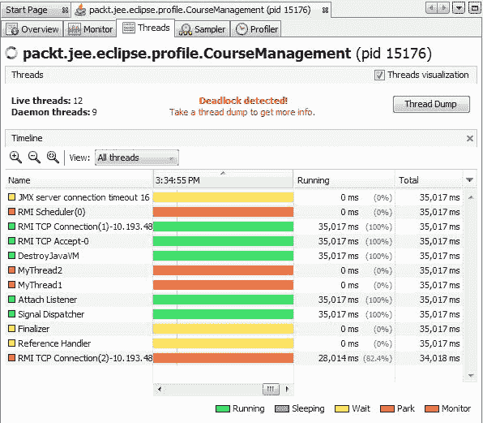

图 11.7：使用 VisualVM 检测死锁

如果你获取线程转储，它将特别显示死锁的原因：

```java
Found one Java-level deadlock: 
============================= 
"MyThread2": 
  waiting to lock monitor 0x000000000f6f71a8 (object 
 0x00000007aaf56538, a java.lang.Object), 
  which is held by "MyThread1" 
"MyThread1": 
  waiting to lock monitor 0x000000000f6f4a78 (object 
 0x00000007aaf56548, a java.lang.Object), 
  which is held by "MyThread2" 
```

# 内存跟踪

VisualVM 可以用来监控内存分配并检测可能的内存泄漏。让我们修改我们的应用程序来模拟一个未释放的大内存分配。我们将修改`CourseService`类：

```java
public class CourseService { 

  private CourseDAO courseDAO = new CourseDAO(); 

  //Dummy cached data used only to simulate large 
  //memory allocation 
  private byte[] cachedData = null; 

  public synchronized List<CourseDTO> getCourses() { 

    //To simulate large memory allocation, 
    //let's assume we are reading serialized cached data 
    //and storing it in the cachedData member 
    try { 
      this.cachedData = generateDummyCachedData(); 
    } catch (IOException e) { 
      //ignore 
    } 

    return courseDAO.getCourses(); 
  } 

  private byte[] generateDummyCachedData() throws IOException { 
    ByteArrayOutputStream byteStream = new ByteArrayOutputStream(); 
    byte[] dummyData = "Dummy cached data".getBytes(); 

    //write 100000 times 
    for (int i = 0; i < 100000; i++) 
      byteStream.write(dummyData); 

    byte[] result = byteStream.toByteArray(); 
    byteStream.close(); 
    return result; 
  } 
 } 
```

在`getCourses`方法中，我们将创建一个大的字节数组并将其存储在一个成员变量中。分配给数组的内存将不会释放，直到`CourseService`实例不被垃圾回收。现在，让我们看看这个内存分配如何在 VisualVM 中显示出来。开始监控进程并转到 Profiler 标签页。单击 Memory 按钮开始监控内存。现在，回到 Eclipse 的控制台窗口并输入一个字符以触发`getCourses`方法。转到 VisualVM 以检查内存分析报告：

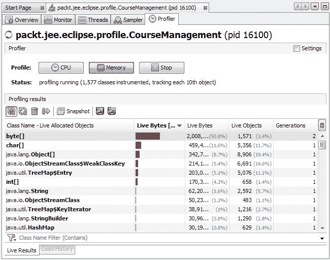

图 11.8：使用 VisualVM 进行内存监控

此报告显示了应用程序中不同对象消耗的内存的实时状态。然而，如果您想分析和找到确切的分配位置，那么请进行堆转储。转到 Monitor 标签页并单击 Heap Dump 按钮。堆转储报告保存在进程节点下。在堆转储报告中单击 Classes 按钮，然后单击 Size 列按内存消耗量降序排序对象：

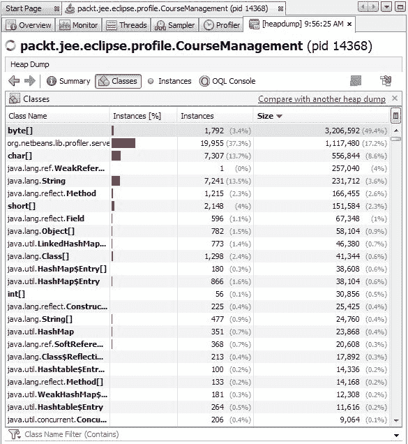

图 11.9：堆转储报告中的类

根据报告，`byte[]`在我们的应用程序中占用最大内存。要找到内存分配的位置，双击包含`byte[]`的行：

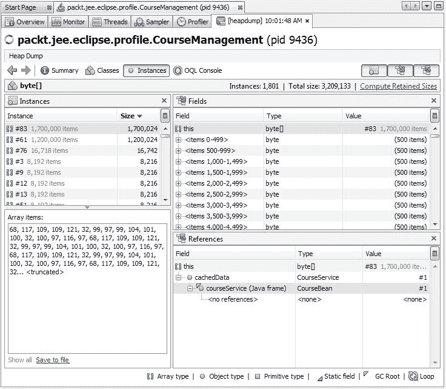

图 11.10：堆转储中的对象实例报告

右下角的引用窗口显示了在左上窗口中选中实例持有引用的对象。如图所示，`byte[]`的引用由`CourseServe`的`cachedData`字段持有。此外，`CourseService`的引用由`CourseBean`持有。

大量内存分配并不一定意味着内存泄漏。您可能想在应用程序中保留对大对象的引用。然而，堆转储可以帮助您找到内存分配的位置以及该实例是否打算保留在内存中。如果不是，您可以在适当的位置找到内存分配并释放它。

我们所取的堆转储如果重启 VisualVM 将会丢失。因此，请将其保存到磁盘上；为此，右键单击堆转储节点并选择另存为。我们将在下一节中使用这个堆转储在 Eclipse 内存分析器中。

# Eclipse 内存分析插件

Eclipse 内存分析器([`eclipse.org/mat/`](https://eclipse.org/mat/))可以用来分析 VisualVM 创建的堆转储。它提供了额外的功能，如自动内存泄漏检测。此外，通过将其作为 Eclipse 插件使用，您可以从堆转储报告中快速跳转到源代码。您可以使用此工具作为独立应用程序或作为 Eclipse 插件。我们将在本节中看到如何将其用作 Eclipse 插件。

要安装内存分析器插件并分析内存转储，请执行以下步骤：

1.  打开 Eclipse Marketplace（选择 Help | Eclipse Marketplace 菜单）。搜索`Memory Analyzer`并安装插件：

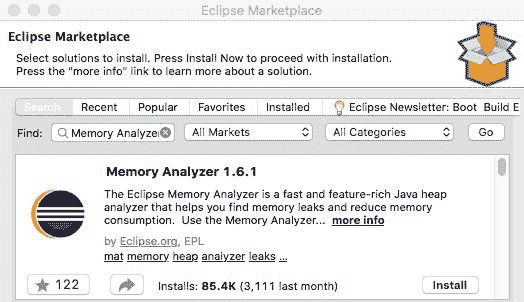

图 11.11：在 Eclipse Marketplace 中搜索内存分析器插件

1.  打开上一节中保存的堆转储文件。选择“文件”|“打开文件”菜单，并选择由 VisualVM 保存的`.hprof`文件。内存分析器将提示您选择报告类型：

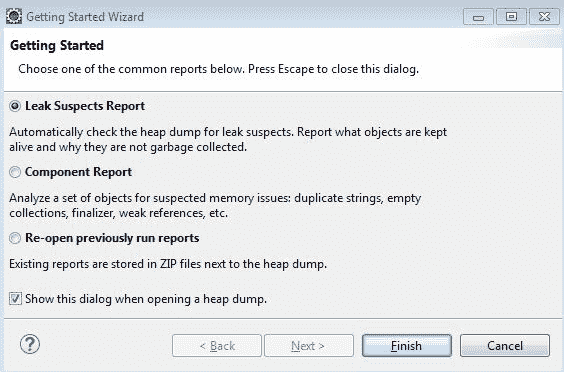

图 11.12：Eclipse 内存分析器：入门向导

1.  选择“泄漏嫌疑报告”并点击“完成”。Eclipse 内存分析器创建带有几个问题嫌疑人的泄漏嫌疑报告：

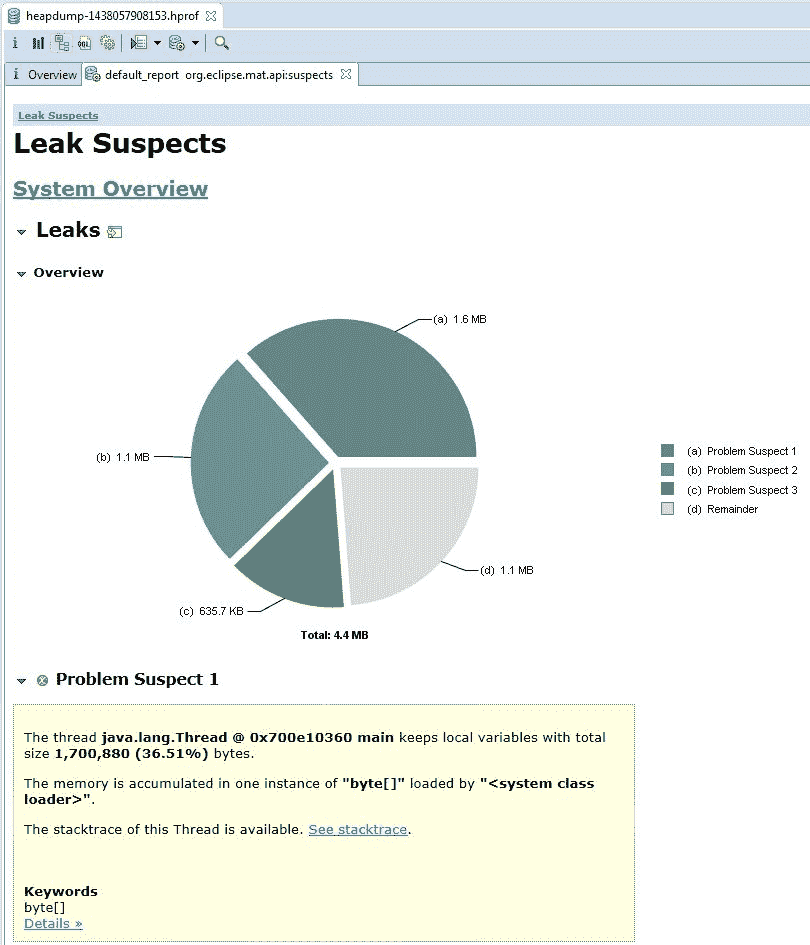

图 11.13：Eclipse 内存分析器：泄漏嫌疑报告

1.  在第一个问题嫌疑人的“详细信息”链接上点击

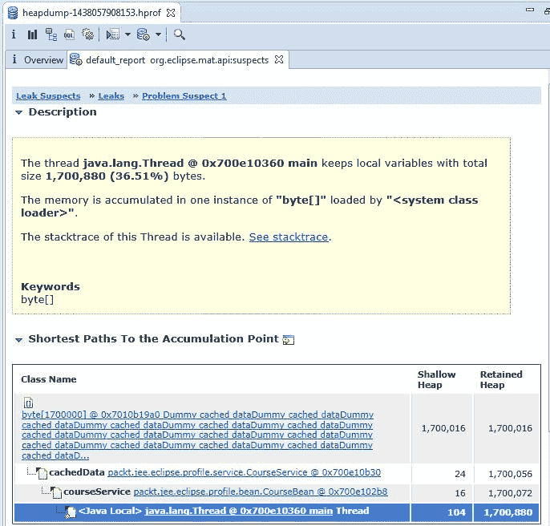

图 11.14：Eclipse 内存分析器：问题嫌疑详情

报告清楚地将`CourseService`中的`cachedData`识别为泄漏嫌疑。要打开源文件，请点击节点并选择“打开源文件”选项。

内存分析器还提供了许多其他有用的报告。有关更多详细信息，请参阅[`help.eclipse.org/oxygen/index.jsp?topic=/org.eclipse.mat.ui.help/welcome.html`](http://help.eclipse.org/oxygen/index.jsp?topic=/org.eclipse.mat.ui.help/welcome.html)。

# 摘要

随 JDK 6 及以上版本一起提供的 VisualVM 工具对于检测性能瓶颈和内存泄漏很有用。

在本章中，我们学习了如何在简单的 Java 应用程序中使用此工具。然而，这项技术也可以用于大型应用程序。可以使用 Eclipse 内存分析器快速从堆转储中检测内存泄漏。在下一章中，我们将学习如何在 JEE 中开发微服务。
