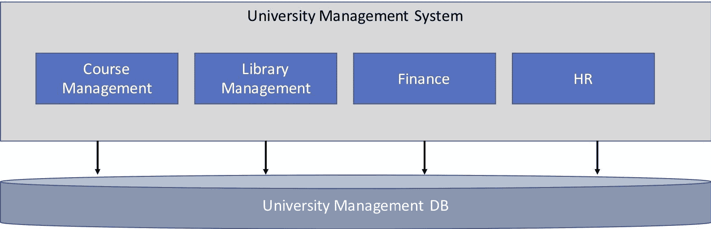

# 第十二章：微服务

在上一章中，我们学习了如何对 Java 应用程序进行性能分析，以便解决性能问题。

在本章中，我们将学习如何使用 Eclipse 开发 JEE 微服务。我们还将学习如何在 Docker 容器中部署微服务。我们将为我们的*课程管理*用例开发简单的微服务。

我们将涵盖以下主题：

+   微服务和 Eclipse MicroProfile 简介

+   使用 WildFly Swarm 和 Spring Boot 框架开发 JEE 微服务

+   Docker 和 Docker Compose 简介

+   在 Docker 容器中部署微服务

# 什么是微服务？

微服务是一个设计得很好的小应用，用于执行特定的业务任务。微服务通常实现为 RESTful Web 服务。以下是一些微服务的特点：

+   尺寸较小（与单一应用相比），专注于单一业务任务/模块

+   它拥有自己的数据库，与所有业务功能使用单一数据库的单一应用形成对比

+   通常是一个独立的应用程序，其中包含捆绑的 Web 容器

通过组装较小的微服务可以构建大型业务应用。与大型单一应用相比，微服务架构提供了以下好处：

+   它们易于部署。在单一应用中，由于应用的复杂性，部署可能相当繁琐。微服务体积小，可以轻松部署到服务器上。

+   微服务是松散耦合的，因此一个微服务的变更可以与应用程序中其他服务的变更隔离。此外，为每个服务拥有单独的数据库可以进一步隔离主应用程序和其他服务，防止数据库模式变更带来的影响。

为了理解单一应用架构和微服务架构之间的对比，让我们看一个例子。在整个书中，我们一直在跟随*课程管理*的例子。假设这个模块是更大型的**大学管理系统**的一部分，该系统包含更多模块。这个应用的单一架构可以看作如下：



图 12.1：单一应用架构

我们有一个大型应用，即**大学管理系统**，包含多个模块和单一数据库。

同一应用程序可以使用微服务按以下方式架构：


图 12.2：微服务应用架构

在微服务架构中，**大学管理系统**由许多微服务组成，每个微服务都有自己的数据库。

# Eclipse MicroProfile

可以使用当前的 JEE 规范（JEE 8）构建微服务。然而，JEE 中存在一些对开发微服务更为重要的规范，例如 JAX-RS（用于 RESTful Web 服务）和 JSON-P（用于处理 JSON 数据）。因此，一些组织联合起来制定了一系列用于开发和运行微服务的规范，这些规范被归类为 MicroProfile。MicroProfile 下的许多规范已经是 JEE 规范的一部分（如 JAX-RS 和 JSON-P），但也有一些是新的规范，例如用于配置和监控微服务的规范。

该小组到目前为止已经提出了两个配置文件。每个符合 MicroProfile 的实现都应实现所支持配置文件中的每个规范。这确保了使用特定配置文件创建的微服务可以在支持该配置文件的所有 Microprofile 实现上运行。在撰写本章时，该小组已经提出了两个配置文件。以下是 MicroProfiles 及其包含的规范列表：

+   MicroProfile 1.0（2016 年 9 月发布）:

    +   CDI 1.2

    +   JSON-P 1.0

    +   JAX-RS 2.0

+   MicroProfile 1.1（2017 年 8 月发布）:

    +   Config 1.0

    +   CDI 1.2

    +   JSON-P 1.0

    +   JAX-RS 2.0

预计 MicroProfile 2.0 将于 2018 年 6 月发布，并将包括对 JEE 8 规范的一些更新。MicroProfile 的一些实现包括 WildFly Swarm ([`wildfly-swarm.io/`](http://wildfly-swarm.io/))、WebSphere Liberty ([`developer.ibm.com/wasdev/websphere-liberty/`](https://developer.ibm.com/wasdev/websphere-liberty/))、Payara ([`www.payara.fish/`](http://www.payara.fish/))和 Apache TomEE ([`tomee.apache.org/`](http://tomee.apache.org/))。有关 MicroProfile 的更多信息，请访问其官方网站[`microprofile.io/`](https://microprofile.io/)。

在下一节中，我们将看到如何使用两种解决方案实现我们的*课程管理*用例的微服务：

+   使用 MicroProfile 实现（WildFly Swarm）

+   使用 Spring Boot，它不是 MicroProfile 的一部分

接下来，我们将看到如何将微服务部署到 Docker 容器中。

要跟随本章中的代码示例，您需要熟悉 JPA 和 REST API。请参考第四章，*创建 JEE 数据库应用程序*，了解 JPA 概念，以及第九章，*创建 Web 服务*，了解 RESTful Web 服务。

# 为微服务项目设置数据库

我们将实现一个微服务来获取课程列表。我们将使用与本书中相同的 MySQL 数据库，`course_management`。如果您需要有关如何安装和设置 MySQL 的信息，请参阅第一章 *介绍 JEE 和 Eclipse* 中的 *安装 MySQL* 部分。如果您尚未创建 `course_management` 模式，请参阅第四章 *创建 JEE 数据库应用程序* 中的 *创建数据库模式* 部分。第四章。此时，我们将假设 MySQL 数据库正在运行，并且包含 `Course`、`Course_Student`、`Student` 和 `Teacher` 表的 `course_management` 模式存在。

我们将使用 JPA 访问此数据库。如果您不熟悉 JPA，请参阅第四章 *使用 JPA 创建数据库应用程序* 部分中的 *创建 JEE 数据库应用程序*，第四章。我们将使用 EclipseLink 作为 JPA 提供者。

# 使用 WildFly Swarm 实现微服务

WildFly Swarm ([`wildfly-swarm.io/`](http://wildfly-swarm.io/)) 是 Red Hat 的 MicroProfile 实现。它允许您仅使用所需的规范来组装应用程序容器以运行微服务。

# 创建 WildFly Swarm 项目

让我们在 [`wildfly-swarm.io/generator/`](http://wildfly-swarm.io/generator/) 使用 WildFly Swarm 项目生成器选择我们想要包含在我们的应用程序中的规范，并创建起始项目：


图 12.3：WildFly Swarm 项目生成器

输入组 ID 和工件 ID，如前一张截图所示。在依赖项文本框中，开始输入如 JPA 或 JAX-RS 等功能，然后从自动建议的选项中选择它们。确保已选择 JPA EclipseLink、JAX-RS 和 CDI 作为依赖项。如果您想查看所有可用的依赖项并从中选择，请点击查看所有可用依赖项链接。

点击生成项目按钮以创建项目和下载 ZIP 文件。这是一个 Maven 项目。将文件解压到一个文件夹中，并在 Eclipse 中将其作为 Maven 项目导入（通过选择菜单选项文件 | 导入，然后在 Maven 类别中选择现有 Maven 项目）。

右键点击 Eclipse 项目资源管理器，选择运行方式 | Maven 构建。在配置窗口中，在目标字段中输入 `wildfly-swarm:run`：


图 12.4：创建 WildFly Swarm 应用程序的 Maven 构建配置

点击运行。Maven 将下载和安装依赖项，然后运行应用程序（当应用程序准备就绪时，您将在控制台中看到 Wildfly Swarm is Ready 消息）。打开 `http://localhost:8080/hello` 以测试应用程序生成器创建的默认端点。您应该看到 `hello` 消息。

如果你查看项目的目标文件夹，你会看到 `demo-swarm.jar` 和 `demo.war`。当我们执行 `wildfly-swarm:run` 目标时，Maven 启动 JBoss 容器并部署 WAR 文件。微服务也可以通过执行单个 JAR 文件 `demo-swarm.jar` 来运行。这个 JAR 包含了所有包，包括运行微服务所需的应用服务器。只需从命令行运行它即可：

```java
java –jar demo-swarm.jar
```

要将输出文件名从 demo 改为，例如，`coursemanagement`，请更改 `<build>` 标签下的 `<filename>` 中的名称。

# 配置 JPA

现在，让我们在项目中添加 MySQL 的依赖项。参考 第四章 中 *创建 JEE 数据库应用程序* 部分的 *图 4.11*，添加 Maven 依赖项以使用 MySQL JDBC 驱动程序，或者简单地将以下依赖项添加到 `pom.xml` 中：

```java
<dependency>
  <groupId>mysql</groupId>
  <artifactId>mysql-connector-java</artifactId>
  <version>8.0.8-dmr</version>
</dependency>
```

将项目转换为 JPA 项目，以便我们可以使用 Eclipse 提供的 JPA 工具。在项目资源管理器中右键单击项目，选择 Configure | Convert to JPA Project 选项。确保选中以下项目特性，包括默认特性：

+   动态 Web 模块

+   JAX-RS（RESTful Web 服务）

+   JPA

点击下一步按钮（参考 第四章 中 *创建 JEE 数据库应用程序* 部分的 *图 4.20* <q class="calibre207">向项目中添加 JPA 特性</q>），并按 <q class="calibre207">图 4.21</q> 中所示配置 JPA 特性。点击完成。

现在我们来配置 `persistence.xml` 中的 JDBC 连接。按照 第四章 中 *将项目转换为 JPA 项目* 部分的步骤 7 到 9 进行，*创建 JEE 数据库应用程序*。现在你的 `persistence.xml` 应该包含以下持久化单元：

```java
<persistence-unit name="coursemanagement" transaction-type="RESOURCE_LOCAL">
  <properties>
    <provider>org.eclipse.persistence.jpa.PersistenceProvider</provider>
       <class>packt.book.jeeeclipse.wildflyswarm.coursemanagement.rest.Course</class>
    <property name="javax.persistence.jdbc.driver" value="com.mysql.cj.jdbc.Driver"/>
    <property name="javax.persistence.jdbc.url" value="jdbc:mysql://localhost/course_management"/>
    <property name="javax.persistence.jdbc.user" value="<enter_your_user_name> "/>
    <property name="javax.persistence.jdbc.password" value="<enter_your_password> "/>
  </properties>
</persistence-unit>
```

在之前的 XML 文件中，我们指定 `org.eclipse.persistence.jpa.PersistenceProvider` 类作为我们的 JPA 提供程序，然后设置连接到 MySQL 数据库的属性。

接下来，在 `src/main` 下创建名为 `resources/META-INF` 的文件夹，并将 `persistence.xml` 复制到 `src/main/resources` 文件夹中。如果 Eclipse 在 JPA 配置中显示错误，请在项目资源管理器中右键单击项目名称，选择 Maven | 更新项目。这样做的原因是 Maven 预期你想要复制到 `classes` 文件夹的文件位于 `src/main/resources` 文件夹中。我们需要在 `classes` 文件夹中拥有 `META-INF/persistence.xml`，以便 JPA 提供程序可以加载它。

# 创建课程实体和 JPA 工厂

如果你不太熟悉 JPA，请参考 第四章 中 *创建 JEE 数据库应用程序* 部分的 *JPA 概念* 部分。

我们现在将在 `packt.book.jeeeclipse.wildflyswarm.coursemanagement.rest` 包中创建 `Course.java`：

```java
package packt.book.jeeeclipse.wildflyswarm.coursemanagement.rest;

// skipping imports to save space

@Entity
@Table(name="\"Course\"")
@NamedQuery(name="Course.findAll", query="SELECT c FROM Course c")
public class Course implements Serializable {
  private static final long serialVersionUID = 2550281519279297343L;

  @Id
  @GeneratedValue(strategy=GenerationType.IDENTITY)
  @Column(name="id")
  private int id;

  @NotNull
  @Column(name="name")
  private String name;

  @Min(1)
  @Column(name="credits")
  private int credits;

  // skipping getter and setters to save space
}
```

这是一个简单的 JPA 实体类，带有适当的注解。我们需要告诉 JPA 这是一个受管理的 bean。为此，打开`persistence.xml`，并在编辑器的“常规”选项卡中，点击“受管理类”部分中的“添加”按钮。将`Course`实体类添加到列表中。

创建一个名为`CourseManagementJPAFactory`的 JPA `EntityManagerFactory`类：

```java
package packt.book.jeeeclipse.wildflyswarm.coursemanagement.rest;

// skipping imports to save space

@ApplicationScoped
public class CourseManagementJPAFactory {
  private EntityManager _entityManager;

  public EntityManager getEntityManager() {
    if (_entityManager != null) return _entityManager;

    EntityManagerFactory factory = Persistence.createEntityManagerFactory("coursemanagement");

    _entityManager = factory.createEntityManager();

    return _entityManager;
 }
}
```

在这个类中，我们正在从`EntityManagerFactory`创建`EntityManager`的实例。请注意，传递给`Persistence.createEntityManagerFactory`方法的名称与我们指定的`persistence.xml`中的名称相同。

最后，我们将创建主类，称为`CourseManagementEndpoint`，以及处理`/course_management/courses` URL 路径的 REST 端点函数：

```java
package packt.book.jeeeclipse.wildflyswarm.coursemanagement.rest;
// skipping imports to save space

@ApplicationScoped
@Path("/course_management")
public class CourseManagementEndpoint {
  @Inject
  private CourseManagementJPAFactory jpaFactory;

  @GET
  @Path("/courses")
  @Produces(MediaType.APPLICATION_JSON)
  public List<Course> doGet() {
    EntityManager entityManager = jpaFactory.getEntityManager();
    TypedQuery<Course> courseQuery = entityManager.createNamedQuery("Course.findAll", Course.class);
    List<Course> courses = courseQuery.getResultList();
    return courses;
  }
}
```

如果应用程序尚未运行，请在项目资源管理器中右键单击项目，然后选择运行 As | Maven 构建。在浏览器中打开`http://localhost:8080/course_managment/courses`，你应该会看到数据库中课程的 JSON 列表。

要将默认服务器端口从`8080`更改为任何其他端口号，例如`8000`，请设置`swarm.http.port=8000`环境变量。您可以在项目的运行配置中设置此变量（从主菜单中选择运行 | 运行配置，然后在 Maven 构建部分查找您项目的配置）：


图 12.5：在运行配置中设置环境变量

点击环境标签并添加环境变量及其值。

# 使用 Spring Boot 实现微服务

微服务可以通过多种方式实现；在前一节中，我们看到了使用 WildFly Swarm 实现微服务的一种方法，WildFly Swarm 是一个 MicroProfile 实现。在本节中，我们将了解如何使用 Spring Boot 实现微服务，Spring Boot 不是一个 MicroProfile 实现，但是一个非常流行的框架。

Spring Boot ([`spring.io/projects/spring-boot/`](http://spring.io/projects/spring-boot)) 是一个用于创建独立 Spring 应用程序的框架。有关 Spring 和 Spring MVC 框架的更多信息，请参阅第八章，*使用 Spring MVC 创建 Web 应用程序*。与 WildFly Swarm 项目生成器类似，Spring Boot 也有一个用于创建 Spring Boot 入门应用程序的网页，您可以在其中选择要包含在应用程序中的 JEE 功能/规范。访问[`start.spring.io/`](https://start.spring.io/)：


图 12.6：Spring Boot 项目生成器

选择 Web、JPA 和 Jersey(JAX-RS)依赖项。下载入门项目并将其解压缩到一个文件夹中。由于我们已将 JPA 选为应用程序的一个依赖项，Spring Boot 期望我们在`src/main/resources`中的`application.properties`文件中配置数据库连接属性。将以下属性添加到`application.properties`中：

```java
spring.datasource.url = jdbc:mysql://localhost/course_management?autoReconnect=true&useSSL=false
spring.datasource.driver-class-name = com.mysql.cj.jdbc.Driver
spring.datasource.username=<your_user_name>
spring.datasource.password=<your_passwod>
spring.jpa.hibernate.naming.physical-strategy=org.hibernate.boot.model.naming.PhysicalNamingStrategyStandardImpl
```

我们现在可以运行服务器了，但我们还没有定义任何 REST 端点。所以，让我们来做这件事。我们将使用上一节中为 WildFly Swarm 项目创建的`Course`实体 bean。因此，将相同的文件复制到这个项目中，在`packt.book.jeeeclipse.springboot.coursemanagementspring`包中。参见*创建课程实体 bean 和 JPA 工厂*部分中的`Course`类列表。

Spring 提供了一个名为`CrudRepository`的实用接口，它告诉框架为给定的实体/类创建 CRUD 样板代码。我们将创建一个扩展`CrudRepository`的仓库接口，并为`Course`类创建一个 CRUD 实现。有关`CrudRepository`的更多信息，请参阅[`docs.spring.io/spring-data/data-commons/docs/1.6.1.RELEASE/reference/html/repositories.html`](https://docs.spring.io/spring-data/data-commons/docs/1.6.1.RELEASE/reference/html/repositories.html)：

```java
package packt.book.jeeeclipse.springboot.coursemanagementspring;
import org.springframework.data.repository.CrudRepository;
public interface CourseRepository extends CrudRepository<Course, Long>{
}
```

这只是一个标记接口，用于告诉 Spring 框架为具有类型`Long`主键的`Course`类/实体创建 CRUD 代码。

在 Spring 中，通过创建一个控制器并实际上用`@RestController`注解类来创建 REST 端点。有关使用 Spring 创建 RESTful Web 服务的更多信息，请参阅[`spring.io/guides/gs/rest-service/`](https://spring.io/guides/gs/rest-service/)。因此，让我们创建`CourseController`类：

```java
package com.example.demo;
// skipping imports to save space

@RestController
public class CourseController {
  @Autowired
  private CourseRepository courseRepository;

  @RequestMapping(value = "/course_management/courses", method = RequestMethod.GET)
  public Iterable<Course> getCourses() {
    return courseRepository.findAll();
  }
}
```

在这个类中，我们将 GET HTTP 请求映射到`/course_management/courses` URL 的`getCourses`方法。

使用`@Autowired`注解，`CourseRepository`的实例会自动注入到这个类中。

我们现在准备好运行应用程序。通过在项目资源管理器中右键单击项目并选择“运行 As **|** Maven Build”来为此应用程序创建一个运行配置。然后，在 Goals 字段中输入`spring-boot:run`（参见*图 12.4*以获取参考），然后单击运行按钮。一旦服务器准备就绪，请浏览到`http://localhost:8080/course_management/courses`，你应该会看到 JSON 输出（对于`Courses`）。

要将默认服务器端口从`8080`更改为任何其他端口号，例如`8000`，请设置环境变量`server.port=8000`。参见*图 12.5*以获取参考。

请参阅[`docs.spring.io/spring-boot/docs/current/reference/htmlsingle/`](https://docs.spring.io/spring-boot/docs/current/reference/htmlsingle/)以获取 Spring Boot 的完整参考。

# 在 Docker 容器中部署微服务

在本节中，我们将学习如何在 Docker 容器中部署微服务，但首先让我们了解什么是 Docker。

# 什么是 Docker？

Docker 是容器管理软件。通常，软件容器允许你将应用程序及其所有依赖项，包括操作系统，打包在一个包中。你的应用程序在打包的容器中独立运行。这减少了在开发、测试和部署时环境差异。由于你的应用程序的所有依赖项都已经解决并与其打包，因此你通常不会遇到在开发/测试环境中应用程序运行良好，但在生产环境中失败的情况——可能是因为某些依赖项未满足。例如，即使你在相同的操作系统版本上开发和测试，在生产环境中，由于操作系统更新，某些依赖项可能会失败。

Docker 是目前最受欢迎的容器管理技术。Docker 使得将你的应用程序打包并运行在容器中变得非常容易。它通常与虚拟机进行比较。以下图表显示了它们之间的区别：


图 12.7：虚拟机技术与 Docker 容器技术之间的区别

在图 12.7 中，虚拟机是运行在虚拟化软件（虚拟机管理程序将客户操作系统与宿主操作系统隔离开来并管理它们）之上的客户操作系统。Docker 容器运行在 Docker 引擎和共享的操作系统内核（例如，Linux 或 Windows）之上。Docker 容器不是完整的操作系统；它们是具有隔离资源（如文件系统和网络）的进程。

与虚拟机相比，Docker 容器易于打包和部署，并且启动速度要快得多（因为它们只是进程，而不是完整的操作系统）。Docker 容器也比虚拟机占用更少的资源。因此，你可以在相同的环境中运行比虚拟机更多的 Docker 容器。

查看这个官方 Docker 链接，[`www.docker.com/what-docker`](https://www.docker.com/what-docker)，获取更多信息。

# 如何获取 Docker

从这里下载 Mac 版本的 Docker：[`docs.docker.com/docker-for-mac/install/`](https://docs.docker.com/docker-for-mac/install/)

从这里下载 Windows 版本的 Docker：[`docs.docker.com/docker-for-windows/install/`](https://docs.docker.com/docker-for-windows/install/)

从这里下载 Linux 版本的 Docker：[`docs.docker.com/engine/installation/`](https://docs.docker.com/engine/installation/)

# 如何使用 Docker

在本节中，我们将简要介绍如何使用 Docker。要创建一个新的容器，你通常需要创建一个 Dockerfile。在这个文件中，你需要指定要扩展容器的基镜像，例如 Ubuntu 或 Debian 的基镜像。你可以将 Docker 镜像视为模板，容器则是这些模板的运行实例。Docker Hub，[`hub.docker.com/`](https://hub.docker.com/)，是 Docker 镜像的存储库。

# Dockerfile

您创建一个 Dockerfile 来创建自己的容器镜像。您可以指定容器的基镜像、设置容器时执行的命令、要公开的端口、要复制到容器的文件以及入口点（容器启动时运行的程序）。以下是 Dockerfile 中常用的一些指令：

+   `FROM`: 指定 Docker 容器的基镜像，例如，`FROM Ubuntu`。

+   `ADD`: 从主机机器添加文件（s）到 Docker 容器。例如，将`setup.sh`文件从运行 Docker 命令的目录复制到容器中。例如，`ADD ./setup.sh /setup.sh`。

+   `RUN`: 在容器中运行一个命令。例如，在将`setup.sh`文件复制到容器后使其可执行。例如，`RUN chmod +x /setup.sh`。

+   `ENTRYPOINT`: Docker 容器旨在有一个主要的应用程序，当它停止运行时，容器也会停止。该主程序使用`ENTRYPOINT`指令指定。例如，在安装后（可能使用`RUN`命令）运行 Apache 服务器时，`ENTRYPOINT apachectl start`。

+   `CMD`**:** 一个执行命令。在没有`ENTRYPOINT`的情况下，`CMD`指定容器中的主应用程序。如果与`ENTRYPOINT`一起指定，则`CMD`的值作为`ENTRYPOINT`中指定应用程序的参数传递。

+   `EXPOSE`: 告诉 Docker 容器在运行时监听指定的端口（s）。例如，如果 Apache 服务器在容器中监听端口`80`，则您将指定`EXPOSE 80`。

+   `ENV`: 在容器中设置环境变量（s）。例如，`ENV PATH=/some/path:$PATH`。

+   `VOLUME`: 创建一个可挂载的卷点。卷就像一个文件夹或虚拟文件夹。在容器内部，它可以像其他文件夹一样访问。卷可以用于在不同运行的容器之间共享文件夹。一个容器也可以从另一个容器导入卷。

这是一个 Dockerfile 中常用 Docker 指令的列表。有关所有指令的详细信息，请参阅[`docs.docker.com/engine/reference/builder/`](https://docs.docker.com/engine/reference/builder/)中的 Dockerfile 参考。

# Docker 命令

这里是启动、停止和删除等操作的一些 Docker 命令的简短列表：

| **操作** | **命令** |
| --- | --- |

| 从镜像运行容器 | 语法如下：

```java
docker run –name <container_name> <options> <base_image> <command_to_run>
```

例如，要从 Ubuntu 镜像运行容器，打开终端并使用以下命令执行 bash shell：

```java
docker run -name my-ubuntu -it ubuntu bash
```

|

| 从 Dockerfile 创建镜像 | 语法如下：

```java
docker build <options> <folder_of_dockerfile>
```

例如，要从当前文件夹中的 Dockerfile 创建`my_image`，运行以下 Docker 命令：

```java
docker build -t image_name
```

|

| 列出当前运行的容器 |
| --- |

```java
docker ps
```

|

| 列出所有容器，包括停止的容器 |
| --- |

```java
docker ps -a
```

|

| 启动（停止的）容器 | 语法如下：

```java
docker start -i <container>
```

`-i`选项保持`stdin`（标准输入）开启，并允许您在容器中运行命令。要识别容器，您可以使用容器名称或 ID。|

| 删除容器 |
| --- |

```java
docker rm <container>
```

|

| 在运行容器中执行命令 | 语法如下：

```java
docker exec <options> <container> <command>
```

例如，要在名为`my_container`的运行容器中打开 bash shell，请执行以下命令：

```java
docker exec –it my_container bash
```

|

| 列出所有镜像 |
| --- |

```java
docker images
```

|

| 删除镜像 | 在此命令中，镜像 ID 由空格分隔：

```java
docker rmi <image_ids>
```

|

| 获取运行容器的信息 |
| --- |

```java
docker inspect <container>
```

|

查看[`docs.docker.com/engine/reference/commandline/docker/`](https://docs.docker.com/engine/reference/commandline/docker/)获取完整参考。

这是对 Docker 的简要介绍。本书范围之外还有许多关于 Docker 的详细信息。请参阅提供的链接以及 Docker 网站([`www.docker.com/`](https://www.docker.com/))获取更多信息。现在我们将专注于 Eclipse Docker 工具以及如何在 Docker 容器中部署微服务。

# 在 Eclipse 中设置 Docker 工具

有一个 Eclipse 的 Docker 插件，使用它可以执行许多提到的 Docker 任务。要在 Eclipse 中安装插件，从菜单中选择帮助 | Eclipse Marketplace.... 搜索`Eclipse Docker Tooling`并安装它：


图 12.8：从 Eclipse Marketplace 安装 Eclipse Docker 工具

切换到 Docker 工具视角（要么点击编辑窗口右上角的“打开视角”工具栏按钮，要么从“窗口 | 视角 | 打开视角 | 其他”菜单中选择）。

现在我们将在 Eclipse 中添加一个 Docker 连接（确保 Docker 守护进程正在运行）：


图 12.9：添加 Docker 连接

在 Docker 资源管理器中点击“添加连接”工具栏按钮并创建连接，如图下截图所示：


图 12.10：添加连接对话框

在 Windows 上，您需要选择 TCP 连接并指定 Docker 守护进程监听的 URI。您可以在 Docker 设置中的“常规”选项卡中找到 URI。请确保已选中“在...公开守护进程”选项。从该选项复制 TCP URI 并将其粘贴到对话框中*图 12.10*所示的“TCP 连接 | URI”文本框中。

一旦成功添加连接，您将看到您本地机器上现有容器和图像的列表，如果有。

# 创建 Docker 网络

我们将在同一台机器上的两个不同的 Docker 容器中部署两个服务器：一个 MySQL 数据库服务器和一个运行我们的微服务的应用服务器。应用服务器需要知道数据库服务器以便访问它。允许两个 Docker 容器相互访问的推荐方法是部署它们在同一个 Docker 网络中。关于 Docker 网络的完整讨论超出了本书的范围，因此鼓励读者阅读有关 Docker 网络的文档[`docs.docker.com/engine/userguide/networking`](https://docs.docker.com/engine/userguide/networking)。

知道我们即将创建的两个容器需要在同一个 Docker 网络中运行，让我们通过运行以下命令来创建一个 Docker 网络：

```java
docker network create --driver bridge coursemanagement
```

在此命令中，`coursemanagment`是我们正在创建的网络名称。

# 创建 MySQL 容器

在本书中，我们迄今为止一直在使用安装在主机机器上的 MySQL 服务器。现在我们将看到如何创建一个带有 MySQL 的 Docker 容器。如果你在你的主机操作系统（Docker 运行的操作系统）上运行 MySQL 实例，那么停止该实例或将 MySQL 配置为在 Docker 容器中不同于`3306`的端口上运行（我们很快就会看到如何做到这一点）。

我们将使用官方的 MySQL Docker 镜像；请参阅[`hub.docker.com/_/mysql/`](https://hub.docker.com/_/mysql/)。运行以下命令：

```java
docker run --name course-management-mysql -e MYSQL_ROOT_PASSWORD=your_password –p 3306:3306 --network=coursemanagement -d mysql
```

将`your_password`替换为你想要设置的 root 密码。此命令将安装 MySQL 的最新版本。`-d`选项以分离/后台模式运行容器。此外，请注意，容器是在我们之前创建的`coursemanagement`网络中创建的。如果你想要使用 MySQL 的特定版本，那么标记该版本；例如，要安装 MySQL 版本 5.5.58，请使用以下命令：

```java
docker run --name course-management-mysql -e MYSQL_ROOT_PASSWORD=your_password -d –p 3306:3306 --network=coursemanagement mysql:5.5.58
```

`MySQL`将在容器中运行于端口`3306`，并且容器会在主机机器上以相同的端口暴露服务。若要在主机机器上以不同的端口（例如端口`3305`）暴露此服务，请使用`–p`或`--publish`选项：

```java
docker run --name course-management-mysql -e MYSQL_ROOT_PASSWORD=your_password –p 3305:3306 --network=coursemanagement –d mysql
```

此命令中的`-p`选项将 Docker 容器中的端口`3306`映射到主机机器上的端口`3305`。

一旦命令执行成功，你可以通过执行`docker ps`命令来验证容器正在运行。容器也将出现在 Eclipse 的 Docker Explorer 中。切换到 Eclipse 的 Docker Tooling 视角，并展开 Local connection 下的 Containers 组：


图 12.11：Docker Explorer 列出容器和镜像

右键单击容器名称以显示对容器执行不同操作（如启动、停止和重启）的菜单选项。

执行 Shell 选项非常有用，可以在容器中打开 shell 并执行命令。例如，要从容器内部执行 MySQL 命令，请选择执行 Shell 选项并执行`mysql -u root –p`命令：


图 12.12：在 Docker 容器中执行 Shell

假设您已将容器中的端口 `3306` 映射到主机机器上的相同端口，您可以从主机机器连接到容器中的 MySQL 实例，如下所示：

```java
mysql -h 127.0.0.1 –u root -p
```

确保您指定了 `-h` 或 `--host` 选项，否则它将尝试使用本地的 `.sock` 文件进行连接，这将失败。您也可以从 MySQL Workbench 连接到这个 MySQL 实例。

接下来，在数据库中创建 `course_management` 模式。有关详细信息，请参阅本章的 *设置数据库* 部分。

如果您不想输入长的 Docker 命令并记住选项，可以使用 Docker Explorer 的用户界面来创建容器。我们使用 Docker 的 `run` 命令通过 `mysql` 镜像运行 MySQL 容器。该命令首先检查所需的镜像是否已经下载到本地机器上，如果没有，则下载它。也可以使用 `docker pull` 命令显式下载 Docker 镜像。例如，我们首先可以通过执行以下命令下载 `mysql` 镜像：

```java
docker pull mysql
```

下载镜像后，它将在 Docker 探索器中显示。右键单击镜像并选择运行：


图 12.13：在 Docker 探索器中从镜像创建 Docker 容器

按照向导创建一个容器。您可以使用此选项从相同的镜像创建多个实例，例如，运行多个 MySQL 容器。

在此向导的最后一页，您可以指定容器的网络。

# 在 Docker 容器中部署微服务

现在，我们将在此章中创建的 `CourseManagement` 微服务（使用 WildFly Swarm）部署到 Docker 容器中。您可以选择复制项目并将其粘贴到 Eclipse 项目资源管理器中，使用不同的名称，或者使用相同的项目。示例代码中有一个名为 `coursemanagement-docker` 的项目用于本节。

我们需要在 `persistence.xml` 中进行一项更改。回想一下，在我们之前的示例中，此文件中的 JDBC URL 指的是 `127.0.0.1` 或本地主机。那时这可行，因为应用程序和数据库都在同一环境中运行。但现在我们的数据库和应用程序将分别在单独的 Docker 容器中运行，具有隔离的运行时环境。因此，我们不能再使用微服务中的 localhost URL 访问数据库。那么，我们如何访问在单独容器中运行的数据库呢？答案是使用容器名称，如果两个容器都在相同的 Docker 网络模式下运行。我们已将数据库容器的容器配置为在 `coursemanagment` 网络中运行，在本节的后面我们将对微服务容器做同样的操作。因此，我们需要将 `persistence.xml` 中的 JDBC URL 更改为指向运行数据库服务器的容器名称，该名称为 `course-management-mysql`。

打开 `persistence.xml` 并将 JDBC URL 中的 IP `127.0.0.1` 替换为 `course-management-mysql`：

```java
<property name="javax.persistence.jdbc.url" value="jdbc:mysql://course-management-mysql/course_management?autoReconnect=true&amp;useSSL=false"/>
```

接下来，在项目的根目录中创建一个名为 Dockerfile 的文件，内容如下：

```java
FROM openjdk:8
ENV swarm.http.port 8080
RUN mkdir microservices
COPY ./target/coursemanagement-swarm.jar ./microservices
EXPOSE 8080
ENTRYPOINT java -jar -Djava.net.preferIPv4Stack=true ./microservices/coursemanagement-swarm.jar
```

我们将使用这个 Dockerfile 来创建我们的微服务容器的镜像。让我们理解这个文件中的每条指令：

+   `FROM openjdk:8`: 这个容器的基镜像是 OpenJDK，版本 8。

+   `ENV swarm.http.port 8080`: 我们正在设置容器中的`swarm.http.port`环境变量。在这个示例中，这实际上并不是必要的，因为 WildFly Swarm 服务器默认运行在端口`8080`。如果你想将服务器运行在不同的端口上，请更改端口号。

+   `RUN mkdir microservices`: 我们在容器中创建一个名为`microservices`的文件夹。

+   `COPY ./target/coursemanagement-swarm.jar ./microservices`: 我们正在将项目中的目标文件夹中的`coursemanagement-swarm.jar`复制到容器的`microservices`文件夹中。

+   `EXPOSE 8080`: 我们请求 Docker 引擎从容器中暴露端口`8080`。我们的应用程序服务器在容器中监听端口`8080`上的请求。

+   `ENTRYPOINT java -jar -Djava.net.preferIPv4Stack=true ./microservices/coursemanagement-swarm.jar`: 最后，我们指定在容器中执行的主应用程序，该应用程序运行独立的微服务应用程序。

我们需要构建应用程序以创建一个单一的 JAR 文件，我们将在 Docker 容器中运行它。如果你尝试通过运行 Maven 目标`wildfly-swarm:run`（我们之前这样做来运行应用程序）来构建应用程序，它将会失败，因为它也会尝试运行应用程序。这不会工作，因为我们修改了`persistence.xml`中的 JDBC URL，使用了 DB 容器的名称。因此，运行 Maven 目标仅打包应用程序，不运行测试。在项目资源管理器中右键单击项目，选择“运行方式”|“Maven 构建”：


图 12.14：Eclipse 运行配置以打包 Docker-microservice 项目

在“目标”字段中输入`package`。选择跳过测试选项，然后点击运行以在目标文件夹中创建应用程序 JAR 文件。

现在让我们从我们创建的 Dockerfile 创建 Docker 镜像。在项目资源管理器中右键单击文件，然后选择“运行方式”|“Docker 镜像构建”菜单选项。


图 12.15：从 Dockerfile 构建 Docker 镜像

这将创建一个名为`coursemanagement-microservice`的 Docker 镜像，并标记为 1.0 版本。切换到 Eclipse 中的 Docker 工具视图，你应该能看到这个镜像列出来。

我们将创建这个镜像的一个实例，也就是说，从这个镜像创建一个容器，这个容器将实际运行我们的微服务。在镜像上右键单击，然后选择“运行...”：


图 12.16：从镜像创建容器

这将打开一个向导来配置容器：


图 12.17：配置 Docker 容器

在向导的第一页中为容器指定一个名称。留空端点和命令；镜像已经通过 Dockerfile 中我们指定的 `ENTRYPOINT` 创建。你可以在这一页中覆盖它，但我们不会这么做。

确保未勾选“将所有公开端口发布到主机接口上的随机端口”选项。我们希望将容器的端口 `8080` 以相同的端口号发布到主机。点击下一步。在第二页上保留默认选项，然后再次点击下一步。


图 12.18：设置 Docker 容器的网络模式

最后一页（见 *图 12.18*）允许你为容器指定一个网络。在这里，我们将指定我们之前创建的网络，`coursemanagement`。回想一下，我们还创建了一个具有相同网络名称的 MySQL 容器，这样微服务容器就可以通过容器名称访问 MySQL 容器。

一旦应用程序在微服务容器中启动，请浏览到 `http://localhost:8080/course_management/courses`，你应该能看到数据库中的课程列表。

使用 Spring Boot 创建的微服务的部署过程与我们在本节中看到的类似。主要区别在于，在 Spring Boot 项目中，你需要更新 `application.properties` 中的 JDBC URL，而不是本节中我们修改的 `persistence.xml`。供你参考，示例代码有一个名为 `coursemanagementspring-docker` 的项目。

# 使用 Docker Compose 运行容器

在前面的章节中，我们已经看到了如何通过运行命令行 Docker 命令（或从 Eclipse 插件）单独创建 Docker 容器。如果你想在主机机器上运行多个容器，你应该考虑使用 Docker Compose。它允许你在一个文件中配置多个 Docker 容器，并指定它们之间的依赖关系。一个 `docker-compose` 命令从 `docker-compose.yml` 读取配置/指令，创建并运行容器。`.yml` 文件需要在顶部指定 `docker-compose` 的版本号，然后是服务部分，其中列出容器定义——指定镜像或 Dockerfile 位置、要在容器中设置的环境变量、要公开并映射到主机 OS 的端口，以及许多其他配置。有关更多详细信息，请参阅 [`docs.docker.com/compose/overview/`](https://docs.docker.com/compose/overview/)。

在本节中，我们将使用 `docker-compose` 同时运行 MySQL 和我们的 webservice 容器。在后续章节中关于在云中部署 JEE 应用程序的部分，我们将使用此配置进行部署。首先，从 [`docs.docker.com/compose/install/`](https://docs.docker.com/compose/install/) 安装 `docker-compose`。

创建一个新的通用 Eclipse 项目（文件 | 新建 | 项目，然后通用 | 项目），并将其命名为 `coursemanagement-docker-compose`。我们不需要 JEE 项目，因为我们将使用上一节中创建的单个 JAR 文件作为我们的微服务，并将其部署在 Docker 容器中。因此，将 `coursemanagementspring-docker/coursemanagementspring-0.0.1-SNAPSHOT.jar` 复制到项目文件夹。

我们需要在容器中创建和初始化一个 MySQL 数据库。我们将使用包含数据定义语言（例如，`CREATE`）语句的 SQL 脚本来创建数据库模式和表。本节源代码项目 `coursemanagement-docker-compose` 有一个名为 `course-management-db.sql` 的文件，其中包含 DDL 语句。此脚本创建空表，不包含数据。

如果您还想从现有的数据库导出数据，则可以创建 MySQL Workbench 中的脚本。从 MySQL Workbench 中，选择服务器 | 数据导出。选择要导出的模式，`course_management`。从下拉选项中选择导出结构和数据。在导出选项中，选择导出到自包含文件，并指定文件路径，例如，`<your_project_path>/course-management-db.sql`。然后，单击开始导出按钮。

现在，让我们在项目中创建两个 Dockerfile：

+   `course-management-db.dockerfile` 用于 MySQL 容器

+   `course-management-service.dockerfile` 用于微服务容器

使用以下内容创建 `course-management-db.dockerfile`：

```java
 FROM mysql:5.7
 COPY ./course-management-db.sql /docker-entrypoint-initdb.d
 ENV MYSQL_ROOT_PASSWORD root
```

在此文件中的 `COPY` 语句中，我们将 `course-management-db.sql` 从项目文件夹复制到容器中的 `docker-entrypoint-initdb.d` 文件夹。此文件中的任何 SQL 脚本都将由基础 MySQL 镜像执行以初始化数据库。请参阅 [`hub.docker.com/_/mysql/`](https://hub.docker.com/_/mysql/) 中的 *初始化新实例* 部分。

使用以下内容创建 `course-management-service.dockerfile`：

```java
FROM openjdk:8
RUN mkdir microservices
COPY ./coursemanagementspring-0.0.1-SNAPSHOT.jar ./microservices
EXPOSE 8080
ENTRYPOINT java -jar -Djava.net.preferIPv4Stack=true ./microservices/coursemanagementspring-0.0.1-SNAPSHOT.jar
```

在此 Dockerfile 中，我们使用 `openjdk:8` 基础镜像创建容器。然后，我们在容器中创建一个名为 `microservices` 的文件夹，并将 `coursemanagementspring-0.0.1-SNAPSHOT.jar` 从项目文件夹复制到容器中的 `microservices` 文件夹。然后，我们使用执行复制的 JAR 文件的命令设置容器的 `ENTRYPOINT`。

最后，创建 `docker-compose.yml`，内容如下：

```java
version: "3"
services: 
  course-managemnt-db:
    build: 
      context: .
      dockerfile: course-management-db.dockerfile
    container_name: course-management-mysql
    ports:
      - 3306:3306
  course-management-service:
    build:
      context: .
      dockerfile: course-management-service.dockerfile
    container_name: course-management-service
    ports:
      - 80:8080
    depends_on:
      - course-managemnt-db  
```

在此文件中，我们创建了两个服务：`course-managemnt-db` 用于数据库容器和 `course-management-service` 用于微服务容器。两者都是基于单独的 Dockerfile 构建的。上下文字段指定包含 Dockerfile 的文件夹路径；在这种情况下，它是当前文件夹（即项目文件夹）。请注意，我们已指定 `course-management-service` 容器对 `course-managemnt-db` 的依赖。这导致数据库容器在微服务容器之前启动。

我们正在将微服务容器的端口`8080`映射到主机的端口`80`。原因是我们将稍后在云中部署这些服务，并使用默认的 Web 服务器在端口`80`上。

**警告**本章中 JEE 容器的部署仅用于开发和测试目的。它不适用于生产环境，也不遵循生产环境最佳实践。这属于 DevOps 的范畴，而不在本书的范围之内。

由于这两个服务都在同一个`docker-compose.yml`文件中，`docker-compose`创建了一个网络并将两个容器都添加到该网络中。因此，`course-management-service`容器可以通过其名称访问`course-management-mysql`容器。我们不需要像上一节那样创建一个单独的网络。

请参阅[`docs.docker.com/compose/compose-file/`](https://docs.docker.com/compose/compose-file/)以获取更多配置选项的`docker-compose`文件参考。

要一起启动`docker-compose.yml`中配置的所有容器，请从命令提示符运行以下命令（确保端口`80`没有被其他进程占用，因为我们已经将微服务容器的端口`8080`映射到主机的端口`80`）：

```java
docker-compose up
```

一旦容器成功启动，请浏览到`http://localhost/course_management/courses`，你应该会看到课程列表，如果没有课程在数据库中，则显示空列表。

要以分离/后台模式运行容器，请运行以下命令：

```java
docker-compose up –d
```

要停止使用`docker-compose`启动的容器，请运行以下命令：

```java
docker-compose down
```

如果你修改了 Dockerfile 或`docker-compose.yml`，那么你需要重新构建镜像。运行以下命令来完成此操作：

```java
docker-compose build
```

请参考[`docs.docker.com/compose/reference/overview/`](https://docs.docker.com/compose/reference/overview/)获取关于`docker-compose`命令行选项的详细信息。

# 摘要

微服务是一个为单个用例提供服务的应用程序。微服务通常是 REST 服务，可以快速部署。Docker 容器非常适合部署微服务，因为它们允许应用程序在隔离的环境中运行，在开发、测试和生产环境之间几乎没有差异。Docker 容器也可以非常快速地部署，并且可以很好地扩展。

在本章中，我们看到了如何使用 WildFly Swarm 和 Spring Boot 开发微服务。我们创建了一个简单的微服务来列出我们的*课程管理*应用程序的课程。我们学到的概念可以扩展到使用其他框架创建微服务。我们还学习了如何使用 Docker Tooling 的 Eclipse 插件将这些服务部署到 Docker 容器中。

在下一章中，我们将学习如何在云中部署 JEE 应用程序。
