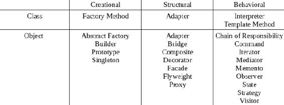
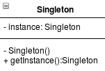
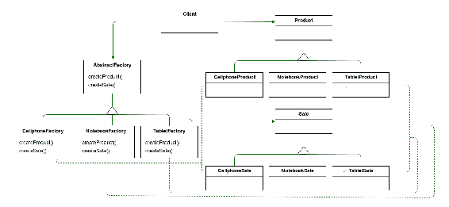
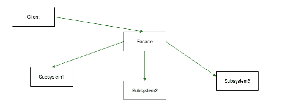
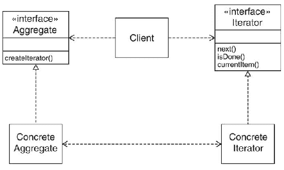
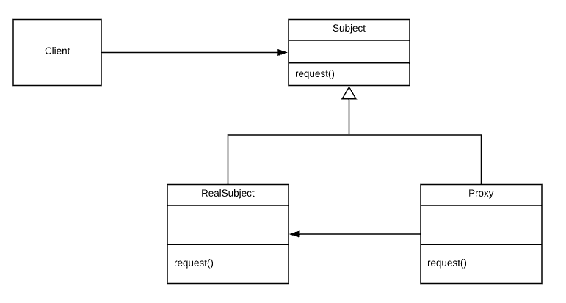

# 设计模式简介

本章将介绍设计模式，探讨使用它们的原因，它们与业务模式的不同，以及它们在现实世界中的表现。

由于我们假设你已经熟悉 Java 编程语言和 Java EE，我们的目标不是教授 Java EE，而是展示其最常见的设计模式。我们还将演示使用 Java EE 8 实现设计模式的示例。此外，我们将展示实现设计模式的最优方法，并讨论使用设计模式和业务模式的好处。如果你不了解设计模式和业务模式，那么这本书将是一个学习设计模式和业务模式概念及其实现的大好工具。如果你已经了解设计模式和业务模式，那么这本书将是一个在实现它们时参考的绝佳点。在本章中，我们将涵盖以下主题：

+   理解设计模式

+   理解设计模式的优势

+   定义 Java 世界的基本设计模式

+   解释业务模式

+   解释设计模式与业务模式之间的区别

# 解释设计模式

设计模式是一系列针对在开发中反复出现的常见设计问题的解决方案。它们作为一个解决方案模板，其中描述了一个常见问题的抽象解决方案，然后用户应用它，根据他们的问题进行适配。在面向对象编程中，设计模式提供了一种为特定问题设计可重用类和对象的方法，以及定义对象和类之间的关系。此外，设计模式在编程语言中提供了一种共同的表达方式，使得架构师和软件开发者能够在使用不同编程语言的情况下就共同和反复出现的问题进行沟通。有了这个，我们能够通过模式名称识别问题和解决方案，并通过在语言编程细节的高抽象层次上从模型角度思考解决方案。

设计模式主题在 1994 年得到了加强，当时“四人帮”（由 Rich Gamma、Richard Helm、Ralph Johnson 和 John Vlissides 组成）撰写了《设计模式：可复用面向对象软件元素》。在这里，他们描述了后来被称为 GoF 设计模式的 23 个设计模式，这些模式至今仍在使用。

# 解释四人帮设计模式

**GoF**（四人帮）设计模式是 23 种模式，分为创建型模式、结构型模式和行怍型模式。创建型模式控制对象的创建和初始化以及类选择；结构型模式定义类和对象之间的关系，行怍型模式控制对象之间的通信和交互。此外，GoF 设计模式有两种类型的范围，定义了解决方案的重点。这些范围是*对象范围*，解决关于对象关系的问题，以及*类范围*，解决关于类关系的问题。

*对象范围*与组合一起工作，行为变化在运行时完成。因此，对象可以具有动态行为。类范围与继承一起工作，其行为在编译时是静态固定的。然后，要改变类范围模式的行怍，我们需要更改类并重新编译。

被归类为类范围的模式解决关于类之间关系的问题，并且是静态的（在编译时固定，一旦编译后就不能更改）。然而，归类于对象范围的模式解决关于对象之间关系的问题，并且可以在运行时更改。

下面的图示展示了三种分类，以及它们的模式和范围：

在前面的图中，我们可以看到**工厂方法**模式位于**类**部分，而**抽象工厂**模式位于**对象**部分。这是因为**工厂方法**与继承一起工作，而抽象方法模式与组合一起工作。然后，工厂方法在编译时是静态固定的，编译后不能更改。然而，**抽象工厂**是动态的，可以在运行时更改。

GoF 设计模式通常使用图形符号，如用例图和实现代码的示例来描述。所使用的符号必须能够描述类和对象，以及这些类和对象之间的关系。

模式的名称是设计模式的重要组成部分。这是因为开发者用它来快速识别与模式相关的问题，并理解模式将如何解决它。模式的名称必须简短，并指代问题和解决方案。

设计模式是软件开发设计的一个伟大工具，但它的使用需要分析，以确定设计模式是否真正需要来解决该问题。

# GoF 设计模式目录

设计模式的名称需要简洁，以便于识别。这是因为设计模式为开发者创造了一种与编程语言无关的交流词汇，允许开发者仅通过设计模式的名称来识别问题和解决方案。

在设计模式中，目录是一组模式名称，旨在允许开发者之间更好的沟通。

GoF（ Gang of Four）的设计模式目录有 23 个模式，如前图所示。以下是这些模式的描述：

+   **抽象工厂（Abstract Factory）**: 这提供了一个创建对象的接口，而不指定它们的具体类，使得业务逻辑和对象创建逻辑解耦成为可能。通过这种方式，我们可以轻松地更新对象创建逻辑。

+   **适配器（Adapter）**: 这提供了一个接口，使得两个不兼容的接口能够一起工作。适配器模式作为接口之间的桥梁，将这些接口适配以协同工作。此外，适配器可以采用一个类或对象。

+   **桥接（Bridge）**: 这种模式解耦了抽象与其实现，使它们可以独立变化。通过这种方式，我们可以修改实现而不影响抽象，也可以修改抽象而不影响实现。抽象类的类隐藏了实现及其复杂性。

+   **建造者（Builder）**: 这种模式将复杂对象的构建与其表示分离。通过这种方式，我们可以使用相同的过程构建具有复杂构建过程的多个表示的对象。因此，我们创建了一个具有复杂构建过程的对象的标准化构建过程。

+   **责任链（Chain of responsibility）**: 这种模式避免了请求发送者和接收者之间的耦合，创建了一些有机会处理请求的对象。这些对象为发送者的请求创建了一个接收者对象链。链中的每个对象都接收请求并验证是否处理此请求。

+   **命令（Command）**: 这种模式封装了对对象的请求，并创建了一个包含请求信息的请求包装器。通过这种方式，我们可以向某个对象发送参数请求，而无需了解此操作。此外，命令允许我们执行`撤销`操作。

+   **组合（Composite）**: 这种模式将对象组合成树状结构，表示部分-整体层次结构。它允许你将一组对象视为单个对象。

+   **装饰器（Decorator）**: 这种模式允许以灵活的方式扩展类的功能，而不需要使用子类。它允许你动态地为对象附加新的职责。

+   **外观（Facade）**: 这隐藏了系统的复杂性，为子系统上的多个接口提供了一个统一的接口。这使得子系统易于使用。

+   **工厂方法（Factory Method）**: 这定义了一个创建对象的接口，子类指定要初始化的类。

+   **享元（Flyweight）**: 这通过共享有效地支持大量细粒度对象。这种模式减少了创建的对象数量。

+   **解释器（Interpreter）**: 这种模式表示语言语法，并使用它来解释它们作为语言的句子。

+   **迭代器（Iterator）**: 这个模式提供了一种按顺序访问一组对象元素的方法，而无需知道其底层表示。

+   **中介者（Mediator）**: 通过创建一个封装所有对象之间通信和交互的对象来减少通信的复杂性。

+   **备忘录（Memento）**: 这个模式在不损害封装概念的情况下捕获对象的内部状态，通过这个，对象的状态可以通过对象本身恢复。这个模式作为一个备份，维护对象的当前状态。

+   **观察者（Observer）**: 这定义了对象之间的一对多依赖关系。这意味着如果一个对象被修改，所有依赖它的对象都会自动收到通知并更新。

+   **原型（Prototype）**: 这个模式允许我们使用对象或实例作为原型来创建一个新的对象。这个模式创建了一个对象的副本，创建了一个具有作为原型使用的对象相同状态的新对象。

+   **代理（Proxy）**: 这个模式为另一个对象（原始对象）创建一个代理对象（代理对象），以便控制对原始对象的访问。

+   **状态（State）**: 这允许对象在内部状态改变时改变其行为。

+   **单例（Singleton）**: 这确保在整个项目中一个类只有一个实例，每次执行创建过程时都返回相同的对象实例。

+   **策略（Strategy）**: 这创建了一个算法族，封装每个算法并使它们可互换。这个模式允许你在运行时更改算法。

+   **模板方法（Template Method）**: 这在操作中定义了一个算法的骨架，子类定义了算法的一些步骤。这个模式算法结构和子类重新定义了此算法的一些步骤，而不修改其结构。

+   **访问者（Visitor）**: 这代表对对象结构执行的操作。这个模式允许我们在不修改其类的情况下向元素添加新的操作。

# 理解设计模式的优点

创建面向对象的设计是一项艰巨的任务。这是因为我们需要考虑我们将在其中工作的场景和我们将解决的问题的几个重要元素。这包括定义我们需要创建以达成解决方案的适当对象；定义对象的粒度并查看我们需要创建哪些接口。这些任务需要在设计过程中解决。可以创建对象来表示现实世界中的对象，或者表示具有其算法和责任的过程。此外，我们甚至需要考虑对象的数量、大小以及我们需要访问的接口。

设计模式是帮助我们识别不表示现实世界对象和不太明显的抽象对象的伟大工具。此外，设计模式帮助我们以最细粒度应用对象，并允许我们将问题和解决方案作为一个模型来分析和应用。设计模式使设计灵活，提供类和对象之间的解耦。它们还提供了组织解决方案的能力，允许将责任委托给以最佳方式实现这些解决方案的类。 

对于公司来说，构建软件是一个昂贵的流程，因为它需要能够构建和维护软件的专业人才和基础设施。设计模式，凭借其灵活性和解耦设计，使得维护变得容易，从而降低了成本。

# 理解 Java 世界的经典设计模式

所有 GoF 模式都有良好的目的，解决了面向对象设计中的主要问题，但有些模式在 Java 和 Java EE 生态系统中最常使用。在这本书中，这些模式被视为基本设计模式，因为它们最常用于在 Java 的 API、框架和算法上实现解决方案。因此，理解这些模式将帮助我们理解这些 API、框架和算法，反过来，我们也能使用 Java 创建更好的解决方案。这些模式包括 Singleton、Abstract Factory、Facade、Iterator 和 Proxy。

# 解释 Singleton

在一个软件项目中，在某些解决方案中，我们可能希望确保在整个项目中一个类只有一个对象实例，并且这个对象在任何时候都可以访问。创建一个全局实例或静态实例并不能保证这个类在另一个实例的另一个点不会被使用。解决这个问题的最佳方式是使用 Singleton 模式，它确保在整个项目中只有一个类的实例。在下面的图中，我们展示了 Singleton 的结构及其设计方式：

在这里，我们有一个名为**Singleton**的类，它有一个`private`构造函数，以及一个 Singleton 引用变量和一个返回其唯一实例的方法。一个很好的应用例子是，当我们想要创建一个负责应用程序配置（一些资源的路径、访问文件系统的参数、环境的操作行为）的类时。通常，应用程序有一些配置，我们需要一个类来表示这些应用程序配置。因此，这个应用程序配置类不需要多个实例，只需要一个实例。

Singleton 的另一个应用场景是当我们想要创建一个将在下一个小节中解释的 Abstract Factory 时。通常，在整个应用程序中我们只有一个 Abstract Factory。通过这种方式，我们可以使用 Singleton 来保证我们只有一个 Abstract Factory 的实例。

这种模式通常用于框架和 API 中，但这种情况在 Java EE 项目的代码中也很常见。

单例模式的使用取决于场景，但根据场景的不同，单例的使用可能是一个好的实践，也可能是一个坏的做法。当对象是状态性的并且保持状态时，不应该使用单例，因为单例意味着同一个对象实例被应用程序的所有进程共享，如果某个进程更新了这个对象的状态，那么应用程序的所有进程都将受到这个更新的影响。此外，我们可能会遇到单例状态并发更新的问题。

# 解释抽象工厂

有时候，在项目中我们需要创建一系列的对象。想象一下，我们有一个电子商务网站，我们有各种产品，如手机、笔记本电脑和平板电脑。这些产品属于同一系列。如果我们在一个软件中创建了这些对象，当我们需要修改这个对象的初始化过程时，我们将会遇到问题。

使用抽象工厂可以帮助我们解决包括一个应该独立于其产品创建方式而存在的系统、一个应该使用多个产品系列之一的系统，以及一个应该与设计用来一起使用的对象一起工作的系统在内的问题。使用这种模式将有益，因为它隔离了具体类。这意味着，使用这种模式，我们可以控制在软件中可以初始化哪些类对象。此外，它还允许轻松地交换产品，并在产品之间提供一致性。

抽象工厂模式为对象创建提供了一个单一的创作点，如果我们需要更改对象创建的算法，我们只需要修改具体工厂。在下面的图中，你可以看到抽象工厂的结构以及它的设计方式：

在我们的例子中，抽象工厂的结构有三个主要类——`AbstractFactory`、`Product`和`Sale`。`AbstractFactory`的具体类是`CellPhoneFactory`、`NotebookFactory`和`TabletFactory`。`CellPhoneFactory`是一个具体类，负责创建具体类`CellphoneProduct`和`CellphoneSale`，`NotebookFactory`是一个具体类，负责创建具体类`NotebookProduct`和`NotebookSale`，而`TabletFactory`是一个具体类，负责创建具体类`TabletProduct`和`TabletSale`。`Client`是一个负责使用`AbstractFactory`来创建`AbstractProduct`和`AbstractSale`的类。具体工厂在运行时创建，然后创建具体的产品和销售。

抽象工厂模式有时会与之前描述的单例模式等其他模式一起使用。抽象工厂是一个创建点，通常在整个系统中只需要一个实例。有了这个，使用单例模式可以帮助我们创建更好的设计，并更高效。

这种模式通常用于具有复杂创建过程的框架和 API，例如连接或会话。

# 解释外观

项目有时可能会变得非常复杂和庞大，这使得它们难以设计和组织。为了解决这个问题，一个很好的解决方案是将系统分解为子系统（分而治之），使它们更简单且更有组织。

外观模式创建了一个更高层次的接口，以隐藏子系统内一组接口的复杂性。这种模式减少了复杂性耦合，最小化了子系统之间的通信和依赖。在下面的图中，你可以看到外观（**Facade**）的结构及其设计方式：

在前面的图中，我们可以看到**外观**模式封装了所有对子系统的调用，并隐藏了这些调用对客户端的可见性。系统有一个接口，即外观（Facade），客户端通过调用这个接口来调用子系统。因此，客户端不会直接调用子系统。使用这种解决方案，客户端不需要了解子系统及其复杂性。

这种模式通常用于具有高复杂性的项目和系统，需要将它们分解为子系统。

# 解释迭代器

想象一下，我们想要一种方法来按顺序访问聚合对象的元素，而不暴露其内部结构。迭代器模式正是这样做的。

迭代器模式负责按顺序访问聚合对象，并定义一个接口来访问元素，而不暴露其内部结构。这个接口不会在聚合对象上放置新元素，而只是读取元素到它。在下面的图中，你可以看到迭代器（**Iterator**）的结构及其设计方式：

在前面的图中，我们可以看到**聚合**和**迭代器**接口及其具体的子类。客户端是使用**迭代器**来访问**聚合**元素的那个类。

这种模式在 Java 集合如列表、双端队列和集合中使用。理解这种模式将有助于你理解 Java 集合。

# 解释代理

有时，创建一个新的对象可能是一个大过程，并且创建此对象可能涉及多个规则。想象一下，我们想要创建一个对象列表，这些对象代表电信设备，它们需要大量的计算来生成每个对象的信息。此外，这些对象不会同时被访问，而是按需访问。一个好的策略是在访问对象时创建每个对象，从而最小化创建所有对象所需的时间和成本，并且只访问一些。代理可以帮我们解决这个问题。

代理模式是一种代理对象实例（原始对象）到另一个对象实例（代理对象）的模式，允许对原始对象进行访问控制。在下面的图中，你可以看到 **代理** 的结构和它的设计方式：

从前面的图中，我们可以看到 **代理** 模式的结构。如果 **Subject** 是客户端用来访问对象操作的接口，那么 **RealSubject** 是原始对象的类，而 **Proxy** 是充当 **代理** 的类。然后，当客户端访问对象时，他们将访问 **代理** 对象，而 **代理** 对象将访问 **RealSubject** 对象，并将此对象返回给客户端。

这种模式用于实现 JPA 规范和 **对象关系映射**（**ORM**）的框架和 API 中。

# 解释企业模式

随着时间的推移，技术不断发展，新的工具不断涌现并帮助改变了一些领域。看到这些技术的潜力，组织越来越多地开始使用并投资这些工具来自动化他们的流程并优化他们的成本。这些工具随后开始被称为企业软件。

企业软件是一种在组织、公司或政府中广泛使用的软件类型，它提供了一种服务，以改善其流程并优化成本和效率。随着时间的推移，这种软件的复杂性不断增加，因为它们开始提供许多服务。随着不同服务对更多通信的需求，可扩展性变得越来越重要。因此，一些问题出现了。

企业模式是一套针对在企业软件中由于企业环境复杂性而产生的常见问题的解决方案。许多企业模式基于 GoF 模式，只是在实现方式上有所不同。在 Java EE 中，企业模式分为三组：表现层模式、业务层模式和集成层模式。这些模式作用于表现层、业务层和集成层，我们将在第二章“表现层模式”中详细讨论，该章节涵盖了表现层模式，第三章“业务层模式”，该章节涵盖了业务层模式，以及第四章“集成层模式”，该章节涵盖了集成层模式。

企业模式对于创建软件的专业人士来说非常重要，因为软件创建中的不良实践可能会增加项目涉及的成本和风险。由于企业软件的复杂性，错误可能会随着时间的推移和环境的变化而传播，使得企业环境难以持续。

# 定义设计模式与企业模式之间的区别

将设计模式与企业模式进行比较并非易事，因为某些行为是相似的。设计模式是首先出现的主题，这在 Erich Gamma、Richard Helm、Ralph Johnson 和 John Vlissides 合著的《设计模式：可复用面向对象软件元素》一书中有所涉及。这些设计模式也是其他模式的基础。企业模式成为设计模式无法解决的问题。这是因为设计模式描述了类和对象之间关系的解决方案，但企业环境有其他需求，如系统之间的集成和软件关系。然而，企业模式使用一些设计模式来解决问题。

设计模式与企业模式之间的主要区别在于目标；设计模式旨在组织和优化面向对象设计，而企业模式则侧重于提高 Java EE 工具的使用效率以及改善 Java EE 组件之间的通信。设计模式关注面向对象和类与对象的关系，而企业模式关注 Java EE 组件之间的通信。

设计模式的使用使得算法的重用成为可能，同时也使得设计更加灵活；企业设计模式促进了 Java EE 工具复杂性的抽象，使得架构变更更加容易。

由于架构的复杂性，企业模式的最小使用往往比设计模式的最小使用更差。这是因为，在没有使用企业模式的情况下，专业人士将始终与 Java EE 的复杂性打交道，增加了出错的可能性。

一些 Java EE 模式的实现已经存在于 Java EE 工具中，这使得它们易于使用。在接下来的章节中，我们将描述这些模式及其使用 Java EE 工具的实现，并看看这些模式将如何有利于您项目的架构和设计。

# 摘要

在本章中，我们向您介绍了设计模式，解释了 GoF 设计模式和它们的目录。我们简要介绍了 Java 世界的基本设计模式，包括 Singleton、Abstract Factory、Facade、Iterator 和 Proxy。此外，我们还探讨了企业模式和它们与设计模式之间的区别。

在下一章中，我们将解释展示模式，包括它们的概念和实现。我们还将展示展示模式的概念以及它们如何帮助我们编写更好的软件。然后，我们将通过现实世界的问题展示展示模式的实现示例。
