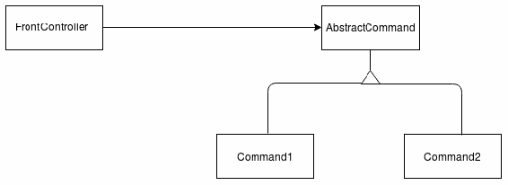

# 呈现模式

在本章中，我们将通过解释概念并展示实现示例来涵盖每个主题。阅读本章后，您将了解这些概念，并能够使用 Java EE 8 来实现它们。以下是即将在后续章节中涵盖的主题：

+   解释呈现层

+   解释拦截器过滤模式

+   使用 Java EE 8 实现拦截器过滤模式

+   解释前端控制器模式

+   实现前端控制器模式

+   解释应用控制器模式

+   实现应用控制器模式

# 解释呈现层

Java EE 平台是一个分布式多层应用模型，有三个广泛使用的通用层。这些层是呈现层（或 Web 层）、业务层和集成层（或 EIS 层）。

呈现层，也称为 Web 层，包含创建 Web 应用的组件。这一层有许多使用 HTTP 协议、构建用户视图和界面以及提供 Web 服务的组件。这些组件被称为 Web 组件。呈现层有两种类型：

+   **面向呈现的层**：这种类型的呈现层包含使用 HTML 和 XHTML 构建交互式网页和动态内容的组件。这些组件是 JavaServer Faces 技术、Java Servlet 技术和 JavaServer Page 技术，它们允许我们构建交互式网页。

+   **面向服务的层**：这一层包含构建 Web 服务端点的组件。这些组件是 JAX-RS 和 JAX-WS。

呈现层通常用于使用基于组件的规范，如**JavaServer Faces**技术，或者使用基于动作的 Java Servlet 技术和**JavaServer Pages**技术的 Web 应用。面向服务的层通常用于创建 REST API 或 Web 服务，这些服务由运行在移动平台或浏览器上的客户端消费。在下面的图中，我们可以看到呈现层是如何工作的：


如前图所示，**客户端**向服务器发送**请求**；**呈现层**处理请求并将其发送到**业务层**；如果请求不是异步的，**业务层**随后向**呈现层**发送响应，最后**呈现层**处理并发送响应到**客户端**。

由于**呈现层**负责促进与外部用户的 HTTP 通信和连接，因此这一层满足了 Web 组件之间的许多交互和通信。为了使这些工作良好，需要执行许多任务。这些任务包括验证客户端发送的数据、格式化它、将其发送到正确的业务组件或类，以及过滤数据和请求。

# 解释拦截过滤器模式

当客户端向服务器发送请求时，服务器有时会处理这个请求/响应以执行以下任务：

+   验证认证

+   生成日志

+   验证约束

+   验证客户端的浏览器

+   检查请求和响应之间的持续时间；计算响应时间

+   设置 cookie

然而，我们不想将这些任务放在处理主要请求的逻辑中。因此，创建一个预处理和/或后处理来执行这些任务是解耦主要逻辑和补充逻辑的好方法。

拦截过滤器模式是在我们想要插入不是主要逻辑一部分的逻辑但希望保持两种逻辑分离和松耦合时解决的问题的模式。将新逻辑与主要逻辑合并是一种不良实践，因为这些会变得耦合。此模式创建一个过滤器来预处理和后处理请求，允许创建一个逻辑块来解决不是主要问题的某些问题，从而解耦这两部分逻辑。使用此模式，我们可以创建一个可插入的解决方案，而无需修改主要逻辑。请查看以下图中拦截过滤器模式的模型：


在前面的图中，我们有**客户端**、**FilterManager**、**FilterChain**、**FilterOne**、**FilterTwo**、**FilterThree**和**目标**。客户端向服务器发送请求；FilterManager 创建一个按顺序排列的**FilterChain**并启动处理；**FilterChain**是有序的独立过滤器集合；**FilterOne**、**FilterTwo**和**FilterThree**是**FilterChain**中的过滤器，可以包括 N 个过滤器；目标是包含主要逻辑的资源。过滤器执行的顺序很重要，因为某些过滤器通常需要首先执行。过滤器优先级的一个例子是验证认证的任务，这通常需要首先执行，因为一些任务仅在客户端认证之后执行。

# 使用 Java EE 8 实现拦截过滤器模式

为了使用 Java EE 8 的最佳实践来实现此模式，我们将使用 Java Servlet 规范中的 servlet 过滤器。通过 servlet 过滤器，我们可以创建一个有序的请求拦截器来处理请求和响应。这些拦截器通过 URL 模式或 servlet 名称进行映射。servlet 过滤器可以通过 XML（在`web.xml`中）或注解进行配置。在我们的案例中，我们将假设我们想要创建一个记录所有发送到服务器的请求的日志。我们还将有两个过滤器——一个用于记录访问时间，另一个用于记录客户端使用的浏览器信息。为了记录访问时间，我们将创建一个名为`LogAccessFilter`的过滤器，为了记录浏览器信息，我们将创建一个名为`LogBrowserFilter`的过滤器。

# 实现 LogAccessFilter

这里，我们有`LogAccessFilter`的实现：

```java
import org.apache.logging.log4j.LogManager;
import org.apache.logging.log4j.Logger;

import javax.servlet.annotation.WebFilter;
import javax.servlet.http.HttpServletRequest;
import java.io.IOException;
import java.util.Date;

@WebFilter(filterName = "LogAccess", urlPatterns = "/*")
public class LogAccessFilter implements javax.servlet.Filter {

    private static Logger logger = LogManager.getLogger(LogAccess.class);

    public void destroy() {
    }

    public void doFilter(javax.servlet.ServletRequest req, 
    javax.servlet.ServletResponse resp, javax.servlet.FilterChain 
    chain) throws javax.servlet.ServletException, IOException {

        //Gets the initial date of request.
        Date dateInitRequest = new Date();

        //Get IP of Client that sent a resquest.
        String ip = ((HttpServletRequest)req).getRemoteAddr();

        //Following to next filter. If none next filter exist, follows   
        //for main logic.
        chain.doFilter(req, resp);

        //Gets the end date of request.
        Date dateEndRequest = new Date();

        //Logging the informations of IP and access time.
        logger.info("IP: "+ip +" Access time : "
                              + Long.toString(dateEndRequest.getTime() 
                              - dateInitRequest.getTime())
                              + " ms");

    }

    public void init(javax.servlet.FilterConfig config) throws 
    javax.servlet.ServletException {

    }

}
```

如代码所示，要创建一个 servlet 过滤器，我们需要创建一个继承自`javax.servlet.Filter`的类，并在类定义之前使用带有`filterName`和`urlPatterns`参数的`@WebFilter`注解，这些参数定义了过滤器名称和要过滤的 URL。以下是一个演示如何做到这一点的代码片段：

```java
@WebFilter(filterName = "LogAccess", urlPatterns = "/*")
public class LogAccessFilter implements javax.servlet.Filter{
    ...
}
```

注意，servlet 过滤器使用责任链模式遍历过滤器（servlet 过滤器对象）。以下是一个使用责任链模式的代码片段：

```java
chain.doFilter(req, resp);
```

在前面的代码行中，我们通过`filterName`参数将过滤器名称设置为`LogAccess`。这将过滤所有请求，因为`urlPatterns`参数的值是`"/*"`。如果我们根据 servlet 名称进行过滤，我们需要使用以下注解：

```java
//Servlet1 and Servlet2 are the servlets to filter.
@WebFilter(filterName = "LogAccess", servletNames = {"servlet1","servlet2"})
```

`doFilter`方法负责预处理和后处理，并确定何时将请求传递给下一个过滤器或 servlet（主逻辑）。要传递请求到下一个过滤器或 servlet，需要执行以下代码：

```java
//Following to next filter or servlet.
chain.doFilter(req, resp);
```

当前面的代码执行时，当前过滤器只有在其他过滤器和 servlet 完成其处理之后才会执行下一行。

# 实现 LogBrowserFilter

`LogBrowserFilter`的实现如下：

```java
import org.apache.logging.log4j.LogManager;
import org.apache.logging.log4j.Logger;

import javax.servlet.*;
import javax.servlet.annotation.WebFilter;
import javax.servlet.http.HttpServletRequest;
import java.io.IOException;

@WebFilter(filterName = "LogBrowser",urlPatterns = "/*")
public class LogBrowserFilter implements Filter {

    private static Logger logger = LogManager.getLogger(LogBrowser.class);

    public void destroy() {
    }

    public void doFilter(ServletRequest req, ServletResponse resp, FilterChain chain) throws ServletException, IOException {

        //Get userAgent that contain browse informations.
        String userAgent = ((HttpServletRequest)req).getHeader("User-Agent");

        //Get IP of Client that sent a resquest.
        String ip = ((HttpServletRequest)req).getRemoteAddr();

        //Logging the informations of IP and Browser.
        logger.info("IP: "+ip +" Browser info: "+userAgent);

        //Following to the next filter. If none next filter exist, follow to main logic.
        chain.doFilter(req, resp);

    }

    public void init(FilterConfig config) throws ServletException {

    }

}
```

在前面的过滤器中，我们获取客户端 IP 和浏览器信息并将它们记录下来。`LogBrowserFilter`的操作与`LogAccessFilter`类似。

要定义过滤器执行的顺序，我们需要配置`web.xml`并添加过滤器映射信息。在这里，我们可以看到`web.xml`及其配置：

```java
<web-app version="3.1"
         xmlns="http://xmlns.jcp.org/xml/ns/javaee"
         xmlns:xsi="http://www.w3.org/2001/XMLSchema-instance"
         xsi:schemaLocation="http://xmlns.jcp.org/xml/ns/javaee http://xmlns.jcp.org/xml/ns/javaee/web-app_3_1.xsd">
    <filter>
        <filter-name>LogBrowser</filter-name>
        <filter-class>com.rhuan.filter.LogBrowserFilter</filter-class>
    </filter>
    <filter>
        <filter-name>LogAccess</filter-name>
        <filter-class>com.rhuan.filter.LogAccessFilter</filter-class>
    </filter>
</web-app>
```

在`web.xml`中定义的配置会覆盖注解配置。因此，如果我们把`urlPattern`配置放在`web.xml`中，那么考虑的配置就是`web.xml`的配置。我们不需要在`web.xml`上放置过滤器映射信息，因为这在代码中的注解配置上已经存在了。`web.xml`配置定义了顺序——`LogBrowserFilter`将首先被调用，然后是`LogAccessFilter`，最后是主逻辑（servlet）。

# 决定过滤器映射

定义映射方法是实现拦截过滤器模式的关键。这是因为不良的映射方法可能会直接影响项目并导致返工。我们有两种过滤器映射类型——`UrlPattern`和 servlet 名称。

当我们想要过滤 HTTP 请求到非特定资源或文件，但又想过滤各种未知资源时，会使用`UrlPatterns`。以下是一些示例：

+   `*.jsp`：这个过滤器会过滤所有对 JSP 页面的请求。如果服务器上添加了一个 JSP 页面，那么过滤器将过滤新的 JSP 页面，而无需进行任何修改。

+   `/*`: 这将过滤服务器上所有资源或文件的请求。如果服务器上添加了一个资源或文件，则过滤器将过滤此新资源或文件，而无需进行任何修改。

+   `/user/*`: 这将过滤以 `/user` 开头的 URI 的所有请求到服务器上的所有资源或文件。如果添加了一个以 `/user` 开头的 URI 访问的资源或文件到 servlet，则过滤器将过滤此新资源或文件，而无需进行任何修改。

用于映射过滤器的 servlet 名称表示当您想要过滤特定 servlet 时，独立于其 `urlPattern`。这种映射方式允许我们修改映射 servlet 的一个 `urlPattern`，而无需对过滤器进行任何修改。以下是一些示例：

+   `{servlet1}`: 这只映射名为 `servlet1` 的 servlet。如果修改 `servlet1` 的 `urlPatterns`，则不需要修改过滤器。

+   `{servlet1,servlet2}`: 这将两个名为 `servlet1` 和 `servlet2` 的 servlet 进行映射。其行为类似于前面展示的示例，其中只映射了一个 servlet。

# 解释 FrontController 模式

在 Java EE 世界中，我们通常处理具有相似功能和流程的复杂项目。有时，使用各种控制器来处理请求是一种不良做法，因为它需要在多个端点进行配置，并产生大量创建和维护成本。因此，创建一个处理请求的中心点是一个非常好的解决方案，因为它创建了一个管理所有或一组请求的点，然后将此请求发送到正确的处理过程。然后我们可以处理所有对所有功能都通用的点，并将请求发送到处理特定于一个功能的问题的过程。一些配置，如会话配置、请求的最大大小限制、cookie 和 header，对所有请求都是通用的，并且可以从中央点进行配置。

`FrontController` 模式是一种创建中央管理器来处理应用程序的所有请求或请求组的模式，然后将请求发送到特定的一个处理过程，这通常是一个命令。由于今天我们有现成的解决方案，因此这种模式在普通项目中很少使用，实现这种模式通常是不必要的。此模式被 JSF、Spring MVC 和 struts 等框架使用。以下图表展示了此模式：



在前面的图表中，我们有 **FrontController**、**AbstractCommand**、**Command1** 和 **Command2**。**FrontController** 接收所有请求，处理请求的一些通用点，并将此请求发送到匹配的命令。**AbstractCommand** 是命令的 `abstract` 类。**Command1** 和 **Command2** 是命令的子类，它们实现了相应的逻辑。

在我们的案例中，我们将有两个页面——主页和登录页。如果用户在发送请求时已经登录，那么应用程序将启动登录页面，然后是主页。

# 实现前端控制器

在这里，我们有一个`MyAppController`的实现，它是一个处理应用程序所有请求的前端控制器：

```java
import com.rhuan.action.Command.AbstractCommand;
import com.rhuan.action.Command.HomeCommand;
import com.rhuan.action.Command.LoginCommand;
import org.apache.logging.log4j.LogManager;
import org.apache.logging.log4j.Logger;

import javax.servlet.ServletException;
import javax.servlet.annotation.WebServlet;
import javax.servlet.http.HttpServlet;
import javax.servlet.http.HttpServletRequest;
import javax.servlet.http.HttpServletResponse;
import java.io.IOException;

@WebServlet(name = "MyAppController", urlPatterns = "/myapp/*")
public class MyAppController extends HttpServlet {

    private static Logger logger = 
    LogManager.getLogger(MyAppController.class);

    private final String PAGE_ERROR = "/pageError.jsp";

    protected void doPost(HttpServletRequest request, 
   HttpServletResponse response) throws ServletException, IOException {
        processRequest(request,response);
    }

    protected void doGet(HttpServletRequest request, 
   HttpServletResponse response) throws ServletException, IOException {
        processRequest(request,response);
    }

    protected void processRequest(HttpServletRequest
                                 request, HttpServletResponse response)
            throws ServletException, java.io.IOException {
        String resultPage;
        AbstractCommand command = null;
        try {

            //Create a correspondent Command.
            if(request.getSession().getAttribute("USER") == null)
                command = new LoginCommand();

            else command = new HomeCommand();

            //Execute the Command that return a page.
            resultPage = command.execute();
        } catch (Exception e) {
            logger.error(e.getMessage());
            resultPage = PAGE_ERROR;
        }

        //Dispatch to correspondent page.
        getServletContext().getRequestDispatcher(resultPage)
                           .forward(request, response);

    }
}
urlPattern is used to define which requests a context will send to our controller. Here's how we do this:
```

```java
//Defining the urlPattern to Front Controller
@WebServlet(name = "MyAppController", urlPatterns = "/myapp/*")
public class MyAppController extends HttpServlet {
    ...
}
"/myapp/*") establishes that all requests to the myapp URI are sent to our controller. For example, http://ip:port/context/myapp/myfuncionality is sent to our controller.
```

当我们实现这个模式时，非常重要的是要注意 servlet 上的属性的使用，因为 servlet 上的所有类属性都与所有线程或所有请求共享。

所有`GET`请求或`POST`请求都发送到`processRequest`方法，该方法实现了将请求发送到相应命令并执行相应逻辑的逻辑。在设置正确的命令后，相应的命令被执行，页面被分发。在这里，我们有一条执行命令并将请求分发到正确页面的代码行：

```java
//Execute a Command
resultPage = command.execute();
```

将请求分发到相应的页面：

```java
//Dispatch to correspondent page.
getServletContext().getRequestDispatcher(resultPage)
                           .forward(request, response);
```

# 实现命令

在这里，我们有一个`AbstractCommand`，它是一个包含一个`execute`方法的`abstract`类。这是抽象命令，`execute`方法在子类中实现：

```java
public abstract class AbstractCommand {

    public abstract String execute();
}
HomeCommand, which is the implementation of AbstractCommand. The method execute() returns the path to the home page (/home.jsp):
```

```java

public class HomeCommand extends AbstractCommand {
    @Override
    public String execute() {
        return "/home.jsp";
    }
}
```

在这里，我们有一个`LoginCommand`子类，它是`AbstractCommand`的实现。`execute()`方法返回登录页面的路径（`/login.jsp`）：

```java

public class LoginCommand extends AbstractCommand {
    @Override
    public String execute() {
        return "/login.jsp";
    }
}
```

# 应用程序控制器模式

一些 Web 应用在定义正确的视图、内容或要调用的操作时具有复杂的逻辑。可以使用 MVC 控制器来做出这个决定并获取正确的视图、内容或操作。然而，有时定义决策的逻辑非常困难，使用 MVC 控制器来做这件事可能会导致大量代码的重复。为了解决这个问题，我们需要将逻辑集中在一个点上，以便于维护和集中逻辑点。

应用程序控制器模式是一种允许集中所有视图逻辑并促进定义页面流程的唯一过程的模式。这种模式与前面讨论的`FrontController`一起使用，是`FrontController`和`Command`之间的中介。使用此模式，我们将促进视图处理和请求处理的解耦。以下图表表示了这一点：


在前面的图表中，我们可以看到位于**FrontController**和**AbstractController**之间的**ApplicationController**。当客户端发送请求时，**FrontController**接收这个请求并处理与请求相关的点。然后**FrontController**将这个请求发送到**ApplicationController**，它处理与视图和流程相关的点，并定义正确的**Command**来执行。

在我们的示例场景中，我们希望在服务器上创建一个下载文件的点，并且这个点只能由登录用户访问。此外，我们只接受 PDF 下载和 JPG 文件。在这个例子中，我们将创建一个名为 `DownloadFrontController` 的类来接收请求。我们还将创建一个名为 `DownloadApplicationController` 的类来处理视图和内容选择逻辑。`AbstractCommand` 是命令的 `abstract` 类。此外，我们还将创建 `PdfCommand`，它是 `AbstractCommand` 的一个实现，用于处理下载单个 PDF 文件的逻辑。最后，我们将创建 `JpgCommand`，它是 `AbstractCommand` 的一个实现，用于处理下载单个 JPG 文件的逻辑。

# 实现 DownloadFrontController

这里，我们实现了 `DownloadFrontController`，这是一个用于下载文件的 Servlet：

```java
import javax.servlet.ServletException;
import javax.servlet.annotation.WebServlet;
import javax.servlet.http.HttpServlet;
import javax.servlet.http.HttpServletRequest;
import javax.servlet.http.HttpServletResponse;
import java.io.IOException;

@WebServlet(name = "DownloadFrontController", urlPatterns = "/download/*")
public class DownloadFrontController extends HttpServlet {

    protected void doPost(HttpServletRequest request,  
   HttpServletResponse response) throws ServletException, IOException {
        processRequest(request,response);
    }

    protected void doGet(HttpServletRequest request, 
   HttpServletResponse response) throws ServletException, IOException {
        processRequest(request,response);
    }

    protected void processRequest(HttpServletRequest
                                  request, HttpServletResponse 
                                  response)
            throws ServletException, java.io.IOException {

        //If user is logged the request is sent to 
        ApplicationController,
        // then one error 401 is sent to client.
       if(Objects.nonNull(request.getSession().getAttribute("USER"))) {

            //Send the request to ApplicationController
            new DownloadApplicationController(request, 
            response).process();

        }

        else {
            response.sendError(401);
        }
    }
}
```

在前面的代码块中，我们有 `DownloadFrontController` 类，其中包含处理请求的逻辑。这个类是一个 servlet，它使用以下代码行响应对 `/download/*` 发送的所有请求：

```java
@WebServlet(name = "DownloadFrontController", urlPatterns = "/download/*")
```

所有 `GET` 请求或 `POST` 请求都发送到 `processRequest` 方法，其中包含将请求发送到 `DownloadApplicationController` 的代码。以下代码行正是这样做的：

```java
//Send the request to ApplicationController
new DownloadApplicationController(request, response).process();
```

# 实现 DownloadApplicationController

这里，我们实现了 `DownloadApplicationController`，它负责决定发送请求的正确命令。决定正确命令的过程可以通过多种方式执行，包括反射和注解、使用 switch 案例和映射等。在我们的例子中，我们使用映射来帮助我们：

```java
import com.rhuan.action.Command.AbstractCommand;
import com.rhuan.action.Command.PdfCommand;
import org.apache.logging.log4j.LogManager;
import org.apache.logging.log4j.Logger;

import javax.servlet.ServletException;
import javax.servlet.http.HttpServletRequest;
import javax.servlet.http.HttpServletResponse;
import java.io.IOException;
import java.util.HashMap;
import java.util.Map;

public class DownloadApplicationController {

    private static Logger logger = LogManager.getLogger(DownloadApplicationController.class);

    private final String PAGE_ERROR = "/pageError.jsp";

    private HttpServletRequest request;

    private HttpServletResponse response;

    private Map<String, Class> map;

    private String key;

    public DownloadApplicationController(HttpServletRequest
                                         request, HttpServletResponse 
                                         response){

        //On our example, only PDF and JPG is acepted to download.
        this.map = new HashMap<String, Class>();
        this.map.put("PDF", PdfCommand.class);
        this.map.put("JPG", PdfCommand.class);

        this.request = request;
        this.response = response;

    }

    public void process(){

       //Processes the URI and creates the key using URI.
       this.processUri();

        //Validates if the request is valid.
        if (!validate()) {
            try {
                response.sendError(400);
            } catch (IOException e1) {
                logger.error(e1.getMessage());
            }

            return;
        }

       //Get the correspondent command.
       Class commandClass = map.get(key);

       boolean error = false;

       try {

            AbstractCommand command = (AbstractCommand) 
            commandClass.newInstance();

            //Executes the command.
            command.execute(request,response);

        } catch (InstantiationException e) {
            logger.error(e.getMessage());
            error = true;

        } catch (IllegalAccessException e) {
            logger.error(e.getMessage());
            error = true;

        } catch (ServletException e) {
            logger.error(e.getMessage());
            error = true;
        } catch (IOException e) {
            logger.error(e.getMessage());
            error = true;
        }

        //If an error ocorred, response 500.
        if(error){
             try {
                 response.sendError(500);

             } catch (IOException e1) {
                 logger.error(e1.getMessage());
                 return;
             }
        }

    }

    private void processUri(){

        String uri = request.getRequestURI();
        if(uri.startsWith("/")) uri = uri.replaceFirst("/", "");
        String[] uriSplitted = uri.split("/");

        if(uriSplitted.length > 2)
            key = uriSplitted[2].toUpperCase();
    }

    private boolean validate(){

        String uri = request.getRequestURI();
        if(uri.startsWith("/")) uri = uri.replaceFirst("/", "");
        String[] uriSplitted = uri.split("/");

        return uriSplitted.length == 3 && map.containsKey(key);
    }

}
```

```java
key, creates a new instance of the command, and executes the following command:
```

```java
//Get the correspondent command.
Class commandClass = map.get(key);
```

然后使用 `newInstance()` 方法创建命令的新实例：

```java
//Instantiate the command    
AbstractCommand command = (AbstractCommand) commandClass.newInstance();
```

然后执行命令，传递 `request` 和 `response` 作为参数：

```java
//Executes the command.
command.execute(request,response);
```

# 实现 commands

这里，我们有 `abstract` 类 `AbstractCommand`，它包括抽象的 `execute` 方法。所有此命令的实现都扩展了 `AbstractCommand`，它是一个 `abstract` 类：

```java
package com.rhuan.action.Command;

import javax.servlet.ServletException;
import javax.servlet.http.HttpServletRequest;
import javax.servlet.http.HttpServletResponse;

public abstract class AbstractCommand {

    public abstract void execute(HttpServletRequest
                                 request, HttpServletResponse response)
            throws ServletException, java.io.IOException ;
}
```

在以下代码块中，我们有 `PdfCommand` 类。这是一个 `AbstractCommand` 的子类，实现了下载 PDF 文件的逻辑：

```java
import javax.servlet.ServletException;
import javax.servlet.http.HttpServletRequest;
import javax.servlet.http.HttpServletResponse;
import java.io.File;
import java.io.FileInputStream;
import java.io.IOException;
import java.io.OutputStream;

public class PdfCommand extends AbstractCommand {

    @Override
    public void execute(HttpServletRequest request, HttpServletResponse 
    response) throws ServletException, IOException {

        String fileName = request.getParameter("fileName");

        // for example application/pdf, text/plain, text/html, 
        image/jpg
        response.setContentType("application/pdf");

        // Make sure to show the download dialog
        response.setHeader("Content-disposition","attachment; 
        filename=myapp_download.pdf");

        // Assume file name is retrieved from database
        // For example D:\\file\\test.pdf

        File file = new File(fileName);

        // This should send the file to browser
        OutputStream out = response.getOutputStream();
        FileInputStream in = new FileInputStream(file);

        byte[] buffer = new byte[4096];
        int length;
        while ((length = in.read(buffer)) > 0){
            out.write(buffer, 0, length);
        }
        in.close();
        out.flush();

    }
}
```

在前面的代码块中，我们有 `execute()` 方法，该方法处理下载 PDF 文件的逻辑。在此阶段，所有请求的处理和主要验证都已经执行，`execute()` 方法只需要执行下载过程。

这里，我们有 `JpgCommand` 类，它是一个 `AbstractCommand` 的子类，实现了下载 JPG 文件的逻辑：

```java
import javax.servlet.ServletException;
import javax.servlet.http.HttpServletRequest;
import javax.servlet.http.HttpServletResponse;
import java.io.File;
import java.io.FileInputStream;
import java.io.IOException;
import java.io.OutputStream;

public class JpgCommand extends AbstractCommand  {

    @Override
    public void execute(HttpServletRequest request, HttpServletResponse 
    response) throws ServletException, IOException {

        //Gets the file name sent by paramenter.
        String fileName = request.getParameter("fileName");

        //Configures the content type.
        response.setContentType("image/jpg");

        // Configure the dialog to download.
        response.setHeader("Content-disposition","attachment; 
        filename=myapp_download.pdf");

        //Read file and send to client.
        File file = new File(fileName);
        OutputStream out = response.getOutputStream();
        FileInputStream in = new FileInputStream(file);

        byte[] buffer = new byte[4096];
        int length;
        while ((length = in.read(buffer)) > 0){
            out.write(buffer, 0, length);
        }
        in.close();
        out.flush();

    }
}
```

在前面的代码块中，我们有 `execute()` 方法，该方法处理下载 JPG 文件的逻辑。在此阶段，所有请求和主要验证过程都已经完成。

# 应用控制器和前端控制器模式之间的区别

应用控制器模式和前端控制器模式非常相似，可能会让一些用户感到困惑。应用控制器模式和前端控制器模式解决的问题相似，因为两者都用于在一点集中逻辑。此外，两者都使用设计模式命令协同工作。

应用控制器和前端控制器之间的主要区别在于，应用控制器旨在解决视图和页面流程逻辑的复杂性，而前端控制器旨在解决请求及其配置的复杂性。当视图和页面流程逻辑简单时，所有逻辑有时会插入到前端控制器中，而应用控制器则不再使用。然而，当视图和页面流程中的逻辑复杂时，建议使用应用控制器，以便解耦视图和页面流程逻辑并组织代码。

# 摘要

在本章中，我们学习了表示层，并探讨了拦截过滤器模式、前端控制器模式和应用程序控制器模式，以及如何实现它们。在现实世界中，我们很少需要实现这些模式，因为一些框架、API 和规范已经为我们实现了它们。然而，了解这些模式对于提高我们对实现这些模式的框架、API 和规范的理解非常重要。此外，我们有时需要实现框架之外的某些组件。因此，使用这种模式是个好主意。

下一章将讨论业务层及其模式。在这里，我们将涵盖作用于业务层的模式。了解这些模式将补充我们对企业模式的概念和实现以及这些模式如何促进在业务环境中使用良好工具来解决常见问题的知识。
