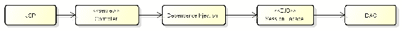

# 第三章：业务模式

在本章中，我们将涵盖业务代理模式、会话外观模式和业务对象模式的定义。我们将展示使用这些设计模式的原因、每种模式的常见方法、它们与其他模式的交互、它们的演变以及在现实世界中的行为。我们还将展示这些模式实现的一些示例。

在本章结束时，你将能够识别正确的应用业务模式场景并选择实现它们的最佳方法。以下主题将被涵盖：

+   理解业务层

+   解释业务代理模式

+   解释会话外观模式

+   实现会话外观模式

+   解释业务对象模式

+   实现业务对象模式

# 理解业务层

在从 JEE8 及其技术的角度讨论业务模式和这些模式的使用之前，我们必须确定应用程序的业务逻辑将在 JEE 框架中的哪个位置。正如我们已经看到的，JEE 架构基本上有三个层次。大多数 JEE 技术，如**企业 JavaBeans (EJB**)和**Java 持久化 API (JPA**)，都与业务层相关。EJB 容器位于业务层，但还有一些其他技术在整个 JEE 框架中导航，如 CDI 和 Bean Validation。然而，最重要的是要知道，核心业务逻辑应用程序是在业务层执行的。

我们将在业务层看到三个重要的模式。我们将简要解释每个模式的定义和目标：

+   **业务代理模式**：它是业务服务的代理，隐藏了服务查找和远程调用的过程。

+   **会话外观模式**：封装业务规则并向客户端暴露粗粒度服务。

+   **业务对象模式**：这些是具有属性和方法的真实世界对象，适用于具有高度复杂性的应用程序，有助于将业务逻辑从应用程序的其他部分分离出来，促进业务逻辑与其他应用程序部分的解耦。

让我们看看以下图示：


我们将在本章后面看到，尽管业务代理是业务层组件，但其物理位置位于 Web 层。

# 解释业务代理模式

为了解释业务代理模式，我们需要理解一些表明该模式真实目标和证据的要点。因此，我们将展示这些要点并详细解释业务代理模式。

# 客户端层、表示层和业务层

在继续之前，这里是对层次和层概念的一个简要说明。

# 层次

层仅是应用架构中具有职责的逻辑划分。这是一种组织应用程序代码的逻辑方式。马丁·福勒的书籍《企业应用架构模式》描述了三个主要层及其职责：

| **层** | **职责** |
| --- | --- |
| 表示 | 用户交互、输入字段验证、显示数据格式化 |
| 业务 | 应用逻辑 |
| 数据 | 数据库通信、消息系统通信 |

因此，应用程序的类根据它们的职责在逻辑上被分离。有些类用于数据访问层，而其他类则准备数据以作为表示层的一部分进行显示。这种划分完全是逻辑上的。良好的架构实践是拥有一个分层链，其中一层与其相邻层交互，提供和消费服务。这导致了更高的内聚性（相同的职责包含在同一层中）和低耦合性。

让我们看看以下图表：


我们可以看到，JSF、JSP 和 HTML 页面、后端 bean 类，甚至 servlet 在逻辑上属于表示层组，因为它们具有相同的基本职责，即向用户发送信息并接收用户的请求。EJB、servlet（其中一部分）和**业务对象**属于业务层。DAO 类和 JPA 实体属于数据层。

# 级别

级别是一个物理单元，它与硬件和软件组件相关。它是层组件部署和执行的基础设施。级别的例子包括网络浏览器、应用服务器和数据库服务器。一个典型的*n*层应用程序由以下级别定义：

| **级别** | **基础设施** |
| --- | --- |
| 客户端 | 网络浏览器、移动设备 |
| 表示 | Web 服务器（容器）、HTTP 协议 |
| 业务 | 应用服务器（如 Java EE 服务器） |
| 数据/集成 | 数据库服务器、消息服务、Web 服务 |

让我们看看以下图表：


在这里，非常重要的一点是要注意客户端级别和表示级别之间的区别。客户端级别是客户端应用程序被执行的地方（通过浏览器或移动应用程序等平台）。通常，客户端级别是客户端计算机或设备，而表示级别由 Web 服务器表示。表示层从客户端层接收数据请求，准备数据（如果需要，使用先前定义的某些格式），并将其发送到业务层。这是在 JEE 场景中处理数据的经典机制。我们可以在表示层中识别一些技术，如 Servlets、JSP、JSF、WebSockets、JAX-RS 和 JAX-WS、Java API 用于 JSON 处理、JSON-B、CDI 和 bean 验证。

让我们看看下面的图：


如前所述，所有业务逻辑都在业务层执行。表示层是业务层的客户端，因为它需要业务层的操作并接收来自业务层的结果。在此阶段，我们可以看到表示层的一个额外责任，即定位服务并发出请求。如果有一个将请求委托给真实服务的机制将会很有趣。这正是业务代表模式的作用，它防止业务层服务的细节暴露给表示层。因此，表示层和业务层之间的耦合减少，并且因此业务层的修改对表示层的影响最小。

业务代表模式充当客户端的输入门。它负责接收请求，识别或定位真实的企业服务，并调用发送请求的服务。之后，代表接收服务响应，然后将响应发送回客户端。

# 经典的业务代表模式场景

在经典的业务代表模式场景中，业务代表模式的实现从 Java 客户端接收请求，并将响应发送回客户端。此外，为了最小化表示层和业务层之间的耦合，代表负责定位远程服务（在大多数情况下，是远程 EJB 服务）并为访问业务服务提供缓存机制以减少网络流量。

因此，当过去使用 EJB 作为远程服务时，业务代表模式与另一个模式（服务定位器模式）一起使用，该模式负责定位远程（和本地）EJB。此外，远程 EJB 的存根（基于 RMI（远程方法调用）协议的一种 EJB 引用）被代表缓存。

下面的图展示了业务代表模式的类图。这代表了该模式的基本结构。客户端向**业务代表**发送请求，而**业务代表**则访问正确的企业服务。在远程服务查找的情况下，**业务代表**可以使用服务定位器：


当**业务代表**将业务请求重新传递给**业务服务**时，在代码开发中的一种自然方法是让两个类（**业务代表**和**业务服务**）实现相同的企业接口。

这在下面的图中展示：


在下面的图中，我们展示了业务代表模式的序列图：


# 业务代表模式的好处

根据旧的 J2EE 架构，商业代表者的好处包括：

+   隐藏底层业务服务的细节。在远程服务的情况下，使用商业代表者使得命名和查找服务对表示层来说是透明的。

+   处理业务服务异常。商业代表者可以捕获具有技术意义的服务异常，并将它们转换为更友好的异常，向客户端生成应用程序异常级别。例如，商业代表者可以将业务服务产生的最终远程异常转换为特定的应用程序异常。

+   商业代表者可以透明地执行失败的服务执行的重新尝试，并从客户端隐藏问题。

+   此外，商业代表者可以缓存远程业务服务的引用以提高性能。调用远程服务是一个昂贵的操作，重复远程服务调用会大大增加网络流量。

然而，随着新场景的出现，分布式应用程序开发的世界也在不断发展。JEE 架构也随之变化。随着现代移动应用程序和 Web 客户端的发展，新的客户端应用程序，带有丰富的 JavaScript 框架，正在涌现。因此，商业代表者被视为表示层（其中驻有 Servlet、JSP 和 JSF 机制等技术）和业务层（其中驻有 EJB 等技术）之间的桥梁或门户。

# 商业代表者 – 已过时还是未过时

在旧的 J2EE 架构中，远程和本地业务服务，如 EJB，使用服务定位器机制。然而，现在使用依赖注入来访问本地 EJB（并且本地服务的选项越来越被使用）。在许多情况下，由于这个原因，使用商业代表者查找本地服务已经变得有些过时。因此，有人可能会质疑仅为了处理远程通信而使用模式，如商业代表者。这是因为，自从 JEE5 以来，我们已经开始使用 DI 注解轻松引用本地 EJB。然而，如果我们把商业代表者视为 Session Bean EJB 的桥梁，例如，那么我们可以在必要时更改这些 EJB，而无需担心表示层是否会损坏。如果会话 EJB 发生变化，那么商业代表者的职责就是处理这种变化，并保持表示层的完整性。

下面的图显示了应用程序的经典架构：


在某些情况下，这种架构被其他架构所取代，如下面的图所示：




观察前两种替代方案，我们可以看到在需要更改业务服务层时，如何使用业务代表（Business Delegate）。这可以在不影响表示层的情况下完成。此外，当我们需要处理业务服务异常并且有一个非网页浏览器的客户端时，我们可以使用带有查找机制（JNDI）的业务服务（EJBs）的业务代表。

在应用构建中可以使用几种其他架构。我们将看到业务代表模式的使用与一些其他模式一起发生，特别是在图示中显示的会话外观模式。另一个常见的模式是业务对象模式，它使用属性和方法表示现实世界的业务对象，不一定包括 getter 和 setter 方法。

# 解释会话外观模式

在我们介绍会话外观模式之前，重要的是要介绍外观模式，这些模式是《设计模式：可复用面向对象软件的基础》（**Gang of Four**，**GoF**）一书中提到的结构型设计模式之一。

主要目标是封装业务逻辑的复杂性到一个业务接口中。从广义上讲，这个接口仅向客户端暴露少量粗粒度方法。这些接口方法中的每一个都负责控制底层业务逻辑的复杂性。通过这种方式，更细粒度的内部服务可以被组合成接口方法暴露的一组服务。

使用外观模式的优点如下：

+   它为可用服务提供粗粒度方法。

+   它减少了远程调用。远程客户端不需要调用许多细粒度业务对象。相反，它执行对暴露接口方法的远程调用，该方法负责对细粒度对象进行本地调用。

+   它可以创建一个到遗留后端系统的单一通道。

+   它减少了客户端和细粒度对象之间的耦合。

例如，假设有一个城市酒店空位检查的系统。酒店提供关于空位的咨询服务。一个想要知道有多少空位可用的客户端应用程序必须对每个网络服务进行调用。但如果我们调用外观层，这个外观可以负责搜索网络服务。除了减少调用外，外观还消除了客户端和网络服务之间可能存在的高度耦合。

通过理解 GoF 外观模式作为解决方案的问题，我们可以看到 JEE 中存在一个类似的问题。在这种情况下，服务器端组件被实现为 **业务对象**（**BOs**）或 POJOs。几乎每个来自客户端的请求都需要与 BO 交互，并且每个参与请求过程的 BO 可能与其他 BO 有关系。此外，BO 可能使用 DAO 模式访问了集成层。我们不希望向客户端暴露业务组件及其内部关系的复杂性——尤其是远程客户端。因此，会话外观模式作为解决这个问题的方案。

# 会话外观的好处

重要的是不要让客户端接触到使用这些细粒度 BOs 的复杂性。频繁访问大量细粒度组件会大大增加 BOs 控制的复杂性。事务控制、安全管理和服务查找都是这种复杂性的例子。

类似于 GoF 外观模式，在 JEE 中使用粗粒度层减少了客户端与由细粒度 BOs（业务对象）表示的业务组件之间的耦合（我们可以将会话外观视为 JEE 中 GoF 外观模式的扩展）。会话外观模式代表了这一粗粒度层。使用会话外观模式构建的架构为客户端提供了更通用的（或粗粒度）方法的外观。使用会话外观模式的两个最大好处如下：

+   它不会暴露业务对象（BOs）及其关系的复杂性。

+   它减少了网络流量。这是因为远程调用仅限于会话外观暴露的粗粒度方法，而不是细粒度业务对象。

当然，与当前架构相比，在旧的 JEE 场景中，EJB 远程调用使用得更多。这一点需要考虑。

# 在 JEE 中实现会话外观模式

在 JEE 架构中，会话外观是由无状态或有状态的 EJB 实现的。EJB 对象可以使用或组合其他 POJOs、业务对象和 EJBs。在这个阶段，我们必须小心不要积累过多的不必要的层，因为我们面临着一个 EJB 链的风险，其中一个 EJB 调用另一个更内部的 EJB，依此类推。服务必须得到良好的映射和设计。

由于会话外观主要是由 EJBs 实现的，因此事务控制和安全管理等服务自然地适用于这项技术。通常在这个层面，我们会处理大多数内部对象的事务控制，例如 POJOs，它们代表了 JPA 技术中的实体。对于 EJB 来说，JPA 实体事务控制是原生的，这意味着它是由 JEE 容器提供的。这为开发过程提供了大幅的生产力提升。

# 经典的会话外观模式场景

会话外观模式可以在几种架构中使用。以下图表显示了**会话外观**使用的经典模型：


观察前面的图表，我们可以看到客户端（通常是 Web 组件或业务代表实现）访问外观层。在这个架构中，我们发现了一些描述**会话外观**使用的选项。

外观可以处理不同的业务对象（BO）。在本章的后面部分，我们将看到对 BO 和业务对象模式的更好描述。业务对象是概念模型的表示，这是一个现实世界中的对象。BO 可能有描述其行为的方法。在这种情况下，我们将说这个 BO 反映了一个非贫血模型（贫血领域对象包含一些业务方法，如验证和计算）。在这里，BO 可以使用**数据访问对象**（**DAO**）模式作为执行 CRUD 操作的策略。

外观可以直接访问 POJO JPA（Java 持久化 API）实体。如果业务对象的概念模型与数据模型非常接近，我们可以完全表示这个业务对象（应用用例的一个参与者）作为一个持久化实体。大多数情况下，会话外观被实现为一个 EJB 会话。尽管 JPA 实体不需要 EJB 容器来运行，因为它可以在 JSE 和 JEE 环境中运行，但 EJB 和 JPA 技术组合非常成功。自从 JEE 5.0 平台以来，JPA 已经成为对象关系映射（OR 映射）和持久化管理默认规范。JPA 1.0 是 JSR 220 规范（EJB 3.0）的一部分。EJB 3.0 规范的最终结果是产生了三个独立的文档，第三个是 Java 持久化 API。它描述了 JSE 和 JEE 环境的持久化模型。EJB 技术的实现自然提供了更多内部服务，如事务和安全控制：

+   在大多数应用中，会话外观使用 DAO 实现来与持久化层执行 CRUD 操作。我们稍后会看到 DAO 模式封装了与 CRUD 相关的细节，可以直接使用 JDBC 实现或 JPA 实现来执行 CRUD 工作。

以下是与**会话外观**模式相关的组件层活动图：


以下显示了**会话外观**模式的序列图：


# 实现会话外观模式

让我们创建一个与学术世界相关的小型应用程序。我们将创建两个门面——一个门面来管理应用程序的财务部分，另一个来管理应用程序的学术部分。我们还将构建一些其他类，例如 DAO 类和领域模型类。没有数据库；所有数据都通过 DAO 类保存在内存中。因此，用于查找信息的方法被构建到 DAO 类中。让我们创建以下领域模型类：`Discipline`、`Course`、`Member`（`Member`是一个抽象类，代表学院的成员）、`Professor`和`Student`：

```java
import java.io.Serializable;

public class Discipline implements Serializable{
  private String name;
  private String code;

  @Override
  public int hashCode() {
    final int prime = 31;
    int result = 1;
    result = prime * result + ((code == null) ? 0 : code.hashCode());
    return result;
  }
  @Override
  public boolean equals(Object obj) {
    if (this == obj)
      return true;
    if (obj == null)
      return false;
    if (getClass() != obj.getClass())
      return false;
    Discipline other = (Discipline) obj;
    if (code == null) {
      if (other.code != null)
        return false;
    } else if (!code.equals(other.code))
      return false;
    return true;
  }
  public Discipline() {
  }
  public Discipline(String code, String name) {
    this.setCode(code);
    this.setName(name);
  }
  public String getName() {
    return name;
  }
  public void setName(String name) {
    this.name = name;
  }
  public String getCode() {
    return code;
  }
  public void setCode(String code) {
    this.code = code;
  }
}

```

这是`Course`类：

```java
 import java.io.Serializable;

 public class Course implements Serializable {
 private String code;
 private String name;
 public Course() {
 }
 public Course (String code, String name) {
     this.setCode(code);
     this.setName(name);
 }
 public String getCode() {
     return code;
 }
 public void setCode(String code) {
     this.code = code;
 }
 public String getName() {
     return name;
 }
 public void setName(String name) {
     this.name = name;
 }
}

```

这里是像之前的类一样实现`Serializable`包的`Member`类：

```java
import java.io.Serializable;
import java.time.LocalDate;

public abstract class Member implements Serializable {

  @Override
  public int hashCode() {
    final int prime = 31;
    int result = 1;
    result = prime * result + ((name == null) ? 0 : name.hashCode());
    return result;
  }
  @Override
  public boolean equals(Object obj) {
    if (this == obj)
      return true;
    if (obj == null)
      return false;
    if (getClass() != obj.getClass())
      return false;
    Member other = (Member) obj;
    if (name == null) {
      if (other.name != null)
        return false;
    } else if (!name.equals(other.name))
      return false;
    return true;
  }
  private String name;
  private LocalDate initDate;
  private String email;

  public String getEmail() {
    return email;
  }
  public void setEmail(String email) {
    this.email = email;
  }
  public String getName() {
    return name;
  }
  public void setName(String name) {
    this.name = name;
  }
  public LocalDate getInitDate() {
    return initDate;
  }
  public void setInitDate(LocalDate initDate) {
    this.initDate = initDate;
  }
}
```

现在，`Professor`类继承自`Member`类：

```java
import java.util.Date;
import java.time.LocalDate;

public class Professor extends Member {
  private LocalDate initTeachDate;
  public Professor() {
  }
  public Professor(String name, LocalDate initDate) {
    this.setName(name);
    this.setInitDate(initDate);
  }
  public Professor(String name) {
    this.setName(name);
  }
  public LocalDate getInitTeachDate() {
    return initTeachDate;
  }
  public void setInitTeachDate(LocalDate initTeachDate) {
    this.initTeachDate = initTeachDate;
  }
}
```

以下是继承自`Member`类的`Student`类：

```java
public class Student extends Member {
  private String enrollment;
  public Student() {
  }
  public Student(String enrollment) {
    this.setEnrollment(enrollment);
  }
  public Student(String enrollment, String name) {
    this.setEnrollment(enrollment);
    this.setName(name);
  }
  public String getEnrollment() {
    return enrollment;
  }
  public void setEnrollment(String enrollment) {
    this.enrollment = enrollment;
  }
}
```

我们可以用一个表示唯一实体的`id`整数类型属性来创建这些应用程序实体。通常，会扩展一个包含此 ID 的抽象实体类。然而，对于学院成员，我们简化了它，并使用`name`属性来执行标识任务。在`Discipline`和`Member`类中，我们实现了 equals 方法来检查集合内的相等对象。

让我们创建一些 DAO 类。在这些示例中没有 POJO JPA 实体。模型对象之间的关系被插入到 DAO 类中：

```java
import java.util.Arrays;
import java.util.HashMap;
import java.util.List;
import java.util.Map;

public class CourseDAO {
  private static Map<Course, List<Discipline>> courseXDisciplines;
  static {
    Discipline d1 = new Discipline("D1", "discipline 1");
    Discipline d2 = new Discipline("D2", "discipline 2");
    Discipline d3 = new Discipline("D3", "discipline 3");
    Discipline d4 = new Discipline("D4", "discipline 4");

    courseXDisciplines = new HashMap<>();
    courseXDisciplines.put (new Course ("C1", "Course 1"), Arrays.asList (d1,  d2, d4));
    courseXDisciplines.put (new Course ("C2", "Course 2"), Arrays.asList (d1, d3));
    courseXDisciplines.put (new Course ("C3", "Course 3"), Arrays.asList (d2, d3, d4));
  }

  public List<Discipline> getDisciplinesByCourse(Course course) {
    return courseXDisciplines.get(course);
  }
}
```

这是`DisciplineDAO`类：

```java
import java.util.Arrays;
import java.util.HashMap;
import java.util.List;
import java.util.Map;
import java.util.stream.Collectors;

public class DisciplineDAO {
  private static Map<Discipline, List<Discipline>> disciplineXPreReqDisciplines = new HashMap<>();
  private static Map<Professor, List<Discipline>> professorXDisciplines = new HashMap<>();
  private static Map<Discipline, List<String>> disciplineXBooks = new HashMap<>();
  private static List<Discipline> disciplines;

  static {
    Discipline d1 = new Discipline("D1", "discipline 1");
    Discipline d2 = new Discipline("D2", "discipline 2");
    Discipline d3 = new Discipline("D3", "discipline 3");
    Discipline d4 = new Discipline("D4", "discipline 4");
    disciplines = Arrays.asList(d1, d2, d3, d4);

    disciplineXPreReqDisciplines.put (d3, Arrays.asList (d1, d2));
    disciplineXPreReqDisciplines.put (d4, Arrays.asList (d2));

    professorXDisciplines.put (new Professor ("professor a"), Arrays.asList (d1, d2));
        professorXDisciplines.put (new Professor ("professor b"), Arrays.asList (d3));
        professorXDisciplines.put (new Professor ("professor cv"), Arrays.asList (d1, d3, d4));

        disciplineXBooks.put (d1, Arrays.asList ("book x", "book y"));
        disciplineXBooks.put (d2, Arrays.asList ("book x", "book a", "book w"));
        disciplineXBooks.put (d3, Arrays.asList ("book x", "book b"));
        disciplineXBooks.put (d4, Arrays.asList ("book z"));
  }

  public List<Discipline> getPreRequisiteDisciplines (Discipline discipline) {
    return disciplineXPreReqDisciplines.get (discipline);
  }

  public List<Discipline> getDisciplinesByProfessor(Professor professor) {
    return professorXDisciplines.get (professor);
  }

  public List<String> getBooksByDiscipline(Discipline discipline) {
    return disciplineXBooks.get (discipline);
  }

  public List<Professor> getProfessorByDiscipline (Discipline discipline) {
    return professorXDisciplines.keySet()
         .stream()
         .filter (p->professorXDisciplines.get(p).contains(discipline))
         //.collect(ArrayList::new, ArrayList::add, ArrayList::addAll);
         .collect(Collectors.toList());
  }

  public Discipline getDisciplineByCode (String code) {
    return disciplines
    .stream()
    .filter(s->s.getCode().equals(code))
    .findAny()
    .get();
  } 
}
```

现在，你将创建`StudentDAO`类：

```java
import java.util.Arrays;
import java.util.HashMap;
import java.util.List;
import java.util.Map;
import java.util.stream.Collectors;

public class StudentDAO {

  public static enum FINANCIAL_STATUS {
    OK (true, "OK"), PENDING (false, "Payment pending"), DOC_PENDING (true, "Document pending");

    private boolean status;
    private String description;
    public boolean isStatus() {
      return status;
    }
    public String getDescription() {
      return description;
    }
    FINANCIAL_STATUS (boolean status, String description){
      this.status = status;
      this.description = description;
    }
  }

  public static enum ACADEMIC_STATUS {
    APPROVED , FAILED;
  }

  private static List<Student> students;
  private static Map<String, FINANCIAL_STATUS> studentStatusPayment = new HashMap<>();
  private static Map<Student, List<String>> studentXCourseName = new HashMap<>();

  static {
    Student s1 = new Student ("20010001", "student 1");
    Student s2 = new Student ("20010002", "student 2");
    Student s3 = new Student ("20010003", "student 3");
    Student s4 = new Student ("20010004", "student 4");
    students = Arrays.asList(s1, s2, s3, s4); 

    studentStatusPayment.put ("20010001", FINANCIAL_STATUS.OK);
    studentStatusPayment.put ("20010002", FINANCIAL_STATUS.OK);
    studentStatusPayment.put ("20010003", FINANCIAL_STATUS.PENDING);
    studentStatusPayment.put ("20010004", FINANCIAL_STATUS.OK);

    studentXCourseName.put (s1, Arrays.asList ("C01", "C02"));
    studentXCourseName.put (s2, Arrays.asList ("C03"));
    studentXCourseName.put (s3, Arrays.asList ("C04"));
    studentXCourseName.put (s4, Arrays.asList ("C03", "C04"));
  }

  public static Map<String, FINANCIAL_STATUS> getStudentStatusPayment() {
    return studentStatusPayment;
  }
  public List<Student> getEnrolledStudentByCourse(Course course) {
    return studentXCourseName.keySet()
        .stream()
        .filter(s->studentXCourseName.get(s).contains(course.getCode()))
        .collect(Collectors.toList());
  }
  public Student getStudentByEnrollment (String enrollment) {
    return students
    .stream()
    .filter(s->s.getEnrollment().equals(enrollment))
    .findAny()
    .get();
  }
}
```

让我们看看`ProfessorDAO`类：

```java
import java.time.LocalDate;
import java.util.Arrays;
import java.util.Set;
import java.util.stream.Collectors;
public class ProfessorDAO {
  private static Set<Professor> professors;
  static {
    Professor p1 = new Professor ("professor a", LocalDate.of (2001, 03, 22)),
          p2 = new Professor ("professor b", LocalDate.of (1994, 07, 05)),
              p3 = new Professor ("professor c", LocalDate.of (1985, 10, 12)),
              p4 = new Professor ("professor cv", LocalDate.of (2005, 07, 17));

    professors = Arrays
          .stream (new Professor[]{p1, p2, p3, p4})
            .collect (Collectors.toSet());

  }
  public Professor findByName (String name) {
    return professors
        .stream()
        .filter(p->p.getName().equals(name))
        .findAny()
        .get();
  }
}
```

为了简化，我们在`DisciplineDAO`中赋予了它很多责任。我们本可以增加`CourseDAO`或`ProfessorDAO`类的访问范围，以便访问与`Professor`实体相关的数据。

现在，以下类是两个会话门面实现：`AcademicFacadeImpl`和`FinancialFacadeImpl`。重要的是要注意，这仅仅是构建此类应用程序的几种方法之一。本章的下一部分将介绍业务对象模式，在这里我们将创建一个业务对象，它集中了应用程序的业务规则，而不是会话门面：

```java
import java.time.DayOfWeek;
import java.time.LocalDate;
import java.time.LocalDateTime;
import java.time.format.DateTimeFormatter;
import java.util.List;
import java.util.Set;
import javax.ejb.Asynchronous;
import javax.ejb.LocalBean;
import javax.ejb.Stateless;
import javax.enterprise.event.Observes;
import javax.inject.Inject;
/**
 * Session Bean implementation class AcademicFacadeImpl
 */
@Stateless
@LocalBean 
public class AcademicFacadeImpl {

  @Inject
  private CourseDAO courseDAO;
  @Inject
  private DisciplineDAO disciplineDAO;
  @Inject
  private StudentDAO studentDAO;
  @Inject
  private ProfessorDAO professorDAO; 

  public List<Discipline> getDisciplinesByCourse(Course course) {
    return courseDAO.getDisciplinesByCourse (course);
  }
  public List<Discipline> getPreRequisiteDisciplines (Discipline discipline) {
    return disciplineDAO.getPreRequisiteDisciplines(discipline);
  }
  public List<Discipline> getDisciplinesByProfessor(Professor professor) {
    return disciplineDAO.getDisciplinesByProfessor(professor);
  }
  public List<String> getBooksByDiscipline(Discipline discipline) {
    return disciplineDAO.getBooksByDiscipline(discipline);
  }
  public List<Student> getEnrolledStudentByCourse(Course course) {
    return studentDAO.getEnrolledStudentByCourse (course);
  }
  public void requestTestReview (Student student, Discipline discipline, LocalDate testDate) {
    // TODO
  }

  private LocalDateTime scheduleTestReview (TestRevisionTO testRevisionTO)
  {
    LocalDateTime dateTime = null;
    try {
      Thread.sleep(10000); 
      // get some code to calculate the schedule date for the test review
      Thread.sleep (5000); // simulate some delay during calculation
      dateTime = LocalDateTime.now().plusDays(10);
      if (dateTime.getDayOfWeek().equals(DayOfWeek.SUNDAY)) {
        dateTime = dateTime.plusDays(1);
      }
    } catch (InterruptedException e) {
      e.printStackTrace();
    }
    return dateTime;
  }
  private void sendEmail (TestRevisionTO testRevisionTO, LocalDateTime dateTime) {
    Student student = studentDAO.getStudentByEnrollment (testRevisionTO.getEnrollment());
    String enrollment = student.getEnrollment(); 
    String studentName = student.getName();
    String email = student.getEmail();
    Discipline discipline = disciplineDAO.getDisciplineByCode (testRevisionTO.getDisciplineCode());
    String disciplineName = discipline.getName(); 
    String disciplineCode = discipline.getCode(); // testRevisionTO.getDisciplineCode()
    String date = dateTime.format(DateTimeFormatter.ISO_LOCAL_DATE);
    String time = dateTime.format(DateTimeFormatter.ofPattern("HH:mm"));
    // sending an email using the above information ...
    System.out.println("sending an email to : " + studentName + " ...");
  }

  public void requestTestReview (@ObservesAsync TestRevisionTO testRevisionTO) {
    System.out.println("matricula " + testRevisionTO.getEnrollment());
    LocalDateTime dateTime = scheduleTestReview (testRevisionTO);
    sendEmail (testRevisionTO, dateTime); // send an email with the schedule date for the test review:
  }

  public List<Professor> getProfessorsByDiscipline(Discipline discipline) {
    return disciplineDAO.getProfessorByDiscipline(discipline);
  }

  public boolean canProfessorTeachDiscipline (Professor professor, Discipline discipline) {
    return disciplineDAO.getDisciplinesByProfessor(professor)  .contains(discipline);
 }
}
```

现在，让我们看看`FinancialFacadeImpl`类：

```java
import javax.ejb.LocalBean;
import javax.ejb.Stateless;
import javax.inject.Inject;

/**
 * Session Bean implementation class FinancialFacadeImpl
 */
@Stateless
@LocalBean
public class FinancialFacadeImpl {

  @Inject
  private StudentDAO studentDAO; 

  public FinancialFacadeImpl() {
  }

  public boolean canStudentEnroll (Student student) {
      return studentDAO.getStudentStatusPayment().get (student.getEnrollment()).isStatus();
  }

  public boolean isStudentPending (Student student) {
      FINANCIAL_STATUS status = studentDAO.getStudentStatusPayment().get (student.getEnrollment());
      return (status.equals (FINANCIAL_STATUS.PENDING)) || (status.equals (FINANCIAL_STATUS.DOC_PENDING)); 
  }
}
```

我们可以在 EJB 会话门面中观察到`@LocalBean`注解。这意味着该 bean 有一个无接口视图。这只是一个简化，因为没有必要为会话门面的解释应用本地或远程接口。只需记住，自 EJB 3.1 以来，已经取消了本地接口的要求。

`AcademicFacadeImpl`会话门面有一个带有事件监听器参数的异步方法。此方法负责在学生请求时提供测试复习的日期和时间。例如：

```java
  public void requestTestReview (@ObservesAsync TestRevisionTO testRevisionTO) {
    System.out.println("Enrollment : " + testRevisionTO.getEnrollment());
    LocalDateTime dateTime = scheduleTestReview (testRevisionTO);
    sendEmail (testRevisionTO, dateTime); // send an email with the schedule date for the test review:
  }
```

此事件可以从一个门面客户端触发，通常是代表者或 Web 组件（例如 servlet 或 JSF 管理的 bean）。事件被注入到客户端并根据请求触发。然后它与`TestRevisionTO`对象一起触发：

```java
// Event Injection :
@Inject 
  Event<TestRevisionTO> event;
...
...

    // get the schedule date for a test revision:
    TestRevisionTO testRevisionTO = new TestRevisionTO();
    testRevisionTO.setEnrollment ("20010003");
    testRevisionTO.setDisciplineCode("D3");
    LocalDate date = LocalDate.of(2017, 11, 21);
    LocalTime time = LocalTime.of (8, 30);
    LocalDateTime dateTime = LocalDateTime.of(date, time); 
    testRevisionTO.setTestDateTime (dateTime);
    event.fire (testRevisionTO);
```

`TestRevisionTO`类如下触发：

```java
import java.io.Serializable;
import java.time.LocalDateTime;

public class TestRevisionTO implements Serializable {

  private String enrollment;
  private String disciplineCode;
  private LocalDateTime testDateTime;
  public String getEnrollment() {
    return enrollment;
  }
  public void setEnrollment(String enrollment) {
    this.enrollment = enrollment;
  }
  public String getDisciplineCode() {
    return disciplineCode;
  }
  public void setDisciplineCode(String disciplineCode) {
    this.disciplineCode = disciplineCode;
  }
  public LocalDateTime getTestDateTime() {
    return testDateTime;
  }
  public void setTestDateTime(LocalDateTime testDateTime) {
    this.testDateTime = testDateTime;
  }
}
```

# 解释业务对象模式

如其名所示，业务对象代表现实世界中的某些事物以及与应用程序业务相关的事物。业务对象就像应用程序用例中的参与者。业务对象的例子包括银行账户、汽车保险、大学教授、学生、员工、采购订单以及应付或应收账款。

当涉及到具有非常少业务复杂性的简单应用程序时，也就是说，具有很少（或没有）业务规则时，系统中可能不需要 BO。更好的是，可以认为代表数据库实体的 POJO 实体就是一个 BO。在这里看到区别很重要。一个实体或实体的 POJO 代表（如 JPA POJO）比业务模型对象更接近技术和结构。因此，在这个例子中，一个如大学生这样的实体也可以被认为是一个 BO 或*大学生*用例的参与者。实际上，在这些更简单的案例中，数据模型足以满足业务需求，因此不需要定义业务对象。

在这种情况下，我们说与大学生相关的数据模型紧密代表了与学生相关的概念域模型。

应用程序通常非常简单，以至于业务层客户端，如 Session Façade（甚至表示层客户端），可以直接通过 DAO 访问数据模型。不需要模型对象来处理应用程序业务中的更大复杂性。

# 具有复杂业务规则的程序

假设我们想要增加系统的复杂性（比如说系统需要包含更多功能）。让我们再想象一下，一个大学有由教授、员工和学生组成的成员。假设有一个`member`实体，它几乎与相关数据库中的`member`表相匹配。此外，我们知道教授、学生和员工都是大学的成员，因此他们具有每个成员都应该拥有的共同特征。然而，教授、学生和员工也有他们自己的特征。教授的主要特征是他们是一位教授并拥有硕士或博士学位的成员。

同样，学生也有他们自己的特征，例如大学入学和注册的课程数量。教授和学生都将与其它实体有联系。为此，我们可以从数据库的角度来架构应用程序，创建四个表——`Member`、`Student`、`Employee` 和 `Professor`。我们可以在 `Student` 和 `Member`、`Professor` 和 `Member` 以及 `Employee` 和 `Member` 之间建立一对一的关系。在任何实现中，我们都可以有与这些表相关的四个 JPA 实体。

然而，教授是具有一些业务规则的 *teaches discipline* 用例的演员。这个更复杂的 `professor` 对象结合了 `Member` 和 `Professor` 实体。然后我们可以定义一个 `ProfessorBO`（业务对象）对象，它是 `Member` 与 `Professor` 的结合。此外，`ProfessorBO` 可能具有提供更丰富行为价值的方法，因为这些方法在用例中使用。没有这些方法，对象就变成了贫血对象。然而，可以说这仍然是一个相对较低复杂度的。因此，我们可以考虑一个用例，展示教授教授的所有学科，或者教授教授特定学科所需的技能。在这里，我们还有一个表和实体：`Discipline`。

此外，学生与特定的课程有关联。这是一个具有一个更多实体的用例：`Course`。学术系统的可能性是无限的，并且远远不是一个简单的数据模型系统。业务对象可以用于复杂用例。

下面的图显示了 **Professor**、**Student** 和 **Employee** 作为更复杂的对象：


这种场景只是几种可能的实现方式之一。在我们的小型示例中，我们考虑了存在一个名为 `ProfessorBO` 的对象，它使用三个实体（**Professor**、**Member** 和 **Discipline**）并且具有相关的业务方法。

有些人可能会争论说，没有必要有 `ProfessorBO`。我们可以有一个教授外观（Professor Facade），它可以实现会话外观（Session Façade）模式，使用业务方法，并且还会使用 DAO（用于执行 CRUD 操作）来操作不同的组合实体。

我们可以同意这种架构，并且根据系统的复杂性，它甚至可能是最佳选择。然而，我们选择了这种架构，它清楚地说明了 BO 模式的定义和使用，所以让我们继续我们的例子。

因此，一个 `ProfessorBO` 对象代表了一位教授，这位教授是针对与概念教授模型相关的一个或多个用例的演员。

# 使用业务对象模式的动机

当概念模型涉及更大的复杂性时，我们使用业务对象模式。这种高复杂性可能是因为 BO 使用了其他对象的组合，并且具有复杂的业务逻辑，例如验证规则。因此，需要将此业务逻辑从应用程序的其他部分分离出来（数据持久性就是一个例子）。

不实现此模式可能导致问题，例如降低代码的可重用性。因此，有几种可能的解决方案，这些解决方案会使代码维护变得耗时，因为它会失去使用设计模式带来的统一性。

# 业务对象模式使用的优点

下面是业务对象模式的优点总结：

+   BOs 负责管理其业务规则和持久性。这导致代码更具可重用性。客户端访问完全负责应用程序行为的 BOs。在我们的例子中，`ProfessorBO` 可以从多个点调用。除了可重用性之外，还有行为的一致性。因此，另一个好处是更快、更高效的维护。

+   BOs 负责将业务逻辑与应用程序的其他部分分离，这增加了代码的凝聚力（责任分离）。

+   BOs 有助于将业务逻辑与数据持久性分离。

下面是业务对象模式的类图：


对于更复杂的应用，我们通常有一个表示一组相关用例的 Session Façade。正如我们已经看到的，Session Façade 为客户端提供了高级方法。对于其本身，Session Façade 可以管理和组合充当真实代理或真实世界对象代表的 BOs。

下面是 **业务对象** 的序列图：


# 实现业务对象模式

我们现在将输入一些代码来展示业务对象模式。然而，我们必须再次注意，可能还有其他方法可以得到结果。例如，我们可以使用 O-R 映射（JPA 或 Hibernate 技术）来映射实体。

例如，`Professor` 实体与 `Discipline` 实体之间存在 *n*-to-*n* 的关系，这是通过 JPA 注解实现的。然而，我们知道这里的使用案例远不止映射实体那么简单。

我们将使用 `ProfessorBO`、`Professor`、`Discipline`、`ProfessorDAO` 和 `DisciplineDAO`。让我们利用 Session Façade 示例中展示的类。我们在 `AcademicFacadeImpl` 类中做了一些小的改动。现在，这个 Session Façade 使用一个名为 `ProfessorBO` 的 BO 来处理与 `Professor` 相关的业务。

让我们回顾一下 `ProfessorBO` 类：

```java
import java.time.LocalDate;
import java.util.List;
import javax.inject.Inject;

public class ProfessorBO {
  private Professor professor; 
  private List<Discipline> disciplines;

  @Inject 
  private ProfessorDAO professorDAO;

  @Inject
  private DisciplineDAO disciplineDAO;

  public void setProfessor (Professor professor ) {
    this.professor = professorDAO.findByName (professor.getName());
  }
  public boolean canTeachDiscipline (Discipline discipline) {
    if (disciplines == null) {
      disciplines = disciplineDAO.getDisciplinesByProfessor (professor);
    }
    return disciplines.stream().anyMatch(d->d.equals(discipline));
    //return disciplines.contains(discipline);
  }

  public LocalDate getInitDate () {
    return professor.getInitDate();
  }
  public String getName () {
    return professor.getName();
  }
}
```

让我们再看看 `AcademicFacadeImpl` 类：

```java
@Stateless
@LocalBean 
public class AcademicFacadeImpl implements AcademicFacadeRemote, AcademicFacadeLocal {

 ...
 ... 

  @Inject 
  private ProfessorBO professorBO;

  @Override
  public List<Professor> getProfessorsByDiscipline(Discipline discipline) {
    return disciplineDAO.getProfessorByDiscipline(discipline);
  }

    public boolean canProfessorTeachDiscipline (Professor professor, Discipline discipline) {
    /*return disciplineDAO.getDisciplinesByProfessor (professor).contains(discipline);*/
    professorBO.setProfessor (professor);
    return professorBO.canTeachDiscipline(discipline);
  }

}
```

如前述代码块所示，`AcademicFacadeImpl`会话外观从注入的`ProfessorBO`豆中调用`canTeachDiscipline`方法。然后`ProfessorBO`使用`ProfessorDAO`和`DisciplineDAO`。接下来，我们将看到`ProfessorBO`豆使用的`DisciplineDAO`代码部分：

```java
import java.util.Arrays;
import java.util.HashMap;
import java.util.List;
import java.util.Map;

public class DisciplineDAO {
static {
    Discipline d1 = new Discipline("D1", "discipline 1");
    Discipline d2 = new Discipline("D2", "discipline 2");
    Discipline d3 = new Discipline("D3", "discipline 3");
    Discipline d4 = new Discipline("D4", "discipline 4");
    disciplines = Arrays.asList(d1, d2, d3, d4);
    ...    
    professorXDisciplines.put (new Professor ("professor a"), Arrays.asList (d1, d2));
        professorXDisciplines.put (new Professor ("professor b"), Arrays.asList (d3));
        professorXDisciplines.put (new Professor ("professor cv"), Arrays.asList (d1, d3, d4));
}  

...

public List<Discipline> getDisciplinesByProfessor(Professor professor) {
    return professorXDisciplines.get (professor);
  }
...

}
```

让我们看看`ProfessorDAO`类使用的代码：

```java
public class ProfessorDAO {
  private static Set<Professor> professors;
  static {
   Professor p1 = new Professor ("professor a", LocalDate.of (2001, 03, 
   22)),
      p2 = new Professor ("professor b", LocalDate.of (1994, 07, 05)),
      p3 = new Professor ("professor c", LocalDate.of (1985, 10, 12)),
      p4 = new Professor ("professor cv", LocalDate.of (2005, 07, 17));

    professors = Arrays
          .stream (new Professor[]{p1, p2, p3, p4})
            .collect (Collectors.toSet());

  }

  public Professor findByName (String name) {
    return professors
        .stream()
        .filter(p->p.getName().equals(name))
        .findAny()
        .get();
  }

}
```

最后，让我们看看`ProfessorBO`类：

```java
import java.time.LocalDate;
import java.util.List;
import javax.inject.Inject;

public class ProfessorBO {
  private Professor professor; 
  private List<Discipline> disciplines;

  @Inject 
  private ProfessorDAO professorDAO;

  @Inject
  private DisciplineDAO disciplineDAO;

  public void setProfessor (Professor professor ) {
    this.professor = professorDAO.findByName (professor.getName());
  }

  public boolean canTeachDiscipline (Discipline discipline) {
    if (disciplines == null) {
      disciplines = disciplineDAO.getDisciplinesByProfessor 
      (professor);
    }
    return disciplines.stream().anyMatch(d->d.equals(discipline));
    //return disciplines.contains(discipline);
  }

  public LocalDate getInitDate () {
    return professor.getInitDate();
  }
  public String getName () {
    return professor.getName();
  }

}
```

# 摘要

在本章中，我们探讨了业务代表的主要目标是隐藏服务实现的细节，以避免展示层。我们还看到，在某些情况下，其使用已被 CDI 技术（这种技术负责以类型安全的方式将组件注入到应用程序中，例如注入 EJB 组件）所取代，但我们认为这还不够。业务代表在处理更技术性的异常方面仍然被广泛使用——例如，当有远程 EJB 调用时。此外，代表保护展示层免受服务层可能的变化的影响，反之亦然，当有除网页浏览器之外的其他类型客户端时，使用代表使这些新客户端访问服务变得更加容易。

会话外观集中了业务逻辑，同时不向客户端暴露涉及业务对象的复杂交互。此外，会话外观封装了业务层组件，并向本地和远程客户端暴露粗粒度服务。因此，客户端访问会话外观而不是直接访问业务组件。一些服务，如事务控制或安全管理，使用会话外观实现，例如 EJB。

当应用程序呈现高度复杂性时，必须使用业务对象模式。这可能包括当现实世界对象的表示不能仅仅作为数据模型对象来翻译，因此需要业务解决方案的可重用性和一致性时。除了可重用性之外，这种模式的直接好处包括高效的代码维护以及由于职责分离而产生的层之间的丰富凝聚力。这是因为业务对象将业务逻辑和持久性从应用程序的其他部分分离出来。
