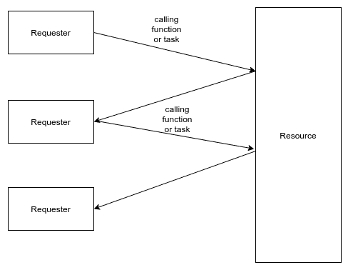

# 第六章：响应式模式

在本章中，我们将探讨响应式模式的概念和实现，探讨我们如何使用它们来实现更好的应用程序。我们还将涵盖响应式编程概念，重点关注它们如何有助于应用程序开发。阅读本章后，我们将能够使用响应式模式，并采用 Java EE 8 的最佳实践。 

本章将探讨以下主题：

+   解释响应式编程的概念

+   解释 CDI 中事件的概念

+   在 CDI 中实现事件

+   解释异步 EJB 方法的概念

+   实现异步 EJB 方法

+   解释异步 REST 服务的概念

+   实现异步 REST 服务

很长时间以来，应用程序都以同步方式处理所有请求。在同步过程中，用户请求资源并等待其响应。当此类过程开始时，每个步骤都紧随前一个步骤之后执行。

在以下图中，我们可以看到在同步方式下执行的工作流程过程：



在同步过程中，对函数或资源的每次调用都以逐步、顺序的方式进行。然而，一些任务执行时间较长，从而长时间阻塞此过程。一个可能需要长时间执行的示例任务是当应用程序从磁盘或数据源读取数据时的 I/O 请求。

随着 Web 应用程序访问量的增长，许多 Web 应用程序需要能够接收和处理大量请求，以响应这些请求。因此，同步处理开始遇到响应大量请求和快速构建响应的问题。为了解决这个问题，Web 应用程序开始通过异步过程工作，使得应用程序能够快速构建响应。

在异步过程中，对函数或资源的调用可以并行进行，无需等待一个任务结束即可执行下一个任务。正因为如此，执行 I/O 请求不会延迟下一个任务的执行——它们可以同时进行。

响应式编程是一种以函数形式开发应用程序的编程风格。在这里，开发发生在请求者发送的异步数据流中。此外，我们可以有一个资源与数据流反应，因为数据流被接收。每个任务然后作为一个函数工作，并且不处理其作用域之外的变量，这使得该函数能够在并行方式下执行多次而不产生任何副作用。

在响应式编程中，我们有对事件做出反应的元素，然后当用户请求资源时，它启动一个事件来操作数据流。当这个事件开始时，一个元素或任务对数据流做出反应并处理其算法。这使得 Web 应用程序能够处理大量数据并轻松扩展。这个范例与以下四个概念一起工作：

+   **Elastic**: 这是对需求做出反应。应用程序可以使用多核和多台服务器来处理请求。

+   **弹性**: 这是对故障做出反应。应用程序可以响应并从软件、硬件和网络中的故障和错误中恢复。

+   **消息驱动**: 这是对事件做出反应。应用程序由异步和非阻塞的事件管理器组成，而不是由多个同步线程组成。

+   **响应式**: 这是对用户做出反应。应用程序提供实时丰富的迭代。

Java EE 8 提供了工具，允许开发者在其应用程序中使用响应式编程。其中一些工具是 CDI 中的事件、异步 EJB 方法和异步 REST 服务。

# 解释 CDI 中事件的概念

随着响应式编程在开发环境中的增长，Java 语言和 Java EE 需要创建工具，以允许开发者使用响应式编程来开发系统。在 Java EE 上，引入了一些解决方案，使得可以使用函数式风格并创建异步过程。其中之一是 CDI 中的事件；这个解决方案可以使用 CDI 启动同步和阻塞事件，或异步和非阻塞事件。

在 CDI 中，事件是 Java EE 使用观察者模式构建的解决方案，使得开发并启动一个事件成为可能，以便将处理事件的组件分离，作为一个同步和阻塞或异步和非阻塞的过程。这个分离的任务是一个观察者，它对其使用数据启动的事件做出反应。在本章中，我们将重点关注异步 CDI，使用 CDI 中的事件来启动异步事件。

# 实现 CDI 中的事件

作为在 CDI 中实现事件的示例，我们考虑异步 CDI 并想象一个场景，在这个场景中我们想要创建一个应用程序，使其能够上传三种类型（或扩展名）的文件——这包括 ZIP、JPG 和 PDF 扩展名。根据接收到的请求扩展名，目的是启动一个事件，一个观察者将使用异步过程将其文件保存到磁盘上。每个扩展名都将有一个观察者，它将有一个算法使得文件能够保存到磁盘上。为了开发这个示例，我们有以下类：

+   `FileUploadResource`: 这是一个表示接收所有请求以上传并根据文件扩展名启动相应事件的类的资源。

+   `FileEvent`: 这是一个包含文件数据的 Bean，并将其发送到事件中。

+   `FileHandler`：这是所有观察者的接口。在这个例子中，所有对`FileEvent`做出响应的类都需要实现`FileHandler`。

+   `JpgHandler`：这是一个将 JPG 文件保存到磁盘上的`FileHandler`实现。这个类是一个观察者，它对启动到 JPG 文件的`FileEvent`做出响应。

+   `PdfHandler`：这是一个`FileHandler`的实现，它将 PDF 文件保存到磁盘上。这个类是一个观察者，它对启动到 PDF 文件的`FileEvent`做出响应。

+   `ZipHandler`：这是一个将 ZIP 文件保存到磁盘上的`FileHandler`实现。这个类是一个观察者，它对启动到 ZIP 文件的`FileEvent`做出响应。

+   `Jpg`：这是一个用于建立`JpgHandler`观察者需要响应事件的限定符。

+   `Pdf`：这是一个用于建立`PdfHandler`观察者需要响应事件的限定符。

+   `Zip`：这是一个用于建立`ZipHandler`观察者需要响应事件的限定符。

+   `FileSystemUtils`：这是一个用于处理文件系统问题的实用类。

# 实现 FileUploadResource 类

`FileUploadResource`是一个资源类，它使用 JAX-RS 创建一个 RESTful 服务，用于上传具有 JPG、PDF 和 ZIP 扩展名的文件。在以下代码中，我们有用于选择正确观察者以响应事件的限定符代码以及`FileUploadResource`的代码：

# 事件上发送的 bean

`FileEvent`是一个发送到事件的 bean——观察者将接收这个：

```java
import java.io.File;

public class FileEvent {

    private File file;

    private String mimeType;

    public FileEvent(){}

    public FileEvent(File file, String mimeType){

        this.file = file;
        this.mimeType = mimeType;

    }

    public File getFile() {
        return file;
    }

    public void setFile(File file) {
        this.file = file;
    }

    public String getMimeType() {
        return mimeType;
    }

    public void setMimeType(String mimeType) {
        this.mimeType = mimeType;
    }
}
```

# 选择用于响应事件的`JpgHandler`观察者的限定符

在以下代码中，我们有`Jpg`限定符，用于定义正确的事件处理器：

```java
import javax.inject.Qualifier;
import java.lang.annotation.ElementType;
import java.lang.annotation.Retention;
import java.lang.annotation.RetentionPolicy;
import java.lang.annotation.Target;

@Qualifier
@Retention(RetentionPolicy.RUNTIME)
@Target({ElementType.METHOD, ElementType.TYPE, ElementType.PARAMETER, ElementType.FIELD})
public @interface Jpg {
}
```

# 选择用于响应事件的`PdfHandler`观察者的限定符

在以下代码中，我们有`Pdf`限定符，用于定义正确的事件处理器：

```java
import javax.inject.Qualifier;
import java.lang.annotation.ElementType;
import java.lang.annotation.Retention;
import java.lang.annotation.RetentionPolicy;
import java.lang.annotation.Target;

@Qualifier
@Retention(RetentionPolicy.RUNTIME)
@Target({ElementType.METHOD, ElementType.TYPE, ElementType.PARAMETER, ElementType.FIELD})
public @interface Pdf {
```

# 选择用于响应事件的`ZipHandler`观察者的限定符

在以下代码中，我们有`Zip`限定符，用于定义正确的事件处理器：

```java
import javax.inject.Qualifier;
import java.lang.annotation.ElementType;
import java.lang.annotation.Retention;
import java.lang.annotation.RetentionPolicy;
import java.lang.annotation.Target;

@Qualifier
@Retention(RetentionPolicy.RUNTIME)
@Target({ElementType.METHOD, ElementType.TYPE, ElementType.PARAMETER, ElementType.FIELD})
public @interface Zip {
}
```

# FileUploadResource 类

在以下代码块中，我们有`JFileUploadResource`类，它使用 JAX-RS 并且是一个 REST 服务：

```java
import javax.enterprise.event.Event;
import javax.enterprise.util.AnnotationLiteral;
import javax.inject.Inject;
import javax.ws.rs.Consumes;
import javax.ws.rs.POST;
import javax.ws.rs.Path;
import javax.ws.rs.core.Response;
import java.io.File;
import java.util.Objects;

@Path("upload")
public class FileUploadResource {

    @Inject
    Event<FileEvent> fileEvent;

    @Consumes("application/pdf")
    @POST
    public Response uploadPdf(File file){

        FileEvent fileEvent = new FileEvent(file, "pdf");

        Event<FileEvent> pdfEvent = this.fileEvent.select(new 
        AnnotationLiteral<Pdf>() {});

        pdfEvent.fireAsync(fileEvent)
                .whenCompleteAsync((event, err)->{

                    if( Objects.isNull( err ) )
                        System.out.println("PDF saved");
                    else
                        err.printStackTrace();

                });

        return Response.ok().build();

    }

    @Consumes("image/jpeg")
    @POST
    public Response uploadJpg(File file){

        FileEvent fileEvent = new FileEvent(file, "jpg");

        Event<FileEvent> jpgEvent = this.fileEvent.select( new 
        AnnotationLiteral<Jpg>() {} );

        jpgEvent.fireAsync(fileEvent)
                .whenCompleteAsync((event, err)->{

                    if( Objects.isNull( err ) )
                        System.out.println( "JPG saved" );
                    else
                        err.printStackTrace();

                });

        return Response.ok().build();

    }

    @Consumes("application/zip")
    @POST
    public Response uploadZip( File file){

        FileEvent fileEvent = new FileEvent( file, "zip" );

        Event<FileEvent> zipEvent = this.fileEvent.select(new 
        AnnotationLiteral<Zip>() {});

        zipEvent.fireAsync(fileEvent)
                .whenCompleteAsync( (event, err)->{

                    if( Objects.isNull( err ) )
                        System.out.println( "PDF saved" );
                    else
                        err.printStackTrace();

                });

        return Response.ok().build();

    }
}
```

```java
Event, using an annotation as a qualifier:
```

```java
Event<FileEvent> zipEvent = this.fileEvent.select(new AnnotationLiteral<Zip>() {});

```

建立正确事件启动的另一种方法是使用在对象注入点使用`@Inject`时的限定符，但这种方式下，事件变为静态的，并且由`Event`对象启动的所有事件都是同一类型。使用`select (Annotation... var)`方法，我们可以启动动态事件以及其他事件类型。以下是一个具有静态事件类型的`Event`示例：

```java
@Inject
@Pdf //Qualifier 
Event<FileEvent> pdfEvent;

```

在前面的示例中，`pdfEvent`将始终向由`@Pdf`限定符标记的事件处理观察者启动事件。

要启动异步事件，我们需要调用`fireAsync(U var)`方法，该方法返回`CompletionStage`。在以下代码块中，我们有一个调用此方法并准备在过程完成后执行回调函数的代码片段：

```java
 zipEvent.fireAsync(fileEvent)
                .whenCompleteAsync( (event, err)->{

                    if( Objects.isNull( err ) )
                        System.out.println( "PDF saved" );
                    else
                        err.printStackTrace();

                });
```

# 实现观察者

当一个启动器启动事件时，一些元素将对此事件做出反应，并使用事件上提供的数据处理一个任务。这些元素被称为 **观察者**，它们作为观察者模式工作，在对象之间创建一对一的关系。

这发生在其中一个对象是主题，而其他对象是观察者的情况下。然后，当主题对象更新时，所有与该主题对象相关的观察者对象也会更新。

CDI 有一个创建将对其事件做出反应的观察者的机制。在我们的示例中，我们将启动一个事件，创建观察者以对这些事件做出反应，并处理一个任务。为此，我们将创建代表我们的观察者和处理任务的处理器。这些处理器将是实现 `FileHandler` 接口以及名为 `handle(FileEvent file)` 的方法的类。请注意，`handler(FileEvent file)` 方法的参数是 `FileEvent` 类型。这与前面示例中发送到事件的类型相同。在以下示例中，我们有 `FileHandler` 接口及其实现的代码：

```java
import java.io.IOException;

public interface FileHandler {

    public void handle( FileEvent file ) throws IOException;
}
```

在以下代码中，我们有一个名为 `JpgHandler` 的类，它是 `FileHandler` 的一个实现。这负责在文件系统上保存 JPG 文件。当向 `@Jpg` 标识符启动事件时，将调用此观察者：

```java
import javax.enterprise.event.ObservesAsync;
import java.io.IOException;
import java.util.Date;

public class JpgHandler implements FileHandler {

    @Override
    public void handle(@ObservesAsync @Jpg FileEvent file) throws  
    IOException {

       FileSystemUtils.save( file.getFile(),"jpg","jpg_"+ new 
       Date().getTime() + ".jpg" );

    }
}
```

在前面的代码块中，我们有一个方法处理程序，它带有 `@ObservesAsync` 注解以及 `@Jpg`。这是一个 CDI 注解，用于配置此方法以观察 `FileEvent` 文件，以及 Qualifier 以配置观察者仅对启动到 `@Jpg` 标识符的事件做出反应。

在以下代码块中，我们有一个名为 `PdfHandler` 的类，它是 `FileHandler` 的一个实现，负责在文件系统上持久化 PDF 文件。当向 `@Pdf` 标识符启动事件时，将调用此观察者：

```java
import javax.enterprise.event.ObservesAsync;
import java.io.IOException;
import java.util.Date;

public class PdfHandler implements FileHandler {

    @Override
    public void handle(@ObservesAsync @Pdf FileEvent file) throws 
    IOException {

         FileSystemUtils.save( file.getFile(),"pdf","pdf_"+ new 
         Date().getTime() + ".pdf" );

    }
}
```

在前面的代码中，我们有一个带有 `@ObservesAsync` 注解以及 `@Pdf.` 的处理方法。这是一个 CDI 注解，用于配置 `handle(FileEvent file)` 方法以观察 `FileEvent` 文件，以及 `Qualifier` 以配置观察者仅对启动到 `@Pdf` 标识符的事件做出反应。

在以下代码中，我们有一个名为 `ZipHandler` 的类，它是 `FileHandler` 的一个实现，负责在文件系统上保存 ZIP 文件。当向 `@Zip` 标识符启动事件时，将调用此观察者：

```java
import javax.enterprise.event.ObservesAsync;
import java.io.IOException;
import java.util.Date;

public class ZipHandler implements FileHandler {

    @Override
    public void handle(@ObservesAsync @Zip FileEvent file) throws 
    IOException {

        FileSystemUtils.save( file.getFile(),"zip","zip_"+ new 
        Date().getTime() + ".zip" );

    }
}
```

在前面的代码中，我们有一个处理方法，它带有 `@ObservesAsync` 和 `@Zip` 注解。这是一个 CDI 注解，用于配置此方法以观察 `FileEvent` 文件，以及 Qualifier 以配置此观察者仅对启动到 `@Zip` 标识符的事件做出反应。

# 解释异步 EJB 方法的概念

向响应这些事件的元素启动事件是一种在开发过程中解决许多类型问题的良好机制。然而，有时有必要在不阻塞进程直到该方法完成执行的情况下调用类方法。

异步 EJB 方法是 EJB 的一种机制，允许客户端调用一个方法，并在方法被调用时立即接收其返回值。方法的返回值由代表异步调用的 `Future<T>` 对象控制。客户端可以控制异步方法的执行。这些操作可以取消调用方法，检查调用是否完成，检查调用是否抛出异常，以及检查调用是否已取消。

# 异步 EJB 方法与 CDI 事件之间的区别

CDI 中的事件和异步 EJB 方法具有使任务非阻塞调用的相似特性。此外，客户端可以取消并监控异步过程的调用。然而，异步 EJB 方法与 CDI 事件并不共享所有相同的特性。它们之间的主要区别在于异步 EJB 方法在调用者和被调用者之间是一对一的关系。这是因为当该方法被调用时，它只会处理任务，客户端知道将要处理的方法是什么。而在 CDI 事件中，调用者和被调用者之间的关系是一对多的。这是因为调用者启动了一个事件，一个或多个观察者可以对此做出反应。异步 EJB 方法与 CDI 事件之间的另一个区别是，在 CDI 中，事件与观察者模式一起工作，使得在另一个时间执行回调方法成为可能。异步 EJB 方法不与观察者模式一起工作，并且没有应用回调方法的能力。

# 实现异步 EJB 方法

在我们的实现示例中，我们将使用与 CDI 事件示例相同的场景。在这里，我们将创建一个应用程序，使其能够上传三种类型（或扩展名）的文件——ZIP、JPG 和 PDF 扩展名。根据接收到的扩展名类型，接收到的文件将保存在文件系统中的相应目录下。为了开发此示例，我们将使用以下类：

+   `FileUploadResource`: 这是一个表示接收所有上传请求的资源类，并根据文件扩展名调用相应的 EJB。

+   `JpgHandler`: 这是一个具有异步方法的 EJB，用于处理磁盘上 JPG 文件的保存过程。

+   `PdfHandler`: 这是一个具有异步方法的 EJB，用于处理磁盘上 PDF 文件的保存过程。

+   `ZipHandler`: 这是一个具有异步方法的 EJB，用于处理磁盘上 ZIP 文件的保存过程。

+   `FileSystemUtils`: 这是一个旨在处理文件系统问题的实用工具类。

# 实现 EJB

要使用异步 EJB 方法，我们需要创建一个会话 bean 并将其配置为具有异步方法。在下面的代码中，我们有一个名为`PdfHandler`的会话 bean 实现的示例，该 bean 负责在文件系统上保存 PDF 文件：

```java
import javax.ejb.AsyncResult;
import javax.ejb.Asynchronous;
import javax.ejb.Stateless;
import java.io.IOException;
import java.util.Date;
import java.util.concurrent.Future;

@Stateless
public class PdfHandler {

    @Asynchronous
    public Future<String> handler (FileBean file) throws IOException {

        return new AsyncResult(
                FileSystemUtils.save(
                        file.getFile(),
                        "pdf",
                        "pdf_"+ new Date().getTime() + ".pdf" ));

    }
}
```

在前面的代码块中，我们有一个`PdfHandler`类，它包含一个`handler(FileBean file)`方法。此方法使用`@Asynchronous`注解来配置它为一个异步方法。

以下代码演示了`handle(FileBean file)`方法的配置：

```java
 @Asynchronous
 public Future<String> handler (FileBean file) throws IOException {
        //Business logic
 }
```

此方法需要返回`Future<T>`。在我们的示例中，我们返回`AsyncResult`，它是`Future`接口的一个实现。在我们的示例中，与`Future`对象一起返回的数据包含文件系统上文件路径的信息。在下面的代码中，我们有一个`Future`返回的示例：

```java
return new AsyncResult(
                FileSystemUtils.save(
                        file.getFile(),
                        "pdf",
                        "pdf_"+ new Date().getTime() + ".pdf" ));
```

在下面的代码块中，我们有一个名为`JpgHandler`的会话 bean 实现的示例，该 bean 负责在文件系统上保存 JPG 文件：

```java
import javax.ejb.AsyncResult;
import javax.ejb.Asynchronous;
import javax.ejb.Stateless;
import java.io.IOException;
import java.util.Date;
import java.util.concurrent.Future;

@Stateless
public class JpgHandler {

    @Asynchronous
    public Future<String> handler (FileBean file) throws IOException {

        return new AsyncResult(
                FileSystemUtils.save(
                        file.getFile(),
                        "jpg",
                        "jpg_"+ new Date().getTime() + ".jpg" ));

    }
}
```

此方法与`PdfHandler`方法类似，但将文件保存在另一个目录，并使用另一个文件名模式。在我们的示例中，与`Future`对象一起返回的数据是文件系统上文件的路径。

在下面的代码中，我们有一个名为`JpgHandler`的会话 bean 实现的示例，该 bean 负责在文件系统上保存 JPG 文件：

```java
import javax.ejb.AsyncResult;
import javax.ejb.Asynchronous;
import javax.ejb.Stateless;
import java.io.IOException;
import java.util.Date;
import java.util.concurrent.Future;

@Stateless
public class ZipHandler {

    @Asynchronous
    public Future<String> handler (FileBean file) throws IOException {

        return new AsyncResult(
                FileSystemUtils.save(
                        file.getFile(),
                        "zip",
                        "zip_"+ new Date().getTime() + ".zip" ));

    }
}
```

此方法与`PdfHandler`和`JpgHandler`方法类似，但将文件保存在另一个目录，并使用另一个文件名模式。在我们的示例中，与`Future`对象一起返回的数据是文件系统上文件的路径。

# 实现 FileUploadResource 类

`FileUploadResource`是一个资源类，它使用 JAX-RS 创建一个 RESTful 服务来上传具有 JPG、PDF 和 ZIP 扩展名的文件。下面的代码包含`FileUploadResource`资源类：

```java
import javax.inject.Inject;
import javax.ws.rs.Consumes;
import javax.ws.rs.POST;
import javax.ws.rs.Path;
import javax.ws.rs.core.Response;
import java.io.File;
import java.io.IOException;

@Path("upload")
public class FileUploadResource {

    @Inject
    private PdfHandler pdfHandler;

    @Inject
    private JpgHandler jpgHandler;

    @Inject
    private ZipHandler zipHandler;

    @Consumes("application/pdf")
    @POST
    public Response uploadPdf(File file) throws IOException {

        FileBean fileBean = new FileBean(file, "pdf");

        pdfHandler.handler( fileBean );

        return Response.ok().build();

    }

    @Consumes("image/jpeg")
    @POST
    public Response uploadJpg(File file) throws IOException {

        FileBean fileBean = new FileBean(file, "jpg");

        jpgHandler.handler( fileBean );

        return Response.ok().build();
    }

    @Consumes("application/zip")
    @POST
    public Response uploadZip( File file) throws IOException {

        FileBean fileBean = new FileBean( file, "zip" );

        zipHandler.handler( fileBean );

        return Response.ok().build();

    }
}
```

在下面的代码块中，EJB 的`PdfHandler`、`JpgHandler`和`ZipHandler`使用 CDI 的`@Inject`注解进行注入。在下面的示例中，我们有注入代码：

```java
    @Inject
    private PdfHandler pdfHandler;

    @Inject
    private JpgHandler jpgHandler;

    @Inject
    private ZipHandler zipHandler;

```

当向应用程序发送请求时，负责处理请求的方法获取文件并构建一个`FileBean`。此方法调用异步 EJB 方法来处理此任务。在下面的代码块中，我们有调用异步 EJB 方法的示例。

# 调用一个异步 EJB 方法来保存 PDF 文件

我们使用以下方式调用异步 EJB 方法。以下代码块通过调用 EJB 方法演示了保存 PDF 文件：

```java
    FileBean fileBean = new FileBean(file, "pdf");
    pdfHandler.handler( fileBean );
```

# 调用一个异步 EJB 方法来保存 JPG 文件

以下代码块通过调用异步 EJB 方法演示了保存 JPG 文件：

```java
    FileBean fileBean = new FileBean(file, "jpg");
    jpgHandler.handler( fileBean );
```

# 调用一个异步 EJB 方法来保存 ZIP 文件

以下代码块演示了通过调用异步 EJB 方法保存 ZIP 文件：

```java
    FileBean fileBean = new FileBean( file, "zip" );
    zipHandler.handler( fileBean );

```

# 解释异步 REST 服务的概念

随着时间的推移，REST 应用程序的数量不断增加，许多 API 已经创建出来，以在各种环境中提供各种类型的服务。与其他应用程序一样，一些 REST 应用程序需要异步过程，并与非阻塞过程一起工作。

异步 REST 服务是一个异步过程，使处理线程更容易。相比之下，在发送到服务器的请求中，可以调用一个新线程来处理非阻塞任务，例如文件系统上的操作。JAX-RS 在客户端 API 和服务器 API 中支持异步处理，但异步 REST 服务是在服务器 API 中实现的。这是因为服务器 API 提供服务。客户端 API 消费服务，因此我们将客户端 API 中的异步处理称为异步 REST 消费。

客户端 API 可以通过异步调用完成，一旦请求完成，就返回一个`Future<T>`对象，允许客户端控制这个调用并对它执行操作。这可以通过响应式编程来实现，并且可以在请求完成后立即返回一个`CompletionState<T>`对象。这意味着可以控制调用并选择一个回调方法，根据阶段执行。在下一主题中涵盖的实现示例中，我们将使用响应式编程的调用。

# 实现异步 REST 服务

作为实现异步 REST 服务的示例，我们将使用 CDI 事件示例中使用的相同场景和异步 EJB 方法示例。在这里，我们将创建一个应用程序，使其能够上传三种类型（或扩展名）的文件——ZIP、JPG 和 PDF 扩展名。根据接收到的扩展名，我们希望接收到的文件被保存在文件系统上的相应目录中。为了开发这个示例，我们有以下类：

+   `FileUploadResource`：这是一个表示与异步过程一起工作的资源，用于接收所有上传请求，并根据文件扩展名调用相应的 EJB。

+   `JpgHandler`：这是一个 EJB，提供了一个在磁盘上保存 JPG 文件的方法。

+   `PdfHandler`：这是一个 EJB，提供了一个在磁盘上保存 PDF 文件的方法。

+   `ZipHandler`：这是一个 EJB，提供了一个在磁盘上保存 ZIP 文件的方法。

+   `FileSystemUtils`：这是一个处理文件系统问题的实用类。

+   `FileUploadClient`：这是一个通过 JAX-RS 实现的客户端 API，它对 REST 服务进行异步调用。

# 实现 EJBs

在这个阶段，我们将实现`PdfHandler`、`JpgHandler`和`ZipHandler`，这些 EJB 负责处理保存文件逻辑。

在以下代码中，我们有`PdfHandler`，它负责保存 PDF 文件：

```java
import javax.ejb.Stateless;
import java.io.IOException;
import java.util.Date;

@Stateless
public class PdfHandler {

    public String handler (FileBean file) throws IOException {

        return FileSystemUtils.save(
                file.getFile(),
                "pdf",
                "pdf_"+ new Date().getTime() + ".pdf" );

    }
}
```

在以下代码块中，我们有`JpgHandler`，它负责保存 JPG 文件：

```java
import javax.ejb.Stateless;
import java.io.IOException;
import java.util.Date;

@Stateless
public class JpgHandler {

    public String handler (FileBean file) throws IOException {

        return FileSystemUtils.save(
                        file.getFile(),
                        "jpg",
                        "jpg_"+ new Date().getTime() + ".jpg" );

    }
}
```

在下面的代码块中，我们有`ZipHandler`，它负责保存 ZIP 文件：

```java
import javax.ejb.Stateless;
import java.io.IOException;
import java.util.Date;

@Stateless
public class ZipHandler {

    public String handler (FileBean file) throws IOException {

        return FileSystemUtils.save(
                file.getFile(),
                "zip",
                "zip_"+ new Date().getTime() + ".zip" );

    }
}
```

# 实现 FileUploadResource 类

`FileUploadResource`是一个资源，旨在允许客户端通过异步请求使用 REST 将文件上传到服务器。这个类使用 JAX-RS 创建 REST 资源，并根据文件扩展名，此资源将保存文件的任务委托给相应的 EJB。在下面的代码块中，我们有`FileUploadResource`类：

```java
import javax.annotation.Resource;
import javax.enterprise.concurrent.ManagedExecutorService;
import javax.enterprise.context.spi.CreationalContext;
import javax.enterprise.inject.spi.Bean;
import javax.enterprise.inject.spi.BeanManager;
import javax.naming.InitialContext;
import javax.naming.NamingException;
import javax.ws.rs.Consumes;
import javax.ws.rs.POST;
import javax.ws.rs.Path;
import java.io.File;
import java.io.IOException;
import java.util.concurrent.CompletableFuture;
import java.util.concurrent.CompletionStage;

@Path("upload")
public class FileUploadResource {

    @Resource
    private ManagedExecutorService executor;

    @Consumes("application/pdf")
    @POST
    public CompletionStage<String> uploadPdf(File file) {

        BeanManager beanManager = getBeanManager();

        CompletableFuture<String> completionStage = new 
        CompletableFuture<>();
        executor.execute(() -> {
            FileBean fileBean = new FileBean(file, "pdf");

            Bean<PdfHandler> bean = (Bean) 
            beanManager.getBeans(PdfHandler.class).iterator().next();
            CreationalContext cCtx = 
            beanManager.createCreationalContext(bean);
            PdfHandler pdfHandler = (PdfHandler) 
            beanManager.getReference(bean, PdfHandler.class, cCtx);

            try {

              completionStage.complete(pdfHandler.handler( fileBean ));
            } catch (IOException e) {
                e.printStackTrace();
                completionStage.completeExceptionally(e);
            }

        });

        return completionStage;
    }

    private BeanManager getBeanManager(){
        try {
            // manual JNDI lookupCDI for the CDI bean manager (JSR 299)
           return (BeanManager) new InitialContext().lookup(
                    "java:comp/BeanManager");

        } catch (NamingException ex) {
            throw new IllegalStateException(
                    "cannot perform JNDI lookup for CDI BeanManager");
        }
    }

    @Consumes("image/jpeg")
    @POST
    public CompletionStage<String> uploadJpg(File file) throws 
    IOException {

        BeanManager beanManager = getBeanManager();

        CompletableFuture<String> completionStage = new 
        CompletableFuture<>();
        executor.execute(() -> {
            FileBean fileBean = new FileBean(file, "jpg");

            Bean<JpgHandler> bean = (Bean) 
            beanManager.getBeans(JpgHandler.class).iterator().next();
            CreationalContext cCtx = 
            beanManager.createCreationalContext(bean);
            JpgHandler jpgHandler = (JpgHandler) 
            beanManager.getReference(bean, JpgHandler.class, cCtx);

            try {

            completionStage.complete(jpgHandler.handler( fileBean ));
            } catch (IOException e) {
                e.printStackTrace();
                completionStage.completeExceptionally(e);
            }

        });

        return completionStage;
    }

    @Consumes("application/zip")
    @POST
    public CompletionStage<String> uploadZip( File file) throws 
    IOException {

        BeanManager beanManager = getBeanManager();

        CompletableFuture<String> completionStage = new 
        CompletableFuture<>();
        executor.execute(() -> {
            FileBean fileBean = new FileBean(file, "zip");

            Bean<ZipHandler> bean = (Bean) 
            beanManager.getBeans(ZipHandler.class).iterator().next();
            CreationalContext cCtx = 
            beanManager.createCreationalContext(bean);
            ZipHandler zipHandler = (ZipHandler) 
            beanManager.getReference(bean, ZipHandler.class, cCtx);

            try {

             completionStage.complete(zipHandler.handler( fileBean ));
            } catch (IOException e) {
                e.printStackTrace();
                completionStage.completeExceptionally(e);
            }

        });

        return completionStage;

    }
}
```

```java
FileUploadResource, which has an executor attribute injection:
```

```java
 @Resource
 private ManagedExecutorService executor;

```

此外，这个类包含三个方法，它们接收请求，准备`FileBean`，并将其发送到 EJB 以处理保存文件的任务。在下面的代码块中，我们有`uploadPdf(File file)`方法，它负责处理所有上传 PDF 文件的请求：

```java
    @Consumes("application/pdf")
    @POST
    public CompletionStage<String> uploadPdf(File file) {

        BeanManager beanManager = getBeanManager();

        CompletableFuture<String> completionStage = new 
        CompletableFuture<>();
        executor.execute(() -> {
            FileBean fileBean = new FileBean(file, "pdf");

            //get the EJB by CDI    
            Bean<PdfHandler> bean = (Bean)                                                    
            beanManager.getBeans(PdfHandler.class).iterator().next();
            CreationalContext cCtx =    
             beanManager.createCreationalContext(bean);
            PdfHandler pdfHandler = (PdfHandler) 
            beanManager.getReference(bean, PdfHandler.class, cCtx);

            try {

              completionStage.complete(pdfHandler.handler( fileBean ));
            } catch (IOException e) {
                e.printStackTrace();
                completionStage.completeExceptionally(e);
            }

        });

        return completionStage;

    }
AsyncResponse (@Suspended final AsyncResponse ar) as a parameter of the service method, or this method would need to return a CompletionState<T> to the client. In our example, we returned CompletionState to the client. Further, we need to create a separate thread in order to execute a nonblocking task. In the following code block, we have a code snippet of the uploadPdf method, which creates a separate task to call the task that saves the PDF file:
```

```java
executor.execute(() -> {
            FileBean fileBean = new FileBean(file, "pdf");

            Bean<PdfHandler> bean = (Bean)     
            beanManager.getBeans(PdfHandler.class).iterator().next();
            CreationalContext cCtx = 
            beanManager.createCreationalContext(bean);
            PdfHandler pdfHandler = (PdfHandler)  
            beanManager.getReference(bean, PdfHandler.class, cCtx);

            try {

            completionStage.complete(pdfHandler.handler( fileBean ));
            } catch (IOException e) {
                e.printStackTrace();
                completionStage.completeExceptionally(e);
            }

  });

```

# 实现客户端 API

现在，为了使用反应式编程发送异步请求，我们创建了一个 JAX-RS 客户端 API 的示例。在下面的代码中，我们可以看到一个客户端 API 的示例：

```java
public class ClientAPI
{
    private static final String URL = "http://localhost:8080/asyncRestService/resources/upload";
    private static final String FILE_PATH = "test.pdf";

    public static void main( String[] args ) {
        Client client = ClientBuilder.newClient();
        WebTarget target = client.target(URL);
        try {
            CompletionStage<String> csf = target.request()
                    .rx()
                    .post(Entity.entity(new FileInputStream(new 
                    File(FILE_PATH)),"application/pdf"),String.class);

            csf.whenCompleteAsync((path, err)->{

                if( Objects.isNull( err ) )
                    System.out.println("File saved on: " + path);
                else
                    err.printStackTrace();

            });

        } catch (FileNotFoundException e) {
            e.printStackTrace();
        }
    }
}
ClientAPI, which defines a callback method to be executed after the asynchronous processing finishes:
```

```java
 csf.whenCompleteAsync((path, err)->{

                if( Objects.isNull( err ) )
                    System.out.println("File saved on: " + path);
                else
                    err.printStackTrace();

            });
```

# 摘要

在第七章《微服务模式》中，我们探讨了反应式编程范式以及它是如何通过 Java EE 8 机制实现的。我们还展示了如何使用 Java EE 8 机制进行异步调用，以及如何通过异步处理来控制这些调用并对它们应用操作。

CDI 中的事件是 CDI 规范中的一种机制，可以在应用程序的所有层中使用。然而，当与表示层一起工作时，推荐使用此机制。这是因为 CDI 主要关注表示层，其作用域与 HTTP 交互和 HTTP 会话直接相关。此外，我们可以启动一个包含各种响应此事件的元素的事件。

异步 EJB 方法不使用反应式编程范式，而是一个异步过程，这使得减少对客户端响应时间成为可能。这是一个 EJB 机制，建议在业务层使用它。使用此机制的好处是，我们还可以使用其他 EJB 机制，例如事务控制。

异步 REST 服务是 JAX-RS 规范中的一种机制，能够创建一个可以进行异步处理的 REST 服务。使用此机制，一旦发送请求，过程控制就返回，因此客户端不需要长时间等待来处理其他任务。此机制始终在表示层实现。

在下一章中，我们将介绍微服务模式及其实现方法。我们还将探讨聚合器模式、代理模式、链式模式、分支模式和异步消息模式。
