# 第七章：微服务模式

在本章中，我们将学习微服务模式是什么。我们还将将这些模式与单体模式进行比较，探讨基于微服务的应用程序的优势和缺点，以及学习何时使用微服务。此外，我们还将通过实例演示如何从传统的单体应用程序切换到微服务应用程序，并使用实现示例。然后，我们将探讨用于组合微服务的模式。阅读本章后，您将能够识别出应用程序代码中哪些部分适合作为微服务，并且您还将了解如何使用 Java EE 8 实现基于微服务模式的程序。

本章将涵盖以下主题：

+   解释微服务模式

+   解释微服务架构是如何工作的

+   解释何时使用微服务架构

+   基于微服务的应用程序的优势和缺点

+   微服务架构模式

+   实施微服务

# 解释微服务模式

多年前，我有机会在一个行政-财务系统上担任系统架构师和开发者。这涉及到使用诸如应收账款、应付账款、库存控制、采购、工资、会计等模块。

整个系统由几个模块组成，系统的交付也是以模块化的方式构建的。在应用程序开发结束时，我们得到了一个庞大、集成的系统，模块之间存在许多依赖关系。显然，系统应该集成，我们也非常清楚这一点。然而，这种集成是通过许多依赖关系和模块之间的强耦合实现的。后来，我们还发现这些依赖关系和强耦合是不必要的。

在维护应用程序时，我们遇到了许多问题（如实施新框架的困难以及过度官僚主义），包括每当需要包含来自需求的功能时，我们必须找到负责问题的代码部分，进行更改，测试，然后重新部署整个应用程序。除此之外，有时还会出现其他相关问题，例如使用第三方库或框架来实现这个新功能。在这方面也有一些官僚主义。简而言之，我们花费了大量时间来更改应用程序，而且随着应用程序的增大，这个问题变得更加严重。

系统准备就绪后，我们想知道如果每个模块都有自己的生命——也就是说，如果每个模块都像是一个小程序，那么它就可以独立部署，而不会影响其他模块。此外，如果每个模块可以实际并行开发，并且需要最小的耦合，那么这对应用程序的开发和维护将非常有益。

回到当今时代，我们注意到，在系统组件最常期望的几个特性中，我们可以突出低耦合，这保证了并行开发和更好的维护。

存在一种名为*微服务架构*的架构模式，它将应用程序划分为几个具有特定功能或职责的小型服务，这些服务之间的耦合度非常低，并且提供了非常好的特性，例如卓越的演进维护。

当涉及到基于微服务的架构时，将行政-财务应用程序的每个模块作为微型应用程序来实现要容易得多。例如，应付账款模块需要其前端，并且需要依赖于一些微服务的组合（例如，提供固定账户的服务，提供变动账户的服务，提供工资单的服务等等）才能工作。

当然，基于微服务的方法既有优点也有缺点，我们应该仔细查看应用程序，以确定是否值得使用这种架构。基于微服务的架构作为传统单体架构的对立面，其中模块的耦合度要高得多。因此，为了讨论微服务架构并更好地定义微服务是什么，我们必须谈论单体架构。这正是我们接下来要做的。

这里是对微服务和 SOA 之间的一种简要比较。有些人喜欢将微服务架构称为轻量级的 SOA。这两种架构的目标都是打破单体场景，以增加可扩展性和维护性。然而，虽然 SOA 是面向企业的，其中应用程序可以更容易地进行通信，但微服务是由形成一个或多个业务功能的小型、集成服务组成的。这是主要区别——微服务是将单体应用程序分解成小型、智能且松散耦合（如 SOA）的组件，这些组件具有明确的职责和易于维护的结果。

# 在单体应用程序内部

典型应用程序包含一个表示层，即应用程序的客户端，一个持久层或数据库，以及一个中介层，即应用程序的服务器端，包含业务逻辑。我们感兴趣的层是中介层。它接收来自客户端层的请求，执行一些业务逻辑，如果需要则访问数据库（执行查询和更新），并将结果提供给客户端层。

这一层服务器端通常由几个模块或服务组成。尽管应用程序具有模块化架构，但应用程序的部署和打包却作为一个单体块。由类和文件表示的模块包含在打包文件（EAR、WAR）中。这些文件一起部署，属于同一个部署。大多数基于 Java 的应用程序都打包在一个单独的`.war`或`.ear`文件中。

以下图表显示了大学中一个学术-财务系统的示例：

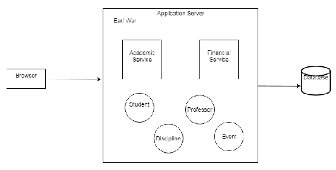

应用程序的各个模块被部署到**应用服务器**上的单个文件。通常，应用程序在一个单独的进程中运行：

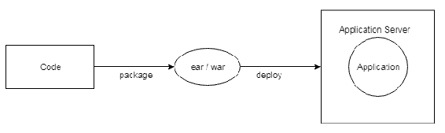

对于具有有限业务任务的简单应用程序，如编码（服务器端编码通常只有一种语言，并且有独特的数据持久化技术）、测试和部署的单体方式也相当简单。然而，随着应用程序复杂性的增加，微服务也将被用来解决这些问题。在本章的后面部分，我们将有一个专门的部分展示微服务架构的优点和缺点。

这里有一些这些问题：

+   实现新功能和修复错误困难

+   长时间应用程序启动时间

+   低效的持续部署

+   可靠性低

+   使用新框架和技术困难

# 实现新功能和修复错误困难

几年来，应用程序不断增长，更多的代码行被添加到现有代码中。即使使用最佳面向对象实践和模式（低耦合和代码重用）谨慎地接近代码，类和库的数量也往往会增加。维护变得更加困难。常见问题可能包括某些类的责任增加。这个问题更加关键，因为开发团队总是变化的。代码变得更加难以理解，一些必要的更改可能会被错误地执行。因此，我们会有实施延迟。

# 长时间应用程序启动时间

随着应用程序变大（更多类、库和文件），其初始化速度会减慢，开发者启动应用程序将花费大量时间。每天这样做几次会大大增加开发时间，因此这也是影响应用程序维护的另一个因素。

# 低效的持续部署

对于应用中每个必需的更改，您需要将其全部部署。持续部署非常困难，因为每次代码的一部分被更改时，整个应用都必须重新部署。当然，在测试环境中，您可以一起分组多个更改并执行单一部署。然而，这仍然效率低下，因为它要求所有实现都已完成。对于每天需要多次部署到生产环境的应用，这种情况变得更糟。

# 低可靠性

单体应用的模块通常在同一个进程中运行。模块中的任何错误或缺陷（如内存泄漏）都会影响整个进程，进而影响整个应用。即使应用在集群系统的多个节点上执行，即使有多个应用实例，如果错误是由于代码引起的，问题也可能通过其他应用实例传播。

# 使用新框架和技术时的困难

在一个拥有成千上万行代码的大型单体应用中，替换框架或添加新功能都是困难的，因为这需要应用多个部分的更改。有时我们几乎需要重写所有代码；这种情况非常常见。产品的质量并没有提高，而维持这种质量所需的努力却大大增加，因为开发团队没有足够的时间引入新的框架。

# 规模立方体

*《可扩展性艺术》* 由马丁·L·艾博特和迈克尔·T·费舍尔所著，提出了一个称为“规模立方体”的三维可扩展性模型。更多详情请参见以下图表：

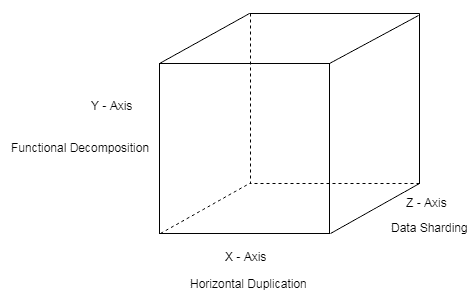

该模型表明我们可以以三种不同的方式扩展应用，如下所示：

+   ***X-轴扩展：*** 这是最常见的模型，它建议在负载均衡器的监督下执行多个应用副本。这种可扩展性也称为**水平扩展**，其中满足需求的解决方案是添加更多服务器。

+   ***Z-轴扩展：*** 这与 X 轴扩展（运行相同代码的多个实例）类似，但在此情况下，每个服务器负责一部分数据。这种可扩展性使用了分片的概念，最常见于数据库。

+   ***Y-轴扩展：*** 这具有将应用分解为不同服务的策略。微服务架构是 Y 轴扩展的一个例子。使用这种可扩展性方法，单体应用被分解为一组服务。每个服务负责一组相关的功能。

# 实际上的微服务是什么

我们可以将微服务架构定义为使用一系列小型、低耦合、独立且可部署的服务来开发应用程序的方法。每个微服务都定义得非常明确，这意味着每个微服务都负责一个定义良好的单一任务。

因此，微服务是执行特定任务的小型组件，可能被用来为商业带来利益。因此，当在微服务架构下开发应用程序时，我们必须将这个应用程序分解成相同的微服务组件。以及我们将在后面看到的其他特征，微服务可以在不降低应用程序本身质量的情况下进行更改和部署。

# 微服务并非万能的解决方案

任何技术解决方案都有其优点和缺点，微服务也不例外，这些将在本章后面进行探讨。如果微服务应用得当，那么它们将提高复杂增长的应用程序的可靠性和可伸缩性。然而，微服务的本质在实施不当时可能会带来问题。

微服务的强独立性意味着它们可以使用不同的语言创建，并且可以使用不同的协议和 API 进行通信。此外，一个应用程序可能包含许多用于商业利益的微服务。微服务的多样性和数量使得对这些相同微服务的控制相当复杂。在基于微服务架构的应用程序实现中，应该格外小心并投入额外的精力。

# 解释微服务架构是如何工作的

尽管在实施微服务架构时还没有一个正式的模型可以遵循，但我们仍然可以强调一些共同的特征。我们还可以在开发微服务时验证良好的实践。

具有一个或多个相关功能，微服务是应用程序中用于商业利益的小部分。从这个微服务的定义出发，我们现在将详细探讨以下微服务的常见特征：

+   应用程序被分解成更小的组件

+   多任务团队

+   产品焦点

+   简单而智能的处理。

+   库和 API 的去中心化管理

+   单一职责原则

+   容错性

+   进化系统

+   去中心化数据

# 应用程序被分解成更小的组件

在开发基于微服务架构的应用程序时，我们应该考虑将应用程序分解成更小的组件，这些组件将分别进行更改和部署（与每次代码更改都必须完全部署的单一应用程序相反）。然而，将应用程序分解成独立操作的小型服务需要更长的时间来开发。

下图显示了应用程序客户端对业务组件的访问：

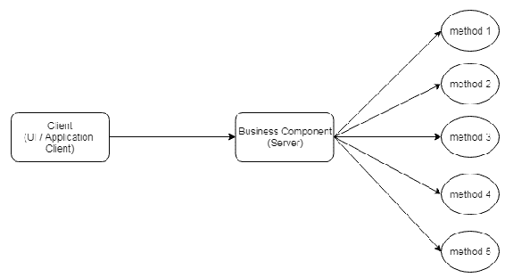

以下图显示了相同的客户端通过微服务访问相同的功能：

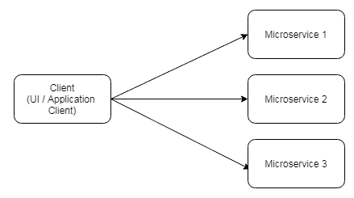

由于微服务小且独立，它们可能导致访问更复杂服务的问题。这些问题如下所述：

+   **调用多个微服务以实现功能**：通常，客户端需要的服务或功能可能涉及对多个微服务的调用。例如，在一个学术-财务管理系统中，一个想要了解大学生历史详细信息的客户端可能需要访问许多微服务。因此，对各种微服务进行多次调用会降低网络性能，这在存在移动客户端的情况下尤为重要。

+   **微服务可以使用不同的协议**：由于微服务是独立的，它们可能需要不同的协议来访问，例如 REST、WebSocket 等。换句话说，访问微服务的协议并不统一，我们可以想象，如果需要与每个微服务进行通信，这将多么耗时。

+   **不同类型的客户端**：存在不同类型的客户端，例如移动客户端和桌面客户端。这些客户端各自也有不同的需求。提供给移动客户端的信息量通常比桌面客户端少。另一个重要问题是，不同类型的客户端的网络性能不同。移动网络比本地网络慢。

在以下图中，我们可以看到一个系统中存在的一组功能及其对应用程序中各个微服务的相应调用：

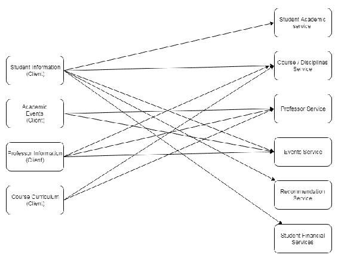

将应用程序分解成一组微服务的代价是相当明显的。控制对微服务的各种调用是一项复杂的任务，而且仍然存在单一数据库的问题。在这些情况下，事务控制变得更加复杂。

为了解决这一系列问题，存在一个名为 API 网关的解决方案，它为基于微服务的应用程序客户端建立了一种前端。API 网关位于客户端和微服务之间。有时，请求只是对微服务的调用，但在其他情况下，API 网关充当一个粗粒度层，接收对服务的请求并对多个微服务进行调用。

我们可以在以下图中看到这一点：

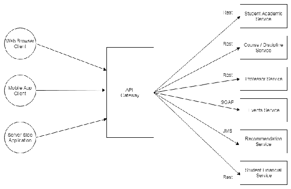

客户端应用程序访问各种微服务的方式与使用 API 时相同。**API 网关**负责访问不同的微服务，并关注用于此访问的不同协议。然而，根据客户端应用程序的类型（例如，是移动应用还是浏览器应用），某些系统功能可能不同。例如，如果我们在一个移动应用中，访问学生历史记录时需要查询的信息量将少于浏览器应用访问的信息量（要么是因为展示屏幕不同，要么是因为访问各种微服务时的性能问题）。考虑到这个问题，除了作为微服务调用的接口层之外，API 网关还可以为每种类型的客户端提供特定的 API。

因此，移动客户端会访问移动 API，而 Web 客户端或浏览器会访问 Web API。我们可以在以下图中看到这一点：

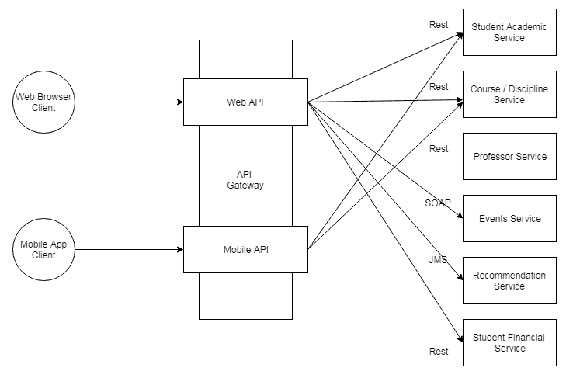

简而言之，**API 网关**充当通用翻译器的角色。因此，客户端专注于业务，而不是请求或响应的翻译。此外，客户端可以一次性调用（如果功能需要多个微服务），这有效地提高了网络性能。

# 多任务团队

在单体应用中，每个应用部分都有专门的团队——数据库团队、后端（Java）开发团队和设计团队。

在基于微服务的应用中，有一个多任务团队，负责微服务的所有部分。因此，该团队必须是全能的。但我们知道，即使是对于单体应用，开发者通常也作为全栈开发者工作，负责开发应用的所有部分。

# 产品导向

在单体应用中，焦点始终是应用项目，代码通常交付给应用客户。然而，在基于微服务的应用中，焦点始终是产品。负责微服务的团队可以改变和演进产品，而不会像在单体应用中那样经历典型的延迟。产品属于负责微服务的开发团队，如下面的图所示：

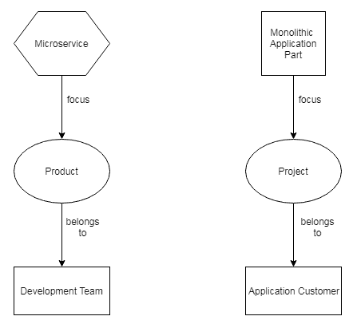

# 简化且智能的处理

微服务通过极其实用的操作执行专业和智能的任务——有一个请求，处理某些内容，并将响应返回给微服务客户端。

# 图书馆和 API 的去中心化治理

微服务被用于一个或多个应用程序的点，或者被各种应用程序使用。此外，我们必须牢记微服务的独立性。因此，对 API 和库的去中心化和治理有自然的促进作用。这意味着微服务开发者应该使用他们认为对微服务开发必要的工具，只要客户端的接口不改变。

# 单一职责原则

微服务应该始终具有一组小的职责。这个定义基于一个称为单一职责原则的原则，该原则指出“一个类必须只有一个改变的理由”。换句话说，具有多个改变动机的类会有更多的职责，并且不会具有内聚性。这会导致问题，例如类职责之间的高耦合性、代码重用困难以及维护困难。

一个具有负责计算的方法以及格式化结果的方法的类，将是一个具有很少内聚性的类的例子。让我们看看以下示例：

```java
class Insurance {    
    public double calculateCotation (...) {...}
    public String generatePDF (...){...}
    public String generateXLS (...){...}
}
```

第一个方法（`calculateCotation`）与业务领域直接相关，而其他方法（`generatePDF`和`generateXLS`）与计算值的展示相关。

单一职责原则（SRP）是被称为 SOLID 原则的五个原则之一，这些原则由罗伯特·塞西尔·马丁（俗称 Uncle Bob）在其著作《敏捷软件开发：原则、模式和最佳实践》出版后普及。实际上，这五个原则是书中报告的几个原则的子集。SOLID 原则是面向对象编程的原则，其目的是使代码更加有序和易于阅读。我们可以将“solid”这个词与“solid code”这个表达联系起来。SOLID 这个缩写的每个字母都是原则的首字母：

**S**ingle responsibility principle（SRP）

**O**pen closed 原则（OCP）

**L**iskov 替换原则（LSP）

** I**nterface segregation principle（ISP）

** D**ependency inversion principle（DIP）

# 容错

由于应用程序现在分解为多个微服务，因此失败的可能性更大，因为一个或多个微服务可能会失败，甚至很可能失败。

实现基于微服务的应用程序时应考虑这一点。微服务以这种方式实现，即失败时影响很小，并且可以尽快恢复。因此，基于微服务的应用程序必须以容错为目标进行开发。当然，这样的实现增加了开发的复杂性。

由于微服务的性质，恢复任务得到了简化。因为它是一个小服务，所以它可以快速创建或初始化。

# 进化系统

基于微服务的架构非常适合随着时间的推移而增加要求和功能的系统。那些业务需求显著增加的系统需要可重用的服务。他们还需要职责的清晰分离，这正是微服务提供的。

# 分散式数据

每个微服务都有自己的数据库——也就是说，每个微服务都有自己管理数据的方式，而不是整个应用程序或整个公司的单一、集中式数据库。这意味着，根据服务类型，数据库可能相当不同。我们可以有一个关系型数据库（或多个），我们可以有几种类型的 NoSQL 作为文档数据库、图数据库或其他类型的数据库。

# 解释何时使用微服务架构

考虑基于微服务架构的应用程序特性，我们可以确定何时使用微服务架构的一些标准，如下面的项目符号列表所示：

+   当一个系统的需求和功能增加时，这意味着它已经迅速发展。在这种情况下，系统开始在其模块之间混合职责。

+   当我们需要重用服务时。

+   当 API 的集中化开始阻碍系统的演变时。

+   当需要新功能、API、库和框架时，我们不想为此重写所有软件。

想象一下，我们有一个令人震惊且创新的商业模式，我们必须迅速为客户提供应用程序，让他们享受这项业务。原则上，采用单体模型会使应用程序开发迅速，测试和部署也很快。在这个阶段，我们可能不需要考虑系统的演变——我们现在想考虑公司的财务目标。不幸的是，立即的利润可能会掩盖未来可能带来更大利润的软件发展。

有两个相互冲突的问题：

+   快速交付产品，以便您能够接触客户、利用公司，并在以后考虑产品的演变规模，冒着创建维护不良软件的风险

+   一旦我们确定了使用微服务策略的标准，我们将在基于微服务的应用程序开发上花费更多时间

在这一点上，架构和项目管理团队都应该有一些问题在心中：

+   应用程序是否会演变？

+   团队是否多任务处理？

+   与单体产品相比，在微服务产品上最初将花费多少开发时间？

# 如何将应用程序分解为微服务

我们有两种分解应用程序的方法——要么有一个单体应用程序，我们想要将其分解为微服务，要么应用程序不存在，我们想要使用微服务策略来创建它。

在现有单体应用的情况下，总是有可能建立一个中间阶段，从单体系统开始创建混合架构，例如。在这个中间阶段，可能没有立即的需求或足够的时间来改变整个单体应用，并用基于微服务架构的另一个应用来替换它。例如，我们面临单数据库的关键问题。

实际上并没有一个确定的分解模型，但我们可以执行一些可能有所帮助的任务：

+   识别微服务

+   注意提取适合微服务的应用模块的过程

+   为应用建立六边形模型

# 识别微服务

微服务可以非常多样。有技术微服务，它们在整个应用中使用并满足非功能性需求，还有与业务应用相关的微服务。

我们可以采用两种方法来创建业务微服务——使用业务能力或用例：

+   **业务能力**：这表示为业务应用生成价值的能力。分解较小，每个服务都会有更大的范围。例如，在一个管理大学的系统中，我们可以有以下业务能力，如教授管理服务、学生管理服务、课程管理服务、学生财务管理服务、大学活动服务。

+   **用例**：我们可以根据用例对服务进行分解。在这种情况下，分解较大。例如，一所大学可能有学生注册服务、月费支付服务、考试评审服务以及学生的学术状况服务。

# 注意提取适合微服务的应用模块的过程

在这里，我们必须提取具有良好定义接口的应用组件或模块。这些模块有资格成为微服务。查看这些模块接口，我们必须试图找出以下两种情况中的哪一种：

+   模块是独立的，这意味着服务定义良好且责任较少。在这里，我们必须注意不要生成单体模块。

+   模块是可重用的。一些可以重用的模块的明显例子是那些在应用中用于所有技术任务的模块，如打印服务、电子邮件服务、存储服务、文档下载服务等。具有更高业务内容的模块——如票务支付服务、信用卡支付服务等——也可以重用。

让我们看看以下图表所示的示例：

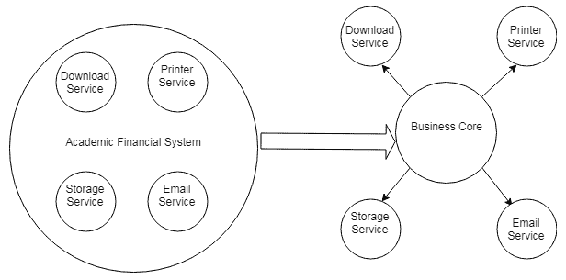

在创建技术微服务时，我们必须小心不要将其中的业务功能一起携带。

一旦采取这种第一种方法，我们仍然有一个代表核心业务的单体块。我们可以根据业务能力或用例对这个块进行分解，也可以发现具有明确定义接口的新业务模块。然后我们可以有如**学生状态服务**、**教授服务**、**学院活动服务**和**财务学生服务**等模块。此外，我们还可以有更细粒度的业务微服务，如**票务支付服务**。

让我们看看下面的图：

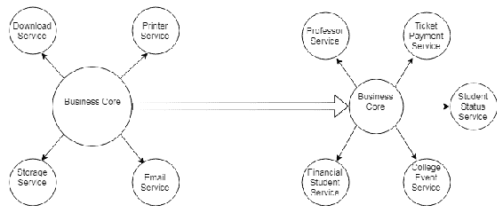

同样，业务相关的微服务不应承担其他微服务候选模块的责任。这意味着我们必须看到每个微服务的大小，这与它们自己的责任相关。微服务应该承担较少的责任，体现为一个内聚的服务（我们始终要记住单一职责原则）。避免依赖服务的一种方法是要记住微服务的独立性。如果有两个微服务需要一起部署，或者一个没有另一个就无法存在，那么这些服务很可能只有一个服务。

获取这种分解的另一种方法是设计我们的应用程序为六边形模型，我们将在下一节中看到。

# 为应用程序建立六边形模型

典型应用将它的各种功能模块保持在一起。通常，这种典型应用具有六边形结构或架构（我们将在后面看到六边形架构的更好定义），核心业务位于结构中心。核心业务包含应用提供的所有服务的管理。还有与核心外部各种组件的链接，如消息服务、数据库、客户端机器等。这些与外部世界的连接具有特定的适配器和协议，如数据库适配器、REST API、Web API、消息 API、WebSocket 协议等，如下面的图所示：

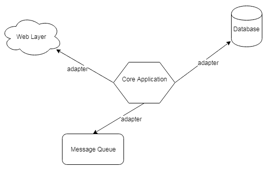

六边形模型背后的思想是将应用程序的核心领域从对技术基础设施的访问中隔离出来，例如数据库、消息队列、存储等。正如之前所述，一旦核心领域被隔离，我们就可以更深入地分析它，并尝试提取与业务相关的服务。

# 基于微服务的应用的优缺点

就像任何其他技术一样，使用基于微服务的架构既有优点也有缺点。在微服务的实施过程中可能会出现一些问题，但优点可以克服开发过程中遇到的复杂性。

微服务架构的优势如下：

+   小型多任务团队。

+   服务可以用不同的语言编写。这是一个优点，因为根据服务，一种特定的语言可能比另一种语言提供更多获取服务所提供功能性的工具。

+   部署更快，集成更自动化。需求变更意味着只需部署相关的微服务。

+   最新的库、框架和技术可以快速使用。

+   更高的容错性。

+   微服务与产品相关，而不是与项目相关。开发者有更多的自由，因此可以更快地开发服务。

+   微服务的知识可以更快地传递给开发团队。因此，必要的代码更改和维护可以更快地进行。

以下是一些微服务架构的缺点：

+   微服务的独立性可能带来复杂性，因为服务在通信和数据方面可能采用不同的协议。

+   微服务的增加使得对这些服务的控制和管理工作更加复杂。例如，为了保持容错性，必须投入更多的编程工作。

+   除了不同协议的服务问题外，由于某些应用功能可能涉及对多个微服务的调用，这加剧了网络流量，因此服务之间的通信也更加复杂。在这些情况下，开发者应使用 API 网关等工具和策略。

+   事务控制是一个复杂因素，尤其是在从单体系统迁移到基于微服务的架构时——例如，在特定功能或用例需要多个微服务的情况下。

+   每个微服务都在单个进程中运行，这意味着增加内存消耗。

+   由于应用程序分布在微服务中，测试变得更加困难。

# 微服务架构模式

到目前为止，我们已经看到微服务架构基于功能分解，产生了独立、自给自足的服务，这些服务可能以不同的方式使用定义良好的接口与外界通信。这有利于低耦合和定义良好的功能，允许高内聚（定义良好的责任和较少的功能）。 

尽管服务独立运作，但这些服务的目的是创建一个应用程序——即一组与业务相关的功能。

基于这些特性，我们可以提取一些可用于微服务架构实现的模式。以下是一些这些模式：

+   聚合模式

+   代理模式

+   链模式

+   分支模式

+   异步消息模式

# 聚合模式

正如其名所示，此模式建立了存在或创建一个相对更复杂的服务，该服务调用更多内部服务的功能。因此，此聚合微服务充当一个中介服务，是其他微服务的组合，从意义上讲，它调用微服务，从每个微服务获取单个响应，并应用必要的业务规则，将最终响应返回给客户端。让我们看一下以下图示：

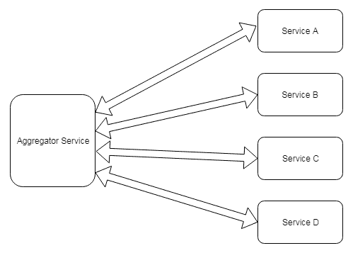

此图似乎表明解决方案的某些部分被重复，这表明存在设计模式。我们可以将此与充当业务外观的微服务进行比较，该服务调用特定的微服务以在应用业务层面执行更复杂的功能。在更大规模上，此聚合器微服务可能作为被更高层级的聚合器微服务调用的微服务个体。显然，对应用业务规则有深入了解至关重要。

# 代理模式

此模式是聚合器模式的一种变体，但有一个重要区别。对于所有内部微服务没有数据收集，这意味着没有聚合。代理模式将调用指向特定的微服务，请求的分析决定了应该调用哪个微服务（这是代理模式典型的行为）。

然而，在实现此代理的过程中可能有一些好处。在将响应返回给客户端之前，可能会有将此响应转换为请求客户端期望的格式的转换。记住，不同的客户端（包括网络浏览器、移动设备等）都可以发起请求。让我们看一下以下图示：

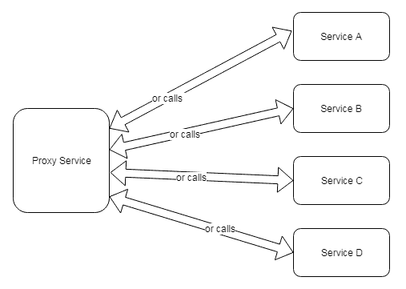

我们现在可以明白为什么 API 网关明显基于聚合器和代理模式。

# 连接模式

连接模式的目的在于通过一系列按顺序通信的服务，向客户端提供一个更一致和明确的最终响应。这样，作为链中第一个服务的**服务 A**与**服务 B**通信。**服务 B**与**服务 C**通信，依此类推。调用是同步的，客户端在最终响应从**服务 A**返回到客户端之前保持锁定状态。

在这里需要注意的是，到达链式服务的请求可能不同。因此，从**服务 A**发送到**服务 B**的请求可能与从**服务 B**发送到**服务 C**的请求非常不同，依此类推。同样，服务的响应也可能不同。从**服务 C**到**服务 B**的响应可能与从**服务 B**到**服务 A**的响应不同。

让我们看一下以下图示：


这个实现的实际例子是生成用于打印银行支票的数据。假设一家银行提供了两个 SOAP 网络服务。一个是用于在银行注册银行支票数据的，另一个是用于获取已注册在银行的银行支票数据。我们的应用程序包含两个定义好的微服务——**服务 A**，它将银行支票数据注册到数据银行（即，它调用第一个注册网络服务）；以及**服务 B**，它获取最终的银行支票数据，如条形码（意味着它调用第二个查询网络服务），并返回用于银行支票生成的数据。

客户端应用程序通知**服务 A**用户的银行数据。**服务 A**负责与金融机构注册，并在注册返回后，**服务 A**向**服务 B**发出请求。**服务 B**随后获取用于生成银行支票的最终数据。**服务 B**将此数据传递给**服务 A**，然后它可以对该数据进行一些转换，并将其返回给客户端。

同样的例子可以使用聚合器模式实现。然而，每当需要按顺序执行步骤以生成最终响应时，我们可以将链模式视为解决方案。

# 分支模式

分支模式作为聚合器模式的扩展，可以并行调用不同的服务链。在分支模式实现示例中，一个称为**服务 A**的初始服务被客户端调用，并可以作为聚合器，调用服务链来组合响应。或者，根据请求，调用特定的服务链，从而充当代理模式。让我们看看以下图表：

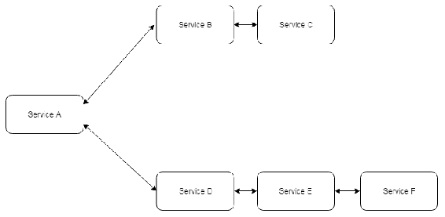

实际上，链模式与分支模式之间的主要区别在于调用不同的微服务链。然而，如果我们进行抽象，并将每个链视为一个独立的微服务，本质上，我们将有一个聚合器或代理模式。

# 异步模式

当我们从实际的角度考虑微服务时，我们立刻会想到使用 REST 协议实现的微服务。然而，基于 REST 模式的微服务是同步的，因此是阻塞的。有时，我们需要可以异步调用的微服务。异步机制是通过针对每个应用程序特定的技术（消息队列、发送异步事件等）开发的。让我们看看以下图表：

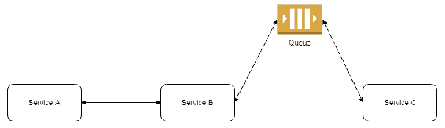

**服务 A** 从客户端接收请求并以同步方式调用**服务 B**。然而，**服务 B**依赖于**服务 C**，并通过消息队列异步调用它，例如。**服务 C**从队列中读取消息，进行必要的逻辑处理，并使用队列机制向**服务 B**返回响应。（我们应始终牢记被调用服务的独立性。）

**服务 B** 和 **服务 C** 之间的一种通信方式是**服务 B**向`QRequest`队列发送请求消息，并监听来自`QReply`队列的响应。然后**服务 C**从`QRequest`队列中读取请求消息，执行必要的处理，并将响应发送到`QReply`队列。**服务 B**从`QReply`队列中读取响应消息，应用转换或添加其他信息，然后将响应发送给**服务 A**。很明显，应该考虑具体实现的细节，例如等待**服务 C**超时。

# 实现微服务

我们示例中微服务实现的思路是实现一个微服务，为客户端提供银行数据以生成支付凭证。返回的数据将是支付凭证的条形码。

银行提供两个 SOAP 网络服务，一个用于将支付凭证注册到银行，另一个用于提供已注册的支付凭证生成数据。因此，我们将创建两个微服务，一个用于注册支付凭证数据，另一个用于查询已注册的支付凭证。 这些微服务中的每一个都将调用相关的网络服务。接下来，我们将构建一个更复杂的第三个微服务，它将添加两个调用：一个调用注册微服务，另一个调用检索已注册的内容。让我们看看以下图表：

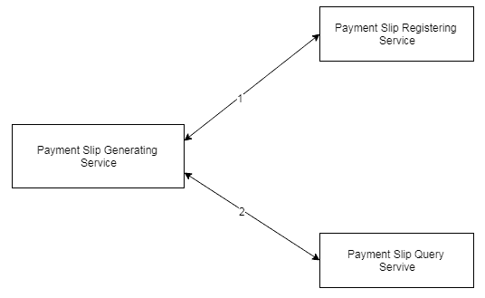

实际上，我们在这里可以创建一个微服务链；然而，我们选择了聚合器模式，因为我们假设可能有多个支付凭证已经被批量注册。

我们将创建三个类——每个微服务一个。每个微服务都将实现为一个 REST 资源。为了使代码更简单，我们为注册和查询微服务只使用一个请求类和一个响应类。 为了简化代码，我们只使用一个请求类和一个响应类来处理这两个微服务；注册和查询微服务。

支付凭证注册类如下：

```java
@Path ("/register")
public class PaymentRegisterService {
    @Path ("/paymentSlip/")
    @POST
    @Produces (MediaType.APPLICATION_JSON)
    @Consumes (MediaType.APPLICATION_JSON)
    public Response register (RequestVO requestVO) {
       // calls the bank register web service:
       // ...
       // Prepare the response with the register web service data:
       ResponseVO responseVO = new ResponseVO();
       responseVO.setRegisterNumber (7554433452L); // this is a simulation    //because this information must be returned from the bank's web service 
       responseVO.setUserName (requestVO.getUserName());
       responseVO.setValue (requestVO.getValue());
       responseVO.setStatus ("OK"); // everything is supposed to be correct
       return Response.ok (responseVO).build();
    }
}
```

以下为支付凭证查询类：

```java
@Path ("/query")
public class PaymentQueryService {
    @Path ("/paymentSlip/")
    @POST
    @Produces (MediaType.APPLICATION_JSON)
    @Consumes (MediaType.APPLICATION_JSON)
    public Response query (RequestVO requestVO) {
        // calls the bank query web service:
        // ...
        // Prepare the response with the query web service data:
        ResponseVO responseVO = new ResponseVO();
        responseVO.setCodeBar("8888999977776666");// this is a simulation //because this information must be returned from the bank's web service 
        responseVO.setUserName (requestVO.getUserName());
        responseVO.setStatus ("OK"); // everything is supposed to be correct
        responseVO.setValue(requestVO.getValue());
        return Response.ok (responseVO).build();
    }
}
```

以下为聚合器类：

```java
@Path ("/bank")
public class PaymentSlipGenerating {
    private static String BASE_PATH = "http://localhost:8080/microservice/ws";
    @Inject private UserService userService;
    private Response callMicroservice (String path, Object entity) {
        Client client = ClientBuilder.newClient();
        WebTarget target = client.target (BASE_PATH);
        Response resp = target.path (path).request().post(Entity.json (entity));
        return resp;
    }
    @Path ("/paymentSlip/{id}/{value}")
    @GET
    @Produces (MediaType.APPLICATION_JSON)
    public Response getPaymentSlipData (@PathParam("id") long id,  @PathParam("value") String strValue) {
        // get the payment slip value:
        double value = convertToValue (strValue);
        // get the user information from local DataBase:
        User user = userService.getUserById (id);

        // prepare the payment slip registering request:
        RequestVO registerRequest = new RequestVO();
        registerRequest.setUserCode (user.getCode());
        registerRequest.setUserName (user.getName());
        registerRequest.setValue (value);
        // call registering microservice:
        Response resp = callMicroservice ("/register/paymentSlip", registerRequest);
        ResponseVO responseRegisterVO = resp.readEntity (ResponseVO.class); 
        // prepare the payment slip query request:
        RequestVO queryRequest = new RequestVO();
        queryRequest.setUserName(registerRequest.getUserName());
        queryRequest.setRegisterNumber (responseRegisterVO.getRegisterNumber());
        queryRequest.setValue (value);
        // call query microservice:
        resp = callMicroservice ("/query/paymentSlip", registerRequest);
        ResponseVO responseQueryVO = resp.readEntity (ResponseVO.class); 

        return Response.ok (responseQueryVO).build();
     }
}

```

任何客户端都可以调用这个聚合器微服务以获取条形码和其他信息，从而生成支付凭证。

# 摘要

在本书的几乎每个部分，我们都表明，除了是常见问题的解决方案外，模式还旨在实现应用组件的重用和低耦合。遵循这一原则，将应用分解成执行智能和特定任务的小独立部分，使该应用能够以自然和有序的方式进化。这些执行特定任务的小部分被称为微服务，而基于将应用分解成这些小部分来开发系统的方法被称为微服务架构。

然而，像任何技术一样，这种技术也有其优缺点。开发应用并考虑各种微服务的控制是一个复杂任务，但一旦微服务定义得很好，应用就能比单体应用更好地进化。这样，应用的维护就更快，新功能的添加和现有功能的更新也更快。

由于微服务的去中心化，新框架、API 和库的引入速度大大加快。教给未来的开发团队微服务也更快、更简单，部署也更快，因为不需要因为应用某一部分的改变而重新部署整个应用。我们还研究了名为 API 网关的机制。API 网关根据微服务为应用的各种客户端建立了一种前端，将客户端的调用转换为对微服务的调用。

最后，在这一章中，我们探讨了在微服务架构开发中使用的某些主要设计模式，例如聚合器模式、代理模式和链式模式。

下一章，第八章，*云原生应用模式*，将讨论云原生应用模式。在这里，我们将研究云应用，以及开发云应用时必须遵循的一些关键模式。
