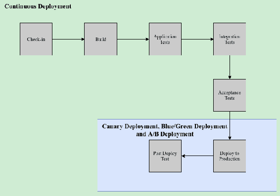
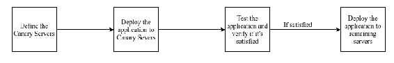
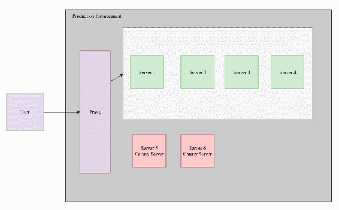
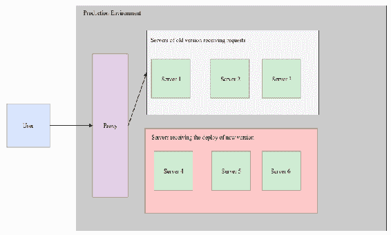
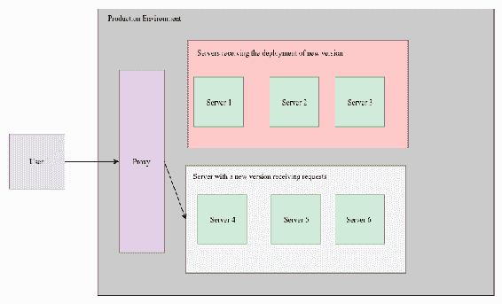
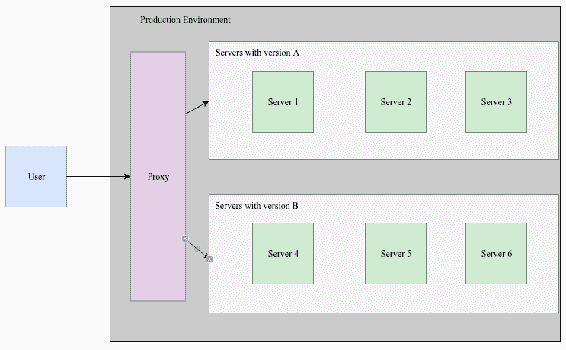
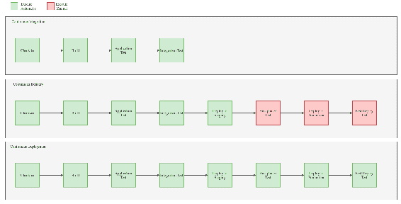

# 部署模式

在本章中，我们将探讨部署模式，为什么我们会使用它们，以及它们如何影响应用程序的交付。我们还将涵盖金丝雀部署、蓝绿部署、A/B 部署和持续部署的概念。阅读本章后，我们应该熟悉部署模式的概念。本章我们将涵盖以下主题：

+   部署模式的概念

+   金丝雀部署的概念

+   蓝绿部署的概念

+   A/B 测试的概念

+   持续部署的概念

# 解释部署模式的概念

应用程序不断接收更新，这些更新旨在创建新功能或纠正任何问题。这些新功能和更新需要推广到生产级别，而不会造成任何问题或延迟服务。此外，有时需要将应用程序的新版本交付给特定用户群体，例如某些国家或某些业务领域的用户。

当我们在这个背景下谈论*交付*时，我们是指将应用程序的新版本发布到生产环境中。一个软件项目有各种步骤需要评估和考虑，以便允许交付优质的软件。

这些步骤包括遵循良好的流程以获得业务角色、测试应用程序的良好流程、开发应用程序代码的良好流程以及将项目交付到生产环境的良好流程，这是项目的目标。所有软件项目都有一个重要的共同目标——在不产生任何附带影响的情况下交付优质、高质量的软件。特别是部署步骤是一个非常重要的步骤，因为这是软件交付的时候；项目的整体目标将在这里实现，但如果发生任何错误，则所有项目都可能受到影响。因此，部署模式应运而生。

部署模式（也称为**部署策略**）是一组针对常见部署相关问题的解决方案。这些模式使部署过程更安全，并降低新版本中发生错误的可能性。一些部署模式的例子包括：

+   +   金丝雀部署

    +   蓝绿部署

    +   A/B 测试

持续部署也是一种部署模式，但我们没有将其包括在列表中，因为它是最全面的方法，它创建了一个管道并在交付的所有步骤中工作。此外，持续部署更准确地描述了自动化开发阶段的解决方案，并且可以与之前列出的任何部署模式一起使用。因此，我们提到的模式在较小的范围内工作，而持续部署模式在较大的范围内工作。在以下图中，您可以了解这两种类型的部署模式是如何工作的，以及它们遵循的阶段：

在某些文献中，持续部署的概念与持续交付的概念一起被覆盖。这是因为这两个概念非常相似，它们之间只有一些细微的差别。这些概念的差异将在本章的“解释金丝雀部署的概念”部分详细展示。

# 解释金丝雀部署的概念

如前所述，当我们编写应用的新版本时，我们需要在不停止或以任何方式延迟服务的情况下交付它。因此，一个重要的步骤是首先部署和测试新版本。如果发生错误，我们需要回滚部署并维护应用的旧版本，直到解决新版本中的任何问题。金丝雀部署就是为了解决此类部署相关的问题而创建的。

金丝雀部署是一种部署模式，它允许我们将应用的新版本交付给服务器子集。然后，可以测试应用的新版本，如果发生错误，则交付回滚并保持旧版本，将新版本传播到剩余服务器。在此模式中，我们可以定义一些服务器为金丝雀服务器。部署首先在金丝雀服务器上发生，之后在金丝雀服务器上进行测试。如果满意，新版本将被传播（或部署）到剩余服务器。此模式包括以下四个基本步骤：

1.  定义金丝雀服务器

1.  将应用部署到金丝雀服务器

1.  测试应用并验证它是否满足我们的标准

1.  将应用部署到剩余服务器

以下图示展示了这些步骤的视觉表示：

要将金丝雀部署作为交付应用的解决方案，您首先需要配置一个代理，该代理将请求重定向到非金丝雀服务器。以下图示展示了金丝雀部署的工作原理：

# 定义金丝雀服务器

在此步骤中，将选择一些服务器作为金丝雀服务器，这是在剩余服务器上部署应用后用于测试新版本的服务器。在此，我们选择哪些服务器应该是金丝雀服务器。确保所有金丝雀部署步骤完成而不影响访问应用的用户非常重要。在创建定义时需要考虑的一些重要问题如下：

+   我们是否想要测试应用在多个服务器实例中的行为？

+   我可以使用多少服务器作为金丝雀服务器而不会影响用户访问？

+   我的程序与同一环境中的新版本和旧版本程序的工作情况如何？

+   将执行哪些测试？

使用的金丝雀服务器数量非常重要，所以我们建议金丝雀服务器的数量不超过生产环境中服务器总数的 50%。此外，在定义金丝雀服务器的数量时，我们需要决定我们将测试哪些场景。无论我们是否测试应用程序与多台服务器良好工作的能力，我们仍然至少需要两个金丝雀服务器。使用两个金丝雀服务器通常是一个好主意，因为这个数字很少会超过生产环境中服务器总数的 50%。换句话说，生产环境中的服务器总数通常大于四台。如果我们假设在生产环境中使用两个服务器作为金丝雀服务器时，总共有四台服务器，那么其他两台服务器将用于访问应用程序的旧版本。根据访问用户数量，应用程序不应该有任何性能问题。

# 将应用程序部署到金丝雀服务器上

当应用程序部署在金丝雀服务器上时，用户无法访问金丝雀服务器，代理也无法将请求重定向到这些服务器。此时，生产环境保持两个应用程序版本——旧版本和新版本。应用程序需要准备在相同环境中与两个版本一起工作。请注意，在这种情况下，用户不会失去对应用程序的访问，新版本的部署以透明的方式完成，且不会影响用户。

# 测试应用程序并验证其是否满足我们的标准

在此步骤中，通过评估某些过程来测试应用程序是否满足我们的标准，例如与其他应用程序集成、CPU、内存、磁盘使用率和数据库连接。这些测试可以通过自动化测试、内部用户或少数最终用户来完成。如果在这一步骤中发现错误，则部署将被中止并回滚，金丝雀服务器将接收旧版本，然后提供给最终用户。

# 将应用程序部署到剩余的服务器上

此步骤仅在应用程序已被批准并验证为满意的情况下初始化。当此步骤开始时，金丝雀服务器成为最终用户访问的服务器；其他服务器不会在此接收新的请求，因为部署过程已经开始。然后代理将所有最终用户的请求重定向到具有新版本（换句话说，金丝雀服务器）的服务器，并开始另一个服务器的部署。一旦部署完成，所有服务器都能够接收来自最终用户的访问。

使用金丝雀部署时，最终用户不应意识到正在发生部署。只有在接口发生变化，或者某些功能对用户可用或不可用时，用户才会意识到。

# 解释蓝/绿部署的概念

蓝绿部署在某种程度上与金丝雀部署相似，因为它使用分区过程部署应用程序的新版本。蓝绿方法将应用程序部署到生产环境中的服务器子集，然后将新版本传播到剩余的服务器。这种部署模式在目标上与金丝雀部署不同，因为蓝绿部署的目标是在部署期间减少应用程序的停机时间。然而，金丝雀部署的目标是减少与新版本相关的生产环境中错误的发生。此外，在金丝雀部署中，生产环境可以同时保留新版本和旧版本并接收请求，而在蓝绿部署中，只有一个版本响应请求。

**蓝绿部署**是一种部署模式，它使得在不对最终用户使应用程序失效的情况下部署应用程序的新版本成为可能。使用此模式，部署通过一组服务器进行。如果部署成功完成，则剩余的服务器将进行部署。

此模式有三个步骤：

1.  定义接收首次部署的服务器组

1.  将应用程序部署到一组服务器

1.  将应用程序部署到剩余的服务器

# 定义接收首次部署的服务器组

在蓝绿部署中，定义接收首次部署的服务器组非常简单，因为不会运行任何测试，也不会进行检查；部署过程只需成功完成即可。一个良好的做法是将生产环境分为两组服务器，并选择其中一组首先接收部署。每个组通常将拥有大约 50%的生产服务器。

# 将应用程序部署到一组服务器

在此步骤中，请求被重定向到该组的服务器，以便进行部署，并且要部署的组接收新版本应用程序的部署。在此期间，要部署的组的所有服务器都将处于“死亡”状态，并且只有在组内的部署过程完成后才会响应请求。以下图表说明了此过程的示例：

# 将应用程序部署到剩余的服务器

只有当部署过程成功完成，并且选择了接收首次部署的组时，此步骤才会启动。当此步骤启动时，选择接收首次部署的服务器组返回活动状态，并且所有由最终用户发送的请求都由部署了新版本的这个组的服务器处理。然后初始化剩余服务器的部署，并且在部署完成之前，剩余的服务器处于“死亡”状态。当部署完成后，所有服务器都将能够接收和处理请求，并且所有服务器都将保持应用程序的新版本。此过程在以下图表中展示：

# 解释 A/B 测试的概念

我们有时可能会更新我们的应用程序，并希望检查其对最终用户及其行为的影响。通常，这类更新与应用程序的可用性或受欢迎程度有关，并关联到 UI 更改。为了使我们能够检查更新对应用程序的影响，我们需要创建一组最终用户组，他们将收到新的更新并要求评估它们。我们之前讨论的部署模式并不能解决我们的问题，因为它们无法将应用程序的新版本推向一个单独的最终用户组。尽管它们允许我们在一个分离的组中测试应用程序的功能，但那个组并不持久。

然而，A/B 测试是一种部署模式，它允许我们仅将应用程序的新版本推向选定的最终用户组。这使得我们能够评估应用程序新版本对最终用户的影响，从而决定是否将其推向所有最终用户。这种部署模式在 Facebook、LinkedIn 和 Twitter 等流行应用程序中普遍使用，因为这些应用程序在其功能在用户中受欢迎时最为成功。此模式可以通过应用级开关或通过将最终用户重定向到相应应用程序的代理来实现。以下图表展示了 A/B 测试模式的示例：

此模式需要以下四个步骤：

1.  定义一组接收应用程序新版本的最终用户

1.  定义接收新版本的服务器

1.  将应用程序的新版本部署到选定的服务器

1.  评估应用程序新版本的影响

# 定义一组最终用户

在此步骤中，我们选择一组最终用户以接收应用程序的新版本。为了定义此组，需要评估多个因素。其中一些评估包括：

+   新版本中存在的功能

+   最终用户的本地化

+   业务角色

为 A/B 测试所选的最终用户需要由应用程序定义并标记，以便它可以区分能够访问新版本的最终用户和无法访问的用户。这可以通过使用 cookie、如果组与位置相关则通过 IP 地址过滤，或者使用其他授予最终用户访问新版本权限的机制来完成。

# 定义接收新版本的服务器

在这一步，我们定义将接收新版本部署的服务器组。接收部署的服务器选择和数量需要根据能够访问新版本的最终用户百分比来评估。根据各种场景，我们还应该评估用户的本地化情况。

# 部署新版本

在这一步，我们将新版本的应用程序部署到所选的服务器组。然后这些服务器将变为无效，部署将开始。在这一步，建议使用金丝雀部署或蓝绿部署来最小化错误的可能性。一旦部署完成，我们将允许所选的最终用户访问应用程序的新版本。

# 评估新版本的影响

在这一步，我们评估应用程序新版本的影响。这一步可以使用许多不同的工具和技术来完成，其使用取决于我们对于新功能的目标是什么，涉及这些新功能的角色是什么，以及根据业务逻辑可能出现的任何其他问题。这项任务通常包括收集数据并分析它以验证最终用户使用新功能的方式。评估完成后，我们就可以决定是否将新版本推向剩余的最终用户，或者从应用程序中移除他们。

# 解释持续部署的概念

向用户交付发布版本的过程包括重要的步骤，我们有时可以通过手动过程完成这些步骤。世界正在快速发展，因此发布交付也需要迅速。考虑到这一点，自动化流程是提高发布交付速度的绝佳解决方案；因此，持续部署作为持续交付的演变而产生，而持续交付本身又是持续集成的演变。

持续部署是一种部署模式，它创建了一个管道，其中每个步骤都通过自动化过程执行。所有步骤都将在没有人为干预的情况下执行。如果新的发布版本进入管道，除非发生错误，否则所有步骤都将自动执行。重要的是要知道，持续部署不是持续交付或持续集成——尽管这些部署模式有许多相似之处，但它们都是不同的。它们之间的主要区别在于自动化程度；例如，持续集成比持续交付更自动化，而持续交付又比持续部署更自动化。以下图表说明了这两种部署模式的管道以及它们的自动化程度：

持续部署的主要目标是最大限度地减少发布开发与在生产环境中交付之间的时间。它自动化了开发者的步骤，以最大限度地减少人为错误的可能性并使交付更安全。正如所讨论的，持续部署可以与蓝绿部署、金丝雀部署和 A/B 测试一起使用，这些模式将在*部署到生产*和*部署后测试*步骤中发挥作用。

要实现持续部署，必须拥有良好的测试文化。这是因为测试的质量将决定发布版本的质量以及其实施的成功。此外，文档需要与所有新版本一起更新，确保应用程序的所有更新都反映在文档中。

# 摘要

在本章中，我们介绍了部署模式，包括金丝雀部署、蓝绿部署、A/B 测试和持续部署。我们还讨论了使用这些部署模式的原因以及如何决定它们最佳的使用方式。

在*解释部署模式的概念*部分，我们探讨了部署模式的基本概念，并研究了它们在商业环境中的应用。同样，在*解释金丝雀部署的概念*、*解释蓝绿部署的概念*、*解释 A/B 测试的概念*和*解释持续部署的概念*部分，我们探讨了每种模式是什么以及为什么使用它们。最后，在*解释持续部署的概念*部分，我们讨论了持续集成、持续交付和持续部署之间的区别。

在下一章中，我们将介绍操作模式、性能和可扩展性模式以及管理和监控模式的概念。
