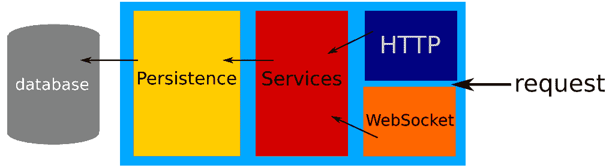
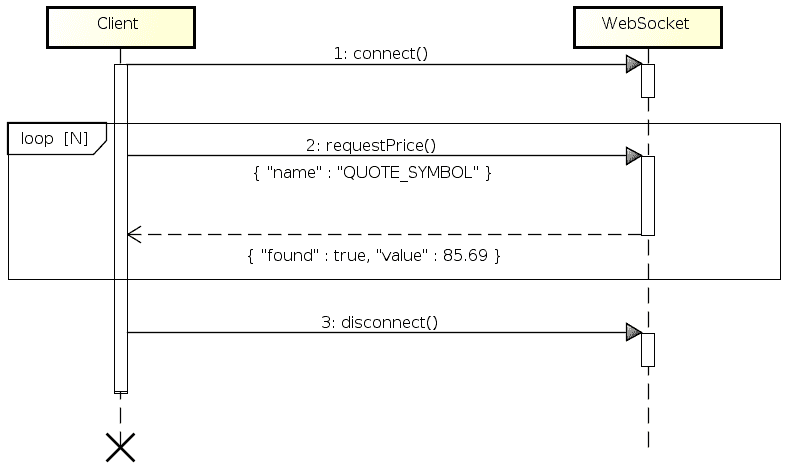

# 货币 – 引用管理器应用程序

在评估和增强您应用程序的性能之前，您确实需要一个应用程序。在本部分中，我们将创建一个小应用程序，我们将用它来展示本书的每个部分。本章的目的不是解释创建 Java EE 应用程序所需的全部步骤。它将给出总体步骤并确保后续步骤的引用将是明显的。

本应用程序的使用案例将是一个微服务，它提供一组网络服务来管理股票和股份。因此，本章将向您介绍应用程序环境：

+   应用程序代码结构

+   数据库设置

+   数据持久化

+   通过 HTTP 暴露数据

+   部署您的应用程序

# 设置环境

在开始编写代码之前，请确保您有一个准备好的 Java EE 工作环境。我们需要一个 **Java 虚拟机 8**（**JVM 8**）以及更具体地说，**Java 开发工具包** **8**（**JDK 8**）。作为一个快速提醒，Java EE 版本 *V* 基于 **Java 独立版**（**Java SE**）版本 *V*。您可以在 Oracle 网站上下载 JDK（[`www.oracle.com/technetwork/java/javase/downloads/jdk8-downloads-2133151.html`](http://www.oracle.com/technetwork/java/javase/downloads/jdk8-downloads-2133151.html)）。

或者，您可以在 OpenJDK 项目网站上下载 JDK 的 OpenJDK 版本（[`openjdk.java.net/install/`](http://openjdk.java.net/install/)），但我建议您使用 Oracle 版本。我们将在本书的后续章节中讨论这个问题。

不要忘记接受许可协议并选择适合您操作系统的正确发行版（Windows、Linux 或 macOS）。

现在我们有了 JDK，我们需要一个工具来构建我们的应用程序并将其转换为可以在我们的 Java EE 服务器上部署的格式。本书将使用 Apache Maven（[`maven.apache.org/`](https://maven.apache.org/)）来构建应用程序。它可以在 Apache Maven 下载页面上下载（[`maven.apache.org/download.cgi`](https://maven.apache.org/download.cgi)）。我们需要二进制发行版；Linux 用户必须选择 `tar.gz` 格式，而 Windows 用户必须选择 `.zip` 归档。

到目前为止，我们已经拥有了创建我们应用程序所需的一切。您可能希望有一个 **集成开发环境**（**IDE**），例如 NetBeans（[`netbeans.org/`](https://netbeans.org/)）、Eclipse（[`eclipse.org/ide/`](https://eclipse.org/ide/)）或 Intellij Idea（[`www.jetbrains.com/idea/`](https://www.jetbrains.com/idea/)）。由于本书更多地关于性能而不是开发，我们不会深入讨论 IDE。如果您需要，只需选择您最熟悉的即可。

为了确保环境已准备就绪，我们将设置变量以定义软件的位置，而无需每次都使用完整的二进制文件或脚本的完整路径。`JAVA_HOME` 将指向您从 JDK 中提取的文件夹，而 `MAVEN_HOME` 将指向您从 Apache Maven 存档中提取的文件夹。以下是一个 Linux 的示例（对于 DOS shell，请将 `export` 替换为 `set`）：

```java
$ export JAVA_HOME=/home/developer/jdk1.8.0_144
$ export MAVEN_HOME=/home/developer/apache-maven-3.5.0
```

现在，我们需要确保 JDK 和 Maven 工具可用。为此，我们将它们添加到 Linux 的 `PATH` 和 Windows 的 `Path` 中：

```java
# On Linux
$ export PATH=$JAVA_HOME/bin:$MAVEN_HOME/bin:$PATH

# On Windows
$ set Path=%JAVA_HOME%\bin;%MAVEN_HOME%\bin;%Path%
```

您可以通过执行以下命令来验证您的设置：

```java
$ mvn -version
Maven home: /home/developer/apache-maven-3.5.0
Java version: 1.8.0_144, vendor: Oracle Corporation
Java home: /home/developer/jdk1.8.0_144/jre
Default locale: fr_FR, platform encoding: UTF-8
OS name: "linux", version: "4.10.0-32-generic", arch: "amd64", family: "unix"
```

要运行 Java EE 应用程序，我们还需要一个容器，例如 GlassFish、WildFly、WebSphere Liberty Profile 或 Apache TomEE。由于部署是特定的，Java EE 8 非常新，我们将在这本书中使用 GlassFish。

最后，为了使一切准备就绪，我们将使用数据库。我们将使用 MySQL 作为一个非常常见的案例，但任何其他关系型数据库也可以正常工作。您可以从 [`dev.mysql.com/downloads/mysql/`](https://dev.mysql.com/downloads/mysql/) 下载 MySQL，但大多数 Linux 发行版都将有一个可安装的软件包。例如，在 Ubuntu 上，您只需执行以下行：

```java
sudo apt install mysql-server
```

# 应用程序架构

我们的应用程序将每天导入一些股票报价；然后将其公开，并允许您通过 Web 服务进行更新。

为了实现它，我们将使用标准的 Java EE 架构：

+   持久层将使用 JPA 2.2 并将数据存储在 MySQL 数据库中。

+   服务层将实现业务逻辑并协调持久层。它将依赖于以下内容：

    +   **Java 事务 API** （**JTA**） 1.2 用于事务性

    +   **上下文和依赖注入** 2.0 （**CDI**） 用于 **控制反转** （**IoC**）

    +   Bean Validation 2.0 用于验证

+   前端层将通过 HTTP 公开服务层的一部分。它将依赖于以下内容：

    +   JAX-RS 2.1 用于无状态端点

    +   WebSocket 1.1 用于有状态通信

    +   JSON-B 1.0 用于序列化/反序列化

下面是一张总结此结构的图片：



# 应用程序项目亮点

为了能够创建和运行此应用程序，我们需要设置一个构建工具。对于本书，它将是 Apache Maven；然而，Gradle、Ant 或任何其他替代品也可以完美工作。然后我们将确定应用程序代码的一些关键部分，最后，我们将插入一些数据以确保在调查其性能之前我们的应用程序是可用的。

# 构建

Java EE 所需的唯一依赖项是 Java EE API：

```java
<dependency>
  <groupId>javax</groupId>
  <artifactId>javaee-api</artifactId>
  <version>${javaee-api.version}</version> <!-- 8.0 -->
  <scope>provided</scope>
</dependency>
```

如果您愿意，您确实可以注册所有单个规范，但这将需要更多的工作来维护与 Java EE 升级同步的列表。因此，通常更倾向于使用捆绑包。

这里，重点是确保提供 API，这意味着它将不会包含在交付物中，并将继承自服务器 API。提供与 API 相关服务的服务器还提供了与内置实现匹配的正确支持的版本和默认值。

自 Java EE 6 以来，Java EE 有两种主要版本：Web 版本和完整版本。Web 版本是一个轻量级版本，与完整版本相比，规格大约少一半。Web 版本仅支持 Web 应用程序和`war`文件。本书的大部分内容将使用 Web 版本服务器，因此我们将我们的应用程序打包为`war`：

```java
<packaging>war</packaging>
```

由于我们需要 Java 8，不要忘记在构建中配置 Java 源和目标版本。这可以通过不同的方式完成，但将`maven-compiler-plugin`配置如下是一种有效的方法：

```java
<plugin>
  <groupId>org.apache.maven.plugins</groupId>
  <artifactId>maven-compiler-plugin</artifactId>
  <version>3.6.1</version>
  <configuration>
    <source>1.8</source>
    <target>1.8</target>
  </configuration>
</plugin>

```

# 持久层

我们的数据模型将是简单的：一个*报价*将与一个*客户*相关联。这意味着一个*客户*可以查看一组*报价*，而*报价*可以被一组客户看到。在用例方面，我们希望能够货币化我们的 API 并让客户为访问某些报价价格付费。为此，我们需要为每个客户创建一种报价的白名单。

JPA 使用一个名为`persistence.xml`的描述符，位于资源（或 WEB-INF）的 META-INF 存储库中，它定义了`EntityManager`的实例化方式，这是一个允许操作我们模型的类。以下是我们的应用程序的示例：

```java
<persistence xmlns="http://xmlns.jcp.org/xml/ns/persistence"
             xmlns:xsi="http://www.w3.org/2001/XMLSchema-instance"
             xsi:schemaLocation="
             http://xmlns.jcp.org/xml/ns/persistence
              http://xmlns.jcp.org/xml/ns/persistence/persistence_2_2.xsd"
             version="2.2">
  <persistence-unit name="quote">
    <class>com.github.rmannibucau.quote.manager.model.Customer</class>
    <class>com.github.rmannibucau.quote.manager.model.Quote</class>
    <exclude-unlisted-classes>true</exclude-unlisted-classes>
    <properties>
      <property name="avax.persistence.schema
      -generation.database.action" value="create"/>
    </properties>
  </persistence-unit>
</persistence>
```

数据库和 Java 代码之间的链接是通过实体完成的。实体是一个**普通的 Java 对象**（**POJO**），它被`javax.persistence`注解装饰。它们主要定义了数据库和 Java 模型之间的映射。例如，`@Id`标记了一个必须与数据库标识符匹配的 Java 字段。

下面是我们的`Quote`实体的一个示例：

```java
@Entity
public class Quote {
    @Id
    @GeneratedValue
    private long id;

    private String name;

    private double value;

    @ManyToMany
    private Set<Customer> customers;

    // getters/setters
}
```

这个简单的模型隐式定义了一个具有三个列（*ID, NAME, VALUE*）（大小写可能取决于数据库）的*QUOTE*表，以及一个用于管理与*CUSTOMER*表关系的表，默认命名为`QUOTE_CUSTOMER`。

同样的精神，我们的`Customer`实体仅定义了标识符和名称作为列，以及与`Quote`实体的反向关系：

```java
@Entity
public class Customer {
    @Id
    @GeneratedValue
    private long id;

    private String name;

    @ManyToMany(mappedBy = "customers")
    private Set<Quote> quotes;

    // getters/setters
}
```

在这里重要的是要注意模型中的关系。我们稍后会处理这个问题。

# 服务层

由于本书的目的是讨论性能而不是如何编写 Java EE 应用程序，我们不会在这里详细说明整个服务层。然而，为了确保我们对所处理内容的共同理解，我们将用一个服务来展示代码。

我们使用 JTA 1.2 和 JPA 2.2 来在数据库和 Java 模型之间建立连接。因此，负责管理`Quote`持久性的`QuoteService`组件可以如下所示：

```java
@Transactional
@ApplicationScoped
public class QuoteService {
    @PersistenceContext
    private EntityManager entityManager;

    public Optional<Quote> findByName(final String name) {
        return entityManager.createQuery("select q from Quote q where
        q.name = :name", Quote.class)
                .setParameter("name", name)
                .getResultStream()
                .findFirst();
    }

    public Optional<Quote> findById(final long id) {
        return Optional.ofNullable(entityManager.find(Quote.class, id));
    }

    public long countAll() {
        return entityManager.createQuery("select count(q) from Quote
        q", Number.class)
                .getSingleResult()
                .longValue();
    }

    public Quote create(final Quote newQuote) {
        entityManager.persist(newQuote);
        entityManager.flush();
        return newQuote;
    }

    // ... other methods based on the same model
}
```

JPA 可能在事务性上下文中使用，也可能不使用，这取决于你进行的操作类型。当你*读取*数据时，你通常可以在不需要任何事务的情况下完成，直到你需要一些懒加载。然而，当你*写入*数据（插入/更新/删除实体）时，JPA 需要一个正在运行的事务来执行操作。这是为了确保数据的一致性，但也对代码有一些影响。为了遵守这一要求，并保持一个活跃的事务，我们在方法上使用`@Transactional`而不是依赖于**企业 Java Bean 3.2**（**EJB 3.2**），这样我们就可以重用 CDI（例如`@ApplicationScoped`，这将避免每次注入时创建一个新的实例）的力量。

我们的查找器非常简单，直接使用`EntityManager` API。Java 8 在这个代码中带给我们的唯一新功能是使用`Optional`包装结果的能力，这提供了一种程序化的方式来处理实体是否存在，而不是依赖于空值检查。具体来说，调用者可以使用我们的查找器这样：

```java
final int quoteCount = getCustomer().getCountFor("myquote");
final double quotesPrice = quoteService.findByName("myquote")
    .map(quote -> quote.getValue() * quoteCount)
    .orElse(0);
```

这种代码将条件分支隐藏在流畅的 API 之后，这使得代码更加易于表达和阅读，同时 lambda 表达式保持足够的小。

最后，我们在代码中使用了内联查询，而不是像在`@NamedQuery` API 中那样的静态查询。

# JAX-RS 层

如果我们退后一步，思考应用程序将执行哪些操作，我们可以识别出其中的一些：

+   HTTP 通信处理

+   负载（反）序列化

+   路由

+   服务调用

由于关注点分离原则，或者简单地说，由于层与层之间的技术约束，在 JAX-RS/前端层和 CDI/业务层之间使用数据传输对象（DTO）是非常常见的。当然，这个陈述也可以应用于业务子层，但在这个书中，我们只会在 JAX-RS 层这样做。为了在书中使其明显，我们将 JAX-RS 模型前缀为`Json`。查看以下代码片段：

```java
@JsonbPropertyOrder({"id", "name", "customerCount"})
public class JsonQuote {
    private long id;
    private String name;
    private double value;

    @JsonbProperty("customer_count")
    private long customerCount;

    // getters/setters
}
```

在这个上下文中，前端层的角色是将大部分逻辑委托给服务层，并将业务模型转换为前端模型（对于许多现代应用来说，这几乎可以看作是 Java 到 JavaScript 的转换）：

```java
@Path("quote")
@RequestScoped
public class QuoteResource {
    @Inject
    private QuoteService quoteService;

    @GET
    @Path("{id}")
    public JsonQuote findById(@PathParam("id") final long id) {
        return quoteService.findById(id) // delegation to the business
        layer
                .map(quote -> { // the model conversion
                    final JsonQuote json = new JsonQuote();
                    json.setId(quote.getId());
                    json.setName(quote.getName());
                    json.setValue(quote.getValue());

        json.setCustomerCount(ofNullable(quote.getCustomers())
        .map(Collection::size).orElse(0));
                    return json;
                })
                .orElseThrow(() -> new
                WebApplicationException(Response.Status.NO_CONTENT));
    }

    // other methods
}
```

我们将 JAX-RS 的`@ApplicationPath`设置为`/api`，以确保我们的端点部署在`/api`子上下文中。

# WebSocket 层

为什么使用 JAX-RS 和 WebSocket？它们不是有相同的作用吗？实际上并不完全相同，事实上，在同一个应用程序中使用两者变得越来越普遍，即使 WebSocket 仍然相对较新。

JAX-RS（以及更一般地，HTTP/1 和全新的 HTTP/2）通常是面向 Web 应用的。理解这一点，它通常用于需要与所有浏览器兼容的用户界面应用。它也常用于无法假设太多关于网络设置的环境。更具体地说，在无法假设网络设置的环境中，代理将允许 WebSocket 连接正常工作（要么完全阻止它们，要么过早地断开它们）。HTTP 基于的解决方案在许多情况下都很有意义，例如尝试针对一个市场，其中客户端可以用任何语言（Java、Python、Ruby、Go、Node.js 等）开发。事实上，这项技术今天在全球范围内传播，并且与无状态连接配合良好，这使得它更容易上手，因此比 WebSocket 更易于访问，因为 WebSocket 需要客户端开发者进行一些维护。

然而，WebSocket 适合那些有更高性能或反应性约束、需要维护状态以处理业务用例，或者你只是想从服务器推送信息而不需要客户端操作（如轮询）的情况。

当你开始使用如 WebSocket 这样的连接协议时，首先要定义的是你自己的通信协议：你发送/接收的消息格式以及消息的顺序（如果需要）。

我们的 WebSocket 层将负责使客户端能够快速访问报价价格。因此，我们将对客户端的请求做出反应（它将包含我们想要获取价格的报价名称）并且我们将提供两块信息：是否找到了报价以及当前价格（如果存在）。

然后，你需要选择一个格式来准备通过 WebSocket 发送的内容。在这里，选择通常由客户端（服务的消费者）、需求、性能和实现简便性之间的权衡来指导。在我们的案例中，我们将考虑我们的客户端可以用 Java 以及 JavaScript 编写。这就是为什么我们将使用 JSON。

为了总结协议，以下是一个完整的通信往返过程，如图所示：



在我们的案例中，通信协议基于单一的消息类型，因此客户端/服务器通信看起来像以下步骤：

1.  客户端将连接到服务器。

1.  客户端将根据其符号（名称/标识符）请求报价的价格 N 次。

1.  假设没有 I/O 错误或超时，客户端将触发断开连接，从而结束通信。

在代码方面，我们需要多个 Java EE 组件，并且需要以下内容来将它们组合在一起：

+   显然是 WebSocket API

+   JSON-B（我们可以使用 JSON-P，但它不太友好）用于 Java 到 JSON 的转换

+   CDI，用于将 WebSocket 连接到业务层

为了简单起见，我们可以对负载进行建模。我们的请求只有一个`name`属性，因此 JSON-B 允许我们这样定义它：

```java
public class ValueRequest {
    private String name;

    // getter/setter
}
```

在另一边（即响应），我们必须返回一个带有报价价格的`value`属性和一个标记`value`是否填充的`found`布尔值。在这里，JSON-B 也允许我们直接将此模型与一个普通的 POJO 进行映射：

```java
public static class ValueResponse {
    private double value;
    private boolean found;

    // getters/setters
}
```

现在，我们需要确保 WebSocket 能够按需反序列化和序列化这些对象。规范定义了`Encoder`和`Decoder` API 来实现这个目的。由于我们将使用 JSON-B 作为我们的实现后端，我们可以直接使用这些 API 的（I/O）流版本（称为`TextStream`）来实现它。实际上，在这样做之前，我们需要获取一个`Jsonb`实例。考虑到我们已经在 CDI 中创建了一个并使其可用，我们可以在我们的编码器中简单地注入该实例：

```java
@Dependent
public class JsonEncoder implements Encoder.TextStream<Object> {
    @Inject
    private Jsonb jsonb;

    @Override
    public void encode(final Object o, final Writer writer) throws EncodeException, IOException {
        jsonb.toJson(o, writer);
    }

    // other methods are no-op methods
}
```

由于 JSON-B API 非常适合这种用法，解码部分现在开发起来很快，我们将注意这一部分是针对`ValueRequest`的，因为我们需要指定要实例化的类型（与编码部分相比，编码部分可以动态确定它）：

```java
@Dependent
public class RequestDecoder implements Decoder.TextStream<ValueRequest> {
    @Inject
    private Jsonb jsonb;

    @Override
    public ValueRequest decode(final Reader reader) throws DecodeException, IOException {
        return jsonb.fromJson(reader, ValueRequest.class);
    }

    // other methods are no-op methods
}
```

现在我们有了处理消息的方法，我们需要绑定我们的 WebSocket 端点并实现`@OnMessage`方法，以便根据我们的业务层找到价格并将其发送回客户端。在实现方面，我们将响应一个`ValueRequest`消息，尝试找到相应的报价，填充响应负载，并将其发送回客户端：

```java
@Dependent
@ServerEndpoint(
  value = "/quote",
  decoders = RequestDecoder.class,
  encoders = JsonEncoder.class)
  public class DirectQuoteSocket {
  @Inject
  private QuoteService quoteService;

  @OnMessage
  public void onMessage(final Session session, final ValueRequest request) {
    final Optional<Quote> quote = quoteService.findByName(request.getName());
      final ValueResponse response = new ValueResponse();
        if (quote.isPresent()) {
            response.setFound(true);
            response.setValue(quote.get().getValue()); // false
        }

        if (session.isOpen()) {
            try {
                session.getBasicRemote().sendObject(response);
                } 
                catch (final EncodeException | IOException e) {
                throw new IllegalArgumentException(e);
            }
        }
    }
}
```

# 配置一些数据

到目前为止，我们有了我们的应用程序。现在，我们需要确保它有一些数据，然后继续评估其性能。

不深入业务细节，我们将分两步实现配置：

+   找到所有需要更新的符号

+   对于找到的每个符号，更新数据库中的价格

为了做到这一点，我们将使用两个公开的 web 服务：

+   [`www.cboe.com/publish/ScheduledTask/MktData/cboesymboldir2.csv`](http://www.cboe.com/publish/ScheduledTask/MktData/cboesymboldir2.csv)，以找到一组符号

+   [`query1.finance.yahoo.com/v10/finance/quoteSummary/{symbol}?modules=financialData`](https://query1.finance.yahoo.com/v10/finance/quoteSummary/%7Bsymbol%7D?modules=financialData)，以找到每个报价的当前价格

第一个是普通的 CSV 文件，我们将不使用任何库来解析它，以保持事情简单，因为该格式不需要特殊的转义/解析。第二个将返回一个 JSON 负载，我们可以直接使用 JAX-RS 2.1 客户端 API 读取。

这是我们检索数据的方式：

```java
private String[] getSymbols(final Client client) {
    try (final BufferedReader stream = new BufferedReader(
            new InputStreamReader(
                    client.target(symbolIndex)
                            .request(APPLICATION_OCTET_STREAM_TYPE)
                            .get(InputStream.class),
                    StandardCharsets.UTF_8))) {

        return stream.lines().skip(2/*comment+header*/)
                .map(line -> line.split(","))
                .filter(columns -> columns.length > 2 && !columns[1].isEmpty())
                .map(columns -> columns[1])
                .toArray(String[]::new);
    } catch (final IOException e) {
        throw new IllegalArgumentException("Can't connect to find symbols", e);
    }
}
```

注意，我们直接读取由 HTTP 响应流支持的缓冲读取器。一旦提取了符号，我们就可以简单地遍历它们并请求每个报价的价格：

```java
try {
    final Data data = client.target(financialData)
            .resolveTemplate("symbol", symbol)
            .request(APPLICATION_JSON_TYPE)
            .get(Data.class);

    if (!data.hasPrice()) {
        LOGGER.warning("Can't retrieve '" + symbol + "'");
        return;
    }

    final double value = data.getQuoteSummary().getResult().get(0)
        .getFinancialData().getCurrentPrice().getRaw();

    final Quote quote = quoteService.mutate(symbol, quoteOrEmpty ->
            quoteOrEmpty.map(q -> {
                q.setValue(value);
                return q;
            }).orElseGet(() -> {
                final Quote newQuote = new Quote();
                newQuote.setName(symbol);
                newQuote.setValue(value);
                quoteService.create(newQuote);
                return newQuote;
            }));

    LOGGER.info("Updated quote '" + quote.getName() + "'");
} catch (final WebApplicationException error) {
    LOGGER.info("Error getting '" + symbol + "': " + error.getMessage()
    + " (HTTP " + (error.getResponse() == null ? "-" :
    error.getResponse().getStatus()) + ")");
}
```

这段代码通过 JAX-RS 客户端 API 和 JSON-B 发送一个 HTTP 请求，它解包一个数据模型。然后，我们使用获得的数据更新我们的数据库报价，如果它已经存在；否则，我们使用这些数据创建数据库报价。

代码现在需要被连接起来以便执行。我们在这里有多种选择：

+   在启动时执行

+   定期执行

+   当端点被调用时执行

在本书的上下文中，我们将使用前两个选项。启动对我们来说很常见，即使它并不那么现实，因为一旦启动，我们就会得到一些数据。第二个选项将使用 EJB 3.2 的 `@Schedule`，它将每小时运行一次。

启动实现需要一个简单的 CDI 容器，当创建 `@ApplicationScoped`（在启动时）时调用之前的逻辑：

```java
@ApplicationScoped
public class InitialProvisioning {
    @Inject
    private ProvisioningService provisioningService;

    public void onStart(@Observes @Initialized(ApplicationScoped.class) final ServletContext context) {
        provisioningService.refresh();
    }
}
```

调度是通过企业 Java Bean `@Schedule` API 完成的，它允许我们通过一个注解请求容器定期执行一个方法：

```java
@Singleton
@Lock(WRITE)
public class DataRefresher {
    @Inject
    private ProvisioningService provisioningService;

    @Schedule(hour = "*", persistent = false, info = "refresh-quotes")
    public void refresh() {
        provisioningService.refresh();
    }
}
```

在实际应用程序中，你可能希望配置刷新频率并使用 `TimerService` API 根据应用程序配置触发执行。同样，根据配置可以忽略启动执行以实现更快的启动。

# 应用程序摘要

在处理性能时，始终需要记住两点：

+   应用程序业务（应用程序做什么）

+   应用程序技术栈（应用程序是如何设计的）

即使你对这两个点的信息非常高级，但在处理性能之前，确保你知道它们。

让我们用我们的应用程序来做这个练习，并确保我们知道如何回答这两个问题。

# 应用程序业务

我们的应用程序负责向 HTTP 或 WebSocket 客户端提供报价价格。凭借其模型和客户/报价关系，它可以使我们提供（或不对客户提供）价格，如果我们添加权限或规则，例如。在这个阶段，重要的是要看到这两个实体之间存在关系，并且我们的应用程序可以访问这个关系以满足其业务需求并触发关系实体的隐式延迟加载。

数据基于两个外部 HTTP 源（CBOE 和 Yahoo）注入到系统中。第一个提供报价的符号字典，第二个提供价格。

# 应用程序设计

技术上，报价和价格的提供是异步完成的（不是在客户请求发送时）。它使用 JAX-RS 2.1 客户端检索数据，并尽可能快地将其插入数据库。

访问应用程序是通过 HTTP 或 WebSocket 实现的。在两种情况下，应用程序都使用 JSON 格式进行消息交换。

# 应用程序服务器

Java EE 定义规范，因此你可以找到几个不同的实现。每个主要供应商都有自己的服务器，但当然，对我们和 Java EE 来说，许多服务器是完全开源的。由于 Java EE 8 非常新，我们将使用 GlassFish，它是参考实现，因此是第一个符合规范（它必须与规范一起发布）的实现。然而，有很多替代方案（如 Apache TomEE、Wildfly、Payara、Liberty Profile 等），它们可能会在未来几个月内出现。

你可以从其网站下载 GlassFish ([`javaee.github.io/glassfish/download`](https://javaee.github.io/glassfish/download))。我们需要 5.x 版本来针对 Java EE 8，但由于其早期发布，本书的大部分内容将使用之前的版本。

如果你想将其与你的开发环境（以及 Maven）集成，你可以将 GlassFish 仓库添加到 `pom.xml` 中，如下所示：

```java
<pluginRepository>
  <id>maven-java-net</id>
  <url>https://maven.java.net/content/groups/promoted/</url>
</pluginRepository>
```

在添加 GlassFish 插件时，不要忘记指定服务器的版本以覆盖默认版本，现在的默认版本相当老旧：

```java
<plugin> <!-- glassfish.version = 5.0 -->
  <groupId>org.glassfish.embedded</groupId>
  <artifactId>maven-embedded-glassfish-plugin</artifactId>
  <version>3.1.2.2</version>
  <configuration>
    <app>target/${project.build.finalName}</app>
    <port>9090</port>
    <contextRoot>${project.artifactId}</contextRoot>
  </configuration>
  <dependencies>
    <dependency>
      <groupId>org.glassfish.main.common</groupId>
      <artifactId>simple-glassfish-api</artifactId>
      <version>${glassfish.version}</version>
    </dependency>
    <dependency>
      <groupId>org.glassfish.main.extras</groupId>
      <artifactId>glassfish-embedded-all</artifactId>
      <version>${glassfish.version}</version>
    </dependency>
  </dependencies>
</plugin>
```

使用这种设置，你可以运行以下命令来打包应用程序为 `war` 并在 GlassFish 中部署：

```java
$ mvn package embedded-glassfish:run
```

要关闭服务器，请输入 *X* 和 *ENTER*。

# 测试应用程序

在我们从性能窗口开始工作我们的应用程序之前，让我们先熟悉一下它。我们不会浏览和测试所有端点，而只是检查如何使用 JAX-RS 层和 WebSocket 层获取价格。换句话说，我们将定义我们应用程序的两个客户用例。

此处的目标是确保我们知道如何使用应用程序来编写测试场景。为此，我们将在两个前端（HTTP 和 WebSocket）上手动执行一些请求。

# 以 JAX-RS 方式获取报价价格

我们之前看到的端点已部署在 `/application_context/api/quote/{quoteId}` 上，其上下文为网络应用程序，`application_context`。如果你使用了之前的设置，它很可能是 Maven 项目的 artifact ID。从现在开始，我们假设它是 `quote-manager`。

这是其中一个报价的返回结果：

```java
$ curl -v http://localhost:9090/quote-manager/api/quote/8
* Trying 127.0.0.1...
* TCP_NODELAY set
* Connected to localhost (127.0.0.1) port 9090 (#0)
> GET /quote-manager/api/quote/8 HTTP/1.1
> Host: localhost:9090
> User-Agent: curl/7.52.1
> Accept: */*
> 
< HTTP/1.1 200 OK
< Server: Undefined Product Name - define product and version info in config/branding 0.0.0 
< X-Powered-By: Servlet/3.1 JSP/2.3 (Undefined Product Name - define product and version info in config/branding 0.0.0 Java/Oracle Corporation/1.8)
< Content-Type: application/json
< Content-Length: 54
< 
* Curl_http_done: called premature == 0
* Connection #0 to host localhost left intact
{"id":8,"name":"JOBS","customer_count":0,"value":59.4}
```

这类应用程序通常需要一个索引端点来浏览报价（例如，在良好的用户界面或命令行界面中）。在我们的案例中，它是我们的 *find all* 端点，它通过查询参数支持分页。以下是它的使用方法和返回的数据类型：

```java
$ curl -v http://localhost:9090/quote-manager/api/quote?from=0&to=5
* Trying 127.0.0.1...
* TCP_NODELAY set
* Connected to localhost (127.0.0.1) port 9090 (#0)
> GET /quote-manager/api/quote?from=0 HTTP/1.1
> Host: localhost:9090
> User-Agent: curl/7.52.1
> Accept: */*
> 
< HTTP/1.1 200 OK
< Server: Undefined Product Name - define product and version info in config/branding 0.0.0 
< X-Powered-By: Servlet/3.1 JSP/2.3 (Undefined Product Name - define product and version info in config/branding 0.0.0 Java/Oracle Corporation/1.8)
< Content-Type: application/json
< Content-Length: 575
< 
{"total":10,"items":[{"id":1,"name":"FLWS","customer_count":0,"value":9.0},{"id":2,"name":"VNET","customer_count":0,"value":5.19},{"id":3,"name":"XXII","customer_count":0,"value":2.2},{"id":4,"name":"TWOU","customer_count":0,"value":50.1},{"id":5,"name":"DDD","customer_count":0,"value":12.56},{"id":6,"name":"MMM","customer_count":0,"value":204.32},{"id":7,"name":"WBAI","customer_count":0,"value":10.34},{"id":8,"name":"JOBS","customer_count":0,"value":59.4},{"id":9,"name":"WUBA","customer_count":0,"value":62.63},{"id":10,"name":"CAFD","customer_count":0,"value":14.42}]}
```

# 以 WebSocket 方式获取价格

WebSocket 端点部署在 `/application_context/quote` 上，一些交换可能看起来像以下这样：

```java
connect> ws://localhost:9090/quote-manager/quote
send> {"name":"VNET"}
received< {"found":true,"value":5.19}
send> {"name":"DDD"}
received< {"found":true,"value":12.56}
disconnect>
Connection closed: Close status 1000 (Normal Closure)
```

在这个通信转储中，有趣的是连接持续了多个请求，并且它基于符号而不是标识符（与之前的 JAX-RS 示例相比）。

# 设置 MySQL

所有的前一部分在 Glassfish 中都将透明地工作，因为它可以在没有设置的情况下为你提供一个默认数据库，自 Java EE 7 以来就是这样。这个默认数据库是 Glassfish 的 Apache Derby。考虑到我们将很快开始处理性能问题，我们希望有一个最新的*生产*数据库。为了确保这一点，我们将设置 MySQL。

假设你已经为你的操作系统安装了 MySQL，并且它运行在`localhost:3306`（默认端口），我们需要创建一个新的数据库。让我们称它为`quote_manager`：

```java
$ mysql -u root -p
Enter password: ******
...
mysql> create database quote_manager;
Query OK, 1 row affected (0.00 sec)
```

现在我们有了数据库，我们可以在 Glassfish 中配置它，并让 JPA 2.2 根据我们的模型为我们创建表。为此，我们需要在`war`包的`WEB-INF`文件夹中创建`glassfish-resources.xml`（在 Maven 项目中，将其放在`src/main/webapp/WEB-INF`中）：

```java
<?xml version="1.0" encoding="UTF-8"?>
<!DOCTYPE resources PUBLIC "-//GlassFish.org//DTD GlassFish Application Server 3.1 Resource Definitions//EN"
    "http://glassfish.org/dtds/glassfish-resources_1_5.dtd">
<resources>
  <jdbc-connection-pool allow-non-component-callers="false"
                        associate-with-thread="false"
                        connection-creation-retry-attempts="0"
                        connection-creation-retry-interval-in-seconds="10"
                        connection-leak-reclaim="false"
                        connection-leak-timeout-in-seconds="0"
                        connection-validation-method="auto-commit"
                        datasource-classname="com.mysql.jdbc.jdbc2.optional.MysqlDataSource"
                        fail-all-connections="false"
                        idle-timeout-in-seconds="300"
                        is-connection-validation-required="false"
                        is-isolation-level-guaranteed="true"
                        lazy-connection-association="false"
                        lazy-connection-enlistment="false"
                        match-connections="false"
                        max-connection-usage-count="0"
                        max-pool-size="10"
                        max-wait-time-in-millis="120000"
                        name="MySQLConnectinoPool"
                        non-transactional-connections="false"
                        pool-resize-quantity="2"
                        res-type="javax.sql.DataSource"
                        statement-timeout-in-seconds="-1"
                        steady-pool-size="8"
                        validate-atmost-once-period-in-seconds="0"
                        validation-table-name="DUAL" wrap-jdbc-objects="false">
    <property name="URL" value="jdbc:mysql://localhost:3306/quote_manager"/>
    <property name="User" value="root"/>
    <property name="Password" value="password"/>
  </jdbc-connection-pool>
  <jdbc-resource jndi-name="java:app/jdbc/quote_manager" pool-name="MySQLConnectinoPool" enabled="true"/>
</resources>
```

或者，你也可以通过代码使用`@DataSourceDefinition`注解来完成，这比 GlassFish 的具体描述符更便携（这是我们今后将依赖的解决方案）：

```java
@DataSourceDefinition(
        name = "java:app/jdbc/quote_manager",
        className = "com.mysql.jdbc.Driver",
        url = "jdbc:mysql://localhost:3306/quote_manager",
        user = "root",
        password = "password"
)
public class DataSourceConfiguration {
}
```

如果你重新编译并重新启动服务器，你会看到它已经创建了表，这要归功于我们的`persistence.xml`配置：

```java
mysql> show tables;
+-------------------------+
| Tables_in_quote_manager |
+-------------------------+
| CUSTOMER                |
| QUOTE                   |
| QUOTE_CUSTOMER          |
| SEQUENCE                |
+-------------------------+
```

如果你正在等待服务器启动并且保留了配置激活，你也会在`QUOTE`表中看到一些数据：

```java
mysql> select * from QUOTE limit 10;
+----+-------+-------+
| ID | NAME | VALUE  |
+----+-------+-------+
| 1  | FLWS  | 9     |
| 2  | VNET  | 5.19  |
| 3  | XXII  | 2.2   |
| 4  | TWOU  | 50.1  |
| 5  | DDD   | 12.56 |
| 6  | MMM   | 204.32|
| 7  | WBAI  | 10.34 |
| 8  | JOBS  | 59.4  |
| 9  | WUBA  | 62.63 |
| 10 | CAFD  | 14.42 |
+----+-------+-------+
```

# 结论

现在我们有了功能齐全的报价管理器应用程序，我们可以将其部署在 Java EE 8 服务器（这里使用 GlassFish）中，并将我们的数据存储在*真实*数据库（MySQL）中。

到目前为止，我们主要致力于使应用程序功能化。多亏了 Java EE 的高级 API，这并不那么困难，但了解我们使用了什么以及我们堆栈中每个元素的性能影响是很重要的，这样一旦你手头有了这些数据，你就能验证/无效化性能指标。

# 摘要

在本章中，我们创建了一个负责管理报价价格并允许客户端通过 HTTP 和 WebSockets 访问它们的程序。该应用程序使用纯 Java EE 代码（没有外部依赖）。我们还看到了如何将应用程序链接到数据库。我们使用了 MySQL 作为数据库，这是一个免费且非常常见的选项。

在下一章中，我们将更深入地探讨 Java EE 堆栈，并了解它在应用性能方面的作用及其含义。
