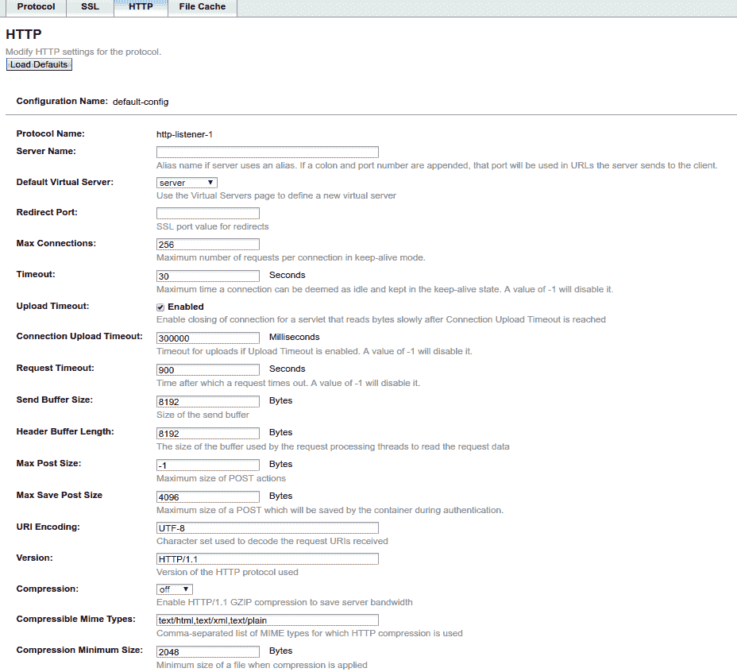
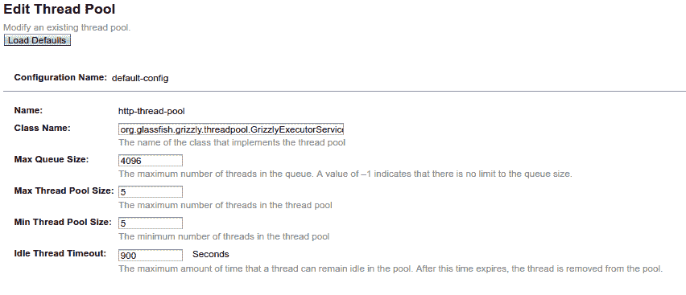

# 第五章：扩展 - 线程及其影响

可扩展性一直是 Java 的关注点，因此，在 Java 1.0 版本中引入了与线程相关的 API。其理念是能够从最新的硬件更新中受益，以便并行处理应用程序。

能够并行处理多个请求对于 Java EE 服务器进行扩展至关重要，但在我们现代的 Java 世界中，您还需要能够控制自己的线程。此外，Java EE 引入了所需的 API，以便在良好的条件下进行操作。

在本章中，我们将探讨以下主题：

+   Java EE 线程模型

+   线程间的数据一致性

+   Java EE 隐藏的线程使用

+   如何将响应式编程与 Java EE 编程模型集成

# Java EE 线程模型

Java EE 哲学长期以来一直能够为用户提供一个定义良好且安全的编程模型。这就是为什么大多数 Java EE 默认设置都是关于线程安全的，以及像**企业 JavaBeans（EJB**）这样的规范默认阻止自定义线程使用。这并不意味着 Java EE 完全忽视了线程，但显式地从一个应用程序中使用线程池并不很自然。此外，大多数时候，采用的编码风格要么违反 Java EE 的（严格）规则，要么非常冗长。

在详细说明 Java EE 新增的 API 以帮助您开发并发应用程序之前，让我们先看看基本的 Java EE 模型以及它如何已经可以帮助您进行扩展。

如果我们回顾 Java EE 8（完整配置）中包含的规范，我们会得到一个长长的列表。现在，如果我们检查哪些规范使用线程，列表将会缩短，我们可以在它们之间找到一些共同点。以下是一个表格，试图表示规范是否管理专用线程以及它们是否明确与线程交互（通过使用提供的线程处理跨线程调用）或简单地使用调用者（上下文）线程：

| **规范** | **管理专用线程** | **与线程交互** | **注释** |
| --- | --- | --- | --- |
| EJB 3.2 | 是 | 是 | `@Asynchronous` 允许您在专用线程池中执行任务。与`@Singleton`一起使用`@Lock`允许您控制 bean 的线程安全性。 |
| Servlet 4.0 | 是 | 是 | 默认情况下，每个请求都在容器提供的单个线程中执行。当使用`AsyncContext`时，您可以在自定义线程中执行任务，并在稍后从另一个线程恢复请求。 |
| JSP 2.3/JSP Debugging 1.0 | 否 | 否 | 继承自 servlet 模型。 |
| EL 3.0 | 否 | 否 | 使用调用者上下文。 |
| JMS 2.0 | 是 | 否 | 本身，JMS 可以被视为一种特定的连接器（如 *Connector 1.7*），但在这个案例中要特别说明。JMS 有两种使用方式：在服务器端和客户端。服务器端通常是一个网络服务器，等待连接。这就是将使用专用线程的地方（如任何套接字服务器）。然后，处理将完全委托给连接器。在客户端，它通常继承自调用上下文，但也使用自定义线程，因为它按设计是异步的。因此，它需要自己的线程池来处理 JMS 规范的这一部分。 |
| JTA 1.2 | 否 | 是 | JTA 不管理线程，而是 *绑定* 其上下文到线程。具体来说，当事务开始时，它仅对初始线程有效。 |
| JavaMail 1.6 | 是 | 否 | JavaMail 作为你的 Java 代码与发送/接收邮件方式之间的桥梁，其实现再次与套接字相关联，因此，它通常依赖于专用线程。 |
| Connector 1.7 | 是 | 是 | Connector 规范是与外部系统交互的标准方式（即使连接器实现通常只处理单向，双向方式）。然而，它通常在两层中使用专用线程，第一层与网络交互相关，第二层与容器交互相关，通常通过 `WorkManager` 进行，它是 *Java EE 并发实用工具规范* 的前身。像 JTA 一样，它也使用与线程相关联的上下文信息。最后，由于它与 JTA 交互，交互的一部分按设计绑定到线程上。 |
| Web Services 1.4 / JAX-RPC 1.1 | 否 | 否 | Web 服务通常只是继承自 servlet 上下文线程模型。 |
| JAX-RS 2.1 | 是 | 是 | JAX-RS 继承自 servlet 上下文模型，但自从 JAX-RS 2.0 以来，服务器可以异步处理请求，这得益于 Servlet 3.0 的 `AsyncContext`。在这种情况下，当请求完成时，开发者必须通知容器，并且与线程交互，因为这通常是在与 servlet 线程不同的线程中完成的。在客户端，JAX-RS 2.1 现在有一个反应式 API，能够使用自定义线程进行执行。 |
| WebSocket 1.1 | 是/否 | 是/否 | 通常，WebSocket 规范被设计为在 servlet 规范之上实现，这实际上是 Java EE 的核心传输。然而，在几个情况下，可能需要使用一些针对 WebSocket 需求（长连接）的线程定制。这部分高度依赖于容器。最后，可能需要一些自定义的 WebSocket 线程来处理连接驱逐等问题，但这对接端用户和性能的影响较小。 |
| JSON-P 1.1 / JSON-B 1.0 | 否 | 否 | 这个规范（JSON 低级 API 和 JSON 绑定）没有任何线程相关操作，并且简单地执行在调用者上下文中。 |
| Java EE 并发工具 1.0 | 是 | 是 | 并发工具主要具有定义 *Java EE 线程池* 的能力，实际上它们管理自定义线程。它还通过 `ContextService` 透明地促进某些上下文的传播，例如安全、JNDI 上下文、事务等。请注意，然而，传播不是标准的，您可能需要查看服务器文档以了解它确切的功能。 |
| 批处理 1.0 | 是 | 否 | JBatch 按设计是异步的。当你启动一个批处理时，调用在批处理完成之前返回，因为它可能非常长。为了处理这种行为，JBatch 有自己的线程池。 |
| JAXR 1.0 | 否 | 否 | 这个规范很少使用，并且已经过时（在 Java 引入 nio 之前）。作为一个客户端，它不使用自定义线程。 |
| Java EE 管理规范 1.1（或 1.2） | 是/否 | 否 | 这个规范允许您与服务器及其定义（资源和应用）交互。它使用另一种传输技术，因此通常需要专用线程。 |
| JACC 1.5 | 否 | 否 | 这是一个将授权策略与 Java EE 容器链接的规范。它是上下文执行的。 |
| JASPIC 1.1 | 否 | 否 | 这是一个安全规范，也是上下文执行的。 |
| Java EE 安全 API 1.0 | 否 | 否 | 这是 Java EE 的最后一个安全 API，使其非常实用，但它仍然与调用者上下文相关。 |
| JSTL 1.2 | 否 | 否 | 继承自 servlet 模型。 |
| Web 服务元数据 2.1 | 否 | 否 | 这主要涉及 Web 服务的注解，所以没有特定的线程模型。 |
| JSF 2.3 | 否 | 否 | 继承自 servlet 线程模型（这是一个简化，但对于本书的上下文来说足够好了）。 |
| 常见注释 1.3 | 否 | 否 | 只是一组由其他规范复用的 API，没有直接绑定在这里的特殊行为。 |
| Java 持久化 2.2 (JPA) | 否 | 否 | 继承自调用者上下文。 |
| Bean 验证 2.0 | 否 | 否 | 继承自调用者上下文。 |
| 拦截器 1.2 | 否 | 否 | 继承自调用者上下文。 |
| Java EE 上下文和依赖注入 2.0 (CDI) | 是 | 是 | CDI 2.0 支持异步事件，这些事件依赖于一个专用的线程池。CDI 关于 *上下文*，也将上下文数据绑定到线程，例如 `@RequestScoped` 上下文。 |
| Java 1.0 依赖注入 (@Inject) | 否 | 否 | 这主要是 CDI 的一组注解，所以这里没有真正的线程相关行为。 |

如果我们回顾所有线程的使用情况，我们可以区分以下类别：

+   异步用法：使用线程不阻塞调用者执行的规范（例如 JAX-RS 客户端、批处理 API、CDI 异步事件等）

+   需要线程进行选择器（部分接受连接）和请求处理的网络相关实现

在代码上下文中，这通常与代码的外出层有关。确实，网络是应用程序的外出，但异步使用也在此意义上，因为它们将执行分成两个分支：继续执行的调用上下文和一个不再与调用者相关的新分支。

这对你意味着什么？当你负责一个应用程序时，至少从性能或配置的角度来看，你需要清楚了解应用程序的线程执行路径（当应用程序使用一个不同于受影响的线程时，当请求进入系统时）。这也适用于像微服务这样的跨系统架构，你需要跟踪执行上下文的分解。

# 线程数据和一致性

在具体到 Java EE 之前，重要的是退一步理解并发对编程模型的影响。

# 并发数据访问

当单个线程访问数据时，访问总是线程安全的，一个线程在另一个线程读取数据时不可能修改数据。当你增加线程数量，并且多个线程可以访问相同的数据结构实例时，一个线程可能会读取正在被修改的数据，或者可能发生两个并发修改，导致不一致的结果。

这里是一个用两个线程表示这个问题的模式。请记住，Java EE 服务器通常处理大约 100 到 1000 个线程，因此影响更为显著：


在这个简单的例子中，我们有一个线程（**Thread 1**）正在设置数据，这些数据应该是一个复杂结构。同时，我们还有另一个线程（**Thread 2**）正在访问这些数据。在先前的图中，非常细的黑线代表线程的生命周期，而粗黑线则代表线程上下文中的方法执行。蓝色方框代表数据设置/获取的执行时间，红色区域代表两个线程在数据使用上的重叠。换句话说，你可以认为垂直单位是时间。

为了理解没有保护的代码可能产生的影响，让我们用以下简单代码具体化数据结构：

```java
public class UnsafeData {
    private boolean initialized = false;
    private String content;

    public void setData(String value) {
        content = value;
        initialized = true;
    }

    public String getData() {
        if (!initialized) {
            throw new IllegalStateException("structure not initialized");
        }
        return content;
    }
}
```

这个简单的结构旨在存储一个`String`值并处理一个状态（`initialized`），这允许结构在未初始化时防止对数据的访问。

如果我们将这个结构应用到我们之前的图片时间线上，可能的情况是**线程 2**调用`getData`失败并抛出`IllegalStateException`，而`setData`方法被调用并设置了`initialized`变量。换句话说，结构（`getData`）在变化时被访问，因此其行为与数据的完整状态不一致。在这种情况下，错误并不严重，但如果你考虑另一个例子，比如求和某些值，你将只会得到错误的数据：

```java
public class Account {
    private double value; // + getter

    public void sum(double credit, double debit) {
       value += credit;
       value += debit;
    }
}
```

如果`sum`的执行和`value`的访问同时进行，那么账户的值将会错误，报告可能会不一致，验证（可能考虑*信用+借记=0*）将失败，使这个账户出现错误。

如果你再进一步看看并集成一些 EE 功能，你会很快明白情况会更糟。让我们以一个 JPA 实体为例，比如`Quote`，并假设两个线程正在不同地修改实体：一个线程修改价格，另一个线程修改名称。当每个线程更新实体时会发生什么？数据库无法同时处理这两个更新，所以如果没有失败，则最后一个更新将获胜，只有其中一个更新会被考虑。

JPA 提供了乐观锁和悲观锁来正确解决上述问题。一般来说，尽量使用乐观锁，直到你真正需要悲观锁。实际上，即使它可能需要你处理重试逻辑，它也会给你更好的性能。

# Java 和线程安全

这一节并不打算解释 Java 提供的所有确保代码线程安全的解决方案，只是给你一些关于 Java Standalone API 的亮点，如果需要，你可以在 Java EE 应用程序中重用。

# 同步

当然，这是最古老的解决方案，但在 Java 中仍然可用，`synchronized`关键字允许你确保方法不会被并发执行。你只需在你的方法定义中添加它，如下所示：

```java
public class SafeData {
    private boolean initialized = false;
    private String content;

    public synchronized void setData(String value) {
        content = value;
        initialized = true;
    }

    public synchronized String getData() {
        if (!initialized) {
            throw new IllegalStateException("structure not
            initialized");
        }
        return content;
    }
}
```

这与我们所看到的结构完全相同。但现在，多亏了添加到每个方法的`synchronized`关键字，对方法的调用将强制并发调用其他同步方法等待第一个方法执行完毕后再执行。具体来说，它将像单线程一样链式执行方法。

`synchronized`关键字与一个实例相关联，所以两个不同实例即使被同步也不会相互锁定。也可以将`synchronized`用作代码块，并将实例传递给要同步的实例。如果你这样做，并传递一个静态实例，那么你将锁定所有实例，这可能会阻止应用程序在公共代码路径上扩展。

# 锁

Java 1.5 通过 `java.util.concurrent` 包引入了 `Lock` 接口，该包包含许多与并发相关的类。它实现了与 `synchronized` 相同的目标，但允许您手动控制同步代码的范围。

`Lock` 和 `synchronized` 的性能在不同版本的 Java 中有所不同，但最新版本已经取得了很大的进步。一般来说，如果您不优化计算算法，选择其中一个或另一个将导致结果相似。然而，如果同时访问实例的并发线程数量很高，通常最好使用 `Lock`。

由于 `Lock` 是一个接口，它需要一个实现。JRE 提供了一个默认实现，称为 `ReentrantLock`。替换 `synchronized` 块的方式如下：

```java
final Lock lock = new ReentrantLock();
lock.lock();
try {
    doSomeBusinessLogic();
} finally {
    lock.unlock();
}
```

锁的实例化是通过 `new` 关键字直接完成的。我们在此处指出，`ReentrantLock` 可以接受一个布尔参数来请求它尊重锁调用的公平顺序（默认为 `false`，在性能方面通常足够好）。一旦您有一个已锁定的实例，您可以通过调用 `lock()` 方法来确保您是唯一执行代码的人。一旦您完成受保护的代码，您可以通过调用 `unlock()` 来释放当前线程，让另一个线程执行其代码。此外，请注意，所有这些锁定逻辑都假设锁是在线程之间共享的。因此，实例化通常在每个实例中只进行一次（在构造函数或 `@PostConstruct` 方法中）。

调用 `unlock()` 方法至关重要；否则，其他锁定线程将永远不会被释放。

Lock API 更常见的用法是将锁定和解锁调用分成两个。例如，以 Java EE 的使用为例，你可以在请求开始时锁定一个实例，在请求结束时解锁它，以确保单个请求正在访问它。这可以通过 Servlet 3 中的监听器实现，即使是异步请求也可以。但您将没有可以包围的块；相反，您将拥有多个回调，您需要将其与以下内容集成：

```java
public class LockAsyncListener implements AsyncListener {
    private final Lock lock;

    public LockAsyncListener(Lock lock) {
        this.lock = lock;
        this.lock.lock();
    }

    @Override
    public void onStartAsync(AsyncEvent event) throws IOException {
        // no-op
    }

    private void onEnd() {
        lock.unlock();
    }

    @Override
    public void onComplete(AsyncEvent event) throws IOException {
        onEnd();
    }

    @Override
    public void onTimeout(AsyncEvent event) throws IOException {
        onEnd();
    }

    @Override
    public void onError(AsyncEvent event) throws IOException {
        onEnd();
    }
}
```

将此监听器添加到 `AsyncContext` 后，锁定将遵循请求的生命周期。使用方式可能如下所示：

```java
public class SomeServlet extends HttpServlet {
    @Override
    protected void service(HttpServletRequest req, HttpServletResponse
    resp)
        throws ServletException, IOException {
        final AsyncContext asyncContext = req.startAsync();
        final SomeInstance instance = getInstance();
        asyncContext.addListener(new
        LockAsyncListener(instance.getLock()));
        execute(asyncContext, instance)
    }
}
```

一旦获得 `AsyncContext`，我们将其添加到锁监听器上并执行请求。当请求因超时、异常或简单地说，正常终止时，锁定将被释放。

这种使用同步块的实现相当困难，通常需要一些解决方案。这是一个 Lock API 更强大的例子。

我们在此处不会详细说明，但 `ReadWriteLock` API 为您提供了两个锁的持有者：一个用于保护读访问，另一个用于写访问。目标是让读访问可以并行进行，并确保只有在单个线程访问数据时才进行写访问。

# java.util.concurrent

虽然 Java 独立并发编程的详细覆盖超出了本书的范围，但了解 Java 7 和 Java 8 在这个领域有很多增强是很重要的。所以不要犹豫，去查看它的包。在有趣的类中，我们可以注意以下内容：

+   `CountDownLatch`：这是一种简单而有效的方式，确保 N 个线程正在等待另一个线程拥有的条件（有点像赛跑中的起跑器）。

+   `Semaphore`：这允许你表示和实现权限*桶*。最有趣的部分是你可以增加和减少相关的计数器。它可以是一种实现防波堤解决方案的简单方式。

+   `CyclicBarrier`：这是一种在代码的某些点上同步多个线程的方式。它的 API 很有趣，因为它允许你添加可以在所有线程上执行的共享逻辑。它可以被视为`CountDownLatch`的对立面。

+   `Phaser`：这是一种比`CyclicBarrier`和`CountDownLatch`更灵活的屏障实现。

+   `Atomic*`：这是一种原子更新数据实例的方式。

# 易变数据

最后，为了总结这部分 Java 独立并发编程的内容，有必要记住为什么`volatile`关键字很重要。这个关键字允许你请求 JVM 每次访问数据时刷新它读取的值。

使用非常简单；只需在字段声明中添加`volatile`关键字：

```java
public class SomeData {
    private volatile int value;
}
```

要理解为什么这个关键字会改变一切，你需要记住 JVM 可以有一些与线程相关的*缓存*字段值（这是一种非常底层的缓存，与我们将在下一节看到的内容无关）。像前一个片段中那样添加这个关键字强迫我们绕过这个缓存。它应该会慢一些。然而，单独使用时通常很快，所以通常值得这样做。

# Java EE 和线程

正如我们在本章开头看到的，Java EE 可以静默地使用线程。任何线程的使用都很重要，即使依赖于 Java EE 实现也是好的，因为这是你不需要维护的代码。不识别线程的问题是你可能会遇到你的上下文（`ThreadLocal`）不可用或带有错误值的情况。不识别线程的另一个陷阱是你可能会滥用线程，在机器上消耗比所需更多的资源。让我们回顾一些此类用法的代表性案例。

# CDI 异步事件

CDI 2.0 引入了异步事件的观念。这是一种为调用者异步触发事件的方式。以下是一个示例用法：

```java
public class AsyncSender {
    private static final Logger log =
    Logger.getLogger(AsyncSender.class.getName());

    @Inject
    private Event<MyEvent> sender;

    public void send(final MyEvent event) {
        final CompletionStage<MyEvent> cs = sender.fireAsync(event);
        cs.thenRun(() -> {
        // some post processing once all observers got notified
        });
    }
}
```

这个代码片段通过`fireAsync`发送异步事件。这个 API 有趣的部分是它返回`CompletionStage`，这使你能够在事件通知所有异步观察者之后链式调用一些逻辑。

异步事件仅通知异步观察者。它使用一个新的观察者标记：`@ObserverAsync`。以下是一个签名示例：

`public void onEvent(@ObservesAsync MyEvent event);`

CDI 处理此类事件提交的方式是通过使用 `CompletionFuture.all` 或通过在单个异步线程中链式异步观察者（在 Weld 中可配置；OpenWebBeans 仅支持第一种解决方案）。无论如何，它将单个未来提交到 CDI 线程池。尽管池配置尚未完全标准化，但重要的是要知道它在所有容器中都是可行的，并且如果你依赖它，它是应用程序的重要调优配置。

几个容器将默认使用 JVM 的通用 ForkJoin 池，这并不具备很好的可扩展性。因此，你可能需要提供一个专门针对应用程序使用的自定义线程池。

在用户代码方面，优先选择接受 `NotificationOptions` 实例签名的 `fireAsync` 方法（通常回退到默认容器池）是很重要的。这样做将允许你提供一个自定义池：

```java
sender.fireAsync(event, NotificationOptions.ofExecutor(myExecutor));
```

此签名允许你传递一个自定义池，并对其进行适当的调优（例如，使用 Java EE 并发工具）。它还将允许你通过事件指定所使用的池，并避免将它们全部放入同一个桶中。实际上，如果存在一些使用依赖关系，这可能会潜在地锁定你的应用程序！

关于此 API 的最后一个提示是，如果你修改了事件，请确保通过 `CompletionStage` 获取新状态时同步事件。你可以使用我们之前讨论过的任何 Java 独立技术。 

# EJB @Asynchronous

EJB 是最早的 Java EE 规范之一。当时，它是受到最多关注和功能最丰富的规范。现在，它正逐渐被 CDI 和集成所取代，以及其他规范，如 JTA、JPA 等。然而，它仍然包含一些在其他 Java EE 中找不到的有用功能。

EJB 也有异步解决方案。与 CDI 相比，它更为直接，因为你可以将一个方法标记为异步：

```java
@Asynchronous
public Future<MyResult> execute() {
    return new AsyncResult<>(getResult());
}
```

`@Asynchronous` 请求服务器在 EJB 线程池中执行任务。该方法可以返回 void，但如果需要返回值，则必须返回 `Future`。在 Java 8 中，返回 `CompletionFuture` 很容易。然而，由于这个 API 在那时之前就已经设计好了，最简单的方法是返回规范提供的 `AsyncResult`，并将你想要返回的实际值传递给它。请注意，容器将包装返回的 `Future` 值以添加特定的规范处理，因此即使你在代码中选择了该实现，你也不能将其转换为 `CompletionFuture`。

在这里，池配置高度依赖于服务器，但通常是可以工作的，并且很重要，这取决于应用程序中此 API 的使用情况。如果您的应用程序大量使用它，但容器只提供两个线程和一个小池队列，那么您将无法扩展很远。

# Java EE 并发工具

Java EE 7 引入了一个名为 EE 并发工具的新规范，用于 Java EE。主要目标不仅是为了提供一个从 EE 应用程序中处理线程的方法，而且还包括处理 EE 上下文传播，例如安全、事务等。

当使用此 API 时，请记住，传播的上下文高度依赖于容器。然而，与自定义线程池管理相比，此 API 是一个非常好的选择，因为配置在应用程序之外，并且对于容器来说是*标准*的，并且因为它使您能够从本节中将要看到的 API 中受益。

在规范级别非常巧妙的事情是重用标准 API，例如 `ExecutorService`、`ScheduledExecutorService` 等。这使开发者能够将它们用作 SE API 的替代品。特别是，它使您能够透明地与第三方库集成。

例如，您可以与 RxJava ([`github.com/ReactiveX/RxJava`](https://github.com/ReactiveX/RxJava)) 集成，就像您与任何线程池做的那样：

```java
@ApplicationScoped
public class RxService {
    @Resource(lookup = "java:global/threads/rx")
    private ManagedExecutorService mes;

    public Flowable<String> getValues() throws Exception {
        final WebSocketContainer container =
        ContainerProvider.getWebSocketContainer();
        final WebSocketPublisher publisher = new WebSocketPublisher();

        container.connectToServer(new Endpoint() {
            @Override
            public void onOpen(final Session session, final
            EndpointConfig config) {
                session.addMessageHandler(publisher);
            }

            @Override
            public void onClose(final Session session, final
            CloseReason closeReason) {
                publisher.close();
            }
        },      URI.create("ws://websocket.company.com"));

        final Scheduler eeScheduler = Schedulers.from(mes);
        return Flowable.fromIterable(publisher)
        .debounce(1, MINUTES, eeScheduler);
    }
}
```

此代码将 Java EE WebSocket API 与 RxJava Flowable API 集成。全局思想是让消费者处理 WebSocket 消息，而无需知道它来自 WebSocket。这使得测试更容易（通过用模拟替换 WebSocket 层）并且使代码与 WebSocket 层解耦。

在我们的服务中，我们注入 `ManagedExecutorService`，它主要是由容器管理的 `ExecutorService`，并通过 `Scheduler` API 将其包装在 RxJava 的线程池 API 中。然后我们就完成了；我们可以使用任何依赖于 Java EE 线程和上下文的 RxJava 的异步操作。在之前的代码片段中，它允许我们在一行中减少消息（限制每单位时间内发出的消息数量）。

技术上，我们实现 `Iterator<>` 以与 RxJava 集成，但我们也可以使用 `Future` 或 Flowable API 支持的任何其他类型。迭代器是与 RxJava 集成的部分。然而，为了与 WebSocket API 集成，我们还可以实现 `MessageHandler`，这允许我们查看传入的消息并在之前的代码片段中的端点注册它。以下是一个潜在的处理程序实现：

```java
public class WebSocketPublisher implements
        Iterable<String>, Iterator<String>, MessageHandler.Whole<String> {
    private final Semaphore semaphore = new Semaphore(0);
    private final List<String> messages = new ArrayList<>();
    private volatile boolean closed;

    public void close() {
        closed = true;
        semaphore.release();
    }

    @Override
    public void onMessage(final String message) {
        synchronized (messages) {
            messages.add(message);
        }
        semaphore.release(); 
        // it case we are currently locked in hasNext()
    }

    @Override
    public boolean hasNext() {
        if (closed) {
            return false;
        }
        try {
            semaphore.acquire();
            synchronized (messages) {
                return !closed && !messages.isEmpty();
            }
        } catch (final InterruptedException e) {
            return false;
        }
    }

    @Override
    public String next() {
        synchronized (messages) {
            return messages.remove(0);
        }
    }

    @Override
    public Iterator<String> iterator() {
        return this;
    }
}
```

我们的发布者将接收到的消息堆叠起来，然后通过`Iterator<>` API 提供服务。正如我们在上一节中看到的，它需要一些同步，以确保我们能够正确回答迭代器合约。具体来说，如果连接未关闭或我们没有收到任何消息，我们无法在`hasNext()`中返回任何内容。否则，它将停止迭代。

# ManagedExecutorService

作为快速提醒，`ExecutorService`是 Java Standalone 的标准线程池抽象。`ManagedExecutorService`是 Java EE 版本。如果你比较这两个 API，你会注意到它继承了其独立兄弟的所有功能，但它增加了审计功能：提交的任务（`Runnable`）可以实现`ManagedTask API`，这将给任务关联一个监听器，该监听器会通知任务的阶段（`Submitted`、`Starting`、`Aborted`和`Done`）。

ManagedTask 全局给容器以下内容：

+   ManagedTask 使用的监听器

+   一组属性用于自定义执行行为。定义了三个主要标准属性，并且可以在所有容器上便携使用：

    +   `javax.enterprise.concurrent.LONGRUNNING_HINT`：这允许容器更改长时间运行的线程设置，将任务完成（使用其他线程优先级或可能使用专用线程）

    +   `javax.enterprise.concurrent.TRANSACTION`：这可以取`SUSPEND`值，这将挂起当前事务（如果有）并在任务完成后恢复它

    +   `USE_TRANSACTION_OF_EXECUTION_THREAD`：这传播调用线程的事务

如果你不能使你的任务实现`ManagedTask`，那么你也有`*bridge*`适配器来通过`ManagedExecutors`工厂将一个普通任务连接到一个监听器：

```java
Runnable runnable = ManagedExecutors.managedTask(myTask, myListener);
```

这个简单的调用将创建`Runnable`，因此你可以将其提交给`ManagedExecutorService`，它也实现了带有`myListener`监听器的`ManagedTask`。实际上，还有用于`Callable`的包装工厂方法，具有我们之前提到的属性，以确保它覆盖了所有`ManagedTask` API 的功能。

在整体平台一致性方面，这个 API 倾向于使 EJB `@Asynchronous`成为遗留功能。

# ManagedScheduledExecutorService

`ManagedScheduledExecutorService`是 Java EE API 的`ScheduledExecutorService`。像`ExecutorService`一样，它集成了`ManagedTask API`。

然而，这个与调度相关的 API 更进一步，提供了两个新的方法来根据专用 API（`Trigger`）调度任务——`Runnable`或`Callable`。这个 API 允许你以编程方式处理调度，并避免依赖于固定的时间间隔或延迟。

即使从理论上讲，这个调度 API 可以分布式实现，并且被设计为支持它，但它通常只实现本地支持。然而，当不需要集群时，它是一个很好的 EJB `@Schedule`或`TimerService`的替代品，这在实践中实际上很常见。

# Java EE 线程

EE 并发工具还提供了一个 Java EE 的`ThreadFactory`，它创建的是`ManageableThread`而不是普通的线程。主要区别在于它们提供了一个`isShutdown()`方法，允许你了解当前线程是否正在关闭，并因此，如果确实正在关闭，退出进程。`ManagedExecutors.isCurrentThreadShutdown()`允许你直接测试这个标志，并自动处理线程的转换。这意味着一个长时间运行的任务可以按以下方式实现：

```java
while (running && !ManagedExecutors.isCurrentThreadShutdown()) {
    process();
}
```

你可能会认为仅测试线程状态就足够了，但你仍然需要一个应用程序状态来确保你与应用程序生命周期集成。不要忘记线程可以绑定到容器而不是应用程序部署时间。此外，根据你为线程定义的策略，你可以在运行时将其驱逐，可能通过容器的管理 API。

# ContextService

EE 并发工具的最后一个有趣的 API 是`ContextService`。它允许你创建基于接口的代理，继承自`Managed*` API 的上下文传播。你可以将其视为在不受你控制的独立线程池中使用管理线程池功能的一种方式：

```java
Runnable wrappedTask = contextService.createContextualProxy(myTask, Runnable.class);
framework.execute(wrappedTask);
```

在这里，我们将我们的任务包装在一个上下文代理中，并通过我们无法控制的框架提交包装后的任务。然而，执行仍然会在调用者的 EE 上下文中完成（例如，相同的 JNDI 上下文），使用另一个框架并不会影响很大。

这个`ContextService`仅限于代理接口，并且不支持像 CDI 那样进行子类代理。Java EE 明白现代开发是由各种框架和堆栈组成的，它无法控制一切。这种趋势通过引入一种新的 API 来体现，这种 API 可以轻松与其他系统集成并支持任何用例，而不是引入大量新的 API，这些 API 可能不会很好地进化。

在性能和监控方面非常重要——它不仅允许你轻松跟踪调用和应用程序行为，还可以通过缓存优化应用程序，正如我们将在下一章中看到的。

# EJB @Lock

前一部分展示了 EJB 的`@Asynchronous`和`@Schedule`可以通过某些程度地替换为新的 EE 并发工具。然而，还有一些 EJB API 在没有自己编码的情况下不容易替换，`@Lock` API 就是其中之一。

整体思路是确保 EJB（`@Singleton`）拥有的数据在线程安全的环境中访问。

事实上，此 API 仅限于单例 EJB，因为没有在并发环境中可用的单个实例，锁定就没有意义。

使用方法很简单，您只需用`@Lock`装饰一个方法或 bean，并根据访问类型传递`READ`或`WRITE`参数：

```java
@Singleton
public class MyLocalData {
    private Data data;

    @Lock(READ)
    public Data get() {
        return data;
    }

    @Lock(WRITE)
    public void set(Data data) {
        this.data = data;
    }
}
```

如果您还记得关于 Java Standalone 的部分，它与`synchronized`的使用非常相似，因为我们在一个块上定义了锁。然而，其语义更接近`ReadWriteLock` API。这是 API 设计的一个意愿，因为这是它通常实现的方式。那么，为什么混合这两种风格（块和读写 API）呢？这使您能够在读取时进行扩展，同时保持 API 非常简单（绑定到块）。然而，它已经适合很多情况！

在性能方面，重要的是要知道您可以通过`@AccessTimeout`将其与超时混合：

```java
@Singleton
@AccessTimeout(500)
public class MyLocalData {
    // as before
}
```

在这里，我们要求容器在 500 毫秒后未能获取锁（读取或写入）时，通过`ConcurrentAccessTimeout`异常失败。

对于一个响应式应用程序，正确配置超时至关重要，并且对于确保应用程序不会因为所有线程都在等待响应而以巨大的响应时间启动非常重要。这意味着您必须定义超时情况下的回退行为。换句话说，您需要定义超时以确保您符合 SLA，但您还需要定义在超时时应该做什么，以避免在服务器过载时出现 100%的错误。

微 profile 倡议是由大多数 Java EE 供应商创建的，主要基于 CDI。因此，即使它不是 Java EE 的一部分，它也能很好地与之集成。其主要目标是微服务，因此它们定义了一个 bulkhead API 和其他并发解决方案。然而，如果`@Lock`对于您的需求来说过于简单，它是一个有趣的解决方案。

# HTTP 线程

HTTP 层（服务器和客户端）涉及网络和连接。因此，它们需要在服务器端处理客户端连接以及在客户端侧进行潜在的反应式处理时使用一些线程。让我们逐一了解这些特定设置，这些设置直接影响到您应用程序的可扩展性。

# 服务器端

任何 Web 请求的入口点是 HTTP 容器。在这里，服务器配置始终依赖于服务器，但大多数供应商将共享相同的概念。重要的是调整这部分，以确保您的应用程序的输出不会无意中过度限制；否则，您将无端地限制应用程序的可扩展性。

例如，对于 GlassFish，您可以在 UI 管理界面或相应的配置文件中配置 HTTP 连接器。以下是它的样子：



这个页面实际上是在讨论 HTTP 连接器的调整（而不是绑定地址、端口或支持的 SSL 加密算法）。相应的配置总结在下表中：

| **配置名称** | **描述** |
| --- | --- |
| 最大连接数 | 这是保持活动模式下每个客户端的最大请求数量。这与其他 Java EE 服务器相比，这不是服务器支持的最大连接数。 |
| 超时 | 这是连接在保持活动模式下空闲一段时间后可以断开的时间长度。这里同样，这是一个基于客户端的配置，而不是像大多数其他服务器中的请求超时。 |
| 请求超时 | 这是请求将在客户端超时并失败的时间长度。 |
| 缓冲区大小/长度 | 缓冲区用于读取输入流中的数据。调整此大小以避免内存溢出将显著提高性能，因为服务器将不再需要创建一个新的易失性缓冲区来读取数据。如果应用程序做了很多事，这种调整可能很难做。权衡是不要使用太多内存，并避免意外的分配。因此，你越接近最常见请求的大小（实际上略大于此值），你的表现就越好。  |
| 压缩 | 压缩主要用于基于浏览器的客户端（支持 GZIP）。如果资源的尺寸超过最小配置尺寸，它将自动压缩配置的 MIME 类型的内容。具体来说，它可以影响一个 2MB 的 JavaScript 文件（这在今天已不再罕见）。这将使用一些 CPU 资源来进行压缩，但基于文本的资源（HTML、JavaScript、CSS 等）的空间节省通常是值得的，因为网络持续时间将大大减少。 |

这些参数主要关于网络优化，但对于确保应用程序保持响应性至关重要。它们还影响着 HTTP 线程的使用方式，因为不当的调整可能会给服务器带来更多的工作。现在，在 GlassFish（以及大多数服务器）中，你还可以配置 HTTP 线程池。以下是相应的屏幕截图：



GlassFish 的线程池配置非常常见——其大小（最大/最小）、队列大小（即使池已满，也可以添加的任务数量），以及超时（如果线程未被使用，则从池中移除）。

当你在基准测试你的应用程序时，确保你监控应用程序的 CPU 使用率和线程堆栈（或根据你监控服务器/应用程序的方式，进行剖析），以识别不良配置。例如，如果你看到 50%的 CPU 使用率和一些活跃的线程，那么你可能需要增加池的大小。总体目标是使 CPU 使用率非常高（85-95%），并且服务器的响应时间几乎保持不变。请注意，不建议将 CPU 使用率提高到 100%，因为那时，你会达到机器的限制；性能将不再相关，你将只会看到响应时间无限增加。

这是对任何可能变得非常重要的线程池的一般规则，尤其是在转向响应式编程时。因此，始终尝试使用与它们在应用程序中扮演的角色相对应的前缀来命名应用程序的线程，以确保你可以在线程转储中识别它们。

# 客户端端

自从 JAX-RS 2.1 以来，客户端已经被设计成响应式的。作为一个快速提醒，这里是什么样子：

```java
final Client client = ClientBuilder.newClient();
try {
    CompletionStage<Response> response =
    client.target("http://google.com")
          .request(TEXT_HTML_TYPE)
          .rx()
          .get();
} finally {
  client.close();
}
```

这是对 JAX-RS 客户端 API 的正常使用，除了对`rx()`的调用，它将响应包装到`CompletionStage`中。唯一的兴趣是变得异步；否则，它将只是另一个层，用户体验的提升微乎其微。

实现处理异步调用的方式取决于实现方式，但在 Jersey（参考实现）和 Java EE 容器中，你将默认使用托管执行器服务。请注意，在 EE 容器之外，Jersey 将创建一个非常大的线程池。

这种配置是您应用程序的关键，因为每个客户端都应该有一个不同的池，以确保它不会影响应用程序的其他部分，并且因为线程使用可能不同，可能需要不同的约束。然而，这尚未标准化，因此您需要检查您的服务器使用哪种实现以及如何使用配置。一般来说，客户端配置可以通过客户端的属性访问，所以并不难。但是，有时您可能受到容器集成的限制。在这种情况下，您可以将调用包装到自己的池中，并且不要使用`rx()` API 来完全控制它。

为了总结本节，我们可以在一段时间后（Java EE 8 和这个新的 JAX-RS 2 API）期待`rx()`方法将直接使用 NIO API 实现，因此，它在网络层面上真正变得响应式，而不仅仅是通过另一个线程池。

我们刚刚看到 Java EE 带来了处理应用程序线程的正确解决方案，但现代开发往往需要新的范式。这些修改需要应用程序开发方式的小幅改变。让我们通过这些新模式之一来了解一下。

# 响应式编程和 Java EE

响应式编程允许你的代码被调用而不是调用你的代码。你可以将其视为基于事件而不是过程的。以下是一个比较两种风格的示例：

```java
public void processData(Data data) {
    if (validator.isValid(data)) {
        service.save(data);
        return data;
    }
    throw new InvalidDataException();
}
```

这是一个非常简单且常见的业务方法实现，其中我们调用两个服务：`validator`和`service`。第一个服务将通过检查数据是否存在于数据库中、值是否在预期范围内等来验证数据，而第二个服务将实际处理更新（例如数据库）。

这种风格的问题在于数据验证和持久化被绑定在单个`processData`方法中，该方法定义了整个执行环境（线程、上下文等）。

在响应式风格中，它可以重写为用*链*替换同步调用：

```java
public Data processData(Data data) {    
    return Stream.of(data)
      .filter(validator::isValid)
      .peek(service::save)
      .findFirst()
      .orElseThrow(() -> new InvalidDataException("..."));
}
```

在这个例子中，我们使用了 Java 8 流 API，但使用像 RxJava 这样的响应式库通常更有意义；你将在下一段中理解原因。此代码与上一个代码执行相同的功能，但它通过定义链来编排调用，而不是直接进行调用。

这个模式有趣的地方在于你将逻辑（`validator`、`service`）与其使用方式（前一个例子中的流）分开。这意味着你可以丰富调用的编排方式，如果你考虑我们之前看到的 RxJava 示例，你就可以立即想到在不同的线程中执行每个方法。

这种模式的一个常见用例是当响应时间比使用的资源更重要时。换句话说，如果你不介意消耗更多的 CPU 周期，只要这有助于减少你响应客户端所需的时间，那么你可以实施这种模式。如果你正在与多个并发数据提供者一起工作，或者如果你需要联系多个远程服务来处理数据，那么你将一开始就并发执行这三个调用。一旦你有了所有响应，你将执行实际的处理。

为了说明这一点，你可以假设数据有一个合同标识符、一个客户标识符和一个与相应实体关联的账户标识符，这些标识符通过三个不同的远程服务关联。此类情况的同步实现可能如下所示：

```java
Customer customer = findCustomer(data);
Contract contract = fincContract(data);
Account account = findAccount(data);
process(customer, contract, account);
```

这将有效。然而，假设远程调用大约需要 10 毫秒，那么你的方法处理数据将需要超过 30 毫秒。

你可以通过并发执行三个请求来对其进行一点优化：

```java
public void processData(Data data) {
    final CompletableFuture<Customer> customer = findCustomer(data);
    final CompletableFuture<Contract> contract = findContract(data);
    final CompletableFuture<Account> account = findAccount(data);
    try {
        CompletableFuture.allOf(customer, contract, account).get();
        processLoadedData(customer.get(), contract.get(), account.get());
    } catch (final InterruptedException | ExecutionException e) {
        throw handleException(e);
    }
}
```

在这种情况下，你将减少调用持续时间到大约 10 毫秒。然而，你将阻塞线程 10 毫秒（三个并行调用）。`CompletableFuture.allOf(...).get()`这一行等待所有三个异步操作（`CompletableFutures`）完成，使得线程无法用于其他请求/处理。

直接影响是，即使你的 CPU 可能什么都没做（即，如果你当时获取线程转储，你正在等待 I/O），你也不会扩展，并且无法处理许多并发请求。

增强这种方法的方式是确保主线程不被阻塞，并且只有在所有数据都接收后才开始处理：

```java
public void processData(Data data) {
    final CompletableFuture<Customer> customer = findCustomer(data);
    final CompletableFuture<Contract> contract = findContract(data);
    final CompletableFuture<Account> account = findAccount(data);
    CompletableFuture.allOf(customer, contract, account)
         .thenRun(() -> {
             try {
                 processLoadedData(customer.get(), contract.get(),
                 account.get());
             } catch (final InterruptedException | ExecutionException
               e) {
                 throw handleException(e);
             }
         });
}
```

在这种情况下，我们仍然并行执行我们的三个远程调用——如果你需要访问 EE 功能，可能是在一个管理执行器服务中——然后，我们等待所有三个结果按顺序检索，以便进行我们的处理。然而，我们只是在整个数据可读时注册我们的处理，我们不会阻塞线程等待这个*就绪*状态；因此，我们将能够同时服务更多的请求。

在走向响应式编程时，重要的是尽可能避免同步，以确保任何线程时间都是活跃的处理。当然，它有限制，比如一些 JDBC 驱动程序仍然是同步的，它将阻塞线程等待 I/O 操作。然而，随着微服务的普及，如果不注意它，很容易给代码添加很多延迟，并降低应用程序的可伸缩性。

在心理上表示这种编程方式的方法是将 CPU 使用率想象成一个大的队列，队列中的每个元素都是一些活跃的计算时间消费者（即，一个任务）。然后，你的程序只是一个大事件循环轮询这个任务队列并执行任务。结果是什么？——几乎没有被动时间，只有活跃时间！

事实上，异步意味着所有的工作都将变为异步（线程处理、上下文切换、队列管理和同步）。即使大多数这些任务都是隐藏的，并且由堆栈为你完成，这也可能使 CPU 过载并减慢应用程序的速度，与在单个线程中执行相同的代码相比。这是真的，这意味着你不能为每个调用都使用这种模式。你需要确保你在相关的时候使用它，当有可能被动使用 CPU（阻塞时间、睡眠等）的时候。尽管如此，如果你遵守这个模式，你应该能够比在所有地方都保持同步更好地处理并发。当然，这是一个妥协，因为如果你有一个后台任务（例如，每天执行一次的计划任务），你不会关心等待时间，因为它只涉及一个线程。这种编程方式只有在准确的位置使用时才会产生效益，但如果你遵守这种使用方式，你将真正获得更合理的最终行为。然而，不要忘记，它带来了更多的复杂性，因为跟踪在 Java 中不再那么自然（堆栈跟踪几乎不再有用，因为你如果没有使用线程跟踪解决方案，就没有完整的堆栈）。

# 消息传递和 Java EE

消息传递模式涉及多个理论，但在这个部分，我们将主要关注异步风格。这种模式的一个例子是演员风格。演员是*某种*可以接收消息、向其他演员发送消息、创建其他演员以及指定下一个接收到的消息的行为的实体。

理解底层概念的基础非常重要：

+   全局通信依赖于一个异步总线

+   演员当前的*消息*处理基于一个状态（有点像内部状态机）

+   演员可以创建其他演员来处理一条消息

使用这种模式，强烈建议使用不可变消息以避免任何并发问题以及难以调试的行为（或非确定性行为）在演员流程中发生。

Java EE 并不提供现成的处理这种模式所有功能的工具，但其中大部分功能已经存在：

+   CDI 提供了一个总线

+   CDI（异步）观察者是一些豆类，因此你可以拥有一个状态机

+   代理链（新演员）可以通过与消息绑定的 CDI 上下文来处理

当然，与真正的演员系统相比，这仍然是一个简陋的实现，但它已经为你提供了一个坚实的模式来避免线程的被动使用，顺便说一下，当创建应用程序的内部架构时，你应该考虑这一点。

# 摘要

在这一章中，你看到了 Java EE 如何确保你可以并行化应用程序的计算，并使你的应用程序更好地扩展并处理多个并发请求。

使用 Java 独立同步机制、Java EE 线程管理解决方案和 API，你可以充分利用你的硬件并轻松地与第三方库集成。

现在我们已经看到了与 CPU 相关的内容，我们需要了解机器的另一个主要资源，你可以利用它来使你的应用程序行为更好：内存。当处理无法优化并且对应用程序影响太大时，通常的解决方案就是尽可能跳过它。这样做最常见——也许也是最有效的方法——就是确保数据只计算一次并在有效期间重复使用。这就是缓存介入游戏的地方，这也是我们下一章将要讨论的内容。
