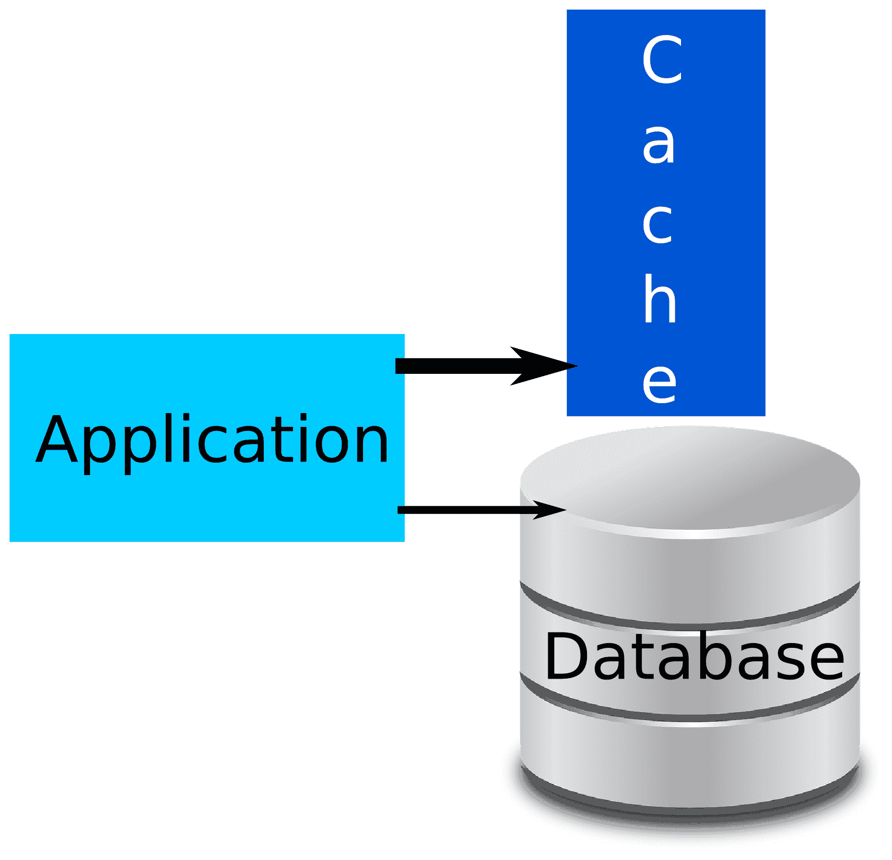
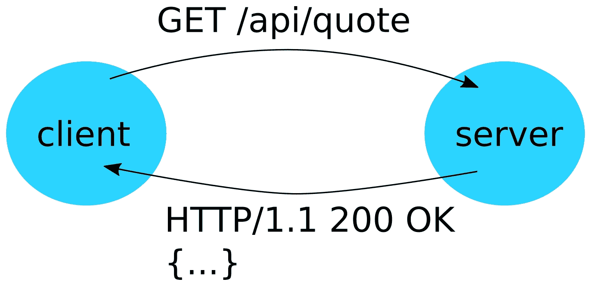

# 懒惰；缓存你的数据

在上一章中，我们看到了如何通过我们的处理器并行处理我们的请求并更准确地减少我们的响应时间。

然而，显然最有效率和快速的方式显然是不做任何事情。这正是缓存试图做到的，它允许你使用内存来跟踪已经处理过的结果，并在需要时快速读取它们。

在本章中，我们将讨论以下主题：

+   缓存是什么，它是如何工作的，以及它在什么情况下是有趣的

+   应该使用哪种类型的缓存：本地缓存与远程缓存

+   JCache - Java EE 的标准 API

# 缓存挑战

为了确保我们在实施缓存时记住我们针对的模式，让我们用一个简单的例子来说明，这个例子来自我们的引用管理应用程序。我们的目标将是使我们的 *按符号查找* 端点更快。当前的逻辑看起来像以下伪代码片段：

```java
Quote quote = database.find(symbol);
if (quote == null) {
    throw NotFoundException();
}
return convertToJson(quote);
```

在这个代码片段中我们只有两个操作（在数据库中查找并将数据库模型转换为 JSON 模型）。你好奇你在缓存什么：数据库查找结果、JSON 转换，还是两者都缓存？

我们稍后会回到这部分，但为了简单起见，这里我们只缓存数据库查找。因此，我们新的伪代码可能看起来像以下这样：

```java
Quote quote = cache.get(symbol);
if (quote == null) {
    quote = database.find(symbol);
    if (quote != null) {
        cache.put(symbol, quote);
    }
}
if (quote == null) {
    throw NotFoundException();
}
return convertToJson(quote);
```

这基本上和之前的逻辑一样，只是我们尝试在到达数据库之前从缓存中读取数据，如果我们到达数据库并找到记录，然后我们会将其添加到缓存中。

事实上，如果你在数据库中没有找到引用，你也可以进行缓存，以避免发出一个不会返回任何结果的数据库查询。这取决于你的应用程序是否经常遇到这类请求。

因此，我们现在在我们的应用程序中需要考虑一个包含我们数据库数据的缓存层。我们可以用以下图表来可视化这种结构变化：



这张图表示了 **应用程序** 通过 **缓存** 和 **数据库**。连接（箭头）到 **缓存** 的线比到 **数据库** 的线更粗，这代表我们的假设是 **缓存** 访问比 **数据库** 访问更快。因此，访问 **缓存** 比访问 **数据库** 更便宜。这意味着我们想要比访问 **数据库** 更频繁地访问 **缓存** 来找到我们的引用。最后，这张图表示了 **缓存** 和 **数据库** 在同一个 *层* 中，因为有了这种解决方案——即使 **缓存** 访问应该非常快——你现在有两个数据源。

# 缓存是如何工作的？

什么是缓存？单词 *缓存* 实际上非常通用，隐藏了许多不同的风味，它们并不针对相同的需求。

然而，所有缓存实现都在原则上有一个共同的基础。

+   数据可以通过键访问

+   缓存提供了一些表示存储值有效性的驱逐机制

+   缓存依赖于内存存储*首先*。

# 缓存键。

大多数缓存 API 在行为上非常接近映射——你可以使用`put(key, value)`来存储一些数据，并通过`get(key)`调用使用相同的键检索它。

这意味着可以使用 JRE 的`ConcurrentMap`实现一个穷人的缓存。

```java
private final ConcurrentMap<Long, Optional<Quote>> quoteCache = new ConcurrentHashMap<>();

@GET
@Path("{id}")
public JsonQuote findById(@PathParam("id") final long id) {
    return quoteCache.computeIfAbsent(id, identifier -> 
    quoteService.findById(identifier))
            .map(this::convertQuote)
            .orElseThrow(() -> new WebApplicationException(Response.Status.NO_CONTENT));
}
```

在这个实现中，我们将数据库访问封装在并发映射访问中，只有当数据不在缓存中时才会触发数据库访问。请注意，我们缓存了`Optional`，这也表示我们没有在数据库中拥有数据。因此，即使数据不存在，我们也会绕过 SQL 查询。

这种类型的实现是可行的，但它没有任何驱逐策略，这意味着你将在应用程序的生命周期内保持相同的数据，这意味着数据库中的更新将被完全绕过。如果你的数据不是常量，请不要在生产环境中使用它。

这类结构（让我们称它们为*映射*）使用的重要部分是键的选择。缓存实现会尽可能减少锁定。它们甚至可以是无锁的，这取决于实现方式。因此，你可以假设缓存会自行扩展，但关键是你的，你需要确保它得到良好的实现。

缓存使用键通常有多种策略，但最知名和常用的如下：

+   **按引用**：通过引用相等性来测试相等性，这意味着你需要使用相同的键实例来查找值。按照设计，它仅限于本地缓存。

+   **按合同**：这使用键的`equals`和`hashCode`方法。

+   **按值**：这与*按合同*相同，但在将其放入缓存时也会复制键。它确保如果键是可变的，并且在将数据放入缓存后以某种方式发生了变化，它不会影响缓存，这可能会因为错误的`hashCode`赋值而损坏。

`hashCode`的使用通常需要影响缓存存储结构中单元格的键/值对。它使得数据在结构中的分布，这将使得访问更快。如果键的`hashCode`在键被分配到单元格后发生变化，那么即使`equals`实现正确，数据也无法找到。

大多数情况下，你会使用*按合同*解决方案（或*按值*，取决于实现），因为*按引用*在 Web 应用程序中很少工作，因为键的引用通常绑定到请求，并且随着每个请求而变化。这意味着你必须定义你的数据键是什么，你必须实现`equals`和`hashCode`。

在这种约束下，你需要注意两个非常重要的后果：

+   这些方法必须执行得快。

+   这些方法一旦数据放入缓存后就必须是常量。

为了理解这意味着什么，让我们基于我们的`Quote`实体，将其计算结果放入我们的缓存中，作为计算的天然键（例如，我们缓存一些与报价相关的新闻）。作为提醒，以下是我们的实体结构：

```java
@Entity
public class Quote { // skipping getters/setters
    @Id
    @GeneratedValue
    private long id;

    @NotNull
    @Column(unique = true)
    private String name;

    private double value;

    @ManyToMany
    private Set<Customer> customers;
}
```

如果你使用你的 IDE 生成`equals`和`hashCode`方法，你可能会得到以下实现：

```java
@Override
public boolean equals(Object o) {
    if (this == o) {
        return true;
    }
    if (o == null || getClass() != o.getClass()) {
        return false;
    }
    Quote quote = (Quote) o;
    return id == quote.id && Double.compare(quote.value, value) == 0 &&
    Objects.equals(name,
            quote.name) && Objects.equals(customers, quote.customers);
}

@Override
public int hashCode() {
    return Objects.hash(id, name, value, customers);
}
```

这是一个非常常见的实现，但它考虑了所有字段。对于一个 JPA 实体来说，由于以下原因，这是一个灾难：

+   如果标识符没有受到影响会发生什么？如果实体在实体被放入缓存之后持久化，你将失去缓存的好处或者再次缓存（使用另一个哈希值）。

+   当访问`customers`时会发生什么？这是一个懒加载的关系，所以如果在`hashCode`或`equals`之前没有被触及，那么它将加载这个关系，这肯定不是我们想要的。

+   如果`value`——与标识符无关的实体任何状态——发生变化会发生什么？缓存的使用也将被错过。

JPA 是一个标识符真正重要的案例，即使没有缓存。但是有了缓存，这一点更加明显。所有这些观察都导致了一个事实，即缓存中的每个键都必须基于一个自然标识符，这个标识符应该是不可变的，或者如果你收到一个修改键假设的事件，你必须确保你清除缓存条目。在 JPA 的情况下，自然标识符是 JPA 标识符（`Quote`的`id`），但它也必须从第一次使用时受到影响。这就是为什么，在大多数情况下，好的技术标识符是基于 UUID 算法，并在新创建的实体实例化时受到影响。修正后，我们的`equals`和`hashCode`方法将如下所示：

```java
@Override
public boolean equals(Object o) {
    if (this == o) {
        return true;
    }
    if (o == null || getClass() != o.getClass()) {
        return false;
    }
    Quote quote = (Quote) o;
    return id == quote.id;
}

@Override
public int hashCode() {
    return Long.hashCode(id);
}
```

这些实现只考虑`id`值，并假设它早期受到影响，因此可以作为缓存中的键安全使用。

几种数据库依赖于键/值范式来确保良好的性能和高效的存储。然而，与缓存的主要区别将是缓存中数据的易变性，缓存不是为了存储数据而设计的，而数据库将确保数据的持久性，即使它是一个最终一致性的数据库。

# 清除策略

清除策略是使缓存与数据库或`Map`不同的地方。它使你能够定义数据如何自动从缓存存储中删除。这非常重要，因为如果你缓存从数据库中取出的某些参考数据，那么数据库存储可能比机器上可用的内存存储更大，因此，如果没有清除，你最终会填满内存，并得到`OutOfMemoryException`，而不是你期望从缓存添加中获得的性能提升。

有几种清除策略，但主流的分类却很少：

+   **最近最少使用**（**LRU**）

+   **先进先出**（**FIFO**）

+   随机

+   **最少使用**（**LFU**）

只有 LRU、FIFO 和*过期*是真正的主流；其他的一些高度依赖于你的提供商能力。

# 最少最近使用（LRU）

LRU 策略基于缓存元素的使用情况。一些统计数据被维护以能够根据最后使用日期对元素进行*排序*，当需要淘汰时，缓存只需按顺序遍历元素，并按相同的顺序淘汰它们。

你可以将其想象为缓存维护一个数据（存储）的映射和一个数据（或键）使用列表。以下是一个序列，帮助你可视化它：

| **操作** | **缓存存储（未排序）** | **淘汰列表（已排序）** |
| --- | --- | --- |
| - | [] | [] |
| 添加键/值 E1 | [E1] | [E1] |
| 添加键/值 E2 | [E1, E2] | [E1, E2] |
| 添加键/值 E3 | [E1, E2, E3] | [E1, E2, E3] |
| 读取 E2 | [E1, E2, E3] | [E1, E3, E2] |

这里需要注意的重要一点是，每次使用（*put*、*get*等）都会首先将元素放入淘汰列表。这意味着当执行淘汰操作时，它将最后移除这个元素。从行为上来说，LRU 会导致在缓存中保留最常使用的元素尽可能长时间，这正是缓存效率最高的时候。然而，这也意味着缓存必须维护一个淘汰列表状态，这可以通过多种方式完成（通过列表、淘汰时排序、动态矩阵等）。由于它需要额外的工作，这会影响性能或内存使用，这将对应用程序/缓存不再适用。

# 先进先出（FIFO）

FIFO 算法是 LRU 算法的一个简单版本，旨在通过牺牲一点准确性来避免 LRU 算法的缺点。具体来说，它将绕过使用统计，仅依赖于进入缓存的时间——有点像你在超市排队等待时的情况。

这里是一个类似于我们用来描述 LRU 算法的插图：

| **操作** | **缓存存储（未排序）** | **淘汰列表（已排序）** |
| --- | --- | --- |
| - | [] | [] |
| 添加键/值 E1 | [E1] | [E1] |
| 添加键/值 E2 | [E1, E2] | [E1, E2] |
| 添加键/值 E3 | [E1, E2, E3] | [E1, E2, E3] |
| 读取 E2 | [E1, E2, E3] | [E1, E3, E2] |

这里主要的区别是最后一个条目，它不会影响 E2 和 E3 之间的淘汰顺序。你可以将其视为*更新不会改变淘汰时间*。

# 随机

如你所猜，这种淘汰策略会随机选择条目进行删除。它看起来效率不高，因为删除最常使用条目的概率更高，从而降低缓存效率。然而，在某些情况下，它可能是一个不错的选择。这种策略的主要优点是它不依赖于任何淘汰顺序维护，因此执行速度快。

在使用它之前，请确保它确实比其他方法效率低：几乎比 LRU 低 20%，这是通过实验得出的。

# 最少使用频率（LFU）

你在缓存中能遇到的最后一个常见算法是 LFU 算法。和 LRU 算法一样，这个版本也维护了缓存访问的统计信息。

与 LRU 的主要区别是，它使用频率统计而不是基于时间的统计。这意味着如果 E1 被访问了 10 次而 E2 被访问了 5 次，那么 E2 将在 E1 之前被删除。

这个算法的问题是，如果你在短时间内有快速的访问率，那么你可能会删除比在非常短的时间内经常使用的元素更频繁使用的元素。因此，最终的缓存分布可能不是那么理想。

# 缓存删除触发器

之前的算法定义了在触发删除时如何选择要删除的项目。这意味着如果未触发删除，它们就毫无意义。删除触发器可以是多种类型，但主要的是以下几种：

+   **大小**：缓存的大小可以是几种类型，例如缓存的实际对象数量或内存大小（以位或字节为单位）。

+   **过期**：你可以与每个元素关联一个*生命周期*。当*生命周期*到达时，该元素应该从缓存中删除（移除）。请注意，此参数不是严格的，如果缓存没有使用足够快的后台线程来快速删除元素，则元素可以留在内存中并在访问期间被移除。然而，作为客户端（缓存用户），你不应该注意到这一点。

这是高级配置。然而，每个缓存实现都有很多不同的版本，混合了各种元素。例如，你可以配置一个缓存以支持在内存中保持 100 万个对象，缓存内存的最大大小为 10 MB，如果对象不适合内存，则可以使用 1 GB 的磁盘空间（溢出到磁盘策略）。这种高级配置可能会影响每个元素的不同*生命周期*，因此缓存可以在达到这个*生命周期*时从缓存中删除元素。最后，你可以将这个*每个元素的生命周期*与 10 分钟的全球最大*生命周期*策略相关联。

如果你浏览你的缓存实现提供商，你会识别出很多配置选项，重要的是不要尝试复制粘贴现有应用程序中的缓存配置，除非你确保你处于类似的场景中。

策略是从简单开始，如果应用程序需要或者从中获得性能提升，再复杂化配置。例如，激活数据的磁盘溢出可能会降低与访问后端相比的性能，特别是如果后端连接相当快且磁盘已经高度使用。

从一个简单的 LRU 策略开始，具有最大内存大小或对象大小通常是最高效的选择。

# 缓存存储 – 是内存还是不是

缓存的想法是保留实例以便更快地提供服务，而不是重建它们或从*慢速*后端获取它们。首选的存储是堆，因为它是一种快速访问解决方案。然而，许多缓存供应商允许其他策略。大多数时候，它将通过**服务提供者接口**（**SPI**）来实现可插拔，因此你经常会看到很多实现。以下是你可能找到的一些小列表：

+   硬盘

+   关系型数据库管理系统（RDBMS）数据库（MySQL、Oracle 等）

+   NoSQL 数据库（MongoDB、Cassandra、一种特定的缓存服务器存储类型、*网络缓存*等）

在讨论这些扩展的使用之前，不要忘记这通常是一种针对缓存的特定方式来使用后端。例如，硬盘实现中在内存中保持键、在磁盘上存储值以保持数据的快速查找，并确保内存使用符合配置的情况并不少见。这意味着你并不总是能够使用这些*溢出*策略来持久化缓存数据。

问题是，如果溢出导致使用另一个后端，为什么直接去数据所在的主后端会更有用且更高效呢？这有几个答案，并且随着我们现在看到的微服务趋势，这些答案变得越来越准确。

通过这种缓存方式的主要两个原因如下：

+   提供更可靠的访问数据的方式，即使主要的后端不可靠（且由你无法控制的另一个应用程序拥有）。

+   在无需完全重写应用程序以考虑访问限制（如速率限制）的情况下，解决访问限制问题。例如，如果你访问 GitHub API，你将无法在某个端点上每分钟进行超过 30 次请求，所以如果你的应用程序需要每分钟进行 1,500 次访问，你需要在你的端存储相应的数据。在这里，缓存可以很巧妙，因为它允许根据速率限制、时间单位和你的应用程序通过输出来放置适应的驱逐策略。

使用分布式解决方案（如集中式 RDBMS 或分布式数据库如 NoSQL）将允许你在节点之间共享数据，并避免在主后端上进行与节点数量一样多的查询。例如，如果你的集群中有 100 个你的应用程序节点，并且你缓存了键，*myid*，那么你将通过内存存储请求后端 100 次以获取*myid*数据。而使用分布式存储，你只需从其中一个节点缓存一次，然后只需从这个分布式存储中读取，这仍然比主后端快。

尽管使用溢出可能非常有吸引力，但不要忘记它通常比内存缓存慢（我们常说内存访问时间是 1，磁盘访问时间是 10，网络访问时间是 100）。有一些替代策略允许你积极地将数据推入内存，而不是依赖于溢出（懒加载）读取，如果你的集群负载均衡没有使用任何亲和性，这可能是有益的。

# 数据一致性

我们现在可以在所有集群节点上设置我们的缓存；然而，问题是我们的应用程序是否仍然可以工作。为了回答这个问题，我们将考虑一个非常简单的案例，其中两个请求是并行执行的：

| **节点 1** | **节点 2** |
| --- | --- |
| 在时间 t1 将数据 1 放入缓存 | - |
|  | 在时间 t1 将数据 1 放入缓存 |
| 在时间 t3 访问数据 1 | 在时间 t3 访问数据 1 |

通过这个简单的时间线，我们可以立即看出，使用本地内存缓存可能导致不一致，因为节点可能不会同时缓存数据（缓存通常是懒加载的，所以缓存是在第一次请求或机器启动时填充的，如果是积极加载的，这可能导致两种情况下都可能存在潜在的不一致数据）。

如果数据被缓存，通常意味着不需要最新的数据。这真的是一个问题吗？——是的，可能是一个问题。事实上，如果你在没有亲和性的负载均衡（从业务逻辑的角度看是随机的，这是*按负载*或*轮询*负载均衡器的情况），那么你可能会陷入这样的情况：

| **节点 1** | **节点 2** |
| --- | --- |
| 在时间 t1 将数据 1 放入缓存 |  |
|  | 在时间 t2 更新数据 1 |
|  | 在时间 t3 将数据 1 放入缓存 |
| 在时间 t4 获取并将数据 2 放入缓存 |  |
|  | 在时间 t5 将数据 2 放入缓存 |
| 在时间 t6 访问数据 1 | 在时间 t6 访问数据 1 |
| 在时间 t7 访问数据 2 | 在时间 t7 访问数据 2 |

我们现在处于与之前相同的情况，但现在我们可以在业务逻辑中使用两种数据（数据 1 和数据 2），并缓存两者。然后，为了识别问题，我们必须考虑数据 1 和数据 2 是*逻辑上*相关的（例如，数据 1 是一张发票，数据 2 是一份包含价格的合同）。在这种情况下，如果你验证数据（数据 1 和数据 2），处理可能会失败，因为数据在不同的时间和不同的节点上被缓存，这会提供更多的数据一致性保证（因为单个节点将访问单个缓存，因此与其当前状态保持一致）。

换句话说，以保证即使在服务器并发的情况下应用程序仍然可以工作的方式缓存数据非常重要。这个陈述的直接含义是在基准测试期间不要到处放置缓存，只有在证明其有用时才添加，同时避免破坏应用程序。

在溢出存储中，这种情况更糟，因为溢出可以局限于节点（例如硬盘），这导致你使用三个数据来源。

通常，*参考数据*是我们首先缓存的数据类型。这是很少变化的数据，比如不应该每天更改的合同。这有助于应用程序运行得更快，因为部分数据将具有快速访问。然而，它不会破坏应用程序，因为*动态*数据仍然从主要来源（例如数据库）中查找。总体而言，您将最终拥有一个混合查找设置，其中部分数据从缓存中读取，另一部分从主要后端读取。

# HTTP 和缓存

实现 HTTP 服务器是 Java EE 的主要目的之一。使用 Servlet API、JAX-RS 或甚至 JAX-WS，您可以轻松地在 HTTP 上公开数据，而不必关心传输。

然而，HTTP 定义了一种缓存机制，这在优化客户端行为时值得考虑。

与服务器的常见通信将如下所示：



服务器发起请求，客户端在头部和有效载荷（可能非常大）中发送一些数据（上一个架构中是 JSON 有效载荷）。但不要忘记，您的 Web 应用程序可能还会提供图像和其他类型的资源，这些资源很快就会变得很大。

为了避免每次都需要这样做，即使没有任何变化（通常图片不会经常变化），HTTP 规范定义了一组头部，有助于识别未更改的资源。因此，客户端不需要读取有效载荷，只需重新使用它已经拥有的即可。

即使这种缓存数据的方式主要是为了与资源和浏览器一起使用，也没有什么阻止你在 JAX-RS 客户端中重用这些相同的机制，以避免获取频繁访问的数据，确保你总是最新的。

# Cache-Control

`Cache-Control`是一个头部，有助于处理缓存。它定义了请求/响应应使用的策略。在响应中使用时，它定义了客户端应该如何缓存数据；在请求中使用时，它定义了服务器在策略方面可以发送回什么。

此头部支持多个值，当兼容时可以连接，用逗号分隔。以下是您可以使用来定义客户端上数据缓存方式的值：

| **值** | **描述** |
| --- | --- |
| public/private | 这定义了缓存是公共的还是私有的。私有缓存是专门为单个客户端设计的，而公共缓存是由多个客户端共享的。 |
| no-cache | 这将缓存的条目定义为过时的，并强制从服务器再次加载数据。 |
| no-store | 这防止了非易失性存储——没有磁盘或持久存储。 |
| no-transform | 这要求额外的网络层，如代理，以保持有效载荷*原样*。 |
| max-age=<duration in seconds> | 这定义了数据可以缓存多长时间（0 表示永不），例如，`max-age=600`表示 10 分钟的缓存。 |
| max-stale=<持续时间（秒）> | 这通知服务器，在此范围内，过时的响应是可以接受的。例如，`max-stale=600` 允许服务器从 9 分钟前提供数据，即使服务器的策略是 5 分钟。 |
| min-fresh=<持续时间（秒）> | 这请求一个在 N 秒内有效的响应。请注意，这并不总是可能的。 |
| min-vers=<值> | 这指定了用于缓存的 HTTP 协议版本。 |
| must-revalidate | 缓存的数据将联系服务器（与一个 `If-Modified-Since` 头相关联）以验证缓存的数据。 |
| proxy-revalidate | 这与 `must-revalidate` 相同，但用于代理/网关。 |

这里是一个你可以使用的头值示例，用于不缓存数据：

```java
Cache-Control: no-cache, no-store, must-revalidate

```

这是你可以用于敏感数据以避免保留和透明地重用它们的配置类型。一个 *登录* 端点通常会这样做。

# ETag

`ETag` 头的存在对于这个头比其值更重要，其值不应该被浏览器读取。然而，其值通常是 `W/<内容长度>-<最后修改时间>`，其中 `内容长度` 是资源的大小，`最后修改时间` 是其最后修改的时间戳。这主要是因为它对服务器来说很容易生成且是无状态的，但它可以是任何东西，包括一个随机字符串。

这个头值可以用作强验证器。开头有 `W/` 标记它为一个弱验证器，这意味着多个资源可以具有相同的值。

该值与其他头一起用作标识符，例如，`Other-Header: <etag>`。

与 `If-None-Match` 一起使用时，该头以逗号分隔的形式接受一个 `Etag` 值列表，对于上传也可以是 `*`。如果服务器没有匹配任何资源（或已上传的 *PUT*/*POST* 有效负载），则请求将被处理；否则，它将为读取方法（*GET*，*HEAD*）返回 HTTP 304 响应，对于其他方法返回 412（预条件失败）。

一个与这种逻辑相关的有趣头是 `If-Modified-Since`。它将允许你做几乎相同的事情，但基于日期，如果你没有资源的 `Etag`。它通常与服务器返回的 `Last-Modified` 值相关联。

# Vary

`Vary` 头定义了如何决定是否可以使用缓存的响应。它包含一个逗号分隔的头列表，这些头必须不变，以便决定是否可以使用缓存。

让我们以这两个 HTTP 响应为例：

|

```java
HTTP/1.1 200 OK
App-Target: desktop
....
```

|

```java
HTTP/1.1 200 OK
App-Target: mobile
....
```

|

两个响应都是相同的，除了 `App-Target` 头。如果你添加缓存，桌面或移动请求将导致提供相同的有效负载，如果已缓存。

现在，如果响应被修改，如下面的片段所示，添加 `Vary` 头，每种 `App-Target` 都不会重用其他一种的缓存：

|

```java
HTTP/1.1 200 OK
App-Target: desktop
Vary: App-Target
....
```

|

```java
HTTP/1.1 200 OK
App-Target: mobile
Vary: App-Target
....
```

|

这样，桌面和移动体验都可以使用不同的资源。例如，服务器可以根据`App-Target`值使用不同的文件夹。

# HTTP 缓存和 Java EE API

Java EE 没有为 HTTP 缓存定义一个专门的 API（或规范），但它提供了一些辅助工具。

配置它的更直接（和低级）方式是使用 Servlet 规范，它抽象了 HTTP 层：

```java
public class NoStoreFilter implements Filter {
    @Override
    public void doFilter(ServletRequest request, ServletResponse
    response, FilterChain filterChain)
            throws IOException, ServletException {
        final HttpServletResponse httpResponse =
        HttpServletResponse.class.cast(response);
        httpResponse.setHeader("Cache-Control", "no-store");
        filterChain.doFilter(request, response);
    }
}
```

使用这个过滤器，`Cache-Control`值将防止缓存数据被持久存储。要激活它，只需将其添加到你的`web.xml`中或在服务器中（如果你不想修改你的应用程序）：

```java
<web-app 

         xsi:schemaLocation="
           http://xmlns.jcp.org/xml/ns/javaee
           http://xmlns.jcp.org/xml/ns/javaee/web-app_4_0.xsd"
         version="4.0">

    <filter>
       <filter-name>NoCacheFilter</filter-name>
       <filter-class>com.company.NoCacheFilter</filter-class>
    </filter>

    <filter-mapping>
       <filter-name>NoCacheFilter</filter-name>
       <url-pattern>/*</url-pattern>
    </filter-mapping>

</web-app>
```

使用这个 XML 声明，而不是`@WebFilter`，允许你在不同的映射（URL）上重用相同的过滤器，而无需重新声明或修改代码。之前的声明将此过滤器放在所有 Web 应用程序上。对于仅保护 Web 服务的应用程序来说，这可能是个好主意。

如果你需要一个更高级的 API，你可以使用 JAX-RS API，它提供了一个`CacheControl` API。但对于某些特定的头信息，即使在使用 JAX-RS `Response`而不是`HttpServletResponse`时，你仍然需要降低到更低的级别：

```java
@Provider
public class NoStoreFilter implements ContainerResponseFilter {
    @Override
    public void filter(ContainerRequestContext containerRequestContext,
    ContainerResponseContext
            containerResponseContext)
            throws IOException {
        containerResponseContext.getHeaders().putSingle("Cache
        -Control", "no-store");
    }
}
```

这个 JAX-RS 过滤器将与之前的 Servlet 过滤器做相同的事情，但以 JAX-RS 的方式。现在，如果你在你的端点返回一个`Response`，你可以直接使用`CacheControl` API：

```java
@GET
public Response get() {
    CacheControl cacheControl = new CacheControl();
    cacheControl.setNoCache(true);

    return Response.ok("...")
                   .cacheControl(cacheControl)
                   .build();
}
```

这段代码将一个缓存控制策略与响应关联，这将转换为实际的 HTTP 响应中的头信息。

# HTTP 2 承诺

Servlet 4.0 规范引入了 HTTP/2 支持，这对于 Java EE 和许多应用程序来说都是新的。其想法是能够积极地将一些资源推送到客户端。以下是一个基本示例，以给你一个高层次的概念：

```java
@WebServlet("/packt")
public class PacktServlet extends HttpServlet {

    @Override
    protected void doGet(HttpServletRequest req, HttpServletResponse resp)
           throws ServletException, IOException {
        PushBuilder pushBuilder = req.newPushBuilder();
        pushBuilder
                .path("images/packt.png")
                .addHeader("content-type", "image/png")
                .push();

        // serve the response which can use images/packt.png

    }
}
```

这个 Servlet 将提前开始推送资源`images/packt.png`。这将使浏览器能够在它提供的响应中依赖它（可能是 HTML 页面），而无需客户端稍后加载图像。

这将使应用程序能够更加反应灵敏，因为所有操作都在单个连接中完成。因此，它比打开多个连接以获取多个资源要快，但这并不意味着你不需要缓存。正如你可以在前面的代码片段中看到的那样，头信息是按资源支持的，所以你仍然可以使用我们之前看到的按资源的方法来使资源加载更快，即使在 HTTP/2 上也是如此。

# JCache – Java EE 的标准缓存

JCache 被添加到 Java EE 中，以使应用程序和库能够以标准方式与缓存交互。因此，它有两种类型的 API 和功能：

+   一个用于读写数据的程序化缓存 API

+   一个 CDI 集成，可以自动将数据放入缓存

# 设置 JCache

要使用 JCache，你可能需要将其添加到你的应用程序中——或者根据你如何部署它，添加到你的服务器中——因为并非所有服务器都在它们的分发中包含它。使用 Maven，你可以添加这个依赖项：

```java
<dependency>
    <groupId>javax.cache</groupId>
    <artifactId>cache-api</artifactId>
    <version>1.0.0</version>
</dependency>
```

然后你唯一需要做的就是选择一个实现并将其添加进去。最常见的是以下这些：

+   Apache Ignite

+   JBoss Infinispan

+   Apache JCS

+   Ehcache

+   Oracle Coherence

+   Hazelcast

像往常一样，选择提供商是一个多标准选择，你可能需要考虑以下因素：

+   性能

+   提供商强制你采用的依赖堆栈（它可能与你最大的其他库冲突）

+   提供商拥有的扩展（其中一些甚至不支持 CDI）

+   你可以从它那里获得的社区和支持

然而，使用 JCache API，提供商实现不应影响你的代码。所以，它不会影响你，你可以开始设置 JCache 并在以后更改提供商。

如果你选择的提供商不支持 CDI，JCS 提供了一个*cdi*模块，它允许你添加 CDI 集成，而无需使用 JCS 缓存实现，而是使用你提供的实现。

# 编程 API

可以使用`Caching`工厂非常快速地访问 JCache 缓存：

```java
Cache<String, Quote> quotes = Caching.getCache("packt.quotes", String.class, Quote.class);
quotes.put(symbol, quote);
```

`getCache`方法直接返回一个`Cache`实例，允许你写入/读取数据。API 随后接近于普通的`Map`语义。然而，这仅在缓存已存在时才有效；否则，`getCache`调用将失败。

要了解 JCache 是如何工作的，我们需要看看实例是如何管理的。这种设计在 Java EE 中相当常见，通常效率很高：

+   一个工厂方法为你提供一个提供商实例（API 和实现之间的链接）

+   提供商给你一个管理器，它存储实例并避免为每个请求创建它们

+   管理器允许你创建和获取缓存实例

以下是代码中的样子：

```java
final ClassLoader loader = Thread.currentThread().getContextClassLoader(); // Caching.getDefaultClassLoader()

final CachingProvider cachingProvider = Caching.getCachingProvider(loader);

final CacheManager cacheManager = cachingProvider.getCacheManager(cachingProvider.getDefaultURI(), loader, new Properties());

final Cache<String, Quote> cache = cacheManager.createCache("packt.quotes", new MutableConfiguration<String, Quote>()
    .setTypes(String.class, Quote.class)
    .setStoreByValue(false));

cachingProvider.close();
```

缓存工厂将在第 2 行提供一个提供商，但我们传递了一个类加载器作为参数来加载提供商以供未来潜在使用。我们可以使用`Caching.getDefaultClassLoader()`，但根据环境，你可能得到一个不同于你应用程序的类加载器。因此，通常更明智的做法是手动传递你自己的应用程序类加载器。然后，我们将从我们刚刚检索到的提供商创建`CacheManager`。`getCacheManager`方法接受三个参数，主要关于如何配置缓存。URI 可以使用提供商的`getDefaultURI()`方法默认为提供商的默认值。这是指向供应商特定配置文件的路径（URI）。加载器是用于管理/缓存使用的类加载器，属性是用于以供应商特定方式配置缓存的键/值列表。然后，一旦我们有一个管理器，`createCache()`允许你定义缓存名称及其配置。

注意，这里有两种配置类型：

+   通过 URI 和属性传递给管理器的特定实现配置

+   通过`createCache()`方法传递的 JCache 配置

# JCache 配置

JCache 配置实现了 `javax.cache.configuration.Configuration` 或更常见的是 `javax.cache.configuration.CompleteConfiguration`。此规范提供了 `MutableConfiguration` 实现，它提供了一个流畅的 DSL 来配置配置。以下是主要入口点：

| **配置** | **描述** |
| --- | --- |
| 键类型/值类型 | 允许强制键/值遵守类型。如果键或值不遵守配置类型，则会被拒绝（`put` 将失败）。 |
| 值存储 | 如果为真，它将复制值以防止它们可变（这是在按引用存储模式中的情况）。按引用存储更快，但在这种情况下，建议确保键/值对在您的应用程序中是不可变的。 |
| 缓存条目配置监听器 | JCache 为所有缓存事件（条目创建、更新、删除、过期）提供了一些监听器，并注册配置监听器允许注册此类监听器并定义其行为——触发事件的条目（监听器事件过滤器），监听器是否同步，以及如果存在，监听器是否应提供数据的旧值。最后一个参数旨在避免在不需要时触发网络通信（对于分布式缓存）。 |
| 缓存加载器/写入器工厂 | JCache 提供了加载器和写入器机制。目标是能够在数据尚未在缓存中时，从外部源（如数据库）填充缓存，并且与相同或另一个外部存储同步。在您的应用程序中，这意味着您只访问缓存，但您的数据可以持久化。这在代码方面是一个范式转变，其中缓存是您数据的真相来源。 |
| 管理启用 | 为每个缓存注册一个 JMX MBean，以公开缓存配置。 |
| 统计启用 | 为每个缓存注册一个 JMX MBean，以公开缓存统计信息（命中、未命中、删除等），并允许重置统计信息。这非常有帮助，以验证您的缓存是否有用（如果您只得到未命中，则缓存只是增加了开销，并且从未按预期使用）。 |
| 读写通过 | 如果配置了，则激活读取器/写入器。 |

# CDI 集成

JCache 规范（以及因此完整的实现）包含 CDI 集成。其想法是让您能够缓存数据，而无需处理 `Cache` 的所有粘合剂。

CDI 集成提供了四个与 CDI 一起使用的操作：

+   `@CacheResult`: 这可能是最有用的功能，它将缓存方法结果，并在后续调用中从缓存中提供服务。

+   `@CacheRemove`: 这将从缓存中删除数据。

+   `@CacheRemoveAll`: 这将删除引用缓存中的所有数据。

+   `@CachePut`: 这会将数据添加到缓存中。它依赖于 `@CacheValue`，它标记一个参数以标识要缓存的价值。

如果我们想在我们的服务中缓存我们的报价，我们只需用`@CacheResult`装饰我们的查找方法：

```java
@CacheResult
public Quote findByName(final String name) {
    return ...;
}
```

添加`@CacheResult`注解将允许您从该方法的第二次调用中使用缓存，并绕过我们之前使用的 JPA 查找。

注意，这里我们不是缓存一个可选值，正如我们的原始签名那样，这将工作但不可序列化。作为 JDK 的一部分，如果我们需要该约束将值分布到缓存集群，我们可能会遇到麻烦。在实践中，尽量不缓存可选值，并且永远不要缓存那些被延迟评估且不可重用的流。

# 缓存配置

所有这些注解都共享相同类型的配置，您可以在其中定义是否在方法执行前后执行相应的操作，在发生异常时缓存的行为（是否跳过缓存操作？），缓存名称以及如何解析要使用的缓存和键。

虽然第一组参数很容易理解，但让我们关注缓存解析，这在 CDI 中有点特别，因为您不是自己启动缓存，而是简单地引用它。

在程序化方法中，我们看到了缓存配置是通过一个`CompleteConfiguration`实例完成的。如何在 CDI 上下文中提供它？

所有这些注解都接受两个重要参数：

+   `cacheName`：这表示用于操作的缓存名称。请注意，如果没有明确设置，默认情况下它基于方法的限定名。

+   `cacheResolverFactory`：这是检索缓存实例的方式。

缓存解析器工厂提供从方法元数据到缓存解析器的访问，以执行与注解相关的操作，或者在抛出异常且注解配置要求在`CacheResult#exceptionCacheName`设置的情况下缓存异常的缓存解析器。

缓存解析器只是缓存的一个上下文工厂。以下是一个简化的实现：

```java
@ApplicationScoped
public class QuoteCacheResolver implements CacheResolver {
    @Inject
    private CacheManager manager;

    @Override
    public <K, V> Cache<K, V> resolveCache(CacheInvocationContext<?
    extends Annotation> cacheInvocationContext) {
        try {
            return 
    manager.getCache(cacheInvocationContext.getCacheName());
        } catch (final CacheException ce) {
            return manager.createCache(cacheInvocationContext.getCacheName(), new MutableConfiguration<>());
        }
    }
}
```

此实现是一个 CDI bean，允许您重用 CDI 功能，并尝试从上下文缓存名称检索现有缓存；如果不存在，则创建一个新实例。这样做是为了避免在运行时传递 catch 块——它只会发生一次。

事实上，为了使此实现工作，您需要在某处生成缓存管理器：

```java
@ApplicationScoped
public class JCacheConfiguration {
    @Produces
    @ApplicationScoped
    CacheManager createCacheManager() {
        return ....;
    }

    void releaseCacheManager(@Disposes CacheManager manager) {
        manager.close();
    }
}
```

这是一个普通的 CDI 生产者，相关的代码可以重用我们在程序化 API 部分看到的代码。

使用 CDI 和提取解析器有趣的地方在于，您可以轻松地与任何配置集成。例如，要从`${app.home}/conf/quote-manager-cache.properties`读取配置，您可以使用此缓存解析器工厂的实现：

```java
@ApplicationScoped
public class QuoteManagerCacheResolverFactory implements CacheResolverFactory {
    private Map<String, String> configuration;

    @Inject
    private CacheManager manager;

    @Inject
    private Instance<Object> lookup;

    @PostConstruct
    private void loadConfiguration() {
        configuration = ...;
    }

    @Override
    public CacheResolver getCacheResolver(final CacheMethodDetails<? 
    extends Annotation> cacheMethodDetails) {
        return doGetCache(cacheMethodDetails, "default");
    }

    @Override
    public CacheResolver getExceptionCacheResolver(final
    CacheMethodDetails<CacheResult> cacheMethodDetails) {
        return doGetCache(cacheMethodDetails, "exception");
    }

    private CacheResolver doGetCache(final CacheMethodDetails<? extends
    Annotation> cacheMethodDetails, final String qualifier) {
        final MutableConfiguration cacheConfiguration =
        createConfiguration(cacheMethodDetails, qualifier);

        return new CacheResolver() {
            @Override
            public <K, V> Cache<K, V> resolveCache(final
            CacheInvocationContext<? extends Annotation>
            cacheInvocationContext) {
                try {
                    return manager.getCache(cache);
                } catch (final CacheException ce) {
                    return manager.createCache(cache,
                    cacheConfiguration);
                }
            }
        };
    }
}
```

使用这个框架，我们可以看到缓存解析器工厂像任何 CDI 豆一样接收注入，它在一个`@PostConstruct`方法中读取配置以避免每次都读取（但这不是强制性的，只是表明它确实可以利用 CDI 功能），当需要提供缓存时，它使用我们之前看到的策略创建（参见简单实现）。

为了完整，我们需要看看我们是如何读取配置的。它可以像读取`properties`文件一样简单：

```java
final Properties cacheConfiguration = new Properties();
final File configFile = new File(System.getProperty("app.home", "."), "conf/quote-manager-cache.properties");
if (configFile.exists()) {
    try (final InputStream stream = new FileInputStream(configFile)) {
        cacheConfiguration.load(stream);
    } catch (IOException e) {
        throw new IllegalStateException(e);
    }
}
// potentially create defined caches
configuration = cacheConfiguration.stringPropertyNames().stream()
                          .collect(toMap(identity(), cacheConfiguration::getProperty));
```

代码并不复杂，相当常见，但技巧在于将`Properties`转换为`Map`，这避免了在运行时同步，可能会在创建不同缓存时无理由地稍微减慢运行时速度。

要有一个功能性的实现，最后缺少的东西是如何创建缓存配置。这主要是将配置转换为缓存配置实例的问题。以下是一个潜在的实现：

```java
private MutableConfiguration createConfiguration(final String configurationPrefix) {
    final MutableConfiguration cacheConfiguration = new
    MutableConfiguration<>();
    cacheConfiguration.setStoreByValue(Boolean.getBoolean(
            configuration.getOrDefault(configurationPrefix +
            "storeByValue", "false")));
    cacheConfiguration.setStatisticsEnabled(Boolean.getBoolean(
            configuration.getOrDefault(configurationPrefix +
            "statisticsEnabled", "false")));
    cacheConfiguration.setManagementEnabled(Boolean.getBoolean(
            configuration.getOrDefault(configurationPrefix +
            "managementEnabled", "false")));

    final String loader = configuration.get(configurationPrefix +
    "loaderCdiName");
    if (loader != null) {
        cacheConfiguration.setReadThrough(true);
        CacheLoader<?, ?> instance = lookup.select(CacheLoader.class,
        NamedLiteral.of(loader)).get();
        cacheConfiguration.setCacheLoaderFactory(new
        FactoryBuilder.SingletonFactory<>(instance));
    }
    final String writer = configuration.get(configurationPrefix +
    "writerCdiName");
    if (writer != null) {
        cacheConfiguration.setWriteThrough(true);
        CacheWriter<?, ?> instance = lookup.select(CacheWriter.class,
        NamedLiteral.of(writer)).get();
        cacheConfiguration.setCacheWriterFactory(new FactoryBuilder.SingletonFactory<>(instance));
    }
    return cacheConfiguration;
}
```

创建缓存配置时，我们依赖于`MutableConfiguration`并直接从已加载的属性中读取值。技巧在于获取像读取器或写入器这样的实例。这可以通过 CDI 的`Instance<Object>`实现，这可以看作是一个通用的 CDI 查找；如果您愿意，也可以直接使用`BeanManager`。在这个实现中，我们从 CDI 名称查找读取器/写入器，因此我们需要提供`@Named("...")`字面量。自从 CDI 2.0 以来，您可以使用`NamedLiteral` API，这将为您创建相应的注解实例。最后，读取器/写入器需要通过一个工厂传递给 JCache 运行时，但 JCache 提供了一个单例工厂实现，防止您创建自己的。

# @CacheDefaults

`@CacheDefaults`允许您在缓存级别定义缓存名称、解析器工厂和要使用的键生成器。它防止了在所有方法上都需要执行此操作，如果它们都共享相同的设置：

```java
@ApplicationScoped
@CacheDefaults(
    cacheName = "packt.quotes",
    cacheResolverFactory = AppCacheResolverFactory.class,
    cacheKeyGenerator = QuoteCacheGenerator.class
)
public class CachedQuoteService {
    @Inject
    private QuoteService service;

    @CachePut
    public Quote create(final Quote newQuote) {
        return service.create(newQuote);
    }

    @CacheRemove
    public Quote delete(final Quote quote) {
        return service.delete(quote);
    }
}
```

这个类将逻辑委托给一个专门的服务，有两个方法使用 JCache CDI 集成。这两个方法都使用在类级别上完成的相同共享配置，依赖于`@CacheDefaults`设置。它防止了必须以这种方式编写代码：

```java
@ApplicationScoped
public class CachedQuoteService {
    @Inject
    private QuoteService service;

    @CachePut(
        cacheName = "packt.quotes",
        cacheResolverFactory = AppCacheResolverFactory.class,
        cacheKeyGenerator = QuoteCacheGenerator.class
    )
    public Quote create(final Quote newQuote) {
        return service.create(newQuote);
    }

    @CacheRemove(
        cacheName = "packt.quotes",
        cacheResolverFactory = AppCacheResolverFactory.class,
        cacheKeyGenerator = QuoteCacheGenerator.class
    )
    public Quote delete(final Quote quote) {
        return service.delete(quote);
    }
}
```

在更简单的版本中，缓存配置是通过方法复制的，这降低了可读性。

# 缓存键

现在，我们能够控制我们的缓存并激活我们的缓存操作在方法上；我们错过了什么？——控制用于缓存的键的方式。例如，让我们看看以下方法：

```java
@CacheResult
public Quote findQuote(String symbol)
```

在这里，自然键是符号，所以如果 JCache 能自动完成这个任务，那就太好了，对吧？它是缓存，但规则稍微复杂一些，因为如果您为`create`方法应用相同的推理，那么它就不起作用了：

```java
@CacheResult
public Quote create(String symbol, double price)
```

在这里，我们希望结果被缓存，但如果`findQuote()`必须匹配`create()`方法，那么我们必须有一种方法来请求 JCache 只使用`symbol`作为键。

为了做到这一点，JCache 依赖于`@CacheKey` API。以下是一些规则：

+   如果没有`@CacheKey`，则使用所有参数

+   如果某个参数使用了`@CacheValue`但没有`@CacheKey`，则使用所有参数，除了装饰了`@CacheValue`的那个

+   如果某些参数（*>= 1*）装饰了`@CacheKey`，则使用它们

换句话说，我们的`create`方法应该看起来像以下这样：

```java
@CacheResult
public Quote create(@CacheKey String symbol, double price)
```

这样，由于之前的规则，`findQuote`和`create`方法使用相同的键，基于符号—*基于*，因为缓存的键不是直接作为参数传递的值。这主要是因为它可能是由多个参数组成的键，所以你需要将它们包装在单个对象中。实际的关键类型是`GeneratedCacheKey`，它只是强制实现序列化，并实现`equals`和`hashCode`，正如我们在本章开头提到的理由。

JCache 实现将默认提供一个遵守这些规则的实现，但在某些情况下，您可以优化或希望自定义键。在我们的例子中，一个普通的字符串键，我们可以优化`GeneratedCacheKey`以完全依赖于字符串的特定功能，这允许缓存`hashCode`。以下是实现：

```java
public class StringGeneratedCacheKey implements GeneratedCacheKey {
    private final String value;
    private final int hash;

    public StringGeneratedCacheKey(final String value) {
        this.value = value;
        this.hash = value.hashCode();
    }

    @Override
    public boolean equals(final Object o) {
        return this == o ||
                o != null && getClass() == o.getClass() &&
                Objects.equals(value, StringGeneratedCacheKey.class.cast(o).value);
    }

    @Override
    public int hashCode() {
        return hash;
    }
}
```

由于缓存访问是通过哈希索引访问存储单元，如果代理参数的哈希码计算时间较长或需要通过复杂的图进行，那么优化哈希可能是值得的。同样的逻辑也适用于`equals`。

现在，我们有了我们键的*优化*版本；我们需要启用它。这是通过缓存注解（`@CacheDefaults`）和`cacheKeyGenerator()`成员来完成的。它允许我们引用一个*键生成器*。在这里，同样，它可以是 CDI bean，它提供了方法的环境信息，因此你可以实例化键：

```java
@ApplicationScoped
public class SingleStringCacheKeyGenerator implements CacheKeyGenerator {
    @Override
    public GeneratedCacheKey generateCacheKey(final
    CacheKeyInvocationContext<? extends Annotation> context) {
        return new StringGeneratedCacheKey(String.class.cast(
            context.getKeyParameters()[0].getValue()));
    }
}
```

这是一个非常简单的实现；直接提取方法（假设的）单个键参数并将其转换为字符串以实例化我们优化的生成缓存键。然后，为了使用它，我们只需在缓存注解中引用这个类：

```java
@CacheResult(cacheKeyGenerator = SingleStringCacheKeyGenerator.class)
public Quote findByName(final String name) {
    return ...;
}
```

确保生成器实现与方法签名匹配非常重要。通常，在这个最后的片段中，如果我们把`name`参数改为`long`，那么我们需要更改键生成器；否则，它将失败。然而，生成器假设键参数类型的情况并不少见，因为它通常与优化它们的用法相关联。

# 缓存一次

如果回顾我们的报价管理应用，一个请求会经过以下层次：

+   Servlet

+   JAX-RS

+   服务层（`@Transactional`）

+   JPA

你可以在所有层添加一些缓存（例如 JCache，而不是 HTTP，后者更像是客户端数据管理解决方案）。在 Servlet 层面，你可以使用请求作为键来缓存响应。在 JAX-RS 中，你可以以更面向业务的方式做同样的事情。在服务层，你可以使用 CDI JCache 集成。而在 JPA 中，你可以使用第 2 级缓存，这可以通过 JCache 或特定提供者的实现来实现——这通常只需要配置设置，这样 API 就不是非常关键。

然而，如果你在所有层配置缓存，很可能会有一部分缓存是无用的，并且由于所有层无法访问相同的信息，你将为了微小的收益或没有任何收益而重复缓存。用一个极端的例子来说，如果你在 Servlet 层缓存请求的响应，一旦数据进入缓存，JAX-RS/service/JPA 层就永远不会被调用，因此在这些层设置缓存是无用的。这并不意味着在这些层应该避免缓存，因为服务层使用一些缓存也可以使一些后台任务受益（例如，使用 JBatch 开发的批处理任务使用一些参考数据）。

尽管如此，缓存你应用程序最外层的输出将给你带来最佳的性能提升，因为它将绕过更多层。例如，在 Servlet 层缓存响应将绕过 JAX-RS，从而绕过 JAX-RS 的路由和序列化步骤，而在服务层缓存相同的数据将保持通过 JAX-RS 层执行这些步骤。

这里没有普遍的规则，因为这是在内存占用（接近你的数据）之间的权衡。你通常使用的内存越少，键处理就会越简单（因为你不会在 Servlet 层累积其他数据，如 HTTP 头）。你最好做的事情是考虑你的应用程序以及它如何使用数据，然后通过比较基准来验证缓存设置。

# 总结

在本章结束时，你将拥有增强应用程序性能所需的所有关键。我们看到了如何将正确的数据发送到浏览器，以便不必加载缓存数据，如何使用 Java EE API（JCache）设置缓存，以及你需要考虑的缓存挑战，以避免降低性能。

在分布式系统中能够缓存数据非常重要，因为任何网络调用都会对性能产生很大影响。现在我们知道了如何缓存，我们可以进入分布式系统的下一个层次，看看如何在一个更广泛的系统中控制性能。这正是我们下一章要讲的内容——如何在系统开始失败或运行速度比平时慢时，使系统能够容错并避免影响所有应用程序。
