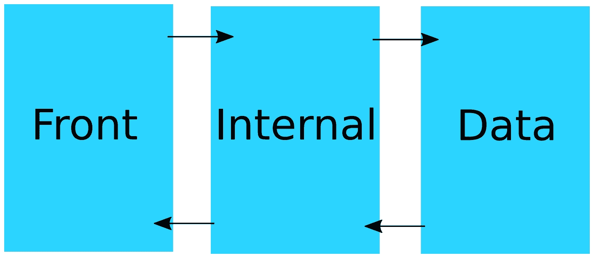
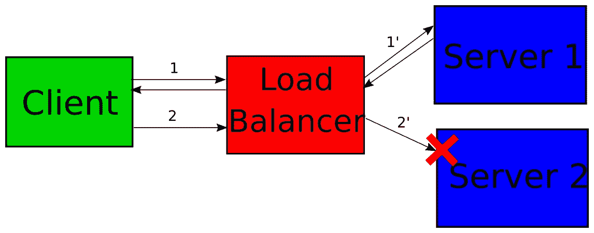
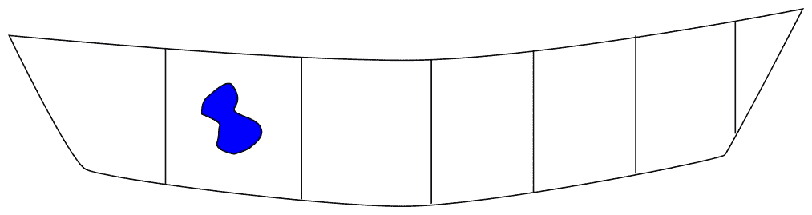

# 第七章：具有容错性

多年来，Java EE 一直致力于将尽可能多的应用程序放入单个应用服务器中，但现在这种做法已经改变。现在，在容器实例中部署单个应用程序并减小应用程序大小以处理单一责任变得更加常见。这种范式转变的直接影响是，整个系统现在由比以前多得多的应用程序组成，我们越来越依赖于远程通信。

在这种情况下，一个应用程序的性能直接取决于另一个应用程序，因此限制应用程序之间的副作用变得非常重要。为了确保您的应用程序能够识别其环境的影响并能够在这种约束下工作，我们将在本章中介绍以下主题：

+   客户端和服务器上的负载均衡

+   失败转移

+   电路断路器

+   使用隔离舱

+   超时处理

# 它肯定会失败，毫无疑问！

在开发应用程序时，我们通常花费大部分时间在*通过*代码路径上，因为代码路径赋予了应用程序实际的功能。然而，不要忘记所有意外情况也很重要。试图解决我们无法控制的事情可能听起来很奇怪，但在这里，我们的想法是遵循墨菲定律，它通常被总结如下：*任何可能出错的事情，最终都会出错*。这并不意味着系统永远不会工作，但它的意思是，如果存在潜在的问题，它最终会成为你的现实。

在现代系统和 Java EE 部署方面，典型的后果是你可能会失去与相关资源或应用程序的连接。你还可以希望解决另一个常见的故障案例，即 JVM 失败（没有更多内存、操作系统问题等），但这与基础设施（可能是 Kubernetes）有关，并且超出了本书的范围。

我们将通过一个非常简单的系统来阐述这一点，其中三个 Java EE 应用程序是串联的：



在这样的架构中，我们可以假设一个前端层暴露了一些客户功能或 API。然后，前端应用程序将实际逻辑委托给另一个团队拥有的内部系统。最后，内部系统依赖于一个数据系统，该系统同样由另一个团队拥有和开发。

使用这种类似的架构并不罕见，但与外部系统一起使用。在这种情况下，你通常有一个支持电话号码，但它很少像打电话给同事那样高效，这使得你在系统失败的情况下更加依赖这个系统/公司。

对于这样的系统来说，重要的是如果数据失败（因为数据工程师进行了一个未按预期工作的升级），那么所有内部系统都将开始失败，因为数据不再响应。递归地，前端系统将因为内部系统失败而失败。

你可能会认为这只会使系统效率低下，并且与性能无关。实际上并非如此。在先前的架构中，数据系统看起来相当集中。如果公司增加第二个内部系统（我们可以称之为*internal2*），那么我们可以假设数据存储的负载将翻倍。然而，如果数据没有为负载增加而调整大小，它将回答得更慢，并且可能会返回更多的错误。在这里，所有消费者服务，包括传递性服务，都将开始变慢，因为它们依赖于数据系统。

这不是你可以真正避免的事情。你可以限制意外故障的影响，但几乎不可能保证它不会发生。如果你是一家大公司，有一个负责所有应用程序的操作团队，这类问题可能会根据优先级得到解决，性能下降将不如系统故障重要。当一个分布式系统像这样开始失败时，每个组件通常会因为关系而缓慢失败，这就是为什么所有应用程序都会被监控团队视为*红色*，这并不帮助他们解决问题，因为只有系统的一部分（在这个例子中是我们的数据系统）正在失败。这就是为什么确保你的系统准备好失败，可以确保在出现问题时系统修复得更快，如果某些相关应用程序失控，对系统其他部分的影响也会降低。

# 负载均衡 – 选择最佳方案

负载均衡是关于定义如何选择处理请求的后端节点。它可以在服务器或客户端上进行，但策略总体上是相同的。它主要是**客户端**或**服务器**的部署问题，因为当**负载均衡器**是一个实例（软件）时，你实际上在最终客户端和你的中间件之间添加了一个**客户端**。

在非常高的层面上，**负载均衡器**可以简化如下：


全球的想法是在**客户端**和**服务器**之间添加一层，这将根据不同的策略来协调请求如何分布到服务器。这张图展示了四个客户端通过**负载均衡器**调用相同的应用程序，负载均衡器将请求处理委托给三个服务器（一个服务器将处理四个客户端请求中的两个）。

这是一种常见的服务器端负载均衡表示，但它也可以应用于客户端。唯一的区别是**负载均衡器**将在客户端的 JVM（Java 虚拟机）内部**部署**，而不是通过网络协议（如 websocket、HTTP 等）接收传入的请求，而是从 JVM 内部（正常方法调用）接收。

# 透明负载均衡 – 客户端与服务器

使用服务器负载均衡器的主要优势是客户端实际上并不关心负载均衡器。具体来说，所有客户端都将使用相同的端点（比如说，*quote-manager.demo.packt.com*），而负载均衡器将分配请求而不需要了解任何客户端信息。这在基础设施方面非常重要，因为你可以更新你的基础设施而无需通知或更新客户端（如果客户端不属于你自己的系统，这可能是不可能的）。

例如，如果你一开始使用两台机器，然后在一个月后决定添加第三台机器，因为负载增加或为了支持*黑色星期五*的额外负载，那么你只需将这台第三台机器注册到负载均衡器上，它将把工作负载分配到三台机器上，而不是只有两台。反之亦然：如果你需要对一台机器进行维护，你可以将其从负载均衡器后面的集群中移除，假设移除一台机器仍然可以支持负载，但在基础设施的规模阶段应该考虑到这一点。然后，离线进行维护，完成后，只需将机器重新添加到集群中即可。

因此，这种分析听起来像是服务器负载均衡是最好的解决方案，也是应该选择的一个。然而，如果你拥有客户端，现代系统有高效的客户端负载均衡器（这在面向微服务的系统中通常是情况）。是什么让服务器负载均衡策略比客户端负载均衡更好？——事实是服务器可以在不通知客户端的情况下进行更新。这意味着如果客户端从服务器/后端更改中自动更新，那么我们在服务器端也实现了同样的效果。在实践中，这是通过一个服务注册表来完成的，它可以列出你可以用来联系服务的 URL 列表。在实践中，客户端负载均衡器将联系这个注册表服务以获取特定服务的端点列表，并定期使用与上一章中看到的池配置策略相似的配置策略更新这个列表。这意味着这个*注册表*服务必须是可靠的，并且可能需要使用服务器负载均衡器解决方案，但然后，所有其他服务都可以使用点对点连接（无需中间负载均衡器实例）。从应用程序的影响来看，这意味着添加（或删除）服务器必须意味着（去）注册到注册表，而不是负载均衡器，但在两种情况下都是同样的工作。

到目前为止，我们看到客户端和服务器负载均衡都可以实现类似的功能，那么有什么可以区分它们呢？你可以使用两个主要标准来在两者之间进行选择：

+   谁负责基础设施和负载均衡？如果是开发（运维）团队，这两种解决方案都能很好地工作。然而，如果你在一个将开发和运维分开成不同团队的公司工作，你可能会更倾向于将这部分工作委托给运维团队，因此使用服务器负载均衡器，他们将完全控制，而不会影响应用程序开发。

+   你想在负载均衡器内部实现什么样的逻辑？服务器端负载均衡器已经实现了最常见的策略，并且通常还提供了一种小型的脚本语言，你可以用它来自定义。然而，如果你有一个非常定制的策略（可能依赖于你的应用程序状态），那么你将需要在客户端编写负载均衡策略。

总结来说，客户端负载均衡在开发方面影响更大，因为你需要在客户端处理它，这意味着在所有客户端而不是服务器端的一个实例上，但它为你提供了针对非常高级需求的真实更多权力。

# 常见策略

如何分配请求是负载均衡器的核心部分。在本节中，我们将介绍你在配置负载均衡器时可能会遇到的最常见的解决方案。

# 轮询算法

轮询算法无疑是所有策略中最为人所知的。它将集群（*服务器*）中可用的成员列表视为一个环，并在每次请求到来时连续遍历这个环。

例如，如果你有三个服务器（`server1.company.com`，`server2.company.com`，`server3.company.com`），以下是第一个请求的处理方式：

| **请求编号** | **选择的服务器** |
| --- | --- |
| 1 | `server1.company.com` |
| 2 | `server2.company.com` |
| 3 | `server3.company.com` |
| 4 | `server1.company.com` |
| 5 | `server2.company.com` |
| 6 | `server3.company.com` |
| 7 | `server1.company.com` |
| ... | ... |

你会注意到，为了实现*公平*的分配，负载均衡器策略必须在每次选择服务器时锁定或同步列表。还有其他这种算法的变体，其实现是无锁的，但分布的公平性不能完全保证。然而，请记住，这通常不是你真正关心的事情，因为你希望有一个看起来像是公平的解决方案。

# 随机负载均衡

随机负载均衡也针对服务器列表进行操作，但每次请求到来时，它会随机选择一个。如果随机实现是均匀分布的，它会导致接近轮询解决方案的分布。然而，它可能具有更好的可扩展性，因为它不需要同步列表来选择要使用的*当前*服务器。

# 链接到故障转移

我们将在下一节中更多地讨论故障转移，但在此处提到负载均衡可以用来实现故障转移策略是很重要的。在这里，目标将是如果当前服务器失败，尝试将请求发送到另一台机器。这可以看作是轮询，但与使用每个请求作为触发器来迭代主机列表（以更改目标实例）不同，失败将是触发器。以下是一个使用故障转移策略的示例序列，考虑到我们与轮询部分相同的三个主机：

| **请求编号** | **选择的服务器** | **状态** |
| --- | --- | --- |
| 1 | `server1.company.com` | 正常 |
| 2 | `server1.company.com` | 正常 |
| 3 | `server1.company.com` | 正常 |
| 4 | `server1.company.com` | 正常 |
| *5* | `server1.company.com` | *正常* |
| 6 | `server2.company.com` | 正常 |
| 7 | `server2.company.com` | 正常 |
| ... | ... |  |

如前表所示，每个请求都使用相同的宿主（`server1.company.com`），直到请求失败（请求编号 5），在这种情况下，算法将迭代主机列表并开始使用 `server2.company.com`。

事实上，这个算法有一些变体。例如，失败的请求可以与列表中的下一个主机重试（或不重试），或者你可以配置在切换主机之前等待的失败次数，甚至可以配置失败的含义（默认情况下通常是 5xx HTTP 状态，但你也可以将其配置为任何 HTTP 状态> 399，或者基于响应的标题或其他部分来做出这个选择）。

# 粘性会话

粘性会话路由通常用于业务用例。其想法是在会话启动时始终将客户端路由到同一后端服务器。Java EE 通过 `SessionTrackingMode` 定义了三种会话模式：

+   **COOKIE**：会话通过其标识符（`JSESSIONID`）在 cookie 中跟踪，因此它击中浏览器（客户端）并随每个请求在 cookie 中发送。

+   **URL**：`JSESSIONID` 通过 URL 发送到客户端。例如：`http://sample.packt.com/quote-manager/index.html;jessionid=1234`

+   **SSL**：这使用 HTTPS 原生机制来识别会话。

每次跟踪都是通过在客户端和服务器之间传递一个共享的 *标识符* 来实现的。如果在两者之间添加一个负载均衡器，如果不针对同一主机，通信可能会中断。以下是表示这个陈述的图表：



此图表示一个**客户端**服务两个请求。第一个请求（**1**）将击中**负载均衡器**，它将请求重定向到**服务器 1**（**1'**），请求处理将在**服务器 1**上创建一个会话。这意味着第一个请求的响应将创建一个`JSESSIONID`（或其 SSL 替代品）。现在，客户端发出第二个请求（**2**），在这里，**负载均衡器**根据策略的粘性将请求重定向到第二个服务器（**2'**）。在**服务器 2**上的处理过程中，应用程序试图访问在第一个请求期间创建的会话信息（例如，已识别的用户），但由于我们切换了节点，会话不在这里。因此，请求处理失败（红色交叉）。

为了确保此工作流程正常工作，有两种主要解决方案：

+   确保会话状态在所有节点之间分布和共享。此解决方案在服务器之间设置了一种类型的分布式存储空间。这通常意味着大量的延迟（如果同步完成），或者在异步完成时，可能会出现一些潜在的遗漏（故障），这可能导致与先前方案相同的问题。它还意味着要配置除服务器默认会话处理之外的解决方案，该处理默认情况下仅限于本地。

+   确保负载均衡器在创建会话后始终击中相同的后端节点。这就是我们所说的**粘性会话**模式。负载均衡器将检查是否存在`JSESSIONID`（或 SSL 连接），如果存在，则存储创建它的节点。如果它再次在请求中看到此标识符，它将重定向请求到同一节点，忽略任何分布策略。

这意味着粘性会话模式通常与另一种策略相结合，该策略将定义分布，因为粘性会话仅在已经为客户端服务了一个请求之后才适用。

# 调度算法

调度算法是基于某些统计标准的一类广泛策略。这里的想法是更准确地关于负载分布的方式，考虑到后端服务器上的可用资源。最常用的标准如下：

+   **按请求**：分布基于节点服务的请求数量。请注意，每个服务器节点可以与这种分布相关联一个权重，以偏置分布，如果一台机器不如其他机器强大。

+   **按流量**：这与先前的分布类似，但不是计数请求，而是使用传输的字节数。

+   **按繁忙程度**：这也是基于请求数量，但仅限于活动数量。选择最不繁忙的节点。

+   **心跳**：这本身不是一个分发解决方案，而更像是一种替代评估解决方案。它使用心跳或*代理*来评估节点所承受的负载，并根据这些信息将负载分配给可以处理最多负载的节点。这通常是一种时间统计，因此它是动态和自适应的。

# 负载均衡或代理 – 额外功能

即使您设置了负载均衡以使用之前的一种策略来分配负载，负载均衡器解决方案通常是一个完整的代理，因此也提供了额外的功能。这通常更多地涉及服务器中间件而不是客户端，但它仍然非常有趣。从后端（服务器）的角度来看，您可以获得的部分功能如下：

+   **压缩**：您的后端服务器可以提供纯文本，而负载均衡器/代理层将自动在文本资源（HTML、JavaScript、CSS 等）上添加 GZIP 压缩。由于客户端（浏览器）到负载均衡器的通信通常比负载均衡器到服务器/后端通信慢，这将允许您为这些请求节省宝贵的时间。

+   **TCP 缓冲**：在这里，想法是在负载均衡器层缓冲后端服务器发送的响应，以减轻后端的负担，并让它处理其他请求。这对于缓慢的客户端很有用，它们会在后端保持连接，但不会引起任何处理/计算工作。

+   **HTTP 缓存**：在上一节中，我们看到了 HTTP 定义了一些缓存。代理层可以免费为您处理，而无需请求后端服务器。这通常仅涉及静态资源，在这种情况下被移动到代理层。

+   **加密**：代理层可以加密请求的一部分，以防止最终用户了解足够关于后端的信息，从而理解其工作方式或甚至访问一些敏感数据。

当负载均衡器层添加比通信/网络导向更偏向于商业化的功能时，我们通常称之为*网关*。然而，从技术上来说，它基本上是一种类似的中间件。以下是您可以在网关中找到的功能：

+   **安全处理**：负载均衡器层可以验证请求（通常来自标题）中的权限。

+   **版本处理**：根据传入的请求，路由（后端请求的端点）可以改变，使我们能够自动处理后端点的版本。

+   **速率限制**：这限制了后端访问的速率，无论是通过应用程序还是按用户，如果认证与速率限制相关联。这通常以每单位时间允许的请求数量来表示，例如，每分钟 1,000 个请求。

+   **并发限制**：这控制了可以并行/同时发送的请求数量。至于速率限制，它可以针对整个应用程序或每个用户（或相关其他单位）进行。例如，512 个请求。

如你所见，有几个特性，而且它们都不与性能相关。然而，根据你的最终环境，大多数特性都会对性能产生影响。例如，HTTP 缓存将允许你的后端服务器处理更多的实际负载，因此更容易进行扩展。速率/并发限制特性可以使你控制性能，并确保在意外负载情况下不会降低性能，但其他特性，如安全性特性，如果网关层可以使用硬件加密解决方案而不是通常在 Java EE 应用程序中使用的软件加密，可能会对你的性能产生非常强烈的影响。

在这里需要记住的重要一点是将应用程序视为一个系统解决方案，而不是试图将所有内容都放在应用程序中，仅仅因为这样做更容易或更便携。依赖于经过良好优化的硬件解决方案，与优化软件解决方案相比，将产生良好的性能，尤其是在安全性和加密方面，这会影响你应用程序的可移植性。

# 备用

在分布式系统中，确保你知道如何处理故障非常重要。Java EE 应用程序越来越多地连接到其他系统，它们面临越来越多的挑战，因此了解在发生故障转移时如何处理非常重要。

备用的第一个含义确实是“故障转移”。它可以重新表述为*在主系统失败时切换到备用系统的能力*。在 Java EE 应用程序中，有很多地方可以设置这个，但它们都与外部系统相关：

+   **数据库**：如果数据库连接失败，如何仍然处理请求？

+   **JMS**：如果代理失败，怎么办？

+   **其他网络 API（如 SOAP 或 REST API）**：如果远程服务器宕机，怎么办？

+   **WebSocket**：如果目标服务器关闭连接或失败，怎么办？

通常情况下，每次你的应用程序依赖于它无法控制的东西（即外部系统），它可能需要一个备用计划，以便在主要解决方案不再响应或工作时仍然能够正常工作。

处理故障转移有几种方法，它们要么依赖于选择另一个系统，要么基于某些默认/缓存实现。

# 切换到另一个系统

备用的最简单实现是在发生错误时切换到另一个系统。这就是我们在上一节中看到的负载均衡。我们能够实施备用的唯一条件是能够识别系统遇到的错误。

这里使用 Java EE 的 JAX-RS 客户端 API 的示例来说明这个逻辑：

```java
@ApplicationScoped
public class ExternalServiceClient {
    @Inject
    private Client client;

    public Data get() {
        return Stream.of("http://server1.company.com",
        "http://server2.company.com")
                .map(server -> {
                    try {
                        return client.target(server)
                                .path("/api/quote")
                                .request(APPLICATION_JSON_TYPE)
                                .get(Data.class);
                    } catch (final WebApplicationException wae) {
                        if (supportsFailover(wae)) {
                            return null;
                        }
                        throw wae;
                    }
                })
                .filter(Objects::nonNull)
                .findFirst()
                .orElseThrow(() -> new IllegalStateException("No
                available target
                server"));
    }
}
```

这个片段用`Stream`替换了对远程 API 的直接调用。在这里使用`Stream`比使用`Collection`更复杂，因为流的叶子将触发（按元素）执行流程，并允许我们在遇到最终条件时提前停止*迭代*。具体来说，它防止我们在不相关的情况下迭代所有元素，这正是我们想要的故障转移。在实现方面，这里是流程：

+   从服务器端，我们调用我们想要的端点。

+   我们处理服务器的响应。如果它需要故障转移，我们返回`null`；否则，我们保持调用的默认行为。

+   我们从流程中移除了`null`响应，因为前一步定义`null`为故障转移条件。

+   我们使用第一个可用的响应作为有效响应，这将避免对所有服务器进行调用。

+   如果所有服务器都失败，那么我们抛出`IllegalStateException`。

之前片段中缺少的是评估我们想要故障转移的方式。在之前的代码中，我们是基于`WebApplicationExceptinon`来做出这个决定的，所以客户端可以在出错时抛出异常。`supportsFailover()`的默认实现只是返回`true`，但我们可以做得更复杂一些：

```java
private boolean supportsFailover(final WebApplicationException wae) {
    final Response response = wae.getResponse();
    if (response == null) { // client error, no need to retry
        return false;
    }
    return response.getStatus() > 412;
    // 404, 412 are correct answers we don't need to retry
}
```

这仍然是一个简单的实现，但我们使用 HTTP 状态码来重试，只有当其值大于 412 时，这意味着如果得到 HTTP 404（未找到）或 HTTP 412（预处理失败），我们不会重试，因为这两种情况都会导致向另一个服务器发送相同的请求并得到相同的响应。

当然，你可以自定义很多这种逻辑（这甚至可能取决于服务），但幸运的是，Java EE 为你提供了所有你需要的东西。

# 本地回退

之前的故障转移实现是考虑到如果主系统失败，有一个替代系统可以联系。这并不总是情况，你可能在出错的情况下希望用本地默认值替换远程调用。这种解决方案在 hystrix 框架中可用，可以使用我们之前看到的并发工具与 Java EE 集成。

默认逻辑的高级逻辑如下：

```java
try {
    return getRemoteResponse();
    } catch (final UnexpectedError error) {
    return getLocalResponse();
}
```

这实际上是对之前实现的泛化。你不需要看到要联系的主机列表，而是需要将远程调用视为一系列任务。具体来说，我们可以这样重写：

```java
@ApplicationScoped
public class ExternalServiceClient {
    @Inject
    private Client client;

    public Data get() {
        return Stream.<Supplier<Data>>of(
                    () -> getData("http://server1.company.com"),
                    () -> getData("http://server1.company.com"))
                .filter(Objects::nonNull)
                .findFirst()
                .orElseThrow(() -> new IllegalStateException("No
                available remote
                server"));
    }

    private Data getData(final String host) {
        try {
            return client.target(host)
                    .path("/api/quote")
                    .request(APPLICATION_JSON_TYPE)
                    .get(Data.class);
        } catch (final WebApplicationException wae) {
            if (supportsFailover(wae)) {
                return null;
            }
            throw wae;
        }
    }

    // supportsFailover() as before
}
```

在这里，我们只是将客户端调用移动到方法中，并用调用流替换了我们的主机流。流逻辑完全相同——也就是说，它将取列表中的第一个有效结果。

这种解决方案的直接收益是，由于你传递的是任务给故障转移逻辑，而不是主机，你可以按自己的意愿实现每个任务。例如，如果你想默认使用硬编码的值，你可以这样做：

```java
Stream.<Supplier<Data>>of(
            () -> getData("http://server1.company.com"),
            () -> new Data("some value"))
```

使用此定义，我们首先尝试联系`http://server1.company.com`，如果失败，我们将在本地创建一个`Data`实例。

在看到可以使用哪些策略进行这些回退之前，让我们先花一点时间看看它在代码组织方面可以意味着什么。

# 回退代码结构

当您只是处理服务器之间的故障转移时，它并不复杂，因为您可能已经在`Client`类中有主机列表，并且遍历它们几乎是自然的。现在，当我们遍历不同的实现时，这就不那么自然了，我们需要一个*编排器*豆。具体来说，对于之前的例子，它首先调用远程服务，然后回退到本地硬编码的实例化，我们需要以下内容：

+   远程客户端

+   本地*模拟*实现

+   一个门面（编排）服务，它被用于各个地方，因此我们可以利用这个故障转移逻辑

当您开始集成大量服务时，这并不方便。

# Microprofile 来拯救

Microprofile 在其范围内包含一个规范，帮助您以“标准”方式处理您的回退逻辑。该规范允许在方法失败的情况下定义回退方法引用或处理程序。以下是一个例子：

```java
@Fallback(method = "getDataFallback")
public Data getData() {
    return client.target("http://server1.company.com")
               .request(APPLICATION_JSON_TYPE)
               .get(Data.Class);
}

private Data getDataFallback() {
    return new Data(...);
}
```

在这里，您将从封装服务的所有消费者中调用`getData`，如果方法失败，微 Profile 回退处理将自动调用`getDataFallback`。

此实现还支持`@Retry`，它允许您定义在回退到回退处理/方法之前，您将执行主方法（在之前的例子中为`getData`）多少次。

这个 API 很简洁，但将不同的实现耦合在一起，因为主方法和次要方法通过`@Fallback` API 链接。

# 故障转移扩展

使用 CDI，您可以定义一个小扩展，该扩展将自动处理故障转移，就像我们之前处理流一样，无需太多努力。该扩展将由两个主要部分组成：

+   它将识别特定逻辑的所有实现

+   它将注册一个豆，以正确顺序使用故障转移逻辑链接实现

为了做到这一点，我们需要一些 API 元素：

+   为了找到一个服务实现，我们将使用`@Failoverable`标记接口方法，以标识我们需要为该接口创建一个故障转移实现；我们还将使用此注解来标记实现。

+   为了对服务进行排序，我们将使用`@Priority`。为了简单起见，我们将只使用优先级值作为排序顺序。

从用户的角度来看，这里有一个之前的例子：

|

```java
@Failoverable
public interface GetData {
    Data fetch();
}
```

|

```java
@ApplicationScoped
@Priority(0)
@Failoverable
public class RemoteGetData {
    @Inject
    private Client client;

    @Override
    public Data fetch() {
        return client.
        ....
        get(Data.class);
    }
}
```

|

```java
@ApplicationScoped
@Priority(1000)
@Failoverable
public class LocalGetData {
    @Override
    public Data fetch() {
        return new Data(...);
    }
}
```

|

接口定义了我们想要支持故障转移的方法。然后，我们有两种不同的实现及其优先级。这种组织方式将允许我们添加另一种策略并将其轻松自动地插入链中，而无需修改所有其他实现，并尊重 CDI 的松耦合。现在，任何用户都可以将`GetData`bean 注入任何服务并调用`fetch()`以实现自动故障转移。

这个例子没有为方法定义任何参数，但这并不是限制，你可以用这种策略使用任何方法，即使是复杂的。

在调用者代码方面，它看起来就像任何 CDI bean 调用：

```java
public class MyService {
    @Inject
    private GetData dataService;

    public void saveData() {
        final Data data = dataService.fetch();
        doSave(data);
    }

    // implement doSave as you need
}
```

就这样！不需要为最终用户实现`GetData`故障转移；这是由扩展完成的。

现在我们已经看到了 API 的样子，让我们看看 CDI 如何使我们轻松地做到这一点。

第一步是定义我们的 API；唯一不在 Java EE 中的 API 是`@Failoverable`。它是一个普通的注解，没有特别之处，除了它必须能够应用于接口：

```java
@Target(TYPE)
@Retention(RUNTIME)
public @interface Failoverable {
}
```

然后，我们只需要一个扩展来识别带有此注解的接口的实现，对它们进行排序，并为每个接口定义一个 bean：

```java
public class FailoverExtension implements Extension {
  private final Map<Class<?>, Collection<Bean<?>>> beans = new
  HashMap<>();
  private final Annotation failoverableQualifier = new
  AnnotationLiteral<Failoverable>() {
  };

  // ensure our @Failoverable annotation is qualifying the beans who
  used this
  annotation
  // to avoid any ambiguous resolution during the startup
  void addQualifier(@Observes final BeforeBeanDiscovery
  beforeBeanDiscovery) {
    beforeBeanDiscovery.addQualifier(Failoverable.class);
  }

  // find all API we want to have support for failover
  void captureFailoverable(@Observes
  @WithAnnotations(Failoverable.class) final
  ProcessAnnotatedType<?> processAnnotatedType) {
    final AnnotatedType<?> annotatedType =
    processAnnotatedType.getAnnotatedType();
    final Class<?> javaClass = annotatedType.getJavaClass();
    if (javaClass.isInterface() &&
    annotatedType.isAnnotationPresent(Failoverable.class)) {
      getOrCreateImplementationsFor(javaClass);
    }
  }

  // find all implementations of the failover API/interfaces
  void findService(@Observes final ProcessBean<?> processBean) {
    extractFailoverable(processBean)
        .ifPresent(api ->
        getOrCreateImplementationsFor(api).add(processBean.getBean()));
  }

  // iterates over all API and create a new implementation for them
  which is
  added
  // as a new CDI bean with @Default (implicit) qualifier.
  // to do that we use the new CDI 2.0 configurator API (addBean())
  which allows
  // us to define a bean "inline".
  void addFailoverableImplementations(@Observes final
  AfterBeanDiscovery
  afterBeanDiscovery, final BeanManager beanManager) {
    beans.forEach((api, implementations) ->
        afterBeanDiscovery.addBean()
          .types(api, Object.class)
          .scope(ApplicationScoped.class)
          .id(Failoverable.class.getName() + "(" + api.getName() + ")")
          .qualifiers(Default.Literal.INSTANCE, Any.Literal.INSTANCE)
          .createWith(ctx -> {
            final Collection<Object> delegates =
            implementations.stream()
                .sorted(Comparator.comparingInt(b -> getPriority(b,
                beanManager)))
                .map(b -> beanManager.createInstance()
                    .select(b.getBeanClass(),
                    failoverableQualifier).get())
                .collect(toList());
            final FailoverableHandler handler = new
            FailoverableHandler(delegates);
            return Proxy.newProxyInstance(api.getClassLoader(), new
            Class<?>[
            ]{api}, handler);
          }));
    beans.clear();
  }

  // helper method to extract the priority of an implementation
  // to be able to sort the implementation and failover properly
  // on lower priority implementations
  private int getPriority(final Bean<?> bean, final BeanManager
  beanManager) {
    final AnnotatedType<?> annotatedType =
    beanManager.createAnnotatedType(bean.getBeanClass());
    return
  Optional.ofNullable(annotatedType.getAnnotation(Priority.class))
        .map(Priority::value)
        .orElse(1000);
  }

  // if the api doesn't have yet a "bucket" (list) for its
  implementations
  // create one, otherwise reuse it
  private Collection<Bean<?>> getOrCreateImplementationsFor(final Class
  api) {
    return beans.computeIfAbsent(api, i -> new ArrayList<>());
  }

  // if the bean is an implementation then extract its API.
  // we do it filtering the interfaces of the implementation
  private Optional<Class> extractFailoverable(final ProcessBean<?>
  processBean) {
    return 
  processBean.getBean().getQualifiers().contains(failoverableQualifier)
    ?
        processBean.getBean().getTypes().stream()
          .filter(Class.class::isInstance)
          .map(Class.class::cast)
          .filter(i -> i.isAnnotationPresent(Failoverable.class))
          .flatMap(impl -> Stream.of(impl.getInterfaces()).filter(i ->
          i !=
          Serializable.class))
          .findFirst() : Optional.empty();
  }
}
```

此扩展有四个主要入口点：

+   `captureFailoverable`：这将确保任何`@Failoverable`接口都被注册，并且即使没有服务实现它，也会自动获得默认实现。它避免了在部署时出现“bean 未找到”错误，而是会抛出我们的故障转移实现异常，以确保对所有 bean 的一致异常处理。请注意，它仅在包含接口的模块的扫描模式包括接口（即，不是`annotated`）时才有效。如果不是，我们可能在部署期间遇到`UnsatisfiedResolutionException`或等效异常。

+   `findService`：这会捕获所有`@Failoverable`接口的实现。

+   `addFailoverableImplementations`：这会添加一个带有`@Default`限定符的 bean，实现`@Failoverable`接口。

+   `addQualifier`：这只是在我们的`@Failoverable`API 上添加了一个限定符，以避免模糊解析，因为所有服务（实现）都将实现相同的 API，我们希望使用`@Default`限定符（隐式限定符）来使用我们的门面。请注意，我们也可以在注解上添加`@Qualifier`。

此外，为了注册此扩展，别忘了创建一个包含该类完全限定名称的`META-INF/services/javax.enterprise.inject.spi.Extension`文件。

门面 bean 的实现是通过代理完成的。所有故障转移逻辑都将传递给处理程序，处理程序作为输入接收一个代表我们在`findService`中确定的实现者的代理列表：

```java
class FailoverableHandler implements InvocationHandler {
    private final Collection<Object> delegates;

    FailoverableHandler(final Collection<Object> implementations) {
        this.delegates = implementations;
    }

    @Override
    public Object invoke(final Object proxy, final Method method, final
    Object[]
    args) throws Throwable {
        for (final Object delegate : delegates) {
            try {
                return method.invoke(delegate, args);
            } catch (final InvocationTargetException ite) {
                final Throwable targetException =
                ite.getTargetException();
                if (supportsFailover(targetException)) {
                    continue;
                }
                throw targetException;
            }
        }
        throw new FailoverException("No success for " + method + "
        between " +
        delegates.size() + " services");
    }

    private boolean supportsFailover(final Throwable targetException) {
        return 
    targetException.getClass().isAnnotationPresent(Failoverable.class);
    }
}
```

这种实现可能是最直接的：

+   代理列表已经排序（参见上一个扩展）。

+   它遍历代理并尝试对每个代理进行调用；第一个成功的是返回值。

+   如果没有调用成功，则抛出`FailoverException`，这包括没有提供实现的情况（即`delegates`列表为空）。

+   如果抛出异常，会测试是否应该发生故障转移，并使用下一个代理。在这个实现中，这是通过确保异常上有`@Failoverable`注解来完成的，但也可以测试一些众所周知的异常，例如`WebApplicationException`或`IllegalStateException`等。

# 回退处理 - 缓存，一种替代解决方案

在前一小节中，我们看到了如何使用另一种策略来处理回退，这可以是一个硬编码的默认值，或者可以是一种计算服务的方法，包括如何从另一个提供商联系另一个服务。这是故障转移的直接实现。

然而，如果你退一步思考你为什么要设置一些故障转移机制，你会意识到这是为了确保即使外部系统出现故障，你的服务也能运行。因此，还有一个解决方案，严格来说它不是一个故障转移，但实现了相同的目标，那就是缓存。在前一节中，我们看到了 JCache 如何帮助你的应用更快地运行，使你能够绕过计算。从外部系统缓存数据也使你更加健壮，并且可能防止你为它们实现故障转移机制。

让我们用一个非常简单的例子来说明这一点。在我们的报价应用（第一章，*货币 - 报价管理应用*）中，我们从 CBOE 获取要使用的符号列表，并查询 Yahoo!Finance 以获取每个报价的价格。如果这两个服务中的任何一个出现故障，那么我们就不会收到任何价格更新。然而，如果我们已经执行过这个逻辑一次，那么价格和符号列表将存储在我们的数据库中，这可以看作是一种*持久缓存*。这意味着即使后台更新过程失败，我们的应用仍然可以通过我们的 JAX-RS 端点为客户端提供服务。如果我们想更进一步，可以将这个逻辑更新为在 CBOE 服务不再可用时回退到选择数据库中的所有符号，这将允许应用至少获取价格更新，并且比如果整个更新过程因为 CBOE 故障而失败要更准确。

更普遍地说，如果一个远程系统并不完全可靠，并且数据可以被缓存，这意味着数据会被定期（重新）使用，并且对于你的业务来说可能有点过时，那么缓存是故障转移的一个非常好的替代方案。

在实现方面，你有两个主要选项：

+   手动处理缓存和回退（不推荐）

+   使用缓存作为数据源，如果数据过时或缺失则回退到外部系统

第一个选项是直接的故障转移处理，但回退实现基于缓存访问。实际上，这种解决方案认为您将在主源工作时会填充缓存；否则，回退将只返回`null`。

第二个选项可以通过我们在上一部分看到的解决方案实现，无论是使用 JCache CDI 集成还是将`Cache` API 作为应用程序中的主源手动使用。您会注意到，这反转了故障转移范式，因为主源（远程系统）成为次要的，因为首先检查缓存。但这就是缓存的工作方式，如果远程系统支持缓存，您将大多数时候从中获得更多的好处。

要提供缓存，您可以使用`@CacheResult` API，但不要忘记添加`skipGet=true`以仅提供缓存而不绕过逻辑。例如，它可以看起来像这样：

```java
@ApplicationScoped
public class QuoteServiceClient {
    @Inject
    private Client client;

    @CacheResult(skipGet = true)
    public Data fetch() {
        return client.target(....)....get(Data.class);
    }
}
```

强制 JCache 跳过与`@CacheResult`关联的拦截器的获取阶段，使您在方法成功时可以将结果放入缓存，但如果结果已经在缓存中，则不使用缓存数据。因此，如果此服务与一个后备服务链式连接，该后备服务从缓存中读取数据，它将正确实现基于缓存数据的故障转移。

然而，请注意这里有一个技巧——您需要使用正确的缓存名称和键。为此，不要犹豫，也可以使用另一个依赖于 JCache 的方法：

```java
@ApplicationScoped
public class QuoteServiceCache {

    @CacheResult(cacheName =
    "com.company.quote.QuoteServiceClient.fetch()")
    public Data fetch() {
        return null;
    }
}
```

实现相当简单；如果它不在缓存中，则返回`null`来表示没有数据。另一种实现可能是抛出异常，具体取决于您想提供的调用者行为。然后，为了确保我们使用与之前主服务相同的缓存，我们使用之前方法的名字命名缓存。在这里，我们使用了主服务的默认名称，并将其设置为次要服务，但您也可以使用更面向业务的缓存名称，通过我们在第六章中看到的`cacheName`配置来实现。*懒一点；缓存你的数据*。

现在，如果我们回到以缓存为第一的解决方案，反转主次源，我们可以稍作不同的实现。如果缓存是源，我们仍然可以使用 CDI 集成，但缓存的提供（现在是次要源）可以通过本地的 JCache 机制完成。具体来说，我们的服务可以看起来如下：

```java
@ApplicationScoped
public class QuoteServiceClient {
    @Inject
    private Client client;

    @CacheResult
    public Data fetch() {
        return client.....get(Data.Class);
    }
}
```

这是使用它的标准方式，但还有一种替代方式可以更好地与手动缓存处理配合使用——即不使用 CDI 集成。我们不是将方法作为后备并缓存其结果，而是在配置缓存时程序化地设置缓存懒加载的方式。在这种情况下，我们的服务可以变成以下这样：

```java
@ApplicationScoped
public class QuoteServiceClient {
    @CacheResult
    public Data fetch() {
        return null;
    }
}
```

是的，你正确地看到了：我们甚至没有在服务中实现加载逻辑！那么它去哪里了？这个服务将触发 `cache.get(...)`，所以当数据不可用时，我们需要在调用 `get()` 时注入我们的数据。为此，我们可以使用 `CacheLoader` API，该 API 在缓存本身上初始化。

要配置缓存，你可以使用自定义的 `CacheResolver`（有关更多详细信息，请参阅上一章），它将 `CacheLoader` 设置到缓存配置中：

```java
new MutableConfiguration<>()
 .setCacheLoaderFactory(new FactoryBuilder.SingletonFactory<>(new QuoteLoader()))
```

加载器的实现现在可以是以下内容：

```java
@ApplicationScoped
public class QuoteLoader implements CacheLoader<QuoteGeneratedCacheKey, Quote> {
    @Inject
    private QuoteClient client;

    @Override
    public Quote load(QuoteGeneratedCacheKey generatedCacheKey) throws
    CacheLoaderException {
        return client.load(key.extractSymbol());
    }

    @Override
    public Map<QuoteGeneratedCacheKey, Quote> loadAll(final Iterable<?
 extends
    QuoteGeneratedCacheKey> iterable) throws CacheLoaderException {
        return StreamSupport.stream(
            Spliterators.spliteratorUnknownSize(iterable.iterator(),
            Spliterator.IMMUTABLE), false)
                .collect(toMap(identity(), this::load));
    }
}
```

`loadAll` 方法只是委托给 `load` 方法，所以它并不很有趣，但在某些情况下，你可以一次性批量加载多个值，并且有不同实现是有意义的。`load` 方法将加载委托给 CDI 容器。我们可以认为在这里我们调用远程服务时没有进行故障转移。

这个解决方案的重要点是有一个自定义的 `GeneratedKey` 键，以便能够解包它并提取业务键（在先前的示例中是 `extractSymbol()`），以便能够执行实际业务。作为对上一章的快速回顾，`GeneratedKey` 是从 JCache CDI 集成中的方法签名中推导出的键，因此你需要确保你可以使用 `@CacheResult` 与此类键一起工作。正如我们在第六章中看到的，*要懒散；缓存你的数据*，使用自定义的 `CacheKeyGenerator` 允许你满足这个解决方案的要求。

在使用方面，你何时应该使用 `CacheLoader` 而不是表现得像隐式缓存加载器的方法实现？当你不使用 CDI 集成时，缓存加载器更有意义，因为在这种情况下，你操作一个更自然的键（例如，对于符号的字符串）并得到相同的行为：

```java
Cache<String, Quote> quotes = getNewQuoteCacheWithLoader();
Quote pckt = quotes.get("PCKT");
```

如果缓存被设置为在缓存中不存在数据时从远程服务加载数据，那么这个片段的第二行将调用远程服务并透明地使用数据初始化缓存。

这种缓存使用方式也适用于远程服务的情况，该服务受到速率限制。这将允许你比没有缓存时更多地依赖其数据。例如，如果服务每分钟只接受 1000 次带有你的凭证的请求，那么使用缓存，你每分钟可以调用它 10000 次。

# 断路器

断路器涉及允许应用程序在已知或估计为失败时禁用代码路径。

例如，如果你调用一个远程服务并且这个服务已经失败了 10 次，那么你可以这样说：*不要再次调用这个服务 5 分钟*。主要思想是在可能的情况下绕过错误。

断路器通常有三个状态：

+   **关闭（CLOSED）**：系统被认为是正常工作的，所以使用它（默认情况）。

+   **打开（OPEN）**：系统被认为是无法工作的，所以绕过它。

+   **半开式（HALF-OPEN）**：系统必须重新评估。尝试一个调用：如果失败，则回到**开放（OPEN）**状态；否则，进入**关闭（CLOSED）**状态。

然后，从一个状态到另一个状态的所有条件都是可配置的。例如，触发**关闭（CLOSED）**状态的是什么取决于您如何配置它（可以是异常、HTTP 状态、超时等）。当系统进入**半开（HALF-OPEN）**状态时，情况也适用——可以是超时、请求数量等。

有多种断路器实现方式可用，但 Java EE 中最知名的是这些项目：

+   Hystrix

+   Failsafe

+   `Microprofile fault-tolerant specification`

+   `commons-lang3`项目。

使用断路器对于确保系统健康非常重要，以确保即使某个功能不正常，系统也能始终保持健康。然而，它也可以用于性能，因为它会在系统开始失败时保持它们受控，避免连锁反应，即一个失败系统与另一个系统之间的每个连接都意味着另一个系统也会失败。为了确保断路器的影响符合预期，您需要将其与两个解决方案相关联：

+   一个故障转移解决方案，以确保您的系统（尽可能）正确地运行。

+   一个监控解决方案，以确保您正确报告您不再完全功能正常，以便支持/运维团队能够高效工作，并使您的断路器在失败系统修复后自动恢复。

# Bulk head

Bulk head 是一种设计模式，旨在确保系统的任何部分都不会对其他系统区域产生深远影响。这个名字来源于在船只上常用的一个解决方案，以确保如果船体有洞，它不会导致船沉没。



例如，这里第二个区域有一个洞，水进入了该部分，但船不会沉没，因为其他部分是隔离的。

泰坦尼克号使用了这种技术，但隔离并没有从底部到顶部完全完成，以保障乘客和船员舒适。我们都知道那个选择的结果。这就是为什么，如果您选择隔离，确保它是完整的很重要；否则最好不要做任何事情。

这对应用程序意味着什么？这意味着每个可能导致你的应用程序崩溃的服务都应该与其他服务隔离开。这种隔离主要关于执行和因此服务调用的执行环境。具体来说，通常关于哪个池（线程、连接等）和哪个上下文要加载。为了能够隔离服务，你需要能够识别你正在调用的服务。如果我们以我们的报价管理应用程序为例，我们可以识别出*quote finder*服务，它可以与*quote update*服务隔离开，例如。这是隔离的业务标准，但在实践中，你通常会想更进一步，隔离服务的执行，包括使用租户。使用不同池为不同租户是常见的情况。这实际上通常与不同的合同条款有关。

为了在 Java EE 应用程序中说明这个概念，我们将更新我们的`QuoteResource#findId`方法以应用此模式。第一步将是将调用与 servlet 容器上下文/线程隔离开。为此，我们将使方法异步，使用 JAX-RS 的`@Suspended` API 和 Java EE 并发实用工具线程池：

```java
@Resource(name = "threads/quote-manager/quote/findById")
private ManagedExecutorService findByIdPool;

@GET
@Path("{id}")
public void findById(@PathParam("id") final long id,
                     @Suspended final AsyncResponse response) {
    findByIdPool.execute(() -> {
        final Optional<JsonQuote> result = quoteService.findById(id)
                .map(quote -> {
                    final JsonQuote json = new JsonQuote();
                    json.setId(quote.getId());
                    json.setName(quote.getName());
                    json.setValue(quote.getValue());
                    json.setCustomerCount(ofNullable
                    (quote.getCustomers())
                    .map(Collection::size).orElse(0));
                    return json;
                });
        if (result.isPresent()) {
            response.resume(result.get());
        } else {
            response.resume(new
            WebApplicationException(Response.Status.NO_CONTENT));
        }
    });
}
```

在这里，我们创建并配置了一个专用的池，用于应用的一部分，称为`threads/quote-manager/quote/findById`。`findById`方法在这个专用池中执行其原始逻辑。使用 JAX-RS 异步 API，我们手动`resume`请求响应，因为容器不再处理逻辑的执行，而是我们自己执行。

这种实现仅在线程池有一个最大大小时才有效，以确保执行受控。如果你使用无界线程池，这根本不能帮助你控制应用程序。

有其他方法实现 bulkhead，不依赖于不同的线程，例如使用我们在线程章节中看到的`Semaphore`，但它们不允许你将应用程序逻辑与容器线程隔离开。因此，它可能会对整体应用程序（或者如果你使用相同的 HTTP 容器线程池，甚至可能是跨应用程序）产生副作用。使用无线程相关实现的主要优势是它通常更快，即使它没有像基于线程的实现那样隔离执行。在这里，再次确保对应用程序进行基准测试，以了解哪种实现最适合你的情况。

# 超时

确保对性能的控制并确保性能有界（你的应用程序不会变得非常慢）的最后一个非常重要的标准与超时有关。

即使你并不总是看到它们，应用程序到处都有超时：

+   HTTP 连接器，或者更一般地说，任何网络连接器都有超时设置，以强制释放长时间连接的客户端。

+   数据库通常也有超时。这可能是一个客户端（网络）超时或服务器端设置。例如，MySQL 默认情况下会切断任何持续超过 8 小时的联系。

+   线程池可以处理执行时间过长的超时。

+   JAX-RS 客户端支持供应商特定的超时配置，以避免稍后阻塞网络。

配置超时可以确保如果系统中的某些事情开始出错，包括远程系统运行缓慢或无响应，你将能够以正确（或者至少是有界的）持续时间做出响应。当然，在考虑你使用它们是同步而不是并发的情况下，你将累积所有超时，但至少，你将知道请求在你的系统中可以持续的最大持续时间。

# 无超时代码的超时

为那些未设计为处理超时的方法添加超时的一个技巧是使用线程池。线程池允许你执行任务并在一定时间内等待它们。当然，这意味着你将阻塞调用线程，但你将阻塞它一段时间：

```java
return threadPool.submit(() -> {
    // execute your logic
    }).get(10, TimeUnit.SECONDS);
```

此代码将计算某个值或如果持续超过 10 秒则抛出`TimeoutException`。将任何代码包裹在这样的代码块中将允许你为任何类型的代码处理超时。然而，这并不意味着包裹的代码在 10 秒后结束；它只是意味着调用者不再等待它。然而，任务仍然被提交，并且可以无限期地占用一个线程。为了防止你需要保持对`Future`的引用，`submit`方法将返回并取消任务，允许你中断执行线程：

```java
Future<?> task = null;
try {
    task = threadPool.submit(() -> {
        // some logic
    });
    task.get(10, TimeUnit.SECONDS);
} catch (final TimeoutException te) {
    if (task != null) {
        task.cancel(true);
    }
}
```

现在，如果我们遇到超时，我们可以取消正在运行的任务，以避免任务泄露，并且即使我们有超时，也可能填满线程池。

如果你想在超时时处理一些故障转移，你可以在捕获`TimeoutException`的代码块中添加它。

# 摘要

在本章中，我们看到了正确处理应用程序中的故障是确保你可以继续控制系统的响应时间并在任何情况下保持其控制的关键。这对于任何系统都是正确的，但随着微服务的普及，对于使用这种架构的系统来说更是如此。

好吧，定义如何部署你的 Java EE 应用程序以及确保你控制你系统的所有潜在故障是一项全职工作；我们常常忘记工作在应用程序的*主要*代码路径上，但这样做可以确保生产部署和行为是合理的。

本章向您展示了处理容错的一些常见模式，这些模式在某种程度上是透明和可靠的。

记录日志是系统出现问题时另一个重要的因素。它将使你能够调查发生了什么，并确定需要修复的问题。然而，过度记录日志或缺乏反思可能会非常昂贵。这正是我们下一章将要讨论的内容：确保你正确地利用日志来考虑性能因素。
