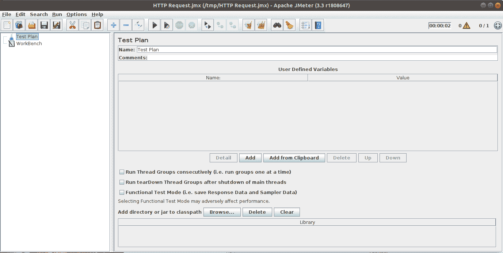

# 基准测试您的应用程序

在前面的章节中，我们看到了如何开发一个 Java EE 应用程序，以确保它可以通过多线程、异步处理、资源池化等方式进行扩展。我们还看到了如何获取应用程序的性能和资源（CPU、内存）使用指标，并通过 JVM 或容器调优以及更激进的技巧，如向应用程序添加缓存来优化性能。

在这个阶段，你应该能够着手处理性能问题。然而，这并不意味着你在进入生产环境时就不会遇到惊喜。主要原因是我们之前讨论的工作很少在足够接近生产或最终部署环境的环境中完成。

为了避免这些惊喜，可以（或应该）组织基准测试，但这并不像把之前学到的所有东西都放在一起那么简单。大多数时候，这需要更多的准备，如果你不想在生产时浪费宝贵的时间，你应该意识到这一点。

在本章中，你将准备一个基准测试，包括以下要点：

+   基准测试是什么

+   准备基准测试

+   基准测试期间的迭代

+   基准测试之后要做什么

# 基准测试——验证您的应用程序是否符合服务等级协议（SLA）

基准测试通常在您需要遵守**服务水平协议（SLA**）时发挥作用。SLA 可能更明确或更不明确。通常，您可能对 SLA 有一个非常模糊的定义，例如“应用程序必须提供良好的用户体验”，或者您可能在合同中有非常精确的描述，例如“应用程序必须支持黑色星期五周末和每天 1000 万用户，并且每个用户操作必须在不到一秒内完成”。甚至还有一些标准来描述 SLA，例如**Web 服务等级协议（WSLA**）来定义如何衡量和公开您的 SLA。

在任何情况下，如果确定了 SLA，尤其是在合同中未达到 SLA 时有补偿的情况下，确保在项目中进行基准测试阶段以增加生产时的性能是非常重要的。

书本的下一章和最后一章将处理对性能的持续评估，并帮助你持续进行评估，避免这种*阶段*效应。尽管如此，由于基准测试所需的底层基础设施限制，仍然常见有一个专门阶段，因此在本章中我们将考虑这种情况。

到目前为止，你知道你需要验证应用程序的性能，你的项目经理或你自己已经计划了基准测试。但这项任务具体是什么？

# 基准，基准，基准

在性能方面的工作并不均匀。我们在上一节中看到了这一点；有很多工具在做这件事，每个工具都会提供或多或少的信息，但也会对实际性能产生或多或少的影响。例如，对应用程序的所有代码进行仪器化以获取所有层级的指标会使应用程序非常慢，但报告非常丰富。相反，仅对某些部分——如出站部分——进行仪器化不会对应用程序产生太大影响，但报告只会给你一组非常小的数据。这意味着根据你工作的层级，你将不会使用相同的工具来确保你拥有正确的信息级别。

因此，我们可以区分多种潜在的基准类型：

+   *算法基准*：你开发了一些代码部分，并希望验证性能是否正确或是否存在瓶颈。

+   *层基准*：你开发一个层——持久化层、前端层等——并希望在添加另一个层或将其与其他应用程序部分集成之前确保性能是正确的。

+   *规模基准*：你得到应用程序性能的数字，以确定要使用的机器数量。这与水平扩展直接相关——这不像垂直扩展那样顺畅，因为性能不能是线性的。请注意，这正是大数据框架基于的逻辑，以分发它们的工作。

+   *可交付成果基准*：这是验证应用程序（交付）和最终应用程序的性能是否符合预期的基准（SLA）。

当然，我们可以将你可以做的基准测试分成更精确的类别，但这些都是你在大多数项目中会遇到的三种。每种基准测试都会使用不同的工具，并且有不同的准备步骤和输出。然而，每一种都会将标准（一个或多个）与预期进行验证。

在之前的基准测试中，我们可以清楚地将标准分为两个非常高级的类别，但这种划分将对你的基准测试驱动方式产生巨大影响：

+   *开发基准*

+   *可交付成果基准*

即使基准测试是在交付时进行的，根据定义，这种划分意味着我们确定的两个第一类基准测试是关于验证代码是否正确完成，因此它属于一般性的开发者工作，并且很少从开发本身中分离出来。*层基准*通常在多个开发迭代中进行；它仍然是一个开发基准，因为它仍然是在内部验证应用程序，而不是通常暴露给最终用户的东西。*可交付成果基准*是确保最终性能对最终用户（或合同）可接受。因此，它与之前的基准测试类别不同，因为你需要有一个足够完整的可交付成果来进行测试。

在影响方面，你将主要在可交付的基准测试上工作的事实意味着你将无法在自己的机器上完成它。你想要的是验证你的性能与合同，因此你需要在应用安装的机器上验证应用。

在这一点上，重要的是不要混淆用于验证 SLA 的基准测试和用于确定应用所需基础设施规模的基准测试。两者几乎看起来一样，并且以相同的方式组织。但在*规模基准测试*的情况下，你将定义一个基础设施（机器功率、内存等）并测量性能，然后推断如果你水平扩展需要多少台机器。然而，*SLA 基准测试*已经假设基础设施是固定的，然后你只需验证性能以符合 SLA。在实践中，两者通常同时进行，这导致了这两种类型基准测试之间的混淆。这主要源于开发者或项目经理对应用所需基础设施有一个想法，因此规模基准的起始基础设施接近目标基础设施，然后游戏就只是验证性能以符合期望。尽管如此，如果你开始规模基准测试，那么你将需要另一个基准测试*阶段*来验证 SLA，这可以被视为第二个基准测试。永远不要忘记你所在的阶段；否则，你可能会同时改变太多参数，失去对当前应用状态的跟踪（如我们稍后所见，能够比较基准测试迭代至关重要）。

# 准备你的基准测试

准备基准测试可能是你将要做的最重要的任务。实际上，如果你错过了它，基准测试将注定是失败的，毫无用处。即使任务在总体上并不复杂，它们也不会自行完成。所以请花些时间确保在基准测试开始之前完成它们。

# 定义基准测试标准

基准测试总是进行以确保我们遇到一个指标。因此，基准准备的第一步是*明确*地定义这个指标。

定义一个指标意味着明确地定义要测量的内容和如何测量它。

# 定义指标

定义要测量的内容意味着定义测量的范围。换句话说，当指标开始和结束时。这听起来可能很简单，但不要忘记我们在一个多层环境中工作，而且如果你的监控定义得不好，你可能会错过一些层。

这里有一些例子，基于我们的 quote-manager 应用，如果没有很好地定义指标的界限，可能会导致错误地验证应用：

+   使用 CDI 拦截器测量端点执行持续时间：你错过了 JAX-RS 层

+   使用 JAX-RS 过滤器测量端点执行持续时间：你错过了 servlet 层

+   如果度量标准是请求的处理时间，则使用 servlet 过滤器来测量端点执行持续时间：你会错过容器处理

这些例子都是服务器端错误，但说明了明确度量标准并不像看起来那么简单，因为提到的三种解决方案既简单又很有诱惑力。

有一种情况更糟：客户端。当度量标准是客户端度量标准——对于 SLA 来说通常是这种情况，因为在这种情况下，如果服务器对客户端来说运行得快，我们通常不关心服务器做了什么——那么度量定义就非常重要。客户端情况意味着一些你并不总是能控制的底层基础设施。因此，确保定义做得好将避免歧义和与基准测试的客户或审查者的潜在分歧。以下是一些对同一度量标准的不同解释的例子：

+   客户端执行时间是从一个连接到应用服务器的客户端测量的

+   客户端执行时间是从一个连接到应用服务器前端的负载均衡器的客户端测量的

+   客户端执行时间是从一个连接到 API 网关的客户端测量的，该网关将调用重定向到负载均衡器

+   客户端执行时间是从一个连接到另一个**广域网**（**WAN**）中的代理的客户端测量的，该代理将请求路由到 API 网关等等

这些每一行都在前一行的基础上增加了一个基础设施层，因此，为客户端增加了一些延迟。它们都测量*客户端执行时间*。这就是为什么在开始基准测试应用程序之前，精确地定义基础设施，以及更重要的是度量标准是如何设计的，非常重要。

# 定义接受标准

一旦你明确了一个度量标准，你需要根据这个度量标准定义标准，这将使基准测试得到验证或被拒绝——你的应用程序是否足够快，以至于可以将其重新表述为高层次？

通常，这是一个可以根据度量标准表示为时间单位或百分比的数字。如果这个度量值低于（或高于）这个数字，那么基准值将被拒绝。

大多数情况下，度量标准不是自足的，需要一些额外的参数才能以可测量的方式定义接受标准。以下是一些常见的例子：

+   对于*64 个并发用户*，*客户端执行时间*必须低于 1 秒

+   当每秒接收*128 条消息*时，*客户端延迟*必须低于 250 毫秒

+   *数据插入数据库的插入率*必须高于每秒*1,500 条记录*，对于*两个连接*

在这些例子中，粗体表达的是我们建立标准的度量标准，而斜体的是在定义的标准上下文中固定的另一个潜在度量标准（下划线数字）。

当然，可以在同一标准中使用超过两个指标，甚至让它们同时变化。然而，这会导致复杂的接受标准，并且通常总是可以根据使用常数的接受标准来重新表述它们。不要犹豫，从输入中重建一个标准数据库，以确保它们易于验证和测量。这种重新表述的一个非常简单的例子是将 *客户端执行时间必须低于 1 秒，对于 1 到 64 个并发用户* 改为 *客户端执行时间必须低于 1 秒，对于 64 个并发用户*。这种改变并不严格等价，你需要验证第一个陈述，但第二个短语更容易处理，特别是如果你需要一些调整。使用这个更简单的版本开始工作，并对你的一些指标进行粗略估计，然后一旦通过，只需验证原始的即可。

一个之前没有提到的标准是 *时间*。通常，所有标准都是为 *无限* 持续时间定义的。这意味着你需要确保一旦达到它们，它们将被尊重足够长的时间，以假设在一段时间后不会退化。这是在准备你的工具时需要考虑的事情，因为许多因素可能会降低性能：

+   在插入一定数量的记录后变慢的数据库

+   一个配置不当且开始变得比其配置太大的缓存

+   一个调优不当的内存，等等

所有这些因素并不总是能阻止你在 *短时间内* 达到你的性能，但它们很可能会在一段时间后降低性能。

这里的想法将是确保你可以将接受标准与某些环境指标相关联，例如内存行为。例如，你可以将你的标准接受与内存使用和/或垃圾收集器配置文件相关联，如下所示：


假设 *X* 轴是时间，*Y* 轴是使用的内存，那么这个配置文件显示垃圾回收是规则的（几乎每一条垂直线），并且内存使用是有界和规则的，因为它没有超过代表最大值的红线，即使在经过几个周期之后也是如此。

这种定义很少是自足的，因为它隐含地定义了这种验证发生在应用程序已经达到我们测量的标准，并且 *一些时间* 已经过去。尽管如此，这比仅仅测量标准而不验证长时间运行的实例的结果是否为真要好。

事实上，最好的情况是能够测试应用程序数天，但这通常成本高昂且不可行。如果你不能这样做，使用这种策略和高级验证通常是一个好的备选方案。

# 定义场景

定义场景与标准相关联，但消除了恒定约束。这允许你定义更复杂的案例，其中所有指标可以同时变化。

一个常见的例子是将用户（客户端）数量设为一个随时间移动的变量：*响应时间将从 5 个用户到 1,000 个用户保持恒定，每 10 秒增加 5 个用户*。

一个场景通常非常接近实际应用程序的使用，但如果你没有立即遇到它，它也更难处理，因为你不再在恒定负载下运行应用程序。这就是为什么它们更多地被视为验证检查点而不是工作标准。

# 定义环境

一旦你知道你想要测试什么，你需要在某个地方设置你的应用程序，以便能够验证它并可能优化它。

这听起来可能很显然，但在这里，你必须对此点非常严格，并在与最终环境相似的环境中基准测试你的应用程序。这意味着什么？相同的机器，相同的网络设置，相同的负载均衡策略，相同的后端/数据库，等等。

设置的任何部分都必须与你的运行位置相匹配。否则，在生产环境中部署时，你可能会遇到一些你本应该提前看到并评估的意外因素。最好的情况是应用程序无法正常工作，这通常是通过部署后进行的某些烟雾测试来识别的。最坏的情况是应用程序可以正常工作，但其可扩展性或性能受到意外因素的影响。我们很少在生产环境中进行性能测试。因此，限制由于环境引起的潜在错误因素非常重要。

# 机器

在安装任何应用程序之前，你需要一台机器。根据我们刚才所说的，这台机器必须接近最终版本，但在机器的背景下这意味着什么？

机器通常被视为其资源：

+   CPU：应用程序可以使用的计算能力

+   内存：应用程序可以使用的空间

+   磁盘空间：应用程序可以依赖的本地存储

你的第一个选择将是选择与生产机器相同的 CPU/内存/磁盘。然而，在采取这一步骤之前，请确保该机器没有被其他服务（如另一个应用程序）共享，因为这可能会在资源（CPU、内存、磁盘等）方面完全值得 1-1 的选择，因为资源将被其他应用程序消耗。也就是说，如果应用程序与其他软件共享资源，你需要找到一种方法来估计应用程序可用的资源并将它们限制在这个数量，或者隔离这两个应用程序以确保每个应用程序都将有一个定义良好的资源集。

如果你依赖 Docker/Kubernetes 进行部署，这些建议同样适用，但它们不再是在*机器*级别，而是在*pod*级别。此外，确保你的 JVM 配置为支持 pod（或容器）设置，这需要一些 JVM 调整来使用 cgroup 配置而不是整个机器设置——Java 默认设置。

# 网络

现在，网络在部署中是一个非常重要的因素。如果你的应用是自给自足的，那么它并不是非常关键，但这种情况几乎从未发生过。所有应用要么有一个 HTTP 层（通过 UI 或 Web 服务），要么有一个（远程）数据库，或者远程连接到其他应用。在微服务架构中，这一点变得更加关键，因为一些库甚至被设计来更具体地处理这部分工作（包括回退、bulhead 和并发，正如我们在前面的章节中看到的）。

在这个背景下，能够依赖一个好的网络非常重要。与机器选择的精神相同，你必须选择一个与生产网络相当的网络。假设材料几乎相同，这意味着你将选择具有相同吞吐量的网络，但这还不够。

当与网络一起工作时，还有两个其他标准需要迅速考虑，以避免意外：

+   机器/主机之间的*距离*：如果远程服务*远*，那么延迟会增加，依赖于这些服务的代码将会*变慢*。确保你在接近生产环境的条件下进行基准测试——相同的延迟和响应时间——这对于能够依赖你获得的数字非常重要。

+   网络使用情况：如果其他应用大量使用网络，你的*新*应用可用的带宽将会减少，性能将会很快受到影响。基准测试中的一个常见错误是有一个专门用于基准测试的网络，而在生产中它与其他一些应用共享。确保你在这里有一个一致的设置，将避免在部署期间出现大的惊喜。

# 数据库和远程服务

如果你的应用使用远程服务，这可能是一个经典的**关系型数据库管理系统**数据库（**RDBMS**），一个 NoSQL 数据库，或者另一个应用，确保你在现实条件下进行基准测试非常重要。具体来说，如果我们回到我们的 quote-manager 应用，它使用 RDBMS 数据库，我们不应该使用本地 MySQL 进行测试，如果我们的生产数据库将是 Oracle 实例。我们的想法是尽可能接近现实——生产环境将获得的延迟。

在某些情况下，你（或你的公司）可能拥有其他服务/数据库，并且可以调整它们以提高其可扩展性。但在其他情况下，你使用外部服务，这些服务无法优化，例如在 quote-manager 应用程序中使用 CBOE 和 Yahoo! Finance。在任何情况下，总是更明智地去找其他节点（服务/数据库）的管理员，请求使其更快。意识到在生产环境中因为你的设置与基准测试时不同而导致运行缓慢，这会减慢你的速度并对你产生更大的影响。

这并不意味着*模拟*外部服务是愚蠢的。在优化你自己的应用程序的阶段，它可能非常有用，因为它可以使外部服务交互尽可能快。然而，你必须确保在执行*验证*基准测试时移除模拟。

如果你使应用程序能够配置为使用模拟或快速替代系统，不要忘记在启动时写入一条日志消息（INFO 或 WARNING 级别），以确保你可以在以后找到这些信息。它可以节省你很多时间，并避免你因为不确定实际的运行设置而重新运行基准测试。它可以帮助你避免*实际*运行设置与基准测试设置不一致导致的问题。

在基准测试期间，特别是在调整阶段，你可能会配置你的池（连接池）。因此，确保你可以依赖数据库（或服务）的可扩展性是很重要的。目标是避免在拥有 1,024 个连接的池中成功通过基准测试，然后意识到在生产环境中你只能使用 20 个连接（20 是数据库接受的连接数上限）。

不仅仅是要考虑数据库/服务类型，不仅仅是版本，不仅仅是环境（操作系统、机器），你需要确保数据库的配置是从生产实例复制过来的（或者，如果你处于调整阶段，确保你使用的最终配置可以被复制到生产实例）。

# 服务器

我们在讨论一个 Java EE 应用程序——但如果谈论到*打包*，它可以推广到任何应用程序。因此，我们将应用程序部署到服务器中。即使是嵌入式应用程序，在其交付物中也打包（捆绑）了一个服务器。与所有先前的点一样，与目标系统（生产环境）保持一致是很重要的。

具体来说，这意味着如果你的生产环境使用 Apache TomEE 或 GlassFish，你不应该针对 WildFly 服务器进行测试。

如果我们谈论的是开发和打包的方式，服务器离您的应用程序并不远。这意味着它嵌入了几种由服务器供应商选择的库。直接的含义是服务器版本嵌入了几种库版本。由于 Java EE 介于 15 到 30 个规范之间，它至少与打包在一起的库一样重要。因为它是软件，您无法避免版本之间的某些变化——尤其是在新规范早期阶段——因此，您应该尝试确保您不仅使用与生产环境中相同的服务器，而且使用相同的版本。

这个声明应该扩展到您应用程序之外的所有代码。它可以包括您的 JDBC 驱动程序，直接部署在容器中，甚至是一些基础设施/运营团队服务。

一旦您选择了服务器，您需要确保您使用一个与生产环境尽可能接近的设置（配置）。这包括您需要的日志配置（通常，如果您使用日志聚合器，您可能需要一个特定的日志格式）以及部署到其上的资源。如果您从基础设施服务自动部署资源，确保您将它们全部部署以具有相同的线程使用率、网络使用率（如果它涉及远程资源，如 JMS）等等。

最后（并且与机器选择相关），确保设置与生产环境一致。如果您在生产环境中登录到**固态硬盘**（**SSD**）磁盘，确保在基准测试期间登录到 SSD。

# 自动化您的场景

一旦您有了场景，您只需描述它们，并手动执行它们，对于简单的场景，您可以轻松地编写脚本或代码。但大多数时候，您需要自动化它们。自动化它们的优点是可以按需运行（一键点击），因此，测试和重新测试它们很容易，而不需要大量投资。

有几种工具可以自动化场景，它们主要取决于您需要测试的场景。我们将介绍一些您可以使用的主流工具，如果您不知道从哪里开始的话。

# JMeter

Apache JMeter ([`jmeter.apache.org/`](http://jmeter.apache.org/)) 是一个历史悠久的解决方案，用于负载测试应用程序。它支持多种模式，并且完全用 Java 编写，这使得它对大多数 Java 开发者来说易于集成和使用。它支持应用程序使用的**主要连接**：

+   HTTP/HTTPS，SOAP/REST for JavaEE，NodeJs 等等

+   FTP

+   JDBC

+   LDAP

+   JMS

+   邮件

+   TCP 等等

对您来说最有趣的是，您将能够测试您的 Java EE 应用程序，以及其他后端，从而可以比较（例如数据库和应用程序的性能），以便有可能报告数据库是瓶颈。

它提供了一个很好的用户界面，看起来像这样：



这个界面是为了构建你的测试计划（场景）而设计的；它允许你无需任何配置或对工具的深入了解即可创建它。如果你从命令行启动软件，你甚至会有一个警告消息说不要用它进行实际的负载测试，而应该使用**命令行界面**（CLI）进行实际运行。

然后，一旦你启动了 JMeter，你将构建一个由步骤组成的**测试计划**。它将允许你配置线程和定义客户端数量的方式，向场景添加一些断言（输出验证），并在步骤之间重用变量（例如，第一步可以获取用于验证下一个请求的 OAuth2 令牌，甚至处理测试的预热）。你可以在计划中添加的元素中，有一些报告允许你获取你期望从基准测试中得到的输出数据，例如错误百分比、最小/最大持续时间、吞吐量、KB/秒等：


这张截图代表了 JMeter 的**聚合报告**，其中包含了关于计划执行或其子部分的统计数据。这里有趣的是错误率（前一个例子中的 100%），这还允许你验证执行是否足够好，也就是说，没有太多错误表明我们没有测试任何东西。

一旦你的计划定义好了，你可以将其保存为`.jmx`文件（JMeter 默认扩展名），这将允许你重新播放它。到那时，你应该能够*本地*测试你的场景（稍微改变计划的 URL 以调整到你的本地实例），但你还不能测试集群。

最后，对于实际的负载测试，你需要使用 JMeter 的**远程测试**解决方案。它将允许你编排多个客户端节点（通常称为*注入器*，因为它们将向系统中*注入*请求）。主要优势是：

+   你不再依赖于你的本地机器了

+   你可以控制客户端使用哪些网络（它可以与服务器相同，也可以不同）

+   你可以使用*N*个客户端机器进行水平扩展，而不是一个

最后一点非常重要，因为涉及到网络使用。在进行 HTTP 请求时，你将使用机器网络，其中一个最限制性的标准将是每个节点的客户端数量。客户端越多，它们在全球范围内就会越慢，因为它们为其他客户端添加了噪声。也就是说，在启动完整运行之前，确保正确地调整注入器的大小，以确定每个注入器节点可以使用的客户端数量，而不会受到基础设施的限制。在实际部署中，你很少会为单个机器拥有大量的客户端。因此，在某些情况下，每台机器只有一个或两个客户端是可以接受的。

如果你想要下载 JMeter，你可以访问 Apache 网站上的下载页面（[`jmeter.apache.org/download_jmeter.cgi`](http://jmeter.apache.org/download_jmeter.cgi)）。

# Gatling

Gatling ([`gatling.io/`](https://gatling.io/))是 JMeter 的替代品。你将找到与 JMeter 相同的功能（当然，有一些差异，但这里我们不会列出它们）。主要区别在于你通过脚本编写场景，而不是配置它们，无论是 XML 文件还是通过一个漂亮的 UI 进行可视化配置。

脚本基于**领域特定语言**（**DSL**）并且依赖于 Scala 语言。这可能会让 Java 开发者感到**阻碍**，因为如果你从未进行过任何 Scala 开发，Scala 可能不太友好。然而，这是 Gatling 相对于 JMeter 的优势；它是一个基于 Akka-Netty 的负载测试解决方案。这意味着它是用试图在自身核心中实现无锁技术的技术编写的，并使注入器代码可扩展。如果你要求 JMeter 扩展到太多用户，它被认为在设计上会自我限制。实际上，这并不是一个很大的限制，因为我们之前看到的那样，你通常会从基础设施的角度进行扩展以可靠地测试你的应用程序。然而，在开发和一些高度扩展的应用程序中，这很有趣，因为你不需要那么多机器就能达到注入器相同的可扩展性水平。

这通常是我们进行基准测试时容易忘记的点，这就是为什么在测试之前准备它很重要的原因；以确保注入器不会限制基准测试。否则，你测试的是客户端/注入器而不是服务器/应用程序。

只是为了给你一个概念，这里是一个简单的 Gatling 脚本：

```java
package packt

import io.gatling.core.Predef._
import io.gatling.http.Predef._
import scala.concurrent.duration._

class QuotesSimulation extends Simulation {
  val httpConf = http.baseURL("http://benchmark.test.app.quote
  -manager.io")

  val quotesScenario = scenario("QuotesScenario")
    .exec(http("quotes")
      .get("/quote-manager/api/quote"))

  setUp(
    quotesScenario.inject(rampUsers(64) over (60 seconds))
    ).protocols(httpConf)
}
```

这个简单的脚本定义了一个名为`QuotesScenario`的场景。它将请求我们的`findAll`报价端点。

如果你将此脚本放在`$GATLING_HOME/user-files/simulations/packt/QuotesSimulation.scala`，请注意，Scala 使用与 Java 中相同的包的概念，因此你需要与`simulations`文件夹相比正确的嵌套文件夹。然后你可以运行`$GATLING_HOME/bin/gatling.sh`，它将扫描并编译之前文件夹内的文件以找到模拟，并要求你选择要启动的模拟：

```java
$ ./bin/gatling.sh 
GATLING_HOME is set to /home/rmannibucau/softwares/gatling-charts-highcharts-bundle-2.3.0
18:12:52.364 [WARN ] i.g.c.ZincCompiler$ - Pruning sources from previous analysis, due to incompatible CompileSetup.
Choose a simulation number:
     [0] computerdatabase.BasicSimulation
     [1] computerdatabase.advanced.AdvancedSimulationStep01
     [2] computerdatabase.advanced.AdvancedSimulationStep02
     [3] computerdatabase.advanced.AdvancedSimulationStep03
     [4] computerdatabase.advanced.AdvancedSimulationStep04
     [5] computerdatabase.advanced.AdvancedSimulationStep05
     [6] packt.QuotesSimulation
6
Select simulation id (default is 'quotessimulation'). Accepted characters are a-z, A-Z, 0-9, - and _
quotessimulation
Select run description (optional)
Test our quotes endpoint
Simulation packt.QuotesSimulation started...
```

`computerdatabase`模拟是默认的；我们的模拟是最后一个。一旦选择，Gatling 将请求有关模拟的一些元数据，例如其`id`和`description`。

第一次启动 Gatling 时，启动可能会比较长，因为它将编译模拟——有一些默认分布的示例。

当模拟运行时，你将在控制台中看到一些进度（而与 JMeter 相比，你可以在测试的 UI 中获取它并实时查看报告）：

```java
================================================================================
2017-11-01 18:14:49 50s elapsed
---- Requests ------------------------------------------------------------------
> Global (OK=54 KO=0 )
> quotes (OK=54 KO=0 )

---- QuotesScenario ------------------------------------------------------------
[############################################################## ] 84%
 waiting: 10 / active: 0 / done:54 
================================================================================
```

这些小报告显示了测试的进度。我们可以确定我们配置的模拟已经完成了 84%，代表了 54/64 个请求（用户），并且已经过去了 50 秒。

一旦测试完成，控制台会生成一个小报告：

```java
Simulation packt.QuotesSimulation completed in 59 seconds
Parsing log file(s)...
Parsing log file(s) done
Generating reports...

================================================================================
---- Global Information --------------------------------------------------------
> request count 64 (OK=64 KO=0 )
> min response time 20 (OK=20 KO=- )
> max response time 538 (OK=538 KO=- )
> mean response time 63 (OK=63 KO=- )
> std deviation 63 (OK=63 KO=- )
> response time 50th percentile 53 (OK=53 KO=- )
> response time 75th percentile 69 (OK=69 KO=- )
> response time 95th percentile 98 (OK=98 KO=- )
> response time 99th percentile 280 (OK=280 KO=- )
> mean requests/sec 1.067 (OK=1.067 KO=- )
---- Response Time Distribution ------------------------------------------------
> t < 800 ms 64 (100%)
> 800 ms < t < 1200 ms 0 ( 0%)
> t > 1200 ms 0 ( 0%)
> failed 0 ( 0%)
================================================================================
```

这个报告包含了关于执行和响应时间分布的统计数据。

最后，Gatling 会生成一个 HTML 报告（默认情况下）。它的位置记录在程序末尾，就在它退出之前。你可以用任何浏览器打开它，看起来是这样的：


回到报告中，我们在页面中心找到了统计数据（在左侧，橙色显示）和一些详细指标。它们之间包括请求数量、响应时间分布（允许你查看响应时间是否在可接受范围内，或者响应时间是否足够稳定以满足目标用户），等等。你可以在之前的屏幕截图中看到有两个标签页：全局和详情。详情标签页左侧有一个小菜单（在我们的屏幕截图中带有引号），允许你按步骤深入到模拟/场景的细节。引号引用的是我们在模拟中定义的`http`请求的名称。

Gatling 有很多更多功能和组合场景的方式，由于它是代码，所以也非常灵活。这不是本书的主题，但不要犹豫，深入了解一下。

再次提醒，不要忘记注入器机器（放置模拟客户端进程的机器，即这里的 Gatling 进程）可能不够强大，或者带宽不足，无法进行高度扩展。因此，你需要将注入器分布在几台机器上，以在一般情况下达到正确的用户数量。

Gatling 像 JMeter 一样支持这种模式，即使它需要更多的工作。该过程在他们的网站上解释（[`gatling.io/docs/2.3/cookbook/scaling_out/`](https://gatling.io/docs/2.3/cookbook/scaling_out/))，但在高层次上，你将在多个节点上运行模拟，然后收集它们的输出并在执行后进行汇总。

# 其他工具

你可以使用许多其他工具来定义你的场景；甚至一些 DIY 解决方案也可以使用。在所有情况下，你应该确保它足够扩展，以免限制你的基准测试，因为你想要测试的是你的应用程序，而不是基准测试工具。

# 确保你有支持

当你开始基准测试时，你可能会遇到一些问题，例如：

+   网络设置没有正确完成

+   框架/库/你的应用程序/注入器的 bug

+   远程服务或数据库没有吸收足够的负载，等等

在所有可能遇到的情况中——假设你的软件中的任何**砖块**都可能有问题——你应该能够找到可以求助的人来帮助你修复问题，或者至少快速评估它。这尤其重要，如果基准测试的一部分需要**一些**费用（如果你在租用一些机器、咨询等）。这里的想法是尽可能快地消除任何阻碍，不要在细节上浪费时间。

# 将你的优化基准测试时间框起来

评估基准是按设计划分时间段的；你运行基准测试并报告数据。尽管如此，优化基准则更为模糊。具体来说，你可能会因为一个简单的网络服务所使用的层以及所有可以测试的小调整选项（从网络配置，通过 JVM 内存，到缓存解决方案）而花费整整一年时间进行优化。

因此，在开始基准测试和优化应用程序之前，定义你将花费多少时间进行基准测试是非常重要的。这也可以与租赁期相关联，可能需要与运营和开发团队一起进行估算阶段。但如果你不这样做，风险是你会在细节上花费大量时间，而没有充分利用基准测试。

即使这是一个高级近似，帕累托原则也可以用来尝试优化基准测试时间。具体来说，尝试进行 20%的优化，这将为你提供 80%的应用程序提升。然后，如果你有时间，你可以继续优化剩余的 20%。

# 安装和重置程序

虽然听起来可能很明显，但在开始基准测试之前，你必须知道如何正确安装你的应用程序，并将其与其他系统（数据库、其他应用程序等）相互连接。这部分应该写成文档，以确保在需要时容易找到，并且至少在基准测试之前测试过一次。

我们经常忘记的部分是重置部分，如果在场景中这部分也能自动化，那就太理想了。这主要是确保每个执行都是可重复的，并且执行结果可以比较。

# 基准测试迭代

在上一节中，我们为以高效的方式开始基准测试准备了所有需要的东西。现在我们需要看看在基准测试期间我们将如何工作。

第一件重要的事情是确立我们在这里只处理优化迭代，而不是评估迭代，后者是直接的——你运行场景并收集报告。

# 迭代

这可能是自然的，但你会对你的优化进行迭代。这意味着你会反复运行相同的测试来衡量变化的结果——例如，增加池大小。

这种工作结构的直接影响是，你需要准备好以有组织的方式存储大量的报告。有许多解决方案，这主要取决于你习惯使用的工具。但至少在非常高的层面上，你需要存储：

+   基准测试报告。

+   基准测试日期（为了能够排序，通常在之后重放迭代是有用的）。

+   基准测试配置（你可以存储完整的配置，或者将其写入一个文件，例如命名为`CHANGES.txt`的文件，其中列出你从上次运行中更改了什么）。请注意，在这里包括外部系统（如数据库）的更改是很重要的，因为它们可以直接影响你的性能。

在存储方面，您只需在您的硬盘上使用一个`benchmark`文件夹，并为每个迭代创建一个包含先前信息的文件夹。文件夹名称可以包含日期。一个常见的模式是`<迭代编号>_<日期>_<简短描述>`，例如`001_2017-11-14_increasing-pool-size`。使用数字（用*0*填充）将允许您使用操作系统的排序来排序文件夹。日期为您提供另一个切入点——当有人告诉您“昨天，它运行得更好”，例如。最后，简短描述使您更容易识别报告以进行比较。

这不是强制性的，但如果您有一个小工具（如脚本或小型 Java 程序）解析报告和配置并将它们存储在索引中，您可以更容易地找到数据，并且您将获得更强大的搜索功能。同样，如果您已经完成了解析数据的工作，您可以轻松实现一个小型的`diff`工具来比较两个报告，这将允许您显示配置更改和对性能——报告的影响。通常，报告是可视的。因此，能够合并两个报告可以使您比使用两个窗口更有效地（视觉上）进行比较。

# 一次只更改一个设置

当您调整应用程序时，重要的是要确定一个设置是否是增强性能的因素，并据此将其视为重要或不重要。

如果您在单次运行中更改多个设置，您将无法确定哪个设置触发了变化，或者您甚至可能通过使用另一个不良设置来抵消一个良好的设置，从而错过一个优化因素。

抵制同时更改一切的诱惑，并尝试保持一种*科学*的方法，一次只更改一个设置。

# 在每次运行之间重置任何状态

在上一节中，我们看到了您必须准备与生产数据库可以处理的数据一样多的数据，但同时也不要忘记在每次运行之间重置数据库状态。

如果您不这样做，风险是您将在每次运行之间减慢执行速度，并使您所做的优化完全不可见。这是因为数据库有一种大小限制（相当大），但在您进行基准测试时，您通常会非常快速地插入大量数据，因此达到这个限制并不令人惊讶。一旦达到这个大小限制，数据库效率降低，性能下降。为了确保您可以在相同条件下运行，以便比较运行并验证一些调整选项，您必须确保数据库在每次运行之间具有相同的数据。所以，您应该确保数据库在每次运行之间具有相同的数据。

这个解释使用了数据库作为主要说明，因为它是最常见的陷阱，但它适用于您系统的任何部分。

# 预热您的系统

进行基准测试的另一个关键步骤是不要在**冷**系统上测量数据。原因是 Java EE 应用程序通常旨在是长期运行的软件；因此，通常会有一个已经运行了数周或数小时并进行了优化的**热**系统。这些优化可以生效：

+   **JVM** **即时**（**JIT**）编译：这将优化一些常见的代码路径。你还可以调查 JVM 的`-XX:-TieredCompilation`选项来**预编译**代码，但你在一些服务器上可能会遇到一些问题。

+   你可以使用一些缓存，因此一旦缓存包含了所有你测试的数据，应用程序将会更快。

+   如果你使用了一些外部系统，你可能需要进行一些你之后会重复使用的昂贵连接（SSL 连接很慢，安全连接很慢等等）。

在实际测量开始之前进行一些预热迭代非常重要，这样可以隐藏所有这些初始化，并仅测量应用程序的**最终**性能。

# 基准测试之后

一旦你完成了基准测试，你应该有一个包含你运行情况的数据库（我们之前提到的包含报告、配置等的文件夹）。现在，为了确保你进行基准测试有明确的原因，有一些行动你应该采取。

在本节中，我们假设你将在基准测试之后执行这些步骤，但你也可以在基准测试本身进行。这样呈现是因为这是一些你可以**离线**执行的任务，如果你有一些与基准测试相关的成本，这些是可以轻易推迟的任务。

# 编写报告

通常，在这个阶段，你已经收集了基准测试期间你付出的辛勤劳动所对应的所有数据。将这些数据汇总到报告中非常重要。报告将主要解释调查（为什么你更改了一些设置等等）并展示运行结果。

当然，你可以忽略那些无用的运行（性能没有显著变化），但将那些对应于性能提升或下降的运行整合进来总是很有趣的。

报告的最后部分应该解释如何正确配置服务器以供生产使用。这可以在报告中直接完成，或者指向另一个文档，如产品参考指南或应用程序的白皮书。 

这里是一个报告的高级结构：

+   应用程序描述：应用程序做什么。

+   指标：如果你有一些不太明显或具体的指标，请在这里解释它们（在下一部分之前）。

+   场景：你的测试做了什么。

+   基础设施/环境：你如何部署机器和外部系统，你如何设置监控等等。

+   注入：你如何刺激应用程序（例如，你可以解释你有*N*个 JMeter 节点）。

+   运行情况：你进行的所有相关迭代及其结果。

+   结论：你从基准测试中保留了什么？应该使用哪种配置？你还可以提及一些你没有时间运行测试。

# 更新你的默认配置

即使，如前所述，最终的配置是报告的一部分，它也不会阻止你将基准测试中得出的所有良好实践传播到代码库中。目标是减少强制配置。

例如，如果你发现你需要 1 秒的超时时间而不是默认的 30 秒才能获得良好的性能，直接在代码库中将默认值更新为 1 秒将避免在配置被遗忘时出现不良性能。这部分是默认可用性和性能之间的权衡，但通常你仍然可以通过这样做来提高默认用户/操作团队的经验。

如果你有某些配置脚本或 Dockerfile，不要忘记如果相关的话也更新它们。

# 审查结论

根据你的结论，你可能需要与开发人员或其他成员交叉检查基准测试的结果是否有效。

例如，如果你在我们的报价管理器中推断出你需要缓存报价，那么你可能希望验证：

+   如果从业务角度来看可以缓存它们（你可以与你的产品负责人或经理核实）。

+   你可以缓存它们多长时间，因为你可能希望在某个时候更新价格

另一个常见的例子是验证你是否可以绕过或更改保护应用程序某些部分的方式，因为安全层太慢（例如，从 OAuth2 切换到 HTTP 签名，或某种认证机制到网络安全）。

一旦结论得到验证，你还可以提取与原始 SLA 相关的报告部分，并让您的客户或您所报告的人进行验证。

# 丰富你的项目待办事项

在某些情况下，你可能在代码中发现了某些问题。它们可能或可能不会影响性能，但无论如何，你需要创建相应的任务来修复它们。

如果你在基准测试期间使用了某些热修复或补丁，别忘了在报告中提及并引用它们，以便让人们跟踪是否真正修复了这些问题。请注意，这可能与外部库或容器有关，而不仅仅是你的应用程序。

你在跨团队工作得越多，这个阶段就越重要。否则，你会得到一份报告，其中 SLA 得到了满足，但产品永远无法遵守，因为增强功能从未整合到主流源代码中。

# 摘要

在本章中，我们了解到基准是在确保你能最大限度地从基准时间中获益之前需要准备的东西，并且它需要一些组织工作。我们还看到，为了有用，你需要从已完成的工作中提取出它所蕴含的结论。这实际上是一个科学程序——但很容易——如果你想优化你的时间，你需要尊重它。

下一章和最后一章将进一步深入探讨如何缩短开发和基准之间的距离，以达到持续的绩效评估，使你的基准不再有害，因为一切都已经准备就绪并且处于控制之下。
