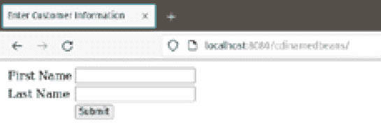
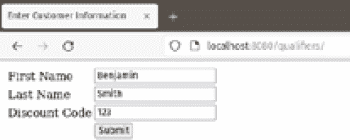
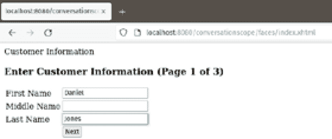
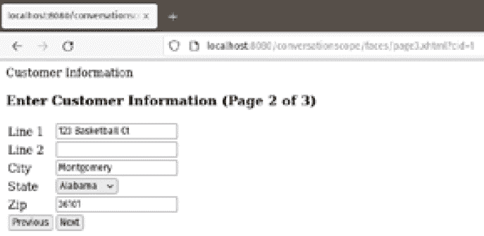

# 2

# 上下文和依赖注入

**上下文和依赖注入**（**CDI**）是一个强大的依赖注入框架，它允许我们轻松地将我们 Jakarta EE 应用程序的不同部分集成在一起。CDI 豆可以有不同的作用域，允许 Jakarta EE 运行时自动管理它们的生命周期。它们可以通过简单的注解轻松地注入为依赖项。CDI 还包括一个事件机制，允许我们应用程序的不同部分之间进行解耦通信。

在本章中，我们将涵盖以下主题：

+   命名豆类

+   依赖注入

+   限定符

+   CDI 豆作用域

+   CDI 事件

+   CDI Lite

注意

本章的代码示例可以在 GitHub 上找到：[`github.com/PacktPublishing/Jakarta-EE-Application-Development/tree/main/ch02_src`](https://github.com/PacktPublishing/Jakarta-EE-Application-Development/tree/main/ch02_src)。

# 命名豆类

CDI 通过`@Named`注解为我们提供了命名我们的豆的能力。命名豆允许我们轻松地将我们的豆注入到依赖它们的其他类中（参见下一节），并且可以通过统一的表达式语言轻松地从 Jakarta Faces 中引用它们。

注意

Jakarta Faces 在*第六章*和*第七章*中有详细说明。

以下示例显示了`@Named`注解的实际应用：

```java
package com.ensode.jakartaeebook.cdidependencyinjection.beans;
import jakarta.enterprise.context.RequestScoped;
import jakarta.inject.Named;
@Named
@RequestScoped
public class Customer {
  private String firstName;
  private String lastName;
  public String getFirstName() {
    return firstName;
  }
  public void setFirstName(String firstName) {
    this.firstName = firstName;
  }
  public String getLastName() {
    return lastName;
  }
  public void setLastName(String lastName) {
    this.lastName = lastName;
  }
}
```

正如我们所见，我们只需要用`@Named`注解装饰我们的类来命名我们的类。默认情况下，豆的名称将是类名，其首字母转换为小写。在我们的例子中，豆的名称将是`customer`。如果我们想使用不同的名称，我们可以通过设置`@Named`注解的`value`属性来实现。例如，如果我们想为我们的豆使用名称`customerBean`，我们可以通过修改`@Named`注解如下：

```java
@Named(value="customerBean")
```

或者，我们也可以简单地使用以下方法：

```java
@Named("customerBean")
```

由于`value`属性名称不需要指定，如果我们不使用属性名称，则默认`value`。

此名称可以用来通过统一的表达式语言从 Jakarta Faces 页面访问我们的豆：

```java
<?xml version='1.0' encoding='UTF-8' ?>
<!DOCTYPE html PUBLIC "-//W3C//DTD XHTML 1.0 Transitional//EN" "http://www.w3.org/TR/xhtml1/DTD/xhtml1-transitional.dtd">
<html 
      >
  <h:head>
    <title>Enter Customer Information</title>
  </h:head>
  <h:body>
    <h:form>
      <h:panelGrid columns="2">
        <h:outputLabel for="firstName" value="First Name"/>
        <h:inputText id="firstName"
          value="#{customer.firstName}"/>
        <h:outputLabel for="lastName" value="Last Name"/>
        <h:inputText id="lastName"
          value="#{customer.lastName}"/>
        <h:panelGroup/>
        <h:commandButton value="Submit"
          action="#{customerController.saveCustomer}"/>
      </h:panelGrid>
    </h:form>
  </h:body>
</html>
```

在我们的例子中，`firstName`和`lastName`属性或我们的`Customer`命名豆绑定到我们的 Jakarta Faces 页面中的两个文本输入字段。

当部署和执行时，我们的简单应用程序看起来像这样：



图 2.1 – CDI 命名豆的实际应用

现在我们已经看到了如何命名我们的 CDI 豆，我们将关注 CDI 的依赖注入功能。

# 依赖注入

`@Inject`注解，可以用来将 CDI 豆的实例注入到任何依赖对象中。

Jakarta Faces 应用程序通常遵循**模型-视图-控制器**（MVC）设计模式。因此，通常情况下，一些 Jakarta Faces 管理 bean 在模式中扮演控制器的角色，而其他则扮演模型的角色。这种方法通常要求控制器管理 bean 能够访问一个或多个模型管理 bean。CDI 的依赖注入能力使得将 bean 注入到另一个 bean 中变得非常简单，如下面的示例所示：

```java
package com.ensode.jakartaeebook.cdinamedbeans.beans;
//imports omitted for brevity
@Named
@RequestScoped
public class CustomerController {
  private static final Logger logger = Logger.getLogger(
      CustomerController.class.getName());
  @Inject
  private Customer customer;
  public String saveCustomer() {
    logger.info("Saving the following information \n" +
      customer.toString());
    //If this was a real application,
    //we would have code to save customer data to the
    //database here.
    return "confirmation";
  }
}
```

注意，我们初始化`Customer`实例所需要做的只是用`@Inject`注解来注解它。当 bean 由应用服务器构建时，`Customer` bean 的实例会自动注入到这个字段中。注意，注入的 bean 在`saveCustomer()`方法中被使用。

正如我们在本节中看到的，CDI 依赖注入非常简单。我们只需用`@Inject`注解来注解我们希望注入的类的实例变量。

# 限定符

在某些情况下，我们希望注入到我们的代码中的 bean 类型可能是一个接口或 Java 超类。然而，我们可能对注入特定的子类或实现该接口的类感兴趣。对于这种情况，CDI 提供了我们可以用来指示我们希望注入到代码中的特定类型的限定符。

CDI 限定符是一个必须用`@Qualifier`注解装饰的注解。然后，我们可以使用这个注解来装饰我们希望限定的特定子类或接口实现。此外，客户端代码中注入的字段也需要用限定符进行装饰。

假设我们的应用程序可能有一种特殊的客户类型；例如，常客可能会被赋予高级客户的地位。为了处理这些高级客户，我们可以扩展我们的`Customer`命名 bean，并用以下限定符进行装饰：

```java
package package com.ensode.jakartaeebook.qualifiers;
import jakarta.inject.Qualifier;
import static java.lang.annotation.ElementType.TYPE;
import static java.lang.annotation.ElementType.FIELD;
import static java.lang.annotation.ElementType.PARAMETER;
import static java.lang.annotation.ElementType.METHOD;
import static java.lang.annotation.RetentionPolicy.RUNTIME;
import java.lang.annotation.Retention;
import java.lang.annotation.Target;
@Qualifier
@Retention(RUNTIME)
@Target({METHOD, FIELD, PARAMETER, TYPE})
public @interface Premium {
}
```

如前所述，限定符是标准注解。它们通常具有运行时保留，可以针对方法、字段、参数或类型，如前例所示。然而，限定符和标准注解之间的唯一区别是，限定符是用`@Qualifier`注解装饰的。

一旦我们设置了我们的限定符，我们需要用它来装饰特定的子类或接口实现，如下面的示例所示：

```java
package com.ensode.jakartaeebook.cdidependencyinjection.beans;
import com.ensode.jakartaeebook.qualifiers.Premium;
import jakarta.enterprise.context.RequestScoped;
import jakarta.inject.Named;
@Named
@RequestScoped
@Premium
public class PremiumCustomer extends Customer {
  private Integer discountCode;
  public Integer getDiscountCode() {
    return discountCode;
  }
  public void setDiscountCode(Integer discountCode) {
    this.discountCode = discountCode;
  }
}
```

一旦我们装饰了特定的实例，我们需要对其进行限定。我们可以在控制器中使用我们的限定符来指定所需的精确依赖类型：

```java
package com.ensode.jakartaeebook.cdidependencyinjection.beans;
import java.util.logging.Logger;
import com.ensode.jakartaeebook.qualifiers.Premium;
import jakarta.enterprise.context.RequestScoped;
import jakarta.inject.Inject;
import jakarta.inject.Named;
@Named
@RequestScoped
public class CustomerController {
  private static final Logger logger = Logger.getLogger(
      CustomerController.class.getName());
  @Inject
  @Premium
  private Customer customer;
  public String saveCustomer() {
    PremiumCustomer premiumCustomer =
      (PremiumCustomer) customer;
    logger.info("Saving the following information \n"
        + premiumCustomer.getFirstName() + " "
        + premiumCustomer.getLastName()
        + ", discount code = "
        + premiumCustomer.getDiscountCode());
    //If this was a real application, we would have code
    // to save customer data to the database here.
    return "confirmation";
  }
}
```

由于我们使用了`@Premium`限定符来注解`customer`字段，因此将`PremiumCustomer`的实例注入到该字段，因为这个类也用`@Premium`限定符进行了装饰。

就我们的 Jakarta Faces 页面而言，我们只需像下面示例中那样使用其名称来通常访问我们的命名 bean：

```java
<?xml version='1.0' encoding='UTF-8' ?>
<!DOCTYPE html PUBLIC "-//W3C//DTD XHTML 1.0 Transitional//EN" "http://www.w3.org/TR/xhtml1/DTD/xhtml1-transitional.dtd">
<html 
      >
    <h:head>
        <title>Enter Customer Information</title>
    </h:head>
    <h:body>
        <h:form>
            <h:panelGrid columns="2">
                <h:outputLabel for="firstName" value="First Name"/>
                <h:inputText id="firstName"
                   value="#{premiumCustomer.firstName}"/>
                <h:outputLabel for="lastName"
                  value="Last Name"/>
                <h:inputText id="lastName"
                   value="#{premiumCustomer.lastName}"/>
                <h:outputLabel for="discountCode"
                  value="Discount Code"/>
                <h:inputText id="discountCode"
value="#{premiumCustomer.discountCode}"/>
                <h:panelGroup/>
                <h:commandButton value="Submit" action=
                  "#{customerController.saveCustomer}"/>
            </h:panelGrid>
        </h:form>
    </h:body>
</html>
```

在此示例中，我们使用 Bean 的默认名称，即类名，首字母转换为小写。

就用户而言，我们的简单应用程序渲染和操作就像一个“普通”的 Jakarta Faces 应用程序。请参见*图 2.2*。



图 2.2 – 浏览器中显示的优质客户数据

现在我们已经看到了如何使用 CDI 限定符注入同一类型的不同实现，我们将关注 CDI 作用域。

# CDI Bean 作用域

CDI 代表“上下文和依赖注入”，CDI Bean 有一个作用域，它定义了其生命周期，其作用域决定了 Jakarta EE 运行时何时创建和销毁 CDI Bean。“上下文”在“上下文和依赖注入”中指的是 CDI 作用域。当需要 CDI Bean 时，无论是由于注入还是因为它被 Jakarta Faces 页面引用，CDI 都会在其所属的作用域中查找 Bean 的实例，并将其注入到依赖的代码中。如果没有找到实例，就会创建一个并存储在适当的作用域中供将来使用。不同的作用域是 Bean 存在的上下文。

下表列出了不同的有效 CDI 作用域：

| **作用域** | **注解** | **描述** |
| --- | --- | --- |
| 请求 | `@``RequestScoped` | 请求作用域的 Bean 在整个单个请求期间共享。单个请求可能指一个 HTTP 请求、对 EJB 中方法的调用、Web 服务调用，或者向消息驱动 Bean 发送 JMS 消息。 |
| 会话 | `@``ConversationScoped` | 会话作用域可以跨越多个请求，但通常比会话作用域短。 |
| 会话 | `@``SessionScoped` | 会话作用域的 Bean 在 HTTP 会话的所有请求之间共享。应用程序的每个用户都会获得一个会话作用域 Bean 的实例。 |
| 应用 | `@``ApplicationScoped` | 应用作用域的 Bean 在整个应用生命周期中存活。此作用域中的 Bean 在用户会话之间共享。 |
| 依赖 | `@``Dependent` | 依赖作用域的 Bean 不共享。每次注入依赖作用域的 Bean 时，都会创建一个新的实例。 |

表 2.1 – CDI 作用域

CDI 的**请求作用域**不一定指 HTTP 请求；它可能只是一个对 EJB 方法的调用、Web 服务调用，或者向消息驱动 Bean 发送 JMS 消息。

注入了`jakarta.enterprise.context.Conversation`。在我们要开始会话的点，必须在这个对象上调用`begin()`方法。在我们要结束会话的点，必须在这个对象上调用其`end()`方法。

CDI 的**会话作用域**将 CDI Bean 的生命周期绑定到 HTTP 会话。会话作用域的 CDI Bean 在首次注入时创建，并持续存在，直到 HTTP 会话被销毁，通常发生在用户从 Web 应用程序注销或关闭浏览器时。

CDI 的**应用作用域**将 CDI bean 的生命周期与应用程序的生命周期绑定。每个应用程序只有一个应用程序作用域 bean 的实例，这意味着相同的实例对所有 HTTP 会话都是可访问的。

如果没有明确指定，CDI 的**依赖作用域**是默认作用域。每次需要时，都会实例化一个新的依赖作用域 bean，通常是在将其注入依赖于它的类时。

对于 CDI 的大多数作用域，只需用所需的作用域注解注解我们的 CDI bean 即可。然后，Jakarta EE 运行时在幕后管理 bean 的生命周期。会话作用域需要我们做更多的工作，即我们需要指示会话何时开始和结束。因此，我们将使用会话作用域来展示 CDI 作用域的使用。

假设我们希望让用户输入一些将被存储在单个命名 bean 中的数据；然而，这个 bean 有几个字段。因此，我们希望将数据输入分成几个页面。对于这种情况，CDI 的会话作用域是一个很好的解决方案。以下示例说明了如何使用 CDI 的会话作用域：

```java
package com.ensode.jakartaeebook.conversationscope.model;
import jakarta.enterprise.context.ConversationScoped;
import jakarta.inject.Named;
import java.io.Serializable;
@Named
@ConversationScoped
public class Customer implements Serializable {
  private String firstName;
  private String middleName;
  private String lastName;
  private String addrLine1;
  private String addrLine2;
  private String addrCity;
  private String state;
  private String zip;
  private String phoneHome;
  private String phoneWork;
  private String phoneMobile;
  //getters and setters omitted for brevity
  @Override
  public String toString() {
    StringBuilder sb = new StringBuilder();
    sb.append("Customer{");
    sb.append("firstName=").append(firstName);
    sb.append(", middleName=").append(middleName);
    sb.append(", lastName=").append(lastName);
    sb.append(", addrLine1=").append(addrLine1);
    sb.append(", addrLine2=").append(addrLine2);
    sb.append(", addrCity=").append(addrCity);
    sb.append(", state=").append(state);
    sb.append(", zip=").append(zip);
    sb.append(", phoneHome=").append(phoneHome);
    sb.append(", phoneWork=").append(phoneWork);
    sb.append(", phoneMobile=").append(phoneMobile);
    sb.append('}');
    return sb.toString();
  }
}
```

我们通过使用`@ConversationScoped`注解来装饰我们的 bean，声明我们的 bean 是会话作用域的。会话作用域 bean 还需要实现`java.io.Serializable`接口。除了这两个要求之外，我们的代码没有特别之处；它是一个简单的 Java 类，具有私有属性和相应的 getter 和 setter 方法。

除了注入我们的会话作用域 bean 之外，我们的客户端代码还必须注入`jakarta.enterprise.context.Conversation`的实例，如下例所示：

```java
package com.ensode.jakartaeebook.conversationscope.controller;
import jakarta.enterprise.context.Conversation;
import jakarta.enterprise.context.RequestScoped;
import jakarta.inject.Inject;
import jakarta.inject.Named;
import java.io.Serializable;
import com.ensode.jakartaeebook.conversationscope.model.Customer;
@Named
@RequestScoped
public class CustomerInfoController implements Serializable {
    @Inject
    private Conversation conversation;
    @Inject
    private Customer customer;
    public String customerInfoEntry() {
        conversation.begin();
        System.out.println(customer);
        return "page1";
    }
    public String navigateToPage1() {
        System.out.println(customer);
        return "page1";
    }
    public String navigateToPage2() {
        System.out.println(customer);
        return "page2";
    }
    public String navigateToPage3() {
        System.out.println(customer);
        return "page3";
    }
    public String navigateToConfirmationPage() {
        System.out.println(customer);
        conversation.end();
        return "confirmation";
    }
}
```

会话可以是**长运行**或**短暂的**。短暂的会话在请求结束时结束。长运行会话跨越多个请求。在大多数情况下，我们将使用长运行会话来在 Web 应用程序中跨越多个 HTTP 请求保持对会话作用域 bean 的引用。

长运行会话在注入的`Conversation`实例上调用`begin()`方法时开始，并在我们在这个相同对象上调用`end()`方法时结束。

Jakarta Faces 页面像往常一样访问我们的 CDI bean：

```java
<?xml version='1.0' encoding='UTF-8' ?>
<!DOCTYPE html PUBLIC "-//W3C//DTD XHTML 1.0 Transitional//EN" "http://www.w3.org/TR/xhtml1/DTD/xhtml1-transitional.dtd">
<html 
      >
    <h:head>
        <title>Customer Information</title>
    </h:head>
    <h:body>
        <h3>Enter Customer Information (Page 1 of 3)</h3>
        <h:form>
            <h:panelGrid columns="2">
                <h:outputLabel for="firstName"
                  value="First Name"/>
                <h:inputText  id="firstName"
                  value="#{customer.firstName}"/>
                <h:outputLabel for="middleName"
                  value="Middle Name"/>
                <h:inputText id="middleName"
                  value="#{customer.middleName}"/>
                <h:outputLabel for="lastName"
                  value="Last Name"/>
                <h:inputText id="lastName"
                  value="#{customer.lastName}"/>
                <h:panelGroup/>
                <h:commandButton value="Next"
                  action=
               "#{customerInfoController.navigateToPage2}"/>
            </h:panelGrid>
        </h:form>
    </h:body>
</html>
```

当我们从一页导航到下一页时，我们保持我们的会话作用域 bean 的同一实例；因此，所有用户输入的数据都保持不变。当在会话 bean 上调用`end()`方法时，会话结束，我们的会话作用域 bean 被销毁。

将我们的 bean 保持在会话作用域中简化了实现“向导式”用户界面的任务，其中数据可以在多个页面中输入。参见*图 2**.3*。



图 2.3 – CDI 会话作用域示例的第 1 页

在我们的示例中，在点击第一页上的**下一步**按钮后，我们可以在应用服务器日志中看到我们的部分填充的 bean。

```java
[2023-05-28T08:33:35.113817-04:00] [GF 7.0.4] [INFO] [] [jakarta.enterprise.logging.stdout] [tid: _ThreadID=35 _ThreadName=http-listener-1(2)] [levelValue: 800] [[
  Customer{firstName=Daniel, middleName=, lastName=Jones, addrLine1=null, addrLine2=null, addrCity=null, state=null, zip=null, phoneHome=null, phoneWork=null, phoneMobile=null}]]
```

在这一点上，我们简单向导的第二页被显示，如图*图 2**.4*所示。



图 2.4 – CDI 会话作用域示例的第 2 页

当点击**下一步**时，我们可以看到在我们的会话作用域 bean 中填充了额外的字段。

```java
[2023-05-28T08:44:23.434029-04:00] [GF 7.0.4] [INFO] [] [jakarta.enterprise.logging.stdout] [tid: _ThreadID=36 _ThreadName=http-listener-1(3)] [levelValue: 800] [[
  Customer{firstName=Daniel, middleName=, lastName=Jones, addrLine1=123 Basketball Ct, addrLine2=, addrCity=Montgomery, state=AL, zip=36101, phoneHome=, phoneWork=, phoneMobile=}]]
```

当我们在向导中提交第三页（未显示）时，与该页面上字段对应的额外 bean 属性将被填充。

当我们到达不再需要将客户信息保留在内存中的点时，我们需要在注入到我们代码中的会话 bean 上调用`end()`方法。这正是我们在显示确认页面之前在代码中所做的：

```java
public String navigateToConfirmationPage() {
        System.out.println(customer);
        conversation.end();
        return "confirmation";
    }
```

在完成显示确认页面的请求后，我们的会话作用域 bean 被销毁，因为我们调用了注入的`Conversation`类中的`end()`方法。

现在我们已经看到了 CDI 支持的所有作用域，我们将把注意力转向如何通过 CDI 事件实现松散耦合的通信。

# CDI 事件

CDI 提供了事件处理功能。事件允许不同 CDI bean 之间的松散耦合通信。一个 CDI bean 可以触发一个事件，然后一个或多个事件监听器处理该事件。

## 触发 CDI 事件

下面的示例是我们在前一节中讨论的`CustomerInfoController`类的新版本。该类已被修改为每次用户导航到新页面时触发一个事件：

```java
package com.ensode.jakartaeebook.cdievents.controller;
import jakarta.enterprise.context.Conversation;
import jakarta.enterprise.context.RequestScoped;
import jakarta.inject.Inject;
import jakarta.inject.Named;
import java.io.Serializable;
import com.ensode.jakartaeebook.cdievents.event.NavigationInfo;
import com.ensode.jakartaeebook.cdievents.model.Customer;
import jakarta.enterprise.event.Event;
@Named
@RequestScoped
public class CustomerInfoController implements Serializable {
    @Inject
    private Conversation conversation;
    @Inject
    private Customer customer;
    @Inject
    private Event<NavigationInfo> navigationInfoEvent;
    public String customerInfoEntry() {
        conversation.begin();
        NavigationInfo navigationInfo =
          new NavigationInfo();
        navigationInfo.setPage("1");
        navigationInfo.setCustomer(customer);
        navigationInfoEvent.fire(navigationInfo);
        return "page1";
    }
    public String navigateToPage1() {
        NavigationInfo navigationInfo =
          new NavigationInfo();
        navigationInfo.setPage("1");
        navigationInfo.setCustomer(customer);
        navigationInfoEvent.fire(navigationInfo);
        return "page1";
    }
    public String navigateToPage2() {
        NavigationInfo navigationInfo =
          new NavigationInfo();
        navigationInfo.setPage("2");
        navigationInfo.setCustomer(customer);
        navigationInfoEvent.fire(navigationInfo);
        return "page2";
    }
    public String navigateToPage3() {
        NavigationInfo navigationInfo =
          new NavigationInfo();
        navigationInfo.setPage("3");
        navigationInfo.setCustomer(customer);
        navigationInfoEvent.fire(navigationInfo);
        return "page3";
    }
    public String navigateToConfirmationPage() {
        NavigationInfo navigationInfo =
          new NavigationInfo();
        navigationInfo.setPage("confirmation");
        navigationInfo.setCustomer(customer);
        navigationInfoEvent.fire(navigationInfo);
        conversation.end();
        return "confirmation";
    }
}
```

如我们所见，要创建一个事件，我们需要注入一个`jakarta.enterprise.event.Event`实例。这个类使用泛型；因此，我们需要指定其类型。`Event`类的类型可以是任何实现`java.io.Serializable`的类。在我们的情况下，我们正在传递一个简单的 POJO 的实例作为类型参数，我们的 POJO 被称为`NavigationInfo`并有两个属性，一个是`Customer`类型，另一个是包含用户正在导航到的页面的`String`。回想一下，在前几节中，我们`CustomerInfoController`类上的每个方法都会触发从应用的一个页面到另一个页面的导航。在这个控制器的这个版本中，每次我们导航到新页面时都会触发一个 CDI 事件。在这种情况下，我们创建`NavigationInfo`的新实例，填充它，然后通过在`jakarta.enterprise.event.Event`的实例上调用`fire()`方法来触发事件。

## 处理 CDI 事件

要处理 CDI 事件，处理事件的 CDI bean 需要实现一个`NavigationInfo`，正如在前一节中我们事件声明的声明中可以看到。为了处理事件，观察方法需要用`@Observes`注解标注相应的参数，如下面的示例所示：

```java
package com.ensode.jakartaeebook.cdievents.eventlistener;
import jakarta.enterprise.context.SessionScoped;
import jakarta.enterprise.event.Observes;
import java.io.Serializable;
import com.ensode.jakartaeebook.cdievents.event.NavigationInfo;
import java.util.logging.Level;
import java.util.logging.Logger;
@SessionScoped
public class NavigationEventListener implements Serializable {
     private static final Logger LOG =
       Logger.getLogger(
       NavigationEventListener.class.getName());
    public void handleNavigationEvent(
      @Observes NavigationInfo navigationInfo) {
        LOG.info("Navigation event fired");
        LOG.log(Level.INFO, "Page: {0}",
          navigationInfo.getPage());
        LOG.log(Level.INFO, "Customer: {0}",
          navigationInfo.getCustomer());
    }
}
```

在此事件处理器示例中，`handleNavigationEvent()`方法接受一个`NavigationInfo`实例作为参数。请注意，此参数被注解为`@Observes`。这导致 CDI 在每次触发类型为`NavigationInfo`的事件时自动调用该方法。请注意，我们从未显式调用此方法；每当导航事件被触发时，Jakarta EE 运行时会自动调用它。

CDI 事件允许我们在 CDI beans 之间实现松散耦合的通信。在我们的示例中，请注意我们的`CustomerController` CDI bean 没有直接引用`NavigationEventListener`。一般来说，触发事件的 CDI bean 不需要了解任何关于监听器的细节；它只需触发事件，然后 CDI 接管细节。

注意

在我们的示例中，我们只有一个事件监听器，但在实践中，我们可以有我们需要的任意多个事件监听器。

## 异步事件

CDI 具有异步触发事件的能力。异步触发事件可以帮助提高性能，因为各种观察者方法可以并发调用。异步触发事件与同步触发事件非常相似。唯一的语法区别是我们不是在`Event`实例中调用`fire()`方法，而是调用其`fireAsync()`方法。以下示例说明了如何做到这一点：

```java
public class EventSource{
  @Inject Event<MyEvent> myEvent;
  public void fireEvent(){
    myEvent.fireAsync(myEvent);
  }
}
```

处理异步事件的观察者方法与其同步对应者相同。

## 事件排序

CDI 2.0 中引入的另一个新功能是能够指定我们的观察者方法处理 CDI 事件的顺序。这可以通过`@Priority`注解实现，如下面的示例所示：

```java
import jakarta.enterprise.context.SessionScoped;
import jakarta.enterprise.event.Observes;
import jakarta.annotation.Priority;
import jakarta.interceptor.Interceptor;
@SessionScoped
public class EventHandler{
    void handleIt (
@Observes @Priority(
       Interceptor.Priority.APPLICATION) MyEvent me){
    //handle the event
  }
}
```

`@Priority`注解接受一个类型为`int`的参数。此参数指定了观察者方法的优先级。最高优先级由`Interceptor.Priority`类中定义的`APPLICATION`常量定义。这是我们给示例中观察者方法赋予的优先级。较低优先级的值具有优先权，默认优先级是`Interceptor.Priority.APPLICATION + 100`。

如*第一章*所述，除了完整的 Jakarta EE 规范外，如果我们开发的是不需要 Jakarta EE 全部功能的应用程序，我们还可以使用两个 Jakarta EE 配置文件。一个是 Web Profile，适用于 Web 应用程序；另一个是 Core Profile，适用于微服务。Core Profile 包括 CDI 支持，但不支持 CDI 的所有功能。包含在 Jakarta EE Core Profile 中的这个轻量级 CDI 版本被称为 CDI Lite。

# CDI Lite

Jakarta EE Core Profile 包含完整的 CDI 规范的一个子集，恰当地命名为 CDI Lite。CDI Lite 的大部分更改都在实现层面；也就是说，一些在运行时由完整 CDI 实现执行的功能被移动到构建时间，使得利用 CDI Lite 的应用程序可以更快地初始化。

CDI Lite 主要适用于微服务应用程序，实现 RESTful Web 服务的功能。由于 REST 应用程序通常是无状态的，因此在开发此类应用程序时，并非所有 CDI 作用域都适用。因此，当使用 CDI Lite 时，会话和会话作用域不可用。这是与完整的 CDI 规范相比，CDI Lite 的主要限制。

当我们将代码部署到 Jakarta EE Core Profile 实现时，我们只需要关注 CDI Lite 的限制。Jakarta EE Web Profile 和完整的 Jakarta EE 平台包含完整的 CDI 功能。

# 摘要

在本章中，我们介绍了 CDI，它是 Jakarta EE 规范的一个核心部分。我们探讨了以下内容：

+   我们还介绍了 Jakarta Faces 页面如何通过统一表达式语言访问 CDI 命名的 Bean。

+   我们还介绍了如何通过`@Inject`注解使 CDI（控制反转）使我们的代码注入依赖变得简单。

+   此外，我们还解释了如何使用限定符来确定将哪种特定的依赖注入到我们的代码中。

+   我们还讨论了 CDI Bean 可以放置的所有作用域，使我们能够将 CDI Bean 的生命周期委托给 Jakarta EE 运行时。

+   我们讨论了如何通过 CDI 的事件处理实现 CDI Bean 之间的松耦合通信。

+   最后，我们讨论了 CDI Lite，这是 CDI 的一个轻量级版本，适合微服务开发。

CDI 是 Jakarta EE 的一个核心部分，因为它被用来整合我们的 Jakarta EE 应用程序的不同层。
