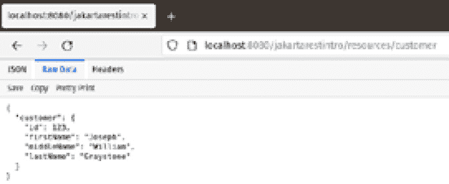

# 3

# Jakarta RESTful Web 服务

**表示性状态转移** (**REST**) 是一种架构风格，在这种风格中，Web 服务被视为资源，并且可以通过 **统一资源标识符** (**URIs**) 来识别。

使用 REST 风格开发的 Web 服务被称为 RESTful Web 服务。我们可以在 Jakarta EE 中通过 **Jakarta RESTful Web Services API**（通常称为 **Jakarta REST**）来开发 RESTful Web 服务。在本章中，我们将介绍如何使用 Jakarta REST 开发 RESTful Web 服务。

本章将涵盖以下主题：

+   RESTful Web 服务简介

+   开发简单的 RESTful Web 服务

+   开发 RESTful Web 服务客户端

+   无缝地在 Java 和 JSON 之间转换

+   查询和路径参数

+   服务器发送事件

注意

本章的代码示例可以在 [`github.com/PacktPublishing/Jakarta-EE-Application-Development/tree/main/ch03_src`](https://github.com/PacktPublishing/Jakarta-EE-Application-Development/tree/main/ch03_src) 找到。

# RESTful Web 服务简介

RESTful Web 服务非常灵活。虽然它们通常被编写为消费和/或生成 **JavaScript 对象表示法** (**JSON**) 格式的数据，但 RESTful Web 服务可以消费多种不同类型的 MIME 类型。

MIME 类型

MIME 代表多用途互联网邮件扩展；它用于指示 RESTful Web 服务消费或生成的数据类型。

Web 服务必须支持以下六种 HTTP 方法中的一种或多种：

+   **GET** – 按照惯例，GET 请求用于检索现有资源

+   **POST** – 按照惯例，POST 请求用于更新现有资源

+   **PUT** – 按照惯例，PUT 请求用于创建或替换新资源

+   **DELETE** – 按照惯例，DELETE 请求用于删除现有资源

+   **HEAD** – 按照惯例，HEAD 请求返回一个没有主体的 HTTP 头

+   **PATCH** – 按照惯例，PATCH 请求用于部分修改资源

我们通过创建一个类，并使用注解方法来装饰 RESTful Web 服务资源类，这些方法在 Web 服务接收到上述 HTTP 请求方法之一时被调用，来使用 Jakarta REST 开发 RESTful Web 服务。一旦我们开发和部署了我们的 RESTful Web 服务，我们就需要开发一个客户端来向我们的服务发送请求。前端 Web 技术通常用于开发 RESTful Web 服务客户端。然而，Jakarta REST 包含了一个标准的客户端 API，我们可以使用它来用 Java 开发 RESTful Web 服务客户端。

# 开发简单的 RESTful Web 服务

在本节中，我们将开发一个简单的 Web 服务来展示我们如何使我们的服务中的方法响应不同的 HTTP 请求方法。

使用 Jakarta REST 开发 RESTful Web 服务简单直接。我们的每个 RESTful Web 服务都需要通过其 `@Path` 注解来调用，我们需要使用它来装饰我们的 RESTful Web 服务资源类。

在开发 RESTful Web 服务时，我们需要开发当我们的 Web 服务收到 HTTP 请求时将被调用的方法。我们需要实现方法来处理 RESTful Web 服务处理的六种请求类型之一或多个——GET、POST、PUT、DELETE、HEAD 和/或 PATCH。

注意

我们将只介绍最常用的 HTTP 请求类型，因为实现所有 HTTP 请求类型非常相似。

Jakarta REST 提供了我们可以用来装饰我们 Web 服务中的方法的注解。例如，`@GET`、`@POST`、`@PUT`和`@DELETE`用于实现相应的 HTTP 方法。在我们的 Web 服务中用这些注解装饰一个方法，将使其能够响应相应的 HTTP 方法请求。

此外，我们服务中的每个方法都必须产生和/或消费一个特定的 MIME 类型。需要产生的 MIME 类型需要用`@Produces`注解来指定。同样，需要消费的 MIME 类型必须用`@Consumes`注解来指定。

以下示例说明了我们刚刚解释的概念：

```java
package com.ensode.jakartaeebook.jakartarestintro.service;
//imports omitted for brevity
@Path("customer")
public class CustomerResource {
  private static final Logger LOG =
      Logger.getLogger(CustomerResource.class.getName());
  @GET
  @Produces(MediaType.APPLICATION_JSON)
  public String getCustomer() {
    LOG.log(Level.INFO, "{0}.getCustomer() invoked",
        this.getClass().getCanonicalName());
    return """
              {
                "customer": {
                  "id": 123,
                  "firstName": "Joseph",
                  "middleName": "William",
                  "lastName": "Graystone"
                }
              }
              """;
  }
  @PUT
  @Consumes(MediaType.APPLICATION_JSON)
  public void createCustomer(String customerJson) {
    LOG.log(Level.INFO, "{0}.createCustomer() invoked",
        this.getClass().getCanonicalName());
    LOG.log(Level.INFO, "customerJson = {0}", customerJson);
  }
  @POST
  @Consumes(MediaType.APPLICATION_JSON)
  public void updateCustomer(String customerJson) {
    LOG.log(Level.INFO, "{0}.updateCustomer() invoked",
      this.getClass().getCanonicalName());
    LOG.log(Level.INFO, "customerJson = {0}", customerJson);
  }
}
```

注意

请注意，这个示例实际上并没有做什么。示例的目的是说明如何使我们的 RESTful Web 服务资源类中的不同方法响应不同的 HTTP 方法。

注意，这个类使用了`@Path`注解。这个注解指定了我们的 RESTful Web 服务的 URI。我们服务的完整 URI 将包括协议、服务器名称、端口、上下文根、REST 资源路径（见下一小节）以及传递给此注解的值。

假设我们的 Web 服务部署到了一个名为`example.com`的服务器上，使用 HTTP 协议在端口`8080`上，并且有一个上下文根为`jakartarestintro`和 REST 资源路径为`resources`，那么我们服务的完整 URI 将是以下内容：

```java
http://example.com:8080/jakartarestintro/resources/customer
```

注意

由于 Web 浏览器在指向 URL 时会生成 GET 请求，因此我们可以通过将浏览器指向我们的服务 URI 来简单地测试我们服务的 GET 方法。

注意到我们课程中的每个方法都使用`@GET`、`@POST`或`@PUT`注解之一进行了标注。这些注解使得我们的方法能够响应相应的 HTTP 方法。

注意

HTTP DELETE 请求通常需要一个参数。我们将在本章后面的“路径和查询参数”部分介绍它们。

此外，如果我们的方法需要向客户端返回数据，我们可以在 `@Produces` 注解中声明要返回的数据的 MIME 类型。在我们的例子中，只有 `getCustomer()` 方法向客户端返回数据。我们希望以 JSON 格式返回数据；因此，我们将 `@Produces` 注解的值设置为 Jakarta REST 提供的 `MediaType.APPLICATION_JSON` 常量，其值为 `"application/json"`。同样，如果我们的方法需要从客户端消耗数据，我们需要指定要消耗的数据的 MIME 类型；这是通过 `@Consumes` 注解来完成的。在我们的服务中，除了 `getCustomer()` 之外的所有方法都消耗数据。在所有情况下，我们期望数据以 JSON 格式；因此，我们再次指定 `MediaType.APPLICATION_JSON` 作为要消耗的 MIME 类型。

在继续之前，值得提一下的是，`@Path` 注解可以在类级别和方法级别同时使用。在方法级别使用 `@Path` 注解允许我们在单个 RESTful Web 服务中编写多个处理相同 HTTP 请求类型的方法。例如，如果我们需要在我们的示例 RESTful Web 服务中添加第二个方法，我们只需简单地将 `@Path` 注解添加到它上面：

```java
  @GET
  @Produces(MediaType.TEXT_PLAIN)
  @Path("customername")
  public String getCustomerName() {
    return "Joseph Graystone";
  }
```

这个特定端点的 URI 将是我们在方法级 `@Path` 注解中使用的值，附加到我们 RESTful Web 服务的 URI 上。

在我们的例子中，我们的 RESTful Web 服务的 URI 可能类似于 [`localhost:8080/jakartarestintro/resources/customer/`](http://localhost:8080/jakartarestintro/resources/customer/)，假设我们部署到本地工作站，并且服务器正在监听端口 `8080`。

该方法级注解的端点 URI 将是 `curl` http://localhost:8080/jakartarestintro/resources/customer/customername。请注意，方法级 `@Path` 注解的值被附加到了我们 RESTful Web 服务的“根”URI 上。

## 配置我们应用的 REST 资源路径

如前一小节简要提到的，在成功部署使用 Jakarta REST 开发的 RESTful Web 服务之前，我们需要为我们的应用配置 REST 资源路径。我们可以通过开发一个扩展 `jakarta.ws.rs.core.Application` 的类，并用 `@ApplicationPath` 注解来装饰它来实现这一点。

### 通过 `@ApplicationPath` 注解进行配置

要配置我们的 REST 资源路径，我们只需要编写一个扩展 `jakarta.ws.rs.core.Application` 的类，并用 `@ApplicationPath` 注解来装饰它；传递给这个注解的值是我们服务的 REST 资源路径。

以下代码示例说明了这个过程：

```java
package com.ensode.jakartaeebook.jakartarestintro.service.config;
//imports omitted for brevity
@ApplicationPath("resources")
public class JakartaRestConfig extends Application {
}
```

注意，该类不需要实现任何方法。它只需要扩展 `jakarta.ws.rs.Application` 并用 `@ApplicationPath` 注解来注解；该类必须是公开的，可以有任何名称，并且可以放在任何包中。

### 测试我们的 Web 服务

正如我们之前提到的，网络浏览器会将 GET 请求发送到我们指向的任何 URL。因此，测试我们的服务 GET 请求的最简单方法是将浏览器指向我们的服务 URI，如图*图 3.1*所示。



图 3.1 – 来自网络浏览器的 HTTP GET 请求

注意

Firefox 包含一个默认解析 JSON 数据并以用户友好的方式显示的 JSON 查看器。要在 Firefox 中查看我们的服务发送的实际 JSON 字符串，我们需要点击**原始数据**标签。

网络浏览器仅支持 HTTP GET 和 POST 请求。要通过浏览器测试 POST 请求，我们必须编写一个包含具有我们的服务 URI 作为 action 属性值的 HTML 表单的 Web 应用程序。虽然对于一个单一的服务来说这很 trivial，但对我们开发的每个 RESTful Web 服务来说，这样做可能会变得繁琐。

幸运的是，有一个流行的开源命令行工具`curl`，我们可以用它来测试我们的 Web 服务。`curl`包含在大多数 Linux 发行版中，并且可以轻松地下载到 Windows、macOS 和几个其他平台。`curl`可以在[`curl.haxx.se/`](http://curl.haxx.se/)下载。

`curl`可以向我们的服务发送所有 HTTP 请求方法类型（GET、POST、PUT、DELETE 等）。我们的服务器响应将简单地显示在命令行控制台上。`curl`有一个`-X`命令行选项，允许我们指定要发送的请求方法。要发送 GET 请求，我们只需在命令行中输入以下内容：

```java
curl -XGET http://localhost:8080/jakartarestintro/resources/customer
```

这样做会产生以下输出：

```java
{
  "customer": {
    "id": 123,
    "firstName": "Joseph",
    "middleName": "William",
    "lastName": "Graystone"
  }
}
```

这并不令人惊讶，这是我们指向服务 URI 时看到的相同输出。

`curl`的默认请求方法是 GET；因此，我们前面示例中的`-X`参数是多余的。我们可以通过从命令行调用以下命令来达到相同的结果：

```java
curl http://localhost:8080/jakartarestintro/resources/customer
```

在提交上述两个命令之一并检查应用程序服务器日志后，我们应该看到我们添加到`getCustomer()`方法中的日志语句的输出：

```java
com.ensode.jakartaeebook.jakartarestintro.service.CustomerResource.getCustomer() invoked|#]
```

注意

应用程序服务器日志的确切位置取决于我们使用的 Jakarta EE 实现。对于 GlassFish，当使用默认域时，它可以在`[glassfish` `安装目录]/glassfish/domains/domain1/logs/server.log`找到。

对于所有其他请求方法类型，我们需要向我们的服务发送一些数据。这可以通过`curl`的`--data`命令行参数来完成：

```java
curl -XPUT -HContent-type:application/json --data "{
  "customer": {
    "id": 321,
    "firstName": "Amanda",
    "middleName": "Zoe",
    "lastName": "Adams"
  }
}" http://localhost:8080/jakartarestintro/resources/customer
```

我们需要通过`curl`的`-H`命令行参数指定 MIME 类型，格式如前例所示。

我们可以通过检查应用程序服务器日志来验证前面的命令是否按预期工作：

```java
com.ensode.jakartaeebook.jakartarestintro.service.CustomerResource.createCustomer() invoked|#]
  customerJson = {
  customer: {
    id: 321,
    firstName: Amanda,
    middleName: Zoe,
    lastName: Adams
  }
}|#]
```

我们可以像测试其他请求方法类型一样轻松地测试：

```java
curl -XPOST -HContent-type:application/json --data "{
  "customer": {
    "id": 321,
    "firstName": "Amanda",
    "middleName": "Tamara",
    "lastName": "Adams"
  }
}" http://localhost:8080/jakartarestintro/resources/customer
```

这导致应用程序服务器日志中出现以下输出：

```java
com.ensode.jakartaeebook.jakartarestintro.service.CustomerResource.updateCustomer() invoked|#]
  customerJson = {
  customer: {
    id: 321,
    firstName: Amanda,
    middleName: Tamara,
    lastName: Adams
  }
}|#]
```

`curl`允许我们快速测试我们的 RESTful 网络服务。然而，在实际应用中，我们需要开发 RESTful 网络服务客户端来调用我们的 RESTful 网络服务并从中检索数据。Jakarta REST 提供了一个客户端 API，我们可以用它来实现这个目的。

# 开发 RESTful 网络服务客户端

虽然`curl`允许我们快速测试我们的 RESTful 网络服务，并且是一个开发者友好的工具，但我们需要一种方法让我们的 Java 应用程序调用我们开发的 RESTful 网络服务。Jakarta REST 包括一个客户端 API，我们可以用它来开发 RESTful 网络服务客户端。

以下示例说明了如何使用 Jakarta REST 客户端 API：

```java
package com.ensode.jakartaeebook.jakartarestintroclient;
//imports omitted for brevity
public class App {
  public static void main(String[] args) {
    App app = new App();
    app.insertCustomer();
  }
  public void insertCustomer() {
    String customerJson = """
                          {
                            "customer": {
                              "id": 234,
                              "firstName": "Tamara",
                              "middleName": "Adeline",
                              "lastName": "Graystone"
                            }
                          }
                          """;
        Client client = ClientBuilder.newClient();
        client.target(
          "http://localhost:8080/" +
          "jakartarestintro/resources/customer").
          request().put(
            Entity.entity(customerJson,
              MediaType.APPLICATION_JSON),
              String.class);
    }
}
```

我们需要做的第一件事是通过在`jakarta.ws.rs.client.ClientBuilder`类上调用静态的`newClient()`方法来创建一个`jakarta.ws.rs.client.Client`实例。

然后，我们在`Client`实例上调用`target()`方法，将我们的 RESTful 网络服务的 URI 作为参数传递。`target()`方法返回一个实现`jakarta.ws.rs.client.WebTarget`接口的类的实例。

在这一点上，我们在我们的`WebTarget`实例上调用`request()`方法。此方法返回`jakarta.ws.rs.client.Invocation.Builder`接口的实现。

在这个特定的例子中，我们正在向我们的 RESTful 网络服务发送一个 HTTP PUT 请求；因此，在这个点上，我们调用我们的`Invocation.Builder`实现的`put()`方法。

`put()`方法的第一个参数是一个`jakarta.ws.rs.client.Entity`实例；我们可以通过在`Entity`类上调用静态的`entity()`方法即时创建一个。此方法的第一个参数是我们希望传递给我们的 RESTful 网络服务的对象，第二个参数是我们将传递给 RESTful 网络服务的数据的 MIME 类型的字符串表示。在我们的例子中，我们使用`MediaType.APPLICATION_JSON`常量，它解析为`"application/json"`。`put()`方法的第二个参数是客户端期望从服务中获取的响应类型。在我们的情况下，我们期望一个`String`；因此，我们为这个参数使用了`String.class`。在我们调用`put()`方法后，一个 HTTP PUT 请求被发送到我们的 RESTful 网络服务，并且被`@Put`注解装饰的方法（在我们的例子中是`createCustomer()`）被调用。我们还可以调用类似的`get()`、`post()`和`delete()`方法来向我们的 RESTful 网络服务发送相应的 HTTP 请求。

现在我们已经看到了如何开发 RESTful 网络服务和客户端，我们将探讨 Jakarta EE 如何无缝地在 Java 和 JSON 之间转换。

# 无缝地在 Java 和 JSON 之间转换

RESTful 网络服务通常以纯文本形式传输数据，但不仅限于 JSON 格式的数据。在我们之前的例子中，我们一直在我们的 RESTful 服务和它们的客户端之间发送和接收 JSON 字符串。

经常情况下，我们希望从接收到的 JSON 数据中填充 Java 对象，以某种方式处理数据，然后构建一个 JSON 字符串作为响应。从 JSON 填充 Java 对象以及从 Java 对象生成 JSON 数据是如此常见，以至于 Jakarta REST 实现提供了一种无缝自动执行此操作的方法。

在本章前面的示例中，我们一直是发送和接收原始 JSON 数据作为字符串。我们的样本数据包含客户信息，如名字、中间名和姓氏。为了使这些数据更容易处理，我们通常会使用这些数据填充一个 Java 对象；例如，我们可以解析 JSON 数据并填充以下 Java 类的实例：

```java
package com.ensode.jakartaeebook.javajson.entity;
public class Customer {
  private Long id;
  private String firstName;
  private String middleName;
  private String lastName;
  public Customer() {
  }
  public Customer(Long id, String firstName,
    String middleName, String lastName) {
    //constructor body omitted for brevity
  }
  //getters,setters and toString() method omitted for brevity
}
```

注意我们的`Customer`类的实例变量名称与我们的 JSON 数据的属性名称相匹配；Jakarta REST 足够智能，能够自动将每个变量填充为相应的 JSON 属性。只要属性名称和变量名称匹配，Jakarta REST 就可以自动填充我们的 Java 对象（不言而喻，类型也必须匹配；例如，尝试使用文本值填充`Integer`类型的变量将引发错误）。

以下示例说明了我们如何实现一个 RESTful Web 服务，该服务可以无缝地将接收到的 JSON 数据转换为 Java 对象：

```java
package com.ensode.jakartaeebook.javajson.service;
//imports omitted for brevity
@Path("customer")
public class CustomerResource {
  private static final Logger LOG =
    Logger.getLogger(CustomerResource.class.getName());
  private final Customer customer;
  public CustomerResource() {
    customer = new Customer(1L, "David",
      "Raymond", "Heffelfinger");
  }
  @GET
  @Produces(MediaType.APPLICATION_JSON)
  public Customer getCustomer() {
    LOG.log(Level.INFO, "{0}.getCustomer() invoked",
      this.getClass().getCanonicalName());
    return customer;
  }
  @POST
  @Consumes(MediaType.APPLICATION_JSON)
  public void updateCustomer(Customer customer) {
    LOG.log(Level.INFO, "got the following customer: {0}",
      customer);
  }
  @PUT
  @Consumes(MediaType.APPLICATION_JSON)
  public void createCustomer(Customer customer) {
    LOG.log(Level.INFO, "customer = {0}", customer);
  }
}
```

注意我们唯一需要做的就是将我们方法参数的类型更改为`Customer`类型（我们的简单示例 POJO）；之前它们是`String`类型。同样，我们将返回值的类型从`String`更改为`Customer`。

注意在我们的代码中，为了填充`Customer`对象或生成要作为响应发送的 JSON 字符串，我们不需要做任何特殊的事情；这一切都是由 Jakarta REST 在幕后处理的。

为了说明这种无缝转换，让我们使用`curl`向我们的修改后的服务发送一个请求：

```java
curl -XPUT -HContent-type:application/json --data '{
  "id": 1,
  "firstName": "Bruce",
  "middleName": "Arnold",
  "lastName": "Stallone"
}' http://localhost:8080/jakartarestjavajson/resources/customer
```

注意在我们的`curl`命令中，我们正在向我们的 Jakarta REST 服务发送 JSON 数据。如果我们检查应用程序服务器日志，我们可以看到以下输出：

```java
  com.ensode.jakartaeebook.javajson.service.CustomerResource.createCustomer() invoked|#]
  toString() method of our Customer class, illustrating that the createCustomer(Customer customer) method in our service was invoked, and it seamlessly populated its customer parameter with the raw JSON data we sent it with our curl command.
When using non-Java clients, such as `curl`, or RESTful web service clients written in languages other than Java, we need to send raw JSON data to our service from the client side, as illustrated in our example. When writing clients in Java, we can take advantage of the Jakarta REST client API, which allows seamless conversion from Java to JSON on the client side as well. The following example illustrates how to do this:

```

package com.ensode.jakartarestjavajsonclient;

//省略导入以节省空间

public class App {

public static void main(String[] args) {

App app = new App();

app.insertCustomer();

}

public void insertCustomer() {

Customer customer = new Customer(456L, "Daniel",

"Robert","Hanson");

Client client = ClientBuilder.newClient();

client.target(

"http://localhost:8080/"

+ "jakartarestjavajson/resources/customer").

request().put(

Entity.entity(customer, MediaType.APPLICATION_JSON),

Customer.class);

}

}

```java

 In this updated client, we simply create an instance of our `Customer` class. Then we can pass it as a parameter to the static `entity()` method of the `Entity` class, and pass the corresponding type (`Customer.class`, in our example) to the `put()` method.
After running our client code, we can see the following output in the application server log:

```

com.ensode.jakartaeebook.javajson.service.CustomerResource.createCustomer() invoked|#]

customer = Customer{id=456, firstName=Daniel, middleName=Robert, lastName=Hanson}|#]

```java

 Our client seamlessly converted our `Customer` instance to a JSON string, and invoked our RESTful web service, which in turn converted the sent JSON back to a `Customer` instance; all behind the scenes, saving us a lot of drudge work.
So far, in all of our examples, we have been passing a JSON string (either directly or indirectly) as a body to the HTTP requests we have been sending to our RESTful web services. It is also possible to pass parameters to our RESTful web services. The following section illustrates how to do that.
Query and path parameters
In our previous examples, we have been working with a RESTful web service to manage a single customer object. In real life, this would obviously not be very helpful. The common case is to develop a RESTful web service to handle a collection of objects (customers, in our example). To determine what specific object in the collection we are working with, we can pass parameters to our RESTful web services. There are two types of parameters we can use: **query** and **path** parameters.
Query parameters
We can add parameters to methods that will handle HTTP requests in our web service. Parameters decorated with the `@QueryParam` annotation will be retrieved from the request URL.
The following example illustrates how to use query parameters in RESTful web services using Jakarta REST:

```

package com.ensode.jakartaeebook.queryparams.service;

//省略导入以节省空间

@Path("customer")

public class CustomerResource {

private static final Logger LOG =

Logger.getLogger(CustomerResource.class.getName());

private final Customer customer;

public CustomerResource() {

customer = new Customer(1L, "Samuel",

"Joseph", "Willow");

}

@GET

@Produces(MediaType.APPLICATION_JSON)

public Customer getCustomer(@QueryParam("id") Long id) {

LOG.log(Level.INFO,

"{0}.getCustomer() invoked, id = {1}", new Object[]

{this.getClass().getCanonicalName(), id});

return new Customer(id, "Dummy", null, "Customer");

}

@DELETE

@Consumes(MediaType.APPLICATION_JSON)

public void deleteCustomer(@QueryParam("id") Long id) {

LOG.log(Level.INFO,

"{0}.deleteCustomer() invoked, id = {1}",

new Object[]

{this.getClass().getCanonicalName(), id});

}

//additional methods deleted for brevity

}

```java

 In our updated example, we added a parameter to the `getCustomer()` method, which, as we may recall, is decorated with the `@GET` annotation so that it is invoked when our RESTful web service receives an HTTP GET request. We annotated the parameter with the `@QueryParam` annotation; the value of this annotation (`id` in our example) is the name of the parameter to use when sending a request to our service.
We can pass a query parameter to the web service’s URL just like we pass query parameters to any URL. For HTTP GET requests, we could simply type our RESTful web service’s URL into the browser, or we could use `curl` as follows:

```

curl -XGET -HContent-type:application/json http://localhost:8080/queryparams/resources/customer?id=1

```java

 Either way, we should see the corresponding output in the application server log:

```

com.ensode.jakartaeebook.queryparams.service.CustomerResource.getCustomer() invoked, id = 1|#]

```java

 Plus, we should see the following response from our RESTful web service:

```

{"firstName":"Dummy","id":1,"lastName":"Customer"}

```java

 Notice the response is a JSON representation of the `Customer` object we return in our `getCustomer()` object. We didn’t have to explicitly create the JSON data; Jakarta REST took care of it for us.
We added a `deleteCustomer()` method to our RESTful web service, and we annotated this method with `@DELETE` so that it responds to HTTP DELETE requests. Just like with `getCustomer()`, we added a parameter to this method and annotated it with the `@``QueryParam` annotation.
We can send our RESTful web service using `curl` as follows:

```

curl -XDELETE -HContent-type:application/json http://localhost:8080/queryparams/resources/customer?id=2

```java

 Our `deleteCustomer()` will be invoked as expected, as evidenced by the output in the application server log:

```

com.ensode.jakartaeebook.queryparams.service.CustomerResource.deleteCustomer() invoked, id = 2|#]

```java

 Sending query parameters via the Jakarta REST client API
The Jakarta REST client API provides a straightforward way of sending query parameters to RESTful web services. The following example illustrates how to do this:

```

package com.ensode.jakartaeebook.queryparamsclient;

//imports omitted for brevity

public class App {

public static void main(String[] args) {

App app = new App();

app.getCustomer();

}

public void getCustomer() {

Client client = ClientBuilder.newClient();

Customer customer = client.target(

"http://localhost:8080/"

+ "queryparams/resources/customer").

queryParam("id", 1L).

request().get(Customer.class);

System.out.println(String.format(

"Received the following customer information:\n%s",

customer));

}

}

```java

 As we can see, all we need to do to pass a parameter is to invoke the `queryParam()` method on the `jakarta.ws.rs.client.WebTarget` instance returned by the `target()` method invocation on our `Client` instance. The first argument to this method is the parameter name and must match the value of the `@QueryParam` annotation on the web service. The second parameter is the value that we need to pass to the web service. If our web service accepts multiple parameters, we can chain `queryParam()` method invocations, using one for each parameter our RESTful web service expects.
Path parameters
Another way we can pass parameters to our RESTful web services is via path parameters. The following example illustrates how to develop a Jakarta REST web service that accepts path parameters:

```

package com.ensode.jakartaeebook.pathparams.service;

//imports omitted for brevity

@Path("/customer/")

public class CustomerResource {

private static final Logger LOG =

Logger.getLogger(CustomerResource.class.getName());

private Customer customer;

public CustomerResource() {

customer = new Customer(1L, "William",

"Daniel", "Graystone");

}

@GET

@Produces(MediaType.APPLICATION_JSON)

@Path("{id}/")

public Customer getCustomer(@PathParam("id") Long id) {

return customer;

}

@PUT

@Consumes(MediaType.APPLICATION_JSON)

public void createCustomer(Customer customer) {

LOG.log(Level.INFO, "customer = {0}", customer);

}

@POST

@Consumes(MediaType.APPLICATION_JSON)

public void updateCustomer(Customer customer) {

LOG.log(Level.INFO, "customer= {0}", customer);

}

@DELETE

@Consumes(MediaType.APPLICATION_JSON)

@Path("{id}/")

public void deleteCustomer(@PathParam("id") Long id) {

LOG.log(Level.INFO, "customer = {0}", customer);

}

}

```java

 Any method that accepts a path parameter must be annotated with the `@Path` annotation. The value attribute of this annotation must be formatted as `"{paramName}/"`, where `paramName` is the parameter the method expects to receive. Additionally, method parameters must be decorated with the `@PathParam` annotation. The value of this annotation must match the parameter name declared in the `@Path` annotation for the method.
We can pass path parameters from the command line by adjusting our web service’s URI as appropriate; for example, to pass an id parameter of `1` to the `getCustomer()` method (which handles HTTP GET requests), we could do it from the command line as follows:

```

curl -XGET -HContent-type:application/json http://localhost:8080/pathparams/resources/customer/1

```java

 This returns the expected output of a JSON representation of the `Customer` object returned by the `getCustomer()` method, as seen in the following:

```

{"firstName":"William","id":1,"lastName":"Graystone","middleName":"Daniel"}

```java

 Sending path parameters via the Jakarta REST client API
Sending path parameters to a web service via the Jakarta REST client API is straightforward; all we need to do is add a couple of method invocations to specify the path parameter and its value. The following example illustrates how to do this:

```

package com.ensode.jakartaeebook.pathparamsclient;

//imports omitted for brevity

public class App {

public static void main(String[] args) {

App app = new App();

app.getCustomer();

}

public void getCustomer() {

Client client = ClientBuilder.newClient();

Customer customer = client.target(

http://localhost:8080/pathparams/resources/customer

"http://localhost:8080/"

+ "pathparams/resources/customer").

路径 ("{id}".

resolveTemplate("id", 1L).

request().get(Customer.class);

System.out.println("收到以下事件:");

+ "客户信息:");

System.out.println("ID: " + customer.getId());

System.out.println("名字: " +

customer.getFirstName());

System.out.println("中间名: " +

customer.getMiddleName());

System.out.println("姓氏: " +

customer.getLastName());

}

}

```java

 In this example, we invoke the `path()` method on the `WebTarget` instance returned by `client.target()`; this method appends the specified path to our `WebTarget` instance. The value of this method must match the value of the `@Path` annotation in our RESTful web service.
After invoking the `path()` method on our `WebTarget` instance, we then need to invoke `resolveTemplate()`. The first parameter for this method is the name of the parameter (without the curly braces), and the second parameter is the value we wish to pass as a parameter to our RESTful web service.
If we need to pass more than one parameter to one of our web services, we simply need to use the following format for the `@Path` parameter at the method level:

```

@Path("/{paramName1}/{paramName2}/")

```java

 Then annotate the corresponding method arguments with the `@PathParam` annotation as follows:

```

public String someMethod(

@PathParam("paramName1") String param1,

@PathParam("paramName2") String param2)

```java

 The web service can then be invoked by modifying the web service’s URI to pass the parameters in the order specified in the `@Path` annotation. For example, the following URI would pass the values `1` and `2` for `paramName1` and `paramName2`:
http://localhost:8080/contextroot/resources/customer/1/2
This URI will work either from the command line or through a web service client we develop with the Jakarta REST client API.
All examples we’ve seen so far involve RESTful web services responding to an HTTP request from the client. We can have our RESTful web services send data to clients without necessarily having to respond to a request; this can be achieved via server-sent events.
Server-sent events
Typically, every interaction between a web service and its client is initiated by the client. The client sends a request (typically GET, POST, PUT, or DELETE), and then receives a response from the server. Server-sent events technology allows RESTful web services to “take the initiative” to send messages to clients; that is, to send data that is not a response to a client request. Server-sent events are useful for sending data continuously to a client for applications such as stock tickers, newsfeeds, and sports scores.
The following example illustrates how to implement this functionality into our Jakarta REST web services:

```

包含 com.ensode.jakartaeebook.serversentevents

//省略导入以节省空间

@ApplicationScoped

@Path("serversentevents")

public class SseResource {

private   SseBroadcaster sseBroadcaster;

private OutboundSseEvent.Builder eventBuilder;

private ScheduledExecutorService scheduledExecutorService;

private Double stockValue = 10.0;

//省略初始化和清理方法以节省空间

@Context

public void setSse(Sse sse) {

this.eventBuilder = sse.newEventBuilder();

this.sseBroadcaster = sse.newBroadcaster();

}

@GET

@Path("subscribe")

@Produces(MediaType.SERVER_SENT_EVENTS)

public void subscribe(@Context SseEventSink sseEventSink) {

LOG.info(String.format("%s.subscribe() 被调用",

this.getClass().getName()));

this.sseBroadcaster.register(sseEventSink);

}

public void sendEvents() {

scheduledExecutorService.scheduleAtFixedRate(() -> {

final OutboundSseEvent outboundSseEvent = eventBuilder

.name("ENSD 股票行情价值")

.data(String.class, String.format("%.2f",

stockValue))

.build();

LOG.info(String.format("广播事件: %.2f",

stockValue));

sseBroadcaster.broadcast(outboundSseEvent);

stockValue += 0.9;

}, 5, 5, TimeUnit.SECONDS);

}

}

```java

 The preceding example simulates sending stock prices for a fictitious company to the client.  To send server-sent events to the client, we need to utilize instances of the `SseEventSink` and `Sse` classes, as illustrated in our example.
We can inject an instance of `Sse` by creating a setter method and annotating it with the `@Context` annotation. We never invoke this setter method directly; instead, the Jakarta EE runtime invokes it, passing an instance of `Sse` we can use to send our events. We then invoke `newEventBuilder()` and `newBroadCaster()` methods on the injected `Sse` instance to obtain `OutboundSseEvent.Builder` and `SseBroadcaster` instances, which we will need to create and broadcast events.
In order to receive events, clients need to register with our Jakarta REST service; we implemented an endpoint in the `subscribe()` method of our example for this purpose. This endpoint has a “subscribe” path; clients sending an HTTP GET request to this endpoint will be subscribed to receive events from our service. Notice we annotated the `SseEventSink` parameter in our `subscribe()` method with `@Context`; this results in the Jakarta EE runtime injecting an `SseEventSink` instance we can use to register the client. We accomplish this by invoking the `broadcast()` method on our `SseBroadCaster` instance, and passing the injected `SseEventSink` instance as a parameter.
To broadcast an event, we first need to build an instance of `OutboundSseEvent` via our instance of `OutboundSseEvent.Builder`.
We give our event a name by invoking the `name()` method on our `OutboundSseEvent.Builder` instance, then set the data to send to the client via its `data()` method. The `data()` method takes two arguments; the first one is the type of data we are sending to the client (`String`, in our case), and the second one is the actual data we send to the client.
Once we have set our event’s name and data via the corresponding method, we build an `OutboundSseEvent` instance by invoking the `build()` method on `OutboundSseEvent.Builder`.
Once we have built our `OutboundSseEvent` instance, we send it to the client by passing it as a parameter to the `broadcast()` method of `SseBroadcaster`. In our example, we calculate a new value for the simulated stock price (for simplicity, we simply increase the value by 0.9), and broadcast a new event with the updated value every five seconds.
Testing server-sent events
We can make sure our server-sent events are working properly by using `curl`; we can simply send an HTTP GET request to the endpoint we created for clients to subscribe to our events as follows:

```

curl -XGET http://localhost:8080/serversentevents/resources/serversentevents/subscribe

```java

 As soon as we run this, we should see the output in the application server log confirming that the `subscribe()` method was invoked:

```

com.ensode.jakartaeebook.serversentevents.SseResource.subscribe() 被调用|#]

```java

 Within five seconds, we should start seeing output from `curl` indicating it is receiving events:

```

事件: ENSD 股票行情价值

data: 10.00

事件: ENSD 股票行情价值

data: 10.90

事件: ENSD 股票行情价值

数据: 11.80

```java

 The value next to the `event` label is the name we gave to our event. `data` is the actual value we sent from our service as the event data.
By testing our server-sent events code with `curl`, we can rest assured that our server-side code is working properly. That way, if things are not working properly when developing a client, we can eliminate the server as a “suspect” when debugging our code.
Developing a server-sent events client
The Jakarta REST client API provides a way to consume server-sent events. The following example illustrates how to do this:

```

包含 com.ensode.jakartaeebook.serversenteventsclient;

//省略导入以节省空间

public class App {

public static void main(String[] args) {

App app = new App();

app.listenForEvents();

}

public void listenForEvents() {

final SseEventSource.Builder sseEventSourceBuilder;

final SseEventSource sseEventSource;

final Client client = ClientBuilder.newClient();

final WebTarget webTarget = client.target(

"http://localhost:8080/serversentevents/"

+ "resources/serversentevents/subscribe");

sseEventSourceBuilder =

SseEventSource.target(webTarget);

sseEventSource = sseEventSourceBuilder.build();

sseEventSource.register((inboundSseEvent) -> {

System.out.println("收到以下事件:");

System.out.println(String.format("事件名称: %s",

inboundSseEvent.getName()));

System.out.println(String.format("事件数据: %s\n",

inboundSseEvent.readData()));

});

sseEventSource.open();

}

}

```java

 First, we need to obtain a `jakarta.ws.rs.client.Client` instance by invoking the static  `ClientBuilder.newClient()` method.
We then obtain an instance of `jakarta.ws.rs.client.WebTarget` by invoking the `target()` method on the `Client` instance we retrieved in the previous step, and passing the URI of the endpoint we created for clients to subscribe as a parameter.
The next step is to obtain an `SseEventSource.Builder` instance by invoking the static `SseEventSource.target()` method, and passing our `WebTarget` instance as a parameter.
We then get an `SseEventSource` instance by invoking the `build()` method on our instance of `SseEventSource.Builder`.
Next, we register our client by invoking the `register()` method on our `sseEventSource` instance. This method takes an implementation of the functional interface `java.util.function.Consumer` as a parameter; for convenience, we implement this interface inline as a lambda expression. In our example, we simply output the event name and data we received to the console, via simple `System.out.println()` invocations.
Finally, we open the connection to our RESTful web service by invoking the `open()` method on our `SseEventSource` instance.
When we run our client, we see the expected output:

```

接收到以下事件：

事件名称：ENSD 股票代码值

事件数据：10.00

接收到以下事件：

事件名称：ENSD 股票代码值

事件数据：10.90

接收到以下事件：

事件名称：ENSD 股票代码值

事件数据：11.80

```java

 For simplicity, our example is a stand-alone Java application we can run on the command line; the same principles apply when developing RESTful web services that act as clients for other RESTful web services.
JavaScript server-sent events client
So far, all of our client examples have either used the `curl` command-line utility or the Jakarta REST client API. It is very common to use JavaScript code running on a browser as a RESTful web service; therefore, in this section, we will take that approach. The following example illustrates an HTML/JavaScript client receiving server-sent events:

```

<!DOCTYPE html>

<html>

<head>

<title>股票代码监控器</title>

<meta http-equiv="Content-Type" content="text/html;

charset=UTF-8">

</head>

<body onload="getStockTickerValues()">

<h2>超级华丽的股票代码监控器</h2>

<table cellspacing="0" cellpadding="0">

<tr>

<td>ENSD 股票代码值： </td>

<td>&nbsp;<span id="stickerVal"></span></td>

</tr>

<tr>

<td></td><td><button>购买！</button></td>

</tr>

</table>

<script>

function getStockTickerValues() {

var source = new EventSource(

"resources/serversentevents/subscribe");

source.addEventListener(

'ENSD 股票代码值', function (e) {

console.log('事件接收', e);

document.getElementById(

"stickerVal").innerHTML =

event.data;

});

}

</script>

</body>

</html>

```java

 The `getStockTickerValues()` JavaScript function creates an `EventSource` object. This constructor takes a `String` representing the URL used to subscribe to receive events as a parameter. In our case, we used a relative URL since the preceding HTML/JavaScript code is hosted in the same server as the server code; if this wasn’t the case, we would have needed to use a complete URL.
We implement the functionality to be executed when the client receives an event by adding an event listener to our `EventSource` instance via its `addEventListener()` function. This function takes the event name (notice that the value matches the name we sent in the Java code for our RESTful web service), and a function to be executed when an event is received. In our example, we simply update the contents of a `<span>` tag with the data of the received message.
Summary
In this chapter, we discussed how to easily develop RESTful web services using Jakarta REST.
We covered the following topics:

*   How to develop a RESTful web service by adding a few simple annotations to our code
*   How to automatically generate JSON data
*   How to automatically parse JSON data it receives as a request
*   How to pass parameters to our RESTful web services via the `@PathParam` and `@``QueryParam` annotations
*   How to implement server-sent events and server-sent event clients

RESTful web services have become immensely popular in recent years; they are now the preferred way of developing web applications and are also heavily used when developing applications utilizing a microservices architecture. As seen in this chapter, Jakarta EE allows us to implement RESTful web services by adding a few simple annotations to our Java classes.

```
