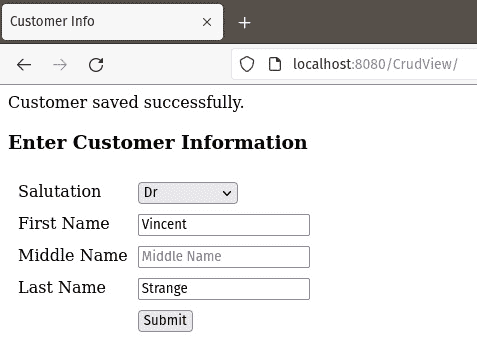
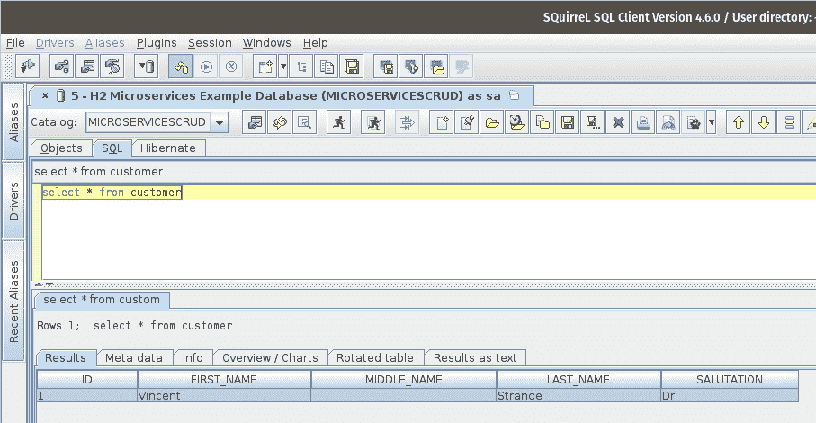

# 第五章：使用 Jakarta EE 进行微服务开发

微服务是一种将代码部署在小而粒度化的模块中的架构风格。微服务架构减少了耦合并增加了内聚。通常，微服务被实现为 RESTful Web 服务，通过在彼此上调用 HTTP 方法（`GET`、`POST`、`PUT`或`DELETE`）来相互传递数据，使用 JSON 进行数据交换。由于微服务之间的通信是通过 HTTP 方法完成的，因此用不同编程语言编写的微服务可以相互交互。在本章中，我们将介绍如何使用 Jakarta EE 来实现微服务。

在本章中，我们将介绍以下主题：

+   微服务简介

+   微服务和 Jakarta EE

+   使用 Jakarta EE 开发微服务

注意

本章的示例源代码可以在 GitHub 上找到：[`github.com/PacktPublishing/Jakarta-EE-Application-Development/tree/main/ch05_src`](https://github.com/PacktPublishing/Jakarta-EE-Application-Development/tree/main/ch05_src)。

# 微服务简介

将应用程序设计为一系列微服务，与传统设计的应用程序相比，具有一些优势以及一些缺点。在考虑为我们的应用程序采用微服务架构时，我们必须在做出决定之前仔细权衡利弊。

## 优势

将应用程序作为一系列微服务开发具有比传统设计应用程序更多的优势，如下所示：

+   **更小的代码库**：由于每个微服务都是一个小的、独立的单元，因此微服务的代码库通常比传统设计的应用程序更小，更容易管理。

+   **微服务鼓励良好的编码实践**：微服务架构鼓励松耦合和高内聚。

+   **更高的弹性**：传统设计的应用程序作为一个单一故障点；如果应用程序的任何组件出现故障或不可用，整个应用程序将不可用。由于微服务是独立的模块，一个组件（即一个微服务）的故障并不一定导致整个应用程序不可用。

+   **可伸缩性**：由于作为一系列微服务开发的应用程序由多个不同的模块组成，因此可伸缩性变得更容易。我们可以只关注可能需要扩展的服务，而无需在不需要扩展的应用程序部分上浪费精力。

## 微服务架构的缺点

开发和部署遵循微服务架构的应用程序会带来一系列挑战，无论使用什么编程语言或应用程序框架来开发应用程序：

+   **额外的操作和工具开销**：每个微服务实现都需要自己的（可能是自动化的）部署、监控系统等。

+   **调试微服务可能比调试传统企业应用程序更复杂**：如果最终用户报告了应用程序的问题，并且该应用程序内部使用了多个微服务，那么并不总是清楚哪个微服务可能是问题的根源。如果涉及的微服务是由不同团队开发且优先级不同的，这可能尤其困难。

+   **分布式事务可能是一个挑战**：涉及多个微服务的回滚事务可能很难。一种常见的解决方案是尽可能地将微服务隔离，将它们视为单一单元，并为每个微服务提供本地事务管理。例如，如果微服务 A 调用微服务 B，并且后者存在问题，微服务 B 的本地事务将回滚。然后，它将返回 500 HTTP 状态码（服务器错误）给微服务 A。微服务 A 可以使用这个 HTTP 状态码作为信号来启动补偿事务，将系统恢复到初始状态。

+   **网络延迟**：由于微服务依赖于 HTTP 方法调用进行通信，性能可能会因为网络延迟而受到影响。

+   **潜在的复杂依赖性**：虽然独立的微服务往往很简单，但它们相互依赖。微服务架构可能创建一个复杂的依赖图。如果我们的某些服务依赖于其他团队开发的微服务，而这些微服务的优先级可能存在冲突（例如，我们在他们的微服务中找到一个错误，但修复这个错误可能不是其他团队的优先事项），这种情况可能会令人担忧。

+   **易受分布式计算谬误的影响**：遵循微服务架构开发的应用程序可能会做出一些不正确的假设，例如网络可靠性、零延迟和无限带宽。

现在我们已经讨论了微服务的一般概念，接下来我们将关注如何利用 Jakarta EE 来开发遵循微服务架构的应用程序。

# 微服务和 Jakarta EE

有些人可能认为 Jakarta EE 对于微服务开发来说“太重了”。这根本不是事实。由于这种误解，有些人也可能认为 Jakarta EE 可能不适合微服务架构，而实际上，Jakarta EE 非常适合微服务开发。在不久前，Java EE 应用程序被部署到“重量级”的应用服务器上。如今，大多数 Jakarta EE 应用服务器供应商都提供轻量级的应用服务器，它们使用的内存或磁盘空间非常少。这些 Jakarta EE 兼容的轻量级应用服务器的例子包括 IBM 的 Open Liberty、Red Hat 的 WildFly Swarm、Apache TomEE 和 Payara Micro。Jakarta EE 10 引入了核心配置文件，这对于使用 Jakarta EE 进行微服务开发来说非常理想。

使用 Jakarta EE 核心配置文件开发微服务涉及编写标准的 Jakarta EE 应用程序，同时将自己限制在核心配置文件支持的 Jakarta EE API 子集内，即 Jakarta REST、JSON-P、JSON-B 和 CDI。如果与关系型数据库交互，我们可能需要事务支持，并且可能希望有一个对象关系映射 API，例如 Jakarta Persistence。为了与关系型数据库交互，我们需要 Jakarta EE 网络配置文件，因为核心配置文件不包括 Jakarta Persistence 或事务支持。只有需要直接与关系型数据库交互的微服务才需要网络配置文件；其他微服务可以针对核心配置文件进行开发。

当开发微服务时，Jakarta EE 开发者可以利用他们现有的专业知识。在开发微服务时，主要要求是开发 RESTful 网络服务，这可以通过使用 Jakarta REST 轻松实现。这些 RESTful 网络服务将被打包在一个 WAR 文件中，并部署到轻量级的 Jakarta EE 运行时环境中。

当使用现代、可嵌入的 Jakarta EE 实现时，通常每个应用服务器实例只部署一个应用程序，在某些情况下，可以说“形势逆转”，将 Jakarta EE 实现仅仅作为一个库，应用程序将其作为依赖项使用。这些现代的 Jakarta EE 实现通常会将多个 Jakarta EE 运行时实例部署到服务器上，这使得现代 Jakarta EE 非常适合微服务开发。许多现代的轻量级 Jakarta EE 应用服务器都是可嵌入的，允许创建一个“uber jar”，它包含应用程序代码和应用服务器库。然后，这个“uber jar”被传输到服务器上并作为一个独立的应用程序运行。除了“uber jars”之外，现代应用服务器还可以添加到容器镜像（如 Docker）中。然后，我们的应用程序可以作为一个瘦 WAR 部署，通常只有几 KB 大小；这种方法具有非常快速部署的优势，通常在两秒以内。

通过部署到符合 Jakarta EE 核心配置文件规范的现代应用服务器（或者，如前一段所述，创建一个“uber jar”），Jakarta EE 开发者当然可以利用他们现有的专业知识来开发遵循微服务架构的应用程序。

# 使用 Jakarta EE 开发微服务

现在我们已经简要地向您介绍了微服务，我们准备展示一个使用 Jakarta EE 编写的微服务应用程序的示例。我们的示例应用程序对于大多数 Jakarta EE 开发者来说应该非常熟悉。它是一个简单的**CRUD**（**创建、读取、更新、删除**）应用程序，作为一系列微服务开发的。该应用程序将遵循熟悉的 MVC 设计模式，其中“视图”和“控制器”作为微服务开发。该应用程序还将利用非常常见的**数据访问对象**（**DAO**）**模式**，我们的 DAO 也作为微服务开发。

DAO 模式

**DAO**设计模式是一种允许我们将数据访问代码与我们的应用程序的其他部分分离的模式。这使我们能够在不影响应用程序的其他代码的情况下切换数据访问代码的实现。

我们的应用程序将作为三个模块开发 – 首先，一个微服务客户端，然后是 MVC 设计模式中控制器微服务的实现，最后是实现为微服务的 DAO 设计模式。

注意

示例代码不是一个完整的 CRUD 应用程序。为了简单起见，我们只实现了 CRUD 应用程序的“创建”部分。

## 开发微服务客户端代码

在深入开发我们的服务之前，我们首先将使用纯 HTML 和 JavaScript 开发一个微服务客户端。JavaScript 代码将调用控制器微服务，传递用户输入数据的 JSON 表示。然后，控制器服务将调用持久化服务并将数据保存到数据库。每个微服务将返回一个 HTTP 代码，指示成功或错误状态。

我们客户端代码中最相关的部分是 HTML 表单和将其提交到我们的控制器微服务的 JavaScript 代码。

我们 HTML 页面中的表单包含以下输入字段：

```java
<form id="customerForm">
  <!-- layout markup omitted for brevity -->
  <label for="salutation">Salutation</label>
  <select id="salutation" name="salutation" >
    <option value=""> </option>
    <option value="Mr">Mr</option>
    <option value="Mrs">Mrs</option>
    <option value="Miss">Miss</option>
    <option value="Ms">Ms</option>
    <option value="Dr">Dr</option>
  </select>
  <label for="firstName">First Name</label>
  <input type="text" maxlength="10" id="firstName"
    name="firstName" placeholder="First Name">
  <label for="middleName">Middle Name</label>
  <input type="text" maxlength="10"  id="middleName"
    name="middleName" placeholder="Middle Name">
  <label for="lastName">Last Name</label>
  <input type="text" maxlength="20"  id="lastName"
    name="lastName" placeholder="Last Name">
  <button type="submit" id="submitBtn" >Submit</button>
</form>
```

我们的 Web 客户端表单包含多个输入字段，用于收集用户数据。它是使用纯 HTML 实现的，没有使用额外的 CSS 或 JavaScript 库。我们的页面还有一个脚本，使用 JavaScript 将表单数据发送到控制器微服务，如下面的代码块所示：

```java
<script>
  async function createCustomer(json) {
    try {
      const response = await fetch(  'http://localhost:8080/
CrudController/resources/customercontroller/', {
        method: 'POST',
        body: json,
        headers: {
          'Content-Type': 'application/json'
}
      });
      document.querySelector("#msg").innerHTML =
        "Customer saved successfully."
    } catch (error) {
      document.querySelector("#msg").innerHTML =
        "There was an error saving customer data.";
    }
  }
  function handleSubmit(event) {
    event.preventDefault();
    console.log("form submitted");
    const formData = new FormData(event.target);
    var formDataObject = {};
    formData.forEach(function (value, key) {
      formDataObject[key] = value;
    });
    var json = JSON.stringify(formDataObject);
    createCustomer(json);
  }
  const form = document.querySelector('#customerForm');
  form.addEventListener('submit', handleSubmit);
</script>
```

当表单提交时，我们的脚本生成用户输入数据的 JSON 格式表示，然后使用 JavaScript fetch API 向我们的控制器服务发送 HTTP `POST`请求。在我们的示例中，我们的控制器服务部署到我们本地工作站上的 Jakarta EE 运行时，监听端口`8080`；因此，我们的客户端代码向 http://localhost:8080/CrudController/resources/customercontroller/发送`POST`请求。

现在，我们可以将我们的浏览器指向我们的`CrudView`应用程序 URL（在我们的示例中为 http://localhost:8080/CrudView）。在输入一些数据后，页面将看起来如下所示。


图 5.1 – HTML/JavaScript RESTful Web 服务客户端

当用户点击**提交**按钮时，客户端将用户输入数据的 JSON 表示传递给控制器服务。

## 控制器服务

控制器服务是 MVC 设计模式中控制器的一个标准 RESTful Web 服务实现，使用 Jakarta REST 实现：

```java
package com.ensode.jakartaeebook.microservices.crudcontroller.service;
//imports omitted for brevity
@Path("/customercontroller")
public class CustomerControllerService {
  @OPTIONS
  public Response options() {
    LOG.log(Level.INFO, "CustomerControllerService.options() 
invoked");
    return Response.ok("")
      .header("Access-Control-Allow-Origin",
        "http://localhost:8080")
      .header("Access-Control-Allow-Headers",
        "origin, content-type, accept, authorization")
      .header("Access-Control-Allow-Credentials", "true")
      .header("Access-Control-Allow-Methods",
        "GET, POST, PUT, DELETE, OPTIONS, HEAD")
      .header("Access-Control-Max-Age", "1209600")
        .build();
  }
  @POST
  @Consumes(MediaType.APPLICATION_JSON)
  public Response addCustomer(Customer customer) {
    Response response;
    Response persistenceServiceResponse;
    CustomerPersistenceClient client = new 
      CustomerPersistenceClient();
    persistenceServiceResponse = client.create(customer);
    client.close();
    if (persistenceServiceResponse.getStatus() == 201) {
      response = Response.ok("{}").
        header("Access-Control-Allow-Origin",
        "http://localhost:8080").build();
    } else {
      response = Response.serverError().
        header("Access-Control-Allow-Origin",
        "http://localhost:8080").build();
    }
    return response;
  }
}
```

带有`jakarta.ws.rs.OPTIONS`注解的`options()`方法是必要的，因为浏览器在调用包含我们服务器主要逻辑的实际请求之前会自动调用它。在这个方法中，我们设置了一些头部值，允许`http://localhost:8080`，这是我们客户端代码部署的主机和端口。

控制器服务的主要逻辑在`addCustomer()`方法中。此方法接收一个`Customer`类的实例作为参数；Jakarta REST 自动将客户端发送的 JSON 格式数据填充到`Customer`参数中。

注意

`Customer`类是一个简单的**数据传输对象**（**DTO**），包含一些与客户端表单中的输入字段匹配的属性，以及相应的 getter 和 setter。由于该类相当简单，我们决定不展示它。

在`addCustomer()`方法中，我们创建了一个`CustomerPersistenceClient()`实例，这是一个持久化服务的客户端，使用 Jakarta REST 客户端 API 实现。

然后，我们的`addCustomer()`方法通过在`CustomerPersistenceClient`上调用`create()`方法来调用持久化服务，检查持久化服务返回的 HTTP 状态码，然后向客户端发送适当的响应。

现在，让我们看看我们的 Jakarta REST 客户端代码的实现：

```java
package com.ensode.jakartaeebook.microservices.crudcontroller.restclient;
//imports omitted
public class CustomerPersistenceClient {
  private final WebTarget webTarget;
  private final Client client;
  private static final String BASE_URI =
   "http://localhost:8080/CrudPersistence/resources";
  public CustomerPersistenceClient() {
    client = ClientBuilder.newClient();
    webTarget = client.target(BASE_URI).path(
      "customerpersistence");
  }
  public Response create(Customer customer)
    throws ClientErrorException {
    return webTarget.request(
      MediaType.APPLICATION_JSON).post(
      Entity.entity(customer,
      MediaType.APPLICATION_JSON), Response.class);
  }
  public void close() {
    client.close();
  }
}
```

如我们所见，我们的客户端代码是一个相当简单的类，它使用了 Jakarta REST 客户端 API。我们声明了一个包含我们正在调用的服务的基础 URI 的常量（我们的持久化服务）。在其构造函数中，我们创建了一个新的`jakarta.ws.rs.client.ClientBuilder`实例。然后我们设置其基础 URI 和路径，匹配我们持久化服务的适当值。我们的客户端类有一个单一的方法，该方法向持久化服务提交一个 HTTP `POST`请求，然后返回从它那里返回的响应。

现在我们已经成功开发出我们的控制器服务，我们准备探索我们应用程序的最后一个组件——持久化服务。

## 持久化服务

我们的持久化服务使用 Jakarta REST 实现为一个简单的 RESTful Web 服务。其`create()`方法在服务接收到 HTTP `POST`请求时被调用：

```java
package com.ensode.jakartaeebook.microservices.crudpersistence.service;
//imports omitted for brevity
@ApplicationScoped
@Path("customerpersistence")
public class CustomerPersistenceService {
  private static final Logger LOG =
    Logger.getLogger(
      CustomerPersistenceService.class.getName());
  @Context
  private UriInfo uriInfo;
  @Inject
  private CrudDao customerDao;
  @POST
  @Consumes(MediaType.APPLICATION_JSON)
  public Response create(Customer customer) {
    try {
      customerDao.create(customer);
    } catch (Exception e) {
      LOG.log(Level.SEVERE, "Exception caught", e);
      return Response.serverError().build();
    }
    return Response.created(uriInfo.getAbsolutePath()).build();
  }
}
```

当控制器服务向持久化服务发送 HTTP `POST`请求时，我们的`create()`方法被调用。此方法简单地在一个实现 DAO 设计模式的类上调用`create()`方法。我们的持久化服务返回一个 HTTP 响应，`201`（已创建）。如果一切顺利且 DAO 的`create()`方法抛出异常，则我们的服务返回`500` HTTP 错误（内部服务器错误）。

我们的 DAO 实现为一个 CDI 管理的 Bean，使用 JPA 将数据插入数据库：

```java
package com.ensode.jakartaeebook.microservices.crudpersistence.dao;
//imports omitted for brevity
@ApplicationScoped
@DataSourceDefinition(name = 
    "java:app/jdbc/microservicesCrudDatasource",
        className = "org.h2.jdbcx.JdbcDataSource",
        url = "jdbc:h2:tcp://127.0.1.1:9092/mem:microservicescrud",
        user = "sa",
        password = "")
public class CrudDao {
  @PersistenceContext(unitName = "CustomerPersistenceUnit")
  private EntityManager em;
  @H2DatabaseWrapper
  public void create(Customer customer) {
    em.persist(customer);
  }
}
```

我们的 DAO 实现非常简单；它实现了一个方法，该方法在注入的 `EntityManager` 实例上调用 `persist()` 方法。请注意，我们利用了 `@DataSourceDefinition` 注解来创建一个指向我们数据库的数据源。这个注解是一个标准的 Jakarta EE 注解，它允许我们以实现无关的方式定义数据源。

注意

在我们的持久化服务项目中，`Customer` 类是一个简单的 JPA 实体。

现在我们已经开发了我们应用程序的所有三个组件，我们准备看到它的实际效果。

当用户输入一些数据并点击提交按钮后，我们应该在我们的页面顶部看到一条“成功”消息（见图 *图 5**.2*）。



图 5.2 – 用户输入的数据

如果我们查看数据库，我们应该看到用户输入的数据已成功持久化，如图 *图 5**.3* 所示。



图 5.3 – 插入数据库中的数据

如我们的示例代码所示，在 Jakarta EE 中遵循微服务架构开发应用程序非常简单。它不需要任何特殊知识。微服务使用标准的 Jakarta EE API 开发，并部署到轻量级的 Jakarta EE 运行时。

# 摘要

如本章所示，Jakarta EE 非常适合微服务开发。

本章涵盖了以下主题：

+   我们向您介绍了微服务，并列出了微服务架构的优缺点

+   我们解释了如何使用标准的 Jakarta EE 技术开发微服务，例如 Jakarta REST

Jakarta EE 开发者可以利用他们现有的知识来开发微服务架构——部署现代、轻量级的应用服务器。传统的 Jakarta EE 应用程序可以很好地与微服务交互，并且当有需要时，也可以迭代地重构为微服务架构。无论是开发遵循微服务架构的新应用程序，重构现有应用程序为微服务，还是修改现有应用程序以与微服务交互，Jakarta EE 开发者都可以利用他们现有的技能来完成这项任务。
