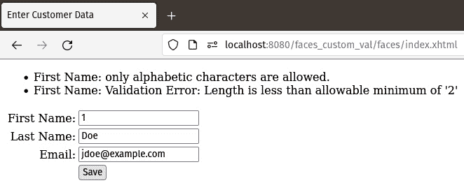

# 6

# Jakarta Faces

在本章中，我们将介绍自 Java EE 6 以来`web.xml`已变为可选，这意味着在许多情况下，我们可以不写一行 XML 代码就编写完整的 Web 应用程序。

在本章中，我们将介绍以下主题：

+   Jakarta Faces 简介

+   开发我们的第一个 Faces 应用程序

+   自定义数据验证

+   自定义默认消息

注意

本章的示例源代码可以在 GitHub 上找到，地址为[`github.com/PacktPublishing/Jakarta-EE-Application-Development/tree/main/ch06_src`](https://github.com/PacktPublishing/Jakarta-EE-Application-Development/tree/main/ch06_src)。

# Jakarta Faces 简介

在本节中，我们将概述使用 Jakarta Faces 开发 Web 应用程序涉及的内容，并提供在深入研究 Jakarta Faces 的细节之前必要的背景信息。

## Facelets

**Facelets**是 Jakarta Faces 的默认视图技术。Facelets 使用标准的**可扩展超文本标记语言**（**XHTML**）编写，使用 Jakarta Faces 特定的 XML 命名空间，这些命名空间提供了我们可以用来开发 Web 应用程序用户界面的 Jakarta Faces 特定标签。

## 可选的`faces-config.xml`

在大多数情况下，配置 Jakarta Faces 应用程序是不必要的，因为它遵循约定优于配置的方法。

对于某些特定情况，例如覆盖 Jakarta Faces 的默认错误消息时，我们仍然需要通过`faces-config.xml`配置文件来配置 Jakarta Faces。

## 标准资源位置

**资源**是页面或 Jakarta Faces 组件需要正确渲染的工件。资源示例包括 CSS 样式表、JavaScript 文件和图像。

当使用 Jakarta Faces 时，资源可以放置在名为`resources`的文件夹中的子目录中，这个文件夹位于 WAR 文件的根目录或其`META-INF`目录中。按照惯例，Jakarta Faces 组件知道它们可以从这两个位置之一检索资源。

为了避免资源目录杂乱，资源通常放置在子目录中。这个子目录通过 Faces 组件的`library`属性进行引用。

例如，我们可以在`/resources/css/styles.css`中放置一个名为`styles.css`的 CSS 样式表。

在我们的 Faces 页面中，我们可以使用以下`<h:outputStylesheet>`标签检索此 CSS 文件：

```java
<h:outputStylesheet library="css"  name="styles.css"/>
```

`library`属性的值必须与我们的样式表所在的子目录相匹配。

同样，我们可以在`/resources/scripts/somescript.js`中有一个 JavaScript 文件，以及一个图像在`/resources/images/logo.png`中，我们可以按照以下方式访问这些资源：

```java
<h:graphicImage library="images" name="logo.png"/>
<h:outputScript library="scripts" name="somescript.js"/>
```

注意，在每种情况下，`library`属性的值都与`resources`目录中相应的子目录名称相匹配，而`name`属性的值与资源的文件名相匹配。

# 开发我们的第一个 Faces 应用程序

为了说明基本的 Jakarta Faces 概念，我们将开发一个由两个 Facelet 页面和一个名为 **Contexts and Dependency Injection** (**CDI**) 的命名 bean 组成的简单应用程序。

## Facelets

正如我们在本章引言中提到的，Jakarta Faces 的默认视图技术被称为 Facelets。Facelets 需要使用标准的 XML 编写。开发 Facelet 页面最流行的方式是结合使用 XHTML 和 Jakarta Faces 特定的 XML 命名空间。以下示例展示了典型的 Facelet 页面看起来是什么样子：

```java
<!-- XML declaration and doctype omitted -->
<html 

>
  <h:head>
    <title>Enter Customer Data</title>
  </h:head>
  <h:body>
    <h:outputStylesheet library="css" name="styles.css"/>
    <h:form id="customerForm">
      <h:messages/>
      <h:panelGrid columns="2"
        columnClasses="rightAlign,leftAlign">
        <h:outputLabel for="firstName" value="First Name:">
        </h:outputLabel>
        <h:inputText id="firstName"
          label="First Name"
          value="#{customer.firstName}"
          required="true">
          <f:validateLength minimum="2" maximum="30"/>
        </h:inputText>
        <h:outputLabel for="lastName" value="Last Name:">
        </h:outputLabel>
        <h:inputText id="lastName"
                     label="Last Name"
                     value="#{customer.lastName}"
                     required="true">
          <f:validateLength minimum="2" maximum="30"/>
        </h:inputText>
        <h:outputLabel for="email" value="Email:">
        </h:outputLabel>
        <h:inputText id="email"
          label="Email"
          value="#{customer.email}">
          <f:validateLength minimum="3" maximum="30"/>
        </h:inputText>
        <h:panelGroup></h:panelGroup>
        <h:commandButton action="confirmation" value="Save">
        </h:commandButton>
      </h:panelGrid>
    </h:form>
  </h:body>
</html>
```

*图 6**.1* 展示了在部署我们的代码并输入一些数据后，我们的 Facelets 页面如何在浏览器中渲染。


图 6.1 – 渲染后的 Facelets 页面

几乎任何 Facelet 页面都会包含示例中展示的两个命名空间。第一个命名空间（`）用于渲染 HTML 组件的标签。按照惯例，当使用这个标签库时，前缀 **h**` **(代表 HTML) 被使用。**

**第二个命名空间（`）是核心的 Faces 标签库。按照惯例，当使用这个标签库时，前缀 **f**` **(代表 Faces) 被使用。**

**在前面的示例中，我们首先看到的 Faces 特定标签是 `<h:head>` 和 `<h:body>` 标签。这些标签类似于标准的 HTML `<head>` 和 `<body>` 标签，当页面在浏览器中显示时，它们会被渲染成这样。

`<h:outputStylesheet>` 标签用于从一个已知位置（Jakarta Faces 标准化了资源的位置，如 CSS 样式表和 JavaScript 文件，如本章之前所述）加载 CSS 样式表。`library` 属性的值必须对应于 CSS 文件所在的目录（这个目录必须在 `resources` 目录中）。`name` 属性必须对应于我们希望加载的 CSS 样式表的名称。

接下来我们看到的是 `<h:form>` 标签。当页面渲染时，这个标签会生成一个 HTML 表单。如示例所示，与常规 HTML 不同，这个标签不需要指定 `action` 或 `method` 属性。实际上，这个标签没有 `action` 属性或 `method` 属性。渲染的 HTML 表单的 `action` 属性将自动生成，而 `method` 属性始终是 `"post"`。`<h:form>` 的 `id` 属性是可选的；然而，始终添加它是一个好主意，因为它使得调试 Faces 应用程序变得更加容易。

我们接下来看到的标签是 `<h:messages>` 标签。正如其名称所暗示的，这个标签用于显示任何消息。正如我们很快就会看到的，Faces 可以自动生成验证消息；它们将显示在这个标签内。此外，可以通过 `jakarta.faces.context.FacesContext` 中定义的 `addMessage()` 方法程序化地添加任意消息。

我们接下来看到的下一个 Jakarta Faces 标签是`<h:panelGrid>`。这个标签大致相当于 HTML 表格，但它的工作方式略有不同。`<h:panelGrid>`标签有一个`columns`属性，而不是声明行（`<tr>`）和单元格（`<td>`）。此属性的值表示由此标签渲染的表格中的列数。当我们在这个标签内放置组件时，它们将放置在一行中，直到达到`columns`属性中定义的列数，然后下一个组件将被放置在下一行中。在示例中，`columns`属性的值是`2`，因此前两个标签将放置在第一行，接下来的两个将放置在第二行，依此类推。

注意

在 Web 开发的早期，使用 HTML 表格进行页面布局是一种流行的做法。随着 CSS 的出现，这种做法逐渐不再受欢迎。大多数现代 Facelets 页面使用 CSS 进行布局，但我们认为指出 Jakarta Faces 提供的布局功能是值得的。

`<h:panelGrid>`的另一个有趣属性是`columnClasses`属性。此属性将 CSS 类分配给渲染的表格中的每一列。在示例中，使用了两个 CSS 类（由逗号分隔）作为此属性的值。这会产生将第一个 CSS 类分配给第一列，第二个分配给第二列的效果。如果有三列或更多列，第三列将获得第一个 CSS 类，第四列获得第二个，依此类推，交替进行。

查看生成的 HTML 标记

我们可以通过在浏览器窗口上右键单击并选择**查看** **页面源代码**来查看我们 Facelets 页面的生成 HTML 标记。

为了阐明其工作原理，下面的代码片段展示了前一个页面生成的 HTML 标记源代码的一部分：

```java
<form id="customerForm" name="customerForm" method="post" action="/faces_intro/faces/index.xhtml" enctype="application/x-www-form-urlencoded">
  <table>
    <tbody>
      <tr>
        <td class="rightAlign">
          <label for="customerForm:firstName">
            First Name:</label>
        </td>
        <td class="leftAlign">
         <input id="customerForm:firstName" type="text"
           name="customerForm:firstName" value="" />
        </td>
      </tr>
      <tr>
        <td class="rightAlign">
          <label for="customerForm:lastName">
            Last Name:</label></td>
        <td class="leftAlign">
<input id="customerForm:lastName"
          type="text" name="customerForm:lastName"
            value="" /></td>
      </tr>
      <!-- Additional table rows omitted for brevity -->
    </tbody>
  </table>
</form>
```

注意到每个`<td>`标签都有一个交替的 CSS 标签`"rightAlign"`或`"leftAlign"`，我们通过将值`"rightAlign,leftAlign"`分配给`<h:panelGrid>`的`columnClasses`属性来实现这一点。我们应该注意，我们示例中使用的 CSS 类是在我们之前讨论的通过`<h:outputStylesheet>`加载的 CSS 样式表中定义的。生成的 HTML 标签的所有`name`和`id`属性的值是赋予`<h:form>`组件的 ID 和每个单独组件的 ID 的组合。注意，我们在页面末尾附近的`<h:commandButton>`组件没有分配 ID，因此 Faces 运行时自动分配了一个 ID，并使用它来填充生成的提交按钮的`name`属性。

在这个示例的这个阶段，我们开始在 `<h:panelGrid>` 内部添加组件。这些组件将被渲染在由 `<h:panelGrid>` 渲染的表格内。正如我们之前提到的，渲染表格的列数由 `<h:panelGrid>` 的 `columns` 属性定义。因此，我们不需要担心列（或行），我们只需开始添加组件，它们将被放置在正确的位置。

我们接下来看到的标签是 `<h:outputLabel>` 标签。此标签被渲染为 HTML `label` 元素。标签通过 `for` 属性与其他组件相关联，其值必须与标签所针对的组件的 ID 匹配。

接下来，我们看到 `<h:inputText>` 标签。此标签在渲染的页面上生成一个文本字段；其 `label` 属性用于任何验证消息。它让用户知道信息所指的字段。

注意

尽管 `<h:inputText>` 标签的 `label` 属性值与页面显示的标签匹配不是必需的，但强烈建议这样做。如果出现错误，这将使用户确切知道错误信息所指的具体字段。

特别值得注意的是该标签的 `value` 属性。我们看到的这个属性的值是在名为 `customer` 的命名 Bean 中的 `firstName`。当用户为此文本字段输入一个值并提交表单时，命名 Bean 中相应的属性将使用此值进行更新。该标签的 `required` 属性是可选的，其有效值是 `true` 和 `false`。如果将此属性设置为 `true`，容器将不允许用户在为文本字段输入一些数据之前提交表单。如果用户尝试不输入必需的值提交表单，页面将被重新加载，并在 `<h:messages>` 标签内显示错误信息，如图 *图 6**.2* 所示。


图 6.2 – 必填字段数据验证

*图 6**.2* 展示了当用户尝试在示例中保存表单而没有输入客户姓氏的值时显示的默认错误信息。信息的开头部分（对应 `<h:inputTextField>` 标签的 `label` 属性）。信息的文本可以自定义，以及其样式（字体、颜色等）。我们将在本章后面介绍如何做到这一点。

## 项目阶段

在每个 Jakarta Faces 页面上都有一个`<h:messages>`标签是个好主意。如果没有它，用户可能看不到验证消息，并且不知道为什么表单提交没有成功。默认情况下，Jakarta Faces 验证消息不会在应用程序服务器日志中生成任何输出。新 Jakarta Faces 开发者常犯的一个错误是未能将`<h:messages>`标签添加到他们的页面上。如果没有它，如果验证失败，则导航似乎没有原因失败（如果导航失败，则渲染相同的页面，如果没有`<h:messages>`标签，浏览器中不会显示错误消息）。

为了避免这种情况，我们可以利用 Jakarta Faces 的**项目阶段**。

在 Jakarta Faces 中定义了以下项目阶段：

+   生产

+   开发

+   单元测试

+   系统测试

我们可以将项目阶段定义为`web.xml`中 Faces servlet 的初始化参数，或者作为自定义`web.xml`在环境之间需要。

如何设置自定义 JNDI 资源取决于你的应用程序服务器。请查阅你的应用程序服务器文档以获取详细信息。例如，如果我们使用`GlassFish`来部署我们的应用程序，我们可以通过登录到 Web 控制台，导航到**JNDI** | **自定义资源**，然后点击**新建...**按钮来设置自定义 JNDI 资源，如图*图 6**.3*所示。


图 6.3 – 将 GlassFish 中的 Jakarta Faces 项目阶段定义为 JNDI 资源

要定义 Jakarta Faces 项目阶段，我们需要输入以下信息：

| **JNDI 名称** | `jakarta.faces.PROJECT_STAGE` |
| --- | --- |
| **资源类型** | `java.lang.String` |

表 6.1 – 在 GlassFish 中设置 Jakarta Faces 项目阶段

输入前两个值后，**工厂类**字段将自动填充以下值：

```java
org.glassfish.resources.custom.factory.PrimitivesAndStringFactory.
```

输入值后，我们需要添加一个名为`value`的新属性，其值对应我们希望使用的项目阶段（**开发**，本例中）。

一旦我们添加了自定义的 JNDI 资源，我们需要更新我们的`web.xml`配置文件以读取它，这一步骤在 Jakarta EE 实现中是相同的。

以下示例`web.xml`配置文件说明了如何设置 Jakarta Faces 项目阶段，以便我们的应用程序可以成功使用它：

```java
<?xml version="1.0" encoding="UTF-8"?>
<web-app 

  xsi:schemaLocation="https://jakarta.ee/xml/ns/jakartaee
  https://jakarta.ee/xml/ns/jakartaee/web-app_6_0.xsd"
  version="6.0">
  <resource-ref>
    <res-ref-name>faces/ProjectStage</res-ref-name>
    <res-type>java.lang.String</res-type>
    <mapped-name>jakarta.faces.PROJECT_STAGE</mapped-name>
  </resource-ref>
  <servlet>
    <servlet-name>Faces Servlet</servlet-name>
    <servlet-class>
       jakarta.faces.webapp.FacesServlet
    </servlet-class>
    <load-on-startup>1</load-on-startup>
  </servlet>
  <servlet-mapping>
    <servlet-name>Faces Servlet</servlet-name>
    <url-pattern>/faces/*</url-pattern>
  </servlet-mapping>
  <welcome-file-list>
    <welcome-file>faces/index.xhtml</welcome-file>
  </welcome-file-list>
</web-app>
```

`web.xml`中的`<resource-ref>`标签允许我们访问在应用程序服务器中定义的 JNDI 资源。在我们的情况下，我们想要访问我们的 Faces 应用程序的项目阶段。

`<res-ref-name>`为我们 JNDI 资源提供了一个名称，我们的代码可以使用它来查找我们的 JNDI 资源。我们的 Jakarta Faces 实现将寻找一个名为`faces/ProjectStage`的 JNDI 资源，如果找到了，就会使用它来确定我们的项目阶段。

`<res-type>` 允许我们指定我们正在寻找的资源类型，因为可以通过 JNDI 查询任意 Java 对象。当设置 Jakarta Faces 项目阶段时，此标签的值必须始终为 `java.lang.String`。

我们通过 `<mapped-name>` 标签指定应用程序服务器 JNDI 树中的资源名称。按照惯例，当通过 JNDI 设置 Jakarta Faces 项目阶段时，此值必须始终为 `jakarta.faces.PROJECT_STAGE`。

设置项目阶段允许我们在特定阶段运行时执行一些逻辑。例如，在我们的一个命名 Bean 中，我们可能有如下代码：

```java
    FacesContext facesContext =
        FacesContext.getCurrentInstance();
    Application application = facesContext.getApplication();
    if (application.getProjectStage().equals(
        ProjectStage.Production)) {
      //do production stuff
    } else if (application.getProjectStage().equals(
        ProjectStage.Development)) {
      //do development stuff
    } else if (application.getProjectStage().equals(
        ProjectStage.UnitTest)) {
      //do unit test stuff
    } else if (application.getProjectStage().equals(
        ProjectStage.SystemTest)) {
      //do system test stuff
    }
```

如我们所见，项目阶段允许我们根据不同的环境修改代码的行为。更重要的是，设置项目阶段允许 Jakarta Faces 根据项目阶段设置表现出不同的行为。在这种情况下，将项目阶段设置为开发会导致在渲染的页面上显示额外的调试信息。因此，如果我们忘记在我们的页面上添加 `<h:messages>` 标签；我们的项目阶段是开发，并且验证失败，即使我们省略了 `<h:messages>` 组件，页面上也会显示验证错误。这如图 *图 6**.4* 所示。


图 6.4 – 当项目阶段处于开发状态时显示的调试信息

在默认的生产阶段，此错误消息不会在页面上显示，这让我们困惑，为什么我们的页面导航似乎不起作用。

## 验证

注意到每个 `<h:inputField>` 标签都有一个嵌套的 `<f:validateLength>` 标签。正如其名称所暗示的，此标签验证输入文本字段的值是否在最小和最大长度之间。最小和最大值由标签的 `minimum` 和 `maximum` 属性定义。`<f:validateLength>` 是 Jakarta Faces 包含的标准验证器之一。就像 `<h:inputText>` 的 `required` 属性一样，当用户尝试提交一个包含无效值的表单时，Jakarta Faces 将自动显示默认错误消息，如图 *图 6**.5* 所示。


图 6.5 – 长度验证

可以覆盖任何 Jakarta Faces 验证消息的默认文本和 CSS 样式；我们将在本章后面介绍如何做到这一点。

除了 `<f:validateLength>` 之外，Jakarta Faces 还包括其他标准验证器，这些验证器列在以下表中：

| **验证标签** | **描述** |
| --- | --- |
| `<f:validateBean>` | 通过在命名 Bean 中使用注解进行验证，Bean 验证允许我们验证命名 Bean 的值，而无需向我们的 Jakarta Faces 标签添加验证器。如果需要，此标签允许我们微调 Bean 验证。 |
| `<f:validateDoubleRange>` | 验证输入是一个有效的 `Double` 值，在标签的 `minimum` 和 `maximum` 属性指定的两个值之间，包括这两个值 |
| `<f:validateLength>` | 验证输入的长度在标签的 `minimum` 和 `maximum` 值之间，包括这两个值 |
| `<f:validateLongRange>` | 验证输入是一个有效的 `Double` 值，在标签的 `minimum` 和 `maximum` 属性指定的值之间，包括这两个值 |
| `<f:validateRegex>` | 验证输入与标签的 `pattern` 属性中指定的正则表达式模式匹配 |
| `<f:validateRequired>` | 验证输入不为空。此标签等同于在父输入字段中将 `required` 属性设置为 `true` |

表 6.2 – Jakarta Faces 验证标签

注意，在 `<f:validateBean>` 的描述中，我们简要提到了 **Bean Validation**。Bean Validation API 旨在标准化 JavaBean 验证。JavaBeans 被几个其他 API 使用，这些 API 之前必须实现自己的验证逻辑。Jakarta Faces 利用 Bean Validation 来帮助验证命名 bean 属性。

如果我们想利用 Bean Validation，我们只需要用适当的 Bean Validation 注解标注所需的字段，而无需显式使用 Jakarta Faces 验证器。

注意

有关 Bean Validation 注解的完整列表，请参阅 Jakarta EE 10 API 文档中的 `jakarta.validation.constraints` 包，网址为 [`jakarta.ee/specifications/platform/10/apidocs/`](https://jakarta.ee/specifications/platform/10/apidocs/)。

## 组件分组

`<h:panelGroup>` 是示例中的下一个新标签。通常，`<h:panelGroup>` 用于将多个组件组合在一起，以便它们在 `<h:panelGrid>` 中占用单个单元格。这可以通过在 `<h:panelGroup>` 内添加组件并将 `<h:panelGroup>` 添加到 `<h:panelGrid>` 中来实现。如示例所示，这个 `<h:panelGroup>` 实例没有子组件。在这种情况下，`<h:panelGroup>` 的目的是有一个空单元格，并使下一个组件 `<h:commandButton>` 与表单中的所有其他输入字段对齐。

## 表单提交

`<h:commandButton>` 在浏览器中渲染一个 HTML 提交按钮。就像标准 HTML 一样，它的目的是提交表单。它的 `value` 属性简单地设置按钮的标签。此标签的 `action` 属性用于导航，要显示的下一页基于此属性的值。`action` 属性可以是一个字符串常量或一个 **方法绑定表达式**，这意味着它可以指向一个返回字符串的命名 bean 中的方法。

如果我们应用程序中页面的基本名称与`<h:commandButton>`标签的`action`属性的值相匹配，那么点击按钮时我们将导航到该页面。在我们的示例中，我们的确认页面名为`confirmation.xhtml`，因此按照惯例，当点击按钮时，将显示此页面，因为其`action`属性的值（`"confirmation"`）与页面的基本名称相匹配。

注意

尽管按钮的标签读作**保存**，但在我们的简单示例中，点击按钮实际上不会保存任何数据。

## 命名 bean

Jakarta Faces 与类级别的`@Named`注解紧密集成。以下是我们的示例中的命名 bean：

```java
package com.ensode.jakartaeebook.faces;
import jakarta.enterprise.context.RequestScoped;
import jakarta.inject.Named;
@Named
@RequestScoped
public class Customer {
  private String firstName;
  private String lastName;
  private String email;
  //getters and setters omitted for brevity
}
```

`@Named`类注解指定此 bean 为 CDI 命名 bean。此注解有一个可选的`value`属性，我们可以使用它为我们的 bean 提供一个逻辑名称，以便在 Jakarta Faces 页面中使用。然而，按照惯例，此属性的值与类名（在我们的例子中是`Customer`）相同，其第一个字符被转换为小写。在我们的示例中，我们允许这种默认行为发生，因此我们通过`customer`逻辑名称访问我们的 bean 属性。注意，在我们的示例页面中任何输入字段的`value`属性，以查看此逻辑名称的实际应用。

注意，除了`@Named`和`@RequestScoped`注解之外，此 bean 没有特殊之处。它是一个标准的 JavaBean，具有私有属性和相应的 getter 和 setter 方法。`@RequestScoped`注解指定 bean 应该在一个请求中存活。CDI 命名 bean 可用的不同作用域将在下一节中介绍。

### 命名 bean 作用域

命名 bean 始终有一个作用域。命名 bean 作用域定义了应用程序的生命周期。命名 bean 作用域由类级别的注解定义。以下表格列出了所有有效的命名 bean 作用域。

| **命名 bean** **作用域注解** | **描述** |
| --- | --- |
| `@``ApplicationScoped` | 应用程序作用域的命名 bean 的同一实例对所有我们的应用程序客户端都是可用的。如果一个客户端修改了应用程序作用域的命名 bean 的值，则更改将在客户端之间反映出来。 |
| `@``SessionScoped` | 每个会话作用域的命名 bean 实例都被分配给我们的应用程序的每个客户端。会话作用域的命名 bean 可以用来在请求之间保持客户端特定的数据。 |
| `@``RequestScoped` | 请求作用域的命名 bean 只存在于单个 HTTP 请求中。 |
| `@``Dependent` | 依赖作用域的命名 bean 被分配给它们注入的 bean 的作用域。 |
| `@``ConversationScoped` | 对话作用域可以跨越多个请求，但通常比会话作用域短。 |
| `@``ClientWindowScoped` | 客户端窗口作用域的 bean 将保留在内存中，直到当前的网络浏览器窗口或标签页被关闭。 |

表 6.3 – CDI 作用域注解

命名 bean 作用域允许我们指定 CDI 命名 bean 的生命周期。通过使用前面表格中列出的命名 bean 作用域之一，我们可以控制我们的命名 bean 何时创建和销毁。

## 静态导航

如我们的输入页面所示，当点击`customer_data_entry.xhtml`页面时，我们的应用程序将导航到一个名为`confirmation.xhtml`的页面。这是因为我们正在利用 Jakarta Faces 的约定优于配置功能，其中如果命令按钮或链接的`action`属性值与另一个页面的基本名称匹配，则此导航将带我们到该页面。这种行为被称为静态导航。Jakarta Faces 还支持动态导航，其中着陆页面可以根据某些业务逻辑确定，我们将在下一节讨论动态导航。

点击按钮或链接时是否会导致同一页面重新加载，而该按钮或链接应该导航到另一个页面？

如果导航看起来没有正常工作，那么很可能是这个属性的值有拼写错误。记住，按照惯例，Jakarta Faces 会寻找一个与命令按钮或链接的`action`属性值匹配的基本名称的页面。

`confirmation.xhtml`的源代码如下：

```java
<!-- XML declaration and doctype omitted -->
<html 
      >
  <h:head>
    <title>Customer Data Entered</title>
  </h:head>
  <h:body>
    <h:panelGrid columns="2"
      columnClasses="rightAlign,leftAlign">
      <h:outputText value="First Name:"/>
      <h:outputText value="#{customer.firstName}"/>
      <h:outputText value="Last Name:"></h:outputText>
      <h:outputText value="#{customer.lastName}"/>
      <h:outputText value="Email:"/>
      <h:outputText value="#{customer.email}"/>
    </h:panelGrid>
  </h:body>
</html>
```

我们在确认页面上看到的`<h:outputText>`是我们之前没有覆盖的唯一标签。这个标签简单地将其`value`属性的值显示到渲染的页面上，其`value`属性可以是简单的字符串或值绑定表达式。由于我们`<h:outputText>`标签中的值绑定表达式与之前页面中`<h:inputText>`标签使用的相同表达式，它们的值将对应于用户输入的数据。我们可以在*图 6.6*中看到页面的渲染方式。


图 6.6 – 示例确认页面

在传统的（即非 Jakarta Faces）Java Web 应用程序中，我们定义 URL 模式，以便由特定的 servlet 处理。对于 Jakarta Faces 来说，通常使用`.faces`后缀。另一个常用的 Faces URL 映射是`/faces`前缀。在特定条件下，现代应用程序服务器会自动将所有这些映射添加到`faces` servlet 中。如果满足这些条件，我们根本不需要指定任何 URL 映射。

如果以下任何条件成立，则`FacesServlet`将被自动映射：

+   在我们 Web 应用程序的`WEB-INF`目录中有一个`faces-config.xml`文件

+   在我们 Web 应用程序的一个依赖项的`META-INF`目录中有一个`faces-config.xml`文件

+   在我们 Web 应用程序的一个依赖项的`META-INF`目录中有一个以`.faces-config.xml`结尾的文件名

+   我们在`web.xml`或我们 Web 应用程序依赖项中的一个`web-fragment.xml`中声明了一个名为`jakarta.faces.CONFIG_FILES`的上下文参数

+   在调用`ServletContextInitializer`的`onStartup()`方法时，我们传递一个非空类集。

当这些条件都不满足时，我们需要在`web.xml`部署描述符中显式映射 Jakarta Faces servlet，如图所示：

```java
<?xml version="1.0" encoding="UTF-8"?>
<web-app 

  xsi:schemaLocation="https://jakarta.ee/xml/ns/jakartaee
  https://jakarta.ee/xml/ns/jakartaee/web-app_6_0.xsd"
  version="6.0">
  <servlet>
    <servlet-name>Faces Servlet</servlet-name>
    <servlet-class>
      jakarta.faces.webapp.FacesServlet
    </servlet-class>
    <load-on-startup>1</load-on-startup>
  </servlet>
  <servlet-mapping>
    <servlet-name>Faces Servlet</servlet-name>
    <url-pattern>/faces/*</url-pattern>
  </servlet-mapping>
</web-app>
```

我们在应用程序中的页面使用的 URL 是 Facelets 页面的名称，前面加上`/faces`。我们在`web.xml`配置文件中的`<servlet-mapping>`标签中指定这一点。

## 动态导航

在某些情况下，我们可能事先不知道应用程序工作流程中的下一页是什么，我们需要运行一些业务逻辑来确定显示下一页。例如，当提交数据时，如果一切如预期进行，我们可能希望导航到确认页面，或者我们可能希望导航到错误页面，甚至在处理数据时出现错误，我们可能希望导航回输入页面。

以下示例说明了我们如何在 Jakarta Faces 中实现动态导航：

```java
<!-- XML declaration and doctype omitted -->
<html 

      >
  <h:head>
    <title>Enter Customer Data</title>
  </h:head>
  <h:body>
    <h:outputStylesheet library="css" name="styles.css"/>
    <h:form id="customerForm">
      <h:messages/>
      <h:panelGrid columns="2"
                   columnClasses="rightAlign,leftAlign">
        <!- input fields omitted for brevity -->
        <h:commandButton
          action="#{customerController.saveCustomer()}"
          value="Save"/>
      </h:panelGrid>
    </h:form>
  </h:body>
</html>
```

为了实现动态导航，我们需要修改命令按钮的动作属性，使其成为一个 Jakarta 表达式语言方法表达式，即映射到我们 CDI 命名 bean 中某个方法的表达式。对于动态导航，表达式中的方法必须不接受任何参数并返回一个字符串。在我们的示例中，我们正在使用名为`customerController`的 CDI 命名 bean 中的`saveCustomer()`方法，因此我们的表达式是`#{customerController.saveCustomer}`。我们将在下一节中查看`saveCustomer()`方法的实现：

```java
package com.ensode.jakartaeebook.faces;
//imports omitted for brevity
@Named
@RequestScoped
public class CustomerController {
 //instance variables omitted for brevity
  public String saveCustomer() throws IOException {
    String landingPage = "confirmation";
    String tmpDir = System.getProperty("java.io.tmpdir");
    Path customerFile;
    try {
      customerFile = Path.of(tmpDir, "customer-file.txt");
      if (!Files.exists(customerFile)) {
        customerFile = Files.createFile(Path.of(tmpDir,
                "customer-file.txt"));
      }
      //force an exception every other run
      customerFile.toFile().setWritable(
        !customerFile.toFile().canWrite());
      Files.writeString(customerFile, customer.toString(),
              StandardOpenOption.APPEND);
    } catch (IOException ex) {
      landingPage = "index";
      FacesMessage facesMessage = new FacesMessage(
              "Error saving customer");
      facesContext.addMessage(null, facesMessage);
    }
    return landingPage;
  }
}
```

我们的示例应用程序遵循模型-视图-控制器设计模式。我们的 CDI 命名 bean 充当控制器，并在用户提交表单时决定导航到哪个页面。如果一切顺利，我们将像往常一样导航到确认页面。如果出现问题（捕获到异常），我们将导航回输入页面（命名为`index.xhtml`）并向用户显示错误消息。

为了说明目的，我们的`saveCustomer()`方法简单地将`Customer`对象字符串表示保存到文件系统中，以强制抛出异常并允许我们展示动态导航。我们的代码翻转了相关文件的只读属性（如果它是可写的，则使其只读，反之亦然），然后尝试写入文件。当尝试在文件为只读时写入文件时，将抛出异常，并像图*6**.7*所示的那样导航回输入页面。


图 6.7 – 动态导航

有时我们需要提供自定义的业务逻辑验证或实现标准 Jakarta Faces 验证器中未包含的验证规则。在这种情况下，我们可以利用 Jakarta Faces 自定义验证功能。

# 自定义数据验证

除了为我们提供标准验证器之外，Jakarta Faces 允许我们创建自定义验证器。这可以通过两种方式之一完成：创建一个自定义验证器类或将验证方法添加到我们的命名豆中。

## 创建自定义验证器

除了标准验证器之外，Jakarta Faces 允许我们通过创建一个实现 `jakarta.faces.validator.Validator` 接口的 Java 类来创建自定义验证器。

以下类实现了一个电子邮件验证器，我们将使用它来验证客户数据输入屏幕中的电子邮件文本输入字段：

```java
package com.ensode.jakartaeebook.facescustomval;
//imports ommitted for brevity
@FacesValidator(value = "emailValidator")
public class EmailAddressValidator implements Validator {
  @Override
  public void validate(FacesContext facesContext,
          UIComponent uiComponent,
          Object value) throws ValidatorException {
    EmailValidator emailValidator =
      EmailValidator.getInstance();
    HtmlInputText htmlInputText =
      (HtmlInputText) uiComponent;
    String emailAddress = (String) value;
    if (!StringUtils.isEmpty(emailAddress)) {
      if (!emailValidator.isValid(emailAddress)) {
        FacesMessage facesMessage =
          new FacesMessage(htmlInputText.getLabel()
          + ": email format is not valid");
        throw new ValidatorException(facesMessage);
      }
    }
  }
}
```

`@FacesValidator` 注解将我们的类注册为 Jakarta Faces 自定义验证器类。其 `value` 属性的值是 Facelets 页面用来引用它的逻辑名称。

如示例所示，在实现 `Validator` 接口时，我们只需要实现一个名为 `validate()` 的方法。该方法接受三个参数，分别是 `jakarta.faces.context.FacesContext` 的一个实例、一个 `jakarta.faces.component.UIComponent` 的实例和一个对象。通常，应用程序开发者只需关注后两个参数。第二个参数是我们正在验证数据的组件，第三个参数是实际值。在我们的示例验证器中，我们将 `uiComponent` 强制转换为 `jakarta.faces.component.html.HtmlInputText`。这样，我们可以访问其 `getLabel()` 方法，我们可以将其用作错误消息的一部分。

如果输入的值不是有效的电子邮件地址格式，则创建一个新的 `jakarta.faces.application.FacesMessage` 实例，将要在浏览器中显示的错误消息作为其构造函数参数传递。然后我们抛出一个新的 `jakarta.faces.validator.ValidatorException`。错误消息随后在浏览器中显示。它是如何到达那里的由 Jakarta Faces API 在幕后完成。

Apache Commons Validator

我们的自定义验证器使用 **Apache Commons Validator** 来执行实际的验证。这个库包括许多常见的验证，如日期、信用卡号码、ISBN 号码和电子邮件。在实现自定义验证器时，值得调查这个库是否已经有一个我们可以使用的验证器。

为了在我们的页面上使用我们的验证器，我们需要在我们的 Facelets 页面上使用 `<f:validator>` 标签，将其嵌套在我们希望验证的字段内部。以下代码片段说明了我们为了将我们的自定义验证器集成到电子邮件输入字段中而必须做出的更改：

```java
<h:inputText label="Email" value="#{customer.email}">
  <f:validator validatorId="emailValidator" />
</h:inputText>
```

为了验证我们的电子邮件输入字段，我们在其标记内部添加了一个嵌套的 `<f:validator>` 标签。请注意，`<f:validator>` 的 `validatorId` 属性的值与我们自定义电子邮件验证器中使用的 `@FacesValidator` 注解中的值相匹配。

在编写我们的自定义验证器并修改我们的页面以利用它之后，我们可以看到我们的验证器在 *图 6.8* 中的实际应用。


图 6.8 – 自定义 Jakarta Faces 验证器在实际中的应用

现在我们已经看到了如何编写自定义验证器，我们将关注另一种在 Jakarta Faces 中实现自定义验证的方法，即通过编写验证方法。

## 验证方法

我们还可以通过向应用程序的一个或多个命名 Bean 中添加验证方法来实现自定义验证。以下 Java 类展示了如何使用验证方法进行 Faces 验证：

```java
package com.ensode.jakartaeebook.facescustomval;
//imports omitted for brevity
@Named
@RequestScoped
public class AlphaValidator {
  public void validateAlpha(FacesContext facesContext,
    UIComponent uiComponent,
    Object value) throws ValidatorException {
    if (!StringUtils.isAlphaSpace((String) value)) {
      HtmlInputText htmlInputText =
        (HtmlInputText) uiComponent;
      FacesMessage facesMessage =
        new FacesMessage(htmlInputText.
        getLabel()
        + ": only alphabetic characters are allowed.");
      throw new ValidatorException(facesMessage);
    }
  }
}
```

在这个例子中，该类只包含验证方法，但这并不总是必须的。我们可以给我们的验证方法取任何我们想要的名称，但它的返回值必须是 void，并且它必须按照示例中的顺序接受三个参数。换句话说，除了方法名外，验证方法的签名必须与`jakarta.faces.validator.Validator`接口中定义的`validate()`方法的签名相同。

如我们所见，前面验证方法的主体几乎与我们的自定义验证器的`validate()`方法的主体相同。我们检查用户输入的值，以确保它只包含字母字符和/或空格。如果不满足条件，则抛出一个包含适当错误消息字符串的`ValidatorException`。

StringUtils

在示例中，我们使用了`org.apache.commons.lang3.StringUtils`来执行实际的验证逻辑。除了示例中使用的该方法外，此类还包含几个用于验证`string`是否为数字或字母数字的方法。这个类是 Apache Commons Lang 库的一部分，在编写自定义验证器时非常有用。

由于每个验证方法都必须在命名 Bean 中，我们需要确保包含我们的验证方法的类被`@Named`注解标注，正如我们在示例中所展示的那样。

我们需要做的最后一件事是将我们的验证方法绑定到我们的组件上，通过标签的`validator`属性：

```java
<h:outputText value="First Name:"/>
<h:inputText label="First Name"
  value="#{customer.firstName}"
  required="true"
  validator="#{alphaValidator.validateAlpha}">
  <f:validateLength minimum="2" maximum="30"/>
</h:inputText>
<h:outputText value="Last Name:"/>
<h:inputText label="Last Name"
  value="#{customer.lastName}"
  required="true"
  validator="#{alphaValidator.validateAlpha}">
  <f:validateLength minimum="2" maximum="30"/>
</h:inputText>
```

由于姓名字段和姓氏字段都不应接受除字母字符和空格之外的内容，我们将我们的自定义验证方法添加到了这两个字段。

注意到`<h:inputText>`标签的验证器属性值是一个用 Jakarta 表达式语言编写的表达式，它使用包含我们的验证方法的 Bean 的默认命名 Bean 名称。`alphaValidator`是我们 Bean 的名称，而`validateAlpha`是我们验证方法的名称。

在修改我们的页面以使用我们的自定义验证器后，我们现在可以看到它在**图 6.9**中的实际应用。



图 6.9 – 通过验证方法进行自定义验证

注意到对于**姓名**字段，我们的自定义验证消息和标准长度验证器都已被执行。

实现验证方法的优势在于不需要为单个验证方法创建整个类（我们的示例就是这样做的，但在许多情况下，验证方法被添加到包含其他方法的现有命名 bean 中）。然而，缺点是每个组件只能由单个验证方法进行验证。当使用验证类时，可以在要验证的标签内部嵌套多个`<f:validator>`标签，因此可以在字段上执行多个验证，包括自定义和标准验证。

现在我们已经看到了如何创建自己的自定义验证，我们将看到如何自定义 Jakarta Faces 验证消息，我们将看到如何更改它们的格式（字体、颜色等），以及如何为标准 Jakarta Faces 验证器自定义错误消息文本。

# 自定义默认消息

正如我们之前提到的，可以自定义 Jakarta Faces 默认验证消息的样式（字体、颜色、文本等）。此外，还可以修改默认 Jakarta Faces 验证消息的文本。在接下来的几节中，我们将解释如何修改错误消息的格式和文本。

## 自定义消息样式

可以通过`<h:message>`标签的`style`或`styleClass`属性来自定义消息样式。当我们要声明内联 CSS 样式时使用`style`属性。当我们要在 CSS 样式表中或在我们页面的`<style>`标签中使用预定义样式时使用`styleClass`属性。

以下`markup`展示了如何使用`styleClass`属性来改变错误消息的样式。这是我们在上一节中看到的输入页面的修改版本。

```java
  <h:body>
    <h:outputStylesheet library="css" name="styles.css" />
    <h:form>
      <h:messages styleClass="errorMsg"/>
      <!-- additional markup omitted for brevity →
    </h:form>
  </h:body>
</html>
```

与上一页相比，唯一的区别是使用了`<h:messages>`标签的`styleClass`属性。正如我们之前提到的，`styleClass`属性的值必须与页面可访问的级联样式表中定义的 CSS 样式的名称相匹配。

在我们的案例中，我们定义了如下 CSS 样式用于消息：

```java
.errorMsg {
  color: red;
}
```

然后将此样式作为我们`<h:messages>`标签的`styleClass`属性的值。

*图 6**.10*展示了在实施此更改后验证错误消息的外观。


图 6.10 – 验证消息的自定义样式

在这个特定的情况下，我们只是将错误消息文本的颜色设置为红色，但我们只能通过 CSS 的能力来设置错误消息的样式。

注意

几乎任何标准的 Jakarta Faces 组件都包含一个`style`属性和一个`styleClass`属性，可以用来改变其样式。前者用于预定义的 CSS 样式，后者用于内联 CSS。

## 自定义消息文本

有时可能需要覆盖 Jakarta Faces 默认验证消息的文本。默认验证消息定义在名为`Messages.properties`的资源包中。此文件通常位于应用程序服务器包含的 Faces JAR 文件之一中。例如，`GlassFish`将其包含在名为`jakarta.faces.jar`的 JAR 文件中，位于`[glassfish 安装目录]/glassfish/modules`下。该文件包含多个消息；在此阶段，我们只对验证错误感兴趣。默认验证错误消息定义如下：

```java
jakarta.faces.validator.DoubleRangeValidator.MAXIMUM={1}: Validation Error: Value is greater than allowable maximum of "{0}"
jakarta.faces.validator.DoubleRangeValidator.MINIMUM={1}: Validation Error: Value is less than allowable minimum of ''{0}''
jakarta.faces.validator.DoubleRangeValidator.NOT_IN_RANGE={2}: Validation Error: Specified attribute is not between the expected values of {0} and {1}.
jakarta.faces.validator.DoubleRangeValidator.TYPE={0}: Validation Error: Value is not of the correct type
jakarta.faces.validator.LengthValidator.MAXIMUM={1}: Validation Error: Length is greater than allowable maximum of ''{0}''
jakarta.faces.validator.LengthValidator.MINIMUM={1}: Validation Error: Length is less than allowable minimum of ''{0}''
jakarta.faces.validator.LongRangeValidator.MAXIMUM={1}: Validation Error: Value is greater than allowable maximum of ''{0}''
jakarta.faces.validator.LongRangeValidator.MINIMUM={1}: Validation Error: Value is less than allowable minimum of ''{0}''
jakarta.faces.validator.LongRangeValidator.NOT_IN_RANGE={2}: Validation Error: Specified attribute is not between the expected values of {0} and {1}.
jakarta.faces.validator.LongRangeValidator.TYPE={0}: Validation Error: Value is not of the correct type.
jakarta.faces.validator.NOT_IN_RANGE=Validation Error: Specified attribute is not between the expected values of {0} and {1}.
jakarta.faces.validator.RegexValidator.PATTERN_NOT_SET=Regex pattern must be set.
jakarta.faces.validator.RegexValidator.PATTERN_NOT_SET_detail=Regex pattern must be set to non-empty value.
jakarta.faces.validator.RegexValidator.NOT_MATCHED=Regex Pattern not matched
jakarta.faces.validator.RegexValidator.NOT_MATCHED_detail=Regex pattern of ''{0}'' not matched
jakarta.faces.validator.RegexValidator.MATCH_EXCEPTION=Error in regular expression.
jakarta.faces.validator.RegexValidator.MATCH_EXCEPTION_detail=Error in regular expression, ''{0}''
jakarta.faces.validator.BeanValidator.MESSAGE={0}
```

为了覆盖默认的错误消息，我们需要创建自己的资源包，使用与默认资源包相同的键，但更改值以适应我们的需求。以下是我们应用程序的一个非常简单的自定义资源包示例。例如，要覆盖最小长度验证的消息，我们将在我们的自定义资源包中添加以下属性：

```java
jakarta.faces.validator.LengthValidator.MINIMUM={1}: minimum allowed length is ''{0}''
```

在此资源包中，我们覆盖了当使用`<f:validateLength>`标签验证的字段输入的值小于允许的最小值时的错误消息。为了让我们的应用程序知道我们有一个包含消息属性的自定义资源包，我们需要修改应用程序的`faces-config.xml`文件：

```java
<?xml version='1.0' encoding='UTF-8'?>
<faces-config version="4.0"

  xsi:schemaLocation="https://jakarta.ee/xml/ns/jakartaee
  https://jakarta.ee/xml/ns/jakartaee/web-facesconfig_4_0.xsd">
  <application>
    <message-bundle>com.ensode.Messages</message-bundle>
  </application>
</faces-config>
```

如我们所见，我们只需要对应用程序的`faces-config.xml`文件进行修改，添加一个`<message-bundle>`元素，指示包含我们的自定义消息的资源包的名称和位置。

在添加我们的自定义消息资源包并修改应用程序的

`faces-config.xml` 文件，我们可以看到我们的自定义验证消息正在发挥作用，如图 *图 6**.11* 所示。


图 6.11 – 自定义验证错误消息

如果我们没有覆盖验证消息，默认消息仍然会显示。在我们的资源包中，我们只覆盖了最小长度验证错误消息，因此我们的自定义错误消息会显示在**姓名**文本字段中。由于我们没有覆盖其他标准 Jakarta Faces 验证器的错误消息，因此每个验证器都会显示默认错误消息。电子邮件验证器是我们在本章中先前开发的自定义验证器，因为它是一个自定义验证器，其错误消息不受影响。

# 摘要

在本章中，我们介绍了如何使用 Jakarta Faces 开发基于 Web 的应用程序，Jakarta Faces 是 Jakarta EE 的标准组件框架。

在本章中，我们介绍了如何通过使用 Facelets 作为视图技术以及 CDI 命名豆来创建简单应用程序。我们看到了如何使用 Jakarta Faces 实现静态和动态导航。我们还介绍了如何通过使用 Faces 标准验证器、创建我们自己的自定义验证器或编写验证器方法来验证用户输入。此外，我们还介绍了如何自定义标准 Faces 错误消息，包括消息文本和消息样式（字体、颜色等）。

Jakarta Faces 与 CDI 的紧密集成使我们能够高效地为我们的 Jakarta EE 应用程序开发基于 Web 的界面。
