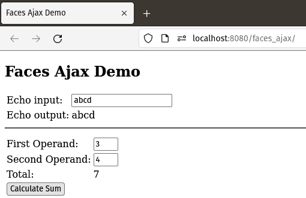
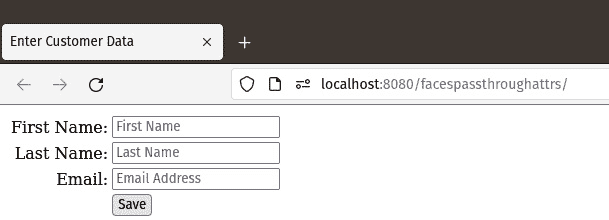
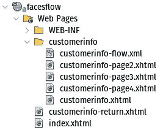
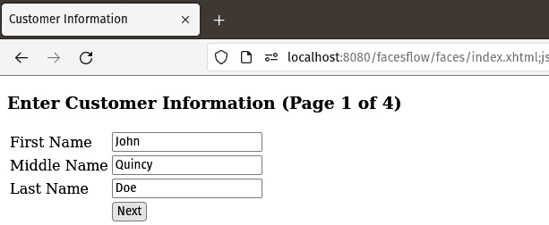
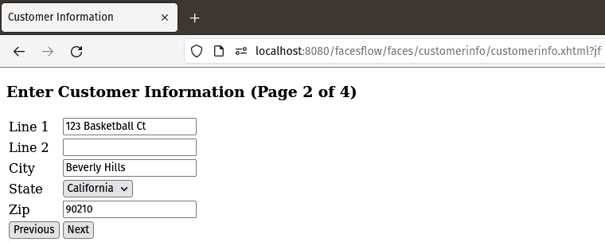
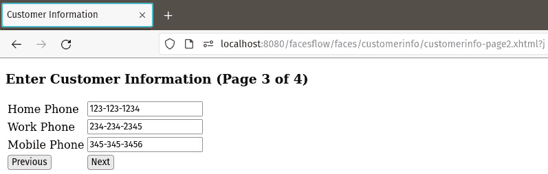
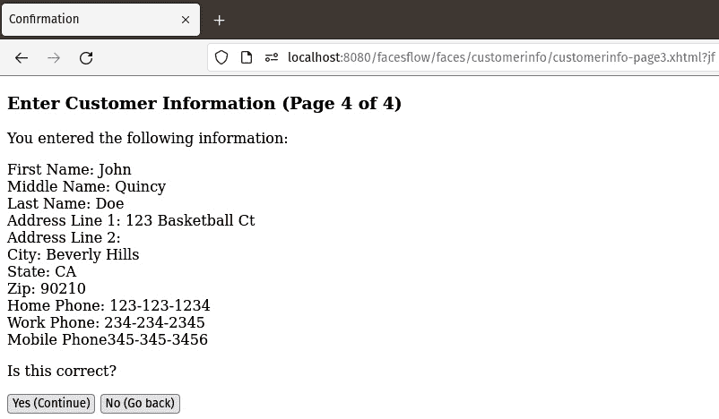
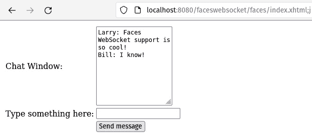

# 第七章：额外的 Jakarta Faces 功能

在本章中，我们将介绍 Jakarta EE 的标准组件框架 Jakarta Faces 的附加功能。这些附加功能使我们能够使我们的 Web 应用程序用户友好，同时为应用程序开发者提供方便的功能。

在本章中，我们将涵盖以下主题：

+   Ajax 启用的前端应用

+   Jakarta Faces 对 HTML5 的支持

+   Faces Flows

+   Faces WebSocket 支持

+   额外的 Faces 组件库

注意

本章的源代码可以在 GitHub 上找到：[`github.com/PacktPublishing/Jakarta-EE-Application-Development/tree/main/ch07_src`](https://github.com/PacktPublishing/Jakarta-EE-Application-Development/tree/main/ch07_src)

# Ajax 启用的前端应用

Jakarta Faces 允许我们轻松实现`<f:ajax>`标签和 CDI 命名豆，而无需实现任何 JavaScript 代码或解析 JSON 字符串。

以下标记展示了`<f:ajax>`标签的典型用法。

```java
    <h:form>
      <h:messages/>
      <h:panelGrid columns="2">
        <h:outputText value="Echo input:"/>
        <h:inputText id="textInput"
          value="#{controller.text}">
          <f:ajax render="textVal" event="keyup"/>
        </h:inputText>
        <h:outputText value="Echo output:"/>
        <h:outputText id="textVal"
           value="#{controller.text}"/>
      </h:panelGrid>
      <hr/>
      <h:panelGrid columns="2">
        <h:outputText value="First Operand:"/>
        <h:inputText id="first"
          value="#{controller.firstOperand}" size="3"/>
        <h:outputText value="Second Operand:"/>
        <h:inputText id="second"
          value="#{controller.secondOperand}" size="3"/>
        <h:outputText value="Total:"/>
        <h:outputText id="sum" vaue="#{controller.total}"/>
        <h:commandButton
          actionListener="#{controller.calculateTotal}"
          value="Calculate Sum">
          <f:ajax execute="first second" render="sum"/>
        </h:commandButton>
      </h:panelGrid>
    </h:form>
```

在部署我们的应用程序后，前面的标记渲染如图*图 7.1*所示。



图 7.1 – Faces Ajax 功能演示

我们的示例说明了`<f:ajax>`标签的两个用途。在页面顶部，我们通过实现一个典型的 Ajax Echo 示例来使用这个标签，其中有一个`<h:outputText>`组件通过输入文本组件的值来更新自己。每当输入字段中输入任何字符时，`<h:outputText>`组件的值会自动更新。

为了实现上一段描述的功能，我们在一个`<h:inputText>`标签内放置了一个`<f:ajax>`标签。`<f:ajax>`标签的`render`属性值必须与 Ajax 请求完成后要更新的组件的 ID 相对应。在我们的特定示例中，我们希望更新 ID 为`textVal`的`<h:outputText>`组件，因此这就是我们为`<f:ajax>`标签的`render`属性使用的值。

注意

在某些情况下，我们可能需要在 Ajax 事件完成后渲染多个 Faces 组件。为了适应这种情况，我们可以将多个 ID 作为`render`属性的值。我们只需用空格将它们分开即可。

在这个实例中，我们使用的另一个`<f:ajax>`属性是`event`属性。此属性指示触发 Ajax 事件的 JavaScript 事件。在这种情况下，我们需要在用户在输入字段中键入时释放任何键时触发事件。因此，适当的事件是`keyup`。

以下表格列出了所有支持的 JavaScript 事件：

| **事件** | **描述** |
| --- | --- |
| `blur` | 组件失去焦点 |
| `change` | 组件失去焦点且其值已更改 |
| `click` | 组件被点击 |
| `dblclick` | 组件被双击 |
| `focus` | 组件获得焦点 |
| `keydown` | 当组件获得焦点时按下键 |
| `keypress` | 当组件获得焦点时按下或保持按键 |
| `keyup` | 当组件获得焦点时释放键 |
| `mousedown` | 当组件获得焦点时鼠标按钮被按下 |
| `mousemove` | 鼠标指针在组件上移动 |
| `mouseout` | 鼠标指针离开组件 |
| `mouseover` | 鼠标指针放置在组件上 |
| `mouseup` | 当组件获得焦点时释放鼠标按钮 |
| `select` | 选择组件的文本 |
| `valueChange` | 等同于更改，组件失去焦点且其值已被修改 |

表 7.1 – `<f:ajax>`标签 JavaScript 事件属性

我们再次在页面下方使用`<f:ajax>`来启用一个命令按钮组件的 Ajax 功能。在这种情况下，我们想要根据两个输入组件的值重新计算一个值。为了将服务器上的值更新为最新的用户输入，我们使用了`<f:ajax>`的`execute`属性。此属性接受一个用空格分隔的组件 ID 列表，用作输入。然后，我们像之前一样使用`render`属性来指定在 Ajax 请求完成后需要重新渲染哪些组件。

注意我们正在使用`<h:commandButton>`的`actionListener`属性。此属性通常在我们点击按钮后不需要导航到另一个页面时使用。此属性的值是我们在一个名为 bean 中编写的动作监听器方法。动作监听器方法必须返回 void，并接受一个`jakarta.faces.event.ActionEvent`实例作为其唯一参数。

我们的应用程序中名为 bean 看起来像这样：

```java
package com.ensode.jakartaeebook.facesajax;
//imports ommitted for brevity
@Named
@ViewScoped
public class Controller implements Serializable {
  private String text;
  private int firstOperand;
  private int secondOperand;
  private int total;
  @Inject
  private FacesContext facesContext;
  public void calculateTotal(ActionEvent actionEvent) {
    total = firstOperand + secondOperand;
  }
  //getters and setters omitted for brevity
}
```

我们`commandButton`上的`actionListener`属性的值是一个 Jakarta 表达式语言方法表达式，解析到我们的 CDI 名为 bean 的`calculateTotal()`方法。因此，当用户点击标有`firstOperand`和`secondOperand`变量的按钮时，此方法会自动调用；这些变量绑定到这些字段的`value`属性。因此，这些变量被页面上的用户输入值填充；我们的方法只是将这些值相加并将它们分配给`total`变量。然后，页面上的`outputText`组件自动更新，该组件绑定到这个变量。

注意，我们不需要在我们的名为 bean 中做任何特殊操作来在我们的应用程序中启用 Ajax。所有这些都由页面上的`<f:ajax>`标签控制。

如此例所示，启用了 Ajax 的 Faces 应用程序非常简单。我们只需使用一个标签就能在我们的页面上启用 Ajax，无需编写任何 JavaScript、JSON 或 XML 代码。

# Jakarta Faces HTML5 支持

**HTML5** 是 HTML 规范的最新版本。它包括对之前 HTML 版本的多项改进。Jakarta Faces 包含了几个特性，使得 Faces 页面能够很好地与 HTML5 一起工作。Jakarta Faces 对 HTML5 的支持包括在 HTML5 中开发我们的 Jakarta Faces 页面而不使用特定于 Faces 的标签，以及将任意 HTML5 属性添加到我们的 Jakarta Faces 页面中。

## HTML5 兼容的标记

通过使用透传元素，我们可以使用 HTML5 而不是使用特定于 Faces 的标签来开发我们的 Faces 页面。使用 HTML5 开发页面有一个优点，那就是我们可以在不将应用程序部署到 Jakarta EE 运行时的情况下预览页面在浏览器中的渲染效果。我们只需在网页浏览器中打开页面即可。

要实现这一点，我们需要使用`jakarta.faces` XML 命名空间指定至少一个元素属性。以下示例展示了这一方法在实际中的应用：

```java
<!DOCTYPE html>
<html 
      >
  <head faces:id="head">
    <title>Jakarta Faces Page with HTML5 Markup</title>
    <link rel="stylesheet" type="text/css"
      href="resources/css/styles.css"/>
  </head>
  <body faces:id="body">
    <form faces:prependId="false">
      <div class="table">
        <div class="table-row">
          <div class="table-cell">
            <label faces:for="firstName">First Name</label>
          </div>
          <div class="table-cell">
            <input type="text" faces:id="firstName"
                   faces:value="#{customer.firstName}"/>
          </div>
        </div>
        <div class="table-row">
          <div class="table-cell">
            <label faces:for="lastName">Last Name</label>
          </div>
          <div class="table-cell">
            <input type="text" faces:id="lastName"
                   faces:value="#{customer.lastName}"/>
          </div>
        </div>
        <div class="table-row">
          <div class="table-cell">
            <label faces:for="email">Email Address</label></div>
          <div class="table-cell">
            <input type="email" faces:id="email"
                   faces:value="#{customer.email}"/>
          </div>
        </div>
        <div class="table-row">
          <div class="table-cell"></div>
          <div class="table-cell">
            <input type="submit" faces:action= "confirmation"
                   value="Submit"/>
          </div>
        </div>
      </div>
    </form>
  </body>
</html>
```

我们首先应该注意到的关于前面示例的是页面顶部附近的带有`faces`前缀的 XML 命名空间。这个命名空间允许我们向 HTML5 页面添加 Jakarta Faces 特定的属性。当 Faces 运行时遇到页面上的任何标签中带有`faces`前缀的属性时，它会自动将 HTML5 标签转换为等效的 Faces 组件。特定于 Faces 的属性与常规 Faces 页面中的属性相同，只是它们以`faces`为前缀。因此，在这个阶段，它们应该是自解释的，不会进行详细讨论。

上述示例将渲染和表现与本章的第一个示例完全相同。

本节中描述的技术如果我们的团队中有经验丰富的 HTML 网页设计师，他们更喜欢对页面外观有完全控制权时非常有用。页面使用标准的 HTML5 和特定于 Faces 的属性开发，以便 Faces 运行时可以管理用户输入。

如果我们的团队主要由对 CSS/HTML 知识有限的 Java 开发者组成，那么使用 Faces 组件开发我们的 Web 应用程序的网页是更可取的。

HTML 是一个不断发展的标准；偶尔，属性会被添加到 HTML 标签中。为了确保 Faces 组件的未来兼容性，Jakarta Faces 支持透传属性，可以使用它向 Jakarta Faces 组件添加任意属性。这项技术将在下一节中讨论。

## 透传属性

Jakarta Faces 允许定义任何任意属性（不被 Faces 引擎处理）。这些属性在浏览器上显示的生成的 HTML 中简单地按原样渲染。以下示例是本章早期示例的新版本，经过修改以利用 HTML5 透传属性：

```java
<?xml version='1.0' encoding='UTF-8' ?>
<!DOCTYPE html PUBLIC "-//W3C//DTD XHTML 1.0 Transitional//EN"
    "http://www.w3.org/TR/xhtml1/DTD/xhtml1-transitional.dtd">
<html 

      >
    <!-- additional markup omitted for brevity -->
    <h:form id="customerForm">
      <h:messages/>
      <h:panelGrid columns="2"
                   columnClasses="rightAlign,leftAlign">
        <h:outputLabel for="firstName" value="First Name:">
        </h:outputLabel>
        <h:inputText id="firstName"
          label="First Name" value="#{customer.firstName}"
          required="true" pt:placeholder="First Name">
          <f:validateLength minimum="2" maximum="30"/>
        </h:inputText>
        <h:outputLabel for="lastName" value="Last Name:"/>
        <h:inputText id="lastName"
          label="Last Name" value="#{customer.lastName}"
          required="true" pt:placeholder="Last Name">
          <f:validateLength minimum="2" maximum="30"/>
        </h:inputText>
        <h:outputLabel for="email" value="Email:"/>
        <h:inputText id="email"
          label="Email" value="#{customer.email}"
          pt:placeholder="Email Address">
          <f:validateLength minimum="3" maximum="30"/>
        </h:inputText>
        <h:panelGroup/>
        <h:commandButton action="confirmation"
          value="Save"/>
      </h:panelGrid>
    </h:form>
    <!-- additional markup omitted -->
</html>
```

我们首先应该注意到的这个示例是命名空间的增加。这个命名空间允许我们向我们的 Faces 组件添加任何任意属性。

在我们的例子中，我们在页面上所有输入文本字段上添加了 HTML5 的`placeholder`属性。正如我们所看到的，透传属性需要以应用程序顶部定义的命名空间的前缀（在我们的情况下是`pt`）为前缀。`placeholder` HTML 属性简单地向输入字段添加一些占位文本，一旦用户开始在输入字段中键入，这些文本就会自动删除（在`placeholder`属性添加到 HTML5 之前，这种技术通常使用 JavaScript 实现）。

以下截图显示了我们的更新页面在实际操作中的效果：



图 7.2 – 面部透传属性

如果我们检查生成的 HTML（通过在网页浏览器上右键单击并选择**查看源代码**或类似操作），我们可以看到 HTML 占位符属性被添加到了其中。例如，**姓氏**输入字段的生成标记如下：

```java
<input id="customerForm:firstName" type="text"
 name="customerForm:firstName" value=""
 placeholder="First Name" />
```

占位符属性是由于我们的透传属性而放置在那里的。

我们接下来要讨论的主题是面部流程，它提供了一个比请求作用域长但比会话作用域短的定制 Jakarta Faces 作用域。

# 面部流程

面部流程定义了一个可以跨越多个页面的作用域。当用户进入流程（一组网页）时创建流程作用域的 bean，当用户离开流程时销毁。

面部流程采用了 Jakarta Faces 的*约定优于配置*原则。在开发使用面部流程的应用程序时，通常使用以下约定：

+   流程中的所有页面都必须放置在一个以定义流程名称的目录中。

+   必须在包含流程页面的目录内存在一个以目录名称命名并附加`-flow`后缀的 XML 配置文件（该文件可能为空，但必须存在）

+   流程中的第一个页面必须以包含流程的目录名称命名

+   流程中的最后一页不得位于包含流程的目录内，并且必须以目录名称命名并附加`-return`后缀

*图 7*.3 说明了这些约定：



图 7.3 – 面部流程约定

在我们的例子中，我们定义了一个名为`"customerinfo"`的流程。按照惯例，这些文件位于名为`"customerinfo"`的目录中，流程的第一个页面命名为`customerinfo.xhtml`（流程中其他页面的名称没有限制）。当我们退出流程时，我们将导航到一个名为`"flowname-return.xml"`的页面 – 在我们的情况下，由于我们的流程名为`"customerinfo"`，相关页面的名称是`customerinfo-return.xhtml`，它遵循命名约定并使我们退出流程。

页面的标记没有展示我们之前没有见过的内容，因此我们在这里不会对其进行检查 – 如果您想自己查看，所有示例代码都作为本书代码下载包的一部分提供。

所有的前几页都将数据存储在名为`Customer`的命名 bean 中，该 bean 具有流程作用域：

```java
@Named
@FlowScoped("customerinfo")
public class Customer implements Serializable {
  //class body omitted
}
```

`@FlowScoped`注解有一个值属性，它必须与 bean 打算与之一起工作的流程的名称匹配（在这个例子中是`"customerinfo"`）。

此示例创建了一个向导风格的页面集，其中用户数据在流程中的多个页面上输入。

在第一页，我们输入客户的姓名信息：



图 7.4 – 我们 Faces Flow 示例的第一页

在第二页，我们输入客户的地址信息：



图 7.5 – 我们 Faces Flow 示例的第二页

在下一页，我们输入客户的电话联系信息：



图 7.6 – 我们 Faces Flow 示例的第三页

最后，我们显示一个确认页面：



图 7.7 – 我们 Faces Flow 示例的最后一页

如果用户验证信息正确，我们将导航到`customerinfo-return.xhtml`以跳出流程；否则，我们将返回流程中的第一页，以便用户进行任何必要的更正。

# Faces WebSocket 支持

在典型的 Web 应用程序中，服务器总是响应来自浏览器的请求。服务器没有在不响应请求的情况下向客户端浏览器发送数据的方法。**WebSocket**技术提供了浏览器和服务器之间的全双工通信，允许服务器在不响应请求的情况下独立地向客户端发送数据。WebSocket 允许为 Web 开发出无数新的应用程序，包括更新股票行情、多人在线游戏和聊天应用程序。

注意

虽然一些这类 Web 应用程序是在 WebSocket 出现之前开发的，但它们依赖于黑客手段来绕过 HTTP 的限制。有了 WebSocket，这些黑客手段就不再必要了。

传统上，在编写应用程序时利用 WebSocket 协议需要大量的 JavaScript 代码。Faces 的 WebSocket 支持抽象出了大部分 JavaScript 基础设施，使我们能够专注于开发我们应用程序的业务逻辑。

以下示例展示了使用 Faces WebSocket 支持开发的一个简单的聊天应用程序。

注意，Faces WebSocket 支持需要显式启用。这可以通过向我们的`web.xml`配置文件添加一个上下文参数来完成：

```java
<?xml version="1.0" encoding="UTF-8"?>
<web-app 

         xsi:schemaLocation="https://jakarta.ee/xml/ns/jakartaee
                  https://jakarta.ee/xml/ns/jakartaee/web-app_6_0.xsd"
         version="6.0">
  <servlet>
    <servlet-name>Faces Servlet</servlet-name>
    <servlet-class>
     jakarta.faces.webapp.FacesServlet
    </servlet-class>
    <load-on-startup>1</load-on-startup>
  </servlet>
  <servlet-mapping>
    <servlet-name>Faces Servlet</servlet-name>
    <url-pattern>/faces/*</url-pattern>
  </servlet-mapping>
  <context-param>
    <param-name>
     jakarta.faces.ENABLE_WEBSOCKET_ENDPOINT
    </param-name>
    <param-value>true</param-value>
  </context-param>
</web-app>
```

如我们的示例`web.xml`配置文件所示，为了在我们的 Faces 应用中启用 WebSocket 支持，我们需要设置一个名为`jakarta.faces.ENABLE_WEBSOCKET_ENDPOINT`的上下文参数，并将其值设置为`true`。

让我们现在看看我们如何开发一个负责向所有浏览器客户端发送消息的应用作用域 CDI 名为 bean：

```java
package com.ensode.jakartaeebook.faceswebsocket;
//imports omitted for brevity
@Named
@ApplicationScoped
public class FacesWebSocketMessageSender implements Serializable {
  private static final Logger LOG = Logger.getLogger(
          FacesWebSocketMessageSender.class.getName());
  @Inject
  @Push(channel = "websocketdemo")
  private PushContext pushContext;
  public void send(String message) {
    LOG.log(Level.INFO, String.format(""
            + "Sending message: %s", message));
    pushContext.send(message);
  }
}
```

如前例所示，为了通过 WebSockets 向客户端发送数据，我们需要注入一个实现`jakarta.faces.push.PushContext`接口的实例，并用`@Push`注解标注它。我们可以通过注解的`channel`属性指定一个通道。如果我们没有指定通道名称，则默认使用标注了`@Push`的变量的名称作为通道名称。

为了将消息发送到 WebSocket 客户端，我们需要调用注入的`PushContext`实现中的`send()`方法。在我们的例子中，这是在 CDI 名为 bean 的`send()`方法中完成的。

此外，在我们的例子中，有一个会话作用域的 CDI 名为 bean，它从用户那里获取输入并将其传递给前面应用作用域的 CDI 名为 bean 的`send()`方法。我们的会话作用域 CDI bean 看起来如下所示：

```java
package com.ensode.jakartaeebook.faceswebsocket;
//imports omitted for brevity
@Named
@SessionScoped
public class FacesWebSocketController implements Serializable {
  @Inject
private FacesWebSocketMessageSender facesWebSocketMessageSender;
  private String userName;
  private String message;
  public void sendMessage() {
    facesWebSocketMessageSender.send(
            String.format("%s: %s", userName, message));
  }
  public String navigateToChatPage() {
    return "chat";
  }
  //setters and getters omitted for brevity
}
```

前面的类中的`sendMessage()`方法调用我们之前讨论的应用作用域 CDI bean 的`send()`方法，传递用户的名称和要广播给所有浏览器的消息。上述`sendMessage()`方法通过 Ajax 在用户点击相应页面上的按钮时被调用，如下所示：

```java
  <h:body>
    <h:form prependId="false">
      <h:panelGrid columns="2">
        <h:outputLabel for="chatWindow"
          value="Chat Window:"/>
        <textarea id="chatWindow" rows="10"/>
        <h:outputLabel for="chatInput"
          value="Type something here:"/>
        <h:inputText id="chatInput"
          value="#{facesWebSocketController.message}"/>
        <h:panelGroup/>
        <h:commandButton actionListener=
          "#{facesWebSocketController.sendMessage()}"
          value="Send message">
          <f:ajax execute="chatInput" render="chatWindow"/>
        </h:commandButton>
      </h:panelGrid>
    </h:form>
    <script type="text/javascript">
        function socketListener(message, channel, event) {
          var textArea =
            document.getElementById('chatWindow');
          var textAreaValue = textArea.value;
          if (textAreaValue.trim() !== '') {
            textAreaValue += "\n";
          }
          textAreaValue += message;
          textArea.value = textAreaValue;
          textArea.scrollTop = textArea.scrollHeight;
        }
    </script>
    <f:websocket id="webSocketTag" channel="websocketdemo"
                 onmessage="socketListener" />
  </h:body>
```

前述标记中的`<f:websocket>`标签是启用我们页面 WebSocket 支持所必需的。其`channel`属性的值将页面链接到服务器上相应的`PushContext`实例（在我们的例子中，它定义在应用作用域的`FacesWebSocketMessageSender` CDI 名为 bean 中）。此属性的值必须与 CDI bean 上`@Push`注解中相应的属性值匹配（在我们的例子中是`"websocketdemo"`）。

在构建和部署我们的应用程序后，我们可以看到它的实际运行情况。



图 7.8 – Jakarta Faces WebSocket 支持

WebSocket 技术使我们能够在 Web 客户端和服务器之间开发双向通信。Jakarta Faces 对 WebSocket 的支持使得在我们的 Jakarta EE 应用中实现 WebSocket 技术变得容易。

# 其他 Faces 组件库

除了标准的 Jakarta Faces 组件库之外，还有许多第三方库可供选择。以下表格列出了其中两个最受欢迎的。

| **标签库** | **分发商** | **许可** | **URL** |
| --- | --- | --- | --- |
| ICEfaces | ICEsoft | MPL 1.1 | [`www.icefaces.org`](http://www.icefaces.org) |
| Primefaces | Prime Technology | Apache 2.0 | [`www.primefaces.org`](http://www.primefaces.org) |

表 7.2 – Jakarta Faces 组件库

使用第三方 Jakarta Faces 库，我们可以开发出外观优雅的应用程序，而无需使用很多（如果有的话）CSS。大多数第三方 Jakarta Faces 库都包含标准 Jakarta Faces 组件的即插即用替代品，例如`<h:inputText>`和`<h:commandButton>`，并且还提供了额外的组件，使我们能够以最小的努力实现复杂的功能。例如，大多数第三方库都包含一个具有内置分页和排序功能的表格组件，从而让我们免于自己开发该功能。大多数现实生活中的 Jakarta Faces 项目都利用了第三方组件库，其中 PrimeFaces 是最受欢迎的一个。

# 摘要

在本章中，我们介绍了如何使用 Jakarta Faces 开发基于 Web 的应用程序，Jakarta EE 的标准组件框架：

+   我们介绍了如何开发启用 Ajax 的 Faces 页面

+   我们解释了如何集成 Faces 和 HTML5

+   我们介绍了如何使用 Faces Flows 开发类似向导的界面

+   我们展示了如何将 WebSocket 技术集成到我们的 Jakarta Faces 应用程序中

+   我们讨论了第三方 Jakarta Faces 组件库，我们可以利用这些库使我们的工作更轻松

在本章中，我们超越了基本的 Jakarta Faces 功能，涵盖了高级 Jakarta Faces 特性，如 Ajax 和 WebSocket 支持。
