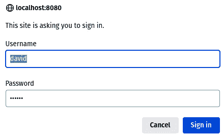
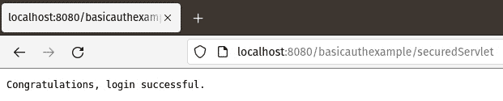
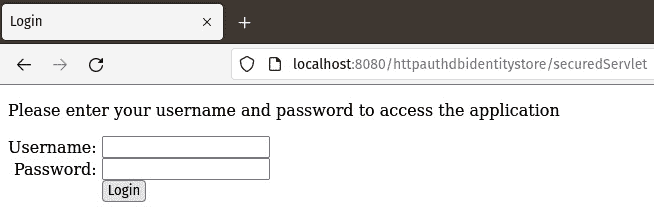
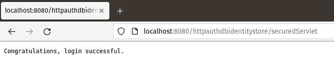
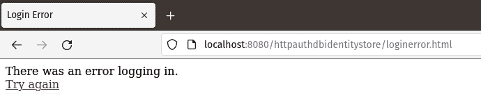
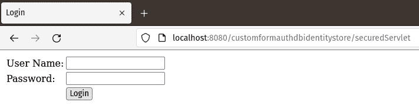
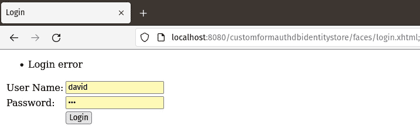

# 10

# 保护 Jakarta EE 应用程序

Jakarta EE 标准化了所有 Jakarta EE 兼容应用程序服务器中的应用程序安全。API 包括对身份存储的标准化访问，允许以统一的方式从关系型或 **轻量级目录访问协议**（**LDAP**）数据库中检索用户凭证，并允许我们实现自定义身份存储的访问。Jakarta EE 安全包括认证机制支持，允许我们以标准方式认证用户。支持多种认证机制，例如大多数浏览器支持的基线认证、客户端证书和 HTML 表单。

本章将涵盖以下主题：

+   身份存储

+   认证机制

注意

本章的示例源代码可以在 GitHub 上找到，链接如下：[`github.com/PacktPublishing/Jakarta-EE-Application-Development/tree/main/ch10_src`](https://github.com/PacktPublishing/Jakarta-EE-Application-Development/tree/main/ch10_src)。

# 身份存储

身份存储提供了对持久存储系统的访问，例如关系型或 LDAP 数据库，其中存储了用户凭证。Jakarta EE 安全 API 直接支持关系型和 LDAP 数据库，并且允许我们在必要时与自定义身份存储集成。

## 在关系型数据库中设置身份存储

要对存储在关系型数据库中的凭证进行认证，例如 servlet 或 RESTful Web 服务，请将具有 `@DatabaseIdentityStoreDefinition` 注解的应用程序范围 CDI bean 注解，如下例所示：

```java
package net.ensode.javaee8book.httpauthdatabaseidentitystore.security;
//imports omitted for brevity
@DatabaseIdentityStoreDefinition(
  dataSourceLookup = "java:global/jdbc/userauthdbDatasource",
    callerQuery =
      "select password from users where USERNAME = ?",
    groupsQuery =
      "select g.GROUP_NAME from USER_GROUPS ug, users u, "
        + "GROUPS g where ug.USER_ID = u.user_id and "
        + "g.GROUP_ID= ug.GROUP_ID and u.USERNAME=?"
)
@ApplicationScoped
public class ApplicationConfig {
}
```

在我们的示例中，包含用户凭证的关系型数据库的 JNDI 名称为 `java:global/jdbc/userauthdbDatasource`，这是我们提供给 `@DatabaseIdentityStoreDefinition` 注解的 `dataSourceLookup` 属性的值。

`@DatabaseIdentityStoreDefinition` 的 `callerQuery` 参数用于指定用于检索我们正在验证的用户用户名和密码的 SQL 查询。从数据库检索的值必须与用户提供的值（通过认证机制，我们将在下一节讨论）匹配。

大多数受保护的应用程序都有不同类型的用户，分为不同的角色；例如，一个应用程序可以有“普通”用户和管理员。管理员将能够执行普通用户无法执行的操作。例如，管理员可以重置用户密码并从系统中添加或删除用户。`@DatabaseIdentityStoreDefinition` 的 `groupsQuery` 属性允许我们检索用户的全部角色。

## 在 LDAP 数据库中设置身份存储

为了保护存储在 LDAP 数据库中的凭据，我们需要使用`@LdapIdentityStoreDefinition`注解来注解要保护的资源（如 servlet 或 RESTful Web 服务）；以下示例说明了如何进行此操作：

```java
package com.ensode.jakartaeebook.httpauthdatabaseidentitystore.servlet;
//imports omitted for brevity
@LdapIdentityStoreDefinition(
        url = "ldap://myldapserver:33389/",
        callerBaseDn = "ou=caller,dc=packtpub,dc=com",
        groupSearchBase = "ou=group,dc=packtpub,dc=com")
@WebServlet(name = "ControllerServlet", urlPatterns = {"/controller"})
public class ControllerServlet extends HttpServlet {
    @Override
    protected void doGet(HttpServletRequest req,
      HttpServletResponse res)
            throws ServletException, IOException {
        System.out.println("doGet() invoked");
    }
}
```

`@LdapIdentityStoreDefinition`的`url`属性用于指定包含我们应用程序用户凭据的 LDAP 服务器的 URL；其`callerBaseDn`属性用于指定用于验证用户提供的用户凭据的 LDAP 基本区分名称，最后，其`groupSearchBase`属性用于检索用户的角色。

## 自定义标识存储

在某些情况下，我们可能需要将我们的应用程序安全性与 Security API 不直接支持的标识存储系统集成。例如，我们可能需要与现有的商业安全产品集成。对于此类情况，Jakarta EE 安全 API 允许我们推出自己的标识存储定义。

为了处理自定义标识存储，我们需要创建一个应用程序范围的 CDI bean（参考*第二章*），并且该 bean 必须实现`IdentityStore`接口，如下面的示例所示：

```java
package com.ensode.jakartaeebook.security.basicauthexample;
//imports omitted for brevity
@ApplicationScoped
public class DummyIdentityStore implements IdentityStore {
  Set<String> adminRoleSet;
  Set userRoleSet;
  Set userAdminRoleSet;
  @PostConstruct
  public void init() {
    adminRoleSet = new HashSet<>(Arrays.asList("admin"));
    userRoleSet = new HashSet<>(Arrays.asList("user"));
    userAdminRoleSet = new HashSet<>(Arrays.asList("user",
      "admin"));
  }
  @Override
  public CredentialValidationResult validate(
   Credential credential) {
   UsernamePasswordCredential usernamePasswordCredential =
     (UsernamePasswordCredential) credential;
    CredentialValidationResult credentialValidationResult;
    if (usernamePasswordCredential.compareTo(
      "david", "secret")) {
      credentialValidationResult = new
        CredentialValidationResult("david", adminRoleSet);
    }
    else if (usernamePasswordCredential.compareTo(
      "alan", "iforgot")) {
      credentialValidationResult =
        new CredentialValidationResult("alan", userAdminRoleSet);
    }
    else if (usernamePasswordCredential.compareTo("alice",
     "password")) {
      credentialValidationResult = new
        CredentialValidationResult("alice", userRoleSet);
    }
    else {
      credentialValidationResult =
        CredentialValidationResult.INVALID_RESULT;
    }
    return credentialValidationResult;
  }
}
```

在我们示例中，安全 API 提供的`IdentityStore`接口中定义了`validate()`方法。我们实现此方法以便在我们的应用程序中使用自定义验证。

注意

在我们的示例中，我们将有效的凭据硬编码到代码中；不要在实际应用程序中这样做，因为这会是一个重大的安全风险。

定义在`IdentityStore`接口中的`validate()`方法接受一个实现`Credential`接口的类的实例作为其唯一参数。在我们的方法体中，我们将其向下转换为`UserNamePasswordCredential`，然后调用其`compareTo()`方法，传递预期的用户名和密码。如果提供的凭据与预期的任何一组凭据匹配，则允许用户成功登录。我们通过返回一个包含用户名和包含用户在我们应用程序中所有角色的`Set`的`CredentialValidationResult`实例来完成此操作。

如果提供的凭据与预期的任何凭据都不匹配，那么我们通过返回`CredentialValidationResult.INVALID_RESULT`来阻止用户登录。

现在我们已经看到了如何通过标识存储访问用户凭据信息，我们将关注 Jakarta EE 提供的不同认证机制。

# 认证机制

认证机制提供了一种让用户提供其凭据的方法，以便它们可以与标识存储进行认证。

Jakarta EE 安全 API 提供了对大多数浏览器提供的 HTTP Basic 认证机制以及表单认证的支持，后者是最常见的认证机制，其中用户通过 HTML 表单提供其凭据。

默认情况下，表单认证会将表单提交给 Jakarta EE 实现提供的安全 servlet。如果我们需要更多的灵活性或更好地与其他 Jakarta EE 技术对齐，安全 API 还提供了自定义表单认证，这允许我们作为应用程序开发者对尝试访问我们应用程序的用户进行认证有更多的控制。

## 基本认证机制

通过将资源（例如 servlet 或 RESTful Web 服务）标注为安全（即使用 `@BasicAuthenticationMechanismDefinition` 注解），可以实现基本认证机制：

```java
package com.ensode.jakartaeebook.security.basicauthexample;
//imports omitted for brevity
@BasicAuthenticationMechanismDefinition
@WebServlet(name = "SecuredServlet", urlPatterns = {"/securedServlet"})
@ServletSecurity(
        @HttpConstraint(rolesAllowed = "admin"))
public class SecuredServlet extends HttpServlet {
  @Override
   protected void doGet(HttpServletRequest request,
      HttpServletResponse response) throws Exception {
      response.getOutputStream().print(
        "Congratulations, login successful.");
  }
}
```

我们通过 `@HttpConstraint` 注解声明允许访问受保护资源的用户角色，该注解是 `@ServletSecurity` 注解的属性。在我们的示例中，只有具有 `admin` 角色的用户才能访问受保护的资源。

使用基本认证将在浏览器中弹出一个窗口，要求输入用户名和密码，如图 *图 10.1* 所示：



图 10.1 – 基本认证登录提示

如果用户输入了正确的凭据并且具有必要的角色，则允许访问受保护的资源，如图 *图 10.2* 所示：



图 10.2 – 成功的基本认证

如果用户输入了错误的凭据，登录弹出窗口将再次出现，允许用户重新输入他们的凭据。

如果用户输入了正确的凭据但没有适当的角色来访问受保护的资源，服务器将返回 HTTP 403 错误代码，表示用户被禁止访问受保护的资源。

## 表单认证机制

我们还可以通过开发一个 HTML 表单来收集用户的凭据，然后将认证委托给 Jakarta EE 安全 API 来认证我们的用户。采用这种方法的第一步是开发一个包含表单的 HTML 页面，用户可以通过该表单登录到应用程序，如下面的示例所示：

```java
<form method="POST" action="j_security_check">
  <table cellpadding="0" cellspacing="0" border="0">
    <tr>
      <td align="right">Username:&nbsp;</td>
      <td><input type="text" name="j_username"></td>
    </tr>
    <tr>
      <td align="right">Password:&nbsp;</td>
      <td><input type="password" name="j_password"></td>
    </tr>
    <tr>
      <td></td>
      <td><input type="submit" value="Login"></td>
    </tr>
  </table>
</form>
```

如示例所示，用于登录的 HTML 表单必须提交 HTTP POST 请求，并且其 `action` 属性的值必须是 `j_security_check`。现在，`j_security_check` 映射到由 Jakarta EE 安全 API 提供的 servlet。我们不需要自己开发任何验证逻辑。表单必须包含几个输入字段，一个用于用户名，一个用于密码。这些字段的名称必须分别是 `j_username` 和 `j_password`；由 Jakarta EE API 提供的安全 servlet 将检索这些值并自动验证用户。

此外，我们还需要提供一个 HTML 页面，当登录失败时用户将被重定向到该页面。该页面可以包含任何有效的 HTML 标记。在我们的示例中，我们只是提供了一个错误消息和一个链接，以便将用户引导回登录页面，以便他们可以再次尝试登录：

```java
<!DOCTYPE html>
<html>
  <head>
    <meta http-equiv="Content-Type" content="text/html; 
      charset=UTF-8">
    <title>Login Error</title>
  </head>
  <body>
    There was an error logging in.
    <br />
    <a href="login.html">Try again</a>
  </body>
</html>
```

在服务器端，我们只需要使用`@FormAuthenticationMechanismDefinition`注解来标记受保护的资源，这将让 Jakarta EE 安全 API 知道我们正在使用基于表单的认证，以及用于登录或登录失败时显示的 HTML 页面：

```java
package com.ensode.jakartaeebook.httpauthdbidentitystore;
//imports omitted for brevity
@FormAuthenticationMechanismDefinition(
  loginToContinue = @LoginToContinue(
  loginPage = "/login.html",
  errorPage = "/loginerror.html")
)
@DatabaseIdentityStoreDefinition(
  //attributes omitted for brevity
)
@WebServlet("/securedServlet")
@ServletSecurity(
        @HttpConstraint(rolesAllowed = {"admin"}))
public class SecuredServlet extends HttpServlet {
  @Override
  protected void doGet(HttpServletRequest request, HttpServletResponse 
    response)
          throws ServletException, IOException {
    response.getWriter().write("Congratulations, login successful.");
  }
}
```

`@FormAuthenticationMechanismDefinition`注解有一个必需的`loginToContinue`属性。此属性的值必须是`@LoginToContinue`注解的一个实例。`@LoginToContinue`有两个必需的属性：`loginPage`和`errorPage`。这些属性的值必须分别指示登录页面的路径和认证失败时显示的页面路径。

在构建和部署我们的代码后，尝试访问受保护资源时，用户将被自动重定向到我们的登录页面：



图 10.3 – 表单认证机制

如果用户输入正确的凭据并且具有适当的角色，则可以访问受保护的资源，如图*图 10.4*所示：



图 10.4 – 表单认证成功

如果输入了无效的凭据，则用户将被引导到我们的自定义错误页面，如图*图 10.5*所示：



图 10.5 – 表单认证失败

## 自定义表单认证机制

我们可以在应用程序中通过使用**自定义表单认证机制**来认证用户。当我们要将应用程序与 Web 框架（如 Jakarta Faces）集成时，这种认证机制非常有用。在我们的下一个示例中，我们将展示如何做到这一点：通过自定义表单认证将 Jakarta EE 安全 API 与 Jakarta Faces 集成。

要在我们的应用程序中使用自定义表单认证，我们需要使用名为`@CustomFormAuthenticationMechanismDefinition`的注解，如下例所示：

```java
package com.ensode.jakartaeebook.httpauthdbidentitystore;
//imports omitted for brevity
@CustomFormAuthenticationMechanismDefinition(
    loginToContinue = @LoginToContinue(
        loginPage="/faces/login.xhtml",
        errorPage=""
    )
)
@DatabaseIdentityStoreDefinition(
  //attributes omitted for brevity
)
@WebServlet("/securedServlet")
@ServletSecurity(
        @HttpConstraint(rolesAllowed = {"admin"}))
public class SecuredServlet extends HttpServlet {
    @Override
    protected void doGet(HttpServletRequest request,
      HttpServletResponse response)
      throws ServletException, IOException {
        response.getWriter().write(
          "Congratulations, login successful.");
    }
}
```

就像之前看到的`@FormAuthenticationMechanismDefinition`一样，`@CustomFormAuthenticationMechanismDefinition`注解有一个`loginToContinue`属性，它接受一个`@LoginToContinue`注解的实例作为其值。在这种情况下，由于我们正在与 Jakarta Faces 集成，`@LoginToContinue`的`loginPage`属性值必须指向用户登录所使用的 Facelets 页面的路径。当使用 Jakarta Faces 进行用户认证时，预期登录页面会在认证失败时显示错误消息。因此，我们需要将`@LoginToContinue`的`errorPage`属性留空。

我们的登录页面是一个标准的 Facelets 页面，用于收集用户凭据并将请求重定向到一个充当控制器的 CDI bean：

```java
<h:form>
  <h:messages/>
  <h:panelGrid columns="2">
    <h:outputLabel for="userName" value="User Name:"/>
    <h:inputText id="userName" value="#{user.userName}"/>
    <h:outputLabel for="password" value="Password: "/>
    <h:inputSecret id="password" value="#{user.password}"/>
    <h:panelGroup/>
    <h:commandButton action="#{loginController.login()}"
    value="Login"/>
  </h:panelGrid>
</h:form>
```

我们的登录页面有`userName`和`password`的输入字段，并且通过值绑定表达式将这些值存储在一个 CDI 命名 bean 中（未显示，因为它很 trivial）。当用户点击执行实际认证的`loginController` CDI 命名 bean 时：

```java
package com.ensode.jakartaeebook.httpauthdbidentitystore.customauth;
//imports omitted for brevity
@Named
@RequestScoped
public class LoginController {
    @Inject
    private SecurityContext securityContext;
    @Inject
    private User user;
    public void login() {
        FacesContext facesContext = FacesContext.getCurrentInstance();
        ExternalContext externalContext = facesContext.
          getExternalContext();
        HttpServletRequest httpServletRequest =
          HttpServletRequest) externalContext.getRequest();
        HttpServletResponse httpServletResponse =
          (HttpServletResponse) externalContext.getResponse();
        UsernamePasswordCredential usernamePasswordCredential =
      new UsernamePasswordCredential(user.getUserName(),
user.getPassword());
    AuthenticationParameters authenticationParameters =
      AuthenticationParameters.withParams().credential(
      usernamePasswordCredential);
      AuthenticationStatus authenticationStatus =
        securityContext.authenticate
        (httpServletRequest, httpServletResponse,
          authenticationParameters);
    if (authenticationStatus.equals(
      AuthenticationStatus.SEND_CONTINUE)) {
        facesContext.responseComplete();
    } else if(authenticationStatus.equals(
        AuthenticationStatus.SEND_FAILURE)) {
        FacesMessage facesMessage = new FacesMessage(
          "Login error");
            facesContext.addMessage(null, facesMessage);
      }
    }
}
```

在我们的`LoginController`类中，我们需要注入一个`jakarta.security.enterprise.SecurityContext`的实例，因为我们将在认证中使用它。我们在`login()`方法中实现认证逻辑。我们需要做的第一件事是创建一个`UsernamePasswordCredential`的实例，将用户输入的用户名和密码作为参数传递给其构造函数。

我们通过在`AuthenticationParameters`上调用静态的`withParams()`方法来创建一个`jakarta.security.enterprise.authentication.mechanism.http.AuthenticationParameters`的实例，然后在该实例上调用`credential()`方法，并将我们刚刚创建的`UserNamePasswordCredential`实例作为参数传递。这会返回另一个`AuthenticationParameters`的实例，我们可以使用它来实际验证用户输入的凭据。

我们通过在`SecurityContext`实例上调用`authenticate()`方法来验证用户输入的凭据，将 HTTP `Request`和`Response`对象作为参数传递，以及包含用户输入凭据的`AuthenticationParameters`实例。这个方法调用将返回一个`AuthenticationStatus`的实例。我们需要检查返回的实例以确定用户是否输入了有效的凭据。

如果`SecurityContext.authenticate()`返回`AuthenticationStatus.SEND_CONTINUE`，则用户输入的凭据有效，我们可以允许用户访问请求的资源。如果该方法返回`AuthenticationStatus.SEND_FAILURE`，则用户输入的凭据无效，我们需要阻止用户访问受保护的资源。

在部署和运行我们的应用程序后，当用户尝试访问受保护的资源时，他们将被自动重定向到登录页面，在这种情况下，由于我们使用自定义表单认证，它是使用 Jakarta Faces 实现的。这如图*图 10.6*所示：



图 10.6 – 自定义表单认证

输入正确的凭证将用户引导到受保护的资源（未显示），而输入错误的凭证将用户引导回登录页面，该页面应显示如图*图 10.7*所示的适当错误消息。



图 10.7 – 自定义表单认证失败

值得注意的是，自定义表单认证足够灵活，可以与任何 Web 应用程序框架集成，尽管如本节所述，它最常与 Jakarta Faces 一起使用。

# 摘要

在本章中，我们介绍了 Jakarta Security API。本章讨论了以下主题：

+   如何访问不同类型的身份存储以检索用户凭证，例如关系数据库或 LDAP 数据库

+   安全 API 如何提供与自定义身份存储集成的能力，以防我们需要访问一个直接不支持的身份存储，以及如何使用不同的认证机制来允许访问我们的受保护 Jakarta EE 应用程序

+   如何实现所有 Web 浏览器提供的基本认证机制

+   如何实现基于表单的认证机制，其中我们提供用于认证的自定义 HTML 页面

+   如何使用自定义表单认证，以便我们可以将我们的应用程序安全性与 Web 框架（如 Jakarta Faces）集成

使用 Jakarta EE 提供的安全功能，我们可以开发安全的应用程序。API 足够灵活，允许与任意数据存储进行集成，以及任何 Java Web 应用程序框架。
