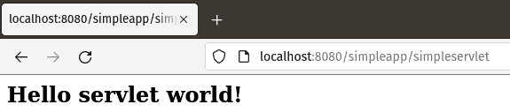
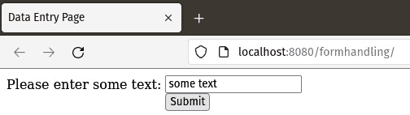
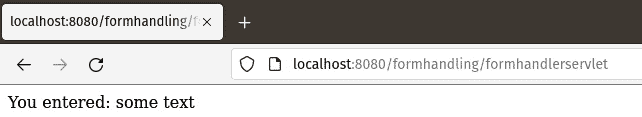
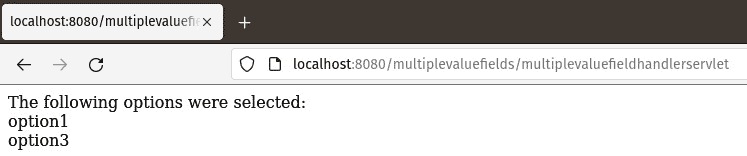
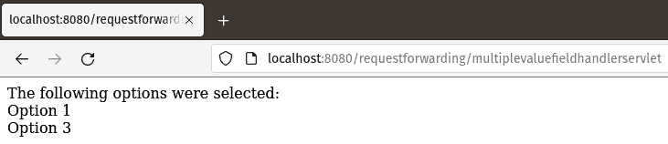
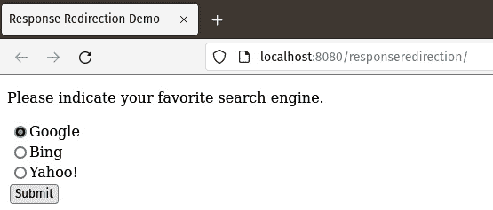
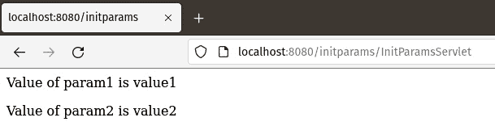

# 第十一章：Servlet 开发和部署

在本章中，我们将讨论如何开发和部署 Java EE Servlets。Servlets 允许我们作为应用开发者，在 Java Web 和企业应用中实现服务器端逻辑。

本章涵盖以下主题：

+   什么是 Servlet？

+   请求转发和响应重定向

+   在请求之间持久化应用数据

+   通过注解将初始化参数传递给 Servlet

+   Servlet 过滤器

+   Servlet 监听器

+   可插拔性

+   通过编程配置 Web 应用

+   异步处理

+   HTTP/2 服务器推送支持

注意

本章的示例源代码可以在 GitHub 上找到，链接为[`github.com/PacktPublishing/Jakarta-EE-Application-Development/tree/main/ch11_src`](https://github.com/PacktPublishing/Jakarta-EE-Application-Development/tree/main/ch11_src)

# 什么是 Servlet？

一个`jakarta.servlet.GenericServlet`。这个类定义了一个通用的、协议无关的 Servlet。

最常见的 Servlet 类型是 HTTP Servlet。这种类型的 Servlet 用于处理 HTTP 请求和生成 HTTP 响应。HTTP Servlet 是一个扩展了`jakarta.servlet.http.HttpServlet`类的类，而`jakarta.servlet.http.HttpServlet`是`jakarta.servlet.GenericServlet`的子类。

Servlet 必须实现一个或多个方法来响应特定的 HTTP 请求类型。这些方法是从父类`HttpServlet`中重写的。如*表 11.1*所示，这些方法的命名使得知道使用哪个方法是很直观的。

| **HTTP 请求** | **HttpServlet 方法** |
| --- | --- |
| GET | `doGet(HttpServletRequest request, HttpServletResponse response)` |
| POST | `doPost(HttpServletRequest request, HttpServletResponse response)` |
| PUT | `doPut(HttpServletRequest request, HttpServletResponse response)` |
| DELETE | `doDelete(HttpServletRequest request, HttpServletResponse response)` |

表 11.1 – 不同 HTTP 请求类型的 Servlet 方法

这些方法都接受相同的两个参数，即实现了`jakarta.servlet.http.HttpServletRequest`接口的类的实例和实现了`jakarta.servlet.http.HttpServletResponse`接口的类的实例。这些接口将在本章后面详细讨论。

注意

应用开发者永远不会直接调用上述方法。当应用服务器接收到相应的 HTTP 请求时，这些方法会自动被调用。

在上述四种方法中，`doGet()`和`doPost()`到目前为止是最常用的。

当用户在浏览器中输入 Servlet 的 URL、点击指向 Servlet URL 的链接或用户提交使用生成 HTTP GET 方法的 HTML 表单（表单的 action 指向 Servlet 的 URL）时，都会生成一个 HTTP GET 请求。在这些情况下，Servlet 的`doGet()`方法中的代码会被执行。

当用户提交一个生成 HTTP POST 方法和指向 servlet URL 的操作的 HTML 表单时，通常会生成一个 HTTP POST 请求。在这种情况下，`doPost()`方法内部的 servlet 代码将被执行。

现在我们已经解释了 servlet 是如何工作的，让我们看看如何开发 servlet。

## 编写我们的第一个 servlet

在本节中，我们将开发一个简单的 servlet 来展示如何使用 servlet API。我们 servlet 的代码如下：

```java
package com.ensode.jakartaeebook.simpleapp;
//imports omitted for brevity
@WebServlet(urlPatterns = {"/simpleservlet"})
public class SimpleServlet extends HttpServlet {
  @Override
  protected void doGet(HttpServletRequest req,
   HttpServletResponse res) {
    try {
      res.setContentType("text/html");
      PrintWriter printWriter = res.getWriter();
      printWriter.println("<h2>");
printWriter
        .println("Hello servlet world!");
      printWriter.println("</h2>");
    } catch (IOException ioException) {
      ioException.printStackTrace();
    }
  }
}
```

`@WebServlet`注解指定我们的类是一个 servlet。它的`urlPatterns`属性指定了我们的 servlet 的相对 URL。

注意

Servlet 也可以通过`web.xml`部署描述符进行配置。然而，自从 Java EE 6 以来，基于注解的配置更受欢迎。

由于这个 servlet 旨在用户在浏览器窗口中输入其 URL 时执行，我们需要重写父`HttpServlet`类中的`doGet()`方法。正如解释的那样，此方法接受两个参数，一个是实现`jakarta.servlet.http.HttpServletRequest`接口的类的实例，另一个是实现`jakarta.servlet.http.HttpServletResponse`接口的类的实例。

注意

尽管`HttpServletRequest`和`HttpServletResponse`是接口，但应用程序开发者通常不会编写实现它们的类。当控制从 HTTP 请求传递到 servlet 时，应用程序服务器提供实现这些接口的对象。

我们`doGet()`方法的第一件事是为`HttpServletResponse`对象设置内容类型为`"text/html"`。如果我们忘记这样做，将使用默认的内容类型`"text/plain"`，这意味着几行以下的 HTML 标签将在浏览器上显示，而不是被解释为 HTML 标签。

然后我们通过调用`HttpServletResponse.getWriter()`方法来获取`java.io.PrintWriter`的实例。然后我们可以通过调用`PrintWriter.print()`和`PrintWriter.println()`方法（前面的例子只使用`println()`）将文本输出到浏览器。由于我们将内容类型设置为`"text/html"`，任何 HTML 标签都将被浏览器正确解释。

## 测试 Web 应用程序

为了验证 servlet 是否已正确部署，我们需要将我们的浏览器指向我们的应用程序的 URL，例如，`http://localhost:8080/simpleapp/simpleservlet`。这样做之后，我们应该看到一个类似于*图 11**.1*所示的页面。



图 11.1 – 简单的 servlet 响应 HTTP GET 请求

在这个例子中，我们只是在浏览器中显示了一些静态文本。Servlet 通常用于处理用户在 HTML 表单中输入的数据，如下一节所示。

## 处理 HTML 表单

Servlets 很少通过在浏览器中直接键入它们的 URL 来访问。servlet 最常见的用途是处理用户在 HTML 表单中输入的数据。在本节中，我们将说明这个过程。

包含我们应用程序表单的 HTML 文件的相应标记如下所示：

```java
<form method="post" action="formhandlerservlet">
  <table cellpadding="0" cellspacing="0" border="0">
    <tr>
      <td>Please enter some text:</td>
      <td><input type="text" name="enteredValue" /></td>
    </tr>
    <tr>
      <td></td>
      <td><input type="submit" value="Submit"></td>
    </tr>
  </table>
</form>
```

表单的 `action` 属性的值必须与 servlet 的 `urlPatterns` 属性在其 `@WebServlet` 注解中的值匹配。由于表单的 `method` 属性的值是 `"post"`，因此当表单提交时，我们的 servlet 的 `doPost()` 方法将被执行。

现在让我们来看看我们的 servlet 代码：

```java
package com.ensode.jakartaeebook.formhandling;
//imports omitted for brevity
@WebServlet(urlPatterns = {"/formhandlerservlet"})
public class FormHandlerServlet extends HttpServlet {
  @Override
  protected void doPost(HttpServletRequest request,
    HttpServletResponse response) {
    String enteredValue;
    enteredValue = request.getParameter("enteredValue");
    response.setContentType("text/html");
    PrintWriter printWriter;
    try {
      printWriter = response.getWriter();
      printWriter.println("<p>");
      printWriter.print("You entered: ");
      printWriter.print(enteredValue);
      printWriter.print("</p>");
    } catch (IOException e) {
      e.printStackTrace();
    }
  }
}
```

如此例所示，我们通过调用 `request.getParameter()` 方法来获取用户输入的值的引用。此方法仅接受一个 `String` 对象作为其唯一参数。此字符串的值必须与 HTML 文件中输入字段的名称匹配。在这种情况下，HTML 文件有一个名为 `"enteredValue"` 的文本字段：

`<input type="text" name="enteredValue" />`

因此，servlet 有相应的这一行：

`enteredValue = request.getParameter("enteredValue");`

这是为了获取用户输入的文本并将其存储在名为 `enteredValue` 的 `String` 变量中（变量的名称不需要与输入字段名称匹配，但这样命名是一种良好的实践，以便于记住变量所持有的值）。

在将前三个文件打包成名为 `formhandling.war` 的 WAR 文件后，接着部署该 WAR 文件，我们可以在浏览器中输入以下类似的 URL 来查看渲染后的 HTML 文件（确切的 URL 将取决于所使用的 Jakarta EE 应用服务器）：`http://localhost:8080/formhandling`。

HTML 表单将渲染成如图 *图 11.2* 所示。



图 11.2 – HTML 表单

用户在文本字段中输入 `some text` 并提交表单（无论是按 *Enter* 键还是点击 **提交** 按钮）后，我们应该看到 servlet 的输出，如图 *图 11.3* 所示。



图 11.3 – Servlet 表单处理

可以使用 `HttpServletRequest.getParameter()` 方法来获取任何只能返回一个值的 HTML 输入字段的值（文本框、文本区域、单选、单选按钮、隐藏字段等）。获取这些字段值的过程是相同的。换句话说，servlet 不关心用户是在文本字段中键入值，还是从一组单选按钮中选择值，等等。只要输入字段的名称与传递给 `getParameter()` 方法的值匹配，前面的代码就会工作。

注意

当处理单选按钮时，所有相关的单选按钮必须具有相同的名称。通过调用 `HttpServletRequest.getParameter()` 方法并传递单选按钮的名称，将返回所选单选按钮的值。

一些 HTML 输入字段，如复选框和多个选择框，允许用户选择多个值。对于这些字段，而不是使用 `HttpServletRequest.getParameter()` 方法，使用 `HttpServletRequest.getParameterValues()` 方法。此方法也接受一个包含输入字段名称的 `String` 作为其唯一参数，并返回一个包含用户所选所有值的字符串数组。

以下示例说明了这种情况。我们新的 HTML 标记的相关部分如下所示：

```java
<form method="post" action="multiplevaluefieldhandlerservlet">
<p>Please enter one or more options.</p>
<table cellpadding="0" cellspacing="0" border="0">
  <tr>
    <td>
      <input name="options" type="checkbox" value="option1" />
      Option 1</td>
  </tr>
  <tr>
    <td><input name="options" type="checkbox" value="option2" />
    Option 2</td>
  </tr>
  <tr>
    <td><input name="options" type="checkbox" value="option3" />
    Option 3</td>
  </tr>
  <tr>
    <td><input type="submit" value="Submit" /></td>
  </tr>
</table>
</form>
```

新的 `HTML` 文件包含一个简单的表单，有三个复选框和一个提交按钮。注意每个复选框的 `name` 属性值都相同。正如我们之前提到的，用户点击的任何复选框都将发送到 servlet。

让我们现在看看将处理 HTML 表单的 servlet 的 `doPost()` 方法：

```java
@Override
protected void doPost(HttpServletRequest request,
  HttpServletResponse response) {
  String[] selectedOptions =
    request.getParameterValues("options");
  response.setContentType("text/html");
  try {
    PrintWriter printWriter = response.getWriter();
    printWriter.println("<p>");
    printWriter.print("The following options were selected:");
    printWriter.println("<br/>");
    if (selectedOptions != null) {
      for (String option : selectedOptions) {
        printWriter.print(option);
        printWriter.println("<br/>");
      }
    } else {
      printWriter.println("None");
}
    printWriter.println("</p>");
  } catch (IOException e) {
    e.printStackTrace();
   }
}
```

上述代码调用 `request.getParameterValues()` 方法，并将返回值赋给 `selectedOptions` 变量。在 `doPost()` 方法的更下方，代码遍历 `selectedOptions` 数组，并在浏览器中打印所选值。

如果没有复选框被点击，`request.getParameterValues()` 方法将返回 `null`，因此在尝试遍历此方法的返回值之前检查 `null` 是一个好主意。

在将我们的新 servlet 打包成 WAR 文件并部署后，我们可以在浏览器窗口中输入其 URL 来看到实际的变化。在大多数应用服务器中，URL 将是 `http://localhost:8080/multiplevaluefields/`。表单将如图 *图 11.4* 所示渲染。


图 11.4 – 具有多个值字段的 HTML 表单

提交表单后，控制权转到我们的 servlet，浏览器窗口应类似于 *图 11.5* 中所示：



图 11.5 – Servlet 处理具有多个值的字段

当然，浏览器窗口中实际看到的消息将取决于用户点击了哪些复选框。

现在我们已经看到了如何处理 HTML 表单数据，我们将关注通过 HTTP 请求转发和 HTTP 响应重定向自动导航到不同页面。

# 请求转发和响应重定向

在许多情况下，一个 servlet 处理表单数据，然后转移到另一个 servlet 或 JSP 进行更多处理或显示屏幕上的确认消息。有两种方法可以实现这一点：要么请求可以转发，要么响应可以重定向到另一个 servlet 或页面。

## 请求转发

注意，之前章节示例中显示的文本与之前页面中点击的复选框的值属性值相匹配，而不是之前页面显示的标签。这可能会让用户感到困惑。让我们修改 servlet，将这些值修改为与标签匹配，然后转发请求到另一个 servlet，该 servlet 将在浏览器中显示确认消息。

新版`MultipleValueFieldHandlerServlet`的`doPost()`方法如下所示：

```java
protected void doPost(HttpServletRequest request, HttpServletResponse response) {
  String[] selectedOptions =
    request.getParameterValues("options");
  ArrayList<String> selectedOptionLabels = null;
  if (selectedOptions != null) {
    selectedOptionLabels =
      new ArrayList<String>(selectedOptions.length);
    for (String selectedOption : selectedOptions) {
      if (selectedOption.equals("option1")) {
        selectedOptionLabels.add("Option 1");
      } else if (selectedOption.equals("option2")) {
        selectedOptionLabels.add("Option 2");
      } else if (selectedOption.equals("option3")) {
        selectedOptionLabels.add("Option 3");
      }
    }
  }
  request.setAttribute("checkedLabels", selectedOptionLabels);
  try {
    request.getRequestDispatcher("confirmationservlet").
      forward(request,response);
  } catch (ServletException | IOException e) {
    e.printStackTrace();
  }
}
```

这个版本的 servlet 会遍历选中的选项，并将相应的标签添加到一个字符串`ArrayList`中。然后通过调用`request.setAttribute()`方法将这个字符串附加到请求对象上。这个方法用于将任何对象附加到请求上，以便任何其他代码在转发请求后都可以访问它。

在将`ArrayList`附加到请求后，我们然后在以下代码行中转发请求到新的 servlet：

```java
request.getRequestDispatcher("confirmationservlet").forward(
    request, response);
```

这个方法的`String`参数必须与目标 servlet 的`@WebServlet`注解中的`urlPatterns`标签的值相匹配。

在这个阶段，控制权转交给了我们新的 servlet。由于我们正在转发一个 HTTP POST 请求，其`doPost()`方法会自动被调用。以下示例展示了这个新 servlet 的代码：

```java
package com.ensode.jakartaeebook.requestforward;
//imports omitted for brevity
@WebServlet(urlPatterns = {"/confirmationservlet"})
public class ConfirmationServlet extends HttpServlet {
  @Override
  protected void doPost(HttpServletRequest request,
    HttpServletResponse response) {
    try {
      PrintWriter printWriter;
      List<String> checkedLabels = (List<String>) request
        .getAttribute("checkedLabels");
      response.setContentType("text/html");
      printWriter = response.getWriter();
      printWriter.println("<p>");
      printWriter.print("The following options were selected:");
      printWriter.println("<br/>");
      if (checkedLabels != null) {
        for (String optionLabel : checkedLabels) {
          printWriter.print(optionLabel);
          printWriter.println("<br/>");
        }
      } else {
        printWriter.println("None");
      }
      printWriter.println("</p>");
    } catch (IOException ioException) {
      ioException.printStackTrace();
    }
  }
}
```

此代码通过调用`request.getAttribute()`方法获取之前 servlet 附加到请求上的`ArrayList`。这个方法的参数必须与用于将对象附加到请求的值相匹配。

一旦上述 servlet 获取到选项标签列表，它就会遍历这个列表并在浏览器中显示它们。



图 11.6 – 请求转发的实际操作

如前所述的请求转发仅适用于与执行转发的代码相同上下文中的其他资源（servlet 和 JSP 页面）。简单来说，我们想要转发的 servlet 或 JSP 必须打包在与调用`request.getRequestDispatcher().forward()`方法的代码相同的 WAR 文件中。如果我们需要将用户引导到另一个上下文中的页面（甚至另一个服务器），我们可以通过重定向响应对象来实现。

## 响应重定向

前一节中描述的请求转发的一个缺点是，请求只能转发到与执行转发的代码相同上下文中的其他 servlet 或 JSP。如果我们需要将用户引导到不同上下文中的页面（部署在同一服务器上的另一个 WAR 文件中或部署在不同的服务器上），我们需要使用`HttpServletResponse.sendRedirect()`方法。

为了说明响应重定向，让我们开发一个简单的 Web 应用程序，该程序要求用户选择他们最喜欢的搜索引擎，然后将用户引导到他们选择的搜索引擎。这个应用程序的 HTML 表单看起来如下所示：

```java
<form method="post" action="responseredirectionservlet">
  <p>Please indicate your favorite search engine.</p>
  <table>
    <tr>
      <td><input type="radio" name="searchEngine"
            value="http://www.google.com"/>Google</td>
    </tr>
    <tr>
      <td><input type="radio" name="searchEngine"
            value="http://www.bing.com"/>Bing</td>
    </tr>
    <tr>
      <td><input type="radio" name="searchEngine"
            value="http://www.yahoo.com"/>Yahoo!</td>
    </tr>
    <tr>
      <td><input type="submit" value="Submit" /></td>
    </tr>
  </table>
</form>
```

上面的标记代码中的 HTML 表单包含三个单选按钮。每个按钮的值是对应用户选择的搜索引擎的 URL。注意，每个单选按钮的 `name` 属性值相同，即 `"searchEngine"`。servlet 将通过调用 `request.getParameter()` 方法并传递 `"searchEngine"` 字符串作为参数来获取所选单选按钮的值，如以下代码所示：

```java
package com.ensode.jakartaeebook.responseredirection;
//imports omitted
@WebServlet(urlPatterns = {"/responseredirectionservlet"})
public class ResponseRedirectionServlet extends HttpServlet {
  @Override
  protected void doPost(HttpServletRequest request,
    HttpServletResponse response)
    throws IOException {
    String url = request.getParameter("searchEngine");
    if (url != null) {
      response.sendRedirect(url);
    } else {
      PrintWriter printWriter = response.getWriter();
      printWriter.println("No search engine was selected.");
    }
  }
}
```

通过调用 `request.getParameter("searchEngine")`，以下代码将所选搜索引擎的 URL 分配给 `url` 变量。然后（在检查 `null` 之后，以防用户点击了 `response.sendRedirect()` 并将 `url` 变量作为参数传递）。

在打包代码并部署后，我们可以在浏览器中通过输入类似以下 URL 的地址来查看其效果：`http://localhost:8080/responseredirection/`。



图 11.7 – 响应重定向示例

点击**提交**按钮后，用户将被引导到他们喜欢的搜索引擎。

应当注意，如图所示的重定向响应会创建一个新的 HTTP 请求到我们要重定向到的页面，因此任何请求参数和属性都会丢失。

# 在请求之间持久化应用程序数据

在上一节中，我们看到了如何通过调用 `HttpRequest.setAttribute()` 方法将对象存储在请求中，以及如何通过调用 `HttpRequest.getAttribute()` 方法稍后检索该对象。这种方法仅在请求被转发到调用 `getAttribute()` 方法的 servlet 时才有效。如果不是这种情况，`getAttribute()` 方法将返回 null。

有可能使对象在请求之间持久化。除了将对象附加到请求对象之外，对象还可以附加到会话对象或 servlet 上下文中。这两种方法之间的区别在于，附加到会话的对象对不同的用户不可见，而附加到 servlet 上下文的对象是可见的。

将对象附加到会话和 servlet 上下文与将对象附加到请求非常相似。要将对象附加到会话，必须调用 `HttpServletRequest.getSession()` 方法。此方法返回一个 `jakarta.servlet.http.HttpSession` 实例。然后我们调用 `HttpSession.setAttribute()` 方法将对象附加到会话。以下代码片段说明了这个过程：

```java
protected void doPost(HttpServletRequest request,
  HttpServletResponse response) {
  .
  .
  .
  Foo foo = new Foo(); //theoretical object
  HttpSession session = request.getSession();
  session.setAttribute("foo", foo);
  .
  .
  .
}
```

然后，我们可以通过调用 `HttpSession.getAttribute()` 方法从会话中检索对象：

```java
protected void doPost(HttpServletRequest request, HttpServletResponse response)
{
  HttpSession session = request.getSession();
  Foo foo = (Foo)session.getAttribute("foo");
}
```

注意，`session.getAttribute()` 的返回值需要转换为适当的数据类型。这是必要的，因为此方法的返回值是 `java.lang.Object`。

将对象附加到和从 servlet 上下文中检索对象的程序非常相似。servlet 需要调用`getServletContext()`方法（该方法定义在名为`GenericServlet`的类中，它是`HttpServlet`的父类，而`HttpServlet`又是我们 servlets 的父类）。此方法返回一个`jakarta.servlet.ServletContext`实例，它定义了`setAttribute()`和`getAttribute()`方法。这些方法的工作方式与它们的`HttpServletRequest`和`HttpSessionResponse`对应方法相同。

以下代码片段展示了将对象附加到 servlet 上下文的程序：

```java
protected void doPost(HttpServletRequest request,
  HttpServletResponse response) {
  //The getServletContext() method is defined higher in
  //the inheritance hierarchy.
  ServletContext servletContext = getServletContext();
  Foo foo = new Foo();
  servletContext.setAttribute("foo", foo);
  .
  .
  .
}
```

上述代码将`foo`对象附加到 servlet 上下文。此对象将可用于我们应用程序中的任何 servlet，并且将在会话之间保持相同。可以通过调用`ServletContext.getAttribute()`方法来检索它，如下所示：

```java
protected void doPost(HttpServletRequest request,
  HttpServletResponse response){
  ServletContext servletContext = getServletContext();
  Foo foo = (Foo)servletContext.getAttribute("foo");
  .
  .
  .
}
```

此代码从请求上下文中获取`foo`对象。同样，需要一个转换，因为`ServletContext.getAttribute()`方法，就像它的对应方法一样，返回一个`java.lang.Object`实例。

注意

附加到 servlet 上下文的对象被称为具有*应用程序*范围。同样，附加到会话的对象被称为具有*会话*范围，而附加到请求的对象被称为具有*请求*范围。

# 通过注解将初始化参数传递给 servlet

有时将一些初始化参数传递给 servlet 是有用的。这样，我们可以根据发送给它的参数使 servlet 表现不同。例如，我们可能希望配置 servlet 在开发和生产环境中表现不同。

在过去，servlet 初始化参数是通过`web.xml`中的`<init-param>`参数发送的。从 servlet 3.0 开始，初始化参数可以作为`@WebServlet`注解的`initParams`属性的值传递给 servlet。以下示例说明了如何这样做：

```java
package com.ensode.jakartaeebook.initparams;
//imports omitted for brevity
@WebServlet(name = "InitParamsServlet", urlPatterns = {
  "/InitParamsServlet"}, initParams = {
  @WebInitParam(name = "param1", value = "value1"),
  @WebInitParam(name = "param2", value = "value2")})
public class InitParamsServlet extends HttpServlet {
  @Override
  protected void doGet(HttpServletRequest request,
          HttpServletResponse response)
          throws ServletException, IOException {
    ServletConfig servletConfig = getServletConfig();
    String param1Val = servletConfig.getInitParameter("param1");
    String param2Val = servletConfig.getInitParameter("param2");
    response.setContentType("text/html");
    PrintWriter printWriter = response.getWriter();
    printWriter.println("<p>");
    printWriter.println("Value of param1 is " + param1Val);
    printWriter.println("</p>");
    printWriter.println("<p>");
    printWriter.println("Value of param2 is " + param2Val);
    printWriter.println("</p>");
  }
}
```

正如我们所看到的，`@WebServlet`注解的`initParams`属性的值是一个`@WebInitParam`注解的数组。每个`@WebInitParam`注解有两个属性：`name`，对应于参数名称，和`value`，对应于参数值。

我们可以通过在`jakarta.servlet.ServletConfig`类上调用`getInitParameter()`方法来获取我们参数的值。此方法接受一个`String`类型的单个参数作为参数，对应于参数名称，并返回与参数值对应的`String`。

每个 servlet 都有一个对应的`ServletConfig`实例分配给它。正如我们在这个示例中所看到的，我们可以通过调用`getServletConfig()`方法来获取这个实例，这是一个从`jakarta.servlet.GenericServlet`继承而来的方法，`jakarta.servlet.GenericServlet`是`HttpServlet`的父类，我们 servlets 扩展了这个类。

在打包和部署我们的 servlet 之后，然后指向 servlet 的 URL，我们将在浏览器中看到以下页面渲染，如图*图 11.8*所示。8*。



图 11.8 – Servlet 初始化参数

如我们所见，渲染的值对应于我们在每个`@WebInitParam`注解中设置的值。

现在我们已经看到了如何初始化一个 servlet，我们将把注意力转向通过 servlet 过滤器拦截 HTTP 请求。

# Servlet 过滤器

`doGet()`或`doPost()`方法完成，但在输出发送到浏览器之前。

在早期的 servlet 规范中配置过滤器的方法是使用`web.xml`中的`<filter-mapping>`标签。`@WebFilter`注解。

以下示例说明了如何进行此操作：

```java
package com.ensode.jakartaeebook.servletfilter;
//imports omitted
@WebFilter(initParams = {
@WebInitParam(name = "filterparam1", value = "filtervalue1")},
        urlPatterns = {"/InitParamsServlet"})
public class SimpleFilter implements Filter {
  private static final Logger LOG
    = Logger.getLogger(SimpleFilter.class.getName());
  private FilterConfig filterConfig;
  @Override
  public void init(FilterConfig filterConfig) throws
    ServletException {
    this.filterConfig = filterConfig;
  }
  @Override
  public void doFilter(ServletRequest servletRequest,
    ServletResponse servletResponse, FilterChain filterChain)
    throws IOException, ServletException {
    LOG.log(Level.INFO, "Entering doFilter()");
    LOG.log(Level.INFO, "initialization parameters: ");
    Enumeration<String> initParameterNames = filterConfig.
      getInitParameterNames();
    String parameterName;
    String parameterValue;
    while (initParameterNames.hasMoreElements()) {
      parameterName = initParameterNames.nextElement();
      parameterValue =
        filterConfig.getInitParameter(parameterName);
      LOG.log(Level.INFO, "{0} = {1}",
        new Object[]{parameterName,
        parameterValue});
    }
    LOG.log(Level.INFO, "Invoking servlet...");
    filterChain.doFilter(servletRequest, servletResponse);
    LOG.log(Level.INFO, "Back from servlet invocation");
  }
  @Override
  public void destroy() {
    filterConfig = null;
  }
}
```

如我们在示例中看到的，`@WebFilter`注解有几个我们可以用来配置过滤器的属性。其中特别重要的是`urlPatterns`属性。此属性接受一个`String`对象数组作为其值。数组中的每个元素对应于我们的过滤器将拦截的 URL。在我们的示例中，我们正在拦截一个单个 URL 模式，它对应于我们在上一节中编写的 servlet。

`@WebFilter`注解中的其他属性包括可选的`filterName`属性，我们可以使用它来给我们的过滤器命名。如果我们没有为我们的过滤器指定名称，那么过滤器名称将默认为过滤器的类名。

如我们在示例 servlet 过滤器中看到的，我们可以向过滤器发送初始化参数。这就像我们向 servlet 发送初始化参数一样进行。`@WebFilter`注解有一个`initParams`属性，它接受一个`@WebInitParam`注解数组作为其值。我们可以通过在`jakarta.servlet.FilterConfig`上调用`getInitParameter()`方法来获取这些参数的值，如示例所示。

我们的过滤器相当简单；它只是在 servlet 被调用之前和之后向服务器日志发送一些输出。部署我们的应用程序后检查服务器日志并将浏览器指向 servlet 的 URL 应该会揭示我们的过滤器输出：

```java
  Loading application [servletfilter] at [/servletfilter]|#]
  servletfilter was successfully deployed in 69 milliseconds.|#]
  Entering doFilter()|#]
  initialization parameters: |#]
  filterparam1 = filtervalue1|#]
  Invoking servlet…|#]
  Back from servlet invocation|#]
```

常见的 servlet 过滤器用途包括分析 Web 应用、应用安全性和压缩数据等。

# Servlet 监听器

在典型 Web 应用的整个生命周期中，会发生许多事件，例如 HTTP 请求的创建或销毁，请求或会话属性的增加、删除或修改，等等。

servlet API 提供了一些我们可以实现以响应这些事件的监听器接口。所有这些接口都在`jakarta.servlet`包中。以下表格总结了它们。

| **监听器接口** | **描述** |
| --- | --- |
| `ServletContextListener` | 包含处理上下文初始化和销毁事件的方法。 |
| `ServletContextAttributeListener` | 包含用于响应在 servlet 上下文（应用范围）中添加、删除或替换的任何属性的的方法。 |
| `ServletRequestListener` | 包含用于处理请求初始化和销毁事件的方法。 |
| `ServletRequestAttributeListener` | 包含用于响应在请求中添加、删除或替换的任何属性的方法。 |
| `HttpSessionListener` | 包含用于处理 HTTP 会话初始化和销毁事件的方法。 |
| `HttpSessionAttributeListener` | 包含用于响应在 HTTP 会话中添加、删除或替换的任何属性的方法。 |

表 11.2 – Servlet 监听器接口

要处理前面表中描述的接口所处理的所有事件，我们只需实现其中一个接口，并使用`@WebListener`接口对其进行注解，或者通过`web.xml`部署描述符中的`<listener>`标签声明它。

所有前面接口的 API 相当直观和直观。我们将为其中一个接口提供一个示例。其他接口将非常相似。

注意

所有前面接口的 JavaDoc 可以在[`jakarta.ee/specifications/platform/10/apidocs/jakarta/servlet/package-summary`](https://jakarta.ee/specifications/platform/10/apidocs/jakarta/servlet/package-summary)找到。

以下示例说明了如何实现`ServletRequestListener`接口，该接口可以在创建或销毁 HTTP 请求时执行某些操作：

```java
package com.ensode.jakartaeebook.listener;
//imports omitted
@WebListener
public class HttpRequestListener implements ServletRequestListener {
  @Override
  public void requestInitialized(
   ServletRequestEvent servletRequestEvent) {
    ServletContext servletContext = servletRequestEvent.
    getServletContext();
    servletContext.log("New request initialized");
  }
  @Override
  public void requestDestroyed(
   ServletRequestEvent servletRequestEvent) {
    ServletContext servletContext = servletRequestEvent.
    getServletContext();
    servletContext.log("Request destroyed");
  }
}
```

如我们所见，要激活我们的监听器类，我们只需使用`@WebListener`注解对其进行注解。我们的监听器还必须实现我们列出的监听器接口之一。在我们的示例中，我们选择实现`jakarta.servlet.ServletRequestListener`。该接口包含在初始化或销毁 HTTP 请求时自动调用的方法。

`ServletRequestListener`接口有两个方法，`requestInitialized()`和`requestDestroyed()`。在前面的简单实现中，我们只是向日志发送了一些输出，但当然，我们可以在我们的实现中做任何我们需要做的事情。

使用我们的监听器监听本章前面开发的简单 servlet 处理请求，将在 Jakarta EE 运行时日志中产生以下输出：

```java
Loading application [servletlistener] at [/servletlistener]|#]
  servletlistener was successfully deployed in 142 milliseconds.|#]
  New request initialized|#]
  Request destroyed|#]
```

实现其他监听器接口同样简单直接。

# 可插拔性

当原始 servlet API 在 20 世纪 90 年代末发布时，编写 servlet 是 Java 编写服务器端 Web 应用的唯一方式。从那时起，在 Servlet API 之上构建了几个 Jakarta EE 和第三方框架。这些框架的例子包括 JSP 和 JSF、Apache Struts、Apache Wicket、Spring Web MVC 以及几个其他框架。

现在，极少数（如果有的话）Java Web 应用是直接使用 Servlet API 构建的。相反，绝大多数项目都使用可用的 Java Web 应用框架之一。所有这些框架都在“幕后”使用 servlet API，因此设置一个应用以使用这些框架之一始终涉及到在应用的`web.xml`部署描述符中进行一些配置。在某些情况下，一些应用使用多个框架。这往往使得`web.xml`部署描述符相当大且难以维护。

Servlet 3.0 引入了可插拔性的概念。Web 应用框架的开发者现在有两个选择，而不是一个，以避免应用开发者必须修改`web.xml`部署描述符才能使用他们的框架。框架开发者可以选择使用注解而不是`web.xml`来配置他们的 servlet。完成此操作后，要使用框架，只需将框架开发者提供的`library jar`文件包含在应用的 WAR 文件中即可。或者，框架开发者可以选择将`web-fragment.xml`包含在 JAR 文件中，作为使用他们框架的 Web 应用的组成部分。

`web-fragment.xml`几乎与`web.xml`相同。主要区别在于`web-fragment.xml`的根元素是`<web-fragment>`，而不是`<web-app>`。以下是一个示例`web-fragment.xml`：

```java
<?xml version="1.0" encoding="UTF-8"?>
<web-fragment 

  xsi:schemaLocation="https://jakarta.ee/xml/ns/jakartaee
  https://jakarta.ee/xml/ns/jakartaee/web-fragment_5_0.xsd"
  version="5.0" metadata-complete="true">
  <servlet>
    <servlet-name>WebFragment</servlet-name>
    <servlet-class>
      com.ensode.jakartaeebook.webfragment.WebFragmentServlet
    </servlet-class>
  </servlet>
  <servlet-mapping>
    <servlet-name>WebFragment</servlet-name>
    <url-pattern>/WebFragment</url-pattern>
  </servlet-mapping>
</web-fragment>
```

如我们所见，`web-fragment.xml`几乎与典型的`web.xml`相同。在这个简单的示例中，我们只使用了`<servlet>`和`<servlet-mapping>`元素，但所有其他通常的`web.xml`元素，如`<filter>`、`<filter-mapping>`和`<listener>`也是可用的。

如`web-fragment.xml`中指定，我们的 servlet 可以通过其 URL 模式`/WebFragment`被调用，因此一旦作为 Web 应用的一部分部署，执行我们的 servlet 的 URL 将是`http://localhost:8080/webfragmentapp/WebFragment`。当然，主机名、端口号和上下文根必须根据实际情况进行调整。

对于任何符合 Jakarta EE 规范的应用服务器，要获取`web-fragment.xml`中的设置，我们只需将文件放置在我们打包 servlet、过滤器以及/或监听器的库的`META-INF`文件夹中，然后将我们的库的`jar`文件放置在包含我们的应用的 WAR 文件的`lib`目录中。

# 以编程方式配置 Web 应用

除了可以通过注解和`web-fragment.xml`配置 Web 应用之外，Servlet 3.0 还允许我们在运行时以编程方式配置我们的 Web 应用。

`ServletContext`类有新的方法来以编程方式配置 servlet、过滤器（filter）和监听器（listener）。以下示例说明了如何在运行时以编程方式配置 servlet，而不需要使用`@WebServlet`注解或 XML：

```java
package com.ensode.jakartaeebook.servlet;
//imports omitted
@WebListener()
public class ServletContextListenerImpl implements
  ServletContextListener {
  @Override
  public void contextInitialized(
    ServletContextEvent servletContextEvent) {
    ServletContext servletContext = servletContextEvent.
      getServletContext();
    try {
      ProgrammaticallyConfiguredServlet servlet = servletContext.
        createServlet(
          ProgrammaticallyConfiguredServlet.class);
      servletContext.addServlet(
        "ProgrammaticallyConfiguredServlet", servlet);
      ServletRegistration servletRegistration = servletContext.
        getServletRegistration(
          "ProgrammaticallyConfiguredServlet");
servletRegistration.addMapping(
        "/ProgrammaticallyConfiguredServlet");
    } catch (ServletException servletException) {
      servletContext.log(servletException.getMessage());
    }
  }
  //additional methods omitted for brevity
}
```

在这个例子中，我们调用`ServletContext`的`createServlet()`方法来创建我们即将配置的 servlet。此方法接受一个与我们的 servlet 类对应的`java.lang.Class`实例。此方法返回一个实现`jakarta.servlet.Servlet`或其任何子接口的类。

一旦我们创建了我们的 servlet，我们需要在我们的`ServletContext`实例上调用`addServlet()`来将我们的 servlet 注册到 servlet 容器中。此方法接受两个参数，第一个是与 servlet 名称对应的`String`，第二个是由`createServlet()`调用返回的 servlet 实例。

一旦我们注册了我们的 servlet，我们需要向其添加 URL 映射。为了做到这一点，我们需要在我们的`ServletContext`实例上调用`getServletRegistration()`方法，并将 servlet 名称作为参数传递。此方法返回 servlet 容器对`jakarta.servlet.ServletRegistration`的实现。从这个对象中，我们需要调用它的`addMapping()`方法，传递我们希望我们的 servlet 处理的 URL 映射。

我们的示例 servlet 非常简单。它只是简单地显示一个文本消息在浏览器中。它的`doGet()`方法如下所示：

```java
@Override
protected void doGet(HttpServletRequest request,
  HttpServletResponse response)
  throws ServletException, IOException {
  ServletOutputStream outputStream = response.getOutputStream();
  outputStream.println(
    "This message was generated from a servlet that was "
    + "configured programmatically.");
  }
```

在将我们的代码打包到 WAR 文件并部署到 Jakarta EE 运行时之后，然后指向适当的 URL（即`http://localhost:8080/programmaticservletwebapp/ProgrammaticallyConfiguredServlet`），我们应该在浏览器中看到以下消息：

**此消息是由配置程序的 servlet 生成的**。

`ServletContext`接口有创建和添加 servlet 过滤器监听器的方法。它们的工作方式与`addServlet()`和`createServlet()`方法非常相似，因此我们不会详细讨论它们。有关详细信息，请参阅[`jakarta.ee/specifications/platform/10/apidocs/`](https://jakarta.ee/specifications/platform/10/apidocs/)的 Jakarta EE API 文档。

# 异步处理

传统上，servlet 在 Java Web 应用程序中为每个请求创建一个线程。请求处理完毕后，线程被提供给其他请求使用。这种模型对于传统 Web 应用程序来说效果相当好，因为 HTTP 请求相对较少且间隔较远。然而，大多数现代 Web 应用程序都利用了**Ajax**（异步 JavaScript 和 XML 的缩写），这是一种使 Web 应用程序比传统 Web 应用程序更具有响应性的技术。

Ajax 的一个副作用是生成比传统 Web 应用程序更多的 HTTP 请求。如果其中一些线程长时间阻塞等待资源就绪或进行任何需要很长时间处理的事情，那么我们的应用程序可能会遭受线程饥饿。

为了缓解前一段描述的情况，Servlet 3.0 规范引入了异步处理。使用这项新功能，我们不再受限于每个请求一个线程的限制。现在我们可以创建一个单独的线程，并将原始线程返回到线程池，以便其他客户端重用。

以下示例说明了如何利用 Servlet 3.0 中引入的新功能实现异步处理：

```java
package com.ensode.jakartaeebook.asynchronousservlet;
//imports omitted for brevity
@WebServlet(name = "AsynchronousServlet", urlPatterns = {
  "/AsynchronousServlet"}, asyncSupported = true)
public class AsynchronousServlet extends HttpServlet {
  @Override
  protected void doGet(HttpServletRequest request,
    HttpServletResponse response) throws Exception {
    final AsyncContext ac = request.startAsync();
    ac.start(new Runnable() {
      @Override
      public void run() {
        try {
          Thread.sleep(10000);
          ac.getResponse().getWriter().
            println("You should see this after a brief wait");
          ac.complete();
        } catch (Exception ex) {
          //handle the exception
        }
      }
    });
  }
}
```

为了确保我们的异步处理代码按预期工作，我们首先需要将 `@WebServlet` 注解的 `asyncSupported` 属性设置为 `true`。

要实际启动一个异步进程，我们需要在 servlet 的 `doGet()` 或 `doPost()` 方法中作为参数接收到的 `HttpServletRequest` 实例上调用 `startAsync()` 方法。此方法返回一个 `jakarta.servlet.AsyncContext` 实例。这个类有一个 `start()` 方法，它接受一个实现 `java.lang.Runnable` 接口的类的实例作为唯一参数。在我们的示例中，我们使用匿名内部类在行内实现了 `Runnable`。当然，也可以使用实现 `Runnable` 的标准 Java 类，或者使用 lambda 表达式。

当我们调用 `AsyncContext` 的 `start()` 方法时，会创建一个新的线程，并执行 `Runnable` 实例的 `run()` 方法。这个线程在后台运行，`doGet()` 方法立即返回，请求线程立即可用于服务其他客户端。重要的是要注意，尽管 `doGet()` 方法立即返回，但响应直到创建线程的线程完成处理后才会提交。它可以通过在 `AsyncContext` 上调用 `complete()` 方法来表示处理完成。

在我们的示例中，消息 **您将在短暂等待后看到此信息** 在 10 秒后显示在浏览器中，这是我们创建的线程完成所需的时间。

现在我们已经了解了如何在 servlet 中执行异步处理，我们将关注如何实现 HTTP/2 服务器推送支持。

# HTTP/2 服务器推送支持

**HTTP/2** 是 HTTP 协议的最新版本。它相较于 HTTP 1.1 提供了多项优势。例如，在 HTTP/2 中，浏览器和服务器之间只有一个连接，并且这个连接在用户导航到另一个页面之前保持开启状态。HTTP/2 还提供了多路复用功能，这意味着允许浏览器向服务器发送多个并发请求。此外，HTTP/2 还具有服务器推送功能，这意味着服务器可以在浏览器没有特别请求的情况下向浏览器发送资源。

HTTP/2 服务器推送支持在 Servlet 规范的第 4.0 版本中添加，该版本作为 Java EE 8 的一部分发布。在本节中，我们将看到如何编写代码以利用 HTTP/2 的服务器推送功能。以下示例说明了如何实现这一点：

```java
package com.ensode.jakartaeebook.servlet;
//imports omitted
@WebServlet(name = "ServletPushDemoServlet", urlPatterns = {"/ServletPushDemoServlet"})
public class ServletPushDemoServlet extends HttpServlet {
  @Override
  protected void doPost(HttpServletRequest request,
      HttpServletResponse response) throws Exception {
    PushBuilder pushBuilder = request.newPushBuilder();
    if (pushBuilder != null) {
      pushBuilder.path("images/david_heffelfinger.png").
        addHeader("content-type", "image/png").push();
      response.sendRedirect("response.html");
    } else {
      //handle the case when the browser does not support HTTP/2.
    }
  }
}
```

我们可以通过在 servlet 规范的第 4 版中引入的`PushBuilder`接口将资源推送到浏览器。我们可以通过在`doPost()`方法中作为参数获得的`HttpServletRequest`实例上调用新的`PushBuilder()`方法来获取实现`PushBuilder`的类的实例。

如其名所示，`PushBuilder`接口实现了 Builder 模式，这意味着其大多数方法都返回一个新的`PushBuilder`实例，我们可以使用它，允许我们方便地将方法调用链式连接起来。

我们通过调用`PushBuilder`的相应命名的`path()`方法来指示我们希望推送到浏览器的资源的路径。此方法接受一个表示要推送的资源路径的单个`String`参数。以正斜杠`("/")`开头的路径表示绝对路径；所有其他路径表示相对于我们应用程序上下文根的路径。

一旦我们指定了资源的路径，我们可以选择性地设置一些 HTTP 头。在我们的例子中，我们正在推送一个 PNG 格式的图像，因此我们设置了适当的内容类型。

最后，我们在我们的`PushBuilder`实例上调用`push()`方法，实际上将我们的资源推送到浏览器。

在我们的示例中，我们完成了在浏览器提交对该资源的请求之前将其推送到浏览器的工作。在 HTTP/2 协议发布之前，这项任务是不可能的。

# 摘要

本章介绍了如何开发、配置、打包和部署 servlets。本章涵盖了以下主题：

+   如何通过访问 HTTP 请求对象来处理 HTML 表单信息

+   将 HTTP 请求从一个 servlet 转发到另一个 servlet，以及将 HTTP 响应重定向到不同的服务器

+   通过将对象附加到 servlet 上下文和 HTTP 会话来在请求之间持久化对象

+   通过注解配置 Web 应用程序

+   通过`web-fragment.xml`实现可插拔性

+   编程式 servlet 配置

+   异步处理

+   HTTP/2 服务器推送

带着本章的知识，我们现在可以使用 Jakarta servlets 实现服务器端 Web 应用程序逻辑。
