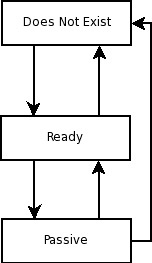

# 12

# Jakarta 企业 Bean

**Jakarta 企业 Bean**是封装应用业务逻辑的服务端组件。企业 Bean 通过自动处理事务管理和安全性来简化应用开发。有两种类型的企业 Bean：**会话 Bean**，执行业务逻辑，和**消息驱动 Bean**，作为消息监听器。

本章将涵盖以下主题：

+   会话 Bean

+   消息驱动 Bean

+   企业 Bean 中的事务

+   企业 Bean 生命周期

+   企业 Bean 定时器服务

+   企业 Bean 安全性

注意

本章的示例源代码可以在 GitHub 上找到：[`github.com/PacktPublishing/Jakarta-EE-Application-Development/tree/main/ch12_src`](https://github.com/PacktPublishing/Jakarta-EE-Application-Development/tree/main/ch12_src)。

# 会话 Bean

如我们之前提到的，会话 Bean 通常封装业务逻辑。为了创建一个会话 Bean，需要创建一个或两个工件，包括 Bean 本身和一个可选的业务接口。这些工件需要适当地注解，以便让 Jakarta EE 运行时知道它们是会话 Bean。

## 一个简单的会话 Bean

以下示例说明了一个非常简单的会话 Bean：

```java
package com.ensode.jakartaeebook;
import jakarta.ejb.Stateless;
@Stateless
public class SimpleSessionBean implements SimpleSession{
  private final String message =
    "If you don't see this, it didn't work!";
  @Override
  public String getMessage() {
    return message;
  }
}
```

`@Stateless`注解让 Jakarta EE 运行时知道这个类是一个**无状态会话 Bean**。有三种类型的会话 Bean：无状态、有状态和单例。在我们解释这些类型会话 Bean 之间的区别之前，我们需要明确一个企业 Bean 的实例是如何提供给客户端应用的。

当无状态或有状态会话 Bean 部署时，Jakarta EE 容器为每个会话 Bean 创建一系列实例。这通常被称为**企业 Bean 池**。当客户端应用获取一个企业 Bean 的实例时，池中的一个实例会被提供给这个客户端应用。

有状态会话 Bean 和无状态会话 Bean 之间的区别在于，有状态会话 Bean 与客户端保持**对话状态**，而无状态会话 Bean 则不保持。简单来说，这意味着当客户端应用获取一个有状态会话 Bean 的实例时，我们可以保证 Bean 中任何实例变量的值在方法调用之间是一致的。因此，在修改有状态会话 Bean 上的任何实例变量时是安全的，因为它们将在下一次方法调用中保留其值。Jakarta EE 运行时通过钝化有状态会话 Bean 来保存对话状态，并在 Bean 激活时检索该状态。对话状态是有状态会话 Bean 生命周期比无状态会话 Bean 或消息驱动 Bean 生命周期更复杂的原因（企业 Bean 的生命周期将在本章后面讨论）。

当客户端应用程序请求一个无状态会话 Bean 的实例时，Jakarta EE 运行时可能会在池中提供任何企业 Bean 的实例。由于我们无法保证每次方法调用都使用相同的实例，因此在无状态会话 Bean 中设置的任何实例变量可能会“丢失”（它们实际上并没有丢失；修改是在池中企业 Bean 的另一个实例中）。

除了用`@Stateless`注解装饰外，我们的示例类没有特别之处。请注意，它实现了一个名为`SimpleSession`的接口。这个接口是 Bean 的企业接口。`SimpleSession`接口如下所示：

```java
package com.ensode.jakartaeebook;
import jakarta.ejb.Remote;
@Remote
public interface SimpleSession {
  public String getMessage();
}
```

这个接口唯一特别的地方是它被`@Remote`注解装饰。这个注解表示这是一个**远程业务接口**。这意味着接口可能位于调用它的客户端应用程序不同的 JVM 中。远程业务接口甚至可以在网络上被调用。

企业接口也可以用`@Local`接口装饰。这个注解表示业务接口是一个**本地业务接口**。本地业务接口的实现必须在与调用其方法的客户端应用程序相同的 JVM 中。

一旦我们编译了会话 Bean 及其对应的企业接口，我们需要将它们放入一个 JAR 文件中并部署它们。如何部署企业 Bean JAR 文件取决于我们使用的是哪种应用服务器。大多数现代应用服务器都有一个`autodeploy`目录。在大多数情况下，我们可以简单地复制我们的 JAR 文件到这个目录。请查阅您的应用服务器文档以找到其`autodeploy`目录的确切位置。

现在我们已经看到了会话 Bean 及其对应的企业接口，让我们看看一个客户端示例应用程序：

```java
package com.ensode.jakartaeebook;
import jakarta.ejb.EJB;
import javax.naming.NamingException;
public class SessionBeanClient {
  @EJB
  private static SimpleSession simpleSession;
  private void invokeSessionBeanMethods() throws
    NamingException {
    System.out.println(simpleSession.getMessage());
    System.out.println("\nSimpleSession is of type: "
        + simpleSession.getClass().getName());
  }
  public static void main(String[] args)
    throws NamingException {
    new SessionBeanClient().invokeSessionBeanMethods();
  }
}
```

上述代码简单地声明了一个`com.ensode.jakartaeebook.SimpleSession`类型的实例变量，这是我们的会话 Bean 的企业接口。这个实例变量被注解为`@EJB`。这个注解让 Jakarta EE 运行时知道这个变量是一个会话 Bean 的企业接口。然后 Jakarta EE 运行时注入一个业务接口的实现，以便客户端代码可以使用。

由于我们的客户端是一个独立的应用程序（而不是 Jakarta EE 工件，如 WAR 文件或可部署的 JAR 文件），我们不需要部署到 Jakarta EE 运行时。为了让它能够访问服务器上部署的代码，它必须能够访问应用服务器的客户端库。如何实现这一点的步骤因应用服务器而异。当使用 GlassFish 时，我们的客户端代码必须放置在一个`JAR`文件中，并通过`[glassfish 安装目录]/glassfish/bin/`执行。假设这个目录在`PATH`环境变量中，并且假设我们将我们的客户端代码放置在一个名为`simplesessionbeanclient.jar`的 JAR 文件中，我们将在命令行中键入以下命令来执行前面的客户端代码：

```java
appclient -client simplesessionbeanclient.jar 
```

执行此命令会产生以下控制台输出：

```java
If you don't see this, it didn't work!
SimpleSession is of type: com.ensode.jakartaeebook._SimpleSession_Wrapper
```

这是执行`SessionBeanClient`类后的预期输出。

注意

我们正在使用 Maven 来构建我们的代码。在这个例子中，我们使用了 Maven Assembly Plugin ([`maven.apache.org/plugins/maven-assembly-plugin/`](http://maven.apache.org/plugins/maven-assembly-plugin/)) 来构建一个包含所有依赖项的客户端 JAR 文件。这使我们免去了在`appclient`的`-classpath`命令行选项中指定所有依赖 JAR 文件的需要。要构建这个 JAR 文件，只需在命令行中执行`mvn assembly:assembly`。

输出的第一行仅仅是我们在会话 Bean 中实现的`getMessage()`方法的返回值。第二行输出显示实现业务接口的类的完全限定名称。请注意，类名不是我们编写的会话 Bean 的完全限定名称；实际上，提供的是 Jakarta EE 运行时在幕后创建的业务接口的实现。

## 一个更现实的例子

在上一节中，我们看到了一个非常简单的“Hello World”类型的例子。在本节中，我们将展示一个更现实的例子。会话 Bean 通常用作**数据访问对象**（**DAO**）。有时它们用作 JDBC 调用的包装器；有时它们用于包装获取或修改 Jakarta Persistence 实体的调用。在本节中，我们将采用后一种方法。

以下示例说明了如何在会话 Bean 中实现 DAO 设计模式。

现在我们来看看实现我们示例业务接口的会话 Bean。正如我们即将看到的，在会话 Bean 中实现 Jakarta Persistence 代码的方式与在普通的 Java 对象中实现的方式有一些不同：

```java
package com.ensode.jakartaeebook;
//imports omitted for brevity
@Stateful
public class CustomerDaoBean implements CustomerDao {
  @PersistenceContext
  private EntityManager entityManager;
  @Override
  public void saveCustomer(Customer customer) {
    if (customer.getCustomerId() == null) {
      entityManager.persist(customer);
    } else {
      entityManager.merge(customer);
    }
  }
  @Override
  public Customer getCustomer(Long customerId) {
    Customer customer;
    customer = entityManager.find(Customer.class,
      customerId);
    return customer;
  }
  @Override
  public void deleteCustomer(Customer customer) {
    entityManager.remove(customer);
  }
}
```

值得指出的是，由于我们并不打算让我们的会话 Bean 远程调用，因此在这种情况下不需要远程业务接口。我们的客户端应用程序可以通过`@EJB`注解简单地注入会话 Bean 的一个实例。

如我们所见，我们的会话 Bean 实现了三个方法。`saveCustomer()`方法将客户数据保存到数据库，`getCustomer()`方法从数据库获取客户的资料，`deleteCustomer()`方法从数据库删除客户数据。所有这些方法都接受一个 Jakarta Persistence 实体 Bean 的实例或类型`Customer`。

通常，当我们进行 Jakarta Persistence 调用时，我们需要通过`UserTransaction.begin()`和`UserTransaction.commit()`启动和提交事务。我们需要这样做的原因是 Jakarta Persistence 调用需要被事务包装。如果没有在事务中，大多数 Jakarta Persistence 调用将抛出`TransactionRequiredException`。会话 Bean 方法隐式地是事务性的。我们不需要做任何事情来使它们成为那样。因此，当我们从会话 Bean 中调用 Jakarta Persistence 调用时，我们不需要手动启动和提交事务。这种默认行为被称为**容器管理事务**。容器管理事务将在本章后面详细讨论。

## 从 Web 应用程序调用会话 Bean

通常，Jakarta EE 应用程序由充当企业 Bean 客户端的 Web 应用程序组成。在本节中，我们将开发一个 Jakarta Faces Web 应用程序，其中有一个 CDI 命名 Bean 作为我们在上一节中讨论的 DAO 会话 Bean 的客户端。

为了使此应用程序充当企业 Bean 客户端，我们将开发一个名为`CustomerController`的 Bean，以便将保存新客户到数据库的逻辑委托给我们在上一节中开发的单例会话 Bean `CustomerDaoBean`，如下例所示：

```java
package com.ensode.jakartaeebook.facesjpa;
//imports omitted for brevity
@Named
@RequestScoped
public class CustomerController implements Serializable {
  @EJB
  private CustomerDaoBean customerDaoBean;
 //variable declarations omitted for brevity
  public CustomerController() {
    customer = new Customer();
  }
  public String saveCustomer() {
    String returnValue = "customer_saved";
    try {
      populateCustomer();
      customerDaoBean.saveCustomer(customer);
    } catch (Exception e) {
      e.printStackTrace();
      returnValue = "error_saving_customer";
    }
    return returnValue;
  }
  private void populateCustomer() {
     //method implementation omitted for brevity
  }
  //getters and setters omitted for brevity
}
```

如我们所见，我们只需获取`CustomerDaoBean`会话 Bean 的一个实例，并用`@EJB`注解标注它，然后调用 Bean 的`saveCustomer()`方法。

注意，我们直接将单例 Bean 的实例注入到我们的客户端代码中。由于客户端代码与企业 Bean 运行在同一个 JVM 上，因此不需要远程接口。

现在我们已经为我们的会话 Bean 开发出了我们的 Web 应用程序客户端，我们需要将其打包成 WAR（Web 存档）文件并部署，以便使用它。

## 单例会话 Bean

另一种类型的会话 Bean 是**单例会话 Bean**。在 Jakarta EE 运行时中，每个单例会话 Bean 只有一个实例存在。

单例会话 Bean 对于缓存数据库数据很有用。在单例会话 Bean 中缓存常用数据可以提高性能，因为它大大减少了访问数据库的次数。常见的模式是在我们的 Bean 中有一个用`@PostConstruct`注解装饰的方法。在这个方法中，我们检索我们想要缓存的数据。然后，我们提供一个 setter 方法供 Bean 的客户端调用。以下示例说明了这种技术：

```java
package com.ensode.jakartaeebook.singletonsession;
//imports omiktted for brevity
@Singleton
public class SingletonSessionBean implements
  SingletonSessionBeanRemote {
  @PersistenceContext
  private EntityManager entityManager;
  private List<UsStates> stateList;
  @PostConstruct
  public void init() {
    Query query = entityManager.createQuery(
      "Select us from UsStates us");
    stateList = query.getResultList();
  }
  @Override
  public List<UsStates> getStateList() {
    return stateList;
  }
}
```

`@Singleton` 注解表示我们的类是一个单例会话 bean。由于我们的 bean 是单例的，所以所有客户端都会访问同一个实例，从而避免在内存中有重复数据。此外，由于它是单例的，所以可以安全地有一个实例变量，因为所有客户端都访问同一个 bean 的实例。

## 异步方法调用

有时异步处理一些操作是有用的，即调用一个方法调用并立即将控制权返回给客户端，而无需客户端等待方法完成。

`@Asynchronous` 注解可以用来标记会话 bean 中的方法为异步。当企业 bean 客户端调用异步方法时，控制权立即返回给客户端，无需等待方法完成。

异步方法只能返回 `void` 或 `java.util.concurrent.Future` 接口的实现。以下示例说明了这两种情况：

```java
package com.ensode.jakartaeebook.asynchronousmethods;
//imports omitted for brevity
@Stateless
public class AsynchronousSessionBean implements
    AsynchronousSessionBeanRemote {
  private static Logger logger = Logger.getLogger(
    AsynchronousSessionBean.class.getName());
  @Asynchronous
  @Override
  public void slowMethod() throws InterruptedException{
    long startTime = System.currentTimeMillis();
    logger.log(Level.INFO, "entering slowMethod()");
    Thread.sleep(10000); //simulate processing for 10 seconds
    logger.log(Level.INFO, "leaving slowMethod()");
    long endTime = System.currentTimeMillis();
    logger.log(Level.INFO, "execution took {0} milliseconds",
      endTime - startTime)
  }
  @Asynchronous
  @Override
  public Future<Long> slowMethodWithReturnValue() throws
    InterruptedException{
    Thread.sleep(15000); //simulate processing for 15 seconds
    return new AsyncResult<>(42L);
  }
}
```

当我们的异步方法返回 `void` 时，我们只需要用 `@Asynchronous` 注解装饰方法，然后像往常一样从客户端代码中调用它。

如果我们需要返回值，这个值需要被包装在 `jav.util.concurrent.Future` 接口的实现中。Jakarta EE 以 `jakarta.ejb.AsyncResult` 类的形式提供了一个方便的实现。`Future` 接口和 `AsyncResult` 类都使用泛型。我们需要将这些工具的返回类型指定为类型参数。

`Future` 接口有几种方法我们可以用来取消异步方法的执行，检查方法是否已执行，获取方法的返回值，或检查方法是否已被取消。*表 12.1* 列出了这些方法：

| **方法** | **描述** |
| --- | --- |
| `cancel(boolean mayInterruptIfRunning)` | 取消方法执行。如果布尔参数为 `true`，则此方法将尝试取消方法执行，即使它已经在运行。 |
| `get()` | 将返回方法的“未包装”返回值。返回值将是方法返回的 `Future` 接口实现类型参数的类型。 |
| `get(long timeout, TimeUnit unit)` | 将尝试方法的“未包装”返回值。返回值将是方法返回的 `Future` 接口实现类型参数的类型。此方法将阻塞指定的时间。等待时间的单位由第二个参数确定。`TimeUnit` 枚举有 NANOSECONDS、MILLISECONDS、SECONDS、MINUTES 等常量。请参阅其 Javadoc 文档以获取完整列表。 |
| `isCancelled()` | 如果方法已被取消，则返回 `true`，否则返回 `false`。 |
| `isDone()` | 如果方法已执行完成，则返回 `true`，否则返回 `false`。 |

表 12.1 – 取消异步方法执行

如我们所见，`@Asynchronous` 注解使得在不设置消息队列或主题的开销下进行异步调用变得非常简单。

以下示例演示了如何调用异步 Jakara 企业 Bean 方法：

```java
package com.ensode.jakarteebook.asynchronousmethodsclient;
//imports omitted for brevity
public class App {
  @EJB
  private static AsynchronousSessionBeanRemote async;
  public void invokeEjbMethods() {
    async.slowMethod();
    Future<Long> retVal
        = async.slowMethodWithReturnValue();
    if (!retVal.isDone()) {
      System.out.println("Canceling second method call");
      retVal.cancel(true);
    } else {
      try {
        System.out.println("second method call done, "
            + "return value is: " + retVal.get());
      } catch (Exception ex) {
        Logger.getLogger(App.class.getName()).
            log(Level.SEVERE, null, ex);
      }
    }
  }
}
```

如我们所见，调用返回 `void` 的异步 Jakara 企业 Bean 方法与调用常规方法没有区别。当调用返回值的函数时，事情会变得更有趣。异步调用返回一个 `Future` 实例。然后我们可以通过在 future 实例上调用 `isDone()` 来检查调用是否完成，如果它花费时间过长，可以通过调用 `cancel()` 来取消它，或者通过调用 `get()` 来从异步方法中获取值。

既然我们已经详细讨论了会话 Bean，我们将把注意力转向另一种企业 Bean，即消息驱动 Bean。

# 消息驱动 Bean

消息驱动 Bean 的目的是根据所使用的消息域从 Jakara 消息队列或 Jakara 消息主题中消费消息（参考*第十三章*）。消息驱动 Bean 必须使用 `@MessageDriven` 注解进行标注。此注解的 `mappedName` 属性必须包含 Bean 将从中消费消息的消息队列或消息主题的 **Java 命名和目录接口**（**JNDI**）名称。以下示例演示了一个简单的消息驱动 Bean：

```java
package com.ensode.jakartaeebook;
//imports omitted for brevity
@JMSDestinationDefinition(
    name = "java:global/queue/JakartaEEBookQueue",
    interfaceName = "jakarta.jms.Queue",
    destinationName = "JakartaEEBookQueue"
)
@MessageDriven(activationConfig = {
  @ActivationConfigProperty(propertyName = "destinationLookup»,
      propertyValue = "java:global/queue/JakartaEEBookQueue"),
  @ActivationConfigProperty(propertyName = "destinationType",
      propertyValue = "jakarta.jms.Queue")
})
public class ExampleMessageDrivenBean implements MessageListener {
  private static final Logger LOG = Logger.getLogger(
    ExampleMessageDrivenBean.class.getName());
  public void onMessage(Message message) {
    TextMessage textMessage = (TextMessage) message;
    try {
      LOG.log(Level.INFO, "Received message: ");
      LOG.log(Level.INFO, textMessage.getText());
    } catch (JMSException e) {
      e.printStackTrace();
    }
  }
}
```

`@JMSDestinationDefinition` 注解定义了一个 Jakara 消息队列，消息驱动 Bean 将使用它来消费消息。该队列可以是队列或主题；在我们的例子中，我们使用的是队列，因此 `jakarta.jms.Queue` 是注解的 `interfaceName` 属性的值。注解的 `name` 属性定义了一个 JNDI 名称，消息驱动 Bean 可以使用该名称来引用队列。

消息驱动 Bean 必须使用 `@MessageDriven` 注解进行装饰；它们在由 `@ActivationConfigProperty` 注解定义的 `destinationLookup` 属性中定义的队列或主题上监听消息。请注意，在我们的示例中，`destinationLookup` 属性的值与相应的 `@JMSDestinationDefinition` 注解中的 `name` 属性的值相匹配。在 `@MessageDriven` 的 `destinationType` 属性中必须指定 Jakara 消息队列的类型（`jakarta.jmsQueue` 或 `jakarta.jms.Topic`），如我们的示例所示。

建议但不是必须要求消息驱动 Bean 实现 `jakarta.jms.MessageListener` 接口。然而，消息驱动 Bean 必须有一个名为 `onMessage()` 的方法，其签名与前面的示例相同。

客户端应用程序永远不会直接调用消息驱动 Bean 的方法。相反，它们将消息放入消息队列或主题，然后 Bean 消费这些消息并采取适当的行动。我们的示例只是将消息打印到 Jakarta EE 运行时日志中。

会话 Bean 和消息驱动 Bean 都支持事务管理，这将在以下章节中讨论。

# 企业 Bean 事务处理

如我们本章前面提到的，默认情况下，所有企业 Bean 方法都会自动包装在事务中。这种默认行为被称为**容器管理事务**，因为事务是由 Jakarta EE 运行时管理的。应用程序开发者也可以选择自己管理事务。这可以通过使用**Bean 管理事务**来实现。这两种方法将在以下章节中讨论。

## 容器管理事务

由于企业 Bean 方法默认是事务性的，当企业 Bean 方法从已经在事务中的客户端代码调用时，我们会遇到一个有趣的困境。Jakarta EE 运行时应该如何处理？它应该挂起客户端事务，在一个新的事务中执行其方法，然后恢复客户端事务？它应该不创建新事务，并将方法作为客户端事务的一部分执行？或者它应该抛出异常？

默认情况下，如果企业 Bean 方法被已经在事务中的客户端代码调用，Jakarta EE 运行时会简单地执行企业 Bean 方法作为客户端事务的一部分。如果这不是我们需要的操作，我们可以通过使用`@TransactionAttribute`注解来更改它。这个注解有一个`value`属性，它决定了当会话 Bean 方法在现有事务中调用或在外部调用时，Jakarta EE 运行时的行为。`value`属性的值通常是`jakarta.ejb.TransactionAttributeType`枚举中定义的常量。*表 12.2*列出了`@TransactionAttribute`注解的可能值：

| **@TransactionAttribute 值** | **描述** |
| --- | --- |
| `TransactionAttributeType.MANDATORY` | 强制方法作为客户端事务的一部分被调用。如果方法在没有任何事务的情况下被调用，它将抛出`TransactionRequiredException`异常。 |
| `TransactionAttributeType.NEVER` | 方法永远不会在事务中执行。如果方法作为客户端事务的一部分被调用，它将抛出`RemoteException`异常。如果方法不在客户端事务内部调用，则不会创建任何事务。 |
| `TransactionAttributeType.NOT_SUPPORTED` | 如果方法作为客户端事务的一部分被调用，客户端事务将被挂起。该方法将在任何事务之外执行。方法完成后，客户端事务将恢复。如果方法不是在客户端事务内部被调用，则不会创建任何事务。 |
| `TransactionAttributeType.REQUIRED` | 如果方法作为客户端事务的一部分被调用，该方法将作为该事务的一部分执行。如果方法在任何事务之外被调用，将为该方法创建一个新的事务。这是默认行为。 |
| `TransactionAttributeType.REQUIRES_NEW` | 如果方法作为客户端事务的一部分被调用，该事务将被挂起，并为该方法创建一个新的事务。一旦方法完成，客户端事务将恢复。如果方法在任何事务之外被调用，将为该方法创建一个新的事务。 |
| `TransactionAttributeType.SUPPORTS` | 如果方法作为客户端事务的一部分被调用，它将作为该事务的一部分执行。如果方法在事务之外被调用，不会为该方法创建新的事务。 |

表 12.2 – 容器管理的事务事务属性

尽管在大多数情况下默认事务属性是合理的，但能够在必要时覆盖此默认值是很好的。例如，事务有性能影响，因此能够关闭不需要事务的方法的事务是有益的。对于这种情况，我们可以在以下代码片段中注解我们的方法：|

```java
@TransactionAttribute(value=TransactionAttributeType.NEVER)
public void doitAsFastAsPossible(){
  //performance critical code goes here.
}
```

其他事务属性类型可以通过在`TransactionAttributeType`枚举中用相应的常量注解方法来声明。

如果我们希望在会话 Bean 中的所有方法上始终一致地覆盖默认事务属性，我们可以用`@TransactionAttribute`注解装饰会话 Bean 类。其`value`属性的值将应用于会话 Bean 中的每个方法。

容器管理的事务在企业 Bean 方法内部抛出异常时自动回滚。此外，我们可以通过在对应于会话 Bean 的`jakarta.ejb.EJBContext`实例上调用`setRollbackOnly()`方法来程序化地回滚容器管理的事务。以下示例是本章前面看到的会话 Bean 的新版本，修改为在必要时回滚事务：

```java
package com.ensode.jakartaeebook;
//imports omitted for brevity
@Stateless
public class CustomerDaoRollbackBean implements
  CustomerDaoRollback {
  @Resource
  private EJBContext ejbContext;
  @PersistenceContext
  private EntityManager entityManager;
  @Resource(name = "java:app/jdbc/customerdbDatasource")
  private DataSource dataSource;
  @Override
  public void saveNewCustomer(Customer customer) {
    if (customer == null ||
      customer.getCustomerId() != null) {
      ejbContext.setRollbackOnly();
    } else {
      customer.setCustomerId(getNewCustomerId());
      entityManager.persist(customer);
    }
  }
  //additional methods omitted for brevity
}
```

在这个版本的 DAO 会话 Bean 中，我们将 `saveNewCustomer()` 和 `updateCustomer()` 方法设置为公共的。现在，这个方法会检查 `customerId` 字段是否为空。如果不为空，这意味着我们正在处理数据库中已经存在的客户。我们的方法还会检查要持久化的对象是否不为空。如果任何检查导致无效数据，该方法将简单地通过在注入的 `EJBContext` 实例上调用 `setRollBackOnly()` 方法来回滚事务，并且不更新数据库。

## 面向 Bean 管理的交易

正如我们所见，容器管理的交易使得编写被事务包裹的代码变得极其简单；毕竟，我们不需要做任何特别的事情来使它们成为这样。事实上，一些开发者在开发会话 Bean 时甚至可能没有意识到他们正在编写具有事务性的代码。容器管理的交易涵盖了我们将遇到的典型情况的大部分。然而，它们确实有一个限制。每个方法只能被单个事务包裹，或者不包裹任何事务。在容器管理的交易中，无法实现生成多个事务的方法，但可以通过使用**Bean 管理的交易**来完成：

```java
package com.ensode.jakartaee;
//imports omitted
@Stateless
@TransactionManagement(value =
  TransactionManagementType.BEAN)
public class CustomerDaoBmtBean implements CustomerDaoBmt {
  @Resource private UserTransaction userTransaction;
  @PersistenceContext
  private EntityManager entityManager;
  @Resource(name = "java:app/jdbc/customerdbDatasource")
  private DataSource dataSource;
@Override
  public void saveMultipleNewCustomers(
    List<Customer> customerList)
    throws Exception {
      for (Customer customer : customerList) {
        userTransaction.begin();
        customer.setCustomerId(getNewCustomerId());
        entityManager.persist(customer);
        userTransaction.commit();
      }
    }
  //additional methods omitted for brevity
}
```

在这个例子中，我们实现了一个名为 `saveMultipleNewCustomers()` 的方法。这个方法接受一个 `List` 客户列表作为其唯一参数。这个方法的目的尽可能多地保存 `ArrayList` 中的元素。如果保存其中一个实体时抛出异常，不应该阻止方法尝试保存剩余的元素。使用容器管理的交易无法实现这种行为，因为保存其中一个实体时抛出的异常会导致整个事务回滚。实现这种行为的唯一方法是通过 Bean 管理的交易。

如示例所示，我们通过使用 `@TransactionManagement` 注解并使用 `TransactionManagementType.BEAN` 作为其 `value` 属性的值（此属性的另一个有效值是 `TransactionManagementType.CONTAINER`，但由于这是默认值，因此没有必要指定它）来声明会话 Bean 使用 Bean 管理的交易。

为了能够以编程方式控制事务，我们注入了一个 `jakarta.transaction.UserTransaction` 实例，然后在 `saveMultipleNewCustomers()` 方法内的 `for` 循环中使用它来开始和提交每个循环迭代的事务。

如果我们需要回滚一个 Bean 管理的交易，我们可以通过在适当的 `jakarta.transaction.UserTransaction` 实例上调用 `rollback()` 方法来实现。

在继续之前，值得注意的是，尽管本节中的所有示例都是会话 Bean，但所解释的概念也适用于消息驱动的 Bean。

我们现在将关注企业 bean 的生命周期。

# 企业 bean 生命周期

企业 bean 在其生命周期中会经历不同的状态。每种类型的企业 bean 都有不同的状态。以下各节将讨论每种类型企业 bean 特有的状态。

## 有状态会话 bean 生命周期

我们可以在会话 bean 中注解方法，以便 Jakarta EE 运行时在 bean 生命周期的特定点自动调用这些方法。例如，我们可以在 bean 创建后立即调用一个方法，或者在其销毁前调用。

在解释可用于实现生命周期方法的注解之前，有必要简要说明会话 bean 的生命周期。有状态会话 bean 的生命周期与无状态或单例会话 bean 的生命周期不同。

有状态会话 bean 生命周期包含三个状态：**不存在**、**就绪**和**钝化**，如图*12.1*所示。



图 12.1 – 有状态会话 bean 生命周期

在有状态会话 bean 部署之前，它处于**不存在**状态。部署成功后，Jakarta EE 运行时会对 bean 进行任何必要的依赖注入，并将其进入**就绪**状态。此时，bean 准备好被客户端应用程序调用其方法。

当有状态会话 bean 处于**就绪**状态时，Jakarta EE 运行时可能会决定将其钝化，即将其从主内存移动到二级存储。当这种情况发生时，bean 进入**钝化**状态。

如果一个有状态会话 bean 在一段时间内未被访问，Jakarta EE 运行时会将该 bean 设置为**不存在**状态。bean 在被销毁前在内存中停留的时间因应用服务器而异，通常是可以配置的。

在有状态会话 bean 中注解了`@PostActivate`的方法将在有状态会话 bean 激活后立即被调用。同样，注解了`@PrePassivate`的方法将在有状态会话 bean 钝化前被调用。

当一个处于`@PreDestroy`注解状态的有状态会话 bean 被执行时。如果会话 bean 处于`@PreDestroy`注解状态而没有被执行。此外，如果有状态会话 bean 的客户端执行了任何带有`@Remove`注解的方法，任何带有`@PreDestroy`注解的方法将被执行，并且 bean 将被标记为垃圾回收。

`@PostActivate`、`@PrePassivate`和`@Remove`注解仅适用于有状态会话 bean。`@PreDestroy`和`@PostConstruct`注解适用于有状态会话 bean、无状态会话 bean 和消息驱动 bean。

## 无状态和单例会话 bean 生命周期

无状态或单例会话 bean 的生命周期只包含**不存在**和**就绪**状态，如图*图 12.2*所示。


图 12.2 – 无状态和单例会话 bean 的生命周期

无状态和单例会话 bean 永远不会钝化。无状态或单例会话 bean 的方法可以被`@PostConstruct`和`@PreDestroy`注解装饰。就像在有状态会话 bean 中一样，任何被`@PostConstruct`注解装饰的方法将在会话 bean 从`@PreDestroy`注解转换时执行，而在无状态会话 bean 中，从`@PrePassivate`和`@PostActivate`注解转换时，这些方法将被 Jakarta EE 运行时简单地忽略。

大多数 Jakarta EE 运行时允许我们配置在销毁空闲的无状态或单例会话 bean 之前需要等待多长时间。

## 消息驱动 bean 的生命周期

就像无状态会话 bean 一样，消息驱动 bean 只包含**不存在**和**就绪**状态，如图*图 12.3*所示。


图 12.3 – 消息驱动 bean 的生命周期

消息驱动 bean 可以有被`@PostConstruct`和`@PreDestroy`方法装饰的方法。被`@PostConstruct`装饰的方法将在 bean 执行到`@PreDestroy`注解之前执行，而被`@PreDestroy`注解的方法将在 bean 进入**不存在**状态之前执行。

现在我们已经涵盖了企业 bean 的生命周期，我们将把注意力转向另一个企业 bean 特性，即企业 bean 计时器服务。

# 企业 bean 计时器服务

无状态会话 bean 和消息驱动 bean 可以有一个在固定时间间隔定期执行的方法。这可以通过使用**企业 bean 计时器服务**来实现。以下示例说明了如何利用这个特性：

```java
package com.ensode.jakartaeebook;
//imports omitted
@Stateless
public class JebTimerExampleBean implements
  JebTimerExample
  private static final Logger LOG =
    Logger.getLogger(JebTimerExampleBean.class.getName());
  @Resource
  TimerService timerService;
  @Override
  public void startTimer(Serializable info) {
    timerService.createTimer(new Date(), 5000, info);
  }
  @Override
  public void stopTimer(Serializable info) {
    Collection<Timer> timers = timerService.getTimers();
    timers.stream().filter(t -> t.getInfo().equals(info)).
      forEach(t -> t.cancel());
  }
  @Timeout
  @Override
  public void logMessage(Timer timer) {
    LOG.log(Level.INFO, "Message triggered by :{0} at {1}",
      new Object[]{timer.getInfo(),
        System.currentTimeMillis()});
  }
}
```

在这个例子中，我们通过使用`@Resource`注解来注解这个类型的实例变量，从而注入`jakarta.ejb.TimerService`接口的实现。然后我们可以通过调用这个`TimerService`实例的`createTimer()`方法来创建一个计时器。

`createTimer()`方法有几个重载版本。我们选择使用的方法接受一个`java.util.Date`实例作为其第一个参数。此参数用于指示计时器应该首次到期的第一个时间（“触发”）。在示例中，我们选择使用一个新的`Date`类实例，这实际上使得计时器立即到期。`createTimer()`方法的第二个参数是在计时器再次到期之前要等待的时间，以毫秒为单位。在我们的示例中，计时器每五秒到期一次。`createTimer()`方法的第三个参数可以是实现`java.io.Serializable`接口的任何类的实例。由于单个企业 Bean 可以同时执行多个计时器，因此此第三个参数用于唯一标识每个计时器。如果我们不需要标识计时器，则可以将 null 作为此参数的值。

我们可以通过调用其`cancel()`方法来停止计时器。没有直接获取与企业 Bean 相关联的单个计时器的方法。我们需要做的是在`TimerService`实例上调用`getTimers()`方法，该实例与企业 Bean 相关联。此方法将返回一个包含与企业 Bean 相关联的所有计时器的集合。然后我们可以从集合中获取一个流，过滤它，使其只包含具有所需`getInfo()`值的元素，然后对匹配的计时器调用`cancel()`。

最后，任何带有`@Timeout`注解的企业 Bean 方法将在计时器到期时执行。带有此注解的方法必须返回`void`并接受一个类型为`jakarta.ejb.Timer`的单个参数。在我们的示例中，该方法只是将一条消息写入服务器日志。

以下类是我们示例企业 Bean 的独立客户端：

```java
package com.ensode.jakartaeebook;
import jakarta.ejb.EJB;
public class Client {
  @EJB
  private static JebTimerExample jebTimerExample;
  public static void main(String[] args) {
    try {
      jebTimerExample.startTimer("Timer 1");
      Thread.sleep(2000);
      jebTimerExample.startTimer("Timer 2");
      Thread.sleep(30000);
      jebTimerExample.stopTimer("Timer 1");
      jebTimerExample.stopTimer("Timer 2");
    } catch (InterruptedException e) {
      e.printStackTrace();
    }
  }
}
```

示例只是启动一个计时器，等待几秒钟，然后启动第二个计时器。然后它睡眠 30 秒，然后停止两个计时器。在部署企业 Bean 并执行客户端后，我们应该在服务器日志中看到一些类似条目的条目：

```java
This message was triggered by :Timer 1 at 1,699,468,776,716|#]
This message was triggered by :Timer 2 at 1,699,468,778,762|#]
This message was triggered by :Timer 1 at 1,699,468,781,716|#]
This message was triggered by :Timer 2 at 1,699,468,783,762|#]
This message was triggered by :Timer 1 at 1,699,468,786,716|#]
This message was triggered by :Timer 2 at 1,699,468,788,762|#]
```

这些条目在计时器每次到期时创建。

除了在本节示例中看到的使用编程方式启动计时器之外，我们还可以通过`@Schedule`注解来安排我们的计时器，该注解使用基于日历的表达式来安排企业 Bean 计时器。

## 基于日历的企业 Bean 计时器表达式

上一节中的示例有一个缺点：会话 Bean 中的`startTimer()`方法必须从客户端调用才能启动计时器。这种限制使得计时器在 Bean 部署后立即启动变得困难。

Java EE 6 引入了基于日历的企业 bean 定时器表达式。基于日历的表达式允许我们的会话 bean 中的一个或多个方法在特定的日期和时间执行。例如，我们可以配置我们的一个方法在每晚 8:10 p.m.执行，这正是我们下一个示例所做的事情：

```java
package com.ensode.javaee8book.calendarbasedtimer;
//imports omitted for brevity
@Stateless
public class CalendarBasedTimerJebExampleBean {
  private static Logger logger = Logger.getLogger(
      CalendarBasedTimerJebExampleBean.class.getName());
  @Schedule(hour = "20", minute = "10")
  public void logMessage() {
    logger.log(Level.INFO,
      "This message was triggered at:{0}",
      System.currentTimeMillis());
  }
}
```

正如这个示例所示，我们通过`jakarta.ejb.Schedule`注释设置方法执行的时间。在这个特定的例子中，我们通过将`@Schedule`注释的`hour`属性设置为`"20"`，并将其分钟属性设置为`"10"`（小时属性的值是基于 24 小时制的；小时 20 相当于下午 8:00）来设置方法在晚上 8:10 p.m.执行。

`@Schedule`注释有几个其他属性，这允许我们在指定方法何时执行时具有很大的灵活性。例如，我们可以让一个方法在每月的第三个周五、月底等执行。

下表列出了`@Schedule`注释中所有允许我们控制被注释方法执行时间的属性：

| **属性** | **描述** | **示例值** | **默认值** |
| --- | --- | --- | --- |
| `dayOfMonth` | 月份中的某一天 | “3”：月份的第三天“Last”：月底“-2”：月底前两天“1st Tue”：月份的第一个周二 | “*” |
| `dayOfWeek` | 一周中的某一天 | “3”：每周三“Thu”：每周四 | “*” |
| `hour` | 一天中的小时（基于 24 小时制） | “14”：下午 2:00 | “0” |
| `minute` | 小时中的分钟 | “10”：小时后的 10 分钟 | “0” |
| `month` | 年中的月份 | “2”：二月“March”：三月 | “*” |
| `second` | 分钟中的秒 | “5”：分钟后的 5 秒 | “0” |
| `timezone` | 时区 ID | “America/New York” | “” |
| `year` | 四位年份 | “2010” | “*” |

表 12.3 – @Schedule 注释属性

除了单个值之外，大多数属性接受星号（“*”）作为通配符，这意味着被注释的方法将在每个时间单位（每天、每小时等）执行。

此外，我们可以通过逗号分隔值来指定多个值。例如，如果我们需要一个方法在每周二和周四执行，我们可以将方法注释为`@Schedule(dayOfWeek="Tue, Thu")`。

我们还可以指定一个值的范围。第一个值和最后一个值由破折号（-）分隔。要执行从周一到周五的方法，我们可以使用`@Schedule(dayOfWeek="Mon-Fri")`。

此外，我们还可以指定方法需要每*n*个时间单位（例如，每天、每 2 小时或每 10 分钟）执行。要执行类似的操作，我们可以使用`@Schedule(hour="*/12")`，这将使方法每 12 小时执行一次。

如我们所见，`@Schedule` 注解在指定何时需要执行我们的方法方面提供了很多灵活性。此外，它还提供了不需要客户端调用即可激活调度的优势。此外，它还具有使用类似于 cron 的语法的优势，因此熟悉该 Unix 工具的开发者将感到使用此注解非常得心应手。

本章将要涵盖的最后一个主题是企业 Bean 安全。

# 企业 Bean 安全

企业 Bean 允许我们声明性地决定哪些用户可以访问其方法。例如，某些方法可能仅供具有特定角色的用户使用。一个典型的场景是，只有具有管理员角色的用户可以添加、删除或修改系统中的其他用户。

以下示例是本章前面看到的 DAO 会话 Bean 的略微修改版本。在这个版本中，一些之前是私有的方法已被改为公共。此外，会话 Bean 已被修改，以允许只有具有特定角色的用户访问其方法：

```java
package com.ensode.jakartaeebook;
//imports omitted for brevity
@Stateless
@RolesAllowed("admin")
public class SecureCustomerDaoBean {
  @PersistenceContext
  private EntityManager entityManager;
  public Long saveCustomer(Customer customer) {
    if (customer.getCustomerId() == null) {
      entityManager.persist(customer);
    } else {
      entityManager.merge(customer);
    }
    return customer.getCustomerId();
  }
  @RolesAllowed({"user", "admin"})
  public Customer getCustomer(Long customerId) {
    Customer customer;
    customer = entityManager.find(Customer.class,
      customerId);
    return customer;
  }
  public void deleteCustomer(Customer customer) {
    entityManager.remove(customer);
  }
}
```

如我们所见，我们通过使用 `@RolesAllowed` 注解来声明哪些角色可以访问方法。此注解可以接受单个 `String` 或 `String` 数组作为参数。当使用单个 String 作为此注解的参数时，只有参数指定的角色的用户可以访问方法。如果使用 `String` 数组作为参数，则具有数组元素中指定的任何角色的用户都可以访问方法。

`@RolesAllowed` 注解可以在类级别使用，在这种情况下，其值适用于企业 Bean 中的所有方法。它也可以在方法级别使用，在这种情况下，其值仅适用于被注解装饰的方法。如果，像我们的例子一样，类及其一个或多个方法都被 `@RolesAllowed` 注解装饰，则方法级别的注解具有优先级。

在我们的例子中，只有具有“admin”角色的用户可以保存或更新客户数据，管理员和用户都可以检索客户数据。

调用受保护的企业 Bean 的客户端必须经过身份验证（请参阅*第十章*）并且必须具有适当的角色。

# 摘要

本章介绍了如何通过无状态和有状态会话 Bean 实现业务逻辑。此外，还介绍了如何实现消息驱动 Bean 以消费 Jakarta 消息消息。

本章涵盖了以下主题：

+   如何利用企业 Bean 的事务性来简化实现 DAO 模式

+   容器管理的交易以及如何使用适当的注解控制交易

+   对于容器管理的交易不足以满足我们要求的情况，使用 Bean 管理的交易

+   不同类型的企业 Java Bean 的生命周期，包括解释如何使企业 Bean 方法在生命周期中的特定点自动由 Jakarta EE 运行时调用

+   如何利用定时器服务使企业 Bean 方法定期被运行时调用

+   如何通过在企业 Bean 类和/或方法上使用适当的安全注解来确保企业 Bean 方法仅被授权用户调用

正如我们在本章中看到的，Jakarta Enterprise Beans 负责一些企业需求，例如事务和安全，这使我们作为应用程序开发者免于实现它们，并允许我们专注于实现业务逻辑。
