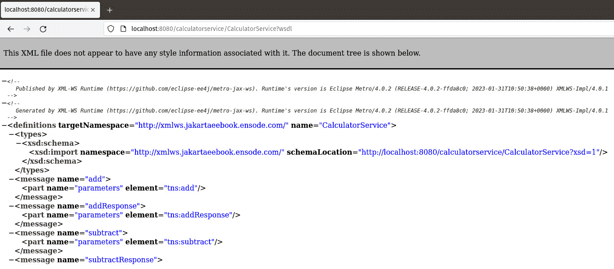
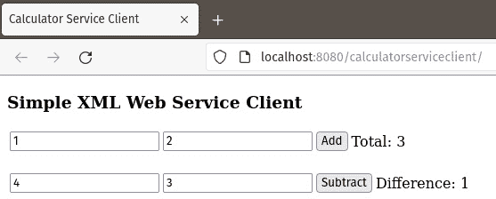
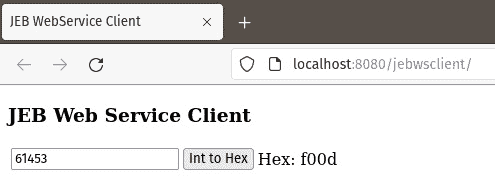

# 14

# 使用 Jakarta XML Web Services 的 Web 服务

**Web 服务**是可以远程调用的应用程序编程接口。Web 服务可以从任何语言的客户端调用。

Jakarta EE 将 XML Web Services API 作为其技术之一。我们可以在 Java 平台上使用 **XML Web Services** 来开发 **SOAP**（**简单对象访问协议**）Web 服务。Jakarta XML Web Services 是一个高级 API；通过 Jakarta XML Web Services 调用 Web 服务是通过远程过程调用完成的。

基于 SOAP 的 Web 服务现在是一种过时的技术。在大多数情况下，对于新开发，人们更倾向于使用 RESTful Web 服务而不是基于 SOAP 的服务。对基于 SOAP 的 Web 服务的了解主要用于维护遗留应用程序。

在本章中，我们将涵盖以下主题：

+   使用 Jakarta XML Web Services 开发 Web 服务

+   将企业 Bean 公开为 Web 服务

注意

本章的示例源代码可以在 GitHub 上找到，链接如下：[`github.com/PacktPublishing/Jakarta-EE-Application-Development/tree/main/ch14_src`](https://github.com/PacktPublishing/Jakarta-EE-Application-Development/tree/main/ch14_src)。

# 使用 Jakarta XML Web Services 开发 Web 服务

Jakarta XML Web Services 是一个高级 API，它简化了基于 SOAP 的 Web 服务的开发。使用 Jakarta XML Web Services 开发 Web 服务包括编写一个具有公开方法的类，这些方法将被公开为 Web 服务。该类需要使用 `@WebService` 注解。类中的所有公共方法都自动公开为 Web 服务；它们可以选择性地使用 `@WebMethod` 注解。以下示例说明了这个过程：

```java
package com.ensode.jakartaeebook.xmlws;
import jakarta.jws.WebMethod;
import jakarta.jws.WebService;
@WebService
public class Calculator {
  @WebMethod
  public int add(int first, int second) {
    return first + second;
  }
  @WebMethod
  public int subtract(int first, int second) {
    return first - second;
  }
}
```

前面的类将其两个方法公开为 Web 服务。`add()` 方法简单地将它接收的两个 `int` 原始参数相加并返回结果，而 `substract()` 方法从其两个参数中减去并返回结果。

我们通过使用 `@WebService` 注解来装饰类，表明该类实现了 Web 服务。我们希望公开为 Web 服务的任何方法都可以用 `@WebMethod` 注解来装饰，但这不是必需的。由于所有公共方法都自动公开为 Web 服务，我们仍然可以使用 `@WebMethod` 注解以提高清晰度，但这不是严格必要的。要部署我们的 Web 服务，我们只需像往常一样将其打包到 WAR 文件中即可。

Web 服务客户端需要一个 **WSDL**（**Web 服务定义语言**）文件来生成可执行代码，以便它们可以用来调用 Web 服务。WSDL 是一种基于 XML 的语言，用于描述基于 SOAP 的 Web 服务提供的功能。WSDL 文件通常放置在 Web 服务器上，并通过其 URL 被客户端访问。

当部署使用 Jakarta XML Web Services 开发的 Web 服务时，会自动为我们生成一个 WSDL。生成的 WSDL 的确切 URL 取决于我们使用的 Jakarta EE 运行时。当使用 GlassFish 时，生成的 WSDL 的 URL 遵循以下格式：

```java
[http|https]://[server]:[port]/[context root]/[service name]?wsdl
```

在我们的示例中，我们的 Web 服务的 WSDL（当部署到 GlassFish 时）的 URL 将是`http://localhost:8080/calculatorservice/CalculatorService?wsdl`（假设 GlassFish 运行在我们的本地工作站上，并且 GlassFish 在其默认的`8080`端口上监听 HTTP 连接）。

我们可以通过将浏览器指向其 URL 来查看生成的 WSDL，如图 14.1 所示。



图 14.1 – 自动生成的 WSDL

WSDL 的具体内容与讨论无关。它可以被认为是“幕后管道”，这对于基于 SOAP 的 Web 服务正确工作来说是必要的。不过，当开发 Web 服务客户端时，需要 WSDL 的 URL。

## 开发 Web 服务客户端

正如我们之前提到的，Web 服务客户端需要从 Web 服务的 WSDL 生成可执行代码。然后，Web 服务客户端将调用此可执行代码来访问 Web 服务。

为了从 WSDL 生成 Java 代码，我们需要使用一个名为`wsimport`的工具。

可以通过下载 Eclipse Metro 来获取`wsimport`工具，网址为[`eclipse-ee4j.github.io/metro-wsit/`](https://eclipse-ee4j.github.io/metro-wsit/)。

`wsimport`的唯一必需参数是与 Web 服务对应的 WSDL 的 URL，如下所示：

```java
wsimport http://localhost:8080/calculatorservice/CalculatorService?wsdl
```

此命令将生成多个编译后的 Java 类，允许客户端应用程序访问我们的 Web 服务：

+   `Add.class`

+   `AddResponse.class`

+   `Calculator.class`

+   `CalculatorService.class`

+   `ObjectFactory.class`

+   `package-info.class`

+   `Subtract.class`

+   `SubtractResponse.class`

注意

默认情况下，生成的类文件的源代码会自动删除。可以通过传递`-keep`参数来保留它。

这些类需要添加到客户端的`CLASSPATH`中，以便它们可以被客户端代码访问。

如果我们使用 Apache Maven 来构建我们的代码，我们可以利用 JAX-WS Maven 插件在构建客户端代码时自动调用`wsimport`。这种方法在下面的`pom.xml`文件中得到了说明：

```java
<?xml version="1.0" encoding="UTF-8"?>
<project   xsi:schemaLocation="http://maven.apache.org/POM/4.0.0 http://maven.apache.org/xsd/maven-4.0.0.xsd">
  <modelVersion>4.0.0</modelVersion>
  <!-- Irrelevant markup omitted for brevity -->
  <build>
    <finalName>calculatorserviceclient</finalName>
    <plugins>
      <plugin>
        <groupId>com.sun.xml.ws</groupId>
        <artifactId>jaxws-maven-plugin</artifactId>
        <version>4.0.2</version>
        <executions>
          <execution>
            <goals>
              <goal>wsimport</goal>
            </goals>
            <configuration>
              <vmArgs>
                <vmArg>-Djavax.xml.accessExternalSchema=all</vmArg>
              </vmArgs>
              <wsdlUrls>
                <wsdlUrl>
       http://localhost:8080/calculatorservice/CalculatorService?wsdl
                </wsdlUrl>
              </wsdlUrls>
              <keep>true</keep>
            </configuration>
          </execution>
        </executions>
      </plugin>
    </plugins>
  </build>
</project>
```

上述`pom.xml` Maven 构建文件将在我们通过`mvn package`或`mvn install`命令构建代码时自动调用`wsimport`实用程序。

到目前为止，我们已经准备好开发一个简单的客户端来访问我们的 Web 服务。我们将实现我们的客户端作为一个 Jakarta Faces 应用程序；客户端应用程序源代码中最相关的部分如下所示：

```java
package com.ensode.jakartaeebook.calculatorserviceclient;
//imports omitted for brevity
@Named
@RequestScoped
public class CalculatorClientController {
  @WebServiceRef(wsdlLocation =
    "http://localhost:8080/calculatorservice/CalculatorService?wsdl")
  private CalculatorService calculatorService;
  @Inject
  private CalculatorServiceClientModel calculatorServiceClientModel;
  private Integer sum;
  private Integer difference;
  public void add(ActionEvent actionEvent) {
    Calculator calculator = calculatorService.getCalculatorPort();
    sum = calculator.add(calculatorServiceClientModel.getAddend1(),
      calculatorServiceClientModel.getAddend2());
  }
  public void subtract(ActionEvent actionEvent) {
    Calculator calculator = calculatorService.getCalculatorPort();
    difference =
      calculator.subtract(calculatorServiceClientModel.getMinuend(),
      calculatorServiceClientModel.getSubtrahend());
  }
  //getters and setters omitted for brevity
}
```

`@WebServiceRef`注解将 Web 服务的实例注入到我们的客户端应用程序中。它的`wsdlLocation`属性包含我们正在调用的 Web 服务对应的 WSDL 的 URL。

注意，Web 服务类是名为 `CalculatorService` 的类的实例。当我们调用 `wsimport` 工具时创建了此类，因为 `wsimport` 总是生成一个类，其名称是我们实现的类的名称加上“Service”后缀。我们使用这个服务类来获取我们开发的 Web 服务类的实例。在我们的例子中，我们通过在 `CalculatorService` 实例上调用 `getCalculatorPort()` 方法来完成此操作。一般来说，调用我们 Web 服务类实例的方法遵循 `getNamePort()` 模式，其中 `Name` 是我们编写的实现 Web 服务的类的名称。一旦我们获得了我们 Web 服务类的实例，我们就可以像调用任何常规 Java 对象一样调用其方法。

注意

严格来说，服务类的 `getNamePort()` 方法返回一个实现由 `wsimport` 生成的接口的类的实例。这个接口被命名为我们的 Web 服务类，并声明了我们声明的所有作为 Web 服务的函数。从所有实际目的来看，返回的对象等同于我们的 Web 服务类。

我们简单客户端应用程序的用户界面是使用 Facelets 开发的，这在开发 Jakarta Faces 应用程序时是惯例。以下代码片段显示了我们的 Jakarta Faces Facelets 客户端最相关的标记：

```java
<h:form>
  <h:panelGrid columns="4">
    <h:inputText id="addend1"
      value="#{calculatorServiceClientModel.addend1}"/>
    <h:inputText id="addend2"
      value="#{calculatorServiceClientModel.addend2}"/>
    <h:commandButton value="Add"
      actionListener="#{calculatorClientController.add}">
      <f:ajax execute="addend1 addend2" render="sum"/>
    </h:commandButton>
    <h:panelGroup>
      Total: <h:outputText id="sum"
        value="#{calculatorClientController.sum}"/>
    </h:panelGroup>
  </h:panelGrid>
  <br/>
  <h:panelGrid columns="4">
    <h:inputText id="minuend"
      value="#{calculatorServiceClientModel.minuend}"/>
    <h:inputText id="subtrahend"
      value="#{calculatorServiceClientModel.subtrahend}"/>
    <h:commandButton value="Subtract"
      actionListener="#{calculatorClientController.subtract}">
      <f:ajax execute="minuend subtrahend" render="difference"/>
    </h:commandButton>
    <h:panelGroup>
      Difference: <h:outputText id="difference"
        value="#{calculatorClientController.difference}"/>
    </h:panelGroup>
  </h:panelGrid>
</h:form>
```

用户界面使用 Ajax 调用 `CalculatorClientController` CDI 命名豆（有关详细信息，请参阅*第六章*）上的相关方法。

在部署我们的代码后，我们的浏览器应该将页面渲染成如图 *图 14**.2* 所示（这是在输入一些数据并点击相应按钮后显示的）。



图 14.2 – XML Web 服务客户端运行时

在这个例子中，我们传递了 `Integer` 对象作为参数和返回值。当然，也可以将原始类型作为参数和返回值传递。不幸的是，当使用 Jakarta XML Web Services 实现基于 SOAP 的 Web 服务时，并非所有标准 Java 类或原始类型都可以用作方法参数或返回值。这是因为幕后，方法参数和返回类型被映射到 XML 定义，并且并非所有类型都可以正确映射。

在此列出可用于 Jakarta XML Web 服务调用的有效类型：

+   `java.awt.Image`

+   `java.lang.Object`

+   `Java.lang.String`

+   `java.math.BigDecimal`

+   `java.math.BigInteger`

+   `java.net.URI`

+   `java.util.Calendar`

+   `java.util.Date`

+   `java.util.UUID`

+   `jakarta.activation.DataHandler`

+   `javax.xml.datatype.Duration`

+   `javax.xml.datatype.XMLGregorianCalendar`

+   `javax.xml.namespace.QName`

+   `javax.xml.transform.Source`

此外，以下原始类型也可以使用：

+   `boolean`

+   `byte`

+   `byte[]`

+   `double`

+   `float`

+   `int`

+   `long`

+   `short`

我们还可以将我们自己的自定义类用作 Web 服务方法的参数和/或返回值，但我们的类的成员变量必须是列出的类型之一。

此外，使用数组作为方法参数或返回值是合法的。然而，在执行`wsimport`时，这些数组会被转换为列表，导致 Web 服务中的方法签名与客户端调用的方法调用之间产生不匹配。因此，更倾向于使用列表作为方法参数和/或返回值，因为这也是合法的，并且不会在客户端和服务器之间产生不匹配。

注意

Jakarta XML Web Services 内部使用**Jakarta XML Binding API**从方法调用创建 SOAP 消息。我们允许用于方法调用和返回值的类型是 Jakarta XML Binding 支持的类型。有关更多信息，请参阅 https://jakarta.ee/specifications/xml-binding/。

## 向 Web 服务发送附件

除了发送和接受上一节中讨论的数据类型外，Web 服务方法还可以发送和接受文件附件。以下示例说明了如何做到这一点：

```java
package com.ensode.jakartaeebook.xmlws;
//imports omitted for brevity
@WebService
public class FileAttachment {
  @WebMethod
  public void attachFile(DataHandler dataHandler) {
    FileOutputStream fileOutputStream;
    try {
      fileOutputStream = new FileOutputStream("/tmp/logo.png");
      dataHandler.writeTo(fileOutputStream);
      fileOutputStream.flush();
      fileOutputStream.close();
    } catch (IOException e) {
      e.printStackTrace();
    }
  }
}
```

为了编写一个接收一个或多个附件的 Web 服务方法，我们只需要为方法将接收到的每个附件添加一个`jakarta.activation.DataHandler`类型的参数。在我们的例子中，`attachFile()`方法接受一个此类参数并将其简单地写入文件系统。

就像任何标准 Web 服务一样，Web 服务代码需要打包在一个`WAR`文件中并部署。一旦部署，就会自动生成 WSDL。然后我们需要执行`wsimport`实用程序来生成我们的 Web 服务客户端可以用来访问 Web 服务的代码。如前所述，`wsimport`可以从命令行或通过 Apache Maven 插件调用。

一旦我们执行了`wsimport`来生成访问 Web 服务的代码，我们就可以编写和编译我们的客户端代码：

```java
package com.ensode.jakartaeebook.fileattachmentserviceclient;
//imports omitted for brevity
@Named
@RequestScoped
public class FileAttachmentServiceClientController {
  @WebServiceRef(wsdlLocation =
    "http://localhost:8080/fileattachmentservice/"
    + "FileAttachmentService?wsdl")
  private FileAttachmentService fileAttachmentService;
  public void invokeWebService() {
    try {
      URL attachmentUrl = new URL(
        "http://localhost:8080/fileattachmentserviceclient/" +
        "resources/img/logo.png");
      FileAttachment fileAttachment = fileAttachmentService.
          getFileAttachmentPort();
      InputStream inputStream = attachmentUrl.openStream();
      byte[] fileBytes = inputStreamToByteArray(inputStream);
      fileAttachment.attachFile(fileBytes);
    } catch (IOException ioe) {
      ioe.printStackTrace();
    }
  }
  private byte[] inputStreamToByteArray(InputStream inputStream)
    throws IOException {
    //method body omitted for brevity
  }
}
```

Web 服务附件需要以字节数组的形式发送到 Web 服务；因此，Web 服务客户端需要将文件转换为这种类型。在我们的例子中，我们发送一个图像作为附件，我们通过创建一个`java.net.URL`实例并将图像的 URL 作为参数传递给其构造函数来将图像加载到内存中。然后，我们通过在 URL 实例上调用`openStream()`方法来获取与图像对应的`InputStream`实例，将我们的`InputStream`实例转换为字节数组，然后将这个字节数组传递给期望附件的 Web 服务方法。

注意，与传递标准参数不同，当客户端调用期望附件的方法时使用的参数类型与 Web 服务器代码中方法的参数类型不同。Web 服务器代码中的方法期望每个附件都是一个 `jakarta.activation.DataHandler` 实例；然而，由 `wsimport` 生成的代码期望每个附件都是一个字节数组。这些字节数组在 `wsimport` 生成的代码背后被转换为正确的类型（`jakarta.activation.DataHandler`）。我们作为应用程序开发者不需要关心为什么会发生这种情况的细节，我们只需要记住，当向 Web 服务方法发送附件时，参数类型在 Web 服务代码和客户端调用中将不同。

# 将企业 Bean 公开为 Web 服务

除了在上一节中描述的创建 Web 服务之外，通过简单地向企业 Bean 类添加注解，无状态会话 Bean 的公共方法可以轻松地公开为 Web 服务。以下示例说明了如何进行此操作：

```java
package com.ensode.jakartaeebook.jebws;
import jakarta.ejb.Stateless;
import jakarta.jws.WebService;
@Stateless
@WebService
public class DecToHexBean {
  public String convertDecToHex(Integer i) {
    return Integer.toHexString(i);
  }
}
```

如我们所见，要将无状态会话 Bean 的公共方法公开为 Web 服务，我们只需要用 `@WebService` 注解装饰其类声明。不用说，由于该类是一个会话 Bean，它还需要用 `@Stateless` 注解装饰。

就像常规的无状态会话 Bean 一样，那些将方法公开为 Web 服务的需要部署在一个 JAR 文件中。

就像标准 Web 服务一样，企业 Bean Web 服务的 WSDL URL 依赖于所使用的应用服务器。您可以查阅您的应用服务器文档以获取详细信息。

## 企业 Bean Web 服务客户端

以下类说明了从客户端应用程序访问企业 Bean Web 服务的步骤：

```java
package com.ensode.jakartaeebook.jebwsclient;
//imports omitted for brevity
@Named
@RequestScoped
public class JebClientController {
  @WebServiceRef(wsdlLocation =
    "http://localhost:8080/DecToHexBeanService/DecToHexBean?wsdl")
  private DecToHexBeanService decToHexBeanService;
  @Inject
  private JebClientModel jebClientModel;
  private String hexVal;
  public void convertIntToHex() {
    hexVal = decToHexBeanService.getDecToHexBeanPort().
        convertDecToHex(jebClientModel.getIntVal());
  }
  //getters and setters omitted for brevity
}
```

如我们所见，当从客户端访问企业 Bean Web 服务时，不需要做任何特别的事情。该过程与标准 Web 服务相同。

前面的类是一个 CDI 命名 Bean。*图 14.3* 展示了一个简单的 Jakarta Faces 用户界面，该界面使用前面的类来调用我们的 Web 服务。



图 14.3 – 企业 Bean Web 服务客户端

点击 **十进制转十六进制** 按钮，会生成对 Web 服务的调用，该调用返回与用户在文本输入字段中输入的十进制值等效的十六进制值。

# 摘要

在本章中，我们介绍了如何通过 Jakarta XML Web 服务 API 开发 Web 服务和 Web 服务客户端。

本章涵盖了以下主题：

+   如何使用 Jakarta XML Web 服务开发基于 SOAP 的 Web 服务

+   如何在将 Maven 作为构建工具时，将 Web 服务客户端的代码生成集成到 Web 服务中

+   可以用于通过 Jakarta XML Web 服务进行远程方法调用的有效数据类型

+   如何向 Web 服务发送附件

+   如何将企业 Bean 方法公开为 Web 服务

拥有本章的知识，我们现在可以开发基于 SOAP 的 Web 服务，以及维护现有的基于 SOAP 的应用程序。
