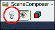
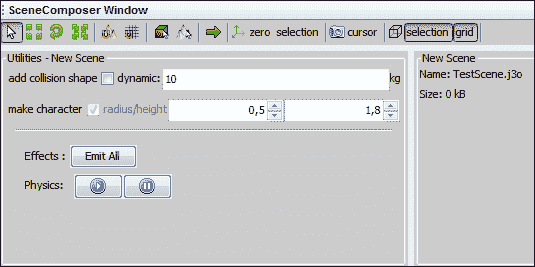
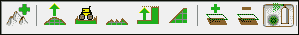
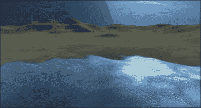
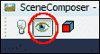
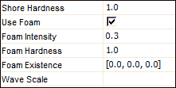
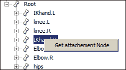
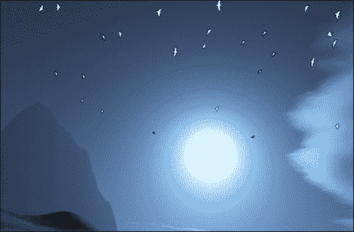

# 第一章：SDK 游戏开发中心

本章包含以下食谱：

+   设置项目

+   导入模型

+   使用场景作曲家

+   使用地形编辑器修改高度图

+   添加天空盒和照明

+   使用过滤器添加水

+   添加一些环境音频

+   使用 Font Creator 创建位图字体

+   获取附件节点

+   使用粒子发射器——飞翔的鸟

+   高级粒子发射器类

# 简介

欢迎来到本书的第一章！在本章中，我们将介绍 SDK 的各种功能。这些功能使得除了程序员之外的人也能轻松地进行开发。在许多情况下，您只需调整值，无需启动应用程序，就可以快速获得视觉结果。简而言之，它是一个开发中心，因为您将在项目中不时地返回并使用这些功能。在难度等级上，这些食谱倾向于简单，编程很少或没有。例外的是本章的最后部分，需要修改核心包才能达到我们想要的结果。

# 设置项目

jMonkeyEngine SDK 基于 NetBeans 环境。熟悉 NetBeans 环境的用户在使用 jMonkeyEngine SDK 时可能不会有太多困难。对于那些没有先前经验的人来说，一些如何开始的指导可能很有帮助。在本食谱中，我们将创建一个可以访问 jMonkeyEngine 测试数据库的项目。通过这样做，我们从一开始就拥有一些可以用来尝试许多食谱的资产。

## 准备工作

在设置项目之前，我们需要下载 SDK。这样做就像去[`hub.jmonkeyengine.org/downloads/`](http://hub.jmonkeyengine.org/downloads/)并选择适合您操作系统的合适包一样简单。

下载并安装包后，我们就准备就绪了！

## 如何做...

我们可以通过以下步骤设置项目：

1.  首先，找到**项目**窗口。

1.  在其中某处右键单击，然后选择**新建项目**。

1.  在出现的窗口中，从**类别**中选择**JME3**，从**项目**中选择**BasicGame**。

1.  在下一屏上，为项目选择一个合适的名称，然后单击**完成**以创建它。

1.  项目现在应该出现在**项目**窗口中。右键单击它，从菜单中选择**属性**。

1.  选择**库**选项，单击**添加库…**按钮，并从列表中找到`jme3-test-data`库。

## 它是如何工作的...

当项目创建时，它会为 jMonkeyEngine 项目设置基本需求。您将获得一个**项目资产**文件夹，您可以将任何内容放置在其子文件夹中。它还会根据`SimpleApplication`类创建`Main.java`文件。这是您应用程序的起点。

# 导入模型

让我们从一个非常基础的场景开始。我们有一个从 3D 建模软件导出的模型，我们希望将其用于我们的游戏。我们首先需要做的是将其转换为 jMonkeyEngine 3 内部使用的格式（`.j3o`）。推荐的格式是来自开源建模软件 Blender 的`.blend`格式，该 SDK 对其提供了广泛的支持。另一种常见的格式是用于静态模型的`.obj`格式和 Ogre-mesh XML 文件。

## 如何操作…

我们可以通过以下步骤导入一个模型：

1.  前往**文件**菜单并选择**导入模型**。

1.  接下来，我们需要选择我们想要导入的项目。

1.  在选择要导入的实际模型后，我们可以预览模型并确保所有资产都得到正确使用。

1.  最后，我们在**项目资产**文件夹结构中选择放置的位置。

## 它是如何工作的…

导入器将模型转换为内部的`.j3o`格式。这是一个二进制格式，这意味着它变得不可读（与可以编辑的`.obj`文件相比）。二进制文件的紧凑性对于保持内存消耗低是必要的。但是，它变得无法外部编辑，因此保持原始文件组织良好是一个好主意！

# 使用 Scene Composer

在这里，我们将通过 SDK 中使用 Scene Composer 的基本操作。Scene Composer 是一个我们可以预览对象、为游戏使用准备它们并将它们组合成场景的地方。进一步的使用包括查看模型的骨架和骨骼设置或播放动画。你还可以应用材质、灯光并设置一些基本的几何数据。

## 准备工作

如果你想创建一个有趣的场景，有一些模型可以玩将很有用。我们将使用测试数据库中的 Jaime 模型。你可以在**Models**文件夹中的**Jaime**文件夹中找到它，并将其复制到你的项目中。

## 如何操作…

让我们先创建一个场景，稍后我们可以用它来测试我们的食谱。

1.  右键单击**项目资产**中的**场景**文件夹，选择**新建**，然后选择**空 jME3 场景**。场景将自动在**SceneComposer**窗口中打开。

1.  场景只是一个空节点，需要填充才能变得有用。为了有东西可以查看，让我们将 Jaime 模型添加到场景中。在文件夹结构中找到它，右键单击**Jaime.j3o**，然后选择**在 SceneComposer 中链接**。**SceneComposer**窗口如下所示：

1.  现在，我们很可能只能看到一个蓝色的线框盒子。这是因为场景中没有灯光。屏幕左上角有一个带有灯泡按钮的按钮。

1.  通过点击它，我们应该得到**PointLight**跟随相机；然而，它不是场景的一部分。

    ### 小贴士

    **链接与添加**

    添加意味着将对象本身的一个实例添加到场景中。这可以单独修改，而不影响原始对象。

    链接意味着你为场景中的对象添加一个引用。除了使场景更小之外，对原始对象的任何修改也将影响场景中的对象。

1.  场景中的基本相机方向包括用鼠标左键拖动来旋转相机。按住鼠标右键拖动将相机移动到侧面、向上和向下。鼠标滚轮用于缩放。

1.  **场景合成器**窗口顶部栏的第二个图标是移动图标。通过点击它，你会看到 Jaime 的三个不同颜色的平面。当你将鼠标移过它们时，它们会被突出显示。如果你在它们突出显示时按下鼠标左键，你将在该平面的维度中移动对象。

1.  同样的规则适用于下一个图标，旋转。注意，尽管如此，缩放在所有轴上是均匀的。

### 小贴士

如果你想要完全控制你的变换，你可以使用**属性**窗口来设置平移、旋转和缩放的精确值。

如果你想深入了解 SDK，请查看[`hub.jmonkeyengine.org`](http://hub.jmonkeyengine.org)上的视频。

## 它是如何工作的...

场景合成器运行一个 jME 应用程序的实例，你所看到的就是你在游戏中观看场景时将得到的结果（不包括相机灯光）。使用它来预览和调整你的资产，然后再将它们带入你的应用程序中。

## 还有更多...

现在我们有了场景，要将它加载到应用程序中需要什么？实际上只需要以下几行代码：

```java
Spatial scene = assetManager.loadModel("Scenes/TestScene.j3o");
rootNode.attachChild(scene);
```

在`Main.java`的`simpleInitApp()`方法中添加前面的代码。

# 使用地形编辑器修改高度图

在地形编辑器中，我们发现有许多函数可以让我们修改基于高度图的地形，这在许多游戏中都有应用。

在最简单的情况下，高度图是一个二维数组（维度代表*x*和*y*坐标），通常存储表示高度值的浮点数。这些可以保存为灰度图像，其中较亮的区域对应较高的地面，反之，较暗的区域对应较低的地面。

jMonkeyEngine 的地形字段提供了更多信息，帮助你创建视觉上吸引人的地形。例如，顶点法线数据、颜色和纹理数据都可以通过 API 进行修改，这对于勇敢的程序员来说是有用的。


高度图

## 如何做到这一点...

我们将首先为场景创建地形，然后再探讨如何修改它。为此，执行以下步骤：

1.  首先，我们要么创建一个新的场景，要么加载我们之前工作过的场景。

1.  在**场景探索器**窗口中，右键单击主场景节点，选择**添加空间**然后**地形**。

1.  要编辑地形，我们必须在**项目**窗口中找到场景 j3o 文件。它应该位于**项目资产**中的**场景**文件夹内。右键单击场景文件并选择**编辑地形**。

1.  现在，我们已经有一个平坦且美观的地形。虽然它功能齐全，但让我们探索**地形编辑器**窗口中的功能。这些功能在下面的屏幕截图中有展示：

1.  在添加地形图标旁边，你有提升/降低地形图标。此图标使用**半径**和**高度/权重**滑块的值来修改地形。试一试，看看它如何用来创建山丘和山谷。水平地形图标可以用来在地形中创建平坦区域。它的工作原理是在你希望作为参考的高度区域上右键单击，然后按住鼠标左键，在地形所选高度上拉平，从而创建高原。

    ### 小贴士

    如果你打算将其用作其他章节的测试平台，请尝试保持 Jaime 周围区域的高度为默认值，至少目前是这样。这是因为我们没有逻辑来保持它在实际地面水平，我们想看看食谱中发生了什么。

1.  虽然地形自带基本纹理，但我们可能想要做一些更有趣的事情。首先，我们需要添加另一个纹理层。这是通过一个看起来像带有加号顶部的飞机图标（添加另一个纹理层图标）来完成的。

1.  点击它后，在**绘画**窗口下方应该出现另一行。点击**纹理**字段将弹出一个选择器，显示项目中所有可用的纹理。从可用的纹理中选择一个合适的纹理。

1.  现在，要绘画，点击带有喷雾罐按钮的按钮。你现在可以通过在地面上按住鼠标左键来绘画，通过按住鼠标右键来擦除。像**地形编辑器**窗口中的大多数其他功能一样，它使用**半径**和**高度/权重**值。

    ### 小贴士

    当手动绘制地形时，手头有一张该类型地形的参考图像是个好主意。这样我们就可以，例如，看到草如何在斜坡上生长，或者雪如何在山上聚集，从而产生更逼真的效果。始终从大笔触开始绘制，逐渐使用越来越小的画笔。

## 它是如何工作的...

大多数按钮的功能相当直观，但让我们看看当其中任何一个应用时会发生什么。

在使用自动化工具生成高度图之后，可能需要一点平滑处理。在这种情况下，你很可能不会使用画笔，而是使用一个将均匀应用于整个高度图的过滤器。画笔可能被用来平滑游戏角色应该移动的区域，以获得更好的游戏体验。也可能是一个区域的地面类型比周围环境更平滑，比如岩石悬崖中的海滩。

平坦的地形有类似的使用。如果我们需要足够的空间放置一个大型建筑，例如，这是确保建筑物的任何部分都不会漂浮或沉没在地下的最佳方式。

# 添加天空盒和灯光

天空盒或天空穹顶是游戏中常见的魔法元素。它们被用来为场景创造一种氛围背景，非常适合让区域看起来比实际更大。

天空盒由六个纹理组成，渲染在一个立方体的内部，就像壁纸一样。虽然它们被视为包围世界，但实际上它们不需要很大，因为它们是队列中首先渲染的。这意味着其他所有东西都将绘制在它们之上。

## 如何做到这一点…

配方将包括两个部分，其中第一部分将使用六个纹理创建天空盒。之后，我们将使用**方向光**添加类似太阳的光。

1.  在**场景探索器**窗口中，右键点击你的场景并选择**添加空间..**然后**天空盒..**。

1.  这里有两种选择：要么我们可以加载六个独立的纹理，要么可以加载一个包含所有六个纹理的预烘焙纹理。这个特定的配方使用了来自`test-data/Textures/Sky`文件夹的六个`Lagoon`纹理。

1.  在此之后，我们应该现在看到围绕地形的忧郁、水景。

1.  地形和天空盒之间的融合并不很好。首先，灯光是错误的。场景中唯一的灯光是从摄像机原点发出的白色灯光。为了在这个户外场景中获得更自然的光线，我们可以添加**方向光**。

1.  再次，在**场景探索器**窗口中右键点击场景。现在，选择**添加光..**然后选择**方向光**。场景变得明亮了许多！然而，它看起来并没有更好。我们需要调整灯光以适应场景。

1.  我们可以在**场景探索器**窗口中看到**方向光**元素。选择它并打开**属性**窗口。这里只有两个设置：`颜色`和`方向`。

1.  通过点击颜色值旁边的框，我们可以看到几个设置颜色的选项。我们可以使用图像编辑器和太阳附近的颜色选择器功能来获取合适的颜色。获取 RGB 值并将它们插入到那个标签中。这样，我们就知道我们得到了与场景中的太阳相匹配的颜色。

1.  关闭相机灯光（左上角的灯泡）将帮助我们看到我们刚刚添加的带有蓝色色调的颜色。

    ### 小贴士

    通常，比看起来可能合适的颜色稍微浅一点是一个很好的规则。最终通常感觉更自然。拿给别人看，看看他们是否认为它“太多”。作为一个开发者，你的判断可能会“受污染”，因为你习惯了场景，很容易过度处理像光照这样的东西。

1.  为了使场景和天空盒更好地融合在一起，还有一件事要做。地形上的阴影与场景中的太阳位置不匹配。**方向光**的默认设置是从西南方向照射，大约 45 度向下。这个特定的天空盒主要光源来自东北方向。在**方向**属性中将*x*和*z*值的负号翻转似乎可以使阴影看起来更自然。

    ### 小贴士

    你看到的关于天空盒的内容可以极大地改变沉浸感的感知。一般来说，玩家不应该看到地平线以下的东西，这样才能看起来逼真。如果你在场景中放大和缩小，你会注意到这一点。当你靠近地面时，它会感觉更加自然。

## 它是如何工作的...

天空盒之所以能工作，是因为场景图的渲染方式。对象可以被分类到不同的列表或桶中，以帮助渲染。天空盒被分类到`Bucket.Sky`列表中，在每次渲染周期中首先绘制。这就是为什么其他所有东西（通常在`Bucket.Opaque`列表中）看起来都位于它前面。你可以通过调用`Geometry.setQueueBucket (Bucket.Sky)`为任何对象实现相同的效果。

### 小贴士

你可以通过以下方式更改`QueueBucket`渲染器，以在其他对象上实现相同的效果：

```java
Geometry.setQueueBucket(Bucket.Sky);
```

## 还有更多...

如果你仔细观察 Jaime（或你添加到场景中的任何其他对象），关闭相机灯光，你会注意到背对灯光的那一侧将完全黑暗。除非这是一个没有大气、辐射、散射和反射其他表面的地方，否则应该给所有侧面一些基本的光照。这在游戏中通过使用环境光照来模拟。它均匀地照亮所有面，并且通过在**SceneExplorer**窗口中选择场景并选择**添加灯光**来添加。

你可以选择与**方向光**相同的颜色，但让它变得更暗，以得到看起来自然的东西。如果你真的很认真，并且地面颜色相对均匀，你可以尝试混合一点地面颜色。

# 使用过滤器添加水

当谈到 jMonkeyEngine 中的性价比视觉效果时，几乎没有比使用水过滤器更胜一筹的方法。它非常令人印象深刻，而且很容易做到。在场景中有水将极大地增强我们测试场景的氛围。你可以在以下截图中看到通过少量努力就能实现的出色水面效果：



## 准备工作

应用的场景应该有一些高度差异（否则我们可能会得到全部是水或全部是地面的效果）。如果没有地形可用或需要调整，请查看本章中的*使用地形编辑器修改高度图*配方。

如果您的**项目资产**文件夹中还没有**效果**文件夹，请添加它。

## 如何操作…

我们可以通过以下步骤使用过滤器添加水：

1.  右键单击**项目资产**下的**效果**文件夹，选择**新建**，然后选择**空过滤器后处理文件**。您可能需要选择**新建**，**其他...**，然后点击**过滤器**以找到它。

1.  将其命名为`Water`并点击**完成**。

1.  右键单击新创建的**Water.j3f**文件并打开它。

1.  我们现在转到**过滤器资源管理器**窗口。从这里，我们可以创建、添加和修改场景级别的效果，从众多预设中选择。右键单击**水**过滤器，选择**添加过滤器**然后选择**水**。

1.  要在**场景合成器**窗口中查看过滤器，我们需要点击以下截图所示的眼睛图标。这将使场景焕然一新。试试看，看看场景如何变换。

1.  为了使水面看起来平滑，需要修改一些属性。**水过滤器**元素的**属性**窗口可能会显得有些令人不知所措。现在，让我们更改**水高**参数。过滤器将在遇到陆地并找到良好的分离或岸边高度至关重要的地方创建泡沫。最佳位置取决于场景，但最初为-2 单位。更改以下值将影响海岸线的外观：

1.  其中还有**光方向**和**光颜色**属性。让我们将我们的**方向光**元素的值复制到这里，使它们匹配。您可以通过转到**场景资源管理器**窗口，选择**方向光**元素，并在**属性**窗口中查找它们。

1.  最后，我们需要将以下行添加到我们的测试应用的`simpleInit`方法中：

    ```java
    FilterPostProcessor processor = (FilterPostProcessor) assetManager.loadAsset("Effects/Water.j3f");
    viewPort.addProcessor(processor);
    ```

## 它是如何工作的...

后置过滤器在渲染阶段作为屏幕效果渲染，并应用于整个场景。jME 团队和社区制作了许多现成的过滤器变体，您可以使用它们来改变场景的外观。过滤器资源管理器是设置和测试这些过滤器并在应用到游戏中之前的好方法。

# 添加一些环境音频

音频是游戏中以及任何其他跨媒体产品中极其重要的情绪营造者，但常常被忽视。糟糕的音频可以像好的音频一样轻易地破坏沉浸感。

我们将向场景添加一些环境音频以帮助营造氛围。由于我们使用的天空盒是一个相当忧郁且多水的场景，我们将添加海浪拍岸的声音。

环境声音可以是你在整个场景中听到的声音，例如城市中交通的嗡嗡声，或者特定地点的声音，如瀑布声等。在这种情况下，我们可以将场景想象成一个小的岛屿，因此波浪声应该在任何地方都能听到。

事实上，在`Sound`文件夹内的**环境**文件夹中有一个合适的`.ogg`文件。如果我们已经将`jme3-test-data`库添加到我们的项目中，我们可以轻松访问它。

SDK 可以处理`.ogg`或未压缩的`.wav`文件。`.ogg`格式是开放和免费的，这意味着您不需要任何许可证就可以使用它。其他压缩类型的情况可能并非如此。

## 如何做到这一点…

如果我们已经制作了前面的食谱，我们可能已经看到了音频节点。以下步骤将帮助我们展示如何将一个添加到场景中：

1.  我们可以通过在空间上（在这种情况下是主场景节点）右键单击并选择**添加空间**然后**音频节点**来找到音频节点。

1.  接下来，选择它并查看**属性**窗口。

1.  首先要查看的重要事项是**音频数据**参数。在下拉菜单中，SDK 将自动显示**项目资源**下**声音**文件夹中的文件，因此我们应该在这里看到**Ocean Waves.ogg**。取消选中**位置**复选框意味着在移动时不会有音量衰减。

1.  还要检查**循环**复选框，以确保声音在播放一次后不会结束。

1.  目前在 SDK 本身中无法听到声音，因此我们需要启动一个应用程序来做到这一点。幸运的是，在`simpleInitApp`方法中启动声音只需要一行代码。这里的唯一问题是，我们需要首先将`scene`对象强制转换为`AudioNode`实例。在加载场景后，添加以下代码行：

    ```java
    Node scene = (Node) assetManager.loadModel
    ("Scenes/TestScene.j3o");
    rootNode.attachChild(scene);
    ((AudioNode)scene.getChild("AudioNode")).play();
    ```

1.  我们添加的声音非常强大，可能对我们的场景来说有点压倒性。通过调整`AudioNode`元素的`Volume`属性可以稍微降低效果。

### 小贴士

**下载示例代码**

您可以从您在[`www.packtpub.com`](http://www.packtpub.com)的账户中下载您购买的所有 Packt 书籍的示例代码文件。如果您在其他地方购买了这本书，您可以访问[`www.packtpub.com/support`](http://www.packtpub.com/support)并注册，以便将文件直接通过电子邮件发送给您。

## 它是如何工作的...

`AudioNode`元素在 3D 世界中有一个位置，因为它扩展了`Spatial`，因此可以使其仅在特定位置被听到。它也可以很容易地使其跟随物体移动。除了音量和衰减外，音频还可以通过如混响等区域效果在运行时进行修改。

要了解更多关于如何使用效果来修改音频的信息，请查看第九章《将我们的游戏提升到下一个层次》，*《将我们的游戏提升到下一个层次》*。

# 使用 Font Creator 创建位图字体

Font Creator 插件是任何游戏创作者的真正实用工具，除非提到，否则很容易被忽视。通过使用它，您可以使用任何可用的系统字体创建位图字体。请参阅附录中的*下载插件*部分，*信息片段*，了解如何下载插件。

## 如何操作...

我们可以通过以下步骤使用 Font Creator 创建位图字体：

1.  在我们的**项目资源**文件夹下的**界面**中的**字体**文件夹上右键点击。选择**新建**然后选择**其他...**。**字体**位于 GUI 文件夹中。

1.  接下来，我们从可用的系统字体中选择我们想要使用的字体。

1.  在**配置字体**部分，我们可以在实际创建位图之前进行调整。建议使用 2 的幂次方数字作为大小。

    ### 小贴士

    更高的分辨率会使文本更详细，但同时也将占用更多的内存，不仅包括位图图像本身，还包括生成的文本。请考虑应用程序的要求或进行一些测试。您还可以尝试调整字体大小以适应位图。

1.  一旦我们有了字体，我们就有几种使用它的方法。首先，如果我们想替换应用程序使用的默认字体，我们必须将字体命名为`Default.fnt`并确保它放置在**界面**下的**字体**文件夹中。这是应用程序在启动时寻找的内容。

1.  使用自定义字体的另一种方法是使用以下代码在应用程序中加载它：

    ```java
    BitmapFont myFont = assetManager.loadFont("Interface/Fonts/MyFont.fnt");
    ```

1.  然后，它可以用来创建可以放置在屏幕任何位置的文本，如下面的代码所示：

    ```java
    BitmapText text = new BitmapText(myFont, false);
    hudText.setText("Text!");
    hudText.setColor(ColorRGBA.Red);
    guiNode.attachChild(hudText);
    ```

## 它是如何工作的...

`BitmapText`类是空间性的，需要附加到一个节点上才能显示。最常用的节点可能是`guiNode`。添加到`guiNode`的空间将根据屏幕空间定位并投影，没有深度。因此，使用`guiNode`适合用于**HUD**项目。将`localTranslation`参数设置为`(0, 0, 0)`将使文本出现在屏幕的左下角。而不是使用(`screenWidth, 0,` `screenHeight`)，我们将它放置在右上角。

# 获取附件节点

在许多游戏中，角色可以被定制携带不同的装备或服装。在这些情况下，jMonkeyEngine 的附件节点非常有用。它让我们选择一个骨骼，并为我们创建一个节点，该节点将跟随特定骨骼的运动和旋转，而无需我们做任何额外的工作。

## 准备工作

我们需要一个带有`SkeletonControl`的绑定模型。幸运的是，Jaime 模型已经绑定并动画化。我们还需要一些可以附加到它上面的东西。如果没有香蕉，猴子会喜欢什么呢？

## 如何操作...

1.  通过在**项目**中右键单击模型并在**场景编辑器**中选择**编辑**，在**场景编辑器**窗口中打开模型。

1.  展开`SkeletonControl`类。在`Root`下有一个名为`IKhand.R`的骨骼，如以下截图所示：

1.  右键单击**IKhand.R**并选择**获取附件节点**。

1.  我们现在应该看到一个名为**IKhand.R_attachnode**的节点在层次结构的顶层创建。通过将香蕉拖入**场景浏览器**窗口来将香蕉附加到节点上。现在香蕉应该出现在 Jaime 的手中。

    ### 小贴士

    在这个配方中，香蕉可能不会完全合适。为了达到完美的贴合，最好的方法是在我们选择的建模程序中创建一个实际的骨骼，专门用于附件。由于附加的项目是使用模型的中心点来附加的，我们可以预期需要调整项目位置。

1.  为了证明香蕉实际上会跟随模型的移动，我们可以播放一个动画。在**场景浏览器**窗口中选择**AnimControl**，然后查看**属性**窗口。从下拉菜单中选择一个动画。

## 它是如何工作的...

当我们第一次在`Bone`对象上调用`getAttachmentsNode`时，它将创建一个新的节点。然后它会跟踪它并更新其平移、旋转和缩放，根据`Bone`对象的值。它在大多数方面都像一个常规节点，区别在于它在动画期间会跟随`IKhand.R`骨骼的移动。这非常方便，不是吗？

## 还有更多...

当然，所有这些都可以通过代码来实现。就像在 SDK 中一样，我们使用以下`SkeletonControl`类来实现这一点：

```java
mySpatial.getControl(SkeletonControl.class).getAttachmentsNode("my   bone");
```

# 使用粒子发射器 – 飞翔的鸟类

粒子发射器，总的来说，在游戏中创造氛围时很好用。最常见的情况可能是烟雾、火焰和爆炸。然而，粒子也可以用于许多有趣的事情。在这个配方中，我们将通过调整粒子发射器来创建在天空中飞翔的鸟类。

粒子仍然是精灵，二维图像，所以它们在天空很高或者在我们下方时工作得最好。

这个配方将分为两部分。第一部分包含在 SDK 中设置`ParticleEmitter`类和编写`ParticleInfluencer`接口。第二部分包括改变`ParticleEmitter`类的行为，并扩展我们的`ParticleInfluencer`接口以利用这一点：



## 准备工作

首先，我们需要一个合适的鸟类纹理。项目在**纹理**文件夹中的**Birds**文件夹提供了一个纹理，如果鸟类应该看起来很远，这个纹理就足够了。但如果是近距离，它就不够用了。

## 如何做到这一点...

第一部分将描述如何设置我们可以使用的材料。这包括以下步骤：

1.  我们将首先创建一个材料，将其提供给`ParticleEmitter`类。在**材料**文件夹中通过右键单击并选择**新建…**然后**空材料文件**来创建一个新的材料。

1.  将其重命名为合适的名称，例如，`Birds.j3m`。

1.  现在，我们可以打开它，并自动移动到**材质编辑器**窗口。

1.  在这里，我们将**材质定义**值设置为`Common/Matdefs/Misc/Unshaded.j3md`。

1.  我们唯一需要更改的是**颜色图**值，它应该指向我们的鸟类纹理。

现在，我们来配置`ParticleEmitter`类。本节包括以下步骤：

1.  让我们从创建一个新的场景并在**场景浏览器**窗口中打开它开始。右键单击并选择**添加空间..**然后**粒子发射器**。创建了一个默认的烟雾粒子发射器对象。

1.  现在，我们可以打开**属性**窗口并开始调整它。

1.  首先，我们将材料设置为为鸟类新创建的材料。如果看起来很糟糕，请不要担心！

1.  查看图像`X`属性，我们可以看到它默认设置为**15**。这是纹理中的水平“帧”数量。如果我们查看鸟类纹理，我们可以看到它只有四帧，所以让我们改变这个值。粒子看起来已经好多了。

1.  `High Life`和`Low Life`定义了粒子的最大或最小寿命。我们可以假设鸟类应该在空中翱翔一段时间，所以让我们将其分别更改为**30**和**25**。

1.  现在有大量的鸟类。将`Num Particles`设置为**50**将更有意义。

1.  `Start Size`和`End Size`影响粒子随时间的大小。这些应该设置为**1**以适应我们的鸟类。它们不应该膨胀。

1.  目前，让我们增加发射器的半径以获得更好的视角。默认情况下它是球形的，最后一个值是半径。将其设置为**30**。

1.  如果我们现在查看鸟类，它们仍然只是在空间中漂浮。这非常不像鸟。

1.  让我们向下滚动一点到`ParticleInfluencer`类。`ParticleInfluencer`类有机会在创建粒子时改变粒子的速度，从而减少均匀性。`DefaultParticleInfluencer`类可以设置从 0 到 1 的初始速度和变化。

1.  将`InitialVelocity`参数设置为`3.0, 0.0, 0.0`，将`VelocityVariation`设置为`1.0`，以给粒子一些个性。

1.  要使鸟类看起来朝向它们飞行的方向，请勾选**面对速度**框。

### 小贴士

新的设置不会立即生效，只有当生成新的粒子时才会生效。如果您想加快这个过程，请单击“**发射所有**”按钮以使用新设置发射所有新粒子。

## 它是如何工作的...

粒子发射器可以被描述为一种绘制许多相同或几乎相同的位图的廉价方法。粒子发射器有一个网格存储所有粒子。与单独绘制每个粒子相比，它一次渲染所有粒子。这要便宜得多。当然，缺点是它们看起来都一样。

## 还有更多...

我们还可以做另一件事来改善生成的鸟的外观。由于我们预计会从上方或下方观察它们，因此将发射器的形状展平以使其更像一个平面是有意义的。让我们重新查看`Emitter Shape`属性，并用一个盒子代替球体，如下面的代码所示：

```java
[Box, -30.0, -1.0, -30.0, 30.0, 1.0, 30.0]
```

这些数字定义了一个盒子的极限，即*X* ^(*min*)，*Y* ^(*min*)，*Z* ^(*min*)和*X* ^(*max*)，*Y* ^(*max*)，以及*Z* ^(*max*)。换句话说，我们创建了一个宽度和长度为 60 个单位，高度仅为 2 个单位的盒子。

# 高级`ParticleEmitter`类

飞翔的鸟很漂亮，但很容易感觉到，如果鸟的动画更好，上一个菜谱的结果可能会好得多。如果你之前使用过`ParticleEmitter`类或者对鸟有观察，你会知道粒子实际上是可以动画化的，尽管它们在一生中每帧只循环一次。这对鸟来说太慢了。

在这个菜谱中，我们将查看制作鸟儿振翅所需的步骤。这不像听起来那么简单，需要修改`ParticleEmitter`代码并编写我们自己的`ParticleInfluencer`类。

如果我们查看`ParticleEmitter`类以了解我们需要做什么，我们可以看到有一个`updateParticle`方法，这似乎是一个开始的好地方。这个方法在每次更新周期中对每个粒子都会被调用。一开始不太明显的一件事是，由于我们有一个相同的`ParticleInfluencer`实例影响所有粒子，它也需要在每个帧中单独更新。为了实现这一点，我们可以使用一个控制。

## 准备工作

要能够修改`ParticleEmitter`类，我们需要源代码。这意味着我们必须从仓库中检出它。如果你不熟悉这个，你仍然可以完成第一部分，并了解更多关于`ParticleInfluencer`实例的信息。

在从仓库检出 jMonkeyEngine 的源代码后，它应该在 SDK 中作为一个项目打开。

构建它，然后更改此项目的属性引用，以使用源代码项目的`.jar`文件而不是提供的`jMonkeyEngine.jar`文件。

## 如何做到这一点...

在第一部分，我们将创建一个新的`ParticleInfluencer`实例。这包括以下步骤：

1.  我们将要做的第一件事是创建一个新的类，称为`BirdParticleInfluencer`，并让它扩展`DefaultParticleInfluencer`类。由于扁平的粒子指向它们飞行的方向，当它们有 Y 速度时有时看起来很奇怪。我们将通过不允许粒子在*Y*轴上有任何速度来解决这个问题。我们重写`influenceParticle`方法并将 Y 速度设置为`0`。在这之后，我们需要像以下代码所示规范化速度。

    ```java
    public void influenceParticle(Particle particle, EmitterShape emitterShape) {
      super.influenceParticle(particle, emitterShape);
      particle.velocity.setY(0);
      particle.velocity.normalizeLocal();
    }
    ```

1.  我们现在可以将`ParticleInfluencer`接口在`ParticleEmitter`元素的**属性**窗口中替换为我们自己的。

1.  这部分很简单，而且这就是在不修改引擎的情况下我们能走多远。在下一节中，我们将扩展当前的`ParticleEmitter`实例以实现粒子的连续动画。这包括以下步骤：

    1.  让我们从使我们的`ParticleInfluencer`接口准备好在每一帧更新粒子开始。让我们首先为它添加两个方法。第一个是用于更新粒子，第二个是用于更新影响者本身，如下面的代码所示：

        ```java
        public void influenceRealtime(Particle particle, float tpf);
        public void update(float tpf);
        ```

    1.  在我们的`BirdParticleInfluencer`类中，我们需要一些新的字段。`maxImages`属性跟踪一个周期中有多少个图像。`animationFps`属性定义动画应该运行得多快。这两个属性应该添加到类的读/写/克隆方法中，以确保它们被正确保存。`time`和`increaseFrames`是仅运行时的属性：

        ```java
        private int maxImages = 1;
        private float animationFps = 10f;
           private float time = 0f;
           private int increaseFrames;
        ```

    1.  现在，让我们转到我们的`update`方法。这是每一帧运行一次的方法。我们添加了检查是否是时候在粒子中更改帧的功能。逻辑是这样的：当当前经过的时间大于帧之间的时间时，将帧索引增加一。使用`while`循环而不是`if`语句允许我们在必要时跳过几个帧，以保持与每秒帧数的同步：

        ```java
        public void update(float tpf){
          super.update(tpf);
          float timeBetweenFrames = 1f /  animationFps;
          time += tpf;
          increaseFrames = 0;
          while (time > timeBetweenFrames){
            increaseFrames++;
            time -= interval;
          }
        }
        ```

    1.  在`influenceRealtime`方法中，这是每次每个粒子每帧运行一次的方法，我们只是告诉它如果需要就增加`imageIndex`值，同时确保不超过周期中的最大图像数：

        ```java
        public void influenceRealtime(Particle particle, float tpf) {
          super.influenceRealtime(particle, tpf);
          if(increaseFrames > 0){
            particle.imageIndex = (particle.imageIndex + increaseFrames) % maxImages;
          }
        }
        ```

    1.  这就是影响者的部分。让我们确保`influenceRealtime`是从`ParticleEmitter`类中调用的。在`updateParticle`方法的末尾添加以下代码：

        ```java
        particleInfluencer.influenceRealtime(p, tpf);
        ```

不幸的是，我们还需要注释掉以下这一行：

```java
//p.imageIndex = (int) (b * imagesX * imagesY);
```

在食谱的最后部分，我们将创建一个控制项来更新`ParticleInfluencer`类。这包括以下步骤：

1.  我们创建一个新的类`BirdParticleEmitterControl`并使其扩展`AbstractControl`。这里的关键部分是`controlUpdate`方法，我们在其中依次调用`ParticleEmitter`实例的`update`方法：

    ```java
    public void controlUpdate(float tpf){
      super.update(tpf);
      if(spatial != null && spatial instanceof ParticleEmitter){
        ((ParticleEmitter)spatial).getParticleInfluencer().update(tpf);
      }
    }
    ```

1.  除了这些，我们还需要添加以下代码以确保其正常工作：

    ```java
    public Control cloneForSpatial(Spatial spatial) {
      return new BirdParticleEmitterControl();
    }
    ```

1.  为了通过我们的更改影响鸟类，我们需要做几件事情。首先，我们需要在**SceneComposer**窗口中打开鸟类场景。

1.  选择**Emitter**元素，我们需要选择**添加控制..**然后选择**自定义控制**。我们新创建的控制应该可以在列表中找到。

1.  现在，我们需要在应用程序中加载场景。我们只需加载场景并将其移动到天空上方，如下面的代码所示：

    ```java
    public void simpleInitApp() {
      Node scene = (Node) assetManager.loadModel("Scenes/ParticleTest.j3o");
      scene.setLocalTranslation(0, 60, 0);
      rootNode.attachChild(scene);
    }
    ```

## 它是如何工作的...

粒子发射器通常在控制粒子方面有限。`ParticleInfluencer` 类在粒子创建过程中提供了基本控制。

由于鸟儿是平面，当从正面观看时看起来最好。这在我们说它们如果沿着 *y* 轴移动时应该始终指向它们飞行的方向时，造成了一个问题。

`influenceParticle` 方法是从 `ParticleInfluencer` 接口实现的方法，并且在新粒子创建时被调用。由于 `DefaultParticleInfluencer` 实例已经应用了带有变化的速率，我们只需要移除任何 Y-速率。

在 `ParticleEmitter` 类中，我们在 `update` 方法中注释掉了一行。这是当前的动画逻辑，每次都会覆盖我们的更改。一种解决方案是让 `ParticleInfluencer` 类跟踪当前帧，但这会使所有鸟儿都有相同的帧。另一种选择是将它移动到其他 `ParticleInfluencer` 类之一。

通过使用控制模式来更新 `ParticleInfluencer` 类，我们可以偏移一些代码，并在 `ParticleEmitter` 类中保持最小的更改。

不幸的是，我们对 `ParticleEmitter` 类所做的更改不会被场景作曲家识别，因为它使用自己的编译类。因此，为了看到它，我们必须启动应用程序并在那里加载场景。

## 还有更多...

现在的鸟儿会像许多小鸟在飞行时那样连续拍打翅膀。较大的鸟儿倾向于滑翔更多，偶尔才拍打翅膀。它们也沿直线飞行。

我们创建的 `influenceRealtime` 方法为创建外观更好的粒子开辟了新的可能性。

另一个额外的点是将逻辑实现为鸟儿可以交替进行翱翔和拍打翅膀，并围绕一个点盘旋或改变方向。你准备好了吗？
