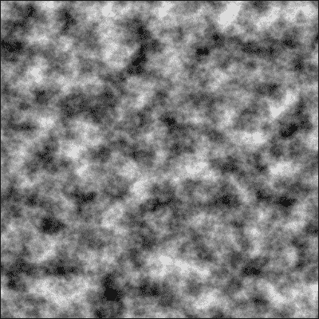
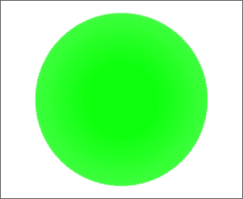
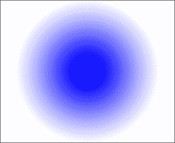
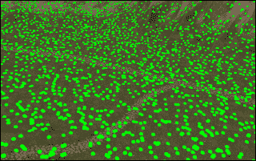
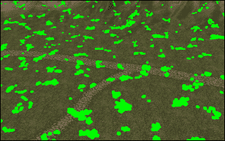
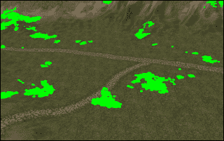
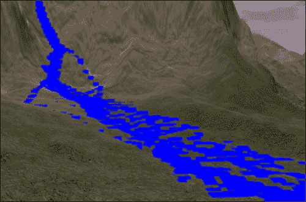
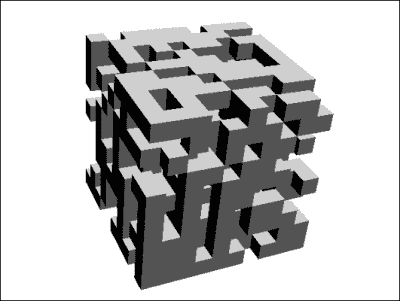

# 第三章 世界构建

在本章中，在我们超越基础知识并讨论更高级的技术之前，我们将探讨生成基于代码的世界及其光照的一些基本原理。

本章包含以下配方：

+   使用噪声生成地形

+   点亮你的世界并提供动态灯光

+   实时变形地形

+   自动化树木的分布

+   无尽的世界和无限的空间

+   使用细胞自动机流动的水

+   基于立方体的世界的要素

# 简介

在第一章中，*SDK 游戏开发中心*，我们使用了地形编辑器手动创建高度图，并使用场景组合器将事物组合成场景。这些是 jMonkeyEngine 中创建世界的两种方式。在本章中，我们将探讨使用代码或过程生成来创建世界。这通常可以非常快速地设置，但要正确（并且高效）地设置可能很棘手。为了实现这一点，我们将利用自定义网格和批处理等技术。批处理是一种使用相同的 `Material` 实例获取多个几何形状的方法，并将所有这些几何形状创建成一个网格。这可以显著提高应用程序的性能。

# 使用噪声生成地形

虽然噪声在许多情况下是不受欢迎的，但它是一种很好的过程生成工具，并且有许多用途。在本配方中，我们将探索 jMonkeyEngine 的 `FractalSum` 类，并基于输出生成一个图像。这可以用作地形的 _heightmap_，但我们并不局限于这一点。通过一些调整，我们可以得到一个覆盖森林或城市的基线。



## 准备工作

这个配方依赖于一种输出图像的方法。或者使用你自己的方法来完成此操作，或者参考附录中的*ImageGenerator 类*部分，*信息片段*，它提供了一个如何做到这一点的示例。

## 如何做到这一点...

要生成一个高度图，请执行以下步骤：

1.  我们将首先创建一个名为 `NoiseMapGenerator` 的类。

1.  在其构造函数中，定义一个新的 `FractalSum` 实例，并将其存储在名为 `fractalSum` 的字段中。

1.  接下来，创建一个名为 `generateNoiseMap` 的公共方法，该方法接受一个名为 `size` 的整数参数，一个名为 `frequency` 的浮点参数，以及一个名为 `octaves` 的整数参数作为输入。

1.  在方法内部，使用一些值配置 `fractalSum`，并将振幅设置为 `0.5f`，如下所示：

    ```java
    fractalSum.setFrequency(frequency);
    fractalSum.setAmplitude(0.5f);
    fractalSum.setOctaves(octaves);
    ```

1.  然后，定义一个名为 `terrain` 的 2D 浮点数组。其维度应为 [size] x [size]。

1.  现在，创建一个双重 `for` 循环语句，遍历两个维度的尺寸。在循环内部，我们从 `fractalSum` 获取值，该值基于你的 *x* 和 *y* 坐标；将 `0.5f` 添加到值中。将其夹在 `0f` 和 `1f` 之间，并将值按以下方式设置在地形数组中：

    ```java
    for(int y = 0; y < size; y++){
      for(int x = 0; x < size; x++){
        float value = fractalSum.value(x, 0, y) + 0.5f;
        value = FastMath.clamp(value, 0f, 1f);
        terrain[x][y] = value;
      }
    }
    ```

1.  当你完成时，调用`ImageGenerator`类为我们创建 PNG 图像，如下所示：

    ```java
    ImageGenerator.generateImage(terrain);
    ```

## 它是如何工作的...

通过这个简单的实现，并使用提供的`ImageGenerator`类，我们有了高度图的基础。我们可以在`Projects`文件夹下的`assets/Textures/heightmap.png`中看到结果。这是一张在亮区和暗区之间平滑过渡的图像；在这里，亮区代表高地，暗区代表低地。亮像素的值接近 1，而暗像素的值接近 0。通常，噪声输出值在-1 和 1 之间。这就是我们为什么将振幅改为 0.5f，以便得到-0.5 和 0.5 的范围，然后我们将 0.5 加到结果上。

一个明显的问题是，无论我们如何改变噪声的速度和频率，都会出现相同类型的起伏地形，只是规模不同。通过改变八度音的值，我们将以递减振幅的方式生成多个迭代的噪声。每个迭代的每个像素值都乘以前一个迭代。结果被称为分形噪声。使用八度音是一种通过迭代结果并使用不同频率来增加细节的方法。对于每个迭代，频率翻倍，振幅减半。

频率可以被视为一个尺度值，其中较高的频率会产生更多更小的特征。仅仅拥有较高的频率本身会使峰值和谷值出现得更频繁。

对于高度图来说，归一化过程不是必需的，除非我们想将其保存为图像。此外，如果我们正在生成大量高度图（例如，在游戏的运行时），我们不想根据特定高度图的最小和最大值来归一化地形，否则我们最终会得到非常相似和多山的地形。

## 还有更多...

现在我们已经生成了高度图并将其导出为图像，我们实际上可以在地形编辑器中使用它作为基础。这个过程与我们创建场景中的地形的过程相似，在第一章，*SDK 游戏开发中心*。

在创建一个新的场景（无论如何，我们也可以使用现有的场景）并打开它后，我们可以在**场景资源管理器**窗口中的主节点上右键单击，并选择**添加空间..**然后选择**地形..**。

我们选择与我们的图像像素相同的总大小是很重要的。然后，在**高度图**屏幕上，我们从**高度图**下拉菜单中选择**基于图像**，并选择我们的图像。

**粗糙度**滑块将定义在将其添加之前高度图将被平滑到什么程度。更高的平滑度会去除更细的细节，如果我们想要在上面奔跑或驾驶的角色，这是必须的。

**高度比例**选项将定义高度图可以拥有的最大海拔，并相应地进行缩放。

# 照亮你的世界并为它提供动态灯光

这个配方将主要涉及不同照明类型的理论，但我们也会探讨一种轻松控制灯光移动的方法。

我们可以用以下四种主要类型的光照亮我们的世界：

+   **环境光**：它均匀照亮场景中的所有物体。它有助于避免任何物体处于漆黑的状态，但它不会创建任何阴影或细微差别。添加过于明亮的环境光会使世界看起来平淡无奇，而给它一点颜色可以设定氛围。

+   **方向光**：它从特定方向以完美平行的光线照射，没有任何减弱。这通常用来模拟远处的明亮光源，如太阳。

+   **点光源**：它在所有方向上均匀发光，但会减弱，这意味着它最终会停止照亮周围环境。通常，这构成了游戏场景中大部分的光源。

+   **聚光灯**：正如其名，它从特定位置沿特定方向产生锥形光，其光线最终会减弱。它比其兄弟光类型有更多设置。技术上，它比点光源更先进，需要在着色器中进行额外的计算以确定它照亮了什么。

具有相同`spotInnerAngle`和`spotOuterAngle`参数的聚光灯将产生如下形状的光锥：



`spotInnerAngle`和`spotOuterAngle`参数定义了聚光灯产生的光锥的大小，并且两者都是以弧度为单位设置的。`spotInnerAngle`参数定义了锥形在其最大辐射强度处会照射多远。`spotOuterAngle`参数然后定义了辐射完全熄灭之前辐射的总范围应该有多远。`spotOuterAngle`参数的值越大，聚光灯的边缘就会越柔和。具有较小的`spotInnerAngle`参数和较高的`spotOuterAngle`参数的聚光灯将具有更柔和的边缘，如下面的图像所示：



为了确保一个物体受到场景中灯光的影响，它必须有一个支持它的`Material`类。对于大多数游戏对象，默认选择是**照明**材质。它支持从逐像素到光照贴图和顶点照明的各种照明类型。后两种是可选的，但有其用途。

光照贴图本质上是一个额外的纹理，其中已经预先渲染了光照。其分辨率很少能与实时光照相匹配，但从另一个角度来看，它非常快，因为不需要在运行时计算光照；此外，它可以用于静态场景。

通常，光照是按像素计算的。这意味着对于屏幕上每个可见的像素，处理器都必须计算它如何受到可用光源的影响。这相当昂贵，尤其是在许多光源的情况下，但它会产生更逼真的结果。顶点光照则意味着光照是按模型上的每个顶点计算的。对于低多边形模型，这要快得多，尽管细节不够丰富。当它靠近物体时，质量会明显下降，但它可以为远离物体的物体提供足够好的结果。

## 如何做到这一点...

现在我们已经了解了基础知识，让我们探索一种允许我们使用场景图中的对象移动灯光的模式：

1.  首先，创建一个新的`PointLight`类，命名为`pointLight`，并将`radius`设置为`40`。

1.  然后，调用`rootNode.addLight(pointLight)`将其添加到场景图中。

1.  现在，创建一个新的`CameraNode`，命名为`camNode`，然后在将其附加到`rootNode`之前调用`camNode.setControlDir(CameraControl.ControlDirection.CameraToSpatial);`。

1.  接下来，创建一个新的`LightControl`，命名为`lightControl`，向其中提供`pointLight`以指示这是要控制的灯光，如下面的代码所示：

    ```java
    LightControl lightControl = new LightControl(pointLight);
    ```

1.  我们将`controlDir`设置为`LightControl.ControlDirection.SpatialToLight`。这意味着空间`camNode`将控制光的位置：

    ```java
    lightControl.setControlDir(LightControl.ControlDirection.SpatialToLight);
    ```

1.  最后，我们将`lightControl`添加到`camNode`。

1.  为了测试这个功能，我们可以从 jMonkeyEngine 的`test-data`库中加载**Sponza**（Models/Sponza/Sponza.j3o），并将其**照明**材质应用到它上面。

## 它是如何工作的...

在场景图中，灯光不是`Spatials`，移动它们可能会很棘手。它可以添加到节点上，但这样它就只能照亮它所添加的节点（及其子节点）。`LightControl`类填补了这一空白，因为它可以作为控制添加到`Spatial`，并控制光的位置（以及方向）。在这个菜谱中，我们使用它让灯光跟随`CamNode`移动，但这同样适用于任何其他`spatial`。

## 还有更多...

在第一章的*添加天空盒和照明*菜谱中，我们提到了**环境光**和**方向光**，在*SDK 游戏开发中心*。在第九章的*创建带有移动太阳的动态天空盒*菜谱中，*将我们的游戏提升到下一个层次*，我们创建**方向光**来模拟昼夜循环。

# 实时变形地形

可变形地形可能会对游戏玩法产生严重影响，或者它可能仅仅是一个外观上的加分项。它可以用于撞击坑或需要挖掘的游戏。

我们将以`Control`类模式为基础进行变形，因为这允许我们以可管理和可重用的方式偏移代码。这个菜谱将根据鼠标点击触发变形，并使用射线检测碰撞点。

## 准备工作

为了快速启动，除非已经有应用程序应用这个功能，否则 jMonkeyEngine 的测试用例中的 `TestTerrain.java` 将为我们提供良好的起点。这个示例将扩展该应用程序中提供的代码，但它应该与任何基于地形的程序完美兼容。

## 如何做到...

在已经设置好基础应用程序的情况下，我们可以直接进入创建控制模式：

1.  创建一个名为 `DeformableControl` 的新类，它扩展了 `AbstractControl`。它需要一个名为 `terrain` 的私有地形字段。

1.  覆盖 `setSpatial` 方法并将 `Spatial` 强制转换为适合你的地形字段；使用 `terrain = (Terrain) spatial;` 来实现这一点。

1.  创建一个名为 `deform` 的方法，它接受 2D 位置、变形半径和力作为输入。同时，声明两个列表，我们将在 `heightPoints` 和 `heightValues` 方法中使用，如下所示：

    ```java
    public void deform(Vector2f location, int radius, float force) {
      List<Vector2f> heightPoints = new ArrayList<Vector2f>();
      List<Float> heightValues = new ArrayList<Float>();
    ```

1.  现在，我们应该创建一个嵌套的 `for` 循环语句，我们可以从 `-radius` 迭代到 `+radius`，在 `x` 和 `y` 方向上（`z` 应该是正确的）。看看点离中心的距离，并计算在该位置改变的高度。冲击力的减少将与它离中心的距离成正比。然后，按照以下方式将点保存到 `heightPoints` 列表和新高度保存到 `heightValues` 列表中：

    ```java
    for(int x = -radius; x < radius; x++){
      for(int y = -radius; y < radius; y++){
        Vector2f terrainPoint = new Vector2f(location.x + x, location.y + y);
        float distance = location.distance(terrainPoint);
        if(distance < radius){
          float impact = force * (1 - distance / radius) ;
          float height = terrain.getHeight(terrainPoint);
          heightPoints.add(terrainPoint);
          heightValues.add(Math.max(-impact, -height));
        }
      }
    }
    ```

1.  为了总结这个方法，我们需要应用新的高度。首先，解锁地形，然后按照以下方式重新锁定：

    ```java
    terrain.setLocked(false);
    terrain.adjustHeight(heightPoints, heightValues);
    terrain.setLocked(true);
    ```

1.  由于我们通常使用 3D 向量而不是 2D 向量，创建一个名为 `deform` 的便利方法可能是个好主意，它接受 `Vector3f` 作为输入。它将这个输入转换为 `Vector2f`，然后调用其他变形方法，如下所示：

    ```java
    public void deform(Vector3f location, int radius, float force){
      Vector2f pos2D = new Vector2f((int)location.x, (int)location.z);
      deform(pos2D, radius, force);
    }
    ```

1.  现在，从我们应用程序中的方法触发变形。首先，它应该创建一个新的 `ray` 实例，该实例从相机开始，如下面的代码所示：

    ```java
    Ray ray = new Ray(cam.getLocation(), cam.getDirection());
    ```

1.  接下来，创建一个新的 `CollisionsResults` 对象并检查射线是否与地形相交。如果有碰撞，通过提供碰撞的 `contactPoint` 参数在地形的 `DeformableControl` 对象上调用 `deform`，如下所示：

    ```java
    CollisionResults cr = new CollisionResults();
    terrain.collideWith(ray, cr);
    CollisionResult collision = cr.getClosestCollision();
    if(collision != null){
      terrain.getControl(DeformableControl.class).deform(coll.getContactPoint(), 30, 30f);
    }
    ```

## 它是如何工作的...

在变形地形时，我们收集我们想要修改的所有点和新的高度到列表中；然后，根据它们集体更新地形。还有一个 `adjustHeight` 方法可以更新单个点，但假设使用列表更快。

锁定地形意味着渲染更快。是否锁定地形取决于实现方式。如果地形是每帧都变化的，可能不需要锁定。另一方面，如果它只是偶尔变化，可能需要锁定。

用于计算高度变化的公式是 *deltaHeight = force * (1 - distance / radius)*。这意味着当它最接近中心时，高度变化将最大；随着距离的增加，它将线性下降，直到接近半径的边缘。一个值得探索的变体是使用 *deltaHeight = force * FastMath.sqrt(1 - distance / radius)* 的根。这将给地形提供一个更圆滑的形状。

# 自动化树木分布

在编辑器中放置树木和灌木对于许多类型的游戏来说是可以的。有许多情况下需要对象位于非常特定的位置。当涉及到大规模户外游戏时，你可能想要有一种方法以自动方式放置常见对象，至少作为一个基础。然后，艺术家或设计师可能会根据游戏的需求移动项目。

在这个菜谱中，我们将创建一种使用噪声放置树木的方法。一旦基础设置完成，我们将看看如何通过不同的设置来改变模式。

## 如何做到这一点...

要产生自动树木分布，执行以下步骤：

1.  我们直接到达事物的中心。创建一个新的类，命名为 `TreeControl`，它扩展了 `AbstractControl`。

1.  添加一个名为 `terrain` 的 `TerrainQuad` 字段，一个名为 `fractalSum` 的 `FractalSum` 字段，一个名为 `treeModel` 的 `Spatial` 字段，以及一个名为 `treeNode` 的 `BatchNode` 字段。

1.  重写 `setSpatial` 方法。在这里，我们声明 `treeNode`。

1.  然后，假设提供的 `Spatial` 是一个 `Node` 类，解析其子项以查找一个 `Spatial`，它是 `TerrainQuad` 的实例。一旦找到，按照以下方式将其设置为 `terrain`：

    ```java
    for(Spatial s: ((Node)spatial).getChildren()){
      if(s instanceof TerrainQuad){
        this.terrain = (TerrainQuad) s;
    ```

1.  使用地形的 `terrainSize` 创建一个嵌套的 `for` 循环语句，从其负高度和宽度解析到其正高度和宽度。

1.  在这个循环中，根据 *x* 和 *y* 坐标从 `fractalSum` 类中获取一个值。然后，按照以下方式查找该位置的相应地形高度：

    ```java
    float value = fractalSum.value(x, 0, y);
    float terrainHeight = terrain.getHeight(new Vector2f(x, y)); 
    ```

1.  现在，我们需要决定我们想要多少棵树。`FractalSum` 类生成介于 -1 和 1 之间的值。首先，可以说任何大于 0.5 的值都应该生成一棵树，并相应地创建一个 `if` 语句。

1.  如果满足条件，首先克隆 `treeModel`。将其 `localTranslation` 设置为 *x* 和 *y* 坐标以及当前的 `terrainHeight` 字段，然后将其附加到 `treeNode` 字段：

    ```java
    Spatial treeClone = treeModel.clone();
    Vector3f location = new Vector3f((x), terrainHeight, (y));
    treeClone.setLocalTranslation(location);
    treeNode.attachChild(treeClone);
    ```

1.  解析完整个地形后，告诉 `treeNode` 字段批量处理其内容以优化性能，然后将其附加到提供的 `Spatial`。

1.  现在，创建一个应用程序类来测试这个功能。建议使用 `TestTerrainAdvanced` 这样的测试用例来开始。

1.  创建一个新的 `Node` 类，命名为 `worldNode`，将其附加到 `rootNode` 上，然后将地形附加到它。

1.  然后，创建一个新的 `TreeControl` 类，并加载并设置一个合适的模型，我们可以将其用作 `treeModel`。

1.  最后，将 `TreeControl` 类添加到 `worldNode` 中。

运行应用程序后，我们将看到树木在地面上的分布——在山谷以及山顶上。根据环境，树木可能不会在山上生长。如果我们不希望这样，我们可以在`TreeControl`类中添加一个简单的检查。通过添加一个名为`treeLimit`的字段，我们可以限制树木在特定高度以上的生长；同时，确保`terrainHeight`字段低于从`fractalSum`提供的值。

## 它是如何工作的...

在这个例子中，我们让噪声为我们做大部分工作。我们所做的只是解析地形，并在固定间隔检查该点的噪声值是否表示应该放置树木。

噪声为我们植被的分布提供了几乎无限的变化，以及同样无限的可调整可能性。

使用这些自动生成技术的缺点是我们无法对它们进行适当的控制，即使改变一个值非常微小，也可能对地形产生重大影响。此外，即使生成过程成本低廉且可以重复确定，我们一旦想要以任何方式修改数据，就必须立即开始存储它。

## 还有更多...

在当前设置下，示例将树木以看似随机的模式分布在整个景观中。乍一看，这可能看起来很自然，但树木很少分布得如此均匀。在森林之外，你通常会找到树木聚集在一起。我们可以通过改变频率轻松地通过噪声实现这一点。以下示例显示了如何通过改变频率来改变模式：

+   频率为 0.5 产生一个非常嘈杂且相当均匀的模式，如下面的截图所示：

+   频率为 0.1 时，我们可以区分不同的模式如下：

+   频率为 0.02 产生更少但更大的植被簇，如下所示：

# 无尽的世界和无尽的空间

在计算机生成的世界中，实际上并没有无尽或无限的东西。迟早你会遇到一个或另一个限制。然而，有一些技术可以使你走得更远。创建游戏时的常规方法是在游戏世界中移动玩家。那些尝试过，例如，以这种方式制作太空探索游戏的人会发现，很快就会出现与浮点数相关的问题。这是因为浮点值不是均匀分布的。随着它们的值增加，它们的精度会降低。使用双精度浮点数而不是单精度浮点数只会推迟不可避免的事情。

如果连一个按人类尺度游戏世界的太阳系都无法拥有，那么如何拥有整个星系呢？正如一句古老的谚语所说：“如果穆罕默德不去山，山就必须到穆罕默德那里。”这正是我们第一个问题的解决方案！通过让游戏世界围绕玩家移动，我们确保了精度保持很高。这对于大规模游戏世界来说非常好。缺点是它需要一个不同的架构。在开发中期切换游戏世界的生成或加载方式可能是一项巨大的任务。最好在设计阶段就决定这一点。

另一个问题是世界的大小。您不能一次性将一个相当大的基于地形的游戏世界存储在内存中。我们可以通过按需加载世界数据并在不再需要时丢弃它来解决此问题。这个配方将使用一种简单的方法按需生成世界，但这个原理也可以应用于其他方法，例如生成高度图或从存储设备加载世界。

## 如何做到这一点...

可以通过以下步骤创建动态世界加载：

1.  创建一个名为`EndlessWorldControl`的新类。它应该扩展`AbstractControl`并实现`ActionListener`接口。

1.  我们还需要添加一些字段。首先，我们需要跟踪应用程序的摄像机并将其存储在一个名为`cam`的参数中。该类还需要一个名为`currentTile`的`Geometry`参数来表示当前中心的游戏区域。一个名为`material`的`Material`参数将用于几何形状，一个名为`cachedTiled`的`HashMap<Vector2f, Geometry>`参数将存储整个当前活动的游戏世界。

1.  该类实现了`ActionListener`接口，并将根据用户输入处理移动。为此，还需要添加四个布尔值：`moveForward`、`moveBackward`、`moveLeft`和`moveRight`。

1.  在`onAction`方法中，添加以下代码来根据输入设置布尔值：

    ```java
    if (name.equals("Forward")) moveForward = isPressed;
    else if (name.equals("Back")) moveBackward = isPressed;
    else if (name.equals("Left")) moveLeft = isPressed;
    else if (name.equals("Right")) moveRight = isPressed;
    ```

1.  在`controlUpdate`方法中，根据摄像机的方向和您刚刚创建的布尔值移动瓦片。首先，获取摄像机的当前前进方向和它左侧的方向。然后，将其乘以`tpf`以获得均匀的运动和任意值来增加运动速度，如下所示：

    ```java
    Vector3f camDir = cam.getDirection().mult(tpf).multLocal(50);
            Vector3f camLeftDir = cam.getLeft().mult(tpf).multLocal(50);
    ```

1.  使用这个，如果应该发生任何移动，就调用一个名为`moveTiles`的方法，如下所示：

    ```java
    if(moveForward) moveTiles(camDir.negate());
    else if (moveBackward) moveTiles(camDir);
    if(moveLeft) moveTiles(camLeftDir.negate());
    else if (moveRight) moveTiles(camLeftDir);
    ```

1.  现在，添加一个名为`moveTiles`的方法，它接受一个名为`amount`的`Vector3f`对象作为输入。首先，遍历`cachedTiles`映射的值，并按以下方式应用数量值：

    ```java
    for(Geometry g: cachedTiles.values()){
      g.move(amount);
    }
    ```

1.  然后，创建一个`Iterator`对象，再次遍历`cachedTiles`；如果任何瓦片包含`Vector3f.ZERO`，即摄像机的位置，则停止迭代。这就是我们的新`currentTile`对象。这可以按以下方式实现：

    ```java
    Vector2f newLocation = null;
    Iterator<Vector2f> it = cachedTiles.keySet().iterator();
    while(it.hasNext() && newLocation == null){
      Vector2f tileLocation = it.next();
      Geometry g = cachedTiles.get(tileLocation);
      if(currentTile != g && g.getWorldBound().contains(Vector3f.ZERO.add(0, -15, 0))){
        currentTile = g;
        newLocation = tileLocation;
      }
    }
    ```

1.  这个瓦片的位置将用于决定应该加载哪些其他瓦片。将其传递给两个新方法：`updateTiles`和`deleteTiles`。

1.  首先，我们来看看 `updateTiles` 方法。它接受一个名为 `newLocation` 的 `Vector2f` 参数作为输入。创建一个嵌套的 `for` 循环，从 `x-1` 和 `y-1` 到 `x+1` 和 `y+1`。

1.  检查 `cachedTiles` 是否已经具有 `newLocation` 和 `x` 和 `y` 组合的瓷砖。如果没有，我们创建一个新的瓷砖并应用与瓷砖大小相同的 `BoundingBox`：

    ```java
    Vector2f wantedLocation = newLocation.add(new Vector2f(x,y));
    if(!cachedTiles.containsKey(wantedLocation)){
      Geometry g = new Geometry(wantedLocation.x + ", " + wantedLocation.y, new Box(tileSize * 0.5f, 1, tileSize * 0.5f));
    ```

1.  我们将位置设置为从 `newLocation` 的增量距离。如果 `currentTile` 不为空，我们还要添加其 `localTranslation`：

    ```java
    Vector3f location = new Vector3f(x * tileSize, 0, y * tileSize);
    if(currentTile != null){
      location.addLocal(currentTile.getLocalTranslation());
    }
    g.setLocalTranslation(location);
    ```

1.  最后，将 `g` 附接到控制器的空间，并将 `g` 放入以 `wantedLocation` 为键的 `cachedTiles` 映射中。

1.  现在，对于 `deleteTiles` 方法，它也接受一个名为 `newLocation` 的 `Vector2f` 参数作为输入。

1.  与 `updateTiles` 方法类似，遍历 `cachedTiles` 映射。寻找现在在任一方向上超过两个瓷砖距离的瓷砖，并将它们的地址添加到名为 `tilesToDelete` 的列表中：

    ```java
    Iterator<Vector2f> it = cachedTiles.keySet().iterator();
    List<Vector2f> tilesToDelete = new ArrayList<Vector2f>();
    while(it.hasNext()){
      Vector2f tileLocation = it.next();
      if(tileLocation.x>newLocation.x + 2 || tileLocation.x<newLocation.x - 2 || tileLocation.y>newLocation.y + 2 || tileLocation.y<newLocation.y - 2){
        tilesToDelete.add(tileLocation);
      }
    }
    ```

1.  当你完成时，只需遍历 `tilesToDelete` 列表，从 `cachedTiles` 中删除瓷砖，并将其从 `Spatial` 中分离。

1.  在离开类之前，我们还需要做一件事。在 `setSpatial` 方法中，我们应该调用 `updateTiles`，并给它提供 `Vector2f.ZERO` 以初始化瓷砖的生成。

    对于更大的实现，我们可能希望引入一个 `AppState` 实例来处理这个问题，但在这里我们将使用测试应用程序来管理它。

1.  首先，我们需要使用 `flyCam.setEnabled(false)` 禁用 `flyCam`，并可能将相机移动到离地面一定距离的位置。

1.  然后，创建一个名为 `worldNode` 的 `Node` 类和一个名为 `worldControl` 的 `EndlessWorldControl` 实例。将 `worldNode` 附接到 `rootNode` 上，在将其添加到 `worldNode` 并设置相机之前，向 `worldControl` 对象提供一个材质。

1.  最后，设置一些键来控制移动，并将 `worldControl` 对象作为监听器添加；有关如何操作的代码，请参考以下内容：

    ```java
    inputManager.addMapping("Forward", new KeyTrigger(KeyInput.KEY_UP));
    inputManager.addMapping("Back", new KeyTrigger(KeyInput.KEY_DOWN));
    inputManager.addMapping("Left", new KeyTrigger(KeyInput.KEY_LEFT));
    inputManager.addMapping("Right", new KeyTrigger(KeyInput.KEY_RIGHT));
    inputManager.addListener(worldControl, "Forward", "Back", "Left", "Right");
    ```

## 它是如何工作的...

我们遵循的过程是，如果发生移动，`moveTiles` 方法将首先将所有瓷砖移动到 `cachedTiles`。然后检查是否有一个新的瓷砖应该是中心或是否应该是 `currentTile`。如果发生这种情况，必须检查其他瓷砖，以确定哪些应该保留，哪些需要生成。这发生在 `updateTiles` 方法中。链的最后一部分是 `deleteTiles` 方法，它检查哪些瓷砖应该被移除，因为它们离得太远。

如果我们打印出瓷砖的平移，我们可以看到它们永远不会离其父节点的中心太远。这是因为当我们生成瓷砖时，我们是相对于 `currentTile` 来放置它们的。由于 `currentTile` 也是基于相对位置，所以事物永远不会移动得太远。这几乎就像一个传送带。

# 使用细胞自动机流动的水

细胞自动机是一个由细胞组成的 n 维集合，这些细胞根据一组给定的规则相互交互。随着时间的推移，这些交互产生了模式，修改规则将修改模式。最著名的例子可能是康威的生命游戏，其中基于极其简单的规则集的细胞创造了最令人惊叹、不断演变的模式。在游戏中，细胞自动机通常用于模拟基于瓦片或块的游戏世界中的液体。

在这个食谱中，我们将探索一个基于 2D 网格的液体系统。由于它是 2D 的，所以不可能有真正的瀑布，但它仍然可以应用于高度图（我们将展示），以创建看起来自然的河流。

当细胞自动机规模较大时，性能会成为一个问题，这一点在它们放大时会变得明显。为了解决这个问题，我们还将探讨几种不同的技术来降低资源消耗。以下图片显示了水沿着山坡流下：



## 准备工作

这个食谱需要高度差异来使其变得有趣。一个高度图将非常有效。

我们将开发的模型将围绕由两个参数定义的细胞展开：它所在地面的高度和其中的水量。如果高度和水量之和高于相邻的细胞，水将从这个细胞流出并流入其邻居。为了确保细胞同时更新，所有流入一个细胞的水都将存储在一个单独的字段中，并在更新周期结束时应用。这确保了水只能在一次更新中通过一个瓦片移动。否则，同一个单位的水可能会在我们遍历瓦片时在一个更新周期内穿越整个网格。

示例中提到了一个`CellUtil`类。这个类的代码可以在附录中的*`The CellUtil class`部分找到，信息片段。

## 它是如何工作的...

以下步骤将产生流动的水：

1.  首先，让我们创建一个包含细胞逻辑的类。我们可以称它为`WaterCell`。它需要一个名为`amount`的浮点字段，另一个名为`terrainHeight`的浮点字段，以及一个表示当前流向方向的整数字段。它还应该在名为`incomingAmount`的浮点字段中存储任何进入的水。

1.  除了`amount`的正常获取和设置方法外，添加一个名为`adjustAmount`的方法，该方法接受一个名为`delta`的浮点变量作为输入。`delta`变量应添加到`amount`中。

1.  创建一个名为`compareCells`的方法，该方法将在细胞之间移动水。它接受另一个细胞（水来自该细胞）作为输入。

1.  该方法首先检查两个细胞之间的高度差，如下所示：

    ```java
    float difference = (otherCell.getTerrainHeight() + otherCell.getAmount()) - (terrainHeight + amount);
    ```

1.  该方法只会以单向移动水：从提供的细胞到这个细胞，因此它只有在差异为正（并且高于一个任意的小量）时才会起作用。

1.  如果是这样，它取两个单元格之间差值的一半，因为这会使两个单元格之间的数量相等。在应用之前，确保我们不会移动比原始单元格中已有的水更多的水：

    ```java
      amountToChange = difference * 0.5f;
      amountToChange = Math.min(amountToChange, otherCell.getAmount());
    ```

1.  将计算出的结果添加到 `incomingAmount` 字段（我们不会更新这个数量，直到一切都已计算完毕）。

1.  然而，我们必须从原始单元格中扣除相同的数量，否则就会有一个永无止境的水源。操作如下所示：

    ```java
    otherCell.adjustAmount(-amountToChange);
    ```

1.  最后，从这个方法中返回扣除的数量。

1.  我们现在可以暂时放下这个类，专注于创建一个将使用这个类的控件。创建一个名为 `WaterFieldControl` 的新类，它扩展了 `AbstractControl`。

1.  它需要两个整数字段来控制字段的宽度和高度，以及一个名为 `waterField` 的 2D `WaterCell` 数组。为了显示它，我们将添加一个名为 `water` 的 `Node` 类和一个名为 `material` 的 `Material` 类。

1.  应该重写 `setSpatial` 方法，并且传递给 `spatial` 变量的实例必须是 `Node` 类型。在其子节点中查找地形；一旦找到，用 `WaterCells` 填充 `waterField`，并为每个瓦片应用地形的以下高度：

    ```java
    for(int x = 0; x < width; x++){
      for(int y = 0; y < height; y++){
        WaterCell cell = new WaterCell();cell.setTerrainHeight(((Terrain)s).getHeight(new Vector2f(x, y)));
        waterField[x][y] = cell;
      }
    }
    ```

1.  现在，创建一个名为 `updateCells` 的新方法。在这个例子中，定义一个永远不会耗尽的水源，通过将中间瓦片之一的水量设置为 1。

1.  然后，通过嵌套的 `for` 循环遍历 `waterField` 数组中的每个单元格。

1.  如果单元格的数量大于 0，我们可以继续检查我们应该从哪里开始移动水。从单元格的方向开始，如果检查一个方向后还有水剩余，继续检查其他七个方向。实现可能如下所示：

    ```java
    WaterCell cell = waterField[x][y];
      float cellAmount = cell.getAmount();
      if(cellAmount > 0){
        int direction = cell.getDirection();
        for(int i = 0; i < 8; i++){
          int[] dir = CellUtil.getDirection((direction + i) % 8);
    ```

1.  对于这些方向中的每一个，我们首先必须检查它是否在字段内的有效位置。然后，检索相邻的单元格并调用 `compareCells` 尝试向其中倾倒水。如果这个尝试成功，将 `neighborCell` 对象的方向设置为测试的方向以表示水的流动，如下所示：

    ```java
    WaterCell neighborCell = waterField[x+dx][y+dy];
    if(cell.getAmount() > 0.01){
      floatadjustAmount = neighborCell.compareCells(cell);
      if(adjustAmount > 0){neighborCell.setDirection(CellUtil.getDirection(dx, dy));
      }
    }
    ```

1.  在退出方法之前，再次遍历 `waterField` 数组。这次将 `incomingWater` 添加到单元格的当前数量中，然后将 `incomingWater` 设置为 `0`。

1.  为了处理结果的显示，创建一个名为 `createGeometry` 的新方法。

1.  我们需要做的第一件事是检查控制器的 `Spatial` 是否有一个名为 **Water** 的子节点。如果有，将其断开连接。

1.  接下来，定义一个新的名为 `water` 的 `Node` 类。它的名字应该是 `Water`，因为在这个例子中这是一个标识符：

    ```java
    water = new Node("Water");
    ```

1.  再次解析 `waterField` 数组。如果任何单元格的数量超过 0，你应该添加一个表示它的 `Geometry` 对象。

1.  我们将向 `getGeometry` 方法添加一些逻辑，以避免不必要地重新创建 `Geometry` 字段。首先，如果 `amount` 值为 0，将 `geometry` 设置为 `null`。

1.  否则，如果`geometry`为 null，创建一个新的具有类似盒子形状的`geometry`实例，如下所示：

    ```java
    geometry = new Geometry("WaterCell", new Box(1f, 1f, 1f));
    ```

1.  为了适应我们拥有的水量，通过输入以下代码来缩放生成的立方体：

    ```java
    geometry.setLocalScale(1, 1f + amount, 1);
    ```

1.  然后，返回`geometry`字段，它可能为 null。

1.  回到`WaterFieldControl`类，如果返回的`geometry`变量不为 null，设置其位置并将其附加到`water`节点，如下所示：

    ```java
    g.setLocalTranslation(x, -1f + cell.getTerrainHeight() + cell.getAmount() * 0.5f, y);
    water.attachChild(g);
    ```

1.  将材质应用到`water`节点，然后批量处理以提高性能，在将其附加到控制器的`spatial`之前，如下所示：

    ```java
    water = GeometryBatchFactory.optimize(water, false);
    water.setMaterial(material);
    ((Node)spatial).attachChild(water);
    ```

1.  为了完成这个任务，更新`controlUpdate`方法以调用`updateCells`和`createGeometry`。

1.  现在，这可以通过在应用程序类中几行代码来实现。首先，创建一个新的`WaterFieldControl`类，我们将将其添加到一个包含`Terrain`实例的`Node`类中。

1.  接下来，我们需要创建水的材质。这可以像创建一个带有`Unshaded` `MaterialDefinition`的`Material`实例并将蓝色色调应用到它上，或者使用高级自定义着色器。然后，通过`setMaterial`方法将其应用到`WaterFieldControl`类。

## 它是如何工作的...

细胞自动机的美丽之处在于它们工作的简单性。每个细胞都有一组非常基本的规则。在这个例子中，每个细胞都希望与相邻的细胞平衡水位。随着迭代的进行，水会流向低处。

通常来说，使自动化运行起来相对容易，但要确保一切正确可能需要一些时间。例如，即使每个单元格的数量更新正确，如果流动的方向不正确，我们仍然会得到奇怪的水波效果。原因是水在新单元格中会倾向于一个特定的方向。这个方向可能与它来的方向相反，使其想要回到原来的单元格。在这种情况下，随机选择一个方向可能有效，但它会使预测行为变得更加困难。这就是为什么我们使用水来自单元格的方向。自然地，水会有一些动量，并且会继续流动，直到它被阻止。

最初可能难以理解的一点是，我们为什么不直接更新水量。原因是如果水从单元格 x 移动到单元格 x+1，一旦`update`方法到达那里，那水就会立即对 x+1 可用；它也可能被移动到 x+2 等等。我们不能将水视为实时，这就是为什么我们在应用流入的水之前，首先对所有的单元格执行出行的操作。同样，我们也不改变我们当前检查的单元格中的数量，原因相同。相反，我们将单元格中剩余的水移动到`incomingWater`字段。

这种方法的主要挑战通常与性能相关。计算可能很昂贵，渲染则更加昂贵。在这种系统中，它不断变化，我们可能被迫在每一帧中重新创建网格。单独渲染每个单元格很快就会变得不可能，我们必须使用批处理来创建单个网格。即使这样也不够，在这个例子中，我们存储了单元格的`geometry`字段，这样我们就不必在单元格中的水位为 0 时重新创建它。如果水位发生变化，我们还会缩放单元格的`geometry`字段，因为这比为它创建一个新的`Mesh`类要快得多。缺点是存储它所使用的额外内存。

我们还使更新每一帧中的水成为可选操作。通过将其降低到每秒一定数量的更新（实际上，就是其自身的帧率），我们可以极大地减轻性能的影响。还可以进一步通过每次只更新水场的部分区域来做到这一点，但必须采取措施来保存水的数量。我们还可以将场分成更小的批次，并检查是否需要重建其中的任何部分。

对于那些希望进一步探索的人来说，有一些方法。可以玩弄每个单元格共享的水量。这将使计算更加昂贵，但可能得到更平滑的结果。还可以添加压力作为参数，使水能够沿着斜坡向上移动。蒸发可能是一种从系统中移除水并清理主流动留下的任何积水的方法。

# 基于立方体的世界的要点

在这个配方中，我们将构建一个小的框架来生成优化的立方体网格，这可以用来创建大规模的世界。这个框架将包括一个用于处理用户操作的`AppState`对象，一个名为`CubeWorld`的类，它将存储地形数据，以及一个名为`CubeCell`的类，它将存储单个单元格的数据。此外，还有一个名为`CubeUtil`的类，它将帮助我们生成网格。

## 准备工作

这是一个高级配方，需要理解基本地形生成，这可以在本章前面的部分找到，以及网格的构建块以及如何创建自定义网格。

在我们开始之前，我们将创建一个名为`CubeUtil`的类，并填充一些我们稍后需要的数据。由于每个单元格都是箱形，我们可以从`Box`和`AbstractBox`类中借用一些字段，从而节省一些设置时间。只需将`GEOMETRY_INDICES_DATA`、`GEOMETRY_NORMALS_DATA`和`GEOMETRY_TEXTURE_DATA`字段复制到`CubeUtil`类中即可。

在类的底部，有一个名为 `doUpdateGeometryVertices` 的方法，其中包含一个浮点数组。也要复制这个浮点数组并调用其顶点。这个数组包含创建具有法线的立方体所需的 24 个顶点的数据。它反过来依赖于对八个原始顶点位置的引用。我们可以从 `AbstractBox` 类和 `computeVertices` 方法中获取这些信息。这里引用的 `Vector3f` 中心可以用 `Vector3f.ZERO` 替换。`xExtent`、`yExtent` 和 `zExtent` 参数可以用 `0.5f` 替换以获得边长为 `1f` 的正方形盒子。

## 如何做到这一点...

我们首先创建包含单元格数据的对象。这将包括以下七个步骤：

1.  首先，创建一个名为 `CubeCell` 的新类。

1.  它包含一个名为 `mesh` 的 `Mesh` 字段，一个包含六个布尔值的数组 `neighbors`，以及一个名为 `refresh` 的布尔值。

1.  此外，还有一个名为 `Type` 的枚举，我们可以在其中放置如 `Rock`、`Sand` 和 `Grass` 这样的名称。然后，添加一个名为 `type` 的 `Type` 字段。

1.  创建一个名为 `hasNeighbor` 的方法，它接受一个整数参数作为输入，并从数组中返回相应的布尔值。

1.  然后，添加一个名为 `setNeighbor` 的方法，它接受一个名为 `direction` 的整数参数和一个名为 `neighbor` 的布尔参数作为输入。如果当前位置的当前布尔值与邻居的布尔值不同，则在那个位置存储邻居并设置 `refresh` 为 `true`。

1.  添加一个名为 `requestRefresh` 的方法，将 `refresh` 设置为 `true`。

1.  对于网格，添加一个 `getMesh` 方法，并在其中，如果网格为空，则调用 `CubeUtil.createMesh` 方法，如果它为 `true`，则刷新它。这将也将 `refresh` 设置为 `false`，如下所示：

    ```java
    if(mesh == null || refresh){
      mesh = CubeUtil.createMesh(this);
      refresh = false;
    }
    return mesh;
    ```

现在，让我们回到 `CubeUtil` 类，在那里我们添加一些辅助方法来生成世界。本节有以下步骤：

1.  首先，添加一个名为 `createMesh` 的方法，它接受一个 `CubeCell` 参数作为输入。这个方法将为单元格创建一个网格，在这里你将使用我们在本菜谱的 *准备就绪* 部分中设置的数据。

1.  首先，使用以下代码行将顶点数据放置在网格中：

    ```java
    m.setBuffer(VertexBuffer.Type.Position, 3, BufferUtils.createFloatBuffer(vertices));
    ```

1.  向网格暴露的边添加索引，并检查邻居以查看它们是哪些。然后，使用 `GEOMETRY_INDICES_DATA` 将每个网格的六个索引（对于两个三角形）添加到一个列表中，如下所示：

    ```java
    List<Integer> indices = new ArrayList<Integer>();
    for(intdir = 0; dir < 6; dir++){
      if(!cube.hasNeighbor(dir)){
        for(int j = 0; j < 6; j++){
          indices.add(GEOMETRY_INDICES_DATA[dir * 6 + j]);
        }
      }
    }
    ```

1.  要将这些添加到网格中，首先将它们转换成一个数组。然后，将数组设置为索引缓冲区，如下所示：

    ```java
    m.setBuffer(VertexBuffer.Type.Index, 1, BufferUtils.createIntBuffer(indexArray));
    ```

1.  对于纹理坐标和顶点法线，只需简单地使用我们已设置的数据，如下所示：

    ```java
    m.setBuffer(VertexBuffer.Type.TexCoord, 2, BufferUtils.createFloatBuffer(GEOMETRY_TEXTURE_DATA));
    m.setBuffer(VertexBuffer.Type.Normal, 3, GEOMETRY_NORMALS_DATA);
    ```

1.  现在，将网格返回到调用方法。

1.  向 `CubeUtil` 类添加一个名为 `generateBlock` 的方法，并创建一个 `CubeCell` 的三维数组并返回它。它的原理与我们在 *使用噪声生成地形* 菜谱中创建的高度图相同，只是这里我们使用三个维度而不是两个。以下代码将按三维模式生成 `CubeCell` 类：

    ```java
    CubeCell[][][] terrainBlock = new CubeCell[size][size][size];
    for(int y = 0; y < size; y++){
      for(int z = 0; z < size; z++){
        for(int x = 0; x < size; x++){
          double value = fractalSum.value(x, y, z);
          if(value >= 0.0f){
            terrainBlock[x][y][z] = new CubeCell();
          }
        }
      }
    }
    ```

我们现在可以看看如何将这些两个类结合起来并开始生成一些立方体。这将在以下步骤中执行：

1.  我们将注意力转向将包含我们所有立方体信息的`CubeWorld`类。它有一个名为`world`的`Node`字段，一个名为`batchSize`的整数，一个名为`materials`的`Material`数组，以及在这个例子中，一个名为`terrainBlock`的单个`CubeCell[][][]`数组。

1.  在构造函数中初始化`worldNode`类后，创建一个名为`generate`的公共方法。在这个方法内部，调用`CubeUtil.generateBlock(4, batchSize)`并将其存储在`terrainBlock`中。

1.  然后，调用并创建另一个名为`generateGeometry`的方法，它将所有`CubeCell`类组合到一个`Node`类中。

1.  首先，检查`worldNode`类是否已经有一个具有给定名称的节点。如果有，将其断开连接。在任何情况下，创建一个新的具有我们检查的相同名称的`BatchNode`字段。

1.  现在，解析整个`terrainBlock`数组以及所有有`CubeCell`类的位置；我们将检查 6 个方向（它的每一侧）。对于每一侧，检查那里是否有邻居；如果位置不为 null，将有一个邻居。在这种情况下，在您正在检查的单元格上调用`setNeighbor`并供应当前的方向如下：

    ```java
      for(int y = 0; y < batchSize; y++){
        repeat for x and z
        if(terrainBlock[x][y][z] != null){
          for(inti = 0; i < 6; i++){
            Vector3f coords = CubeUtil.directionToCoords(i);
            if(coords.y + y > -1 && coords.y + y < batchSize){
              repeat for x and z
              if(terrainBlock[(int)coords.x + x][(int)coords.y y][(int)coords.z + z] != null){terrainBlock[x][y][z].setNeighbor(i, true);
              } else {terrainBlock[x][y][z].setNeighbor(i, false);
              }
            }
          }
        }
      }
    ```

1.  下一步是为`CubeCell`实例创建几何形状。通过再次解析`terrainBlock`字段来完成此操作，并在相应的`CubeCell`不为 null 的地方，通过调用`CubeCell'sgetMesh'`方法创建一个新的`Geometry`类。然后，使用我们正在迭代的`x`、`y`和`z`将其移动到正确的位置，并应用材质并将其附加到批处理节点，如下所示：

    ```java
    Geometry g = new Geometry("Cube", terrainBlock[x][y][z].getMesh() );
    g.setLocalTranslation(x, y, z);
    g.setMaterial(materials[0]);
    node.attachChild(g);
    ```

1.  最后，在`generateGeometry`方法中，调用`node.updateModelBound()`和`node.batch()`来优化它，在将其附加到`worldNode`之前。

1.  生成过程的基本现在已经到位，你可以创建一个新的类，称为`CubeWorldAppState`，它扩展了`AbstractAppState`。在这种情况下，添加一个名为`cubeWorld`的`CubeWorld`字段。

1.  覆盖`initialize`方法并声明一个新的`cubeWorld`实例。

1.  然后，根据**照明**材质的定义加载一个新的材质并将其提供给`cubeWorld`。在此之后，通过其 getter 方法调用`cubeWorld`并生成和附加`worldNode`。

1.  此外，添加一个光源以便看到任何东西，因为我们正在使用**照明**材质。

1.  现在，创建一个应用程序，我们将附加这个`Appstate`实例，我们应该能在世界中看到我们的`CubeCell`块。然而，它是静态的，而且通常我们希望改变世界。

让我们看看我们如何添加拾取和放置块的功能。以下图是结果地形块：



1.  在`CubeWorldAppState`中开始实现`ActionListener`以处理用户输入。添加一个名为`takenCube`的`CubeCell`字段来存储已被拾取的`CubeCell`字段。

1.  向`inputManager`添加映射以拾取和放置`CubeCell`字段。使用如下代码所示的手势的左键和右键：

    ```java
    inputManager.addMapping("take", new MouseButtonTrigger(MouseInput.BUTTON_LEFT));
    inputManager.addMapping("put", new MouseButtonTrigger(MouseInput.BUTTON_RIGHT));
    ```

1.  然后，创建一个名为`modifyTerrain`的方法，该方法接受一个名为`pickupCube`的布尔值作为输入。

1.  要控制拾取或瞄准的内容，请使用我们在第二章的*FPS 中的射击*食谱中建立的图案，*相机和游戏控制*。使用从相机出发并朝向相机方向移动的射线。

1.  现在，将其与`cubeWorld`类的`worldnode`类相碰撞。如果它碰撞到了某个物体，并且距离小于两个（或某个其他任意数字），且`pickupCube`为真，我们将拾取一个立方体。获取射线碰撞到的几何体的`worldTranslation`向量。然后，在`cubeWorld`中调用一个名为`changeTerrain`的方法。我们将在稍后创建这个方法。现在，提供它碰撞到的几何体的坐标以及当前为空的`takenCube`字段，如下所示：

    ```java
    if(coll != null && coll.getDistance() < 2f && pickupCube){
      Vector3f geomCoords = coll.getGeometry().getWorldTranslation();
      takenCube = cubeWorld.changeTerrain(geomCoords, takenCube);
    }
    ```

1.  如果没有碰撞或碰撞太远，同时`pickupCube`为`false`且`takenCube`不为空，尝试在世界中放置`takenCube`。由于我们没有碰撞点，沿着相机方向移动一段距离，并将其四舍五入到最接近的整数。然后，再次调用`cubeWorld.changeTerrain`，并提供坐标以及`takenCube`，如下所示：

    ```java
    Vector3f geomCoords = cam.getLocation().add(cam.getDirection().mult(2f));
    geomCoords.set(Math.round(geomCoords.x), Math.round(geomCoords.y), Math.round(geomCoords.z));
    takenCube = cubeWorld.changeTerrain(geomCoords, takenCube);
    ```

1.  在`onAction`方法中，添加对应按键的逻辑并调用`modifyTerrain`，如果我们在拾取，则提供`true`；如果我们在尝试放置`CubeCell`字段，则提供`false`。

1.  在`CubeWorld`类中，创建这个`changeTerrain`方法，该方法接受一个名为`coords`的`Vector3f`参数和一个名为`blockToPlace`的`CubeCell`参数作为输入。`Coords`参数代表`CubeCell`实例的位置。`changeTerrain`方法返回一个`CubeCell`实例。

1.  我们首先将定义一个名为`changedBlock`的`CubeCell`字段，用于存储传入的`blockToPlace`。

1.  然后，检查提供的坐标是否在`terrainBlock`数组范围内，然后检查`changedBlock`是否为空。如果是，则从该位置拾取`CubeCell`实例，并将`changedBlock`用`CubeCell`实例填充。然后，将位置的`CubeCell`设置为空，如下所示：

    ```java
    if(changedBlock == null){
      changedBlock = terrainBlock[x][y][z];
      terrainBlock[x][y][z] = null;
    }
    ```

1.  如果在此位置的`CubeCell`实例为空（我们已知`changedBlock`不为空），则将此处的`CubeCell`实例设置为`changedBlock`并将`changedBlock`设置为空。同时，在`CubeCell`实例上调用`requestRefresh`以强制其更新网格，如下所示：

    ```java
    else if(terrainBlock[x][y][z] == null){
      terrainBlock[x][y][z] = changedBlock;
      terrainBlock[x][y][z].requestRefresh();
      changedBlock = null;
    }
    ```

1.  最后，如果已经进行了更改，则调用`generateGeometry`并将`changedBlock`返回给调用方法。

## 它是如何工作的...

这个菜谱主要关于创建尽可能优化的网格。立方体是很好的构建块，但每个立方体有 12 个三角形，渲染数百或数千个立方体将迅速减慢大多数系统的速度。在菜谱的第一部分，我们实现了创建只包含立方体生成三角形暴露边的网格的功能。我们通过检查立方体旁边的哪些位置被其他立方体占据来发现这一点。

一旦所有立方体都生成，我们就将它们添加到`BatchNode`中，并将它们批量处理以创建一个包含所有立方体的网格。即使多边形数量相同，减少对象数量也会大大提高性能。

由于只有一个网格，所以我们不能在不重新生成整个批次的情况下更改网格中的单个对象。如果我们计划将其扩展并生成整个世界，我们需要保持批次的大小，以便我们可以重新生成它而不会造成减速。探索在单独的线程上生成它的方法可能是一个好的下一步。
