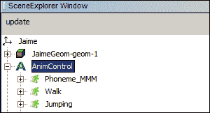
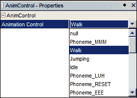
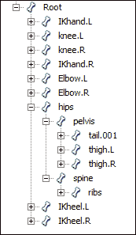
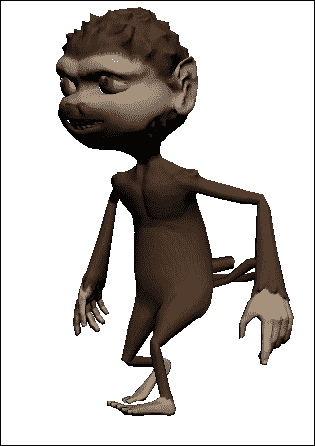
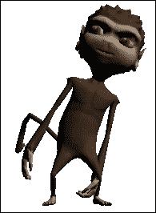
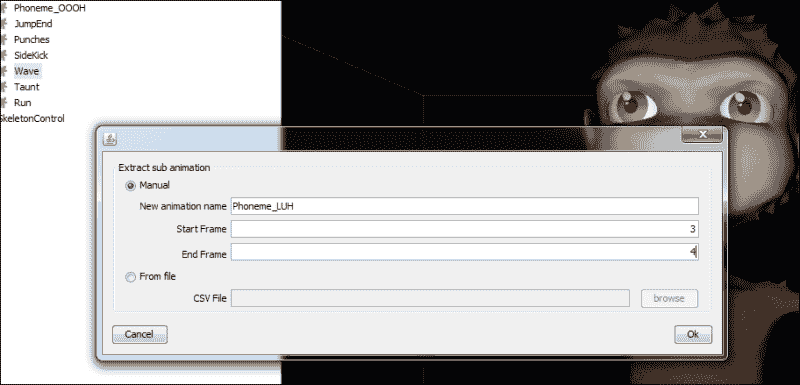
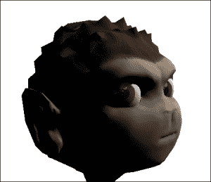

# 第四章 精通角色动画

在本章中，我们将涵盖以下主题：

+   在 SDK 中预览动画

+   创建动画管理器控制

+   扩展动画控制

+   处理跳跃动画

+   创建自定义动画 – 倾斜

+   创建子动画

+   唇同步和面部表情

+   眼睛运动

+   位置相关动画 – 边缘检查

+   反向运动学 – 将脚与地面对齐

# 简介

在本章中，我们将更详细地研究基于骨骼的动画。这些是许多游戏中的核心功能，拥有一个好的框架可以在项目中节省大量时间（和金钱）。

对于那些对动画主题完全陌生的人来说，建议查看 jMonkeyEngine 教程，特别是[`hub.jmonkeyengine.org/wiki/doku.php/jme3:beginner:hello_animation`](http://hub.jmonkeyengine.org/wiki/doku.php/jme3:beginner:hello_animation)中的 Hello Animation。

# 在 SDK 中预览动画

在深入研究代码之前，让我们简要地看看我们如何使用 SDK 查看模型提供的动画。

## 如何做到这一点...

执行以下步骤以查看模型提供的动画：

1.  在**项目**窗口中找到模型。右键单击它，在**场景作曲家**中选择**编辑**，你将看到以下截图：

1.  找到**场景探索器**窗口并打开模型的节点。寻找如图所示的**AnimControl**。

1.  打开**AnimControl**窗口，你会看到可用的动画列表。然后，导航到**属性**窗口以选择任何动画并在模型中播放，如图所示：

## 它是如何工作的...

**场景探索器**窗口不仅显示属于节点的所有空间，还显示附加到任何空间上的控件。除了添加新控件外，还可以更改它们。在`AnimControl`的情况下，可以设置当前动画以便立即播放。要停止播放，我们可以选择`null`。

# 创建动画管理器控制

我们将创建一个处理角色动画的控制。它将遵循 jMonkeyEngine 的控制模式并扩展`AbstractControl`。我们实际上不会立即使用`AbstractControl`的大多数功能，但这是一种巧妙的方法，可以将一些代码从可能的`Character`类中分离出来。稍后添加功能也将变得容易。

## 如何做到这一点...

要创建一个处理角色动画的控制，请执行以下步骤：

1.  创建一个名为`CharacterAnimationManager`的类，并使其扩展`AbstractControl`。这个类还应实现`AnimEventListener`，这是`AnimControl`用来告诉我们的类动画何时播放完毕的。

1.  我们将把杰米的动画映射到一个枚举中。这样我们就不必进行很多字符串比较。同时，我们也会在枚举中添加一些基本逻辑。动画的名称，动画是否应该循环，以及`AnimControl`使用以下代码将动画混合到新动画所需的时间：

    ```java
    public enum Animation{
      Idle(LoopMode.Loop, 0.2f),
      Walk(LoopMode.Loop, 0.2f),
      Run(LoopMode.Loop, 0.2f),
      ...
      SideKick(LoopMode.DontLoop, 0.1f);

      Animation(LoopMode loopMode, float blendTime){
        this.loopMode = loopMode;
        this.blendTime = blendTime;
      }
      LoopMode loopMode;
      float blendTime;
    }
    ```

    我们还需要两个字段：一个名为`animControl`的`AnimControl`字段和一个名为`mainChannel`的`AnimChannel`。

1.  我们在`setSpatial`方法中设置这些，如下面的代码所示。别忘了将类添加到`AnimControl`字段作为监听器，否则当动画完成后我们不会收到任何调用：

    ```java
    public void setSpatial(Spatial spatial) {
      super.setSpatial(spatial);
      animControl = spatial.getControl(AnimControl.class);
      mainChannel = animControl.createChannel();
      animControl.addListener(this);
    }
    ```

1.  在以下代码中，我们定义了一个名为`setAnimation`的新方法。在这个方法内部，我们设置提供的动画作为当前正在播放的`mainChannel`。我们还根据枚举中的定义设置`loopMode`：

    ```java
    public void setAnimation(Animation animation) {
      if(mainChannel.getAnimationName() == null || !mainChannel.getAnimationName().equals(animation.name())){
        mainChannel.setAnim(animation.name(), animation.blendTime);
        mainChannel.setLoopMode(animation.loopMode);
      }
    }
    ```

1.  在`onAnimCycleDone`方法中，我们创建一个控制，使得所有不循环的动画都返回到空闲动画，除了`JumpStart`，它应该切换到`Jumping`（如在空中）的状态，如下面的代码所示：

    ```java
    public void onAnimCycleDone(AnimControl control, AnimChannel channel, String animName) {
      if(channel.getLoopMode() == LoopMode.DontLoop){
        Animation newAnim = Animation.Idle;
        Animation anim = Animation.valueOf(animName);
        switch(anim){
          case JumpStart:
            newAnim = Animation.Jumping;
            break;
        }
        setAnimation(newAnim);
      }
    }
    ```

1.  创建一个管理动画的类所需的就是这些！要从应用程序中设置这个，我们只需要在应用程序中加载一个模型并添加以下行：

    ```java
    jaime.addControl(new AnimationManagerControl());
    ```

## 它是如何工作的...

`AnimControl`类负责播放和跟踪动画。`AnimChannel`有一个动画应该影响的`Bones`列表。

由于枚举为我们决定了动画参数，我们不需要在`setAnimation`方法中写很多代码。然而，我们需要确保我们不会设置已经在播放的相同动画，否则可能会导致动画卡住，重复第一帧。

当动画到达结束时，`onAnimCycleDone`方法会从`AnimControl`中被调用。在这里，我们决定当这种情况发生时会发生什么。如果动画不是循环的，我们必须告诉它接下来要做什么。播放空闲动画是一个不错的选择。

我们还有一个特殊情况。如果你查看动画列表，你会注意到杰米的跳跃动画被分成了三部分。这是为了更容易地处理不同长度的跳跃或下落动画。

当`JumpStart`完成后，我们将告诉`AnimControl`将动画更改为跳跃动作。然而，一旦跳跃动作发生，我们永远不会更改为`JumpEnd`。相反，这应该在他跳跃后触地时从其他地方调用。如何测量这取决于游戏逻辑，但因为我们使用的是`Control`模式，所以我们可以使用`controlUpdate`来检查杰米的当前位置。

# 扩展动画控制

在前面的食谱中，我们通过管理 `Control` 类构建了动画的基础。这对于许多类型的游戏来说都很好，但对于一个以角色为重点的游戏，比如第一人称射击游戏（FPS），我们可能需要一个更详细的控制。这就是 `AnimChannel` 概念发挥作用的地方。`AnimChannel` 是将骨骼分成不同的骨骼组并仅对它们应用动画的一种方式。正如我们将在本食谱中发现的那样，这意味着我们可以在同一时间让身体的不同部位播放不同的动画。

### 小贴士

仅对某些通道应用动画可以帮助大幅减少以角色为重点的游戏的工作量。比如说，我们正在制作一个第一人称射击游戏（FPS）或角色扮演游戏（RPG），其中角色可以挥舞多种不同的物品和武器，包括单手和双手。为所有组合制作全身动画，包括站立、行走、跑步等，是不切实际的。如果相反，你能够只将武器动画应用于上半身，将行走动画应用于下半身，你将获得更多的自由。

这个食谱还将描述一些可能有助于开发游戏的其他技巧。

## 如何做...

通过执行以下步骤，我们可以在同一时间让身体的不同部位播放不同的动画：

1.  首先，我们将在动画的 `manager` 类中实现 `ActionListener` 和 `AnalogListener` 接口。这将允许我们直接从输入处理类接收输入并决定播放哪些动画。

1.  接下来，我们定义两个 `AnimChannels`：一个称为 `upperChannel` 的上半身通道和一个称为 `lowerChannel` 的下半身通道。我们还创建了一个 `Channel` 枚举，以便轻松选择是否在单独的通道或整个身体中播放动画，如下面的代码所示：

    ```java
    public enum Channel{
      Upper, Lower, All,
    }
    ```

    +   可以使用 SceneExplorer 来查找合适的骨骼，如下面的截图所示：

    

1.  在 `setSpatial` 方法中，我们在 `AnimControl` 中创建上下通道。我们让 `AnimChannel` 使用 `addFromRootBone` 方法递归地添加所有骨骼，如下面的代码所示：

    ```java
    public void setSpatial(Spatial spatial) {
    super.setSpatial(spatial);
      animControl = spatial.getControl(AnimControl.class);
      upperChannel = animControl.createChannel();
      lowerChannel = animControl.createChannel();
      upperChannel.addFromRootBone("spine");
      lowerChannel.addBone("Root");
      lowerChannel.addFromRootBone("pelvis");
    ```

1.  使用相同的方法，将此实例作为 `AnimEventListener` 添加到 `AnimControl` 中，以便在动画改变或循环时接收事件，如下面的代码所示：

    ```java
    animControl.addListener(this);
    ```

1.  为了能够从其他类设置特定的动画，我们添加了一个名为 `setAnimation` 的方法，该方法接受一个动画和一个 `Channel`（枚举）作为输入，如下面的代码所示：

    ```java
    public void setAnimation(Animation animation, Channel channel){
      switch(channel){
        case Upper:
          setAnimation(animation, upperChannel);
          break;
        ...
      }
    }
    ```

1.  在 `onAction` 方法中，控制可以直接从 `InputListener` 接收输入，并在设置动画之前应用自己的逻辑，如下面的代码所示：

    ```java
    public void onAction(String name, boolean isPressed, float tpf) {
      if (name.equals("StrafeLeft")) {
        leftStrafe = isPressed;
      }
      ...
      } else if (name.equals("Jump") && isPressed) {
        jumpStarted = true;
        setAnimation(Animation.JumpStart);
      }
      if(jumpStarted || firing){
        // Do nothing
      } else if(forward || backward || rightStrafe || leftStrafe)  {
        setAnimation(Animation.Walk);
      } else {
        setAnimation(Animation.Idle);
      }
    }
    ```

1.  最后，为了测试 `AnimChannels` 的概念，我们可以在我们的 `SimpleApplication` 实例中实现 `ActionListener` 并将其绑定到一些键上，如下面的代码所示：

    ```java
    public void onAction(String name, boolean isPressed, float tpf) {
      if (name.equals("Anim1") && isPressed) {
        jaime.getControl(AnimationChannelsControl.class)
    .setAnimation(Animation.Walk, Channel.All);
      }
    ...
    }
    ```

1.  作为如何使用 `AnimChannels` 的概念从组合动画中创建新动画的示例，创建一个新的应用程序，并将行走动画设置在 Jaime 的 `lowerChannel` 上，同时将跳跃动画应用于 `upperChannel`。现在，Jaime 将开始僵尸行走的模仿。

## 它是如何工作的...

我们可以看到，`Animation` 枚举中增加了一个名为 `key` 的字段。这并非必需，但它是一种避免硬编码动画名称的方法的一部分。

通过使用 `addFromRootBone` 方法，通道将自动递归地添加所有骨骼，从提供的第一个骨骼开始。在将脊椎添加到 `upperChannel` 之后，它将继续向下链，添加肩膀、颈部、手臂和手，如下面的截图所示：



作用于身体上下部分的动画

由于我们实现了 `ActionListener`，类中还有一个 `onAction` 方法，它可以接收来自多个外部源（如 `InputListener`）的输入。这也意味着它可以在决定播放什么以及不播放什么之前自行应用逻辑，而不仅仅是作为动画播放控制。我们可以从第二章的 `GameCharacterControl` 类中识别出这里使用的模式，*Cameras and Game Controls*。

通过提供一个映射动画名称的 `Properties` 文件，可以使用具有不同命名约定的模型。这也使得设计师或艺术家在无需咨询程序员进行更改的情况下尝试多种不同的动画变得更加容易。

# 处理跳跃动画

在这个菜谱中，我们将展示如何从之前的菜谱中的动画管理器控制中处理跳跃动画。为什么这需要一个单独的菜谱？从动画的角度来看，跳跃通常是一组顺序动画。如果我们以 Jaime 为例，有 `JumpStart`、`Jumping` 和 `JumpEnd`。通常，顺序动画可以在 `onAnimCycleDone` 方法中处理；当一个动画结束时，它可以触发下一个。但跳跃不同，因为中间的跳跃动画是不确定的，并且是循环的。它播放多长时间取决于角色在空中的时间，这由游戏玩法或其物理属性驱动。

## 如何做到这一点...

你可以通过以下步骤处理跳跃动画：

1.  为了做到这一点，我们需要在我们的动画控制中添加两个额外的布尔值：`jumpStarted` 和 `inAir`。

1.  我们在 `onAction` 方法中触发动画的第一部分，如下面的代码所示。`jumpStarted` 布尔值用于让类知道，当角色处于跳跃状态时，不应启动其他动画：

    ```java
    public void onAction(String binding, boolean value, float tpf) {
      if (binding.equals("Jump") && value) {
        jumpStarted = true;
        setAnimation(Animation.JumpStart);
      }
    }
    ```

1.  当 `JumpStart` 播放完毕后，`onAnimCycleDone` 方法应将动画切换回跳跃动作。我们还将 `inAir` 设置为 `true`，如下面的代码所示：

    ```java
    public void onAnimCycleDone(AnimControl control, AnimChannel channel, String animName) {
      if(channel.getLoopMode() == LoopMode.DontLoop){
        Animation newAnim = Animation.Idle;
        Animation anim = Animation.valueOf(animName);
        switch(anim){
          case JumpStart:
            newAnim = Animation.Jumping;
            inAir = true;
            break;
        }
        setAnimation(newAnim, channel);
      }
    }
    ```

1.  `controlUpdate`方法适合检查角色在跳跃（或下落）后是否已经着陆。我们直接在`BetterCharacterControl`中检查这一点，如果角色回到了地面，就改变动画，如下面的代码所示：

    ```java
    protected void controlUpdate(float tpf) {
      if(inAir){
        BetterCharacterControl charControl =spatial.getControl(BetterCharacterControl.class);
        if(charControl != null && charControl.isOnGround()){
          setAnimation(Animation.Idle);
          jumpStarted = false;
          inAir = false;
        }
      }
    }
    ```

## 它是如何工作的...

实现依赖于监听器模式，其中这个控制从外部输入类接收用户动作的通知。在这个项目中，我们有一个单独的类来控制角色。

当一个动画完成一个循环（包括循环和非循环动画）时，`onAnimCycleDone`方法会被`AnimControl`方法调用。通常，当动画结束时，我们希望切换到空闲动画以防止它冻结。然而，当`JumpStart`完成时，角色很可能是处于空中，因此切换到合适的循环动画。使用`inAir`布尔值，类知道它应该开始检查角色何时再次着陆。

根据项目的大小，角色控制类和这个动画管理类可能会合并成一个。这应该会使一些事情变得更容易，但随着更多功能的实现，类本身可能会变得庞大。

`controlUpdate`类会随着每个 tick 自动调用，在这里我们可以看到角色是否仍然在空中。在这个实现中，使用了`BetterCharacterControl`，它有一个方法可以检查角色是否在地面上。Jaime 有一个`JumpEnd`动画，但似乎与一些混合效果相比，空闲状态工作得更好。

# 创建自定义动画 - 倾斜

自定义动画是直接操纵角色骨骼以创建动画的概念。我们将通过创建一个可以与第二章，*相机和游戏控制*一起使用的控制来探索这一点。与这个食谱一起，倾斜可以用于玩家以外的角色和网络游戏中。



Jaime 向左倾斜

如同第二章，*相机和游戏控制*中所述，我们有两种处理倾斜的方法：一种是通过使用一个键向左倾斜，另一种是向右倾斜。第二种方法是按下一个按钮，并使用鼠标向任何方向倾斜，这在计算机游戏中更为常见。

## 准备工作

我们将要构建的控制将共享第二章中的代码，*相机和游戏控制*。共享的代码将在那里解释以节省空间，并且它很可能会与这个食谱一起使用，因此熟悉它是有帮助的。

## 如何做到这一点...

1.  我们首先创建一个新的类，该类扩展了`AbstractControl`并实现了`Action-`和`AnalogListener`。

1.  接下来，我们定义一些值，这些值将帮助我们控制倾斜。`leanValue` 是当前应用的倾斜量。需要对角色可以倾斜的最大量进行限制，这由 `maxLean` 设置。在这个例子中，无论是哪个方向，都是 45 度。两个布尔值 `leanLeft` 和 `leanRight` 定义了是否正在使用按键向任一方向倾斜，而 `leanFree` 定义了是否使用鼠标。`leaningBone` 是我们将要修改的骨骼，我们还将存储骨骼的原始旋转在 `boneRotation` 中，并在倾斜时将其用作基准。

1.  当控制被添加到空间中时，我们需要寻找一个要应用倾斜的骨骼。我们选择脊柱作为 `leaningBone`，并克隆其当前旋转，如下面的代码所示：

    ```java
    public void setSpatial(Spatial spatial) {
      super.setSpatial(spatial);
      Bone spine = spatial.getControl(SkeletonControl.class).getSkeleton().getBone("spine");
      if(spine != null){
        leaningBone = spine;
        boneRotation = leaningBone.getLocalRotation().clone();
      }
    }
    ```

1.  `onAction` 方法将接收输入并应设置控制布尔值，即 `leanLeft`、`leanRight` 和 `leanFree`。`onAnalog` 选项在 `leanFree` 激活时接收鼠标输入。

1.  在 `controlUpdate` 方法中，我们检查是否要应用任何倾斜，首先向左倾斜，然后以类似的方式向右倾斜。如果 `leanValue` 接近 `0f`，我们将将其四舍五入到 `0`。如果发生这种情况，我们将控制权交还给 `AnimControl`，如下面的代码所示：

    ```java
    protected void controlUpdate(float tpf) {
      if(leanLeft && leanValue < maxLean){
        leanValue += 0.5f * tpf;
      } else if(!leanFree && leanValue > 0f){
        leanValue -= 0.5f * tpf;
      }
      [mirror for right]
      if(leanValue < 0.005f && leanValue > -0.005f){
        leanValue = 0f;
      }
      if(leanValue != 0f){
        lean(leanValue);
      } else {
        leaningBone.setUserControl(false);
      }
    }
    ```

1.  在 `lean` 方法中，该方法将倾斜应用于骨骼，我们首先做的事情是将值限制在允许的阈值内。接下来，我们在基于原始旋转创建新的 `Quaternion` 类之前，在骨骼上调用 `setUserControl` 以让其知道它不应该应用动画，如下面的代码所示：

    ```java
    private void lean(float value){
      FastMath.clamp(value, -maxLean, maxLean);

      leaningBone.setUserControl(true);
      Quaternion newQuat = boneRotation.add(new   Quaternion().fromAngles(-FastMath.QUARTER_PI * 0.35f, 0, -value));
      newQuat.normalizeLocal();
      leaningBone.setLocalRotation(newQuat);
    }
    ```

## 它是如何工作的...

在选择要应用倾斜的骨骼时，它应该靠近角色的上半身底部。在 Jaime 身上，脊柱是一个合适的骨骼。

当调用 `Bone.setUserControl(true)` 时，我们告诉骨骼不应用任何动画，我们将手动处理任何旋转或平移。这必须在设置旋转之前调用，否则将抛出异常。同样，当我们完成时，我们需要调用 `setUserControl(false)` 将控制权交还给用户（否则不会播放动画）。

手动控制骨骼功能强大，可以用于许多不同的应用，例如精确瞄准和头部跟踪。然而，要一切正确可能很棘手，而且这很可能不是你经常做的事情。

这个类可以单独使用，也可以与第二章，*相机和游戏控制*一起使用，或者它们可以合并在一起。将它们分开的好处是，我们也可以单独应用它们。例如，在 FPS 游戏中，玩家的角色不需要这个控制，因为你永远不会看到它倾斜。在这种情况下，一切都关于相机。然而，同一（网络）FPS 中的其他玩家需要它，AI 敌人可能也会使用相同的角色控制类。

要了解更多关于`leanValue`的使用和应用，请参阅第二章的*在角落附近倾斜*配方，*相机和游戏控制*。

## 还有更多...

如果我们使用的是导入的模型且无法访问骨骼列表，我们如何知道使用哪个骨骼？一种简单的方法是在**场景浏览器**中打开模型。在**骨骼控制**中，我们可以看到角色拥有的所有骨骼，但不知道它们在模型上的相对位置。通过右键单击并选择**获取附件节点**，将创建一个新的节点；同时，通过选择它，我们可以在模型上看到它的位置。有关附件节点的更多信息，请参阅第一章的*检索附件节点*配方，*SDK 游戏开发中心*。

# 创建子动画

在这个配方中，我们将使用场景作曲家来创建子动画。正如其名所示，它们是从动画中派生出来的。子动画可以是从库存模型中挤出一些额外内容的好方法，或者如果模型师已经回家了。在这个特定的应用中，我们将为下一配方做准备，该配方是关于嘴唇同步的。SDK 中的**提取子动画**窗口看起来如下截图所示：



## 准备工作

创建子动画时最大的注意事项是，jMonkeyEngine API 在与模型交互时使用相对时间，而子动画是基于帧创建的。因此，找出要提取的帧的最简单方法是打开模型在外部编辑器中，并与之并行查看。

## 如何做...

提取子动画可以通过以下步骤完成：

1.  在场景作曲家打开模型后，我们展开**AnimControl**。

1.  现在，我们可以看到目前所有可用的动画。我们右键单击想要从中创建子动画的动画，并选择**提取子动画**选项。

1.  输入起始帧和结束帧，操作完成。新的动画现在可在**AnimControl**选项中找到。

## 它是如何工作的...

jMonkeyEngine 中的动画由多个`BoneTracks`组成。这些中的每一个都有一个包含动画时间的浮点数数组，一个包含骨骼位置的`Vector3f`数组，一个包含旋转的四元数数组，以及另一个包含缩放值的`Vector3f`数组。数组的每个实例都包含有关一帧的信息。

子动画是从父动画中所有`BoneTracks`的摘录的副本。

# 嘴唇同步和面部表情

此配方处理使角色看起来有生命和感知的两个重要部分。技术上，可以使用`AnimChannel`来处理，但它们仍然值得单独提及，因为它们有一些特殊要求。

唇同步围绕一个称为**音素**的概念，这是在发出某些声音时嘴巴所采取的独特形状。一个角色拥有的音素数量根据不同的需求而变化，但有一个基本集合用于创建可信的嘴部动作。

最后，我们将使用 jMonkeyEngine 的**Cinematics**系统按顺序应用它们，并让角色说话（模仿）一个单词。Cinematics 是 jMonkeyEngine 的脚本系统，它可以用来创建游戏中的脚本事件和场景。在第九章*将我们的游戏提升到下一个层次*中有更深入的介绍。

我们将遵循这个食谱中的控制模式，控制可以合并到另一个动画控制器中，或者保持独立。

## 准备工作

拥有一个带有音素动画的模型或在外部建模程序中创建它们是首选的。如果动画是一帧静态表情，这也是完全可以接受的。

如果前面的选项不可用，一种方法是使用 SDK 的功能来创建子动画。该项目附带了一个带有音素动画的 Jaime 版本，用于本食谱。对于那些对创建子动画过程感兴趣的人，可以在附录*信息片段*中的*启用夜间构建*部分找到使用的子动画列表。

## 如何做到这一点...

所有必需的功能都可以通过以下步骤在一个类中实现：

1.  首先，我们创建一个新的类，名为`ExpressionsControl`，它扩展了`AbstractControl`。

1.  在这个内部，我们添加了一个名为`animControl`的`AnimControl`，一个名为`mouthChannel`的`AnimChannel`，以及另一个名为`eyeBrowChannel`的`AnimChannel`。

1.  我们定义一个枚举来跟踪控制器支持的音素。这些是最常见的几个，还有一个`RESET`选项用于中性的嘴部表情，如下面的代码所示：

    ```java
    public enum PhonemeMouth{
      AAAH, EEE, I, OH, OOOH, FUH, MMM, LUH, ESS, RESET;
    };
    ```

1.  我们创建另一个枚举来设置眼睛的表情，这是一种简单的方法，可以向角色所说的内容添加情感，如下面的代码所示：

    ```java
    public enum ExpressionEyes{
      NEUTRAL, HAPPY, ANGRY;
    };
    ```

1.  在`setSpatial`方法中，我们为嘴部动画创建`AnimChannel`，并为眼睛创建一个，然后我们向这些中的每一个添加合适的骨骼，如下面的代码所示。可用的骨骼列表可以在`SceneComposer`中的`SkeletonControl`中看到。

    ```java
    mouthChannel = animControl.createChannel();
    mouthChannel.addBone("LipSide.L");
    ...
    ```

1.  由于我们将使用的动画可能只是一帧或几帧，我们可以将`LoopMode`设置为`Loop`或`Cycle`。速度必须高于`0`，否则混合效果不会工作。这两个`AnimChannels`都需要设置。

1.  然后，我们有两个 setter 方法可以直接设置控制中的表达式或音素。命名约定可能因资产而异，并且保持一个小的混合值是好的：

    ```java
    public void setPhoneme(PhonemeMouth p){
      mouthChannel.setAnim("Phoneme_" + p.name(), 0.2f);
    }
    public void setExpression(ExpressionEyes e){
      eyeBrowChannel.setAnim("Expression_" + e.name(), 0.2f);
    }
    ```

1.  我们可以重用其他菜谱中的任何测试类，并只需在它上面应用一些新代码，如下面的代码片段所示。我们设置了一个简单的电影序列，让贾伊姆说（或模仿）*你好*并看起来很高兴。

    ### 小贴士

    当编写这个菜谱时，以下 `AnimationEvent` 构造函数不存在，并且 `AnimChannels` 没有正确应用。已经提交了一个补丁，但可能还没有进入稳定的构建。如果需要，补丁可以在附录的*动画事件补丁*部分找到，*信息收集*。也可以通过在 SDK 中开启夜间构建来获取。

```java
public void setupHelloCinematic() {
  cinematicHello = new Cinematic((Node)jaime, 1f);
  stateManager.attach(cinematicHello);
  cinematicHello.addCinematicEvent(0.0f, new AnimationEvent(jaime, "Expression_HAPPY", LoopMode.Cycle, 2, 0.2f));
  cinematicHello.addCinematicEvent(0.1f, new AnimationEvent(jaime, "Phoneme_EEE", LoopMode.Cycle, 1, 0.1f));
  cinematicHello.addCinematicEvent(0.2f, new AnimationEvent(jaime, "Phoneme_LUH", LoopMode.Cycle, 1, 0.1f));
  cinematicHello.addCinematicEvent(0.3f, new AnimationEvent(jaime, "Phoneme_OOOH", LoopMode.Cycle, 1, 0.1f));
  cinematicHello.addCinematicEvent(0.7f, new AnimationEvent(jaime, "Phoneme_RESET", LoopMode.Cycle, 1, 0.2f));

  cinematicHello.setSpeed(1.0f);
  cinematicHello.setLoopMode(LoopMode.DontLoop);
  cinematicHello.play();
}
```

## 它是如何工作的...

音素背后的技术原理与其他部分的动画并没有太大的不同。我们创建 `AnimChannels`，它处理不同的骨骼集合。第一个棘手的问题是，如果你想同时控制身体的各个部分，你需要组织好这些通道。

应用音素的管道也可能很困难。第一步将是不直接在代码中设置它们。从代码中直接调用改变角色的表情在特定事件中并不令人难以置信。对句子中的每个音素都这样做会非常繁琐。使用电影系统是一个好的开始，因为它会相对简单地将代码解析文本文件并从中创建电影序列。时间非常关键，将动作与声音同步可能需要很多时间。以允许快速迭代的格式来做这件事很重要。

另一种更复杂的方法是建立一个数据库，该数据库将单词和音素进行映射，并自动按顺序应用它们。

最简单的方法是根本不关心唇同步，并在角色说话时应用移动的嘴巴动画。

# 眼睛运动

眼神接触是使角色显得生动并意识到你的和其他事物的存在的重要因素。在本章中，我们将创建一个控制，使其眼睛跟随空间，如下面的截图所示：



## 如何实现...

眼睛追踪可以通过以下步骤在单个控制中实现：

1.  我们首先创建一个新的类 `EyeTrackingControl`，它扩展了 `AbstractControl`。

1.  它需要两个 `Bone` 字段：一个称为 `leftEye`，另一个称为 `rightEye`。此外，我们还应该添加一个名为 `lookAtObject` 的空间和一个相关的 `Vector3f`，称为 `focusPoint`。

1.  在 `setSpatial` 方法中，我们找到并存储 `leftEye` 和 `rightEye` 的骨骼。

1.  我们还需要一个方法来设置 `lookAtObject`。

1.  完成此操作后，我们将大多数其他功能添加到 `controlUpdate` 方法中。首先，我们需要控制骨骼，否则我们无法修改它们的旋转，如下面的代码所示：

    ```java
    if(enabled && lookAtObject != null){
      leftEye.setUserControl(true);
      rightEye.setUserControl(true);
    ```

1.  接下来，我们需要确定相对于眼睛的 `lookAtObject` 位置。我们通过将位置转换为模型空间并将其存储在 `focusPoint` 中来完成此操作，如下面的代码所示：

    ```java
    focusPoint.set(lookAtObject.getWorldTranslation().subtract(getSpatial().getWorldTranslation()));
    ```

1.  从 `Vector3f` 减去眼睛位置，我们得到相对方向：

    ```java
    Vector3f eyePos = leftEye.getModelSpacePosition();
    Vector3f direction = eyePos.subtract(focusPoint).negateLocal();
    ```

1.  我们创建一个新的四元数，并使其朝向 `direction` 向量的方向。我们可以在稍作修改后将其应用于我们的眼睛，因为它的 0-旋转是向上：

    ```java
    Quaternion q = new Quaternion();
    q.lookAt(direction, Vector3f.UNIT_Y);
    q.addLocal(offsetQuat);
    q.normalizeLocal();
    ```

1.  然后，我们通过使用 `setUserTransformsWorld` 来应用它。最后，我们使用以下代码将骨骼的控制权交还给系统：

    ```java
    leftEye.setUserTransformsWorld(leftEye.getModelSpacePosition(), q);
    rightEye.setUserTransformsWorld(rightEye.getModelSpacePosition(), q);
    leftEye.setUserControl(false);
    rightEye.setUserControl(false);
    ```

## 它是如何工作的...

实际的代码是相当直接的三角函数，但知道使用哪些值以及如何进行流程可以很棘手。

一旦类接收到要观察的对象，它就会从 `lookAtObjects` 中减去模型的 `worldTranslation`，这样它们最终会出现在相对于模型原点（也称为 **modelspace**）的坐标系中。

使用 `setUserTransformsWorld` 也会设置位置，但由于我们提供了它的当前 `modelSpacePosition`，因此不会应用任何更改。

实际上，每个眼睛的方向都应该单独计算，以确保结果完全正确。

## 还有更多...

到目前为止，角色对摄像机的注视非常专注。这是一个改进，但可以使其更加逼真。可能不那么明显的是，即使我们看的是同一个物体，我们也很少总是看同一个点。我们可以通过在控制中添加一些随机的闪烁来模拟这种行为：

```java
private float flickerTime = 0f;
private float flickerAmount = 0.2f;
private Vector3f flickerDirection = new Vector3f();
```

通过引入这三个字段，我们为我们想要做的事情打下了基础：

```java
flickerTime += tpf * FastMath.nextRandomFloat();
if(flickerTime > 0.5f){
  flickerTime = 0;
  flickerDirection.set(FastMath.nextRandomFloat() * flickerAmount, FastMath.nextRandomFloat() * flickerAmount, 0);
}
direction.addLocal(flickerDirection);
```

这段代码位于 `controlUpdate` 方法的中间，紧接在计算方向之后。我们做的事情是增加 `flickerTime` 直到它达到 0.5f（注意这并不是以秒为单位，因为我们应用了一个随机数）。一旦发生这种情况，我们就根据 `flickerAmount` 随机化 `flickerDirection` 并重置 `flickerTime`。

在每次连续更新中，我们将将其应用于计算出的方向，并稍微偏移焦点点。

# 位置相关的动画 – 边缘检查

在某些游戏中，玩家穿越危险区域，从边缘掉落可能导致他们的死亡。有时，在这些游戏中，玩家不应该掉落，或者当他们靠近时，他们的移动会受到限制，或者玩家在坠落前会得到额外的警告。

我们将要开发的控制可以用于任何这些事情，但由于本章是关于动画的，我们将使用它来在玩家过于靠近边缘时播放一个特殊的动画。

## 准备工作

这个配方将使用本章之前使用过的类似模式，我们还将使用本章早期提到的动画管理器控制。任何动画控制都可以使用，但它应该有上下身分开的通道。

## 如何做到这一点...

我们几乎可以在一个类中实现我们需要的所有功能，如下所示：

1.  我们首先创建一个名为`EdgeCheckControl`的类，它扩展了`AbstractControl`并包含以下字段，如下面的代码所示：

    ```java
    private Ray[] rays = new Ray[9];
    private float okDistance = 0.3f;
    private Spatial world;
    private boolean nearEdge;
    ```

1.  我们定义了用于碰撞检测的九条射线。在`setSpatial`方法中，我们实例化它们并将它们指向下方，如下面的代码所示：

    ```java
    for(int i = 0; i < 9; i++){
      rays[i] = new Ray();
      rays[i].setDirection(Vector3f.UNIT_Y.negate());
    }
    ```

1.  在`controlUpdate`方法中，我们首先将一条射线放置在角色的中心，如下面的代码所示：

    ```java
    Vector3f origo = getSpatial().getWorldTranslation();
    rays[0].setOrigin(origo);
    ```

1.  我们围绕角色走动，将剩余的射线放置成圆形。对于每一个，我们使用`checkCollision`方法查看它是否与任何东西发生碰撞。如果没有，我们不需要检查其余部分，可以使用以下代码退出循环：

    ```java
    float angle;
    for(int i = 1; i < 9; i++){
      float x = FastMath.cos(angle);
      float z = FastMath.sin(angle);
      rays[i].setOrigin(origo.add(x * 0.5f, 0, z * 0.5f));

      collision = checkCollision(rays[i]);
      if(!collision){
        break;
      }
      angle += FastMath.QUARTER_PI;
    }
    private boolean checkCollision(Ray r){
      CollisionResults collResuls = new CollisionResults();
      world.collideWith(r, collResuls);
      if(collResuls.size() > 0 && r.getOrigin().distance(collResuls.getClosestCollision().getContactPoint()) > okDistance){
        return true;
      }
      return false;
    }
    ```

1.  在此方法的最后一步，我们调用动画管理器并告诉它播放或停止播放近边缘动画，如下面的代码所示。我们根据是否已检测到所有碰撞来执行此操作，确保我们只发送任何状态变化：

    ```java
    if(!collision && !nearEdge){
      nearEdge = true; spatial.getControl(AnimationManagerControl.class).onAction("NearEdge", true, 0);
    } else if(collision && nearEdge){
      nearEdge = false;  spatial.getControl(AnimationManagerControl.class).onAction("NearEdge", false, 0);
    }
    ```

1.  切换到我们的动画管理器类，我们相应地对其进行修改。状态存储在这里，以便可以查看允许播放的其他动画，如下所示：

    ```java
    if (binding.equals("NearEdge")) {
      nearEdge = value;
      if(nearEdge){
        setAnimation(Animation.Jumping, Channel.Upper);
      }
    }
    ```

## 它是如何工作的...

在每次更新中，我们创建的九条射线被放置在角色周围的圆圈中，其中一条位于中心。

它们将检查与它们下面的表面的碰撞。如果其中任何一个（这可能会改为两个或三个）在`okDistance`内没有击中任何东西，它将被报告为角色接近危险边缘。

`okDistance`必须设置为一个合适的值，高于楼梯的一步，可能是在玩家可能受到伤害的高度。

当这种情况发生时，动画管理器将被调用，并将`NearEdge`动作设置为`true`。这将应用跳跃动画（手臂的疯狂挥舞）到角色的上半身，同时仍然允许在下半身播放其他动画。

`NearEdge`布尔值用于确保我们只向动画管理器发送一次调用。

在进行碰撞检查时，应注意被碰撞的对象的数量和形状。如果世界很大或由复杂形状构成（或者更糟糕的是，如果它有`MeshCollisionShape`），我们应该尝试找到应用此方法的优化方法。一种方法是将世界分成几个部分，并有一个辅助方法来选择要碰撞的部分。此方法可能使用`contains`在`BoundingVolume`上查看玩家所在的部分。

# 将脚与地面对齐 - 反向运动学

反向运动学现在是游戏动画系统的一个常见部分，它可能是一个单独章节的主题。在这个菜谱中，我们将查看将角色的脚放置在地面以下的位置。这在动画可能会将它们放置在空中或斜坡地面上时非常有用。

通常，动画根据前向运动学工作；也就是说，当骨骼靠近骨骼根部旋转时，它会影响链中更下面的骨骼。正如其名所示，逆运动学从另一端开始。

在这里，我们努力达到一串骨骼尖端所需的位置，而链中更高位置的骨骼则试图调整自己以适应这一位置。

这种最直接的实施方式是在所有轴向上旋转骨骼一小部分。然后它检查哪种旋转可以使尖端最接近所需位置。这会针对链中的所有骨骼重复进行，直到足够接近。

## 准备工作

此配方需要一个带有`SkeletonControl`的模型，并且建议您熟悉其设置。在编写此配方时，使用的居民猴子是 Jaime。

此配方使用一个实验性功能，在编写此配方时，它不是核心构建的一部分。要使用它，您可以自己从源代码构建 jMonkeyEngine。您也可以通过启用夜间构建来获取它。请参阅附录，*信息片段*，了解如何更改此设置。

## 如何操作...

执行以下步骤以获取基本 IK 功能：

1.  让我们先创建一个新的类，该类扩展了`AbstractControl`，并定义一个将包含我们想要用作尖端骨骼的骨骼列表。

1.  在`setSpatial`方法中，我们将脚和脚趾骨骼添加到列表中。我们还提供了一些`KinematicRagdollControl`在应用 IK 时应使用的值，并告诉它要使用哪些骨骼，如下面的代码所示：

    ```java
    setupJaime(spatial.getControl(KinematicRagdollControl.class));    spatial.getControl(KinematicRagdollControl.class).setIKThreshold(0.01f); spatial.getControl(KinematicRagdollControl.class).setLimbDampening(0.9f); spatial.getControl(KinematicRagdollControl.class).setIkRotSpeed(18);
    ```

1.  我们创建了一个名为`sampleTargetPositions`的方法，遍历我们的每个目标并找到一个控制应该尝试达到的位置，如下面的代码所示：

    ```java
    public void sampleTargetPositions(){
      float offset = -1.9f;
      for(Bone bone: targets){
        Vector3f targetPosition = bone.getModelSpacePosition().add(spatial.getWorldTranslation());
        CollisionResult closestResult = contactPointForBone(targetPosition, offset);
        if(closestResult != null){
                    spatial.getControl(KinematicRagdollControl.class).setIKTarget(bone, closestResult.getContactPoint().addLocal(0, 0.05f, 0), 2);
        }
      }
    ```

1.  最后，在创建的方法中，我们调用`KinematicRagdollControl`并告诉它切换到逆运动学模式：

    ```java
    spatial.getControl(KinematicRagdollControl.class).setIKMode();
    ```

1.  为了使其可重用，我们使用`setEnabled`方法在控制未使用时清除一些事情；我们使其在再次启用时应用 IK：

    ```java
    if(enabled){
      sampleTargetPositions();
    } else {
                spatial.getControl(KinematicRagdollControl.class).removeAllIKTargets();
                spatial.getControl(KinematicRagdollControl.class).setKinematicMode();
    }
    ```

## 它是如何工作的...

我们定义的列表包含我们希望在链末尾的骨骼。这些是控制将尝试尽可能接近目标位置的骨骼。为了使脚处于合适的角度，我们不仅需要脚，还需要脚趾骨骼。通过尝试对脚和脚趾骨骼进行校准，我们得到对地面下方更好的近似。

与我们的大多数控件不同，我们在`controlUpdate`方法中实际上并没有做任何事情。这是因为实际的校准是通过`KinematicRagdollControl`传递的。相反，我们每次控制被启用时都会进行检查，看看它应该尝试达到哪些位置。

对于每个末端骨骼，我们直接向上发射一条射线，使用偏移量从地面下方某处开始。我们不直接使用骨骼的位置并检查其下方的原因是因为我们无法确定模型是否完全在地面之上。动画可能会将身体部分推入地面，如果我们向下发射射线，我们就不会击中我们想要的目标。

一旦找到目标位置，我们就将骨骼提供给`KinematicRagdollControl`。此外，还有一个整数，它定义了在尝试达到目标时可以修改的骨骼链的长度。

我们还为`KinematicRagdollControl`提供了一些其他值。`IKThreshold`值是指目标点停止尝试的距离。

`LimbDampening`可以用来影响骨骼相对于其他骨骼的运动程度。想象一下，我们正在伸手去拿桌子上的东西。我们的前臂可能比我们的上臂进行更大的运动（旋转）。如果`limbDampening`小于 1.0，那么在链条中位置更高（可能更大）的骨骼在每次更新时移动的幅度会比接近末端骨骼的骨骼小。

`IKRotSpeed`定义了控制每次转动时应应用的旋转步数。值越高，它就越快接近目标，但也意味着误差范围更高。

所有这些值都需要调整才能适用于应用程序。实现只是第一步。`KinematicRagdollControl`方法还需要一些设置，最重要的是，它需要知道它应该能够控制的骨骼。

## 还有更多...

如果我们到目前为止已经实现了这个配方，我们可以看到结果并不是我们预期的。在摇摇晃晃的腿上，类似于橡胶或煮熟的意大利面，我们的角色缓慢地调整到下面的地面。

最令人烦恼的可能就是腿似乎可以向任何方向移动。幸运的是，这可以通过一些调整来修复。`KinematicRagdollControl`函数有一个名为`setJointLimit`的方法，它做了它所说的。它可以设置骨骼每个轴上可以应用的旋转限制。但是，要为所有骨骼设置正确，可能需要一些时间。
