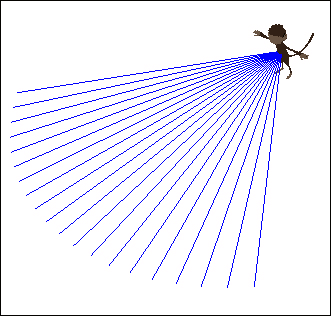
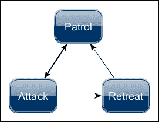
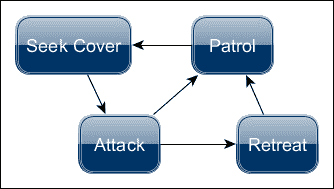
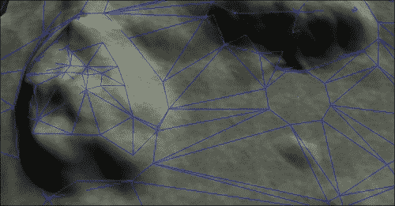
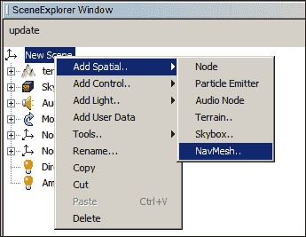

# 第五章. 人工智能

在本章中，我们将介绍以下配方：

+   创建可重用的 AI 控制类

+   感知 - 视觉

+   感知 - 听觉

+   决策 - 有限状态机

+   使用遮蔽创建 AI

+   在 SDK 中生成 NavMesh

+   寻路 - 使用 NavMesh

+   控制 AI 群体

+   寻路 - 我们自己的 A*寻路器

# 简介

**人工智能**（**AI**）是一个极其广泛的领域。即使是对于游戏来说，它也可以非常多样化，这取决于游戏类型和需求。

许多开发者喜欢与 AI 一起工作。它让你有一种创造生命、智能和理性的感觉。在设计游戏 AI 之前，一个很好的问题是，从玩家的角度来看，预期的行为应该是什么。在一个 FPS 游戏中，AI 可能需要区分朋友和敌人，在攻击时寻找掩护，受伤时逃跑，并且在移动时不会卡在东西上。在 RTS 中的 AI 可能不仅需要评估当前情况，还需要提前规划并在进攻和防御行为之间分配资源。一组士兵和战术射击手可能具有高级和动态的群体行为。另一种选择是拥有个体行为，但仍然让玩家觉得它们似乎在协同工作。

本章中的配方在大多数情况下将与独立功能一起工作，但围绕一个中央 AI 控制类展开。因此，结果可能并不总是那么令人印象深刻，但同时，将几个它们组合成一个更强大的 AI 应该相当容易。

# 创建可重用的 AI 控制类

在这个配方中，我们将创建一个控制，用于控制 AI 角色。使用`Control`来做这件事是有益的，因为它可以添加 AI 功能，并且可以与游戏中的其他`Controls`一起使用。我们可以通过向其空间添加`AIControl`来使用第二章中的`GameCharacterControl`，*相机与游戏控制*，为玩家和 AI 角色提供支持。为了获得快速和直观的结果，我们将在这个配方中将它应用于基于子弹的`BetterCharacterControl`类。

## 如何实现...

为了获得一个基本但功能性的攻击（或跟随）AI，我们需要执行以下步骤：

1.  我们首先创建一个新的类，称为`AIControl`，它扩展了`AbstractControl`。这个配方的核心将围绕一个名为`state`的枚举（枚举）展开。目前它只需要两个值：`Idle`和`Follow`。

1.  为`BetterCharacterControl`添加字段，称为`physicsCharacter`，布尔值`forward`和`backwards`，一个用于`walkDirection`的`Vector3f`字段，以及另一个用于`viewDirection`的字段。如果它要去跟随某个东西，它还需要一个`target`字段，它可以是一个`Spatial`。

1.  逻辑的大部分都在`controlUpdate`方法中的`switch`语句中执行，如下面的代码所示。第一个情况是`Idle`。在这种情况下，AI 不应该做任何事情：

    ```java
    switch(state){
      case Idle:
        forward = false;
        backward = false;
      break;
    ```

1.  在`Follow`情况下，我们首先检查`target`是否已设置。如果有目标，我们找到到目标的方向，并通过设置`viewDirection`使 AI 面向它，如下面的代码所示：

    ```java
    case Follow:
      if(target != null){
        Vector3f dirToTarget = target.getWorldTranslation().subtract(spatial.getWorldTranslation());
        dirToTarget.y = 0;
        dirToTarget.normalizeLocal();
        viewDirection.set(dirToTarget);
    ```

1.  我们检查到目标的位置。如果距离超过`5`，AI 将尝试靠近。如果距离小于`3`，它将尝试后退一点。如果 AI 距离目标超过 20 个单位，它也可能失去目标。在这种情况下，它也会将状态更改为`Idle`，如下面的代码所示：

    ```java
    if (distance > 20f){
      state = State.Idle;
      target = null;
    } else if(distance > 5f){
      forward = true;
      backward = false;
    } else if (distance < 3f){
      forward = false;
      backward = true;
    } else {
      forward = false;
      backward = false;
    }
    ```

1.  当涉及到移动时，我们可以使用以下代码行获取面向前方的方向：

    ```java
    Vector3f modelForwardDir = spatial.getWorldRotation().mult(Vector3f.UNIT_Z);
    ```

1.  根据向前或向后是否为真，我们可以将此值乘以合适的移动速度，并在`BetterCharacterControl`类上调用`setWalkDirection`，如下面的代码所示：

    ```java
    if (forward) {
      walkDirection.addLocal(modelForwardDir.mult(3));
    } else if (backward) {
      walkDirection.addLocal(modelForwardDir.negate().multLocal(3));
    }
    physicsCharacter.setWalkDirection(walkDirection);
    ```

1.  最后，我们还应该调用`setViewDirection`，如下面的代码所示：

    ```java
    physicsCharacter.setViewDirection(viewDirection);
    ```

## 它是如何工作的...

使用`BetterCharacterControl`，我们可以免费获得很多功能。我们只需要几个布尔值来跟踪移动，以及两个`Vector3f`实例来表示方向。目标是指 AI 将关注的对象（或目前跟随的对象）。

如果我们熟悉 jMonkeyEngine 测试示例中的`TestBetterCharacter`，我们可以从该类中识别出运动处理。目前，我们只使用`forward`/`backward`功能。保留旋转代码也是一个好主意，以防我们将来希望它转动得更平滑。`walkDirection`向量默认为`0`。它可以像发送给`physicsCharacter`一样发送，在这种情况下，角色将停止，或者修改为向任一方向移动。`viewDirection`向量目前简单地设置为指向目标，并传递给`physicsCharacter`。

之前提到的`Follow`情况中的逻辑主要是为了测试。即便如此，它似乎对于许多 MMO 游戏中的 AI 行为是足够的。一旦获取了目标，它将尝试保持一定的距离。如果它离得太远，它也可能失去目标。在这种情况下，它将回退到`Idle`状态。

## 还有更多...

通过将这个食谱与第四章《掌握角色动画》联系起来，我们可以轻松地让杰伊姆在移动时播放一些动画。

首先，使用以下代码将`AnimationManagerControl`类添加到 AI 角色中：

```java
aiCharacter.addControl(new AnimationManagerControl());
```

我们需要告诉它播放动画。在`AIControl`中，找到`controlUpdate`方法中的前后括号，并添加以下行：

```java
if (forward) {
            ... spatial.getControl(AnimationManagerControl.class).setAnimation(AnimationManagerControl.Animation.Walk);
  } else if (backward) {
            ... spatial.getControl(AnimationManagerControl.class).setAnimation(AnimationManagerControl.Animation.Walk);
  } else {
spatial.getControl(AnimationManagerControl.class).setAnimation(AnimationManagerControl.Animation.Idle);
}
```

## 还有更多...

让我们创建一个我们可以用于这个和许多后续食谱的测试案例世界。首先，我们需要一个具有物理特性的世界：

```java
BulletAppState bulletAppState = new BulletAppState();
stateManager.attach(bulletAppState);
```

我们需要一个可以站立的物体。`PhysicsTestHelper`类有几个我们可以使用的示例世界。

我们再次加载 Jaime。我们再次使用`BetterCharacterControl`类，因为它为我们卸载了大量代码。由于 Bullet 物理世界与普通场景图不同，Jaime 被添加到`physicsSpace`以及`rootNode`中，如下面的代码所示：

```java
bulletAppState.getPhysicsSpace().add(jaime);
rootNode.attachChild(jaime);
```

我们还需要使用以下代码添加我们新创建的 AI 控制：

```java
jaime.addControl(new AIControl());
```

我们还需要做一件事才能让它工作。AI 需要跟踪某些东西。我们获取移动目标的最简单方法是为`CameraNode`类添加一个类，并从应用程序中提供`cam`，如下面的代码所示：

```java
CameraNode camNode = new CameraNode("CamNode", cam);
camNode.setControlDir(CameraControl.ControlDirection.CameraToSpatial);
rootNode.attachChild(camNode);
```

我们将`camNode`设置为目标，如下面的代码所示：

```java
jaime.getControl(AIControl.class).setState(AIControl.State.Follow);
jaime.getControl(AIControl.class).setTarget(camNode);
```

如果我们熟悉 OpenGL 中的相机，我们知道它们实际上并没有物理存在。jMonkeyEngine 中的`CameraNode`类给了我们这样的功能。它跟踪相机的位置和旋转，给我们提供了一个容易测量的东西。这将使我们在想让 AI 跟随它时更容易，因为我们可以使用其空间上的便利性。

因此，我们可以将`CameraNode`设置为它的目标。

# 感应 – 视觉

无论我们的 AI 多么聪明，它都需要一些感官来感知其周围环境。在这个菜谱中，我们将实现一个 AI，它可以在其前方配置的弧形内查看，如下面的屏幕截图所示。它将基于前一个菜谱中的 AI 控制，但实现应该适用于许多其他模式。以下屏幕截图显示了 Jaime 及其视线的一个可见表示：



## 如何做...

为了让我们的 AI 感知到某些东西，我们需要通过以下步骤修改前一个菜谱中的`AIControl`类：

1.  我们需要定义一些值，一个名为`sightRange`的浮点数，表示 AI 可以看到多远，以及一个表示视野（到一侧）的弧度角度。

1.  完成这些后，我们创建一个`sense()`方法。在内部，我们定义一个名为`aimDirection`的四元数，它将是相对于 AI 的`viewDirection`字段的射线方向。

1.  我们将角度转换为四元数，并将其与`viewDirection`相乘以获得射线的方向，如下面的代码所示：

    ```java
    rayDirection.set(viewDirection);
    aimDirection.fromAngleAxis(angleX, Vector3f.UNIT_Y);
    aimDirection.multLocal(rayDirection);
    ```

1.  我们使用以下代码检查射线是否与我们的`targetableObjects`列表中的任何对象发生碰撞：

    ```java
    CollisionResults col = new CollisionResults();
    for(Spatial s: targetableObjects){
      s.collideWith(ray, col);
    }
    ```

1.  如果发生这种情况，我们将目标设置为该对象并退出感应循环，如下面的代码所示。否则，它应该继续寻找它：

    ```java
    if(col.size() > 0){
      target = col.getClosestCollision().getGeometry();
      foundTarget = true;
      break;
    }
    ```

1.  如果感应方法返回 true，AI 现在有一个目标，应该切换到`Follow`状态。我们在`controlUpdate`方法和`Idle`情况中添加了这个检查，如下面的代码所示：

    ```java
    case Idle:
      if(!targetableObjects.isEmpty() && sense()){
        state = State.Follow;
      }
    break;
    ```

## 它是如何工作的...

AI 开始于空闲状态。只要它在`targetableObjects`列表中有一些项目，它就会在每次更新时运行`sense`方法。如果它看到任何东西，它将切换到`Follow`状态并保持在那里，直到它失去对目标的跟踪。

`sense`方法由一个`for`循环组成，该循环发送代表视野的弧形射线。每条射线都受限于`sightRange`，如果射线与`targetableObjects`列表中的任何物体发生碰撞，循环将退出。

## 还有更多…

目前，可视化结果非常困难。AI 到底看到了什么？一种找出答案的方法是为我们发射的每条射线创建`Lines`。这些应该在每次新的发射之前被移除。通过遵循这个例子，我们将能够看到视野的范围。以下步骤将给我们提供一种看到 AI 视野范围的方法：

1.  首先，我们需要定义一个用于线条的数组；它应该有我们将要发射的射线的数量相同的容量。在`for`循环中，在开始和结束时添加以下代码：

    ```java
    for(float x = -angle; x < angle; x+= FastMath.QUARTER_PI * 0.1f){
    if(debug && sightLines[i] != null){
                    ((Node)getSpatial().getParent()).detachChild(sightLines[i]);
    }
    ...Our sight code here...
    if(debug){
      Geometry line = makeDebugLine(ray);
      sightLines[i++] = line;     ((Node)getSpatial().getParent()).attachChild(line);
    }
    ```

1.  我们之前提到的`makeDebugLine`方法将如下所示：

    ```java
    private Geometry makeDebugLine(Ray r){
      Line l = new Line(r.getOrigin(), r.getOrigin().add(r.getDirection().mult(sightRange)));
      Geometry line = new Geometry("", l);
      line.setMaterial(TestAiControl.lineMat);
      return line;
    }
    ```

这只是简单地取每条射线并使其成为人眼可见的东西。

# 感知 - 听觉

我们将要实现的听觉是你可以拥有的更基本模型之一。它不像视觉那样直接，需要不同的方法。我们将假设听觉由`hearingRange`定义，并且听觉能力以线性衰减到该半径。我们还将假设声音发出某种东西（在这种情况下，脚步声），其音量与对象的速率成正比。这在潜行游戏中是有意义的，因为潜行应该比跑步发出更少的声音。声音不会被障碍物阻挡或以任何其他方式修改，除了目标和听者之间的距离。

## 如何做到这一点...

我们将首先定义一个所有发出声音的对象都将使用的类。这需要执行以下步骤：

1.  我们创建了一个名为`SoundEmitterControl`的类，它扩展了`AbstractControl`。

1.  它需要三个字段，一个名为`lastPosition`的`Vector3f`，一个用于`noiseEmitted`的浮点数，以及另一个名为`maxSpeed`的浮点数。

1.  在`controlUpdate`方法中，我们采样空间的速度。这是当前`worldTranslation`和`lastPosition`之间的距离。除以`tpf`（每帧时间）我们得到每秒的距离，如下面的代码所示：

    ```java
    float movementSpeed = lastPosition.distance(spatial.getWorldTranslation()) / tpf;
    ```

1.  如果它实际上在移动，我们将看到它与`maxSpeed`相比移动了多少。在 0 和 1 之间归一化，这个值成为`noiseEmitted`，如下面的代码所示：

    ```java
    movementSpeed = Math.min(movementSpeed, maxSpeed);
    noiseEmitted = movementSpeed / maxSpeed;
    ```

1.  最后，我们将`lastPosition`设置为当前的`worldTranslation`。现在我们将实现检测`AIControl`中的声音的更改。这将有五个步骤。我们首先定义一个名为`hearingRange`的浮点数。在`sense()`方法中，我们解析`targetableObjects`列表，看看它们是否有`SoundEmitterControl`。如果有，我们使用以下代码检查它与 AI 之间的距离：

    ```java
    float distance = s.getWorldTranslation().distance(spatial.getWorldTranslation());
    ```

1.  我们从`SoundEmitterControl`获取`noiseEmitted`值，并查看 AI 接收了多少，如下面的代码所示：

    ```java
    float distanceFactor = 1f - Math.min(distance, hearingRange) / hearingRange;
    float soundHeard = distanceFactor * noiseEmitted;
    ```

1.  如果阈值 0.25f 被超过，AI 已经听到了声音，并将做出反应。

## 它是如何工作的...

`SoundEmitterControl` 类旨在定义移动角色产生的声音量。它是通过测量每一帧行进的距离，并通过除以每帧时间来将其转换为每秒速度来实现的。它已经稍作调整以适应测试用例中使用的自由飞行相机。这就是为什么 `maxSpeed` 被设置为 `25`。它使用 `maxSpeed` 来定义空间产生的噪声量，其范围在 `0` 到 `1` 之间。

在人工智能控制类中，我们使用 `sense()` 方法来测试人工智能是否听到了什么。它有一个 `hearingRange` 字段，其范围从人工智能的位置线性下降。在此范围之外，人工智能不会检测到任何声音。

该方法测量从声音发出空间到距离，并将其与发出的噪声值相乘。对于这个例子，使用 0.25 的阈值来定义声音是否足够响亮以使人工智能做出反应。

# 决策制作 – 有限状态机

人工智能的决策可以以许多不同的方式处理，其中一种常见的方式是使用 **有限状态机**（**FSM**）。FSM 包含多个预定义的状态。每个状态都有一组与之相关的功能和行为。每个状态也有多个条件，用于确定它何时可以转换为另一个状态。

在这个菜谱中，我们将定义一个状态机，它将模拟游戏中常见的常见人工智能行为。实际上，它将比许多游戏更先进，因为许多游戏的人工智能只能沿着路径移动或攻击。我们的人工智能将具有三个状态，**巡逻**、**攻击**和**撤退**，如下面的图所示：



状态图

`PatrolState` 将是默认和回退状态。它将执行随机移动，并在发现敌人时切换到 `AttackState`。

`AttackState` 将处理射击和弹药，只要目标可见并且有剩余弹药，它就会攻击目标。然后它将返回到 `PatrolState` 或使用 `RetreatState` 逃跑。

`RetreatState` 将尝试在设定的时间内逃离目标。之后，它将返回到 `PatrolState`，忘记它可能之前拥有的任何恐惧。

我们的所有状态都将扩展一个名为 `AIState` 的抽象类，我们也将在这个菜谱中创建它。这个类反过来又扩展了 `AbstractControl`。

值得注意的是，所有人工智能决策和动作都是在状态内部处理的。状态只依赖于人工智能控制类来提供它感知更新（尽管这也可以由状态本身处理）。

## 如何实现...

我们将首先创建 `AIState` 类。这将有两个步骤，如下所示：

1.  我们添加了一个字段来存储 `AIControl`，并给它提供了两个名为 `stateEnter` 和 `stateExit` 的抽象方法。

1.  这些应该在启用和禁用类时触发。我们通过重写 `setEnabled` 来实现这一点，如下面的代码所示：

    ```java
    public void setEnabled(boolean enabled) {
      if(enabled && !this.enabled){
        stateEnter();
      }else if(!enabled && this.enabled){
        stateExit();
      }
      this.enabled = enabled;
    }
    ```

当`AIState`完成时，我们可以查看第一个行为，`PatrolState`。我们可以通过以下步骤来实现它：

1.  首先，我们添加一个名为`moveTarget`的`Vector3f`字段。这是它将尝试到达的位置，相对于当前位置。

1.  我们在`controlUpdate`方法中添加一个有三个结果的`if`语句，这是类中逻辑的主要部分。第一个子句应该禁用它并启用`AttackState`，如果`AIControl`已经使用以下代码找到了一个合适的目标：

    ```java
    if(aiControl.getTarget() != null){
      this.setEnabled(false);
      Vector3f direction = aiControl.getTarget().getWorldTranslation().subtract(spatial.getWorldTranslation());
      this.spatial.getControl(BetterCharacterControl.class).setViewDirection(direction);
      this.spatial.getControl(AttackState.class).setEnabled(true);
    }
    ```

1.  如果它的位置足够接近`moveTarget`向量，它应该选择附近的一个新位置，如下面的代码所示：

    ```java
    else if(moveTarget == null || this.spatial.getWorldTranslation().distance(moveTarget) < 1f){
      float x = (FastMath.nextRandomFloat() - 0.5f) * 2f;
      moveTarget = new Vector3f(x, 0, (1f - FastMath.abs(x)) - 0.5f).multLocal(5f);
      moveTarget.addLocal(this.spatial.getWorldTranslation());
    }
    ```

1.  否则，它应该继续向目标移动，如下面的代码所示：

    ```java
    else {
      Vector3f direction = moveTarget.subtract(this.spatial.getWorldTranslation()).normalizeLocal();
      aiControl.move(direction, true);
    }
    ```

1.  最后，在`stateExit`方法中，我们应该让它停止移动，如下面的代码所示：

    ```java
    aiControl.move(Vector3f.ZERO, false);
    ```

这已经完成了三个状态中的一个；让我们看看`AttackState`。我们可以通过以下步骤来实现它：

1.  `AttackState`跟踪与开火相关的值。它需要一个名为`fireDistance`的浮点数，这是 AI 可以开火的范围；一个名为`clip`的整数，表示当前弹夹中的弹药量；另一个名为`ammo`的整数，定义了总共的弹药量；最后，一个名为`fireCooldown`的浮点数，定义了 AI 每次开火之间的时间。

1.  在`stateEnter`方法中，我们给 AI 一些弹药。这主要是为了测试目的，如下面的代码所示：

    ```java
    clip = 5;
    ammo = 10;
    ```

1.  在状态的控制更新方法中，我们进行了一些检查。首先，我们检查`clip`是否为`0`。如果是这样，我们检查`ammo`是否也为`0`。如果是这样，AI 必须逃跑！我们禁用此状态并使用以下代码启用`RetreatState`：

    ```java
    if(clip == 0){
      if(ammo == 0){
        this.setEnabled(false);
      this.spatial.getControl(RetreatState.class).setEnabled(true);
      }
    ```

1.  如果状态仍然有弹药，它应该重新装填弹夹。我们还设置了一个更长的时间，直到它可以再次开火，如下面的代码所示：

    ```java
    else {
      clip += 5;
      ammo -= 5;
      fireCooldown = 5f;
    }
    ```

1.  在主`if`语句中，如果状态已经失去了目标，它应该禁用状态并切换到`PatrolState`，如下面的代码所示：

    ```java
    else if(aiControl.getTarget() == null){
      this.setEnabled(false);
      this.spatial.getControl(PatrolState.class).setEnabled(true);
    }
    ```

1.  如果它仍然有目标并且处于开火的位置，它应该开火，如下面的代码所示：

    ```java
    else if(fireCooldown <= 0f && aiControl.getSpatial().getWorldTranslation().distance(aiControl.getTarget().getWorldTranslation()) < fireDistance){
      clip--;
      fireCooldown = 2f;
    }
    ```

1.  最后，如果它仍然在等待武器冷却，它应该继续等待，如下面的代码所示：

    ```java
    else if(fireCooldown > 0f){
      fireCooldown -= tpf;
    }
    ```

我们 AI 的第三个也是最后一个状态是`RetreatState`。我们可以通过以下步骤来实现它：

1.  与`PatrolState`一样，它应该有一个`moveTarget`字段，它试图到达。

1.  我们还添加了一个名为`fleeTimer`的浮点数，它定义了它将尝试逃跑多长时间。

1.  在其`controlUpdate`方法中，如果`fleeTimer`尚未达到`0`，并且它仍然感觉到威胁，它将选择与目标相对的位置并朝它移动，如下面的代码所示：

    ```java
    Vector3f worldTranslation = this.spatial.getWorldTranslation();
    if (fleeTimer > 0f && aiControl.getTarget() != null) {
      if (moveTarget == null || worldTranslation.distance(moveTarget) < 1f) {
        moveTarget = worldTranslation.subtract(aiControl.getTarget().getWorldTranslation());
        moveTarget.addLocal(worldTranslation);
      }
      fleeTimer -= tpf;
      Vector3f direction = moveTarget.subtract(worldTranslation).normalizeLocal();
      aiControl.move(direction, true);
    }
    ```

1.  否则，一切正常，它将切换到`PatrolState`。

## 它是如何工作的...

我们首先定义了一个名为 `AIState` 的抽象类。使用控制模式很方便，因为它意味着我们可以访问空间和熟悉的方式来附加/分离状态以及开启和关闭它们。

当状态被启用和禁用时，会调用 `stateEnter` 和 `stateExit` 方法，并且发生在从其他状态转换到和从其他状态转换时。该类还期望存在某种 AI 控制类。

扩展 `AIState` 的第一个状态是 `PatrolState`。它的更新方法有三个结果。如果 AI 发现了它可以攻击的东西，它将切换到 `AttackState`。否则，如果它接近它选择移动的地方，它将选择一个新的目标。或者，如果它还有一段距离要走，它将只是继续朝它移动。

`AttackState` 有更多的功能，因为它还处理射击和弹药管理。记住，如果它已经到达这里，AI 已经决定它应该攻击某个目标。因此，如果没有弹药，它将切换到 `RetreatState`（尽管我们每次进入状态时都慷慨地给它一些弹药）。否则，它将攻击或尝试攻击。

`RetreatState` 只有一个目标：尽可能远离威胁。一旦它失去了目标，或者已经逃离了指定的时间，它将切换到 `PatrolState`。

如我们所见，逻辑都包含在相关的状态中，这可以非常方便。状态的流动也将始终确保 AI 最终结束在 `PatrolState`。

# 创建使用遮蔽的 AI

使用遮蔽的 AI 是使角色看起来更可信的巨大一步，通常这也使它们更具挑战性，因为它们不会那么快死去。

实现这种功能有许多方法。在 simplest 形式下，AI 对任何遮蔽都一无所知。它只是简单地被脚本化（由设计师完成）在发现敌人时移动到预定义的有利位置。第一次玩这个序列的玩家不可能注意到 AI 自己做出决策的差异。因此，创建一个可信的 AI（针对这种情况）的任务就完成了。

一种更高级的方法是使用与遮蔽相同的原理，这在第二章中已经建立，即*相机和游戏控制*。然而，评估选项也变得更加复杂和不可预测。从玩家的角度来看，不可预测的 AI 可能很好，但从设计师的角度来看，它却是一场噩梦。

在这个菜谱中，我们将寻找一个中间点。首先，我们将基于之前菜谱中创建的 FSM，并添加一个新的状态来处理寻找遮蔽。然后，我们将向场景中添加遮蔽点，AI 可以从中选择一个合适的点并移动到那里，然后再攻击。



状态图

## 如何做到这一点...

让我们先定义一个名为`CoverPoint`的类，通过执行以下步骤来扩展`AbstractControl`：

1.  就目前而言，我们可以添加一个名为`coverDirection`的`Vector3f`。有了 getter 和 setter，这就足够了。

1.  我们创建了一个名为`SeekCoverState`的类，它扩展了之前菜谱中的`AIState`类。

1.  它需要一个名为`availableCovers`的`CoverPoints`列表和一个名为`targetCover`的`CoverPoint`。

1.  在`stateEnter`方法中，它应该寻找一个合适的遮蔽点。我们可以用以下代码片段来完成这个任务。它解析列表，并取第一个方向和`coverDirection`的点积为正的`CoverPoint`：

    ```java
    for(CoverPoint cover: availableCovers){
      if(aiControl.getTarget() != null){
        Vector3f directionToTarget = cover.getSpatial().getWorldTranslation().add(aiControl.getTarget().getWorldTranslation()).normalizeLocal();
                    if(cover.getCoverDirection().dot(directionToTarget) > 0){
          targetCover = cover;
          break;
        }
      }
    }
    ```

1.  在`controlUpdate`方法中，如果 AI 有一个`targetCover`，它应该向`targetCover`移动。

1.  一旦它足够接近，`targetCover`应该被设置为 null，表示它应该切换到`AttackState`。

1.  当这种情况发生时，`stateExit`应该告诉 AI 停止移动。

1.  在将新状态添加到 AI 控制类之后，为了让它知道它具有寻找遮蔽的能力，我们还需要修改其他状态来启用它。

1.  最合适的是`PatrolState`，当它发现目标时，它可以切换到`SeekCoverState`而不是`AttackState`。

1.  如果我们为有限状态机有一个测试用例，我们现在需要做的只是向场景中添加一些`CoverPoints`，看看会发生什么。

## 它是如何工作的...

我们创建的`CoverPoint`类为任何`Spatial`实例添加了作为遮蔽物的行为。在游戏中，你很可能看不到`CoverPoint`空间实例，但它对调试和编辑很有用。这个概念可以扩展到覆盖 AI 的其他类型的兴趣点，以及修改为使用空间几何形状来处理体积，而不是点。

一旦启用了`SeekCoverState`，它将尝试找到一个相对于目标位置（当时）的合适遮蔽点。它是通过`coverDirection`和目标方向之间的点积来做到这一点的。如果这是正的，这意味着目标在遮蔽物前面，它选择这个作为`targetCover`。

当 AI 到达这里时，它将`targetCover`设置为`null`。这意味着当下一次调用`controlUpdate`时，它将退出状态并启用`AttackState`。在真正的游戏中，AI 很可能会使用某种类型的导航或路径查找来到达那里。你可以在下一个菜谱中了解导航的介绍。还有一个名为*路径查找：我们自己的 A*路径查找器*的菜谱，它涵盖了在章节后面实现路径查找。

由于当前 AI 的实现没有记住目标的位置，结果可能有点不稳定。它可能根本看不到目标，一旦它到达遮蔽物，就会立即切换到`PatrolState`。

# 在 SDK 中生成 NavMesh

自动 NavMesh 生成是 SceneExplorer 中 SDK 提供的一项功能。正如其名称所暗示的，NavMesh 是一个可以应用于寻路，使 AI 在游戏世界中导航的网格。生成器接受一组输入值，并根据这些值创建一个围绕障碍物延伸的网格。它可以看作是 AI 可以用来知道它在哪里可以安全行走的画线。



地形上的 NavMesh

## 准备工作

该功能通过插件提供，我们首先需要下载。请参考附录中的*下载插件*部分，*信息片段*。

## 如何操作...

1.  下载插件后，我们可以在**场景合成器**窗口中打开任何场景，如下面的截图所示：

1.  在**场景资源管理器**窗口中，右键单击顶层节点，导航到**添加空间.. | NavMesh..**以打开**选项**窗口。

1.  从这里最简单的步骤是点击**完成**，看看会发生什么。

1.  稍后将在列表中看到一个名为`NavMesh`的几何形状，选择它将显示其可达范围。蓝色线条表示可导航路径。

1.  如果我们对此满意（如果这是第一次看到，可能很难说），我们就保存场景。

## 它是如何工作的...

生成器的工作方式可以通过大量可用的设置进行控制。了解它们如何影响结果可能很困难，而且我们到底想要什么样的结果。最好的方法是简单地测试不同的参数，直到达到期望的结果。每一行都是路径搜索器可以遵循的路径，而且不应该有孤岛。网格中的线条越少，AI 的活动范围就越受限。记住，不同的设置对不同场景是最佳的。

# 寻路 - 使用 NavMesh

寻路可以以许多不同的方式进行，在这个菜谱中，我们将探讨如何使用前一个菜谱中生成的 NavMesh 进行寻路。我们将使用 jMonkeyEngine 的 AI 插件，该插件有一个用于在 NavMesh 中导航的路径搜索器。

我们使用控制模式来实现这一点，并且还将实现一种在主更新线程之外以线程安全的方式生成路径的方法，以不影响应用程序的性能。

## 准备工作

我们需要一个包含 NavMesh 几何形状的场景。我们还需要下载 AI 库插件。在 SDK 中如何下载插件，请参阅附录中的*下载插件*部分，*信息片段*。该插件名为`jME3 AI Library`。一旦我们下载了插件，我们需要将其添加到项目中。右键单击项目并选择**属性**，然后选择**库**，然后选择**添加库...**。选择**jME3 AI Library**并点击**添加库**。

## 如何操作...

我们首先定义一个将为我们生成路径的类。这部分将通过执行以下步骤来实现：

1.  我们创建了一个名为`PathfinderThread`的新类，它扩展了`Thread`类。

1.  它需要几个字段，一个名为`target`的`Vector3f`，一个名为`pathfinder`的`NavMeshPathfinder`，以及两个布尔值，`pathfinding`和`running`，其中`running`默认应设置为`true`。

1.  构造函数应接受一个`NavMesh`对象作为输入，我们使用相同的对象实例化`pathfinder`，如下所示：

    ```java
    public PathfinderThread(NavMesh navMesh) {
      pathfinder = new NavMeshPathfinder(navMesh);
      this.setDaemon(true);
    }
    ```

1.  我们重写了`run`方法来处理`pathfinding`。当运行为`true`时，以下逻辑应适用：

    ```java
    if (target != null) {
      pathfinding = true;
      pathfinder.setPosition(getSpatial().getWorldTranslation());
      boolean success = pathfinder.computePath(target);
      if (success) {
        target = null;
      }
      pathfinding = false;
    }
    ```

1.  如果`target`不为`null`，我们将`pathfinding`设置为`true`。

1.  然后我们将路径查找器的起始位置设置为 AI 的当前位置，如下所示：

    ```java
    pathfinder.setPosition(getSpatial().getWorldTranslation());
    ```

1.  如果路径查找器可以找到路径，我们将`target`设置为`null`。

1.  在任何情况下，路径查找都已完成，并将`pathfinding`设置为`false`。

1.  最后，我们告诉线程休眠一秒钟，然后再尝试，如下面的代码所示：

    ```java
    Thread.sleep(1000);
    ```

这是路径查找处理的第一步。接下来，我们将定义一个将使用此方法的类。这将通过执行以下步骤来实现：

1.  我们创建了一个名为`NavMeshNavigationControl`的新类，它扩展了`AbstractControl`。

1.  它需要两个字段，一个名为`pathfinderThread`的`PathfinderThread`和一个名为`waypointPosition`的`Vector3f`。

1.  它的构造函数应接受一个节点作为输入，我们使用它来提取`NavMesh`并将其传递给`pathfinderThread`，如下所示：

    ```java
    public NavMeshNavigationControl(Node world) {
      Mesh mesh = ((Geometry) world.getChild("NavMesh")).getMesh();
      NavMesh navMesh = new NavMesh(mesh);
      pathfinderThread = new PathfinderThread(navMesh);
      pathfinderThread.start();
    }
    ```

1.  现在，我们创建了一个方法，使用以下代码来传递它应路径查找的位置：

    ```java
    public void moveTo(Vector3f target) {
      pathfinderThread.setTarget(target);
    }
    ```

1.  `controlUpdate`方法是执行大部分工作的方法。

1.  我们首先检查`waypointPosition`是否为`null`。

1.  如果它不为`null`，我们将`waypointPosition`和空间`worldTranslation`投影到一个 2D 平面上（通过移除`y`值），如下所示，以查看它们之间的距离：

    ```java
    Vector2f aiPosition = new Vector2f(spatialPosition.x, spatialPosition.z);
    Vector2f waypoint2D = new Vector2f(waypointPosition.x, waypointPosition.z);
    float distance = aiPosition.distance(waypoint2D);
    ```

1.  如果距离大于`1f`，我们告诉空间向航点方向移动。这个配方使用了来自第二章的`GameCharacterControl`类，*相机和游戏控制*：

    ```java
    if(distance > 1f){
      Vector2f direction = waypoint2D.subtract(aiPosition);
      direction.mult(tpf);
      spatial.getControl(GameCharacterControl.class).setViewDirection(new Vector3f(direction.x, 0, direction.y).normalize());
      spatial.getControl(GameCharacterControl.class).onAction("MoveForward", true, 1);
    }
    ```

1.  如果距离小于`1f`，我们将`waypointPosition`设置为`null`。

1.  如果`waypointPosition`为`null`，并且路径查找器中还有另一个航点要到达，我们告诉路径查找器跳到下一个航点并将它的值应用到我们的`waypointPosition`字段，如下面的代码片段所示：

    ```java
    else if (!pathfinderThread.isPathfinding() && pathfinderThread.pathfinder.getNextWaypoint() != null && !pathfinderThread.pathfinder.isAtGoalWaypoint() ){
      pathfinderThread.pathfinder.goToNextWaypoint();
      waypointPosition = new Vector3f(pathfinderThread.pathfinder.getWaypointPosition());
    }
    ```

## 它是如何工作的...

`PathfinderThread`处理路径查找。为了以线程安全的方式执行此操作，我们使用路径查找布尔值让其他线程知道它目前正在忙碌，这样它们就不会尝试从路径查找器中读取。

目标是路径查找器应尝试到达的位置。这是外部设置的，将用于指示线程是否应尝试路径查找。这就是为什么一旦路径查找成功，我们就将其设置为`null`。

我们一直保持线程运行，以避免每次都需要初始化它。线程每秒醒来一次，看看是否有任何路径查找要执行。如果没有延迟，它将无谓地消耗资源。

这个类使用`waypointPosition`字段来存储我们试图到达的当前航点。这样做是为了我们不必每次都在路径查找器中查找它，从而避免中断正在进行的路径查找。它还允许 AI 即使在考虑新的路径时也能继续移动。

`controlUpdate`方法首先检查`waypointPosition`是否为`null`。`null`表示它没有当前目标，应该去路径查找器看看是否有新的航点。

只有在`pathfinderThread`当前没有积极进行路径查找，并且有一个下一个航点可以获取时，它才能获得一个新的航点。

如果它已经有一个`waypointPosition`字段，它将把空间位置和`waypointPosition`都转换为 2D，看看它们有多远。这是必要的，因为我们不能保证`NavMesh`与空间完全在同一平面上。

如果它发现距离超过`1f`，它将找到`waypointPosition`字段的方位，并告诉空间移动到那个方向。否则（如果足够近），它将`waypointPosition`字段设置为`null`。

一旦它到达了最终航点，它将告诉空间停止。

# 控制 AI 群体

在这个方案中，我们将一石二鸟，实现一个用于群体 AI 管理的接口，并探讨加权决策。

在许多方面，架构将与*决策制作 – 有限状态机*方案相似。建议在制作此方案之前查看它。与正常状态机的主要区别在于，状态不是有确定结果的，AI 管理者将查看当前需求，并将单位分配到不同的任务。

此方案还将使用`AIControl`类。这也是`Creating a reusable AI control class`方案中可以找到的`AIControl`的扩展。

例如，我们将使用 RTS 中的资源收集单位。在这个简化游戏中，有两种资源：木材和食物。食物被工人持续消耗，是决策背后的驱动力。AI 管理者将试图保持食物储存量的设定最低水平，考虑到当前的消耗率。食物越稀缺，分配去收集它的单位就越多。任何未被食物收集任务占用的单位将改为收集木材。

## 如何做到这一点...

我们将首先定义一个`GatherResourceState`类。它扩展了我们在*决策制作 – 有限状态机*方案中定义的相同的`AIState`。这将通过执行以下步骤来实现：

1.  首先它需要访问名为`aiControl`的 AIControl。

1.  它需要两个额外的字段，一个名为`Spatial`的字段，用于定义要拾取的称为`resource`的东西，以及一个名为`amountCarried`的整数。

1.  在`controlUpdate`方法中，我们定义了两个分支。第一个是如果单位没有携带任何东西，`amountCarried == 0`。在这种情况下，单位应该向`resource`移动。一旦足够接近，它应该捡起一些东西，并将`amountCarried`增加，如下面的代码所示：

    ```java
    Vector3f direction = resource.getWorldTranslation().subtract(this.spatial.getWorldTranslation());
    if(direction.length() > 1f){
      direction.normalizeLocal();
      aiControl.move(direction, true);
    } else {
      amountCarried = 10;
    }
    ```

1.  在另一种情况下，`amountCarried`大于`0`。现在，单位应该向总部移动。一旦足够接近，就调用`finishTask()`。

1.  `finishTask`方法通过`aiControl`调用 AI 管理器，以增加该状态处理的资源数量，如下所示：

    ```java
    aiControl.getAiManager().onFinishTask(this.getClass(), amountCarried);
    amountCarried = 0;
    ```

1.  最后，我们创建两个新的类，它们扩展了这个类，即`GatherFoodState`和`GatherWoodState`。

在处理了新的状态后，我们可以专注于`AIControl`类。它将遵循本章其他地方建立的模式，但它需要一些新的功能。这将通过执行以下三个步骤来实现：

1.  它需要两个新的字段。第一个是一个名为`aiManager`的`AIAppState`。它还需要跟踪其状态，在名为`currentState`的`AIAppState`中。

1.  在`setSpatial`方法中，我们将两个收集状态添加到我们的控制中，并确保它们被禁用，如下面的代码所示：

    ```java
    this.spatial.addControl(new GatherFoodState());
    this.spatial.addControl(new GatherWoodState());
    this.spatial.getControl(GatherFoodState.class).setEnabled(false);
    this.spatial.getControl(GatherWoodState.class).setEnabled(false);
    ```

1.  我们还添加了一个设置状态的方法，`setCurrentState`。绕过惯例，它不应该设置一个状态实例，而应该启用 AI 控制类中现有的状态，同时禁用先前的状态（如果有的话），如下面的代码所示：

    ```java
    public void setCurrentState(Class<? extends AIStateRTS> newState) {
      if(this.currentState != null && this.currentState.getClass() != newState){
        this.currentState.setEnabled(false);
      }
      this.currentState = state;
      this.currentState.setEnabled(true);
    }
    ```

现在我们必须编写一个管理单位的类。它将基于`AppState`模式，并包括以下步骤：

1.  我们首先创建一个新的类，名为`AIAppState`，它扩展了`AbstractAppState`。

1.  它需要一个名为`aiList`的`List<AIControl>`，其中包含它控制的单位。我们还添加了一个名为`resources`的`Map<Class<? extends AIStateRTS>, Spatial>`，其中包含世界中可以收集的资源。

1.  然后，它需要跟踪其`wood`和`food`的库存。还有当前每秒的`foodConsumption`值、它希望保持的`minimumFoodStorage`以及一个在它想要重新评估其决策之前的时间`timer`。

1.  `update`方法相当简单。它首先从存储中减去`foodConsumption`。然后，如果`timer`达到`0`，它将调用`evaluate`方法，如下面的代码所示：

    ```java
    food -= foodConsumption * tpf;
    food = Math.max(0, food);
    timer-= tpf;
    if(timer <= 0f){
      evaluate();
      timer = 5f;
    }
    ```

1.  在`evaluate`方法中，我们首先建立食物需求，如下面的代码所示：

    ```java
    float foodRequirement = foodConsumption * 20f + minimumFoodStorage;
    ```

1.  然后，我们决定食物收集的紧急程度，在 0.0 - 1.0 的系数上，如下面的代码所示：

    ```java
    float factorFood = 1f - (Math.min(food, foodRequirement)) / foodRequirement;
    ```

1.  现在，我们通过将这个系数乘以工人总数来决定应该分配多少工人进行食物收集，如下面的代码所示：

    ```java
    int numWorkers = aiList.size();
    int requiredFoodGatherers = (int) Math.round(numWorkers * factorFood);
    int foodGatherers = workersByState(GatherFoodState.class);
    ```

1.  我们创建了一个辅助方法，称为`workersByState`，它返回分配给给定状态的工人数量，如下面的代码所示：

    ```java
    private int workersByState(Class<? extends AIStateRTS> state){
      int amount = 0;
      for(AIControl_RTS ai: aiList){
        if(ai.getCurrentState() != null && ai.getCurrentState().getClass() == state){
          amount++;
        }
      }
      return amount;
    }
    ```

1.  将当前采集量与所需量进行比较，我们知道是否需要增加或减少食物采集者的数量。然后，根据是否需要更多或更少的食物采集者，我们设置状态进行相应的改变，如下面的代码所示：

    ```java
    int foodGatherers = workersByState(GatherFoodState.class);
    int toSet = requiredFoodGatherers – foodGatherers;
    Class<? extends AIStateRTS> state = null;
    if(toSet > 0){
      state = GatherFoodState.class;
    } else if (toSet < 0){
      state = GatherWoodState.class;
      toSet = -toSet;
    }
    ```

1.  我们可以创建另一个方法，称为`setWorkerState`，它会遍历`aiList`并调用第一个可用工人的`setCurrentState`。如果它成功设置了一个单位的州，它将重新运行`true`，如下面的代码所示：

    ```java
    private boolean setWorkerState(Class<? extends AIStateRTS> state){
      for(AIControl_RTS ai: aiList){
        if(ai.getCurrentState() == null || ai.getCurrentState().getClass() != state){
          ai.setCurrentState(state);
          ((GatherResourceState)ai.getCurrentState()).setResource(resources.get(state));
          return true;
        }
      }
      return false;
    }
    ```

1.  示例实现还要求我们将该状态的资源以空间形式设置。这样，单位就知道他们可以从哪里获取一些资源。它可以在应用程序的某个地方设置，如下面的代码所示：

    ```java
    aiAppState.setResource(GatherFoodState.class, foodSpatial);
    aiAppState.setResource(GatherWoodState.class, woodSpatial);
    ```

## 它是如何工作的...

游戏开始时，我们在距离总部（0,0,0）一定距离处添加一个绿色食物资源和一个棕色木材资源。`AIAppState`首先查看当前的食物储存量，发现很低，于是它会分配一个 AI 前往食物资源并带回食物。

`AIAppState`的评估方法首先确定食物采集的需求。它是通过将食物储存量除以当前需求来做到这一点的。通过将算法中的食物设置成不能超过需求，我们确保得到一个介于 0.0 和 1.0 之间的数值。

然后，它根据可用的单位数量，并根据`factorFood`数值决定应该有多少单位采集食物，并将其四舍五入到最接近的整数。

结果与当前执行食物采集任务的单位数量进行比较，并调整数量以适应当前需求，将他们分配到食物或木材采集。

工作 AI 完全由管理者设置的状态控制，在这个配方中，他们能做的只是移动到某个资源。他们没有空闲状态，并且预期总是有一些任务。

我们在配方中使用的两种状态实际上是同一个类。两种资源都以相同的方式进行采集，`GatherFoodState`和`GatherWoodState`仅用作标识符。在真正的游戏中，它们可能表现得完全不同。如果不是这样，使用`GatherResourceState`的参数化版本可能是个好主意。

## 还有更多

这个配方只有两种不同的状态，其中一种是决定性的。如果我们有，比如说，五个同等重要的资源或任务需要考虑，我们会怎么做？原则是非常相似的：

+   首先将每个任务的需求在 0.0 到 1.0 之间进行归一化。这使得平衡事情变得更容易。

+   接下来，将所有值相加，然后将每个值除以总和。现在，每个值都与其他值平衡，所有值的总和为 1.0。

在这个方案中，评估是持续进行的，但也可以在人工智能完成一个任务后应用，看看它接下来应该做什么。在这种情况下，可以从分布的值中随机选择任务，使其更具动态性。

# 寻路 – 我们自己的 A* 寻路器

使用 `NavMesh` 包的内置函数可能对一些人来说已经足够，但在许多情况下，我们需要为我们的项目定制寻路。了解如何实现，甚至更好的是，理解 A*（A-星）寻路，可以在我们的 AI 努力中走得很远。它很容易实现，并且非常灵活。正确设置后，它总是会找到最短路径（而且速度也很快！）缺点之一是，如果不加以控制，在大面积区域可能会很消耗内存。

A* 是一种在图中找到最短路径的算法。它擅长快速使用**启发式**，或从图中某个位置到目标位置的成本的估计，来找到这个路径。

找到一个合适的启发式（H）值非常重要，这样才能使其有效。从技术角度讲，H 需要是**可接受的**。这意味着估计的成本永远不应超过实际成本。

每个位置，称为节点，将跟踪从起始节点到自身的成本，使用当前路径。然后，它将根据这个成本（加上到达下一个节点的成本和到达目标节点的估计成本）选择下一个要去的节点。

A* 可以说工作原理类似这样；想象一下我们正在尝试通过迷宫找到城堡的路。我们在一个十字路口，可以选择左边的路或右边的路。我们可以看到左边的远处有城堡。我们对两条路在站立点之外的情况一无所知，但至少，走左边这条路让我们更接近城堡，所以测试这条路是自然的。

现在，左边的路可能是错误的，而且更长。这就是它也跟踪沿着路径行进距离的原因。这被称为 G。它沿着路径行进得越远，G 就会变得越高。如果路径也开始偏离通往城堡的路，H 也会再次上升。在某个时刻，G 加上 H 可能会比在十字路口右边路的入口处更高。然后它将跳回到那个点，看看另一条路通向何方，直到沿着那条路的 G 加上 H 更高。

这样，使用 A* 的 AI 就知道一旦它离开迷宫，它总是走过了最短路径。

在这个方案中，我们将使用到目标节点的估计成本 H，即两个节点之间鸟瞰距离。这将保证 H 是可接受的，并且总是等于或小于实际行走的距离。

我们将使用节点之间的距离来计算它们之间的旅行成本。这需要很多理解，但一旦完成，我们就有了可以用于许多不同应用的寻路器。

## 如何做到这一点...

我们将首先定义节点对象，采用 bean 模式。这将通过执行以下步骤来实现：

1.  我们创建了一个名为`WaypointNode`的新类，它扩展了`AbstractControl`。

1.  它需要三个整数，`f`、`h`和`g`。

1.  我们还必须添加两个布尔值，`open`和`closed`，以帮助路径查找器，一个其他节点的列表，称为`connections`，它当前的位置存储在`Vector3f`中，以及另一个节点作为`parent`。

现在我们可以创建路径查找器本身。这将通过执行以下步骤来实现。我们创建了一个名为 AStarPathfinder 的新类。

1.  路径查找器类需要一个节点列表，称为`openList`，这些是当前考虑的节点。

1.  它必须知道`startNode`和`goalNode`。

1.  `pathfind`方法是类的心脏。在解释它之前，我们可以完整地查看它，如下面的代码所示：

    ```java
    private void pathfind() {
      openList.add(startNode);
      WaypointNode current;
      while(!openList.isEmpty()) {
        current = openList.get(0);
        for (WaypointNode neighbor : current.getConnections()) {
          if (!neighbor.isClosed()) {
            if (!neighbor.isOpen()) {
              openList.add(neighbor);
              neighbor.setOpen(true);
              setParent(current, neighbor);
            } else if (current.getG() + neighbor.getPosition().distance(goalNode.getPosition()) < neighbor.getG()) { // new path is shorter
              setParent(current, neighbor);
            }
          }
        }
          openList.remove(current);
        current.setClosed(true);
        if (goalNode.isClosed()) {
          break;
        }
        // sort list
        Collections.sort(openList, waypointComparator);
      }
      backtrack();
    }
    ```

1.  它应该首先将`startNode`添加到`openList`中。

1.  接下来，我们定义一个 while 循环，该循环始终选择`openList`中的第一个节点。

1.  在这个循环内部，我们创建另一个`for`循环，该循环遍历所有当前选定的连接节点，称为邻居。

1.  如果相邻节点不在`openList`中，应将其添加到其中。它还应将当前节点设置为`neighbor`节点的`parentNode`，如下面的代码所示：

    ```java
    openList.add(neighbor);
    neighbor.setOpen(true);
    neighbor.setParent(current);
    ```

1.  在执行此操作时，邻居的`g`值应设置为当前节点的`G`值加上两个节点之间的距离，如下面的代码所示：

    ```java
    neighbor.setG(current.getG() + (int) (current.getPosition().distance(neighbor.getPosition()) * multiple));
    ```

1.  此外，如果`H`尚未为`neighbor`计算，则应通过测量`neighbor`和`goalNode`之间的距离来计算。`F`应通过将`G`和`H`相加来更新，如下面的代码所示：

    ```java
    if(neighbor.getH() == 0){
      neighbor.setH((int) (neighbor.getPosition().distance(goalNode.getPosition()) * multiple));
    }
    neighbor.updateF();
    ```

1.  也可能自计算`neighbor`以来已经发现了一条更短的路径。在这种情况下，应使用`current`节点作为`parent`再次更新邻居。完成此操作并重复前面的两个步骤。

1.  如果`neighbor`是关闭的，它不应该对它做任何事情。

1.  一旦解析了邻居，当前节点应从`openList`中移除。然后`openList`应根据节点的总成本`F`进行重新排序。

1.  `openList`的循环应该退出，要么是它为空，要么是`goalNode`已被达到，这表示它已关闭。

1.  当路径查找完成时，可以通过从`goalNode`开始遍历父节点来提取最短路径，如下面的代码所示。反转得到的列表将产生从`startNode`到`goalNode`的最佳路径。这可以按以下方式实现：

    ```java
    private void backtrack() {
      List<WaypointNode> path = new ArrayList<WaypointNode>();
      path.add(goalNode);
      WaypointNode parent = goalNode;
      while (parent != null) {
        parent = parent.getParent();
        path.add(parent);
      }
    }
    ```

## 它是如何工作的...

我们创建的节点豆存储了节点状态的信息，这些信息由路径查找器在通过或考虑通过节点时设置。`g` 值是从起始节点沿当前路径到达此节点的总成本。`h` 是到达 `goalNode` 的估计值。在这个菜谱中，它是可能的最短距离。为了最有效，它应该尽可能接近实际距离，但不能超过它。这是为了保证它能找到最短路径。`F` 简单地是 `g` 和 `h` 相加，成为使用此节点的路径的总估计成本，并且是算法用来考虑的值。

这些值以整数形式存储，而不是浮点数。这对内存和处理都有好处。我们通过将它们乘以 100 来处理低于一的距离。

它还跟踪节点当前是开放的还是关闭的。查询节点本身比查看列表中是否包含它更快。节点实际上有三种状态，即开放、关闭或标准状态，后者是节点尚未被考虑为路径的情况。节点的父节点定义了路径是从哪个其他节点到达此节点的。

`openList` 包含路径查找器目前正在考虑的所有节点。它从只包含 `startNode` 开始，添加所有邻居，因为在这个阶段它们既不是开放的也不是关闭的。它还设置节点的父节点，计算到达此节点的成本，并估计到达目标（如果之前尚未计算）的成本。只要目标没有移动，它只需要对每个节点做一次这件事。

现在，`openList` 有一些新的节点可以工作，当前节点已从列表中移除。在 `while` 循环结束时，我们根据节点的 `f-cost` 对 `openList` 进行排序，这样它总是从具有最低总成本的节点开始查找。这是为了确保它不会在不必要的路径上浪费时间。

一旦 `goalNode` 被放入 `openList` 并设置为关闭，算法就可以被认为是成功的。我们不能仅仅因为 `goalNode` 进入 `openList` 就结束搜索。由于如果我们找到到达节点的更短路径，我们也会重新考虑节点，所以我们希望在结束搜索之前也检查所有 `goalNodes` 的邻居。

如果没有路径可以到达 `goalNode`，在关闭 `goalNode` 之前，`openList` 将变为空，搜索将失败。
