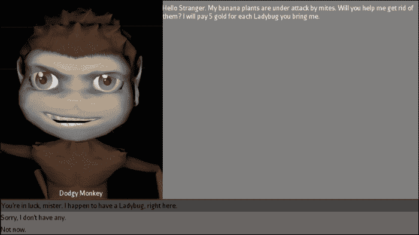
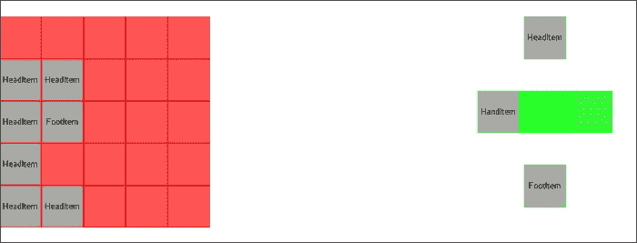
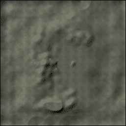

# 第六章. 使用 Nifty GUI 的 GUI

首先，什么是**Nifty GUI**？它不是 jMonkeyEngine 中可用的唯一 GUI，但它是官方支持的。它不是由 jMonkeyEngine 团队开发的，而是一个独立的开源项目，在其他引擎中也有实现。

在本章中，我们将涵盖以下主题：

+   初始化 Nifty 和管理选项菜单

+   加载屏幕

+   创建一个 RPG 对话框屏幕

+   实现一个游戏控制台

+   处理游戏消息队列

+   创建一个库存屏幕

+   自定义输入和设置页面

+   使用离屏渲染实现小地图

# 简介

Nifty GUI 是通过屏幕操作的。屏幕可以是，例如，游戏中的(**HUD**) **抬头显示**或同一游戏的主菜单。屏幕是用 XML 和 Nifty 自己的标签集构建的。在每一个屏幕上，可以有层叠的层，这些层根据它们的顺序绘制。

在屏幕上，对象像网页上一样级联，即从上到下或从左到右，具体取决于设置。以下代码是一个简单屏幕可能看起来像的示例：

```java
<nifty 

        xsi:schemaLocation="http://nifty-gui.sourceforge.net/nifty-1.3.xsd http://nifty-gui.sourceforge.net/nifty-1.3.xsd">
  <useStyles filename="nifty-default-styles.xml" />
  <useControls filename="nifty-default-controls.xml" />

  <registerSound id="showWindow" filename="Sound/Effects/Beep.ogg" />

  <screen id="main" controller="gui.controller.MainScreenController">
    <layer id="layer0" childLayout="absolute" backgroundColor="#000f">
      <!-- add more content -->
    </layer>
  </screen>
</nifty>
```

每个屏幕都与一个`Controller`类相关联。这是 XML 和 Java 之间的链接，允许 Nifty 控制代码中的功能，反之亦然。

另一个重要的概念是`Controls`（不要与`Controller`类或 jMonkeyEngine 的 Control 接口混淆）。使用`Controls`是一种非常方便的方法来使屏幕文件更小并创建可重用组件。任何熟悉，例如，JSF 组件的人都会看到相似之处。强烈建议您尽早熟悉使用这些，否则屏幕文件将很快变得难以管理。

一个 UI 的实现通常非常特定于所讨论的游戏。本章将尝试展示和解释 Nifty GUI 中可用的不同功能和效果。即使配方标题对你没有吸引力，仍然值得浏览内容，看看它是否涵盖了适合你项目的某些功能。

# 初始化 Nifty 和管理选项菜单

首先，让我们从一个简单的配方开始，这个配方将为我们提供设置应用程序使用 Nifty GUI 的基本知识，并告诉我们如何管理选项菜单。选项菜单通常在游戏中找到；它充当不同屏幕之间的链接。因此，使用控制模式创建它是合适的，这样就可以轻松地在屏幕之间处理。

我们将在`AppState`内部初始化 Nifty GUI，以将其与主应用程序代码隔离开来，然后从 Nifty 访问应用程序并通过代码控制 Nifty。

## 准备工作

让我们看看如何在应用程序中初始化 Nifty。我们首先定义一个新的`AppState`来处理我们的 Nifty 功能。我们可以称它为`NiftyAppState`，并让它扩展`AbstractAppState`。

在 `initialize` 方法中，我们需要使用以下代码创建 Nifty 显示，给 Nifty 访问应用程序中的各种功能，并告诉它在 GUI 视图中渲染 `o`：

```java
NiftyJmeDisplay niftyDisplay = new NiftyJmeDisplay(app.getAssetManager(),
                app.getInputManager(),
                app.getAudioRenderer(),
                app.getRenderManager().getPostView("Gui Default"));
```

我们还应该使用 `niftyDisplay.getNifty()` 将 Nifty 实例存储在类中，以便以后使用。完成此操作后，我们需要将 `niftyDisplay` 添加为我们刚才指定的视图的处理器，使用以下代码：

```java
app.getRenderManager().getPostView("Gui Default").addProcessor(niftyDisplay);
```

在 Nifty 能够显示任何内容之前，我们需要做的最后一件事是告诉它要绘制什么。我们通过 `nifty.fromXml` 来完成这个操作，并传递要使用的 XML 文件以及屏幕的名称（如果多个屏幕存储在同一个 XML 中）。

## 如何做到这一点...

我们首先定义我们的选项菜单和包含它的屏幕的 XML 文件。执行以下步骤来完成此操作：

1.  首先，我们应该创建一个名为 `optionsMenu.xml` 的新文件。它应该位于 `Interface/Controls` 文件夹中。

1.  我们需要拥有的第一个标签是 `<nifty-controls>` 标签，以便让 Nifty 知道内部元素应该被解析为控件。

1.  然后，我们添加 `<controlDefinition name="options">`，这是实际的选项菜单实例。

1.  实际布局从这里开始，它通过一个 `<panel>` 元素开始，如下面的代码所示：

    ```java
    <panel id="optionsPanel" childLayout="vertical" width="40%" height="60%" align="center" valign="center" backgroundColor="#333f">
    ```

1.  在顶部，我们将有一个包含 `<control name="label">` 元素且文本为 "Options" 的 `<panel>`。

1.  在此面板的右侧，应该有一个带有熟悉的 **x** 图标的按钮来关闭菜单，以及一个交互元素来调用 `Controller` 类中的方法，如下面的代码所示：

    ```java
    <control name="button" id="closeButton" align="right" label="x" height="30px" width="30px" >
      <interact onClick="toggleOptionsMenu()"/>
    </control>
    ```

1.  在此之后，我们可以根据需要添加任意多的 `<control name="button">` 元素，以便我们的选项菜单能够正常工作。至少应该有一个在 `Controller` 类中调用 `quit()` 的元素来停止应用程序。

1.  现在，我们可以定义一个屏幕来包含我们的选项菜单。如果我们右键单击 **Projects** 窗口并选择 **New/Empty Nifty GUI file**，我们将得到一个基本的屏幕设置。

1.  清除 `<layer>` 标签之间的所有内容，并将 `<screen>` 元素的控制器更改为 `gui.controls.NiftyController`。

1.  接下来，我们需要使用 `<useStyles>` 标签定义要包含的样式，该标签应该出现在 `<screen>` 元素之前。

1.  我们添加 `<useControls filename="nifty-default-controls.xml" />` 以包含对基本 nifty 控件的访问，例如按钮，并且我们应该为我们的选项菜单添加另一个 `<useControls>` 标签。这些也应该添加在 `<screen>` 元素之前。

现在，我们可以开始查看这个 `Controller` 代码。执行以下五个步骤来完成此操作：

1.  我们应该定义一个实现 `ScreenController` 接口的类，它将成为 GUI 和代码之间的链接。我们可以将其设为抽象类，并命名为 `NiftyController`。

1.  它应该有两个受保护的字段，即 `Nifty nifty` 和 `Screen screen`，这些字段将在 `bind` 方法中设置。

1.  我们还需要一个名为 `optionsMenuVisible` 的布尔字段。

1.  我们需要为`optionsMenu.xml`文件中指定的每个方法添加方法，并且`toggleOptionsMenu()`应该根据`optionsMenuVisible`是否为真来显示或隐藏菜单。获取元素的一个方便方法是使用以下代码：

    ```java
    nifty.getCurrentScreen().findElementByName("options");
    ```

1.  然后，我们可以在元素上调用`hide()`或`show()`来控制其可见性。

通常，当按下*Esc*键时，应用程序会关闭。让我们让选项菜单来处理这个操作；这包括以下四个步骤：

1.  首先，通过在`NiftyAppState`初始化方法中添加以下行来删除相关的映射：

    ```java
    app.getInputManager().deleteMapping(SimpleApplication.INPUT_MAPPING_EXIT);
    ```

1.  现在，我们需要添加自己的 Esc 键映射，如下所示：

    ```java
    app.getInputManager().addMapping("TOGGLE_OPTIONS", new KeyTrigger(KeyInput.KEY_ESCAPE));
    app.getInputManager().addListener(this, "TOGGLE_OPTIONS");
    ```

1.  `NiftyAppState`方法还需要实现`ActionListener`并处理按键：

    ```java
    public void onAction(String name, boolean isPressed, float tpf) {
      if(name.equals(TOGGLE_OPTIONS) && isPressed){
     ((NiftyController)nifty.getCurrentScreen().getScreenController()).toggleOptionsMenu();
      }
    }
    ```

1.  移除正常关闭程序后，我们需要在`NiftyController`内部添加功能来处理这种情况。由于此类将由屏幕共享，我们为应用程序提供了静态访问和设置方法。`quit`方法只需调用`app.stop()`来关闭它。

## 它是如何工作的...

Nifty 是在`AppState`内部初始化的，这样可以将代码从主应用程序中分离出来，使其更加模块化。这也使得添加一些与控制 GUI 相关的更通用的功能变得更加容易。

每个 nifty `Controller`类都必须实现`ScreenController`接口，以便 Nifty 能够找到它。由于一些功能将在屏幕之间共享，我们创建了一个名为`NiftyController`的抽象类来避免代码重复。除了处理通用的选项菜单外，它还被赋予了访问应用程序本身的权限。

XML 文件和`Controller`类之间的链接不需要指定，只需在屏幕中提供控制器的限定名称。同样，Nifty 会自动使用`ButtonControl`的`interact`标签中提供的名称来查找方法。

`<panel>`元素是多功能对象，可以用于布局的许多部分，并且可以包含大多数其他类型的布局项。

在`<nifty-controls>`标签内包含多个`<controlDefinition>`元素是可以的。

## 更多内容...

使用属性文件作为 Nifty 文件的后备以进行本地化非常容易，如下所述：

+   首先，需要存在以下标签来链接属性文件：

    ```java
    <resourceBundle id="localization" filename="packagename.filename" />
    ```

+   它可以从`label`控件中调用，例如：

    ```java
    <control name="label" text="${localization.STR_HELLO_WORLD}"/>
    ```

# 加载屏幕

在这个菜谱中，我们将开发一个加载屏幕以及游戏控制器。它将涵盖加载屏幕的最重要方面，例如显示正在加载的文本和图像以及显示系统正在工作的指示器。

在开始之前，建议您对如何在应用程序中设置 Nifty 以及如何创建屏幕和控制器有一个基本的了解。如果您对此不确定，请查看之前的配方，*初始化 Nifty 管理选项菜单*。

## 如何做到这一点...

我们首先创建加载屏幕的 XML。执行以下九个步骤来完成此操作：

1.  创建一个名为`loadingScreen.xml`的新文件，并加载`Nifty-default-styles`和`Nifty-default-controls`。可选地，我们还可以包括之前配方中的`optionsMenu`。

1.  我们需要的第一个元素是一个`<screen>`元素：

    ```java
    <screen id="loadingScreen" controller="gui.controller.LoadingScreenController">
    ```

1.  在此内部，我们定义一个`<layer>`元素：

    ```java
    <layer id="layer0" childLayout="center" backgroundColor="#000f">
    ```

1.  在此`<layer>`元素内部，我们定义了`<panel>`，它将包含我们的布局。请注意，我们将`visible`设置为`false`：

    ```java
    <panel id="loadingPanel" childLayout="vertical" visible="false">
    ```

1.  由于我们希望屏幕有一个平滑的过渡效果，我们将为此面板添加一个淡入效果：

    ```java
    <effect>
      <onShow name="fade" start="#00" end="#ff" length="500" inherit="true"/>
      <onEndScreen name="fade" start="#ff" end="#00" length="200" inherit="true"/>
    </effect>
    ```

1.  为了给它添加电影风格和非交互式的感受，我们将在文件中放置三个`<panel>`元素。在顶部和底部，将有两个黑色条带，用于标注加载图像，这些图像将出现在中央面板中。

1.  在`topPanel`元素内部，我们定义`<control name="label">`，它将包含正在加载的场景的名称。

1.  `bottomPanel`元素将有一个动画指示器，它会显示系统没有冻结。我们将在其中定义另一个面板，与屏幕的右侧对齐。我们将使用`imageSizePulsate`效果来动画化这个面板，并使其淡入，如下面的代码所示：

    ```java
    <effect>
      <onShow name="fade" start="#00" end="#ff" length="1000"/>
      <onShow name="imageSizePulsate" startSize="100%" endSize="50%" pulsator="SinusPulsator" activated="true" timeType="infinite"/>
    </effect>
    ```

1.  可选地，我们还可以在之前的`<layer>`标签旁边添加另一个`<layer>`标签，其中包含之前配方中的`options`控件。

现在，我们有一个完整的 XML。让我们看看这个控制器的样子。我们将通过以下七个步骤来创建它：

1.  我们首先创建一个名为`LoadingScreenController`的新类，该类扩展了我们之前配方中创建的`NiftyController`类。

1.  我们定义了两个字符串`loadingText`和`loadingScreen`，以及这些字符串的设置器。

1.  接下来，我们重写`onStartScreen()`方法，并向其中添加以下三行：

    ```java
    screen.findNiftyControl("caption", Label.class).setText(loadingText); screen.findElementByName("centralPanel").getRenderer(ImageRenderer.class).setImage(nifty.createImage(loadingScreen, true));
    screen.findElementByName("loadingPanel").setVisible(true);
    ```

1.  控制器现在已经完成。然而，在我们能够查看它之前，还有一些其他的事情需要做。

1.  首先，我们需要将屏幕添加到 Nifty 中。如果我们有之前的配方中的`NiftyAppState`方法，我们应该在`nifty.fromXml`调用之后立即添加以下行：

    ```java
    nifty.addXml("Interface/Screens/loadingScreen.xml");
    ```

1.  我们还可以添加一个`convenience`类来访问`nifty.gotoScreen()`。

1.  现在，在从我们的主类调用`gotoScreen("loadingScreen")`之前，我们可以添加以下行来设置`lodingText`和`loadingImage`：

    ```java
    ((LoadingScreenController)niftyState.getNifty().getScreen("loadingScreen").getScreenController()).setLoadingText("Loading Test Scene"); ((LoadingScreenController)niftyState.getNifty().getScreen("loadingScreen").getScreenController()).setLoadingImage("Interface/Image/loadingScreen.png");
    ```

## 它是如何工作的...

这个配方中的大部分工作都集中在正确获取 XML 布局上。在纸上先画出来并可视化元素的流程是个好主意。

淡入效果较短的原因是因为当它淡出时，游戏已经准备好可以玩，玩家不需要等待比必要的更长的时间。当加载屏幕首次显示时，玩家必须等待游戏加载。

我们之所以在开始时将 `loadingPanel` 设置为 `visible="false"` 并使用 `onShow` 而不是 `onScreenStart` 效果，是有原因的。控制器中的 `onStartScreen` 方法在屏幕启动后和 `onScreenStart` 效果被触发（并完成）后被调用。这意味着任何淡入效果都会在我们设置图像之前发生，并且它们会在一段时间后突然出现。由于 `onShow` 效果是在元素变为可见后调用的，我们通过这种方式解决了这个问题。

这里还有一个可能的陷阱，特别是如果我们使用测试用例来显示屏幕，那就是我们无法在初始化 `NiftyAppState` 后立即调用 `nifty.gotoScreen`。由于 `AppState` 初始化方法是以线程安全的方式调用的，它不会运行直到下一个更新周期。这意味着如果我们尝试在下一条语句中更改屏幕，我们将得到 `NullPointerException`。

# 创建一个 RPG 对话框屏幕

正如标题所暗示的，我们将探讨创建一个对话框屏幕的方法，类似于许多角色扮演游戏（RPG）中找到的。它将显示正在交谈的角色的图像，但可以使用一些巧妙的摄像机工作来放大角色的图像来代替。

它将使用 Nifty `ListBox` 来显示玩家的可用对话选项，并使用监听器来获取玩家选择的结果。

很可能需要一个支持实现的对话树系统。在这个例子中，我们将使用一个名为 `DialogNode` 的模板类。它将包含有关角色名称、图像和所说内容的信息。它还包含玩家选项的字符串数组，如以下截图所示。它缺少的是每个选项的回调。然而，将可以从控制器的监听器方法中调用它。



## 如何实现...

在我们开始处理屏幕之前，我们应该定义一个新的可重用 Nifty 控制来包含玩家正在交谈的角色的信息；执行以下步骤来完成此操作：

1.  创建一个名为 `characterDialogControls.xml` 的新文件，并在其中创建一个带有 `<nifty-controls>` 标签的新 `<controlDefinition name="characterControl">` 类。

1.  这个布局相当简单；它需要一个包含另一个 `<panel>` 元素以显示角色图像和 `<control name="label">` 元素以显示名称的 `<panel>` 元素。

现在，让我们构建对话框屏幕。我们通过执行以下九个步骤来完成此操作：

1.  创建一个名为 `dialogScreen.xml` 的新文件，并加载 `nifty-default-styles` 和 `nifty-default-controls`。它还应加载 `characterDialogControls.xml` 文件。我们还可以包括之前配方中的 `optionsMenu`。

1.  我们需要的第一个元素是一个 `<screen>` 元素：

    ```java
    <screen id="dialogScreen" controller="gui.controller.DialogScreenController">
    ```

1.  在这里，我们定义一个 `<layer>` 元素：

    ```java
    <layer id="layer0" childLayout="center" backgroundColor="#0000">
    ```

1.  在 `<layer>` 元素内部，我们定义 `<panel>`，它将包含我们布局的其余部分：

    ```java
    <panel id="dialogPanel" childLayout="vertical" visible="false">
    ```

1.  我们还将为此面板添加一个简短的淡入效果：

    ```java
    <effect>
      <onShow name="fade" start="#00" end="#ff" length="200" inherit="true"/>
      <onEndScreen name="fade" start="#ff" end="#00" length="200" inherit="true"/>
    </effect>
    ```

1.  对话框面板将包含四个 `<panel>` 元素。在顶部和底部，我们应该添加两个带有黑色背景的细面板，以使其具有电影感。

1.  两个中央面板的上部将包含我们刚刚创建的 `characterControl`：

    ```java
    <control name="characterControl" id="character"/>
    ```

1.  下一个将有一个包含玩家对话框选项的列表框：

    ```java
    <control id="dialogOptions" name="listBox" vertical="off" horizontal="off" displayItems="3" selection="Single"/>
    ```

1.  如果我们还想支持选项菜单，它应该放在一个单独的层中，以便在其余 GUI 之上显示。

为此可以创建控制器代码，通过执行以下 12 个步骤：

1.  首先，定义一个新的类 `DialogScreenController`，它扩展 `NiftyController` 或实现 `ScreenController`（如果不可用抽象 `Controller` 类）。

1.  接下来，我们添加两个字段：一个用于当前的 `DialogNode`，`dialogNode`，以及在 XML 中对 `ListBox` 的引用 `dialogOptions`。

1.  应该重写 `onStartScreen()` 方法；在这里，它应该通过调用 `screen.findNiftyControl` 来设置 `dialogOptions`：

    ```java
    dialogOptions = screen.findNiftyControl("dialogOptions", ListBox.class);
    ```

1.  最后，如果设置了 `dialogNode`，`onStartScreen` 应该也调用 `onDialogNodeChanged()`。

1.  现在，我们需要定义一个名为 `onDialogNodeChanged` 的方法，它将应用对话框信息到布局中。

1.  我们应该从设置角色的名称开始；再次，我们将使用 `screen.findNiftyControl` 来完成这项工作：

    ```java
    screen.findNiftyControl("characterName", Label.class).setText(dialogNode.getCharacterName());
    ```

    同样，对话框文本也是以相同的方式设置的。

1.  要设置图像，我们需要创建 `NiftyImage` 并将其传递给元素的 `ImageRenderer`，以下代码：

    ```java
    screen.findElementByName("characterImage").getRenderer(ImageRenderer.class).setImage(nifty.createImage(dialogNode.getCharacterImage(), true));
    ```

1.  接下来，我们清除 `dialogOptions` 并使用 `dialogOptions.addItem` 应用 `DialogNode` 中可用的值。

1.  最后，我们调用 `dialogOptions.refresh()` 和 `screen.layoutLayers()` 并将 `dialogPanel` 元素设置为可见。

1.  要找出 `dialogOptions` 中按下的项目，我们向类中添加一个监听方法：

    ```java
    public void onDialogOptionSelected(final String id, final ListBoxSelectionChangedEvent event)
    ```

1.  然后，我们添加一个注释来告知它要监听哪个元素：

    ```java
    @NiftyEventSubscriber(id="dialogOptions")
    ```

1.  使用 `event.getSelectionIndices()`，我们可以找出玩家按下了哪个项目。

## 它是如何工作的...

有时，要得到我们想要的布局可能很棘手，但一般来说，重要的是要知道 Nifty 真的喜欢定义宽度和高度。

在这里使用 ListBox 可以免费获得很多功能，因为它可以处理动态数量的选项，并且使用 `listener` 方法可以轻松处理回调到代码。默认情况下，它具有滚动条并支持多选，这就是为什么我们明确将其定义为 `selection="Single"` 并使用 `vertical="off"` 和 `horizontal="off"` 来关闭滚动条。它还支持使用上、下和 *Enter* 键进行项目选择。

控制器中的监听方法可以命名为任何名称；Nifty 寻找的是注解和方法参数。从这里，我们可以根据玩家的选择调用下一个`DialogNode`或其他代码。

# 实现游戏控制台

控制台可以是一个非常强大的工具，允许玩家控制可能还没有功能 UI 或由于复杂性而无法设置 UI 的游戏功能。

这个菜谱将在本章的第一个菜谱中实现控制台，并使用`Move`效果将其滑动到视图中或从视图中滑出。此外，它还将描述如何使用控制台命令让玩家控制游戏功能。

## 如何做到这一点...

就像之前一样，我们首先定义一个将托管控制台的控制。这可以通过执行以下四个步骤来完成：

1.  在`<nifty-controls>`标签内，我们添加一个新的`<controlDefinition name="consoleControl">`类。

1.  然后，我们添加一个小控制台，将其与屏幕底部对齐：

    ```java
    <control id="console" name="nifty-console" lines="10" width="100%" valign="bottom" backgroundColor="#6874" visible="true">
    ```

1.  为了使简单的控制台更加生动，我们在显示或隐藏时给它添加一个`Move`效果：

    ```java
    <effect>
      <onShow name="move" mode="fromOffset" offsetY="100" length="300" inherit="true"/>
      <onHide name="move" mode="toOffset" offsetY="100" length="200" inherit="true"/>
    </effect>
    ```

1.  在`mainScreen.xml`中，我们在一个新层内添加`controlDefinition`：

    ```java
    <layer id="consoleLayer" childLayout="center" backgroundColor="#0000">
      <control name="consoleControl"/>
    </layer>
    ```

这就是 XML 黑客的结束。现在，我们可以将注意力转向从*初始化 Nifty 和管理选项菜单*菜谱中的`NiftyController`类，并添加一个控制台来处理它。这可以通过执行以下 10 个步骤来完成：

1.  我们需要添加一个新的字段`Console console`，并使用以下代码进行绑定：

    ```java
    nifty.getScreen("main").findNiftyControl("console", Console.class);
    ```

1.  接下来，我们添加一个关于从外部来源输出文本到控制台的方法。我们称它为`outputToConsole`，它接受一个字符串作为输入。然后它调用`console.output`来显示消息。

1.  另一个新方法是`toggleConsole()`。它应该检查`console.getElement()`是否可见，然后相应地隐藏或显示它。

1.  然后，我们添加一个`subscriber`方法，它将接收控制台中输入的任何内容。它需要带有控制台 ID 的`@NiftyEventSubscriber`注解。它还需要一个方法声明，如下面的代码所示：

    ```java
    public void onConsoleCommand(final String id, final ConsoleExecuteCommandEvent command)
    ```

1.  定义一个新的类`HideCommand`，它实现了`ConsoleCommand`。

1.  在`HideCommand`类中添加一个字段`NiftyController`控制器以及一个设置方法。

1.  在实现的`execute`方法中，我们调用`controller.toggleConsole()`。

1.  返回到`NiftyController`，我们实例化一个新的`HideCommand`方法并设置控制器。

1.  然后我们创建一个新的`ConsoleCommands`实例并调用`registerCommand`；之后，我们提供/隐藏实例并调用`commandText`，以及`HideCommand`作为`ConsoleCommand`。

1.  最后，我们在`ConsoleCommands`实例中调用`enableCommandCompletion(true)`。

## 它是如何工作的...

在这个菜谱中，我们实现了两种处理控制台输入的方法。最直接的方法是`onConsoleCommand`方法，其中我们获取原始输入并可以对其进行任何操作。

更复杂的方法是使用`ConsoleCommands`。使用它，我们得到一个很好的分层模式来处理输入。一旦控制台显示或隐藏，它将快速滑动进入或退出屏幕，并带有移动效果。它将移动`offsetY`距离，并根据模式，它将移动到该偏移量或从该偏移量移动。`inherit="true"`值确保子元素与相关组件一起移动。

# 处理游戏消息队列

使用控制台可以将大多数游戏相关信息传达给玩家。然而，这仅仅是一种非常基础的通信形式。现代玩家通常期望有更多图形化的信息接收方式。在这个菜谱中，我们将探讨使用 Nifty 实现这一点的其中一种方法。我们将创建一个动态的消息队列，消息从屏幕右侧移动进来，点击后淡出。

实际上并不需要那么多代码行。

## 如何实现...

完成此菜谱的 XML 可以通过以下五个步骤完成：

1.  我们首先定义一个新的`<controlDefinition name="gameMessage">`。

1.  在这里，我们应该添加一个`panel`元素，并在该`panel`元素内部添加两个带有 ID `#title`和其他内容的`<control name="label">`元素。

1.  该面板还应具有两个效果，一个`onShow`触发器和另一个`onHide`触发器，分别具有移动和淡出效果，如下面的代码所示：

    ```java
    <onShow name="move" mode="fromOffset" offsetX="1500" length="100" inherit="true"/>
    <onHide name="fade" start="#ff" end="#00" length="100" inherit="true"/>
    ```

1.  除了`gameMessage`控制之外，我们还可以定义另一个控制作为我们的`messageQueue`元素。它只需要一个水平对齐的面板，覆盖整个屏幕。

1.  为了使它们对齐，`messageQueue`控制被添加到与控制台相同的层中的`mainScreen.xml`文件内。

    在`MainScreenController`内部，我们需要进行以下更改：

1.  首先，添加一个新的`int`字段，称为`messageIndex`。

1.  然后，我们需要两个方法。其中一个是名为`addMessage`的方法，它应该接受一个字符串作为输入。

1.  在`addMessage`方法内部，我们定义一个名为`messageBuilder`的`ControlBuilder`方法。这将创建`gameMessage`控制：

    ```java
    messageBuilder = new ControlBuilder("gameMessage") {{
      id("message"+messageIndex);
      interactOnClick("removeMessage("+messageIndex+")");
    }};
    ```

1.  在这个对象上调用`build`方法，并传入`messageQueue`元素作为父元素后，我们可以调用`element.findNiftyControl`来设置`gameMessage`控制内部标签的标题和文本。

1.  然后，我们调用`element.show()`并增加`messageIndex`以供下一条消息使用。

1.  我们创建的第二个方法是`removeMessage`。它接受一个名为`id`的字符串作为输入。

1.  在这里，我们使用`screen.findElementByName`来查找消息，并调用`hide`。

1.  在执行此操作时，我们提供一个新的`EndNotify`对象，在其`perform`消息中应调用消息上的`markForRemoval()`，并调用父`messageQueue`控制上的`layoutElements()`。

## 它是如何工作的...

一旦在`Controller`类中调用`addMessage`方法，`ControlBuilder`将创建一个新的`gameMessage`实例。`interactOnClick`元素告诉`gameMessage`在点击时调用`removeMessage`，并提供其索引作为`id`。

在其构建并添加到`messageQueue`后，我们填充消息的标题和内容元素。Nifty 更喜欢使用`#`作为这些元素的 ID，以表示非唯一 ID。

`gameMessage`实例在创建时不可见，我们调用`show()`来使其播放我们定义的`onShow`效果。

`Move`效果被设置为具有`offsetX`，它位于屏幕之外。如果它太低，当它出现时会有一个弹出效果。它被设置为在 100 毫秒内达到目标位置。当它们被添加时，消息会很好地堆叠起来，无需任何额外的工作。

消息被设置为在点击时消失，如构建器中定义的，通过`interactOnClick`方法。我们不仅想要移除它们，还想要播放一个简短的淡入淡出效果，以使过渡更加平滑。在这种情况下，简单地隐藏它们也不够。因为它们仍然占据`messageQueue`面板中的一个位置，剩余的消息不会正确对齐。

因此，我们希望在`gameMessage`元素上调用`markForRemoval`。然而，这样做会立即将其移除，在我们播放隐藏效果之前。这就是为什么我们提供一个`EndNotify`对象，它在隐藏效果播放完成后被处理；然后，我们在这里添加`markForRemoval`调用。

## 还有更多…

假设我们希望能够在窗口中显示消息，无论是点击队列中的消息，还是任何时间。在这种情况下，我们可以使用 Nifty 的窗口控制。

我们可以在`gameMessageControls.xml`文件中定义一个新的`controlDefinition`，并命名为`messageWindow`。在这个内部，我们将添加`<control name="window">`，在其中我们可以添加任何我们想要的内容。目前，我们可以用`<control name="label">`来处理文本内容，并在显示或隐藏窗口时添加一个简短的淡入淡出效果。

然后，我们可以将`addMessage`方法复制到`MainScreenController`中，而不是让`ControlBuilder`创建`gameMessage`，我们可以告诉它构建一个`messageWindow`窗口。

我们不需要`interactOnClick`元素，因为窗口默认可以关闭。相反，我们可以用它来设置窗口的标题：

```java
set("title", "Window"+windowIndex);
```

窗口默认也是可拖动的，但父元素必须具有`childLayout="absolute"`才能使其工作，因为它让元素自己决定其位置。

# 创建库存屏幕

在这个菜谱中，我们将创建一个库存屏幕，这在 RPG 游戏中非常常见。为此，我们将使用 Nifty 中的`Droppable`和`Draggable`组件，并创建一个`InventoryItem`类来帮助我们区分不同类型的物品（因此，它们可以附加的位置）。这次，我们将使用 XML 来创建静态组件，并使用 Java Builder 接口来构建库存（或背包）槽位。原因是许多游戏中，角色的库存量是变化的。

## 如何操作...

我们首先创建控制组件，这是此方法的关键组成部分。这可以通过以下四个步骤来完成：

1.  首先，我们创建一个新的控制文件，`inventoryControls.xml`，并使用 `<nifty-controls>` 标签。

1.  在此内部，我们首先定义 `<controlDefinition name="itemSlot">` 并包含以下内容：

    ```java
    <control name="droppable" backgroundColor="#fff5" width="64px" height="64px" margin="1px" childLayout="center"/>
    ```

1.  然后，类似地，我们创建一个可拖动的控件作为项目，并命名为 `<controlDefinition name="item" >`。

1.  此项目包含可拖动的组件以及带有项目名称的标签：

    ```java
    <control name="draggable" backgroundColor="#aaaf" width="64px" height="64px" childLayout="center" valign="top">
      <text id="#itemLabel" text="" color="#000f" valign="center" width="100%" style="nifty-label"/>
    </control>
    ```

接下来，我们可以将注意力转向屏幕本身。可以通过以下五个步骤创建屏幕：

1.  首先，我们确保要使用的样式已加载，并将我们的 `inventoryControls.xml` 文件通过 `<useControls>` 加载：

1.  然后，我们添加一个带有指向控制器文件链接的 `<screen>` 元素：

    ```java
    <screen id="inventoryScreen" controller="gui.controller.InventoryScreenController">
    ```

1.  在此内部，我们需要一个 `<layer>` 元素：

    ```java
    <layer id="layer0" childLayout="center" backgroundColor="#0000">
    ```

1.  在 `<layer>` 元素内部，我们需要一个 `<panel>` 元素来包含其余布局：

    ```java
    <panel id="inventoryPanel" childLayout="horizontal">
    ```

1.  下一个元素是一个面板，用于保持动态创建的 `itemSlots`：

    ```java
    <panel id="inventorySlots" childLayout="horizontal"/>
    ```

    以下截图显示了动态创建的项目槽位：

    

    然后，我们使用 `itemSlot` 控制创建一个简单的人形表示，具有两只手和脚。我们使用 `align` 和 `childLayout` 来使组件出现在我们想要的位置。

1.  首先，添加一个面板来包含组件：

    ```java
    <panel id="characterPanel" childLayout="vertical">
    ```

1.  然后，使用以下命令添加头部：

    ```java
    <panel id="character" backgroundColor="#000f" childLayout="center" align="center" valign="top">
      <control name="itemSlot" id="Head"/>
    </panel>
    ```

1.  使用以下命令添加一只左手和一只右手：

    ```java
    <panel id="hands" backgroundColor="#000f" childLayout="horizontal" width="25%" align="center" valign="bottom">
      <control name="itemSlot" id="HandLeft" align="left" />
      <panel width="*" height="1px"/>
      <control name="itemSlot" id="HandRight" align="right" />
    </panel>
    ```

1.  最后，我们为腿部/脚部设置了一个 `itemSlot`：

    ```java
    <panel id="legs" backgroundColor="#000f" childLayout="horizontal" align="center" valign="bottom">
      <control name="itemSlot" id="Foot"/>
    </panel>
    ```

在完成 XML 元素后，我们可以转向 Java 代码。以下九个步骤是必要的：

1.  我们创建一个名为 `InventoryItem` 的类。这个类有一个枚举（枚举）用于不同的身体部位：头部、手、脚和名称。

1.  接下来，我们将创建 `Controller` 类，`InventoryScreenController`，并使其扩展 `NiftyController`；同时实现 `DroppableDropFilter`。

1.  我们需要添加一个映射来包含我们的 `InventoryItems`，名称作为键。它可以被称为 `itemMap`。

1.  `bind` 方法应该被覆盖，在这里，我们应该在 `InventoryScreen` 中找到不同的 `DropControls` 并将此类作为过滤器使用以下代码：

    ```java
    screen.findNiftyControl("HandLeft", Droppable.class).addFilter(this);
    ```

    现在，我们可以在库存中以 5 x 5 网格生成项目槽位。

1.  我们定义两个构建器：`ControlBuilder` 用于 itemSlot 控件和 `PanelBuilder` 用于创建包含五个 itemSlots 的列。

1.  我们可以使用 `for` 循环迭代以下块五次：

    ```java
    panelBuilder = new PanelBuilder("") {{
      id("inventoryColumn"+posX);
      childLayoutVertical();
    }};
    panelBuilder.build(nifty, screen, screen.findElementByName("inventorySlots"));
    ```

1.  在此 `for` 循环内部，我们运行另一个 `for` 循环，为该列生成五个项目槽位：

    ```java
    slotBuilder = new ControlBuilder("itemSlot") {{
      id("itemSlot"+index);
    }};
    Element e = slotBuilder.build(nifty, screen, screen.findElementByName("inventoryColumn"+posY));
    ```

1.  对于每个项目槽位，我们还需要添加以下类作为 DropFilter：

    ```java
    e.findNiftyControl("itemSlot"+index, Droppable.class).addFilter(this);
    ```

1.  实现的方法需要一些逻辑。一旦项目被投放到 `itemSlot` 上，我们应该检查它是否允许，我们可以通过以下代码行来完成：

    ```java
    InventoryItem item = itemMap.get(drgbl.getId());
    if(drpbl1.getId().startsWith(item.getType().name()) || drpbl1.getId().startsWith("itemSlot")){
      return true;
    ```

    在完成项目槽位后，我们可以生成一些项目进行测试。

1.  首先，我们使用 `for` 循环创建 10 个具有不同类型和名称的 `InventoryItems`。

1.  对于这些，我们使用`ControlBuilder`和之前定义的项目控件创建 Nifty 控件，如下面的代码所示：

    ```java
    itemBuilder = new ControlBuilder("item") {{
      id("item"+index);
      visibleToMouse(true);
    }};
    Element e = itemBuilder.build(nifty, screen, screen.findElementByName("itemSlot"+index)); e.findElementByName("#itemLabel").getRenderer(TextRenderer.class).setText(item.getName());
    ```

1.  然后，我们将每个库存项目放入 itemMap 中，以控件的 ID 作为键。这确保我们可以轻松地找到拖动或放下巧妙物品的库存项目的链接。

## 它是如何工作的...

我们用来创建物品槽的 Java Builder 界面需要一段时间才能习惯，但当我们需要动态创建巧妙元素时，它是一个非常强大的工具。在这种情况下，我们仍然使用预定义的控制。这为我们节省了几行代码，并允许非编码人员编辑组件的布局和样式，因为它们在 XML 文件中是公开的。

默认情况下，`Droppable`控件将始终接受被丢弃的`Draggable`控件。`DroppableDropFilter`中的`accept`方法使我们能够定义应该接受什么或不接受什么。在本配方中，它通过仅接受特定类型的`InventoryItems`来展示。`accept`方法的方法参数可以描述，第一个`Droppable`是`draggable`控件被拾起的地方的控件。`Draggable`控件是被移动的项目。第二个`Droppable`控件是`Draggable`被丢弃的目标。

### 小贴士

在撰写本文时，第一次移动`Draggable`控件时，第一个`Droppable`控件往往会是 null。

# 自定义输入和设置页面

几乎所有现代游戏都允许玩家根据自己的喜好自定义输入。这个配方将依赖于 jMonkeyEngine 为我们完成工作，我们将使用 Nifty GUI 作为视觉辅助工具。我们将使用`RawInputListener`来确定哪些键被按下，并使用`Keyboard`类将它们分为键码和字符。

## 准备工作

这个配方将取决于`InputManager`中是否存在一些绑定。如果你已经有了游戏，这不会是问题。如果没有，它将描述如何为示例添加一些绑定。

## 如何做到这一点...

按照之前的配方模式，我们将开始定义控件，然后转到屏幕，最后处理控制器。添加控件和屏幕将包括以下八个步骤：

1.  在`<nifty-control>`标签内部，我们定义一个新的`<controlDefinition name="keyBindingControl">`。

1.  在这里，我们将向容器边缘添加一个带有一些边距的水平扩展面板，以及足够的高度来容纳文本：

    ```java
    <panel childLayout="horizontal" width="80%" height="25px" backgroundColor="#666f" marginLeft="10px" marginRight="10px" marginTop="4px" align="center" >
    ```

1.  这个面板将包含三个元素。第一个是一个包含键绑定文本的标签控件，如下面的代码所示：

    ```java
    <control name="label" id="#command" width="150px" text=""/>
    ```

1.  然后，它将有一个按钮来更改绑定，显示当前键：

    ```java
    <control name="button" id="#key" width="100px" valign="center"/>
    ```

1.  在它们之间，它将有一个简单的面板，`width="*"`。

1.  现在，我们可以定义另一个`<controlDefinition name="settingsControl">`，它将包含我们的`keyBindingControls`。

1.  这将包含一个面板，在这个面板内部，为每个移动方向添加四个`keyBindingControls`。这些控制的 ID 应该代表方向，并以一个键结尾，如下所示：

    ```java
    <control name="keyBindingControl" id="forwardKey"/>
    ```

1.  屏幕需要以下点：

    +   ID 应该是 settings，控制器应该是`gui.controller.SettingsController`

    +   我们刚刚创建的`settingsControl`类应该添加到层元素内部

关于 XML 的内容就到这里。要创建`Controller`类，请执行以下步骤：

1.  如往常一样，我们创建一个新的类，该类扩展了`NiftyController`。我们将其命名为`SettingsController`。

1.  我们将为每个要跟踪的键绑定定义一个`Element`字段，并为当前的`selectedElement`定义一个`Element`字段。

1.  此外，我们还应该添加一个名为`mappings`的`Map<Integer, String>`，我们可以在这里保存键输入和输入绑定之间的关系。

1.  从这里，我们应该调用一个`bindElements`方法，我们也将定义它。

1.  在这里，我们将使用键码作为键，将实际的绑定作为值添加到`mappings`映射中。这通常可以在处理输入的类中找到。

1.  接下来，对于我们要处理的每个键，我们在设置屏幕中找到其引用，并相应地填充它们的值。例如，对于前进键，使用以下代码：

    ```java
    forwardMapping = screen.findElementByName("forwardKey");
    forwardMapping.findNiftyControl("#command", Label.class).setText("MoveForward");
    forwardMapping.findNiftyControl("#key", Button.class).setText(Keyboard.getKeyName(KeyInput.KEY_W));
    ```

1.  接下来，我们定义一个新的内部类`KeyEventListener`，该类实现了`RawInputListener`。

1.  在`onKeyEvent`中，添加一个`if`语句，用于检查传入的`KeyInputEvent`是否被按下，并且`selectedElement`不为 null。

1.  在这里，我们添加对尚未创建的`changeMapping`方法的引用，并添加以下行：

    ```java
    selectedElement.findNiftyControl("#key", Button.class).setText(Keyboard.getKeyName(evt.getKeyCode()));
    ```

1.  最后，我们应该将`selectedElement`设置为`null`。

    现在，我们可以将注意力转向`changeMapping`方法。

1.  此方法有一个输入参数，即按下的键码，我们使用这个参数来查看我们是否已经在`mappings`映射中有一个绑定。如果应用程序的`inputManager`也有这个，我们应该删除旧的绑定。

1.  接下来，我们需要遍历`mappings`映射中的所有值，并检查是否有任何绑定与所选元素正在处理的绑定匹配。如果找到匹配项，应该将其删除。

1.  最后，我们使用`keyCode`创建一个新的`KeyTrigger`类，并使用`addMapping`将其添加到`inputManager`。

    在这个类中，我们最后需要做的是向`keyBindingControls`中的按钮添加事件订阅者。

1.  我们定义一个新的方法`keyClicked(String id, ButtonClickedEvent event)`，并给它以下注解：

    ```java
    @NiftyEventSubscriber(pattern=".*Key#key")
    ```

1.  当按钮被点击时，相应的元素应该被选中，因此我们使用`event.getButton().getElement().getParent()`来找出是哪一个。

## 它是如何工作的...

这个菜谱解释了当点击代表按键绑定的按钮时，会选中相应的元素。通过在`keyClicked`方法的注释中使用模式，而不是 ID，我们可以使用通配符`.*`捕获所有按键。这也是为什么元素命名很重要。

一旦选中一个元素，`KeyEventListener`将开始监听键盘上的按键。我们将按钮的文本设置为按键的文本表示。在许多情况下，我们可以使用`KeyInputEvent`的`getKeyChar`方法来做这件事；然而，并非所有方法都有字符表示，因此我们使用`Keyboard`类和`getKeyName`方法。这种方法通常输出一个字符串表示。

`changeMapping`方法首先检查是否有当前按键的绑定，如果有，则删除它。然而，这还不够，因为我们还需要删除该输入的任何先前绑定。这就是为什么我们还要遍历当前映射，看看是否有任何与这次按键绑定的匹配；如果有，也会删除它们。

## 还有更多...

这个菜谱使用不同输入绑定的静态表示。这很可能对许多游戏来说都很好，但例如现代第一人称射击游戏可能有 20 个以上的按键绑定；将这些全部手动添加到 XML 中可能会很繁琐，而且从维护的角度来看也不太好。在这种情况下，可能最好使用在*创建库存屏幕*菜谱中描述的 Java Builder 接口，让 Java 做重复性的工作。

# 使用离屏渲染创建最小图

通常有两种创建最小图的方法。一种方法是让艺术家绘制地图的表示，如下面的截图所示。这通常非常漂亮，因为它在风格上给了艺术家相当大的自由度。当场景可能变化很多时，或者对于内容是程序生成的游戏，这种方法在开发期间可能不太可行。



带有单位标记的最小图

在这些情况下，拍摄实际场景的快照可能非常有帮助。然后可以将生成的图像通过各种过滤器（或渲染期间的着色器）进行处理，以获得更不原始的外观。

在这个菜谱中，我们将通过创建一个新的`ViewPort`端口和`FrameBuffer`来存储摄像头的快照来实现这一点。最后，我们将从它创建`NiftyImage`并将其作为 GUI 元素显示。

## 如何做到这一点...

我们将首先创建一个`Util`类来处理我们最小图的渲染。这将由以下 15 个步骤组成：

1.  定义一个新的类，称为`MinimapUtil`。

1.  它将只有一个静态方法，`createMiniMap`，具有以下声明：

    ```java
    public static void createMiniMap(final SimpleApplication app, final Spatial scene, int width, int height)
    ```

1.  我们首先创建一个新的摄像头，称为`offScreenCamera`，其宽度和高度与方法提供的相同。

1.  摄像机应该将平行投影设置为`true`，并且一个深度范围为`1`到`1000`，宽度从`-width`到`width`，高度从`-height`到`height`的视锥体，如下面的代码所示：

    ```java
    offScreenCamera.setParallelProjection(true);
    offScreenCamera.setFrustum(1, 1000, -width, width, height, -height);
    ```

1.  它应该位于场景上方一定距离处，并向下旋转，如下面的代码所示：

    ```java
    offScreenCamera.setLocation(new Vector3f(0, 100f, 0));
    offScreenCamera.setRotation(new Quaternion().fromAngles(new float[]{FastMath.HALF_PI,FastMath.PI,0}));
    ```

1.  接下来，我们通过调用应用程序的`RenderManager`及其`createPreView`方法，并使用`offScreenCamera`来创建一个新的`ViewPort`：

    ```java
    final ViewPort offScreenView = app.getRenderManager().createPreView(scene.getName() + "_View", offScreenCamera);
    offScreenView.setClearFlags(true, true, true);
    offScreenView.setBackgroundColor(ColorRGBA.DarkGray.mult(ColorRGBA.Blue).mult(0.3f));
    ```

1.  现在，我们需要一个`Texture2D`类来存储数据，因此我们创建一个名为`offScreenTexture`的类，其宽度和高度与之前相同，并将`MinFilter`设置为`Trilinear`：

    ```java
    final Texture2D offScreenTexture = new Texture2D(width, height, Image.Format.RGB8);
    offScreenTexture.setMinFilter(Texture.MinFilter.Trilinear);
    ```

1.  需要一个`FrameBuffer`类作为数据的中介，所以我们创建一个具有相同宽度和高度，以及`1`个样本的类，如下面的代码所示：

    ```java
    FrameBuffer offScreenBuffer = new FrameBuffer(width, height, 1);
    ```

1.  我们将`DepthBuffer`设置为`Image.Format.Depth`，将`offScreenTexture`设置为`ColorTexture`：

    ```java
    offScreenBuffer.setDepthBuffer(Image.Format.Depth);
    offScreenBuffer.setColorTexture(offScreenTexture);
    ```

1.  然后，我们将`offScreenView`的`outPutFrameBuffer`设置为`offScreenBuffer`：

    ```java
    offScreenView.setOutputFrameBuffer(offScreenBuffer);
    ```

1.  除非我们提供的场景已经有一些灯光，否则我们应该至少添加一个`Light`类到其中。

1.  然后，我们将场景附加到`offScreenView`：

    ```java
    offScreenView.attachScene(scene);
    ```

1.  为了存储纹理，我们可以使用以下行将其添加到`AssetManager`中：

    ```java
    ((DesktopAssetManager)app.getAssetManager()).addToCache( new TextureKey(scene.getName()+"_mini.png", true), offScreenTexture);
    ```

1.  现在，我们可以通过调用应用程序的`renderManager`和`renderViewPort`方法来进行实际的渲染：

    ```java
    app.getRenderManager().renderViewPort(offScreenView, 0);
    ```

1.  然后，我们完成工作并可以调用`removePreview`来丢弃`offScreeenView`：

    ```java
    app.getRenderManager().removePreView(offScreenView);
    ```

在完成`Util`类之后，我们可以创建一个屏幕`Controller`类。为此，请执行以下六个附加步骤：

1.  创建一个新的类`GameScreenController`，它扩展了`NiftyController`。

1.  目前，它只需要一个名为`createMinimap`的公共方法，该方法接受一个场景作为输入。

1.  `createMinimap`方法应该做的第一件事是调用`MiniMapUtil.createMinimap`。

1.  场景渲染完成后，我们可以使用`nifty.createImage`方法创建`NiftyImage`。

1.  然后，我们可以使用以下行将图像应用到 Nifty 屏幕中的缩略图元素：

    ```java
    screen.findElementByName("minimap").getRenderer(ImageRenderer.class).setImage(image);
    ```

1.  现在，我们只需要将一个名为`minimap`的面板元素添加到一个使用`GameScreenController`作为控制器的屏幕上。

## 它是如何工作的...

后台渲染正如其名。我们在与玩家看到的主视图无关的视图中渲染某些内容。为此，我们设置一个新的视口和摄像机。由于无法直接将内容渲染到纹理中，因此使用`FrameBuffer`作为中介。

一旦创建并添加到资产管理器中的纹理对象，我们就可以在以后阶段对其进行更改。甚至可以在缩略图中实时查看场景，尽管这可能会消耗不必要的资源。在这种情况下，我们一旦渲染一次就移除视图。

这个例子在某种程度上是有限的，比如它期望场景的大小和缩略图的大小之间存在关联。

Nifty 使用它自己的图像格式，`NiftyImage`，因此我们需要将保存的图像进行转换；然而，Nifty 的 `createImage` 将会根据名称（键）自动在资源管理器中找到纹理。

## 还有更多...

通常，在缩略图中，玩家会想要某种关于他们（和其他人）位置的信息。让我们在我们刚刚创建的缩略图中实现这一点：

1.  首先，我们需要对我们的屏幕中的 `minimap` 元素进行一些修改。我们将 `childLayout` 设置为 `absolute`，并在其中添加一个名为 `playerIcon` 的面板，它具有较小的宽度和高度。

1.  接下来，我们在 `GameScreenController` 中添加一个新的 `Element` 字段名为 `playerIcon`，并在 `bind` 方法中使用 `findElementByName` 来设置它。

1.  然后，我们添加另一个名为 `updatePlayerPosition` 的方法，它接受两个整数，`x` 和 `y` 作为输入。

1.  此方法应该在 `playerIcon` 元素上使用 `setConstraintX` 和 `setConstraintY` 来设置位置。这些方法接受 `SizeValue` 作为输入，我们使用 `"px"` 定义提供 `x` 和 `y` 值。

1.  最后，在相同的方法中，我们需要在 `minimap` 元素上调用 `layoutElements()` 来使其更新其子元素。

对于其他事物，例如可见的敌人，我们可以根据需要使用构建器接口创建它们，然后使用 `markForRemoval` 在不再需要时移除它们。这个过程的一个例子可以在 *处理游戏消息队列* 菜谱中看到。
