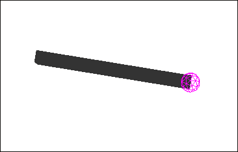
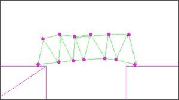

# 第八章。使用 Bullet 的物理

本章包含以下菜谱：

+   创建可推动的门

+   构建火箭引擎

+   弹道投射物和箭

+   处理多个重力源

+   使用旋转限制电机实现自平衡

+   建桥游戏的原理

+   网络物理

# 简介

由于开源物理引擎，如 Bullet，的使用变得非常普遍和易于访问，游戏中的物理应用已经变得非常普遍。jMonkeyEngine 无缝地支持基于 Java 的 jBullet 和本地的 Bullet。

### 注意

jBullet 是一个基于 Java 的库，具有对基于 C++的原始 Bullet 的 JNI 绑定。jMonkeyEngine 提供了这两个库，并且可以通过替换类路径中的库来互换使用。不需要进行任何编码更改。使用`jme3-libraries-physics`实现 jBullet，使用`jme3-libraries-physics-native`实现 Bullet。一般来说，Bullet 被认为速度更快，功能更全面。

物理学在游戏中几乎可以用于任何事情，从可以被踢来踢去的罐头到角色动画系统。在本章中，我们将尝试反映这些实现的多样性。

本章中的所有菜谱都需要你在应用程序中有一个`BulletAppState`类。为了避免重复，这个过程在附录，*信息片段*中的*将 Bullet 物理添加到应用程序*部分进行了描述。

# 创建可推动的门

在游戏中，门非常有用。从视觉上看，没有洞的墙壁比门更吸引人，玩家可以通过门通过。门可以用来遮挡视线并隐藏后面的东西，以在之后制造惊喜。此外，它们还可以用来动态地隐藏几何形状并提高性能。在游戏玩法方面，门被用来为玩家打开新区域并给人一种进步的感觉。

在这个菜谱中，我们将创建一个可以通过推来打开的门，使用`HingeJoint`类。

这扇门由以下三个元素组成：

+   **门对象**：这是一个可见对象

+   **连接点**：这是铰链旋转的固定端

+   **铰链**：这定义了门应该如何移动

## 准备工作

简单地按照这个菜谱中的步骤操作不会给我们带来任何可测试的内容。由于摄像机没有物理属性，门将只是静止在那里，我们将无法推动它。如果你已经制作了任何使用`BetterCharacterControl`类的菜谱，其中许多在第二章，*摄像机和游戏控制*中，我们已经有了一个合适的测试平台来测试门。如果没有，jMonkeyEngine 的`TestBetterCharacter`示例也可以使用。

## 如何操作...

这个菜谱由两个部分组成。第一部分将处理门的实际创建和打开功能。这将在以下六个步骤中完成：

1.  创建一个新的 `RigidBodyControl` 对象，命名为 `attachment`，并带有一个小 `BoxCollisionShape`。`CollisionShape` 应该通常放置在玩家无法撞到的墙壁内部。它应该有一个质量为 0，以防止它受到重力的影响。

1.  我们将它移动一段距离，并将其添加到 `physicsSpace` 实例中，如下面的代码片段所示：

    ```java
    attachment.setPhysicsLocation(new Vector3f(-5f, 1.52f, 0f));
    bulletAppState.getPhysicsSpace().add(attachment);
    ```

1.  现在，创建一个名为 `doorGeometry` 的 `Geometry` 类，它有一个 `Box` 形状，尺寸适合门，如下所示：

    ```java
    Geometry doorGeometry = new Geometry("Door", new Box(0.6f, 1.5f, 0.1f));
    ```

1.  类似地，创建一个具有相同尺寸的 `RigidBodyControl` 实例，即 `1` 的质量；首先将其作为控制添加到 `doorGeometry` 类，然后将其添加到 `bulletAppState` 的 `physicsSpace` 中。下面的代码片段显示了如何做到这一点：

    ```java
    RigidBodyControl doorPhysicsBody = new RigidBodyControl(new BoxCollisionShape(new Vector3f(.6f, 1.5f, .1f)), 1);
    bulletAppState.getPhysicsSpace().add(doorPhysicsBody);
    doorGeometry.addControl(doorPhysicsBody);
    ```

1.  现在，我们将使用 `HingeJoint` 将两者连接起来。创建一个新的 `HingeJoint` 实例，命名为 `joint`，如下所示：

    ```java
    new HingeJoint(attachment, doorPhysicsBody, new Vector3f(0f, 0f, 0f), new Vector3f(-1f, 0f, 0f), Vector3f.UNIT_Y, Vector3f.UNIT_Y);
    ```

1.  然后，我们设置门的旋转限制并将其添加到 `physicsSpace` 中，如下所示：

    ```java
    joint.setLimit(-FastMath.HALF_PI - 0.1f, FastMath.HALF_PI + 0.1f);
    bulletAppState.getPhysicsSpace().add(joint);
    ```

现在，我们有一个可以通过走进去打开的门。它很简单但很有效。通常，你希望游戏中的门在一段时间后关闭。然而，在这里，一旦打开，它就会保持打开状态。为了实现自动关闭机制，请执行以下步骤：

1.  创建一个新的名为 `DoorCloseControl` 的类，它扩展了 `AbstractControl`。

1.  添加一个名为 `joint` 的 `HingeJoint` 字段以及为其设置的设置器和一个名为 `timeOpen` 的浮点变量。

1.  在 `controlUpdate` 方法中，我们从 `HingeJoint` 获取 `hingeAngle` 并将其存储在一个名为 `angle` 的浮点变量中，如下所示：

    ```java
    float angle = joint.getHingeAngle();
    ```

1.  如果角度偏离零更多一些，我们应该使用 `tpf` 增加 `timeOpen`。否则，`timeOpen` 应该重置为 `0`，如下面的代码片段所示：

    ```java
    if(angle > 0.1f || angle < -0.1f) timeOpen += tpf;
    else timeOpen = 0f;
    ```

1.  如果 `timeOpen` 大于 `5`，我们首先检查门是否仍然打开。如果是，我们定义一个速度为角度的倒数并启用门的电机，使其向与角度相反的方向移动，如下所示：

    ```java
    if(timeOpen > 5) {
      float speed = angle > 0 ? -0.9f : 0.9f;
      joint.enableMotor(true, speed, 0.1f);
      spatial.getControl(RigidBodyControl.class).activate();
    }
    ```

1.  如果 `timeOpen` 小于 `5`，我们应该将电机的速度设置为 `0`：

    ```java
    joint.enableMotor(true, 0, 1);
    ```

1.  现在，我们可以在主类中创建一个新的 `DoorCloseControl` 实例，将其附加到 `doorGeometry` 类，并给它之前在配方中使用的相同关节，如下所示：

    ```java
    DoorCloseControl doorControl = new DoorCloseControl();
    doorControl.setHingeJoint(joint);
    doorGeometry.addControl(doorControl);
    ```

## 它是如何工作的...

附加的 `RigidBodyControl` 没有质量，因此不会受到如重力等外部力的影响。这意味着它将粘在世界的位置上。然而，门有质量，如果附加物不将其支撑起来，它就会掉到地上。

`HingeJoint` 类连接两个对象并定义了它们相对于彼此的运动方式。使用 `Vector3f.UNIT_Y` 意味着旋转将围绕 *y* 轴进行。我们将关节的限制设置为略大于半 PI 的每个方向。这意味着它将向两侧打开几乎 100 度，允许玩家穿过。

当我们尝试这样做时，当摄像机穿过门时可能会有一些闪烁。为了解决这个问题，可以应用一些调整。我们可以更改玩家的碰撞形状。使碰撞形状更大将导致玩家在摄像机足够接近以剪辑之前先撞到墙上。这必须考虑到物理世界中的其他约束。

你可以考虑更改摄像机的近裁剪距离。减小它将允许物体在剪辑之前更接近摄像机。这可能会对摄像机的投影产生影响。

有一件事不会起作用，那就是使门变厚，因为靠近玩家的侧面上的三角形是那些被剪辑通过的。使门变厚将使它们更靠近玩家。

在`DoorCloseControl`中，我们认为如果`hingeAngle`偏离 0 度较多，门是打开的。我们不使用 0，因为我们无法控制关节的精确旋转。相反，我们使用旋转力来移动它。这就是我们使用`joint.enableMotor`所做的事情。一旦门打开超过五秒钟，我们就告诉它向相反方向移动。当它接近 0 时，我们将期望的运动速度设置为 0。在这种情况下，简单地关闭电机会导致门继续移动，直到被外部力量停止。

一旦我们启用电机，我们还需要在`RigidBodyControl`上调用`activate()`，否则它不会移动。

# 构建火箭发动机

火箭发动机对于大多数太空游戏以及许多 2D 游戏来说都是至关重要的。在这个食谱中，我们将介绍创建一个可以在许多不同环境中使用的推进器的最小要求。以下图显示了带有`ParticleEmitter`的推进器：


## 准备工作

对于这个食谱，我们需要确保我们看到物理的调试形状。为此，我们需要调用`bulletAppState.setDebugEnabled(true);`语句。

## 如何操作...

我们将首先设置一些不是严格必需用于火箭发动机但将有助于测试的事情。按照以下步骤构建火箭发动机：

1.  首先，我们添加一个地板网格。为此，我们创建一个新的`Node`类，称为`ground`。

1.  要做到这一点，我们添加带有`PlaneCollisionShape`的`RigidBodyControl`。平面应该向上，就像地板通常那样，如下所示：

    ```java
    RigidBodyControl floorControl = new RigidBodyControl(new PlaneCollisionShape(new Plane(new Vector3f(0, 1, 0), 0)), 0);
    ground.addControl(floorControl);
    floorControl.setPhysicsLocation(new Vector3f(0f, -10, 0f));
    ```

1.  我们然后将它们两个都附加到应用的`rootNode`和`bulletAppState`的`physicsSpace`。

1.  最后，我们需要添加一个键来控制助推器。为此，我们在我们的应用程序中实现了一个`AnalogListener`接口。

1.  然后，将应用添加到`inputManager`中，同时添加一个名为 boost 的映射对象，它与空格键绑定：

    ```java
    inputManager.addListener(this, "boost");
    inputManager.addMapping("boost", new KeyTrigger(KeyInput.KEY_SPACE));
    ```

1.  这份食谱的大部分内容将在一个扩展`SimpleApplication`的类中实现。

1.  我们首先定义一个名为`spaceShip`的`Node`类，它将代表我们的宇宙飞船。

1.  然后，我们创建一个带有 `BoxCollisionShape` 的 `RigidBodyControl` 实例，并将其添加到 `spaceShip` 节点，如下所示：

    ```java
    RigidBodyControl control = new RigidBodyControl(new BoxCollisionShape(new Vector3f(1, 1, 1)), 1);
    spaceShip.addControl(control);
    ```

1.  现在，我们创建另一个 `Node`，它将成为我们的推进器。给它命名为 `Thruster`，以便以后更容易识别，如下所示：

    ```java
    Node thruster = new Node("Thruster");
    ```

1.  我们设置 `localTranslation`，使其最终位于飞船底部，如下代码行所示：

    ```java
    thruster.setLocalTranslation(0, -1, 0);
    ```

1.  然后，我们将它附加到 `spaceShip` 节点。

1.  现在，我们必须将 `spaceShip` 节点附加到 `bulletAppState` 的 `rootNode` 和 `physicsSpace`。

1.  为了控制推进器并使其更具可重用性，我们将创建一个名为 `ThrusterControl` 的类，它扩展了 `AbstractControl`。

1.  它将有一个字段，一个名为 `thruster` 的 `Spatial` 字段，用于存储 `thruster` 节点。

1.  我们将重写 `setSpatial` 方法，并通过在提供的空间上调用 `getChild("Thruster")` 来设置它。

1.  最后，我们定义了一个名为 `fireBooster()` 的新方法。

1.  在这里，我们从中减去推进器的位置和飞船的位置，并将其存储在一个新的 `Vector3f` 字段中，称为 `direction`，如下所示：

    ```java
    Vector3f direction = spatial.getWorldTranslation().subtract(thruster.getWorldTranslation());
    ```

1.  然后，我们在空间中找到 `RigidBodyControl` 类，并使用方向向量调用 `applyImpulse`。我们使用反转的方向作为脉冲应该起源的相对位置。这可以如下实现：

    ```java
    spatial.getControl(RigidBodyControl.class).applyImpulse(direction, direction.negate());
    ```

1.  在应用程序类中，我们必须让它调用 `fireBooster` 方法。我们在实现 `AnalogListener` 接口时添加的 `onAnalog` 方法中这样做：

    ```java
    if(name.equals("boost") && value > 0){
      spaceShip.getControl(ThrusterControl.class).fireBooster();
    }
    ```

## 它是如何工作的...

这个配方中的图形非常简约，主要依赖于 `BulletAppState` 的调试模式来绘制。物理形状通常没有视觉表示，因为它们不是场景图的一部分。在早期原型阶段使用调试模式非常有用。

飞船的 `RigidBodyControl` 实例确保它受到重力和其他力的作用。

推进器的唯一目的是能够轻松地检索相对于飞船的位置，从那里需要应用推力。这就是为什么我们将其放置在飞船底部的原因。使用 `Control` 模式控制 `Thruster` 的好处是我们可以轻松地将它应用于其他几何形状（甚至可以在 `SceneComposer` 中使用）。

`ThrusterControl` 类的 `fireBooster` 方法接受 `spaceShip` 的位置，并从中减去推进器节点的位置，以获取要应用力的方向。力的相对位置是此方向的直接相反。

# 弹道投射物和箭矢

将物理学应用于箭矢可以极大地提升中世纪或奇幻游戏的视觉效果和游戏玩法。设置受重力影响的箭矢相对简单；然而，这个配方还将箭矢设置为始终面向它们行进的方向，使其更加逼真。以下图显示了飞行中的其中一支箭矢：



## 准备工作

对于这个配方，我们需要确保我们看到物理的调试形状。为此，我们需要调用`bulletAppState.setDebugEnabled(true);`语句。

## 如何做到这一点...

在这个配方中，我们将创建三个类。让我们首先看看`Arrow`类，它包含大部分新功能。这将在以下八个步骤中完成：

1.  我们创建一个名为`Arrow`的新类，它扩展了`Node`。

1.  它的构造函数接受两个`Vector3f`变量作为参数。其中一个是箭头的起始位置，另一个是初始速度，如下面的代码行所示：

    ```java
    public Arrow(Vector3f location, Vector3f velocity)
    ```

1.  在构造函数内部，我们为箭头的身体定义一个`Geometry`实例，使用`box`网格，如下所示：

    ```java
    Box arrowBody = new Box(0.3f, 4f, 0.3f);
    Geometry geometry = new Geometry("bullet", arrowBody);
    ```

1.  然后，我们设置`Geometry`的`localTranslation`，使得其一个端点接触到节点的中心点，如下所示：

    ```java
    geometry.setLocalTranslation(0f, -4f, 0f);
    ```

1.  我们将这个`Arrow`的`localTranslation`设置为提供的位置。

1.  接下来，我们创建`CollisionShape`。这将代表箭头的头部，可以是`SphereCollisionShape`，如下所示：

    ```java
    SphereCollisionShape arrowHeadCollision = new SphereCollisionShape(0.5f);
    ```

1.  现在，我们根据`CollisionShape`定义`RigidBodyControl`，如下所示：

    ```java
    RigidBodyControl rigidBody = new RigidBodyControl(arrowHeadCollision, 1f);
    ```

1.  我们将`RigidBodyControl`的`LinearVelocity`设置为提供的速度，并将其作为控制添加到箭头中，如下所示：

    ```java
    rigidBody.setLinearVelocity(velocity);
    addControl(rigidBody);
    ```

这对于箭头遵循物理定律就足够了；然而，它将始终面向前方。通过添加另一个控制，我们可以使其面向速度的方向。为此，执行以下步骤：

1.  创建另一个名为`ArrowFacingControl`的类，它扩展了`AbstractControl`。

1.  我们添加一个名为`direction`的`Vector3f`字段。

1.  在`controlUpdate`方法中，我们从空间中的`RigidBodyControl`获取`linearVelocity`并将其归一化。然后我们将其存储在`direction`中，如下所示：

    ```java
    direction = spatial.getControl(RigidBodyControl.class).getLinearVelocity().normalize();
    ```

1.  然后，调用空间并告诉它旋转到提供的`direction`向量，如下所示：

    ```java
    spatial.rotateUpTo(direction);
    ```

1.  在`Arrow`类的构造函数中，我们添加了这个控制的一个实例，如下所示：

    ```java
    addControl(new ArrowFacingControl());
    ```

最后一个部分处理从`SimpleApplication`发射箭头。这可以通过以下步骤完成：

1.  首先，我们需要在应用程序中实现`ActionListener`。

1.  将`ActionListener`类添加到`inputManager`中作为监听器，以及一个用于发射箭头的键，如下所示：

    ```java
    inputManager.addListener(this, "fire");
    inputManager.addMapping("fire", new KeyTrigger(KeyInput.KEY_SPACE));
    ```

1.  在`onAction`方法中，当`fire`按钮被释放时，调用一个新的方法`fireArrow`。这可以如下实现：

    ```java
    if (action.equals("fire") && !isPressed) fireArrow();
    ```

1.  `fireArrow`方法应该首先实例化一个新的`Arrow`实例，并给它应用一个（预加载的）材质，如下所示：

    ```java
    Arrow arrow = new Arrow(new Vector3f(0f, 6f, -10f), new Vector3f(0.5f, 0.5f, 0.0f).mult(50));
    arrow.setMaterial(matBullet);
    ```

1.  我们将它附加到`rootNode`以及`physicsSpace`上，如下面的代码片段所示：

    ```java
    rootNode.attachChild(arrow);
    getPhysicsSpace().add(arrow);
    ```

## 它是如何工作的...

`Arrow`对象有两个主要组件。一个是`Geometry`，它是一个简单的长方形。另一个是用于箭头头的`CollisionShape`，这是唯一会寻找碰撞的东西。几何体被方便地移动，使其尖端位于`Arrow`节点的（0,0,0）位置。这很方便，因为它意味着我们不需要在`ArrowFacingControl`中进行任何转换，而可以直接使用`rotateUpTo`与箭头的实际速度（方向）。

# 处理多个重力源

一些游戏需要从多个变量源处理重力。在这个菜谱中，我们将处理这个问题，并创建一个简单的微型太阳系来演示它，使用的是来自`Building a rocket engine`菜谱的`ThrusterControl`。为了（大大）简化行星之间的关系，它们不会相互影响重力，而只会影响飞船。它也将以类似 2D-asteroids 的方式制作，尽管对于 3D 游戏，重力仍然适用。

我们将添加一些基本控制来使飞船向左和向右旋转，并且你可以使用推进器使飞船向前移动。

## 如何做到这一点...

除了`ThrusterControl`之外，我们还将创建两个更小的类和一个应用程序类，将所有这些内容结合起来。让我们从一个代表玩家飞船的类开始。这包括以下六个步骤：

1.  创建一个名为`SpaceShip`的新类，其中包含一个名为`shipNode`的字段。

1.  在构造函数中，我们通过创建一个新的`RigidBodyControl`实例并使用`BoxCollisionShape`来设置它的物理。为了使其受到重力的影响，我们还给它一个质量为`1`，这个质量将在构造函数中提供，如下所示：

    ```java
    RigidBodyControl control = new RigidBodyControl(new BoxCollisionShape(new Vector3f(1, 1, 1)), 1);
    shipNode.addControl(control);
    ```

1.  现在，我们创建一个名为`thruster`的`Node`实例。我们还设置了`Node`的名称为`Thruster`，以便控制可以自动找到它，如下面的代码行所示：

    ```java
    Node thruster = new Node("Thruster");
    ```

1.  我们将`localTranslation`设置在飞船的一侧，并将其附加到`shipNode`上，如下所示：

    ```java
    thruster.setLocalTranslation(-1, 0, 0);
    shipNode.attachChild(thruster);
    ```

1.  然后，我们旋转飞船的空间，使其朝向侧面：

    ```java
    shipNode.rotate(0, FastMath.PI, 0);
    ```

1.  最后，我们向飞船的空间中添加一个新的`ThrusterControl`实例。

对于`SpaceShip`类来说，这就结束了。现在，我们创建一个用于我们行星的类，如下所示：

1.  我们首先定义一个名为`StellarBody`的类，它扩展了`AbstractControl`。`StellarBody`类有四个浮点字段：`size`、`speed`、`orbit`和`cycle`。

1.  构造函数接受这三个（`size`、`speed`和`orbit`）作为输入，如下面的代码所示：

    ```java
    public StellarBody(float orbit, float speed, float size)
    ```

1.  我们重写了`setSpatial`方法，并在提供的空间中添加了`RigidBodyControl`，使用`size`作为半径，`0`作为质量：

    ```java
    RigidBodyControl rigidBody = new RigidBodyControl(new SphereCollisionShape(size), 0f);
    rigidBody.setGravity(Vector3f.ZERO);
    spatial.addControl(rigidBody);
    ```

1.  在`controlUpdate`方法中，我们通过将周期的速度乘以`tpf`来使其沿着轨道移动：

    ```java
    cycle += (speed * tpf)  % FastMath.TWO_PI;
    ```

1.  然后，我们使用`FastMath`类的`sin`和`cos`方法设置行星沿轨道的实际位置：

    ```java
    float x = FastMath.sin(cycle);
    float z = FastMath.cos(cycle);
    ```

1.  我们将结果乘以轨道，并将空间体的`localTranslation`设置为新的位置，如下所示：

    ```java
    spatial.setLocalTranslation(x * orbit, 0, z * orbit);
    ```

1.  然后，我们还需要将`RigidBodyControl`的`physicsLocation`设置为相同的位置。

1.  我们需要一个名为`getGravity`的新方法，它将船的位置作为输入`Vector3f`。

1.  该方法首先从输入位置减去`worldTranslation`，以获得相对于`StellarBody`类的船的位置，如下所示：

    ```java
    Vector3f relativePosition = spatial.getWorldTranslation().subtract(position);
    ```

1.  结果经过归一化，然后通过一个公式进行修改以获得合适的重力。这个值随后返回给调用方法，如下所示：

    ```java
    relativePosition.normalizeLocal();
    return relativePosition.multLocal(size * 1000 / relativePosition.lengthSquared());
    ```

为了测试所有这些，我们需要向`SimpleApplication`添加一些内容。为此，执行以下步骤：

1.  首先，我们实现`AnalogListener`。

1.  我们添加一个名为`gravitationalBodies`的`ArrayList<StellarBody>`列表。

1.  在`simpleInitApp`方法中，我们应该首先初始化`bulletAppState`并为飞船设置一些控制。我们添加了使飞船向左和向右旋转以及发射飞船推进器的动作，如下所示：

    ```java
    String[] mappings = new String[]{"rotateLeft", "rotateRight", "boost"};
    inputManager.addListener(this, mappings);
    inputManager.addMapping("boost", new KeyTrigger(KeyInput.KEY_SPACE));
    inputManager.addMapping("rotateLeft", new KeyTrigger(KeyInput.KEY_LEFT));
    inputManager.addMapping("rotateRight", new KeyTrigger(KeyInput.KEY_RIGHT));
    ```

1.  由于这是一个二维表示，我们将摄像机向上移动一段距离，使其看起来像是位于世界的中心。这可以通过以下方式实现：

    ```java
    cam.setLocation(new Vector3f(0, 300f, 0));
    cam.lookAt(Vector3f.ZERO, Vector3f.UNIT_Y);
    ```

1.  我们创建一个名为`ship`的`SpaceShip`实例，并将其几何形状附加到`rootNode`和`bulletAppState`的`physicsSpace`。

1.  现在，我们可以使用以下步骤创建多个`StellarBody`实例：

    1.  对于每个实例，我们应该创建一个具有`Sphere`形状的`Geometry`类，其半径将与提供给`StellarBody`控制的大小相同。

    1.  `Geometry`类应该同时附加到`bulletAppState`的`rootNode`和`physicsSpace`。

    1.  我们将`StellarBody`作为控制添加到`Geometry`类和`gravitationalBodies`列表中。

1.  在`update`方法内部，我们必须考虑到`StellarBody`实例的重力。

1.  首先，我们定义一个新的`Vector3f`实例，称为`combinedGravity`。

1.  然后，我们遍历我们的`gravitationalBodies`列表，并将以下代码行应用于将重力应用于`combinedGravity`：

    ```java
    combinedGravity.addLocal(body.getGravity(ship.getSpatial().getWorldTranslation()));
    ```

1.  最后，我们调用`ship.setGravity(combinedGravity);`语句。

## 它是如何工作的...

由于创建包含三个以上实体的稳定太阳系极端困难，`StellarBody`控制需要围绕系统中心有一个静态轨道。使用`0`作为质量确保它们不受重力影响。轨道字段表示轨道距离系统中心的距离，它将使用速度作为因素围绕中心旋转。周期字段存储有关其轨道进度的信息，并在达到两 PI（一个完整圆周）时重置。

`getGravity`方法返回相对于提供的位置的引力，在这种情况下是船的位置。它首先确定方向，然后根据两个位置之间的距离应用重力。

通过使用`gravitationalBodies`列表，我们有一种动态的方法可以将系统中所有重力力的总和添加到一个单一的`Vector3f`对象中，然后我们在应用程序的`update`方法中将它应用到宇宙飞船上。

# 使用旋转限制电机进行自我平衡

许多游戏今天使用动画和物理的混合来创建逼真的运动。对于动画角色，这围绕着平衡。它可能是一个跑步者在曲线中向内倾斜以对抗离心力的形状。创建这样一个系统并不容易，需要很多调整。在这个菜谱中，我们将探讨这个领域的某些基本原理，并创建一个新的`Control`类，该类将尝试使用`SixDofJoint`的旋转电机来自我平衡。

### 注意

**六自由度**（**SixDof**）指的是关节可以旋转的六种方式：+x，-x，+y，-y，+z 和-z。它与`point2point`关节的不同之处在于，它还具有每个轴的电机，这使得它也能够施加力。

## 如何做到这一点...

为了模拟平衡，我们将首先创建一个由躯干和两条刚性手臂组成的 stickman 形状的人体上半身。为此，执行以下步骤：

1.  首先，我们应该使用`BulletAppState`设置一个应用程序。

1.  在`simpleInitApp`方法中，我们创建了一个小的正方形`Box Geometry`作为角色的腰部。它在所有轴上可以是`0.25f`。

1.  我们将它添加了`RigidBodyControl`，质量设置为`0`，因为它不应该移动。

1.  然后，我们创建一个长方体作为躯干，并将其放置在腰部上方。它应该有质量为`1`的`RigidBodyControl`，并且`BoxCollisionShape`应该与几何形状大小相同：

    ```java
    torso = new Geometry("Torso", new Box(0.25f, 2f, 0.25f);
    RigidBodyControl torsoRigidBody = new RigidBodyControl(new BoxCollisionShape(...), 1f);
    ...
    torsoRigidBody.setPhysicsLocation(new Vector3f(0, 4.25f, 0));
    ```

1.  接下来，我们在腰部和躯干之间创建一个`SixDofJoint`，然后按照以下方式将其添加到`physicsSpace`中：

    ```java
    SixDofJoint waistJoint =  new SixDofJoint(waistRigidBody, torsoRigidBody, new Vector3f(0, 0.25f, 0), new Vector3f(0, -2.25f, 0f), true);
    ```

1.  我们应该限制关节，使其不能在除了*x*轴以外的任何轴上旋转，并且它不应该能够旋转太多。我们可以使用以下`setAngularLowerLimit`和`setAngularUpperLimit`方法来完成此操作：

    ```java
    waistJoint.setAngularLowerLimit(new Vector3f(-FastMath.QUARTER_PI * 0.3f, 0, 0));
    waistJoint.setAngularUpperLimit(new Vector3f(FastMath.QUARTER_PI * 0.3f, 0, 0));
    ```

1.  接下来，我们创建一只手臂。

1.  我们通过将其放置在躯干相同的位置并给它一个大小为`Vector3f(0.25f, 0.25f, 2f)`来创建一只手臂，使其向侧面伸展，如下面的代码片段所示：

    ```java
    leftArm = new Geometry("Left Arm", new Box(0.25f, 0.25f, 2f);
    RigidBodyControl leftArmRigidBody = new RigidBodyControl(new BoxCollisionShape(...), 1f);
    ...
    leftArmRigidBody.setPhysicsLocation(new Vector3f(0, 4.25f, 0));
    ```

1.  我们使用`Vector3f(0, 2.5f, 0.25f)`和`Vector3f(0, 0, -2.5f)`的旋转点为它创建另一个`SixDofJoint`，并将其偏移一些距离到躯干的空侧。

1.  然后，我们将关节的角限制设置为`Vector3f(0, 0, 0)`和`Vector3f(FastMath.QUARTER_PI, 0, 0)`。

1.  我们重复前面的三个步骤来创建另一只手臂，但我们将反转偏移值，使手臂向躯干相反的方向突出。

现在我们已经完成了我们的菜谱的基本设置。运行它应该显示角色向一侧倾斜，手臂向两侧伸展。现在，我们可以通过执行以下步骤开始平衡：

1.  我们创建了一个名为`BalanceControl`的新类，它扩展了`AbstractControl`。

1.  它应该有一个名为`joint`的`SixDofJoint`字段和一个名为`motorX`的`RotationalLimitMotor`字段。

1.  创建一个`setJoint`方法。

1.  在此方法内部，在设置关节之后，我们还使用以下方式用`RotationalLimitMotor`实例之一填充`motorX`：

    ```java
    motorX = joint.getRotationalLimitMotor(0);
    ```

1.  在`controlUpdate`方法内部，我们从关节获取`bodyA`并将其存储在`PhysicsRigidBody`中。这是躯干：

    ```java
    PhysicsRigidBody bodyA = joint.getBodyA();
    ```

1.  我们获取`bodyA`的当前旋转以查看它旋转了多少。然后我们将旋转转换为角度并按照以下方式存储：

    ```java
    float[] anglesA = new float[3];
    bodyA.getPhysicsRotation().toAngles(anglesA);
    ```

1.  然后，我们将`angles[0]`存储在一个名为`x`的浮点变量中。

1.  如果`x`大于 0.01f 或小于-0.01，我们应该启动`motorX`并将其旋转以补偿旋转，如下所示：

    ```java
    motorX.setEnableMotor(true);
    motorX.setTargetVelocity(x*1.1f);
    motorX.setMaxMotorForce(13.5f);
    ```

1.  否则，我们按照以下方式关闭电机：

    ```java
    motorX.setTargetVelocity(0);
    motorX.setMaxMotorForce(0);
    ```

## 它是如何工作的...

运行结果，我们应该看到小人在拼命地试图保持直立，同时上下挥舞着双臂。原因是当平衡时获取正确的力可能非常困难。如果数值过高，小人会不断超出目标并相反地旋转。如果数值过低，它将没有足够的力量直立起来。通过进一步调整`targetVelocity`和`maxMotorForce`，我们可能使他变得稳定。

我们首先创建了一个基本形状的图形，试图保持平衡。腰部被设计为不受物理影响，因此它可以成为一个固定点。然后我们添加了躯干和两条手臂，使得质心位于躯干的上部。通过将身体各部分放置在一定的距离并通过关节连接，我们给予它们更多的运动自由度。

我们创建的`BalanceControl`类有一个简单的策略。它寻找躯干（bodyA）沿*x*轴的旋转，并试图将其保持在尽可能接近 0 的位置。如果它注意到它不是接近 0，它将尝试移动手臂，将质心移向相反方向。

尽管组件数量不多，但要使所有组件平衡出来确实非常困难！如果添加更多组件，例如整个人体骨骼，则需要更高级的策略，身体各部分以同步的方式移动，而不是各自尝试这样做。

# 桥梁建筑游戏的原则

桥梁建筑游戏的变体已经存在很长时间了。经典的*桥梁建造者*是一款 2D 物理游戏，玩家需要连接梁以形成一个足够坚固的桥梁，以便火车（或其他移动物体）通过。

这个配方将描述创建此类游戏所需的大部分核心功能，包括使对象保持在 2D 并且不在*z*轴上漂移。

我们将为游戏提供一些基本控制：

+   左键点击将选择桥梁中之前构建的节点

+   右键点击将添加一个新的节点或连接两个之前构建的节点

+   空格键将开启物理效果

下图展示了一座桥梁：



## 准备工作

在我们开始更多与物理相关的函数之前，我们应该设置基本应用程序。

首先，我们创建一个新的类，它扩展了 `SimpleApplication`。

之后，我们将使用以下两个列表：

```java
private List<Geometry> segments;
private List<Point2PointJoint> joints;
```

我们还需要一些字符串作为输入映射：`LEFT_CLICK`、`RIGHT_CLICK` 和 `TOGGLE_PHYSICS`。

我们添加一个名为 `selectedSegment` 的 `RigidBodyControl` 字段，它将包含游戏中最后选择的段。

由于我们严格制作一个 2D 游戏，我们应该将摄像机更改为正交视图。这可以通过执行以下步骤来完成：

1.  禁用 `flyCam`。

1.  通过将 `cam` 的宽度除以其高度并存储它来找出纵横比。

1.  将 `cam.parallelProjection` 设置为 `true`。

1.  然后，将摄像机的 `frustrum` 更改为适合正交视图，如下所示：

    ```java
    cam.setFrustum(1, 1000, -100 * aspect, 100 * aspect, 100, -100);
    ```

1.  我们将其沿 *z* 轴移动一段距离，并将其旋转回中心，如下所示：

    ```java
    cam.setLocation(new Vector3f(0, 0, 20));
    cam.setRotation(new Quaternion().fromAngles(new float[]{0,-FastMath.PI,0}));
    ```

现在，我们可以像通常一样初始化 `bulletAppState`。打开调试模式，最重要的是，将 `speed` 设置为 `0`。在我们构建桥梁时，我们不希望有任何物理效果。

世界需要一座桥梁来连接缺口。因此，为此，我们将使用 `RigidBodyControl` 来表示两侧的两个悬崖，如下所示：

1.  为每一侧创建一个 `RigidBodyControl` 实例，并给它一个大小为 `Vector3f(75f, 50f, 5f)` 和 `0` 质量的 `BoxCollisionShape`。

1.  将其中一个放置在 `Vector3f(-100f, -50f, 0)`，另一个放置在 `Vector3f(100f, -50f, 0)`。

1.  然后，将它们添加到 `physicsSpace`。

## 如何做到这一点...

我们将首先创建两个方法，这将帮助我们向游戏中添加新的桥梁段：

1.  我们定义了一个名为 `createSegment` 的方法，它接受一个名为 `location` 的 `Vector3f` 参数作为输入。

1.  我们首先要做的是将 `location` 的 `z` 值设置为 `0`。这是因为我们正在制作一个 2D 游戏。

1.  然后，我们创建一个新的 `RigidBodyControl` 实例，称为 `newSegment`。我们将 `SphereCollisionShape` 添加到其中，然后将 `newSegment` 添加到 `physicsSpace`。重要的是它必须有一些质量。这可以按以下方式实现：

    ```java
    RigidBodyControl newSegment = new RigidBodyControl(new SphereCollisionShape(1f), 5);
    bulletAppState.getPhysicsSpace().add(newSegment);
    ```

1.  现在，我们根据与 `RigidBodyControl` 相同半径的 `Sphere` 形状创建一个 `Geometry` 实例。我们将将其用作鼠标点击的目标。

1.  `Geometry` 对象需要 `modelBound`，我们将使用 `BoundingSphere`。半径可能大于 `RigidBodyControl`。

1.  `RigidBodyControl` 对象被添加到 `Geometry` 中作为控制，我们使用 `setPhysicsLocation` 方法将其移动到指定的位置，如下所示：

    ```java
    geometry.addControl(newSegment);
    newSegment.setPhysicsLocation(location);
    ```

1.  然后，将 `Geometry` 对象添加到我们之前定义的 segments 列表中，并将其附加到 `rootNode`。

1.  如果 `selectedSegment` 不为空，我们将调用我们接下来要定义的方法：

    ```java
    createJoint(selectedJoint, newSegment);
    ```

1.  最后，在 `createJoint` 方法中，我们将 `selectedSegment` 设置为 `newSegment`。

1.  现在，我们可以定义 `createJoint` 方法。它接受两个 `RigidBodyControl` 参数作为输入，如下面的代码所示：

    ```java
    createJoint(RigidBodyControl body1, RigidBodyControl body2)
    ```

1.  首先，我们找出应该是`body2`的支点的位置。这等于`body2`的`physicsLocation`减去`body1`的`physicsLocation`，如下所示：

    ```java
    Vector3f pivotPointB = body1.getPhysicsLocation().subtract(body2.getPhysicsLocation());
    ```

1.  然后，我们通过连接两个段来定义`Point2PointJoint`。提供的向量意味着`body2`将以相对于`body1`的方式旋转；我们使用以下代码来完成这项工作：

    ```java
    Point2PointJoint joint = new Point2PointJoint(body1, body2, Vector3f.ZERO, pivotPointB);
    ```

1.  然后，我们将新创建的关节添加到`joints`列表和`physicsSpace`中。

我们现在正在接近应用程序的控制部分，需要另一个方法来帮助我们。该方法将检查鼠标点击是否击中了任何段并返回它。为此，执行以下步骤：

1.  我们定义了一个名为`checkSelection`的新方法，它返回`RigidBodyControl`。

1.  在这个方法内部，我们创建一个新的`Ray`实例，它将以当前鼠标光标的位置为原点；以下代码告诉您如何做到这一点：

    ```java
    Ray ray = new Ray();
    ray.setOrigin(cam.getWorldCoordinates(inputManager.getCursorPosition(), 0f));
    ```

1.  由于视图是正交的，我们让方向为`Vector3f(0, 0, -1f)`。

1.  现在，我们定义一个新的`CollisionResults`实例来存储`Ray`与之碰撞的任何段。

1.  接下来，我们要做的是遍历段列表并检查射线是否击中它们中的任何一个。

1.  如果这样做，我们就完成了，然后返回段的`RigidBodyControl`给调用方法。

我们之前定义了一些输入映射。现在，我们都可以通过执行以下步骤在`onAction`方法中实现它们的功能：

1.  如果左键被点击，我们应该调用`checkSelection`。如果返回值不为 null，我们应该将`selectedSegment`设置为该值，如下所示：

    ```java
    if (name.equals(LEFT_CLICK) && !isPressed) {
      RigidBodyControl newSelection = checkSelection();
      if (newSelection != null) {
        selectedSegment = newSelection;
      }
    }
    ```

1.  如果右键被点击，我们还应该调用`checkSelection`。如果返回值不为 null，并且它不是`selectedSegment`，我们使用`selectedSegment`和`checkSelection`的值调用`createJoint`来在`selectedSegment`和从该方法返回的段之间创建一个链接，如下面的代码片段所示：

    ```java
    else if (name.equals(RIGHT_CLICK) && !isPressed) {
      RigidBodyControl hitSegment = checkSelection();
      if (hitSegment != null && hitSegment != selectedSegment) {
        createJoint(selectedSegment, hitSegment);
      }
    ```

1.  否则，如果我们没有击中任何东西，我们使用鼠标光标的位置调用`createSegment`来在该位置创建一个新的段，如下所示：

    ```java
    createSegment(cam.getWorldCoordinates(inputManager.getCursorPosition(), 10f));
    ```

1.  如果空格键被按下，我们只需要将`bulletAppState`的速度设置为`1`以启动物理。

我们现在几乎完成了我们的模拟，但我们需要做几件事情。这个最后的部分将处理`update`方法以及当物理运行并且桥梁正在测试时会发生什么：

1.  在`update`方法中，我们遍历段列表中的所有项目并将`linearVelocity`的`z`值设置为`0`，如下所示：

    ```java
    Vector3f velocity = segment.getControl(RigidBodyControl.class).getLinearVelocity();
    velocity.setZ(0);
    segment.getControl(RigidBodyControl.class).setLinearVelocity(velocity);
    ```

1.  在此之后，我们遍历关节列表中的所有项目。对于每一个，我们应该检查关节的`appliedImpulse`值是否高于一个值，比如说`10`。如果是，关节应该从列表中以及从`physicsSpace`中移除，如下所示：

    ```java
    Point2PointJoint p = joints.get(i);
      if (p.getAppliedImpulse() > maxImpulse) {
        bulletAppState.getPhysicsSpace().remove(p);
        joints.remove(p);

      }
    ```

## 它是如何工作的...

`createSegment` 方法创建一个新的球形桥段，既在 `physicsSpace` 中也在可见世界中。这是具有质量并且可以通过点击来选择的部分，因为 `Ray` 只与空间体发生碰撞。

`createJoint` 方法创建新创建的段与当前选中段之间的可见连接。它使用 `Point2PointJoin`t 来实现。这与例如 `HingeJoint` 不同，因为它在空间中不是固定的，当多个 `Point2Pointjoints` 连接在一起并且你有一个类似桥梁的东西时。

鼠标选择在其它章节中有更深入的介绍，但它是通过从屏幕上鼠标的位置发射 `Ray` 到游戏世界内部来实现的。一旦 `Ray` 击中 `Geometry`（它具有比可见网格略大的 `BoundingSphere` 以增加可选择性），相应的 `RigidBodyControl` 将被选中。

如果段没有最大承受力，那么桥梁建造游戏就没有挑战性。这就是我们在 `update` 方法中处理 `appliedImpulse` 的地方，我们检查每个段的 `appliedImpulse`。如果它超过某个阈值，它可以被认为是超载并移除，通常会有灾难性的后果。我们还设置了每个段沿 *z* 轴的 `linearVelocity` 为 `0`，因为这是一个 2D 游戏，我们不希望任何东西移动到深度层。

我们通过将 `bulletAppState` 的速度设置为 `0` 来关闭物理模拟开始游戏。如果不这样做，构建游戏会很快变得棘手，因为所有东西都会掉下来。按下空格键将启动物理模拟，并让玩家知道他们的工程技能是否足够。

## 还有更多...

要使它成为一个完整的桥梁建造者，还有一些东西缺失。首先，通常对段的最大长度有限制。它们可能还需要沿着网格结构放置。

这也很容易，因为桥梁目前只需要支撑自己的重量。在完整游戏中，难度通常通过添加一个需要通过桥梁才能完成关卡的重物来增加。

添加一些货币限制或变化的地形，你就有了一个有挑战性的游戏。

# 网络物理

这个配方将进入游戏开发的一个最终领域。这个主题非常依赖于应用，很难做对。希望在这个配方之后，你将有一个基本的框架，可以适应特定的项目。

## 准备工作

这个配方是为那些对第七章第七章，*使用 SpiderMonkey 进行网络通信*和第八章第八章，*使用 Bullet 进行物理*有基本理解的人准备的。这个配方将描述如何在之前在书中讨论过的网络 fps 中实现网络物理。由于这是建立在现有框架之上的，因此选择了`AppState`模式来尽可能隔离大部分物理代码。尽管会有一些重叠。

物理本身可能很昂贵，并且有其自己的问题和要求。在每次更新时通过网络发送对象的平移和旋转将严重影响带宽负载。基本原则是：只发送必须发送的内容。

将物理对象分为你感兴趣共享的和你不感兴趣共享的。在大多数游戏中，这意味着将影响游戏玩法的对象和那些不影响游戏玩法的对象分开。

例如，一个可以攀爬的、尺寸为一米的箱子肯定会影响游戏玩法。它必须联网。

可以踢的桶或爆炸产生的小碎片不会影响游戏玩法，并且应该只有本地物理效果。它们出现在不同玩家的不同位置无关紧要。

规则的第二部分是：只有在必须时才发送。发送一个不移动的对象的更新没有意义。

## 如何做到这一点...

根据第一条规则，我们将首先为我们的网络物理对象定义一个新的`Control`类：

1.  我们创建了一个名为`PhysicsObjectControl`的新类，它扩展了`AbstractControl`。

1.  它应该有两个字段：一个名为`serverControlled`的布尔字段和一个名为`id`的整数字段。

我们现在定义一个网络消息来处理具有物理特性的对象的更新：

1.  我们可以称它为`PhysicsObjectMessage`，并让它扩展`AbstractMessage`。

1.  它有三个强制字段；如下所示：

    +   第一部分是一个名为`objectId`的整数字段。

    +   它还需要一个名为`translation`的`Vector3f`字段。

    +   最后，我们添加一个名为`rotation`的`Quaternion`字段。

1.  不要忘记添加`@Serializable`注解，并将其添加到`GameUtil`类中的消息列表中！

1.  我们最后做的常见实现是为`Game`类添加一个名为`physicsObjects`的`Spatials`列表；以下代码告诉我们如何做到这一点：

    ```java
    private Map<Integer, Spatial> physicsObjects = new HashMap<Integer, Spatial>();
    ```

现在，我们可以通过以下步骤深入了解服务器端实现：

1.  我们将大部分代码包含在一个新的`AppState`类中，称为`ServerPhysicsAppState`。这个`AppState`类将包含对`BulletAppState`类的引用，并处理初始化。

1.  在其`initialize`方法内部，它应该按照以下方式将加载的关卡添加到`physicsSpace`中：

    ```java
    bulletAppState.getPhysicsSpace().add(server.getLevelNode().getChild("terrain-TestScene").getControl(PhysicsControl.class));
    ```

1.  需要一种策略来收集所有应受服务器物理影响的对象，并将它们分配给 `PhysicsObjectControl`（除非这已经在 **SceneComposer** 中完成）。应具有服务器物理的对象也应将 `serverControlled` 设置为 `true` 并具有一个唯一 ID，该 ID 服务器和客户端都知道。结果的空间应存储在 `physicsObject` 类映射中，如下所示：

    ```java
    bigBox.addControl(new PhysicsObjectControl(uniqueId));
    bigBox.getControl(PhysicsObjectControl.class).setServerControllled(true);
    physicsObjects.put(uniqueId, bigBox);
    ```

1.  在 `ServerPhysicsAppState` 的 `update` 方法中，我们解析 `physicsObject` 映射的值。如果 `physicsObjects` 中的任何项具有 `PhysicsObjectControl` 且 `isServerControlled()` 返回 true，并且它们的 `isActive()` 为 true，则应创建一个新的 `PhysicsObjectMessage`，如下所示：

    ```java
    PhysicsObjectMessage message = new PhysicsObjectMessage();
    ```

1.  它应该具有 `objectId` 为 `PhysicsObjectControl` 以及 `physicsLocation` 和 `physicsRotation` 为 `RigidBodyControl` 的 ID；请参考以下代码：

    ```java
    message.setObjectId(physicsObject.getControl(PhysicsObjectControl.class).getId());
    message.setTranslation(physicsObject.getControl(RigidBodyControl.class).getPhysicsLocation());
    message.setRotation(physicsObject.getControl(RigidBodyControl.class).getPhysicsRotation());
    ```

1.  消息随后被广播到客户端。

我们稍后会重新查看服务器代码，但首先让我们看看客户端接收消息所需的条件。

1.  首先，客户端必须设置 `BulletAppState`。

1.  接下来，服务器物理需要了解要处理的对象。如果对象是从场景中收集的，则需要一种策略来确保 ID 相同，或者以相同的顺序读取。

1.  然后，它们应该像在服务器上一样存储在 `Game` 类中。

1.  第二件事是对 `ClientMessageHandler` 的更改。如果消息是 `PhysicsObjectMessage` 的实例，它应从 `Game` 类获取 `physicsObject` `Map`，如下所示：

    ```java
    Map<Integer, Spatial> physicsObjects = game.getPhysicsObjects();
    ```

1.  然后应根据消息中的 `objectId` 选择一个空间，如下所示：

    ```java
    int objectId = physicsMessage.getObjectId();
    Spatial s = physicsObjects.get(objectId);
    ```

1.  旋转和平移应分别应用于空间的 `RigidBodyControl` 上的 `physicsLocation` 和 `physicsRotation`：

    ```java
    PhysicsObjectControl physicsControl = s.getControl(PhysicsObjectControl.class);
    if(physicsControl.getId() == objectId){
      s.getControl(RigidBodyControl.class).setPhysicsLocation(physicsMessage.getTranslation()); s.getControl(RigidBodyControl.class).setPhysicsRotation(physicsMessage.getRotation());
    }
    ```

1.  现在，从服务器到客户端传输物理更新的管道应该可以工作。如果我们运行它，不会发生太多事情。这是因为 第七章 中实现中的玩家没有使用物理。他们只是被编码为粘附在地形表面。我们可以更改玩家的表示来处理这种情况。

1.  在 `ServerPlayerControl` 中，我们添加一个名为 `physicsCharacter` 的 `BetterCharacterControl` 字段和一个名为 `usePhysics` 的布尔字段。

1.  接下来，我们重写 `setSpatial` 方法，并检查提供的空间是否有 `BetterCharacterControl`。如果有，则应将 `usePhysics` 设置为 `true`，并将局部 `physicsCharacter` 字段设置为 `spatial`，如下所示：

    ```java
    if(spatial.getControl(BetterCharacterControl.class) != null){
      usePhysics = true;
      physicsCharacter = spatial.getControl(BetterCharacterControl.class);
    }
    ```

1.  最后，在 `controlUpdate` 方法中，我们检查 `usePhysics` 是否为 `true`。如果是，则应将 `physicsCharacter` 的 `walkDirection` 设置为局部方向，并将 `viewDirection` 设置为其旋转的前向向量，如下所示：

    ```java
    if(usePhysics){
    physicsCharacter.setWalkDirection(walkDirection.multLocal(50));
    physicsCharacter.setViewDirection(tempRotation.getRotationColumn(2));
    }
    ```

1.  在我们的服务器主类的`addPlayer`方法中，我们现在应该在添加`ServerPlayerControl`之前将`BetterCharacterControl`添加到玩家的空间中，如下面的代码片段所示：

    ```java
    Node playerNode = new Node("Player");
    playerNode.addControl(new BetterCharacterControl(0.5f, 1.5f, 1f));
    playerNode.addControl(player);
    rootNode.attachChild(playerNode);
    stateManager.getState(ServerPhysicsAppState.class).addPlayer(player.getPhysicsCharacter());
    ```

1.  还需要一些逻辑来在游戏开始和结束时从`physicsSpace`中添加和移除`BetterCharacterControl`。

## 它是如何工作的...

在我们的配方中，我们首先通过定义一个新的控制`PhysicsObjectControl`来打下一个基础，这个控制将应用于需要由子弹物理处理的物体。这个控制可以在运行时添加；或者，如果使用**场景作曲家**来布局关卡和场景，它可以在物体之前添加。建议在将相关物体添加到场景之前，通过在物体上设置`serverControlled`来定义哪些应该由服务器处理。然后，当客户端和服务器解析场景中的物体时，应该在两者上以确定的方式设置 ID。

处理物理的架构可能在其他实现中看起来很不同，但在这里，使用了`AppState`模式，以便它可以轻松地作为现有框架的扩展添加，如第七章中所述，*使用 SpiderMonkey 进行网络连接*。在这一章中，我们没有为玩家使用任何物理，只是检查地形的高度以确定地面在哪里。因此，我们向玩家添加了一个可选的`BetterCharacterControl`实例——再次，这是一个仍然与先前实现兼容的更改。然而，这仅在服务器端添加。对于客户端物理，必须在那里进行类似更改。

服务器将检查每个更新，查看是否启用了`serverControlled`的任何对象是活动的，并将任何更新发送到客户端。实际上，如果你愿意，可以在客户端完全省略物理，只需更新空间的位置和旋转。这将降低客户端硬件的要求，但当然，这只有在所有物理都由服务器处理的情况下才会有效。

## 还有更多...

在这里，有机会在`PhysicsObjectControl`上引入第三个状态；一个对象受到但不受服务器控制的状态。这可以用于在初始状态下很重要的对象；然而，一旦它们被移动，所有客户端都有相同的信息就不再重要了，例如，某个时刻被吹离铰链的门。在这种情况下，可以引入一种新的消息类型，该类型将从服务器端对对象施加冲量或力。一旦对象被激活，客户端可以负责计算，降低网络负载。
