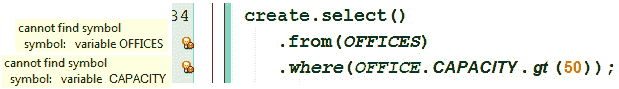
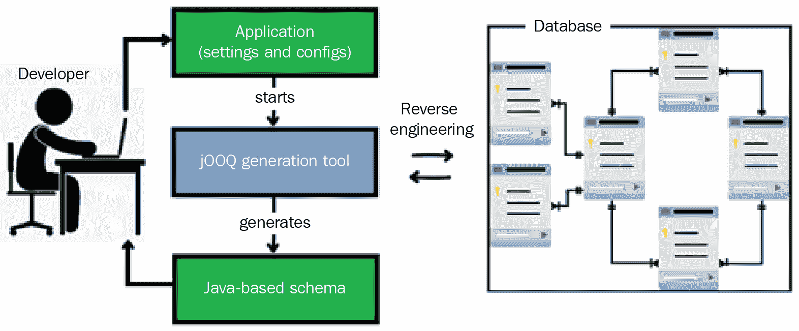
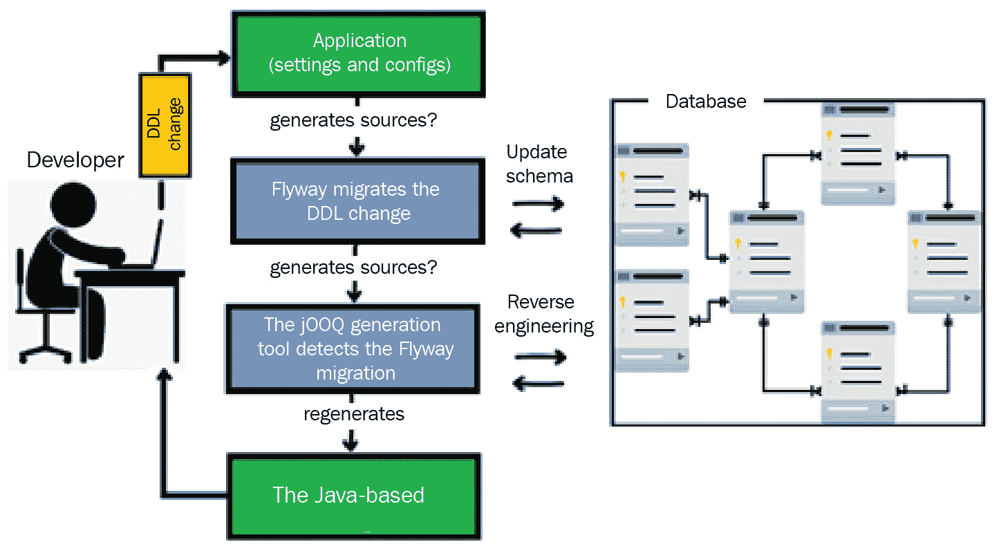
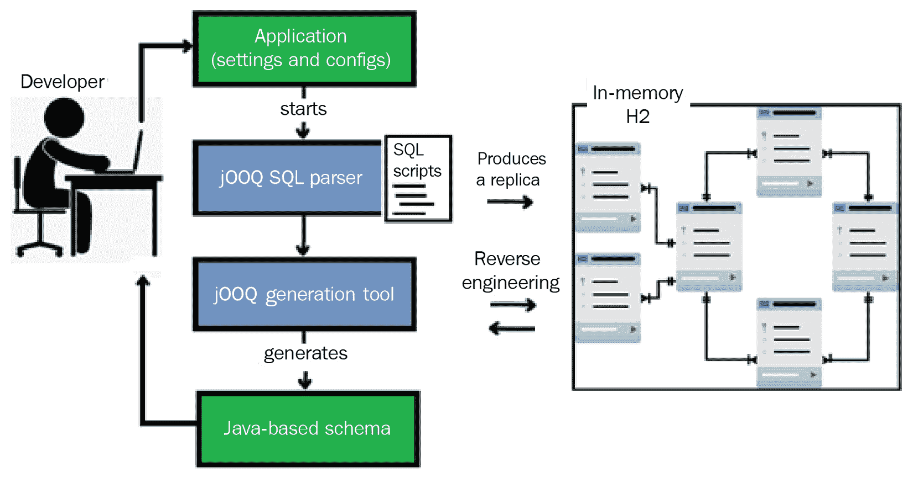

# *第二章*：自定义 jOOQ 参与级别

在上一章中，我们介绍了在 Spring Boot 应用程序中使用 jOOQ 并用它来生成和执行一个有效的非类型安全的 SQL 语句。在本章中，我们将继续这一旅程，并通过一个惊人的特性——所谓的 jOOQ *代码生成器*来提高 jOOQ 的参与级别。换句话说，jOOQ 将通过一个简单的流程来控制持久层，该流程从类型安全的查询开始，通过生成用于将查询结果映射为对象的 **Plain Old Java Objects**（**POJOs**）继续，并以生成用于在面向对象风格中简化最常见查询的 DAOs 结束。

到本章结束时，你将了解如何编写类型安全的查询，以及如何指导 jOOQ 在 Java 和 Kotlin 应用程序中生成具有自定义名称的 POJOs 和 DAOs，使用 Maven 和 Gradle。我们将声明性地（例如，在 XML 文件中）和程序性地涵盖这些主题。

本章将涵盖以下主题：

+   理解什么是类型安全的查询

+   生成基于 jOOQ 的 Java 架构

+   使用基于 Java 的架构编写查询

+   配置 jOOQ 以生成 POJOs

+   配置 jOOQ 以生成 DAOs

+   配置 jOOQ 以生成接口

+   处理程序配置

+   介绍 jOOQ 设置

让我们从对类型安全查询的简要讨论开始。

# 技术要求

本章使用的代码文件可以在 GitHub 上找到：

[`github.com/PacktPublishing/jOOQ-Masterclass/tree/master/Chapter02`](https://github.com/PacktPublishing/jOOQ-Masterclass/tree/master/Chapter02)

# 理解什么是类型安全的查询

一般而言，实际上什么是类型安全的 API？简而言之，如果一个 API 依赖于编程语言的类型系统，旨在防止和报告类型错误，那么它就是类型安全的。具体来说，jOOQ 通过代码生成器功能使编译器能够做到这一点。

使用类型安全的 SQL 是首选，因为不需要通过专门的测试来验证每个 SQL 语句，而且在编码期间修复问题比在应用程序运行时修复要快。例如，你可以显著减少专门用于 SQL 验证的单元测试数量，并专注于集成测试，这始终是一件好事。因此，SQL 类型安全确实很重要！

将 SQL 语句声明为 Java `String` 语句（例如，在 JPQL 风格中，它在执行时得到验证）没有利用类型安全。换句话说，编译器不能保证 SQL 语句的有效性。以下每个使用不同持久层选择的例子都会发生这种情况。所有这些例子都可以编译，但在运行时失败。

让我们看看一个 `JdbcTemplate` 非类型安全的 SQL 示例（绑定值的顺序错误）：

```java
public Manager findManager(Long id, String name) {
```

```java
  String sql = "SELECT * FROM MANAGER 
```

```java
    WHERE MANAGER_ID=? AND MANAGER_NAME=?";               
```

```java
  Manager result = jdbcTemplate
```

```java
    .queryForObject(sql, Manager.class, name, id);
```

```java
}
```

在这里，我们有一个 Spring Data 示例（`name` 应该是 `String`，而不是 `int`）：

```java
@Query(value = "SELECT c.phone, p.cachingDate FROM Customer c 
```

```java
       INNER JOIN c.payments p WHERE c.customer_name = ?1")
```

```java
CustomerPojo fetchCustomerWithCachingDateByName(int name);
```

这里是一个 Spring Data 派生的查询方法示例（`name` 应该是 `String`，而不是 `int`）：

```java
Customer findByName(int name);
```

以下是一个没有代码生成器的 jOOQ 查询构建器示例（`v`应该替换为`v.getOwnerName()`）：

```java
public Customer findCustomer(Voucher v) {        
```

```java
  ctx.select().from(table("CUSTOMER"))                
```

```java
     .where(field("CUSTOMER.CUSTOMER_NAME").eq(v))...;    
```

```java
}
```

这里还有一个没有代码生成器的 jOOQ 查询构建器示例（在我们的模式中，没有`OFFICES`表和`CAPACITY`列）：

```java
ctx.select()
```

```java
   .from(table("OFFICES"))
```

```java
   .where(field("OFFICE.CAPACITY").gt(50));
```

这些只是一些简单的情况，容易发现和修复。想象一下一个非类型安全的复杂查询，其中包含大量的绑定。

但是，如果启用 jOOQ 代码生成器，那么 jOOQ 将针对一个实际基于 Java 的模式编译 SQL 语句，该模式反映了数据库。这样，jOOQ 确保至少以下内容：

+   SQL 中出现的类和字段存在，具有预期的类型，并且映射到数据库。

+   操作符和操作数之间没有类型不匹配。

+   生成的查询在语法上是有效的。

    重要提示

    我说“至少”是因为，除了类型安全之外，jOOQ 还关注许多其他方面，例如引号、限定符和标识符的大小写敏感性。这些方面在 SQL 方言之间处理起来并不容易，多亏了代码生成器功能，jOOQ 几乎在所有地方都为我们预先做出了正确的选择。正如 Lukas Eder 所说：“使用带有代码生成器的 jOOQ 只是稍微多一点的设置，但它将帮助 jOOQ 为许多愚蠢的边缘情况做出正确的、经过仔细选择的默认选择，这些边缘情况在以后处理起来非常令人烦恼。我强烈推荐！ :)”

回到类型安全，假设 jOOQ 代码生成器已经生成了所需的工件（一组类，反映了数据库表、列、过程、视图等）。在这种情况下，之前的 jOOQ 示例可以以类型安全的方式重写，如下所示。请注意，以下所有代码片段都无法编译：

```java
import static jooq.generated.tables.Customer.CUSTOMER;
```

```java
...
```

```java
public Customer findCustomer(Voucher v) {        
```

```java
  ctx.select().from(CUSTOMER)                   
```

```java
     .where(CUSTOMER.CUSTOMER_NAME.eq(v))...;         
```

```java
}
```

与原始示例相比，这个查询不仅更简洁，而且也是类型安全的。这次，`CUSTOMER`（替换了`table("CUSTOMER")`）是`Customer`类的`static`实例（快捷方式），代表`customer`表。此外，`CUSTOMER_NAME`（替换了`field("CUSTOMER.CUSTOMER_NAME")`）也是`Customer`类中的`static`字段，代表`customer`表的`customer_name`列。这些 Java 对象是由 jOOQ 代码生成器作为基于 Java 的模式的一部分生成的。注意这个`static`实例是如何名义上导入的——如果你觉得导入每个`static`工件的方法很麻烦，那么你可以简单地依靠导入整个模式作为`import static jooq.generated.Tables.*`的整洁技巧。

第二个 jOOQ 示例可以以类型安全的方式重写，如下所示：

```java
import static jooq.generated.tables.Office.OFFICE;
```

```java
...
```

```java
ctx.select().from(OFFICES).where(OFFICE.CAPACITY.gt(50));
```

以下图是 IDE 的截图，显示编译器对这个 SQL 的类型安全提出异议：




图 2.1 – 编译器报告类型安全错误

重要提示

卢卡斯·埃德（Lukas Eder）说：“你可能知道，IDEs 帮助编写 SQL 和 JPQL 字符串，这是很好的。但是，当列名更改时，IDEs 不会使构建失败。”嗯，具有类型安全的查询涵盖了这一方面，IDE 可以导致构建失败。所以，多亏了 jOOQ 的流畅性和表达性，IDE 可以提供代码补全和重构支持。此外，在 jOOQ 中，绑定变量是动态**抽象语法树**（**AST**）的一部分；因此，不可能通过这种方式暴露 SQL 注入漏洞。

好的，但我们如何获取这个基于 Java 的架构呢？

# 生成 jOOQ 基于 Java 的架构

所有的先前查询都是通过将表名或列名放在引号之间并分别将它们作为参数传递给 jOOQ 内置的`table()`和`field()`方法来显式引用数据库架构的。

但是，使用 jOOQ 代码生成器允许通过 jOOQ 查询 DSL API 表达的 SQL 语句利用与数据库中镜像的基于 Java 的架构。代码生成部分是 jOOQ 生成工具的工作（其起点是`org.jooq.codegen.GenerationTool`类）。

拥有一个基于 Java 的架构非常有用。SQL 语句可以通过 Java 数据访问层表达并针对底层数据库架构执行。除了类型安全外，这些 SQL 语句不易出错，易于重构（例如，重命名列），并且比显式引用数据库架构更简洁。

jOOQ 提供了几种通过 jOOQ 代码生成器生成基于 Java 架构的解决方案。主要来说，jOOQ 可以通过直接对数据库应用逆向工程技术来生成基于 Java 的架构，也可以通过 DDL 文件、JPA 实体或包含架构的 XML 文件。接下来，我们将探讨前三种方法，从第一种方法开始，即直接从数据库生成基于 Java 的架构。主要我们会使用 Flyway 来迁移数据库（也支持 Liquibase），随后 jOOQ 将对其进行逆向工程以获取基于 Java 的架构。

## 直接从数据库生成代码

下图表示了 jOOQ 基于 Java 的架构生成流程：



图 2.2 – 基于 Java 的架构生成

到目前为止，jOOQ 每次应用程序启动（运行）时都会重新生成基于 Java 的架构。

换句话说，即使数据库架构没有发生变化，jOOQ 在每次运行时也会重新生成基于 Java 的架构。显然，这比仅在底层数据库架构缺失或发生变化（例如，向表中添加了新列）时重新生成基于 Java 的架构更可取；否则，这仅仅是一种浪费时间的行为。

有意识的模式变更管理是一件好事，拥有这样的工具真是太棒了！很可能会在 Flyway 和 Liquibase 之间做出选择。虽然我们将在下一节中仅涵盖 Flyway 方法，但 Liquibase 在 jOOQ 手册中得到了很好的介绍（[`www.jooq.org/doc/latest/manual/code-generation/codegen-liquibase/`](https://www.jooq.org/doc/latest/manual/code-generation/codegen-liquibase/))。

### 使用 Maven 添加 Flyway

Flyway 是一个用于数据库迁移的出色工具（[`flywaydb.org/`](https://flywaydb.org/)）。主要来说，Flyway 通过名为 `flyway_schema_history` 的表跟踪数据库模式变更（在 Flyway 版本 5 之前为 `schema_version`）。此表会自动添加到数据库中，并由 Flyway 本身维护。

通常情况下，在 Spring Boot 中，Flyway 会读取并执行位于指定路径（默认路径为 `src/main/resources/db/migration`）的所有数据库迁移脚本。例如，在这本书中，我们使用一个显式的路径指向根文件夹外的位置（`${root}/db/migration`）。我们这样做是因为我们希望避免在每个单独的应用程序中重复迁移脚本。要快速开始使用 Flyway，只需将以下依赖项添加到 `pom.xml` 中：

```java
<dependency>
```

```java
  <groupId>org.flywaydb</groupId>
```

```java
  <artifactId>flyway-core</artifactId>
```

```java
</dependency>
```

Flyway 默认的 Maven 阶段用于 `migrate` 操作是 `pre-integration-test`（在 `package` 之后）。另一方面，jOOQ 需要在 `generate-sources` 阶段（在 `validate` 之后）执行迁移，因此要早得多。

主要来说，jOOQ 会针对 `flyway_schema_history` 表执行 `SELECT` 查询以检查模式版本。这意味着 jOOQ 需要等待迁移发生并且模式版本更新。如果版本已更新，那么 jOOQ 将重新生成基于 Java 的模式；否则，你会看到类似这样的消息：“现有版本 1.1 与模式 classicmodels 的 1.1 一致。忽略模式。”

在 `generate-sources` 阶段安排迁移可以通过 Flyway Maven 插件完成，如下所示：

```java
<phase>generate-sources</phase>
```

让我们尝试使用 Gradle。

### 使用 Gradle 添加 Flyway

如果你更喜欢使用 Gradle，那么你将需要在以下代码中添加 `build.gradle`：

```java
plugins { 
```

```java
  id 'org.flywaydb.flyway' version '...'
```

```java
}
```

```java
dependencies {        
```

```java
  implementation 'org.flywaydb:flyway-core'   
```

```java
}
```

```java
flyway {
```

```java
  driver = ...
```

```java
  url = ...
```

```java
  ...
```

```java
}
```

接下来，让我们添加遵循 Flyway 命名约定的 SQL 脚本。

### 添加 Flyway 的 SQL 脚本

在本书开发的应用程序中，由 Flyway 读取和执行的脚本命名为 `V1.1__Create.sql`（此文件包含数据库模式的 DDLs）和 `afterMigrate.sql`（此文件包含用于填充数据库的 DMLs），并且放置在应用程序外部的 `${root}/db/migration` 文件夹中。添加一个遵守 Flyway 命名约定的新文件（例如，`V1.2__AddColumn.sql`）将指示 Flyway 更新数据库模式，并使 jOOQ 重新生成基于 Java 的模式。只要没有迁移发生并且 jOOQ 生成的类存在，jOOQ 就不会重新生成基于 Java 的模式。

下图表示的流程对于大多数包含 DDL 变更的使用案例尤其有趣：



图 2.3 – Flyway 迁移和基于 jOOQ 的 Java 架构生成

注意 Flyway 迁移是在 jOOQ 代码生成之前发生的。最后，是时候启用 jOOQ 代码生成器了。

从开发者的角度来看，启用 jOOQ 代码生成器是一个设置任务，它通过在独立迁移脚本或 `pom.xml`（如果项目基于 Maven）或 `build.gradle`（如果项目基于 Gradle）中编写的代码片段来实现。jOOQ 读取这些信息，并据此配置和自动执行 `org.jooq.codegen.GenerationTool` 生成器。

### 使用 Maven 运行代码生成器

主要来说，jOOQ 代码生成器可以以独立模式或与 Maven/Gradle 一起运行。虽然这两种方法之间没有太大差异，但我们更喜欢使用 Maven 插件 `jooq-codegen-maven` 来进一步操作。不过，为了快速示例从命令行以独立模式运行代码生成器，你需要一个包含所有必需文件（包括 `README` 文件）的 ZIP 存档，名为 `standalone-codegen-jooq.zip`。这适用于 MySQL、PostgreSQL、SQL Server 和 Oracle。

现在，配置 jOOQ 的代码生成器需要一些可以打包到 XML 文件中的信息。这个文件的顶峰是 `<configuration>` 标签，用于塑造一个 `org.jooq.meta.jaxb.Configuration` 实例。请仔细阅读以下 jOOQ 代码生成器配置存根中的每个注释，因为每个注释都提供了关于其前一个标签的重要细节（在附带代码中，你会看到一个包含额外细节的注释扩展版本）：

```java
<plugin>
```

```java
  <groupId>...</groupId>
```

```java
  <artifactId>jooq-codegen-maven</artifactId>
```

```java
  <executions>
```

```java
    <execution>
```

```java
      <id>...</id>
```

```java
      <phase>generate-sources</phase>
```

```java
      <goals>
```

```java
        <goal>generate</goal>
```

```java
      </goals>
```

```java
      <configuration xmlns = "...">
```

```java
        <!-- Configure the database connection here -->
```

```java
        <jdbc>...</jdbc>
```

接下来，`<generator/>` 标签包含了所有用于自定义 jOOQ 生成器的信息：

```java
        <generator>
```

```java
          <!-- The Code Generator: 
```

```java
          org.jooq.codegen.{Java/Kotlin/Scala}Generator
```

```java
          Defaults to org.jooq.codegen.JavaGenerator -->
```

```java
          <name>...</name>
```

```java
          <database>
```

```java
            <!-- The database type. The format here is:    
```

```java
            org.jooq.meta.[database].[database]Database -->
```

```java
            <name>...</name>
```

```java
            <!-- The database schema-->
```

```java
            <inputSchema>...</inputSchema>
```

```java
            <!-- What should be included by the generator -->
```

```java
            <includes>...</includes>
```

```java
            <!-- What should be excluded by the generator -->
```

```java
            <excludes>...</excludes>
```

```java
            <!-- Schema version provider -->
```

```java
            <schemaVersionProvider>...</schemaVersionProvider>
```

```java
            <!-- Set generator queries timeout(default 5s) -->
```

```java
            <logSlowQueriesAfterSeconds>
```

```java
              ...
```

```java
            </logSlowQueriesAfterSeconds>
```

```java
          </database>
```

```java
          <target>
```

```java
            <!-- The output package of generated classes -->
```

```java
            <packageName>...</packageName>
```

```java
            <!—The output directory of generated classes -->
```

```java
            <directory>...</directory>
```

```java
          </target>
```

```java
        </generator>
```

```java
      </configuration>
```

```java
    </execution>
```

```java
  </executions>
```

```java
</plugin>
```

基于这个存根和注释，让我们尝试填充配置 jOOQ 代码生成器针对 MySQL 中的 `classicmodels` 数据库所缺失的部分：

```java
<plugin>
```

```java
  <groupId>org.jooq</groupId>
```

```java
  <artifactId>jooq-codegen-maven</artifactId>
```

```java
  <executions>
```

```java
    <execution>
```

```java
      <id>generate-for-mysql</id>
```

```java
      <phase>generate-sources</phase>
```

```java
      <goals>
```

```java
        <goal>generate</goal>
```

```java
      </goals>
```

```java
      <configuration xmlns = "...">
```

```java
        <jdbc>
```

```java
          <driver>${spring.datasource.driverClassName}</driver>
```

```java
          <url>${spring.datasource.url}</url>
```

```java
          <user>${spring.datasource.username}</user>
```

```java
          <password>${spring.datasource.password}</password>
```

```java
        </jdbc>
```

```java
        <generator>
```

```java
          <name>org.jooq.codegen.JavaGenerator</name>
```

```java
          <database>
```

```java
            <name>org.jooq.meta.mysql.MySQLDatabase</name>
```

```java
            <inputSchema>classicmodels</inputSchema>
```

```java
            <includes>.*</includes>
```

```java
            <excludes>
```

```java
              flyway_schema_history | sequences 
```

```java
              | customer_pgs | refresh_top3_product
```

```java
              | sale_.* | set_.* | get_.* | .*_master
```

```java
            </excludes>
```

```java
            <schemaVersionProvider>
```

```java
             SELECT MAX(`version`) FROM `flyway_schema_history`
```

```java
            </schemaVersionProvider>
```

```java
            <logSlowQueriesAfterSeconds>
```

```java
              20
```

```java
            </logSlowQueriesAfterSeconds>
```

```java
          </database>
```

```java
          <target>
```

```java
            <packageName>jooq.generated</packageName>
```

```java
            <directory>target/generated-sources</directory>
```

```java
          </target>
```

```java
        </generator>
```

```java
      </configuration>
```

```java
    </execution>
```

```java
  </executions>
```

```java
</plugin>
```

为了简洁，这里没有列出 PostgreSQL、SQL Server 和 Oracle 的替代方案，但你可以在这本书附带的应用程序 *WriteTypesafeSQL* 中的代码中找到它们。

此外，Maven 插件在 `<configuration>` 中支持以下标志：

+   通过布尔属性/常量禁用插件：

```java
<skip>false</skip>
```

+   使用外部 XML 配置而不是内联配置：

```java
<configurationFile>${externalfile}</configurationFile>
```

+   或者，指定多个外部配置文件，使用 Maven 的 `combine.children="append"` 策略合并：

```java
<configurationFiles>
  <configurationFile>${file1}</configurationFile>
  <configurationFile>...</configurationFile>
</configurationFiles>
```

接下来，让我们通过 Gradle 运行 jOOQ 生成器。

### 使用 Gradle 运行代码生成器

通过 Gradle 运行代码生成器可以通过`gradle-jooq-plugin`实现（[`github.com/etiennestuder/gradle-jooq-plugin/`](https://github.com/etiennestuder/gradle-jooq-plugin/)）。以下代码片段代表了 Oracle 配置的巅峰：

```java
dependencies {        
```

```java
  jooqGenerator 'com.oracle.database.jdbc:ojdbc8'
```

```java
  jooqGenerator 'com.oracle.database.jdbc:ucp'
```

```java
}
```

```java
jooq {
```

```java
  version = '...'
```

```java
  edition = nu.studer.gradle.jooq.JooqEdition.TRIAL_JAVA_8
```

```java
  configurations {
```

```java
    main {
```

```java
      generateSchemaSourceOnCompilation = true  // default
```

```java
      generationTool {
```

```java
        logging = org.jooq.meta.jaxb.Logging.WARN
```

```java
        jdbc {
```

```java
          driver = project.properties['driverClassName']
```

```java
          url = project.properties['url']
```

```java
          user = project.properties['username']
```

```java
          password = project.properties['password']
```

```java
        }
```

```java
        generator {
```

```java
          name = 'org.jooq.codegen.JavaGenerator'
```

```java
          database {
```

```java
            name = 'org.jooq.meta.oracle.OracleDatabase'
```

```java
            inputSchema = 'CLASSICMODELS'
```

```java
            includes = '.*'
```

```java
            schemaVersionProvider = 'SELECT MAX("version") 
```

```java
              FROM "flyway_schema_history"'
```

```java
            excludes = '''\
```

```java
              flyway_schema_history | DEPARTMENT_PKG | GET_.*    
```

```java
              | CARD_COMMISSION | PRODUCT_OF_PRODUCT_LINE
```

```java
              ...
```

```java
            '''
```

```java
            logSlowQueriesAfterSeconds = 20
```

```java
          }
```

```java
          target {
```

```java
            packageName = 'jooq.generated'
```

```java
            directory = 'target/generated-sources'
```

```java
          }
```

```java
          strategy.name = 
```

```java
            "org.jooq.codegen.DefaultGeneratorStrategy"
```

```java
        }
```

```java
  ...
```

```java
}
```

此外，我们必须将 jOOQ 生成器绑定到 Flyway 迁移工具，以便在真正需要时才执行它：

```java
tasks.named('generateJooq').configure { 
```

```java
  // ensure database schema has been prepared by 
```

```java
  // Flyway before generating the jOOQ sources
```

```java
  dependsOn tasks.named('flywayMigrate')
```

```java
  // declare Flyway migration scripts as inputs on this task
```

```java
  inputs.files(fileTree('...'))
```

```java
        .withPropertyName('migrations')
```

```java
        .withPathSensitivity(PathSensitivity.RELATIVE)
```

```java
  // make jOOQ task participate in 
```

```java
  // incremental builds and build caching
```

```java
  allInputsDeclared = true
```

```java
  outputs.cacheIf { true }
```

```java
}
```

在捆绑的代码中，你可以找到针对 MySQL、PostgreSQL、SQL Server 和 Oracle 的完整应用程序（*WriteTypesafeSQL*），为 Java/Kotlin 和 Maven/Gradle 组合编写。

或者，如果你更喜欢`Ant`，那么请阅读这个：[`www.jooq.org/doc/latest/manual/code-generation/codegen-ant/`](https://www.jooq.org/doc/latest/manual/code-generation/codegen-ant/)。接下来，让我们探讨另一种生成基于 Java 的模式的方法。

## 从 SQL 文件（DDL）生成代码

另一种获取基于 Java 模式的 jOOQ 方法依赖于 DDL 数据库 API，它能够从包含数据库模式的 SQL 脚本（单个文件或增量文件）中完成这项任务。主要的是，jOOQ SQL 解析器将我们的 SQL 脚本实体化为内存中的 H2 数据库（Spring Boot 中开箱即用），生成工具将逆向工程它以输出基于 Java 的模式。以下图展示了这个流程：



图 2.4 – 通过 DDL 数据库 API 生成 jOOQ 基于 Java 的模式

DDL 数据库 API 配置的巅峰依赖于 jOOQ 元扩展，由`org.jooq.meta.extensions.ddl.DDLDatabase`表示。

### 使用 Maven 运行代码生成器

在这个上下文中，通过 Maven 运行代码生成器依赖于以下 XML 占位符。请阅读每个注释，因为它们包含有价值的信息（在捆绑的代码中，你会看到这些注释的扩展版本）：

```java
<configuration xmlns = "...">
```

```java
  <generator>
```

```java
    <name>...</name>
```

```java
    <database>
```

```java
      <name>org.jooq.meta.extensions.ddl.DDLDatabase</name>
```

```java
      <properties>
```

```java
        <!-- Specify the location of your SQL script -->
```

```java
        <property>
```

```java
          <key>scripts</key>
```

```java
          <value>...</value>
```

```java
        </property>
```

```java
        <!-- The sort order of scripts in a directory
```

```java
        (semantic, alphanumeric, flyway, none) -->
```

```java
        <property>
```

```java
          <key>sort</key>
```

```java
          <value>...</value>
```

```java
        </property>
```

```java
        <!-- The default schema for unqualified objects
```

```java
        (public, none) -->
```

```java
        <property>
```

```java
          <key>unqualifiedSchema</key>
```

```java
          <value>...</value>
```

```java
        </property>
```

```java
        <!-- The default name case for unquoted objects
```

```java
        (as_is, upper, lower) -->
```

```java
        <property>
```

```java
          <key>defaultNameCase</key>
```

```java
          <value>...</value>
```

```java
        </property>
```

```java
      </properties>
```

```java
      <inputSchema>PUBLIC</inputSchema>
```

```java
      <includes>...</includes>
```

```java
      <excludes>...</excludes>
```

```java
      <schemaVersionProvider>...</schemaVersionProvider>
```

```java
      <logSlowQueriesAfterSeconds>
```

```java
      ...
```

```java
      </logSlowQueriesAfterSeconds>
```

```java
    </database>
```

```java
    <target>
```

```java
      <packageName>...</packageName>
```

```java
      <directory>...</directory>
```

```java
    </target>
```

```java
  </generator>
```

```java
</configuration>
```

在这个上下文中，jOOQ 在不连接到真实数据库的情况下生成基于 Java 的模式。它使用 DDL 文件生成一个内存中的 H2 数据库，随后将其逆向工程为 Java 类。`<schemaVersionProvider>`标签可以绑定到一个 Maven 常量，你必须维护它以避免在没有任何变化时运行代码生成器。

除了这个占位符，我们还需要以下依赖项：

```java
<dependency>
```

```java
  <groupId>org.jooq{.trial-java-8}</groupId>
```

```java
  <artifactId>jooq-meta-extensions</artifactId>
```

```java
  <version>${jooq.version}</version>
```

```java
</dependency>
```

基于这个占位符和注释中的说明，让我们尝试填补缺失的部分以配置 jOOQ 代码生成器针对 PostgreSQL 中的`classicmodels`数据库：

```java
<configuration xmlns = "...">
```

```java
  <generator>
```

```java
    <name>org.jooq.codegen.JavaGenerator</name>
```

```java
    <database>
```

```java
      <name>org.jooq.meta.extensions.ddl.DDLDatabase</name>
```

```java
      <properties>
```

```java
        <property>
```

```java
          <key>scripts</key>
```

```java
          <value>...db/migration/ddl/postgresql/sql</value>
```

```java
        </property>
```

```java
        <property>
```

```java
          <key>sort</key>
```

```java
          <value>flyway</value>
```

```java
        </property>
```

```java
        <property>
```

```java
          <key>unqualifiedSchema</key>
```

```java
          <value>none</value>
```

```java
        </property>
```

```java
        <property>
```

```java
          <key>defaultNameCase</key>
```

```java
          <value>lower</value>
```

```java
        </property>
```

```java
      </properties>
```

```java
      <inputSchema>PUBLIC</inputSchema>
```

```java
      <includes>.*</includes>
```

```java
      <excludes>
```

```java
            flyway_schema_history | akeys | avals | defined 
```

```java
          | delete.* | department_topic_arr | dup 
```

```java
          |  ...
```

```java
      </excludes>
```

```java
        <schemaVersionProvider>
```

```java
          ${schema.version} <!-- this is a Maven constant -->
```

```java
        </schemaVersionProvider>
```

```java
        <logSlowQueriesAfterSeconds>
```

```java
          20
```

```java
        </logSlowQueriesAfterSeconds>
```

```java
      </database>
```

```java
    <target>
```

```java
      <packageName>jooq.generated</packageName>
```

```java
      <directory>target/generated-sources</directory>
```

```java
    </target>
```

```java
  </generator>
```

```java
</configuration>
```

Gradle 的替代方案包含在捆绑的代码中。

### 准备 SQL 文件

目前，使用一些供应商特定的东西是不可能的；因此，我们的 SQL 文件可能包含 jOOQ SQL 解析器可能不理解的部分。在这种情况下，我们必须通过以下示例中的 jOOQ 默认约定来准备我们的 SQL 文件，以分隔这些部分：

```java
-- [jooq ignore start]
```

```java
IF OBJECT_ID('payment', 'U') IS NOT NULL 
```

```java
  DROP TABLE payment;
```

```java
-- [jooq ignore stop]
```

`-- [jooq ignore start]` 和 `-- [jooq ignore stop]` 之间的代码会被 jOOQ SQL 解析器忽略。通过 `parseIgnoreComments` 布尔属性可以开启/关闭忽略这些标记之间的内容，而通过 `parseIgnoreCommentStart` 和 `parseIgnoreCommentStop` 属性可以自定义这些标记。更多详情请参阅 [`www.jooq.org/doc/latest/manual/code-generation/codegen-ddl/`](https://www.jooq.org/doc/latest/manual/code-generation/codegen-ddl/)。

在捆绑的代码中，你可以看到针对 MySQL、PostgreSQL、SQL Server 和 Oracle 的此模板的实现，通过 Java/Kotlin 和 Maven/Gradle 组合，名称为 *DeclarativeDDLDatabase*。

在未来，虽然 jOOQ SQL 解析器将变得更加强大，但这将是推荐使用 jOOQ 代码生成器的做法。目标是让 jOOQ 默认执行更多迁移工作。

## 从实体（JPA）生成代码

假设你有一个依赖于实体模型（JPA 注解的实体）的 JPA 应用程序，并且你想要获取基于 Java 的 jOOQ 模式。如果你无法将 JPA 实体模型隔离在应用程序的单独模块中，那么你可以配置 jOOQ 直接从真实数据库（假设你在开发阶段可以访问真实数据库模式）或从 DDL 文件（假设你有这样的文件）生成基于 Java 的模式。但是，如果你可以轻松地将实体放置在应用程序的单独模块中，那么你可以依赖 jOOQ 的 JPA 数据库 API (`org.jooq.meta.extensions.jpa.JPADatabase`)，它能够从 JPA 模型生成基于 Java 的模式。JPA 数据库 API 需要在单独的模块中包含实体，因为它必须通过 Spring 从类路径中查找它们。

以下图展示了 JPA 数据库 API 的流程：

![图 2.5 – 通过 JPA 数据库 API 生成 jOOQ 基于 Java 的架构]

![图 2.5 – 通过 JPA 数据库 API 生成 jOOQ 基于 Java 的架构]

图 2.5 – 通过 JPA 数据库 API 生成 jOOQ 基于 Java 的架构

JPA 数据库 API 的流程使用 Hibernate 内部生成内存中的 H2 数据库，从 JPA 模型（实体）中。随后，jOOQ 将此 H2 数据库反向工程为 jOOQ 类（基于 Java 的模式）。

### 使用 Maven 运行代码生成器

在此上下文中，通过 Maven 运行代码生成器依赖于以下 XML 模板。请阅读每个注释，因为它们包含有价值的信息（在捆绑的代码中，你可以找到这些注释的扩展版本）：

```java
<configuration xmlns="...">
```

```java
  <!-- JDBC connection to the H2 in-memory database -->
```

```java
  <jdbc>...</jdbc>
```

```java
  <generator>
```

```java
    <database>
```

```java
      <name>org.jooq.meta.extensions.jpa.JPADatabase</name>
```

```java
      <properties>
```

```java
        <!-- The properties prefixed with hibernate... or 
```

```java
        javax.persistence... will be passed to Hibernate -->
```

```java
        <property>
```

```java
          <key>...</key>
```

```java
          <value>...</value>
```

```java
        </property>
```

```java
        <!-- Java packages (comma separated) that 
```

```java
        contains your entities -->
```

```java
        <property>
```

```java
          <key>packages</key>
```

```java
          <value>...</value>
```

```java
        </property>
```

```java
        <!-- Whether JPA 2.1 AttributeConverters should 
```

```java
        be auto-mapped to jOOQ Converters (default true) -->
```

```java
        <property>
```

```java
          <key>useAttributeConverters</key>
```

```java
          <value>...</value>
```

```java
        </property>
```

```java
        <!-- The default schema for unqualified objects
```

```java
        (public, none) -->
```

```java
        <property>
```

```java
          <key>unqualifiedSchema</key>
```

```java
          <value>...</value>
```

```java
        </property>
```

```java
      </properties>
```

```java
      <includes>...</includes>
```

```java
      <excludes>...</excludes>
```

```java
      <schemaVersionProvider>...</schemaVersionProvider>
```

```java
      <logSlowQueriesAfterSeconds>
```

```java
      ...
```

```java
      </logSlowQueriesAfterSeconds>
```

```java
    </database>
```

```java
    <target>
```

```java
      <packageName>...</packageName>
```

```java
      <directory>...</directory>
```

```java
    </target>
```

```java
  </generator>
```

```java
</configuration>
```

基于此模板和注释，以下是一个包含流行设置的示例（此片段是从一个使用 MySQL 作为真实数据库的 JPA 应用程序中提取的）：

```java
<configuration xmlns="...">
```

```java
  <jdbc>
```

```java
    <driver>org.h2.Driver</driver>
```

```java
    <url>jdbc:h2:~/classicmodels</url>
```

```java
  </jdbc>
```

```java
  <generator>
```

```java
    <database>
```

```java
      <name>org.jooq.meta.extensions.jpa.JPADatabase</name>
```

```java
      <properties>
```

```java
        <property>
```

```java
          <key>hibernate.physical_naming_strategy</key>
```

```java
          <value>
```

```java
            org.springframework.boot.orm.jpa
```

```java
               .hibernate.SpringPhysicalNamingStrategy
```

```java
          </value>
```

```java
        </property>
```

```java
        <property>
```

```java
          <key>packages</key>
```

```java
          <value>com.classicmodels.entity</value>
```

```java
        </property>
```

```java
        <property>
```

```java
          <key>useAttributeConverters</key>
```

```java
          <value>true</value>
```

```java
        </property>
```

```java
        <property>
```

```java
          <key>unqualifiedSchema</key>
```

```java
          <value>none</value>
```

```java
        </property>
```

```java
      </properties>
```

```java
      <includes>.*</includes>
```

```java
       <excludes>
```

```java
             flyway_schema_history | sequences 
```

```java
             | customer_pgs | refresh_top3_product
```

```java
             | sale_.* | set_.* | get_.* | .*_master
```

```java
       </excludes>
```

```java
       <schemaVersionProvider>
```

```java
         ${schema.version}
```

```java
       </schemaVersionProvider>                       
```

```java
       <logSlowQueriesAfterSeconds>
```

```java
         20
```

```java
       </logSlowQueriesAfterSeconds>
```

```java
     </database>
```

```java
      <target>
```

```java
        <packageName>jooq.generated</packageName>
```

```java
        <directory>target/generated-sources</directory>
```

```java
      </target>
```

```java
    </generator>
```

```java
  </configuration>
```

除了此模板外，我们还需要以下依赖项：

```java
<dependency>
```

```java
  <groupId>org.jooq{.trial-java-8}</groupId>
```

```java
  <!-- before jOOQ 3.14.x, jooq-meta-extensions -->
```

```java
  <artifactId>jooq-meta-extensions-hibernate</artifactId>
```

```java
  <version>${jooq.meta.extensions.hibernate.version}
```

```java
  </version>
```

```java
</dependency>
```

此方法和 Gradle 的替代方案在捆绑的 Java 和 Kotlin 代码中可用，名称为 `DeclarativeJPADatabase`。

你会发现另一种有趣的方法是从 XML 文件生成基于 Java 的模式：[`www.jooq.org/doc/latest/manual/code-generation/codegen-xml/`](https://www.jooq.org/doc/latest/manual/code-generation/codegen-xml/)。这在 `DeclarativeXMLDatabase` 和 `ProgrammaticXMLGenerator` 中得到了示例。

一般而言，强烈建议阅读 jOOQ 手册中的 *代码生成* 部分：[`www.jooq.org/doc/latest/manual/code-generation/`](https://www.jooq.org/doc/latest/manual/code-generation/)。该部分包含大量影响生成的工件设置的配置。

如果你需要管理多个数据库、模式、目录、共享模式多租户等，请参阅 *第十七章*，*jOOQ 中的多租户*。

# 使用基于 Java 的模式编写查询

一旦 jOOQ 的代码生成器完成了其工作，我们就有了访问生成的工件。在这些工件中，我们有 `jooq.generated.tables` 文件夹，其中包含作为 Java 代码镜像的数据库表。生成的工件放置在指定的 `/target` 文件夹下（在我们的案例中，`target/generated-sources`），在指定的包名下（在我们的案例中，`jooq.generated`）。

重要提示

通常，你会指示 jOOQ 代码生成器将生成的代码存储在 `/target` 文件夹（Maven）、`/build` 文件夹（Gradle）或 `/src` 文件夹下。基本上，如果你选择 `/target` 或 `/build` 文件夹，那么 jOOQ 在每次构建时都会重新生成代码；因此，你可以确保源代码始终是最新的。然而，为了决定哪个路径最适合你的战略案例，建议阅读 Lukas Eder 在 Stack Overflow 上的回答：[`stackoverflow.com/questions/25576538/why-does-jooq-suggest-to-put-generated-code-under-target-and-not-under-src`](https://stackoverflow.com/questions/25576538/why-does-jooq-suggest-to-put-generated-code-under-target-and-not-under-src)。还建议查看 jOOQ 手册中的 *代码生成和版本控制* 部分，该手册可在 [`www.jooq.org/doc/latest/manual/code-generation/codegen-version-control/`](https://www.jooq.org/doc/latest/manual/code-generation/codegen-version-control/) 找到。

记住，在前一章（*第一章*，*开始使用 jOOQ 和 Spring Boot*），我们已经使用了 jOOQ DSL API 来编写以下查询：

```java
ResultQuery<?> query = ctx.selectFrom(table("office")) 
```

```java
  .where(field("territory").eq(territory));
```

此查询引用了数据库模式（表和列）。重新编写此查询以引用基于 Java 的模式会产生以下代码（jOOQ `Record`，如 `OfficeRecord`，将在下一章介绍；现在，将其视为包装在 Java 对象中的结果集）：

```java
import static jooq.generated.tables.Office.OFFICE; 
```

```java
import jooq.generated.tables.records.OfficeRecord;
```

```java
...
```

```java
ResultQuery<OfficeRecord> query = ctx.selectFrom(OFFICE) 
```

```java
  .where(OFFICE.TERRITORY.eq(territory));
```

或者，可以立即生成并执行查询，如下所示（`Office` 是一个 POJO）：

```java
public List<Office> findOfficesInTerritory(String territory) {
```

```java
  List<Office> result = ctx.selectFrom(OFFICE) 
```

```java
    .where(OFFICE.TERRITORY.eq(territory))
```

```java
    .fetchInto(Office.class); 
```

```java
  return result;
```

```java
}
```

根据数据库供应商的不同，生成的 SQL 看起来如下所示（注意 jOOQ 已经正确生成了适用于 MySQL 查询的特殊反引号）：

```java
SELECT
```

```java
  `classicmodels`.`office`.`office_code`, 
```

```java
  `classicmodels`.`office`.`city`, 
```

```java
  ...
```

```java
  `classicmodels`.`office`.`territory` 
```

```java
FROM `classicmodels`.`office` 
```

```java
WHERE `classicmodels`.`office`.`territory` = ?
```

使用 PostgreSQL 生成的 SQL 如下所示（请注意，jOOQ 使用了包含 PostgreSQL 模式的限定符）：

```java
SELECT 
```

```java
  "public"."office"."office_code", 
```

```java
  "public"."office"."city", 
```

```java
  ...
```

```java
  "public"."office"."territory" 
```

```java
FROM "public"."office" 
```

```java
WHERE "public"."office"."territory" = ?
```

使用 Oracle 生成的 SQL 如下所示（请注意，jOOQ 将标识符转换为大写，这正是 Oracle 所偏好的）：

```java
SELECT
```

```java
  "CLASSICMODELS"."OFFICE"."OFFICE_CODE", 
```

```java
  "CLASSICMODELS"."OFFICE"."CITY", 
```

```java
  ...
```

```java
  "CLASSICMODELS"."OFFICE"."TERRITORY" 
```

```java
FROM "CLASSICMODELS"."OFFICE" 
```

```java
WHERE "CLASSICMODELS"."OFFICE"."TERRITORY" = ?
```

使用 SQL Server 生成的 SQL 如下所示（请注意，jOOQ 使用了 SQL Server 特有的`[]`）：

```java
SELECT
```

```java
  [classicmodels].[dbo].[office].[office_code], 
```

```java
  [classicmodels].[dbo].[office].[city], 
```

```java
  ...
```

```java
  [classicmodels].[dbo].[office].[territory] 
```

```java
FROM [classicmodels].[dbo].[office] 
```

```java
WHERE [classicmodels].[dbo].[office].[territory] = ?
```

因此，根据方言，jOOQ 生成了预期的查询。

重要提示

注意，`selectFrom(table("OFFICE"))`被渲染为`*`，而`selectFrom(OFFICE)`则被渲染为列名列表。在第一种情况下，jOOQ 无法从参数表推断出列；因此，它投影了`*`。在第二种情况下，由于基于 Java 的模式，jOOQ 从表中投影已知的列，从而避免了使用有争议的`*`。当然，`*`本身并不具有争议性——只是列名没有明确列出，正如这篇文章所解释的：[`tanelpoder.com/posts/reasons-why-select-star-is-bad-for-sql-performance/`](https://tanelpoder.com/posts/reasons-why-select-star-is-bad-for-sql-performance/)。

让我们尝试另一个查询`ORDER`表的例子。由于`ORDER`在大多数方言中都是保留词，让我们看看 jOOQ 将如何处理它。请注意，我们的查询没有做任何特殊的事情来指导 jOOQ 关于这个方面：

```java
ResultQuery<OrderRecord> query = ctx.selectFrom(ORDER)    
```

```java
  .where(ORDER.REQUIRED_DATE.between(startDate, endDate));
```

或者，立即生成并执行它（`Order`是一个 POJO）：

```java
public List<Order> findOrdersByRequiredDate(
```

```java
      LocalDate startDate, LocalDate endDate) {
```

```java
  List<Order> result = ctx.selectFrom(ORDER)
```

```java
    .where(ORDER.REQUIRED_DATE.between(startDate, endDate))  
```

```java
    .fetchInto(Order.class); 
```

```java
  return result;
```

```java
}
```

让我们看看为 MySQL 生成的有效 SQL：

```java
SELECT 
```

```java
  `classicmodels`.`order`.`order_id`, 
```

```java
  ...
```

```java
  `classicmodels`.`order`.`customer_number` 
```

```java
FROM `classicmodels`.`order` 
```

```java
WHERE `classicmodels`.`order`.`required_date` 
```

```java
  BETWEEN ? AND ? 
```

为了简洁起见，我们将跳过为 PostgreSQL、Oracle 和 SQL Server 生成的 SQL。主要原因是 jOOQ 默认引用所有内容，因此我们可以以完全相同的方式使用保留和非保留名称，并得到有效的 SQL 语句。

让我们再举一个例子：

```java
ResultQuery<Record2<String, LocalDate>> query = ctx.select(
```

```java
         CUSTOMER.CUSTOMER_NAME, ORDER.ORDER_DATE)      
```

```java
  .from(ORDER)
```

```java
  .innerJoin(CUSTOMER).using(CUSTOMER.CUSTOMER_NUMBER)
```

```java
  .orderBy(ORDER.ORDER_DATE.desc());
```

或者，立即生成并执行它（`CustomerAndOrder`是一个 POJO）：

```java
public List<CustomerAndOrder> findCustomersAndOrders() {
```

```java
  List<CustomerAndOrder> result 
```

```java
    = ctx.select(CUSTOMER.CUSTOMER_NAME, ORDER.ORDER_DATE)
```

```java
         .from(ORDER)
```

```java
         .innerJoin(CUSTOMER).using(CUSTOMER.CUSTOMER_NUMBER)
```

```java
         .orderBy(ORDER.ORDER_DATE.desc())
```

```java
         .fetchInto(CustomerAndOrder.class); 
```

```java
  return result;
```

```java
}
```

这个查询使用了`JOIN`...`USING`语法。基本上，你不需要通过`ON`子句提供条件，而是提供一组具有特殊重要性的字段——它们的名称在连接操作符的左右两侧的表中都是通用的。然而，一些方言（例如 Oracle）不允许我们在`USING`中使用限定名称。使用限定名称会导致错误，例如`ORA-25154：USING 子句中的列部分不能有限定符`。

jOOQ 了解这一点并采取行动。遵循 Oracle 方言，jOOQ 将`CUSTOMER.CUSTOMER_NUMBER`渲染为`"CUSTOMER_NUMBER"`，而不是作为`"CLASSICMODELS"."CUSTOMER"."CUSTOMER_NUMBER"`进行限定。请在此处查看：

```java
SELECT 
```

```java
  "CLASSICMODELS"."CUSTOMER"."CUSTOMER_NAME", 
```

```java
  "CLASSICMODELS"."ORDER"."ORDER_DATE" 
```

```java
FROM 
```

```java
  "CLASSICMODELS"."ORDER" 
```

```java
  JOIN "CLASSICMODELS"."CUSTOMER" USING ("CUSTOMER_NUMBER") 
```

```java
ORDER BY
```

```java
  "CLASSICMODELS"."ORDER"."ORDER_DATE" DESC
```

这只是一个例子，说明了 jOOQ 如何通过模拟正确的语法来照顾生成的 SQL，具体取决于所使用的方言！多亏了 jOOQ 的代码生成，我们受益于默认选择，这些选择对于以后处理来说非常繁琐。

让我们总结一下 jOOQ 代码生成带来的几个优点：

+   类型安全的 SQL 查询。我提到过类型安全的 SQL 查询吗？！

+   不必担心标识符的大小写敏感性、引号和限定符。

+   使用生成的代码可以使表达式更加简洁。减少了像 `field("X", "Y")`、`field(name("X", "Y"))` 或 `field(name("X", "Y"), DATA_TYPE)` 这样的包装噪音。通过 jOOQ 代码生成，这将是 `X.Y`。

+   IDE 可以提供代码补全和重构支持。

+   我们可以使用 IDE 来查找表和列的使用，因为它们是 Java 对象。

+   当列被重命名时，代码将不再编译，而不是必须运行查询才能失败。

+   避免由供应商特定数据类型引起的边缘情况问题。

+   由于 jOOQ 默认引用所有内容，用户不必考虑引用保留名称，例如 `table(name("ORDER"))`。它只是 `ORDER`，jOOQ 将生成 `` `ORDER` ``, `"ORDER"`, `[ORDER]` 或使用特定方言的任何内容。

    重要提示

    作为一项经验法则，始终将 jOOQ 代码生成视为利用 jOOQ 的默认方式。当然，在某些情况下（例如，在运行时动态创建/修改的模式的情况下），代码生成无法完全利用，但这又是另一个故事。

本节开发的应用程序命名为 *WriteTypesafeSQL*。

## jOOQ 与 JPA Criteria 与 QueryDSL 的比较

所有这三个，jOOQ、JPA Criteria（或基于 Criteria API 构建的 Spring Data JPA Specifications API）和 QueryDSL，都可以提供类型安全的 SQL。

如果你来自 JPA 背景，那么你知道 JPA 为 Criteria 查询定义了一个元模型 API。因此，Criteria API 和元模型 API 可以提供 SQL 的类型安全。但是，与 QueryDSL 相比，Criteria API 非常复杂。你不必相信我的话——试试看！然而，Criteria API 是你需要学习的内容，除了 JPQL 和所有 JPA 相关内容之外。此外，它不直观，文档编写得不好，开发者描述它非常慢。此外，100% 的类型安全意味着必须通过 Criteria API 编写所有容易出错的 SQL 语句。

QueryDSL 也支持 SQL 类型安全。由于 Spring Boot 的支持，QueryDSL 在本文中得到了很好的介绍，该文章在 [`dzone.com/articles/querydsl-vs-jooq-feature`](https://dzone.com/articles/querydsl-vs-jooq-feature) 中包含了一个关于 jOOQ 支持的非详尽列表，这些支持超出了 QueryDSL 的“功能完整性”。然而，那篇文章相当旧，可能已经过时。同时，jOOQ 有更多优势，你可以通过在 `reddit.com` 上快速搜索来找到它们。

接下来，让我们更进一步，给 jOOQ 更多控制权。

# 配置 jOOQ 生成 POJOs

到目前为止，我们一直使用我们自己的 **POJOs** 作为主要的 **数据** **传输对象**（**DTOs**）。这在像 Spring Boot 应用程序这样的分层应用程序中是一种常见的方法。

`Office`和`Order` POJO 是`OFFICE`和`ORDER`表的 Java 镜像，因为我们的查询从这些表中获取所有列。另一方面，`CustomerAndOrder` POJO 映射来自两个不同表`CUSTOMER`和`ORDER`的列。更确切地说，它映射了`CUSTOMER_NAME`来自`CUSTOMER`和`ORDER_DATE`来自`ORDER`。

可选地，jOOQ 可以通过 jOOQ 代码生成器代表我们生成 POJO。在 Maven 中，可以通过以下配置在`<generator>`标签中启用此功能：

```java
<generator>
```

```java
  ...
```

```java
  <generate>
```

```java
    <pojos>true</pojos>
```

```java
  </generate>
```

```java
  ...
```

```java
</generator>
```

此外，jOOQ 可以为生成的 POJO 添加一组 Bean Validation API 注解来传达类型信息。更确切地说，它们包括两个著名的验证注解 – `@NotNull` (`javax/jakarta.validation.constraints.NotNull`) 和 `@Size` (`javax/jakarta.validation.constraints.Size`)。要启用这些注解，配置应如下所示：

```java
<generate>
```

```java
  <pojos>true</pojos>
```

```java
  <validationAnnotations>true</validationAnnotations>
```

```java
</generate>
```

此外，您应该添加`validation-api`的依赖项，如捆绑代码中所示。

默认情况下，生成的 POJO 的名称与表中文名称的*Pascal*大小写相同（例如，名为`office_has_manager`的表变为`OfficeHasManager`）。通过所谓的*生成策略*可以改变默认行为 – 基本上，在 Maven 中，一个由`<strategy>`标签定界的 XML 片段，它依赖于正则表达式来生成自定义（用户定义）输出。例如，如果 POJO 以`Jooq`文本为前缀，则生成策略将是以下内容：

```java
<strategy>
```

```java
  <matchers>
```

```java
    <tables>
```

```java
      <table>
```

```java
        <pojoClass>
```

```java
          <expression>JOOQ_$0</expression>
```

```java
          <transform>PASCAL</transform>
```

```java
        </pojoClass>
```

```java
      ...
```

```java
</strategy>
```

这次，名为`office_has_manager`的表生成了一个名为`JooqOfficeHasManager`的 POJO 源。有关生成策略的更多详细信息（包括编程方法），请参阅*第十八章*，*jOOQ SPI（提供者和监听器）*。还建议阅读[`www.jooq.org/doc/latest/manual/code-generation/codegen-matcherstrategy/`](https://www.jooq.org/doc/latest/manual/code-generation/codegen-matcherstrategy/)。

在捆绑代码中，还提供了 Gradle 的替代方案。

默认情况下，jOOQ 为数据库中的每一张表生成一个 POJO。因此，默认情况下，jOOQ 可以生成一个名为`Office`和`Order`（或`JooqOffice`和`JooqOrder`，符合前面的策略）的 POJO，但其目的不是生成更复杂的 POJO，例如复合 POJO 或包含任意对象的 POJO（例如`CustomerAndOrder`）。以下是由 jOOQ 生成的`JooqOffice`的源代码：

```java
public class JooqOffice implements Serializable {
```

```java
  private static final long serialVersionUID = 1821407394;
```

```java
  private String officeCode;
```

```java
  private String city;
```

```java
  ...
```

```java
  private String territory;
```

```java
  public JooqOffice() {}
```

```java
  public JooqOffice(JooqOffice value) {
```

```java
    this.officeCode = value.officeCode;
```

```java
    this.city = value.city;
```

```java
    ...
```

```java
    this.territory = value.territory;
```

```java
  }
```

```java
  public JooqOffice(String officeCode, 
```

```java
         String city, ... String territory) {
```

```java
    this.officeCode = officeCode;
```

```java
    this.city = city;
```

```java
    ...
```

```java
    this.territory = territory;
```

```java
  }
```

```java
  @NotNull
```

```java
  @Size(max = 10)
```

```java
  public String getOfficeCode() {
```

```java
    return this.officeCode;
```

```java
  }
```

```java
  public void setOfficeCode(String officeCode) {
```

```java
    this.officeCode = officeCode;
```

```java
  }
```

```java
  // getters and setters and toString() omitted for brevity
```

```java
}
```

对于`classicmodels`数据库中的每一张表，都会生成类似的 POJO。这意味着我们仍然可以使用我们的`CustomerAndOrder` POJO，但不需要为`Office`和`Order`编写自己的 POJO，因为我们可以使用 jOOQ 生成的那些。以下代码是从`ClassicModelsRepository`中裁剪出来的，并使用了生成的`JooqOffice`和`JooqOrder`（注意导入 – jOOQ 将 POJO 放在了`jooq.generated.tables.pojos`包中）：

```java
import jooq.generated.tables.pojos.JooqOffice;
```

```java
import jooq.generated.tables.pojos.JooqOrder;
```

```java
...
```

```java
public List<JooqOffice> findOfficesInTerritory(
```

```java
                               String territory) {
```

```java
  List<JooqOffice> result = ctx.selectFrom(OFFICE)
```

```java
    .where(OFFICE.TERRITORY.eq(territory))
```

```java
    .fetchInto(JooqOffice.class); 
```

```java
  return result;
```

```java
}
```

```java
public List<JooqOrder> findOrdersByRequiredDate(
```

```java
           LocalDatestartDate, LocalDateendDate) {
```

```java
  List<JooqOrder> result = ctx.selectFrom(ORDER)
```

```java
    .where(ORDER.REQUIRED_DATE.between(startDate, endDate))  
```

```java
      .fetchInto(JooqOrder.class); 
```

```java
      return result;
```

```java
}
```

完成！因此，jOOQ 生成的 POJOs 可以像任何常规 POJOs 一样使用。例如，它们可以从 `REST` 控制器返回，Spring Boot 将它们序列化为 JSON。我们将在处理将结果集映射到 POJOs 的更多类型时详细介绍支持的 POJOs。

本节开发的程序以 *GeneratePojos* 可用。接下来，让我们看看 jOOQ 如何生成 DAO。

# 配置 jOOQ 生成 DAOs

如果你熟悉 Spring Data JPA/JDBC，那么你已经习惯了依赖于封装查询的 DAO 层。Spring Data JDBC 和 JPA 都提供内置的 DAO，它公开了一组 CRUD 操作，并且可以通过用户定义的仓库进行扩展。

jOOQ 代码生成可以产生类似的 DAOs。基本上，对于数据库中的每个表，jOOQ 可以生成一个 `org.jooq.DAO` 实现来公开方法，如 `findById()`、`delete()`、`findAll()`、`insert()` 和 `update()`。

在 Maven 中，此功能可以通过 `<generator>` 标签中的以下配置启用：

```java
<generator>
```

```java
  ...
```

```java
  <generate>
```

```java
    <daos>true</daos>
```

```java
  </generate>
```

```java
  ...
```

```java
</generator>
```

jOOQ DAOs 使用 POJOs；因此，jOOQ 将隐式生成 POJOs。由于我们使用 Spring Boot，生成的 DAOs 被注解为 `@Repository`，类似于内置的 `SimpleJpaRepository`。为了实现这一点，我们使用 `<springAnnotations/>` 标志，如下所示：

```java
<generate>
```

```java
  <daos>true</daos>
```

```java
  <springAnnotations>true</springAnnotations>
```

```java
</generate>
```

默认情况下，生成的 DAOs 的名称与表中 *Pascal* 案的名称相同，并附加 `Dao`（例如，名为 `office_has_manager` 的表变为 `OfficeHasManagerDao`）。通过所谓的 *generator strategies* 可以更改默认行为。例如，遵循 Spring 风格，我们更喜欢 `OfficeHasManagerRepository` 而不是 `OfficeHasManagerDao`。这可以通过以下方式实现：

```java
<strategy>
```

```java
  <matchers>
```

```java
    <tables>
```

```java
      <table>
```

```java
        <daoClass>
```

```java
          <expression>$0_Repository</expression>
```

```java
          <transform>PASCAL</transform>
```

```java
        </daoClass>
```

```java
      ...
```

```java
</strategy>
```

在捆绑的代码中，Gradle 的替代方案可用。例如，生成的 `OfficeRepository` 看起来如下所示：

```java
@Repository
```

```java
public class OfficeRepository
```

```java
       extends DAOImpl<OfficeRecord, JooqOffice, String> {
```

```java
  public OfficeRepository() {
```

```java
    super(Office.OFFICE, JooqOffice.class);
```

```java
  }
```

```java
  @Autowired
```

```java
  public OfficeRepository(Configuration configuration) {
```

```java
    super(Office.OFFICE, JooqOffice.class, configuration);
```

```java
  }
```

```java
  @Override
```

```java
  public String getId(JooqOffice object) {
```

```java
    return object.getOfficeCode();
```

```java
  }
```

```java
  public List<JooqOffice> fetchRangeOfOfficeCode(
```

```java
       String lowerInclusive, String upperInclusive) {
```

```java
    return fetchRange(Office.OFFICE.OFFICE_CODE, 
```

```java
         lowerInclusive, upperInclusive);
```

```java
  }
```

```java
  // more DAO-methods omitted for brevity
```

```java
}
```

每个生成的 DAO 都扩展了名为 `DAOImpl` 的通用基类实现。这个实现提供了如 `insert()`、`update()`、`delete()` 和 `findById()` 等常用方法。

到目前为止，我们的 `ClassicModelsRepository` 包含三个查询方法，分别由 `findOfficesInTerritory()`、`findOrdersByRequiredDate()` 和 `findCustomersAndOrders()` 表示。

然而，让我们检查 `findOfficesInTerritory()` 的查询：

```java
List<JooqOffice> result = ctx.selectFrom(OFFICE) 
```

```java
  .where(OFFICE.TERRITORY.eq(territory))
```

```java
  .fetchInto(JooqOffice.class);
```

在这里，我们注意到生成的 `OfficeRepository` 已经通过 `fetchByTerritory(String territory)` 方法覆盖了这个查询；因此，我们可以在我们的服务 `ClassicModelsService` 中直接使用这个内置 DAO 方法，如下所示：

```java
@Transactional(readOnly = true)
```

```java
public List<JooqOffice> fetchOfficesInTerritory(
```

```java
                               String territory) {
```

```java
  return officeRepository.fetchByTerritory(territory);
```

```java
}
```

进一步来说，查看 `findOrdersByRequiredDate()` 的查询：

```java
List<JooqOrder> result = ctx.selectFrom(ORDER)
```

```java
  .where(ORDER.REQUIRED_DATE.between(startDate, endDate))  
```

```java
  .fetchInto(JooqOrder.class);
```

这次，之前的查询通过内置 DAO 方法 `fetchRangeOfRequiredDate(LocalDate li, LocalDate ui)` 在 `OrderRepository` 中得到覆盖。因此，我们可以删除之前的查询，并依赖于 `ClassicModelsService` 的内置方法，如下所示：

```java
@Transactional(readOnly = true)
```

```java
public List<JooqOrder> fetchOrdersByRequiredDate(
```

```java
      LocalDate startDate, LocalDate endDate) {
```

```java
  return orderRepository.fetchRangeOfRequiredDate(
```

```java
      startDate, endDate);
```

```java
}
```

到目前为止，`ClassicModelsRepository` 中剩下的唯一查询方法是 `findCustomersAndOrders()`。这个查询方法在默认生成的 DAO 中没有替代方案；因此，我们仍然需要它。

目前，您可以检查名为 *GenerateDaos* 的应用程序。稍后，我们将讨论扩展和自定义 jOOQ 生成的 DAO。

# 配置 jOOQ 以生成接口

除了 POJOs 和 DAOs 之外，jOOQ 可以为每个表生成一个接口。每个列都与一个 getter 和一个 setter 相关联。在 Maven 中，这可以像下面这样完成：

```java
<generate>
```

```java
  <interfaces>true</interfaces>
```

```java
  <immutableInterfaces>true</immutableInterfaces>
```

```java
</generate>
```

基本上，jOOQ 生成的接口看起来像 Spring Data 所谓的*基于接口的封闭投影*。我们可以使用这些接口来映射结果集，就像我们使用*封闭投影*一样。

然而，请注意，在撰写本文时，这个功能已被提议删除。您可以在以下位置跟踪弃用情况：[`github.com/jOOQ/jOOQ/issues/10509`](https://github.com/jOOQ/jOOQ/issues/10509)。

接下来，让我们继续配置 jOOQ 代码生成器的程序化配置。

# 处理程序化配置

如果您更喜欢程序化配置，那么 jOOQ 提供了一个流畅的 API（`org.jooq.meta.jaxb.*`），可以用于以程序化方式配置代码生成。首先，对于 Maven，在`pom.xml`中添加以下依赖项：

```java
<dependency>
```

```java
  <groupId>org.jooq{.trial-java-8}</groupId>
```

```java
  <artifactId>jooq-codegen</artifactId>
```

```java
</dependency>
```

或者，在 Gradle 中添加`implementation 'org.jooq{.trial-java-8}:jooq-codegen'`。

注意，`Configuration`指的是`org.jooq.meta.jaxb.Configuration`，而不是用于创建`DSLContext`和其他 jOOQ 上下文的`org.jooq.Configuration`。

这个程序化 API 反映了声明式方法，因此非常直观。例如，这里就是*配置 jOOQ 以生成 DAOs*部分中展示的声明式方法的程序化替代方案，针对 MySQL 的`classicmodels`模式：

```java
Configuration configuration = new Configuration()
```

```java
  .withJdbc(new Jdbc()
```

```java
    .withDriver("com.mysql.cj.jdbc.Driver")
```

```java
    .withUrl("jdbc:mysql://localhost:3306/classicmodels")
```

```java
    .withUser("root")
```

```java
    .withPassword("root"))
```

```java
  .withGenerator(new Generator()
```

```java
    .withName("org.jooq.codegen.JavaGenerator")
```

```java
    .withDatabase(new Database()
```

```java
      .withName("org.jooq.meta.mysql.MySQLDatabase")       
```

```java
      .withInputSchema("classicmodels")
```

```java
      .withIncludes(".*")
```

```java
      .withExcludes("flyway_schema_history | sequences"
```

```java
        + " | customer_pgs | refresh_top3_product"
```

```java
        + " | sale_.* | set_.* | get_.* | .*_master")      
```

```java
      .withSchemaVersionProvider("SELECT MAX(`version`) 
```

```java
          FROM `flyway_schema_history`")
```

```java
      .withLogSlowQueriesAfterSeconds(20))
```

```java
  .withGenerate(new Generate()
```

```java
    .withDaos(true)
```

```java
    .withValidationAnnotations(Boolean.TRUE)
```

```java
    .withSpringAnnotations(Boolean.TRUE))
```

```java
  .withStrategy(new Strategy()
```

```java
    .withMatchers(new Matchers()
```

```java
      .withTables(new MatchersTableType()
```

```java
        .withPojoClass(new MatcherRule()
```

```java
         .withExpression("Jooq_$0")
```

```java
         .withTransform(MatcherTransformType.PASCAL))
```

```java
        .withDaoClass(new MatcherRule()
```

```java
          .withExpression("$0_Repository")
```

```java
          .withTransform(MatcherTransformType.PASCAL)))))
```

```java
  .withTarget(new Target()
```

```java
    .withPackageName("jooq.generated")
```

```java
    .withDirectory(System.getProperty("user.dir")
```

```java
    .endsWith("webapp") ? "target/generated-sources"
```

```java
              : "webapp/target/generated-sources")));
```

```java
GenerationTool.generate(configuration);
```

jOOQ 代码生成器必须在应用程序的类编译之前生成类；因此，程序化代码生成器应该放在应用程序的单独模块中，并在编译阶段之前适当的时刻调用。正如您将在捆绑代码（*ProgrammaticGenerator*）中看到的那样，这可以通过 Maven 的`exec-maven-plugin`或 Gradle 的`JavaExec`实现。

如果您更喜欢 DDL 数据库 API，那么您会喜欢`ProgrammaticDDLDatabase`中的程序化方法。如果您更喜欢 JPA 数据库 API，那么也请查看程序化方法，*ProgrammaticJPADatabase*。

本章中所有应用程序都适用于 Java/Kotlin 和 Maven/Gradle 组合。

# 介绍 jOOQ 设置

jOOQ 支持许多可选设置（`org.jooq.conf.Settings`），这些设置主要用于自定义渲染的 SQL。虽然所有这些设置都依赖于为广泛情况精心选择的默认值，但仍然存在我们必须更改它们的情况。

如果您更喜欢声明式方法，则可以通过名为 `jooq-settings.xml` 的 XML 文件来更改这些设置，该文件位于应用程序类路径中。例如，如果渲染的 SQL 不包含目录/模式名称，则 `jooq-settings.xml` 将如下所示：

```java
<?xml version="1.0" encoding="UTF-8"?>
```

```java
<settings>
```

```java
  <renderCatalog>false</renderCatalog>
```

```java
  <renderSchema>false</renderSchema>
```

```java
</settings>
```

没有这些设置，jOOQ 将渲染每个生成的 SQL 的目录/模式名称。以下是在 SQL Server 中的示例：

+   没有这些设置，jOOQ 将渲染 `[classicmodels].[dbo].[customer].[customer_name]`。

+   使用这些设置，jOOQ 不会渲染模式和目录名称 – `[customer].[customer_name]`。

如您在相应的 XSD（`https://www.jooq.org/xsd/jooq-runtime-3.x.x.x.xsd`）中看到的，jOOQ 支持许多设置，其中大多数是为高级用户设计的，仅适用于某些场景。尽管如此，其中一些比其他更受欢迎，您将在本书的适当上下文中看到它们。

此外，jOOQ 的 `Settings` 可以通过 `@Bean` 进行编程式地定制，如下所示：

```java
@Bean
```

```java
public Settings jooqSettings() {
```

```java
  return new Settings()
```

```java
   .withRenderCatalog(Boolean.FALSE)
```

```java
   .withRenderSchema(Boolean.FALSE);
```

```java
}
```

通过 `@Bean`，我们可以在全局（应用级别）定制 jOOQ 设置，但我们可以通过 `DSLContext` 构造函数（`DSL.using()`）在 `DSLContext` 级别本地覆盖它们，如本例所示：

```java
DataSource ds = ...;
```

```java
DSLContext ctx = DSL.using(ds, SQLDialect.MYSQL, 
```

```java
  new Settings()
```

```java
    .withRenderCatalog(Boolean.FALSE)
```

```java
    .withRenderSchema(Boolean.FALSE));
```

或者，我们可以在本地定义 `DSLContext`，它派生自当前的 `DSLContext`（表示为 `ctx`）并具有修改后的 `Settings`：

```java
ctx.configuration().derive(
```

```java
  new Settings()
```

```java
    .withRenderCatalog(Boolean.FALSE)
```

```java
    .withRenderSchema(Boolean.FALSE))).dsl() 
```

```java
    ... // some query
```

在本书中，您将有很多机会看到 `Settings` 在实际中的应用，因此目前无需过于担心。

是时候总结本章内容了！

# 摘要

在本章中，我们达到了几个目标，但最重要的是介绍了使用配置和编程方法实现的 jOOQ 代码生成器。更具体地说，您看到了如何编写类型安全的查询，以及如何生成和使用 POJOs 和 DAOs。这些是 jOOQ 的基本技能，我们将在整本书中逐步发展。

从现在开始，我们将专注于其他有助于您成为 jOOQ 高级用户的话题。

在下一章中，我们将开始深入探讨 jOOQ 的核心概念。
