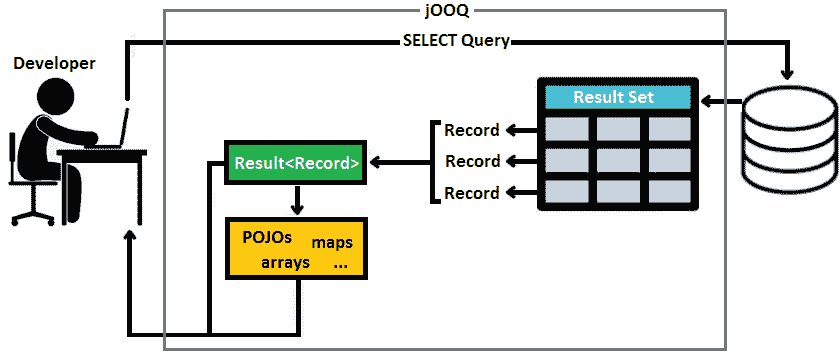
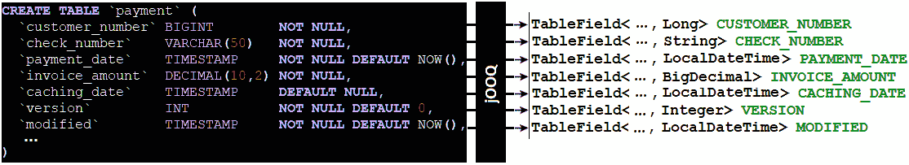
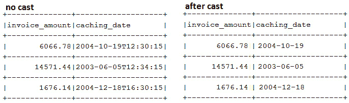
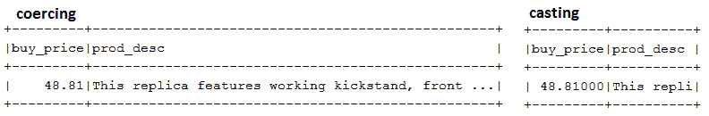
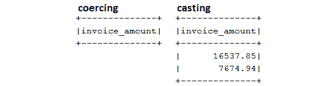

# 第三章：jOOQ 核心概念

在探索 jOOQ 更多精彩功能之前，我们必须了解 jOOQ 所依赖的核心（基本）概念。对 jOOQ 核心概念的深入理解有助于我们做出正确的决策，并理解 jOOQ 在底层是如何工作的。别担心，我们的目标不是深入 jOOQ 的内部！我们的目标是让你接近 jOOQ 范式，并开始从 jOOQ 的上下文考虑你的持久层。

本章的目标是简要介绍以下主题：

+   钩接 jOOQ 结果（`Result`）和记录（`Record`）

+   探索 jOOQ 查询类型

+   理解 jOOQ 流畅 API

+   强调 jOOQ 如何强调 SQL 语法的正确性

+   类型转换、强制转换和比较

+   绑定值（参数）

到本章结束时，你将熟悉 jOOQ 核心概念，这些概念将帮助你轻松地跟随接下来的章节。

让我们开始吧！

# 技术要求

本章的代码可以在 GitHub 上找到：[`github.com/PacktPublishing/jOOQ-Masterclass/tree/master/Chapter03`](https://github.com/PacktPublishing/jOOQ-Masterclass/tree/master/Chapter03)。

# 钩接 jOOQ 结果（Result）和记录（Record）

在前面的章节中，我们已经通过 jOOQ 的`fetchInto()`方法将我们的查询的 JDBC 结果集映射到 POJOs。但是，在 jOOQ 中，在 JDBC 结果集和众所周知的`List<POJO>`（或其他数据结构，如数组、映射和集合）之间，还有一个被称为`Result<Record>`的基本层，它由以下两个接口表示：

+   `org.jooq.Record`：当我们触发一个`SELECT`查询时，我们得到一个包含列列表和相应值列表的结果集。通常，我们将结果集的内容称为*记录*。jOOQ 将每个这样的*记录*映射到其`Record`接口。将`Record`视为 jOOQ 对*记录*的内部表示。

+   `org.jooq.Result`：jOOQ 的`Result`接口是一个`java.util.List`的`org.jooq.Record`。换句话说，jOOQ 将结果集的每个*记录*映射到`Record`，并将此记录收集到`Result`中。一旦`Result<Record>`完成（整个结果集已处理），它可以映射到数组、集合/列表的 POJOs、映射，或者可以按原样返回。

下图表示这条直接路径：JDBC 结果集 | jOOQ `Result<Record>` | 数组/列表/集合/映射：



图 3.1 – JDBC ResultSet 的处理

如您从这张图中可以看到，我们可以根据应用程序的需求以特定类型获取结果集（例如，`List<POJO>`），但也可以直接以`Result<Record>`获取结果集。如果您来自 JPA 领域，那么您可能会认为 jOOQ 的`Record`与 JPA 实体有些相似，但这并不正确。在 jOOQ 中，没有持久化上下文（一级缓存）的等价物，jOOQ 也不会对这些对象执行任何重负载操作，如状态转换和自动刷新。大多数时候，您可以直接通过 jOOQ API 使用记录，因为您甚至不需要 POJO。

重要提示

在 jOOQ 中，默认情况下，JDBC 结果集会积极加载到内存中（当前查询投影的所有数据都将存储在内存中），但正如您将在*第八章*中看到的，“获取和映射”，我们可以使用`fetchLazy()`和`Cursor`类型“懒惰”地操作大型结果集。将 JDBC 结果集映射到`Result<Record>`带来了多项好处，以下是我们强调的：

a) `Result<Record>`表示非类型安全的查询结果，但它也可以通过`Record`特殊化（如表记录、可更新记录和度记录，最高到 22 度（数字 22 来自 Scala – [`stackoverflow.com/q/6241441/521799`](https://stackoverflow.com/q/6241441/521799)））来表示类型安全的查询结果。

b) 在将`Result<Record>`完全加载到内存后，jOOQ 会尽早释放资源。在内存中操作`Result<Record>`比在保持数据库连接的 JDBC 结果集上操作更可取。

c) `Result<Record>`可以轻松导出为 XML、CSV、JSON 和 HTML。

d) jOOQ 提供了一个友好且全面的 API 来操作`Result<Record>`，因此，用于操作结果集。

jOOQ 支持以下几种类型的`Record`：

+   `org.jooq.TableRecord`和`org.jooq.UpdatableRecord`（可以再次存储在数据库中的记录）。`TableRecord`/`UpdatableRecord`记录来自具有主键的单个表（或视图）。只有`UpdatableRecord`有（为 jOOQ 所知）的主键。jOOQ 代码生成器可以代表我们生成此类记录 – 例如（查看我们之前的应用程序），`jooq.generated.tables.records`包，其中包含`CustomerRecord`、`EmployeeRecord`和`OfficeRecord`。所有这些表记录都是通过 jOOQ 生成器生成的，并且是强类型的。

+   `Record`的目的是为在 SQL 中投影自定义记录类型的查询提供类型安全。查询可以包含来自单个表或多个表的记录。jOOQ 将选择适当的`Record1` ... `Record22`接口，并选择正确的类型以确保查询结果的安全性。

    重要提示

    这种类型安全性应用于记录，直到 22 度。这也适用于行值表达式、通过集合运算符（例如，`UNION`）组合的子查询、`IN` 谓词和比较谓词（它们接受子查询）、以及接受类型安全 `VALUES()` 子句的 `INSERT` 和 `MERGE` 语句。超过 22 度，就没有类型安全性。

+   `org.jooq.UDTRecord` API。

+   `org.jooq.EmbeddableRecord`。这个主题在 *第七章*，*类型、转换器和绑定* 中有所介绍。

让我们看看几个获取 jOOQ 记录的示例。

## 通过普通 SQL 获取 Result<Record>

在 jOOQ 中，普通的 SQL，例如 SQL 字符串，返回一个匿名的类型安全 `Result<Record>`。以下有两个示例：

```java
/* non type-safe Result<Record> */
```

```java
Result<Record> result = ctx.fetch(
```

```java
  "SELECT customer_name, customer_number, credit_limit
```

```java
   FROM customer");
```

```java
/* non type-safe Result<Record> */
```

```java
Result<Record> result = ctx.resultQuery(
```

```java
  "SELECT customer_name, customer_number, credit_limit
```

```java
   FROM customer").fetch();
```

迭代 `Result` 就像迭代 `java.util.List`。每个 `Record` 都可以通过一个综合的 API 访问，该 API 提供了超过 10 个 `get()`/`getValue()` 方法，以非类型安全的方式从记录中检索值。考虑以下示例：

```java
/* non type-safe values */
```

```java
for (Record record : result) {
```

```java
  // get value by index
```

```java
  Object r1 = record.get(0);
```

```java
  // get value by name
```

```java
  Object r2 = record.get("customer_number");
```

```java
  // get value by name and type
```

```java
  BigDecimal r3 = record.getValue(
```

```java
    "credit_limit", BigDecimal.class);
```

```java
}
```

注意 `r3`。我们的示例运行得很好，但如果指定的类型不是指定列的正确类型（换句话说，数据类型不能转换，但转换是可能的），那么我们将得到 jOOQ 的 `DataTypeException`，甚至更糟糕的是，你可能会静默地使用一个表面上成功的转换的结果，该结果可能有错误的表现。此外，列名中的错误或不存在的列将导致 `java.lang.IllegalArgumentException`。

为了避免这种不愉快的情况，从现在开始，我们依赖于通过 jOOQ Code Generator 获取的类。这为我们带来了巨大的生产力提升和广泛的功能。嗯，我告诉你你应该始终依赖 jOOQ Code Generator 吗？无论如何，让我们继续举例。

## 通过 select() 获取 Result<Record>

`DSLContext` 的无参数 `select()` 方法会导致包含所有列的投影。它还产生一个非类型安全的 `Result<Record>`。这次，我们使用由 jOOQ Code Generator 产生的基于 Java 的模式：

```java
/* non type-safe Result<Record> */
```

```java
Result<Record> result = ctx.select().from(CUSTOMER).fetch();
```

即使 `Result<Record>` 是非类型安全的，也可以通过 jOOQ 生成的类以类型安全的方式提取记录的值。更确切地说，我们使用生成的 `Customer` 类的属性如下（`CUSTOMER` 是 `static`）：

```java
/* type-safe values */
```

```java
for (Record r : result) {
```

```java
  String r1 = r.get(CUSTOMER.CUSTOMER_NAME);
```

```java
  Long r2 = r.get(CUSTOMER.CUSTOMER_NUMBER);
```

```java
  BigDecimal r3 = r.get(CUSTOMER.CREDIT_LIMIT);
```

```java
  ...
```

```java
}
```

更进一步，我们可以将这个非类型安全的 `Result<Record>` 表达为类型安全的。

### 将 org.jooq.Record 映射到强类型的 org.jooq.TableRecord

由于我们从具有主键的单个表（`CUSTOMER`）中获取数据，我们可以使用 jOOQ 与数据库表关联的 `TableRecord`。

通过将 `org.jooq.Record` 映射到相应的强类型 `org.jooq.TableRecord`，可以通过 `Record.into(Table<Z> table)` 方法将先前的非类型安全的 `Result<Record>` 转换为类型安全的。在这种情况下，相应的强类型 `org.jooq.TableRecord` 是 `CustomerRecord`。查看以下代码：

```java
/* type-safe Result<Record> */
```

```java
Result<CustomerRecord> result = ctx.select().from(CUSTOMER)
```

```java
  .fetch().into(CUSTOMER);
```

同样可以通过`Record.into(Class<? extends E> type)`来实现：

```java
/* type-safe Result<Record> */
```

```java
List<CustomerRecord> result = ctx.select().from(CUSTOMER)
```

```java
  .fetch().into(CustomerRecord.class);
```

这次，我们可以使用`CustomerRecord`的 getter 来访问记录的值：

```java
/* type-safe values */
```

```java
for (CustomerRecord r : result) {
```

```java
  String r1 = r.getCustomerName();
```

```java
  Long r2 = r.getCustomerNumber();
```

```java
  BigDecimal r3 = r.getCreditLimit();
```

```java
  ...
```

```java
}
```

让我们看看如果我们将这个查询扩展以从两个（或更多）表中获取数据会发生什么。

## 通过 select()和 join()获取 Result<Record>

让我们通过添加`JOIN`子句来丰富`ctx.select().from(CUSTOMER)`，以同时获取`CUSTOMERDETAIL`表中的记录（`CUSTOMER`和`CUSTOMERDETAIL`之间存在一对一的关系）：

```java
/* non type-safe Result<Record> */
```

```java
Result<Record> result = ctx.select()
```

```java
  .from(CUSTOMER)
```

```java
  .join(CUSTOMERDETAIL)
```

```java
    .on(CUSTOMER.CUSTOMER_NUMBER
```

```java
      .eq(CUSTOMERDETAIL.CUSTOMER_NUMBER))
```

```java
  .fetch();
```

记录的值可以从生成的`Customer`和`Customerdetail`类的属性中类型安全地提取：

```java
/* type-safe values */
```

```java
for (Record r : result) {
```

```java
  String r1 = r.get(CUSTOMER.CUSTOMER_NAME);
```

```java
  Long r2 = r.get(CUSTOMER.CUSTOMER_NUMBER);
```

```java
  BigDecimal r3 = r.get(CUSTOMER.CREDIT_LIMIT);
```

```java
  ...
```

```java
  String r4 = r.get(CUSTOMERDETAIL.CITY);
```

```java
  String r5 = r.get(CUSTOMERDETAIL.COUNTRY);
```

```java
  ...
```

```java
}
```

将这个非类型安全的`Result<Record>`重写为类型安全的版本稍微有点冗长。让我们看看如何做到这一点。

### 将 org.jooq.Record 映射到强类型 org.jooq.TableRecord

通过适当的`select(SelectField<T1>, SelectField<T2>...SelectField<T22>)`或`into(Field<T1>, Field<T2> ... Field<T22>)`方法以及适当的`Record[N]`接口（`N=1..22`），可以将之前的非类型安全的`Result<Record>`转换为类型安全的版本。我们的模式显示`CUSTOMER`和`CUSTOMERDETAIL`表总共包含 15 个字段，因此，适当的`Record[N]`是`Record15`，我们使用`select(SelectField<T1>, SelectField<T2>... SelectField<T15>)`对应的方法：

```java
/* type-safe Result<Record> via select() */        
```

```java
Result<Record15<Long, String, String, String, 
```

```java
  String, Long, BigDecimal, Integer, Long, String, String, 
```

```java
  String, String, String, String>> result
```

```java
  = ctx.select(CUSTOMER.CUSTOMER_NUMBER, 
```

```java
    CUSTOMER.CUSTOMER_NAME,CUSTOMER.CONTACT_FIRST_NAME, 
```

```java
    CUSTOMER.CONTACT_LAST_NAME,CUSTOMER.PHONE, 
```

```java
    CUSTOMER.SALES_REP_EMPLOYEE_NUMBER, 
```

```java
    CUSTOMER.CREDIT_LIMIT,CUSTOMER.FIRST_BUY_DATE,
```

```java
    CUSTOMERDETAIL.CUSTOMER_NUMBER, 
```

```java
    CUSTOMERDETAIL.ADDRESS_LINE_FIRST,
```

```java
    CUSTOMERDETAIL.ADDRESS_LINE_SECOND, 
```

```java
    CUSTOMERDETAIL.CITY,CUSTOMERDETAIL.COUNTRY, 
```

```java
    CUSTOMERDETAIL.POSTAL_CODE,CUSTOMERDETAIL.STATE)
```

```java
      .from(CUSTOMER)
```

```java
      .join(CUSTOMERDETAIL)
```

```java
      .on(CUSTOMER.CUSTOMER_NUMBER.eq(
```

```java
        CUSTOMERDETAIL.CUSTOMER_NUMBER))
```

```java
      .fetch();
```

或者，我们可以使用`into(Field<T1>, Field<T2> ... Field<T15>)`对应的方法：

```java
/* type-safe Result<Record>via into() */
```

```java
Result<Record15<Long, String, String, String, 
```

```java
         String, Long, BigDecimal, Integer, Long, String,  
```

```java
         String, String, String, String, String>> result =  
```

```java
   ctx.select()
```

```java
      .from(CUSTOMER)
```

```java
      .join(CUSTOMERDETAIL)
```

```java
         .on(CUSTOMER.CUSTOMER_NUMBER
```

```java
            .eq(CUSTOMERDETAIL.CUSTOMER_NUMBER))
```

```java
      .fetch()
```

```java
      .into(CUSTOMER.CUSTOMER_NUMBER, 
```

```java
    CUSTOMER.CUSTOMER_NAME, CUSTOMER.CONTACT_FIRST_NAME, 
```

```java
    CUSTOMER.CONTACT_LAST_NAME,CUSTOMER.PHONE, 
```

```java
    CUSTOMER.SALES_REP_EMPLOYEE_NUMBER, CUSTOMER.CREDIT_LIMIT, 
```

```java
    CUSTOMER.FIRST_BUY_DATE, CUSTOMERDETAIL.CUSTOMER_NUMBER,   
```

```java
    CUSTOMERDETAIL.ADDRESS_LINE_FIRST, 
```

```java
    CUSTOMERDETAIL.ADDRESS_LINE_SECOND, CUSTOMERDETAIL.CITY,
```

```java
    CUSTOMERDETAIL.COUNTRY, CUSTOMERDETAIL.POSTAL_CODE,
```

```java
    CUSTOMERDETAIL.STATE);
```

显然，我们有 22 个这样的`select()`和`into()`方法，但我们需要与我们的记录度相对应的那个。

重要提示

你注意到`Record15<…>`结构了吗？当然注意到了！它很难错过！除了明显的冗长之外，填充数据类型也不是那么容易。你必须按正确的顺序识别并写下获取的字段的数据类型。幸运的是，我们可以通过使用 Java 9 的`var`关键字来避免这个痛苦的步骤。一旦你练习了本章的示例，并且熟悉了`Record[N]`，那么在没有任何理由手动写下`Record[N]`的情况下，考虑使用`var`。另一方面，如果你使用 Kotlin/Scala，那么你可以利用对元组样式数据结构的更好支持，并依赖于`Record[N]`的自动解构为`val(a, b, c) = select(A, B, C)`。更多详情，请参考这个示例：[`github.com/jOOQ/jOOQ/tree/main/jOOQ-examples/jOOQ-kotlin-example`](https://github.com/jOOQ/jOOQ/tree/main/jOOQ-examples/jOOQ-kotlin-example)。到目前为止，在 Java 中，前两个示例可以使用`var`如下表示：

`var result = ctx.select(...);`

`var result = ctx.select()...into(...);`

记录的值可以通过生成的`Customer`和`Customerdetail`类的属性以相同的方式访问。但是，我们能否通过相应的表记录来访问它？

### 从 Record 中提取两个 TableRecords

通过 `Record.into(Table<Z> table)` 方法从非规范化的 `Record` 中提取两个单独的强类型 `TableRecord` 类型（`CustomerRecord` 和 `CustomerdetailRecord`）是可以实现的。我敢打赌你没想到这是可能的：

```java
Result<CustomerRecord> rcr=result.into(CUSTOMER);
```

```java
Result<CustomerdetailRecord> rcd=result.into(CUSTOMERDETAIL);
```

此外，我们可以依赖 `CustomerRecord` 和 `CustomerdetailRecord` 的内置获取器来访问相应的值。

## 通过 selectFrom() 获取 Result<Record>

在类型安全的方式下选择单个表中的所有列并将其放入 `Result<Record>` 的最佳方法依赖于 `selectFrom(table)` 方法。在这种情况下，jOOQ 返回由参数表提供的记录类型，因此它返回 `TableRecord`。查看以下代码：

```java
/* type-safe Result<Record> */
```

```java
Result<CustomerRecord> result 
```

```java
  = ctx.selectFrom(CUSTOMER).fetch();
```

此外，`CustomerRecord` 获取器返回的值：

```java
/* type-safe values */
```

```java
for (CustomerRecord r : result) {
```

```java
  String r1 = r.getCustomerName();
```

```java
  Long r2 = r.getCustomerNumber();
```

```java
  BigDecimal r3 = r.getCreditLimit();
```

```java
  ... 
```

```java
}
```

虽然这确实很酷，但也请考虑以下重要注意事项。

重要注意事项

不要认为 `select().from(table)` 和 `selectFrom(table)` 是同一件事。前者，`select().from(table)`，返回一个非类型安全的 `Result<Record>`，我们可以使用任何修改表表达式类型的子句（例如，`JOIN`）。另一方面，`selectFrom(table)` 返回一个类型安全的 `Result<TableRecord>`，不允许使用任何修改表表达式类型的子句。

接下来，让我们解决 ad hoc 查询。

## 通过 ad hoc 查询获取 Result<Record>

在 ad hoc 查询中，我们列出所需列，这些列可以来自一个或多个表。只要我们明确列出列并依赖基于 Java 的模式，jOOQ 就会确定正确的类型，并准备一定程度的记录。以下是一个从单个表中选择一些列的示例：

```java
/* type-safe Result<Record> */
```

```java
Result<Record3<Long, String, BigDecimal>> result = ctx.select(
```

```java
    CUSTOMER.CUSTOMER_NUMBER, CUSTOMER.CUSTOMER_NAME,   
```

```java
    CUSTOMER.CREDIT_LIMIT)
```

```java
  .from(CUSTOMER)
```

```java
  .fetch();
```

由于我们有三个列，jOOQ 自动选择了度数为 3 的记录，`Record3`，并自动推断出正确的 Java 类型，`Long`，`String` 和 `BigDecimal`。

接下来，让我们看看一个示例，该示例从两个表中检索五个列：

```java
/* type-safe Result<Record> */
```

```java
Result<Record5<Long, BigDecimal, String, String, String>>
```

```java
  result = ctx.select(CUSTOMER.CUSTOMER_NUMBER,    
```

```java
      CUSTOMER.CREDIT_LIMIT, CUSTOMERDETAIL.CITY,   
```

```java
      CUSTOMERDETAIL.COUNTRY, CUSTOMERDETAIL.POSTAL_CODE)
```

```java
    .from(CUSTOMER)
```

```java
    .join(CUSTOMERDETAIL)
```

```java
    .on(CUSTOMER.CUSTOMER_NUMBER
```

```java
      .eq(CUSTOMERDETAIL.CUSTOMER_NUMBER))
```

```java
    .fetch();
```

这次，jOOQ 选择了 `Record5<Long, BigDecimal, String, String, String>`。我想你已经明白了这个概念！

以类型安全的方式访问记录的值可以通过生成类的属性来完成，或者你可以使用 `Record.into(Table<Z> table)` 来提取强类型的 `TableRecords` 并依赖相应的获取器。但请注意，只有查询中列出/投影的字段才填充了结果集的值。

## 通过 UDTs 获取 Result<Record>

UDTs 是 Oracle 和 PostgreSQL 正式支持的 ORDBMS 功能，并由 jOOQ 模拟为 `UDTRecord`。让我们考虑以下在 PostgreSQL 中定义的 UDT：

```java
/* Define a type using CREATE TYPE */
```

```java
CREATE TYPE "evaluation_criteria" AS ("communication_ability" 
```

```java
  INT, "ethics" INT, "performance" INT, "employee_input" INT);
```

接下来，`MANAGER` 表模式如下使用此类型：

```java
CREATE TABLE "manager" (
```

```java
  ...
```

```java
  "manager_evaluation" evaluation_criteria DEFAULT NULL
```

```java
  ...
```

```java
);
```

运行 jOOQ 代码生成器会生成一个名为 `EvaluationCriteria.java` 的 `org.jooq.UDT` 实现文件（位于 `jooq.generated.udt` 包中）。除了 `org.jooq.UDT` 实现之外，还会生成一个名为 `EvaluationCriteriaRecord.java` 的 `org.jooq.UDTRecord` 实现文件（位于 `jooq.generated.udt.records` 包中）。

生成这些工件后，我们可以编写以下示例，它返回一个类型安全的 `Result<Record>`：

```java
/* type-safe Result<Record> */
```

```java
Result<Record2<String, EvaluationCriteriaRecord>> result =
```

```java
  ctx.select(MANAGER.MANAGER_NAME, MANAGER.MANAGER_EVALUATION)
```

```java
     .from(MANAGER)
```

```java
     .fetch();
```

可以通过以下方式访问记录的值。当然，高潮是访问 UDT 记录的值：

```java
/* type-safe values */
```

```java
for(Record2 r : result) {
```

```java
  String r1 = r.get(MANAGER.MANAGER_NAME);
```

```java
  Integer r2 = r.get(MANAGER.MANAGER_EVALUATION)
```

```java
    .getCommunicationAbility();
```

```java
  Integer r3 = r.get(MANAGER.MANAGER_EVALUATION)
```

```java
    .getEthics();
```

```java
  Integer r4 = r.get(MANAGER.MANAGER_EVALUATION)
```

```java
    .getPerformance();
```

```java
  Integer r5 = r.get(MANAGER.MANAGER_EVALUATION)
```

```java
    .getEmployeeInput();
```

```java
}
```

或者，可以通过 `Record.into(Table<Z> table)` 来实现，如下所示：

```java
/* type-safe Result<Record> */
```

```java
Result<ManagerRecord> result =
```

```java
  ctx.select(MANAGER.MANAGER_NAME, MANAGER.MANAGER_EVALUATION)
```

```java
     .from(MANAGER)
```

```java
     .fetch()
```

```java
     .into(MANAGER); // or, into(ManagerRecord.class)
```

这次，可以通过 `getManagerEvaluation()` 方法访问记录的值：

```java
/* type-safe values */
```

```java
for(ManagerRecord r : result) {
```

```java
  String r1 =r.getManagerName();
```

```java
  Integer r2 =r.getManagerEvaluation()
```

```java
    .getCommunicationAbility();
```

```java
  Integer r3 = r.getManagerEvaluation().getEthics();
```

```java
  Integer r4 = r.getManagerEvaluation().getPerformance();
```

```java
  Integer r5 = r.getManagerEvaluation().getEmployeeInput();
```

```java
}
```

好吧，这就是对 jOOQ 记录的简要概述。我故意跳过了 `UpdatableRecord`，因为这个主题将在 *第九章*，*CRUD、事务和锁定* 中进行讨论。

重要提示

当这本书编写时，尝试通过 Spring Boot 默认的 Jackson 功能（例如，通过从 REST 控制器返回 `Record`）将 jOOQ 记录序列化为 JSON/XML 将导致异常！设置 `FAIL_ON_EMPTY_BEANS=false` 将消除异常，但会导致奇怪且无用的结果。或者，你可以返回 POJO 或依赖 jOOQ 的格式化功能——正如你将看到的，jOOQ 可以将记录格式化为 JSON、XML 和 HTML。而且，别忘了使用 SQL/XML 或 SQL/JSON 功能，并在数据库中直接生成 JSON（参见 *第八章*，*获取和映射*）。然而，如果你真的想序列化 jOOQ 记录，那么你可以依赖 `intoMap()` 和 `intoMaps()`，正如你将在附带代码中看到的那样。同时，你可以在[`github.com/jOOQ/jOOQ/issues/11889`](https://github.com/jOOQ/jOOQ/issues/11889)上监控这个主题的进展。

本节中涵盖的示例可在书籍附带代码中的 Maven 和 Gradle 下找到，名称为 *RecordResult*。

# 探索 jOOQ 查询类型

jOOQ 区分了两种主要的查询类型：

+   DML（`INSERT`、`UPDATE`、`DELETE` 和 `MERGE` 等）和 DDL（`CREATE`、`ALTER`、`DROP`、`RENAME` 等）查询，这些查询会在数据库中产生修改

+   DQL（`SELECT`）查询会产生结果

DML 和 DDL 查询在 jOOQ 中由 `org.jooq.Query` 接口表示，而 DQL 查询由 `org.jooq.ResultQuery` 接口表示。`ResultQuery` 接口扩展了（包括）`Query` 接口。

例如，以下代码片段包含两个 jOOQ 查询：

```java
Query query = ctx.query("DELETE FROM payment 
```

```java
  WHERE customer_number = 103");
```

```java
Query query = ctx.deleteFrom(PAYMENT)
```

```java
  .where(PAYMENT.CUSTOMER_NUMBER.eq(103L));  
```

这些查询可以通过 jOOQ 执行，并返回受影响的行数：

```java
int affectedRows = query.execute();
```

此外，这里有两个结果查询：首先是一个普通的 SQL 查询——在这里，jOOQ 无法推断 `Record` 类型：

```java
ResultQuery<Record> resultQuery = ctx.resultQuery(
```

```java
  "SELECT job_title FROM employee WHERE office_code = '4'");
```

```java
Result<Record> fetched = resultQuery.fetch();
```

```java
List<String> result = fetched.into(String.class);        
```

其次，通过 jOOQ 生成的类表达式的 jOOQ `ResultQuery`（注意这次，jOOQ 推断出 `ResultQuery` 参数的数量和类型——因为我们只获取 `JOB_TITLE`，所以有 `Record1<String>`）：

```java
ResultQuery<Record1<String>> resultQuery
```

```java
  = ctx.select(EMPLOYEE.JOB_TITLE)
```

```java
       .from(EMPLOYEE)
```

```java
       .where(EMPLOYEE.OFFICE_CODE.eq("4"));        
```

```java
Result<Record1<String>> fetched = resultQuery.fetch();
```

```java
List<String> result = fetched.into(String.class);       
```

由于 `ResultQuery` 扩展了 `Iterable`，您可以使用 PL/SQL 风格的 *foreach* 来遍历查询，并对每条记录进行处理。例如，以下代码片段效果很好：

```java
for (Record2<String, String> customer : ctx.select(
```

```java
             CUSTOMER.CUSTOMER_NAME, CUSTOMER.PHONE)
```

```java
       .from(CUSTOMER)) {
```

```java
  System.out.println("Customer:\n" + customer);
```

```java
}         
```

```java
for (CustomerRecord customer : ctx.selectFrom(CUSTOMER)
```

```java
       .where(CUSTOMER.SALES_REP_EMPLOYEE_NUMBER.eq(1504L))) {
```

```java
  System.out.println("Customer:\n" + customer);
```

```java
}
```

没有必要显式调用 `fetch()`，但您也可以这样做。本节中的示例被组织在一个名为 *QueryAndResultQuery* 的应用程序中。接下来，让我们谈谈 jOOQ 流畅 API。

# 理解 jOOQ 流畅 API

大多数时间花在 jOOQ 上是关于通过 jOOQ 流畅 API 编写流畅代码。这种方法对于构建避免打断或分块代码的流畅 SQL 表达式非常方便。此外，流畅 API 很容易通过更多操作来丰富。

基于接口驱动设计概念的出色实现，jOOQ 隐藏了大多数实现细节，并作为一个随时准备倾听您需要运行的 SQL 的 *好朋友*。让我们看看 jOOQ 流畅 API 的几个用法。

## 编写流畅查询

到目前为止，我们已经用 jOOQ DSL API 流畅风格编写了几个 SQL。让我们再看一个如下：

```java
DSL.select(
```

```java
      ORDERDETAIL.ORDER_LINE_NUMBER, 
```

```java
      sum(ORDERDETAIL.QUANTITY_ORDERED).as("itemsCount"),
```

```java
      sum(ORDERDETAIL.PRICE_EACH
```

```java
        .mul(ORDERDETAIL.QUANTITY_ORDERED)).as("total"))
```

```java
   .from(ORDERDETAIL)   
```

```java
   .where((val(20).lt(ORDERDETAIL.QUANTITY_ORDERED)))
```

```java
   .groupBy(ORDERDETAIL.ORDER_LINE_NUMBER)
```

```java
   .orderBy(ORDERDETAIL.ORDER_LINE_NUMBER)
```

```java
   .getSQL();
```

将之前的 jOOQ 查询剖析到极致的目标离我们还很远，但让我们尝试从 jOOQ 的视角来了解这个查询。这将帮助您快速积累后续章节的信息，并增强您对 jOOQ 的信心。

大概来说，一个 JOOQ 流畅查询由两个基本构建块组成：`org.jooq.QueryPart` 接口作为通用基类型。让我们简要地介绍一下列表达式、表表达式和查询步骤，以便更好地理解这一段。

### 列表达式

`org.jooq.Field` 接口。列表达式有很多种，它们都可以用在各种 SQL 语句/子句中，以生成流畅的查询。例如，在 `SELECT` 子句中，我们有 `org.jooq.SelectField`（这是一个特殊的 `org.jooq.Field` 接口，用于 `SELECT`）；在 `WHERE` 子句中，我们有 `org.jooq.Field`；在 `ORDER BY` 子句中，我们有 `org.jooq.OrderField`；在 `GROUP BY` 子句中，我们有 `org.jooq.GroupField`；在条件和函数中，我们通常有 `org.jooq.Field`。

列表达式可以通过 jOOQ 流畅 API 随意构建，以形成不同的查询部分，如算术表达式（例如，`column_expression_1.mul(column_expression_2)`）、用于 `WHERE` 和 `HAVING` 的条件/谓词（例如，这里是一个等价条件：`WHERE(column_expression_1.eq(column_expression_2))`）等等。

当列表达式引用表列时，它们被引用为 `org.jooq.TableField`。这类列表达式是由 jOOQ 代码生成器内部生成的，你可以在每个特定于表的 Java 类中看到它们。`TableField` 的实例不能直接创建。

让我们使用以下图示来识别查询中的列表达式类型，它将它们突出显示：

![Figure 3.2 – 识别此查询的列表达式

![img/B16833_Figure_3.2.jpg]

Figure 3.2 – 识别此查询的列表达式

首先，我们有一些引用 `ORDERDETAIL` 表的表列：

```java
Field<Integer> tc1 = ORDERDETAIL.ORDER_LINE_NUMBER;  
```

```java
Field<Integer> tc2 = ORDERDETAIL.QUANTITY_ORDERED; 
```

```java
Field<BigDecimal> tc3 = ORDERDETAIL.PRICE_EACH;    
```

我们已经将其提取为 `TableField`：

```java
TableField<OrderdetailRecord,Integer>
```

```java
   tfc1 = ORDERDETAIL.ORDER_LINE_NUMBER;
```

```java
TableField<OrderdetailRecord,Integer>
```

```java
   tfc2 = ORDERDETAIL.QUANTITY_ORDERED;
```

```java
TableField<OrderdetailRecord,BigDecimal>
```

```java
   tfc3 = ORDERDETAIL.PRICE_EACH;
```

我们还有一个未命名的列表达式：

```java
Field<Integer> uc1 = val(20);                  
```

仅仅作为一个快速提示，在这里，`DSL.val()` 方法简单地创建代表常量值的 `Field<Integer>`（获取绑定值作为 `Param<Integer>`，其中 `Param` 扩展 `Field`），我们将在本章稍后讨论 jOOQ 参数。

让我们使用提取的列表达式重写到目前为止的查询：

```java
DSL.select(tc1, sum(tc2).as("itemsCount"),
```

```java
           sum(tc3.mul(tc2)).as("total"))
```

```java
   .from(ORDERDETAIL)
```

```java
   .where(uc1.lt(tc2))
```

```java
   .groupBy(tc1)
```

```java
   .orderBy(tc1)
```

```java
   .getSQL();
```

接下来，让我们提取 `sum()` 聚合函数的使用情况。`sum()` 的第一次使用依赖于一个表列表达式（`tc2`）来生成一个函数表达式：

```java
Field<BigDecimal> f1 = sum(tc2); // function expression
```

`sum()` 的第二种用法封装了一个使用两个表列表达式（`tc3` 和 `tc2`）的算术表达式，因此，它可以如下提取：

```java
Field<BigDecimal> m1 = tc3.mul(tc2); // arithmetic expression
```

```java
Field<BigDecimal> f2 = sum(m1);      // function expression
```

再进一步，我们注意到我们的查询使用了 `f1` 和 `f2` 的别名，因此，这些可以提取为带别名的表达式：

```java
Field<BigDecimal> a1 = f1.as("itemsCount"); // alias expression
```

```java
Field<BigDecimal> a2 = f2.as("total");      // alias expression
```

让我们再次重写查询：

```java
DSL.select(tc1, a1, a2)
```

```java
   .from(ORDERDETAIL)
```

```java
   .where(uc1.lt(tc2))
```

```java
   .groupBy(tc1)
```

```java
   .orderBy(tc1)
```

```java
   .getSQL();
```

完成！在这个时候，我们已经识别了我们查询中的所有列表达式。那么表表达式呢？

### 表表达式

除了字段之外，表也代表了任何查询的基本构建块。jOOQ 通过 `org.jooq.Table` 来表示表。在我们的查询中，有一个单独的表引用：

```java
.from(ORDERDETAIL) // table expression ORDERDETAIL
```

它可以如下提取：

```java
// non type-safe table expression
```

```java
Table<?> t1 = ORDERDETAIL; 
```

```java
// type-safe table expression  
```

```java
Table<OrderdetailRecord> t1 = ORDERDETAIL;
```

这次，查询变成了以下形式：

```java
DSL.select(tc1, a1, a2)
```

```java
   .from(t1)
```

```java
   .where(uc1.lt(tc2))
```

```java
   .groupBy(tc1)
```

```java
   .orderBy(tc1)
```

```java
   .getSQL();
```

jOOQ 支持广泛的表，不仅包括数据库表，还包括普通 SQL 表、别名表、派生表、**公用表表达式（CTEs**）、临时表和表值函数。但我们将讨论这些内容在接下来的章节中。

到目前为止，请注意，我们还没有触及 `uc1.lt(tc2)`。正如你可能直觉到的，这是一个使用两个列表达式并映射为 jOOQ 的 `org.jooq.Condition` 的条件。它可以如下提取：

```java
Condition c1 = uc1.lt(tc2); // condition
```

在提取所有这些部分之后，我们得到了以下查询：

```java
DSL.select(tc1, a1, a2)
```

```java
   .from(t1)
```

```java
   .where(c1)
```

```java
   .groupBy(tc1)
```

```java
   .orderBy(tc1)
```

```java
   .getSQL();
```

实际上，你甚至可以这样做，但这样就没有更多的类型安全性：

```java
Collection<? extends SelectField> sf = List.of(tc1, a1, a2);
```

```java
DSL.select(sf) …
```

显然，这些查询部分也可以用来形成其他任意查询。毕竟，在 jOOQ 中，我们可以编写 100% 动态的查询。

重要提示

在 jOOQ 中，即使它们看起来像静态查询（由于 jOOQ 的 API 设计），每个 SQL 都是动态的，因此，它可以被分解成可以流畅地重新组合到任何有效 jOOQ 查询中的查询部分。我们将在稍后讨论动态过滤器时提供更多示例。

最后，让我们快速了解一下查询步骤主题。

### 查询步骤（SelectFooStep、InsertFooStep、UpdateFooStep 和 DeleteFooStep）

继续识别剩余的查询部分，我们有`select`、`from`、`where`、`groupBy`和`orderBy`。这些部分逻辑上链接在一起形成我们的查询，并由 jOOQ 表示为查询步骤。查询步骤有很多种类型，但我们的查询可以分解如下：

```java
SelectSelectStep s1 = DSL.select(tc1, a1, a2);
```

```java
SelectJoinStep s2 = s1.from(t1);
```

```java
SelectConditionStep s3 = s2.where(c1);
```

```java
SelectHavingStep s4 = s3.groupBy(tc1);
```

```java
SelectSeekStep1 s5 = s4.orderBy(tc1);
```

```java
return s5.getSQL();        
```

或者，用作类型安全步骤的如下（记住，你可以使用 Java 9 `var`代替`SelectSelectStep<Record3<Short, BigDecimal, BigDecimal>>`）：

```java
SelectSelectStep<Record3<Integer, BigDecimal, BigDecimal>>
```

```java
  s1ts = DSL.select(tc1, a1, a2);
```

```java
SelectJoinStep<Record3<Integer, BigDecimal, BigDecimal>>
```

```java
  s2ts = s1ts.from(t1);
```

```java
SelectConditionStep<Record3<Integer, BigDecimal, BigDecimal>>
```

```java
  s3ts = s2ts.where(c1);
```

```java
SelectHavingStep<Record3<Integer, BigDecimal, BigDecimal>>
```

```java
  s4ts = s3ts.groupBy(tc1);
```

```java
SelectSeekStep1<Record3<Integer, BigDecimal, BigDecimal>,   
```

```java
  Integer> s5ts = s4ts.orderBy(tc1);
```

```java
return s5ts.getSQL();
```

查看此代码片段的最后一行。我们返回生成的有效 SQL 作为纯字符串，而不执行此查询。执行可以在数据库连接存在的情况下发生，因此，我们需要配置`DSLContext`来完成此任务。如果我们已经注入了`DSLContext`，那么我们只需要像下面这样使用它：

```java
return ctx.fetch(s5); // or, s5ts
```

或者，我们可以这样使用它：

```java
SelectSelectStep s1 = ctx.select(tc1, a1, a2);
```

```java
// or
```

```java
SelectSelectStep<Record3<Integer, BigDecimal, BigDecimal>>
```

```java
   s1ts = ctx.select(tc1, a1, a2);
```

这个`SelectSelectStep`包含对`DSLContext`配置的内部引用，因此，我们可以将最后一行替换如下：

```java
return s5.fetch(); // or, s5ts
```

完整的代码可以在本书附带代码中找到，这些代码打包在名为`FluentQueryParts`的部分下。虽然在本节中，你看到了如何分解查询步骤，但请记住，几乎总是更好的选择是依赖于动态 SQL 查询而不是引用这些步骤类型。因此，作为一个经验法则，*总是*尝试避免直接分配或引用查询步骤。

显然，将查询分解成部分并不是日常任务。大多数时候，你只会使用流畅 API，但有时了解如何进行分解是有用的（例如，这有助于编写动态过滤器，在查询的不同位置引用别名，在多个位置重用查询部分，以及编写相关子查询）。

jOOQ 流畅 API 的另一个用途是关注`DSLContext`的创建。

## 创建`DSLContext`

很可能，在 Spring Boot 应用程序中，我们更喜欢注入默认的`DSLContext`，正如你在*第一章*“启动 jOOQ 和 Spring Boot”和*第二章*“自定义 jOOQ 的参与级别”中看到的，但，在某些情况下（例如，使用自定义设置包装和运行特定查询，以不同于默认方言的方言渲染 SQL，或者需要偶尔对未在 Spring Boot 中配置的数据库执行查询），我们更喜欢将`DSLContext`作为局部变量使用。这可以通过`DSL.using()`方法以流畅风格完成，如下列非详尽的示例所示。

### 从数据源和方言创建`DSLContext`

有`DataSource`（例如，注入到你的仓库中），我们可以创建`DSLContext`并以流畅风格执行查询，如下所示：

```java
private final DataSource ds; // injected DataSource
```

```java
...
```

```java
List<Office> result = DSL.using(ds, SQLDialect.MYSQL)
```

```java
  .selectFrom(OFFICE)
```

```java
  .where(OFFICE.TERRITORY.eq(territory))
```

```java
  .fetchInto(Office.class);
```

此示例依赖于`DSL.using(DataSource datasource, SQLDialect dialect)`方法。

### 从数据源、方言和一些设置创建 DSLContext

启用/禁用前一个示例中的某些设置需要我们实例化`org.jooq.conf.Settings`。这个类提供了一个全面的流畅 API（通过`withFoo()`方法），它影响 jOOQ 渲染 SQL 代码的方式。例如，以下代码片段阻止了模式名称的渲染（只需看看这段流畅的代码）：

```java
private final DataSource ds; // injected DataSource
```

```java
...
```

```java
List<Office> result = DSL.using(ds, SQLDialect.MYSQL, 
```

```java
      new Settings().withRenderSchema(Boolean.FALSE))
```

```java
  .selectFrom(OFFICE)
```

```java
  .where(OFFICE.TERRITORY.eq(territory))
```

```java
  .fetchInto(Office.class);
```

此示例依赖于`using(DataSource datasource, SQLDialect dialect, Settings settings)`方法。

### 修改注入的 DSLContext 的设置

在前面的示例中，我们创建了不渲染模式名称的`DSLContext`。此设置应用于创建的`DSLContext`的所有使用，换句话说，应用于在此`DSLContext`配置下触发的所有查询。我们如何为 Spring Boot 注入到仓库后的默认`DSLContext`做同样的事情？以下代码提供了答案：

```java
private final DSLContext ctx; // injected DSLContext
```

```java
...
```

```java
List<Office> result = ctx.configuration()
```

```java
 .set(new Settings().withRenderSchema(Boolean.FALSE)).dsl()
```

```java
 .selectFrom(OFFICE)
```

```java
 .where(OFFICE.TERRITORY.eq(territory))
```

```java
 .fetchInto(Office.class);
```

主要地，我们通过`configuration()`访问注入的`DSLContext`的当前配置，设置我们的设置，并调用`dsl()`方法以获取对`DSLContext`的访问。请注意，从这一点开始，所有使用`ctx`的地方将不会渲染模式名称，除非你再次启用它。如果你希望为某个特定的查询使用一些特定的设置，那么可以通过`derive()`代替`set()`从注入的一个`DSLContext`派生出来。这样，原始的`DSLContext`保持不变，你可以操作派生出来的一个：

```java
private final DSLContext ctx; // injected DSLContext
```

```java
...
```

```java
List<Office> result = ctx.configuration()
```

```java
 .derive(new Settings().withRenderSchema(Boolean.FALSE)).dsl()
```

```java
 .selectFrom(OFFICE)
```

```java
 .where(OFFICE.TERRITORY.eq(territory))
```

```java
 .fetchInto(Office.class);
```

因此，在前面的示例中，`ctx`保持不变，jOOQ 使用派生的`DSLContext`，它将不会渲染模式名称。

### 从连接创建 DSLContext

从连接创建 DSLContext 并以流畅风格执行查询可以按以下方式完成：

```java
try ( Connection conn
```

```java
  = DriverManager.getConnection(
```

```java
   "jdbc:mysql://localhost:3306/classicmodels",
```

```java
   "root", "root")) {
```

```java
    List<Office> result = DSL.using(conn)
```

```java
      .selectFrom(OFFICE)
```

```java
      .where(OFFICE.TERRITORY.eq(territory))
```

```java
      .fetchInto(Office.class);
```

```java
    return result;
```

```java
} catch (SQLException ex) { // handle exception }
```

在这种情况下，我们必须手动关闭连接；因此，我们使用了`try-with-resources`技术。此示例依赖于`DSL.using(Connection c)`方法。如果你想指定 SQL 方言，那么尝试使用`DSL.using(Connection c, SQLDialect d)`。

### 从 URL、用户和密码创建 DSLContext

对于基于独立脚本的脚本，由于连接与脚本本身一样长，处理资源并不重要，我们可以依赖`DSL.using(String url)`、`DSL.using(String url, Properties properties)`和`DSL.using(String url, String user, String password)`。

如果你更喜欢在 jOOQ 3.14 之前使用`DSL.using(String url, String user, String password)`方法（或任何其他两个方法），那么你必须显式关闭连接。这可以通过显式调用`DSLContext.close()`或使用`try-with-resources`来实现。从 jOOQ 3.14 开始，这些`DSL.using()`的重载将产生新的`CloseableDSLContext`类型，它允许我们编写如下代码：

```java
try (CloseableDSLContext cdctx = DSL.using(
```

```java
    "jdbc:mysql://localhost:3306/classicmodels", 
```

```java
    "root", "root")) {
```

```java
   List<Office> result = cdctx.selectFrom(OFFICE)
```

```java
     .where(OFFICE.TERRITORY.eq(territory))
```

```java
     .fetchInto(Office.class);
```

```java
   return result;
```

```java
}
```

接下来，让我们看看如何在不使用数据库连接的情况下使用`DSLContext`。

### 以特定方言渲染 SQL

在特定的方言（这里，MySQL）中渲染 SQL 可以通过以下流畅的代码完成：

```java
String sql = DSL.using(SQLDialect.MYSQL)
```

```java
                .selectFrom(OFFICE)
```

```java
                .where(OFFICE.TERRITORY.eq(territory))
```

```java
                .getSQL();
```

由于没有连接或数据源，因此没有与数据库的交互。返回的字符串表示针对提供的方言生成的特定 SQL。此示例依赖于 `DSL.using(SQLDialect dialect)` 方法。

你可以在本书附带代码中找到所有这些示例，名称为 *CreateDSLContext*。

## 使用 Lambda 和流

jOOQ 流畅 API、Java 8 Lambda 和流组成了一支完美的团队。让我们看看几个演示这一点的例子。

### 使用 Lambda

例如，jOOQ 提供了一个名为 `RecordMapper` 的功能接口，用于将 jOOQ 记录映射到 POJO。让我们假设我们有以下 POJO。首先，让我们假设我们有 `EmployeeName`：

```java
public class EmployeeName implements Serializable {
```

```java
  private String firstName;
```

```java
  private String lastName;
```

```java
  // constructors, getters, setters,... omitted for brevity
```

```java
}
```

接下来，让我们假设我们有 `EmployeeData`：

```java
public class EmployeeData implements Serializable {   
```

```java
  private Long employeeNumber;    
```

```java
  private int salary;
```

```java
  private EmployeeName employeeName;
```

```java
  // constructors, getters, setters,... omitted for brevity
```

```java
}
```

接下来，让我们假设我们有以下原始 SQL：

```java
SELECT employee_number, salary, first_name, last_name
```

```java
FROM employee
```

通过 `fetch(String sql)` 风味和 `map(RecordMapper<? super R,E> rm)`（如下所示）执行和映射这个原始 SQL 是可行的：

```java
List<EmployeeData> result
```

```java
  = ctx.fetch("SELECT employee_number, first_name, 
```

```java
               last_name, salary FROM employee")
```

```java
    .map(
```

```java
      rs -> new EmployeeData(
```

```java
        rs.getValue("employee_number", Long.class),
```

```java
        rs.getValue("salary", Integer.class),
```

```java
        new EmployeeName(
```

```java
          rs.getValue("first_name", String.class),
```

```java
          rs.getValue("last_name", String.class))
```

```java
      )
```

```java
    );
```

如果通过基于 Java 的模式表达原始 SQL，则同样适用：

```java
List<EmployeeData> result
```

```java
  = ctx.select(EMPLOYEE.EMPLOYEE_NUMBER, 
```

```java
          EMPLOYEE.FIRST_NAME,EMPLOYEE.LAST_NAME, 
```

```java
          EMPLOYEE.SALARY)
```

```java
    .from(EMPLOYEE)
```

```java
    .fetch()
```

```java
    .map(
```

```java
      rs -> new EmployeeData(
```

```java
        rs.getValue(EMPLOYEE.EMPLOYEE_NUMBER),     
```

```java
        rs.getValue(EMPLOYEE.SALARY),
```

```java
        new EmployeeName(rs.getValue(EMPLOYEE.FIRST_NAME),
```

```java
                         rs.getValue(EMPLOYEE.LAST_NAME))
```

```java
      )
```

```java
);
```

如果通过 `fetch(RecordMapper<? super R,E> rm)` 更简洁地表达，则也适用：

```java
List<EmployeeData> result
```

```java
  = ctx.select(EMPLOYEE.EMPLOYEE_NUMBER, EMPLOYEE.FIRST_NAME,
```

```java
         EMPLOYEE.LAST_NAME, EMPLOYEE.SALARY)
```

```java
       .from(EMPLOYEE)
```

```java
  .fetch(
```

```java
     rs -> new EmployeeData(
```

```java
       rs.getValue(EMPLOYEE.EMPLOYEE_NUMBER),             
```

```java
       rs.getValue(EMPLOYEE.SALARY),
```

```java
       new EmployeeName(rs.getValue(EMPLOYEE.FIRST_NAME),
```

```java
                        rs.getValue(EMPLOYEE.LAST_NAME))
```

```java
     )
```

```java
  );
```

如果你认为这些映射对于使用自定义的 `RecordMapper` 来说太简单了，那么你是正确的。在我们详细讨论映射时，你将看到更多适合自定义记录映射的案例。对于这个案例，两者都可以通过使用内置的 `into()` 和 `fetchInto()` 方法，通过别名添加提示来解决问题。首先，我们可以丰富原始的 SQL（对于 MySQL，我们使用反引号）：

```java
List<EmployeeData> result = ctx.fetch("""
```

```java
  SELECT employee_number, salary, 
```

```java
         first_name AS `employeeName.firstName`,
```

```java
         last_name AS `employeeName.lastName` 
```

```java
  FROM employee""").into(EmployeeData.class);
```

然后，我们可以丰富 jOOQ SQL：

```java
List<EmployeeData> result 
```

```java
  = ctx.select(EMPLOYEE.EMPLOYEE_NUMBER, EMPLOYEE.SALARY,
```

```java
            EMPLOYEE.FIRST_NAME.as("employeeName.firstName"), 
```

```java
            EMPLOYEE.LAST_NAME.as("employeeName.lastName"))
```

```java
       .from(EMPLOYEE)
```

```java
       .fetchInto(EmployeeData.class);
```

让我们看看更多使用 Lambda 的例子。

以下代码片段打印出所有销售记录。由于 `selectFrom()` 返回带有参数表的记录类型，因此此代码打印出每个 `SaleRecord`（注意调用 `fetch()` 是可选的）：

```java
ctx.selectFrom(SALE)
```

```java
   .orderBy(SALE.SALE_)
```

```java
   // .fetch() - optional
```

```java
   .forEach(System.out::println);
```

将结果集（`SaleRecord`）映射到只包含 `sale` 列的 `List<Double>` 可以通过以下方式通过 `fetch().map(RecordMapper<? super R,E> rm)` 完成：

```java
ctx.selectFrom(SALE)
```

```java
   .orderBy(SALE.SALE_)
```

```java
   .fetch()
```

```java
   .map(SaleRecord::getSale)
```

```java
   .forEach(System.out::println);
```

或者，可以通过以下方式通过 `fetch(RecordMapper<? super R,E> rm)` 完成：

```java
ctx.selectFrom(SALE)
```

```java
   .orderBy(SALE.SALE_)
```

```java
   .fetch(SaleRecord::getSale)
```

```java
   .forEach(System.out::println);
```

这也可以通过以下 Lambda 表达式完成：

```java
ctx.selectFrom(SALE)
```

```java
   .orderBy(SALE.SALE_)
```

```java
   .fetch(s -> s.getSale())
```

```java
   .forEach(System.out::println);
```

或者，甚至可以通过以下匿名记录映射器完成：

```java
return ctx.selectFrom(SALE)
```

```java
          .orderBy(SALE.SALE_)
```

```java
          .fetch(new RecordMapper<SaleRecord, Double>() {
```

```java
             @Override
```

```java
             public Double map(SaleRecord sr) {
```

```java
                return sr.getSale();
```

```java
             }
```

```java
          });
```

接下来，让我们看看如何使用 jOOQ 流畅 API 与 Java Stream 流畅 API 结合使用。

### 使用 Stream API

使用 jOOQ 流畅 API 和 Stream 流畅 API 作为显然的单个流畅 API 是直接的。让我们假设我们有一个这样的 POJO：

```java
public class SaleStats implements Serializable {
```

```java
  private double totalSale;
```

```java
  private List<Double> sales;
```

```java
  // constructor, getters, setters, ... omitted for brevity
```

```java
}
```

一个原始 SQL 可以通过以下方式获得 `SaleStats` 实例：

```java
SaleStats result = ctx.fetch(
```

```java
    "SELECT sale FROM sale") // jOOQ fluent API ends here   
```

```java
  .stream() // Stream fluent API starts here                   
```

```java
  .collect(Collectors.teeing(
```

```java
     summingDouble(rs -> rs.getValue("sale", Double.class)),
```

```java
     mapping(rs -> rs.getValue("sale", Double.class), 
```

```java
     toList()), SaleStats::new));
```

但是，如果我们使用基于 Java 的模式，那么此代码可以重写如下：

```java
SaleStats result = ctx.select(SALE.SALE_)
```

```java
  .from(SALE)
```

```java
  .fetch()  // jOOQ fluent API ends here                
```

```java
  .stream() // Stream fluent API starts here                
```

```java
  .collect(Collectors.teeing(
```

```java
     summingDouble(rs -> rs.getValue(SALE.SALE_)),
```

```java
     mapping(rs -> rs.getValue(SALE.SALE_), toList()),
```

```java
     SaleStats::new));
```

看起来 jOOQ 流畅 API 和 Stream 流畅 API 配合得像魔法一样！我们只需要在`fetch()`之后调用`stream()`方法。当`fetch()`将整个结果集加载到内存中时，`stream()`在这个结果集上打开一个流。通过`fetch()`将整个结果集加载到内存中允许在流式传输结果集之前关闭 JDBC 资源（例如，连接）。

然而，除了`stream()`方法外，jOOQ 还提供了一个名为`fetchStream()`的方法，该方法将在本章后面讨论，专门用于懒加载以及其他特定主题。作为一个快速提示，请记住`fetch().stream()`和`fetchStream()`不是同一回事。

本节中的示例被分组在*FunctionalJooq*应用程序中。

## 流畅的编程配置

在上一章中，你已经通过程序化的流畅 API 构建了代码生成器配置的滋味。以下代码片段只是 jOOQ `Settings`流畅 API 的另一个示例：

```java
List<Office> result = ctx.configuration()
```

```java
  .set(new Settings().withRenderSchema(Boolean.FALSE)
```

```java
                     .withMaxRows(5)
```

```java
                     .withInListPadding(Boolean.TRUE)).dsl()
```

```java
  .selectFrom(...)
```

```java
  ...
```

```java
  .fetchInto(Office.class);
```

这些并不是 jOOQ 流畅 API 闪耀的唯一情况。例如，检查 jOOQ JavaFX 应用程序，它可以从 jOOQ `result`创建条形图。这在 jOOQ 手册中可用。

接下来，让我们看看 jOOQ 如何强调我们的流畅代码应该尊重 SQL 语法的正确性。

# 强调 jOOQ 注重 SQL 语法的正确性

jOOQ 最酷的特性之一是它不允许我们编写错误的 SQL 语法。如果你不是 SQL 专家或者只是对 SQL 特定的语法有问题，那么你所要做的就是让 jOOQ 一步步引导你。

拥有一个流畅的 API 来链式调用方法以获取 SQL 是酷的，但拥有一个强调 SQL 语法正确性的流畅 API 是最酷的。jOOQ 确切地知道查询部分如何拼凑成完整的拼图，并且将通过你的 IDE 帮助你。

例如，让我们假设我们*意外地*编写了以下错误的 SQL。让我们从一个缺少`ON`子句的 SQL 开始：

```java
ctx.select(EMPLOYEE.JOB_TITLE, 
```

```java
           EMPLOYEE.OFFICE_CODE, SALE.SALE_)
```

```java
   .from(EMPLOYEE)
```

```java
   .join(SALE)
```

```java
   // "on" clause is missing here
```

```java
   .fetch();
```

如下图中所示，IDE 立即发出此问题的信号：

![Figure 3.3 – Wrong SQL

![img/B16833_Figure_3.3.jpg]

图 3.3 – 错误的 SQL

让我们继续另一个错误的 SQL，它在不适当的位置使用了`JOIN`：

```java
ctx.select(EMPLOYEE.FIRST_NAME, EMPLOYEE.LAST_NAME)
```

```java
   .from(EMPLOYEE)
```

```java
   .union(select(CUSTOMER.CONTACT_FIRST_NAME, 
```

```java
                 CUSTOMER.CONTACT_LAST_NAME)
```

```java
          .from(CUSTOMER))
```

```java
   .join(CUSTOMER)
```

```java
   // "join" is not allowed here
```

```java
   .on(CUSTOMER.SALES_REP_EMPLOYEE_NUMBER
```

```java
      .eq(EMPLOYEE.EMPLOYEE_NUMBER))
```

```java
   .fetch();
```

最后，让我们看看一个缺少`over()`的错误的 SQL：

```java
ctx.select(CUSTOMER.CUSTOMER_NAME, 
```

```java
           ORDER.ORDER_DATE,lead(ORDER.ORDER_DATE, 1)
```

```java
   // missing over()
```

```java
   .orderBy(ORDER.ORDER_DATE).as("NEXT_ORDER_DATE"))
```

```java
   .from(ORDER)
```

```java
   .join(CUSTOMER)
```

```java
      .on(ORDER.CUSTOMER_NUMBER
```

```java
        .eq(CUSTOMER.CUSTOMER_NUMBER))
```

```java
   .fetch();
```

当然，我们可以永远这样继续下去，但我认为你已经明白了这个想法！所以，相信 jOOQ 吧！

# 类型转换、强制转换和比较

jOOQ 被设计用来在底层处理大多数类型转换问题，包括对于如 DB2 这样的超强类型数据库。尽管如此，显式的类型转换和/或强制转换仍然适用于一些孤立的情况。很可能会在我们对 jOOQ 自动映射不满意（例如，我们认为 jOOQ 没有找到最精确的映射）或我们需要某种类型来应对特殊情况时使用它们。即使它们增加了一点点冗余，类型转换和强制转换也可以流畅地使用；因此，DSL 表达式不会被破坏。

## 转换

大多数情况下，jOOQ 在数据库和 Java 之间找到最准确的数据类型映射。如果我们查看一个反映数据库表的 jOOQ 生成的类，那么我们会看到，对于每个具有数据库特定类型（例如，`VARCHAR`）的列，jOOQ 都找到了一个 Java 类型对应物（例如，`String`）。如果我们比较 `PAYMENT` 表的架构与生成的 `jooq.generated.tables.Payment` 类，那么我们会发现以下数据类型对应关系：



图 3.4 – 数据库和 Java 之间的类型映射

当 jOOQ 映射不是我们需要的，或者 jOOQ 无法推断出某种类型时，我们可以依赖 jOOQ 转换 API，它包含以下方法：

```java
// cast this field to the type of another field
```

```java
<Z> Field<Z> cast(Field<Z> field);
```

```java
// cast this field to a given DataType
```

```java
<Z> Field<Z> cast(DataType<Z> type);
```

```java
// cast this field to the default DataType for a given Class
```

```java
<Z> Field<Z> cast(Class<? extends Z> type);
```

除了这些方法之外，`DSL` 类还包含以下方法：

```java
<T> Field<T> cast(Object object, Field<T> field);
```

```java
<T> Field<T> cast(Object object, DataType<T> type);
```

```java
<T> Field<T> cast(Object object, Class<? extends T> type);
```

```java
<T> Field<T> castNull(Field<T> field);
```

```java
<T> Field<T> castNull(DataType<T> type);
```

```java
<T> Field<T> castNull(Class<? extends T> type);
```

让我们用 MySQL 举一些例子，并从以下查询开始，该查询将获取的数据映射到 jOOQ 自动选择的 Java 类型：

```java
Result<Record2<BigDecimal, LocalDateTime>> result =    
```

```java
ctx.select(PAYMENT.INVOICE_AMOUNT.as("invoice_amount"),
```

```java
           PAYMENT.CACHING_DATE.as("caching_date"))
```

```java
   .from(PAYMENT)
```

```java
   .where(PAYMENT.CUSTOMER_NUMBER.eq(103L))
```

```java
   .fetch();
```

因此，`INVOICE_AMOUNT` 映射到 `BigDecimal`，而 `CACHING_DATE` 映射到 `LocalDateTime`。让我们假设我们处于一个特殊情况，需要将 `INVOICE_AMOUNT` 作为 `String` 和 `CACHING_DATE` 作为 `LocalDate` 获取。当然，我们可以循环前面的结果并在 Java 中执行每个记录的转换，但在查询级别，我们可以通过 jOOQ 的 `cast()` 方法完成此操作，如下所示：

```java
Result<Record2<String, LocalDate>> result =   
```

```java
  ctx.select(
```

```java
         PAYMENT.INVOICE_AMOUNT.cast(String.class)
```

```java
           .as("invoice_amount"),
```

```java
         PAYMENT.CACHING_DATE.cast(LocalDate.class)
```

```java
           .as("caching_date"))
```

```java
     .from(PAYMENT)
```

```java
     .where(PAYMENT.CUSTOMER_NUMBER.eq(103L))
```

```java
     .fetch();
```

查看使用 `cast()` 生成的 SQL 字符串：

```java
SELECT
```

```java
  cast(`classicmodels`.`payment`.`invoice_amount` as char) 
```

```java
    as `invoice_amount`,
```

```java
  cast(`classicmodels`.`payment`.`caching_date` as date) 
```

```java
    as `caching_date`
```

```java
FROM`classicmodels`.`payment`
```

```java
WHERE`classicmodels`.`payment`.`customer_number` = 103
```

在以下图中，你可以看到这两个 SQL 返回的结果集：



图 3.5 – 转换结果

注意，jOOQ 投影操作在生成的 SQL 字符串中呈现，因此，数据库负责执行这些转换。但是，在这种情况下，我们真的需要这些笨拙的转换，还是我们实际上需要数据类型强制转换？

## 强制转换

数据类型强制转换类似于转换，但它们对生成的实际 SQL 查询没有影响。换句话说，数据类型强制转换在 Java 中充当不安全的转换，并且不会在 SQL 字符串中呈现。使用数据类型强制转换，我们只指示 jOOQ 假设一个数据类型是另一种数据类型，并相应地绑定它。尽可能的情况下，我们更愿意使用强制转换而不是转换。这样，我们就不必担心转换问题，也不必用不必要的转换污染生成的 SQL。API 由几个方法组成：

```java
// coerce this field to the type of another field
```

```java
<Z> Field<Z> coerce(Field<Z> field);
```

```java
// coerce this field to a given DataType
```

```java
<Z> Field<Z> coerce(DataType<Z> type);
```

```java
// coerce this field to the default DataType for a given Class
```

```java
<Z> Field<Z> coerce(Class<? Extends Z> type);
```

除了这些方法之外，`DSL` 类还包含以下方法：

```java
<T> Field<T> coerce(Field<?> field,  DataType<T> as)
```

```java
<T> Field<T> coerce(Field<?> field, Field<T> as)
```

```java
<T> Field<T> coerce(Field<?> field, Class<T> as)
```

```java
<T> Field<T> coerce(Object value, Field<T> as)
```

```java
<T> Field<T> coerce(Object value, DataType<T> as)
```

```java
<T> Field<T> coerce(Object value, Field<T> as)
```

在 *转换* 部分的示例中，我们依赖于从 `BigDecimal` 到 `String` 以及从 `LocalDateTime` 到 `LocalDate` 的转换。这种转换在 SQL 字符串中呈现，并由数据库执行。但是，我们可以通过强制转换避免用这些转换污染 SQL 字符串，如下所示：

```java
Result<Record2<String, LocalDate>> result= ctx.select(
```

```java
    PAYMENT.INVOICE_AMOUNT.coerce(String.class)
```

```java
      .as("invoice_amount"),
```

```java
    PAYMENT.CACHING_DATE.coerce(LocalDate.class)
```

```java
      .as("caching_date"))
```

```java
  .from(PAYMENT)
```

```java
  .where(PAYMENT.CUSTOMER_NUMBER.eq(103L))
```

```java
  .fetch();
```

生成的结果集与使用类型转换的情况相同，但 SQL 字符串没有反映强制转换，数据库也没有执行任何类型转换操作。这更好也更安全：

```java
SELECT
```

```java
  `classicmodels`.`payment`.`invoice_amount` 
```

```java
    as `invoice_amount`,
```

```java
  `classicmodels`.`payment`.`caching_date` 
```

```java
    as `caching_date`
```

```java
FROM `classicmodels`.`payment`
```

```java
WHERE `classicmodels`.`payment`.`customer_number` = 103
```

从版本 3.12 开始，jOOQ 允许将 `ResultQuery<R1>` 强制转换为新的 `ResultQuery<R2>` 类型。例如，查看以下纯 SQL：

```java
ctx.resultQuery(
```

```java
  "SELECT first_name, last_name FROM employee").fetch();
```

此查询的结果类型为 `Result<Record>`，但我们可以轻松地将 `fetch()` 替换为 `fetchInto()` 以将此结果映射到生成的 `Employee` POJO（只有 `firstName` 和 `lastName` 字段将被填充）或只包含获取字段的自定义 POJO。但是，如何获取 `Result<Record2<String, String>>`？这可以通过 `ResultQuery.coerce()` 的一种变体来实现，如下所示：

```java
Result<Record2<String, String>> result = ctx.resultQuery(
```

```java
    "SELECT first_name, last_name FROM employee")
```

```java
  .coerce(EMPLOYEE.FIRST_NAME, EMPLOYEE.LAST_NAME)
```

```java
  .fetch();   
```

可以通过 `ResultQuery.coerce(Table<X> table)` 将结果集强制转换为表。您可以在捆绑代码中找到一个示例，在 jOOQ 3.12 之前的替代方案旁边。如果在强制转换过程中，jOOQ 发现任何 `Converter` 或 `Binding` 配置，则它将应用它们（这在 *第七章*，*类型、转换器和绑定*）中有所介绍。

### 强制转换与类型转换

不要认为 `coerce()` 总是可以替换 `cast()`。查看以下使用 `coerce()` 的示例：

```java
Result<Record2<BigDecimal, String>> result = ctx.select(
```

```java
  PRODUCT.BUY_PRICE.coerce(SQLDataType.DECIMAL(10, 5))
```

```java
    .as("buy_price"),
```

```java
  PRODUCT.PRODUCT_DESCRIPTION.coerce(SQLDataType.VARCHAR(10))
```

```java
    .as("prod_desc"))
```

```java
  .from(PRODUCT)
```

```java
  .where(PRODUCT.PRODUCT_ID.eq(1L))
```

```java
  .fetch();
```

因此，我们假装 `BUY_PRICE` 是具有 *10* 位精度和 *5* 位刻度的 `BigDecimal`，而 `PRODUCT_DESCRIPTION` 是长度为 *10* 的字符串。但是，强制转换无法做到这一点。在这种情况下，强制转换可以假装 `BigDecimal`（`BUY_PRICE` 实际上被当作 `BigDecimal` 值处理），以及 `String`（`PRODUCT_DESCRIPTION` 实际上被当作 `String` 值处理）类型，但它不能假装域约束。

让我们将 `coerce()` 替换为 `cast()`：

```java
Result<Record2<BigDecimal, String>> result = ctx.select(
```

```java
  PRODUCT.BUY_PRICE.cast(SQLDataType.DECIMAL(10, 5))
```

```java
    .as("buy_price"),
```

```java
  PRODUCT.PRODUCT_DESCRIPTION.cast(SQLDataType.VARCHAR(10))
```

```java
    .as("prod_desc"))
```

```java
  .from(PRODUCT)
```

```java
  .where(PRODUCT.PRODUCT_ID.eq(1L))
```

```java
  .fetch();
```

这次，类型转换在生成的 SQL 字符串中得到了体现。以下图比较了使用 `coerce()` 和 `cast()` 的结果；这正如预期的那样工作：



图 3.6 – 强制转换与类型转换（1）

让我们再看一个示例。查看以下使用 `coerce()` 的示例：

```java
public void printInvoicesPerDayCoerce(LocalDate day) {
```

```java
  ctx.select(PAYMENT.INVOICE_AMOUNT)
```

```java
     .from(PAYMENT)
```

```java
     .where(PAYMENT.PAYMENT_DATE
```

```java
       .coerce(LocalDate.class).eq(day))
```

```java
     .fetch()
```

```java
     .forEach(System.out::println);
```

```java
}
```

`PAYMENT.PAYMENT_DATE` 是一个时间戳，因此，仅仅假装它是日期是不够的，因为时间部分将使我们的谓词失败。例如，*2003-04-09 09:21:25* 不等于 *2003-04-09*。在这种情况下，我们需要将时间戳实际转换为日期，如下所示：

```java
public void printInvoicesPerDayCast(LocalDate day) {
```

```java
  ctx.select(PAYMENT.INVOICE_AMOUNT)
```

```java
     .from(PAYMENT)
```

```java
     .where(PAYMENT.PAYMENT_DATE
```

```java
       .cast(LocalDate.class).eq(day))
```

```java
     .fetch()
```

```java
     .forEach(System.out::println);
```

```java
}
```

这次，转换是通过以下 SQL（对于 *2003-04-09*）进行的：

```java
SELECT `classicmodels`.`payment`.`invoice_amount`
```

```java
FROM `classicmodels`.`payment`
```

```java
WHERE cast(`classicmodels`.`payment`.`payment_date` as date) 
```

```java
  = { d '2003-04-09' }
```

以下图比较了使用 `coerce()` 和 `cast()` 的结果：



图 3.7 – 强制转换与类型转换（2）

另一个 cast 起作用而 coerce 不起作用的良好例子是在 `GROUP BY` 中执行 cast，这在按 `CAST(ts AS DATE)` 对时间戳列进行分组时并不罕见。此外，当被 cast 的值是表达式而不是绑定变量时，效果不同（尽管可以使用 coerce 来比较，例如，`INTEGER` 列与 `BIGINT` 列，而无需数据库进行任何转换）。

重要提示

作为经验法则，在某些情况下，当两者都可以工作（例如，当你投影表达式时），最好使用 `coerce()` 而不是 `cast()`。这样，你就不必担心在 Java 中进行不安全或原始类型转换的风险，也不会在生成的 SQL 中引入不必要的转换。

接下来，让我们讨论校对规则。

## 校对规则

数据库将字符集定义为符号和编码的集合。校对规则定义了在字符集中比较（排序）字符的规则。jOOQ 允许我们通过 `collation`（校对规则）为 `org.jooq.DateType` 指定校对规则，以及通过 `collate`（字符串校对规则）、`collate`（校对规则）和 `collate`（名称校对规则）为 `org.jooq.Field` 指定校对规则。以下是一个为字段设置 `latin1_spanish_ci` 校对规则的示例：

```java
ctx.select(PRODUCT.PRODUCT_NAME)
```

```java
   .from(PRODUCT)
```

```java
   .orderBy(PRODUCT.PRODUCT_NAME.collate("latin1_spanish_ci"))
```

```java
   .fetch()
```

```java
   .forEach(System.out::println);
```

本节中的所有示例都可在 *CastCoerceCollate* 应用程序中找到。

# 绑定值（参数）

绑定值是 jOOQ 的另一个基本主题。

众所周知，在 JDBC 中表达 SQL 语句时，使用预定义语句和绑定值的组合是首选方法。这种组合的好处包括提供对 SQL 注入的保护、支持缓存（例如，大多数连接池会在连接之间缓存预定义语句，或者像 HikariCP 一样依赖 JDBC 驱动程序的缓存功能），以及可重用性能力（对于相同的 SQL 语句，无论实际的绑定值如何，都可以重用执行计划）。

将安全和性能打包在这个组合中使其比静态语句（`java.sql.Statement`）和内联值更可取，因此 jOOQ 也将其作为默认选项。

重要提示

默认情况下，jOOQ 将其对绑定值的支持与 JDBC 风格对齐。换句话说，jOOQ 依赖于 `java.sql.PreparedStatement` 和索引绑定值或索引参数。此外，与 JDBC 一样，jOOQ 使用 `?`（问号）字符来标记绑定值占位符。

然而，与只支持索引参数和 `?` 字符的 JDBC 相比，jOOQ 还支持命名和内联参数。每个参数的详细信息都在本节中介绍。

因此，在 JDBC 中，利用绑定值的唯一方法是以下示例：

```java
Connection conn = ...;
```

```java
try (PreparedStatement stmt = conn.prepareStatement(
```

```java
  """SELECT first_name, last_name FROM employee 
```

```java
     WHERE salary > ? AND job_title = ?""")) {
```

```java
     stmt.setInt(1, 5000);
```

```java
     stmt.setString(2, "Sales Rep");
```

```java
     stmt.executeQuery();
```

```java
}
```

换句话说，在 JDBC 中，跟踪问号的数量及其对应索引是我们的责任。在复杂/动态查询中，这会变得很繁琐。

正如 Lukas Eder 强调的，“L/SQL、PL/pgSQL、T-SQL（以及其他一些语言）的强大之处在于，预处理语句可以自然地透明地嵌入绑定值，而无需用户考虑绑定逻辑。”

现在，让我们看看 jOOQ 是如何通过索引绑定值或索引参数来处理绑定值的。

## 索引参数

通过 jOOQ 的 DSL API 编写之前的查询可以这样做：

```java
ctx.select(EMPLOYEE.FIRST_NAME, EMPLOYEE.LAST_NAME)
```

```java
   .from(EMPLOYEE)
```

```java
   .where(EMPLOYEE.SALARY.gt(5000)
```

```java
     .and(EMPLOYEE.JOB_TITLE.eq("Sales Rep")))
```

```java
   .fetch();
```

即使看起来我们内联了值（*5000* 和 *Sales Rep*），这并不是真的。jOOQ 抽象掉了 JDBC 摩擦，并允许我们在需要的地方（直接在 SQL 中）使用索引参数。由于 jOOQ 负责一切，我们甚至不需要关心参数的索引。此外，我们利用这些参数的类型安全性，并且不需要显式设置它们的类型。前面的 SQL 生成了以下 SQL 字符串（注意渲染的问号作为绑定值占位符）：

```java
SELECT 
```

```java
  `classicmodels`.`employee`.`first_name`, 
```

```java
  `classicmodels`.`employee`.`last_name` 
```

```java
FROM`classicmodels`.`employee` 
```

```java
WHERE (`classicmodels`.`employee`.`salary` > ? 
```

```java
       and `classicmodels`.`employee`.`job_title` = ?)
```

然后，在 jOOQ 解析了绑定值之后，我们得到以下结果：

```java
SELECT
```

```java
  `classicmodels`.`employee`.`first_name`, 
```

```java
  `classicmodels`.`employee`.`last_name` 
```

```java
FROM `classicmodels`.`employee` 
```

```java
WHERE(`classicmodels`.`employee`.`salary` > 5000 
```

```java
   and `classicmodels`.`employee`.`job_title` = 'Sales Rep')
```

在幕后，jOOQ 使用一个名为`DSL.val(value)`的方法来将给定的`value`参数（`value`可以是`boolean`、`byte`、`String`、`float`、`double`等）转换为绑定值。这个`DSL.val()`方法通过`org.jooq.Param`接口包装并返回一个绑定值。这个接口扩展了`org.jooq.Field`，因此扩展了一个列表达式（或字段）并且可以通过 jOOQ API 相应地使用。之前的查询也可以通过显式使用`DSL.val()`来编写，如下所示：

```java
ctx.select(EMPLOYEE.FIRST_NAME, EMPLOYEE.LAST_NAME)
```

```java
   .from(EMPLOYEE)
```

```java
   .where(EMPLOYEE.SALARY.gt(val(5000))
```

```java
      .and(EMPLOYEE.JOB_TITLE.eq(val("Sales Rep"))))
```

```java
   .fetch();
```

但是，正如你刚才看到的，在这种情况下显式使用`val()`是不必要的。这样使用`val()`只是在 SQL 表达式中添加噪音。

在这个查询中，我们使用了硬编码的值，但，很可能是这些值代表了通过包含此查询的方法的参数进入查询的用户输入。查看以下示例，它将这些硬编码的值作为方法的参数提取出来：

```java
public void userInputValuesAsIndexedParams(
```

```java
        int salary, String job) {
```

```java
  ctx.select(EMPLOYEE.FIRST_NAME, EMPLOYEE.LAST_NAME)
```

```java
     .from(EMPLOYEE)
```

```java
     .where(EMPLOYEE.SALARY.gt(salary)
```

```java
        .and(EMPLOYEE.JOB_TITLE.eq(job)))
```

```java
     .fetch();
```

```java
}
```

当然，在同一个查询中混合硬编码和用户输入值也是支持的。接下来，让我们处理一些确实需要显式使用`val()`的例子。

### 显式使用`val()`

有时候我们不能将普通值传递给 jOOQ 并期望返回绑定值。有一些这样的情况：

+   当绑定值位于运算符的左侧时

+   当`Field`引用和`Param`值混合时

+   当绑定值出现在不支持它的子句中时（例如，在`select()`中）

+   当函数需要一个`Field<T>`类型作为其中一个参数时

让我们来看一些例子。

#### 绑定值位于运算符的左侧

在操作符的左侧有普通值不允许我们编写所需的 jOOQ 表达式，因为我们没有访问 jOOQ DSL API。例如，我们不能编写 `...5000.eq(EMPLOYEE.SALARY)`，因为 `eq()` 方法不可用。另一方面，我们应该编写 `...val(5000).eq(EMPLOYEE.SALARY)`。这次，*5000* 通过 `val(int/Integer value)` 被包装在 `Param`（它扩展了 `Field`）中，我们可以继续利用 jOOQ DSL API，例如 `eq()` 方法。以下是一个另一个示例：

```java
ctx.select(PAYMENT.INVOICE_AMOUNT)
```

```java
   .from(PAYMENT)
```

```java
   .where(val(LocalDateTime.now())
```

```java
      .between(PAYMENT.PAYMENT_DATE)
```

```java
         .and(PAYMENT.CACHING_DATE))
```

```java
   .fetch(); 
```

这里有一个值是用户输入的示例：

```java
public void usingValExplicitly(LocalDateTime date) {
```

```java
ctx.select(PAYMENT.INVOICE_AMOUNT)
```

```java
     .from(PAYMENT)
```

```java
     .where(val(date).between(PAYMENT.PAYMENT_DATE)
```

```java
       .and(PAYMENT.CACHING_DATE))
```

```java
     .fetch();
```

```java
}
```

接下来，让我们看看另一个案例，当 `Field` 引用和 `Param` 值混合时。

#### 混合 Field 引用和 Param 值

让我们考虑我们想要使用 `DSL.concat(Field<?>... fields)` 方法来连接 `CUSTOMER.CONTACT_FIRST_NAME`、空格文本（`" "`）和 `CUSTOMER.CONTACT_LAST_NAME`（例如，*Joana Nimar*）。虽然 `CONTACT_FIRST_NAME` 和 `CONTACT_LAST_NAME` 是字段，但空格文本（`" "`）在这个上下文中不能作为一个普通字符串使用。但是，它可以通过 `val()` 方法被包装，如下所示：

```java
ctx.select(CUSTOMER.CUSTOMER_NUMBER,
```

```java
    concat(CUSTOMER.CONTACT_FIRST_NAME, val(" "), 
```

```java
           CUSTOMER.CONTACT_LAST_NAME))
```

```java
   .from(CUSTOMER)
```

```java
   .fetch();
```

这里还有一个示例，它混合了 jOOQ 内部对 `val()` 的使用和我们对将用户输入值包装为结果集中列的显式 `val()` 使用：

```java
public void usingValExplicitly(float vat) {
```

```java
    ctx.select(
```

```java
    EMPLOYEE.SALARY, 
```

```java
         // jOOQ implicit val()
```

```java
         EMPLOYEE.SALARY.mul(vat).as("vat_salary"), 
```

```java
         // explicit val()
```

```java
         val(vat).as("vat"))
```

```java
      .from(EMPLOYEE)
```

```java
      .fetch();
```

```java
    }
```

这里是另一个混合隐式和显式 `val()` 使用来编写简单算术表达式的示例，*mod((((10 - 2) * (7 / 3)) / 2), 10)*：

```java
ctx.select(val(10).sub(2).mul(val(7).div(3)).div(2).mod(10))
```

```java
   .fetch();
```

当同一个参数被多次使用时，建议像以下示例中那样提取它：

```java
public void reusingVal(int salary) {
```

```java
  Param<Integer> salaryParam = val(salary);
```

```java
  ctx.select(EMPLOYEE.FIRST_NAME, EMPLOYEE.LAST_NAME, 
```

```java
           salaryParam.as("base_salary"))
```

```java
     .from(EMPLOYEE)
```

```java
     .where(salaryParam.eq(EMPLOYEE.SALARY))
```

```java
       .and(salaryParam.mul(0.15).gt(10000))
```

```java
     .fetch();
```

```java
}    
```

当我们关注 `salary` 值时，jOOQ 将处理 *0.15* 和 *10000* 常量。所有三个都将成为索引绑定值。

### 来自字符串查询的绑定值

如果出于某种原因，您想直接从字符串查询中绑定值，那么您可以通过以下示例中的普通 SQL 来实现：

```java
// bind value from string query
```

```java
ctx.fetch("""
```

```java
       SELECT first_name, last_name
```

```java
       FROM employee WHERE salary > ? AND job_title = ?
```

```java
          """, 5000, "Sales Rep");                
```

```java
// bind value from string query
```

```java
ctx.resultQuery("""
```

```java
        SELECT first_name, last_name
```

```java
        FROM employee WHERE salary > ? AND job_title = ?
```

```java
                """, 5000, "Sales Rep")
```

```java
   .fetch();
```

接下来，让我们谈谈命名参数。

## 命名参数

虽然 JDBC 的支持仅限于索引绑定值，但 jOOQ 超越了这个限制，同时也支持命名参数。创建一个 jOOQ 命名参数是通过 `DSL.param()` 方法实现的。在这些方法中，我们有 `param(String name, T value)`，它创建一个具有名称和初始值的命名参数。以下是一个示例：

```java
ctx.select(EMPLOYEE.FIRST_NAME, EMPLOYEE.LAST_NAME)
```

```java
   .from(EMPLOYEE)
```

```java
   .where(EMPLOYEE.SALARY.gt(param("employeeSalary", 5000))
```

```java
      .and(EMPLOYEE.JOB_TITLE
```

```java
         .eq(param("employeeJobTitle", "Sales Rep"))))
```

```java
   .fetch();
```

这里是一个命名参数值作为用户输入提供的示例：

```java
public void userInputValuesAsNamedParams(
```

```java
                     int salary, String job) {
```

```java
  ctx.select(EMPLOYEE.FIRST_NAME, EMPLOYEE.LAST_NAME)
```

```java
     .from(EMPLOYEE)
```

```java
     .where(EMPLOYEE.SALARY
```

```java
       .gt(param("employeeSalary", salary))
```

```java
       .and(EMPLOYEE.JOB_TITLE
```

```java
         .eq(param("employeeJobTitle", job))))
```

```java
     .fetch();
```

```java
}
```

在渲染之前查询的 SQL 时，您已经观察到 jOOQ 并没有将这些参数的名称作为占位符渲染。它仍然使用问号作为默认占位符。为了指示 jOOQ 将参数的名称作为占位符渲染，我们通过 `DSL.renderNamedParams()` 方法调用，该方法返回一个字符串，如下面的示例所示：

```java
String sql = ctx.renderNamedParams(
```

```java
  ctx.select(EMPLOYEE.FIRST_NAME, EMPLOYEE.LAST_NAME)
```

```java
     .from(EMPLOYEE)
```

```java
     .where(EMPLOYEE.SALARY.gt(param("employeeSalary", 5000))
```

```java
     .and(EMPLOYEE.JOB_TITLE
```

```java
        .eq(param("employeeJobTitle", "Sales Rep"))))
```

此外，我们可以通过 `Settings.withRenderNamedParamPrefix()` 指定一个字符串作为每个渲染的命名参数的前缀。您可以在捆绑的代码中看到一个示例。

返回的字符串可以传递给支持命名参数的另一个 SQL 访问抽象。例如，渲染的 SQL 字符串如下：

```java
SELECT
```

```java
  `classicmodels`.`employee`.`first_name`, 
```

```java
  `classicmodels`.`employee`.`last_name` 
```

```java
FROM `classicmodels`.`employee` 
```

```java
WHERE (`classicmodels`.`employee`.`salary` > : employeeSalary
```

```java
       and `classicmodels`.`employee`.`job_title` 
```

```java
         = : employeeJobTitle)
```

接下来，让我们谈谈内联参数。

## 内联参数

内联绑定值通过 `DSL.inline()` 被渲染为实际的 plain 值。换句话说，虽然索引和命名参数通过问号（或名称）将绑定值作为占位符渲染，但内联参数直接渲染它们的 plain 值。jOOQ 自动替换占位符（对于命名参数是 `?` 或 `:name`），并将内联绑定值正确转义以避免 SQL 语法错误和 SQL 注入。尽管如此，请注意，过度使用内联参数可能会导致在具有执行计划缓存的 RDBMS 上性能下降。因此，请避免在所有地方复制和粘贴 `inline()`！

通常，对于常量使用 `inline()` 是一个好习惯。例如，之前，我们使用 `val(" ")` 来表示 `concat(CUSTOMER.CONTACT_FIRST_NAME, val(" "), CUSTOMER.CONTACT_LAST_NAME))`。但是，由于 `" "` 字符串是常量，它可以被内联：

```java
ctx.select(CUSTOMER.CUSTOMER_NUMBER,
```

```java
      concat(CUSTOMER.CONTACT_FIRST_NAME, inline(" "), 
```

```java
      CUSTOMER.CONTACT_LAST_NAME))
```

```java
   .from(CUSTOMER)
```

```java
   .fetch();
```

但是，如果您知道这不是一个常量，那么最好依赖于 `val()` 以维持执行计划缓存。

在 `Configuration` 层级，我们可以通过从 `PreparedStatement` 默认设置切换到静态 `Statement` 通过 jOOQ 设置来使用内联参数。例如，以下 `DSLContext` 将使用静态语句，并且在此配置的上下文中触发的所有查询都将使用内联参数：

```java
public void inlineParamsViaSettings() {
```

```java
  DSL.using(ds, SQLDialect.MYSQL,
```

```java
        new Settings().withStatementType(
```

```java
              StatementType.STATIC_STATEMENT))
```

```java
     .select(EMPLOYEE.FIRST_NAME, EMPLOYEE.LAST_NAME)
```

```java
     .from(EMPLOYEE)
```

```java
     .where(EMPLOYEE.SALARY.gt(5000)
```

```java
       .and(EMPLOYEE.JOB_TITLE.eq("Sales Rep")))
```

```java
     .fetch();
```

```java
}
```

显然，另一个选项是依赖于 `inline()`：

```java
ctx.select(EMPLOYEE.FIRST_NAME, EMPLOYEE.LAST_NAME)
```

```java
   .from(EMPLOYEE)
```

```java
   .where(EMPLOYEE.SALARY.gt(inline(5000))
```

```java
   .and(EMPLOYEE.JOB_TITLE.eq(inline("Sales Rep"))))
```

```java
   .fetch();
```

当然，内联值也可以是用户输入。但是，由于用户输入可能在执行过程中变化，这会影响依赖于执行计划缓存的 RDBMS 的性能。因此，不建议使用此技术。

前两个示例渲染了相同的 SQL，其中实际 plain 值被内联：

```java
SELECT
```

```java
  `classicmodels`.`employee`.`first_name`, 
```

```java
  `classicmodels`.`employee`.`last_name` 
```

```java
FORM `classicmodels`.`employee` 
```

```java
WHERE (`classicmodels`.`employee`.`salary` > 5000 
```

```java
   and `classicmodels`.`employee`.`job_title` = 'Sales Rep')
```

在全局范围内，我们可以通过 `Settings` 选择参数的类型，如下所示（默认使用索引参数 `ParamType.INDEXED`）：

```java
@Bean
```

```java
public Settings jooqSettings() {
```

```java
  return new Settings().withParamType(ParamType.NAMED);   
```

```java
}
```

或者，这里是对使用静态语句和内联参数的全局设置：

```java
@Bean
```

```java
public Settings jooqSettings() {
```

```java
  return new Settings()
```

```java
    .withStatementType(StatementType.STATIC_STATEMENT)
```

```java
    .withParamType(ParamType.INLINED);
```

```java
}
```

接下来，让我们看看一种方便的方法来渲染具有不同类型参数占位符的查询。

## 渲染具有不同类型参数占位符的查询

假设我们有一个使用索引参数的查询，并且我们需要将其渲染为具有不同类型参数占位符的特定 SQL 字符串（例如，这可能是另一个 SQL 抽象所必需的）：

```java
ResultQuery query
```

```java
  = ctx.select(EMPLOYEE.FIRST_NAME, EMPLOYEE.LAST_NAME)
```

```java
       .from(EMPLOYEE)
```

```java
       .where(EMPLOYEE.SALARY.gt(5000)
```

```java
         .and(EMPLOYEE.JOB_TITLE.eq("Sales Rep")));
```

使用不同类型参数占位符渲染此查询的便捷方法依赖于 `Query.getSQL(ParamType)` 方法，如下所示：

+   `ParamType.INDEXED`（在这个例子中，这是默认行为）:

```java
String sql = query.getSQL(ParamType.INDEXED);
SELECT 
  `classicmodels`.`employee`.`first_name`, 
  `classicmodels`.`employee`.`last_name` 
FROM `classicmodels`.`employee` 
WHERE (`classicmodels`.`employee`.`salary` > ? 
    and `classicmodels`.`employee`.`job_title` = ?)
```

+   `ParamType.NAMED`（对于有名称的参数，这会产生`:name`类型的占位符，但对于无名称的参数，则产生`:1`、`:2`到`:n`，因此，是冒号和索引的组合）:

```java
String sql = query.getSQL(ParamType.NAMED);
SELECT 
  `classicmodels`.`employee`.`first_name`, 
  `classicmodels`.`employee`.`last_name` 
FROM `classicmodels`.`employee` 
WHERE (`classicmodels`.`employee`.`salary` > :1 
    and `classicmodels`.`employee`.`job_title` = :2)
```

+   `ParamType.INLINED` 和 `ParamType.NAMED_OR_INLINED`:

```java
String sql = query.getSQL(ParamType.INLINED);
String sql = query.getSQL(ParamType.NAMED_OR_INLINED);
SELECT 
  `classicmodels`.`employee`.`first_name`, 
  `classicmodels`.`employee`.`last_name` 
FROM `classicmodels`.`employee` 
WHERE (`classicmodels`.`employee`.`salary` > 5000 and
       `classicmodels`.`employee`.`job_title` = 'Sales Rep')
```

在这种情况下，`ParamType.INLINED` 和 `ParamType.NAMED_OR_INLINED` 产生相同的输出 - 内联普通值。实际上，`ParamType.NAMED_OR_INLINED` 只为显式命名的参数生成命名参数占位符，否则，它将内联所有未命名的参数。您可以在本书附带代码中看到更多示例。

接下来，让我们看看如何将 jOOQ 参数从查询中提取为 `List<Object>`。

## 从查询中提取 jOOQ 参数

通过 `Query.getParams()` 可以访问查询的所有支持类型参数，而通过索引访问单个参数可以通过 `Query.getParam()` 完成，如下例所示，它使用了索引参数（相同的方法也可以用于内联参数）：

```java
ResultQuery query
```

```java
  = ctx.select(EMPLOYEE.FIRST_NAME, EMPLOYEE.LAST_NAME)
```

```java
       .from(EMPLOYEE)
```

```java
       .where(EMPLOYEE.SALARY.gt(5000))
```

```java
       .and(EMPLOYEE.JOB_TITLE.eq("Sales Rep"));
```

```java
// wrap the value, 5000
```

```java
Param<?> p1 = query.getParam("1"); 
```

```java
// wrap the value, "Sales Rep"
```

```java
Param<?> p2 = query.getParam("2"); 
```

如果我们使用命名参数，则可以使用这些名称代替索引：

```java
ResultQuery query
```

```java
  = ctx.select(EMPLOYEE.FIRST_NAME, EMPLOYEE.LAST_NAME)
```

```java
       .from(EMPLOYEE)
```

```java
       .where(EMPLOYEE.SALARY.gt(
```

```java
          param("employeeSalary", 5000)))
```

```java
       .and(EMPLOYEE.JOB_TITLE.eq(
```

```java
          param("employeeJobTitle", "Sales Rep")));
```

```java
// wrap the value, 5000
```

```java
Param<?> p1 = query.getParam("employeeSalary"); 
```

```java
// wrap the value, "Sales Rep"
```

```java
Param<?> p2 = query.getParam("employeeJobTitle"); 
```

如您很快就会看到的，参数可以用来设置新的绑定值。接下来，让我们看看如何提取索引和命名参数。

## 提取绑定值

拥有一个参数，我们可以通过 `getValue()` 提取其底层的绑定值。

但是，在不与 `Param` 交互的情况下，可以通过 `getBindValues()` 提取索引和命名参数的所有查询绑定值。此方法返回 `List<Object>`，其中包含查询的所有绑定值，表示为查询或其任何子接口，如 `ResultQuery`、`Select` 等。以下是一个索引参数的示例：

```java
public void extractBindValuesIndexedParams() {
```

```java
  ResultQuery query
```

```java
    = ctx.select(EMPLOYEE.FIRST_NAME, EMPLOYEE.LAST_NAME)
```

```java
         .from(EMPLOYEE)
```

```java
         .where(EMPLOYEE.SALARY.gt(5000))
```

```java
         .and(EMPLOYEE.JOB_TITLE.eq("Sales Rep"));
```

```java
  System.out.println("Bind values: " 
```

```java
    + query.getBindValues());
```

```java
}
```

此外，以下是一个命名参数的示例：

```java
public void extractBindValuesNamedParams() {
```

```java
  ResultQuery query = ctx.select(
```

```java
            EMPLOYEE.FIRST_NAME, EMPLOYEE.LAST_NAME)
```

```java
    .from(EMPLOYEE)
```

```java
    .where(EMPLOYEE.SALARY.gt(param("employeeSalary", 5000))
```

```java
    .and(EMPLOYEE.JOB_TITLE
```

```java
       .eq(param("employeeJobTitle", "Sales Rep"))));
```

```java
  System.out.println("Bind values: " 
```

```java
    + query.getBindValues());
```

```java
}
```

在这两个示例中，返回的列表将包含两个绑定值，[*5000* 和 *销售代表*]。对于内联参数，`getBindValues()` 返回一个空列表。这是因为，与返回所有支持类型的参数的 `getParams()` 不同，`getBindValues()` 只返回实际渲染实际占位符的实际绑定值。

我们可以使用提取的绑定值在另一个 SQL 抽象中，例如 `JdbcTemplate` 或 JPA。例如，以下是一个 `JdbcTemplate` 的示例：

```java
Query query = ctx.select(...)
```

```java
                 .from(PAYMENT)                
```

```java
                 .where(...);       
```

```java
List<DelayedPayment> result = jdbcTemplate.query(query.getSQL(),
```

```java
   query.getBindValues().toArray(), new BeanPropertyRowMapper
```

```java
      (DelayedPayment.class));
```

## 设置新的绑定值

我们必须以以下重要注意事项开始本节。

重要注意事项

根据 jOOQ 文档，从版本 4.0 开始，jOOQ 计划使 `Param` 类不可变。强烈不建议修改 `Param` 值；因此，请仔细使用本节中的信息。

尽管如此，在本书编写时，通过 `Param` 修改绑定值仍然是可能的。例如，以下示例执行了一个带有初始绑定值的 SQL 语句，设置新的绑定值，然后再次执行查询。设置新的绑定值是通过已弃用的 `setConverted()` 方法完成的：

```java
public void modifyingTheBindValueIndexedParam() {
```

```java
  try ( ResultQuery query 
```

```java
    = ctx.select(EMPLOYEE.FIRST_NAME, EMPLOYEE.LAST_NAME)
```

```java
         .from(EMPLOYEE)
```

```java
         .where(EMPLOYEE.SALARY.gt(5000))
```

```java
         .and(EMPLOYEE.JOB_TITLE.eq("SalesRep"))
```

```java
         .keepStatement(true)) {
```

```java
     // lazily create a new PreparedStatement
```

```java
     Result result1 = query.fetch();
```

```java
     System.out.println("Result 1: " + result1);
```

```java
     // set new bind values
```

```java
     Param<?> p1 = query.getParam("1"); 
```

```java
     Param<?> p2 = query.getParam("2"); 
```

```java
     p1.setConverted(75000);
```

```java
     p2.setConverted("VP Marketing");
```

```java
     // re-use the previous PreparedStatement
```

```java
     Result result2 = query.fetch();
```

```java
     System.out.println("Result 2: " + result2);
```

```java
   }
```

```java
}
```

`Query` 接口还允许直接设置新的绑定值，而无需通过 `bind()` 方法显式访问 `Param` 类型，如下所示（如果有通过名称而不是索引引用它们的命名参数）：

```java
public void modifyingTheBindValueIndexedParam() {
```

```java
  try ( ResultQuery query 
```

```java
    = ctx.select(EMPLOYEE.FIRST_NAME, EMPLOYEE.LAST_NAME)
```

```java
         .from(EMPLOYEE)
```

```java
         .where(EMPLOYEE.SALARY.gt(5000))
```

```java
         .and(EMPLOYEE.JOB_TITLE.eq("Sales Rep"))
```

```java
         .keepStatement(true)) {
```

```java
    // lazily create a new PreparedStatement
```

```java
    Result result1 = query.fetch();
```

```java
    System.out.println("Result 1: " + result1);
```

```java
    // set new bind values
```

```java
    query.bind(1, 75000);
```

```java
    query.bind(2, "VP Marketing");
```

```java
    // re-use the previous PreparedStatement
```

```java
    Result result2 = query.fetch();
```

```java
    System.out.println("Result 2: " + result2);
```

```java
  }
```

```java
}
```

然而，在幕后，`bind()` 通过 `Param.setConverted()` 工作。

为了方便（但不是必需的），请注意，这两个示例都利用了`PreparedStatement`可以与不同的绑定值重用的特性。首先，我们通过`keepStatement(true)`请求 jOOQ 保持语句打开。其次，`Query`变成了必须通过`Query.close()`或`try-with-resources`语句关闭的资源。

在内联参数的情况下，jOOQ 会自动关闭任何底层的`PreparedStatement`，以便新的绑定值能够生效；因此，保持语句打开是没有必要的。代码简单直接，可以在本书附带代码中找到。

### 无初始值的命名/无名称参数

在前面的示例中，参数具有后来修改的初始值，而 jOOQ 也支持没有初始值的命名/无名称参数。

如果你需要在创建时没有提供初始值的命名参数，那么你可能需要以下`DSL.param()`之一。

下面是一个使用`DSL.param(String name)`返回`Param<Object>`的示例：

```java
Param<Object> phoneParam = DSL.param("phone");             
```

```java
// set the parameter value
```

```java
phoneParam.setValue("(26) 642-7555"); 
```

```java
ctx.selectFrom(CUSTOMER)
```

```java
   .where(phoneParam.eq(CUSTOMER.PHONE))
```

```java
   .fetch();
```

这是一个通过`param(String name, Class<T> type)`创建具有定义类类型但没有初始值的命名参数的示例：

```java
Param<String> phoneParam = DSL.param("phone", String.class);   
```

```java
phoneParam.setValue("(26) 642-7555");
```

这是我们通过`param(String name, DataType<T> type)`创建具有定义数据类型但没有初始值的命名参数的方式：

```java
Param<String> phoneParam
```

```java
  = DSL.param("phone", SQLDataType.VARCHAR);     
```

```java
phoneParam.setValue("(26) 642-7555");
```

此外，我们可以通过`param(String name, Field<T> type)`创建具有定义类型的其他字段但没有初始值的命名参数：

```java
Param<String> phoneParam = DSL.param("phone", CUSTOMER.PHONE); 
```

```java
phoneParam.setValue("(26) 642-7555");
```

我们还可以保留一个具有初始值的命名参数的引用（例如，仅为了不丢失泛型类型`<T>`）：

```java
Param<String> phoneParam
```

```java
  = DSL.param("phone", "(26) 642-7555");                
```

```java
// changing the value is still possible
```

```java
phoneParam.setValue("another_value");
```

此外，jOOQ 支持没有初始值但有定义类型的无名称参数。我们可以通过`param(Class<T> class)`、`param(DataType<T> dataType)`和`param(Field<T> field)`创建此类参数。

此外，我们可以通过`param()`（`Object`/`SQLDataType.OTHER`）创建没有名称和初始值的泛型类型参数。你可以在本书附带代码中找到示例。

通过`Query`使用`renderNamedParams()`渲染无名称参数会导致参数位置从 1 开始渲染，例如`:1`、`:2`到`:n`。

重要提示

在撰写本文时，jOOQ 仍然支持修改绑定值，但`setValue()`和`setConverted()`已被弃用，并且可能在 4.0 版本中被删除，届时 jOOQ 计划使`Param`不可变。

还要注意`param()`和`param(String name)`。一般来说，如果你使用以下方言中的任何一个：SQLDialect.DB2、DERBY、H2、HSQLDB、INGRES 和 SYBASE，应避免使用这些方法。这些方言可能难以推断绑定值的类型。在这种情况下，应优先使用显式设置绑定值类型的`param()`变体。

本节的所有示例都可在*BindingParameters*应用程序中找到。

# 摘要

这是一个全面的章节，涵盖了 jOOQ 的几个基本方面。到目前为止，你已经学习了如何创建`DSLContext`，jOOQ 流畅 API 是如何工作的，如何处理 jOOQ 的`Result`和`Record`，如何处理类型转换和强制转换的边缘情况，以及如何使用绑定值。一般来说，掌握这些基础知识将为你带来重大优势，帮助你做出正确和最优的决定，并在下一章中提供极大的支持。

在下一章中，我们将讨论构建 DAO 层和/或演进 jOOQ 生成的 DAO 层的替代方案。
